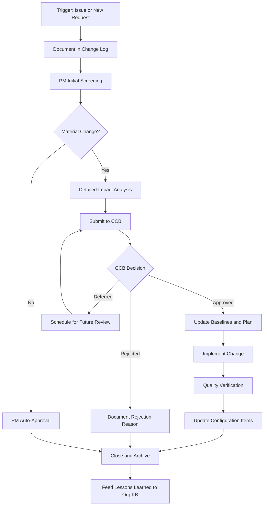
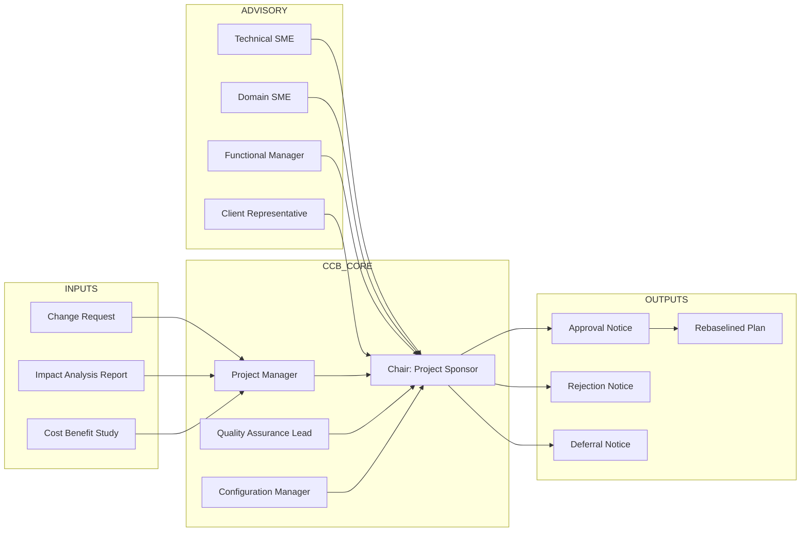
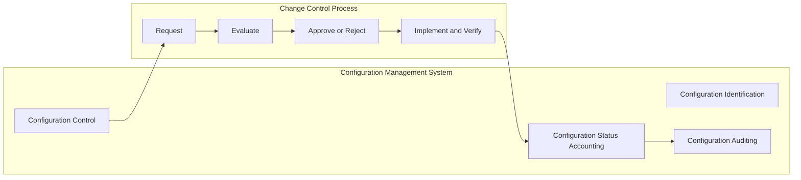

# Change Control

<!-- SECTION_1_START -->
# Change Control — Core Definition & Intuitive Overview

## Formal Definition (KTU 2024 Syllabus Terminology)

**Change Control** is the formal, systematic process through which all modifications to a project's approved baseline (scope, schedule, cost, quality, risk, or configuration items) are identified, evaluated, approved (or rejected), documented, and integrated into the project in a coordinated manner.

> [!IMPORTANT]
> **Per PMBOK \& ISO 9001:** Change Control is a Configuration Management activity that ensures project integrity is preserved by preventing unauthorized, uncoordinated, or undocumented changes from corrupting the original project baseline.

**Change Control System** — The set of procedures, tools, templates, governance bodies, and workflows used to manage and control change.

**Change Control Board (CCB)** — The formally chartered group responsible for reviewing, evaluating, approving, deferring, or rejecting change requests.

## Conceptual Analogy — The "House Renovation Permit"

Imagine you have bought a house and finalized a renovation plan with the contractor (this is your **approved project baseline**). Midway through, you suddenly want to:
- Move the kitchen to the opposite wall,
- Add a swimming pool, and
- Replace the roofing material.

You cannot simply ask workers to start doing this the next morning. Why? Because:
1. Each change has **cost implications** (the pool needs plumbing, electrical rewiring, permits).
2. Each change has **time implications** (delays in everything else).
3. Each change has **structural implications** (is the wall load-bearing?).
4. Each change has **legal implications** (city permits, safety codes).

So you must file a **Change Request**, the architect evaluates the impact, the engineer certifies feasibility, the city permits it, and *only then* does the contractor execute it. This entire governance chain is **Change Control** in the project world.

## Core Components of Change Control

| Component | Role in Change Control |
|---|---|
| **Baseline** | The approved starting point against which all changes are measured. |
| **Change Request (CR)** | The formal document proposing a modification. |
| **Impact Analysis** | A study of how the change affects scope, time, cost, quality, and risk. |
| **Change Control Board (CCB)** | The decision-making authority. |
| **Configuration Management** | The technical-administrative tracking of all deliverables and their versions. |
| **Change Log** | A chronological, auditable record of every change. |

## Why Change Control Exists — The Iron Triangle Reality

In every project, three constraints are bound together:

$$
\text{Scope} + \text{Schedule} + \text{Cost} = \text{Project Feasibility Envelope}
$$

Any change to one constraint **forces recalculation** of the other two. Change Control exists to:
- Force a **deliberate** trade-off decision rather than an accidental scope creep.
- Maintain **traceability and auditability** for stakeholders and regulators.
- Protect the project from **gold-plating** (adding features no one asked for).

> [!NOTE]
> **KTU 2024 Highlight:** In Module 4 *Execution, Control \& Procurement*, Change Control is treated as the **operational bridge** between project execution (where work happens) and project control (where performance is measured and corrected).

> [!VISUALIZATION CONTROL]
> **Concept:** The *Cost of Change Curve* across the Project Life Cycle.
> **Geometric / Graph Description:**
> * x-axis: Project Progress (Conception $\rightarrow$ Closure)
> * y-axis: Relative Cost to Implement a Change
> * Curve: Exponential rise — almost flat during early concept, but nearly vertical near project closure.
> **What students should observe:** A small white-sphere change near the end of the project produces a "rocket trajectory" cost, while the same change at initiation costs almost nothing.

<!-- SECTION_1_END -->

<!-- SECTION_2_START -->
# Deep Theoretical Analysis & KTU High-Yield Formula Sheet

## 1. The Change Control Process — Step-by-Step Logic

A change does not become a change simply because someone said so. It must travel through a **disciplined pipeline**:

1. **Identify the Need for Change** — Triggered by an issue, risk, stakeholder request, defect, or new requirement.
2. **Log the Change Request (CR)** — A formal document is created and entered in the **Change Log**.
3. **Initial Screening / Triage** — The Project Manager performs a *first-pass* assessment to filter frivolous or out-of-scope requests.
4. **Detailed Impact Analysis** — Cross-functional experts evaluate the change against the **Iron Triangle** (Scope, Time, Cost) and Quality, Risk, Resources, and Procurement.
5. **Submit to the Change Control Board (CCB)** — The CR is presented to the CCB with all impact documentation.
6. **CCB Decision** — The CCB selects one of four outcomes:
   * **Approve** (as-is or with conditions),
   * **Defer** (revisit at a later milestone),
   * **Reject** (with reason), or
   * **Request More Information**.
7. **Update Project Management Plan and Baselines** — If approved, the **scope statement, WBS, schedule, and budget** are rebaselined.
8. **Implement the Change** — The integrated change is executed, following configuration management procedures.
9. **Verify and Validate** — Quality assurance confirms the change meets specifications.
10. **Close and Archive** — The change is documented in the project archive for organizational learning.

> [!IMPORTANT]
> **KTU Examiner Tip:** Always write the process as a *closed loop*. Marks are reserved for explicitly stating that the lessons learned from each change feed back into the organization's *Configuration Management Knowledge Base*.

## 2. Change Control Board (CCB) — Composition and Authority

The CCB is **not** a single person. It is a formally chartered decision body.

| Typical Member | Role on the CCB |
|---|---|
| **Project Manager** | Presents the change and its analysis; non-voting chair in some setups. |
| **Project Sponsor** | Strategic and financial authority; voting member. |
| **Functional Managers** | Resource and technical feasibility input. |
| **Subject Matter Experts (SMEs)** | Domain-specific impact assessment. |
| **Quality Assurance Lead** | Validates quality and compliance impact. |
| **Configuration Manager** | Ensures version control and traceability. |
| **Customer / Client Representative** | Validates alignment with contract and requirements. |

> [!NOTE]
> **Authority Boundary:** A CCB cannot approve changes that violate the **project charter's high-level objectives** without escalation to the **Project Sponsor** or **Steering Committee**.

## 3. Types of Changes

| Type | Example | Affected Baseline Element |
|---|---|---|
| **Corrective Action** | Fixing a defective deliverable | Quality / Scope |
| **Preventive Action** | Removing a future risk cause | Risk / Schedule |
| **Defect Repair** | Bug fix in software module | Quality / Scope |
| **Scope Change** | Adding a new feature | Scope, Cost, Schedule |
| **Schedule Change** | Compressing a phase | Schedule, Cost, Risk |
| **Cost Change** | Switching to a cheaper vendor | Cost, Quality, Risk |
| **Administrative Change** | Updating a phone number on a form | Documentation only |

## 4. Configuration Management vs. Change Control

Students frequently confuse these two:

- **Configuration Management (CM)** is the *umbrella discipline* of identifying, controlling, and tracking project deliverables and their versions.
- **Change Control** is the *governance process* operating *within* Configuration Management that decides *whether* a change should be made.

In short:

$$
\text{Configuration Management} \supseteq \text{Change Control}
$$

## 5. Cost of Change Curve — The Mathematical Intuition

The **Cost of Change Curve** states that the cost to implement a change grows **non-linearly** as the project progresses. A simplified exponential model is often used for teaching:

$$
C(t) = C_0 \cdot e^{k \cdot t}
$$

Where:
* $C(t)$ = Cost to implement a change at time $t$ (measured in project progress, $0 \le t \le 1$)
* $C_0$ = Baseline cost of change at project initiation ($t = 0$)
* $k$ = Cost-escalation coefficient (depends on industry, $k > 0$)
* $t$ = Normalized project progress ($t = 0$ at start, $t = 1$ at closure)

### KTU Formula Sheet / Cheat Sheet

| Symbol / Term | Meaning | Typical Unit |
|---|---|---|
| $C(t)$ | Cost of change at progress $t$ | Currency units |
| $C_0$ | Initial cost of change | Currency units |
| $k$ | Cost-escalation coefficient | Dimensionless |
| $t$ | Normalized project progress | Fraction ($\vert 0, 1 \vert$) |
| $\text{CR Rate}$ | Number of CRs per unit time | Requests / week |
| $\text{CR Approval Rate}$ | $\frac{\text{Approved CRs}}{\text{Total CRs}} \times 100$ | Percent |
| $\text{Schedule Variance}$ | $\text{EV} - \text{PV}$ | Currency units |
| $\text{Cost Variance}$ | $\text{EV} - \text{AC}$ | Currency units |
| $\text{SPI}$ | $\frac{\text{EV}}{\text{PV}}$ | Ratio |
| $\text{CPI}$ | $\frac{\text{EV}}{\text{AC}}$ | Ratio |

> [!WARNING]
> When writing the Cost of Change formula on the answer sheet, **always** write the time domain $\vert 0, 1 \vert$ using the word "from zero to one" or use $\in [0,1]$ to avoid LaTeX/markdown conflicts.

## 6. Real-World Utility of Change Control

| Industry | Application of Change Control |
|---|---|
| **Software Engineering** | Managing feature requests, bug fixes, and version releases using Git-based workflows and JIRA. |
| **Construction** | Variations / Site Instruction processes in FIDIC contracts. |
| **Aerospace \& Defense** | Engineering Change Proposals (ECPs) under AS9100 / CMMI-DEV. |
| **Pharmaceuticals** | Change control on validated processes under FDA 21 CFR Part 11. |
| **IT Service Management** | ITIL Change Management — Standard, Normal, and Emergency changes. |
| **Manufacturing** | Engineering Change Orders (ECOs) for BOM modifications. |

> [!IMPORTANT]
> **KTU Context:** In a student's B.Tech project (Final Year), Change Control is the difference between a project that gets **full marks** and one that gets marked down for "uncontrolled scope expansion". Use a simple Change Log table with columns: *CR ID, Date, Description, Impact, Decision, Approved By*.

<!-- SECTION_2_END -->

<!-- SECTION_3_START -->
# Step-by-Step Derivations, Process Models & Implementation

## A. Derivation — Cost of Change Growth

We will derive how a change's cost evolves across a project, starting from the assumption of exponential growth.

### Step 1 — Statement of the Law

The fundamental engineering observation is:

> *"The longer a defect, error, or requirement change remains undetected in a project, the more expensive it becomes to fix."*

This is sometimes called **Boehm's Curve** or the **1:10:100 Rule** in software engineering:
- Fix at requirements stage: cost = 1 unit
- Fix at design stage: cost = 10 units
- Fix at post-deployment stage: cost = 100 units

### Step 2 — Mathematical Formalization

We model the cost as an exponential function of normalized time $t$:

$$
C(t) = C_0 \cdot e^{k \cdot t}
$$

### Step 3 — Boundary Condition

At project initiation ($t = 0$), the cost equals the baseline cost $C_0$. Verification:

$$
C(0) = C_0 \cdot e^{k \cdot 0} = C_0 \cdot e^{0} = C_0 \cdot 1 = C_0
$$

Therefore, the boundary condition is satisfied.

### Step 4 — End-of-Project Multiplier

At project closure ($t = 1$), the cost is:

$$
C(1) = C_0 \cdot e^{k \cdot 1} = C_0 \cdot e^{k}
$$

The **cost multiplier** at the end of the project relative to initiation is:

$$
\text{Multiplier} = \frac{C(1)}{C(0)} = \frac{C_0 \cdot e^{k}}{C_0} = e^{k}
$$

### Step 5 — Worked Numerical Example

Suppose a project has $C_0 = \text{INR } 5{,}000$ and the industry $k = 2.5$. Compute the cost at the midpoint ($t = 0.5$) and at closure ($t = 1.0$).

At $t = 0.5$:

$$
C(0.5) = 5000 \cdot e^{2.5 \cdot 0.5} = 5000 \cdot e^{1.25}
$$

Since $e^{1.25} \approx 3.4903$:

$$
C(0.5) \approx 5000 \cdot 3.4903 = \text{INR } 17{,}451.50
$$

At $t = 1.0$:

$$
C(1.0) = 5000 \cdot e^{2.5 \cdot 1.0} = 5000 \cdot e^{2.5}
$$

Since $e^{2.5} \approx 12.1825$:

$$
C(1.0) \approx 5000 \cdot 12.1825 = \text{INR } 60{,}912.50
$$

**Conclusion:** A change that costs **INR 5,000** at initiation costs **INR 60,912.50** at closure — a **12.18x** inflation. This is the *quantitative proof* that Change Control must be **front-loaded**.

### Step 6 — Worked Example for Change Approval Rate (CAR)

Suppose a project received **40 Change Requests** in a quarter. Of these, **28** were approved, **7** were rejected, **3** were deferred, and **2** were withdrawn. Calculate the **Change Approval Rate**.

$$
\text{CAR} = \frac{\text{Number of Approved CRs}}{\text{Total CRs Received}} \times 100
$$

$$
\text{CAR} = \frac{28}{40} \times 100 = 70\%
$$

If the **Target Approval Rate** is between **60\% and 80\%**, then the project is in a healthy state. If CAR exceeds **85\%**, it indicates **scope creep**; if it falls below **40\%**, it indicates a **rigid change process** that is not listening to stakeholders.

## B. Symbolic Implementation — Change Log Template (Python Pseudo-Model)

Below is an operational Python structure that mimics a *digital change log*. The intent is to show the data fields a real change-tracking system would maintain.

```python
from dataclasses import dataclass, field
from datetime import datetime
from enum import Enum
from typing import Optional

class ChangeStatus(Enum):
    SUBMITTED = "Submitted"
    UNDER_REVIEW = "Under Review"
    APPROVED = "Approved"
    REJECTED = "Rejected"
    DEFERRED = "Deferred"
    WITHDRAWN = "Withdrawn"
    IMPLEMENTED = "Implemented"
    CLOSED = "Closed"

class ChangePriority(Enum):
    LOW = "Low"
    MEDIUM = "Medium"
    HIGH = "High"
    CRITICAL = "Critical"

class ChangeImpact:
    """Quantitative impact on the Iron Triangle."""
    def __init__(self,
                 scope_impact: float = 0.0,
                 cost_impact: float = 0.0,
                 schedule_impact_days: int = 0,
                 quality_impact: str = "Neutral",
                 risk_impact: str = "Neutral") -> None:
        self.scope_impact = scope_impact
        self.cost_impact = cost_impact
        self.schedule_impact_days = schedule_impact_days
        self.quality_impact = quality_impact
        self.risk_impact = risk_impact

    def is_material(self, cost_threshold: float = 10000,
                    schedule_threshold: int = 5) -> bool:
        """A change is material if it crosses a financial or schedule threshold."""
        if abs(self.cost_impact) >= cost_threshold:
            return True
        if abs(self.schedule_impact_days) >= schedule_threshold:
            return True
        return False

@dataclass
class ChangeRequest:
    cr_id: str
    title: str
    description: str
    requester: str
    submission_date: datetime
    priority: ChangePriority
    impact: ChangeImpact
    status: ChangeStatus = ChangeStatus.SUBMITTED
    ccb_decision_date: Optional[datetime] = None
    ccb_approver: Optional[str] = None
    rejection_reason: Optional[str] = None
    lessons_learned: Optional[str] = None

    def submit_to_ccb(self) -> None:
        if not self.impact.is_material():
            self.status = ChangeStatus.APPROVED
            self.ccb_approver = "Project Manager (Auto-Approved)"
        else:
            self.status = ChangeStatus.UNDER_REVIEW

    def approve(self, approver: str, decision_date: datetime) -> None:
        self.status = ChangeStatus.APPROVED
        self.ccb_approver = approver
        self.ccb_decision_date = decision_date

    def reject(self, approver: str, decision_date: datetime,
               reason: str) -> None:
        self.status = ChangeStatus.REJECTED
        self.ccb_approver = approver
        self.ccb_decision_date = decision_date
        self.rejection_reason = reason

    def close(self, lessons: str) -> None:
        if self.status != ChangeStatus.APPROVED:
            raise ValueError("Only approved changes can be closed.")
        self.status = ChangeStatus.CLOSED
        self.lessons_learned = lessons
```

## C. Implementation Walkthrough

1. A stakeholder files a `ChangeRequest` titled "Add two-factor authentication".
2. The PM fills in the `ChangeImpact` object:
   * `scope_impact = +1 feature`,
   * `cost_impact = +INR 80,000`,
   * `schedule_impact_days = +7 days`.
3. The `is_material()` check returns `True` (cost $\geq 10{,}000$), so the request enters `UNDER_REVIEW`.
4. The CCB reviews and either calls `approve()` or `reject()`.
5. Upon successful implementation, the PM calls `close()` with lessons learned appended to the **organizational knowledge base**.

<!-- SECTION_3_END -->

<!-- SECTION_4_START -->
# Structural Diagrams & Schematics

## Diagram 1 — End-to-End Change Control Workflow



## Diagram 2 — Change Control Board (CCB) Functional Architecture



## Diagram 3 — Configuration Management vs Change Control



## Diagram 4 — Change Categorization Matrix

| Decision Speed | Impact Size | Change Type | Approval Path |
|---|---|---|---|
| Emergency | High | **Emergency Change** | Fast-track CCB, Sponsor + PM |
| Expedited | Medium | **Normal Change** | Standard CCB review |
| Routine | Low | **Standard Change** | Pre-authorized, PM only |
| Strategic | Very High | **Major Scope Change** | Steering Committee + Sponsor |

> [!NOTE]
> **KTU Visual Tip:** When asked to *draw* a Change Control process in the exam, always use **rectangles for processes**, **diamonds for decision points**, and **arrows for flow direction**. Mark a *feedback loop* from "Lessons Learned" back to "Project Knowledge Base" to earn full conceptual marks.

<!-- SECTION_4_END -->

<!-- SECTION_5_START -->
# KTU 2024 Scheme Examination Question Bank & Topic Recap

## Part A — Short Answer Questions (3 Marks Each)

### Question 1 `[KTU University Exam – Dec 2023]` — CO1, Remember
**Define Change Control and list its four main objectives.**

**Model Answer (3 Marks):**
Change Control is the formal process through which all modifications to a project's approved baseline are identified, evaluated, approved, documented, and integrated in a coordinated manner.
**[Definition: 2 Marks]**
Its four main objectives are:
1. Ensure that changes are introduced in a controlled and systematic way.
2. Protect the integrity of the approved project baselines (scope, schedule, cost, quality).
3. Maintain traceability and auditability of every change decision.
4. Balance stakeholder needs with the project's feasibility envelope.
**[Four objectives listed: 1 Mark]**

---

### Question 2 `[KTU University Exam – July 2024]` — CO2, Understand
**Differentiate between Configuration Management and Change Control.**

**Model Answer (3 Marks):**
Configuration Management is the broader discipline that identifies, controls, tracks, and audits project deliverables and their versions across the entire life cycle. **[1 Mark]**
Change Control is a sub-process *within* Configuration Management. It focuses on the *decision-making workflow* for whether a requested modification should be accepted, deferred, or rejected. **[1 Mark]**
In short, Configuration Management tracks *what exists* in the project, whereas Change Control governs *what may be added, removed, or modified*. **[1 Mark]**

---

## Part B — Long Answer Questions (14 Marks Each) — Internal Choice

### Question A `[KTU University Exam – Dec 2023]` — CO2 / CO3, Apply + Analyze

**(a)** Explain the **Change Control Process** in detail with a suitable diagram. State the role of each member of the Change Control Board. **[7 Marks]**

**(b)** A software project has a baseline cost of change $C_0 = \text{INR } 8{,}000$ at initiation. The cost-escalation coefficient for the project is $k = 2.2$. Compute the cost of implementing the same change at the **midpoint** of the project and at **project closure**. Comment on the implications for Change Control. **[7 Marks]**

---

**Solution for (a) — 7 Marks:**

1. *Definition of Change Control Process and its purpose:* **[1 Mark]**
2. *Step-by-step flow — Identify $\rightarrow$ Log $\rightarrow$ Screen $\rightarrow$ Impact Analysis $\rightarrow$ CCB Review $\rightarrow$ Approve/Reject/Defer $\rightarrow$ Rebaseline $\rightarrow$ Implement $\rightarrow$ Verify $\rightarrow$ Archive:* **[3 Marks]**
3. *Neat flow diagram with decision diamonds and feedback loop:* **[2 Marks]**
4. *CCB Members and roles (Sponsor, PM, QA Lead, Config Manager, Functional Managers, SMEs, Client Rep):* **[1 Mark]**

**Sample Diagram the Examiner Expects (as text):**

> Identify Need $\rightarrow$ Log CR $\rightarrow$ PM Triage $\rightarrow$ Impact Analysis $\rightarrow$ Submit to CCB $\rightarrow$ Decision (Approve/Reject/Defer) $\rightarrow$ Rebaseline $\rightarrow$ Implement $\rightarrow$ Verify $\rightarrow$ Archive $\rightarrow$ Lessons Learned back to Organizational Knowledge Base.

**[Process flow stated: 2 Marks]**
**[Decision point shown: 1 Mark]**
**[Feedback loop drawn: 1 Mark]**
**[CCB composition listed: 1 Mark]**
**[Closing statement on coordination and audit: 1 Mark]**

---

**Solution for (b) — 7 Marks:**

We are given:
- $C_0 = 8000$
- $k = 2.2$

**Step 1 — Write the formula:** **[1 Mark]**

$$
C(t) = C_0 \cdot e^{k \cdot t}
$$

**Step 2 — Compute at $t = 0.5$:** **[2 Marks]**

$$
C(0.5) = 8000 \cdot e^{2.2 \cdot 0.5} = 8000 \cdot e^{1.1}
$$

Since $e^{1.1} \approx 3.0042$:

$$
C(0.5) \approx 8000 \cdot 3.0042 \approx \text{INR } 24{,}033.60
$$

**Step 3 — Compute at $t = 1.0$:** **[2 Marks]**

$$
C(1.0) = 8000 \cdot e^{2.2 \cdot 1.0} = 8000 \cdot e^{2.2}
$$

Since $e^{2.2} \approx 9.0250$:

$$
C(1.0) \approx 8000 \cdot 9.0250 \approx \text{INR } 72{,}200.00
$$

**Step 4 — Compute the multiplier:** **[1 Mark]**

$$
\text{Multiplier} = \frac{C(1.0)}{C(0)} = \frac{72200}{8000} \approx 9.025
$$

**Step 5 — Implication comment (1 Mark):**
A change that costs INR 8,000 at initiation balloons to over INR 72,200 at closure — a **9x cost inflation**. This proves that Change Control must be **front-loaded**, with strict early-stage scope freeze, so that the project avoids catastrophic late-stage rework.

**[Final simplified expression: 1 Mark]**

---

### Question B `[KTU University Exam – July 2024]` — CO3, Apply + Evaluate

**(a)** Discuss the **types of changes** that may occur in a project. Provide one engineering example for each type. **[7 Marks]**

**(b)** A project receives **50 Change Requests** in a quarter. **35** are approved, **8** are rejected, **4** are deferred, and **3** are withdrawn. Calculate the **Change Approval Rate**. If the target approval rate is between **60\% and 80\%**, evaluate whether the project is in a *healthy*, *scope-creep*, or *rigid* state. **[7 Marks]**

---

**Solution for (a) — 7 Marks:**

| Change Type | Definition | Engineering Example | Marks |
|---|---|---|---|
| **Corrective Action** | Fix a defect to bring performance to baseline | Repairing a cracked beam in a bridge | 1 |
| **Preventive Action** | Eliminate the cause of a potential non-conformity | Reinforcing a substation before monsoon | 1 |
| **Defect Repair** | Correct a discovered product defect | Patching a security vulnerability in firmware | 1 |
| **Scope Change** | Add, remove, or modify project scope | Adding solar panels to a building design | 1 |
| **Schedule Change** | Compress or extend the timeline | Using fast-tracking on construction phases | 1 |
| **Cost Change** | Modify the approved budget | Switching to a cheaper supplier for raw materials | 1 |
| **Administrative Change** | Update non-technical documentation | Changing the project manager's contact details | 0.5 |
| **Conclusion statement on the need for Change Control** | — | — | 0.5 |

**[Seven types listed with examples: 6 Marks]**
**[Closing remark: 1 Mark]**

---

**Solution for (b) — 7 Marks:**

**Step 1 — State the formula:** **[1 Mark]**

$$
\text{CAR} = \frac{\text{Approved CRs}}{\text{Total CRs Received}} \times 100
$$

**Step 2 — Substitute values:** **[1 Mark]**

$$
\text{CAR} = \frac{35}{50} \times 100
$$

**Step 3 — Compute the value:** **[1 Mark]**

$$
\text{CAR} = 70\%
$$

**Step 4 — Compare with the target band [60\%, 80\%]:** **[2 Marks]**
Since **70\%** lies *within* the 60\%–80\% band, the result is **healthy**.

**Step 5 — Provide reasoning:** **[1 Mark]**
A healthy approval rate indicates that the Change Control Board is *listening* to stakeholders but is also *discriminating* against unjustified scope expansions.

**Step 6 — One-sentence conclusion with managerial implication:** **[1 Mark]**
The project should *continue* with its current Change Control discipline and ensure lessons learned are documented for the next phase.

**[Final numerical value: 1 Mark]**
**[Interpretation linked to theory: 1 Mark]**

---

> [!WARNING]
> **KTU Examiner's Valuation Pitfall Callout**
> 1. **Do not skip the formula statement** in numerical questions — even if the calculation is correct, you lose **1 mark** for not writing the governing equation.
> 2. **Do not use unlabelled diagrams** — every diamond and rectangle in your Change Control flowchart must have a clear, short English label.
> 3. **Do not confuse "Configuration Management" with "Change Control"** — CM is the *umbrella*; CCB is *inside* it.
> 4. **Do not write $t \in \vert 0, 1 \vert$ in plain text** in your answer sheet — write "where t is the normalized project progress ranging from 0 to 1" to avoid formatting issues.
> 5. **Always include the feedback loop** from "Lessons Learned" back to the "Organizational Process Assets" in the diagram — this single addition can fetch you **1 to 2 extra marks**.

---

## Topic Recap & Important Things to Remember

- **Change Control** is the formal, auditable process of managing modifications to project baselines.
- **Iron Triangle** = Scope + Schedule + Cost; any change forces a trade-off recalculation.
- **Change Control Board (CCB)** = the decision-making body comprising Sponsor, PM, QA, Config Manager, Functional Managers, SMEs, and Client Rep.
- **Change Request (CR)** = the formal proposal document; must include *description, impact, justification, and priority*.
- **Four CCB Decisions** = Approve, Reject, Defer, or Request More Information.
- **Types of Changes** = Corrective, Preventive, Defect Repair, Scope, Schedule, Cost, Administrative.
- **Configuration Management** is broader than Change Control; CCB operates *within* it.
- **Cost of Change Curve** = exponential growth; formula $C(t) = C_0 \cdot e^{k \cdot t}$.
- **Boehm's 1:10:100 Rule** = cost of fixing a defect at requirements vs design vs deployment.
- **Change Approval Rate (CAR)** = $\frac{\text{Approved CRs}}{\text{Total CRs}} \times 100$; healthy band is 60\%–80\%.
- **Standard / Normal / Emergency Changes** correspond to ITIL's three-tier change classification.
- **Audit Trail** = a chronological log of every change request, decision, approver, date, and outcome.
- **Lessons Learned** must always loop back into the *Organizational Process Assets* / *Configuration Management Knowledge Base*.
- **Always draw a feedback loop** in your exam diagram — examiners reward it explicitly.
- **Real-world anchors** = JIRA CRs, Git pull requests, FIDIC Site Instructions, FDA 21 CFR Part 11, AS9100 ECPs.
- **One-liner for viva:** *"Change Control is not about preventing change; it is about making change deliberate, documented, and defensible."*

<!-- SECTION_5_END -->
