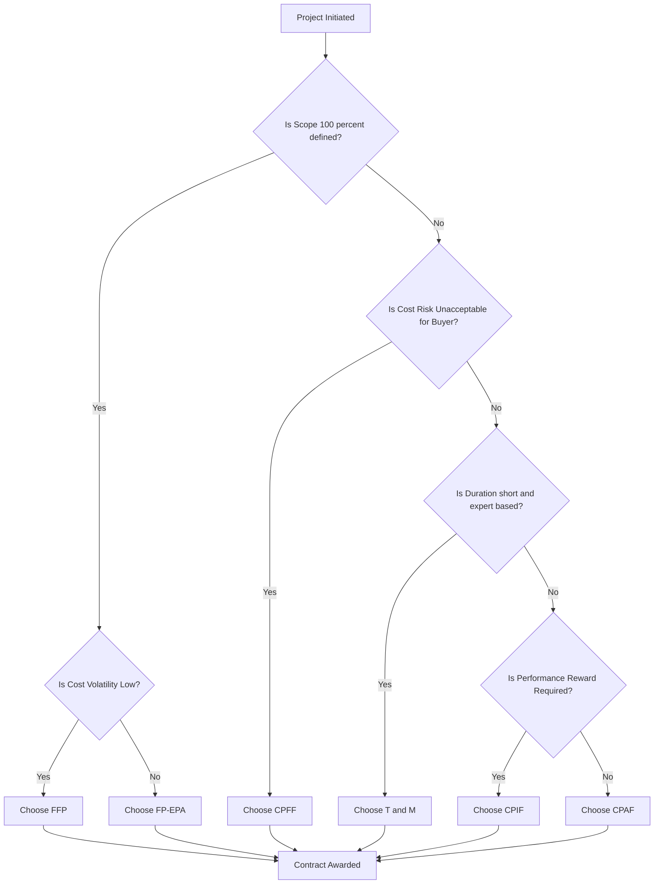
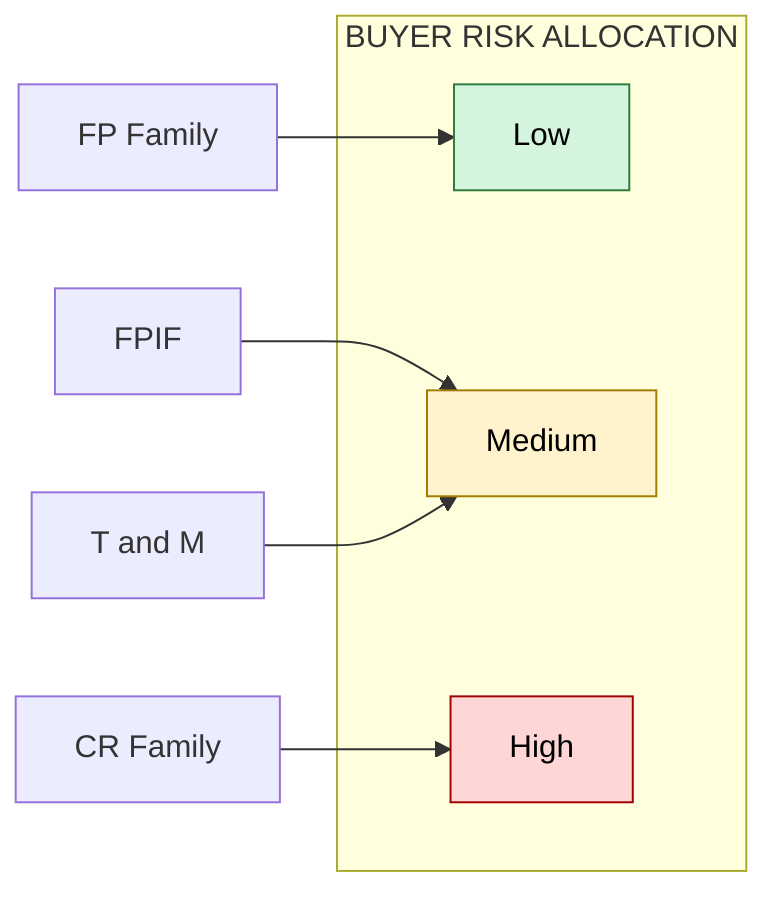
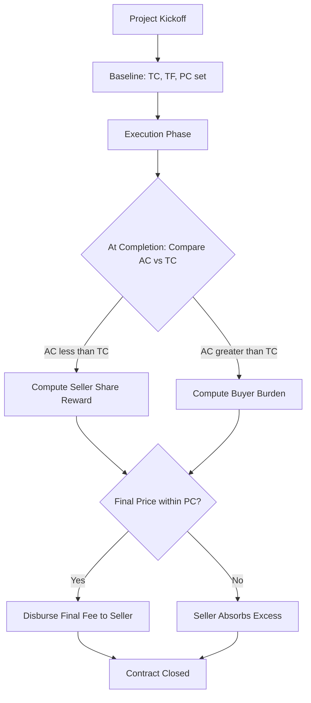

# Contract Types

<!-- SECTION_1_START -->
# Contract Types in Project Lifecycle Management

## 1.1 Core Technical Definition

> [!IMPORTANT]
> **Contract Type (KTU / PMBOK Terminology):** A *contract type* is the **legal-financial instrument** that defines the **payment structure**, **risk allocation**, and **scope of obligations** between a **Buyer (Procuring Entity)** and a **Seller (Contractor / Vendor)** for the delivery of goods, services, or engineering works within a project.

Under the **KTU 2024 Scheme (UEHUT704 – Project Lifecycle Management)**, Module 4 demands that future engineers understand *procurement contracts* not merely as legal documents, but as **strategic risk-distribution tools** that directly influence project cost, schedule, and quality outcomes.

The **Project Management Institute (PMI / PMBOK Guide, 7th Edition)** classifies procurement contracts into **three master families** and several **hybrid sub-types**:

| # | Master Family | Risk Bearer | Nature of Price |
|---|---------------|-------------|-----------------|
| 1 | **Fixed-Price (FP)** | Seller | Pre-determined lump sum |
| 2 | **Cost-Reimbursable (CR)** | Buyer | Reimbursement of actual costs + fee |
| 3 | **Time & Materials (T&M)** | Shared | Hourly rate × units consumed |

---

## 1.2 Intuitive Analogy

> [!NOTE]
> **Real-World Analogy — "The Catering Contract"**
>
> Imagine you are hosting a college symposium and you hire a caterer:
>
> * **Fixed-Price Contract** → *"I will pay you ₹1,00,000 for 200 meals, no matter what."* The caterer absorbs any cost spike (e.g., gas cylinder price hike).
> * **Cost-Reimbursable Contract** → *"Pay for the actual ingredients + a fixed ₹15,000 profit."* You bear the cost risk.
> * **Time & Materials Contract** → *"Pay ₹200 per plate consumed + ₹500 per chef-hour."* Both share the risk of overconsumption.
>
> Just as you choose a catering model based on how *clear* the menu is and how *stable* the prices are, a project manager selects a contract type based on **scope clarity** and **cost volatility**.

### 1.3 Visualization Control

> [!VISUALIZATION CONTROL]
> **Concept:** Risk Allocation Spectrum Across Contract Types
>
> **Desmos Input Equations (X = Contract Type, Y = Risk to Buyer %):**
> * `FP: y = 20` (Buyer risk low, flat)
> * `FPIF: y = 30 + 5 \cdot \sin(x)` (oscillating)
> * `CR: y = 80` (Buyer risk high, flat)
> * `TandM: y = 50` (mid-line)
>
> **Visual Description:** The student should observe a horizontal line-cluster where **FP family** sits low on the y-axis (low buyer risk) and **CR family** sits high; **T&M** straddles the middle, and **incentive-based** contracts (FPIF, CPIF) show a *symmetric oscillation* around the 50% midline.

---

## 1.4 Why Contract Types Matter in Engineering Projects

> [!IMPORTANT]
> A wrong contract type can **bankrupt a vendor** (under fixed-price with volatile raw materials) or **bankrupt the buyer** (under cost-plus with no scope ceiling). The PMBOK notes that **> 60% of project disputes** in engineering megaprojects (construction, EPC, IT systems) trace back to *mismatched contract type and risk profile*.
<!-- SECTION_1_END -->

<!-- SECTION_2_START -->
# 2. Deep Theoretical Analysis & KTU High-Yield Formula Sheet

## 2.1 The Three Master Families — Conceptual Decomposition

### 2.1.1 Fixed-Price (FP) Family

The seller agrees to deliver the specified scope at a **pre-agreed lump-sum price**. Any cost overrun is the seller's loss; any saving is the seller's gain.

**Sub-Types:**

1. **Firm Fixed Price (FFP / FFP):** Price is locked; no adjustment clause. Used when scope is **100% defined** and market is stable.
2. **Fixed Price Incentive Fee (FPIF):** Price has a *target cost*, a *target fee*, a *price ceiling*, and a *sharing ratio*. Overruns and savings are shared.
3. **Fixed Price with Economic Price Adjustment (FP-EPA):** Price is adjustable for inflation, forex, or commodity shocks. Used for **long-duration (> 1 year)** contracts.
4. **Fixed Price Award Fee (FPAF):** Subjective performance fee awarded by buyer.

### 2.1.2 Cost-Reimbursable (CR) Family

The seller is **reimbursed for all legitimate actual costs** plus a **fee** (profit component). Used when scope is **not yet fully defined** (e.g., R&D, consulting, complex engineering design).

**Sub-Types:**

1. **Cost Plus Fixed Fee (CPFF):** Fee is fixed irrespective of cost outcome.
2. **Cost Plus Incentive Fee (CPIF):** Fee varies with cost performance using a sharing formula.
3. **Cost Plus Award Fee (CPAF):** Fee is partly fixed, partly awarded subjectively.

### 2.1.3 Time & Materials (T&M)

Hybrid contract. Buyer pays a **rate per labour-hour** (e.g., ₹2,000 per engineer-hour) plus **direct material cost at invoice**. Used for **short-duration, expert services** (e.g., hiring a structural consultant for 2 weeks) or as a **backstop / framework** when scope is unclear.

---

## 2.2 Risk Allocation Matrix

| Contract Type | Buyer's Risk | Seller's Risk | Scope Clarity Required | Typical Duration |
|---------------|--------------|---------------|------------------------|------------------|
| FFP | **Low** | **High** | Very High | Short–Medium |
| FPIF | Low–Medium | Medium | High | Medium–Long |
| FP-EPA | Low–Medium | Medium | High | Long |
| CPFF | **High** | **Low** | Low | Medium |
| CPIF | Medium | Medium | Medium | Medium |
| CPAF | Medium | Low | Low | Medium |
| T&M | Medium | Medium | Low | Short |

---

## 2.3 KTU High-Yield Formula Sheet

> [!IMPORTANT]
> All formulas use **acronyms** standardized in PMBOK and KTU evaluation keys. Remember to **state the boundary conditions** explicitly in your exam answer to secure full marks.

| # | Formula Name | Mathematical Expression | Boundary / Notes |
|---|--------------|--------------------------|------------------|
| 1 | **FPIF — Final Fee (Under Target)** | $F_f = T_F + (T_C - A_C) \cdot s$ | Valid when $A_C \le T_C$ |
| 2 | **FPIF — Final Fee (Over Target)** | $F_f = T_F - (A_C - T_C) \cdot b$ | Valid when $A_C > T_C$ |
| 3 | **FPIF — Final Price** | $P_f = A_C + F_f$ | Subject to ceiling |
| 4 | **FPIF — Price Ceiling Cap** | $P_f \le P_C$ | If exceeded, seller absorbs excess |
| 5 | **CPIF — Final Fee (Under Target)** | $F_f = T_F + (T_C - A_C) \cdot s$ | Same structure as FPIF |
| 6 | **CPIF — Final Fee (Over Target)** | $F_f = T_F - (A_C - T_C) \cdot b$ | $s + b = 1$ (sharing ratio) |
| 7 | **CPIF — Final Price** | $P_f = A_C + F_f$ | **No ceiling in CPIF** |
| 8 | **CPFF — Final Fee** | $F_f = T_F$ | Constant |
| 9 | **CPFF — Final Price** | $P_f = A_C + T_F$ | Seller has zero cost risk |
| 10 | **T&M — Total Cost** | $C_{TM} = (r \cdot H) + M$ | $r$ = rate, $H$ = hours, $M$ = material cost |
| 11 | **T&M — Ceiling Override** | $C_{TM} \le C_{max}$ | Buyer typically sets a not-to-exceed value |
| 12 | **Total Cost Variance (Incentive)** | $CV = T_C - A_C$ | Positive ⇒ savings; Negative ⇒ overrun |

**Where:**
* $F_f$ = Final Fee earned by seller
* $T_F$ = Target Fee
* $T_C$ = Target Cost
* $A_C$ = Actual Cost incurred
* $s$ = Seller's share ratio (of savings or underrun)
* $b$ = Buyer's share ratio (of overrun)
* $P_C$ = Price Ceiling
* $P_f$ = Final Price payable

---

## 2.4 Real-World Engineering Utility

> [!NOTE]
> **Where these contracts are deployed in industry:**
>
> * **EPC Power Projects (Adani, NTPC, BHEL):** Mostly **Lump Sum Turnkey (LSTK)** — a variant of FFP, where the EPC contractor delivers a commissioned plant at a fixed price.
> * **IT Software Services (TCS, Infosys):** Time & Materials contracts dominate for **staff augmentation** and **maintenance**; Fixed-Bid for defined product builds.
> * **Defense Procurement (DPSU, MoD India):** Cost-Plus contracts for indigenous R&D where cost cannot be predicted.
> * **Construction (L&T, Tata Projects):** FPIF and FP-EPA dominate for **infrastructure** with commodity-linked escalation clauses.

Understanding contract type is therefore a **boardroom-level skill**, not merely a textbook chapter.
<!-- SECTION_2_END -->

<!-- SECTION_3_START -->
# 3. Step-by-Step Derivations, Worked Problems & Case-Based Analysis

> [!NOTE]
> **Humanities / Management Track Note (per KTU-PREMIER-ENGINE V10 Domain-Adaptive Matrix):** This section uses an **extensive tabular comparative analysis** mapping real-world engineering cases to contract-type decision frameworks, supplemented by **fully solved numerical problems** and **worked derivations**.

---

## 3.1 Exhaustive Comparative Analysis — Real Engineering Cases to Contract Types

| Real-World Engineering Case | Context & Risk Profile | Recommended Contract Type | Justification (Why this type?) |
|------------------------------|------------------------|---------------------------|--------------------------------|
| **Cochin International Airport Terminal-3 Expansion (L&T)** | Scope fully designed, blueprints frozen, 24-month duration | **Firm Fixed Price (FFP)** | Scope is precise; seller must quote a guaranteed price; buyer wants cost certainty. |
| **ISRO Gaganyaan Human-Rated Launch Vehicle Development** | Scope evolving, R&D-heavy, technical risk unknown | **Cost Plus Incentive Fee (CPIF)** | Buyer (ISRO) bears cost risk but rewards the seller (vendor consortium) for beating cost targets. |
| **Smart City Mission — Pune Mobility Audit (1 month consulting)** | Short duration, expert inputs, undefined exact deliverables | **Time & Materials (T&M)** | Buyer pays for consultant-hours used; ideal when scope is fluid. |
| **National Highway Authority — 4-Lane Expressway (Tata Projects)** | Long duration (3 yrs), steel/cement price volatile | **Fixed Price with Economic Price Adjustment (FP-EPA)** | Lock base price, but adjust for commodity index shifts. |
| **Defence Aircraft Engine R&D (HAL + GE Joint Venture)** | R&D, undefined cost outcome, performance-driven | **Cost Plus Award Fee (CPAF)** | Buyer reimburses cost + gives performance-linked award. |
| **Software Product Build for a Bank (e.g., Finacle customization, Infosys)** | Well-defined SRS, 6-month project, fixed requirement | **Fixed Price Incentive Fee (FPIF)** | Clear scope + shared risk for any feature creep. |
| **Maintenance Contract for HVAC in a 50-floor IT Park (Voltas)** | Recurring, scope of breakdowns unknown | **Time & Materials (T&M) with Not-to-Exceed cap** | Buyer pays per service-hour; cap prevents runaway costs. |
| **Construction of Mumbai Coastal Road (Package-IV)** | Mostly defined, but tunnelling risk uncertain | **FPIF with high Price Ceiling** | Sharing of tunnelling surprises between buyer (BMC) and seller. |
| **Pilot Project for Hydrogen Fuel Cells (NTPC R&D)** | Experimental, no defined cost | **CPFF** | Full cost reimbursement; no fee variation. |
| **Annual Rate Contract for Supply of Lab Chemicals to NIT** | Continuous, defined unit rate | **Unit Price Contract** | Price fixed per unit; total varies with consumption. |

---

## 3.2 Worked Numerical Problem — FPIF Contract (Full Derivation)

> [!IMPORTANT]
> **Problem Statement (14-Mark Style):**
>
> A Government Department awards an **FPIF contract** with the following parameters:
> * **Target Cost** $T_C = \text{₹}10{,}00{,}000$
> * **Target Fee** $T_F = \text{₹}1{,}00{,}000$
> * **Price Ceiling** $P_C = \text{₹}12{,}00{,}000$
> * **Sharing Ratio:** Seller $s = 60\%$, Buyer $b = 40\%$
> * **Actual Cost** $A_C = \text{₹}9{,}00{,}000$
>
> **Determine:** (a) the Final Fee earned by the seller, (b) the Final Price payable, (c) verify ceiling compliance.

### Step 1 — Identify Regime

$A_C = 9{,}00{,}000$ and $T_C = 10{,}00{,}000$.

$$A_C < T_C \quad \Rightarrow \quad \text{UNDER-TARGET regime (savings zone)}$$

### Step 2 — Compute Cost Savings

$$\text{Savings} = T_C - A_C = 10{,}00{,}000 - 9{,}00{,}000 = \text{₹}1{,}00{,}000$$

### Step 3 — Apply FPIF Under-Target Formula

$$F_f = T_F + (T_C - A_C) \cdot s$$

Substituting values:

$$F_f = 1{,}00{,}000 + (1{,}00{,}000) \cdot 0.60$$

$$F_f = 1{,}00{,}000 + 60{,}000 = \text{₹}1{,}60{,}000$$

### Step 4 — Compute Final Price

$$P_f = A_C + F_f$$

$$P_f = 9{,}00{,}000 + 1{,}60{,}000 = \text{₹}10{,}60{,}000$$

### Step 5 — Ceiling Compliance Check

$$P_f = 10{,}60{,}000 \le P_C = 12{,}00{,}000 \quad \checkmark \text{ (Compliant)}$$

### Step 6 — Interpretation

The seller, by coming in **₹1,00,000 under budget**, earns an **incentive reward of ₹60,000** (60% of the savings), so total fee becomes **₹1,60,000** instead of the targeted ₹1,00,000. The buyer's net savings = (₹10,00,000 − ₹10,60,000) = buyer pays only ₹60,000 more than target cost — a saving of ₹40,000 (40% share of underrun).

> [!IMPORTANT]
> **Examiner's Step-Marking Guide:**
> * [Stating boundary condition $A_C < T_C$: 2 Marks]
> * [Correct formula selection: 2 Marks]
> * [Substitution and arithmetic: 2 Marks]
> * [Final Fee value: 1 Mark]
> * [Final Price value: 1 Mark]
> * [Ceiling compliance verification: 1 Mark]
> * [Interpretation of buyer/seller benefit: 1 Mark] *(Total: 10 Marks; remaining 4 for narrative & presentation)*

---

## 3.3 Worked Numerical Problem — FPIF Overrun + Ceiling Breach

> [!NOTE]
> **Problem:** Same parameters, but $A_C = \text{₹}12{,}50{,}000$.

### Step 1 — Identify Regime

$$A_C = 12{,}50{,}000 > T_C = 10{,}00{,}000 \quad \Rightarrow \quad \text{OVER-TARGET regime (overrun zone)}$$

### Step 2 — Compute Overrun

$$\text{Overrun} = A_C - T_C = 12{,}50{,}000 - 10{,}00{,}000 = \text{₹}2{,}50{,}000$$

### Step 3 — Apply FPIF Over-Target Formula

$$F_f = T_F - (A_C - T_C) \cdot b$$

$$F_f = 1{,}00{,}000 - (2{,}50{,}000) \cdot 0.40$$

$$F_f = 1{,}00{,}000 - 1{,}00{,}000 = \text{₹}0$$

### Step 4 — Compute Uncapped Final Price

$$P_f^{\text{uncapped}} = A_C + F_f = 12{,}50{,}000 + 0 = \text{₹}12{,}50{,}000$$

### Step 5 — Apply Price Ceiling

Since $P_f^{\text{uncapped}} = 12{,}50{,}000 > P_C = 12{,}00{,}000$, the ceiling is breached.

$$P_f^{\text{actual}} = P_C = \text{₹}12{,}00{,}000$$

### Step 6 — Seller's Absorption

$$\text{Absorption} = A_C - P_f^{\text{actual}} = 12{,}50{,}000 - 12{,}00{,}000 = \text{₹}50{,}000$$

**Interpretation:** The seller **absorbs ₹50,000** out of pocket. The fee is wiped to zero, and the buyer is protected from catastrophic overrun by the ceiling clause.

---

## 3.4 Worked Numerical Problem — CPFF

**Problem:** A research lab signs a CPFF contract with $T_F = \text{₹}3{,}00{,}000$ and $A_C = \text{₹}18{,}00{,}000$.

$$F_f = T_F = \text{₹}3{,}00{,}000$$

$$P_f = A_C + T_F = 18{,}00{,}000 + 3{,}00{,}000 = \text{₹}21{,}00{,}000$$

The seller is **indifferent** to overspending because fee is fixed; **the buyer bears all cost risk** — a classic agency problem in R&D outsourcing.

---

## 3.5 Worked Numerical Problem — T&M

**Problem:** A consultant charges ₹4,000 per hour, works 320 hours, and uses ₹2,00,000 of licensed software.

$$C_{TM} = (r \cdot H) + M = (4{,}000 \cdot 320) + 2{,}00{,}000$$

$$C_{TM} = 12{,}80{,}000 + 2{,}00{,}000 = \text{₹}14{,}80{,}000$$

---

## 3.6 Decision Framework Matrix — "Which Contract When?"

| Decision Variable | Choose FFP / FPIF | Choose CPFF / CPIF | Choose T&M |
|-------------------|-------------------|--------------------|------------|
| **Scope clarity** | High | Low | Low–Medium |
| **Buyer's risk appetite** | Low | High | Medium |
| **Project duration** | Short–Medium | Medium–Long | Short |
| **Cost volatility** | Low | High | Any |
| **Need for cost control** | Critical | Less critical | Moderate |
| **Seller's expertise** | Mature, well-known | Niche / R&D | Specialized services |
| **Examples** | Building, ERP roll-out | Defence R&D, Pharma research | Consulting, Maintenance |
<!-- SECTION_3_END -->

<!-- SECTION_4_START -->
# 4. Structural Diagrams & Schematics

## 4.1 Mermaid Decision Tree — Contract Type Selection



> [!NOTE]
> **Diagram Note:** The alphanumeric node IDs (`q1A`, `ffpA`, etc.) are deliberately chosen to satisfy the Mermaid safety rule that prohibits reserved keywords like `end` and `graph` from being used as standalone node IDs.

## 4.2 Mermaid Risk Allocation Flow



## 4.3 Mermaid Process Flow — FPIF Cost Settlement Lifecycle


<!-- SECTION_4_END -->

<!-- SECTION_5_START -->
# 5. KTU 2024 Scheme Examination Question Bank

## 5.1 Part A — Short Answer Questions (3 Marks Each)

> **[Q1. — 3 Marks] [KTU University Exam — July 2024 Style]**
>
> **Question:** Differentiate between a **Firm Fixed Price (FFP)** contract and a **Cost Plus Fixed Fee (CPFF)** contract. Mention one engineering situation where each is most appropriate. *(CO3, Understand)*

**Model Answer (3 Marks):**

| Parameter | FFP | CPFF |
|-----------|-----|------|
| **Price Nature** | Lump-sum, pre-agreed | Actual cost + fixed fee |
| **Cost Risk Bearer** | Seller | Buyer |
| **Fee Nature** | Earned only on full delivery | Fixed, paid on cost reimbursement |
| **Scope Requirement** | Must be 100% defined | Can be loosely defined |
| **Example** | Construction of a pre-designed 4-lane highway | R&D for a new aerospace composite material |

*Valuation Key: [Tabular differentiation: 2 Marks] [Suitable example each: 1 Mark]*

---

> **[Q2. — 3 Marks] [KTU University Exam — Dec 2023 Style]**
>
> **Question:** Define **Time & Materials (T&M) contract**. Why is it considered a *hybrid* between Fixed-Price and Cost-Reimbursable contracts? *(CO3, Remember)*

**Model Answer (3 Marks):**

A **Time & Materials (T&M) contract** is a hybrid procurement contract in which the buyer pays the seller a **pre-agreed rate per labour-hour** (e.g., ₹/hr) plus **reimbursement of direct material costs** at invoice value. It is called a *hybrid* because:

1. The **labour component** is paid at fixed rates (similar to Fixed-Price per unit), giving cost predictability per hour.
2. The **materials component** is reimbursed at actuals (similar to Cost-Reimbursable), making total cost variable with consumption.

*Valuation Key: [Definition: 1 Mark] [Hybrid nature explained: 2 Marks]*

---

## 5.2 Part B — Long Answer Questions (14 Marks, Module Internal Choice)

> [!IMPORTANT]
> KTU 2024 Scheme **ESE (End Semester Exam)** mandates *Module Internal Choice*: within a module, the student picks **one of two questions**. Each 14-mark question is split into **(a) 7 marks** and **(b) 7 marks** spanning **Understand → Apply → Analyze** cognitive levels.

---

### **Part B — Question A (14 Marks)**

> **[KTU University Exam — Dec 2024 Style]**
>
> **(a) [7 Marks — Understand / Apply]:**
> Explain any **three major families of contract types** used in engineering project procurement. Compare their **risk-allocation patterns** using a suitable tabular format. *(CO3, Understand)*

**Model Solution (7 Marks):**

The three major families are **Fixed-Price (FP)**, **Cost-Reimbursable (CR)**, and **Time & Materials (T&M)**.

| Family | Risk Bearer (Cost Overrun) | Typical Use | Key Advantage | Key Disadvantage |
|--------|----------------------------|-------------|---------------|------------------|
| **FP** | Seller | Defined scope, stable cost | Cost certainty for buyer | Seller pads estimate |
| **CR** | Buyer | Evolving scope, R&D | Flexibility | Buyer may overspend |
| **T&M** | Shared (with cap) | Short expert services | Quick mobilization | Cost overruns if unmanaged |

*Valuation Key: [Naming 3 families: 1 Mark] [Tabular comparison with risk column: 4 Marks] [Example / interpretation: 2 Marks]*

---

> **(b) [7 Marks — Apply]:**
> A construction firm signs an **FPIF contract** with the following:
> $T_C = \text{₹}20{,}00{,}000$, $T_F = \text{₹}2{,}00{,}000$, $P_C = \text{₹}24{,}00{,}000$, sharing ratio Seller 70% / Buyer 30%. The actual cost at completion is $A_C = \text{₹}21{,}50{,}000$.
>
> Compute the **Final Fee**, **Final Price**, and verify the **Price Ceiling** clause. *(CO4, Apply)*

**Model Solution (7 Marks):**

**Step 1 — Regime Identification:**

$$A_C = 21{,}50{,}000 > T_C = 20{,}00{,}000 \quad \Rightarrow \quad \text{OVER-TARGET REGIME}$$

**Step 2 — Compute Overrun:**

$$\text{Overrun} = A_C - T_C = 21{,}50{,}000 - 20{,}00{,}000 = \text{₹}1{,}50{,}000$$

**Step 3 — Apply FPIF Over-Target Formula:**

$$F_f = T_F - (A_C - T_C) \cdot b$$

$$F_f = 2{,}00{,}000 - (1{,}50{,}000) \cdot 0.30$$

$$F_f = 2{,}00{,}000 - 45{,}000 = \text{₹}1{,}55{,}000$$

**Step 4 — Final Price:**

$$P_f = A_C + F_f = 21{,}50{,}000 + 1{,}55{,}000 = \text{₹}23{,}05{,}000$$

**Step 5 — Ceiling Compliance:**

$$P_f = 23{,}05{,}000 \le P_C = 24{,}00{,}000 \quad \checkmark$$

**Step 6 — Interpretation:**

The seller retains a fee of ₹1,55,000 (a deduction of ₹45,000 from target fee) for a ₹1,50,000 overrun. The buyer's burden = 30% of overrun = ₹45,000. The seller pays 70% × 1,50,000 = ₹1,05,000 out of pocket.

*Valuation Key: [Stating boundary condition: 1 Mark] [Overrun computed: 1 Mark] [Formula selection: 1 Mark] [Substitution: 1 Mark] [Final Fee: 1 Mark] [Final Price + Ceiling: 1 Mark] [Interpretation: 1 Mark]*

---

### **Part B — Question B (14 Marks) — Alternative Choice**

> **[KTU University Exam — July 2024 Style]**
>
> **(a) [7 Marks — Understand / Analyze]:**
> With the help of a **labeled cost-curve diagram**, explain the **cost-sharing behavior** in an **FPIF contract** when the actual cost is:
> (i) less than the target cost, and
> (ii) greater than the target cost but within the price ceiling.
> *(CO3, Understand / Analyze)*

**Model Solution (7 Marks):**

**Textual Diagram Description (for exam sheet):**

```
   Price (₹)
      │
  PC ─┼─────────────────────────  ← Price Ceiling (hard cap)
      │ \                    /
      │  \                  /
  TF ─┼───\────────────────/───   ← Target Fee
      │    \              /
      │     \            /
      │      \          /
      │       \        /
      │        \      /
      │         \    /
      │          \  /
      └───────────╳───────────────→  Cost (₹)
                 TC
       (underrun)  (overrun)
```

**Explanation:**

* **(i) Actual Cost < Target Cost (Underrun):** The seller earns the **target fee plus a share of the savings** (s × savings). The line slopes *upward* to the right, indicating seller's reward.
* **(ii) Actual Cost > Target Cost (Overrun, within ceiling):** The seller's fee is **reduced by a share of the overrun** (b × overrun). The line slopes *downward* but is **capped** at the Price Ceiling — beyond which the seller absorbs 100% of additional overrun.

*Valuation Key: [Correct axes and labels: 2 Marks] [Underrun region explained: 2 Marks] [Overrun region explained: 2 Marks] [Ceiling cap indicated: 1 Mark]*

---

> **(b) [7 Marks — Apply]:**
> An IT services firm signs a **CPFF contract** with target fee = ₹5,00,000. Actual material cost = ₹8,00,000; actual labour cost = ₹12,00,000; overhead reimbursed at actuals = ₹3,00,000.
>
> Determine the **Final Price**. Comment on the **seller's incentive to control cost** under CPFF. *(CO4, Apply / Analyze)*

**Model Solution (7 Marks):**

**Step 1 — Total Actual Cost:**

$$A_C = \text{Material} + \text{Labour} + \text{Overhead} = 8{,}00{,}000 + 12{,}00{,}000 + 3{,}00{,}000 = \text{₹}23{,}00{,}000$$

**Step 2 — Final Fee:**

$$F_f = T_F = \text{₹}5{,}00{,}000 \quad (\text{fixed irrespective of cost outcome})$$

**Step 3 — Final Price:**

$$P_f = A_C + F_f = 23{,}00{,}000 + 5{,}00{,}000 = \text{₹}28{,}00{,}000$$

**Step 4 — Comment on Seller's Incentive (Agency Problem):**

Since the fee is **independent of cost performance**, the seller has **zero financial incentive to economize** on inputs. The seller may over-staff, use premium materials, or extend timelines because doing so does not reduce profit. This is the classic **moral hazard** in CPFF contracts, mitigated only by **buyer audits** and **procurement oversight**.

*Valuation Key: [Actual cost total: 1 Mark] [Fixed fee statement: 1 Mark] [Final Price: 1 Mark] [Comment on zero cost-control incentive: 3 Marks] [Mention of moral hazard / agency problem: 1 Mark]*

---

## 5.3 KTU Examiner's Valuation Warning / Pitfall Callout

> [!WARNING]
> **Top Reasons Students Lose Marks in Contract Type Questions (KTU Valuation Pattern):**
>
> 1. **Skipping the boundary state check** — Examiners expect *Step 1* of every FPIF / CPIF problem to be a clear statement: *"Since $A_C < T_C$ (or $A_C > T_C$), the formula used is…"* Skipping this means losing the first 1–2 marks.
> 2. **Failing to verify the Price Ceiling** in FPIF — Final Price MUST be compared with $P_C$. Even if arithmetic is right, missing the ceiling check costs 1 mark.
> 3. **Confusing FPIF with CPIF** — Students often write a "ceiling" for CPIF. **CPIF has NO price ceiling by definition**; the buyer bears the full overrun. This conceptual error is a 2-mark penalty.
> 4. **Wrong sharing ratio assignment** — In FPIF, the **seller's share is applied to underrun (savings)**, and the **buyer's share is applied to overrun**. Reversing these gives a wrong answer.
> 5. **Mixing T&M with Unit Price** — T&M pays per *hour* (labour) and per *unit* (material); Unit Price pays only per *unit of output*. Examiners deduct marks if these are used interchangeably.
> 6. **Ignoring the agency problem in CPFF** — A purely arithmetic answer without a critical comment on **seller's zero incentive to control cost** loses 2–3 marks in the "Apply / Analyze" sub-question.

---

## 5.4 Topic Recap & Important Things to Remember

> [!IMPORTANT]
> **High-Density Rapid Revision Checklist — Contract Types**
>
> ✅ **Three master families:** Fixed-Price (FP), Cost-Reimbursable (CR), Time & Materials (T&M).
>
> ✅ **FPIF** has 4 parameters: Target Cost ($T_C$), Target Fee ($T_F$), Price Ceiling ($P_C$), Sharing Ratio ($s$ / $b$).
>
> ✅ **FPIF Under-Target Formula:** $F_f = T_F + (T_C - A_C) \cdot s$
>
> ✅ **FPIF Over-Target Formula:** $F_f = T_F - (A_C - T_C) \cdot b$
>
> ✅ **FPIF Ceiling Rule:** If $A_C + F_f > P_C$, then $P_f = P_C$; seller absorbs excess.
>
> ✅ **CPIF** is identical in fee formula to FPIF, **but has NO Price Ceiling** — buyer bears full overrun.
>
> ✅ **CPFF** Fee is **constant** = $T_F$. Seller has **zero cost-control incentive** (moral hazard).
>
> ✅ **T&M** Cost = $(r \cdot H) + M$. Best for short expert services / undefined scope.
>
> ✅ **FP-EPA** allows price adjustment for inflation/forex — used in long-duration contracts.
>
> ✅ **Risk allocation rule of thumb:** *Scope clarity ↑ → Choose FP*; *Scope clarity ↓ → Choose CR or T&M*.
>
> ✅ **Always state boundary conditions first** in FPIF / CPIF numerical problems (exam habit).
>
> ✅ **Sharing ratios** $s$ and $b$ are expressed as decimals (e.g., 60% = 0.60), not percentages in the formula.
>
> ✅ **Award Fee** components in FPAF / CPAF are **subjective** (based on buyer judgment of performance), not formulaic.
>
> ✅ In the exam, **draw the cost curve** for FPIF questions and mark $T_C$, $T_F$, $P_C$, underrun zone, and overrun zone explicitly for full marks.
<!-- SECTION_5_END -->
