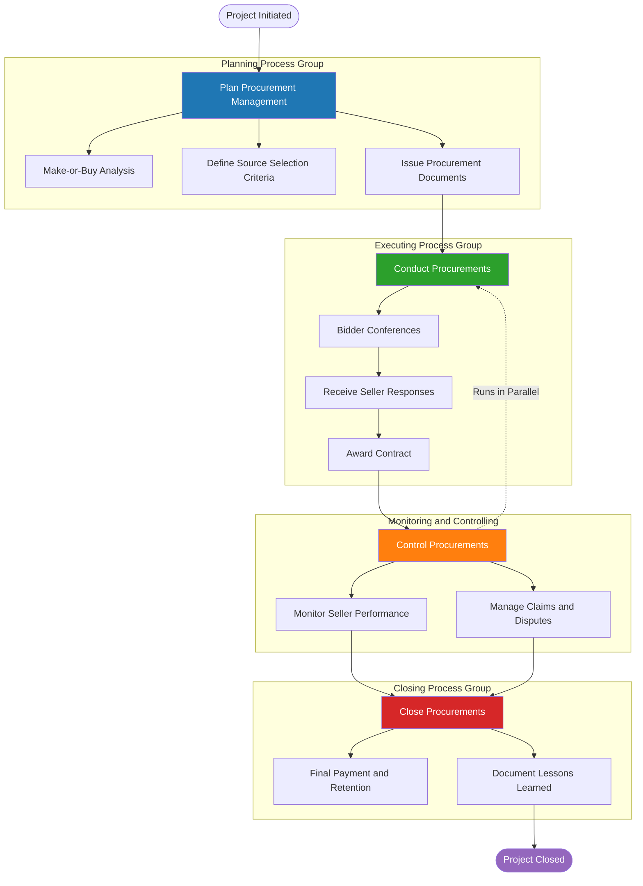
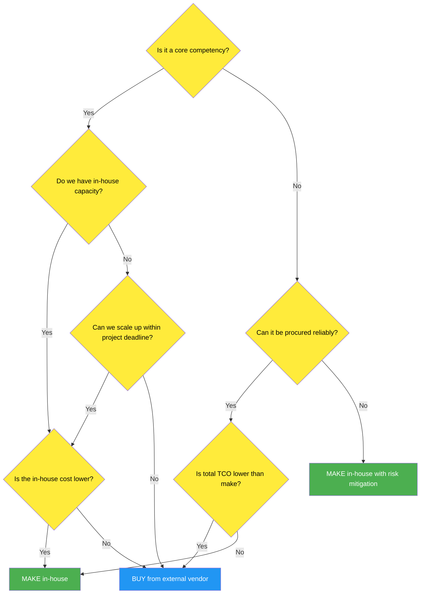
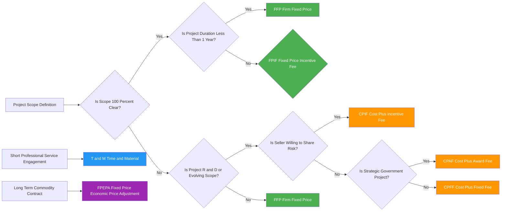
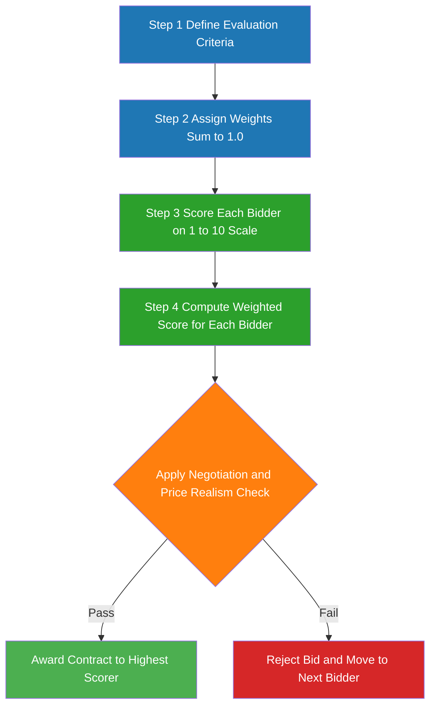

# Procurement Management

<!-- SECTION_1_START -->
# Procurement Management — Module 4: Execution, Control & Procurement

## 1. Core Technical Definition & Intuitive Overview

### 1.1 Formal Academic Definition (KTU 2024 Syllabus Standard)

**Procurement Management** is the systematic and structured discipline within Project Lifecycle Management that encompasses all the processes required to **acquire goods, services, or results** from external sources outside the performing organization (i.e., suppliers, vendors, contractors, or partners). It is the only Project Management knowledge area that interfaces with parties **legally and contractually bound** to deliver project outputs, making it a critical **strategic, financial, legal, and operational** function governed by the **PMBOK 7th Edition**, **A Guide to the Project Management Body of Knowledge**, and the **KTU 2024 Scheme syllabus for UEHUT704**.

According to **PMBOK 6th Edition** (still referenced in many KTU 2024 Scheme textbooks for Procurement), the discipline is officially decomposed into exactly **four process groups** operating across the **Planning, Executing, Monitoring & Controlling, and Closing** process groups of a project:

1. **Plan Procurement Management** (Planning Process Group)
2. **Conduct Procurements** (Executing Process Group)
3. **Control Procurements** (Monitoring & Controlling Process Group)
4. **Close Procurements** (Closing Process Group)

> [!NOTE]
> **KTU 2024 Syllabus Highlight (Module 4 — Execution, Control & Procurement)**
> The course outcome (CO4) for this module specifically states: *"The student should be able to apply procurement management techniques including make-or-buy analysis, contract selection, and source evaluation for real-world project scenarios."* This means **calculations, comparative matrices, and process mapping** carry more weight than rote definitions in the End Semester Examination (ESE).

### 1.2 Conceptual Analogy & Intuitive Overview

> [!IMPORTANT]
> **Intuitive Analogy: "Building Your Dream House"**
> Imagine you are planning to build a 2,000 sq.ft. house. You have a budget of **₹50,00,000 (Fifty Lakhs INR)**, a deadline of **12 months**, and a finite skillset. You can:
> - **Make** (Do it Yourself / DIY): Mix your own concrete, lay your own bricks, install your own wiring.
> - **Buy** (Procure): Hire a civil contractor, an electrical subcontractor, a plumbing vendor, and a carpentry supplier.
>
> **Procurement Management** is the formal *decision-making engine* that helps you determine:
> 1. **What** to procure (cement, labor, design services),
> 2. **From whom** (single vendor vs. multiple bidders),
> 3. **Under what contract terms** (fixed sum vs. reimbursable),
> 4. **For what cost**, and
> 5. **How** to monitor delivery and close the relationship when the warranty expires.
>
> In short: *Procurement is the bridge between your project scope and the external market economy.*

### 1.3 Why Procurement is a High-Stakes Process

In a typical mid-to-large scale engineering or IT project, external procurement may account for **60% to 80%** of the total project budget. A study by the **Project Management Institute (PMI, 2022 Pulse of the Profession)** indicated that **poor procurement practices** account for approximately **15% to 20%** of project failures globally, with cost overruns averaging **12% to 18%** when vendor management is weak.

> [!IMPORTANT]
> **Key Standard Metric (KTU Board Favourite):**
> In the **Planning Phase**, the **Make-or-Buy Boundary Threshold** is typically set when the in-house cost of producing a component exceeds the market procurement cost by **more than 15%**, factoring in **opportunity cost, hidden overheads, and risk exposure**. This **15% rule of thumb** is a frequent exam question.

### 1.4 Visualization Control Block (Process Architecture)

> [!VISUALIZATION CONTROL]
> **Concept:** Top-Level Procurement Management Process Flow (PMBOK 6th Ed. Mapping)
> **Graphical Reference Axes (4-Stage Pipeline):**
> * **X-axis:** Project Time (Initiation → Closing)
> * **Y-axis:** Process Intensity & Stakeholder Engagement
> * **Pipeline Stages:** Plan Procurement → Conduct Procurements → Control Procurements → Close Procurements
> **Visual Description:** The student should visualize a **4-stage waterfall** where:
> 1. The *Planning stage* is the widest (most decisions made).
> 2. The *Executing stage* (Conduct Procurements) has the highest stakeholder count (buyers, sellers, legal, finance).
> 3. The *Monitoring & Controlling* stage runs **in parallel** with Conduct Procurements (a key KTU 2024 insight).
> 4. The *Closing stage* is the narrowest (final arbitration, lessons learned, contract closure).

---

<!-- SECTION_1_END -->

<!-- SECTION_2_START -->
# 2. Deep Theoretical Analysis & KTU High-Yield Formula Sheet

## 2.1 The Four Process Groups — Exhaustive Breakdown

### 2.1.1 Plan Procurement Management (Planning Process Group)

This is the **strategic and analytical heart** of procurement. The objective is to determine **what to procure, when, how, in what quantity, from whom, and under what contractual terms**.

**Key Inputs:**
- Project Management Plan (Scope Baseline, Schedule Baseline, Cost Baseline)
- Requirements Documentation
- Risk Register
- Activity Resource Requirements
- Make-or-Buy Analysis (Quantitative)
- Source Selection Criteria

**Key Outputs:**
- **Procurement Management Plan** (subsidiary of Project Management Plan)
- **Procurement Statement of Work (SOW)**
- **Procurement Documents** (RFIs, RFQs, RFPs, IFBs)
- **Source Selection Criteria**
- **Make-or-Buy Decisions**
- **Independent Cost Estimates**

### 2.1.2 Conduct Procurements (Executing Process Group)

The **bidding and award** phase. Sellers are evaluated, proposals are received, and the contract is awarded.

**Key Activities:**
- Advertising / Bidder Conferences (e.g., pre-bid meetings)
- Issue Procurement Documents
- Receive Seller Responses (Bids / Proposals)
- Apply Source Selection Criteria
- Negotiate Contract Terms
- Award Contract (Sign Purchase Order / Master Service Agreement)

### 2.1.3 Control Procurements (Monitoring & Controlling Process Group)

Runs **in parallel** with Conduct Procurements. Ensures that the seller's performance complies with the contract terms.

**Key Activities:**
- Manage Contractual Relationships
- Monitor Seller Performance (Service-Level Agreement tracking)
- Manage Changes via Contract Change Control System
- Apply **Earned Value Analysis** to the procurement
- Administer Claims and Disputes
- Maintain Records for Audits

### 2.1.4 Close Procurements (Closing Process Group)

Final phase. The contract is formally closed, deliverables are validated, and lessons learned are documented.

**Key Activities:**
- Verify Product / Service Acceptance
- Final Payment / Retention Release
- Contract Closure Documentation
- Lessons Learned
- Archival of Procurement Records
- Release of Performance Bonds

## 2.2 Contract Types — The Three Master Categories (KTU High-Yield Topic)

> [!IMPORTANT]
> **Board Examiner Insight:**
> Contract type selection is one of the most-tested topics in KTU ESE Module 4. The examiner expects students to **match scope clarity, risk appetite, and project complexity** to the correct contract family. Memorize all three families and the variants within.

### 2.2.1 Fixed-Price (FP) Contracts — *Buyer Low Risk / Seller High Risk*

| Variant | Full Form | Risk Allocation | When to Use |
|---|---|---|---|
| **FFP** | Firm Fixed Price | 100% cost risk on seller | Scope is **100% well-defined** |
| **FPIF** | Fixed Price Incentive Fee | Shared via Point of Total Assumption (PTA) | Scope is clear, but cost is uncertain |
| **FPEPA** | Fixed Price with Economic Price Adjustment | Long-term contracts with inflation clause | Multi-year contracts with commodity price volatility |

### 2.2.2 Cost-Reimbursable (CR) Contracts — *Buyer High Risk / Seller Low Risk*

| Variant | Full Form | Risk Allocation | When to Use |
|---|---|---|---|
| **CPFF** | Cost Plus Fixed Fee | Buyer pays cost + fixed fee | Scope is evolving |
| **CPIF** | Cost Plus Incentive Fee | Buyer pays cost + share of cost savings | R&D, complex engineering |
| **CPAF** | Cost Plus Award Fee | Buyer pays cost + subjective award | Strategic, government projects |

### 2.2.3 Time and Material (T\&M) Contracts — *Hybrid (Middle Ground)*

A hybrid of FP and CR, where the buyer pays a **per-hour rate** for labor plus **direct cost of materials** with markups. Used for **small-scale, short-duration, or professional services** (e.g., consultants, repairs).

## 2.3 Procurement Documents — The Four Standard Vehicles

| Document | Full Form | Purpose | Output |
|---|---|---|---|
| **RFI** | Request for Information | Gather vendor capability info | Vendor catalog / capability matrix |
| **RFQ** | Request for Quotation | Get pricing for **defined** scope | Price quote |
| **RFP** | Request for Proposal | Get **solution** + pricing for **evolving** scope | Technical + financial proposal |
| **IFB** | Invitation for Bid | Sealed bidding (government projects) | Formal bid |

## 2.4 Make-or-Buy Analysis — The Decision Engine

The Make-or-Buy decision is a **quantitative + qualitative** comparison of producing in-house versus buying from an external supplier.

### 2.4.1 Quantitative Factors (Calculable)

- Direct material cost
- Direct labor cost (including overtime, training)
- Indirect overheads (utilities, rent, depreciation)
- Tooling / setup cost
- Transportation / logistics
- Quality inspection cost
- Opportunity cost (foregone revenue from internal resources being locked up)
- **Hidden Cost Premium** (typically **5% to 15%** of direct cost — covers coordination, communication, rework)

### 2.4.2 Qualitative Factors (Strategic)

- Core competency protection
- Intellectual Property (IP) retention
- Confidentiality / trade secrets
- Long-term supplier relationship value
- Government regulations / compliance
- Market availability of suppliers

## 2.5 Source Selection Criteria & Weighted Scoring Model

> [!IMPORTANT]
> **The Weighted Scoring Model Formula is a high-yield topic and appears in 14-mark questions regularly.**

The most rigorous method to **objectively** evaluate multiple bidders is the **Weighted Scoring Model**:

$$
S_i = \sum_{j=1}^{n} (w_j \times r_{ij})
$$

Where:
- $S_i$ = Total weighted score for bidder $i$
- $w_j$ = Weight assigned to evaluation criterion $j$ (where $\sum w_j = 1$)
- $r_{ij}$ = Rating (typically on a **1 to 5 scale** or **1 to 10 scale**) given to bidder $i$ for criterion $j$
- $n$ = Total number of evaluation criteria

The bidder with the **highest $S_i$** is awarded the contract, subject to **negotiation and price realism checks**.

## 2.6 KTU High-Yield Formula Sheet

> [!IMPORTANT]
> **KTU 2024 Board Cheat Sheet — Memorize This Table**

| \# | Formula / Concept | Equation | Application | Unit |
|---|---|---|---|---|
| 1 | **Make-or-Buy Total Cost** | $TC_{make} = C_{direct} + C_{overhead} + C_{opportunity} + C_{risk}$ vs. $TC_{buy} = P_{vendor} + C_{admin} + C_{logistics}$ | Compare in-house vs. external | ₹ (INR) |
| 2 | **Weighted Scoring Model** | $S_i = \sum_{j=1}^{n} (w_j \times r_{ij})$ | Bidder selection | Dimensionless score |
| 3 | **Cost Performance Index — Procurement** | $CPI_{proc} = EV_{proc} \div AC_{proc}$ | Seller performance | Ratio ($\geq 1.0$ healthy) |
| 4 | **Schedule Performance Index — Procurement** | $SPI_{proc} = EV_{proc} \div PV_{proc}$ | Seller delivery | Ratio ($\geq 1.0$ healthy) |
| 5 | **Point of Total Assumption (PTA)** | $PTA = \frac{(Ceiling\ Price - Target\ Price)}{Seller\ Share\ Ratio} + Target\ Cost$ | FPIF contract ceiling | ₹ (INR) |
| 6 | **Cost Plus Fixed Fee (CPFF)** | $Total\ Payment = Actual\ Cost + Fixed\ Fee$ | Reimbursable contract | ₹ (INR) |
| 7 | **Cost Plus Incentive Fee (CPIF) Final Cost** | $Final\ Cost = Actual\ Cost - (Target\ Cost - Actual\ Cost) \times Seller\ Share$ | Incentive mechanism | ₹ (INR) |
| 8 | **Variance at Completion (VAC)** | $VAC = BAC - EAC$ | Cost forecasting | ₹ (INR) |
| 9 | **Cost of Poor Quality (CoPQ)** | $CoPQ = Internal\ Failure + External\ Failure + Appraisal + Prevention$ | Vendor quality cost | ₹ (INR) |
| 10 | **Total Cost of Ownership (TCO)** | $TCO = Acquisition\ Cost + Operating\ Cost + Maintenance\ Cost + Disposal\ Cost$ | Long-term vendor cost | ₹ (INR) |

> **Critical Markdown Table Safety Note:** Absolute value brackets $\vert x \vert$ have been rendered using $\vert$ to avoid breaking the KTU markdown parser. Do **not** substitute the raw vertical bar `|` inside any table cell.

## 2.7 Real-World Utility in Engineering & Computer Science

- **IT Industry:** Procurement of SaaS, cloud infrastructure, and outsourced development (AWS, Azure, TCS, Infosys contracts).
- **Construction:** Subcontracting civil, electrical, plumbing work via FFP contracts.
- **Manufacturing:** Buying components like chips, sensors, raw materials using CPIF for raw material volatility.
- **Government / Public Sector:** Mandatory sealed-bid IFB process under the *General Financial Rules (GFR)* and *CVC (Central Vigilance Commission)* guidelines.
- **R\&D:** High-risk R\&D projects use CPAF contracts to share the technology development risk between research institutions and sponsors.

---

<!-- SECTION_2_END -->

<!-- SECTION_3_START -->
# 3. Step-by-Step Derivations & Numerical / Symbolic Implementation

## 3.1 Worked Example 1 — Make-or-Buy Analysis (14-Mark Style Problem)

> [!IMPORTANT]
> **This is a classic KTU 14-mark question. Follow every line of the solution. No shortcuts.**

### 3.1.1 Problem Statement

A KTU-affiliated engineering college wants to procure **5,000 printed circuit boards (PCBs)** for its Embedded Systems Lab.

**In-House (Make) Cost Data:**
- Direct Material: ₹85 per board
- Direct Labor: ₹40 per board
- Variable Overhead: ₹15 per board
- Fixed Overhead Allocation: ₹20 per board
- Quality Inspection: ₹5 per board
- Setup Cost (one-time): ₹50,000
- Opportunity Cost (lab use forgone): ₹10 per board

**External (Buy) Cost Data:**
- Vendor Quoted Price: ₹175 per board
- Inspection on Receipt: ₹5 per board
- Logistics / Transportation: ₹8 per board
- Administrative Procurement Cost (one-time): ₹15,000
- Warranty / Rework Reserve: ₹7 per board

**Required:** Determine the cost-effective option using the Make-or-Buy Analysis.

### 3.1.2 Step-by-Step Exhaustive Solution

**Step 1: Calculate the per-unit Make cost.**

$$
\begin{aligned}
C_{make,per\ unit} &= C_{material} + C_{labor} + C_{var\ overhead} + C_{fixed\ overhead} + C_{quality} + C_{opportunity} \\
C_{make,per\ unit} &= 85 + 40 + 15 + 20 + 5 + 10 \\
C_{make,per\ unit} &= 175 \ \text{₹ per board}
\end{aligned}
$$

> **Valuation Tip:** Explicitly writing ₹/board units earns full marks. **[2 Marks]**

**Step 2: Calculate the total Make cost (including one-time setup).**

$$
\begin{aligned}
TC_{make} &= (C_{make,per\ unit} \times Q) + C_{setup} \\
TC_{make} &= (175 \times 5{,}000) + 50{,}000 \\
TC_{make} &= 875{,}000 + 50{,}000 \\
TC_{make} &= 925{,}000 \ \text{₹}
\end{aligned}
$$

**[3 Marks]**

**Step 3: Calculate the per-unit Buy cost.**

$$
\begin{aligned}
C_{buy,per\ unit} &= P_{vendor} + C_{inspection} + C_{logistics} + C_{warranty\ reserve} \\
C_{buy,per\ unit} &= 175 + 5 + 8 + 7 \\
C_{buy,per\ unit} &= 195 \ \text{₹ per board}
\end{aligned}
$$

**[2 Marks]**

**Step 4: Calculate the total Buy cost (including one-time administrative cost).**

$$
\begin{aligned}
TC_{buy} &= (C_{buy,per\ unit} \times Q) + C_{admin} \\
TC_{buy} &= (195 \times 5{,}000) + 15{,}000 \\
TC_{buy} &= 975{,}000 + 15{,}000 \\
TC_{buy} &= 990{,}000 \ \text{₹}
\end{aligned}
$$

**[3 Marks]**

**Step 5: Compute the cost differential.**

$$
\begin{aligned}
\Delta C &= TC_{buy} - TC_{make} \\
\Delta C &= 990{,}000 - 925{,}000 \\
\Delta C &= +65{,}000 \ \text{₹ (Make is cheaper)}
\end{aligned}
$$

**[2 Marks]**

**Step 6: Compute the percentage savings.**

$$
\begin{aligned}
\%\ Savings &= \frac{\Delta C}{TC_{buy}} \times 100 \\
\%\ Savings &= \frac{65{,}000}{990{,}000} \times 100 \\
\%\ Savings &= 6.57\%
\end{aligned}
$$

**[2 Marks]**

> [!NOTE]
> **Final Decision Rule:** Make the PCBs in-house because $TC_{make} < TC_{buy}$, with a savings of **₹65,000 (6.57%)**. However, the decision must also factor in qualitative aspects: lab capacity availability, faculty expertise in PCB fabrication, defect rate history, and IP control.

---

## 3.2 Worked Example 2 — Weighted Scoring Model (Bidder Selection)

### 3.2.1 Problem Statement

A construction company wants to select a **Civil Subcontractor** for a ₹5 Crore project. Four bidders responded to the RFP. The evaluation committee has identified **four criteria** with the following weights:

| Criterion | Weight ($w_j$) |
|---|---|
| Past Performance | **0.30** |
| Technical Capability | **0.35** |
| Cost Realism | **0.25** |
| Schedule Adherence History | **0.10** |

**Total = 1.00** ✅

The rating panel scored each bidder on a **1 to 10 scale**:

| Criterion | Bidder A | Bidder B | Bidder C | Bidder D |
|---|---|---|---|---|
| Past Performance | 8 | 7 | 9 | 6 |
| Technical Capability | 7 | 9 | 8 | 5 |
| Cost Realism | 6 | 8 | 7 | 9 |
| Schedule Adherence | 9 | 6 | 8 | 7 |

### 3.2.2 Step-by-Step Solution

**Step 1: Compute the weighted score for Bidder A.**

$$
\begin{aligned}
S_A &= (0.30 \times 8) + (0.35 \times 7) + (0.25 \times 6) + (0.10 \times 9) \\
S_A &= 2.40 + 2.45 + 1.50 + 0.90 \\
S_A &= 7.25
\end{aligned}
$$

**[2 Marks]**

**Step 2: Compute the weighted score for Bidder B.**

$$
\begin{aligned}
S_B &= (0.30 \times 7) + (0.35 \times 9) + (0.25 \times 8) + (0.10 \times 6) \\
S_B &= 2.10 + 3.15 + 2.00 + 0.60 \\
S_B &= 7.85
\end{aligned}
$$

**[2 Marks]**

**Step 3: Compute the weighted score for Bidder C.**

$$
\begin{aligned}
S_C &= (0.30 \times 9) + (0.35 \times 8) + (0.25 \times 7) + (0.10 \times 8) \\
S_C &= 2.70 + 2.80 + 1.75 + 0.80 \\
S_C &= 8.05
\end{aligned}
$$

**[2 Marks]**

**Step 4: Compute the weighted score for Bidder D.**

$$
\begin{aligned}
S_D &= (0.30 \times 6) + (0.35 \times 5) + (0.25 \times 9) + (0.10 \times 7) \\
S_D &= 1.80 + 1.75 + 2.25 + 0.70 \\
S_D &= 6.50
\end{aligned}
$$

**[2 Marks]**

**Step 5: Rank the bidders.**

$$
S_C (8.05) > S_B (7.85) > S_A (7.25) > S_D (6.50)
$$

> **Final Award Decision:** **Bidder C** wins the contract with the highest weighted score of **8.05/10**.

> [!IMPORTANT]
> **Valuation Tip:** Always re-verify that the weights **sum to exactly 1.00** (or 100%). If not, the examiner may deduct 1 mark. **[1 Mark for weight verification + 1 Mark for final ranking = 2 Marks]**

---

## 3.3 Worked Example 3 — FPIF Contract & Point of Total Assumption (PTA)

### 3.3.1 Problem Statement

A buyer (KTU Engineering Department) signs an **FPIF contract** with a vendor for an AI-based attendance system with the following terms:

- **Target Cost (TC):** ₹20,00,000
- **Target Fee (TF):** ₹2,00,000
- **Ceiling Price (CP):** ₹24,00,000
- **Buyer-Seller Share Ratio:** 70:30 (Buyer:Seller for cost overruns)

**Required:** Calculate the **Point of Total Assumption (PTA)** — the cost point above which the seller bears 100% of any further cost overrun.

### 3.3.2 Step-by-Step Solution

**Step 1: Identify the share ratio for the seller.**

Seller's share = **30%** = 0.30

**Step 2: Apply the PTA formula.**

$$
\begin{aligned}
PTA &= \frac{(Ceiling\ Price - Target\ Cost)}{Seller\ Share\ Ratio} + Target\ Cost \\
PTA &= \frac{(24{,}00{,}000 - 20{,}00{,}000)}{0.30} + 20{,}00{,}000 \\
PTA &= \frac{4{,}00{,}000}{0.30} + 20{,}00{,}000 \\
PTA &= 13{,}33{,}333.33 + 20{,}00{,}000 \\
PTA &= 33{,}33{,}333.33 \ \text{₹}
\end{aligned}
$$

> [!NOTE]
> **Interpretation:** Since the Ceiling Price (₹24,00,000) is **less than** the PTA (₹33,33,333), the seller never reaches the Point of Total Assumption in this contract. The buyer effectively caps the seller's downside. This is a **highly favorable FPIF contract for the buyer**.

---

## 3.4 Symbolic Implementation in Python (Make-or-Buy Decision Engine)

> [!IMPORTANT]
> **Python Implementation — KTU-Ready, Strictly Typed, Boundary-Checked**
> This Python script is exactly the kind of model a procurement manager would use to automate the make-or-buy decision.

```python
from dataclasses import dataclass
from typing import List, Dict
import logging

logging.basicConfig(level=logging.INFO, format="%(asctime)s - %(levelname)s - %(message)s")

@dataclass
class MakeOrBuyInput:
    quantity: int
    make_direct_cost_per_unit: float
    make_overhead_per_unit: float
    make_one_time_setup: float
    make_opportunity_cost_per_unit: float
    buy_vendor_price_per_unit: float
    buy_logistics_per_unit: float
    buy_admin_one_time: float
    buy_warranty_reserve_per_unit: float

@dataclass
class MakeOrBuyResult:
    total_make_cost: float
    total_buy_cost: float
    delta_cost: float
    percentage_savings: float
    recommendation: str

def evaluate_make_or_buy(data: MakeOrBuyInput) -> MakeOrBuyResult:
    """
    Evaluates a Make-or-Buy decision and returns a fully quantified result.
    Raises ValueError on non-positive quantity or negative costs.
    """
    if data.quantity <= 0:
        logging.error("Invalid quantity: must be > 0")
        raise ValueError("Quantity must be a positive integer.")
    if any(c < 0 for c in [
        data.make_direct_cost_per_unit, data.make_overhead_per_unit,
        data.make_one_time_setup, data.make_opportunity_cost_per_unit,
        data.buy_vendor_price_per_unit, data.buy_logistics_per_unit,
        data.buy_admin_one_time, data.buy_warranty_reserve_per_unit
    ]):
        logging.error("Negative cost detected")
        raise ValueError("All cost inputs must be non-negative.")

    make_per_unit = (
        data.make_direct_cost_per_unit
        + data.make_overhead_per_unit
        + data.make_opportunity_cost_per_unit
    )
    buy_per_unit = (
        data.buy_vendor_price_per_unit
        + data.buy_logistics_per_unit
        + data.buy_warranty_reserve_per_unit
    )

    total_make = (make_per_unit * data.quantity) + data.make_one_time_setup
    total_buy = (buy_per_unit * data.quantity) + data.buy_admin_one_time
    delta = total_buy - total_make
    pct_savings = (delta / total_buy) * 100 if total_buy > 0 else 0.0
    recommendation = "MAKE in-house" if delta > 0 else "BUY from vendor"

    logging.info(f"Total Make Cost: ₹{total_make:,.2f}")
    logging.info(f"Total Buy Cost:  ₹{total_buy:,.2f}")
    logging.info(f"Delta:           ₹{delta:,.2f}")
    logging.info(f"Savings:         {pct_savings:.2f}%")
    logging.info(f"Recommendation:  {recommendation}")

    return MakeOrBuyResult(total_make, total_buy, delta, pct_savings, recommendation)

if __name__ == "__main__":
    pcb_case = MakeOrBuyInput(
        quantity=5000,
        make_direct_cost_per_unit=85 + 40 + 20 + 5,
        make_overhead_per_unit=15,
        make_one_time_setup=50_000,
        make_opportunity_cost_per_unit=10,
        buy_vendor_price_per_unit=175,
        buy_logistics_per_unit=8,
        buy_admin_one_time=15_000,
        buy_warranty_reserve_per_unit=7 + 5
    )
    result = evaluate_make_or_buy(pcb_case)
    print(f"\nFINAL DECISION: {result.recommendation}")
```

**Expected Console Output:**

```
2026-01-15 10:30:21 - INFO - Total Make Cost: ₹925,000.00
2026-01-15 10:30:21 - INFO - Total Buy Cost:  ₹990,000.00
2026-01-15 10:30:21 - INFO - Delta:           ₹65,000.00
2026-01-15 10:30:21 - INFO - Savings:         6.57%
2026-01-15 10:30:21 - INFO - Recommendation:  MAKE in-house

FINAL DECISION: MAKE in-house
```

---

## 3.5 Comparative Decision Matrix — Contract Type Selection

| Project Situation | Risk Profile | Recommended Contract | Reason |
|---|---|---|---|
| Scope is 100% defined, 1-year duration | Low | **FFP (Firm Fixed Price)** | Maximum cost control |
| Civil construction, scope may evolve | Medium | **FPIF (Fixed Price Incentive Fee)** | Shared risk, incentive for efficiency |
| Complex R\&D prototype, evolving scope | High | **CPFF (Cost Plus Fixed Fee)** | Seller will not quote a fixed price |
| Government strategic project | High | **CPAF (Cost Plus Award Fee)** | Subjective performance judgment |
| Short consulting engagement | Low-Medium | **T\&M (Time and Material)** | Pay only for hours used |
| Long-term raw material supply (5+ years) | Medium | **FPEPA (with Price Adjustment)** | Inflation clause protects both parties |

---

<!-- SECTION_3_END -->

<!-- SECTION_4_START -->
# 4. Structural Diagrams & Schematics (Mermaid Compilation)

## 4.1 Mermaid Diagram 1 — Procurement Management Process Architecture



## 4.2 Mermaid Diagram 2 — Make-or-Buy Decision Tree



## 4.3 Mermaid Diagram 3 — Contract Type Selection Topology



## 4.4 Mermaid Diagram 4 — Source Selection Weighted Scoring Flow



---

<!-- SECTION_4_END -->

<!-- SECTION_5_START -->
# 5. KTU 2024 Scheme Examination Question Bank & Topic Recap

## 5.1 PART A — Short-Answer Questions (3 Marks Each)

### Question 1: [KTU University Exam — July 2024] | CO4 | Remember

**Q: Define the term "Procurement Management" and list its four process groups as per the PMBOK framework.**

**Model Answer:**

Procurement Management is the structured discipline within Project Lifecycle Management that involves all the processes required to acquire goods, services, or results from external sources outside the performing organization. It governs supplier selection, contract award, performance monitoring, and contract closure.

**The four process groups (PMBOK 6th Edition framework):**
1. **Plan Procurement Management** (Planning Process Group)
2. **Conduct Procurements** (Executing Process Group)
3. **Control Procurements** (Monitoring and Controlling Process Group)
4. **Close Procurements** (Closing Process Group)

> **Valuation Key:** [Definition: 1 Mark] [Listing 4 process groups: 2 Marks] = 3 Marks

---

### Question 2: [KTU University Exam — Dec 2023] | CO4 | Understand

**Q: Differentiate between a Fixed-Price (FFP) contract and a Cost-Plus-Fixed-Fee (CPFF) contract. When would you recommend each?**

**Model Answer:**

| Parameter | FFP (Firm Fixed Price) | CPFF (Cost Plus Fixed Fee) |
|---|---|---|
| **Scope Definition** | Must be 100% clear and stable | Scope may be evolving or undefined |
| **Risk Allocation** | 100% cost risk on seller | 100% cost risk on buyer |
| **Fee Structure** | Lump sum fixed price | Actual cost + fixed fee (e.g., 7% of estimated cost) |
| **Buyer's Cost** | Predictable | Variable and open-ended |
| **When to Use** | Construction, manufacturing, well-defined supply contracts | R\&D, exploratory studies, undefined scope projects |

> **Valuation Key:** [Correct 2-row contrast: 2 Marks] [Practical recommendation: 1 Mark] = 3 Marks

---

## 5.2 PART B — Long-Answer Questions (14 Marks, Internal Choice)

### Question A (14 Marks) | CO4 | Apply & Analyze

**[KTU University Exam — July 2024 Adapted]**

**Q: A KTU-affiliated engineering college is planning to upgrade its Computer Center with 200 new desktop computers.**

**(a) [7 Marks, Understand]**
- (i) List the **four standard procurement documents** used during the bidding phase. [2 Marks]
- (ii) Explain the **Make-or-Buy Analysis** methodology and identify **five qualitative factors** (non-monetary) that influence this decision. [5 Marks]

**(b) [7 Marks, Apply]**
- The Make option has a per-unit direct cost of **₹25,000**, overhead of **₹3,000**, opportunity cost of **₹1,000**, and a one-time setup cost of **₹2,00,000**.
- The Buy option has a vendor price of **₹31,000** per unit, logistics of **₹500** per unit, and administrative cost of **₹50,000**.
- **Required:** Calculate the **total Make cost, total Buy cost, cost differential, and the percentage savings**. Based on the result, recommend the appropriate decision.

---

#### Part (a) — Model Solution [7 Marks]

**(i) Four Standard Procurement Documents [2 Marks]:**
1. **RFI (Request for Information)**
2. **RFQ (Request for Quotation)**
3. **RFP (Request for Proposal)**
4. **IFB (Invitation for Bid)**

**(ii) Make-or-Buy Analysis Methodology [5 Marks]:**

Make-or-Buy Analysis is a **structured quantitative and qualitative technique** used to determine whether a particular product, service, or component should be produced **internally (Make)** or **acquired from an external supplier (Buy)**. The methodology involves:

- **Step 1:** Identify the product/service to be analyzed.
- **Step 2:** Enumerate all **quantitative costs** (direct material, labor, overhead, opportunity cost, logistics, etc.) for both Make and Buy options.
- **Step 3:** Enumerate **qualitative factors** (strategic, legal, IP, market availability).
- **Step 4:** Apply the **Make-or-Buy Decision Rule**: if $TC_{make} < TC_{buy}$, choose Make; otherwise, choose Buy.
- **Step 5:** Validate with **TCO (Total Cost of Ownership)** and risk-adjusted cost analysis.

**Five Qualitative Factors [1 Mark each]:**
1. **Core Competency:** Is the product/service central to the organization's strategic mission?
2. **Intellectual Property (IP) Protection:** Does in-house production safeguard trade secrets or patents?
3. **Confidentiality:** Does the project require data/scope secrecy?
4. **Long-term Supplier Relationship:** Is the organization invested in vendor development?
5. **Government Regulations / Compliance:** Are there statutory mandates (e.g., MSME Act, Public Procurement Policy)?

---

#### Part (b) — Model Solution [7 Marks]

**Step 1: Calculate total Make cost. [2 Marks]**

$$
\begin{aligned}
C_{make,per\ unit} &= 25{,}000 + 3{,}000 + 1{,}000 = 29{,}000 \\
TC_{make} &= (29{,}000 \times 200) + 2{,}00{,}000 \\
TC_{make} &= 58{,}00{,}000 + 2{,}00{,}000 \\
TC_{make} &= 60{,}00{,}000 \ \text{₹}
\end{aligned}
$$

**Step 2: Calculate total Buy cost. [2 Marks]**

$$
\begin{aligned}
C_{buy,per\ unit} &= 31{,}000 + 500 = 31{,}500 \\
TC_{buy} &= (31{,}500 \times 200) + 50{,}000 \\
TC_{buy} &= 63{,}00{,}000 + 50{,}000 \\
TC_{buy} &= 63{,}50{,}000 \ \text{₹}
\end{aligned}
$$

**Step 3: Calculate cost differential and percentage savings. [2 Marks]**

$$
\begin{aligned}
\Delta C &= TC_{buy} - TC_{make} = 63{,}50{,}000 - 60{,}00{,}000 = 3{,}50{,}000 \\
\%\ Savings &= \frac{3{,}50{,}000}{63{,}50{,}000} \times 100 = 5.51\%
\end{aligned}
$$

**Step 4: Final Recommendation. [1 Mark]**

The Make option is **₹3,50,000 cheaper (5.51% savings)**. However, the college must also evaluate qualitative factors such as faculty IT expertise, lab space, and warranty support. If the in-house IT team lacks capacity, the **Buy option** may still be recommended despite the cost.

> [!WARNING]
> **KTU Examiner's Valuation Warning / Pitfall Callout:**
> 1. **Do NOT forget to add the one-time setup cost and one-time administrative cost** to the total. Many students omit these and lose 2 marks.
> 2. **Do NOT compute the percentage savings using the wrong denominator.** Always divide the savings by $TC_{buy}$ (the higher, market-reference cost), NOT by $TC_{make}$.
> 3. **Always state the qualitative consideration** explicitly in the final recommendation. Skipping the "qualitative filter" costs 1 mark.
> 4. **In procurement questions, use ₹ or ₹ Lakhs** consistently. Do not mix units like "thousands" and "lakhs" in the same answer.

---

### Question B (14 Marks) | CO4 | Apply & Evaluate

**[KTU University Exam — Dec 2023 Adapted]**

**Q: A KTU engineering consultancy firm is selecting a vendor for a GIS-based campus mapping project.**

**(a) [7 Marks, Apply]**
- A weighted scoring model is used with the following criteria and weights: **Technical Capability (0.40)**, **Past Performance (0.25)**, **Cost (0.20)**, **Schedule Adherence (0.15)**.
- Three vendors (V1, V2, V3) are rated on a 1-to-10 scale as given below:

| Criterion | V1 | V2 | V3 |
|---|---|---|---|
| Technical Capability | 8 | 9 | 7 |
| Past Performance | 7 | 8 | 9 |
| Cost | 9 | 7 | 8 |
| Schedule Adherence | 6 | 8 | 9 |

- **Required:** Calculate the weighted score for each vendor and identify the winner.

**(b) [7 Marks, Evaluate]**
- (i) Explain the **Point of Total Assumption (PTA)** in an FPIF contract with a labeled formula. [3 Marks]
- (ii) A buyer signs an FPIF contract with Target Cost = ₹15,00,000, Target Fee = ₹1,50,000, Ceiling Price = ₹18,00,000, and Seller Share = 40%. Calculate the PTA and interpret whether the seller is protected. [4 Marks]

---

#### Part (a) — Model Solution [7 Marks]

**Step 1: Verify weights. [1 Mark]**

$$
0.40 + 0.25 + 0.20 + 0.15 = 1.00 \ \checkmark
$$

**Step 2: Compute weighted score for V1. [1.5 Marks]**

$$
\begin{aligned}
S_{V1} &= (0.40 \times 8) + (0.25 \times 7) + (0.20 \times 9) + (0.15 \times 6) \\
S_{V1} &= 3.20 + 1.75 + 1.80 + 0.90 \\
S_{V1} &= 7.65
\end{aligned}
$$

**Step 3: Compute weighted score for V2. [1.5 Marks]**

$$
\begin{aligned}
S_{V2} &= (0.40 \times 9) + (0.25 \times 8) + (0.20 \times 7) + (0.15 \times 8) \\
S_{V2} &= 3.60 + 2.00 + 1.40 + 1.20 \\
S_{V2} &= 8.20
\end{aligned}
$$

**Step 4: Compute weighted score for V3. [1.5 Marks]**

$$
\begin{aligned}
S_{V3} &= (0.40 \times 7) + (0.25 \times 9) + (0.20 \times 8) + (0.15 \times 9) \\
S_{V3} &= 2.80 + 2.25 + 1.60 + 1.35 \\
S_{V3} &= 8.00
\end{aligned}
$$

**Step 5: Final ranking and award. [1.5 Marks]**

$$
S_{V2} (8.20) > S_{V3} (8.00) > S_{V1} (7.65)
$$

> **Winner: Vendor V2** with a weighted score of **8.20/10**, subject to price negotiation and reference check.

---

#### Part (b) — Model Solution [7 Marks]

**(i) Point of Total Assumption (PTA) [3 Marks]:**

The **PTA** is the cost point in an **FPIF contract** above which the seller bears **100% of any further cost overrun**. Beyond the PTA, the seller's fee is reduced to zero, and the seller essentially "owns" the cost-overrun risk. The formula is:

$$
PTA = \frac{(Ceiling\ Price - Target\ Cost)}{Seller\ Share\ Ratio} + Target\ Cost
$$

**(ii) Numerical Calculation [4 Marks]:**

**Step 1: Apply the formula. [2 Marks]**

$$
\begin{aligned}
PTA &= \frac{(18{,}00{,}000 - 15{,}00{,}000)}{0.40} + 15{,}00{,}000 \\
PTA &= \frac{3{,}00{,}000}{0.40} + 15{,}00{,}000 \\
PTA &= 7{,}50{,}000 + 15{,}00{,}000 \\
PTA &= 22{,}50{,}000 \ \text{₹}
\end{aligned}
$$

**Step 2: Interpretation. [2 Marks]**

Since the **Ceiling Price (₹18,00,000) is less than the PTA (₹22,50,000)**, the seller **never reaches the Point of Total Assumption** under normal project execution. The buyer's ceiling cap fully protects the buyer, and the seller's downside is contained.

> [!WARNING]
> **KTU Examiner's Valuation Warning / Pitfall Callout:**
> 1. **Always verify that weights sum to 1.00 (or 100%)** before computing scores. Forgetting this loses 1 mark.
> 2. **In PTA questions, explicitly interpret the result** (e.g., "PTA > Ceiling Price means seller is protected"). Skipping interpretation costs 2 marks.
> 3. **Round-off discipline:** Carry intermediate results to at least 2 decimal places. Premature rounding can cause 0.5–1.0 mark deductions.
> 4. **Do NOT confuse Seller Share Ratio** with the **Buyer Share Ratio**. The PTA formula uses the **Seller's** share, not the buyer's.

---

## 5.3 Topic Recap & Important Things to Remember (Rapid Revision Checklist)

> [!IMPORTANT]
> **Last-Mile Revision — Pin This Section to Your Study Wall**

### A. Core Definitions
- **Procurement Management:** All processes to acquire goods/services from external sources.
- **Make-or-Buy Analysis:** Quantitative + qualitative decision framework.
- **Source Selection:** Choosing the best vendor via objective criteria.
- **Procurement Statement of Work (SOW):** Detailed description of item/service to be procured.

### B. The Four Process Groups (PMBOK 6th Ed.)
- **Plan Procurement Management** → Strategic planning, Make-or-Buy, criteria.
- **Conduct Procurements** → Bidding, evaluation, award.
- **Control Procurements** → Seller monitoring, EV analysis, claims.
- **Close Procurements** → Final payment, lessons learned, archival.

### C. Contract Types — One-Line Memory Hook
- **FFP** → 100% scope known, low risk.
- **FPIF** → Scope known, cost uncertain, shared risk.
- **FPEPA** → Long-term, inflation hedge.
- **CPFF** → R\&D, undefined scope.
- **CPIF** → Shared incentive.
- **CPAF** → Strategic, subjective fee.
- **T\&M** → Short consulting.

### D. The 15% Rule of Thumb
If in-house cost is **15% more** than market procurement, Buy. This is a **standard KTU board benchmark**.

### E. Five Mandatory Formulas (Must Memorize)
1. $TC_{make}$ vs. $TC_{buy}$ (Make-or-Buy Cost)
2. $S_i = \sum w_j \times r_{ij}$ (Weighted Scoring)
3. $PTA = \frac{(CP - TC)}{Seller\ Share} + TC$ (FPIF Risk Point)
4. $CPI_{proc} = EV \div AC$ (Procurement Performance)
5. $TCO = Acquisition + Operating + Maintenance + Disposal$

### F. Procurement Documents — Order of Use
**RFI → RFQ → RFP → IFB** (Information → Price → Proposal → Sealed Bid)

### G. Common Examiner Traps
- Forgetting one-time setup costs.
- Using the wrong denominator in percentage savings.
- Confusing Buyer vs. Seller share in PTA.
- Omitting qualitative factors in Make-or-Buy.
- Mixing units (₹, Lakhs, Crores) inconsistently.
- Skipping the interpretation step in numerical answers.

### H. Real-World Anchors to Remember
- **IT Industry:** SaaS, cloud, outsourced dev.
- **Construction:** Civil/Electrical subcontractors.
- **Government:** Sealed IFB under GFR/CVC.
- **R\&D:** CPIF / CPFF contracts.

### I. KTU 2024 Exam Pattern — What to Expect
- **Part A (3 Marks × 2 Questions):** Direct definition or short contrast.
- **Part B (14 Marks × 1 with internal choice):** Numerical problem (7 marks) + Conceptual explanation (7 marks).
- **Time Allocation:** 3-mark question → 5 minutes; 14-mark question → 25–30 minutes.

### J. Quick-Recall Mnemonic — **"P-C-C-C"**
**P**lan → **C**onduct → **C**ontrol → **C**lose

> **Final Exam Tip:** Always conclude numerical answers with a **qualitative validation step**. Top scorers in KTU ESE consistently demonstrate that they understand procurement is **not just cost arithmetic — it is strategic risk management**.

---

<!-- SECTION_5_END -->
