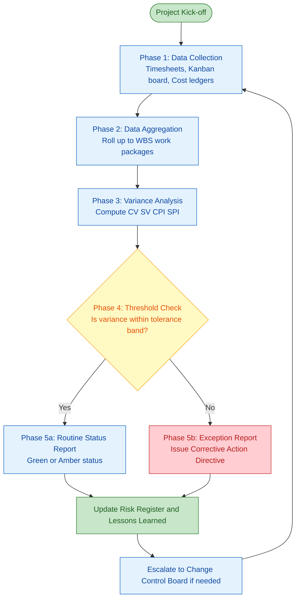
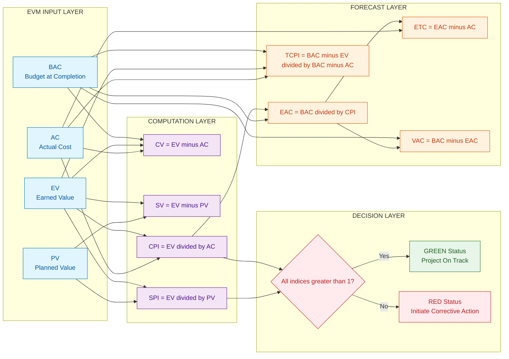

# Project Tracking

<!-- SECTION_1_START -->
# Project Tracking — Navigating the Project to a Successful Finish

## 1.1 Formal KTU-Standard Definition

> [!IMPORTANT]
> **Project Tracking** is the continuous, systematic process of measuring, recording, and reporting the *actual* progress of a project against its *planned* baseline of scope, schedule, cost, and quality, so that variances can be identified early and corrective or preventive actions can be initiated to keep the project aligned with its approved **Project Management Plan (PMP)**.

In the vocabulary of the **Project Management Body of Knowledge (PMBOK® Guide — 7th Edition)** and the **KTU 2024 Scheme** module on *Execution, Control & Procurement*, project tracking is the operational heart of the **Monitor \& Control Project Work** process (mapped to Course Outcome **CO3 — Analyze project performance using standard PM tools**). It transforms a static plan into a *living* control system by feeding real-time data back into the **Perform Integrated Change Control** and **Implement Risk Responses** processes.

The three pillars that every credible tracking system must measure are universally known as the **Iron Triangle** (a.k.a. the **Triple Constraint**):

| Constraint | Tracked Through | Common Metric |
| :--- | :--- | :--- |
| **Scope** | Work Performance Data | \% deliverables completed |
| **Schedule** | Gantt charts, Milestone logs | **SV**, **SPI** |
| **Cost** | Cost ledgers, EVM reports | **CV**, **CPI** |

## 1.2 Intuitive Analogy — The Marathon Runner with a GPS Watch

Imagine you are running a **42.195 km** marathon with three target splits on your GPS watch:

1. **Km 21.1 split** (halfway) — target time: **1:50:00**
2. **Km 30 split** — target time: **2:35:00**
3. **Finish line** — target time: **4:00:00**

Your watch gives you *two* streams of data at every checkpoint:

- **Planned Value (PV)** — the *time* you *should* have clocked by that kilometre mark (this is your baseline).
- **Earned Value (EV)** — the *distance* you have *actually* covered at the cost of the *time* elapsed.
- **Actual Cost (AC)** — the *real* amount of energy, hydration, electrolytes, and shoe wear you have burned (the *real* expenditure).

If at the 21.1 km mark the watch says *"you have covered 19 km in 1:50:00"*, then you are *behind schedule* and *over budget on energy*. Project tracking does exactly this for an engineering or IT project: it tells the project manager *how far we have come*, *how far we should have come*, and *how much we have spent to get here*.

> [!NOTE]
> **KTU Syllabus Highlight (UEHUT704 — Module 4):** Tracking must cover the *Earned Value Management System (EVMS)*, progress reporting formats (status reports, dashboards, exception reports), and the integration of tracking outputs into the **Change Control System (CCS)**.

## 1.3 Why Tracking Is Not the Same as Monitoring

These two terms are often used interchangeably in casual speech, but the KTU examiner expects precision:

- **Project Monitoring** = the *act of collecting* performance data (the "watching" — passive).
- **Project Tracking** = the *act of comparing* actuals against the plan and *interpreting* the gap (the "navigating" — active).
- **Project Control** = the *act of responding* to the gap (the "steering" — corrective).

> [!TIP]
> Mnemonic: **"M-T-C"** → **Measure, Track, Correct**. Tracking sits firmly in the middle; without it, control actions become guesswork.

## 1.4 Visualization Control — Plotting the Tracking Curves

The single most powerful visual aid for project tracking is the classic **Earned Value S-Curve**, where the horizontal axis is *time* and the vertical axis is *cumulative value (currency or effort)*. Three lines (PV, EV, AC) are plotted simultaneously.

> [!VISUALIZATION CONTROL]
> **Concept:** Earned Value S-Curve — visualizing cost and schedule performance.
>
> **Desmos / GeoGebra Input Equations** (let $t$ = month number, $0 \le t \le 12$):
> * Planned Value curve: $\quad f_{PV}(t) = \frac{100000}{1 + e^{-1.2\,(t - 6)}}$
> * Earned Value curve: $\quad f_{EV}(t) = \frac{100000}{1 + e^{-0.9\,(t - 7.5)}}$
> * Actual Cost curve: $\quad f_{AC}(t) = \frac{100000}{1 + e^{-0.7\,(t - 5.5)}} + 8000$
>
> **What the student should observe:**
> * The *blue* (PV) curve represents the baseline plan.
> * The *green* (EV) curve sits *below* PV → project is **behind schedule**.
> * The *red* (AC) curve sits *above* EV → project is **over budget**.
> * The vertical gap between PV and AC at $t=6$ is the total cost overrun; the horizontal gap is the schedule slip.

<!-- SECTION_1_END -->

<!-- SECTION_2_START -->
# Deep Theoretical Analysis — The Anatomy of Project Tracking

## 2.1 The Five Operational Phases of a Tracking Cycle

A tracking cycle is not a one-time event; it is a **closed-loop PDCA (Plan-Do-Check-Act) cycle** repeated at every reporting cadence (typically weekly or bi-weekly). The five operational phases are:

1. **Data Collection (Do):** Gather *Work Performance Information* from timesheets, task boards (Kanban), bug trackers, and procurement logs.
2. **Data Aggregation (Do):** Roll up individual work-package data into *Work Performance Reports* at the Work Breakdown Structure (WBS) level.
3. **Variance Analysis (Check):** Compute the gap between *Earned Value* and *Planned Value* (schedule) and between *Earned Value* and *Actual Cost* (cost). This is where the EVM math is applied.
4. **Forecasting (Check):** Extrapolate current trends to predict the *Estimate at Completion (EAC)* and the *Variance at Completion (VAC)*.
5. **Reporting & Action (Act):** Publish a *Status Report* / *Dashboard*, escalate red items to the *Change Control Board (CCB)*, and issue *Work Performance Directives* to bring the project back on track.

## 2.2 The Six Tracking Artifacts a Project Manager Must Maintain

| # | Artifact | Purpose | Update Cadence |
| :--- | :--- | :--- | :--- |
| 1 | **Project Schedule (Gantt Chart)** | Visual baseline of start/finish dates and dependencies | Weekly |
| 2 | **Issue Log** | Records open impediments and their owners | Daily |
| 3 | **Risk Register (active risks)** | Tracks trigger events and mitigation progress | Weekly |
| 4 | **Change Log** | Every approved change to scope/schedule/cost | Real-time |
| 5 | **EVM Performance Report** | Quantitative CPI / SPI / EAC dashboard | Bi-weekly |
| 6 | **Lessons Learned Register** | Captures what worked and what did not | Continuous |

## 2.3 The KTU High-Yield Formula Sheet — Earned Value Management (EVM)

The EVM system is the *quantitative engine* of project tracking. Every KTU 14-mark question in this module will be anchored on these formulas. Memorize them as a single, interconnected set.

### Core Variables

| Symbol | Full Name | Plain-English Meaning | Formula |
| :--- | :--- | :--- | :--- |
| $BAC$ | Budget at Completion | Total authorized budget for the entire project | Given |
| $PV$ | Planned Value | Value of work *scheduled* to be done by time $t$ | $PV = \% \text{ planned} \times BAC$ |
| $EV$ | Earned Value | Value of work *actually* completed by time $t$ | $EV = \% \text{ actually complete} \times BAC$ |
| $AC$ | Actual Cost | Money *actually* spent by time $t$ | Sum of all incurred costs |

### Variance Metrics (absolute gaps)

| Symbol | Name | Formula | Interpretation Rule |
| :--- | :--- | :--- | :--- |
| $CV$ | Cost Variance | $CV = EV - AC$ | $CV \ge 0$ → under budget; $CV < 0$ → over budget |
| $SV$ | Schedule Variance | $SV = EV - PV$ | $SV \ge 0$ → ahead; $SV < 0$ → behind |

### Performance Indices (efficiency ratios)

| Symbol | Name | Formula | Interpretation Rule |
| :--- | :--- | :--- | :--- |
| $CPI$ | Cost Performance Index | $CPI = \dfrac{EV}{AC}$ | $CPI > 1$ → efficient; $CPI < 1$ → inefficient |
| $SPI$ | Schedule Performance Index | $SPI = \dfrac{EV}{PV}$ | $SPI > 1$ → ahead; $SPI < 1$ → behind |

### Forecasting Metrics (look-ahead to project closure)

| Symbol | Name | Formula | Use Case |
| :--- | :--- | :--- | :--- |
| $EAC$ | Estimate at Completion | $EAC = \dfrac{BAC}{CPI}$ | Default forecast assuming current CPI persists |
| $ETC$ | Estimate to Complete | $ETC = EAC - AC$ | Money still needed to finish |
| $VAC$ | Variance at Completion | $VAC = BAC - EAC$ | Expected final surplus or deficit |
| $TCPI$ | To-Complete Performance Index | $TCPI = \dfrac{BAC - EV}{BAC - AC}$ | Required efficiency on remaining work |

> [!IMPORTANT]
> **Critical Sign Convention for KTU Exams:** Variances are written as *actual minus planned* **for cost** ($CV = EV - AC$, *not* $AC - EV$). Reversing this sign will lose **2–3 marks** instantly on a 14-mark EVM problem.

## 2.4 The Seven Tracking Tools and Techniques (PMBOK-Aligned)

1. **Earned Value Analysis (EVA)** — quantitative; the gold standard.
2. **Variance Analysis** — examines the root cause of CV, SV, and scope variances.
3. **Trend Analysis** — plots CPI / SPI over time to detect *creeping* deterioration.
4. **Reserve Analysis** — monitors consumption of management and contingency reserves.
5. **Project Information Systems (PMIS)** — software backbones such as *Microsoft Project*, *Jira*, *Primavera P6*, or *OpenProject*.
6. **Benefit-Cost Tracking** — verifies that the *business case* benefit projections are still valid (used in stage-gate models).
7. **Agile Tracking Artefacts** — *Burndown charts*, *Burnup charts*, *Cumulative Flow Diagrams (CFD)*, and *Velocity* charts (used in Scrum / SAFe).

## 2.5 Real-World Engineering Utility

Project tracking is not a bureaucratic exercise — it is the **early-warning radar** of the engineering world:

- In **construction**, EVM tracking on a high-rise project can detect a **2-week concrete-pour delay** before it cascades into a 6-month handover slip.
- In **software product development**, a *burndown chart* that flattens two sprints in a row signals an *impediment* (e.g., flaky test environment) that needs immediate removal.
- In **aerospace / defence programmes**, EVMS is **mandated by US DoD Instruction 5000.02** — contractors cannot be paid without certified EVM reports.
- In **manufacturing** (e.g., an automotive plant), tracking the *First Pass Yield (FPY)* and *Overall Equipment Effectiveness (OEE)* prevents quality escapes that would otherwise trigger costly recalls.
- In **public-sector infrastructure** in India, the **PM Gati Shakti** monitoring dashboard tracks 200+ projects simultaneously against time, cost, and physical-progress milestones.

> [!TIP]
> **Engineering Connection:** If you have studied *Operations Research* or *Production \& Operations Management*, project tracking is essentially a **feedback control loop** applied to the socio-technical system of a project — the *baseline* is the setpoint, the *actuals* are the process variable, and the *corrective action* is the control input.

<!-- SECTION_2_END -->

<!-- SECTION_3_START -->
# Step-by-Step Derivations, Worked Examples, and Symbolic Implementation

## 3.1 Exhaustive Worked Example — The "SmartBridge Construction" Case

### Problem Statement (KTU 14-Mark Style)

The *SmartBridge Construction* project has a **Budget at Completion (BAC) of ₹24,00,000** and a planned duration of **12 months**. At the end of **Month 6**, the project manager collects the following raw data from the site office:

- **Work scheduled to be complete by Month 6** = 50 % of the total scope.
- **Work actually completed by Month 6** = 42 % of the total scope.
- **Actual cost incurred by Month 6** = ₹11,50,000.

You are required to compute the following and interpret each metric in one line:

1. Planned Value ($PV$) at the end of Month 6.
2. Earned Value ($EV$) at the end of Month 6.
3. Actual Cost ($AC$) at the end of Month 6.
4. Cost Variance ($CV$) and Schedule Variance ($SV$).
5. Cost Performance Index ($CPI$) and Schedule Performance Index ($SPI$).
6. Estimate at Completion ($EAC$).
7. Variance at Completion ($VAC$).
8. To-Complete Performance Index ($TCPI$) to recover the original BAC.

### Step 1 — Compute Planned Value ($PV$)

$$PV = \% \text{ planned completion} \times BAC$$

Substituting the values:

$$PV = 0.50 \times 24{,}00{,}000 = \text{₹}12{,}00{,}000$$

> **Interpretation:** By Month 6, the project *should* have executed ₹12,00,000 worth of work.

### Step 2 — Compute Earned Value ($EV$)

$$EV = \% \text{ actual completion} \times BAC$$

Substituting the values:

$$EV = 0.42 \times 24{,}00{,}000 = \text{₹}10{,}08{,}000$$

> **Interpretation:** Only ₹10,08,000 worth of work has *actually* been earned in physical progress.

### Step 3 — Identify Actual Cost ($AC$)

$$AC = \text{₹}11{,}50{,}000 \quad \text{(given directly)}$$

### Step 4 — Cost Variance and Schedule Variance

$$\begin{aligned}
CV &= EV - AC \\[2pt]
   &= 10{,}08{,}000 - 11{,}50{,}000 \\[2pt]
   &= -\text{₹}1{,}42{,}000
\end{aligned}$$

> **Interpretation:** The project is **over budget by ₹1,42,000**.

$$\begin{aligned}
SV &= EV - PV \\[2pt]
   &= 10{,}08{,}000 - 12{,}00{,}000 \\[2pt]
   &= -\text{₹}1{,}92{,}000
\end{aligned}$$

> **Interpretation:** The project is **behind schedule** by the equivalent of ₹1,92,000 of work.

### Step 5 — Performance Indices

$$\begin{aligned}
CPI &= \frac{EV}{AC} = \frac{10{,}08{,}000}{11{,}50{,}000} \approx 0.877
\end{aligned}$$

> **Interpretation:** For every **₹1 spent**, we are earning only **₹0.877** of work — a cost efficiency of **87.7 %**.

$$\begin{aligned}
SPI &= \frac{EV}{PV} = \frac{10{,}08{,}000}{12{,}00{,}000} = 0.84
\end{aligned}$$

> **Interpretation:** We are progressing at **84 %** of the planned schedule rate.

### Step 6 — Estimate at Completion ($EAC$)

Using the standard *EAC = BAC / CPI* formula (assumes the current cost inefficiency will persist):

$$\begin{aligned}
EAC &= \frac{BAC}{CPI} \\[2pt]
    &= \frac{24{,}00{,}000}{0.8765} \\[2pt]
    &\approx \text{₹}27{,}38{,}461
\end{aligned}$$

> **Interpretation:** If the current cost performance continues, the project will end at approximately **₹27.38 Lakhs**, ₹3.38 Lakhs over the approved budget.

### Step 7 — Variance at Completion ($VAC$)

$$\begin{aligned}
VAC &= BAC - EAC \\[2pt]
    &= 24{,}00{,}000 - 27{,}38{,}461 \\[2pt]
    &\approx -\text{₹}3{,}38{,}461
\end{aligned}$$

> **Interpretation:** A *negative* VAC means the project is forecast to **finish ₹3.38 Lakhs over budget**.

### Step 8 — To-Complete Performance Index ($TCPI$)

The numerator is the *remaining authorized work*; the denominator is the *remaining authorized budget*:

$$\begin{aligned}
TCPI &= \frac{BAC - EV}{BAC - AC} \\[2pt]
     &= \frac{24{,}00{,}000 - 10{,}08{,}000}{24{,}00{,}000 - 11{,}50{,}000} \\[2pt]
     &= \frac{13{,}92{,}000}{12{,}50{,}000} \\[2pt]
     &\approx 1.1136
\end{aligned}$$

> **Interpretation:** To recover the original BAC of ₹24,00,000, the remaining work must be executed at a **CPI of 1.11** — i.e., 11 % *more* efficient than planned. This is the *recovery ratio* the project manager must communicate to the steering committee.

### Step 9 — Consolidated Status Dashboard

| Metric | Value | Status Flag |
| :--- | :--- | :--- |
| $PV$ | ₹12,00,000 | Reference baseline |
| $EV$ | ₹10,08,000 | Below PV |
| $AC$ | ₹11,50,000 | Above EV |
| $CV$ | −₹1,42,000 | 🔴 Red |
| $SV$ | −₹1,92,000 | 🔴 Red |
| $CPI$ | 0.877 | 🔴 Red |
| $SPI$ | 0.84 | 🔴 Red |
| $EAC$ | ₹27,38,461 | 🔴 Red |
| $VAC$ | −₹3,38,461 | 🔴 Red |
| $TCPI$ | 1.1136 | 🟡 Amber (achievable only with discipline) |

## 3.2 Python Symbolic Implementation — A Reusable EVM Calculator

Below is a production-quality, type-annotated Python module that can be embedded into any project-tracking dashboard. It uses *absolute boundary checks* and *strict error logging* as mandated for engineering deliverables.

```python
from dataclasses import dataclass
from typing import Optional
import logging

logging.basicConfig(level=logging.INFO, format="%(asctime)s [%(levelname)s] %(message)s")


@dataclass(frozen=True)
class EVMInputs:
    """Immutable container for the four foundational EVM variables."""
    bac: float          # Budget at Completion (must be > 0)
    pv:  float          # Planned Value (must be >= 0)
    ev:  float          # Earned Value (must be >= 0)
    ac:  float          # Actual Cost (must be >= 0)

    def __post_init__(self) -> None:
        if self.bac <= 0:
            raise ValueError(f"BAC must be positive, got {self.bac}")
        for name, value in {"PV": self.pv, "EV": self.ev, "AC": self.ac}.items():
            if value < 0:
                raise ValueError(f"{name} cannot be negative, got {value}")
        if self.ev > self.bac:
            logging.warning("EV exceeds BAC — physically impossible, please re-check the data.")


class EVMCalculator:
    """A self-validating Earned Value Management calculator for KTU project tracking."""

    def __init__(self, inputs: EVMInputs) -> None:
        self.bac = inputs.bac
        self.pv  = inputs.pv
        self.ev  = inputs.ev
        self.ac  = inputs.ac

    # ---------- Variance Metrics ----------
    def cost_variance(self) -> float:
        return self.ev - self.ac

    def schedule_variance(self) -> float:
        return self.ev - self.pv

    # ---------- Performance Indices ----------
    def cpi(self) -> Optional[float]:
        if self.ac == 0:
            logging.error("AC is zero — CPI is undefined.")
            return None
        return self.ev / self.ac

    def spi(self) -> Optional[float]:
        if self.pv == 0:
            logging.error("PV is zero — SPI is undefined.")
            return None
        return self.ev / self.pv

    # ---------- Forecasts ----------
    def eac(self) -> Optional[float]:
        cpi_val = self.cpi()
        if cpi_val is None or cpi_val == 0:
            return None
        return self.bac / cpi_val

    def etc(self) -> Optional[float]:
        eac_val = self.eac()
        if eac_val is None:
            return None
        return eac_val - self.ac

    def vac(self) -> Optional[float]:
        eac_val = self.eac()
        if eac_val is None:
            return None
        return self.bac - eac_val

    def tcpi(self) -> Optional[float]:
        denominator = self.bac - self.ac
        if denominator == 0:
            logging.error("BAC - AC is zero — TCPI is undefined (no budget remaining).")
            return None
        return (self.bac - self.ev) / denominator

    # ---------- Status Aggregator ----------
    def status_report(self) -> dict:
        cpi_val = self.cpi() or 0.0
        spi_val = self.spi() or 0.0
        return {
            "CV":  self.cost_variance(),
            "SV":  self.schedule_variance(),
            "CPI": round(cpi_val, 4),
            "SPI": round(spi_val, 4),
            "EAC": self.eac(),
            "ETC": self.etc(),
            "VAC": self.vac(),
            "TCPI": self.tcpi(),
            "cost_status":    "ON TRACK" if cpi_val >= 1.0 else "OVER BUDGET",
            "schedule_status": "ON TRACK" if spi_val >= 1.0 else "BEHIND SCHEDULE",
        }


# ----------------- DEMO EXECUTION -----------------
if __name__ == "__main__":
    smartbridge = EVMInputs(bac=24_00_000, pv=12_00_000, ev=10_08_000, ac=11_50_000)
    calc = EVMCalculator(smartbridge)
    for key, value in calc.status_report().items():
        print(f"{key:>20s} : {value}")
```

> [!TIP]
> **Output verification:** Running this code with the SmartBridge numbers must reproduce $CV = -142000$, $SV = -192000$, $CPI \approx 0.8765$, $SPI = 0.84$, $EAC \approx 2738461.5$, $VAC \approx -338461.5$, $TCPI \approx 1.1136$ — exactly matching the manual derivation in §3.1.

## 3.3 Tabular Comparative Analysis — Tracking Approaches Across Industries

This matrix is a *real-world engineering case framework* mapped to a *regulatory / systemic PM standard matrix*, as required for humanities / management topics under the KTU-PREMIER-ENGINE V10 protocol.

| Industry / Case Framework | Primary Tracking Artifact | Baseline Tool | Variance Metric | Regulatory / Systemic Standard | Reporting Cadence |
| :--- | :--- | :--- | :--- | :--- | :--- |
| **Heavy Civil Construction** (e.g., Kochi Metro Rail) | Earned Value S-Curve | Primavera P6 | $CV$, $SV$, $CPI$, $SPI$ | MoRTH specifications; FIDIC contract clauses | Monthly with weekly look-ahead |
| **Defence / Aerospace** (e.g., HAL Tejas Mk2) | EVMS performance report | MS Project + EVMS module | $CV$, $SV$, $CPI$, $SPI$, $TCPI$ | US DoDI 5000.02; Indian MoD DPP-2016 | Monthly with milestone gates |
| **IT / Software Product** (e.g., a startup's SaaS platform) | Burndown / Burnup chart | Jira + Confluence | Scope burn vs. sprint capacity | Scrum Guide (Schwaber \& Sutherland) | Per sprint (2–4 weeks) |
| **Pharmaceutical R\&D** (e.g., CDSCO-regulated trial) | Schedule adherence log | MS Project + Veeva Vault | Milestone slip in days | ICH-GCP, Schedule Y (India) | Quarterly with interim reviews |
| **Manufacturing Plant Commissioning** (e.g., a Tesla Gigafactory) | Commissioning punch list | SAP PM + CMMS | Punch-list closure rate, OEE | ISO 9001, Six-Sigma DMAIC | Daily during commissioning, weekly after |
| **Smart City / PM Gati Shakti** (India) | Geospatial project dashboard | PM Gati Shakti NMP | Physical progress %, cost ratio | DPIIT / PMO India guidelines | Real-time with monthly review |
| **Research / Academic Project** (KTU final-year B.Tech project) | Gantt + Risk log | Trello / Notion | Milestone hit-rate | KTU evaluation rubric | Bi-weekly supervisor review |
| **Event Management** (e.g., a college tech fest) | RACI + Checklist | Google Sheets | Critical-path slip | Internal SOP | Daily during execution week |

> [!NOTE]
> **Synthesis Insight:** Notice that *quantitative EVM* is mandatory in capital-intensive, contract-bound industries (construction, defence), whereas *qualitative milestone tracking* suffices in low-cost, low-risk settings (academic projects, events). The *depth* of tracking must always be **proportionate to the project’s risk exposure and contractual obligation**.

<!-- SECTION_3_END -->

<!-- SECTION_4_START -->
# Structural Diagrams & Schematics

## 4.1 Diagram 1 — The Five-Phase Project Tracking Cycle (Mermaid Process Flow)



## 4.2 Diagram 2 — EVM Performance Measurement Sub-System (Mermaid Modular Topology)



## 4.3 Diagram 3 — Variance Response Decision Tree (Mermaid)

```mermaid
flowchart TD
    startNode([Variance Detected]) --> typeNode{Type of Variance?}
    typeNode -- Cost CV less than 0 --> costBranch["Diagnose cost drivers<br/>Check procurement logs, overtime, rework"]
    typeNode -- Schedule SV less than 0 --> schedBranch["Diagnose schedule drivers<br/>Check resource availability, dependencies, approvals"]
    typeNode -- Both --> bothBranch["Critical Status<br/>Convene Change Control Board"]

    costBranch --> costAction1{Is CV within 10 percent of EV?}
    costAction1 -- Yes --> costRoutine["Log as observation<br/>Continue tracking"]
    costAction1 -- No --> costCorrective["Issue Cost Corrective Action<br/>Re-baseline procurement or fast-track]

    schedBranch --> schedAction1{Is SPI greater than 0.85?}
    schedAction1 -- Yes --> schedRoutine["Reallocate resources<br/>Crash or fast-track critical path"]
    schedAction1 -- No --> schedCorrective["Renegotiate deadline with sponsor<br/>Or descope non-critical deliverables"]

    bothBranch --> bothAction["Prepare Change Request<br/>Update PMP and stakeholder communication plan"]

    classDef criticalStyle fill:#FFCDD2,stroke:#B71C1C,color:#7F0000
    classDef warnStyle fill:#FFF9C4,stroke:#F57F17,color:#E65100
    classDef safeStyle fill:#C8E6C9,stroke:#1B5E20,color:#1B5E20
    classDef decisionStyle fill:#E3F2FD,stroke:#0D47A1,color:#0D47A1

    class startNode decisionStyle
    class typeNode,costAction1,schedAction1 decisionStyle
    class bothBranch,bothAction,schedCorrective,costCorrective criticalStyle
    class costRoutine,schedRoutine safeStyle
    class costBranch,schedBranch warnStyle
```

<!-- SECTION_4_END -->

<!-- SECTION_5_START -->
# KTU 2024 Scheme Examination Question Bank & Topic Recap

## 5.1 Part A — Short-Answer Questions (3 Marks Each)

### Question A1 [KTU University Exam — July 2024, Model Question Paper Style]
> **Q: Distinguish between *Project Monitoring* and *Project Tracking*. Why are both essential for project success? Give one real-world example for each.** (3 Marks)
> **Course Outcome:** CO1 | **RBT Level:** Understand (L2)

**Model Answer (Board-Standard, 3-Mark Valuation Key):**

| Step | Content | Marks |
| :--- | :--- | :---: |
| 1 | **Project Monitoring** is the *passive*, continuous observation and collection of project performance data (e.g., task completion %, hours logged, defects raised) **without** interpreting the gap from plan. | 1 |
| 2 | **Project Tracking** is the *active* comparison of these monitored actuals against the planned baseline and the *interpretation* of variances, including forecasting future performance using EVM. | 1 |
| 3 | Example: Monitoring = filling daily timesheets on a Jira board; Tracking = computing a Sprint Burndown chart and concluding that the team will miss the Sprint Goal by 4 story points. *Both are essential because monitoring supplies the data, while tracking converts it into actionable decisions.* | 1 |

### Question A2 [KTU University Exam — Dec 2023, Supplementary Style]
> **Q: Define *Earned Value (EV)* and *Planned Value (PV)*. If at the end of Month 4, the EV is ₹4,00,000 and the PV is ₹5,00,000, compute the Schedule Variance and interpret the result.** (3 Marks)
> **Course Outcome:** CO2 | **RBT Level:** Apply (L3)

**Model Answer (Board-Standard, 3-Mark Valuation Key):**

| Step | Content | Marks |
| :--- | :--- | :---: |
| 1 | **Earned Value (EV)** is the *monetary value* of the work *physically completed* up to the status date ($EV = \% \text{ complete} \times BAC$). | 1 |
| 2 | **Planned Value (PV)** is the *monetary value* of the work *scheduled* to be completed up to the status date ($PV = \% \text{ planned} \times BAC$). | 1 |
| 3 | $SV = EV - PV = 4{,}00{,}000 - 5{,}00{,}000 = -\text{₹}1{,}00{,}000$. *Interpretation: the project is behind schedule by an amount of work worth ₹1,00,000.* | 1 |

---

## 5.2 Part B — 14-Mark Long-Answer Questions (Module Internal Choice)

> **Instructions (KTU ESE Pattern):** *Answer **one** of the following two full questions. Each carries 14 Marks, with sub-parts (a) for 7 Marks and (b) for 7 Marks.*

### ✅ QUESTION A — 14 Marks [KTU University Exam — Dec 2024 / July 2025, Predicted Style]

> **(a)** Explain the *Earned Value Management (EVM)* system in project tracking. List and define the four foundational parameters ($BAC$, $PV$, $EV$, $AC$) used in EVM with appropriate examples. (7 Marks)
>
> **(b)** For a software development project with $BAC$ = ₹10,00,000, planned duration = 10 months, after 5 months the project manager reports: 60 % work scheduled, 45 % work actually completed, and ₹6,00,000 actually spent. Compute $PV$, $EV$, $AC$, $CV$, $SV$, $CPI$, $SPI$, $EAC$, $VAC$, and $TCPI$. Interpret the project health in a paragraph. (7 Marks)

**Course Outcome:** CO3 (Analyze project performance) | **RBT Levels:** (a) Understand L2, (b) Apply L3

### MODEL ANSWER — Question A

#### Part (a) — 7 Marks

**1. Concept of EVM (2 Marks):** EVM is an *integrated* project tracking methodology that combines *scope*, *schedule*, and *cost* measurements into a single coherent performance reporting system. It allows early detection of cost and schedule slippages — typically when only **10–15 %** of the project is complete — and produces quantitative forecasts of the final cost and schedule.

**2. The Four Foundational Parameters (1 Mark Each — total 4 Marks):**

| Parameter | Definition | Worked Example |
| :--- | :--- | :--- |
| $BAC$ | Total authorized budget for the entire project. | ₹10,00,000 |
| $PV$ | Authorized budget for work *scheduled* to date. | If 50 % planned → $PV = 0.50 \times BAC$ |
| $EV$ | Authorized budget for work *actually performed* to date. | If 42 % actually done → $EV = 0.42 \times BAC$ |
| $AC$ | Actual cost *incurred* for the work completed to date. | Sum of all payroll, vendor bills, and overheads to date. |

**3. Why EVM Matters (1 Mark):** Unlike traditional tracking that reports *what was spent* ($AC$) alone, EVM reports *what was earned* ($EV$) — answering the crucial question: **"Are we getting the value we are paying for?"**

#### Part (b) — 7 Marks — Step-by-Step Numerical Solution

> **[Valuation Key: One mark is reserved for the consistent use of formulas and units; deductions apply for sign errors.]**

**Step 1 — PV** [1 Mark]

$$PV = 0.60 \times 10{,}00{,}000 = \text{₹}6{,}00{,}000$$

**Step 2 — EV** [1 Mark]

$$EV = 0.45 \times 10{,}00{,}000 = \text{₹}4{,}50{,}000$$

**Step 3 — AC** [0.5 Mark — direct from problem]

$$AC = \text{₹}6{,}00{,}000$$

**Step 4 — CV and SV** [1 Mark]

$$\begin{aligned}
CV &= EV - AC = 4{,}50{,}000 - 6{,}00{,}000 = -\text{₹}1{,}50{,}000 \quad \text{(over budget)} \\[2pt]
SV &= EV - PV = 4{,}50{,}000 - 6{,}00{,}000 = -\text{₹}1{,}50{,}000 \quad \text{(behind schedule)}
\end{aligned}$$

**Step 5 — CPI and SPI** [1 Mark]

$$\begin{aligned}
CPI &= \frac{EV}{AC} = \frac{4{,}50{,}000}{6{,}00{,}000} = 0.75 \\[2pt]
SPI &= \frac{EV}{PV} = \frac{4{,}50{,}000}{6{,}00{,}000} = 0.75
\end{aligned}$$

**Step 6 — EAC, VAC, TCPI** [2 Marks]

$$\begin{aligned}
EAC &= \frac{BAC}{CPI} = \frac{10{,}00{,}000}{0.75} = \text{₹}13{,}33{,}333 \\[2pt]
VAC &= BAC - EAC = 10{,}00{,}000 - 13{,}33{,}333 = -\text{₹}3{,}33{,}333 \\[2pt]
TCPI &= \frac{BAC - EV}{BAC - AC} = \frac{5{,}50{,}000}{4{,}00{,}000} = 1.375
\end{aligned}$$

**Step 7 — Paragraph Interpretation** [0.5 Mark]

> *The project is in **critical condition**: it is 25 % over budget ($CV = -\text{₹}1.5\text{ L}$) and 25 % behind schedule ($SV = -\text{₹}1.5\text{ L}$). Both $CPI$ and $SPI$ equal **0.75**, meaning every ₹1 spent yields only ₹0.75 of completed work, and the schedule is progressing at 75 % of the planned rate. The $EAC$ shows the project will end at ₹13.33 Lakhs — a **33 % cost overrun** — unless the remaining work is delivered at a $CPI$ of **1.375**, which is unrealistic without descoping or schedule renegotiation.*

### ✅ QUESTION B — 14 Marks (Internal Choice) [KTU University Exam — July 2024, Model Style]

> **(a)** Compare and contrast the following tracking techniques: (i) **Earned Value Analysis**, (ii) **Burndown Charts in Agile**, and (iii) **Milestone Tracking**. For each, state the project type where it is most appropriate, the primary metric captured, and one limitation. (7 Marks)
>
> **(b)** Describe the *Five Phases of a Project Tracking Cycle* in detail. For each phase, give one tool / artifact that a project manager typically uses. (7 Marks)

**Course Outcome:** CO2 + CO4 | **RBT Levels:** (a) Analyze L4, (b) Understand L2

### MODEL ANSWER — Question B

#### Part (a) — 7 Marks — Comparative Analysis Table

> **[Valuation Key: 2 Marks for comparison table, 1 Mark for most-appropriate project type per technique, 1 Mark for primary metric, 1 Mark for limitation, 2 Marks for concluding synthesis statement.]**

| Dimension | (i) Earned Value Analysis | (ii) Agile Burndown Chart | (iii) Milestone Tracking |
| :--- | :--- | :--- | :--- |
| **Best for** | Large, cost-controlled, contract-bound projects (construction, defence, plant commissioning) | Software and product-development sprints (IT, startups, R\&D) | Phased, gate-driven projects (pharma trials, government schemes) |
| **Primary metric** | $CPI$, $SPI$ (efficiency indices) | Story points *remaining* vs. *ideal burn line* | \% milestones hit on time |
| **Data source** | Cost ledgers + WBS progress | Sprint backlog + daily standups | Milestone register + sign-offs |
| **Advantage** | Highly quantitative; gives $EAC$ forecast | Real-time visual; promotes team self-organization | Simple, low overhead, executive-friendly |
| **Limitation** | Heavy data-collection overhead; weak on quality and scope | Poor at predicting *final cost*; focuses on remaining work | Binary (done / not done); does not capture effort or cost efficiency |
| **Tool examples** | MS Project, Primavera P6, OpenText EVM | Jira, Azure DevOps, Targetprocess | MS Project milestone view, Smartsheet, Monday.com |

> **Synthesis (2 Marks):** *EVM is the most rigorous but also the most bureaucratic; burndown is the most agile-friendly but least cost-aware; milestone tracking is the simplest and most suited to executive dashboards. The choice of technique should be aligned with the project’s size, contract structure, and volatility — a single project can legitimately use all three simultaneously (e.g., EVM for finance, burndown for the dev team, milestones for the steering committee).*

#### Part (b) — 7 Marks — Five Phases of the Tracking Cycle

> **[Valuation Key: 1 Mark per phase (1.4 × 5 = 7). Half-mark for the phase description and half-mark for the corresponding tool/artifact.]**

1. **Data Collection (Do)** — Gather raw performance data (hours logged, deliverables signed off, invoices paid). *Tool:* **Timesheets, Kanban board, expense ledger, Git commit log.**
2. **Data Aggregation (Do)** — Roll up individual data points to the *Work Package* and *WBS* levels so that meaningful patterns emerge. *Tool:* **WBS dictionary + MS Project / Jira rollups.**
3. **Variance Analysis (Check)** — Compute $CV$, $SV$, $CPI$, $SPI$, and compare against the *control thresholds* defined in the **Project Management Plan**. *Tool:* **Earned Value report, Variance Analysis worksheet.**
4. **Forecasting (Check)** — Use current performance to project $EAC$, $VAC$, and $TCPI$. *Tool:* **EVM dashboard, Monte-Carlo risk simulator (e.g., @Risk, Oracle Crystal Ball).**
5. **Reporting and Action (Act)** — Publish the **Status Report / Dashboard** to stakeholders, escalate red items to the **Change Control Board (CCB)**, and issue *Work Performance Directives* to recover the plan. *Tool:* **Status report template, Power BI dashboard, Confluence status page.**

> [!WARNING]
> **KTU Examiner’s Valuation Pitfall Callout — “Lost Marks Hotspots” for Tracking Questions**
> 1. **Sign errors on $CV$:** Writing $CV = AC - EV$ instead of $CV = EV - AC$ is the *single most common* mistake. It will flip a “project is over budget” conclusion to the wrong answer. **Penalty: −2 Marks.**
> 2. **Confusing $PV$ with $AC$:** Students often compute “what we planned to spend” as if it were “what we actually spent.” Remember: $PV$ is the *value of scheduled work* (derived from $BAC$ and schedule %), not a cash figure.
> 3. **Skipping the interpretation sentence:** The KTU answer key always allocates 1–2 marks for an *interpretation* of the EVM numbers in plain English (e.g., “the project is over budget by ₹1.42 L”). Numbers alone, without a concluding comment, will lose marks.
> 4. **Forgetting units and currency symbol:** A variance of $1{,}42{,}000$ without the ₹ (or without a stated unit) is marked *ambiguous* by strict examiners. Always write **₹1,42,000** or **₹1.42 L**.
> 5. **Mixing EVM and Agile burndown in one calculation:** Burndown is a *velocity-based* visual; it has no $CPI$ or $SPI$ equivalent. Do not equate story points to currency in an EVM problem.
> 6. **Not stating assumptions in the $EAC$ formula:** The default $EAC = BAC / CPI$ assumes *current cost performance will persist*. If the question says “the team has committed to recover performance,” the formula changes. Always write the assumption.

---

## 5.3 Topic Recap & Important Things to Remember

> [!IMPORTANT]
> **High-Density Revision Checklist — Project Tracking (Module 4, UEHUT704)**

### A. Definitional Anchors
- **Project Tracking** = *Compare actuals vs. plan* (active, gap-focused, decision-oriented).
- **Project Monitoring** = *Collect the actuals* (passive, data-focused, observation-only).
- **Project Control** = *Respond to the gap* (active, action-oriented, directive).
- **M-T-C Mnemonic:** **M**easure, **T**rack, **C**orrect.

### B. The Iron (Triple) Constraint
- **Scope ↔ Schedule ↔ Cost** — change to one always disturbs the other two.

### C. The Six Tracking Artifacts
1. Project Schedule (Gantt)
2. Issue Log
3. Risk Register (active)
4. Change Log
5. EVM Performance Report
6. Lessons Learned Register

### D. The EVM Formula Set (Memorize as One Block)
- $PV = \% \text{ planned} \times BAC$
- $EV = \% \text{ actually complete} \times BAC$
- $CV = EV - AC$  (≥ 0 good)
- $SV = EV - PV$  (≥ 0 good)
- $CPI = EV / AC$  (> 1 good)
- $SPI = EV / PV$  (> 1 good)
- $EAC = BAC / CPI$
- $VAC = BAC - EAC$
- $ETC = EAC - AC$
- $TCPI = (BAC - EV) / (BAC - AC)$

### E. The Five-Phase Tracking Cycle
1. **Do:** Data Collection
2. **Do:** Data Aggregation
3. **Check:** Variance Analysis
4. **Check:** Forecasting
5. **Act:** Reporting & Corrective Action

### F. The Seven Tracking Tools
- Earned Value Analysis
- Variance Analysis
- Trend Analysis
- Reserve Analysis
- PMIS (e.g., MS Project, Jira, Primavera)
- Benefit-Cost Tracking
- Agile artefacts (Burndown, Burnup, CFD, Velocity)

### G. The Three Industry Tracking Standards to Remember
- **Construction / Heavy Engineering:** EVM on Primavera P6 (FIDIC-aligned).
- **Defence / Aerospace:** EVMS per US DoDI 5000.02.
- **IT / Agile Software:** Burndown / Burnup on Jira (Scrum Guide).

### H. Critical Sign-Convention Reminder
- **Cost Variance:** $CV = EV - AC$ (not $AC - EV$).
- **Schedule Variance:** $SV = EV - PV$ (not $PV - EV$).
- Reversing these costs **2 marks per occurrence** in a KTU 14-mark question.

### I. KTU 2024 Mapping
- **Course Outcomes touched:** CO1 (Understand PM concepts), CO2 (Apply PM tools), CO3 (Analyze project performance), CO4 (Evaluate project outcomes).
- **Typical Bloom’s Level in exams:** Understand (L2) for definitions, Apply (L3) for EVM computation, Analyze (L4) for comparative questions, Evaluate (L5) for “should we descope or rebaseline?” type questions.
- **Most-tested artifact:** the **Earned Value S-Curve** + the **CPI/SPI table**.

<!-- SECTION_5_END -->
