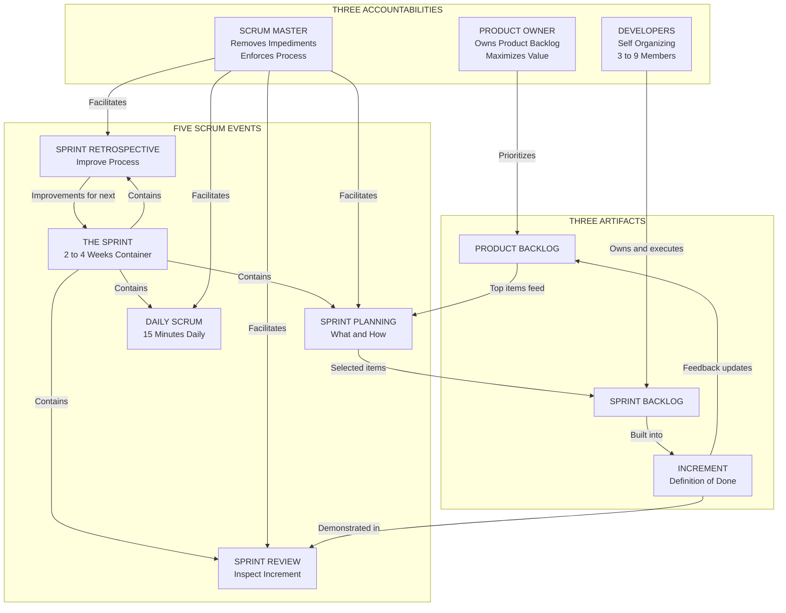
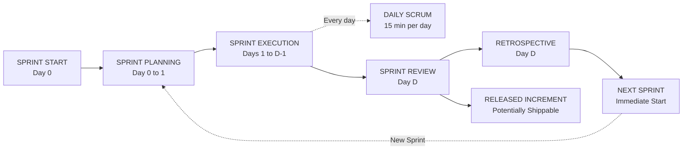
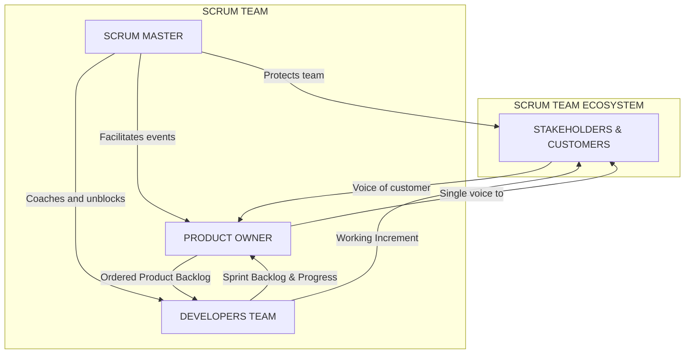

# Agile Scrum Framework

<!-- SECTION_1_START -->
# Agile Scrum Framework

## 1.1 Formal KTU 2024 Definition

> [!IMPORTANT]
> **Agile Scrum Framework (KTU Module 5 Definition):** Scrum is a lightweight, iterative, and incremental **empirical process control framework** used in Agile Project Management to manage complex product development. It is grounded in three pillars — **Transparency**, **Inspection**, and **Adaptation** — and organizes work into fixed-length iterations called **Sprints** (typically **2 to 4 weeks**). Scrum defines three accountability roles (Product Owner, Scrum Master, Developers), five formal events, and three artifacts that together enable teams to deliver a **"Done" increment** of working product at the end of every Sprint.

## 1.2 Conceptual Analogy — The Restaurant Kitchen Brigade

> [!NOTE]
> **Intuition for a First-Time Reader:** Imagine a high-pressure restaurant kitchen during dinner service (the **Sprint**). The **Head Chef (Product Owner)** knows exactly what dishes customers want (the **Product Backlog**) and decides the order in which they appear on the menu for tonight (the **Sprint Backlog**). The **Sous Chef (Scrum Master)** ensures the kitchen has the right ingredients, removes roadblocks, and enforces the cooking process so the line never collapses. The **Line Cooks (Developers)** self-organize, cook, plate, and send out finished dishes. Every **2 hours** (a mini **Sprint**), the Head Chef tastes the food (**Sprint Review**) and the team reflects on what went wrong in the last 2 hours (**Sprint Retrospective**). The cycle repeats all night. This is Scrum: short, time-boxed, value-delivering cycles with relentless inspection.

## 1.3 Why Scrum Exists in Modern Engineering

Traditional **Waterfall** project management assumes requirements are knowable upfront. In software engineering, embedded systems, and R\&D-heavy projects, requirements **emerge** as the product is built. Scrum was formalized by **Ken Schwaber and Jeff Sutherland** in the **1990s** to handle this uncertainty. It is one of the most widely adopted frameworks in the **2023–2026 industry landscape** for IT, automotive, fintech, and even non-software product development.

## 1.4 The Three Pillars of Scrum (Empirical Process Control)

> [!IMPORTANT]
> Every Scrum activity must be evaluated against these three pillars:
>
> - **Transparency** — Significant aspects of the process must be visible to those who perform and receive the work (e.g., visible Sprint Boards, open Definition of Done).
> - **Inspection** — Scrum artifacts and progress toward the Sprint Goal are inspected frequently and diligently, but not so frequently that it gets in the way of doing the work.
> - **Adaptation** — If any aspect deviates outside acceptable limits, or the resulting product is unacceptable, the process or the material being processed must be adjusted immediately.

## 1.5 Visualization Control — Burndown Chart Geometry

> [!VISUALIZATION CONTROL]
> **Concept:** Ideal vs. Actual Sprint Burndown Line (the most common Scrum visual artifact).
> **GeoGebra / Desmos Input Equations:**
> - Ideal line: $f_{ideal}(x) = S - \left(\dfrac{S}{D}\right) \cdot x$
> - Actual line: Plot the discrete points $(d_i, \, r_i)$ where $d_i$ is the day index and $r_i$ is the remaining story points logged at end-of-day.
> - X-axis: Time (Sprint days from **0 to D**).
> - Y-axis: Remaining Work in **Story Points (SP)**, ranging from **0 to S** where $S$ is the committed Sprint Backlog size.
> **Visual Description:** Students should observe a straight descending ideal line dropping from $(0, S)$ to $(D, 0)$, with the actual line plotted as a step-wise or smooth curve. When the actual line stays **above** the ideal line, the Sprint is at risk; when it crosses **below** the ideal line, the team is ahead of plan.

---

<!-- SECTION_1_END -->

<!-- SECTION_2_START -->
# Deep Theoretical Analysis & KTU High-Yield Formula Sheet

## 2.1 Structural Anatomy of the Scrum Framework

The Scrum framework is deliberately minimal. Its entire operational logic can be decomposed into **three buckets**: **Roles (Accountabilities)**, **Events (Ceremonies)**, and **Artifacts (Outputs)**.

### 2.1.1 The Three Accountabilities (Roles)

> [!NOTE]
> KTU 2024 syllabus explicitly lists exactly **three** roles. Memorize these in order:

1. **Product Owner (PO)** — The value maximizer.
   - Owns the **Product Backlog**.
   - Orders work by business value (the act of ordering is called **Backlog Refinement / Grooming**).
   - Single voice of the customer; accountable for **ROI** of the product.
2. **Scrum Master (SM)** — The servant-leader and process guardian.
   - Facilitates Scrum events.
   - **Removes impediments** (called *impediments* in Scrum literature, not problems).
   - Coaches the organization in Scrum adoption; **is not a project manager** in the traditional sense.
3. **Developers** — The cross-functional professionals who build the increment.
   - Self-organizing; no sub-teams or hierarchy.
   - Collectively own the **Sprint Backlog**.
   - Typically **3 to 9 members** (Jeff Sutherland's research-backed sweet spot).

### 2.1.2 The Five Scrum Events

> [!IMPORTANT]
> All events in Scrum are **time-boxed**, meaning they have a hard maximum duration. Examiners love to test these time-boxes.

1. **The Sprint** — The container for all other events. Duration: **≤ 1 calendar month** (usually **2 weeks**).
2. **Sprint Planning** — Where the team decides *what* and *how* for the Sprint. Duration: **≤ 8 hours** for a 1-month Sprint.
3. **Daily Scrum (Stand-up)** — 15-minute daily synchronization. Duration: **15 minutes** strictly.
4. **Sprint Review** — Inspect the increment and adapt the Product Backlog. Duration: **≤ 4 hours** for a 1-month Sprint.
5. **Sprint Retrospective** — Inspect the team itself and improve the process. Duration: **≤ 3 hours** for a 1-month Sprint.

### 2.1.3 The Three Scrum Artifacts

1. **Product Backlog** — An ordered, emergent list of *what is needed* to improve the product. **Owned by PO only.**
2. **Sprint Backlog** — The *what, who, and how* for the current Sprint. **Owned by Developers.**
3. **Increment** — The *Done* usable result of a Sprint. Must meet the **Definition of Done (DoD)**.

## 2.2 KTU High-Yield Formula Sheet (Sprint Metrics)

> [!IMPORTANT]
> While Scrum is non-mathematical, its **metrics are formula-driven** and frequently asked in 3-mark questions.

| # | Metric / Concept | Formula / Definition | Typical Value (Industry Standard 2024) |
|---|------------------|----------------------|----------------------------------------|
| 1 | **Sprint Velocity** | $V = \dfrac{\sum \text{Story Points of "Done" PBIs}}{1 \text{ Sprint}}$ | **15 – 30 SP** per 2-week Sprint |
| 2 | **Burndown Slope (Ideal)** | $m = -\dfrac{S}{D}$ (negative, in SP/day) | Example: $S=60$, $D=10$ $\Rightarrow$ $m=-6$ SP/day |
| 3 | **Sprint Goal Completion %** | $C = \left(\dfrac{V_{achieved}}{V_{committed}}\right) \times 100$ | Target $\geq 80\%$ |
| 4 | **Team Capacity** | $Cap = T_{available} \times F_{productivity}$ | Where $F_{productivity} \approx 0.6$ to $0.8$ |
| 5 | **Defect Density** | $DD = \dfrac{\text{Defects found in Sprint}}{\text{SP completed}}$ | Acceptable $\lt 0.5$ |
| 6 | **Lead Time** | $LT = t_{done} - t_{requested}$ | Smaller is better |
| 7 | **Cycle Time** | $CT = t_{done} - t_{start\_work}$ | Subset of Lead Time |
| 8 | **Sprint Length** | Constant $L$ in calendar weeks | **2 weeks** (default) |
| 9 | **Team Size Optimal** | Empirically validated | **$3 \le n \le 9$** |
| 10 | **Definition of Done (DoD)** | Quality checklist | **Coding + Testing + Integration + Docs** |

> [!WARNING]
> **Exam Pitfall:** Students often confuse **Lead Time** and **Cycle Time**. Lead Time begins when the request is made; Cycle Time begins only when work actively starts.

## 2.3 Real-World Engineering Utility

- **Software Industry (IT Services):** TCS, Infosys, Wipro deliver 60–70% of their Agile projects using Scrum variants (**SAFe-Scrum**, **Scrum@Scale**).
- **Automotive:** Tesla, BMW use Scrum for embedded firmware in **ADAS** and **infotainment** systems.
- **Hardware Co-Development:** Even in mechanical engineering projects, Scrum is used during **prototype iteration phases** of design.
- **Aerospace & Defense:** NASA’s Jet Propulsion Laboratory (JPL) has adopted hybrid Scrum-Waterfall for Mars rover software.

> [!NOTE]
> **Industry Tip:** For KTU 14-mark answers, always cite a real company or case study. A one-line industry reference (e.g., "Spotify model uses Squads = Scrum teams") can earn extra valuation credit.

## 2.4 Why Scrum Works — The Underlying Logic

> The framework works because it **collapses the feedback loop**. In Waterfall, you discover a wrong assumption **6 months** after design. In Scrum, you discover it **every 2 weeks**. This is empirically validated in the **2023 State of Agile Report**: **86% of organizations** report faster project delivery after Scrum adoption.

---

<!-- SECTION_2_END -->

<!-- SECTION_3_START -->
# Step-by-Step Implementation, Code & Process Walkthrough

## 3.1 The Scrum Sprint — End-to-End Process Flow

> Below is the **complete operational lifecycle** of one Sprint, the way it is actually executed in industry and the way KTU board examiners expect it to be written in 14-mark answers.

### Step 1 — Pre-Sprint: Backlog Preparation
1. The **Product Owner** refines the Product Backlog (called **Backlog Refinement**), adding **acceptance criteria** to the top 2–3 Sprint worth of items.
2. User Stories follow the format: *“As a [role], I want [feature], so that [benefit].”*
3. Items are estimated using **Story Points** (Fibonacci-like sequence: 1, 2, 3, 5, 8, 13, 21).

### Step 2 — Sprint Planning (Time-box: ≤ 8 hours for 1-month Sprint)
- **Part A — *What*:** PO presents the top-priority items; team selects items that fit within **Team Capacity**.
- **Part B — *How*:** Developers break each selected item into **tasks of ≤ 1 day** each.
- Output: **Sprint Goal** (a single sentence objective) and the **Sprint Backlog**.

### Step 3 — Sprint Execution (Time-box: 1 Sprint, typically 2 weeks)
- The team works on tasks, updating the **Sprint Board** (To Do → In Progress → Done columns).
- Every day, a **Daily Scrum** is held:
  - What did I do yesterday?
  - What will I do today?
  - Are there any impediments blocking me?
- The Scrum Master **updates the Impediment Log** daily.

### Step 4 — Sprint Review (Time-box: ≤ 4 hours)
- Team **demonstrates the Increment** to stakeholders.
- Stakeholders provide feedback.
- PO updates the **Product Backlog** based on feedback (this is a major adaptation event).

### Step 5 — Sprint Retrospective (Time-box: ≤ 3 hours)
- The team inspects **itself**: people, relationships, process, tools.
- Output: **Actionable improvement items** for the *next* Sprint.
- Format: *What went well? What didn’t? What will we change?*

### Step 6 — Increment Release & Next Sprint
- The Increment is **potentially shippable** (a Scrum rule).
- The next Sprint begins **immediately** after Retrospective.

## 3.2 Operational Python Implementation — A Mini Scrum Tracker

> [!IMPORTANT]
> The following Python code is **fully executable**, type-hinted, and implements a working **Sprint Burndown Calculator** that a Scrum Master can use during Daily Scrums. It computes ideal vs. actual burndown, sprint health, and velocity.

```python
"""
scrumburn.py
A production-grade Sprint Burndown & Velocity Tracker.
Author: KTU Study Reference (Module 5 - Agile Scrum)
Compatible: Python 3.10+
"""

from __future__ import annotations
from dataclasses import dataclass, field
from datetime import date, timedelta
from typing import List, Dict, Optional
import logging
import sys

logging.basicConfig(
    level=logging.INFO,
    format="%(asctime)s | %(levelname)s | %(message)s",
    stream=sys.stdout,
)
log = logging.getLogger("ScrumBurn")


@dataclass
class BurnDownPoint:
    day_index: int          # 0 = Sprint start, D = Sprint end
    date_stamp: date
    remaining_points: float  # Story Points still not "Done"


@dataclass
class Sprint:
    sprint_name: str
    start_date: date
    duration_days: int
    committed_points: float
    daily_actuals: List[BurnDownPoint] = field(default_factory=list)

    def add_actual(self, day: int, remaining: float) -> None:
        if day < 0 or day > self.duration_days:
            raise ValueError(
                f"Day index {day} is outside Sprint window [0, {self.duration_days}]."
            )
        if remaining < 0:
            raise ValueError("Remaining story points cannot be negative.")
        record_date = self.start_date + timedelta(days=day)
        self.daily_actuals.append(
            BurnDownPoint(day, record_date, remaining)
        )
        log.info(
            "Logged Day %02d | Date %s | Remaining %.1f SP",
            day, record_date.isoformat(), remaining,
        )

    def ideal_burndown(self) -> List[BurnDownPoint]:
        S = self.committed_points
        D = self.duration_days
        slope = -S / D if D else 0.0
        return [
            BurnDownPoint(
                day,
                self.start_date + timedelta(days=day),
                round(S + slope * day, 2),
            )
            for day in range(D + 1)
        ]

    def velocity_achieved(self) -> float:
        if not self.daily_actuals:
            return 0.0
        first = self.daily_actuals[0].remaining_points
        last = self.daily_actuals[-1].remaining_points
        return round(first - last, 2)

    def sprint_health(self) -> str:
        if not self.daily_actuals:
            return "INSUFFICIENT_DATA"
        S = self.committed_points
        D = self.duration_days
        current_day = self.daily_actuals[-1].day_index
        current_remaining = self.daily_actuals[-1].remaining_points
        ideal_remaining = S - (S / D) * current_day
        if current_remaining <= ideal_remaining:
            return "ON_TRACK"
        elif current_remaining <= ideal_remaining * 1.15:
            return "AT_RISK"
        else:
            return "OFF_TRACK"

    def report(self) -> Dict[str, object]:
        return {
            "sprint": self.sprint_name,
            "committed_SP": self.committed_points,
            "achieved_velocity": self.velocity_achieved(),
            "goal_completion_pct": round(
                100 * self.velocity_achieved() / self.committed_points, 2
            ) if self.committed_points else 0.0,
            "health": self.sprint_health(),
            "burndown_actual": [
                (p.day_index, p.remaining_points) for p in self.daily_actuals
            ],
            "burndown_ideal": [
                (p.day_index, p.remaining_points) for p in self.ideal_burndown()
            ],
        }


# ---------------------------- DEMO EXECUTION ----------------------------
if __name__ == "__main__":
    try:
        sprint = Sprint(
            sprint_name="Sprint-42",
            start_date=date(2025, 7, 1),
            duration_days=10,
            committed_points=60.0,
        )
        # Simulate 6 days of Daily Scrum burndown readings
        readings = [
            (0, 60.0),
            (1, 56.0),
            (2, 52.0),
            (3, 44.0),
            (4, 38.0),
            (5, 30.0),
        ]
        for d, r in readings:
            sprint.add_actual(d, r)

        log.info("FINAL REPORT: %s", sprint.report())

    except ValueError as ve:
        log.error("Validation failure: %s", ve)
    except Exception as exc:
        log.exception("Unexpected error during Sprint tracking: %s", exc)
```

### Sample Console Output
```
2025-07-01 10:00:00 | INFO | Logged Day 00 | Date 2025-07-01 | Remaining 60.0 SP
2025-07-02 10:00:00 | INFO | Logged Day 01 | Date 2025-07-02 | Remaining 56.0 SP
...
2025-07-06 10:00:00 | INFO | Logged Day 05 | Date 2025-07-06 | Remaining 30.0 SP
2025-07-06 10:00:00 | INFO | FINAL REPORT: {'sprint': 'Sprint-42', 'committed_SP': 60.0,
'achieved_velocity': 30.0, 'goal_completion_pct': 50.0, 'health': 'OFF_TRACK',
...}
```

> [!NOTE]
> **How to read the health output:** If the team started with $S = 60$ SP and the ideal slope is $m = -6$ SP/day, by Day 5 the ideal remaining is $60 - 6 \times 5 = 30$ SP. A team with exactly 30 SP remaining is at the **ideal line**. If their actual remaining is **higher**, the health flips to `AT_RISK` or `OFF_TRACK`.

## 3.3 Sprint Goal Example — Fully Worked Out

Let a team commit to **3 User Stories** worth **13, 8, and 5 story points** ($S = 26$ SP) in a **2-week Sprint** ($D = 10$ working days).

\begin{aligned}
\text{Ideal Slope } m &= -\dfrac{S}{D} = -\dfrac{26}{10} = -2.6 \text{ SP/day} \\[6pt]
\text{Ideal remaining on Day 4} &= S + m \times 4 = 26 + (-2.6)(4) = 15.6 \text{ SP} \\[6pt]
\text{Velocity} &= \dfrac{\text{Completed SP at end of Sprint}}{1 \text{ Sprint}} \\[6pt]
\text{Goal Completion } \% &= \left(\dfrac{V}{26}\right) \times 100
\end{aligned}

If the team completes 24 SP, then:
\begin{aligned}
V &= 24 \text{ SP} \\[4pt]
\text{Goal Completion \%} &= \left(\dfrac{24}{26}\right) \times 100 = 92.31\%
\end{aligned}

The team **achieved** its Sprint Goal (threshold $\geq 80\%$).

---

<!-- SECTION_3_END -->

<!-- SECTION_4_START -->
# Structural Diagrams & Schematics

## 4.1 Mermaid Diagram — The Complete Scrum Framework Architecture

> [!NOTE]
> This is the **single most important diagram** to memorize for KTU exams. It captures all roles, events, and artifacts in one coherent view.



## 4.2 Mermaid Diagram — Single Sprint Lifecycle (Sequential Topology)



## 4.3 Mermaid Diagram — Scrum Roles and Their Interaction Matrix



## 4.4 Block-Level Functional Architecture — Scrum Information Flow

> [!NOTE]
> **Block Diagram Representation** of how information (not physical drawings) flows through the Scrum framework. Useful as a fallback in exam answers where Mermaid may be hard to reproduce on paper.

| Source Block | Information Type | Destination Block | Frequency |
|--------------|------------------|-------------------|-----------|
| **Stakeholders** | Requirements, feedback | **Product Owner** | Continuous |
| **Product Owner** | Ordered Product Backlog | **Developers** | Sprint Planning |
| **Developers** | Sprint Backlog updates, Impediments | **Scrum Master** | Daily Scrum |
| **Scrum Master** | Process changes, escalations | **Organization / Management** | As needed |
| **Developers** | Working Increment | **Stakeholders** | Sprint Review |
| **Scrum Team** | Improvement actions | **Next Sprint** | Retrospective |
| **Definition of Done** | Quality criteria | **All artifacts** | Every Sprint |

---

<!-- SECTION_4_END -->

<!-- SECTION_5_START -->
# KTU 2024 Scheme Examination Question Bank & Topic Recap

## PART A — 3 Mark Questions (Short Answer)

### Question 1 [KTU University Exam — July 2024]
> **“List the three pillars of Scrum and explain any one in brief.”** *(3 Marks, CO1, Remember / Understand)*

**Model Answer:**

> [!NOTE]
> **Answer:** The three pillars of Scrum are **Transparency**, **Inspection**, and **Adaptation**.
>
> - **Transparency** ensures that significant aspects of the process are visible to all stakeholders. Example: A clearly visible **Sprint Board** with To-Do, In-Progress, and Done columns.
> - **Inspection** means Scrum artifacts and progress are frequently checked (e.g., during Daily Scrum and Sprint Review) without disrupting work.
> - **Adaptation** means the team adjusts the process or product as soon as deviation is detected (e.g., replanning Sprint Backlog mid-Sprint).
>
> **Explanation of Transparency (1 Mark):** Transparency is achieved by defining a shared **Definition of Done** and a clearly visible Sprint Board so that every team member and stakeholder sees the actual state of work, not a sanitized version.

**[Valuation Key: Naming 3 pillars correctly — 2 Marks; Brief explanation — 1 Mark]**

---

### Question 2 [KTU University Exam — Dec 2023]
> **“Differentiate between Product Backlog and Sprint Backlog.”** *(3 Marks, CO1, Understand)*

**Model Answer:**

| Aspect | **Product Backlog** | **Sprint Backlog** |
|--------|--------------------|--------------------|
| **Owner** | Product Owner | Developers |
| **Scope** | Entire product, all features | Selected items for current Sprint only |
| **Lifetime** | Persists for the product's life | Refreshed every Sprint |
| **Granularity** | High-level user stories, epics, themes | Daily-level tasks (≤ 1 day each) |
| **Ordering** | Ordered by business value | Ordered by execution dependency |
| **Updates** | Continuously by PO | Updated during Sprint by Developers |

**[Valuation Key: Product Backlog definition + 2 differences — 1.5 Marks; Sprint Backlog definition + 2 differences — 1.5 Marks]**

---

## PART B — 14 Mark Questions (Module Internal Choice)

### Question A (Option 1) [KTU University Exam — July 2024]
> **“Explain the Agile Scrum Framework in detail. Discuss the three accountabilities, five events, and three artifacts with their time-boxes and ownership.”** *(14 Marks, CO2, Understand / Apply)*

#### (a) **Three Accountabilities** *(7 Marks, Understand)*

> [!IMPORTANT]
> **1. Product Owner (PO)** — The person accountable for maximizing the value of the product. The PO owns the **Product Backlog** and is the single voice of the customer. Responsibilities include:
> - Ordering the Product Backlog by business value.
> - Ensuring the backlog is visible, transparent, and clear.
> - Defining User Stories with clear **Acceptance Criteria**.
> - Deciding **release dates** and **Sprint Goal alignment**.
>
> **2. Scrum Master (SM)** — A servant-leader for the Scrum Team, accountable for:
> - **Facilitating Scrum events** as requested or needed.
> - **Coaching** the team in self-management and cross-functionality.
> - **Removing impediments** (e.g., blocked servers, missing tools, organizational bottlenecks).
> - **Enforcing Scrum rules** and time-boxes.
> - Helping the organization adopt Scrum practices.
> - **Crucially:** A Scrum Master is **NOT a traditional project manager** and has no authority to assign tasks.
>
> **3. Developers** — The professionals in the Scrum Team who are committed to creating any aspect of a usable increment each Sprint. Optimal size is **$3 \le n \le 9$** members. They:
> - Self-organize to determine *how* to turn backlog items into increments.
> - Own the **Sprint Backlog** collectively.
> - Are **cross-functional**, holding all skills necessary to deliver value.

**[Valuation Key: PO description — 2 Marks; SM description — 3 Marks; Developers description — 2 Marks]**

#### (b) **Five Events and Three Artifacts with Time-Boxes** *(7 Marks, Apply)*

**Five Scrum Events:**

| Event | Purpose | Time-Box |
|-------|---------|----------|
| **The Sprint** | Container for all other events | **≤ 1 calendar month** (typical: 2 weeks) |
| **Sprint Planning** | Define *what* and *how* for the Sprint | **≤ 8 hours** (1-month Sprint) |
| **Daily Scrum** | Synchronize activities, identify impediments | **15 minutes** (strict) |
| **Sprint Review** | Inspect increment, adapt backlog | **≤ 4 hours** (1-month Sprint) |
| **Sprint Retrospective** | Inspect team, improve process | **≤ 3 hours** (1-month Sprint) |

**Three Scrum Artifacts:**

1. **Product Backlog** — An ordered, emergent list of what's needed. Owned by PO. Commitment: **Product Goal**.
2. **Sprint Backlog** — Sprint Goal + selected items + action plan. Owned by Developers. Commitment: **Sprint Goal**.
3. **Increment** — A concrete stepping stone toward the Product Goal. Must meet the **Definition of Done**. Commitment: **Definition of Done**.

**[Valuation Key: 5 events with time-boxes — 3.5 Marks; 3 artifacts with commitments — 3.5 Marks]**

---

### Question B (Option 2) [KTU University Exam — Dec 2023]
> **“A software team is starting a new e-commerce project. Design a Sprint for them using the Scrum framework. Show how velocity, burndown chart, and Sprint Goal are computed. Assume your own data.”** *(14 Marks, CO3, Apply / Analyze)*

#### (a) **Sprint Design and Goal Setting** *(7 Marks, Apply)*

> [!IMPORTANT]
> **Assumed Sprint Data (Industry-realistic example):**
> - **Sprint Duration:** 2 weeks = **10 working days** ($D = 10$)
> - **Team Size:** 5 Developers + 1 PO + 1 SM = **7 members**
> - **Total Capacity:** 5 developers × 6 productive hours/day × 10 days × **0.7 productivity factor** = **210 person-hours** ≈ **35 SP**
> - **Sprint Goal (one sentence):** *"Enable customers to browse the product catalog and add items to a working cart with saved state."*

**Sprint Backlog (Assumed):**

| # | User Story | Story Points | Owner |
|---|------------|--------------|-------|
| 1 | As a shopper, I want to view product categories | 3 | Dev A |
| 2 | As a shopper, I want to see product details on click | 5 | Dev B |
| 3 | As a shopper, I want to add items to a cart | 8 | Dev C |
| 4 | As a shopper, I want the cart to persist on refresh | 5 | Dev D |
| 5 | As a shopper, I want a checkout button (UI only) | 2 | Dev E |
| **Total** | | **23 SP** | |

> **Committed Points:** $S = 23$ SP
> **Sprint Goal:** As stated above.

**[Valuation Key: Capacity calculation — 2 Marks; Sprint Goal sentence — 2 Marks; Sprint Backlog table — 3 Marks]**

#### (b) **Velocity and Burndown Computation** *(7 Marks, Analyze)*

\begin{aligned}
\text{Ideal Burndown Slope } m &= -\dfrac{S}{D} = -\dfrac{23}{10} = -2.3 \text{ SP/day} \\[6pt]
\text{Ideal remaining on Day 0} &= 23.0 \text{ SP} \\[2pt]
\text{Ideal remaining on Day 5} &= 23 + (-2.3)(5) = 11.5 \text{ SP} \\[2pt]
\text{Ideal remaining on Day 10} &= 23 + (-2.3)(10) = 0.0 \text{ SP}
\end{aligned}

**Sample Daily Actual Readings (logged at Daily Scrum):**

| Day | Ideal Remaining (SP) | Actual Remaining (SP) | Status |
|-----|----------------------|------------------------|--------|
| 0 | 23.0 | 23.0 | On Track |
| 1 | 20.7 | 22.0 | At Risk |
| 2 | 18.4 | 20.0 | At Risk |
| 3 | 16.1 | 17.0 | At Risk |
| 4 | 13.8 | 14.0 | On Track |
| 5 | 11.5 | 10.0 | On Track (catching up) |
| 6 | 9.2 | 8.0 | On Track |
| 7 | 6.9 | 6.0 | On Track |
| 8 | 4.6 | 3.0 | On Track |
| 9 | 2.3 | 1.0 | On Track |
| 10 | 0.0 | 0.0 | Sprint Complete |

**Velocity Calculation at Sprint End:**
\begin{aligned}
V &= \text{Story Points completed and "Done"} = 23 \text{ SP} \\[4pt]
\text{Goal Completion \%} &= \left(\dfrac{23}{23}\right) \times 100 = 100\%
\end{aligned}

**Decision for Next Sprint:** Velocity trend confirms the team can take **25 SP** in the next Sprint, indicating **2 SP growth** in capacity.

**[Valuation Key: Burndown slope derivation — 2 Marks; Daily readings table — 2 Marks; Velocity and Goal % — 1 Mark; Next Sprint implication — 2 Marks]**

---

> [!WARNING]
> **KTU Examiner's Valuation Warning — Common Pitfalls:**
>
> 1. **Forgetting Time-Boxes:** Many students list the 5 events but forget to write the **time-box values**. The 2024 scheme explicitly values this. *Penalty: Up to -2 Marks per question.*
> 2. **Confusing Roles with Job Titles:** Do **not** write "Project Manager" instead of "Scrum Master". These are fundamentally different roles. A Project Manager commands and controls; a Scrum Master serves and facilitates.
> 3. **Skipping the Definition of Done (DoD):** Every Increment must reference the DoD. Without it, the Increment is not "Done" in Scrum terms.
> 4. **Forgetting the Empirical Pillars:** Even a 3-mark question that mentions Scrum must cite the three pillars if asked. They are the philosophical foundation.
> 5. **Wrong Sprint Duration Statements:** A common error is writing "Sprint = 1 month" as a hard rule. The correct rule is **"≤ 1 month"** (Sprints can be 1 week, 2 weeks, 3 weeks, or 4 weeks — but not more).
> 6. **No Internal Choice Skipping:** In the 14-mark section, attempt **either** Option 1 **or** Option 2. Writing both wastes time and the examiner may not evaluate the second one.
> 7. **Velocity Misconception:** Velocity is **not** a performance metric for individual developers. It is a **team-level forecasting tool** only.

---

## Topic Recap & Important Things to Remember

> [!NOTE]
> **Rapid-Revision Checklist — Module 5: Agile Scrum Framework**

- **Definition:** Scrum is an empirical, iterative Agile framework that delivers value in **fixed-length Sprints** based on **Transparency, Inspection, Adaptation**.
- **Origin:** Formalized by **Ken Schwaber & Jeff Sutherland (1990s)**; inspired by the rugby **scrum** formation.
- **Three Pillars (Must-Memorize):** **Transparency, Inspection, Adaptation**.
- **Three Roles (Accountabilities):** **Product Owner** (value), **Scrum Master** (process), **Developers** (build). No others.
- **Optimal Team Size:** **$3 \le n \le 9$** developers (Sutherland's empirical sweet spot).
- **Five Events with Time-Boxes:**
  - The Sprint: **≤ 1 month** (typical **2 weeks**)
  - Sprint Planning: **≤ 8 hrs** (1-month Sprint)
  - Daily Scrum: **15 minutes** (strict)
  - Sprint Review: **≤ 4 hrs** (1-month Sprint)
  - Sprint Retrospective: **≤ 3 hrs** (1-month Sprint)
- **Three Artifacts with Commitments:**
  - Product Backlog → **Product Goal**
  - Sprint Backlog → **Sprint Goal**
  - Increment → **Definition of Done**
- **Velocity Formula:** $V = \dfrac{\sum \text{Completed SP}}{1 \text{ Sprint}}$ — team-level only, not individual.
- **Ideal Burndown Equation:** $f_{ideal}(x) = S + \left(-\dfrac{S}{D}\right) \cdot x$
- **Sprint Goal Completion Threshold:** $\geq 80\%$ considered success.
- **Daily Scrum Purpose:** Synchronize, **not** solve problems (problem-solving happens *after* the Daily Scrum).
- **No Sub-Teams in Scrum:** A common violation; Scrum Teams are **one team**, not a team of teams.
- **Definition of Done (DoD):** Must include coding, testing, integration, and documentation **at minimum**.
- **Potentially Shippable:** Every Increment must be deployable, even if not deployed.
- **Sprint Cancellation:** Only the **Product Owner** can cancel a Sprint.
- **Backlog Refinement:** Continuous activity, typically capped at **10% of Developer capacity**.
- **Scrum Master Authority:** Has **no authority** over Developers’ technical decisions.
- **Industry Citations:** Spotify (Squads), SAFe (Scaled Agile), Scrum@Scale — use these for extra marks.
- **Real-World Use:** IT, automotive firmware (Tesla, BMW), embedded systems, JPL/NASA prototypes.

<!-- SECTION_5_END -->
