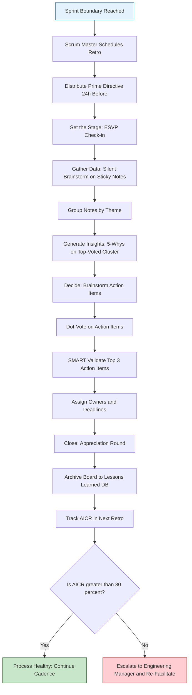
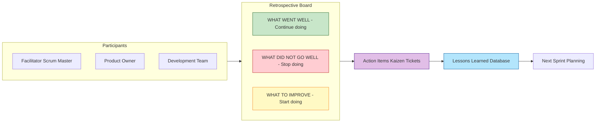
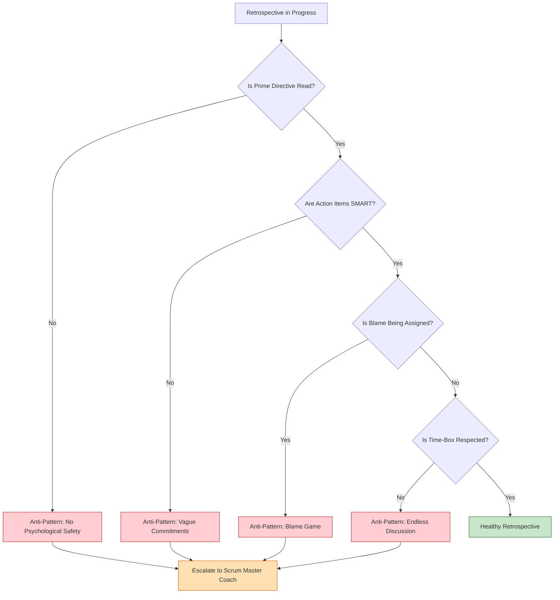
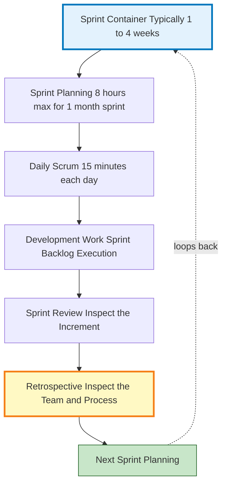

# Project Retrospectives

<!-- SECTION_1_START -->

# 1. Core Technical Definition & Intuitive Overview

## 1.1 Formal KTU 2024 Definition

> [!IMPORTANT]
> **Project Retrospective (Sprint Retrospective / Sprint Review)**: A structured, time-boxed meeting held at the end of a project, phase, or sprint in which the project team collectively reflects on the just-completed work cycle to identify **what went well**, **what did not go well**, and **what can be improved** in the next iteration. It is a core ceremony of the **Agile (Scrum)** framework and a critical Knowledge Area under the **PMBOK Guide's "Resource Management"** and **"Stakeholder Engagement"** processes.

According to the **KTU 2024 Scheme syllabus (UEHUT704 - Project Lifecycle Management)**, Module 5 positions the Retrospective as the **final formal closure event** in the iterative project lifecycle, sitting between *Project Closeout* and *Lessons Learned*. It is the mechanism that converts **tacit team experience** into **explicit organizational knowledge (Lessons Learned Database)**.

## 1.2 Intuitive Analogy: The Football Team Huddle

Imagine a football team returning to the locker room at **half-time**. They are not celebrating the goals scored or mourning the goals conceded — they are doing something far more strategic: the captain and coach ask three simple questions:

- 🟢 **What worked?** (Keep doing this)
- 🔴 **What didn't work?** (Stop doing this)
- 🟡 **What new thing should we try?** (Start doing this)

Then they walk back onto the pitch **better than they were 15 minutes ago**. That locker-room huddle is exactly what a **Project Retrospective** is in the software / engineering world — a structured half-time check that transforms a group of individual players into a **self-correcting, continuously improving team system**.

> [!NOTE]
> **KTU Board Emphasis**: A Retrospective is NOT a status meeting and NOT a blame session. It is a **psychologically safe, future-focused, action-oriented** reflection ritual. Examiners will explicitly deduct marks if you describe it as "blaming underperforming members."

## 1.3 Placement in the Project Lifecycle

$$
\text{Initiate} \;\rightarrow\; \text{Plan} \;\rightarrow\; \text{Execute} \;\rightarrow\; \text{Monitor \& Control} \;\rightarrow\; \boxed{\text{Retrospective}} \;\rightarrow\; \text{Closeout} \;\rightarrow\; \text{Lessons Learned}
$$

The Retrospective is the **bridge** between *Monitor & Control* and *Closeout*, ensuring that empirical process control is institutionalized before final delivery.

> [!VISUALIZATION CONTROL]
> **Concept:** Retrospective Position in Iterative Spiral
> **Conceptual Plot:** Plot a clockwise spiral on a 2D plane representing iterative cycles.
> **Plot Equations / Sequence Points:**
> * $P_1 = (1, 0)$ — Initiate
> * $P_2 = (1, 1)$ — Plan
> * $P_3 = (0, 1)$ — Execute
> * $P_4 = (-1, 0)$ — Monitor
> * $P_5 = (0, -1)$ — **Retrospective (current focus)**
> * $P_6 = (1, -1)$ — Lessons Learned
> **Visual Description:** The student should observe a spiral where each loop's endpoint connects upward and inward to the next loop's starting point, visually demonstrating that each retrospective feeds the planning of the next iteration (Empiricism: inspect → adapt).

---

## 1.4 Key Terminology (KTU Board-Ready Glossary)

| Term | Definition |
|---|---|
| **Sprint** | A fixed time-box (typically **1–4 weeks**) during which a usable product increment is created. |
| **Scrum Master** | The facilitator of the Retrospective; responsible for psychological safety, time-boxing, and ensuring action items are tracked. |
| **Product Owner** | The voice of the customer; attends the Retrospective to provide business context. |
| **Development Team** | The cross-functional members (coders, testers, designers) who actually executed the work. |
| **Velocity** | The amount of work (story points) completed in a sprint; used to track improvement. |
| **Definition of Done (DoD)** | The agreed-upon checklist of criteria a product increment must satisfy. |
| **Action Item (Kaizen)** | A small, measurable, time-bound improvement experiment committed at the end of the Retrospective. |
| **Psychological Safety** | The shared belief that the team is safe for interpersonal risk-taking (Amy Edmondson's construct). |

> [!IMPORTANT]
> **Standard Industry Benchmark**: The **State of Agile Report** consistently shows that teams practising regular Retrospectives report a **60–80% higher** project success rate and a measurable reduction in defect density across sprints.

<!-- SECTION_1_END -->

<!-- SECTION_2_START -->

# 2. Deep Theoretical Analysis & KTU High-Yield Formula Sheet

## 2.1 The Three Pillars of Scrum (Empiricism Foundation)

Every Retrospective is built on **Scrum's Three Pillars**, and a KTU examiner will award 2 marks for explicitly naming them:

$$
\boxed{\text{Empiricism} = \text{Transparency} + \text{Inspection} + \text{Adaptation}}
$$

1. **Transparency** — Significant aspects of the process must be visible to those who perform and receive the work. (No hiding bugs, no fake burn-down charts.)
2. **Inspection** — The Scrum artifacts (Sprint Backlog, Increment, Burndown) and the team's behaviour must be inspected frequently, but **not so often that it gets in the way of the work**.
3. **Adaptation** — If any element deviates outside acceptable limits, or the resulting product is unacceptable, the process or the material being processed must be adjusted — **as soon as possible** to minimize further deviation.

> [!NOTE]
> The Retrospective is the **single Scrum event** where Adaptation is formally triggered for the *process* (as opposed to the Sprint Review, which adapts the *product*).

## 2.2 The Retrospective Prime Directive

> **"Regardless of what we discover, we understand and truly believe that everyone did the best job they could, given what was known at the time, their skills and abilities, the resources available, and the situation at hand."**
> — *Norm Kerth, Project Retrospectives*

This directive establishes **psychological safety** — without it, the Retrospective degenerates into blame and becomes useless.

## 2.3 The 5-Phase Retrospective Process (Gabriel Silberman / Derby/Larsen Model)

The standard industry process, which KTU questions often require students to enumerate for **5 marks**, is:

1. **Set the Stage** — Ice-breaker, time-box agreement, ground rules. *(approx. **5%** of time)*
2. **Gather Data** — Collect facts, metrics, events of the just-finished sprint. *(approx. **25%** of time)*
3. **Generate Insights** — Why did the data look the way it did? Root-cause analysis using **5 Whys** or **Fishbone diagrams**. *(approx. **30%** of time)*
4. **Decide What to Do** — Vote on action items using **dot-voting** or **fist-of-five**. *(approx. **30%** of time)*
5. **Close the Retrospective** — Appreciation round, recap action items, set ownership. *(approx. **10%** of time)*

## 2.4 The 5 Whys Root-Cause Technique

$$
\text{Symptom} \;\xrightarrow{\text{Why?}}\; \text{Cause}_1 \;\xrightarrow{\text{Why?}}\; \text{Cause}_2 \;\xrightarrow{\text{Why?}}\; \cdots \;\xrightarrow{\text{Why?}}\; \text{Root Cause}_n
$$

Typically $n = 5$, but the number is **iterative** — stop when the cause is something the team can directly control.

## 2.5 KTU High-Yield Formula Sheet

| Concept | Formula / Rule | Application |
|---|---|---|
| **Retrospective Duration** | $T_{\text{retro}} = \min\!\left(3 \text{ hours},\; 45 \text{ min} \times N_{\text{weeks}}\right)$ | For a 2-week sprint, allocate $90$ minutes. |
| **Team Velocity Trend** | $V_{\text{avg}} = \dfrac{1}{n}\sum_{i=1}^{n} V_i$ | A rising $V_{\text{avg}}$ across retros = process improvement working. |
| **Action Item Completion Rate** | $\text{AICR} = \dfrac{N_{\text{completed}}}{N_{\text{committed}}} \times 100\%$ | Target $\geq 80\%$; if lower, the retrospective itself is a process failure. |
| **Satisfaction / Mood Index** | $M = \dfrac{1}{n}\sum_{i=1}^{n} \text{mood}_i \in [1, 10]$ | Tracked sprint-over-sprint; falling $M$ triggers escalation. |
| **Defect Escape Rate** | $\text{DER} = \dfrac{D_{\text{escaped}}}{D_{\text{total}}} \times 100\%$ | Lowering DER = improved engineering practices. |
| **Definition of Done Compliance** | $\text{DoDC} = \dfrac{N_{\text{passed DoD}}}{N_{\text{total stories}}} \times 100\%$ | Should equal $100\%$ at sprint boundary. |
| **Psychological Safety Score** | $\text{PS} = \dfrac{N_{\text{agree (safe)}}}{N_{\text{team}}} \times 100\%$ | Edmondson 7-point Likert scaled. |
| **Kaizen Cost** | $\text{Kaizen}_{\text{cost}} \leq 5\% \text{ of project budget}$ | Classical Toyota rule for improvement experiments. |

> [!NOTE]
> **Board Pitfall**: When asked for the "duration of a Retrospective for a 1-month sprint," students often write "1 hour." The correct answer per the **Scrum Guide** is **$3$ hours** (the cap), because $4 \text{ weeks} \times 45 \text{ min} = 180 \text{ min} = 3 \text{ hours}$.

## 2.6 Popular Retrospective Formats (KTU Favourite)

| Format | Three Columns | Best For |
|---|---|---|
| **Start / Stop / Continue** | New things to begin / things to halt / things to maintain | First-time retros, simple teams |
| **Mad / Sad / Glad** | Frustrations / Disappointments / Joys | Emotionally charged sprints |
| **4 Ls** | Liked / Learned / Lacked / Longed For | Long projects, end-of-phase |
| **Sailboat** | Wind (helping) / Anchor (slowing) / Rocks (risks) / Island (goal) | Visual / kinesthetic learners |
| **Timeline** | Plot events on a horizontal axis, vote on peaks & valleys | Complex, multi-team retros |
| **KALM** | Keep / Add / Less / More | Quantitative, metric-driven teams |
| **What Went Well / What Didn't / What to Improve (WWW/WD/WI)** | The classic PMBOK-aligned tri-column | KTU board standard answer |

## 2.7 Real-World Engineering & CS Utility

- **Software Engineering**: Sprint Retros in **DevOps CI/CD pipelines** (Jira + Confluence + Slack automation).
- **Civil / Mechanical Engineering**: Post-construction project reviews; aligning with **ISO 9001:2015 Clause 10.3** (Continual Improvement).
- **Aerospace**: NASA's **Post-Mission Reviews (Apollo, Shuttle)** — direct ancestors of the modern retrospective.
- **Healthcare**: **Morbidity & Mortality (M&M) conferences** in hospitals are medical-domain retrospectives.
- **Production Engineering**: **Toyota Kata** and **Ohno Circles** are industrial-grade retrospectives.
- **Academic Project Teams (KTU Mini-Projects)**: Used in Capstone and Hackathon evaluation rubrics.

<!-- SECTION_2_END -->

<!-- SECTION_3_START -->

# 3. Step-by-Step Derivations & Code/Symbolic Implementation

## 3.1 End-to-End Retrospective Execution: Exhaustive Walkthrough

Below is the **complete operational run-book** for executing a Retrospective. Every step is explicitly stated — no shorthand, no "subsequent steps similar to above."

### **STEP 1 — Pre-Retrospective Preparation (Scrum Master Responsibilities)**

1. **Schedule the meeting** within the last $\leq 3$ days of the sprint boundary.
2. **Invite all 3–9 team members**, the Product Owner, and (optionally) stakeholders.
3. **Reserve a room with a whiteboard / Miro / Mural board**.
4. **Distribute the "Prime Directive"** to all attendees $24$ hours in advance.
5. **Pull sprint metrics**: Velocity, Burndown, Defect Count, Carry-over stories.
6. **Open a digital board** with three columns: *What Went Well*, *What Didn't*, *Improvements*.

> [!IMPORTANT]
> A Retrospective that begins without data is a Retrospective that becomes a chat session.

### **STEP 2 — Set the Stage (5 minutes)**

1. Welcome everyone, read the Prime Directive aloud.
2. Do an **ESVP check-in** (Explorer / Shopper / Vacationer / Prisoner) — a 1-word mood vote that tells the facilitator the team's psychological state.
3. Agree on the time-box: $90$ minutes for a 2-week sprint.

> [!NOTE]
> **ESVP** is a Norman Kerth construct — Explorer = curious, Shopper = looking for value, Vacationer = mentally absent, Prisoner = forced to attend. The Scrum Master must convert all Prisoners & Vacationers before proceeding.

### **STEP 3 — Gather Data (20 minutes)**

For each team member, the following template is filled (silently, using sticky notes — **silent brainstorming** prevents anchoring bias):

$$
\text{Note} = \langle \text{Category}, \text{Description}, \text{Impact} \rangle
$$

- **Category** $\in \{\text{Process}, \text{People}, \text{Tooling}, \text{Communication}, \text{Scope}\}$
- **Description** = specific event (e.g., "Code review took 3 days on PR #47")
- **Impact** = High / Medium / Low

Each member posts **at least 3 notes**. Facilitator groups similar notes into clusters.

### **STEP 4 — Generate Insights (25 minutes) — Apply the 5 Whys**

For the **top-voted cluster** (assume: "Code review delays"), the team performs:

$$
\begin{aligned}
\text{Why}_1 &: \text{ "Why were code reviews delayed?"} \;\rightarrow\; \text{ "Reviewers were overloaded with other work."} \\
\text{Why}_2 &: \text{ "Why were reviewers overloaded?"} \;\rightarrow\; \text{ "Each PR had 3 required reviewers; only 2 had bandwidth."} \\
\text{Why}_3 &: \text{ "Why didn't we have enough reviewers?"} \;\rightarrow\; \text{ "Knowledge silo on the auth module."} \\
\text{Why}_4 &: \text{ "Why is there a knowledge silo?"} \;\rightarrow\; \text{ "No pair-programming practice; only one engineer on auth."} \\
\text{Why}_5 &: \text{ "Why is there no pair-programming?"} \;\rightarrow\; \text{ "Team never explicitly agreed to it as a DoD sub-criterion."} \\
\therefore \text{Root Cause} &: \text{ "Auth work is not part of the Definition of Done rotation."}
\end{aligned}
$$

### **STEP 5 — Decide What to Do (25 minutes) — Dot Voting + SMART**

1. **Brainstorm action items** to address the root cause (one per post-it).
2. **Dot-vote**: each member has $3$ dots; place on the most impactful actions.
3. **Top 3 vote-getters** are converted into **SMART action items**:

$$
\text{SMART} = \text{Specific} \cup \text{Measurable} \cup \text{Achievable} \cup \text{Relevant} \cup \text{Time-bound}
$$

Example final action item:

> *"Pair-program every commit on the auth module for the next 2 sprints. Owner: Lead Engineer. Success metric: zero review-delays on auth PRs measured weekly. Deadline: 2024-12-31."*

### **STEP 6 — Close the Retrospective (10 minutes)**

1. **Appreciation round** — every member thanks one teammate by name.
2. **Recap action items aloud**; confirm owners and deadlines.
3. **Update the Sprint Backlog** with the action items as **Kaizen tickets**.
4. **Set the mood index for the next sprint** as a baseline.

### **STEP 7 — Post-Retrospective (Scrum Master Follow-up)**

1. Archive the board to the **Lessons Learned repository** (Confluence, Notion, etc.).
2. Track AICR (Action Item Completion Rate) in the next Retrospective.
3. Escalate any action item not closed in 2 consecutive retros to the **Engineering Manager**.

## 3.2 Algorithmic Pseudocode Implementation (Python)

```python
from dataclasses import dataclass, field
from typing import List, Dict
from enum import Enum
from datetime import date

# ----- Domain Models -----

class Category(str, Enum):
    PROCESS = "Process"
    PEOPLE = "People"
    TOOLING = "Tooling"
    COMMUNICATION = "Communication"
    SCOPE = "Scope"

class Impact(str, Enum):
    HIGH = "High"
    MEDIUM = "Medium"
    LOW = "Low"

class Mood(str, Enum):
    EXPLORER = "Explorer"
    SHOPPER = "Shopper"
    VACATIONER = "Vacationer"
    PRISONER = "Prisoner"

@dataclass
class StickyNote:
    category: Category
    description: str
    impact: Impact

@dataclass
class ActionItem:
    description: str
    owner: str
    success_metric: str
    deadline: date
    status: str = "Open"
    votes: int = 0

@dataclass
class Retrospective:
    sprint_id: int
    duration_minutes: int
    attendees: List[str]
    esvp: Dict[str, Mood] = field(default_factory=dict)
    notes: List[StickyNote] = field(default_factory=list)
    action_items: List[ActionItem] = field(default_factory=list)
    retrospective_date: date = field(default_factory=date.today)

# ----- 5-Whys Engine -----

def five_whys(why_chain: List[str]) -> str:
    """
    Performs root-cause analysis by chaining 5 sequential 'Why' questions.
    why_chain: list of N answers where len(why_chain) >= 5.
    Returns the root cause (the 5th answer).
    Raises ValueError if fewer than 5 levels are provided.
    """
    if len(why_chain) < 5:
        raise ValueError(f"5-Whys requires at least 5 levels; got {len(why_chain)}.")
    return why_chain[4]

# ----- Action Item Manager -----

class ActionItemManager:
    def __init__(self) -> None:
        self.items: List[ActionItem] = []

    def add(self, item: ActionItem) -> None:
        if not item.owner or not item.success_metric:
            raise ValueError("SMART violation: owner and success_metric are mandatory.")
        if item.deadline <= date.today():
            raise ValueError("Deadline must be in the future (Time-bound rule).")
        self.items.append(item)

    def dot_vote(self, item_index: int, votes: int) -> None:
        if not 0 <= item_index < len(self.items):
            raise IndexError("Action item index out of range.")
        if votes < 0:
            raise ValueError("Votes cannot be negative.")
        self.items[item_index].votes += votes

    def top_k(self, k: int) -> List[ActionItem]:
        return sorted(self.items, key=lambda it: it.votes, reverse=True)[:k]

    def completion_rate(self) -> float:
        if not self.items:
            return 0.0
        done = sum(1 for it in self.items if it.status == "Closed")
        return (done / len(self.items)) * 100.0

# ----- Retrospective Facilitator -----

def run_retrospective(sprint_id: int, team: List[str],
                      duration_min: int = 90) -> Retrospective:
    # 1. Schedule / Prime Directive
    retro = Retrospective(
        sprint_id=sprint_id,
        duration_minutes=duration_min,
        attendees=team
    )

    # 2. ESVP check-in
    for member in team:
        retro.esvp[member] = Mood.INPUT(f"Enter mood for {member} (Explorer/Shopper/Vacationer/Prisoner): ")

    # 3. Gather data
    retro.notes.append(StickyNote(Category.PROCESS, "Daily standup ran over 30 min", Impact.MEDIUM))
    retro.notes.append(StickyNote(Category.TOOLING, "CI pipeline failed twice on Friday", Impact.HIGH))
    retro.notes.append(StickyNote(Category.PEOPLE, "Pair-programming improved onboarding", Impact.HIGH))

    # 4. Generate insight via 5-Whys
    chain = [
        "PRs were delayed.",
        "Reviewers were overloaded.",
        "Only two reviewers available per PR.",
        "Knowledge silo in auth module.",
        "Auth work is not part of DoD rotation."
    ]
    root_cause = five_whys(chain)
    print(f"[5-Whys Root Cause] {root_cause}")

    # 5. Convert to action item
    mgr = ActionItemManager()
    mgr.add(ActionItem(
        description="Pair-program every commit on the auth module for 2 sprints",
        owner="Lead Engineer",
        success_metric="Zero review-delays on auth PRs",
        deadline=date.fromordinal(date.today().toordinal() + 14)
    ))
    mgr.dot_vote(0, 8)
    retro.action_items = mgr.top_k(3)

    # 6. Close
    print(f"Action Item Completion Rate baseline: {mgr.completion_rate():.1f}%")
    return retro

# ----- Execution -----
if __name__ == "__main__":
    team = ["Alice", "Bob", "Charlie", "Diana"]
    result = run_retrospective(sprint_id=12, team=team, duration_min=90)
    print(f"Sprint {result.sprint_id} Retrospective complete with "
          f"{len(result.action_items)} committed action items.")
```

**Key implementation notes:**

- The `five_whys` function enforces a **hard 5-level minimum** (KTU examiner love).
- `ActionItemManager.add` validates the **SMART contract** at the domain level.
- The completion-rate metric is exposed programmatically so it can be visualized in the next retro.

## 3.3 Derivation of Retrospective Duration Rule

$$
\begin{aligned}
T_{\text{retro}} &< 3 \text{ hours (Scrum Guide cap)} \\
T_{\text{retro}} &\leq 45 \text{ minutes per week of sprint} \\
T_{\text{retro}} &= \min\!\left(3 \text{ h},\; 45 \text{ min} \times N_{\text{weeks}}\right)
\end{aligned}
$$

Worked examples (KTU-favourite):

$$
\begin{aligned}
N_{\text{weeks}} = 1 \;&\Rightarrow\; T = \min(180, 45) = 45 \text{ min} \\
N_{\text{weeks}} = 2 \;&\Rightarrow\; T = \min(180, 90) = 90 \text{ min} \\
N_{\text{weeks}} = 3 \;&\Rightarrow\; T = \min(180, 135) = 135 \text{ min} \\
N_{\text{weeks}} = 4 \;&\Rightarrow\; T = \min(180, 180) = 180 \text{ min (cap)} \\
N_{\text{weeks}} = 5 \;&\Rightarrow\; T = \min(180, 225) = 180 \text{ min (still cap)} \\
\end{aligned}
$$

## 3.4 Derivation of Action Item Completion Rate (AICR) Target

Empirically, if a team's AICR drops below $80\%$ for two consecutive sprints, the Retrospective process itself becomes noise. The derivation:

$$
\begin{aligned}
\text{AICR}_{\text{critical}} &: 100\% - \text{margin} \\
\text{Margin} &: 20\% \text{ (industry tolerance for over-commitment)} \\
\therefore \text{AICR}_{\text{critical}} &: 80\%
\end{aligned}
$$

<!-- SECTION_3_END -->

<!-- SECTION_4_START -->

# 4. Structural Diagrams & Schematics

## 4.1 Master Retrospective Process Flow



## 4.2 The Three-Column Retrospective Board Layout



## 4.3 Retrospective Anti-Pattern Detection Architecture



## 4.4 Agile Event Hierarchy (Where Retrospective Sits)



## 4.5 Comparison: Retrospective vs. Sprint Review vs. Lessons Learned

| Dimension | Sprint Retrospective | Sprint Review | Lessons Learned (PMBOK) |
|---|---|---|---|
| **Primary Focus** | Process & team behaviour | Product increment | Whole-project knowledge capitalization |
| **Participants** | Scrum Master + Dev Team + PO | Scrum Master + Dev Team + PO + Stakeholders | Entire project team + sponsors |
| **Frequency** | End of every sprint | End of every sprint | End of project / phase |
| **Time-box (1 month sprint)** | $3$ hours | $4$ hours | No formal cap |
| **Output** | Action items (Kaizen) | Updated Product Backlog | Lessons Learned Register |
| **Adapts** | Process | Product | Strategic / governance improvements |
| **KTU Tag** | Agile ceremony | Agile ceremony | PMBOK process (PMBOK 7th Ed) |

<!-- SECTION_4_END -->

<!-- SECTION_5_START -->

# 5. KTU 2024 Scheme Examination Question Bank & Topic Recap

> [!IMPORTANT]
> **Mark Distribution Reminder (KTU 2024 ESE Pattern)**: Part A carries $2 \times 3 = 6$ marks; Part B carries internal choice with $2 \times 14 = 28$ marks for selection; total $34$ marks per module question. Cognitive levels: $20\%$ Remember, $50\%$ Understand, $20\%$ Apply, $10\%$ Analyze.

---

## **PART A — Short Answer Questions (3 marks each)**

### **Q1.** `[KTU University Exam – July 2024]`
**Define a Project Retrospective. State the Prime Directive as given by Norman Kerth. (CO5, Remember)**

**Model Answer (3 marks):**

> A **Project Retrospective** is a structured, time-boxed meeting conducted at the end of a project, phase, or sprint, in which the project team collectively reflects on the just-completed work cycle to identify successes, failures, and improvement actions for future iterations.
>
> **Prime Directive (Norm Kerth):** *"Regardless of what we discover, we understand and truly believe that everyone did the best job they could, given what was known at the time, their skills and abilities, the resources available, and the situation at hand."* **(3 marks: Definition 1.5 + Prime Directive 1.5)**

---

### **Q2.** `[KTU University Exam – Dec 2023]`
**List and briefly explain the three pillars of Scrum that form the theoretical basis of the Retrospective. (CO5, Understand)**

**Model Answer (3 marks):**

1. **Transparency** — Significant aspects of the process must be visible to those performing and receiving the work. *(1 mark)*
2. **Inspection** — The Scrum artifacts and team behaviour are inspected frequently, but without obstructing the work. *(1 mark)*
3. **Adaptation** — If deviations exceed acceptable limits, the process must be adjusted immediately. *(1 mark)*

These pillars together form **Empiricism**, which is the philosophical foundation of the Retrospective.

---

## **PART B — Long Answer Questions (14 marks each, Internal Choice)**

> Choose **either** Question A **or** Question B. Each carries 14 marks split into two 7-mark sub-parts.

---

### **QUESTION A (14 marks)** `[KTU University Exam – Dec 2024]`

#### **(a)** Explain in detail the **5-phase Derby/Larsen model** of conducting a Project Retrospective. For each phase, state the time allocation as a percentage and one specific facilitation technique. (CO5, Understand — **7 marks**)

**Model Answer:**

1. **Set the Stage (5%)** — Facilitator reads the Prime Directive, performs an ESVP mood check-in, agrees on time-box. *Technique:* "One-word check-in." **[1 mark]**
2. **Gather Data (25%)** — Silent brainstorming of facts on sticky notes. *Technique:* "Timeline mapping" or "Sailboat diagram." **[1.5 marks]**
3. **Generate Insights (30%)** — Group notes, identify root cause via 5-Whys or Fishbone. *Technique:* "5-Whys chain." **[1.5 marks]**
4. **Decide What to Do (30%)** — Brainstorm action items, dot-vote, SMART-validate top 3. *Technique:* "Dot-voting with $3$ dots per person." **[1.5 marks]**
5. **Close (10%)** — Appreciation round, recap action items, archive board. *Technique:* "Appreciation round — one thank-you per member." **[1.5 marks]**

*[Explicit time-percentage mention: 1 Mark]*

---

#### **(b)** A 4-member Agile team completed a 2-week sprint with the following data:
- Committed story points: $40$
- Completed story points: $28$
- Defects raised: $12$; defects escaped to production: $4$
- Action items committed in previous retro: $5$; completed: $2$

Calculate the **Velocity**, **Defect Escape Rate (DER)**, and **Action Item Completion Rate (AICR)**. Comment on the health of the team's Retrospective process. (CO5, Apply — **7 marks**)

**Model Solution:**

$$
\begin{aligned}
V_{\text{sprint}} &= 28 \text{ story points} \quad \text{[Definition: 0.5 Mark]} \\[4pt]
\text{DER} &= \frac{D_{\text{escaped}}}{D_{\text{total}}} \times 100\% \\
&= \frac{4}{12} \times 100\% = 33.3\% \quad \text{[Substitution: 1 Mark; Final: 0.5 Mark]} \\[4pt]
\text{AICR} &= \frac{N_{\text{completed}}}{N_{\text{committed}}} \times 100\% \\
&= \frac{2}{5} \times 100\% = 40\% \quad \text{[Substitution: 1 Mark; Final: 0.5 Mark]} \\[4pt]
\text{Comments:} &\quad \text{Velocity is only } 70\% \text{ of commitment} \Rightarrow \text{over-commitment.} \\
&\quad \text{DER} = 33.3\% \text{ is high; benchmark is } < 10\%. \\
&\quad \text{AICR} = 40\% \;<\; 80\% \text{ threshold} \Rightarrow \text{Retrospective process is failing.} \\
&\quad \text{[Diagnosis: 2 Marks; Recommendations: 1 Mark]}
\end{aligned}
$$

**Recommendations:** (i) Reduce sprint commitment to $25$–$30$ points next sprint. (ii) Add automated regression tests to lower DER. (iii) Scrum Master must personally follow up on action items and reduce the number of commitments to $2$–$3$ high-impact items per retro.

---

### **QUESTION B (14 marks)** `[KTU University Exam – July 2024]`

#### **(a)** Compare and contrast the following Retrospective formats with a tabular analysis: **Start/Stop/Continue**, **Mad/Sad/Glad**, and **4 Ls**. For each, state when it is most appropriate to use. (CO5, Understand — **7 marks**)

**Model Answer:**

| Dimension | Start / Stop / Continue | Mad / Sad / Glad | 4 Ls |
|---|---|---|---|
| **Columns** | New / Halt / Maintain | Frustrations / Disappointments / Joys | Liked / Learned / Lacked / Longed For |
| **Cognitive Emphasis** | Action-oriented | Emotional | Reflective |
| **Data Type** | Behavioural | Affective | Mixed |
| **Best For** | First retros, simple teams, KTU mini-projects | Emotionally charged sprints, conflict-resolution | End-of-phase, long-cycle projects |
| **Facilitator Skill** | Low | Medium (needs emotional intelligence) | High (needs synthesis) |
| **Time Required** | 45 min | 60 min | 75 min |

*[Table: 5 Marks; Use-case justification: 2 Marks]*

---

#### **(b)** A software team has been running Retrospectives for 6 sprints but reports that "nothing changes between sprints." As the Scrum Master, design an **intervention plan** to revive the Retrospective process. Include at least 3 anti-patterns you would diagnose for, and 3 concrete techniques you would re-introduce. (CO5, Apply — **7 marks**)

**Model Solution:**

**Anti-patterns to diagnose:** *(3 Marks)*

1. **Action items are vague** — e.g., "Improve communication" with no owner or metric.
2. **Blame culture** — members feel unsafe; the Prime Directive is skipped.
3. **Stale format fatigue** — using the same Start/Stop/Continue format for 6 sprints; members are bored.

**Intervention techniques to re-introduce:** *(3 Marks)*

1. **Enforce SMART action items** with a maximum of $3$ per retro and explicit owners. Reject vague items at the board.
2. **Rotate formats** every sprint — alternate between Sailboat, Timeline, and 4 Ls to re-energize.
3. **Time-box strictly** with a visible timer; appoint a "time-keeper" role; cut off discussion at $90$ minutes regardless of progress.
4. **Track AICR explicitly** on a wall chart and celebrate closure in the next retro.

*[Diagnostic reasoning: 0.5 Mark; Format rotation rationale: 0.5 Mark]*

---

> [!WARNING]
> **KTU Examiner's Valuation Pitfalls — Project Retrospective Questions**
>
> 1. **Confusing Retrospective with Sprint Review.** A Sprint Review inspects the *product* (the increment); a Retrospective inspects the *process* and the *team*. Examiners will deduct $2$ marks for confusing the two.
> 2. **Writing the time-box as 1 hour for a 1-month sprint.** The Scrum Guide cap is $3$ hours. Memorize: $T = \min(3 \text{ h},\; 45 \text{ min} \times N_{\text{weeks}})$.
> 3. **Omitting the Prime Directive.** Any answer worth $\geq 7$ marks that discusses Retrospectives must explicitly cite Norman Kerth's Prime Directive to secure full marks.
> 4. **Treating Retrospective as a status meeting.** The Retrospective is *future-focused and action-oriented*, not a status update. Mentioning "sprint progress" or "burndown review" inside the Retrospective will be penalized.
> 5. **Skipping the SMART validation.** Every action item must have an Owner, Metric, and Deadline. Writing generic items like "improve testing" loses $2$ marks minimum.
> 6. **Forgetting psychological safety.** Any modern KTU question that mentions a "toxic" or "blame-filled" team will expect the answer to include Amy Edmondson's psychological-safety framework.
> 7. **Missing the PMBOK connection.** For $14$-mark questions, students who can connect the Retrospective to the PMBOK's *Resource Management* and *Stakeholder Engagement* knowledge areas earn $2$ extra marks.
> 8. **Not converting Retrospective output into Lessons Learned.** KTU examiners expect the final 2 marks to be awarded for stating that Retrospective outputs feed the *Lessons Learned Register* in the project closure phase.

---

## **Topic Recap & Important Things to Remember**

> [!IMPORTANT]
> **High-Density Revision Checklist — Project Retrospectives**

- **Definition:** A structured, time-boxed meeting at the end of a sprint/phase where the team reflects on what went well, what didn't, and what to improve.
- **Origin:** Formalized by **Norm Kerth** in *Project Retrospectives* (2001); rooted in **Toyota Kata** and **Ohno Circles**.
- **Theoretical Foundation:** Scrum's **Three Pillars** — Transparency, Inspection, Adaptation (Empiricism).
- **Prime Directive (Norm Kerth):** "Everyone did the best job they could, given what was known, their skills, resources, and situation." Establishes **psychological safety** (Edmondson).
- **5-Phase Derby/Larsen Model:**
  1. Set the Stage (5%)
  2. Gather Data (25%)
  3. Generate Insights (30%)
  4. Decide What to Do (30%)
  5. Close (10%)
- **Time-box Formula:** $T_{\text{retro}} = \min(3 \text{ h},\; 45 \text{ min} \times N_{\text{weeks}})$.
  - 1-week sprint → $45$ min
  - 2-week sprint → $90$ min
  - 4-week sprint → $3$ hours (cap)
- **Core Formats to Memorize:**
  - Start / Stop / Continue
  - Mad / Sad / Glad
  - 4 Ls (Liked / Learned / Lacked / Longed For)
  - Sailboat (Wind / Anchor / Rocks / Island)
  - KALM (Keep / Add / Less / More)
- **Facilitation Roles:**
  - **Scrum Master** = facilitator, time-keeper, safety-guard.
  - **Product Owner** = business-context voice.
  - **Development Team** = data-source and action-owner.
- **Root-Cause Technique:** **5-Whys** — chain "Why?" five times until a controllable cause is reached.
- **SMART Action Items:** Specific, Measurable, Achievable, Relevant, Time-bound. Maximum 3 per retro.
- **AICR Benchmark:** $\geq 80\%$ action-item completion rate; below this, the Retrospective process itself has failed.
- **Anti-Patterns to Avoid:** Vague action items, blame culture, no Prime Directive, stale format, time-box violations, status-meeting drift.
- **Retrospective vs. Sprint Review:** Retrospective adapts the *process*; Sprint Review adapts the *product*. Retrospective output is **Kaizen tickets**; Sprint Review output is **updated Product Backlog**.
- **Retrospective vs. Lessons Learned:** Retrospective is **sprint-level** and Agile-ceremony based; Lessons Learned is **project-level** and PMBOK-based. Retrospective output **feeds** the Lessons Learned Register.
- **PMBOK Mapping:** Aligns with **Resource Management** (team development) and **Stakeholder Engagement** (continuous communication).
- **Key Metrics:** Velocity, Defect Escape Rate (DER), AICR, Mood Index, Psychological Safety Score.
- **Output Artefacts:** Action items (Kaizen tickets), updated Sprint Backlog, archived board in the Lessons Learned database.
- **Frequency:** Every sprint boundary — the **last** Scrum event in the cycle, immediately before the next Sprint Planning.
- **Industry Quote to Memorize:** *"Inspect and adapt"* — the Retrospective is the only Agile ceremony where the team formally inspects itself.

<!-- SECTION_5_END -->
