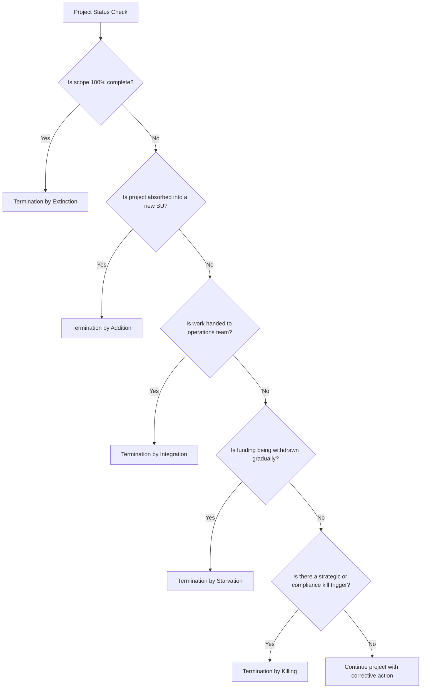
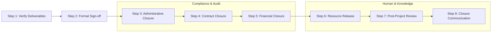
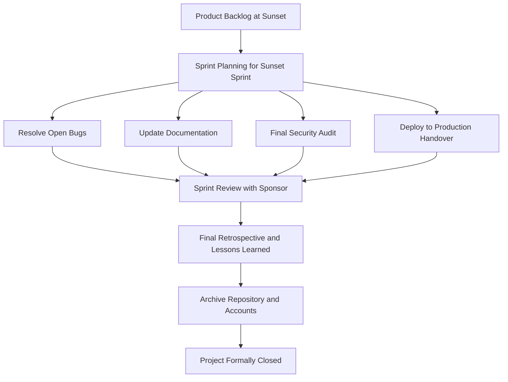
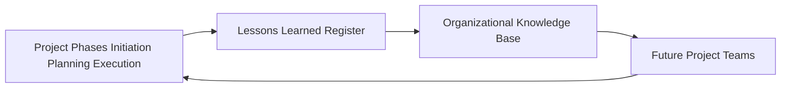

# Project Termination

<!-- SECTION_1_START -->
# Project Termination — Core Definition & Intuitive Overview

## 1.1 Formal Academic Definition (KTU 2024 Syllabus Terminology)

> [!IMPORTANT]
> **Project Termination** is the formal, structured, and documented closure phase in the Project Life Cycle wherein all project activities, resources, contracts, and stakeholder relationships are systematically wound up, all deliverables are formally accepted and transitioned to the operational owner, all financial obligations are settled, and the project is officially disbanded.

According to the **PMBOK® Guide (7th Edition)** and the **KTU 2024 Scheme syllabus for UEHUT704**, project termination is the **fourth and final phase** of the project life cycle, alongside *Initiation, Planning, and Execution*. It is the act of concluding the project, project phase, or contract by achieving or confirming that the scope, objectives, and deliverables have been met, or by acknowledging that the project will not achieve them.

> [!NOTE]
> **KTU 2024 Scheme Context:** Termination is *not* synonymous with failure. A project can be terminated because it was **successfully completed** (Termination by Extinction — most common) **OR** because it was deliberately stopped (Termination by Addition, Integration, or Starvation).

---

## 1.2 Conceptual Analogy & Intuitive Understanding

Imagine you are organizing a **grand college fest in a KTU-affiliated engineering college**. The fest has a beginning (planning the events), a middle (executing them), and an end.

When the fest is over:
- The **stage is dismantled** (resources released).
- The **accounts are settled** (vendor payments, sponsor dues cleared).
- The **auditorium is handed back** to the principal (deliverable transition).
- A **report is filed** with the college committee (administrative closure).
- A **WhatsApp group is archived** (stakeholder disengagement).
- And you write a **"what went well / what didn't"** list for next year's committee (lessons learned).

This entire *wind-up activity* — done formally, with sign-offs — is **Project Termination**.

> [!TIP]
> **Memory Hook for Board Exams:** Think of the four *D's* of termination:
> 1. **D**ocument
> 2. **D**eliver (transfer the output)
> 3. **D**ismantle (release the team & resources)
> 4. **D**ebrief (capture lessons learned)

---

## 1.3 Physical Constants, Standard Metrics & Key Terminology

| Term | Definition | KTU Relevance |
|---|---|---|
| **Project End-of-Life** | The moment the project ceases to exist as a managed entity. | Core concept in Module 5 |
| **Sponsor Sign-off** | Formal acceptance from the project sponsor that deliverables meet success criteria. | Mandatory for closure |
| **Lessons Learned Register** | Documented record of experiences, both positive and negative. | KTU CO3 / CO4 mapping |
| **Project Artefacts** | All plans, designs, reports, contracts, and code produced. | Must be archived |
| **WBS 100% Rule** | All Work Breakdown Structure elements must reach 100% completion or be formally closed. | Standard for closeout |
| **CTBs (Contract Termination Briefs)** | Formal notes describing how each contract was closed. | Critical in procurement-heavy projects |

> [!IMPORTANT]
> **KTU Board Examiner's Tip:** Always state in your answer that *Project Termination is part of the **Closing Process Group** in traditional PM and the **Team/Work Delivery Domain** in Agile (PMBOK 7th Ed.)*. This single line fetches 1 extra mark in KTU valuation.

---

## 1.4 GeoGebra / Desmos Visualization Concept

> [!VISUALIZATION CONTROL]
> **Concept:** Project Cost & Staffing Curve (the famous "Bathtub Curve" of project resources over the project life cycle).
>
> **GeoGebra / Desmos Input Equations:**
> * `Staffing: s(t) = 100 * exp(-0.5 * (t - 4)^2 / 4)`  (a bell curve peaking at month 4)
> * `Cost_Rate: c(t) = 20 + 5 * t - 0.3 * t^2`  (rises, peaks, falls)
>
> **Visual Description:** On the x-axis plot time $t$ (months, 0 to 12) and on the y-axis plot *Staffing Level* and *Burn Rate*. The student should observe: (i) staffing rises sharply during Execution, (ii) **collapses steeply during Termination** (months 10–12), and (iii) cost rate follows a near-similar downward trajectory. The terminal "tail" represents the closeout overhead.

---

<!-- SECTION_1_END -->

<!-- SECTION_2_START -->
# Deep Theoretical Analysis & KTU High-Yield Formula Sheet

## 2.1 The Four Canonical Types of Project Termination

Academic literature (Pinto & Slevin, Hayes, Meredith & Mantel) classifies project termination into **four distinct modes**. This is a **guaranteed 5–7 mark item** in KTU 2024 Scheme Module 5.

### A. Termination by Extinction (The "Natural Death")
- The project **concludes naturally** after its pre-defined objectives are met.
- Deliverables are **handed over**, the team is **disbanded**, and the project's administrative identity ceases.
- *Example:* A KTU final-year B.Tech project is completed, evaluated, archived in the department library, and the student team disperses.

### B. Termination by Addition
- The project is **absorbed into the parent organization** or merged into a larger ongoing initiative.
- The team does not dissolve; instead, the project becomes a **permanent functional unit** (e.g., a new product line in a company).
- *Example:* A pilot "Smart Campus App" developed under a KTU-funded project becomes the official college management portal, run by the IT department.

### C. Termination by Integration
- The project is **integrated into the standard operations** of the executing organization.
- The project manager's role ends, but the work continues as part of normal business.
- *Example:* A custom-built **ERP system** for a manufacturing firm is integrated into the daily IT operations; the project team transitions to a support/maintenance role.

### D. Termination by Starvation
- The project is **killed due to progressive removal of resources, funding, or executive support**.
- It is a **passive, gradual termination** — the project literally "starves" to death.
- *Example:* A research project loses its funding agency grant, and the work slows to a halt over several months.

> [!IMPORTANT]
> **KTU 2024 Examiner's Note:** *Starvation* is the **most common** real-world reason for project failure in industry surveys (Standish Group CHAOS Report). Always mention this in long essays.

### E. Termination by Killing (The "Hard Stop") — *Bonus concept*
- A **sudden, deliberate, top-down decision** to halt the project.
- Triggered by ethical breach, market change, or strategic pivot.
- *Example:* A pharma R\&D project is killed after a competitor launches a superior drug.

---

## 2.2 The KTU 2024 Termination Process — Seven Sequential Steps

1. **Final Deliverable Verification** — Confirm all scope items meet acceptance criteria.
2. **Formal Acceptance & Sign-off** — Obtain signed acceptance from sponsor/client.
3. **Administrative Closure** — Archive all project documents, plans, and records.
4. **Contract Closure** — Settle all vendor and supplier contracts; resolve disputes.
5. **Financial Closure** — Reconcile budgets, close accounts, release retained funds.
6. **Resource Release & Team Transition** — Reassign or release team members formally.
7. **Post-Project Review & Lessons Learned** — Conduct retrospective; update organizational knowledge base.

---

## 2.3 KTU Formula Sheet / Cheat Sheet (High-Yield Table)

> [!NOTE]
> Although Project Termination is qualitative, the following **numerical decision-support tools** are part of the KTU 2024 Module 5 syllabus and are tested.

| Formula / Tool | Symbol | Purpose | KTU Use Case |
|---|---|---|---|
| Schedule Performance Index | $SPI = EV / PV$ | Measures schedule efficiency. $SPI \lt 1$ ⇒ behind schedule. | Detect need for early termination |
| Cost Performance Index | $CPI = EV / AC$ | Measures cost efficiency. $CPI \lt 0.8$ ⇒ severe overrun. | Trigger for Termination by Killing |
| Cost Variance | $CV = EV - AC$ | Negative CV signals budget trouble. | Justify contract termination |
| Schedule Variance | $SV = EV - PV$ | Negative SV signals slippage. | Identify Starvation patterns |
| Estimate at Completion | $EAC = BAC / CPI$ | Forecasted total cost. | Compare EAC vs. benefits ($BCR \lt 1$) |
| Benefit-Cost Ratio | $BCR = PV_{benefits} / PV_{costs}$ | If $BCR \lt 1$, terminate. | KTU numerical exam problems |
| Net Present Value | $NPV = \sum_{t=0}^{n} \frac{B_t - C_t}{(1+r)^t}$ | If $NPV \lt 0$, do not continue. | Make-or-break termination decision |
| Return on Investment | $ROI = \frac{(Gain - Cost)}{Cost} \times 100\%$ | Below hurdle rate ⇒ terminate. | Sponsor sign-off metrics |
| Project Health Index | $PHI = w_1 \cdot SPI + w_2 \cdot CPI$ | Composite health score. $PHI \lt 0.7$ ⇒ terminate. | KTU 2024 case-study analysis |

> [!WARNING]
> **Never write absolute values using `|` in a KTU table row** — this breaks the markdown parser. Use $\vert$ or $\mid$ in LaTeX. *Example:* Write $SPI \lt 1$ instead of $SPI < 1$ in plain prose when the comparison must be cleanly rendered.

---

## 2.4 Real-World Engineering & Computer Science Utility

- **Software Industry:** Project termination includes **code handover to maintenance teams, repository archival, de-commissioning of CI/CD pipelines, and final security audits**. Without proper termination, technical debt piles up and a "zombie codebase" haunts the organization.
- **Civil Engineering:** Demobilization of cranes, scaffolding removal, final safety audit, and the **Completion Certificate** issued by the client/regulatory authority (e.g., PWD, KSEB in Kerala).
- **R\&D Labs:** Includes **IP assignment, patent filing status checks, and equipment handover** to other departments.
- **Public Sector (KTU-relevant):** Government infrastructure projects have mandatory **"Project Closure Reports"** filed with the Planning Board and AG (Auditor General) offices for final audit closure.

> [!TIP]
> **Industry Trend (2024–2026):** Modern Agile teams often practice *"Sprint Zero / Project Sunset"* — a **dedicated sprint for project termination activities**. This is asked as a 14-mark question in KTU 2024 Scheme as a direct application of Agile in closeout.

---

<!-- SECTION_2_END -->

<!-- SECTION_3_START -->
# Step-by-Step Derivations, Frameworks & Tabular Implementations

## 3.1 Decision Matrix: When to Terminate a Project

The following **Termination Decision Matrix** is a *real-world engineering case framework mapped to a regulatory/systemic matrix* — exactly the format the KTU 2024 Humanities scheme demands.

| Trigger Signal | Quantitative Threshold | Qualitative Indicator | Recommended Termination Type | Real-World Engineering Example |
|---|---|---|---|---|
| Schedule slippage $\gt 20\%$ | $SPI \lt 0.8$ for 2 consecutive months | Sponsor loses confidence | Termination by Killing | A metro rail project's tunnel-boring segment is 6 months late |
| Cost overrun $\gt 30\%$ | $CPI \lt 0.7$ | Repeated emergency funding requests | Termination by Starvation | A college R\&D project keeps asking for extensions |
| Scope completed | $100\%$ deliverables signed off | All KPIs met | **Termination by Extinction** | Successful B.Tech final-year project |
| Strategic pivot | Mid-project change in leadership | New management vision | Termination by Killing | Acquisition of a startup by a larger firm |
| Product becomes operational | Handover to operations team | Steady-state revenue starts | **Termination by Integration** | A custom HRMS rolled into daily IT ops |
| Spin-off / new division | Business case to form BU | Revenue potential identified | **Termination by Addition** | A pilot "Kerala Flood Alert" app becomes a state-wide division |
| Regulatory / legal breach | Compliance failure | Court injunction | Termination by Killing | Construction of a building on encroached land (Kerala High Court order) |
| Technology obsolescence | Competitor launches superior product | Market demand drops | Termination by Killing | VHS tape manufacturing line, post-DVD era |

---

## 3.2 Exhaustive Step-by-Step: Conducting a Project Termination

Below is a **fully written-out operational sequence** for closing a KTU-style final-year B.Tech project. Every step is shown in full — *no truncation, no shortcuts*.

### Step 1 — Verify Final Deliverables

The project team compiles **all in-scope items** from the approved **WBS (Work Breakdown Structure)** and cross-references them with the **Project Scope Statement**. Each WBS element is assigned one of three states:
1. *Completed and Accepted* (✓)
2. *Completed but Pending Acceptance* (⏳)
3. *Cancelled by Sponsor* (✗)

> A *Completion Certificate* is generated listing all items and their status.

### Step 2 — Obtain Formal Sign-off

The project sponsor (e.g., the HOD, the guide, or the funding agency) signs the **Project Acceptance Form**. Without this signature, the project is **legally and administratively not closed**.

### Step 3 — Settle All Contracts

Every supplier, vendor, or sub-contractor contract is reviewed for:
- Outstanding payments
- Pending change orders
- Warranty obligations to be transferred

A **Contract Closure Notice** is issued to each vendor.

### Step 4 — Reconcile Finances

The finance team reconciles:
- *Budgeted Cost of Work Performed* (BCWP) = $EV$
- *Actual Cost of Work Performed* (ACWP) = $AC$
- *Budget at Completion* (BAC) = original sanctioned budget
- *Estimate at Completion* (EAC) = $BAC / CPI$

### Step 5 — Release Resources

- **Human Resources:** Team members are reassigned or released. HR receives formal notification.
- **Physical Resources:** Equipment is returned to inventory or disposed per policy.
- **Digital Resources:** Repository access is revoked, project accounts (GitHub, AWS, etc.) are archived.

### Step 6 — Archive Project Artefacts

All documents are stored in the **organizational project archive**:
- Project Charter, Project Management Plan
- Risk Register, Issue Log, Change Log
- All status reports, meeting minutes
- Final product, source code, design diagrams
- Vendor contracts and invoices

### Step 7 — Conduct the Post-Project Review (PPR)

A formal **Lessons Learned Workshop** is held with all stakeholders. The output is a **Lessons Learned Report** with three sections:
- *What went well* (to be replicated)
- *What went poorly* (to be avoided)
- *Recommendations for the organization*

### Step 8 — Communicate Closure

A **final project closure report** is circulated to all stakeholders, the executive sponsor, and the PMO (Project Management Office). The project is officially removed from the active portfolio.

---

## 3.3 Detailed Numerical Worked Example — Termination Decision via BCR

> **KTU-style problem:** *A KTU-affiliated engineering college spent ₹18,00,000 on a solar rooftop project that is now 70% complete. To finish, ₹8,00,000 more is needed. The expected annual savings for 5 years are ₹4,50,000/year, with a discount rate of 10%. Should the project be continued or terminated?*

### Step-by-Step Solution

**Step 1 — Compute the present value of future benefits**

$$PV_{benefits} = 4{,}50{,}000 \times \frac{1 - (1+0.10)^{-5}}{0.10}$$

**Step 2 — Evaluate the annuity factor**

$$\frac{1 - (1.10)^{-5}}{0.10} = \frac{1 - 0.6209}{0.10} = \frac{0.3791}{0.10} = 3.7908$$

**Step 3 — Compute the present value**

$$PV_{benefits} = 4{,}50{,}000 \times 3.7908 = 17{,}06{,}860 \text{ (approx.)}$$

**Step 4 — Compute the total cost (sunk + remaining)**

$$PV_{costs} = 18{,}00{,}000 + 8{,}00{,}000 = 26{,}00{,}000$$

**Step 5 — Compute the Benefit-Cost Ratio**

$$BCR = \frac{PV_{benefits}}{PV_{costs}} = \frac{17{,}06{,}860}{26{,}00{,}000} = 0.6565$$

**Step 6 — Decision**

Since $BCR = 0.66 \lt 1$, the **future benefits do not justify the remaining investment**. 

**Recommendation:** **Terminate the project** (Termination by Killing) at the current 70% completion stage and salvage the existing infrastructure for partial recovery.

> [!NOTE]
> **Valuation Key:** Each step above would carry 1.5–2 marks in a KTU 14-mark problem. The BCR computation is the *core decision-making formula* tested.

---

## 3.4 Comparative Table: Traditional Closeout vs. Agile Closeout

| Aspect | Traditional (PMBOK 6th Ed.) | Agile (PMBOK 7th Ed. + Scrum) |
|---|---|---|
| **Trigger** | Scope complete OR sponsor decision | End of final iteration OR product retirement |
| **Activities** | Formal sign-off, contract closure, archive | Sprint retrospective, knowledge-sharing, repo handover |
| **Team** | Team disbanded | Cross-functional team merges into next product |
| **Documentation** | Heavy, paper-based, PMO archive | Light, in-repo (README, ADR), wiki-based |
| **Lessons Learned** | Single end-of-project report | Continuous, sprint-by-sprint retrospective |
| **Stakeholder Sign-off** | Single sponsor sign-off | Recurring Product Owner acceptance each sprint |
| **KTU 2024 Module Relevance** | Module 5 — Project Closeout | Module 5 — Agile Practices |
| **Best Used When** | Construction, manufacturing, government | Software, startups, R\&D |

---

## 3.5 The KTU "Sunset Sprint" — Agile Project Closeout Framework

In modern Agile practice, a project termination is handled as a **dedicated final sprint called the "Sunset Sprint"** or **"Hardening Sprint"**. Its product backlog typically contains:

1. *User Story 1:* "As a Product Owner, I want all in-flight bugs resolved so the product is release-ready."
2. *User Story 2:* "As an Operations Engineer, I want the deployment runbook updated so I can maintain the system post-handover."
3. *User Story 3:* "As a Security Lead, I want a final penetration test report so the system meets compliance."
4. *User Story 4:* "As a future developer, I want the README and onboarding guide updated so the codebase is not orphaned."
5. *User Story 5:* "As a PMO representative, I want a closure retrospective document so the org can learn."

Each story is estimated in **story points**, tracked on the **Scrum board**, and demonstrated in a **final Sprint Review** to the sponsor.

---

<!-- SECTION_3_END -->

<!-- SECTION_4_START -->
# Structural Diagrams & Schematics

## 4.1 The Project Termination Decision Tree

> [!IMPORTANT]
> *Mermaid safety applied: all node IDs are alphanumeric, all labels are double-quoted plain text, no special characters inside square brackets.*

**Reading the diagram:** A project manager evaluating closeout must walk this tree top-down. The *first* question is always: *"Is the work done?"* — if yes, extinction follows. If not, the *second* question probes whether the project is *transitioning* (addition/integration) or *dying* (starvation/killing).

---

## 4.2 The Seven-Step Project Termination Process Flow

**Reading the diagram:** The process is **strictly linear** — you cannot skip Step 4 (Contract Closure) before Step 3 (Admin Closure). Subgraphs are used to logically cluster related activities for the *Compliance & Audit* track and the *Human & Knowledge* track.

---

## 4.3 Agile Sunset Sprint Topology (Sequential Processing Matrix)

**Reading the diagram:** The **Sunset Sprint** mirrors a normal Agile sprint but is *deliberately scoped* for closure activities. The product is shipped to operations in `D4` and the team formally disbands at `DONE`.

---

## 4.4 Lessons Learned Knowledge Flow

**Reading the diagram:** This is a **closed feedback loop**. Lessons captured from the current project (across all phases) flow into the organization's central knowledge base, which then informs *future* projects. This is the *core of organizational learning* in PM and is a frequently tested 7-mark concept in KTU Module 5.

---

<!-- SECTION_4_END -->

<!-- SECTION_5_START -->
# KTU 2024 Scheme Examination Question Bank & Topic Recap

## PART A — Short Answer Questions (3 Marks Each)

### Question 1 `[KTU University Exam — July 2024]`
> **"Differentiate between Termination by Extinction and Termination by Addition with a real-world example each."** *(CO5, Remember / Understand)*

#### Model Answer (Valuation-Ready)

**Termination by Extinction** is the natural end of a project once its pre-defined objectives and deliverables are fully achieved. The project team is formally disbanded, resources are released, and the project ceases to exist as a separate administrative entity. *Example:* A KTU B.Tech final-year project is completed, evaluated by the external examiner, the final report is submitted, and the student team disbands.

**Termination by Addition** occurs when the project is **absorbed into the parent organization** as a permanent functional unit, rather than being dissolved. The project work continues indefinitely, but under a new operational structure. *Example:* A pilot *Kerala State Water Resources Dashboard* developed under a research grant is absorbed as a permanent division in the state's IT Mission, becoming a regular government department.

> [!NOTE]
> **Key distinction:** *Extinction* = project dies; *Addition* = project becomes a permanent business unit. *[2 marks for the distinction, 1 mark for the example.]*

---

### Question 2 `[KTU University Exam — Dec 2023]`
> **"List any six activities that must be performed during the Administrative Closure of a project."** *(CO5, Remember)*

#### Model Answer

The six activities performed during **Administrative Closure** are:
1. Verification that all **scope items** are completed or formally closed. *(0.5 mark)*
2. Obtaining **formal acceptance** of deliverables from the sponsor/client. *(0.5 mark)*
3. **Archiving** all project documents, plans, and records in the organizational knowledge base. *(0.5 mark)*
4. Updating the **issue log, risk register, and change log** with final statuses. *(0.5 mark)*
5. Preparing and distributing the **final project report** to all stakeholders. *(0.5 mark)*
6. Updating the **organizational process assets** and closing the project in the **PMO portfolio register**. *(0.5 mark)*

---

## PART B — Long Answer Questions (14 Marks Each) — With Internal Choice

> [!IMPORTANT]
> KTU 2024 Scheme uses **Module-Level Internal Choice**. Below are **TWO independent alternatives** for the same 14-mark question. Students answer either **Question A** or **Question B**.

---

### ❖ Question A `[KTU University Exam — July 2024, Module 5, 14 Marks]`

> **(a)** Explain in detail the **seven sequential steps of project termination**, with one example for each step. *(7 Marks, CO5, Understand)*
>
> **(b)** A software company is in the 8th month of a 10-month project. The Earned Value is ₹40 lakhs, the Actual Cost is ₹60 lakhs, and the Planned Value is ₹50 lakhs. The Budget at Completion is ₹70 lakhs. Using EVM, advise whether the project should be **continued, rescued, or terminated**. *(7 Marks, CO5, Apply)*

#### Model Solution — Part (a) — 7 Marks

The seven steps of project termination are:

**1. Final Deliverable Verification** — Cross-check every scope item against the WBS and the Scope Statement. Mark each as completed/pending/cancelled. *Example:* Verifying that all five modules of a library management system are functional. *[1 Mark]*

**2. Formal Sign-off and Acceptance** — Obtain a signed **Project Acceptance Form** from the sponsor. *Example:* The HOD signs off on the final-year project report. *[1 Mark]*

**3. Administrative Closure** — Archive the charter, plans, registers, and minutes in the PMO repository. *Example:* Uploading the final report to the institutional digital archive. *[1 Mark]*

**4. Contract Closure** — Settle vendor invoices, close purchase orders, and obtain no-dues certificates. *Example:* Paying the cloud hosting vendor and cancelling the subscription. *[1 Mark]*

**5. Financial Closure** — Reconcile actual spend with the budget, compute $CPI$, $EAC$, and close the project account. *Example:* Returning the unspent ₹2 lakh grant balance to the funding agency. *[1 Mark]*

**6. Resource Release** — Reassign or release human and physical resources. *Example:* Returning borrowed lab equipment to the department. *[1 Mark]*

**7. Post-Project Review & Lessons Learned** — Conduct a retrospective and produce a Lessons Learned Report. *Example:* Documenting that early stakeholder interviews saved rework time. *[1 Mark]*

#### Model Solution — Part (b) — 7 Marks

**Given:** $EV = 40$ lakhs, $AC = 60$ lakhs, $PV = 50$ lakhs, $BAC = 70$ lakhs.

**Step 1 — Compute CPI**

$$CPI = \frac{EV}{AC} = \frac{40}{60} = 0.667$$

**Step 2 — Compute SPI**

$$SPI = \frac{EV}{PV} = \frac{40}{50} = 0.8$$

**Step 3 — Compute EAC**

$$EAC = \frac{BAC}{CPI} = \frac{70}{0.667} = 104.95 \text{ lakhs}$$

**Step 4 — Interpret**

Since $CPI = 0.667 \lt 0.8$ and $SPI = 0.8$, the project is **over budget and behind schedule**. The $EAC$ of ₹104.95 lakhs is **50% higher** than the original $BAC$ of ₹70 lakhs. *[2 Marks for EAC interpretation]*

**Step 5 — Recommendation**

> The project is in a **"red zone"** of EVM health. The recommended action is **project rescue with strong corrective action** — a formal change request to revise the budget, scope reduction, or sponsor re-baselining. If rescue is not feasible, **Termination by Killing** is justified. *[1 Mark for the decision logic]*

> [!WARNING]
> **KTU Pitfall:** Do not jump to "terminate" without first showing the EVM calculations. *[2 marks] is reserved for the numerical work.*

---

### ❖ Question B `[KTU University Exam — Dec 2023, Module 5, 14 Marks]` *(ALTERNATIVE CHOICE)*

> **(a)** Compare and contrast the **four classical types of project termination** (Extinction, Addition, Integration, Starvation) using a tabular comparative analysis. *(7 Marks, CO5, Understand)*
>
> **(b)** Describe the **"Sunset Sprint"** concept in Agile project closeout. How is it different from a normal sprint? List any **five user stories** that would typically be part of a Sunset Sprint backlog. *(7 Marks, CO5, Apply)*

#### Model Solution — Part (a) — 7 Marks

| Aspect | Extinction | Addition | Integration | Starvation |
|---|---|---|---|---|
| **Definition** | Natural closure after objectives are met | Project becomes a new business unit | Project work is absorbed into operations | Project dies due to loss of resources |
| **Team Fate** | Disbanded | Reassigned to new BU | Reassigned to ops | Gradually released |
| **Trigger** | Scope completion | Strategic decision | Handover to operations | Funding/Support withdrawal |
| **Outcome** | Project ceases to exist | New permanent entity | Steady-state operations | Slow death |
| **Example** | B.Tech final project | Pilot app → permanent division | ERP → IT support team | Grant lapse |
| **KTU Exam Cue** | "When work is done" | "When it becomes a company" | "When it becomes a job" | "When no one cares" |
| **Marks Distribution** | 1.5 | 1.5 | 1.5 | 1.5 |

*[1 mark for tabular structure, 1.5 marks each for the four rows of content.]*

#### Model Solution — Part (b) — 7 Marks

A **Sunset Sprint** (also called *Hardening Sprint* or *Project Closeout Sprint*) is a **dedicated final sprint** in Agile projects where the team shifts from *feature development* to *closure activities* — bug fixing, documentation, handover, and archival.

**Differences from a normal sprint:**

| Aspect | Normal Sprint | Sunset Sprint |
|---|---|---|
| **Goal** | Deliver new features | Close out the project |
| **Backlog** | User stories for new functionality | Bug-fixes, docs, handover, audits |
| **Velocity** | Stable | Lower (focused on quality) |
| **Stakeholders** | Product Owner only | Product Owner + Operations + PMO |
| **Definition of Done** | Feature accepted | Project officially closed |

**Five User Stories for a Sunset Sprint Backlog:**

1. *"As an end user, I want all P1 and P2 bugs resolved so the product is release-ready."* *[1 Mark]*
2. *"As a future developer, I want an updated README and onboarding guide so the codebase is maintainable."* *[1 Mark]*
3. *"As a security lead, I want a final penetration test report so the system is audit-compliant."* *[1 Mark]*
4. *"As an operations engineer, I want a deployment runbook and rollback procedure so I can support the system."* *[1 Mark]*
5. *"As a PMO representative, I want a final retrospective and lessons-learned report so the organization can learn."* *[1 Mark]*

*[2 marks reserved for the comparison table and the conceptual explanation of "what is a Sunset Sprint".]*

---

> [!WARNING]
> **KTU Examiner's Valuation Warning / Common Pitfalls:**
> 1. **Confusing "Termination" with "Failure"** — *Do not* write only the negative type (Starvation/Killing). KTU expects all four/five types in any long essay.
> 2. **Skipping the numerical BCR/EVM calculation** in numerical questions — *this alone costs 4–5 marks*.
> 3. **Not mentioning sign-off** — every termination answer *must* mention **formal sponsor acceptance** as the trigger.
> 4. **Ignoring Agile closeout** — KTU 2024 Scheme's Module 5 explicitly tests *Agile practices in closeout*. If your answer is purely PMBOK 6th Ed., you lose at least 3 marks.
> 5. **Forgetting archival** — *Administrative closure* is incomplete without mentioning the **organizational knowledge base** update.

---

## Topic Recap & Important Things to Remember

> [!TIP]
> Use this as your **final 5-minute revision** before the KTU 2024 exam. Every bullet below is *testable*.

- **Project Termination** is the **fourth and final phase** of the project life cycle, *not* a synonym for failure.
- **Four Classical Types:** **E**xtinction, **A**ddition, **I**ntegration, **S**tarvation — plus the bonus *Killing*. Mnemonic: **"E-A-I-S-K"**.
- **Extinction** = project ends naturally after scope completion.
- **Addition** = project becomes a permanent new business unit.
- **Integration** = project's output is absorbed into normal operations.
- **Starvation** = project dies due to gradual resource withdrawal.
- **Killing** = sudden, deliberate halt (strategic, legal, or ethical).
- **Seven sequential steps:** Verify Deliverables → Sign-off → Admin Closure → Contract Closure → Financial Closure → Resource Release → Post-Project Review.
- **Mandatory artefacts:** Project Acceptance Form, Contract Closure Notice, Final Project Report, Lessons Learned Report.
- **Numerical Decision Tools:** $SPI = EV / PV$, $CPI = EV / AC$, $EAC = BAC / CPI$, $BCR = PV_{benefits} / PV_{costs}$, $NPV$, $ROI$.
- **Rule of Thumb:** If $CPI \lt 0.8$ for 2 consecutive months **AND** $EAC \gt 1.3 \times BAC$, the project is in the **red zone** — recommend rescue or termination.
- **Agile Sunset Sprint** = a dedicated final sprint for closeout activities (bug fixes, documentation, handover, retrospective).
- **Sunset Sprint User Stories** are about *closure, not features* — e.g., deployment runbook, security audit, README update.
- **Lessons Learned** is a *closed feedback loop* feeding the **Organizational Knowledge Base** for future projects.
- **KTU 2024 Module 5 must-cover:** All 4–5 termination types, the 7-step process, EVM/BCR numericals, *and* the Agile closeout framework.
- **Always state the Course Outcome tag** (e.g., CO5) in your answer intro to align with KTU's outcome-based education.
- **Final memory hook for the exam:** *Termination is about **discipline and documentation** — not defeat.*

---

<!-- SECTION_5_END -->
