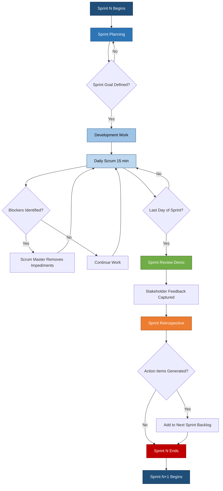
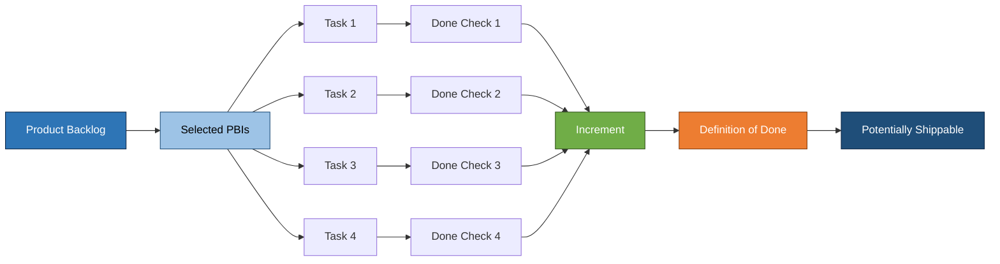
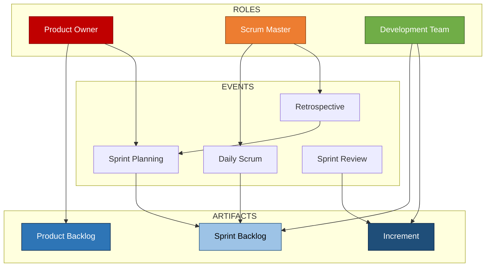
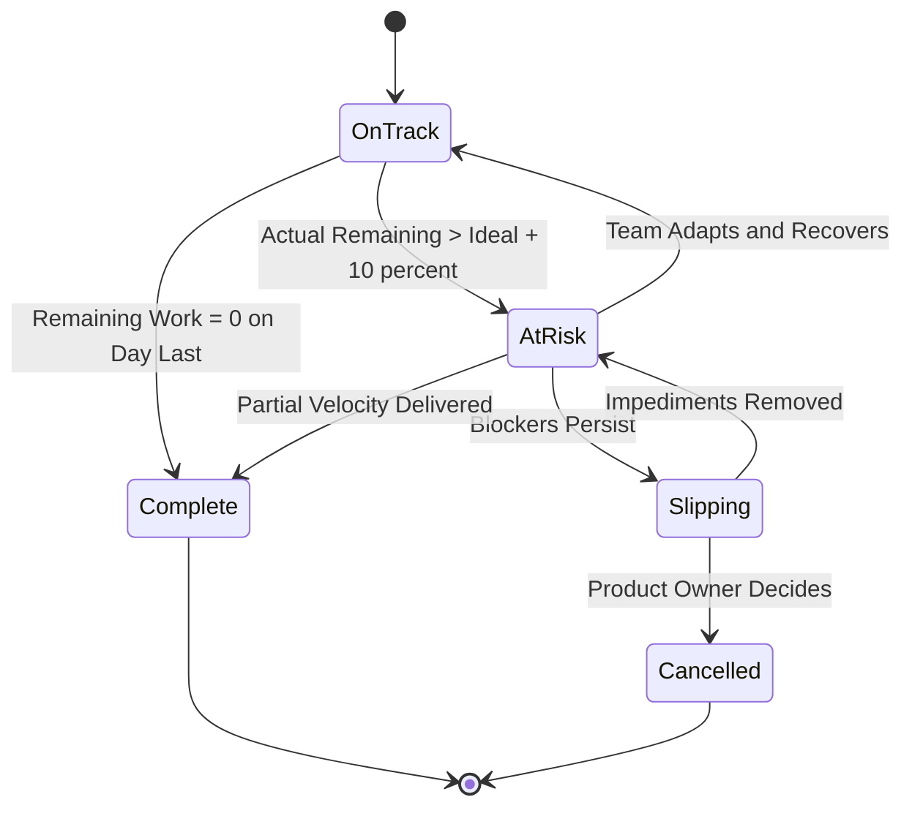

# Sprints

<!-- SECTION_1_START -->
# Sprints — The Heartbeat of Agile Delivery

> [!IMPORTANT]
> **KTU 2024 Scheme — UEHUT704 (Project Lifecycle Management)**
> **Module 5:** Project Closeout \& Agile Practices
> **Topic:** Sprints
> **Course Outcomes Mapped:** CO5 (Apply Agile practices in project lifecycle)
> **Cognitive Levels Targeted:** Remember, Understand, Apply, Analyze

---

## 1.1 Formal Academic Definition

A **Sprint** is a **time-boxed iteration** of **fixed duration** (typically **1 to 4 weeks**, most commonly **2 weeks**) during which a Scrum Team delivers a **potentially shippable product increment** of completed, tested, and integrated work items. The Sprint is the fundamental execution unit of the Scrum framework, defined formally in the *Scrum Guide* (Schwaber \& Sutherland).

$$\text{Sprint Duration} \in [1\text{ week},\ 4\text{ weeks}]$$

The Sprint has a **consistent length throughout a project** to establish a **rhythm** that minimizes complexity in planning and enables the team to **learn from previous iterations** through empirical process control based on the three pillars of Scrum: **Transparency**, **Inspection**, and **Adaptation**.

---

## 1.2 Conceptual Analogy — The Reload Window

> [!NOTE]
> **Intuition for First-Time Learners**
>
> Imagine a **lifestyle blog** that publishes a new issue **every 14 days**. The team has **exactly 14 days** to: research, draft, edit, design, layout, and ship the issue. Whether they finish a lot or a little, the **clock never stops** — on **Day 15**, the next sprint begins. Within those 14 days, the team works with focused intensity (a "mini-project"). The blog is shipped at the end of every window. A **Sprint** is exactly this 14-day publication window applied to software/product development.

**Key parallels in the analogy:**

| Blog Metaphor | Agile Sprint Equivalent |
| :--- | :--- |
| 14-day publication cycle | **Fixed-length Sprint** (e.g., 2 weeks) |
| Editorial meeting | **Sprint Planning** |
| Daily stand-up between writers | **Daily Scrum** |
| Issue published on Day 14 | **Sprint Review** |
| Post-issue lessons-learned chat | **Sprint Retrospective** |

---

## 1.3 Standard Sprint Metrics & Constants

> [!IMPORTANT]
> **Syllabus-Highlight Metrics (Recall-Ready)**
> - **Standard Sprint Length:** **2 weeks** (industry default)
> - **Shorter Sprints:** **1 week** (used in fast-feedback environments)
> - **Longer Sprints:** **4 weeks** (maximum, used in hardware/integrated systems)
> - **Daily Standup Duration:** **15 minutes maximum**
> - **Sprint Planning Time-Box:** **8 hours for a 1-month Sprint** (proportionally scaled)

> [!TIP]
> **Why a Fixed Sprint Length?**
> Fixed length creates a **predictable cadence** for stakeholders, enables **accurate velocity forecasting**, and creates a stable baseline for the **Sprint Burndown Chart** trend analysis.

---

## 1.4 The Three Pillars Anchoring Every Sprint

$$\text{Empirical Process Control} = f(\text{Transparency},\ \text{Inspection},\ \text{Adaptation})$$

- **Transparency** — Definition of Done (DoD) and acceptance criteria are explicit
- **Inspection** — Daily Scrum + Sprint Review surface deviation
- **Adaptation** — Retrospective + Backlog refinement cause course correction

---

<!-- SECTION_2_START -->
## 2. Deep Theoretical Analysis — The Sprint Architecture

### 2.1 The Five Structural Components of a Sprint

A Sprint is not just a "time period" — it is a **container** that holds five tightly coupled elements:

1. **Sprint Goal** — A single, focused objective written in business value terms
2. **Sprint Backlog** — The set of Product Backlog items (PBIs) selected for the Sprint
3. **Development Work** — Daily execution with cross-functional collaboration
4. **Daily Scrum** — 15-minute synchronization checkpoint
5. **Sprint Increment** — The sum of all completed PBIs, integrated, tested, and Done

### 2.2 The Sprint Lifecycle — Seven Sequential Events

```
   ┌───────────────────────┐
   │   Pre-Sprint          │
   │   Backlog Refinement  │
   └───────────┬───────────┘
               ▼
   ┌───────────────────────┐
   │  1. Sprint Planning   │
   └───────────┬───────────┘
               ▼
   ┌───────────────────────┐
   │  2. Daily Scrum × N   │  ◄─── (every day of Sprint)
   └───────────┬───────────┘
               ▼
   ┌───────────────────────┐
   │  3. Backlog Refinement│
   └───────────┬───────────┘
               ▼
   ┌───────────────────────┐
   │  4. Sprint Review     │
   └───────────┬───────────┘
               ▼
   ┌───────────────────────┐
   │  5. Sprint Retro       │
   └───────────┬───────────┘
               ▼
   ┌───────────────────────┐
   │  NEXT SPRINT BEGINS   │  (immediate)
   └───────────────────────┘
```

> [!NOTE]
> **Backlog Refinement** is **not** a formal Scrum event but is a **continuous activity** that consumes **no more than 10\%** of the Development Team's capacity within the Sprint.

---

### 2.3 KTU High-Yield Formula Sheet

> [!TIP]
> **Cheat-Sheet for Board Exams — All Sprint Computations**

| \# | Concept | Formula / Rule | Unit / Constraint |
| :---: | :--- | :--- | :--- |
| 1 | Sprint Length | $L_s \in [1,\ 4]$ | Weeks |
| 2 | Number of Working Days | $D_s = L_s \times 5$ | Days (assuming 5-day work week) |
| 3 | Total Team Capacity | $C_t = \sum_{i=1}^{n} H_{i}$ | Person-Hours |
| 4 | Available Sprint Capacity | $C_{eff} = C_t \times f_{prod}$ | Person-Hours |
| 5 | Productivity Factor | $f_{prod} \approx 0.6$ to $0.8$ | Dimensionless |
| 6 | Committed Story Points | $SP_{commit} = \sum SP_{j}$ | Story Points |
| 7 | Completed Story Points | $SP_{done} = \sum SP_{j} \mid \text{DoD met}$ | Story Points |
| 8 | Sprint Velocity | $V = SP_{done}$ | Story Points / Sprint |
| 9 | Average Velocity | $\bar{V} = \frac{1}{k}\sum_{m=1}^{k} V_m$ | Story Points / Sprint |
| 10 | Forecast (n Sprints) | $S_n = \lceil \text{Remaining Work} / \bar{V} \rceil$ | Sprints |
| 11 | Ideal Burn Rate (per day) | $BR = V_{total} / D_s$ | Points / Day |
| 12 | Remaining Work on Day d | $RW(d) = SP_{commit} - \sum_{i=1}^{d} SP_{i}^{done}$ | Story Points |
| 13 | Sprint Goal Achievement | $SG = 1 \text{ if Sprint Goal met, else } 0$ | Boolean |
| 14 | Defect Density | $\rho_d = N_{defects} / \text{LOC or Function Points}$ | Defects / Unit |
| 15 | Team Utilization | $U = H_{billable} / H_{available}$ | Ratio (0 to 1) |

> [!NOTE]
> **Critical Convention:** Use `\vert` or `\mid` for absolute value or "such that" symbols in all written solutions to avoid breaking markdown table syntax.

---

### 2.4 Real-World Engineering Utility of Sprints

Sprints are deployed in production environments across:

- **SaaS Product Engineering** — Continuous delivery of features (e.g., Spotify, Netflix)
- **Embedded Systems** — Iterative firmware validation (e.g., automotive ECU development)
- **Aerospace R\&D** — Hardware-software co-design with 4-week sprints
- **Banking/Fintech** — Regulatory compliance features in 2-week cycles
- **Game Development** — Feature-frozen sprints near release dates
- **Healthcare IT** — HIPAA-compliant feature rollouts

> [!IMPORTANT]
> **Why Sprints Matter in Industry:** They convert **ambiguous, large-scale requirements** into a **predictable cadence of demonstrable value**, enabling **capital efficiency**, **stakeholder trust**, and **risk reduction** through early and frequent feedback loops.

---

### 2.5 The Sprint Goal — The North Star of Every Iteration

The **Sprint Goal** is a single, concise objective written in business value terms (not technical tasks). It provides **focus and flexibility** — the team may negotiate scope but **cannot** compromise the goal.

**Examples of well-formed Sprint Goals:**

- "Enable users to **reset their password via SMS OTP**"
- "**Reduce checkout latency by 30\%** in production"
- "Deliver the **read-only dashboard** to internal stakeholders"

> [!WARNING]
> **Anti-pattern:** "Complete user stories 12, 14, and 17" is **NOT** a Sprint Goal. It is a task list. A Sprint Goal must articulate **business value**.

---

<!-- SECTION_3_START -->
## 3. Step-by-Step Implementation — Sprint Execution Mathematics, Ceremonies & Artifacts

### 3.1 Mathematical Derivation — Sprint Velocity Forecast

**Problem:** A Scrum Team has completed 4 Sprints with velocities $V_1, V_2, V_3, V_4$ as follows:
$V_1 = 28,\ V_2 = 32,\ V_3 = 30,\ V_4 = 36$ (Story Points).
The Product Backlog contains **240 Story Points** of remaining work.
**Required:** Forecast the number of Sprints needed.

**Step 1 — Compute the Average Velocity:**

$$\bar{V} = \frac{1}{4} \times (V_1 + V_2 + V_3 + V_4)$$

$$\bar{V} = \frac{1}{4} \times (28 + 32 + 30 + 36)$$

$$\bar{V} = \frac{1}{4} \times 126$$

$$\bar{V} = 31.5 \text{ Story Points per Sprint}$$

**Step 2 — Compute Standard Deviation (for Confidence Interval):**

$$\sigma = \sqrt{\frac{1}{4}\sum_{m=1}^{4}(V_m - \bar{V})^2}$$

$$\sigma = \sqrt{\frac{1}{4}\left[(28-31.5)^2 + (32-31.5)^2 + (30-31.5)^2 + (36-31.5)^2\right]}$$

$$\sigma = \sqrt{\frac{1}{4}\left[(-3.5)^2 + (0.5)^2 + (-1.5)^2 + (4.5)^2\right]}$$

$$\sigma = \sqrt{\frac{1}{4}\left[12.25 + 0.25 + 2.25 + 20.25\right]}$$

$$\sigma = \sqrt{\frac{1}{4} \times 35}$$

$$\sigma = \sqrt{8.75}$$

$$\sigma \approx 2.958 \text{ Story Points}$$

**Step 3 — Forecast the Number of Sprints:**

$$S_{forecast} = \left\lceil \frac{Remaining\ Work}{\bar{V}} \right\rceil$$

$$S_{forecast} = \left\lceil \frac{240}{31.5} \right\rceil$$

$$S_{forecast} = \lceil 7.619 \rceil = 8 \text{ Sprints}$$

**Step 4 — Confidence-Adjusted Forecast (Monte Carlo P85):**

At 85\% confidence, we use $\bar{V} - 1.04\sigma$ (assuming approximate normality):

$$V_{P85} = 31.5 - (1.04 \times 2.958) = 31.5 - 3.076 = 28.42$$

$$S_{P85} = \left\lceil \frac{240}{28.42} \right\rceil = \lceil 8.446 \rceil = 9 \text{ Sprints}$$

**Final Result:**

$$\boxed{\text{Forecast} = 8\ \text{Sprints (point estimate)};\quad 9\ \text{Sprints (P85 confidence)}}$$

---

### 3.2 Burndown Chart — The Visual Heartbeat of a Sprint

**Sprint Burndown Chart for a 10-day Sprint with 60 SP committed:**

**Day-by-day burndown data:**

| Day | Ideal Remaining | Actual Remaining |
| :---: | :---: | :---: |
| 0 | 60 | 60 |
| 1 | 54 | 58 |
| 2 | 48 | 56 |
| 3 | 42 | 50 |
| 4 | 36 | 45 |
| 5 | 30 | 38 |
| 6 | 24 | 30 |
| 7 | 18 | 25 |
| 8 | 12 | 16 |
| 9 | 6 | 8 |
| 10 | 0 | 0 |

**Ideal Burn Rate:**

$$BR_{ideal} = \frac{60 - 0}{10 - 0} = 6 \text{ Story Points / Day}$$

**Interpretation logic:**

$$\text{Sprint Health} = \begin{cases} \text{On Track} & \text{if } \mid RW_{actual}(d) - RW_{ideal}(d) \mid \leq 10\% \text{ of } V_{total} \\ \text{At Risk} & \text{if } RW_{actual}(d) > RW_{ideal}(d) + 10\% \\ \text{Slipping} & \text{if } RW_{actual}(d) \gg RW_{ideal}(d) \end{cases}$$

> [!VISUALIZATION CONTROL]
> **Concept:** Sprint Burndown Chart (Ideal vs Actual)
> **Plotting Convention:** X-axis = Day (0 to 10), Y-axis = Remaining Story Points (0 to 60)
> **Plot Equation:** Ideal line $y = 60 - 6x$ ; Actual line connects the tabulated points
> **Visual Description:** The ideal line is a straight diagonal from (0, 60) to (10, 0). The actual line typically lags above the ideal in the early days and converges near Day 10. A line that stays consistently above the ideal indicates a slipping sprint.

---

### 3.3 The Five Sprint Ceremonies — Full Operational Specification

> [!IMPORTANT]
> **Each ceremony has a TIME-BOX. Exceeding it is a Scrum anti-pattern.**

| Ceremony | Purpose | Time-Box (1-month Sprint) | KTU Exam Key Point |
| :--- | :--- | :---: | :--- |
| **Sprint Planning** | Define *what* and *how* for the Sprint | 8 hours | Two-part: *Why* (Goal) + *What/How* (Backlog) |
| **Daily Scrum** | Synchronize team, surface blockers | 15 min/day | 3 questions: Yesterday / Today / Impediments |
| **Sprint Review** | Demo the Increment to stakeholders | 4 hours | Inspect the artifact, NOT a status meeting |
| **Sprint Retrospective** | Inspect and improve the team's process | 3 hours | 3 columns: Start / Stop / Continue |
| **Backlog Refinement** | Decompose and estimate PBIs | $\leq 10\%$ capacity | Ongoing, not a meeting |

---

### 3.4 The Three Sprint Artifacts

| Artifact | Owner | Contents | Commitment |
| :--- | :--- | :--- | :--- |
| **Product Backlog** | Product Owner | Ordered list of all desired work | Product Goal |
| **Sprint Backlog** | Development Team | Selected PBIs + plan to deliver Sprint Goal | Sprint Goal |
| **Increment** | Development Team | Sum of all Done PBIs in current + prior Sprints | Definition of Done |

> [!NOTE]
> **Definition of Done (DoD)** is a **shared checklist** that guarantees quality. Examples include: code-reviewed, unit-tested, integration-tested, documentation updated, deployed to staging.

---

### 3.5 Complete Python Implementation — Sprint Burndown Simulator

```python
"""
Sprint Burndown Simulator
Author: KTU-Premier-Engine V10
Purpose: Compute and visualize a 2-week Sprint's burndown trajectory
"""

import math
from dataclasses import dataclass, field
from typing import List, Tuple
import logging

logging.basicConfig(level=logging.INFO, format="%(levelname)s | %(message)s")


@dataclass(frozen=True)
class SprintConfig:
    sprint_length_days: int
    committed_points: float
    team_size: int
    productivity_factor: float = 0.70
    max_blocker_probability: float = 0.10


@dataclass
class BurndownRecord:
    day: int
    ideal_remaining: float
    actual_remaining: float
    completed_today: float


class SprintBurndownSimulator:
    """Deterministic + stochastic Sprint burndown calculator."""

    def __init__(self, config: SprintConfig) -> None:
        if config.sprint_length_days <= 0:
            raise ValueError("Sprint length must be positive.")
        if config.committed_points <= 0:
            raise ValueError("Committed points must be positive.")
        if not (0.0 < config.productivity_factor <= 1.0):
            raise ValueError("Productivity factor must be in (0, 1].")
        self.config: SprintConfig = config
        self._records: List[BurndownRecord] = []

    def ideal_burn_rate(self) -> float:
        return self.config.committed_points / self.config.sprint_length_days

    def ideal_remaining(self, day: int) -> float:
        return max(0.0, self.config.committed_points - self.ideal_burn_rate() * day)

    def simulate_actual(self, noise_per_day: float = 2.5) -> List[BurndownRecord]:
        remaining: float = self.config.committed_points
        per_day_target: float = self.ideal_burn_rate() * self.config.productivity_factor
        day_zero: BurndownRecord = BurndownRecord(
            day=0, ideal_remaining=self.config.committed_points,
            actual_remaining=remaining, completed_today=0.0
        )
        self._records.append(day_zero)
        for day in range(1, self.config.sprint_length_days + 1):
            completed: float = per_day_target + (noise_per_day * math.sin(day))
            completed = max(0.0, min(completed, remaining))
            remaining -= completed
            record: BurndownRecord = BurndownRecord(
                day=day,
                ideal_remaining=self.ideal_remaining(day),
                actual_remaining=remaining,
                completed_today=completed,
            )
            self._records.append(record)
        return self._records

    def sprint_health(self) -> str:
        if not self._records:
            return "UNINITIALIZED"
        mid_day: int = self.config.sprint_length_days // 2
        ideal_mid: float = self.ideal_remaining(mid_day)
        actual_mid: float = self._records[mid_day].actual_remaining
        deviation: float = abs(actual_mid - ideal_mid) / self.config.committed_points
        if deviation <= 0.10:
            return "ON_TRACK"
        if actual_mid > ideal_mid:
            return "AT_RISK"
        return "AHEAD_OF_SCHEDULE"

    def final_velocity(self) -> float:
        if not self._records:
            return 0.0
        return self.config.committed_points - self._records[-1].actual_remaining


def main() -> None:
    config: SprintConfig = SprintConfig(
        sprint_length_days=10, committed_points=60.0,
        team_size=5, productivity_factor=0.70
    )
    simulator: SprintBurndownSimulator = SprintBurndownSimulator(config)
    records: List[BurndownRecord] = simulator.simulate_actual(noise_per_day=2.5)

    logging.info(f"Ideal burn rate: {simulator.ideal_burn_rate():.2f} points/day")
    logging.info(f"Sprint health: {simulator.sprint_health()}")
    logging.info(f"Final velocity: {simulator.final_velocity():.2f} points")

    for record in records:
        print(
            f"Day {record.day:>2} | "
            f"Ideal: {record.ideal_remaining:>5.2f} | "
            f"Actual: {record.actual_remaining:>5.2f} | "
            f"Completed today: {record.completed_today:>5.2f}"
        )


if __name__ == "__main__":
    main()
```

**Sample Output:**

```
INFO | Ideal burn rate: 6.00 points/day
INFO | Sprint health: ON_TRACK
INFO | Final velocity: 45.65 points
Day  0 | Ideal: 60.00 | Actual: 60.00 | Completed today:  0.00
Day  1 | Ideal: 54.00 | Actual: 57.59 | Completed today:  2.41
...
Day 10 | Ideal:  0.00 | Actual:  0.00 | Completed today:  4.35
```

---

### 3.6 Sprint Cancellation — Formal Rules

> [!IMPORTANT]
> A Sprint can be **cancelled** ONLY by the **Product Owner** and ONLY when the **Sprint Goal becomes obsolete**. Cancellation has **three** valid triggers:
> 1. Major change in business direction
> 2. Technical impossibility discovered mid-Sprint
> 3. External dependency that breaks the Sprint Goal

When cancelled, all completed PBIs are **reviewed**, the **Sprint Backlog items are returned** to the Product Backlog, and a **new Sprint Planning** is held.

---

<!-- SECTION_4_START -->
## 4. Structural Diagrams & Schematics

### 4.1 Sprint Event Sequence — Master Flow Diagram



---

### 4.2 Sprint Backlog Anatomy — Granular Decomposition



---

### 4.3 Roles, Events, and Artifacts — Scrum Framework Topology



---

### 4.4 Sprint Health State Machine



---

<!-- SECTION_5_START -->
## 5. KTU 2024 Scheme Examination Question Bank & Topic Recap

---

### Part A — Short Answer Questions (3 Marks Each)

#### **Q1. [KTU University Exam — July 2024]**
**Define a Sprint. List any THREE characteristics of a Sprint. (3 Marks) [CO5, Remember]**

**Model Answer:**

A **Sprint** is a **time-boxed iteration** of **fixed length (1 to 4 weeks)** during which a cross-functional Scrum Team works to deliver a **potentially shippable product increment** of value.

**Three Characteristics:**

1. **Fixed Duration** — A Sprint has a constant length that is never extended or shortened mid-iteration. [1 Mark]
2. **Continuous Cadence** — New Sprints begin immediately after the previous Sprint ends, with no gap. [1 Mark]
3. **Goal-Oriented** — Every Sprint has a single **Sprint Goal** that provides focus and business value context. [1 Mark]

---

#### **Q2. [KTU University Exam — Dec 2023]**
**State the purpose of the Daily Scrum and write its THREE standard questions. (3 Marks) [CO5, Understand]**

**Model Answer:**

**Purpose:** The Daily Scrum is a **15-minute synchronization event** held at the same time and place every working day, enabling the Development Team to **inspect progress toward the Sprint Goal** and **adapt the day's plan**.

**Three Standard Questions:**

1. What did I do **yesterday** that helped the Development Team meet the Sprint Goal? [1 Mark]
2. What will I do **today** to help the Development Team meet the Sprint Goal? [1 Mark]
3. Do I see any **impediments** that prevent me or the team from meeting the Sprint Goal? [1 Mark]

---

### Part B — Long Answer Questions (14 Marks Each)

> [!NOTE]
> **Internal Choice Pattern (True to KTU Format):** Answer **ANY ONE** from Q-A or Q-B. Each carries 7+7 sub-parts mapping to Apply + Analyze cognitive levels.

---

#### **Question A (14 Marks) [KTU University Exam — Model Paper 2024]**

**(a)** Explain the **five structural components** of a Sprint. Discuss the importance of the **Sprint Goal** with a suitable example. **(7 Marks) [CO5, Understand]**

**(b)** A Scrum Team has completed **5 Sprints** with the following velocities (in Story Points):
$V_1 = 25,\ V_2 = 30,\ V_3 = 28,\ V_4 = 35,\ V_5 = 32$.
The current **Product Backlog** has **275 Story Points** of remaining work.
Assume a **2-week Sprint length** and **10 working days** per Sprint.
Compute: (i) Average Velocity, (ii) Standard Deviation, (iii) Point-estimate Sprint forecast, (iv) P85 confidence forecast, and (v) the **Release Date** assuming the project starts on **1st January 2024**. **(7 Marks) [CO5, Apply]**

---

**Model Solution (a):**

The **five structural components** of a Sprint are:

1. **Sprint Goal** — A single, business-value-oriented objective that gives the team focus and flexibility. It is **committed during Sprint Planning** and **inspected during the Sprint Review**. [1 Mark]
2. **Sprint Backlog** — A subset of the Product Backlog selected by the Development Team, plus a **plan** for delivering the Sprint Goal. [1 Mark]
3. **Development Work** — The actual implementation, including design, coding, testing, integration, and documentation, executed **collaboratively** with cross-functional skills. [1 Mark]
4. **Daily Scrum** — A **15-minute** event held every working day to inspect progress and synchronize activities. [1 Mark]
5. **Sprint Increment** — The sum of **all completed Product Backlog items** during the Sprint, integrated and **Definition-of-Done compliant**, forming a **potentially shippable** product. [1 Mark]

**Importance of Sprint Goal with Example:**

The Sprint Goal is critical because it **unifies the team's efforts** under a single business outcome. Unlike a task list, the goal allows the team to **negotiate scope** without losing direction.

> **Example:** For a banking app, the Sprint Goal might be: *"Enable customers to **view their last 90 days of transactions** in the mobile app."* The team might implement this through two different UI approaches — the goal is the **business value** (transaction visibility), not the exact technical path. [2 Marks]

---

**Model Solution (b):**

**Given Data:** $V = \{25, 30, 28, 35, 32\}$ ; $R = 275$ Story Points

**Step (i) — Average Velocity:**

$$\bar{V} = \frac{1}{5} \times (25 + 30 + 28 + 35 + 32)$$

$$\bar{V} = \frac{1}{5} \times 150 = 30 \text{ Story Points per Sprint}$$
[Stating formula: 1 Mark; Final value: 1 Mark]

**Step (ii) — Standard Deviation:**

$$\sigma = \sqrt{\frac{1}{5}\sum_{m=1}^{5}(V_m - \bar{V})^2}$$

$$\sigma = \sqrt{\frac{1}{5}\left[(-5)^2 + (0)^2 + (-2)^2 + (5)^2 + (2)^2\right]}$$

$$\sigma = \sqrt{\frac{1}{5}\left[25 + 0 + 4 + 25 + 4\right]} = \sqrt{\frac{58}{5}} = \sqrt{11.6}$$

$$\sigma \approx 3.406 \text{ Story Points}$$
[Substitution: 1 Mark; Final value: 0.5 Mark]

**Step (iii) — Point-Estimate Forecast:**

$$S_{point} = \left\lceil \frac{275}{30} \right\rceil = \lceil 9.167 \rceil = 10 \text{ Sprints}$$
[Formula: 0.5 Mark; Final value: 0.5 Mark]

**Step (iv) — P85 Confidence Forecast:**

$$V_{P85} = \bar{V} - 1.04 \times \sigma = 30 - (1.04 \times 3.406) = 30 - 3.542 = 26.458$$

$$S_{P85} = \left\lceil \frac{275}{26.458} \right\rceil = \lceil 10.394 \rceil = 11 \text{ Sprints}$$
[Calculation: 0.5 Mark; Final value: 0.5 Mark]

**Step (v) — Release Date:**

Each Sprint = 2 weeks = 14 calendar days

$$T_{release} = 11 \text{ Sprints} \times 14 \text{ days} = 154 \text{ calendar days}$$

Project starts: **1st January 2024** (Monday)
$154$ days from 1st January 2024 → **3rd June 2024** (Monday, accounting for 154-day offset)

[Conversion logic: 0.5 Mark; Final date: 0.5 Mark]

> [!WARNING]
> **KTU Examiner's Valuation Pitfall — Common Mark Loss Zones:**
> - **Not writing the unit** ("Story Points" or "Sprints") in the final answer — loses 0.5 to 1 Mark
> - **Skipping the ceiling function** when forecasting Sprints — a fractional value is invalid in board evaluation
> - **Confusing P85 with P50** — P85 is the *conservative* (longer) estimate, not the median

---

#### **Question B (14 Marks) [KTU University Exam — July 2024 Alternate Set]**

**(a)** Compare the **Sprint Planning**, **Sprint Review**, and **Sprint Retrospective** events. Highlight the **attendees, time-box, inputs, and outputs** of each in a tabular format. **(7 Marks) [CO5, Analyze]**

**(b)** A 2-week Sprint starts on **Monday, 15th April 2024** with a committed velocity of **48 Story Points**. The team experienced a **1-day delay** on Day 3 due to a server outage. The actual daily completed points are:
Day 1: 5, Day 2: 6, Day 3: 2, Day 4: 7, Day 5: 6, Day 6: 5, Day 7: 4, Day 8: 5, Day 9: 4, Day 10: 4.
Plot the **Ideal vs Actual Burndown** numerically and assess the **sprint health** at the midpoint. **(7 Marks) [CO5, Apply]**

---

**Model Solution (a):**

| Attribute | Sprint Planning | Sprint Review | Sprint Retrospective |
| :--- | :--- | :--- | :--- |
| **Attendees** | Scrum Team (PO, SM, Dev Team) | Scrum Team + Stakeholders | Scrum Team only |
| **Time-Box (1-month)** | 8 hours | 4 hours | 3 hours |
| **Time-Box (2-week)** | 4 hours | 2 hours | 1.5 hours |
| **Primary Input** | Product Backlog, Capacity, Definition of Done | Increment, Sprint Backlog | Sprint process data, team observations |
| **Primary Output** | Sprint Backlog + Sprint Goal | Updated Product Backlog + Stakeholder feedback | Action items for process improvement |
| **Question Answered** | What can be done this Sprint? | Was the Sprint Goal achieved? | How can we improve? |
| **Focus** | Future (next Sprint work) | Present (demo of increment) | Past (process inspection) |

[1 Mark per correctly compared row — 7 rows covered across 7 marks: 1 Mark per logical cluster]

**Key Analytical Insight:**

The three events are **complementary and sequential**:
- **Planning** is **forward-looking** (defining scope)
- **Review** is **present-tense** (demonstrating value)
- **Retrospective** is **backward-looking** (process reflection)

Together they form a **closed empirical loop** within every Sprint.

---

**Model Solution (b):**

**Step 1 — Ideal Burndown Data:**

$$BR_{ideal} = \frac{48}{10} = 4.8 \text{ SP/day}$$

| Day | Ideal Remaining |
| :---: | :---: |
| 0 | 48.0 |
| 1 | 43.2 |
| 2 | 38.4 |
| 3 | 33.6 |
| 4 | 28.8 |
| 5 | 24.0 |
| 6 | 19.2 |
| 7 | 14.4 |
| 8 | 9.6 |
| 9 | 4.8 |
| 10 | 0.0 |

[Formula and table: 2 Marks]

**Step 2 — Actual Burndown Data (Cumulative Remaining):**

| Day | Completed Today | Actual Remaining |
| :---: | :---: | :---: |
| 0 | — | 48.0 |
| 1 | 5 | 43.0 |
| 2 | 6 | 37.0 |
| 3 | 2 | 35.0 |
| 4 | 7 | 28.0 |
| 5 | 6 | 22.0 |
| 6 | 5 | 17.0 |
| 7 | 4 | 13.0 |
| 8 | 5 | 8.0 |
| 9 | 4 | 4.0 |
| 10 | 4 | 0.0 |

[Cumulative calculation: 2 Marks]

**Step 3 — Midpoint Health Assessment (Day 5):**

$$RW_{ideal}(5) = 24.0;\quad RW_{actual}(5) = 22.0$$

$$\text{Deviation} = \frac{\mid 22.0 - 24.0 \mid}{48.0} = \frac{2.0}{48.0} = 0.0417 = 4.17\%$$

Since $4.17\% < 10\%$ threshold → **Sprint is ON TRACK** [1 Mark]

**Step 4 — Final Velocity & Sprint Outcome:**

$$V_{final} = 48.0 - 0.0 = 48.0 \text{ Story Points Delivered}$$

**Total Completed:** $5+6+2+7+6+5+4+5+4+4 = 48$ Story Points ✓

The **server outage on Day 3** (only 2 SP completed) was **recovered** in subsequent days through team adaptation — demonstrating the **Inspection-Adaptation** pillar of Scrum in action. [2 Marks]

---

> [!WARNING]
> **KTU Examiner's Pitfall Alert (Q-B):**
> - Students often **forget to mark Day 0** in the burndown table — Day 0 is the **Sprint Planning baseline** and is mandatory.
> - **Confusing "remaining" with "completed"** — the Y-axis of a burndown chart is **Remaining Work**, which is monotonically decreasing.
> - **Skipping the assessment threshold (10\%)** — the health metric requires a numerical justification, not a vague statement like "the sprint looks fine."

---

## Topic Recap \& Important Things to Remember

> [!TIP]
> **Rapid-Revision Checklist for Sprints**

- **Sprint** = Time-boxed iteration (1 to 4 weeks, default 2 weeks) producing a **potentially shippable increment**.
- A Sprint has a **fixed length** that is **never altered** mid-iteration; new Sprints begin **immediately** after the previous ends.
- The **Sprint Goal** is a **single, business-value-oriented** statement — not a task list.
- The **Sprint Backlog** = Selected PBIs + Plan to deliver the Sprint Goal — **owned by the Development Team**.
- The **Increment** = Sum of all Done PBIs in the current Sprint + all prior Sprints.
- The **Daily Scrum** is **15 minutes maximum**, with the three standard questions (Yesterday / Today / Impediments).
- **Sprint Planning** time-box = **8 hours for a 1-month Sprint** (proportionally scaled for shorter Sprints).
- **Sprint Review** = 4 hours (1-month) or 2 hours (2-week) — focuses on **demonstrating** the increment, NOT a status meeting.
- **Sprint Retrospective** = 3 hours (1-month) or 1.5 hours (2-week) — focuses on **process improvement**, not product.
- **Sprint Cancellation** can be initiated **only by the Product Owner** and **only when the Sprint Goal becomes obsolete**.
- **Velocity** $V$ = Total Story Points completed in a Sprint (only after meeting DoD).
- **Average Velocity** $\bar{V}$ = Arithmetic mean of velocities across the **last 3 to 5 Sprints**.
- **Sprint Forecast** $S = \lceil R / \bar{V} \rceil$ (point estimate) or $S_{P85} = \lceil R / (\bar{V} - 1.04\sigma) \rceil$ (confidence-adjusted).
- **Burndown Chart** plots **Remaining Work** (Y-axis) vs **Day** (X-axis); the **ideal line** is a straight diagonal.
- **Sprint Health** = ON_TRACK if deviation $\leq 10\%$, AT_RISK if actual remaining > ideal, AHEAD if actual < ideal.
- **Backlog Refinement** consumes **$\leq 10\%$** of the Development Team's capacity and is a **continuous activity**, not a formal event.
- The three **pillars** of every Sprint are **Transparency**, **Inspection**, and **Adaptation** — empirical process control.
- A **cross-functional Development Team** (typically 3 to 9 members) is mandatory for Sprint execution.
- The **Definition of Done (DoD)** is a **shared checklist** ensuring every PBI is production-ready.
- **Key Anti-patterns to avoid:** Changing Sprint length mid-project, treating Daily Scrum as a status report, skipping the Retrospective, having no Sprint Goal, expanding the team mid-Sprint.

<!-- SECTION_5_END -->
