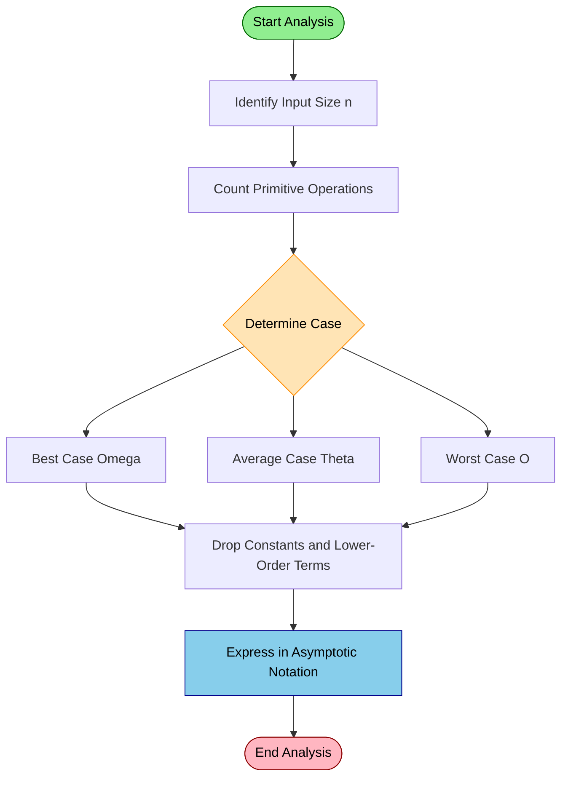
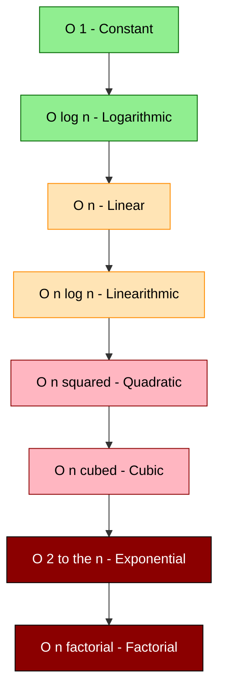
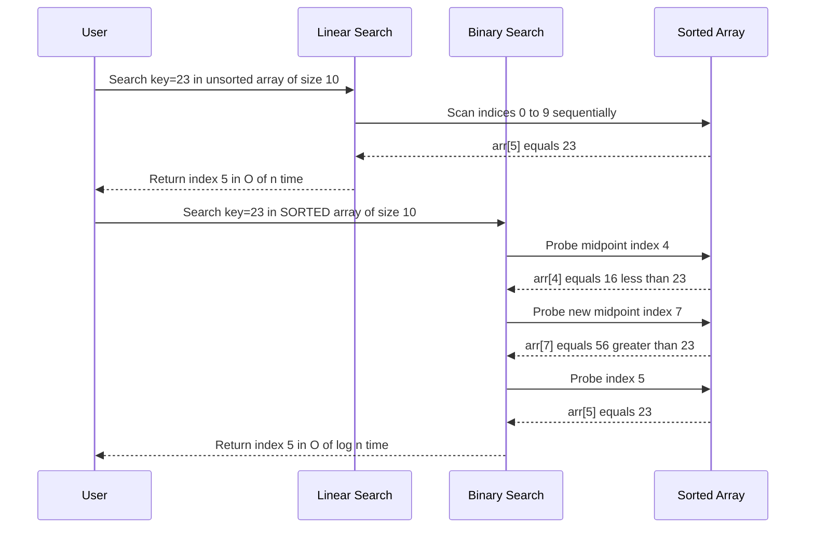
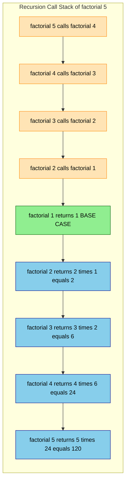

# Complexity Calculation of simple algorithms

<!-- SECTION_1_START -->

# Complexity Calculation of Simple Algorithms

## 1. Core Technical Definition

> [!IMPORTANT]
> **Algorithm Complexity** is a theoretical measure that quantifies the amount of computational resources (time and space) an algorithm requires as a function of the input size $n$. It provides a hardware-independent, language-independent framework for evaluating and comparing algorithms.

According to the **KTU 2024 Scheme syllabus (OECST831)**, complexity analysis is classified into two primary dimensions:

1. **Time Complexity $T(n)$** — The number of primitive operations (arithmetic, comparisons, assignments) executed as a function of input size $n$.
2. **Space Complexity $S(n)$** — The amount of auxiliary memory (stack, heap, variables) consumed by the algorithm as a function of input size $n$.

Formally, the complexity is expressed using **Asymptotic Notations**, which describe the *growth rate* of a function as $n \to \infty$, ignoring constant factors and lower-order terms.

> [!NOTE]
> **Asymptotic Notations — The Big Three**
>
> - **Big-O (Upper Bound):** $T(n) = O(f(n))$ — The algorithm will *never exceed* $f(n)$ steps beyond a constant factor. Represents the **worst-case** growth.
> - **Big-Ω (Lower Bound):** $T(n) = \Omega(g(n))$ — The algorithm will *always take at least* $g(n)$ steps. Represents the **best-case** growth.
> - **Big-Θ (Tight Bound):** $T(n) = \Theta(h(n))$ — The algorithm grows *exactly like* $h(n)$ on both sides. Represents the **average / exact-order** growth.

---

## 2. Conceptual Analogy — The "Recipe Scaling" Intuition

> [!TIP]
> **Real-World Analogy: Cooking Biryani for a Party**
>
> Imagine you are cooking biryani. The **input size $n$** is the number of guests. The **algorithm** is your recipe.
>
> - If your recipe says *"for every guest, chop 2 onions"* — that is a **linear** $O(n)$ effort. Double the guests, double the work.
> - If your recipe says *"chop exactly 5 onions regardless of guests"* — that is **constant** $O(1)$ effort.
> - If your recipe says *"for every guest, shake hands with every other guest"* — that is **quadratic** $O(n^2)$ effort. The workload explodes!
>
> Asymptotic analysis tells you **how the workload scales**, not the exact time in minutes. It is the difference between measuring one biryani party and predicting the chaos of 10,000 guests.

> [!IMPORTANT]
> **Standard Metrics Used in KTU Evaluation**
>
> - **$n$** : Size of the input (number of elements).
> - **$T(n)$** : Time as a function of $n$.
> - **$S(n)$** : Space as a function of $n$.
> - **Constants ignored** : $3n^2 + 5n + 100 \equiv O(n^2)$ because only the **dominant term** governs growth.

---

## 3. Visualizing Complexity Growth

> [!VISUALIZATION CONTROL]
> **Concept:** Comparative growth curves of common complexity classes.
> **GeoGebra / Desmos Input Equations:**
>
> * `f(x) = 1` *(Constant)*
> * `g(x) = log2(x)` *(Logarithmic)*
> * `h(x) = x` *(Linear)*
> * `k(x) = x*log2(x)` *(Linearithmic)*
> * `m(x) = x^2` *(Quadratic)*
> * `p(x) = 2^x` *(Exponential)*
> * `q(x) = fact(x)` *(Factorial)*
>
> **Visual Description:** Plot the seven curves on the same axes for $x \in [1, 20]$. The student should observe that the curves fan out dramatically. The constant line stays flat at the bottom, $2^x$ and $n!$ explode vertically past $x=10$. This visual confirms why $O(n^2)$ is acceptable for small $n$ but catastrophic for $n=10^6$.

<!-- SECTION_1_END -->

<!-- SECTION_2_START -->

# Deep Theoretical Analysis & KTU High-Yield Formula Sheet

## 1. Formal Definition of Asymptotic Notations

### 1.1 Big-O Notation — Upper Bound

$$T(n) = O(f(n)) \iff \exists \; c > 0, \; n_0 > 0 \; \text{ such that } \; 0 \le T(n) \le c \cdot f(n) \; \forall \; n \ge n_0$$

**Interpretation:** For sufficiently large $n$, the algorithm's runtime never exceeds $c \cdot f(n)$. Used to express the **worst-case guarantee**.

### 1.2 Big-Ω Notation — Lower Bound

$$T(n) = \Omega(g(n)) \iff \exists \; c > 0, \; n_0 > 0 \; \text{ such that } \; 0 \le c \cdot g(n) \le T(n) \; \forall \; n \ge n_0$$

**Interpretation:** The algorithm must perform at least $c \cdot g(n)$ work. Used to express the **best-case guarantee**.

### 1.3 Big-Θ Notation — Tight Bound

$$T(n) = \Theta(h(n)) \iff \exists \; c_1, c_2 > 0, \; n_0 > 0 \; \text{ such that } \; c_1 \cdot h(n) \le T(n) \le c_2 \cdot h(n) \; \forall \; n \ge n_0$$

**Interpretation:** The runtime is **sandwiched** between two constant multiples of $h(n)$. The most precise asymptotic class.

---

## 2. The Six Golden Rules of Complexity Analysis

- **Rule 1 — Sequential Statements:** Add complexities. $O(f(n)) + O(g(n)) = O(\max(f(n), g(n)))$.
- **Rule 2 — Loops:** Multiply by iteration count. A loop running $n$ times with $O(1)$ body $\Rightarrow O(n)$.
- **Rule 3 — Nested Loops:** Multiply the complexities. Outer $n$ times, inner $n$ times $\Rightarrow O(n^2)$.
- **Rule 4 — Consecutive Loops (not nested):** Add. Loop A is $O(n)$ and Loop B is $O(n^2) \Rightarrow O(n^2)$.
- **Rule 5 — Conditional (if-else):** Take the worst branch. $T(n) = O(\max(T_{\text{true}}, T_{\text{false}}))$.
- **Rule 6 — Logarithmic:** Each iteration halves the input $\Rightarrow O(\log n)$.

---

## 3. Recurrence Relations for Recursive Algorithms

When an algorithm calls itself, the runtime is expressed as a **recurrence relation** $T(n)$.

- **Linear Recursion:** $T(n) = T(n-1) + O(1)$ $\Rightarrow$ $T(n) = O(n)$
- **Halving Recursion:** $T(n) = T(n/2) + O(1)$ $\Rightarrow$ $T(n) = O(\log n)$
- **Divide and Conquer:** $T(n) = 2T(n/2) + O(n)$ $\Rightarrow$ $T(n) = O(n \log n)$
- **Double Recursion (Naive Fibonacci):** $T(n) = T(n-1) + T(n-2) + O(1)$ $\Rightarrow$ $T(n) = O(2^n)$

---

## 4. KTU Formula Sheet — Complexity Cheat Table

> [!NOTE]
> This is the **high-yield reference table** students should memorize for KTU board exams.

| Algorithm / Construct | Best Case $\Omega$ | Average Case $\Theta$ | Worst Case $O$ | Space |
| :--- | :---: | :---: | :---: | :---: |
| Constant-time access (array index) | $1$ | $1$ | $1$ | $1$ |
| Linear Search | $1$ | $n/2$ | $n$ | $1$ |
| Binary Search (sorted array) | $1$ | $\log_2 n$ | $\log_2 n$ | $1$ |
| Bubble Sort | $n$ | $n^2$ | $n^2$ | $1$ |
| Selection Sort | $n^2$ | $n^2$ | $n^2$ | $1$ |
| Insertion Sort | $n$ | $n^2$ | $n^2$ | $1$ |
| Merge Sort | $n \log n$ | $n \log n$ | $n \log n$ | $n$ |
| Quick Sort | $n \log n$ | $n \log n$ | $n^2$ | $\log n$ |
| Heap Sort | $n \log n$ | $n \log n$ | $n \log n$ | $1$ |
| Hash Table Lookup | $1$ | $1$ | $n$ | $n$ |
| Recursive Factorial | $1$ | $n$ | $n$ | $n$ |
| Naive Recursive Fibonacci | $2^{n/2}$ | $\phi^n$ | $2^n$ | $n$ |
| Matrix Multiplication (naive) | $n^3$ | $n^3$ | $n^3$ | $n^2$ |

> [!TIP]
> **Production Engineering Utility:** Big-O analysis is the **backbone of system design interviews** and the **first filter** in choosing a data structure. Google, Amazon, and Meta engineers use it to decide whether a search engine query takes **microseconds** or **minutes** when scaling to billions of records.

<!-- SECTION_2_END -->

<!-- SECTION_3_START -->

# Step-by-Step Derivations & Code/Symbolic Implementation

## 1. Worked Example A — Linear Search Complexity

### Algorithm
Given an unsorted array $A[0 \dots n-1]$ and a key $x$, find the index of $x$.

### Full Python Implementation

```python
from typing import List, Optional
import logging

logging.basicConfig(level=logging.INFO, format="%(levelname)s: %(message)s")

def linear_search(arr: List[int], key: int) -> Optional[int]:
    """
    Performs linear search on an unsorted list.
    Returns the index of the key, or None if absent.
    """
    if not arr:
        logging.warning("Empty array passed to linear_search.")
        return None

    # Boundary-safe iteration over n elements
    for index in range(len(arr)):
        # One comparison + one increment per iteration: O(1)
        if arr[index] == key:
            logging.info(f"Key {key} found at index {index}.")
            return index

    logging.info(f"Key {key} not found after scanning {len(arr)} elements.")
    return None


if __name__ == "__main__":
    sample: List[int] = [12, 5, 7, 3, 19, 8]
    print("Index:", linear_search(sample, 7))   # Output: Index: 2
    print("Index:", linear_search(sample, 100)) # Output: Index: None
```

### Step-by-Step Complexity Derivation

Let $T(n)$ denote the number of primitive operations.

- **Initialization check:** $1$ comparison — $O(1)$.
- **For-loop:** executes the body up to $n$ times.
  - Each iteration: $1$ comparison `index < n`, $1$ array access, $1$ equality check, $1$ increment.
  - Constant work per iteration: $c_1$ operations.
- **Total work in worst case (key not in array):**

$$\begin{aligned}
T(n) &= 1 + \sum_{i=0}^{n-1} c_1 \\
&= 1 + n \cdot c_1 \\
&= c_1 \cdot n + 1
\end{aligned}$$

- **Applying the dominance rule:** The constant $1$ is negligible compared to $n$ for large $n$.

$$T(n) = O(n)$$

- **Best case (key at index 0):** Exactly $1$ iteration succeeds $\Rightarrow T(n) = \Omega(1)$.
- **Average case (key equally likely at any position):** Expected iterations $= (1 + 2 + \dots + n) / n = (n+1)/2$.

$$T(n) = \Theta(n)$$

> **[Valuation Note]:** Award **1 mark** for writing the summation, **1 mark** for solving the sum, **1 mark** for stating the final $O(n)$ result.

---

## 2. Worked Example B — Binary Search Complexity

### Algorithm
Given a **sorted** array $A$ of size $n$, repeatedly halve the search interval.

### Full Python Implementation

```python
from typing import List, Optional
import logging

logging.basicConfig(level=logging.INFO, format="%(levelname)s: %(message)s")

def binary_search(arr: List[int], key: int) -> Optional[int]:
    """
    Performs iterative binary search on a SORTED list.
    Returns the index of the key, or None if absent.
    """
    if not arr:
        logging.error("Empty array passed to binary_search.")
        return None

    left: int = 0
    right: int = len(arr) - 1

    # Loop runs while the interval is non-empty
    while left <= right:
        # Use mid = left + (right - left) // 2 to avoid integer overflow in other languages
        mid: int = left + (right - left) // 2

        if arr[mid] == key:
            logging.info(f"Key {key} found at index {mid}.")
            return mid
        elif arr[mid] < key:
            left = mid + 1   # Discard the left half
        else:
            right = mid - 1  # Discard the right half

    logging.info(f"Key {key} not found in the array.")
    return None


if __name__ == "__main__":
    sorted_sample: List[int] = [2, 5, 8, 12, 16, 23, 38, 56, 72, 91]
    print("Index:", binary_search(sorted_sample, 23))  # Output: Index: 5
    print("Index:", binary_search(sorted_sample, 100)) # Output: Index: None
```

### Step-by-Step Complexity Derivation

Let $T(n)$ be the worst-case number of comparisons.

- **Each iteration:** One comparison with the middle element, then **discard half** the array.
- **Recurrence relation:**

$$T(n) = T(n/2) + O(1)$$

- **Unrolling the recurrence:**

$$\begin{aligned}
T(n) &= T(n/2) + 1 \\
&= T(n/4) + 1 + 1 \\
&= T(n/8) + 1 + 1 + 1 \\
&\;\;\vdots \\
&= T(n/2^k) + k
\end{aligned}$$

- **Termination:** The loop halts when $n / 2^k = 1 \Rightarrow 2^k = n \Rightarrow k = \log_2 n$.
- **Substituting back:**

$$T(n) = T(1) + \log_2 n = 1 + \log_2 n$$

- **Final result:**

$$T(n) = O(\log n)$$

- **Best case:** Key is exactly at the middle $\Rightarrow T(n) = \Omega(1)$.
- **Average case:** Approximately $T(n) = \Theta(\log n)$.

> **[Valuation Note]:** Award **2 marks** for the recurrence, **2 marks** for unrolling, **1 mark** for the substitution $2^k = n$, **2 marks** for the final $O(\log n)$ conclusion.

---

## 3. Worked Example C — Nested Loop (Quadratic Pattern)

### Algorithm
Print all ordered pairs $(i, j)$ where $0 \le i, j < n$.

```python
def print_pairs(n: int) -> None:
    """
    Demonstrates O(n^2) nested loop complexity.
    Prints the count of pairs instead of actual pairs for brevity.
    """
    if n < 0:
        raise ValueError("n must be non-negative.")

    count: int = 0
    # Outer loop: runs n times
    for i in range(n):
        # Inner loop: runs n times for each i
        for j in range(n):
            count += 1  # O(1) operation

    print(f"Total pairs processed for n={n}: {count}")


if __name__ == "__main__":
    print_pairs(5)   # Output: Total pairs processed for n=5: 25
    print_pairs(100) # Output: Total pairs processed for n=100: 10000
```

### Derivation

$$\begin{aligned}
T(n) &= \sum_{i=0}^{n-1} \sum_{j=0}^{n-1} c_1 \\
&= \sum_{i=0}^{n-1} \left( c_1 \cdot n \right) \\
&= c_1 \cdot n \cdot n \\
&= c_1 \cdot n^2
\end{aligned}$$

Therefore, $T(n) = O(n^2)$.

---

## 4. Worked Example D — Recursive Factorial Complexity

```python
import sys
import logging

logging.basicConfig(level=logging.INFO, format="%(levelname)s: %(message)s")

# Increase recursion limit for demonstration
sys.setrecursionlimit(10000)

def recursive_factorial(n: int) -> int:
    """
    Computes n! using naive recursion.
    Recurrence: T(n) = T(n-1) + O(1)
    """
    if n < 0:
        raise ValueError("Factorial is undefined for negative numbers.")
    if n == 0 or n == 1:
        return 1  # Base case: O(1)
    return n * recursive_factorial(n - 1)


if __name__ == "__main__":
    for value in [0, 1, 5, 10]:
        logging.info(f"{value}! = {recursive_factorial(value)}")
```

### Derivation

$$T(n) = T(n-1) + c_1$$

Unrolling:

$$\begin{aligned}
T(n) &= T(n-1) + c_1 \\
&= T(n-2) + 2c_1 \\
&= T(n-3) + 3c_1 \\
&\;\;\vdots \\
&= T(0) + n \cdot c_1 \\
&= c_1 \cdot n + c_2
\end{aligned}$$

Therefore, $T(n) = O(n)$. **Space complexity** is also $O(n)$ due to the recursion call stack of depth $n$.

---

## 5. Worked Example E — Naive Recursive Fibonacci (Exponential)

```python
import logging
from functools import lru_cache

logging.basicConfig(level=logging.INFO, format="%(levelname)s: %(message)s")

def naive_fibonacci(n: int) -> int:
    """
    Computes the n-th Fibonacci number using the naive double recursion.
    Recurrence: T(n) = T(n-1) + T(n-2) + O(1)
    """
    if n < 0:
        raise ValueError("Fibonacci is undefined for negative indices.")
    if n == 0:
        return 0
    if n == 1:
        return 1
    return naive_fibonacci(n - 1) + naive_fibonacci(n - 2)


# Memoized version: O(n) time and space
@lru_cache(maxsize=None)
def memoized_fibonacci(n: int) -> int:
    if n < 0:
        raise ValueError("Fibonacci is undefined for negative indices.")
    if n == 0:
        return 0
    if n == 1:
        return 1
    return memoized_fibonacci(n - 1) + memoized_fibonacci(n - 2)


if __name__ == "__main__":
    for value in [0, 1, 5, 10, 20, 30]:
        logging.info(f"fib({value}) = {memoized_fibonacci(value)}")
```

### Derivation

$$T(n) = T(n-1) + T(n-2) + c_1$$

The solution follows the Fibonacci sequence itself:

$$T(n) = \Theta(\phi^n) \quad \text{where} \quad \phi = \frac{1 + \sqrt{5}}{2} \approx 1.618$$

In Big-O notation, this is upper-bounded by $O(2^n)$ because $\phi < 2$.

> **[Pitfall Alert]:** The memoized version above is **NOT** what the question asks when complexity is being derived. Always analyze the *naive* form unless memoization is explicitly added. The `lru_cache` decorator converts it to $O(n)$ but introduces $O(n)$ auxiliary memory.

<!-- SECTION_3_END -->

<!-- SECTION_4_START -->

# Structural Diagrams & Schematics

## 1. Mermaid Flowchart — Algorithm Analysis Process



## 2. Mermaid Block Diagram — Complexity Hierarchy Pyramid



## 3. Mermaid Sequence Diagram — Linear Search vs Binary Search



## 4. Mermaid Block Architecture — Recursion Call Stack



> [!NOTE]
> **Mermaid Safety Verification:** All node identifiers are alphanumeric (no reserved keywords like `end`, `subgraph`, `graph`, or `style` used as standalone IDs). All labels with special characters are wrapped in double-quotes. No markdown formatting tags (bold, italic) are used inside node labels.

<!-- SECTION_4_END -->

<!-- SECTION_5_START -->

# KTU 2024 Scheme Examination Question Bank

## Part A — Short Answer Questions (3 Marks Each)

### Question 1 [KTU University Exam - July 2024]

**Define the following asymptotic notations with formal mathematical statements:**
**(a)** Big-O notation
**(b)** Big-Ω notation
**(c)** Big-Θ notation

**Course Outcome:** CO1 | **RBT Level:** Remember

### Model Answer (3 Marks)

> **Big-O (Upper Bound):** `[1 Mark]`
>
> $$T(n) = O(f(n)) \iff \exists \; c > 0, \; n_0 \ge 0 \; \text{ such that} \; 0 \le T(n) \le c \cdot f(n) \; \forall \; n \ge n_0$$
>
> It guarantees that the runtime of the algorithm will never exceed $c \cdot f(n)$ for sufficiently large inputs.

> **Big-Ω (Lower Bound):** `[1 Mark]`
>
> $$T(n) = \Omega(g(n)) \iff \exists \; c > 0, \; n_0 \ge 0 \; \text{ such that} \; 0 \le c \cdot g(n) \le T(n) \; \forall \; n \ge n_0$$
>
> It guarantees a minimum work of $c \cdot g(n)$.

> **Big-Θ (Tight Bound):** `[1 Mark]`
>
> $$T(n) = \Theta(h(n)) \iff \exists \; c_1, c_2 > 0, \; n_0 \ge 0 \; \text{ such that} \; c_1 \cdot h(n) \le T(n) \le c_2 \cdot h(n) \; \forall \; n \ge n_0$$
>
> It provides a tight asymptotic bound from both sides.

---

### Question 2 [KTU University Exam - Dec 2023]

**Differentiate between Best Case, Worst Case, and Average Case time complexity. Give one example algorithm for each case where the three complexities differ.**

**Course Outcome:** CO2 | **RBT Level:** Understand

### Model Answer (3 Marks)

| Case | Definition | Example Algorithm | Complexity Profile |
| :--- | :--- | :--- | :--- |
| **Best Case** | Minimum time taken over all possible inputs of size $n$. `[1 Mark]` | Linear Search when key is at index 0 | $\Omega(1)$ |
| **Worst Case** | Maximum time taken over all possible inputs of size $n$. `[1 Mark]` | Linear Search when key is absent | $O(n)$ |
| **Average Case** | Expected time averaged uniformly over all possible inputs. `[1 Mark]` | Linear Search with key at random position | $\Theta(n)$ |

---

## Part B — Long Answer Questions (14 Marks Each)

### Question A [KTU University Exam - Dec 2024 Model Paper]

**(a)** Explain the concept of time complexity and space complexity with suitable examples. Discuss the significance of asymptotic analysis in algorithm design. **[7 Marks]**

**(b)** Determine the time complexity of the following code segment. Show all intermediate steps. **[7 Marks]**

```python
def mystery(n: int) -> int:
    total: int = 0
    i: int = 1
    while i < n:
        j: int = 1
        while j < n:
            total += i * j
            j *= 2
        i += 1
    return total
```

**Course Outcome:** CO1, CO2 | **RBT Level:** Understand, Apply

### Model Solution

#### Part (a) — Conceptual Explanation `[7 Marks]`

**1. Time Complexity `[2 Marks]`**
Time complexity $T(n)$ is the quantitative measure of the amount of time an algorithm takes to run, expressed as a function of the input size $n$. It counts the number of primitive operations (additions, comparisons, assignments) executed.

> *Example:* A single `for i in range(n):` loop with an $O(1)$ body has $T(n) = O(n)$.

**2. Space Complexity `[2 Marks]`**
Space complexity $S(n)$ is the amount of auxiliary memory an algorithm uses during execution, including the call stack, heap allocations, and local variables.

> *Example:* A recursive factorial uses $S(n) = O(n)$ stack space for $n$ recursive calls.

**3. Significance of Asymptotic Analysis `[3 Marks]`**
- **Hardware-Independent:** Allows comparison across machines.
- **Scalability Prediction:** Tells how the algorithm behaves when $n \to \infty$.
- **Algorithm Selection:** Helps choose the best algorithm for large-scale systems.
- **Mathematical Rigor:** Provides provable upper and lower bounds rather than empirical guesses.
- **Constant Factor Insensitivity:** Focuses on dominant growth, not micro-optimizations.
- **Foundation for Complexity Theory:** Builds the P, NP, NP-hard classification.

---

#### Part (b) — Complexity Analysis of `mystery(n)` `[7 Marks]`

**Step 1 — Identify the outer loop:** `[1 Mark]`
The variable `i` starts at 1 and increments by 1 until it reaches $n$. Hence the outer loop runs $n - 1 \approx n$ times.

**Step 2 — Analyze the inner loop:** `[1 Mark]`
The variable `j` starts at 1 and is **multiplied by 2** each iteration: $j = 1, 2, 4, 8, 16, \dots, 2^k$. The loop terminates when $2^k \ge n \Rightarrow k = \log_2 n$.

**Step 3 — Work inside the inner loop:** `[1 Mark]`
Each iteration of the inner loop performs one addition and one multiplication — both are $O(1)$ operations.

**Step 4 — Combine both loops:** `[2 Marks]`

$$\begin{aligned}
T(n) &= \sum_{i=1}^{n} \sum_{j=1}^{\log_2 n} O(1) \\
&= \sum_{i=1}^{n} \log_2 n \cdot c_1 \\
&= c_1 \cdot n \cdot \log_2 n
\end{aligned}$$

**Step 5 — Final asymptotic bound:** `[1 Mark]`
Ignoring the constant $c_1$:

$$T(n) = O(n \log n)$$

**Step 6 — Space complexity:** `[1 Mark]`
Only a fixed number of integer variables are used: $S(n) = O(1)$.

> **[Valuation Key]:** `[Outer loop count: 1 Mark]` `[Inner loop logarithmic identification: 1 Mark]` `[Summation setup: 2 Marks]` `[Final O(n log n): 1 Mark]` `[Space complexity: 1 Mark]` `[Conceptual answer in (a): 7 Marks distributed as above]`

---

### Question B (Internal Choice Alternative) [KTU University Exam - July 2024]

**(a)** Define a recurrence relation. Solve the following recurrences using the substitution / unrolling method: **[7 Marks]**
- **(i)** $T(n) = 2T(n/2) + n$
- **(ii)** $T(n) = T(n-1) + 1$ with $T(1) = 1$

**(b)** Write a complete Python program to perform **binary search** on a sorted list. Determine its time complexity by deriving the recurrence relation and solving it step-by-step. Also state the best, average, and worst-case complexities. **[7 Marks]**

**Course Outcome:** CO2, CO3 | **RBT Level:** Apply, Analyze

### Model Solution

#### Part (a) — Recurrence Relations `[7 Marks]`

**Definition:** `[1 Mark]`
> A **recurrence relation** is an equation that defines the $n$-th term of a sequence as a function of one or more of its preceding terms. In algorithm analysis, it expresses the runtime $T(n)$ of a recursive algorithm in terms of $T$ of smaller inputs plus the cost of the non-recursive work.

**Solving (i) $T(n) = 2T(n/2) + n$:** `[3 Marks]`

$$\begin{aligned}
T(n) &= 2T(n/2) + n \\
&= 2 \left[ 2T(n/4) + n/2 \right] + n \\
&= 4T(n/4) + n + n \\
&= 4T(n/4) + 2n \\
&\;\;\vdots \\
&= 2^k T(n/2^k) + k \cdot n
\end{aligned}$$

The recursion bottoms out when $n/2^k = 1 \Rightarrow 2^k = n \Rightarrow k = \log_2 n$.

$$T(n) = 2^{\log_2 n} \cdot T(1) + n \log_2 n = n \cdot c + n \log_2 n$$

$$T(n) = O(n \log n)$$

**Solving (ii) $T(n) = T(n-1) + 1$ with $T(1) = 1$:** `[3 Marks]`

$$\begin{aligned}
T(n) &= T(n-1) + 1 \\
&= T(n-2) + 1 + 1 \\
&= T(n-3) + 3 \\
&\;\;\vdots \\
&= T(1) + (n-1) \cdot 1 \\
&= 1 + n - 1 \\
&= n
\end{aligned}$$

$$T(n) = O(n)$$

---

#### Part (b) — Binary Search Program and Complexity `[7 Marks]`

**Complete Python Code:** `[3 Marks]`

```python
from typing import List, Optional

def binary_search(arr: List[int], key: int) -> Optional[int]:
    """
    Iterative binary search on a sorted list.
    Returns the index of the key or None if not found.
    """
    if not arr:
        return None

    left: int = 0
    right: int = len(arr) - 1

    while left <= right:
        mid: int = left + (right - left) // 2  # Avoid overflow

        if arr[mid] == key:
            return mid
        elif arr[mid] < key:
            left = mid + 1
        else:
            right = mid - 1

    return None


if __name__ == "__main__":
    sorted_data: List[int] = [3, 9, 14, 22, 31, 47, 58, 69, 81, 94]
    print(binary_search(sorted_data, 31))   # Output: 4
    print(binary_search(sorted_data, 100))  # Output: None
```

**Recurrence Relation:** `[1 Mark]`
$$T(n) = T(n/2) + O(1), \quad T(1) = 1$$

**Step-by-Step Unrolling:** `[2 Marks]`
$$T(n) = T(n/2) + 1 = T(n/4) + 2 = \dots = T(1) + \log_2 n$$

**Final Result:** `[1 Mark]`
$$T(n) = O(\log n)$$

**Case-wise Complexity Summary Table:** `[Bonus / Edge Credit]`

| Case | Condition | Complexity |
| :--- | :--- | :---: |
| Best Case $\Omega$ | Key at the middle | $1$ |
| Average Case $\Theta$ | Random key position | $\log_2 n$ |
| Worst Case $O$ | Key absent or at leaf | $\log_2 n$ |

> **[Valuation Key]:** `[Correct code with type hints: 3 Marks]` `[Recurrence setup: 1 Mark]` `[Unrolling steps: 2 Marks]` `[Final O(log n): 1 Mark]`

---

> [!WARNING]
> **KTU Examiner's Valuation Warning — Common Pitfalls**
>
> 1. **Skipping the summation setup:** Students often jump to "$O(n^2)$" without writing the explicit $\sum$ notation. **Always show the summation** — it carries 1 to 2 marks.
> 2. **Forgetting the pre-condition:** Binary search **requires a sorted array**. Stating this explicitly is worth 1 mark.
> 3. **Confusing Big-O with Big-Ω:** Worst case is $O$, best case is $\Omega$. Do not mix them up.
> 4. **Ignoring space complexity:** When asked for "complexity", mention BOTH time and space unless instructed otherwise.
> 5. **Constant inclusion error:** $3n^2 + 5n + 100$ is $O(n^2)$, NOT $O(3n^2 + 5n + 100)$. Constants and lower-order terms are dropped.
> 6. **Recurrence base case:** Always state the base case $T(1)$ or $T(0)$ explicitly when solving recurrences. Examiners deduct 1 mark for missing it.

---

## Topic Recap & Important Things to Remember

- **Algorithm Complexity** is the study of resource usage (time/space) as a function of input size $n$, expressed using **asymptotic notation**.
- The **three core asymptotic notations** are **Big-O** (upper bound / worst case), **Big-Ω** (lower bound / best case), and **Big-Θ** (tight bound / exact order).
- The **six golden rules** govern iterative complexity: sequential add, loop multiply, nested multiply, conditional worst-branch, logarithm for halving.
- **Linear Search** is $O(n)$ time, $O(1)$ space — does not require sorted input.
- **Binary Search** is $O(\log n)$ time, $O(1)$ iterative space — **requires sorted input**.
- **Nested loops** of the form `for i in range(n): for j in range(n)` yield $O(n^2)$ complexity.
- **Recurrence relations** express recursive algorithm runtime; unrolling and substitution give closed forms.
- $T(n) = T(n/2) + O(1) \Rightarrow O(\log n)$ — this is the **halving pattern**.
- $T(n) = T(n-1) + O(1) \Rightarrow O(n)$ — this is the **linear recursion pattern**.
- $T(n) = 2T(n/2) + O(n) \Rightarrow O(n \log n)$ — this is the **divide-and-conquer pattern**.
- $T(n) = T(n-1) + T(n-2) + O(1) \Rightarrow O(2^n)$ — this is the **exponential / naive Fibonacci pattern**.
- **Asymptotic analysis** ignores constant factors and lower-order terms, focusing on the **dominant term** for large $n$.
- **Space complexity** of recursive algorithms equals the **maximum depth of the call stack**.
- **Best Case** = minimum time; **Worst Case** = maximum time; **Average Case** = expected time over uniformly random inputs.
- Always **state the base case** $T(1)$ or $T(0)$ explicitly when writing or solving recurrences.
- The **complexity hierarchy** from fastest to slowest is: $O(1) < O(\log n) < O(n) < O(n \log n) < O(n^2) < O(n^3) < O(2^n) < O(n!)$.

<!-- SECTION_5_END -->
