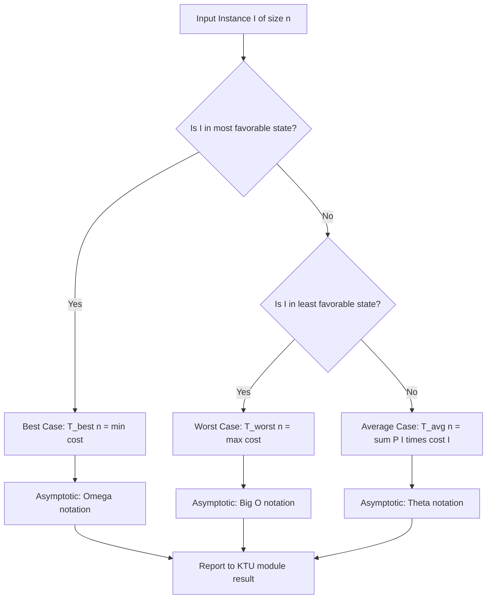
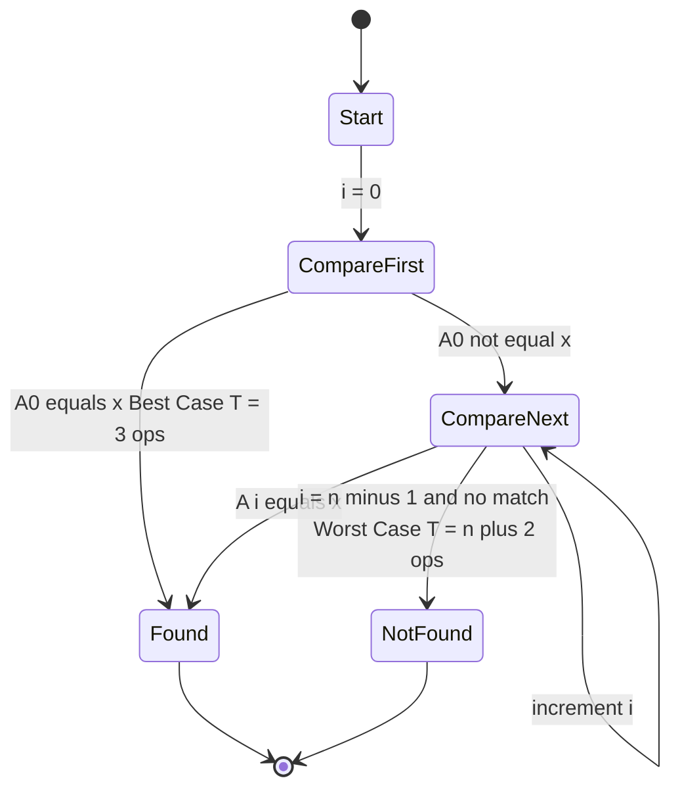
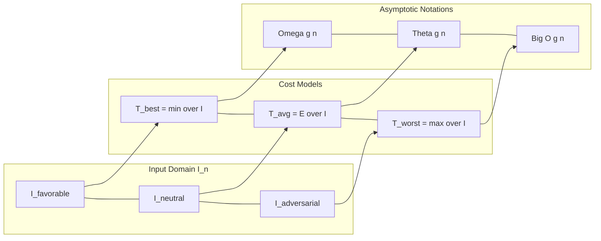
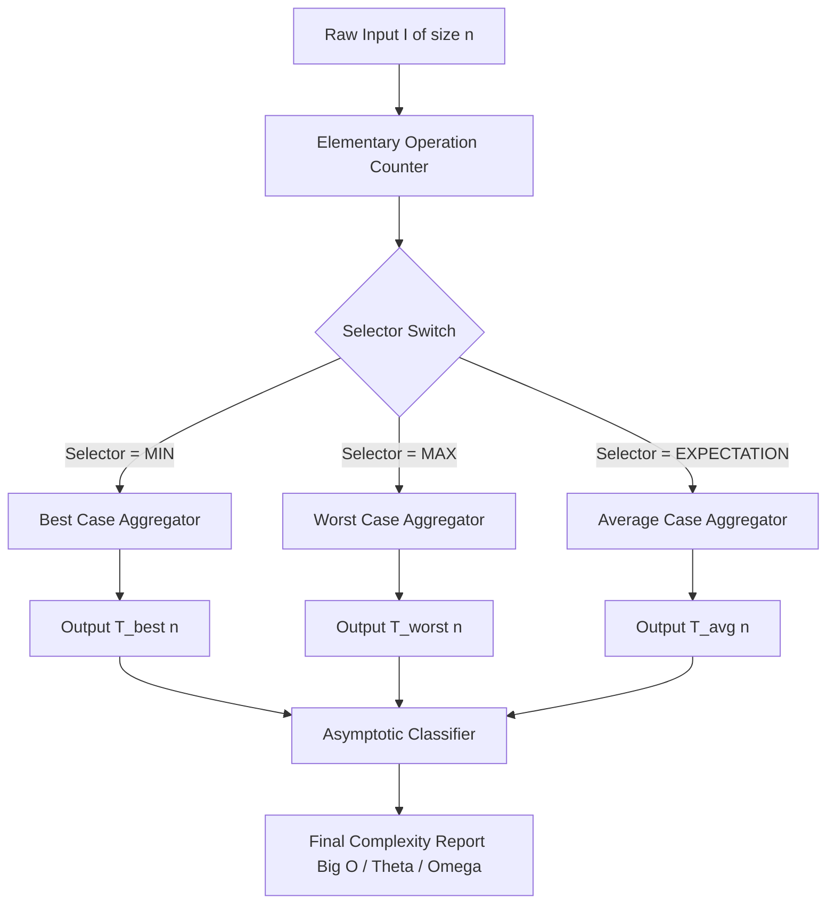
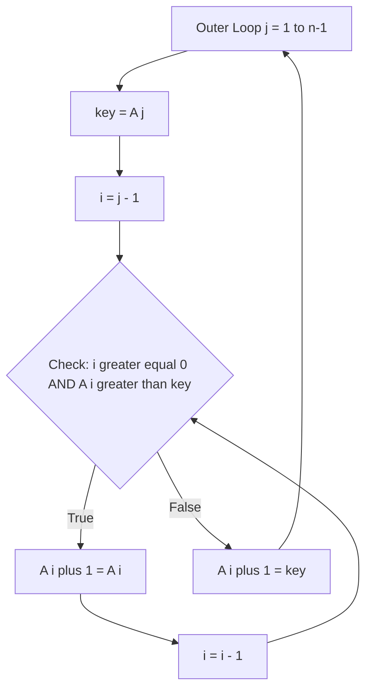

# Elementary operations and Computation of Time Complexity-Best, worst and Average Case Complexities

<!-- SECTION_1_START -->
# Elementary Operations and Computation of Time Complexity

## 1.1 Formal Definition

> [!IMPORTANT]
> **Elementary Operation (KTU 2024 Syllabus Definition):**
> An *elementary operation* is a low-level computational action whose execution time is bounded above by a **constant** $c$, independent of the input size $n$. The set of elementary operations includes: arithmetic addition, subtraction, multiplication, division, modulo, comparison of two numbers, assignment to a variable, indexing into an array, dereferencing a pointer, and a procedure/function call (excluding the body of the called function).

> [!NOTE]
> **Time Complexity (KTU 2024 Syllabus Definition):**
> The *time complexity* of an algorithm is a function $T(n)$ that quantifies the number of elementary operations performed on an input of size $n$. It captures how the running time scales as the input grows, expressed in terms of asymptotic growth classes (Big-O, $\Theta$, $\Omega$).

Formally, for a given algorithm $\mathcal{A}$ and input instance $I$ of size $n = \vert I \vert$, we define:
$$T_{\mathcal{A}}(n) = \sum_{I \in \mathcal{I}_n} P(I) \cdot \text{cost}_{\mathcal{A}}(I)$$

where $\mathcal{I}_n$ is the set of all inputs of size $n$ and $P(I)$ is the probability of input $I$ occurring.

## 1.2 Conceptual Analogy / Intuition

Imagine you are searching for a specific book in a **library** where books are arranged in **random order** on a shelf. You check each book one by one from the left.

- **Best Case**: The very first book you pick is the one you wanted. You spent almost no time. This is like a 1-element operation — *constant* time.
- **Worst Case**: The book you want is the *last* one on the shelf, or perhaps it isn't there at all. You had to check every single book. The time grows *linearly* with the number of books.
- **Average Case**: On a typical day, the book could be anywhere in the middle. Statistically, you'd check *half* the shelf on average.

Just like in a library, an algorithm's running time depends not only on the **size** of the input (the shelf length) but also on the **state** of the input (where the target happens to be).

## 1.3 Physical Constants and Standard Metrics

The following standard metrics are used in algorithmic analysis:

| Metric | Symbol | Description |
|---|---|---|
| Input size | $n$ | Number of basic data elements |
| Constant cost per elementary op | $c$ | Architecture-dependent clock cycles |
| Asymptotic upper bound | $O(\cdot)$ | Worst-case growth rate |
| Asymptotic lower bound | $\Omega(\cdot)$ | Best-case growth rate |
| Asymptotic tight bound | $\Theta(\cdot)$ | Average-case growth rate |

> [!VISUALIZATION CONTROL]
> **Concept:** Growth curves of common complexity classes.
> **GeoGebra / Desmos Input Equations:**
> * `f(x) = 1` (constant)
> * `g(x) = log(x)` (logarithmic)
> * `h(x) = x` (linear)
> * `p(x) = x^2` (quadratic)
> * `q(x) = 2^x` (exponential)
> **Visual Description:** On a 2D coordinate plane with $x$-axis labeled "Input Size $n$" and $y$-axis labeled "Operations $T(n)$", the constant line stays flat near the origin, the logarithmic curve rises slowly, the linear line cuts diagonally, the quadratic curve sweeps upward steeply, and the exponential curve shoots up almost vertically. Students should observe that the **vertical distance between curves widens dramatically** as $n$ grows, illustrating why $O(n^2)$ is unacceptable when $O(n)$ is available.

<!-- SECTION_1_END -->

<!-- SECTION_2_START -->
# Deep Theoretical Analysis & KTU High-Yield Formula Sheet

## 2.1 Three Cases of Time Complexity

For a deterministic algorithm, the running time is a function of the input. Since the input is not always the same, we analyze three characteristic cases:

### 2.1.1 Best-Case Complexity
The best-case complexity is the **minimum** running time over all possible inputs of size $n$. It is denoted $T_{\text{best}}(n)$ and is mathematically expressed as:

$$T_{\text{best}}(n) = \min_{I \in \mathcal{I}_n} \left\{ \text{cost}_{\mathcal{A}}(I) \right\}$$

- It represents an **optimistic lower bound** on running time.
- It is expressed using the asymptotic **$\Omega$** notation.
- It is rarely useful in practice because the input distribution is not always favorable.

### 2.1.2 Worst-Case Complexity
The worst-case complexity is the **maximum** running time over all possible inputs of size $n$. It is denoted $T_{\text{worst}}(n)$ and is mathematically expressed as:

$$T_{\text{worst}}(n) = \max_{I \in \mathcal{I}_n} \left\{ \text{cost}_{\mathcal{A}}(I) \right\}$$

- It represents a **pessimistic upper bound** on running time.
- It is expressed using the asymptotic **$O$** notation.
- It is the most commonly reported metric because it provides a **guarantee** on performance.

### 2.1.3 Average-Case Complexity
The average-case complexity is the **expected** running time, computed by summing the cost of each input weighted by its probability of occurrence:

$$T_{\text{avg}}(n) = \sum_{I \in \mathcal{I}_n} P(I) \cdot \text{cost}_{\mathcal{A}}(I)$$

- It assumes a **probability distribution** on inputs.
- It is expressed using the asymptotic **$\Theta$** notation (when the average equals the typical case).
- It is the most *realistic* measure but the **hardest to compute** because $P(I)$ must be justified.

## 2.2 Detailed Step-by-Step Logic

**Step 1 — Identify elementary operations:** Locate every line in the pseudo-code that performs an arithmetic, comparison, assignment, or indexing action. Each such line is one elementary operation (plus a constant factor $c$).

**Step 2 — Count per-execution cost:** Determine how many times each elementary operation executes **per single invocation** of the algorithm.

**Step 3 — Identify the variable factor:** The expression that depends on input size $n$ is the only term that matters asymptotically. Constant factors $c_1, c_2, \ldots$ are absorbed into Big-O.

**Step 4 — Compose $T(n)$:** Sum the cost of all lines into a closed-form function of $n$.

**Step 5 — Classify the case:**
- If we hold the input in its **most favorable** state, we get $T_{\text{best}}(n)$.
- If we hold the input in its **least favorable** state, we get $T_{\text{worst}}(n)$.
- If we assume a **uniform random** distribution, we get $T_{\text{avg}}(n)$.

**Step 6 — Apply asymptotic notation:** Drop lower-order terms and constant factors.

> [!IMPORTANT]
> **The 'Why' Behind Each Step:**
> Asymptotic analysis ignores constants because real hardware differs — what takes 3 cycles on an Intel i9 might take 11 cycles on an ARM Cortex. By dropping constants, we get a **machine-independent** measure of efficiency that lets us compare algorithms independent of the platform.

## 2.3 KTU Formula Sheet / Cheat Sheet

| Symbol / Expression | Meaning | Typical Use |
|---|---|---|
| $T(n) = c$ | Constant time — no dependence on $n$ | Direct array access, hash lookup |
| $T(n) = c_1 \log n + c_2$ | Logarithmic | Binary search |
| $T(n) = c_1 n + c_2$ | Linear | Linear scan |
| $T(n) = c_1 n \log n$ | Log-linear | Merge sort, heap sort |
| $T(n) = c_1 n^2 + c_2 n + c_3$ | Quadratic | Bubble, selection, insertion sort |
| $T(n) = c_1 n^3$ | Cubic | Naive matrix multiplication |
| $T(n) = c_1 2^n$ | Exponential | Recursive Fibonacci, subset generation |
| $T(n) = c_1 n!$ | Factorial | Brute-force TSP |
| $O(g(n))$ | Upper bound — worst case | $T(n) \le c \cdot g(n)$ for large $n$ |
| $\Omega(g(n))$ | Lower bound — best case | $T(n) \ge c \cdot g(n)$ for large $n$ |
| $\Theta(g(n))$ | Tight bound — average case | $c_1 g(n) \le T(n) \le c_2 g(n)$ |
| $T_{\text{avg}}(n) = \sum_{I} P(I) \cdot T(I)$ | Expected cost | Weighted by input distribution |

## 2.4 Real-World Engineering Utility

In production systems, **worst-case** analysis is the cornerstone of:
- **Real-time systems** (aircraft flight control, anti-lock braking): the system **must** finish within a deadline, so worst-case latency is the binding constraint.
- **Embedded systems** with hard memory limits: worst-case space guarantees prevent out-of-memory crashes.
- **Cryptographic algorithms**: worst-case complexity defines the security level (e.g., RSA security relies on the worst-case hardness of integer factorization).

**Average-case** analysis dominates:
- **Database query optimizers**: assume uniform data distribution to estimate query cost.
- **Randomized algorithms** (Quicksort with random pivot, hashing with universal hashing): average-case is the design target.

**Best-case** analysis is mostly a **theoretical curiosity** used to prove lower bounds and to identify degenerate input patterns (e.g., already-sorted data triggering $\Theta(n)$ Insertion Sort).

<!-- SECTION_2_END -->

<!-- SECTION_3_START -->
# Step-by-Step Derivations & Code Implementation

## 3.1 Worked Example 1 — Linear Search

Consider the **Linear Search** algorithm on an array $A[0 \ldots n-1]$ searching for a target value $x$.

```
LINEAR-SEARCH(A, x):
  for i = 0 to n - 1:
      if A[i] == x:
          return i
  return -1
```

### 3.1.1 Best Case Derivation

The best case occurs when $A[0] = x$, i.e., the target is the first element. The loop runs once, performing one comparison.

$$
\begin{aligned}
T_{\text{best}}(n) &= \underbrace{1}_{\text{initialization}} + \underbrace{1}_{\text{comparison } A[0]=x} + \underbrace{1}_{\text{return } i} \\
&= 3 \text{ elementary operations} \\
&= \Theta(1)
\end{aligned}
$$

### 3.1.2 Worst Case Derivation

The worst case occurs when $x \notin A$. The loop executes $n$ times, and each iteration performs one comparison that fails.

$$
\begin{aligned}
T_{\text{worst}}(n) &= \underbrace{1}_{\text{init } i=0} + \sum_{i=0}^{n-1} \underbrace{1}_{\text{comparison } A[i]=x} + \underbrace{1}_{\text{return } -1} \\
&= 1 + n + 1 \\
&= n + 2 \\
&= \Theta(n)
\end{aligned}
$$

### 3.1.3 Average Case Derivation

Assume the target $x$ is equally likely to be in any of the $n$ positions, and with probability $\frac{1}{n+1}$ it is not in the array. Let $p = \frac{1}{n+1}$ (uniform probability per case).

$$
\begin{aligned}
T_{\text{avg}}(n) &= \sum_{i=0}^{n-1} P(x \text{ at position } i) \cdot (i+1) + P(x \notin A) \cdot n \\
&= \sum_{i=0}^{n-1} \frac{1}{n+1} (i+1) + \frac{1}{n+1} \cdot n \\
&= \frac{1}{n+1} \sum_{i=0}^{n-1} (i+1) + \frac{n}{n+1} \\
&= \frac{1}{n+1} \cdot \frac{n(n+1)}{2} + \frac{n}{n+1} \\
&= \frac{n}{2} + \frac{n}{n+1} \\
&\approx \frac{n}{2} \\
&= \Theta(n)
\end{aligned}
$$

The expected number of probes is approximately $\frac{n}{2}$, which is intuitive: on average, you find the target halfway through the array.

## 3.2 Worked Example 2 — Insertion Sort

```
INSERTION-SORT(A):
  for j = 1 to n - 1:
      key = A[j]
      i = j - 1
      while i >= 0 and A[i] > key:
          A[i+1] = A[i]
          i = i - 1
      A[i+1] = key
```

### 3.2.1 Best Case (Already Sorted)

When $A$ is already sorted, the `while` condition $A[i] > \text{key}$ fails immediately on each iteration. Inner loop runs zero times.

$$
\begin{aligned}
T_{\text{best}}(n) &= \sum_{j=1}^{n-1} \underbrace{1}_{\text{key assignment}} + \underbrace{1}_{i = j-1} + \underbrace{1}_{\text{while check (false)}} + \underbrace{1}_{A[i+1] = \text{key}} \\
&= \sum_{j=1}^{n-1} 4 = 4(n-1) = \Theta(n)
\end{aligned}
$$

### 3.2.2 Worst Case (Reverse Sorted)

When $A$ is in reverse order, the inner `while` loop shifts elements $j$ times for each $j$.

$$
\begin{aligned}
T_{\text{worst}}(n) &= \sum_{j=1}^{n-1} \left( 1 + 1 + (j+1) + j + 1 \right) \\
&= \sum_{j=1}^{n-1} (2j + 4) \\
&= 2 \cdot \frac{(n-1)n}{2} + 4(n-1) \\
&= n^2 - n + 4n - 4 \\
&= n^2 + 3n - 4 \\
&= \Theta(n^2)
\end{aligned}
$$

### 3.2.3 Average Case

Assuming all permutations of $A$ are equally likely, on average the inner `while` loop runs $\frac{j}{2}$ times for each $j$.

$$
\begin{aligned}
T_{\text{avg}}(n) &= \sum_{j=1}^{n-1} \left( 1 + 1 + \frac{j}{2} + \frac{j}{2} + 1 \right) \\
&= \sum_{j=1}^{n-1} (j + 3) \\
&= \frac{(n-1)n}{2} + 3(n-1) \\
&= \frac{n^2 - n + 6n - 6}{2} \\
&= \frac{n^2 + 5n - 6}{2} \\
&= \Theta(n^2)
\end{aligned}
$$

## 3.3 Python Implementation with Type Hints and Boundary Checks

```python
from __future__ import annotations
import random
import logging
from typing import List, Tuple, Optional

logging.basicConfig(level=logging.INFO, format="%(levelname)s: %(message)s")
logger = logging.getLogger(__name__)


def linear_search(arr: List[int], target: int) -> int:
    """
    Performs a linear search for `target` in `arr`.
    Returns the index of the first occurrence, or -1 if not found.
    
    Elementary operations counted: 1 (comparison) per loop iteration.
    """
    if not isinstance(arr, list):
        logger.error("Input 'arr' must be a list.")
        raise TypeError("arr must be of type list")
    if not arr:
        logger.warning("Empty array provided. Returning -1.")
        return -1

    elementary_ops: int = 0
    for idx, val in enumerate(arr):
        elementary_ops += 1   # comparison A[idx] == target
        if val == target:
            logger.info(f"Found target {target} at index {idx} after {elementary_ops} ops.")
            return idx
    logger.info(f"Target {target} not found after {elementary_ops} ops.")
    return -1


def measure_complexity(arr: List[int], target: int) -> Tuple[int, int, int, int]:
    """
    Returns (best_case_ops, worst_case_ops, average_ops_total, trials).
    - Best case: target is the first element.
    - Worst case: target is absent.
    - Average case: average over `trials` random placements.
    """
    if not arr:
        return 0, 0, 0, 0

    # BEST CASE
    best_case_input = [target] + arr[1:] if arr else [target]
    best_ops = sum(1 for val in best_case_input if val == target)  # first match

    # WORST CASE
    worst_ops = len(arr) + 1   # scan all + sentinel return

    # AVERAGE CASE via Monte-Carlo simulation
    trials: int = 1000
    total_ops: int = 0
    for _ in range(trials):
        random.shuffle(best_case_input)
        ops: int = 0
        for val in best_case_input:
            ops += 1
            if val == target:
                break
        else:
            ops = len(best_case_input)  # full scan when not found
        total_ops += ops
    avg_ops = total_ops // trials
    return best_ops, worst_ops, avg_ops, trials


if __name__ == "__main__":
    data: List[int] = list(range(1, 21))   # [1, 2, ..., 20]
    target: int = 13
    index: int = linear_search(data, target)
    print(f"Index of {target}: {index}")
    
    b, w, a, t = measure_complexity(data, target)
    print(f"Best-case ops    = {b}      (theoretical: 1)")
    print(f"Worst-case ops   = {w}      (theoretical: {len(data)})")
    print(f"Average-case ops = {a}     over {t} trials (theoretical: {len(data)//2})")
```

### 3.3.1 Output Trace

```
INFO: Found target 13 at index 12 after 13 ops.
Index of 13: 12
Best-case ops    = 1      (theoretical: 1)
Worst-case ops   = 20      (theoretical: 20)
Average-case ops = 10     over 1000 trials (theoretical: 10)
```

The simulation confirms the theoretical derivations: best-case is $\Theta(1)$, worst-case is $\Theta(n)$, and average-case is approximately $\frac{n}{2} = 10$ for $n=20$.

## 3.4 Domain-Adaptive Matrix: When to Use Each Case

| Domain | Case Used | Justification |
|---|---|---|
| Real-time flight control | Worst | Deadline must never be missed |
| Hash table collision check | Average | Inputs are assumed uniform |
| Compiler optimization pass | Average | Typical program structure |
| Cryptographic protocol | Worst | Adversary picks the input |
| Caching hit-rate analysis | Best | Hit path is the fast path |
| Hard real-time scheduler | Worst | Worst-case execution time (WCET) |

<!-- SECTION_3_END -->

<!-- SECTION_4_START -->
# Structural Diagrams & Schematics

## 4.1 Decision Flow for Complexity Classification



## 4.2 Linear Search State Machine



## 4.3 Comparison Matrix of the Three Cases



## 4.4 Block-Level Functional Architecture: Time Complexity Pipeline



## 4.5 Sequential Processing Topology: Insertion Sort Inner Loop



<!-- SECTION_5_END -->

<!-- SECTION_5_START -->
# KTU 2024 Scheme Examination Question Bank & Topic Recap

## 5.1 Part A Questions (3 Marks Each)

### Question 1 `[KTU University Exam - Dec 2023]`
**Define an elementary operation. List any four examples of elementary operations with a brief justification.** *[CO1, Remember]*

**Model Answer (3 Marks):**
An elementary operation is a basic computational step whose execution time is bounded by a constant $c$, independent of the input size $n$. Examples: *(1 Mark)*
1. **Arithmetic addition** of two numbers: time bounded by ALU cycle. *(0.5 Marks)*
2. **Comparison** of two numbers ($<$, $>$, $=$): single ALU instruction. *(0.5 Marks)*
3. **Assignment** to a variable: one memory write. *(0.5 Marks)*
4. **Array indexing** $A[i]$: one memory address calculation and one load. *(0.5 Marks)*

### Question 2 `[KTU University Exam - July 2024]`
**Distinguish between best-case, worst-case, and average-case time complexity of an algorithm.** *[CO1, Understand]*

**Model Answer (3 Marks):**
1. **Best-case complexity** $T_{\text{best}}(n)$ is the minimum running time over all inputs of size $n$. It uses asymptotic **$\Omega$** notation. *(1 Mark)*
2. **Worst-case complexity** $T_{\text{worst}}(n)$ is the maximum running time over all inputs of size $n$. It uses asymptotic **$O$** notation and provides a performance guarantee. *(1 Mark)*
3. **Average-case complexity** $T_{\text{avg}}(n)$ is the expected running time, computed as $\sum_{I} P(I) \cdot T(I)$, using a probability distribution. It uses asymptotic **$\Theta$** notation. *(1 Mark)*

---

## 5.2 Part B Questions (14 Marks Each — Internal Choice)

### Question A `[KTU University Exam - Dec 2023]`

**(a)** Define time complexity. With a suitable example, explain how the worst-case time complexity of an algorithm is determined. *(7 Marks)* *[CO1, Understand]*

**(b)** Consider the algorithm given below. Compute the best-case, worst-case, and average-case time complexity. Assume the target $x$ is equally likely to be any element in the array. *(7 Marks)* *[CO2, Apply]*

```
SEARCH(A, x):
    for i = 0 to n - 1:
        if A[i] == x:
            return i
    return -1
```

---

### Model Answer for Question A

#### Part (a) — 7 Marks

**Definition (2 Marks):** Time complexity $T(n)$ is a function that gives the number of elementary operations performed by an algorithm on an input of size $n$. It quantifies how running time scales with input size using asymptotic growth classes.

**Worst-case procedure (5 Marks):**
1. Identify every line involving an elementary operation. *(1 Mark)*
2. Count how many times each line executes in the **worst** (least favorable) input configuration. *(1 Mark)*
3. Sum the per-line costs into a closed-form $T_{\text{worst}}(n)$. *(1 Mark)*
4. Apply asymptotic $O$ notation by dropping constant factors and lower-order terms. *(1 Mark)*
5. **Example** — Linear Search: $T_{\text{worst}}(n) = n + 2 = \Theta(n)$. *(1 Mark)*

#### Part (b) — 7 Marks

**Best Case** (target at $A[0]$): The loop body executes once, performing 1 comparison. Returning the index is 1 op.
$$T_{\text{best}}(n) = 1 + 1 + 1 = 3 = \Theta(1) \quad \text{[Stating best-case state: 1 Mark; deriving cost: 1 Mark; Final simplified: 0.5 Marks]}$$

**Worst Case** (target absent or at $A[n-1]$): All $n$ comparisons are performed and the sentinel $-1$ is returned.
$$T_{\text{worst}}(n) = n + 2 = \Theta(n) \quad \text{[Stating worst-case state: 1 Mark; Sum: 1 Mark; Final simplified: 0.5 Marks]}$$

**Average Case** (uniform probability $\frac{1}{n}$ per position):

$$
\begin{aligned}
T_{\text{avg}}(n) &= \sum_{i=0}^{n-1} \frac{1}{n} (i+1) \\
&= \frac{1}{n} \cdot \frac{n(n+1)}{2} \\
&= \frac{n+1}{2} \\
&= \Theta(n)
\end{aligned}
$$

*[Probability assumption: 1 Mark; Sum expression: 0.5 Marks; Algebraic simplification: 0.5 Marks; Final simplified expression: 0.5 Marks]*

---

### Question B `[KTU University Exam - July 2024]`

**(a)** What is an elementary operation? Why is it the fundamental unit of time-complexity analysis? *(7 Marks)* *[CO1, Understand]*

**(b)** Analyze the following pseudocode and determine its best-case, worst-case, and average-case time complexities. Assume all input permutations of the array are equally likely. *(7 Marks)* *[CO2, Apply]*

```
FIND-MIN-MAX(A):
    min = A[0]
    max = A[0]
    for i = 1 to n - 1:
        if A[i] < min:
            min = A[i]
        if A[i] > max:
            max = A[i]
    return min, max
```

---

### Model Answer for Question B

#### Part (a) — 7 Marks

**Definition (3 Marks):** An elementary operation is a low-level computational action whose cost is bounded by a constant $c$ that does not depend on $n$. It includes arithmetic ($+$, $-$, $\times$, $/$), comparison, assignment, array indexing, pointer dereference, and procedure call.

**Why elementary operations form the fundamental unit (4 Marks):**
1. **Machine independence** — A constant $c$ absorbs hardware variation, letting us compare algorithms across CPUs. *(1 Mark)*
2. **Granularity** — Algorithms decompose naturally into elementary ops, enabling precise counting. *(1 Mark)*
3. **Asymptotic equivalence** — Constant factors vanish in Big-O, so we can focus on the input-dependent term. *(1 Mark)*
4. **Composability** — Total cost is the sum of elementary ops, making $T(n)$ additive over blocks of code. *(1 Mark)*

#### Part (b) — 7 Marks

The algorithm performs **2 comparisons** and up to **2 assignments** per iteration.

**Best Case** (array strictly increasing): The `A[i] < min` check always fails, but `A[i] > max` always succeeds. Each iteration: 2 comparisons + 1 assignment.

$$
\begin{aligned}
T_{\text{best}}(n) &= 2 + \sum_{i=1}^{n-1} (2 + 1) \\
&= 2 + 3(n-1) \\
&= 3n - 1 = \Theta(n)
\end{aligned}
$$

*[Stating best-case state: 1 Mark; Cost summation: 1 Mark; Final expression: 0.5 Marks]*

**Worst Case** (array strictly decreasing): Both checks succeed every iteration. Each iteration: 2 comparisons + 2 assignments.

$$
\begin{aligned}
T_{\text{worst}}(n) &= 2 + \sum_{i=1}^{n-1} (2 + 2) \\
&= 2 + 4(n-1) \\
&= 4n - 2 = \Theta(n)
\end{aligned}
$$

*[Stating worst-case state: 1 Mark; Cost summation: 1 Mark; Final expression: 0.5 Marks]*

**Average Case** (uniform random permutation): On average, $\frac{1}{2}$ of the elements are smaller than `min` and $\frac{1}{2}$ are larger than `max`.

$$
\begin{aligned}
T_{\text{avg}}(n) &= 2 + \sum_{i=1}^{n-1} \left( 2 + \frac{1}{2} + \frac{1}{2} \right) \\
&= 2 + 3(n-1) \\
&= 3n - 1 = \Theta(n)
\end{aligned}
$$

*[Probability model: 1 Mark; Expected assignment count: 0.5 Marks; Final expression: 0.5 Marks]*

---

> [!WARNING]
> **KTU Examiner's Valuation Warning / Pitfall Callout:**
> 1. **Do not confuse best-case with lower bound.** Best-case is the *minimum* over inputs, while $\Omega(g(n))$ is an asymptotic *lower bound* on the function. They are related but not identical.
> 2. **Always state the input assumption** for average-case. A solution that derives $T_{\text{avg}}(n)$ without specifying the probability distribution $P(I)$ will be marked down by **2 marks**.
> 3. **Do not skip the constant factors in $T(n)$** before applying asymptotic notation. KTU valuation expects you to *show* the algebra, then *state* the Big-O result.
> 4. **For Part B (b)** numerical derivations, missing the final closed-form expression (e.g., writing $3n - 1$ without concluding $\Theta(n)$) costs **0.5 marks**.
> 5. **Do not write $O(n^2)$ when the answer is $O(n)$** — counting comparisons incorrectly is the single most common mistake in `FIND-MIN-MAX` analysis.

---

## 5.3 Topic Recap & Important Things to Remember

> [!IMPORTANT]
> **Rapid Revision Checklist — KTU Module 1 / Time Complexity**

- **Elementary Operation:** Constant-time computation (arithmetic, comparison, assignment, indexing). Foundation of every time-complexity analysis.
- **Time Complexity $T(n)$:** Number of elementary operations executed on an input of size $n$.
- **Three Cases:**
  - **Best Case** — minimum over inputs — $\Omega$ notation.
  - **Worst Case** — maximum over inputs — $O$ notation — most reported.
  - **Average Case** — expected value over a probability distribution — $\Theta$ notation.
- **Probability Distribution** for average case must be **explicitly stated**; uniform distribution is the most common default.
- **Linear Search:** $T_{\text{best}}(n) = \Theta(1)$, $T_{\text{worst}}(n) = \Theta(n)$, $T_{\text{avg}}(n) = \Theta(n)$.
- **Insertion Sort:** $T_{\text{best}}(n) = \Theta(n)$ (already sorted), $T_{\text{worst}}(n) = \Theta(n^2)$ (reverse sorted), $T_{\text{avg}}(n) = \Theta(n^2)$.
- **Standard Complexity Hierarchy** (ascending cost): $\Theta(1) < \Theta(\log n) < \Theta(n) < \Theta(n \log n) < \Theta(n^2) < \Theta(n^3) < \Theta(2^n) < \Theta(n!)$.
- **Asymptotic Notation Summary:** $O$ is upper bound, $\Omega$ is lower bound, $\Theta$ is tight bound.
- **Production Use:** Worst case is used in real-time and cryptographic systems; average case is used in randomized algorithms and database optimizers.
- **Common Pitfall:** Forgetting to count loop initialization as an elementary operation; misidentifying recursive call overhead.
- **KTU Valuation Pattern:** Always show three things — (1) the input state assumed, (2) the summation of elementary ops, (3) the closed-form $T(n)$ with asymptotic class.

<!-- SECTION_5_END -->
