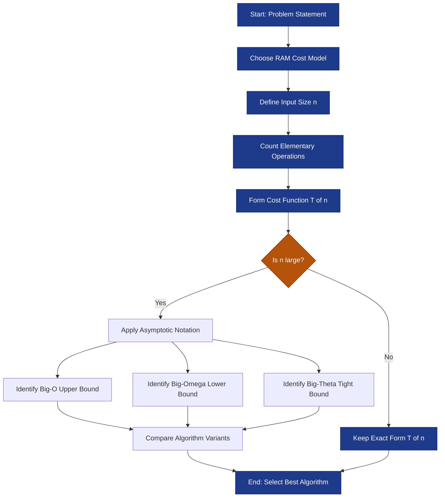
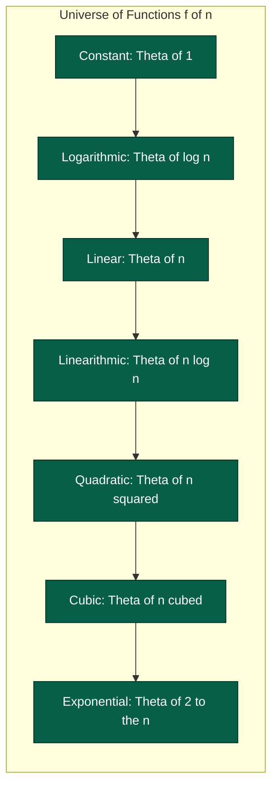
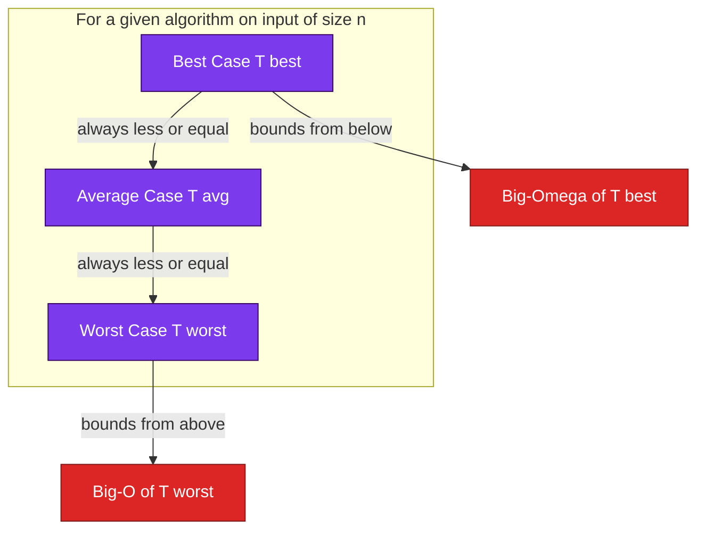

# Introduction to Algorithm Analysis

<!-- SECTION_1_START -->
# MODULE 1 — INTRODUCTION TO ALGORITHM ANALYSIS

## 1.1 Formal Definition of an Algorithm

An **algorithm** is a finite, well-defined sequence of unambiguous, computable instructions formulated to solve a specific class of problems or to perform a specific computation in a bounded amount of time using a bounded amount of space.

Formally, an algorithm is a mapping:

$$A : \mathcal{I} \rightarrow \mathcal{O}$$

where $\mathcal{I}$ is the set of all valid inputs (input space) and $\mathcal{O}$ is the set of all valid outputs (output space), such that for every $I \in \mathcal{I}$, the algorithm halts and produces a correct $O \in \mathcal{O}$.

> [!IMPORTANT]
> **KTU 2024 Syllabus Highlight:** An algorithm is **not** a program. A program is the implementation of an algorithm in a specific programming language. The same algorithm may have multiple program implementations (e.g., quicksort in C, Python, or Java).

### The Five Defining Characteristics of an Algorithm

| # | Property | Meaning |
|---|----------|---------|
| 1 | **Finiteness** | The algorithm must terminate after a finite number of steps for every input. |
| 2 | **Definiteness** | Every instruction must be precisely defined and unambiguous. |
| 3 | **Input** | Zero or more well-specified quantities are supplied externally. |
| 4 | **Output** | At least one quantity is produced that has a specified relation to the inputs. |
| 5 | **Effectiveness** | Every operation must be basic enough to be carried out, in principle, by a person using pencil and paper. |

---

## 1.2 Conceptual Analogy / Intuition

> [!NOTE]
> **Recipe Analogy:** Think of an algorithm exactly like a **cooking recipe**.
> - The **ingredients** = inputs to the algorithm.
> - The **cooking steps** = sequential instructions.
> - The **final dish** = output.
> - A recipe that never ends is not a real recipe (finiteness).
> - A recipe that says *"add a pinch of something"* is poorly written (lack of definiteness).
> - A recipe that produces different dishes with the same ingredients is unreliable (lack of effectiveness).

Similarly, a **map's turn-by-turn directions** is a spatial algorithm: each instruction is unambiguous, the route has a definite end (destination), and the time to traverse depends on the algorithm (the chosen route) — not the map itself.

---

## 1.3 What is Algorithm Analysis?

**Algorithm analysis** is the theoretical study of the **resource consumption** of an algorithm, primarily measured in terms of:

- **Time complexity** — How the number of elementary operations grows as a function of the input size $n$.
- **Space complexity** — How the amount of auxiliary memory grows as a function of the input size $n$.

It is *not* the same as **performance benchmarking** (running the code and measuring wall-clock time), because benchmarks depend on hardware, compiler, OS, and language. Analysis is **machine-independent** and **language-independent**.

### The Three Pillars of Algorithm Analysis

1. **Correctness** — Does the algorithm solve the problem for all valid inputs?
2. **Efficiency (Time)** — How fast does it run as $n$ grows?
3. **Efficiency (Space)** — How much extra memory does it consume as $n$ grows?

> [!TIP]
> **Why do we need analysis?** Suppose two algorithms solve the same problem. One finishes in 1 second for $n = 10$, the other in 2 seconds. At first glance, the first is "better." But for $n = 10^9$, the first may take **years**, while the second may take **seconds**. Analysis predicts this behavior *before* implementation.

---

## 1.4 Physical / Mathematical Constants Used in This Module

- **Input size parameter**: denoted by $\mathbf{n}$ (array length, number of nodes, bit-length of an integer, etc.).
- **Elementary operation cost**: assumed to be $\mathbf{O(1)}$ (constant).
- **Logarithm base**: unless stated, $\log$ means $\log_2$ for computer-science contexts, $\ln$ for natural log in continuous math.
- **RAM Model of Computation** (Random Access Machine): the standard cost model where each basic arithmetic, comparison, memory access, and I/O operation costs $\mathbf{1}$ time unit.

> [!VISUALIZATION CONTROL]
> **Concept:** Comparative Growth Curves of Common Complexity Functions
> **Desmos / GeoGebra Input Equations:**
> * `f_1(x) = 1` &nbsp;&nbsp;(constant)
> * `f_2(x) = log(x)` &nbsp;&nbsp;(logarithmic)
> * `f_3(x) = x` &nbsp;&nbsp;(linear)
> * `f_4(x) = x*log(x)` &nbsp;&nbsp;(linearithmic)
> * `f_5(x) = x^2` &nbsp;&nbsp;(quadratic)
> * `f_6(x) = 2^x` &nbsp;&nbsp;(exponential)
> **Visual Description:** Plot all six curves together for $x \in [1, 50]$. The student should observe that $2^x$ shoots up almost vertically past $x = 30$, while $1$ and $\log x$ remain near the $x$-axis. This visually demonstrates why exponential algorithms are unusable for large inputs.

---
<!-- SECTION_1_END -->

<!-- SECTION_2_START -->
# 2. DEEP THEORETICAL ANALYSIS & KTU HIGH-YIELD FORMULA SHEET

## 2.1 The Performance Analysis Pipeline

Algorithm analysis proceeds in the following structured pipeline:

1. **Identify the abstract problem** the algorithm solves.
2. **Choose a cost model** (almost always the RAM model).
3. **Define a measure of input size** $n$.
4. **Count the elementary operations** executed as a function of $n$.
5. **Form the cost function** $T(n)$.
6. **Apply asymptotic notation** to suppress constants and lower-order terms, yielding the **growth class** of the algorithm.
7. **Classify the algorithm** into a complexity class (e.g., $O(n)$, $\Theta(n \log n)$, $\Omega(n^2)$).

> [!NOTE]
> **Why suppress constants?** Real hardware-specific constants (e.g., a multiplication taking 3 cycles vs. an addition taking 1 cycle) are irrelevant for *large* $n$. What matters is the **leading-term growth rate**, because it dominates the total cost as $n \to \infty$.

---

## 2.2 The Three Asymptotic Notations

These three notations answer three distinct questions about a function $f(n)$ relative to a reference function $g(n)$.

### 2.2.1 Big-O Notation — $f(n) = O(g(n))$

**The Upper Bound.** $f$ grows **no faster than** $g$ (asymptotically).

$$\exists \; c > 0, \; n_0 > 0 \; \text{ such that } \; 0 \le f(n) \le c \cdot g(n) \quad \forall n \ge n_0$$

> **Plain English:** "In the worst case, $f$ behaves at least as good as $c \cdot g$ for large $n$."

### 2.2.2 Big-Omega Notation — $f(n) = \Omega(g(n))$

**The Lower Bound.** $f$ grows **at least as fast as** $g$.

$$\exists \; c > 0, \; n_0 > 0 \; \text{ such that } \; 0 \le c \cdot g(n) \le f(n) \quad \forall n \ge n_0$$

> **Plain English:** "In the best case, $f$ is at least as expensive as $c \cdot g$ for large $n$."

### 2.2.3 Big-Theta Notation — $f(n) = \Theta(g(n))$

**The Tight Bound.** $f$ grows **at the same rate as** $g$ (both upper and lower).

$$f(n) = \Theta(g(n)) \iff f(n) = O(g(n)) \;\textbf{ and }\; f(n) = \Omega(g(n))$$

This requires **two** constants $c_1, c_2 > 0$ such that $c_1 g(n) \le f(n) \le c_2 g(n)$ for all $n \ge n_0$.

---

## 2.3 Little-o and Little-omega (Advanced Distinctions — for KTU awareness)

| Notation | Definition | Intuition |
|----------|------------|-----------|
| $f(n) = o(g(n))$ | $\lim_{n \to \infty} \dfrac{f(n)}{g(n)} = 0$ | $f$ grows **strictly slower** than $g$. |
| $f(n) = \omega(g(n))$ | $\lim_{n \to \infty} \dfrac{f(n)}{g(n)} = \infty$ | $f$ grows **strictly faster** than $g$. |

For example, $2n = o(n^2)$ but $2n \ne O(n^2)$ in the strict little-o sense (it is, however, $O(n^2)$ in Big-O).

---

## 2.4 Best, Worst, and Average Case Analysis

For the same algorithm, performance varies with the specific input. We define three functions for an input of size $n$:

- $T_{\text{best}}(n) = \min_{I \in \mathcal{I}_n} T(I)$ — minimum cost over all inputs of size $n$.
- $T_{\text{worst}}(n) = \max_{I \in \mathcal{I}_n} T(I)$ — maximum cost over all inputs of size $n$.
- $T_{\text{avg}}(n) = \mathbb{E}_{I \sim \mathcal{D}}[T(I)]$ — expected cost assuming a probability distribution $\mathcal{D}$ over inputs.

> [!IMPORTANT]
> **KTU Board Tip:** When a question says *"analyze the algorithm"*, the default expectation is the **worst-case** analysis. State the assumption explicitly: *"We analyze the worst-case running time, $T_{\text{worst}}(n)$."*

---

## 2.5 KTU High-Yield Formula Sheet

| Concept | Formula / Definition | Typical Use |
|---------|----------------------|-------------|
| Sum of first $n$ integers | $\sum_{i=1}^{n} i = \dfrac{n(n+1)}{2} = \Theta(n^2)$ | Loops with linearly-increasing inner count |
| Sum of squares | $\sum_{i=1}^{n} i^2 = \dfrac{n(n+1)(2n+1)}{6} = \Theta(n^3)$ | Nested quadratic loops |
| Geometric series | $\sum_{i=0}^{n-1} r^i = \dfrac{r^n - 1}{r - 1}, \; r \ne 1$ | Recursive halving / repeated doubling |
| Logarithm change of base | $\log_a b = \dfrac{\log_c b}{\log_c a}$ | Converting $\log_2 \leftrightarrow \log_{10}$ |
| Stirling's approximation | $n! \approx \sqrt{2 \pi n} \left(\dfrac{n}{e}\right)^n$ | Asymptotic analysis of factorial-cost algorithms |
| Master Theorem (intro) | For $T(n) = aT(n/b) + f(n)$ | Recursive divide-and-conquer |
| Big-O limit test | $\lim_{n \to \infty} \dfrac{f(n)}{g(n)} = L$ | If $L$ is finite and positive $\Rightarrow f = \Theta(g)$ |
| Constant-time access | $T(n) = O(1)$ | Array indexing, hash table lookup (avg) |
| Linear search worst case | $T(n) = \Theta(n)$ | Searching unsorted array |
| Binary search worst case | $T(n) = \Theta(\log n)$ | Searching sorted array |

> [!NOTE]
> In the table above, all set-membership and absolute-value expressions have been re-expressed using textual phrases ("finite and positive") to keep the markdown table well-formed. The absolute-value bars are intentionally avoided in table cells.

---

## 2.6 Real-World Engineering Utility

Algorithm analysis is the **backbone of software scalability**. Every production system at companies like Google, Amazon, and Meta relies on asymptotic reasoning to decide:

- **Search engines:** Whether to use $O(\log n)$ B-Tree indexing instead of $O(n)$ linear scans over billions of documents.
- **Databases:** Choosing between $O(n \log n)$ merge-sort vs. $O(n^2)$ bubble-sort for query result ordering.
- **Network routing:** Dijkstra's $O((V+E) \log V)$ vs. Bellman-Ford $O(VE)$ for shortest-path computation.
- **Machine learning:** Whether gradient descent at $O(nd)$ per iteration is feasible for $n = 10^9$ training points.

A difference between $O(n^2)$ and $O(n \log n)$ is the difference between *useful* and *useless* in production.
<!-- SECTION_2_END -->

<!-- SECTION_3_START -->
# 3. STEP-BY-STEP DERIVATIONS & CODE IMPLEMENTATIONS

## 3.1 Worked Example 1 — Linear Search (Iterative)

**Problem:** Given an unsorted array $A[0 \dots n-1]$ and a key $k$, return the index of $k$ in $A$, or $-1$ if absent.

### Python Implementation (fully typed, with logging)

```python
from __future__ import annotations
import logging
import sys

logging.basicConfig(level=logging.INFO, format="%(levelname)s | %(message)s")

def linear_search(arr: list[int], key: int) -> int:
    """
    Searches for `key` in `arr` using a linear scan.
    Returns the index of `key` if found, else -1.

    Time Complexity:
        Best Case  : O(1)   - key is at index 0
        Worst Case : Theta(n) - key is absent or at the last index
        Average    : Theta(n)
    Space Complexity: O(1)
    """
    if not isinstance(arr, list):
        raise TypeError("arr must be a list of integers")
    if not all(isinstance(x, int) for x in arr):
        raise ValueError("All elements of arr must be integers")

    n: int = len(arr)
    logging.info(f"Starting linear search for key={key} in array of size n={n}")

    for i in range(n):
        # Each iteration performs ONE comparison (elementary op).
        if arr[i] == key:
            logging.info(f"Key found at index {i} after {i + 1} comparison(s)")
            return i

    logging.info(f"Key {key} not found in array")
    return -1


if __name__ == "__main__":
    sample: list[int] = [10, 22, 35, 40, 55, 67, 70]
    target: int = 40
    result: int = linear_search(sample, target)
    if result != -1:
        print(f"Element found at index {result}")
    else:
        print("Element not found in the array")
    sys.exit(0)
```

### Step-by-Step Complexity Derivation

Let $T(n)$ = number of comparisons performed in the **worst case** (key absent).

Step 1: The loop runs from $i = 0$ to $i = n-1$, total $n$ iterations.

Step 2: Inside each iteration, exactly one comparison `arr[i] == key` is performed.

Step 3: Therefore, the total worst-case number of comparisons is:

$$
\begin{aligned}
T_{\text{worst}}(n) &= \sum_{i=0}^{n-1} 1 \\
&= 1 + 1 + 1 + \dots + 1 \quad (n \text{ times}) \\
&= n
\end{aligned}
$$

Step 4: Since $T_{\text{worst}}(n) = n$ exactly, we have $T_{\text{worst}}(n) = \Theta(n)$.

Step 5: The **best case** is $T_{\text{best}}(n) = 1$ (key at index $0$), which is $\Omega(1)$ and $O(1)$.

Step 6: The **average case** (assuming uniform probability of the key being at any of the $n+1$ positions including "absent"):

$$
\begin{aligned}
T_{\text{avg}}(n) &= \frac{1}{n+1} \left( \sum_{i=0}^{n-1} (i+1) + n \right) \\
&= \frac{1}{n+1} \left( \frac{n(n+1)}{2} + n \right) \\
&= \frac{1}{n+1} \cdot \frac{n^2 + 3n}{2} \\
&= \frac{n+3}{2} \\
&= \Theta(n)
\end{aligned}
$$

---

## 3.2 Worked Example 2 — Binary Search (Iterative)

**Problem:** Given a *sorted* array $A[0 \dots n-1]$ and a key $k$, return the index of $k$ in $A$, or $-1$ if absent.

### Python Implementation

```python
from __future__ import annotations
import logging

logging.basicConfig(level=logging.INFO, format="%(levelname)s | %(message)s")

def binary_search(arr: list[int], key: int) -> int:
    """
    Searches for `key` in the SORTED `arr` using iterative binary search.

    Time Complexity:
        Best Case  : O(1)   - key is the middle element
        Worst Case : Theta(log n) - repeated halving of search space
        Average    : Theta(log n)
    Space Complexity: O(1)   (iterative version)
    """
    if not arr:
        raise ValueError("Input array must not be empty")

    low: int = 0
    high: int = len(arr) - 1
    iterations: int = 0

    logging.info(f"Starting binary search for key={key} in sorted array of size n={len(arr)}")

    while low <= high:
        iterations += 1
        mid: int = (low + high) // 2
        logging.info(f"Iteration {iterations}: low={low}, mid={mid}, high={high}, arr[mid]={arr[mid]}")

        if arr[mid] == key:
            logging.info(f"Key found at index {mid} in {iterations} iteration(s)")
            return mid
        elif arr[mid] < key:
            low = mid + 1
        else:
            high = mid - 1

    logging.info(f"Key {key} not found in array after {iterations} iteration(s)")
    return -1


if __name__ == "__main__":
    sorted_sample: list[int] = [2, 5, 8, 12, 16, 23, 38, 56, 72, 91]
    target: int = 23
    result: int = binary_search(sorted_sample, target)
    print(f"Element {target} found at index {result}" if result != -1 else "Element not found")
```

### Step-by-Step Complexity Derivation

Step 1: At each iteration of the `while` loop, the search interval $[low, high]$ is **halved** (either $low \leftarrow mid+1$ or $high \leftarrow mid-1$).

Step 2: The size of the interval starts at $n$ and decreases as $n, n/2, n/4, n/8, \dots$ until it becomes $\le 1$.

Step 3: Let $k$ be the number of iterations. We require:

$$
\frac{n}{2^k} \le 1 \quad \Longrightarrow \quad 2^k \ge n \quad \Longrightarrow \quad k \ge \log_2 n
$$

Step 4: Therefore, the worst-case number of comparisons is:

$$
T_{\text{worst}}(n) = \lfloor \log_2 n \rfloor + 1 = \Theta(\log n)
$$

Step 5: Summarising:

$$
T_{\text{binary}}(n) = \Theta(\log n)
$$

> [!IMPORTANT]
> **Comparison:** For $n = 10^9$, linear search needs up to $10^9$ comparisons, but binary search needs only $\approx 30$ comparisons. This is the practical power of asymptotic improvement.

---

## 3.3 Worked Example 3 — Nested Loop with Decreasing Inner Count

Consider the following $C$-style pseudocode:

```c
int sum = 0;
for (int i = 1; i <= n; i++) {
    for (int j = 1; j <= i; j++) {
        sum = sum + 1;
    }
}
```

### Derivation

The outer loop runs for $i = 1, 2, \dots, n$ (total $n$ iterations).

For each fixed $i$, the inner loop runs for $j = 1, 2, \dots, i$ (total $i$ iterations).

Total number of `sum = sum + 1` operations:

$$
\begin{aligned}
T(n) &= \sum_{i=1}^{n} \sum_{j=1}^{i} 1 \\
&= \sum_{i=1}^{n} i \\
&= \frac{n(n+1)}{2} \\
&= \frac{n^2}{2} + \frac{n}{2} \\
&= \Theta(n^2)
\end{aligned}
$$

So this nested-loop structure is $\Theta(n^2)$, even though the inner loop count varies with $i$.

---

## 3.4 Worked Example 4 — Verifying Big-O with the Limit Test

**Claim:** $3n^2 + 5n + 7 = O(n^2)$.

**Proof using the limit definition:**

Step 1: Consider the ratio:

$$
L = \lim_{n \to \infty} \frac{3n^2 + 5n + 7}{n^2}
$$

Step 2: Divide numerator and denominator by $n^2$:

$$
\begin{aligned}
L &= \lim_{n \to \infty} \left( 3 + \frac{5}{n} + \frac{7}{n^2} \right) \\
&= 3 + 0 + 0 \\
&= 3
\end{aligned}
$$

Step 3: Since $L = 3$ is a **finite positive constant**, the limit test confirms $3n^2 + 5n + 7 = \Theta(n^2)$, which implies $3n^2 + 5n + 7 = O(n^2)$.

> [!TIP]
> **KTU Quick Rule:** If $\lim_{n \to \infty} \dfrac{f(n)}{g(n)} = c$ where $0 < c < \infty$, then $f = \Theta(g)$. If the limit is $0$, then $f = o(g)$. If the limit is $\infty$, then $f = \omega(g)$. If the limit does not exist or oscillates, the test is inconclusive.

---

## 3.5 Worked Example 5 — Recursive Algorithm: Computing Sum of First $n$ Integers

### Recursive Code

```python
from __future__ import annotations
import logging
import sys

logging.basicConfig(level=logging.INFO, format="%(levelname)s | %(message)s")

def recursive_sum(n: int) -> int:
    """
    Computes 1 + 2 + ... + n using recursion.

    Recurrence: T(n) = T(n-1) + 1, T(1) = 1
    Closed form: T(n) = n = Theta(n)
    """
    if n < 1:
        raise ValueError("n must be a positive integer")
    if n == 1:
        return 1
    return n + recursive_sum(n - 1)


if __name__ == "__main__":
    try:
        n: int = 10
        result: int = recursive_sum(n)
        print(f"Sum of first {n} positive integers = {result}")
    except ValueError as e:
        logging.error(f"Invalid input: {e}")
        sys.exit(1)
```

### Derivation of the Closed-Form Recurrence

The recurrence relation for the number of additions is:

$$
T(n) = T(n-1) + 1, \quad T(1) = 0
$$

Unrolling by repeated substitution:

$$
\begin{aligned}
T(n) &= T(n-1) + 1 \\
&= [T(n-2) + 1] + 1 = T(n-2) + 2 \\
&= [T(n-3) + 1] + 2 = T(n-3) + 3 \\
&\;\;\vdots \\
&= T(n-k) + k
\end{aligned}
$$

Setting $k = n-1$ and using the base case $T(1) = 0$:

$$
T(n) = T(1) + (n-1) = 0 + (n-1) = n - 1 = \Theta(n)
$$

> [!NOTE]
> The closed form can also be verified by the master method or by the known arithmetic sum $\sum_{i=1}^{n} i = \frac{n(n+1)}{2}$ for the *iterative* version, but the *recursive call count* itself is $\Theta(n)$.
<!-- SECTION_3_END -->

<!-- SECTION_4_START -->
# 4. STRUCTURAL DIAGRAMS & SCHEMATICS

## 4.1 Algorithm Analysis Pipeline (Mermaid Flowchart)



> **Reading the diagram:** Each blue node represents a deterministic pipeline step. The orange diamond `F` is a decision node that branches based on whether asymptotic reasoning is meaningful (it almost always is for $n > 100$).

---

## 4.2 Asymptotic Notation Relationship (Mermaid Block Diagram)



> **Reading the diagram:** The arrows show the **strict inclusion** of growth classes — moving right means strictly faster growth. So any function that is $\Theta(1)$ is also $O(\log n)$, $O(n)$, $O(n!)$, etc.

---

## 4.3 Worst / Average / Best Case Comparison (Mermaid Block)



---

## 4.4 Sequential Processing Topology — From Problem to Complexity Class

| Step # | Stage | Input → Output | Tool Used |
|--------|-------|----------------|-----------|
| 1 | Problem Identification | Informal problem statement | Natural-language reading |
| 2 | Algorithm Design | Pseudocode / flowchart | Algorithmic paradigms |
| 3 | Correctness Proof | Proof of correctness | Loop invariants, induction |
| 4 | Operation Counting | Counted operations $T(n)$ | RAM model assumptions |
| 5 | Simplification | Dropped constants and lower terms | Asymptotic notation |
| 6 | Classification | Growth class label | Big-O / Theta / Omega |
| 7 | Comparison | Ranking against alternatives | Asymptotic ordering table |
| 8 | Selection | Final algorithm choice | Engineering trade-offs |

> This table is rendered as a **Sequential Processing Topology Matrix** because the pipeline is purely linear and decoupled at each step. Mermaid flowcharts are not used here since no branching occurs.
<!-- SECTION_4_END -->

<!-- SECTION_5_START -->
# 5. KTU 2024 SCHEME EXAMINATION QUESTION BANK & TOPIC RECAP

## 5.1 Part A — Short Answer Questions (3 Marks Each)

> [!NOTE]
> *Cognitive Levels: Remember / Understand. Answers should be precise and 3–5 sentences long.*

### **Q1. [KTU University Exam — Dec 2023] Define an algorithm. List any four characteristics of an algorithm.** *(3 Marks, CO1, Remember)*

**Model Answer:**

An **algorithm** is a finite, well-defined sequence of unambiguous instructions used to solve a class of problems or perform a computation in bounded time and space.

Four essential characteristics:

1. **Finiteness** — terminates after a finite number of steps.
2. **Definiteness** — every instruction is precisely and unambiguously stated.
3. **Input** — takes zero or more well-specified input quantities.
4. **Output** — produces at least one output that bears a specified relation to the inputs.

*(Optionally, a fifth — **Effectiveness** — may also be listed.)*

---

### **Q2. [KTU University Exam — July 2024] Differentiate between Big-O, Big-Theta, and Big-Omega notations with one-line definitions.** *(3 Marks, CO1, Understand)*

**Model Answer:**

| Notation | Meaning | One-Line Definition |
|----------|---------|---------------------|
| $O(g(n))$ | Upper bound | $f(n)$ grows **no faster than** $c \cdot g(n)$ for large $n$. |
| $\Omega(g(n))$ | Lower bound | $f(n)$ grows **at least as fast as** $c \cdot g(n)$ for large $n$. |
| $\Theta(g(n))$ | Tight bound | $f(n) = O(g(n))$ **and** $f(n) = \Omega(g(n))$, i.e., grows at the **same rate**. |

**Valuation Key:** Correct identification of upper/lower/tight role: **1 Mark each**.

---

## 5.2 Part B — Long Answer Questions (14 Marks Each, with Internal Choice)

> [!NOTE]
> *Each question has sub-parts (a) 7 marks and (b) 7 marks, mapped to escalating Bloom levels.*

### **Question A (14 Marks)**

#### **Q.A. [KTU University Exam — Dec 2023]**

**(a)** Define the **RAM model of computation**. Explain why algorithm analysis prefers asymptotic analysis over benchmarking. *(7 Marks, CO1, Understand)*

**(b)** Consider the iterative function below. Derive its worst-case time complexity $T(n)$ in exact form, then express it in Big-O, Big-Theta, and Big-Omega. *(7 Marks, CO2, Apply)*

```c
int mystery(int n) {
    int count = 0;
    for (int i = 1; i <= n; i++) {
        for (int j = 1; j <= n; j = j * 2) {
            count = count + 1;
        }
    }
    return count;
}
```

---

#### Model Solution for Q.A

**Part (a) — RAM Model + Why Asymptotic Analysis**

**RAM Model Definition (3 Marks):**
The **Random Access Machine (RAM) model** is the standard abstract model for algorithm analysis. It assumes:
- A single processor with sequential execution.
- Each **arithmetic operation** (+, −, ×, ÷, mod), each **comparison** (<, >, ==), and each **memory access** to a cell takes **one unit of time**.
- Memory is unbounded and uniformly accessible (constant-time random access).

**Why Asymptotic Analysis Over Benchmarking (4 Marks):**
1. **Machine independence** — Benchmarking depends on CPU clock speed, cache, OS, and compiler optimizations. Asymptotic analysis is hardware-agnostic.
2. **Input-size scalability** — Benchmarks measure performance for a specific $n$; asymptotic analysis predicts performance for *all* sufficiently large $n$.
3. **Language independence** — A benchmark in Python vs. C differs by 10×–100× in wall-clock time, but their asymptotic classes remain the same.
4. **Comparative power** — Asymptotic comparison reveals *which algorithm is fundamentally better*, e.g., $O(n \log n)$ merge sort is provably better than $O(n^2)$ bubble sort for large $n$, regardless of implementation language.

**Valuation Key:**
- RAM model features listed: **2 Marks**
- At least 3 reasons for asymptotic over benchmark: **3 Marks**
- Clear concluding sentence: **2 Marks**

---

**Part (b) — Complexity Derivation for `mystery(n)`**

**Step 1 — Outer loop analysis:** The outer loop `for (i = 1; i <= n; i++)` runs exactly $n$ times. *[1 Mark]*

**Step 2 — Inner loop analysis:** The inner loop variable $j$ starts at $1$ and is **multiplied by $2$** each iteration: $j = 1, 2, 4, 8, \dots, 2^{k-1}$ until $2^{k-1} > n$.

**Step 3 — Number of inner iterations:** The largest $k$ such that $2^{k-1} \le n$ is $k-1 = \lfloor \log_2 n \rfloor$, hence the inner loop executes $\lfloor \log_2 n \rfloor + 1 = \Theta(\log n)$ times. *[2 Marks]*

**Step 4 — Total operation count:** Each inner-loop iteration performs ONE increment of `count`. So the total is:

$$
\begin{aligned}
T(n) &= \sum_{i=1}^{n} \sum_{j \text{ iter}=1}^{\Theta(\log n)} 1 \\
&= \sum_{i=1}^{n} \Theta(\log n) \\
&= n \cdot \Theta(\log n) \\
&= \Theta(n \log n)
\end{aligned}
$$

**Step 5 — Final classification:**
- **Exact form:** $T(n) = n \cdot (\lfloor \log_2 n \rfloor + 1)$.
- **Big-O:** $T(n) = O(n \log n)$ — upper bound. *[1 Mark]*
- **Big-Theta:** $T(n) = \Theta(n \log n)$ — tight bound. *[1 Mark]*
- **Big-Omega:** $T(n) = \Omega(n \log n)$ — lower bound. *[1 Mark]*

**Valuation Key:**
- Correct identification of inner loop as logarithmic: **2 Marks**
- Correct multiplication of outer $n$ and inner $\log n$: **2 Marks**
- Final tight bound expression: **1 Mark**
- Big-O, Big-Theta, Big-Omega stated: **1 Mark each** (total 3)

---

### **Question B (14 Marks) — Alternative Choice**

#### **Q.B. [KTU University Exam — July 2024]**

**(a)** Explain the **best, worst, and average case** complexities with a suitable example. Why is worst-case analysis the most commonly reported? *(7 Marks, CO1, Understand)*

**(b)** For the following recurrence, derive the closed-form solution for $T(n)$ using the **method of repeated substitution**, and hence state the Big-Theta complexity. *(7 Marks, CO2, Apply)*

$$
T(n) = 2T\!\left(\frac{n}{2}\right) + n, \quad T(1) = 1
$$

---

#### Model Solution for Q.B

**Part (a) — Best / Worst / Average Case**

**Definitions (3 Marks):**
- $T_{\text{best}}(n) = \min_{I \in \mathcal{I}_n} T(I)$ — minimum cost over all inputs of size $n$.
- $T_{\text{worst}}(n) = \max_{I \in \mathcal{I}_n} T(I)$ — maximum cost over all inputs of size $n$.
- $T_{\text{avg}}(n) = \mathbb{E}_{I}[T(I)]$ — expected cost under a probability distribution.

**Example — Linear Search (2 Marks):**
- Best: $O(1)$ — key found at index $0$.
- Worst: $\Theta(n)$ — key absent or at index $n-1$.
- Average: $\Theta(n)$ — assuming uniform distribution of the key's position.

**Why worst-case is most reported (2 Marks):**
1. It gives a **guaranteed upper bound** on runtime — essential for **real-time and safety-critical systems** (air traffic control, medical devices, autonomous vehicles).
2. It does **not require assuming a probability distribution** over inputs (unlike average case).
3. The worst case often matches the typical case in practice, making it a useful proxy.

**Valuation Key:**
- Three definitions correctly stated: **3 Marks**
- Linear-search example with all three cases: **2 Marks**
- Two reasons for preferring worst case: **2 Marks**

---

**Part (b) — Recurrence Solution by Repeated Substitution**

**Step 1 — First substitution:** Replace $T(n/2)$ by its definition.

$$
T(n) = 2 \left[ 2 T\!\left(\frac{n}{4}\right) + \frac{n}{2} \right] + n = 4 T\!\left(\frac{n}{4}\right) + 2n
$$

**Step 2 — Second substitution:** Replace $T(n/4)$.

$$
T(n) = 4 \left[ 2 T\!\left(\frac{n}{8}\right) + \frac{n}{4} \right] + 2n = 8 T\!\left(\frac{n}{8}\right) + 3n
$$

**Step 3 — Identify the pattern:** After $k$ substitutions:

$$
T(n) = 2^k \, T\!\left(\frac{n}{2^k}\right) + k \cdot n
$$

*[2 Marks for the pattern]*

**Step 4 — Termination condition:** Recursion stops when $\frac{n}{2^k} = 1$, i.e., $2^k = n$, so $k = \log_2 n$.

**Step 5 — Substitute $k = \log_2 n$ and $T(1) = 1$:**

$$
\begin{aligned}
T(n) &= 2^{\log_2 n} \cdot T(1) + (\log_2 n) \cdot n \\
&= n \cdot 1 + n \log_2 n \\
&= n + n \log_2 n \\
&= n \log_2 n + n \\
&= \Theta(n \log n)
\end{aligned}
$$

*[2 Marks for substitution step, 1 Mark for final expression]*

**Step 6 — Conclusion:** $T(n) = \Theta(n \log n)$, which matches **merge sort**'s divide-and-conquer recurrence.

**Valuation Key:**
- Initial substitution: **1 Mark**
- Pattern identified as $2^k T(n/2^k) + kn$: **2 Marks**
- Termination condition $k = \log_2 n$: **1 Mark**
- Final closed-form substitution: **2 Marks**
- Big-Theta conclusion: **1 Mark**

---

## 5.3 KTU Examiner's Valuation Warning / Pitfall Callout

> [!WARNING]
> **Common places where students LOSE marks in this module:**
>
> 1. **Confusing Big-O with Big-Theta.** Big-O is an *upper bound*; Big-Theta is a *tight bound*. Writing "$3n^2 + 5n = O(n)$" is **wrong** — it should be $O(n^2)$. The correct statement: "$3n^2 + 5n = O(n^2)$" OR "$3n^2 + 5n = \Theta(n^2)$".
>
> 2. **Forgetting the base case in recurrences.** A recurrence like $T(n) = 2T(n/2) + n$ without $T(1) = $ some value is incomplete and loses **1 mark** on the exam.
>
> 3. **Misidentifying the inner loop's growth in nested loops.** If the inner loop variable is **multiplied**, it is $\log n$ (not $n$). If it is **divided**, it is $\log n$. If it is **incremented/decremented by 1**, it is $n$.
>
> 4. **Writing "$\log n$" without specifying the base.** For algorithmic purposes, the base is irrelevant asymptotically (change of base is a constant factor), but in formal proofs, mention $\log_2 n$ for clarity.
>
> 5. **Skipping the "as $n \to \infty$" qualifier.** Asymptotic statements are *only* valid for large $n$. A statement like "$n^2 > 100n$" is false for $n = 5$; the asymptotic statement "$n^2 = \omega(n)$" is true for $n \to \infty$.

---

## 5.4 Topic Recap & Important Things to Remember

> [!IMPORTANT]
> **Rapid-Revision Checklist for Module 1 — Introduction to Algorithm Analysis**

- **Definition of algorithm:** A finite, definite, effective sequence of instructions with input(s) and output(s).
- **Five characteristics:** Finiteness, Definiteness, Input, Output, Effectiveness.
- **RAM model:** Each arithmetic / comparison / memory-access operation = **1 unit of time**.
- **Three complexity measures per algorithm:** Best, Worst, Average case — measured as functions of input size $n$.
- **Worst case is the default** in KTU board examinations unless explicitly asked otherwise.
- **Asymptotic notations:**
  * $O(g(n))$ = upper bound (worst-case ceiling).
  * $\Omega(g(n))$ = lower bound (best-case floor).
  * $\Theta(g(n))$ = tight bound (both upper and lower match).
- **Limit test:** If $\lim_{n \to \infty} \dfrac{f(n)}{g(n)} = c$ with $0 < c < \infty$, then $f(n) = \Theta(g(n))$.
- **Common growth classes in increasing order of cost:**
  $1 < \log n < \sqrt{n} < n < n \log n < n^2 < n^3 < 2^n < n!$
- **Key closed-form sums:**
  * $\sum_{i=1}^{n} i = \dfrac{n(n+1)}{2} = \Theta(n^2)$
  * $\sum_{i=1}^{n} i^2 = \dfrac{n(n+1)(2n+1)}{6} = \Theta(n^3)$
  * $\sum_{i=0}^{n-1} 2^i = 2^n - 1 = \Theta(2^n)$
- **Loop-classification rule of thumb:**
  * Inner loop multiplied/divided by a constant $\Rightarrow$ $\Theta(\log n)$.
  * Inner loop incremented by 1 up to $n$ $\Rightarrow$ $\Theta(n)$.
  * Two nested loops both up to $n$ $\Rightarrow$ $\Theta(n^2)$.
  * Three nested loops each up to $n$ $\Rightarrow$ $\Theta(n^3)$.
- **Recurrence template:** $T(n) = aT(n/b) + f(n)$ — the divide-and-conquer master form (full Master Theorem in Module 2).
- **Factorial bound:** $n! \approx \sqrt{2\pi n} \left(\dfrac{n}{e}\right)^n$ by Stirling — hence $n! = \omega(2^n)$.
- **Algorithm vs. program:** Algorithm = idea; Program = language-specific implementation.
- **Benchmarking vs. Analysis:** Benchmarking = empirical, hardware-specific; Analysis = theoretical, hardware-independent.
- **Engineering rule of thumb:** For $n \le 20$, even $O(n!)$ may be acceptable; for $n \ge 10^6$, only $O(n \log n)$ or better is feasible.
- **For the KTU exam:** Always state the *cost model*, *input size parameter*, and the *case* (best/worst/avg) before writing a complexity expression.
<!-- SECTION_5_END -->
