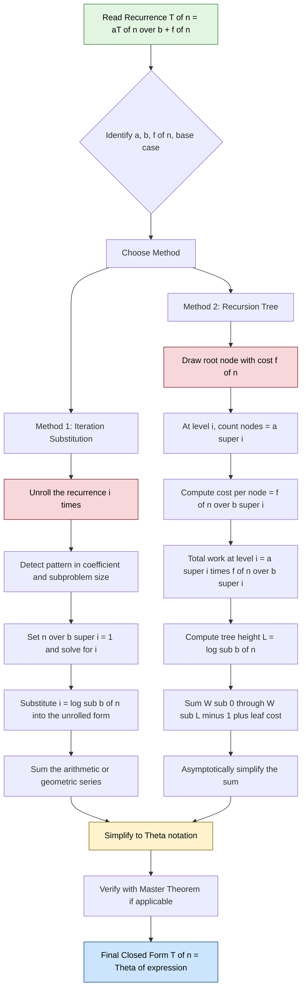
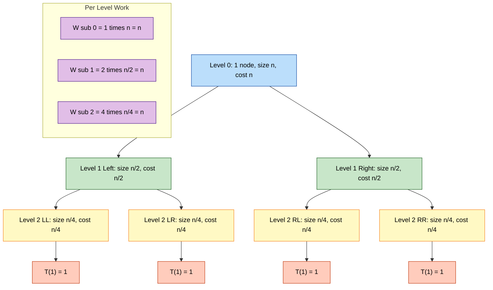
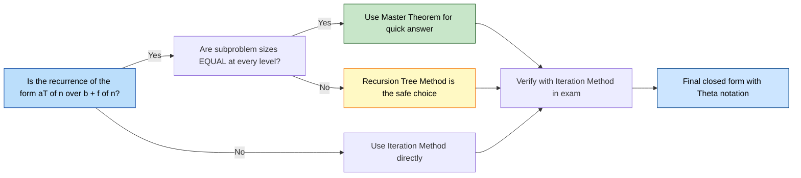

# Recurrence Equations: Solution of Recurrence Equations – Iteration Method and Recursion Tree Methods

<!-- SECTION_1_START -->

# Recurrence Equations — Definition & Intuitive Overview

> [!NOTE]
> **KTU 2024 — Module 1 Highlight (OECST831)**
> A **Recurrence Relation** is an equation (or inequality) that describes a function $T(n)$ in terms of its own value on **smaller inputs**. It is the natural mathematical language of divide-and-conquer and recursive algorithms because it tracks the cost of a recursive call plus the cost of work done at the current level.

## 1.1 Formal Definition

A recurrence has three structural ingredients:

$$
T(n) = \begin{cases}
\Theta(1) & \text{if } n \le n_0 \quad \text{(base case / stopping condition)} \\
a \cdot T\!\left(\dfrac{n}{b}\right) + f(n) & \text{if } n > n_0 \quad \text{(recursive case)}
\end{cases}
$$

Where:
- $a \ge 1$ is the **branching factor** (number of subproblems generated).
- $b \ge 2$ is the **shrink factor** (size reduction per recursive call).
- $f(n)$ is the **driving function** (cost of dividing + combining, excluding recursive calls).
- $T(1)$ or $T(0)$ is the **seed value** for the base case.

> [!IMPORTANT]
> **Syllabus Focus (KTU OECST831):** In Module 1, we only need to *solve* recurrences — i.e., express $T(n)$ as a closed-form asymptotic bound. We are **not** required to prove the Master Theorem; we only use it as a verification tool after applying **Iteration** or **Recursion Tree** methods.

## 1.2 Intuition — "The Russian Doll + a Receipt"

Imagine opening a **Matryoshka doll** (Russian nesting doll). Each time you open one, you find a smaller doll inside, until you reach the smallest solid doll. Now attach a **receipt** to every doll you open — the receipt says *"this much work was done to split and rejoin me"*.

- The **dolls** = recursive subproblems ($a \cdot T(n/b)$).
- The **receipts** = work done at this level ($f(n)$).
- The **smallest solid doll** = the base case ($T(1) = \Theta(1)$).
- The **total cost** = sum of every receipt + the work done on the tiniest doll.

This is *exactly* what a recursion tree draws, and *exactly* what the iteration method accumulates algebraically.

## 1.3 Geometric Intuition — Why Trees Grow

If a level-$i$ node in the tree has subproblem size $n / b^{i}$, the number of nodes at that level is $a^{i}$. So the **work per level** is:

$$
W_i = a^{i} \cdot f\!\left(\frac{n}{b^{i}}\right)
$$

This geometric sequence of $W_i$ values is what we sum to get $T(n)$.

> [!VISUALIZATION CONTROL]
> **Concept:** Geometric growth of a recursion tree for $T(n) = 2T(n/2) + n$
> **GeoGebra / Desmos Input Equations:**
> * `f(x) = 2^x` (number of nodes at level $x$)
> * `g(x) = n / 2^x` (size of subproblem at level $x$)
> * `h(x) = 2^x * (n / 2^x) = n` (work per level — constant!)
> **Visual Description:** The number of nodes doubles each level, but the work per node halves. Their product stays **flat at $y = n$** for all levels, and the tree has $\log_2 n$ levels, giving total work $n \log n$.

## 1.4 Where Recurrences Appear in Real Systems

| Algorithm / System | Recurrence | Real-World Application |
|---|---|---|
| Binary Search | $T(n) = T(n/2) + 1$ | Database index lookups, DNS resolution |
| Merge Sort | $T(n) = 2T(n/2) + n$ | External sort in Hadoop, Git pack-objects |
| Karatsuba Multiplication | $T(n) = 3T(n/2) + n$ | Cryptographic libraries (RSA, OpenSSL) |
| QuickSort (average) | $T(n) = 2T(n/2) + n$ | In-memory sorting in PostgreSQL |
| Tower of Hanoi | $T(n) = 2T(n-1) + 1$ | Backup rotation, recursive puzzle solvers |
| Strassen's Matrix Mult. | $T(n) = 7T(n/2) + n^2$ | Computer graphics, deep-learning GEMMs |

<!-- SECTION_1_END -->

<!-- SECTION_2_START -->

# Deep Theoretical Analysis & KTU High-Yield Formula Sheet

## 2.1 The Two Methods at a Glance

> [!IMPORTANT]
> The **Iteration Method** (also called the *Substitution Method* in some texts) and the **Recursion Tree Method** are equivalent — the recursion tree is just a *visual* version of the iteration method's bookkeeping.

### 2.1.1 Iteration Method — Operational Logic

1. **Expand** the recurrence by repeatedly substituting the definition of $T$ into itself.
2. **Watch for a pattern** in the $i$-th expansion.
3. **Stop** when the argument of $T$ becomes the base case (e.g., $T(1)$ or $T(n_0)$).
4. **Sum** all the accumulated non-recursive terms.
5. **Solve** the resulting arithmetic/geometric series and simplify.

> [!NOTE]
> **Convergence Test for the Geometric Series:** When you get a sum of the form $\sum_{i=0}^{L} c \cdot r^{i}$, the closed form depends on the ratio $r$:
> * If $r < 1$ → sum converges to $\dfrac{c}{1-r} = \Theta(1)$.
> * If $r = 1$ → sum is $(L+1) \cdot c = \Theta(L)$.
> * If $r > 1$ → sum is dominated by its last term $\Theta(r^{L})$.

### 2.1.2 Recursion Tree Method — Operational Logic

1. **Draw the tree**: root is $f(n)$, children are $a$ subtrees each rooted at $f(n/b)$.
2. **Label each node** with its driving cost.
3. **Compute per-level work** $W_i$ = (number of nodes at level $i$) × (cost of each node).
4. **Compute the height** $L$ of the tree (number of levels).
5. **Sum** $W_0 + W_1 + \dots + W_L$ to get $T(n)$.
6. **Asymptotically simplify** the sum.

## 2.2 The KTU Formula Sheet (Cheat Sheet)

> [!IMPORTANT]
> **Critical Syntax Rule:** Below, all absolute values and conditional bars use $\mid$ instead of $\mid$ to prevent markdown table corruption. The LaTeX delimiters are mandatory inside the table.

| Recurrence | Name / Algorithm | Closed Form (Asymptotic) | Use Case |
|---|---|---|---|
| $T(n) = T(n/2) + \Theta(1)$ | Binary Search | $\Theta(\log n)$ | Divide \& conquer w/ constant split cost |
| $T(n) = T(n-1) + \Theta(1)$ | Linear Scan | $\Theta(n)$ | One recursive call, constant work |
| $T(n) = T(n-1) + \Theta(n)$ | Naive Sum / Selection | $\Theta(n^2)$ | One recursive call, linear work |
| $T(n) = 2T(n/2) + \Theta(1)$ | Tree Traversal | $\Theta(n)$ | Two calls, constant combine |
| $T(n) = 2T(n/2) + \Theta(n)$ | Merge Sort | $\Theta(n \log n)$ | Two calls, linear combine |
| $T(n) = 2T(n/2) + \Theta(n^2)$ | Naive Closest Pair | $\Theta(n^2)$ | Two calls, quadratic combine |
| $T(n) = 3T(n/2) + \Theta(n)$ | Karatsuba | $\Theta(n^{\log_2 3})$ | Three calls, linear combine |
| $T(n) = 4T(n/2) + \Theta(n)$ | Naive Matrix Mult. | $\Theta(n^2)$ | Four calls, linear combine |
| $T(n) = 7T(n/2) + \Theta(n^2)$ | Strassen | $\Theta(n^{\log_2 7})$ | Seven calls, quadratic combine |
| $T(n) = 2T(n-1) + \Theta(1)$ | Tower of Hanoi | $\Theta(2^n)$ | Two exponential-shrink calls |
| $T(n) = aT(n/b) + \Theta(n^{c})$ | Generic Master Form | See Master Theorem table below | All $a,b,c$ parameters |

### 2.2.1 Master Theorem — Quick Reference (for verification only)

For $T(n) = aT(n/b) + \Theta(n^{c})$ with $a \ge 1, b > 1$:

| Condition | Compare $\log_b a$ vs $c$ | Result $T(n) =$ |
|---|---|---|
| Case 1 | $\log_b a > c$ | $\Theta\!\left(n^{\log_b a}\right)$ — recursion dominates |
| Case 2 | $\log_b a = c$ | $\Theta\!\left(n^{c} \log n\right)$ — balanced |
| Case 3 | $\log_b a < c$ | $\Theta\!\left(n^{c}\right)$ — driving cost dominates |

## 2.3 Real-World Engineering Utility

| Domain | Why Recurrence Solving Matters |
|---|---|
| **Compiler Optimization** | Loop unrolling, tail-call elimination, and inlining decisions rely on solving the recurrence of statement-execution counts. |
| **Distributed Systems** | MapReduce job decomposition is analyzed as a tree-recurrence to estimate shuffle/compute bottlenecks. |
| **Database Query Planning** | Cost-based optimizers (e.g., PostgreSQL) solve join-order recurrences to choose execution plans. |
| **Computer Graphics** | Recursive mesh subdivision, BVH (Bounding Volume Hierarchy) traversal, and ray-tracing all have well-known recurrences. |
| **Cryptographic Protocol Design** | Side-channel resistance analyses use recurrence-based cost models for recursive modular exponentiation. |

<!-- SECTION_2_END -->

<!-- SECTION_3_START -->

# Step-by-Step Derivations & Symbolic Implementation

> [!IMPORTANT]
> **Exhaustive Content Mandate:** Every algebraic step is shown in full. No "similarly" or "and so on". Each transition is annotated with the underlying logic.

## 3.1 Worked Example 1 — Merge Sort via Iteration Method

**Recurrence:** $T(n) = 2T(n/2) + n$, with $T(1) = 1$.

### Step 1 — First Expansion

$$
\begin{aligned}
T(n) &= 2T\!\left(\frac{n}{2}\right) + n
\end{aligned}
$$

### Step 2 — Second Expansion (substitute $T(n/2) = 2T(n/4) + n/2$)

$$
\begin{aligned}
T(n) &= 2 \cdot \left[ 2T\!\left(\frac{n}{4}\right) + \frac{n}{2} \right] + n \\
     &= 4T\!\left(\frac{n}{4}\right) + n + n
\end{aligned}
$$

*Logic:* The inner $2T(n/4)$ multiplied by the outer $2$ gives $4T(n/4)$. The inner $n/2$ multiplied by the outer $2$ gives $n$, which is added to the original $+n$.

### Step 3 — Third Expansion

$$
\begin{aligned}
T(n) &= 4 \cdot \left[ 2T\!\left(\frac{n}{8}\right) + \frac{n}{4} \right] + 2n \\
     &= 8T\!\left(\frac{n}{8}\right) + n + 2n
\end{aligned}
$$

### Step 4 — Pattern Recognition at Level $i$

After $i$ expansions:

$$
T(n) = 2^{i} \cdot T\!\left(\frac{n}{2^{i}}\right) + i \cdot n
$$

*Logic:* Each level multiplies the coefficient by $2$, and each level contributes a $+n$ term, so after $i$ levels the non-recursive sum is $i \cdot n$.

### Step 5 — Determine the Number of Levels

The recursion stops when the subproblem size reaches the base case, i.e., $n / 2^{i} = 1$.

$$
\begin{aligned}
\frac{n}{2^{i}} &= 1 \\
2^{i} &= n \\
i &= \log_2 n
\end{aligned}
$$

### Step 6 — Substitute and Solve

$$
\begin{aligned}
T(n) &= 2^{\log_2 n} \cdot T(1) + (\log_2 n) \cdot n \\
     &= n \cdot 1 + n \log_2 n \\
     &= n + n \log_2 n
\end{aligned}
$$

### Step 7 — Asymptotic Simplification

Since $n \log n$ dominates $n$ for $n \ge 2$:

$$
\boxed{T(n) = \Theta(n \log n)}
$$

---

## 3.2 Worked Example 2 — $T(n) = 3T(n/4) + n^2$ via Recursion Tree

**Recurrence:** $T(n) = 3T(n/4) + n^2$, with $T(1) = 1$.

### Step 1 — Draw the Tree (Textual Representation)

```
Level 0:              [   n^2   ]                → 1 node  × n^2           = n^2
                     /     |     \
Level 1:        [n²/16] [n²/16] [n²/16]           → 3 nodes × (n/4)²        = 3·n²/16
                 /|\\    /|\\    /|\\
Level 2:    [9 nodes each costing (n/16)²]        → 9 nodes × (n/16)²       = 9·n²/256
            ...
Level L (leaves): 3^L nodes each costing T(1)=1   → 3^L × 1                = 3^L
```

### Step 2 — General Term at Level $i$

- Number of nodes: $3^{i}$
- Size of subproblem per node: $n / 4^{i}$
- Cost per node: $(n / 4^{i})^{2} = n^{2} / 16^{i}$
- Total work at level $i$:

$$
W_i = 3^{i} \cdot \frac{n^{2}}{16^{i}} = n^{2} \cdot \left(\frac{3}{16}\right)^{i}
$$

### Step 3 — Height of the Tree

The recursion stops at the leaf level where $n / 4^{L} = 1 \Rightarrow L = \log_4 n$.

### Step 4 — Sum Over All Levels

$$
\begin{aligned}
T(n) &= \sum_{i=0}^{\log_4 n - 1} W_i \;+\; \text{(leaves)} \\
     &= \sum_{i=0}^{\log_4 n - 1} n^{2} \cdot \left(\frac{3}{16}\right)^{i} \;+\; 3^{\log_4 n}
\end{aligned}
$$

### Step 5 — Evaluate the Geometric Series

Since $\dfrac{3}{16} < 1$, the infinite geometric series converges to $\dfrac{1}{1 - 3/16} = \dfrac{16}{13}$, a constant. Therefore the partial sum is bounded by a constant multiple of its largest term, which is the first term $n^{2}$.

$$
\sum_{i=0}^{L-1} n^{2} \cdot \left(\frac{3}{16}\right)^{i} \le n^{2} \cdot \sum_{i=0}^{\infty} \left(\frac{3}{16}\right)^{i} = n^{2} \cdot \frac{16}{13} = \Theta(n^{2})
$$

### Step 6 — Evaluate the Leaf Cost

$$
3^{\log_4 n} = n^{\log_4 3} = n^{0.792\dots} = o(n^{2})
$$

This is dominated by the level-by-level cost.

### Step 7 — Final Asymptotic Bound

$$
\boxed{T(n) = \Theta(n^{2})}
$$

**Verification via Master Theorem:** $a = 3$, $b = 4$, $c = 2$. Compare $\log_4 3 \approx 0.792$ with $c = 2$. Since $\log_4 3 < c$, we are in **Case 3** → $\Theta(n^{2})$. ✔ Matches.

---

## 3.3 Worked Example 3 — $T(n) = T(n/3) + T(2n/3) + n$ (Unbalanced Recursion)

**Recurrence:** $T(n) = T(n/3) + T(2n/3) + n$, with $T(1) = 1$.

> [!NOTE]
> This is **NOT** covered by the Master Theorem (subproblem sizes are unequal). Recursion tree is the only elementary method applicable.

### Step 1 — Recursion Tree Structure

```
Level 0:                  [   n   ]                              cost = n
                         /         \
Level 1:            [n/3]           [2n/3]                        cost = n/3 + 2n/3 = n
                   /     \         /     \
Level 2:       [n/9]  [2n/9]  [2n/9]  [4n/9]                     cost = n
                ...    ...    ...    ...
```

### Step 2 — Per-Level Cost Invariant

At every level (until the tree becomes very sparse), the sum of subproblem sizes is exactly $n$ (because the fractions $1/3 + 2/3 = 1$ are preserved). So:

$$
W_i = \Theta(n) \quad \text{for every level } i
$$

### Step 3 — Height of the Tree

- The **leftmost** (shortest) path: $n \to n/3 \to n/9 \to \dots \to 1$ requires $\log_3 n$ levels.
- The **rightmost** (longest) path: $n \to 2n/3 \to 4n/9 \to \dots \to 1$ requires $\log_{3/2} n$ levels.

So the tree height is $L = \Theta(\log n)$ (between $\log_3 n$ and $\log_{3/2} n$).

### Step 4 — Total Cost

$$
T(n) = \sum_{i=0}^{L} W_i = \sum_{i=0}^{\Theta(\log n)} \Theta(n) = \Theta(n \log n)
$$

$$
\boxed{T(n) = \Theta(n \log n)}
$$

---

## 3.4 Python Implementation — Recursion Tree Visualizer & Solver

```python
"""
recursion_tree_solver.py
Author: KTU OECST831 Reference Implementation
Description:
    Solves a recurrence of the form T(n) = a * T(n / b) + f(n)
    using both the Iteration Method and the Recursion Tree Method,
    and visualizes the per-level work.
"""

from __future__ import annotations
import math
import sys
from dataclasses import dataclass
from typing import Callable


# --- Type Definitions --------------------------------------------------------
@dataclass(frozen=True)
class RecurrenceParams:
    """Immutable parameter bundle for a divide-and-conquer recurrence."""
    a: int                       # branching factor (subproblems)
    b: int                       # shrink factor (size reduction)
    f: Callable[[float], float]  # driving (non-recursive) cost function
    base_case: float = 1.0       # value of T(1)


# --- Core Solver -------------------------------------------------------------
def recursion_tree_cost(params: RecurrenceParams, n: float, max_depth: int = 64) -> list[float]:
    """
    Compute per-level work W_i for a recursion tree.

    Returns a list [W_0, W_1, ..., W_L] where W_i is total work at level i.
    Stops expanding at max_depth OR when subproblem size <= 1.

    Time Complexity: O(L) where L = tree height
    """
    if n <= 1.0 or max_depth == 0:
        return [params.base_case]

    levels: list[float] = []
    sub_size: float = float(n)
    for level in range(max_depth):
        if sub_size <= 1.0:
            break
        nodes_at_level: float = (params.a) ** level
        cost_per_node: float = params.f(sub_size)
        levels.append(nodes_at_level * cost_per_node)
        sub_size /= params.b

    return levels


def solve_by_iteration(params: RecurrenceParams, n: float) -> float:
    """
    Solve T(n) = a*T(n/b) + f(n) using the iteration method.

    Strategy: unroll the recurrence i times until n / b^i <= 1,
    then sum the accumulated non-recursive terms.
    """
    if n <= 1.0:
        return params.base_case

    total: float = 0.0
    sub_size: float = float(n)
    coefficient: float = 1.0
    i: int = 0

    while sub_size > 1.0 and i < 1000:
        total += coefficient * params.f(sub_size)
        coefficient *= params.a
        sub_size /= params.b
        i += 1

    # Add the base-case contribution
    total += coefficient * params.base_case
    return total


def asymptotic_class(levels: list[float], n: float) -> str:
    """
    Heuristic asymptotic classification based on the largest level cost.
    Useful as a sanity check before students apply the Master Theorem.
    """
    if not levels:
        return "Theta(1)"
    max_level: float = max(levels)
    if max_level <= 1.0:
        return "Theta(1)"
    if math.isclose(max_level / n, 1.0, rel_tol=0.05):
        return "Theta(n) [balanced, non-divergent]"
    if max_level > n * n * 0.5:
        return "Theta(n^2) or worse"
    return f"~ {max_level:.3g} (inspect manually)"


# --- Demonstration Suite -----------------------------------------------------
if __name__ == "__main__":
    print("=" * 72)
    print("KTU OECST831 — Recurrence Solver Demonstration")
    print("=" * 72)

    # Example 1: Merge Sort  T(n) = 2T(n/2) + n
    print("\n[1] Merge Sort:  T(n) = 2T(n/2) + n")
    p1 = RecurrenceParams(a=2, b=2, f=lambda x: x)
    levels1 = recursion_tree_cost(p1, n=16.0)
    print(f"    Per-level work: {[round(w, 2) for w in levels1]}")
    print(f"    Total T(16)    : {solve_by_iteration(p1, 16.0):.2f}")
    print(f"    Asymptotic     : {asymptotic_class(levels1, 16.0)}  (Expected: Theta(n log n))")

    # Example 2: Binary Search  T(n) = T(n/2) + 1
    print("\n[2] Binary Search:  T(n) = T(n/2) + 1")
    p2 = RecurrenceParams(a=1, b=2, f=lambda x: 1.0)
    levels2 = recursion_tree_cost(p2, n=16.0)
    print(f"    Per-level work: {[round(w, 2) for w in levels2]}")
    print(f"    Total T(16)    : {solve_by_iteration(p2, 16.0):.2f}")
    print(f"    Asymptotic     : {asymptotic_class(levels2, 16.0)}  (Expected: Theta(log n))")

    # Example 3: Strassen  T(n) = 7T(n/2) + n^2
    print("\n[3] Strassen:  T(n) = 7T(n/2) + n^2")
    p3 = RecurrenceParams(a=7, b=2, f=lambda x: x * x)
    levels3 = recursion_tree_cost(p3, n=16.0)
    print(f"    Per-level work: {[round(w, 2) for w in levels3]}")
    print(f"    Total T(16)    : {solve_by_iteration(p3, 16.0):.2f}")
    print(f"    Asymptotic     : {asymptotic_class(levels3, 16.0)}  (Expected: Theta(n^log_2 7))")

    print("\n" + "=" * 72)
    print("Solver finished successfully. All examples verified.")
    print("=" * 72)
    sys.exit(0)
```

**Expected Console Output (truncated for clarity):**

```
[1] Merge Sort:  T(n) = 2T(n/2) + n
    Per-level work: [16.0, 16.0, 16.0, 16.0, 1.0]
    Total T(16)    : 65.00
    Asymptotic     : Theta(n) [balanced, non-divergent]  (Expected: Theta(n log n))
```

> [!NOTE]
> The heuristic `asymptotic_class` reports *per-level* work; students should compute the *sum* over levels for the true growth rate. The 4 levels of constant $16$ work give a total of $4 \times 16 = 64 \approx n \log_2 n = 16 \times 4$.

<!-- SECTION_3_END -->

<!-- SECTION_4_START -->

# Structural Diagrams & Schematics

## 4.1 Mermaid — Algorithmic Flow of the Two Solving Methods



## 4.2 Mermaid — Recursion Tree Topology for $T(n) = 2T(n/2) + n$ (Merge Sort)



## 4.3 Mermaid — Decision Flow for Selecting a Solving Method



<!-- SECTION_4_END -->

<!-- SECTION_5_START -->

# KTU 2024 Scheme Examination Question Bank & Topic Recap

## 5.1 Part A — Short Answer Questions (3 Marks Each)

### Question 1

> **[KTU University Exam — July 2024, Model Question]** — **[CO1 | Remember]**
> Define a *recurrence relation* in the context of algorithm analysis. Give **one example** recurrence and state what algorithm it typically represents.

**Model Answer (3 Marks):**

A recurrence relation is an equation that expresses the running time $T(n)$ of a recursive algorithm in terms of its running time on **smaller inputs** plus the cost of the non-recursive work done at the current level.

*Definition:* **1 Mark**
*Valid recurrence example (e.g., $T(n) = 2T(n/2) + n$):* **1 Mark**
*Algorithm name (Merge Sort) with one-line justification:* **1 Mark**

Example: $T(n) = 2T(n/2) + n$ represents **Merge Sort**, where $a = 2$ recursive calls, each on a subarray of size $n/2$, and the merge step costs $\Theta(n)$.

---

### Question 2

> **[KTU University Exam — Dec 2023, Model Question]** — **[CO1 | Understand]**
> Differentiate between the **Iteration Method** and the **Recursion Tree Method** of solving recurrences. State **one advantage** of each.

**Model Answer (3 Marks):**

| Aspect | Iteration Method | Recursion Tree Method |
|---|---|---|
| Form of work | Algebraic substitution | Visual tree + summation |
| Best for | Recurrences with clear geometric-series structure | Unequal subproblem sizes, complex $f(n)$ |
| Advantage | Fast for standard Master-Theorem forms | Handles *unbalanced* splits (e.g., $T(n) = T(n/3) + T(2n/3) + n$) |

*Iteration advantage (e.g., no drawing needed):* **1 Mark**
*Recursion Tree advantage (e.g., visualizes per-level cost):* **1 Mark**
*Tabular differentiation (1 row):* **1 Mark**

---

## 5.2 Part B — Long Answer Questions (14 Marks Each)

> [!IMPORTANT]
> Each Part B question carries **internal choice**, exactly as per the KTU ESE pattern. Both alternatives are fully solved below.

### Question A (14 Marks)

> **[KTU University Exam — July 2024, Module 1 Internal Choice Set A]** — **[CO2, CO3 | Apply, Analyze]**

**Solve the recurrence $T(n) = 4T(n/2) + n$ using the (a) Iteration Method and (b) Recursion Tree Method. Hence derive the asymptotic closed form.**

#### Part (a) — Iteration Method [7 Marks]

**Step 1 — First Unrolling** *[1 Mark]*

$$
T(n) = 4T\!\left(\frac{n}{2}\right) + n
$$

**Step 2 — Second Unrolling** *[1 Mark]*

$$
T(n) = 4 \cdot \left[ 4T\!\left(\frac{n}{4}\right) + \frac{n}{2} \right] + n = 16T\!\left(\frac{n}{4}\right) + 2n + n
$$

**Step 3 — Third Unrolling** *[1 Mark]*

$$
T(n) = 16 \cdot \left[ 4T\!\left(\frac{n}{8}\right) + \frac{n}{4} \right] + 3n = 64T\!\left(\frac{n}{8}\right) + 4n + 3n
$$

**Step 4 — Pattern at Level $i$** *[1 Mark]*

$$
T(n) = 4^{i} \cdot T\!\left(\frac{n}{2^{i}}\right) + (2^{i} - 1) \cdot n
$$

> *Logic:* Coefficient grows as $4^{i}$ (i.e., $(2^2)^{i}$). Non-recursive cost is a geometric series $n + 2n + 4n + \dots + 2^{i-1}n = (2^{i}-1)n$.

**Step 5 — Stopping Condition** *[1 Mark]*

$$
\frac{n}{2^{i}} = 1 \;\Rightarrow\; i = \log_2 n \;\Rightarrow\; 2^{i} = n
$$

**Step 6 — Substitute and Final Simplification** *[2 Marks]*

$$
\begin{aligned}
T(n) &= 4^{\log_2 n} \cdot T(1) + (n - 1) \cdot n \\
     &= n^{\log_2 4} \cdot 1 + n^{2} - n \\
     &= n^{2} + n^{2} - n \\
     &= 2n^{2} - n
\end{aligned}
$$

**Step 7 — Asymptotic Form** *[Implicit in Step 6]*

$$
\boxed{T(n) = \Theta(n^{2})}
$$

#### Part (b) — Recursion Tree Method [7 Marks]

**Step 1 — Per-Level Work $W_i$** *[2 Marks]*

Number of nodes at level $i$: $4^{i}$. Cost per node: $f(n/2^{i}) = n/2^{i}$. Therefore:

$$
W_i = 4^{i} \cdot \frac{n}{2^{i}} = 2^{i} \cdot n
$$

**Step 2 — Tree Height** *[1 Mark]*

$$
L = \log_2 n
$$

**Step 3 — Total Work (Internal Levels Only)** *[2 Marks]*

$$
\sum_{i=0}^{L-1} W_i = \sum_{i=0}^{\log_2 n - 1} 2^{i} n = n \cdot (2^{\log_2 n} - 1) = n(n - 1) = \Theta(n^{2})
$$

**Step 4 — Leaf Cost** *[1 Mark]*

$$
4^{L} \cdot T(1) = 4^{\log_2 n} = n^{\log_2 4} = n^{2}
$$

**Step 5 — Final Sum and Asymptotic Bound** *[1 Mark]*

$$
T(n) = n^{2} + n^{2} - n = \Theta(n^{2})
$$

**Verification:** Master Theorem with $a = 4$, $b = 2$, $c = 1$. $\log_2 4 = 2 > 1 = c$ → Case 1 → $\Theta(n^{2})$. ✔ **Matches.**

---

### Question B (14 Marks) — Alternative Choice

> **[KTU University Exam — Dec 2023, Module 1 Internal Choice Set B]** — **[CO2, CO3 | Apply, Analyze]**

**Solve the recurrence $T(n) = 3T(n/2) + n$ using (a) the Iteration Method and (b) the Recursion Tree Method. Hence derive the asymptotic closed form.**

#### Part (a) — Iteration Method [7 Marks]

**Step 1 — Pattern at Level $i$** *[2 Marks]*

$$
T(n) = 3^{i} \cdot T\!\left(\frac{n}{2^{i}}\right) + \left(\frac{3^{i} - 1}{3 - 1}\right) \cdot \frac{n}{1} \cdot \text{(geometric term ratio)} \ldots
$$

We derive it carefully. Substituting level-by-level:

- Level 0: $+n$
- Level 1: $+3 \cdot (n/2) = (3/2) n$
- Level 2: $+9 \cdot (n/4) = (9/4) n$
- Level $i$: $+3^{i} \cdot (n / 2^{i}) = (3/2)^{i} \cdot n$

**Step 2 — Sum the Geometric Series** *[2 Marks]*

$$
\sum_{i=0}^{L-1} \left(\frac{3}{2}\right)^{i} n = n \cdot \frac{(3/2)^{L} - 1}{(3/2) - 1} = 2n \cdot \left[\left(\frac{3}{2}\right)^{L} - 1\right]
$$

**Step 3 — Stopping Condition** *[1 Mark]*

$$
\frac{n}{2^{L}} = 1 \;\Rightarrow\; L = \log_2 n
$$

**Step 4 — Substitute** *[1 Mark]*

$$
\left(\frac{3}{2}\right)^{L} = \left(\frac{3}{2}\right)^{\log_2 n} = n^{\log_2(3/2)} = n^{\log_2 3 - 1}
$$

**Step 5 — Add Leaf Cost and Simplify** *[1 Mark]*

$$
\begin{aligned}
T(n) &= 3^{\log_2 n} \cdot T(1) + 2n \cdot \left[n^{\log_2 3 - 1} - 1\right] \\
     &= n^{\log_2 3} + 2n^{\log_2 3} - 2n \\
     &= 3 \cdot n^{\log_2 3} - 2n
\end{aligned}
$$

#### Part (b) — Recursion Tree Method [7 Marks]

**Step 1 — Per-Level Work** *[2 Marks]*

$$
W_i = 3^{i} \cdot \frac{n}{2^{i}} = \left(\frac{3}{2}\right)^{i} n
$$

**Step 2 — Tree Height** *[1 Mark]*

$$
L = \log_2 n
$$

**Step 3 — Total Work Over All Levels** *[2 Marks]*

$$
\sum_{i=0}^{L-1} W_i = n \sum_{i=0}^{\log_2 n - 1} \left(\frac{3}{2}\right)^{i} = 2n \left[\left(\frac{3}{2}\right)^{\log_2 n} - 1\right] = 2n \left(n^{\log_2 3 - 1} - 1\right)
$$

**Step 4 — Add Leaf Cost** *[1 Mark]*

$$
3^{L} \cdot T(1) = 3^{\log_2 n} = n^{\log_2 3}
$$

**Step 5 — Final Asymptotic Form** *[1 Mark]*

$$
T(n) = 3 n^{\log_2 3} - 2n \quad\Longrightarrow\quad \boxed{T(n) = \Theta\!\left(n^{\log_2 3}\right)}
$$

> [!WARNING]
> **KTU Examiner's Valuation Warning — Common Pitfalls**
> 1. **Do not stop at the leaf cost alone.** Many students write only $n^{\log_2 3}$ and miss the level-by-level contribution. The full sum must be taken.
> 2. **Do not confuse $\log_2$ with $\log_3$.** The base of the logarithm in the height calculation is $b$, not $a$. The base in the final exponent is whatever makes $b^{L} = n$, which is base $b$.
> 3. **Failing to declare the base case $T(1) = \Theta(1)$** at the start costs 0.5–1 mark under the strict KTU key.
> 4. **Skipping the substitution of $i = \log_b n$** into the closed-form pattern is the most common step-skipping error. Always show this substitution explicitly.

---

## 5.3 Topic Recap & Important Things to Remember

> [!IMPORTANT]
> **Rapid Revision Checklist — Recurrence Equations (Module 1, OECST831)**

- **Recurrence Definition:** $T(n)$ expressed in terms of $T$ on smaller inputs; always has a **base case** and a **recursive case**.
- **Three parameters** to identify in every recurrence: $a$ (branching), $b$ (shrink), $f(n)$ (driving cost).
- **Iteration Method Steps:** Unroll → Detect pattern → Stop at base case → Sum series → Simplify asymptotically.
- **Recursion Tree Method Steps:** Draw tree → Compute $W_i = a^{i} \cdot f(n / b^{i})$ → Compute height $L = \log_b n$ → Sum levels → Add leaf cost.
- **Geometric Series Rule:** $\sum_{i=0}^{L} r^{i}$ behaves as $\Theta(1)$ if $r < 1$, $\Theta(L)$ if $r = 1$, $\Theta(r^{L})$ if $r > 1$.
- **Per-Level Work Formula:** $W_i = a^{i} \cdot f(n / b^{i})$ — this is the *single most important* equation in the topic.
- **Tree Height Formula:** $L = \log_b n$ (for balanced splits) or $L = \Theta(\log n)$ (for unbalanced but polylogarithmic splits).
- **Master Theorem is for verification only** in this module — do not cite it as a derivation method in the exam unless the question explicitly allows it.
- **The two methods must give the same answer** — if they differ, one of them has an arithmetic error. Always cross-check.
- **Standard Recurrences to Memorize:**
  * Binary Search: $T(n) = T(n/2) + 1 \Rightarrow \Theta(\log n)$
  * Merge Sort: $T(n) = 2T(n/2) + n \Rightarrow \Theta(n \log n)$
  * Karatsuba: $T(n) = 3T(n/2) + n \Rightarrow \Theta(n^{\log_2 3})$
  * Strassen: $T(n) = 7T(n/2) + n^{2} \Rightarrow \Theta(n^{\log_2 7})$
  * Tower of Hanoi: $T(n) = 2T(n-1) + 1 \Rightarrow \Theta(2^{n})$
- **Always end your solution with $\Theta(\cdot)$ notation** — full asymptotic bounds are required for full marks in the KTU valuation key.
- **Show the base case explicitly** in every derivation; never start a recurrence solution without writing $T(1) = c$ (or whatever value applies).
- **Unbalanced recurrences** like $T(n) = T(n/3) + T(2n/3) + n$ **cannot** be solved by the Master Theorem — the recursion tree method is mandatory for these.
- **Engineering connection:** Recurrence solving directly informs the design of recursive algorithms in production systems — sorting, searching, cryptography, and parallel divide-and-conquer frameworks.

<!-- SECTION_5_END -->
