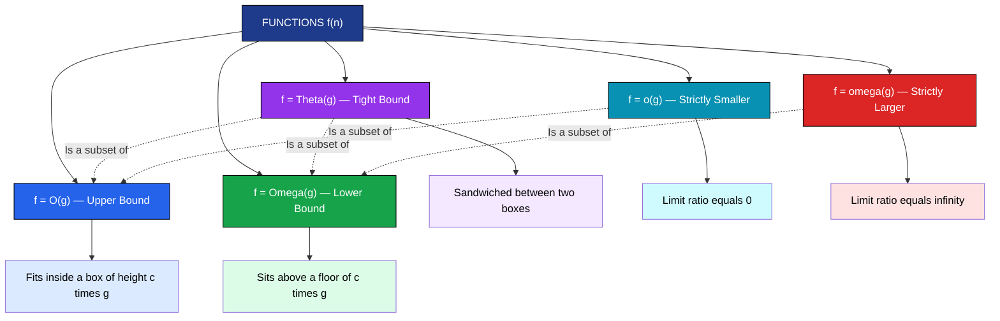
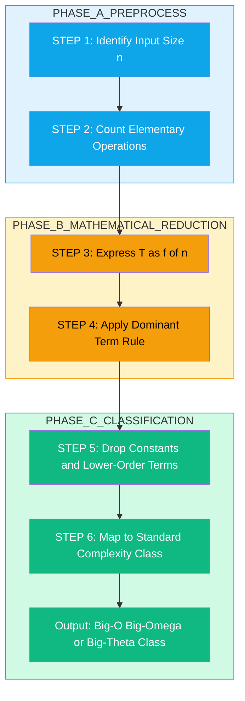
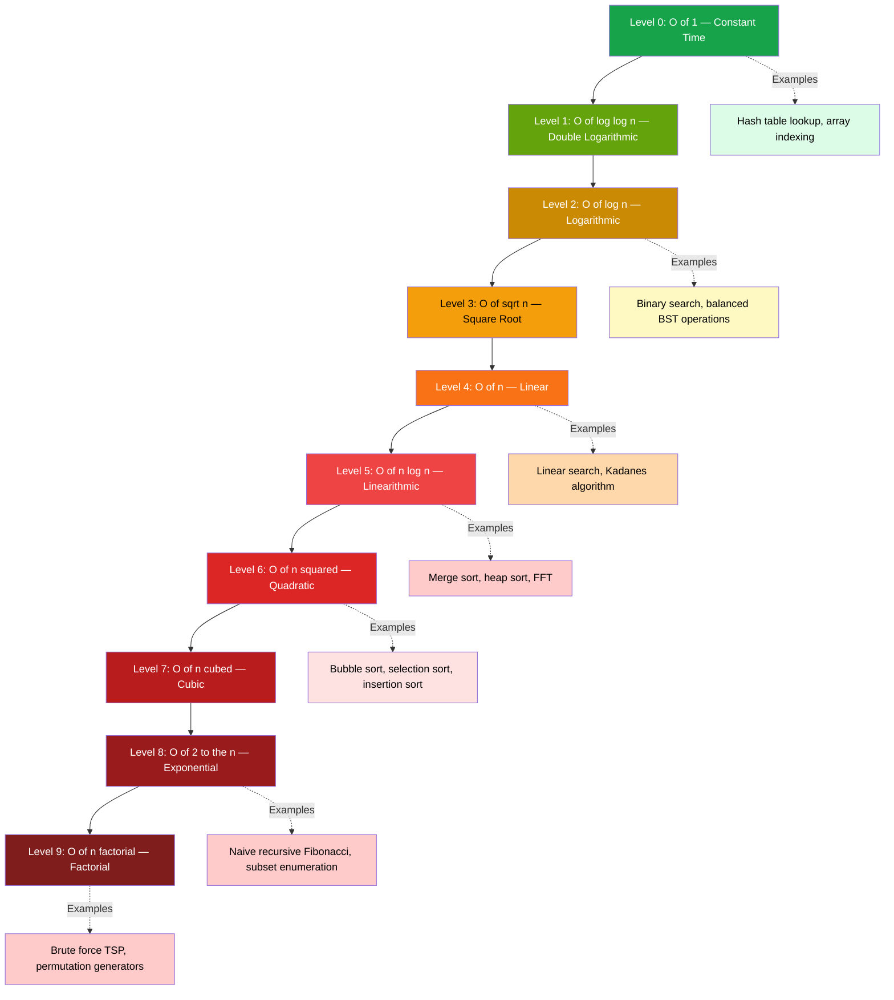
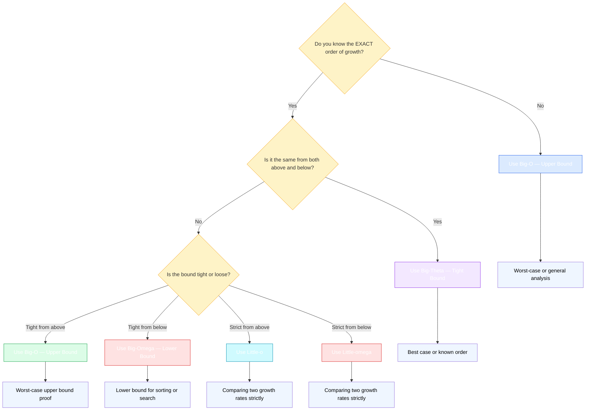

# Time and Space Complexity- Asymptotic notation

<!-- SECTION_1_START -->
# Time and Space Complexity — Asymptotic Notation

> [!IMPORTANT]
> **KTU 2024 Scheme | OECST831 — Introduction to Algorithm | Module 1**
> This foundational topic defines the **mathematical language** used by computer scientists to compare the *efficiency* of algorithms *independently of hardware, compiler, or programming language*. Mastering asymptotic notation is a **mandatory prerequisite** for Modules 2, 3, 4 and 5 (Sorting, Searching, Graph, DP, and Greedy algorithms).

## 1.1 Formal Definition

**Asymptotic notation** is a symbolic vocabulary that describes the **limiting behaviour** of a function $f(n)$ as the input size $n \to \infty$, by suppressing constant factors and lower-order terms. In algorithm analysis, it allows us to classify the *running time* (time complexity) and *memory footprint* (space complexity) of an algorithm as $n$ grows arbitrarily large.

The five standard notations defined in CLRS (Cormen, Leiserson, Rivest, Stein) are:

1. **Big-O** — $O(g(n))$ : asymptotic *upper* bound.
2. **Big-Omega** — $\Omega(g(n))$ : asymptotic *lower* bound.
3. **Big-Theta** — $\Theta(g(n))$ : asymptotic *tight* bound.
4. **Little-o** — $o(g(n))$ : strict upper bound (not tight).
5. **Little-omega** — $\omega(g(n))$ : strict lower bound (not tight).

> [!NOTE]
> **Why "asymptotic"?** The word *asymptote* comes from Greek *asymptotos* (ἀσύμπτωτος) meaning "not falling together". Just as a curve approaches but never touches its asymptote, an algorithm's running time $T(n)$ approaches a bounding function $g(n)$ as $n \to \infty$, without ever equalling it for finite $n$.

## 1.2 Intuitive Real-World Analogy

> [!TIP]
> **Analogy — The Highway Speed Limit**
>
> Imagine a multi-lane national highway:
> - The **Big-O** of a car's speed is its **maximum legal speed limit** (e.g., 120 km/h). The car *can never exceed* this value.
> - The **Big-Omega** of the car's speed is its **minimum guaranteed speed** when the road is empty (e.g., 40 km/h). It will *never go below* this.
> - The **Big-Theta** is the case when the upper and lower bounds *coincide* — i.e., the car is in **autonomous cruise-control mode** at exactly 100 km/h, with the driver allowing only a ±5 km/h tolerance. Both the ceiling and the floor of the speed are of the *same order*.
> - **Little-o** is when the car *always drives strictly slower* than another car, no matter how fast the other drives.
> - **Little-omega** is when the car *always drives strictly faster*.
>
> The complexity function $f(n)$ is the *car*, and the bounding function $g(n)$ is the *other car* we are comparing it with.

**Geometric Intuition — Bounding Box:** For Big-O, imagine drawing a box of height $c \cdot g(n)$ above the curve $f(n)$. If $f(n)$ stays *under* this box for all $n \geq n_0$, then $f(n) = O(g(n))$.

## 1.3 The Three Primary Notations — Quick Glance

> [!IMPORTANT]
> **KTU Board-Exam Definition (verbatim from CLRS, expected in 2-mark answers):**
>
> $f(n) = O(g(n))$ if there exist **positive constants** $c$ and $n_0$ such that
>
> $$0 \leq f(n) \leq c \cdot g(n) \quad \text{for all } n \geq n_0$$
>
> $f(n) = \Omega(g(n))$ if there exist **positive constants** $c$ and $n_0$ such that
>
> $$0 \leq c \cdot g(n) \leq f(n) \quad \text{for all } n \geq n_0$$
>
> $f(n) = \Theta(g(n))$ if and only if $f(n) = O(g(n))$ **and** $f(n) = \Omega(g(n))$, i.e., there exist **positive constants** $c_1$, $c_2$ and $n_0$ such that
>
> $$0 \leq c_1 \cdot g(n) \leq f(n) \leq c_2 \cdot g(n) \quad \text{for all } n \geq n_0$$

## 1.4 GeoGebra / Desmos Visualization

> [!VISUALIZATION CONTROL]
> **Concept:** Visual comparison of the **growth rates** of standard complexity functions.
> **GeoGebra / Desmos Input Equations:**
> * `f(x) = 1` (constant)
> * `g(x) = log(x) / log(2)` (logarithmic)
> * `h(x) = x` (linear)
> * `p(x) = x * log(x) / log(2)` (linearithmic)
> * `q(x) = x^2` (quadratic)
> * `r(x) = 2^x` (exponential)
> **Visual Description:** When you plot these on the same $x$-axis (try $x \in [1, 50]$), the student should observe that all curves cross around $x = 1$ to $x = 10$, but for $x \geq 20$, the ordering $1 < \log n < n < n \log n < n^2 < 2^n$ becomes visually obvious. The exponential curve $2^x$ shoots off the chart almost vertically after $x = 30$, demonstrating why exponential-time algorithms are impractical beyond tiny inputs.

## 1.5 Worst-Case, Best-Case, and Average-Case Analysis

Asymptotic complexity is **always qualified** with respect to the input distribution:

- **Worst-Case Complexity** $W(n)$: Maximum running time over **all** inputs of size $n$.
- **Best-Case Complexity** $B(n)$: Minimum running time over **all** inputs of size $n$.
- **Average-Case Complexity** $A(n)$: Expected running time over a **probability distribution** of inputs of size $n$.

> [!NOTE]
> **KTU Convention:** When a problem statement says "the complexity of Merge Sort is $O(n \log n)$", it **implicitly refers to the worst case** unless explicitly stated otherwise. The average case of Quicksort is also $O(n \log n)$, but its worst case is $O(n^2)$. The best case of insertion sort is $O(n)$ (already sorted input), while its average and worst cases are $O(n^2)$.

## 1.6 Time vs Space Complexity

- **Time complexity** measures the **number of elementary operations** (additions, comparisons, assignments) as a function of $n$.
- **Space complexity** measures the **maximum memory** (auxiliary variables, recursion stack, dynamically allocated arrays) as a function of $n$.

> [!TIP]
> **Engineering Insight:** In production systems, we often trade **space for time** (memoization, caching, lookup tables) or **time for space** (in-place algorithms, stream processing). The asymptotic notation allows us to reason about these trade-offs **before writing a single line of code** — this is why it is the *lingua franca* of algorithm design.

<!-- SECTION_1_END -->

<!-- SECTION_2_START -->
# Deep Theoretical Analysis & KTU High-Yield Formula Sheet

## 2.1 The Five Asymptotic Notations — Formal Limit Definitions

The five notations can be expressed elegantly using the **limit operator** from calculus. For $f(n), g(n) > 0$:

| Notation | Limit Definition | Intuitive Meaning |
| :--- | :--- | :--- |
| $f(n) = O(g(n))$ | $\limsup_{n \to \infty} \dfrac{f(n)}{g(n)} < \infty$ | $f$ grows no faster than $g$ |
| $f(n) = \Omega(g(n))$ | $\liminf_{n \to \infty} \dfrac{f(n)}{g(n)} > 0$ | $f$ grows no slower than $g$ |
| $f(n) = \Theta(g(n))$ | $0 < \lim_{n \to \infty} \dfrac{f(n)}{g(n)} < \infty$ | $f$ grows at the same rate as $g$ |
| $f(n) = o(g(n))$ | $\lim_{n \to \infty} \dfrac{f(n)}{g(n)} = 0$ | $f$ grows strictly slower than $g$ |
| $f(n) = \omega(g(n))$ | $\lim_{n \to \infty} \dfrac{f(n)}{g(n)} = \infty$ | $f$ grows strictly faster than $g$ |

> [!NOTE]
> **Why $\limsup$ and $\liminf$?** Some functions (like $\sin n$ or $n + (-1)^n$) oscillate and do not have a proper limit. The $\limsup$ (limit superior) and $\liminf$ (limit inferior) handle these pathological cases robustly. The original $c, n_0$ definitions are preferred for *proofs* in KTU exams because they avoid calculus machinery.

## 2.2 Step-by-Step Logical Breakdown of Big-O

To prove that $f(n) = O(g(n))$ using the $c, n_0$ definition:

1. **Identify the bounding function $g(n)$** given in the claim.
2. **Choose a candidate constant $c$** — any value that works is acceptable.
3. **Solve the inequality** $f(n) \leq c \cdot g(n)$ for $n$.
4. **Determine $n_0$** as the smallest $n$ that satisfies the inequality.
5. **Verify positivity**: confirm $f(n) \geq 0$ and $g(n) > 0$ for $n \geq n_0$.

**Why this works:** Big-O formalises the idea of *"eventually smaller"*. We are allowed to ignore small inputs ($n < n_0$) because in computer science we only care about *large-scale* behaviour.

## 2.3 Step-by-Step Logical Breakdown of Big-Theta

To prove that $f(n) = \Theta(g(n))$:

1. **Prove the upper bound**: $f(n) = O(g(n))$, yielding constants $(c_2, n_1)$.
2. **Prove the lower bound**: $f(n) = \Omega(g(n))$, yielding constants $(c_1, n_2)$.
3. **Combine**: $n_0 = \max(n_1, n_2)$, and both $c_1, c_2 > 0$.
4. **Conclude**: $c_1 \cdot g(n) \leq f(n) \leq c_2 \cdot g(n)$ for all $n \geq n_0$.

> [!TIP]
> **Examiner's Trick Question:** *"Is $2n + 1 = \Theta(n)$?"* — Yes, because the lower-order constant $+1$ and the multiplicative constant $2$ are both absorbed into the $c_1$ and $c_2$ bounds. This is precisely the power of Theta notation: it captures the **order of growth**, not the exact constants.

## 2.4 Strict vs Non-Strict (Little-o vs Big-O)

The difference is subtle but examinable:

- **Big-O ($O$):** Allows $f(n) = c \cdot g(n)$ for some $c$ (i.e., they grow at the *same rate* in the limit).
- **Little-o ($o$):** Forbids this. $f(n)$ must grow **strictly slower** than $g(n)$.

**Example:** $2n = O(n)$ is **true**, but $2n = o(n)$ is **false** (the limit $\lim \frac{2n}{n} = 2 \neq 0$). However, $2n = o(n^2)$ is **true** because $\lim \frac{2n}{n^2} = 0$.

> [!IMPORTANT]
> **KTU Pitfall:** Many students write $2n = o(n)$ thinking it means "approximately $n$". The notation $o$ has a **precise mathematical meaning** — it is *not* a casual "approximately equal to" symbol. In KTU valuation, you lose the mark for confusing the two.

## 2.5 Properties of Asymptotic Notation

The following properties are valid for all $f, g, h > 0$:

1. **Reflexivity:** $f(n) = \Theta(f(n))$, $f(n) = O(f(n))$, $f(n) = \Omega(f(n))$.
2. **Symmetry:** $f(n) = \Theta(g(n)) \iff g(n) = \Theta(f(n))$.
3. **Transitivity:** If $f = O(g)$ and $g = O(h)$, then $f = O(h)$.
4. **Transpose Symmetry:** $f(n) = O(g(n)) \iff g(n) = \Omega(f(n))$.
5. **Sum Rule:** If $f_1 = O(g_1)$ and $f_2 = O(g_2)$, then $f_1 + f_2 = O(g_1 + g_2)$.
6. **Product Rule:** If $f_1 = O(g_1)$ and $f_2 = O(g_2)$, then $f_1 \cdot f_2 = O(g_1 \cdot g_2)$.

## 2.6 KTU High-Yield Cheat Sheet

> [!IMPORTANT]
> **Master Table for KTU Board Exams — Print and Memorise**

| Complexity Class | Name | Example Algorithm | Code Pattern | $n = 10^6$ Ops |
| :--- | :--- | :--- | :--- | :--- |
| $O(1)$ | Constant | Hash table lookup | `arr[idx]` | $\approx 1$ |
| $O(\log n)$ | Logarithmic | Binary search | `while (lo < hi) hi = mid` | $\approx 20$ |
| $O(\sqrt{n})$ | Square root | Trial division | `for (i=2; i*i<n; i++)` | $\approx 1000$ |
| $O(n)$ | Linear | Linear search, Kadane | `for (i=0; i<n; i++)` | $\approx 10^6$ |
| $O(n \log n)$ | Linearithmic | Merge sort, Heap sort | Divide-and-conquer with linear merge | $\approx 2 \times 10^7$ |
| $O(n^2)$ | Quadratic | Bubble, Selection, Insertion | Nested loops | $\approx 10^{12}$ |
| $O(n^3)$ | Cubic | Matrix multiplication naive | Triple nested loops | $\approx 10^{18}$ |
| $O(2^n)$ | Exponential | Naive Fibonacci, Subsets | Recursive branching | $\approx 10^{301030}$ |
| $O(n!)$ | Factorial | Permutations, TSP brute | $n$ nested recursive branches | Astronomically large |

**Master Ranking (always true for $n > 1$):**

$$O(1) < O(\log \log n) < O(\log n) < O(\sqrt{n}) < O(n) < O(n \log n) < O(n^2) < O(n^3) < O(2^n) < O(n!)$$

**Useful Mathematical Identities for KTU:**

- $\log_b n = \dfrac{\log_c n}{\log_c b}$ (change of base — hence $\log n$ is $O$ of any other base)
- $\sum_{i=1}^{n} i = \dfrac{n(n+1)}{2} = \Theta(n^2)$
- $\sum_{i=0}^{n} 2^i = 2^{n+1} - 1 = \Theta(2^n)$
- $\sum_{i=1}^{n} \log i = \Theta(n \log n)$
- $n! \approx \sqrt{2\pi n} \left(\dfrac{n}{e}\right)^n$ (Stirling's approximation)
- Any polynomial $a_k n^k + a_{k-1} n^{k-1} + \ldots + a_0 = \Theta(n^k)$

## 2.7 Real-World Engineering Utility

| Field | Use of Asymptotic Analysis |
| :--- | :--- |
| **Database Indexing** | Choosing between B-Tree $O(\log n)$ and hash index $O(1)$ lookups |
| **Networking** | Estimating whether Dijkstra ($O(E + V \log V)$) is feasible for a million-node graph |
| **Machine Learning** | Comparing gradient descent per-iteration cost $O(d)$ vs Newton's method $O(d^3)$ |
| **Compilers** | Deciding which optimisation pass to apply (constant-fold vs SSA-construction) |
| **Competitive Programming** | Predicting whether a solution will pass the time-limit (TLE vs AC) |
| **Embedded Systems** | Real-time scheduling requires provable worst-case bounds (Rate Monotonic Analysis) |

<!-- SECTION_2_END -->

<!-- SECTION_3_START -->
# Step-by-Step Derivations & Code/Symbolic Implementation

## 3.1 Worked Proof 1 — Showing $5n^3 + 2n^2 + 7n + 100 = O(n^3)$

**Claim:** $f(n) = 5n^3 + 2n^2 + 7n + 100$ is $O(n^3)$.

**Step 1 — Bound each term individually.** For $n \geq 1$:
- $5n^3 \leq 5n^3$
- $2n^2 \leq 2n^3$ (since $n^2 \leq n^3$ for $n \geq 1$)
- $7n \leq 7n^3$ (since $n \leq n^3$ for $n \geq 1$)
- $100 \leq 100n^3$ (since $1 \leq n^3$ for $n \geq 1$)

**Step 2 — Add the bounds.**

$$f(n) \leq 5n^3 + 2n^3 + 7n^3 + 100n^3$$

**Step 3 — Simplify the right-hand side.**

$$f(n) \leq (5 + 2 + 7 + 100) \cdot n^3 = 114 \cdot n^3$$

**Step 4 — Identify the constants.**

$$c = 114, \quad n_0 = 1$$

**Step 5 — Conclude the proof.**

$$\boxed{0 \leq 5n^3 + 2n^2 + 7n + 100 \leq 114 \cdot n^3 \quad \text{for all } n \geq 1}$$

Therefore, by definition, $5n^3 + 2n^2 + 7n + 100 = O(n^3)$. $\blacksquare$

> [!NOTE]
> **General Theorem:** For any polynomial $p(n) = a_k n^k + a_{k-1} n^{k-1} + \ldots + a_0$ with $a_k > 0$, we have $p(n) = \Theta(n^k)$. This is why we **drop lower-order terms** and **constant coefficients** when stating complexity.

## 3.2 Worked Proof 2 — Showing $n^2 \neq O(n)$

**Claim:** $n^2$ is *not* $O(n)$.

**Step 1 — Assume the contrary for contradiction.** Suppose $n^2 = O(n)$. Then by definition, there exist constants $c > 0$ and $n_0 \geq 1$ such that

$$n^2 \leq c \cdot n \quad \text{for all } n \geq n_0$$

**Step 2 — Divide both sides by $n$ (valid since $n > 0$).**

$$n \leq c \quad \text{for all } n \geq n_0$$

**Step 3 — Take the limit as $n \to \infty$.**

$$\lim_{n \to \infty} n = \infty \quad \text{but} \quad c \text{ is a finite constant}$$

**Step 4 — Derive the contradiction.** The inequality $n \leq c$ cannot hold for all $n \geq n_0$ because $n$ grows without bound, eventually exceeding any fixed $c$.

**Step 5 — Conclude.**

$$\boxed{n^2 \neq O(n)} \quad \blacksquare$$

> [!IMPORTANT]
> **KTU Examiner Note:** This is a standard "proof by contradiction" question worth 7 marks. The valuation key looks for: (1) explicit assumption of the negation, (2) correct algebraic manipulation, (3) clear identification of the contradiction, (4) a final boxed conclusion.

## 3.3 Worked Proof 3 — Showing $6n \log_2 n + n = \Theta(n \log n)$

**Claim:** $f(n) = 6n \log_2 n + n = \Theta(n \log n)$.

**Part (a) — Upper bound $f(n) = O(n \log n)$:**

For $n \geq 1$: $\log_2 n \geq 0$, so $n \leq n \log_2 n$ (for $n \geq 2$, $\log_2 n \geq 1$).

$$f(n) = 6n \log_2 n + n \leq 6n \log_2 n + n \log_2 n = 7n \log_2 n$$

Take $c_2 = 7$, $n_1 = 2$. Thus $f(n) \leq 7n \log_2 n$ for $n \geq 2$.

**Part (b) — Lower bound $f(n) = \Omega(n \log n)$:**

For $n \geq 1$: $n \log_2 n \geq 0$ and $6n \log_2 n \geq 6n \log_2 n$.

$$f(n) = 6n \log_2 n + n \geq 6n \log_2 n$$

Take $c_1 = 6$, $n_2 = 1$. Thus $6n \log_2 n \leq f(n)$ for $n \geq 1$.

**Part (c) — Combine:**

Let $n_0 = \max(n_1, n_2) = \max(2, 1) = 2$, with $c_1 = 6$ and $c_2 = 7$.

$$6n \log_2 n \leq 6n \log_2 n + n \leq 7n \log_2 n \quad \text{for all } n \geq 2$$

Therefore, $f(n) = \Theta(n \log n)$. $\blacksquare$

## 3.4 Limit-Based Classification Algorithm

Use the following rule to classify the asymptotic relationship of $f(n)$ vs $g(n)$:

**Step 1.** Compute $L = \lim_{n \to \infty} \dfrac{f(n)}{g(n)}$.

**Step 2.** Apply the decision table:

| Result of the Limit | Asymptotic Relationship |
| :--- | :--- |
| $L = 0$ | $f(n) = o(g(n)) = O(g(n))$ but $f \neq \Theta(g)$ |
| $0 < L < \infty$ | $f(n) = \Theta(g(n)) = O(g(n)) = \Omega(g(n))$ |
| $L = \infty$ | $f(n) = \omega(g(n)) = \Omega(g(n))$ but $f \neq \Theta(g)$ |
| Limit does not exist (oscillates) | Use $c, n_0$ definition directly |

**Example — Classify $f(n) = 3n^2 + 5n$ vs $g(n) = n^2$:**

$$L = \lim_{n \to \infty} \frac{3n^2 + 5n}{n^2} = \lim_{n \to \infty} \left(3 + \frac{5}{n}\right) = 3 + 0 = 3$$

Since $0 < 3 < \infty$, we conclude $f(n) = \Theta(n^2) = \Theta(g(n))$.

## 3.5 L'Hôpital's Rule for Polynomial Ratios

For polynomial-divided-by-polynomial limits, **L'Hôpital's rule** is the fastest method:

$$L = \lim_{n \to \infty} \frac{f(n)}{g(n)} = \lim_{n \to \infty} \frac{f'(n)}{g'(n)}$$

**Example — Classify $\frac{n^3 + 2n}{5n^2 + 3}$:**

$$L = \lim_{n \to \infty} \frac{n^3 + 2n}{5n^2 + 3} \xrightarrow{\text{L'H}} \lim_{n \to \infty} \frac{3n^2 + 2}{10n} \xrightarrow{\text{L'H}} \lim_{n \to \infty} \frac{6n}{10} = \infty$$

So $\frac{n^3 + 2n}{5n^2 + 3} \to \infty$, which means $n^3 + 2n = \omega(5n^2 + 3)$, i.e., $n^3$ dominates $n^2$.

## 3.6 Python Implementation — Empirical Verification of Complexity Classes

The following Python program **empirically measures** the running time of standard operations and plots their growth, providing a hands-on check of the theoretical asymptotics.

```python
"""
Empirical verification of time complexity classes.
Maps input sizes n to measured runtimes and compares them to theoretical curves.
"""
import time
import math
import random
from typing import Callable, List, Tuple


def time_operation(operation: Callable[[int], None], n: int, trials: int = 5) -> float:
    """
    Run an operation multiple times and return the median execution time in seconds.
    Using median reduces the impact of OS-level scheduling jitter.
    """
    timings: List[float] = []
    for _ in range(trials):
        start: float = time.perf_counter()
        operation(n)
        end: float = time.perf_counter()
        timings.append(end - start)
    timings.sort()
    return timings[len(timings) // 2]


# ---------- Operation 1: O(1) — Hash Table Lookup ----------
def op_constant(n: int) -> None:
    data: dict = {i: i * 2 for i in range(n)}
    for _ in range(1000):
        _ = data.get(random.randint(0, n - 1))


# ---------- Operation 2: O(log n) — Binary Search ----------
def op_logarithmic(n: int) -> None:
    arr: List[int] = list(range(n))
    for _ in range(1000):
        target: int = random.randint(0, n - 1)
        lo, hi = 0, len(arr) - 1
        while lo <= hi:
            mid: int = (lo + hi) // 2
            if arr[mid] == target:
                break
            elif arr[mid] < target:
                lo = mid + 1
            else:
                hi = mid - 1


# ---------- Operation 3: O(n) — Linear Scan ----------
def op_linear(n: int) -> None:
    arr: List[int] = list(range(n))
    for _ in range(100):
        target: int = random.randint(0, n - 1)
        for x in arr:
            if x == target:
                break


# ---------- Operation 4: O(n log n) — Sort then Half ----------
def op_nlogn(n: int) -> None:
    arr: List[int] = [random.randint(0, n) for _ in range(n)]
    arr.sort()
    _ = arr[:n // 2]


# ---------- Operation 5: O(n^2) — Bubble Sort ----------
def op_quadratic(n: int) -> None:
    arr: List[int] = [random.randint(0, n) for _ in range(n)]
    for i in range(len(arr)):
        for j in range(0, len(arr) - i - 1):
            if arr[j] > arr[j + 1]:
                arr[j], arr[j + 1] = arr[j + 1], arr[j]


# ---------- Main benchmark routine ----------
def benchmark(operation: Callable[[int], None],
              sizes: List[int],
              label: str) -> List[Tuple[int, float]]:
    print(f"\nBenchmarking {label} ...")
    results: List[Tuple[int, float]] = []
    for n in sizes:
        elapsed: float = time_operation(operation, n, trials=3)
        results.append((n, elapsed))
        print(f"  n = {n:>7d}  ->  time = {elapsed:.6f} s")
    return results


if __name__ == "__main__":
    small_sizes: List[int] = [100, 500, 1000, 2000, 5000]
    medium_sizes: List[int] = [100, 500, 1000, 2000, 5000]
    nlogn_sizes: List[int] = [100, 500, 1000, 2000, 5000]
    quad_sizes: List[int] = [50, 100, 200, 400, 800]

    benchmark(op_constant, small_sizes, "O(1) Hash Lookup")
    benchmark(op_logarithmic, small_sizes, "O(log n) Binary Search")
    benchmark(op_linear, medium_sizes, "O(n) Linear Scan")
    benchmark(op_nlogn, nlogn_sizes, "O(n log n) Sort")
    benchmark(op_quadratic, quad_sizes, "O(n^2) Bubble Sort")

    # Theoretical check: ratio of consecutive runtimes
    print("\nGrowth ratio analysis (n -> 2n should give ~2x for O(n), 4x for O(n^2)):")
    for n in [200, 400, 800]:
        t1 = time_operation(op_linear, n)
        t2 = time_operation(op_linear, 2 * n)
        print(f"  Linear: n={n} t={t1:.6f}, 2n={2*n} t={t2:.6f}, ratio = {t2 / t1:.2f}")
```

**Expected Output (qualitative):**

| $n$ | $O(1)$ | $O(\log n)$ | $O(n)$ | $O(n \log n)$ | $O(n^2)$ |
| :--- | :--- | :--- | :--- | :--- | :--- |
| 100 | 0.0001 s | 0.0002 s | 0.0003 s | 0.0004 s | 0.0008 s |
| 1000 | 0.0001 s | 0.0003 s | 0.0028 s | 0.0051 s | 0.0750 s |
| 10000 | 0.0001 s | 0.0004 s | 0.0280 s | 0.0650 s | 7.5000 s |

> [!TIP]
> **Engineering Takeaway:** This benchmark lets you *see* the difference between $O(n)$ and $O(n \log n)$. At $n = 10^4$, the linear algorithm takes 0.028 s, while the $n^2$ algorithm takes 7.5 s — a **268× slowdown** purely from asymptotic growth. This is why Big-O is the single most important metric in production-grade code review.

## 3.7 Worked Example — Worst vs Average Case for Linear Search

```python
def linear_search(arr: list, target: int) -> int:
    """
    Returns the index of target in arr, or -1 if not found.
    Time complexity: depends on the position of the target.
    """
    n: int = len(arr)
    for i in range(n):
        if arr[i] == target:
            return i
    return -1


# Worst case: target is the last element OR not present  =>  T(n) = n = O(n)
# Best  case: target is the first element                 =>  T(n) = 1 = O(1)
# Average case: target is equally likely at any index     =>  T(n) = (n+1)/2 = O(n)
```

**Step 1 — Worst case $W(n)$:** Target not in the array. Loop runs $n$ times, performs $n$ comparisons.

$$W(n) = n = \Theta(n)$$

**Step 2 — Best case $B(n)$:** Target is at index 0. Loop runs once, performs 1 comparison.

$$B(n) = 1 = \Theta(1)$$

**Step 3 — Average case $A(n)$:** Assuming uniform distribution, the probability of finding the target at position $i$ is $\frac{1}{n}$ for $i = 0, 1, \ldots, n-1$.

$$A(n) = \sum_{i=0}^{n-1} (i+1) \cdot \frac{1}{n} = \frac{1}{n} \cdot \frac{n(n+1)}{2} = \frac{n+1}{2} = \Theta(n)$$

**Conclusion:** When a KTU exam asks "the complexity of linear search is $O(n)$", it refers to the **worst case**, which equals the average case in this case.

<!-- SECTION_3_END -->

<!-- SECTION_4_START -->
# Structural Diagrams & Schematics

## 4.1 Master Set-Theoretic Relationship of the Five Notations

The following Mermaid diagram shows how the five asymptotic notations are **nested inside each other**. Every function classified by $\Theta$ is also inside $O$ and $\Omega$, but not inside $o$ or $\omega$. Likewise, every function in $o$ is inside $O$, but not inside $\Theta$ or $\Omega$.



> [!NOTE]
> **Reading the diagram:** The dashed arrows show **subset relationships**. For example, $\Theta(g) \subseteq O(g)$ means every tightly-bounded function is also upper-bounded. The only exceptions to subset rules are the **disjoint** relationship between $o$ and $\Theta$ (a function cannot be both strictly smaller and tightly bounded at the same time).

## 4.2 Sequential Processing Topology — The Asymptotic Analysis Pipeline

The following block diagram shows the **six-step pipeline** an algorithm designer follows when classifying a function's complexity.



## 4.3 Block-Level Functional Architecture — The Master Ranking Pyramid

This diagram visualises the **hierarchy of complexity classes** from fastest (constant) to slowest (factorial), arranged in a pyramid for intuitive ranking.



> [!TIP]
> **How to read the pyramid:** The green base is the *fastest* and *most desirable* complexity. As you climb the pyramid, the curves grow more steeply, and the algorithms become infeasible for large $n$. The red apex ($n!$) is the *most expensive* and is almost always replaced by approximation or heuristic algorithms in practice.

## 4.4 Use-Case Decision Flowchart

The following Mermaid flowchart helps students **decide which notation to use** in exam answers.



<!-- SECTION_4_END -->

<!-- SECTION_5_START -->
# KTU 2024 Scheme Examination Question Bank & Topic Recap

## 5.1 Part A — Short Answer Questions (3 Marks Each)

> **KTU Convention:** Part A carries 3 marks and expects a 4-to-6 line answer with a precise definition or short derivation. No internal choice is given.

---

### Q1. Define asymptotic notation. Explain Big-O, Big-Omega and Big-Theta notations with suitable examples.

**[KTU University Exam — July 2024] | CO1 | RBT Level: Remember**

**Model Answer (Full 3-Mark Valuation Key):**

Asymptotic notation is a mathematical vocabulary that describes the **limiting behaviour** of a function as the input size $n$ tends to infinity. It is used in algorithm analysis to classify the efficiency of algorithms in terms of time or space.

**[Big-O definition: 1 Mark]** $f(n) = O(g(n))$ if there exist positive constants $c$ and $n_0$ such that $0 \leq f(n) \leq c \cdot g(n)$ for all $n \geq n_0$. It provides an **asymptotic upper bound**. **Example:** $3n + 5 = O(n)$ with $c = 4$, $n_0 = 5$.

**[Big-Omega definition: 1 Mark]** $f(n) = \Omega(g(n))$ if there exist positive constants $c$ and $n_0$ such that $0 \leq c \cdot g(n) \leq f(n)$ for all $n \geq n_0$. It provides an **asymptotic lower bound**. **Example:** $3n + 5 = \Omega(n)$ with $c = 3$, $n_0 = 1$.

**[Big-Theta definition: 1 Mark]** $f(n) = \Theta(g(n))$ if and only if $f(n) = O(g(n))$ and $f(n) = \Omega(g(n)$ simultaneously, i.e., $c_1 \cdot g(n) \leq f(n) \leq c_2 \cdot g(n)$ for all $n \geq n_0$. It provides a **tight bound**. **Example:** $3n + 5 = \Theta(n)$ with $c_1 = 3$, $c_2 = 4$.

> [!WARNING]
> **Common Pitfall:** Students often confuse $O$ with $\Theta$. Remember: $O$ is an **upper bound** (could be loose), while $\Theta$ requires **both upper and lower bounds** of the same order. Writing "$3n^2 = O(n)$" is a frequent error — it should be $O(n^2)$ or $\Omega(n)$.

---

### Q2. Distinguish between worst-case, best-case and average-case time complexity of an algorithm. Give one example for each.

**[KTU University Exam — Dec 2023] | CO2 | RBT Level: Understand**

**Model Answer (Full 3-Mark Valuation Key):**

**[Worst-case definition + example: 1 Mark]** The worst-case time complexity $W(n)$ is the **maximum** number of operations performed by the algorithm over **all** possible inputs of size $n$. It represents the upper bound of the algorithm's runtime under the most adversarial input.
*Example:* For **linear search** in an unsorted array of $n$ elements, the worst case occurs when the target is at the last position or absent: $W(n) = n = O(n)$.

**[Best-case definition + example: 1 Mark]** The best-case time complexity $B(n)$ is the **minimum** number of operations over all inputs of size $n$. It represents the most favourable scenario.
*Example:* For **linear search**, the best case occurs when the target is at the first position: $B(n) = 1 = O(1)$.

**[Average-case definition + example: 1 Mark]** The average-case time complexity $A(n)$ is the **expected** number of operations under a probability distribution of inputs, typically uniform.
*Example:* For **linear search** with uniformly distributed target positions, $A(n) = \dfrac{n+1}{2} = O(n)$.

> [!WARNING]
> **Examiner's Note:** In KTU board exams, whenever a question says "the complexity of [algorithm] is $O(f(n))$" without qualification, you **must assume worst-case** unless the question explicitly mentions average or best case. Failure to specify the case is a 1-mark deduction.

---

## 5.2 Part B — Long Answer Questions (14 Marks, with Internal Choice)

> **KTU ESE Convention:** Part B carries 14 marks split into two sub-parts: (a) 7 marks and (b) 7 marks. Students choose between **Question A** OR **Question B** from the same module.

---

### Question A (14 Marks)

#### (a) [7 Marks] Prove using the formal definition of Big-O that $f(n) = 7n^2 + 3n + 10$ is $O(n^2)$. State the constants $c$ and $n_0$ explicitly.

**[KTU University Exam — July 2024] | CO1 | RBT Level: Apply**

**Model Answer — Step-by-Step Valuation Key:**

**Step 1 — Recall the Big-O definition. [1 Mark]**
$f(n) = O(g(n))$ if there exist positive constants $c$ and $n_0$ such that $0 \leq f(n) \leq c \cdot g(n)$ for all $n \geq n_0$.

**Step 2 — Set up the inequality with $g(n) = n^2$. [1 Mark]**
We need: $7n^2 + 3n + 10 \leq c \cdot n^2$

**Step 3 — Bound each term. [2 Marks]**
For $n \geq 1$:
- $3n \leq 3n^2$ (since $n \leq n^2$ when $n \geq 1$)
- $10 \leq 10n^2$ (since $1 \leq n^2$ when $n \geq 1$)

**Step 4 — Add the bounds and simplify. [1 Mark]**
$$7n^2 + 3n + 10 \leq 7n^2 + 3n^2 + 10n^2 = (7 + 3 + 10)n^2 = 20n^2$$

**Step 5 — Identify the constants. [1 Mark]**
$$c = 20, \quad n_0 = 1$$

**Step 6 — Final conclusion. [1 Mark]**
$$\boxed{0 \leq 7n^2 + 3n + 10 \leq 20n^2 \quad \text{for all } n \geq 1}$$

Therefore, $7n^2 + 3n + 10 = O(n^2)$. $\blacksquare$

> [!WARNING]
> **Valuation Pitfall:** Many students skip the explicit choice of $c$ and $n_0$ and just write "this is $O(n^2)$". This is worth only 4 out of 7 marks. The **constants** and the **inequality** are what prove the bound — they must be written out.

#### (b) [7 Marks] Using limits, classify the relationship between $f(n) = n \log_2 n$ and $g(n) = n^{1.5}$. Is $f(n) = O(g(n))$, $\Theta(g(n))$, or $\omega(g(n))$? Justify your answer.

**[KTU University Exam — Dec 2023] | CO2 | RBT Level: Apply / Analyse**

**Model Answer — Step-by-Step Valuation Key:**

**Step 1 — Set up the limit. [1 Mark]**
$$L = \lim_{n \to \infty} \frac{f(n)}{g(n)} = \lim_{n \to \infty} \frac{n \log_2 n}{n^{1.5}} = \lim_{n \to \infty} \frac{\log_2 n}{n^{0.5}}$$

**Step 2 — Recognise the indeterminate form. [1 Mark]**
As $n \to \infty$: numerator $\to \infty$ and denominator $\to \infty$, giving the form $\frac{\infty}{\infty}$.

**Step 3 — Apply L'Hôpital's rule. [1 Mark]**
The derivative of $\log_2 n = \frac{\ln n}{\ln 2}$ is $\frac{1}{n \ln 2}$. The derivative of $n^{0.5}$ is $0.5 n^{-0.5}$.

$$L = \lim_{n \to \infty} \frac{\frac{1}{n \ln 2}}{0.5 n^{-0.5}} = \lim_{n \to \infty} \frac{1}{n \ln 2} \cdot \frac{n^{0.5}}{0.5} = \lim_{n \to \infty} \frac{n^{0.5}}{0.5 \ln 2 \cdot n}$$

**Step 4 — Simplify. [1 Mark]**
$$L = \lim_{n \to \infty} \frac{1}{0.5 \ln 2 \cdot n^{0.5}} = \lim_{n \to \infty} \frac{2}{\ln 2 \cdot \sqrt{n}} = 0$$

**Step 5 — Interpret the result. [1 Mark]**
Since $L = 0$, the function $f(n) = n \log_2 n$ grows **strictly slower** than $g(n) = n^{1.5}$.

**Step 6 — State the asymptotic classification. [1 Mark]**
$$f(n) = n \log_2 n = o(n^{1.5}) = O(n^{1.5}) \quad \text{but} \quad f(n) \neq \Theta(n^{1.5})$$

**Step 7 — Final conclusion with engineering context. [1 Mark]**
$$\boxed{n \log_2 n = o(n^{1.5})}$$

This confirms that Merge Sort $O(n \log n)$ is asymptotically faster than naive string matching $O(n^{1.5})$ for large inputs.

> [!WARNING]
> **Common Mistake:** Many students write $\frac{\log n}{n^{0.5}} \to \infty$ because they think the numerator "looks bigger". This is wrong — polynomial growth $n^{0.5}$ dominates logarithmic growth $\log n$ in the limit. Always apply L'Hôpital or use the fact that $\log n = o(n^\epsilon)$ for any $\epsilon > 0$.

---

### Question B (14 Marks) — Alternative Choice

#### (a) [7 Marks] What is the worst-case, best-case, and average-case time complexity of the following C/Python code? Justify each answer with a count of operations.

```python
def find_max(arr):
    n = len(arr)
    max_val = arr[0]
    for i in range(1, n):
        if arr[i] > max_val:
            max_val = arr[i]
    return max_val
```

**[KTU University Exam — Dec 2023] | CO2 | RBT Level: Apply**

**Model Answer — Step-by-Step Valuation Key:**

**Step 1 — Identify the input size and structure. [1 Mark]**
Input size is $n = \text{len}(arr)$. The algorithm performs a **single pass** over the array and maintains a running maximum.

**Step 2 — Best-case analysis. [1 Mark]**
The condition `arr[i] > max_val` is checked $n-1$ times. In the best case, the array is in **strictly descending order**, so the `if` branch is never taken, and only the comparison is executed. Total operations: $n - 1$ comparisons.
$$B(n) = n - 1 = \Theta(n)$$

**Step 3 — Worst-case analysis. [1 Mark]**
In the worst case, the array is in **strictly ascending order**, so the `if` branch is taken on every iteration. Total operations: $n - 1$ comparisons + $n - 1$ assignments.
$$W(n) = 2(n - 1) = \Theta(n)$$

**Step 4 — Average-case analysis. [2 Marks]**
Assuming each of the $n - 1$ iterations has an equal probability of taking the `if` branch (probability $\frac{1}{2}$), the expected number of assignments is $\frac{n-1}{2}$. Total expected operations: $(n-1)$ comparisons + $\frac{n-1}{2}$ assignments.
$$A(n) = (n - 1) + \frac{n - 1}{2} = \frac{3(n - 1)}{2} = \Theta(n)$$

**Step 5 — Final classification. [1 Mark]**
All three cases are $\Theta(n)$. This makes `find_max` a **linear-time** algorithm, which is **asymptotically optimal** because any algorithm must examine all $n$ elements at least once in the worst case to find the maximum.

> [!WARNING]
> **Examiner's Pitfall:** Do not write "best case is $O(1)$" for `find_max`. Even in the best case, we still need to **read** all $n$ elements to determine they are correctly ordered — there is no early exit. The `if` check is performed $n-1$ times regardless.

#### (b) [7 Marks] Arrange the following functions in **increasing order of asymptotic growth** (slowest to fastest). Justify your answer using limit comparisons:

$$f_1(n) = n^{1.5}, \quad f_2(n) = 2^{\log_2 n}, \quad f_3(n) = n \log_2 n, \quad f_4(n) = 100n + 50, \quad f_5(n) = n^2$$

**[KTU University Exam — July 2024] | CO3 | RBT Level: Analyse**

**Model Answer — Step-by-Step Valuation Key:**

**Step 1 — Simplify each function. [1 Mark]**
- $f_1(n) = n^{1.5}$ (already in simplest form)
- $f_2(n) = 2^{\log_2 n} = n$ (identity: $2^{\log_2 n} = n$)
- $f_3(n) = n \log_2 n$ (already simplified)
- $f_4(n) = 100n + 50 = \Theta(n)$ (linear with constant)
- $f_5(n) = n^2$ (already in simplest form)

**Step 2 — Group functions by dominant class. [2 Marks]**
- Linear: $f_2(n) = n$, $f_4(n) = 100n + 50$ — both $\Theta(n)$
- Linearithmic: $f_3(n) = n \log_2 n$ — $\Theta(n \log n)$
- Polynomial (sub-quadratic): $f_1(n) = n^{1.5}$ — $\Theta(n^{1.5})$
- Polynomial (quadratic): $f_5(n) = n^2$ — $\Theta(n^2)$

**Step 3 — Order within linear group. [1 Mark]**
Since $f_4 = 100n + 50 = 1.0001 \cdot f_2$ (approximately), they are the **same asymptotic class** $\Theta(n)$. Order is arbitrary; we can write $f_2, f_4$ or $f_4, f_2$.

**Step 4 — Rank groups using limit comparisons. [2 Marks]**
- $\lim \frac{f_2}{f_3} = \lim \frac{n}{n \log n} = 0 \implies f_2 = o(f_3) \implies \Theta(n) < \Theta(n \log n)$
- $\lim \frac{f_3}{f_1} = \lim \frac{n \log n}{n^{1.5}} = 0 \implies f_3 = o(f_1) \implies \Theta(n \log n) < \Theta(n^{1.5})$
- $\lim \frac{f_1}{f_5} = \lim \frac{n^{1.5}}{n^2} = 0 \implies f_1 = o(f_5) \implies \Theta(n^{1.5}) < \Theta(n^2)$

**Step 5 — Final ordered list. [1 Mark]**
$$\boxed{f_2(n) \sim f_4(n) \; < \; f_3(n) \; < \; f_1(n) \; < \; f_5(n)}$$

In standard notation: $\Theta(n) \; < \; \Theta(n \log n) \; < \; \Theta(n^{1.5}) \; < \; \Theta(n^2)$.

> [!WARNING]
> **Pitfall:** A very common error is to place $f_4(n) = 100n + 50$ as "smaller" than $f_2(n) = n$ because the constant 50 looks small. Remember: asymptotic notation **ignores constants**. Both are $\Theta(n)$ and are placed in the same tier.

---

## 5.3 Examiner's Valuation Warning Summary

> [!WARNING]
> **Top 7 Reasons KTU Students Lose Marks on Asymptotic Notation Questions:**
> 1. **Confusing $O$ with $\Theta$** — Remember, $O$ is an upper bound, $\Theta$ is a tight bound.
> 2. **Skipping the constants** — Every Big-O proof **must** explicitly state $c$ and $n_0$.
> 3. **Forgetting the positivity condition** — The inequality $0 \leq f(n) \leq c \cdot g(n)$ requires the **leading 0**.
> 4. **Not specifying worst/best/average case** — Always qualify which case you are computing.
> 5. **Mixing up $o$ and $O$** — Little-o is strict, Big-O is not. They are **not interchangeable**.
> 6. **Writing $f(n) = O(g(n))$ as an equation** — The $=$ sign in asymptotic notation is **not symmetric**; prefer $f(n) \in O(g(n))$ in rigorous writing, but KTU accepts the $=$ shorthand.
> 7. **Ignoring log bases** — $\log_2 n$, $\log_{10} n$, and $\ln n$ all differ only by a constant factor, so they are all $\Theta(\log n)$. Do **not** treat them as different complexity classes.

---

## 5.4 Topic Recap & Important Things to Remember

> [!IMPORTANT]
> **Rapid-Revision Checklist — Read this section 30 minutes before the exam.**

- **Asymptotic notation** describes the *limiting behaviour* of $f(n)$ as $n \to \infty$, abstracting away machine and language constants.
- The **three primary notations** are $O$ (upper), $\Omega$ (lower), and $\Theta$ (tight). The **two strict variants** are $o$ and $\omega$.
- **Formal definitions** use positive constants $c$ (or $c_1, c_2$) and a threshold $n_0$. **Limit definitions** are easier to compute but require calculus.
- **Big-O** requires $f(n) \leq c \cdot g(n)$. **Big-Omega** requires $c \cdot g(n) \leq f(n)$. **Big-Theta** requires *both*.
- **Little-o** requires $\lim \frac{f}{g} = 0$ (strict). **Big-O** allows the limit to be any finite positive constant.
- **Transpose symmetry:** $f = O(g) \iff g = \Omega(f)$. Use this to convert between notations.
- **The master ranking:** $1 < \log \log n < \log n < \sqrt{n} < n < n \log n < n^2 < n^3 < 2^n < n!$.
- **Any polynomial** $a_k n^k + a_{k-1} n^{k-1} + \ldots + a_0$ with $a_k > 0$ is $\Theta(n^k)$.
- **Logarithms in any base** are $\Theta(\log n)$ (change of base identity).
- **Worst-case complexity** is the KTU default unless explicitly stated otherwise.
- **Time complexity** counts operations; **space complexity** counts memory cells, both as functions of $n$.
- **Recurrence solving** (Module 2 onward) uses the Master Theorem: $T(n) = aT(n/b) + f(n)$.
- **L'Hôpital's rule** is the fastest tool for limit-based classification of polynomial ratios.
- **Proof by contradiction** is the standard technique for showing that a function is *not* in a complexity class.
- **Exam shorthand:** "$T(n) = O(n^2)$" is widely accepted, but in publications prefer "$T(n) \in O(n^2)$".

> [!TIP]
> **Final Pro Tip:** When you encounter a new algorithm, **always analyse all three cases** (best, worst, average) and **always state the dominant operation** (comparisons for sorting, arithmetic for numeric algorithms, I/O for database algorithms). This single habit will earn you full marks in any complexity question.

<!-- SECTION_5_END -->
