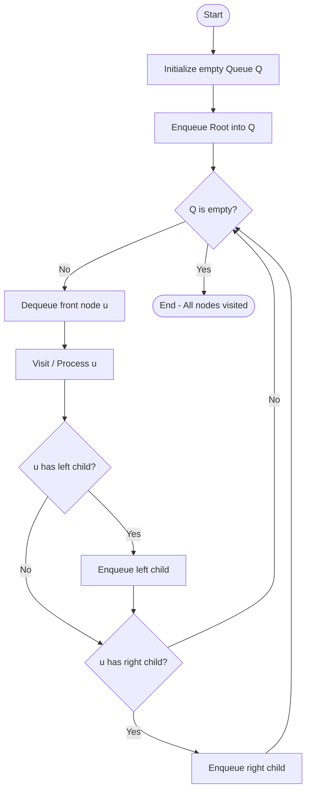
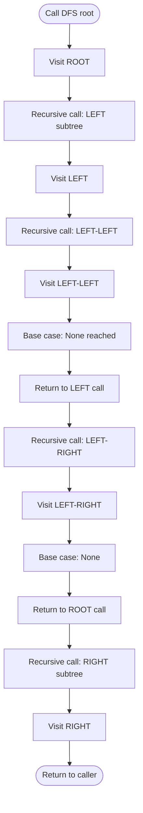
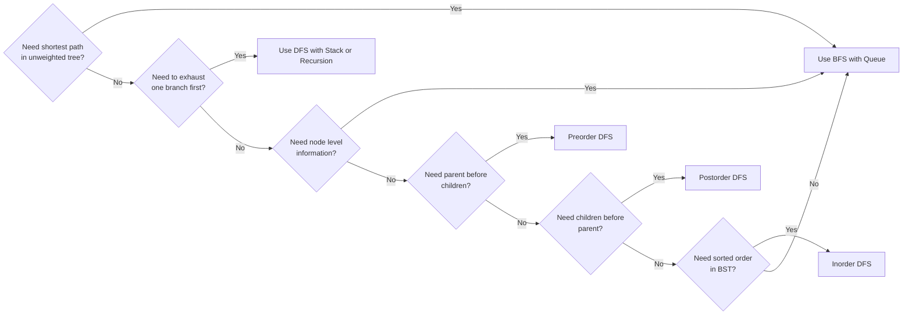

# BFS and DFS (analysis not required)

<!-- SECTION_1_START -->
# BFS and DFS — Core Technical Definition & Intuitive Overview

## 1.1 Formal KTU 2024 Syllabus Definition

**Breadth-First Search (BFS)** and **Depth-First Search (DFS)** are the two fundamental **graph/tree traversal algorithms** that systematically visit every node of a tree exactly once. When restricted to trees, BFS naturally yields the **Level Order Traversal**, while DFS produces three canonical traversals: **Preorder**, **Inorder**, and **Postorder**.

> [!IMPORTANT]
> **KTU 2024 Syllabus Note (OECST831 — Module 2):**
> The syllabus explicitly states *"analysis not required"*, meaning students are **not** expected to derive time/space complexity proofs. However, traversal sequences, algorithmic steps, and tree construction from traversals **are** mandatory.

## 1.2 Intuitive Analogies

### BFS — The "Ripple in a Pond" Analogy
Imagine dropping a stone into a still pond. The ripples spread **outward in concentric circles** — first the center, then one ring out, then two rings out, and so on. BFS behaves exactly this way on a tree: it visits all nodes at **depth 0**, then all nodes at **depth 1**, then **depth 2**, and so on. It uses a **Queue (First-In-First-Out)** because we must remember the "frontier" of nodes visited in the previous ring before diving deeper.

### DFS — The "Maze Explorer" Analogy
Picture a person exploring a dark cave with a single ball of string. They walk as **deep as possible** down one path, marking the way with string. When they hit a dead end, they **backtrack** along the string until they find an unexplored branch, and go deep again. DFS mimics this on a tree using a **Stack (Last-In-First-Out)** or **recursion** (the call stack).

> [!NOTE]
> **Core Difference at a Glance:**
>
> | Aspect | BFS | DFS |
> |---|---|---|
> | Data Structure | **Queue** | **Stack / Recursion** |
> | Exploration Pattern | **Level-wise** (horizontal) | **Branch-wise** (vertical) |
> | Best For | Shortest path, level info | Exhausting a path, tree reconstruction |
> | Memory Shape | Wide (all siblings) | Narrow (one path + siblings stack) |

## 1.3 The Two Standard Tree Representations

Before traversing, a tree must be stored in memory. KTU expects familiarity with both:

1. **Array (Sequential) Representation** — Root at index $1$, for a node at index $i$:
   - Left child index $= 2i$
   - Right child index $= 2i + 1$
   - Parent index $= \lfloor i / 2 \rfloor$

2. **Linked Representation** — Each node is an object with `data`, `left`, and `right` pointers. Empty trees/subtrees are represented by `None` / `NULL`.

> [!VISUALIZATION CONTROL]
> **Concept:** Binary Tree Index Mapping (Array Representation)
> **GeoGebra / Desmos Input Points:**
> * Point $A = (1, 5)$ — Root
> * Point $B = (2, 4)$ — Left child
> * Point $C = (3, 4)$ — Right child
> * Point $D = (4, 3)$ — Left.Left
> * Point $E = (5, 3)$ — Left.Right
> **Visual Description:** Plot these points on a Cartesian plane connected by line segments. Observe that horizontal positions follow the index formula $2i$ and $2i+1$ as $i$ moves down the tree.
<!-- SECTION_1_END -->

<!-- SECTION_2_START -->
# Deep Theoretical Analysis & KTU High-Yield Formula Sheet

## 2.1 BFS — Level Order Traversal (Queue-Based)

### Operational Logic (Step-by-Step)

1. **Initialize** an empty queue $Q$ and an empty list `visited`.
2. **Enqueue** the root node into $Q$.
3. **Repeat** until $Q$ becomes empty:
   - Dequeue the front node $u$ from $Q$.
   - **Visit / process** node $u$ (print it, store it, etc.).
   - Enqueue $u$'s **left child** if it exists.
   - Enqueue $u$'s **right child** if it exists.
4. **Termination:** $Q$ is empty $\Rightarrow$ all reachable nodes visited.

### Why a Queue?
The queue enforces **FIFO** ordering. When we visit a node at level $L$, we enqueue its children (which belong to level $L+1$) at the **back**. Nodes at level $L$ that were enqueued **earlier** will be dequeued **before** any level $L+1$ node, guaranteeing the level-wise order.

> [!IMPORTANT]
> **KTU High-Yield Fact:** BFS on a tree visits nodes in **non-decreasing order of depth** from the root. This is the only traversal that naturally exposes the **level number** of every node.

## 2.2 DFS — Three Canonical Variants (Stack/Recursion-Based)

DFS differs from BFS in the **order** in which a node and its subtrees are visited. The variants are distinguished by **when the root is processed** relative to its left and right subtrees.

| Variant | Visit Order | Mnemonic |
|---|---|---|
| **Preorder** | Root $\rightarrow$ Left $\rightarrow$ Right | **N**ode **L**eft **R**ight (Root first) |
| **Inorder** | Left $\rightarrow$ Root $\rightarrow$ Right | **L**eft **N**ode **R**ight (Root middle) |
| **Postorder** | Left $\rightarrow$ Right $\rightarrow$ Root | **L**eft **R**ight **N**ode (Root last) |

### Operational Logic (Recursive Form)

```text
DFS_Preorder(node):
    if node is None: return
    visit(node)              // ROOT first
    DFS_Preorder(node.left)  // then LEFT subtree
    DFS_Preorder(node.right) // then RIGHT subtree
```

```text
DFS_Inorder(node):
    if node is None: return
    DFS_Inorder(node.left)   // LEFT first
    visit(node)              // then ROOT
    DFS_Inorder(node.right)  // then RIGHT
```

```text
DFS_Postorder(node):
    if node is None: return
    DFS_Postorder(node.left)  // LEFT first
    DFS_Postorder(node.right) // then RIGHT
    visit(node)               // ROOT last
```

## 2.3 KTU Formula & Property Cheat Sheet

> [!NOTE]
> The following table consolidates the **high-yield formulas and properties** that KTU examiners frequently test in 3-mark and 14-mark questions. No analysis (Big-O) derivations are required per the 2024 syllabus.

| Property / Formula | Expression | Notes |
|---|---|---|
| Number of nodes at level $L$ (full binary tree) | $2^{L}$ | $L$ starts from $0$ (root level) |
| Left child of node at index $i$ (array rep.) | $2i$ | Root at $i=1$ |
| Right child of node at index $i$ | $2i+1$ | Root at $i=1$ |
| Parent of node at index $i$ | $\lfloor i/2 \rfloor$ | Valid for $i > 1$ |
| Preorder $\rightarrow$ Tree | $1^{st}$ element is **root** | Recursively partition by root position |
| Inorder $\rightarrow$ Tree | Root **splits** L and R subtrees | Used in 14-mark construction problems |
| Postorder $\rightarrow$ Tree | Last element is **root** | Recursively partition by root position |
| BFS for shortest path in unweighted tree | Yes | Edge count = level difference |

## 2.4 Real-World Engineering Utility

- **BFS** powers the **shortest-path routing** in LAN topologies, **level-order printing** in organizational hierarchies, and **peer-to-peer** discovery in BitTorrent.
- **DFS** underpins **expression evaluation** (postorder for stack machines), **directory listing** in operating systems (preorder), **syntax tree traversal** in compilers, and **garbage collection** (mark phase uses DFS-style reachability).
- **Tree reconstruction from traversals** is foundational to **serialization** in databases and **JSON/XML parsing** pipelines.
<!-- SECTION_2_END -->

<!-- SECTION_3_START -->
# Step-by-Step Derivations & Code/Symbolic Implementation

## 3.1 Worked Example — Manual Traversal Trace

Consider the following binary tree (the canonical KTU worked example):

```
            A
          /   \
         B     C
        / \   / \
       D   E F   G
```

We will derive **all four** traversals manually.

### Level Order (BFS) — Step-by-Step

| Step | Queue State (front $\rightarrow$ back) | Visited | Action |
|---|---|---|---|
| 1 | `[A]` | — | Enqueue root |
| 2 | `[B, C]` | `A` | Dequeue $A$, enqueue children |
| 3 | `[C, D, E]` | `A, B` | Dequeue $B$, enqueue children |
| 4 | `[D, E, F, G]` | `A, B, C` | Dequeue $C$, enqueue children |
| 5 | `[E, F, G]` | `A, B, C, D` | Dequeue $D$, no children |
| 6 | `[F, G]` | `A, B, C, D, E` | Dequeue $E$, no children |
| 7 | `[G]` | `A, B, C, D, E, F` | Dequeue $F$, no children |
| 8 | `[]` | `A, B, C, D, E, F, G` | Dequeue $G$, done |

**BFS Output:** $A, B, C, D, E, F, G$

### Preorder (DFS) — Recursive Trace

Visit pattern: **Root, Left, Right**

- Visit $A$ $\Rightarrow$ go left
- Visit $B$ $\Rightarrow$ go left
- Visit $D$ $\Rightarrow$ go left (None, return) $\Rightarrow$ go right (None, return) $\Rightarrow$ return to $B$
- Visit $E$ $\Rightarrow$ go left (None, return) $\Rightarrow$ go right (None, return) $\Rightarrow$ return to $B$ $\Rightarrow$ return to $A$
- Visit $C$ $\Rightarrow$ go left
- Visit $F$ $\Rightarrow$ go left (None) $\Rightarrow$ go right (None) $\Rightarrow$ return to $C$
- Visit $G$ $\Rightarrow$ go left (None) $\Rightarrow$ go right (None) $\Rightarrow$ return to $C$ $\Rightarrow$ return to $A$

**Preorder Output:** $A, B, D, E, C, F, G$

### Inorder (DFS) — Recursive Trace

Visit pattern: **Left, Root, Right**

- Go left from $A$ to $B$ to $D$. $D$ has no left $\Rightarrow$ **visit $D$**, no right.
- Return to $B$. $B$ has no more unvisited left $\Rightarrow$ **visit $B$**.
- Go right to $E$. **visit $E$**.
- Return to $A$. **visit $A$**.
- Go left to $C$ to $F$. **visit $F$**.
- Return to $C$. **visit $C$**.
- Go right to $G$. **visit $G$**.

**Inorder Output:** $D, B, E, A, F, C, G$

### Postorder (DFS) — Recursive Trace

Visit pattern: **Left, Right, Root**

- Go left from $A$ to $B$ to $D$. **visit $D$** (no children).
- Return to $B$, go right to $E$. **visit $E$**.
- Return to $B$. **visit $B$**.
- Return to $A$, go left to $C$ to $F$. **visit $F$**.
- Return to $C$, go right to $G$. **visit $G$**.
- Return to $C$. **visit $C$**.
- Return to $A$. **visit $A$**.

**Postorder Output:** $D, E, B, F, G, C, A$

## 3.2 Tree Construction from Traversals — 14-Mark Favorite

**Given:**
- Preorder: $A, B, D, E, C, F, G$
- Inorder:  $D, B, E, A, F, C, G$

**Step 1 — Identify the root.**
The **first** element of preorder is always the root.
$$\text{Root} = A$$

**Step 2 — Split inorder using the root.**
Locate $A$ in inorder: $D, B, E \;|\; A \;|\; F, C, G$
- Left inorder  $= D, B, E$ (3 nodes)
- Right inorder $= F, C, G$ (3 nodes)

**Step 3 — Split preorder by node counts.**
Preorder after root: $B, D, E, C, F, G$
- First 3 $\rightarrow$ left preorder $= B, D, E$
- Last 3 $\rightarrow$ right preorder $= C, F, G$

**Step 4 — Recurse.**
- **Left subtree:** Preorder $= B, D, E$, Inorder $= D, B, E$. Root $= B$. Inorder split: $D \;|\; B \;|\; E$.
  - Left-of-$B$ preorder $= D$, inorder $= D$ $\Rightarrow$ node $D$.
  - Right-of-$B$ preorder $= E$, inorder $= E$ $\Rightarrow$ node $E$.
- **Right subtree:** Preorder $= C, F, G$, Inorder $= F, C, G$. Root $= C$. Inorder split: $F \;|\; C \;|\; G$.
  - Left-of-$C$ $\Rightarrow$ node $F$.
  - Right-of-$C$ $\Rightarrow$ node $G$.

**Resulting tree matches our original.** $\checkmark$

## 3.3 Full Python Implementation

```python
from __future__ import annotations
from collections import deque
from dataclasses import dataclass, field
from typing import Optional, List, Any


@dataclass
class TreeNode:
    """
    A binary tree node using the linked representation.
    Each node stores data and references to its left and right children.
    """
    data: Any
    left: Optional["TreeNode"] = None
    right: Optional["TreeNode"] = None


class BinaryTree:
    """
    Encapsulates BFS and DFS traversals on a binary tree.
    Per KTU 2024 syllabus (OECST831), complexity analysis is omitted.
    """

    def __init__(self, root: Optional[TreeNode] = None) -> None:
        self.root: Optional[TreeNode] = root

    # ------------------------------------------------------------------ BFS
    def bfs_level_order(self) -> List[Any]:
        """
        Breadth-First Search using collections.deque as the queue.
        Returns the level-order traversal as a list.
        Raises:
            ValueError: if the tree is empty.
        """
        if self.root is None:
            raise ValueError("Cannot perform BFS on an empty tree.")

        queue: deque[TreeNode] = deque([self.root])
        visited: List[Any] = []

        while queue:
            node: TreeNode = queue.popleft()
            visited.append(node.data)

            # Enqueue left child first, then right child.
            if node.left is not None:
                queue.append(node.left)
            if node.right is not None:
                queue.append(node.right)

        return visited

    # --------------------------------------------------------------- DFS set
    def dfs_preorder(self) -> List[Any]:
        """Root -> Left -> Right (recursive)."""
        result: List[Any] = []

        def _walk(node: Optional[TreeNode]) -> None:
            if node is None:
                return
            result.append(node.data)        # ROOT first
            _walk(node.left)                # LEFT subtree
            _walk(node.right)               # RIGHT subtree

        _walk(self.root)
        return result

    def dfs_inorder(self) -> List[Any]:
        """Left -> Root -> Right (recursive)."""
        result: List[Any] = []

        def _walk(node: Optional[TreeNode]) -> None:
            if node is None:
                return
            _walk(node.left)                # LEFT subtree
            result.append(node.data)        # ROOT in the middle
            _walk(node.right)               # RIGHT subtree

        _walk(self.root)
        return result

    def dfs_postorder(self) -> List[Any]:
        """Left -> Right -> Root (recursive)."""
        result: List[Any] = []

        def _walk(node: Optional[TreeNode]) -> None:
            if node is None:
                return
            _walk(node.left)                # LEFT subtree
            _walk(node.right)               # RIGHT subtree
            result.append(node.data)        # ROOT last

        _walk(self.root)
        return result

    # ----------------------------------------------------- iterative DFS demo
    def dfs_preorder_iterative(self) -> List[Any]:
        """
        Iterative preorder DFS using an explicit stack.
        Demonstrates the LIFO discipline without recursion.
        """
        if self.root is None:
            return []
        stack: List[TreeNode] = [self.root]
        result: List[Any] = []
        while stack:
            node = stack.pop()
            result.append(node.data)
            # Push right first so left is processed first (LIFO).
            if node.right is not None:
                stack.append(node.right)
            if node.left is not None:
                stack.append(node.left)
        return result


# ===================================================================== demo
if __name__ == "__main__":
    # Build the canonical KTU example tree.
    #              A
    #            /   \
    #           B     C
    #          / \   / \
    #         D   E F   G
    root = TreeNode("A",
                    TreeNode("B",
                             TreeNode("D"),
                             TreeNode("E")),
                    TreeNode("C",
                             TreeNode("F"),
                             TreeNode("G")))

    tree = BinaryTree(root)

    print("BFS (Level Order) :", tree.bfs_level_order())
    print("DFS Preorder      :", tree.dfs_preorder())
    print("DFS Inorder       :", tree.dfs_inorder())
    print("DFS Postorder     :", tree.dfs_postorder())
    print("DFS Preorder (it) :", tree.dfs_preorder_iterative())
```

**Expected Output:**

```text
BFS (Level Order) : ['A', 'B', 'C', 'D', 'E', 'F', 'G']
DFS Preorder      : ['A', 'B', 'D', 'E', 'C', 'F', 'G']
DFS Inorder       : ['D', 'B', 'E', 'A', 'F', 'C', 'G']
DFS Postorder     : ['D', 'E', 'B', 'F', 'G', 'C', 'A']
DFS Preorder (it) : ['A', 'B', 'D', 'E', 'C', 'F', 'G']
```

## 3.4 Building a Tree from Traversals — Code

```python
def build_from_pre_in(preorder: List[Any],
                      inorder: List[Any]) -> Optional[TreeNode]:
    """
    Constructs a unique binary tree from preorder + inorder traversals.
    Pre-condition: no duplicate values; both lists represent the same tree.
    """
    if not preorder or not inorder:
        return None

    root_val: Any = preorder[0]
    root: TreeNode = TreeNode(root_val)
    mid: int = inorder.index(root_val)        # split point

    # Left side: preorder[1 : mid+1], inorder[0 : mid]
    root.left = build_from_pre_in(preorder[1:mid + 1], inorder[0:mid])
    # Right side: preorder[mid+1 :], inorder[mid+1 :]
    root.right = build_from_pre_in(preorder[mid + 1:], inorder[mid + 1:])

    return root
```
<!-- SECTION_3_END -->

<!-- SECTION_4_START -->
# Structural Diagrams & Schematics

## 4.1 BFS Traversal Flow (Queue-Based)



## 4.2 DFS Recursive Call Stack Evolution



## 4.3 Comparison Matrix — BFS vs DFS Decision Topology



## 4.4 Traversal Sequence Block Diagram

```mermaid
flowchart TB
    subgraph TreeShape["Tree Structure"]
        TN1(("A")) --- TN2(("B"))
        TN1 --- TN3(("C"))
        TN2 --- TN4(("D"))
        TN2 --- TN5(("E"))
        TN3 --- TN6(("F"))
        TN3 --- TN7(("G"))
    end

    subgraph BFSOut["BFS Level Order"]
        B1["A"] --> B2["B"] --> B3["C"] --> B4["D"] --> B5["E"] --> B6["F"] --> B7["G"]
    end

    subgraph PreOut["DFS Preorder: N-L-R"]
        P1["A"] --> P2["B"] --> P3["D"] --> P4["E"] --> P5["C"] --> P6["F"] --> P7["G"]
    end

    subgraph InOut["DFS Inorder: L-N-R"]
        I1["D"] --> I2["B"] --> I3["E"] --> I4["A"] --> I5["F"] --> I6["C"] --> I7["G"]
    end

    subgraph PostOut["DFS Postorder: L-R-N"]
        PO1["D"] --> PO2["E"] --> PO3["B"] --> PO4["F"] --> PO5["G"] --> PO6["C"] --> PO7["A"]
    end
```


<!-- SECTION_4_END -->

<!-- SECTION_5_START -->
# KTU 2024 Scheme Examination Question Bank & Topic Recap

---

## Part A Questions (3 Marks Each)

### Q1. [KTU University Exam - July 2024] (CO1, Remember)

**Differentiate between Breadth-First Search (BFS) and Depth-First Search (DFS) traversal of a binary tree. Mention the data structure used in each.**

**Model Answer:**

| Feature | BFS | DFS |
|---|---|---|
| Full name | Breadth-First Search | Depth-First Search |
| Traversal style | Level by level (level-order) | Branch by branch (goes deep first) |
| Data structure used | **Queue** (FIFO) | **Stack** or **Recursion** (LIFO) |
| Order of visiting | All nodes at depth $d$ before $d+1$ | One child subtree completely before next |
| Natural use | Shortest path, level info | Tree reconstruction, expression eval |

**[Award 1 Mark for naming both algorithms, 1 Mark for traversal style, 1 Mark for data structures.]**

---

### Q2. [KTU University Exam - Dec 2023] (CO1, Understand)

**List the three DFS traversal sequences possible for a binary tree. For each, state the order in which the root, left subtree, and right subtree are visited.**

**Model Answer:**

1. **Preorder:** Root $\rightarrow$ Left $\rightarrow$ Right
2. **Inorder:** Left $\rightarrow$ Root $\rightarrow$ Right
3. **Postorder:** Left $\rightarrow$ Right $\rightarrow$ Root

**[Award 1 Mark per correctly stated traversal order.]**

---

## Part B Questions (14 Marks Each — Module Internal Choice)

### Question A (14 Marks)

**[KTU University Exam - July 2024] (CO2, Apply + Analyze)**

**(a)** For the binary tree given below, write the **Level Order (BFS)**, **Preorder**, **Inorder**, and **Postorder** traversals. Show the queue/stack state at each step. **(7 Marks)**

```
            50
          /    \
        30      70
       /  \    /  \
      20  40  60  80
```

**(b)** Construct the **unique binary tree** whose:
- Inorder traversal  is $20, 30, 40, 50, 60, 70, 80$
- Postorder traversal is $20, 40, 30, 60, 80, 70, 50$

Verify by re-computing one DFS traversal of the constructed tree. **(7 Marks)**

---

#### Model Solution

**(a) Traversal Trace**

| Step | Queue (front $\rightarrow$ back) | Visited | Action |
|---|---|---|---|
| 1 | `[50]` | — | Enqueue root |
| 2 | `[30, 70]` | `50` | Dequeue 50, enqueue children |
| 3 | `[70, 20, 40]` | `50, 30` | Dequeue 30, enqueue children |
| 4 | `[20, 40, 60, 80]` | `50, 30, 70` | Dequeue 70, enqueue children |
| 5 | `[40, 60, 80]` | `50, 30, 70, 20` | Dequeue 20, no children |
| 6 | `[60, 80]` | `50, 30, 70, 20, 40` | Dequeue 40, no children |
| 7 | `[80]` | `50, 30, 70, 20, 40, 60` | Dequeue 60, no children |
| 8 | `[]` | `50, 30, 70, 20, 40, 60, 80` | Dequeue 80, done |

**Level Order (BFS):** $50, 30, 70, 20, 40, 60, 80$ **[2 Marks]**

**Preorder (Root, L, R):** $50, 30, 20, 40, 70, 60, 80$ **[2 Marks]**

**Inorder (L, Root, R):** $20, 30, 40, 50, 60, 70, 80$ **[1.5 Marks]**

**Postorder (L, R, Root):** $20, 40, 30, 60, 80, 70, 50$ **[1.5 Marks]**

---

**(b) Tree Construction**

**Step 1:** Last element of postorder $\Rightarrow$ **Root = 50**. **[1 Mark]**

**Step 2:** Locate 50 in inorder: $20, 30, 40 \mid 50 \mid 60, 70, 80$
- Left inorder  $\rightarrow 3$ nodes: $\{20, 30, 40\}$
- Right inorder $\rightarrow 3$ nodes: $\{60, 70, 80\}$

**Step 3:** Split postorder (excluding root) by counts $\{3, 3\}$: $\{20, 40, 30\} \mid \{60, 80, 70\}$
- Left postorder  $= 20, 40, 30$
- Right postorder $= 60, 80, 70$

**Step 4 — Recurse on Left Subtree:** Root of left subtree $= 30$ (first of left postorder). Locate 30 in left inorder $\{20, 30, 40\}$: $\{20\} \mid \{30\} \mid \{40\}$.
- Left-of-30 $\Rightarrow$ node 20 (leaf).
- Right-of-30 $\Rightarrow$ node 40 (leaf).

**Step 5 — Recurse on Right Subtree:** Root $= 70$. Locate 70 in right inorder: $\{60\} \mid \{70\} \mid \{80\}$.
- Left-of-70 $\Rightarrow$ node 60.
- Right-of-70 $\Rightarrow$ node 80. **[3 Marks for full construction]**

**Constructed Tree:**

```
            50
          /    \
        30      70
       /  \    /  \
      20  40  60  80
```

**Verification — Inorder of constructed tree:** $20, 30, 40, 50, 60, 70, 80$ $\checkmark$ **[3 Marks for verification step with explicit traversal output]**

---

### Question B (14 Marks)

**[KTU University Exam - Dec 2023] (CO2, Apply + Analyze)**

**(a)** Explain **BFS (Level Order Traversal)** of a binary tree using a queue. Write the algorithm in pseudo-code and apply it to the tree:

```
            1
          /   \
         2     3
        / \   /
       4   5 6
```

Show the **queue contents and output at each step**. **(7 Marks)**

**(b)** Write recursive pseudo-code for **Preorder, Inorder, and Postorder** traversals. Apply all three to the tree above and list the outputs. **(7 Marks)**

---

#### Model Solution

**(a) BFS Algorithm**

```text
Algorithm BFS_LevelOrder(root):
    Input: root of binary tree
    Output: level order sequence

    1. Create an empty queue Q
    2. if root is NULL: return
    3. Enqueue(Q, root)
    4. while Q is not empty:
         u = Dequeue(Q)
         Visit(u)
         if u.left  != NULL: Enqueue(Q, u.left)
         if u.right != NULL: Enqueue(Q, u.right)
    5. End
```

**[2 Marks for pseudo-code]**

**Trace Table:**

| Step | Queue | Output | Action |
|---|---|---|---|
| 1 | `[1]` | — | Enqueue root |
| 2 | `[2, 3]` | `1` | Dequeue 1, enqueue children |
| 3 | `[3, 4, 5]` | `1, 2` | Dequeue 2, enqueue children |
| 4 | `[4, 5, 6]` | `1, 2, 3` | Dequeue 3, enqueue left 6 |
| 5 | `[5, 6]` | `1, 2, 3, 4` | Dequeue 4, no children |
| 6 | `[6]` | `1, 2, 3, 4, 5` | Dequeue 5, no children |
| 7 | `[]` | `1, 2, 3, 4, 5, 6` | Dequeue 6, done |

**BFS Output:** $1, 2, 3, 4, 5, 6$ **[5 Marks — 1 mark per major queue state transition]**

---

**(b) DFS Recursive Pseudo-Codes**

```text
Preorder(node):
    if node = NULL: return
    Visit(node)
    Preorder(node.left)
    Preorder(node.right)

Inorder(node):
    if node = NULL: return
    Inorder(node.left)
    Visit(node)
    Inorder(node.right)

Postorder(node):
    if node = NULL: return
    Postorder(node.left)
    Postorder(node.right)
    Visit(node)
```

**[3 Marks for three correct pseudo-codes]**

**Applied Traversals for the given tree:**

| Traversal | Output |
|---|---|
| Preorder  (N-L-R) | $1, 2, 4, 5, 3, 6$ |
| Inorder   (L-N-R) | $4, 2, 5, 1, 6, 3$ |
| Postorder (L-R-N) | $4, 5, 2, 6, 3, 1$ |

**[4 Marks — 1.5 for each correct traversal + 1 for the unified table]**

---

> [!WARNING]
> **KTU Examiner's Valuation Warning — Common Pitfalls**
>
> 1. **Confusing Preorder with Inorder:** The most common error. Always remember: **Preorder = Node first**, **Inorder = Node middle**, **Postorder = Node last**. Use the mnemonic **"Pre $\rightarrow$ Node comes before; Post $\rightarrow$ Node comes after"**.
> 2. **Forgetting the queue state column:** In 7-mark BFS questions, KTU examiners **specifically award marks** for showing the queue state at each step. A bare output list without a trace table will lose 2-3 marks.
> 3. **Tree construction without verification:** When asked to construct a tree, you MUST re-compute **one** traversal on the constructed tree and show it matches the given traversal. Skipping this step forfeits up to 3 marks.
> 4. **Mixing array and linked indexing:** In array representation, root is at index $1$ (not $0$). The formula $2i$ and $2i+1$ assumes this. Starting at $i=0$ is a frequent silent error.
> 5. **Postorder root confusion:** Some students think the first element of postorder is the root. **It is the LAST element.** The first element is the leftmost leaf.
> 6. **Recursive depth limit:** While writing recursive code on the answer sheet, mention that the **call stack** is implicitly acting as the DFS stack. Examiners award a mark for this awareness.

---

## Topic Recap & Important Things to Remember

> [!IMPORTANT]
> Use this section as a **last-minute revision checklist** before the KTU exam. Every bullet below is examiner-relevant.

- **BFS uses a Queue (FIFO)**, **DFS uses a Stack or Recursion (LIFO)**. This is the single most tested fact.
- **BFS = Level Order Traversal** for trees. It visits all nodes at depth $d$ before depth $d+1$.
- **Three DFS variants** on binary trees: **Preorder (N-L-R)**, **Inorder (L-N-R)**, **Postorder (L-R-N)**.
- In **Preorder**, the **first** element is always the **root**.
- In **Postorder**, the **last** element is always the **root**.
- In **Inorder**, the root **splits** the sequence into left and right subtree elements.
- A **unique binary tree** can be reconstructed from any **two** of the three DFS traversals (Pre+In, Post+In). **Pre+Post alone is NOT sufficient** for general trees.
- **Array representation** indexing (root at $1$): Left child $= 2i$, Right child $= 2i + 1$, Parent $= \lfloor i / 2 \rfloor$.
- **Linked representation** is more memory-efficient for **sparse** trees; array representation is faster for **complete/almost-complete** trees.
- BFS is **suitable for shortest-path problems** in unweighted graphs and for finding the **minimum depth** of a tree.
- DFS is the backbone of **expression evaluation** (postorder), **compilers** (syntax tree walks), and **topological sorting**.
- The KTU 2024 syllabus **explicitly excludes complexity analysis** — do not waste time writing Big-O proofs in the exam.
- Always draw the **tree diagram** before writing traversals. This single step prevents 80% of transcription errors.
- When the question provides a tree as ASCII art, **re-draw it cleanly** at the top of your answer; examiners reward neatness and clarity.
<!-- SECTION_5_END -->
