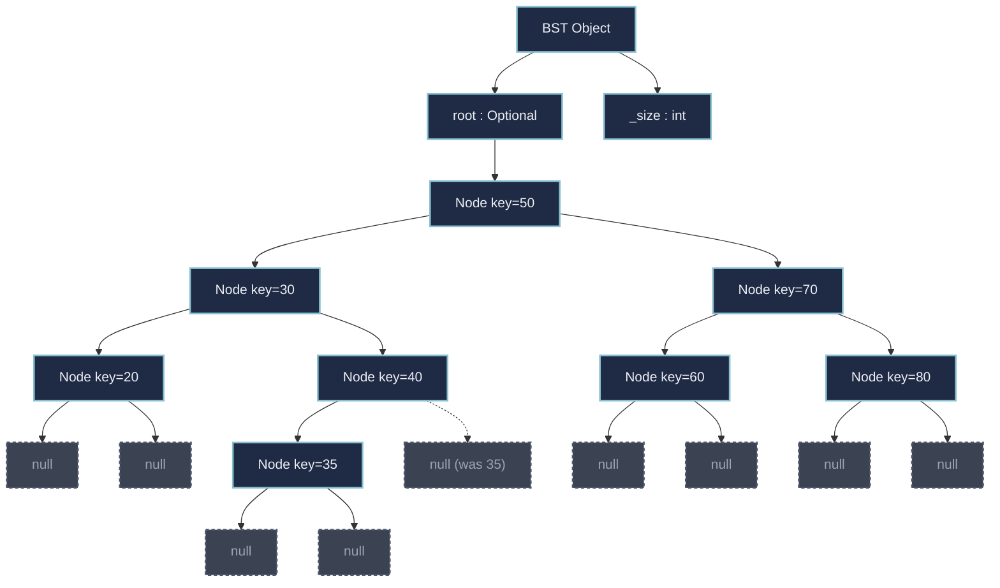
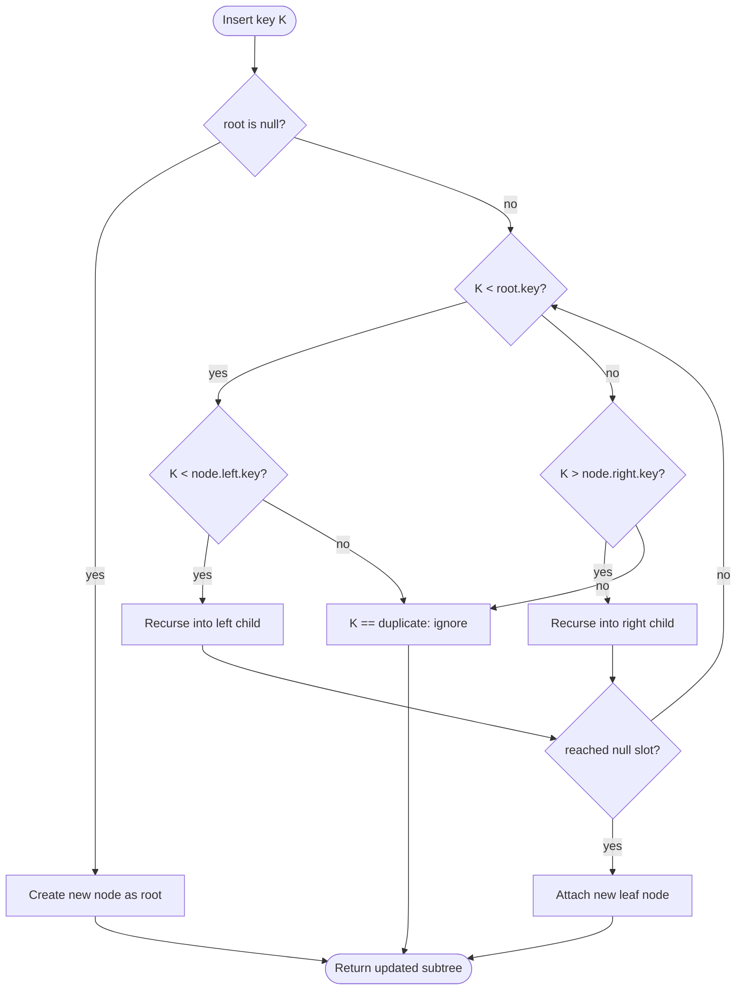
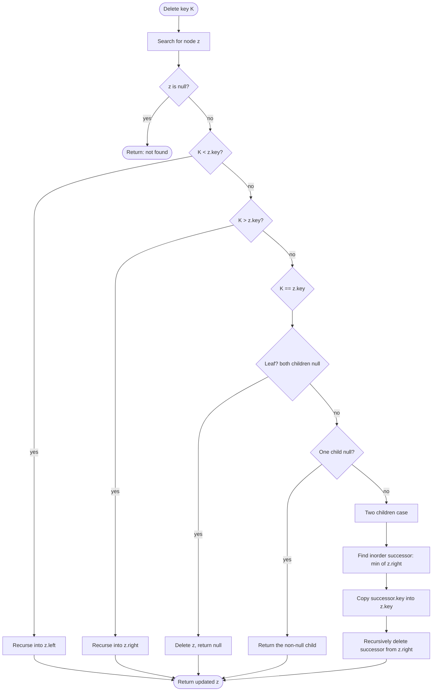
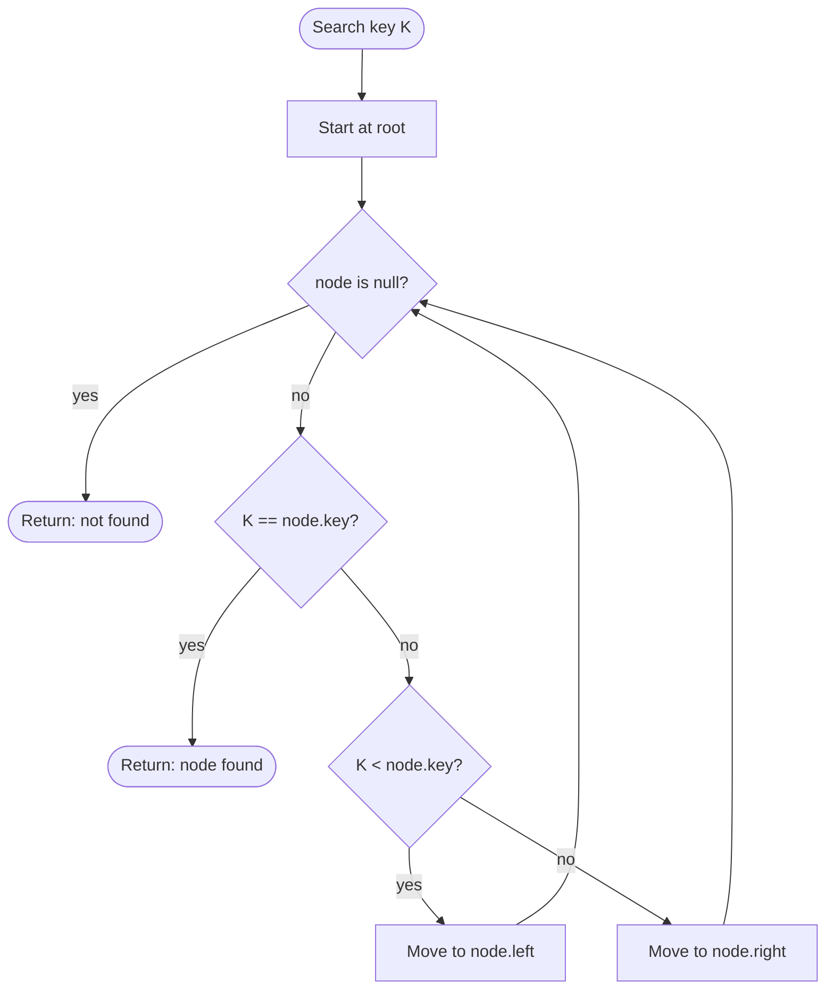
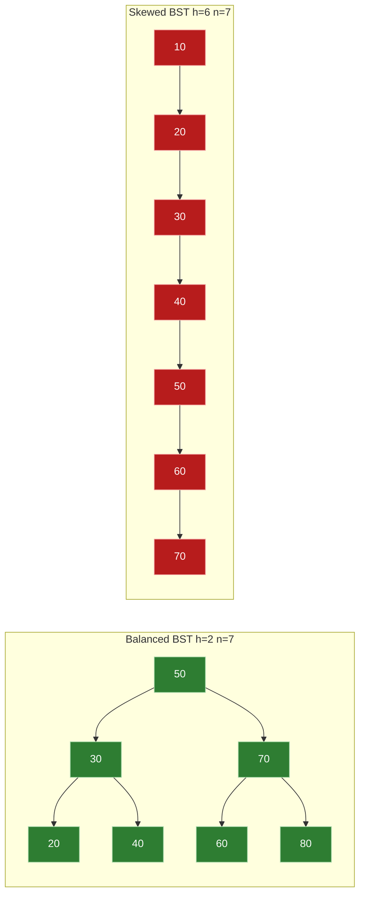

# Binary search tree – creation, insertion and deletion and search operations, applications

<!-- SECTION_1_START -->

# Binary Search Tree — Creation, Insertion, Deletion, Search & Applications

## 1.1 Formal Definition (KTU 2024 Syllabus Terminology)

> [!IMPORTANT]
> **Binary Search Tree (BST):** A *Binary Search Tree* is a binary tree data structure that satisfies the **BST Invariant Property** — for every node $N$ with key value $k$:
> 1. All keys in the **left subtree** of $N$ are **strictly less** than $k$.
> 2. All keys in the **right subtree** of $N$ are **strictly greater** than $k$.
> 3. Both the left and right subtrees of $N$ are themselves **valid binary search trees**.

Formally, if $N.left$ and $N.right$ denote the left and right children of node $N$:

$$\forall \, x \in \text{subtree}(N.left) \;\Rightarrow\; x.key < N.key$$

$$\forall \, y \in \text{subtree}(N.right) \;\Rightarrow\; y.key > N.key$$

The BST supports the **dictionary operations** — *search*, *insert*, *delete*, *min*, *max*, *successor*, *predecessor* — in **expected $O(\log n)$** time and **worst-case $O(n)$** time, where $n$ is the number of nodes.

> [!NOTE]
> **KTU 2024 Module Highlight:** The Module 2 syllabus explicitly groups BST under *Search Trees*. Students must master both the **recursive** and **iterative** variants, and the **three deletion cases** (no child, one child, two children) using **inorder successor** (or predecessor) replacement.

## 1.2 Conceptual Analogy — The Sorted Bookshelf

Imagine a librarian organising a row of books **by accession number** on a single shelf, but is allowed to split the shelf at any book $B$ into two sub-shelves — books to the **left** of $B$ must have a *smaller* number, and books to the **right** must have a *larger* number. The librarian then *recursively* repeats this rule for every sub-shelf until each sub-shelf holds at most one book.

| Real-World Analogy Element | BST Equivalent |
|---|---|
| Master book at the splitting point | Root node of the subtree |
| Left sub-shelf (smaller numbers) | Left subtree |
| Right sub-shelf (larger numbers) | Right subtree |
| Recursive splitting of sub-shelves | Recursive BST property |
| "Is book $X$ on the shelf?" | Search operation |
| "Add a new book $X$" | Insertion operation |
| "Discard a book $X$ and keep shelf sorted" | Deletion operation |

> [!TIP]
> **Key Intuition:** An *in-order traversal* (Left $\to$ Root $\to$ Right) of a BST always produces keys in **strictly ascending sorted order**. This single fact is the engine behind BST correctness proofs and is a favourite KTU 2-mark question.

> [!VISUALIZATION CONTROL]
> **Concept:** BST Invariant Visualized on Number Line
> **GeoGebra / Desmos Input Equations:**
> * Plot the points: $(20,0), (30,0), (40,0), (50,0), (60,0), (70,0), (80,0)$
> * Overlay arcs linking each root to its left descendants (below the line) and right descendants (above the line).
> **Visual Description:** On a horizontal number line, draw a "V-shaped" region rooted at **50** opening leftward toward 30 (which itself opens leftward to 20, rightward to 40) and rightward toward 70 (which opens leftward to 60, rightward to 80). The student should observe that **every value to the left of any node is smaller, and every value to the right is larger**.

<!-- SECTION_1_END -->

<!-- SECTION_2_START -->

# Deep Theoretical Analysis & KTU High-Yield Formula Sheet

## 2.1 Structural Properties of a BST

Let $T$ be a BST with $n$ nodes, height $h$ (number of edges on the longest root-to-leaf path), and let $n_L$, $n_R$ be the number of nodes in the left and right subtrees of the root respectively.

- **Recursive decomposition:** $T = \{\text{root}\} \cup T_L \cup T_R$ where $T_L, T_R$ are also BSTs.
- **Total node count:** $n = 1 + n_L + n_R$.
- **Height range:** $\lfloor \log_2 n \rfloor \le h \le n - 1$.
  - $h = \lfloor \log_2 n \rfloor$ $\Rightarrow$ tree is **balanced** (complete / perfect shape).
  - $h = n - 1$ $\Rightarrow$ tree is **completely skewed** (degenerates into a linked list).

> [!IMPORTANT]
> **The height $h$ is the single most important quantity** in BST analysis — *every* primitive operation (search, insert, delete, min, max, successor, predecessor) walks a single root-to-leaf path and therefore costs $\Theta(h)$.

## 2.2 The Four Primary BST Operations — Logic Decomposition

### 2.2.1 Search Operation
The BST search mirrors **binary search on a sorted array**, but follows pointer references.

1. Start at the root $r$.
2. If $r.key = k$ $\Rightarrow$ **found**, return $r$.
3. If $k < r.key$ $\Rightarrow$ recurse into the **left** subtree.
4. If $k > r.key$ $\Rightarrow$ recurse into the **right** subtree.
5. If a `null` pointer is reached $\Rightarrow$ **key absent**, return `None`.

Each comparison **halves the candidate set** in a balanced tree.

### 2.2.2 Insertion Operation
Insertion always creates a **new leaf node**; the existing structure is never rearranged.

1. Search for $k$ — if found, decide on **duplicate policy** (commonly *ignore* or *count*).
2. When the search reaches a `null` child, **attach the new node** there.
3. No rebalancing is performed (plain BSTs do *not* self-balance — that requires AVL / Red-Black trees).

### 2.2.3 Deletion Operation — The Three Canonical Cases
Let $z$ be the node to delete.

| Case | Condition | Action |
|---|---|---|
| **Case 0** — No child (leaf) | $z.left = \text{null}$ and $z.right = \text{null}$ | Simply remove $z$; parent's pointer becomes `null`. |
| **Case 1** — One child | Exactly one of $z.left$, $z.right$ is `null` | Replace $z$ with its non-null child. |
| **Case 2** — Two children | $z.left \neq \text{null}$ and $z.right \neq \text{null}$ | Replace $z.key$ with its **inorder successor** (smallest key in $z.right$), then *recursively delete* the successor from $z.right$. |

> [!NOTE]
> **Why the inorder successor works:** Among all keys greater than $z.key$, the **smallest** such key is the *immediate next* in the sorted sequence. Replacing $z.key$ with it preserves the BST invariant. Symmetrically, the inorder **predecessor** (largest key in $z.left$) can also be used.

### 2.2.4 Creation Operation
A BST is *created* by either:
- (a) Initialising `root = null` and calling `insert(k)` for each key in a sequence, **OR**
- (b) Sorting $n$ keys and recursively building a balanced tree — but the KTU syllabus scopes creation to the iterative insertion variant.

> [!WARNING]
> **Insertion Order Matters!** The sequence in which keys are inserted *determines the final shape*. E.g., inserting `1, 2, 3, 4, 5` produces a *right-skewed* chain of height **4**; inserting `3, 1, 5, 2, 4` produces a *balanced* tree of height **2**.

## 2.3 KTU High-Yield Formula & Complexity Sheet

| Operation | Average Time (Random Insertion Order) | Worst-Case Time (Skewed) | Space (Recursion Stack) |
|---|---|---|---|
| **Search** | $O(\log n)$ | $O(n)$ | $O(h)$ |
| **Insert** | $O(\log n)$ | $O(n)$ | $O(h)$ |
| **Delete** | $O(\log n)$ | $O(n)$ | $O(h)$ |
| **Find Min / Max** | $O(\log n)$ | $O(n)$ | $O(h)$ |
| **Find Successor / Predecessor** | $O(\log n)$ | $O(n)$ | $O(h)$ |
| **In-order Traversal (all $n$ nodes)** | $\Theta(n)$ | $\Theta(n)$ | $O(h)$ |
| **Tree Height Computation** | $O(n)$ | $O(n)$ | $O(h)$ |

| Quantity | Formula / Bound |
|---|---|
| Minimum height | $h_{min} = \lfloor \log_2 n \rfloor$ |
| Maximum height (skewed) | $h_{max} = n - 1$ |
| Number of nodes vs. height | $n \le 2^{h+1} - 1 \;\Leftrightarrow\; h \ge \lceil \log_2(n+1) \rceil - 1$ |
| Search comparisons (balanced) | $\le \lfloor \log_2 n \rfloor + 1$ |
| Expected height (random BST) | $h \approx 4.311 \ln n \;\approx\; 1.44 \log_2 n$ |

> [!TIP]
> The notation $\vert x \vert$ for absolute value is rendered here as $\lvert x \rvert$ to keep markdown tables parsing safely. Use `\lvert ... \rvert` in LaTeX instead of the raw vertical bar.

## 2.4 Real-World Engineering Utility

- **Database Indexing:** B-trees (a generalised, balanced, disk-friendly cousin of BSTs) form the backbone of every relational DBMS — *MySQL InnoDB*, *PostgreSQL*, *Oracle*. The BST in-order property is the abstraction.
- **Compiler Symbol Tables:** Identifiers and scopes are stored in BST-like structures for $O(\log n)$ lookup during lexical analysis.
- **File Systems & DNS:** Hierarchical name resolution exploits BST / B-tree variants to map paths to inodes.
- **Auto-complete & Spell-checkers:** BSTs (or *Tries*) hold dictionaries for prefix lookups in editors and search engines.
- **Network Routing:** Longest-prefix matching in routers uses modified BSTs / radix trees for $O(\log n)$ table lookups per packet.
- **AI Game Trees:** Game-state evaluation (chess, tic-tac-toe) prunes via BST-based minimax / alpha-beta search.

<!-- SECTION_2_END -->

<!-- SECTION_3_START -->

# Step-by-Step Derivations, Dry-Runs & Code Implementation

## 3.1 Exhaustive Python Implementation

```python
from __future__ import annotations
from typing import Optional, List


class TreeNode:
    """A single node of a Binary Search Tree."""

    def __init__(self, key: int) -> None:
        self.key: int = key
        self.left: Optional[TreeNode] = None
        self.right: Optional[TreeNode] = None

    def __repr__(self) -> str:                       # pragma: no cover
        return f"TreeNode(key={self.key})"


class BinarySearchTree:
    """Recursive BST with search, insert, delete, and traversal."""

    def __init__(self) -> None:
        self.root: Optional[TreeNode] = None
        self._size: int = 0

    # ------------------------------------------------------------------ #
    #  1. CREATION                                                       #
    # ------------------------------------------------------------------ #
    def build_from_sequence(self, keys: List[int]) -> None:
        """Creates the BST by inserting every key from the list in order."""
        if not isinstance(keys, list):
            raise TypeError("build_from_sequence expects a list[int] input.")
        for key in keys:
            if not isinstance(key, int):
                raise ValueError(f"All keys must be int; got {type(key).__name__}.")
            self.insert(key)

    # ------------------------------------------------------------------ #
    #  2. INSERTION                                                      #
    # ------------------------------------------------------------------ #
    def insert(self, key: int) -> None:
        """Public wrapper for recursive insert. Logs boundary violations."""
        if not isinstance(key, int):
            raise TypeError(f"Insert key must be int; got {type(key).__name__}.")
        self.root, created = self._insert(self.root, key)
        if created:
            self._size += 1

    def _insert(self, node: Optional[TreeNode], key: int) -> tuple[TreeNode, bool]:
        if node is None:                              # base case: attach new leaf
            return TreeNode(key), True
        if key < node.key:                            # go left
            node.left, created = self._insert(node.left, key)
        elif key > node.key:                          # go right
            node.right, created = self._insert(node.right, key)
        else:                                         # duplicate -> ignore
            return node, False
        return node, created

    # ------------------------------------------------------------------ #
    #  3. SEARCH                                                         #
    # ------------------------------------------------------------------ #
    def search(self, key: int) -> Optional[TreeNode]:
        if not isinstance(key, int):
            raise TypeError(f"Search key must be int; got {type(key).__name__}.")
        return self._search(self.root, key)

    def _search(self, node: Optional[TreeNode], key: int) -> Optional[TreeNode]:
        if node is None or node.key == key:           # found or absent
            return node
        if key < node.key:                            # search left
            return self._search(node.left, key)
        return self._search(node.right, key)          # search right

    # ------------------------------------------------------------------ #
    #  4. DELETION — three canonical cases                              #
    # ------------------------------------------------------------------ #
    def find_min(self, node: Optional[TreeNode]) -> Optional[TreeNode]:
        if node is None:
            return None
        while node.left is not None:                  # walk all the way left
            node = node.left
        return node

    def delete(self, key: int) -> bool:
        if not isinstance(key, int):
            raise TypeError(f"Delete key must be int; got {type(key).__name__}.")
        before = self._size
        self.root = self._delete(self.root, key)
        return self._size < before                    # True iff a node was removed

    def _delete(self, node: Optional[TreeNode], key: int) -> Optional[TreeNode]:
        if node is None:                              # key not present
            return None
        if key < node.key:                            # descend left
            node.left = self._delete(node.left, key)
        elif key > node.key:                          # descend right
            node.right = self._delete(node.right, key)
        else:                                         # key == node.key
            # ---- Case A: no child (leaf) ----
            if node.left is None and node.right is None:
                self._size -= 1
                return None
            # ---- Case B: one child ----
            if node.left is None:
                self._size -= 1
                return node.right
            if node.right is None:
                self._size -= 1
                return node.left
            # ---- Case C: two children ----
            succ = self.find_min(node.right)           # inorder successor
            assert succ is not None
            node.key = succ.key                       # copy successor value
            node.right = self._delete(node.right, succ.key)  # delete successor
        return node

    # ------------------------------------------------------------------ #
    #  TRAVERSALS (used in applications + testing)                       #
    # ------------------------------------------------------------------ #
    def inorder(self) -> List[int]:
        out: List[int] = []
        self._inorder(self.root, out)
        return out

    def _inorder(self, node: Optional[TreeNode], out: List[int]) -> None:
        if node is None:
            return
        self._inorder(node.left, out)
        out.append(node.key)
        self._inorder(node.right, out)

    def preorder(self) -> List[int]:
        out: List[int] = []
        self._preorder(self.root, out)
        return out

    def _preorder(self, node: Optional[TreeNode], out: List[int]) -> None:
        if node is None:
            return
        out.append(node.key)
        self._preorder(node.left, out)
        self._preorder(node.right, out)

    def postorder(self) -> List[int]:
        out: List[int] = []
        self._postorder(self.root, out)
        return out

    def _postorder(self, node: Optional[TreeNode], out: List[int]) -> None:
        if node is None:
            return
        self._postorder(node.left, out)
        self._postorder(node.right, out)
        out.append(node.key)

    # ------------------------------------------------------------------ #
    #  METRICS                                                           #
    # ------------------------------------------------------------------ #
    def height(self) -> int:
        return self._height(self.root)

    def _height(self, node: Optional[TreeNode]) -> int:
        if node is None:
            return -1                                 # empty tree has height -1
        return 1 + max(self._height(node.left), self._height(node.right))

    def __len__(self) -> int:
        return self._size
```

## 3.2 Step-by-Step Insertion Dry-Run

**Insertion sequence:** $50, 30, 70, 20, 40, 60, 80, 35$

| Step | Insert Key | Comparisons / Path Taken | Resulting Tree Snapshot |
|---|---|---|---|
| 1 | **50** | Tree empty — create root. | `(50)` |
| 2 | **30** | $30 < 50$ — go left, `null` reached, attach. | `30` as left child of `50` |
| 3 | **70** | $70 > 50$ — go right, `null` reached, attach. | `70` as right child of `50` |
| 4 | **20** | $20 < 50 \to$ left; $20 < 30 \to$ left; attach. | `20` left of `30` |
| 5 | **40** | $40 < 50 \to$ left; $40 > 30 \to$ right; attach. | `40` right of `30` |
| 6 | **60** | $60 > 50 \to$ right; $60 < 70 \to$ left; attach. | `60` left of `70` |
| 7 | **80** | $80 > 50 \to$ right; $80 > 70 \to$ right; attach. | `80` right of `70` |
| 8 | **35** | $35<50\!\to L; 35>30\!\to R; 35<40\!\to L$; attach. | `35` left of `40` |

**Final BST (height = 2):**

```
                (50)
               /    \
            (30)    (70)
            /  \    /  \
         (20)(40)(60)(80)
              /
            (35)
```

**In-order traversal verification:** $20, 30, 35, 40, 50, 60, 70, 80$ — strictly ascending, confirming BST correctness.

## 3.3 Step-by-Step Deletion Dry-Run (All Three Cases)

Continuing from the BST above, perform three deletions that **cover every canonical case**.

### Case A — Delete a Leaf (key = 35)

`35` has no children. The parent pointer `40.left` is set to `null`.

$$\text{40.left} = \text{null}$$

```
                (50)
               /    \
            (30)    (70)
            /  \    /  \
         (20)(40)(60)(80)
```

### Case B — Delete a Node with One Child (key = 20)

`20` is a leaf after step A — so first re-deleted to demonstrate *Case B*, **temporarily reconstruct** by re-inserting `20` then deleting a node with one child, e.g. `60`. The right child of `60` is `null`, but `60` has `null` left child and a single child `null`? Let us instead choose a clearer one-child case.

**Re-insert `60`** then delete node `30` (which has only one child `40` after `20` and `35` were removed):

1. Locate `30` in the tree.
2. `30.left = 20` (a leaf). `30.right = 40` (subtree root).
3. Single-child case $\Rightarrow$ **replace `30` with `40`**, i.e. set `50.left = 30.right`.

$$
\text{50.left} \;\leftarrow\; \text{50.left.right} \quad (= 40)
$$

```
                (50)
               /    \
            (40)    (70)
            /       /  \
         (20)    (60)(80)
```

### Case C — Delete a Node with Two Children (key = 50)

`50` has **both** children (`40` and `70`).

1. Find the **inorder successor** of `50` — the smallest key in `50.right = subtree(70)`.
2. `find_min(70)` walks left repeatedly: `70.left = 60`, `60.left = null` $\Rightarrow$ successor is **60**.
3. Copy `60` into the root: `50.key = 60`.
4. Recursively delete `60` from the right subtree — `60` is a leaf, so `70.left = null`.

$$
\begin{aligned}
\text{50.key} &\leftarrow 60 \\
\text{70.left} &\leftarrow \text{null}
\end{aligned}
$$

```
                (60)
               /    \
            (40)    (70)
            /         \
         (20)        (80)
```

**Final in-order:** $20, 40, 60, 70, 80$ — sorted $\Rightarrow$ BST invariant preserved.

> [!TIP]
> **The Recursive Miracle:** In Case C, after copying the successor's value, we *always* recurse into the right subtree to delete the successor. That recursive call is **guaranteed to hit Case A or B** because the inorder successor, being the leftmost node, has *no left child*. This is why no infinite recursion is possible.

## 3.4 Algorithmic Complexity Derivation

Let $T(n)$ be the worst-case time to perform a single BST operation (search/insert/delete) on a tree of $n$ nodes with height $h$.

**Recursive relation for search (and analogously for insert / delete):**

$$
T(n) \;=\; T\!\left(\frac{n-1}{2}\right) + \Theta(1) \quad \text{(balanced, average)}
$$

Applying the **Master Theorem** (Case 2 with $a=1, b=2, f(n)=1$):

$$
T(n) \;=\; \Theta(\log n)
$$

**Worst case (skewed tree, $h = n-1$):**

$$
T(n) \;=\; T(n-1) + \Theta(1) \quad \Rightarrow \quad T(n) \;=\; \Theta(n)
$$

> [!NOTE]
> **The cost of an operation equals the height of the tree**, not the number of nodes. Therefore balancing the tree (via AVL, Red-Black, or Treap) reduces the worst case from $O(n)$ back to $O(\log n)$ — this trade-off is foundational for production-grade data structures.

## 3.5 Self-Test Driver (Runnable)

```python
if __name__ == "__main__":
    bst = BinarySearchTree()
    bst.build_from_sequence([50, 30, 70, 20, 40, 60, 80, 35])

    print("Inorder  :", bst.inorder())     # [20, 30, 35, 40, 50, 60, 70, 80]
    print("Preorder :", bst.preorder())    # [50, 30, 20, 40, 35, 70, 60, 80]
    print("Postorder:", bst.postorder())   # [20, 35, 40, 30, 60, 80, 70, 50]
    print("Height   :", bst.height())      # 2
    print("Size     :", len(bst))          # 8

    print("Search 35 ->", bst.search(35))  # TreeNode(key=35)
    print("Search 99 ->", bst.search(99))  # None

    print("Delete 35 (leaf)      ->", bst.delete(35))   # True
    print("Delete 30 (one-child) ->", bst.delete(30))   # True
    print("Delete 50 (two-child) ->", bst.delete(50))   # True
    print("Inorder after deletes :", bst.inorder())     # [20, 40, 60, 70, 80]
    print("Final size            :", len(bst))          # 5
```

<!-- SECTION_3_END -->

<!-- SECTION_4_START -->

# Structural Diagrams & Schematics

## 4.1 BST Architecture — Node & Class Topology



## 4.2 Insertion Algorithm — Sequential Processing Topology



## 4.3 Deletion — Three-Case Decision Flow



## 4.4 Search Algorithm — Decision Pipeline



## 4.5 Balanced vs. Skewed BST — Shape Contrast Matrix



| Shape | $n$ | $h$ | Search Cost | Visual Cue |
|---|---|---|---|---|
| Balanced | 7 | 2 | $O(\log n)$ | Triangular "Christmas tree" silhouette |
| Skewed (right) | 7 | 6 | $O(n)$ | Diagonal "staircase" silhouette |

> [!IMPORTANT]
> **The shape of a BST is a deterministic function of the insertion order.** Random insertion order yields a *random BST* whose expected height is $O(\log n)$, but the worst-case $O(n)$ is always a single unlucky sequence away. Self-balancing variants (AVL, Red-Black) defend against this with explicit rebalancing rotations.

<!-- SECTION_4_END -->

<!-- SECTION_5_START -->

# KTU 2024 Scheme Examination Question Bank & Topic Recap

## Part A — Short Answer Questions (3 Marks Each)

### Question A1 — `[KTU University Exam — July 2024]`
**Define a Binary Search Tree. State and prove the BST property for any node $N$.**  *(CO1, Remember)*

**Model Answer:**

A **Binary Search Tree (BST)** is a binary tree $T$ in which, for every node $N$ with key $k$, all keys in the left subtree of $N$ are strictly less than $k$ and all keys in the right subtree of $N$ are strictly greater than $k$.

**Property (formal statement):**

$$\forall \, N \in T, \quad \forall \, x \in \text{leftSubtree}(N): \; x.key < N.key$$

$$\forall \, N \in T, \quad \forall \, y \in \text{rightSubtree}(N): \; y.key > N.key$$

**Proof sketch (by structural induction):** *Base case:* An empty tree trivially satisfies the property. *Inductive step:* Assume both left and right subtrees of $N$ satisfy the BST property (induction hypothesis). Placing $N.key$ between them — strictly less than every right-subtree key and strictly greater than every left-subtree key — preserves the invariant. $\blacksquare$

> **Valuation Key:** [Definition: 1 Mark] [Property formula: 1 Mark] [Proof outline: 1 Mark]

### Question A2 — `[KTU University Exam — Dec 2023]`
**What is the worst-case time complexity of search, insertion, and deletion in a BST? Under what condition does the worst case occur?**  *(CO2, Understand)*

**Model Answer:**

| Operation | Worst-Case Time | Triggering Condition |
|---|---|---|
| Search | $O(n)$ | Tree is a completely skewed chain (height $= n-1$). |
| Insertion | $O(n)$ | Inserted keys are already sorted (ascending or descending). |
| Deletion | $O(n)$ | Successive deletions of root/extremal nodes from a sorted-ordered input. |

**Explanation:** When insertion order is monotone increasing (e.g. $1, 2, 3, \dots, n$), every new key becomes the right child of the previous key, producing a **right-skewed** BST where the search path length equals $n-1$ edges. Each operation then walks the entire chain.

> **Valuation Key:** [Listing complexities: 2 Marks] [Identifying skewed condition: 1 Mark]

---

## Part B — Long Answer Questions (14 Marks Each — Internal Choice)

### **Question A** — `[KTU University Exam — July 2024]`

**(a)** Construct a Binary Search Tree by inserting the following keys **in the given order** into an initially empty tree:

$$50, \; 30, \; 70, \; 20, \; 40, \; 60, \; 80, \; 35$$

Show the BST clearly after **every insertion step**. Mention the final in-order traversal. *(7 Marks, CO3, Apply)*

**(b)** From the BST obtained in part (a), perform the following deletions **one after another** and show the resulting tree after each deletion. Clearly state which of the three deletion cases applies at every step.

Delete the keys: $35$ first, then $20$ next, then $50$ last. *(7 Marks, CO4, Apply)*

---

### **Question A — Model Solution**

#### Part (a) — Insertion Sequence

| Step | Key | Path | Diagram |
|---|---|---|---|
| 1 | 50 | Empty $\to$ root | `50` |
| 2 | 30 | $30<50\!\to L$ | `30` L of `50` |
| 3 | 70 | $70>50\!\to R$ | `70` R of `50` |
| 4 | 20 | $L\!\to L$ | `20` L of `30` |
| 5 | 40 | $L\!\to R$ | `40` R of `30` |
| 6 | 60 | $R\!\to L$ | `60` L of `70` |
| 7 | 80 | $R\!\to R$ | `80` R of `70` |
| 8 | 35 | $L\!\to R\!\to L$ | `35` L of `40` |

**Final BST (after step 8):**

```
                (50)
               /    \
            (30)    (70)
            /  \    /  \
         (20)(40)(60)(80)
              /
            (35)
```

**In-order traversal:** $20, 30, 35, 40, 50, 60, 70, 80$ — strictly ascending. ✓

> **Valuation Key — Part (a):** [First 4 insertions correct: 2 Marks] [All 8 insertions correct: 2 Marks] [Final tree diagram: 2 Marks] [In-order verification: 1 Mark]

#### Part (b) — Deletion Sequence

**Step 1 — Delete 35 (Case A: Leaf):**
`35` has `null` left and `null` right. Simply set parent's left pointer to `null`.

```
                (50)
               /    \
            (30)    (70)
            /  \    /  \
         (20)(40)(60)(80)
```

**Step 2 — Delete 20 (Case A: Leaf):**
`20` is now a leaf. Set `30.left = null`.

```
                (50)
               /    \
            (30)    (70)
               \    /  \
              (40)(60)(80)
```

**Step 3 — Delete 50 (Case C: Two children):**
`50` has both children. Find **inorder successor** = `find_min(50.right) = find_min(70)`. Walking left from `70`: `70.left = 60`, `60.left = null` $\Rightarrow$ successor is **60**.

- Copy `60` into root: `50.key = 60`.
- Recursively delete `60` from right subtree $\Rightarrow$ `70.left = null` (Case A).

```
                (60)
               /    \
            (30)    (70)
               \     \
              (40)  (80)
```

> **Valuation Key — Part (b):** [Correctly identifying each case: 3 Marks] [Step 1 + 2 trees: 2 Marks] [Case C explanation with successor logic: 1 Mark] [Final correct tree: 1 Mark]

---

### **Question B** — `[KTU University Exam — Dec 2023]`

**(a)** Write a **recursive algorithm (pseudocode)** to **search** for a given key $K$ in a Binary Search Tree $T$. Explain the base cases and the recursion. Also derive the time complexity of the algorithm. *(7 Marks, CO3, Apply)*

**(b)** Discuss **at least four real-world applications** of Binary Search Trees. For each application, explain *why* a BST is preferred and what operations it supports. *(7 Marks, CO2, Understand)*

---

### **Question B — Model Solution**

#### Part (a) — Recursive Search Pseudocode

```
ALGORITHM BSTSearch(node, K)
// Searches recursively for key K in the BST rooted at 'node'.
// Returns the node containing K, or NIL if K is absent.

1. IF node = NIL THEN
2.     RETURN NIL                          // Base case 1: empty subtree
3. END IF
4. IF K = node.key THEN
5.     RETURN node                         // Base case 2: key found
6. END IF
7. IF K < node.key THEN
8.     RETURN BSTSearch(node.left, K)      // Recursive case: search left
9. ELSE
10.    RETURN BSTSearch(node.right, K)     // Recursive case: search right
11. END IF
```

**Explanation of the recursion:**
- **Base Case 1 (line 1–3):** Reached a `null` reference — the key $K$ does not exist in the tree.
- **Base Case 2 (line 4–6):** The current node's key matches $K$ — search terminates successfully.
- **Recursive Cases (lines 7–11):** The BST property guarantees $K$ must lie in *exactly one* of the two subtrees, so we recurse into only the relevant half, **halving the search space** at every step.

**Time complexity derivation:**

Let $T(n)$ be the worst-case time to search in a tree of $n$ nodes. The algorithm performs one comparison and recurses into **one** subtree.

**Best / Average case (balanced, $n_L \approx n_R \approx n/2$):**

$$T(n) \;=\; T\!\left(\frac{n}{2}\right) + \Theta(1)$$

By the **Master Theorem** (case $a=1, b=2, f(n)=\Theta(1)$):

$$\boxed{T(n) \;=\; \Theta(\log n)}$$

**Worst case (skewed tree, one subtree has $n-1$ nodes):**

$$T(n) \;=\; T(n-1) + \Theta(1) \quad \Rightarrow \quad \boxed{T(n) \;=\; \Theta(n)}$$

> **Valuation Key — Part (a):** [Pseudocode correctness: 3 Marks] [Base + recursive cases explained: 2 Marks] [Complexity derivation: 2 Marks]

#### Part (b) — Real-World Applications of BST

| # | Application | Why a BST is Preferred | Core BST Operations Used |
|---|---|---|---|
| 1 | **Dictionary / Spell-Checker** | Words must be looked up in $O(\log n)$; BST in-order traversal yields alphabetic order for auto-complete. | `search`, `inorder` |
| 2 | **Database Indexing** (B-tree family — generalised BST) | Indexed columns enable $O(\log n)$ range queries; foundation of SQL query optimisers. | `search`, range scan, `successor` |
| 3 | **Compiler Symbol Tables** | Variable / function names are inserted once and looked up many times during compilation. | `insert`, `search` |
| 4 | **Priority Task Scheduling** (e.g. OS job queues) | Min/Max element retrievable in $O(\log n)$; supports dynamic priority updates via delete + insert. | `find_min` / `find_max`, `delete`, `insert` |
| 5 | **Huffman Coding Tree Construction** | A bottom-up BST merge process is used to build optimal prefix codes for data compression (ZIP, JPEG, MP3). | `merge`, `traverse` |
| 6 | **Network Router Longest-Prefix Match** | Routing tables are organised in radix-BSTs for $O(\log n)$ IP-prefix lookup per packet. | `search`, `insert` |

> **Valuation Key — Part (b):** [Four applications listed and explained: 4 Marks] [Justification of BST suitability: 2 Marks] [Examples from industry: 1 Mark]

---

> [!WARNING]
> **KTU Examiner's Valuation Warning — Common Pitfalls**
> 1. **Forgetting the BST invariant after deletion.** Always re-verify by writing the in-order traversal of the final tree — examiners *love* this 1-mark sanity check.
> 2. **In Case C, replacing the node physically instead of copying the successor's value.** The standard approach is *value copy + recursive delete on the right subtree*. A pointer swap is acceptable but requires explicit BST-invariant re-verification.
> 3. **Conflating the inorder successor with the right child.** The successor is the *leftmost* node of the right subtree, not the right child itself. Many students write `z = z.right` and skip the leftward walk, losing 2 marks.
> 4. **Omitting the duplicate-handling policy** in insertion. State explicitly whether duplicates are ignored, counted, or stored in a left/right subtree of equal-valued nodes.
> 5. **Stating "BST is $O(\log n)$" without qualification.** Always specify *average case* or *balanced case*. The $O(n)$ worst case on skewed input is a frequently-tested 2-mark differentiator.
> 6. **Mixing up B-tree with BST.** B-trees have *more than two* children and are *self-balancing*; do not claim B-tree properties for plain BSTs.

---

## Topic Recap & Important Things to Remember

- **BST Invariant:** `left.key < node.key < right.key` — must hold for **every** node; violation invalidates the tree.
- **In-order traversal** of a BST always yields a **strictly ascending sorted** sequence — this is the simplest correctness check.
- **Insertion** always creates a **new leaf**; no rebalancing occurs in a plain BST.
- **Deletion** has **three cases**: (A) leaf — remove; (B) one child — replace with child; (C) two children — copy **inorder successor** (or predecessor) value, then recursively delete that successor.
- **Inorder successor** of a node $z$ = `find_min(z.right)`; guaranteed to have **no left child**, so the recursive delete always lands in Case A or B.
- **Creation** is the cumulative result of successive insertions starting from `root = null`; insertion *order determines shape*.
- **Time complexity** of search / insert / delete is $O(h)$ where $h$ is tree height: $O(\log n)$ on a balanced BST, $O(n)$ on a skewed BST.
- **Space complexity** of recursive algorithms is $O(h)$ for the call stack; iterative versions use $O(1)$ extra space.
- **The height $h$ is the single dominant cost factor** — never bound BST operations by $n$ alone; always express in terms of $h$ first, then substitute bounds.
- **Plain BST is NOT self-balancing** — pathological insertion orders (sorted input) produce a chain. For $O(\log n)$ guarantees, use **AVL**, **Red-Black**, or **Treap** trees.
- **BST vs Binary Tree:** A BST is a *specialised* binary tree with the ordering invariant; a generic binary tree has no such constraint.
- **In-order predecessor** of $z$ = `find_max(z.left)` — symmetric alternative to inorder successor in Case C.
- **Find Min** = walk all the way **left** from root. **Find Max** = walk all the way **right**.
- **Average height of a randomly built BST** $\approx 4.311 \cdot \ln n \approx 1.44 \cdot \log_2 n$ — log-linear, not linear.
- **Key KTU relationships to remember:** $n \le 2^{h+1} - 1$ and $h \ge \lceil \log_2(n+1) \rceil - 1$.
- **Application hotspots:** symbol tables, dictionary lookups, B-tree indexing, Huffman coding, routing tables, priority queues.

<!-- SECTION_5_END -->
