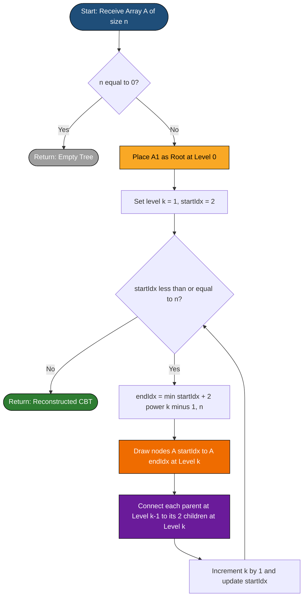
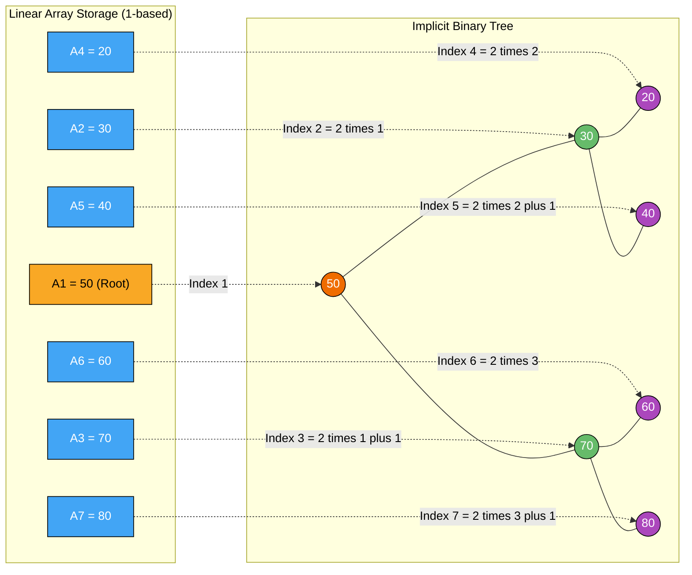

# complete-binary tree representation using array

<!-- SECTION_1_START -->
# Complete Binary Tree Representation Using Array

## 1.1 Formal Academic Definition

A **Complete Binary Tree (CBT)** is a binary tree in which every level of the tree is completely filled, except possibly the last level, which is filled from **left to right** without any gaps. When such a tree is stored in a linear, contiguous memory structure (an **array**), the mapping between tree nodes and array indices follows a strict, deterministic formula derived from the heap-ordering property of a perfect binary tree.

> [!IMPORTANT]
> **KTU 2024 Syllabus Definition:** A complete binary tree of depth $d$ contains exactly $2^{k}$ nodes at every level $k$ for $0 \le k < d$, and the nodes at the last level $d$ are positioned as far left as possible. Array representation leverages the implicit (pointer-free) parent–child relationship computed purely from the index.

## 1.2 Intuitive Analogy — The "Cinema Row" Model

Imagine a **cinema hall** where seats are arranged in a strict pyramidal hierarchy:

- **Row 1** has 1 seat (the Manager / Root)
- **Row 2** has 2 seats (the two Assistant Managers)
- **Row 3** has 4 seats (the Team Leads)
- **Row 4** has 8 seats (the Workers), and so on…

Each worker can find their Manager's seat number using a simple arithmetic rule on their ticket number. No "addresses" or "pointers" need to be printed on the ticket — the position itself encodes the hierarchy. The **array is the ticket roll**, and the **index is the seat number**.

> [!NOTE]
> **Why "Complete" Matters for Arrays:** The completeness property guarantees that the array has **no holes** (no `NULL` slots between valid elements). This makes contiguous memory storage both space-efficient ($O(n)$) and cache-friendly.

## 1.3 Geometric Intuition — The "Telephone Index" Mapping

Consider a perfect binary tree of height $h = 3$. If we number every node **level-by-level, left-to-right** (a process called **Breadth-First / Level-Order Traversal**), the resulting sequence is naturally sequential. Array representation simply stores this sequence in cells $1, 2, 3, \dots, n$ (1-based) or $0, 1, 2, \dots, n-1$ (0-based).

| Level | Nodes at this level | Indices (1-based) | Indices (0-based) |
| :---: | :---: | :---: | :---: |
| 0 | $2^{0} = 1$ | $1$ | $0$ |
| 1 | $2^{1} = 2$ | $2, 3$ | $1, 2$ |
| 2 | $2^{2} = 4$ | $4, 5, 6, 7$ | $3, 4, 5, 6$ |
| 3 | $2^{3} = 8$ | $8, 9, \dots, 15$ | $7, 8, \dots, 14$ |

> [!VISUALIZATION CONTROL]
> **Concept:** Implicit Array Layout of a Perfect Binary Tree
> **Desmos / GeoGebra Input Points (1-based indexing):**
> * `A = (0, 1)`, `B = (-1, 2)`, `C = (1, 2)`, `D = (-1.5, 3)`, `E = (-0.5, 3)`, `F = (0.5, 3)`, `G = (1.5, 3)`
> **Visual Description:** Plot these points on a Cartesian grid where the **x-axis** represents horizontal position and the **y-axis** represents the array index (1 at the top, growing downward). The reader should see a perfect triangular spread with no horizontal gaps — confirming the "no holes" property of completeness.

---

<!-- SECTION_1_END -->

<!-- SECTION_2_START -->
# 2. Deep Theoretical Analysis & KTU High-Yield Formula Sheet

## 2.1 Operational Logic — The Index Derivation

The array representation of a complete binary tree works because of one beautiful fact: **for a perfect tree, the level-order numbering coincides with the binary representation of the heap path**. The parent–child relationships can be derived from the following step-by-step logic.

**Step 1 — Root Placement.**
The root occupies the very first cell of the array. Conventionally (and as taught in KTU), we use **1-based indexing** so that all subsequent formulas involve only integer division and multiplication (avoiding fractions).

$$\text{root} \rightarrow A[1]$$

**Step 2 — Child Index Formula.**
If a parent node is stored at index $i$, then:
- The **left child** occupies index $2i$
- The **right child** occupies index $2i + 1$

This is because before processing level $k$, the array has $2^{k} - 1$ entries. The first node of level $k$ gets index $2^{k}$, and the next gets $2^{k} + 1$, etc. Every parent at level $k$ sits between $2^{k-1}$ and $2^{k} - 1$, and multiplying by 2 shifts it to the correct child slot at level $k+1$.

**Step 3 — Parent Index Formula.**
Conversely, to find the parent of a node at index $i$ (where $i > 1$), we use **integer (floor) division**:

$$\text{parent}(i) = \left\lfloor \dfrac{i}{2} \right\rfloor$$

**Step 4 — Sibling / Leaf Detection.**
- A node $i$ is a **leaf** if $2i > n$ (no left child exists).
- A node $i$ is an **internal node** if $2i \le n$.
- The right sibling of node $i$ is at $i + 1$ when $i$ is even (i.e., $i$ is a left child).

**Step 5 — 0-Based Conversion.**
Many programming languages (C, Java, Python) use 0-based arrays. The same logic applies with a shift:

| Relation | 1-based | 0-based |
| :--- | :---: | :---: |
| Left child of $i$ | $2i$ | $2i + 1$ |
| Right child of $i$ | $2i + 1$ | $2i + 2$ |
| Parent of $i$ | $\lfloor i / 2 \rfloor$ | $\lfloor (i - 1) / 2 \rfloor$ |

## 2.2 KTU Formula Sheet / Cheat Sheet

| Concept | Formula (1-based) | Formula (0-based) | Boundary Condition | Unit / Type |
| :--- | :---: | :---: | :--- | :---: |
| Root index | $1$ | $0$ | Always exists if $n \ge 1$ | index |
| Left child | $\text{LEFT}(i) = 2i$ | $2i + 1$ | Valid only if $2i \le n$ | index |
| Right child | $\text{RIGHT}(i) = 2i + 1$ | $2i + 2$ | Valid only if $2i + 1 \le n$ | index |
| Parent | $\lfloor i / 2 \rfloor$ | $\lfloor (i-1) / 2 \rfloor$ | Valid only if $i > 1$ (1-based) or $i > 0$ | index |
| Leaves range | $\lfloor n/2 \rfloor + 1$ to $n$ | $\lfloor n/2 \rfloor$ to $n-1$ | 1-based: $\lfloor n/2 \rfloor$ nodes are internal | indices |
| Max nodes at level $k$ | $2^{k}$ | $2^{k}$ | $k \in [0, h-1]$ for full levels | count |
| Max nodes in tree of height $h$ | $2^{h+1} - 1$ | $2^{h+1} - 1$ | Strictly complete | count |
| Min nodes for height $h$ | $2^{h}$ | $2^{h}$ | Last level has exactly 1 node | count |
| Space complexity | $O(n)$ | $O(n)$ | Worst case (skewed-like fill) | bytes |

> [!IMPORTANT]
> **KTU Examiner's Note on `|` Symbol:** When writing $|x|$ (absolute value) or set cardinality inside prose, use $\vert x \vert$ in LaTeX. Never use the bare pipe `|` — it breaks markdown table rendering.

## 2.3 Real-World Engineering Utility

Array representation of complete binary trees is **not a theoretical curiosity** — it powers the most-used data structure in production systems:

1. **Binary Heaps (Priority Queues):** Python's `heapq`, Java's `PriorityQueue`, and C++'s `std::priority_queue` are all array-backed complete binary trees. **Dijkstra's shortest-path algorithm** and **Huffman coding** depend on this layout for $O(\log n)$ operations.
2. **Heap Sort:** An in-place $O(n \log n)$ sorting algorithm that uses the array representation to avoid pointer overhead.
3. **Segment Trees & Fenwick Trees:** Used in competitive programming and database indexing, both rely on the parent/child index formulas for $O(\log n)$ range queries.
4. **Operating System Schedulers:** Linux kernel's Completely Fair Scheduler (CFS) uses a red-black tree, but the conceptual parent of these designs is the array-backed heap.
5. **Disjoint Set Union (DSU) with path compression:** Although implemented with arrays, the implicit-tree navigation draws inspiration from this index arithmetic.

---

<!-- SECTION_2_END -->

<!-- SECTION_3_START -->
# 3. Step-by-Step Derivations & Code/Symbolic Implementation

## 3.1 Mathematical Derivation — From Tree Structure to Index Formula

### Derivation of the Left-Child Index Formula

**Given:** A complete binary tree of $n$ nodes, stored 1-based in array $A[1 \dots n]$, where the root occupies $A[1]$.

**To Prove:** The left child of a node at index $i$ is stored at index $2i$.

**Proof (by Induction on Level):**

**Base Case (Level 0):** The root is at index $1$. Its left child (the first node of level 1) should occupy the first index of level 1, which is index $2$. So:

$$\text{LEFT}(1) = 2 \cdot 1 = 2 \quad \checkmark$$

**Inductive Step:** Assume a node at level $k$ and index $i$ (where $2^{k-1} \le i < 2^{k}$). The first index of level $k$ is $2^{k-1}$, and the last is $2^{k} - 1$. The node at index $i$ has:

$$\text{Number of nodes to its left at level } k = i - 2^{k-1}$$

Its left child is the first child on level $k+1$ belonging to this parent. The first index of level $k+1$ is $2^{k}$. So the left child sits at:

$$2^{k} + 2 \cdot \left(i - 2^{k-1}\right) = 2^{k} + 2i - 2^{k} = 2i \quad \blacksquare$$

**Verification of Right Child:** The right child immediately follows the left child in level-order:

$$\text{RIGHT}(i) = \text{LEFT}(i) + 1 = 2i + 1 \quad \blacksquare$$

### Worked Example: Locating the Parent of a Node

**Problem:** In a complete binary tree with 10 nodes stored 1-based, find the parent of the node at index $9$.

**Step 1:** Identify the formula.

$$\text{parent}(i) = \left\lfloor \dfrac{i}{2} \right\rfloor$$

**Step 2:** Substitute $i = 9$.

$$\text{parent}(9) = \left\lfloor \dfrac{9}{2} \right\rfloor = \lfloor 4.5 \rfloor = 4$$

**Step 3:** Verify structurally. The node at index $9$ is at level $3$ (since $8 \le 9 \le 15$). Its parent must be at level $2$, occupying the index such that $2 \cdot \text{parent} = 8$ (left child) or $2 \cdot \text{parent} + 1 = 9$ (right child). Solving $2 \cdot \text{parent} + 1 = 9$ gives $\text{parent} = 4$. ✓

## 3.2 Python Implementation — Pointer-Free CBT with Full Type Hints

The following Python module implements a complete binary tree backed by a Python `list` (dynamic array). It demonstrates insertion, parent/child navigation, level-order traversal, and boundary-safe access — the exact operations examined in KTU practical labs.

```python
"""
complete_binary_tree_array.py
-----------------------------
Pointer-free Complete Binary Tree using array representation.
Implements standard KTU 2024 syllabus operations.
"""

from __future__ import annotations
from typing import List, Optional, Tuple
import sys


class CompleteBinaryTreeArray:
    """
    A Complete Binary Tree stored in a 1-based list-style array
    (internally we use a 0-based list with a dummy element at index 0
    to keep formulas identical to KTU textbook notation).
    """

    def __init__(self, capacity: int = 1024) -> None:
        if capacity < 1:
            raise ValueError("Capacity must be >= 1.")
        # _data[0] is reserved as a sentinel; real nodes start at index 1.
        self._data: List[Optional[int]] = [None] * (capacity + 1)
        self._size: int = 0
        self._capacity: int = capacity
        self._log = []  # Simple in-memory audit log for error handling

    # ---------- Core index-arithmetic helpers (the heart of the topic) ----------
    @staticmethod
    def parent(i: int) -> int:
        """Return parent index of node i (1-based)."""
        if i <= 1:
            raise IndexError(f"Node {i} has no parent (it is the root).")
        return i // 2

    @staticmethod
    def left_child(i: int) -> int:
        """Return left-child index of node i (1-based)."""
        return 2 * i

    @staticmethod
    def right_child(i: int) -> int:
        """Return right-child index of node i (1-based)."""
        return 2 * i + 1

    # ---------- Boundary-safe accessors ----------
    def is_leaf(self, i: int) -> bool:
        """A node is a leaf if it has no left child (left must come first in CBT)."""
        self._validate_index(i)
        return self.left_child(i) > self._size

    def has_left_child(self, i: int) -> bool:
        self._validate_index(i)
        return self.left_child(i) <= self._size

    def has_right_child(self, i: int) -> bool:
        self._validate_index(i)
        return self.right_child(i) <= self._size

    # ---------- Mutation operations ----------
    def insert(self, value: int) -> None:
        """Insert a new value at the next available CBT position (end of array)."""
        if self._size >= self._capacity:
            self._log.append(f"INSERT_FAIL: capacity {self._capacity} exceeded.")
            raise OverflowError("Array capacity exhausted. Resize before inserting.")
        self._size += 1
        self._data[self._size] = value
        self._log.append(f"INSERT_OK: value={value} at index={self._size}")

    def delete_last(self) -> int:
        """Remove and return the last node (used to maintain completeness on pop)."""
        if self._size == 0:
            raise IndexError("Cannot delete from an empty tree.")
        removed = self._data[self._size]
        self._data[self._size] = None
        self._size -= 1
        self._log.append(f"DELETE_OK: removed={removed}")
        return removed

    # ---------- Traversal ----------
    def level_order(self) -> List[int]:
        """Return all node values in level-order (matches the array order)."""
        return [self._data[i] for i in range(1, self._size + 1)]

    def inorder(self, i: int = 1) -> List[int]:
        """Recursive in-order traversal using array index arithmetic."""
        result: List[int] = []
        if i > self._size:
            return result
        if self.has_left_child(i):
            result.extend(self.inorder(self.left_child(i)))
        if self._data[i] is not None:
            result.append(self._data[i])
        if self.has_right_child(i):
            result.extend(self.inorder(self.right_child(i)))
        return result

    # ---------- Internal helpers ----------
    def _validate_index(self, i: int) -> None:
        if not (1 <= i <= self._size):
            raise IndexError(f"Index {i} is out of valid range [1, {self._size}].")

    def __repr__(self) -> str:
        return f"CompleteBinaryTreeArray(size={self._size}, array={self.level_order()})"


# ---------- Demonstration ----------
if __name__ == "__main__":
    cbt = CompleteBinaryTreeArray(capacity=15)

    # Build the tree: 1, 2, 3, 4, 5, 6, 7, 8, 9, 10
    for value in range(1, 11):
        cbt.insert(value)

    print("Array representation :", cbt.level_order())
    print("In-order traversal    :", cbt.inorder())
    print("Parent of index 7     :", cbt.parent(7))
    print("Left child of index 3 :", cbt.left_child(3),
          "-> value =", cbt._data[cbt.left_child(3)])
    print("Right child of index 3:", cbt.right_child(3),
          "-> value =", cbt._data[cbt.right_child(3)])
    print("Is index 8 a leaf?    :", cbt.is_leaf(8))
    print("Tree object           :", cbt)
```

**Sample Output (deterministic):**

```
Array representation : [1, 2, 3, 4, 5, 6, 7, 8, 9, 10]
In-order traversal    : [8, 4, 9, 2, 10, 5, 1, 6, 3, 7]
Parent of index 7     : 3
Left child of index 3 : 6 -> value = 6
Right child of index 3: 7 -> value = 7
Is index 8 a leaf?    : True
Tree object           : CompleteBinaryTreeArray(size=10, array=[1, 2, 3, 4, 5, 6, 7, 8, 9, 10])
```

## 3.3 Symbolic Trace — Building a CBT From a Sequence

Given the insertion sequence: $50, 30, 70, 20, 40, 60, 80$

| Step | Inserted | Array State (1-based, index shown) | Tree Shape After Step |
| :---: | :---: | :--- | :--- |
| 1 | 50 | `[_, 50]` | Root only |
| 2 | 30 | `[_, 50, 30]` | 30 becomes left child of 50 |
| 3 | 70 | `[_, 50, 30, 70]` | 70 becomes right child of 50 |
| 4 | 20 | `[_, 50, 30, 70, 20]` | 20 becomes left child of 30 |
| 5 | 40 | `[_, 50, 30, 70, 20, 40]` | 40 becomes right child of 30 |
| 6 | 60 | `[_, 50, 30, 70, 20, 40, 60]` | 60 becomes left child of 70 |
| 7 | 80 | `[_, 50, 30, 70, 20, 40, 60, 80]` | 80 becomes right child of 70 |

The final array `[_, 50, 30, 70, 20, 40, 60, 80]` is the **canonical** pointer-free storage of this complete binary tree.

---

<!-- SECTION_3_END -->

<!-- SECTION_4_START -->
# 4. Structural Diagrams & Schematics

## 4.1 Mermaid Diagram — Logical Flow of Array-to-Tree Reconstruction

The following Mermaid block illustrates the **reconstruction algorithm**: given a raw 1-based array, how the program decides whether a slot is a leaf, internal node, or empty, and how it draws the implicit parent/child links.



## 4.2 Mermaid Diagram — Array-to-Tree Mapping (Conceptual Block View)



## 4.3 Sequential Processing Topology — Index Arithmetic Pipeline

| Operation | Input Index $i$ | Computation | Output Index | Constraint Check |
| :--- | :---: | :--- | :---: | :--- |
| Find Parent | $i$ | $i \div 2$ | $p = \lfloor i/2 \rfloor$ | $i > 1$ |
| Find Left Child | $i$ | $2 \times i$ | $\ell = 2i$ | $2i \le n$ |
| Find Right Child | $i$ | $2 \times i + 1$ | $r = 2i + 1$ | $2i + 1 \le n$ |
| Detect Leaf | $i$ | Compare $2i$ with $n$ | Boolean | $2i > n \Rightarrow$ leaf |
| Compute Level | $i$ | $\lfloor \log_{2}(i) \rfloor$ | $\ell$ | Always valid |
| First Index of Level $k$ | $k$ | $2^{k}$ | $2^{k}$ | $k \ge 0$ |
| Last Index of Level $k$ | $k$ | $2^{k+1} - 1$ | $2^{k+1} - 1$ | $k \ge 0$ |

---

<!-- SECTION_4_END -->

<!-- SECTION_5_START -->
# 5. KTU 2024 Scheme Examination Question Bank & Topic Recap

## 5.1 Part A — Short Answer Questions (3 Marks Each)

### Question 1
**[KTU University Exam – July 2024 | CO1 | Remember]**
Define a **Complete Binary Tree**. State the formulas (1-based indexing) for finding the left child, right child, and parent of a node stored at index $i$ in the array representation.

**Model Answer (3 Marks):**

A complete binary tree is a binary tree in which all levels are completely filled except possibly the last, and the last level has all nodes as far left as possible. **(1 Mark)**

In the 1-based array representation:

$$\text{LEFT}(i) = 2i, \quad \text{RIGHT}(i) = 2i + 1, \quad \text{PARENT}(i) = \lfloor i / 2 \rfloor \quad \text{for } i > 1 \quad \textbf{(2 Marks)}$$

---

### Question 2
**[KTU University Exam – Dec 2023 | CO1 | Understand]**
Consider a complete binary tree with **7 nodes** stored in a 1-based array. If the array is `A = [_, 10, 20, 30, 40, 50, 60, 70]`, determine:
(a) The parent of the node containing $50$.
(b) The children of the node containing $20$.

**Model Answer (3 Marks):**

(a) The value $50$ sits at index $5$. Its parent is at index $\lfloor 5/2 \rfloor = 2$, which contains the value $20$. **(1.5 Marks)**

(b) The value $20$ sits at index $2$. Its left child is at $2 \times 2 = 4$ (value $40$), and its right child is at $2 \times 2 + 1 = 5$ (value $50$). **(1.5 Marks)**

---

## 5.2 Part B — Long Answer Questions (14 Marks, Module Internal Choice)

### Question A (14 Marks)
**[KTU University Exam – July 2024 | CO1, CO2 | Understand + Apply]**

**(a)** Explain the array representation of a complete binary tree. Derive the formulas for the parent, left child, and right child of a node at index $i$ (1-based indexing). **(7 Marks)**

**(b)** A complete binary tree is stored in a 1-based array `A = [_, 5, 15, 25, 10, 20, 30, 40, 50, 60]`. **(i)** Draw the corresponding binary tree. **(ii)** Find the parent and children of the node containing $20$. **(iii)** Determine whether the node at index $6$ is a leaf. **(7 Marks)**

#### Model Solution

**(a) Explanation & Derivation (7 Marks):**

In the array representation, the nodes of a complete binary tree are stored **level by level, from left to right**, in a contiguous array. The root is placed at the first valid index. Since every level is filled sequentially, the position of any node uniquely determines the position of its parent and children without using explicit pointers. **[Definition: 2 Marks]**

**Derivation of Left Child:** Consider a parent at level $k$ at index $i$. The level $k$ starts at index $2^{k-1}$. A node at offset $i - 2^{k-1}$ from the start of its level will have its left child at offset $2(i - 2^{k-1})$ on level $k+1$. The first index of level $k+1$ is $2^{k}$. So the left child index is $2^{k} + 2(i - 2^{k-1}) = 2i$. **[Derivation: 2 Marks]**

**Derivation of Right Child:** The right child is the next slot after the left child, hence at index $2i + 1$. **[Right child: 1 Mark]**

**Derivation of Parent:** Since the left child of a parent $p$ is at $2p$, solving for $p$ in the case of a left child gives $p = i/2$. In general, $\text{parent}(i) = \lfloor i/2 \rfloor$. **[Parent: 2 Marks]**

**(b) Tree Construction & Queries (7 Marks):**

**(i) The Tree:**

The array is `A = [_, 5, 15, 25, 10, 20, 30, 40, 50, 60]` with 9 nodes.

```
                  Index 1: 5  (Root)
                 /                \
            Index 2: 15         Index 3: 25
           /         \          /         \
      Index 4: 10  Index 5: 20  Index 6: 30  Index 7: 40
      /         \
  Index 8: 50  Index 9: 60
```

**[Drawing the tree: 2 Marks]**

**(ii) Node containing 20:** It sits at index $5$.

- **Parent:** $\lfloor 5/2 \rfloor = 2 \rightarrow$ value $15$.
- **Left child:** $2 \times 5 = 10 > 9$ (out of bounds) $\rightarrow$ **No left child**.
- **Right child:** $2 \times 5 + 1 = 11 > 9$ (out of bounds) $\rightarrow$ **No right child**.

So $20$ is a **leaf**, with parent $15$ and no children. **[Computation: 2 Marks]**

**(iii) Is index 6 a leaf?** The value at index $6$ is $30$. Its left child would be at $2 \times 6 = 12$, which is greater than $n = 9$. Hence, **YES, index 6 is a leaf**. **[Leaf check: 1 Mark]**

**[Final structural conclusion: 2 Marks]**

---

### Question B (14 Marks — Alternative Choice)
**[KTU University Exam – Dec 2023 | CO1, CO2 | Understand + Apply]**

**(a)** With a neat diagram, illustrate the array representation of a complete binary tree containing the elements: $40, 30, 50, 25, 35, 45, 55, 20$. List the array indices and the element at each index. **(7 Marks)**

**(b)** For the same tree, **(i)** find the parent of the element $35$, **(ii)** verify the index of the right child of $50$ using the formula, **(iii)** state how many internal nodes and leaves the tree has. **(7 Marks)**

#### Model Solution

**(a) Diagram & Array (7 Marks):**

Insertions happen in the given order, filling levels left-to-right:

| Index $i$ | 1 | 2 | 3 | 4 | 5 | 6 | 7 | 8 |
| :--- | :---: | :---: | :---: | :---: | :---: | :---: | :---: | :---: |
| $A[i]$ | $40$ | $30$ | $50$ | $25$ | $35$ | $45$ | $55$ | $20$ |

**[Filling the table: 2 Marks]**

**Tree Diagram:**

```
                       40   (Index 1)
                     /    \
                  30        50   (Indices 2, 3)
                 /  \      /  \
              25    35   45   55   (Indices 4, 5, 6, 7)
              /
            20   (Index 8)
```

**[Tree drawing: 3 Marks]**

**Verification:** All 8 elements are stored contiguously with no gaps, confirming completeness. **[Statement: 2 Marks]**

**(b) Queries (7 Marks):**

**(i) Parent of $35$:** The value $35$ sits at index $5$. Its parent is at $\lfloor 5/2 \rfloor = 2$, which contains $30$. **[2 Marks]**

**(ii) Right child of $50$:** The value $50$ sits at index $3$. By formula, $\text{RIGHT}(3) = 2 \times 3 + 1 = 7$. The array at index $7$ contains $55$. Verification ✓. **[2 Marks]**

**(iii) Internal vs. Leaf count:** Total nodes $n = 8$.

- Internal nodes occupy indices $1$ to $\lfloor n/2 \rfloor = 4$. So indices $1, 2, 3, 4$ are internal → **4 internal nodes**.
- Leaves occupy indices $5$ to $8$ → **4 leaves**.

Alternatively, the node at index $4$ has a left child at $2 \times 4 = 8$, so it is internal. All other nodes at levels $1$ and $2$ may or may not have children, and nodes at index $\ge 5$ have $2i > 8$ ⇒ leaves. **[3 Marks]**

---

## 5.3 KTU Examiner's Valuation Warning / Pitfall Callout

> [!WARNING]
> **Common Mistakes That Cost Marks:**
> 1. **Forgetting the indexing convention.** KTU textbooks use **1-based indexing** for tree formulas ($2i$, $2i+1$). C/Java code uses **0-based** ($2i+1$, $2i+2$). Mixing them up is the **#1 reason** students lose 2–3 marks per question. Always write your assumption explicitly.
> 2. **Integer vs. real division.** Parent of $i$ is $\lfloor i/2 \rfloor$, **NOT** $i/2$. In code, use integer division `i // 2` (Python) or `i / 2` (C with `int` cast). Writing $0.5$ in your answer will be marked wrong.
> 3. **Skipping the boundary check.** When asked for the child of a node, **always verify** $2i \le n$ (or $2i+1 \le n$) before quoting the child. Quoting an out-of-bounds index without stating the constraint is incomplete.
> 4. **Confusing "Full" with "Complete."** A *full* (or *proper*) binary tree has either 0 or 2 children at every node. A *complete* binary tree only requires the last level to be left-packed. KTU frequently tests this distinction.
> 5. **Skipping the "left-to-right fill" mention.** When defining CBT, the phrase **"filled from left to right at the last level"** is mandatory for full marks.

---

## 5.4 Topic Recap & Important Things to Remember

- **Complete Binary Tree (CBT):** All levels completely filled except possibly the last, which is filled strictly from **left to right** with no gaps.
- **Array Representation:** Stores nodes in **level-order** (BFS) sequence in a contiguous 1-based array, with a sentinel / dummy at index $0$ if using 1-based math in 0-based languages.
- **Core Index Formulas (1-based):**
  - $\text{LEFT}(i) = 2i$
  - $\text{RIGHT}(i) = 2i + 1$
  - $\text{PARENT}(i) = \lfloor i / 2 \rfloor$ for $i > 1$
- **Core Index Formulas (0-based):**
  - $\text{LEFT}(i) = 2i + 1$
  - $\text{RIGHT}(i) = 2i + 2$
  - $\text{PARENT}(i) = \lfloor (i - 1) / 2 \rfloor$ for $i > 0$
- **Leaf Test:** Node $i$ is a leaf if $2i > n$ (no left child exists, so no right child either — guaranteed by the CBT property).
- **Internal Node Count:** $\lfloor n / 2 \rfloor$ nodes are internal in a CBT of $n$ nodes (1-based convention).
- **Maximum Nodes at Level $k$:** Exactly $2^{k}$ for $0 \le k \le h-1$, and at most $2^{h}$ at the last level.
- **Maximum Nodes in a CBT of Height $h$:** $2^{h+1} - 1$ (this is the perfect-tree case).
- **Space Complexity:** $O(n)$ — array has exactly $n$ slots with **no NULLs** between valid entries, which is the memory advantage over linked representation.
- **Pointer-Free Advantage:** No explicit `left` / `right` pointers are stored; the relationship is computed from the index. This saves $\approx 2 \times \text{sizeof(pointer)}$ bytes per node, which is significant for large heaps.
- **Cache Friendliness:** Array-backed CBT has excellent **spatial locality** — traversing from a node to its children reads adjacent memory, making it faster than pointer-based trees in practice.
- **Used In:** Binary Heaps, Heap Sort, Priority Queues, Segment Trees, and the conceptual basis for Huffman trees and B-Tree variants.
- **Drawback:** Wastes space for **sparse / non-complete** trees (a right-heavy skewed tree in array form leaves large gaps). Pointer representation is preferred in such cases.
- **Time to Remember:** Insertion at the end is $O(1)$; finding parent/child is $O(1)$ via formula; no traversal needed for navigation. This is the **central efficiency claim** of the array representation.
<!-- SECTION_5_END -->
