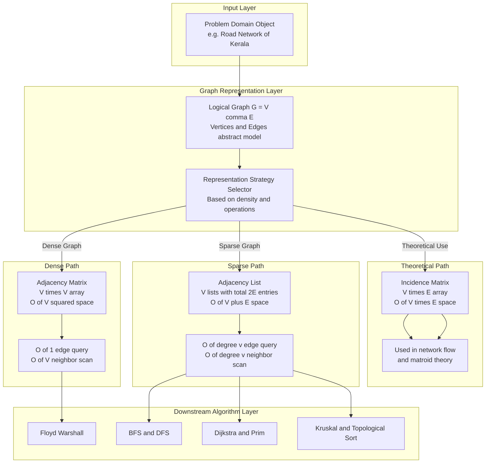
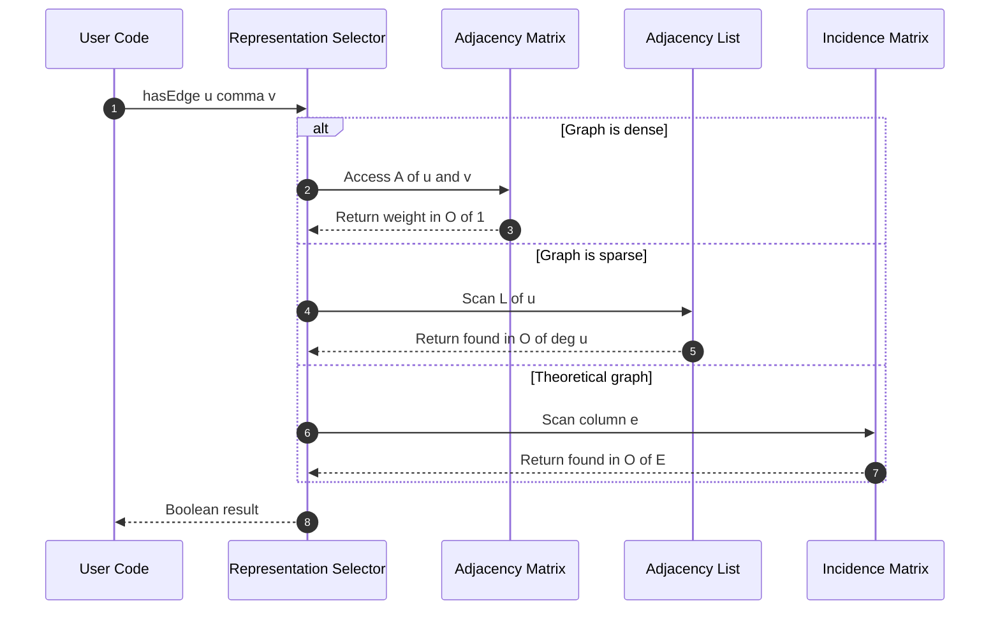
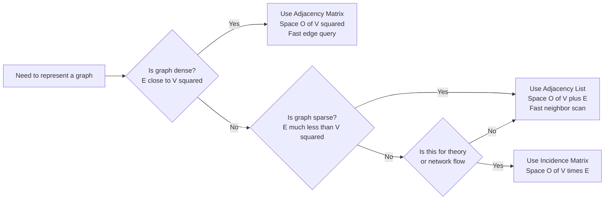

# Graphs – representation of graphs

<!-- SECTION_1_START -->
# Graphs – Representation of Graphs

## 1.1 Formal Definition (KTU 2024 Syllabus Terminology)

> [!IMPORTANT]
> **Definition (Graph):** A graph $G$ is an ordered pair $G = (V, E)$ where $V$ is a finite, non-empty set of **vertices** (also called nodes) and $E$ is a set of **edges** (also called arcs) connecting pairs of vertices. Formally, $E \subseteq \{\{u, v\} \mid u, v \in V\}$.

A graph is the most general non-linear data structure in computer science. It models **relationships** between objects, where the objects are vertices and the relationships are edges.

### 1.1.1 Key Terminology
- **Vertex (Node):** A fundamental unit of a graph, denoted by $v_i \in V$.
- **Edge (Arc):** A connection between two vertices, denoted by $e \in E$.
- **Adjacent vertices:** Two vertices $u$ and $v$ are adjacent if $\{u, v\} \in E$.
- **Incident edge:** An edge $e = \{u, v\}$ is incident to both $u$ and $v$.
- **Degree of a vertex:** Number of edges incident to it, denoted by $\deg(v)$.
- **In-degree / Out-degree:** For directed graphs, $\deg^{+}(v)$ and $\deg^{-}(v)$ count outgoing and incoming edges respectively.
- **Path:** A sequence of vertices $v_0, v_1, \ldots, v_k$ where each consecutive pair is connected by an edge.
- **Cycle:** A path that begins and ends at the same vertex with no repeated edges.
- **Connected graph:** A graph in which there exists a path between every pair of vertices.
- **Weighted graph:** A graph where each edge has an associated numerical value (weight/cost).

### 1.1.2 Classification of Graphs

| Type | Description | Use Case |
| :--- | :--- | :--- |
| **Undirected Graph** | Edges have no direction; $\{u,v\} = \{v,u\}$ | Social network friendships |
| **Directed Graph (Digraph)** | Edges have direction; ordered pair $(u,v)$ | Web page hyperlinks, Twitter follows |
| **Weighted Graph** | Each edge carries a numerical weight | Road networks with distances |
| **Simple Graph** | No self-loops, no multiple edges between same pair | Basic modeling |
| **Multigraph** | Allows multiple edges between same pair of vertices | Flight networks between cities |
| **Dense Graph** | Number of edges $E \approx V^2$ | Complete connectivity |
| **Sparse Graph** | Number of edges $E \ll V^2$ | Tree-like structures |

> [!NOTE]
> **Syllabus Highlight:** The KTU 2024 OECST831 (Introduction to Algorithm) syllabus places this topic under Module 2 (Trees & Graphs). Trees are special cases of graphs with no cycles, and graph representations form the basis of every graph algorithm including BFS, DFS, Dijkstra, and Kruskal.

## 1.2 Conceptual Analogy / Intuition

> [!TIP]
> **Real-World Analogy — The City Map:** Imagine you are looking at a **road map of Kerala**. Each town is a **vertex** (drawn as a circle), and each road connecting two towns is an **edge** (drawn as a line). If the roads are two-way, the map is an **undirected graph**; if some are one-way (like national highways with dividers), it becomes a **directed graph**. If we add the distance in kilometers next to each road, the map becomes a **weighted graph**.

**Why do we need a "representation"?** A computer cannot draw circles and lines. It needs a **structured numerical form** (arrays, lists, matrices) to store the graph inside memory so that algorithms can query, traverse, and analyze it. The three primary representations are:

1. **Adjacency Matrix** — a square table (think: Excel spreadsheet of size $V \times V$).
2. **Adjacency List** — for every vertex, a list of its neighbors (think: a phone contacts list).
3. **Incidence Matrix** — a table mapping vertices to edges (less common, more theoretical).

> [!VISUALIZATION CONTROL]
> **Concept:** A simple undirected graph with 5 vertices and 6 edges.
> **GeoGebra / Desmos Input Equations:**
> * $V = \{A, B, C, D, E\}$
> * $E = \{\{A,B\}, \{A,C\}, \{B,C\}, \{C,D\}, \{D,E\}, \{B,E\}\}$
> **Visual Description:** Plot 5 labeled points on the $xy$-plane (say, $A(0,2)$, $B(2,3)$, $C(2,1)$, $D(4,1)$, $E(4,3)$) and draw straight line segments between the connected pairs. The student should observe that vertex $C$ is the most "connected" — it has the highest degree (3).

<!-- SECTION_1_END -->

<!-- SECTION_2_START -->
# 2. Deep Theoretical Analysis & KTU High-Yield Formula Sheet

## 2.1 Why Graph Representation Matters

The choice of representation is the **single most important design decision** in any graph algorithm. It directly determines:

- **Memory consumption** (Space Complexity)
- **Speed of edge-existence queries** (Time Complexity)
- **Speed of finding all neighbors of a vertex** (Time Complexity)
- **Ease of implementation**

> [!IMPORTANT]
> **The Handshake Lemma (Fundamental Theorem):** In any undirected graph, the sum of degrees of all vertices equals **twice** the number of edges.
> $$\sum_{v \in V} \deg(v) = 2 \cdot \vert E \vert$$
> For directed graphs: $\sum_{v \in V} \deg^{+}(v) = \sum_{v \in V} \deg^{-}(v) = \vert E \vert$.

## 2.2 Representation 1: Adjacency Matrix

A 2D Boolean (or integer) array $A$ of size $V \times V$, where:

$$
A[u][v] = 
\begin{cases} 
1 & \text{if there is an edge between } u \text{ and } v \\
0 & \text{otherwise}
\end{cases}
$$

**Key properties:**
- Symmetric for undirected graphs: $A[u][v] = A[v][u]$.
- For weighted graphs: $A[u][v] = w$ (the weight of the edge).
- Self-loops: $A[u][u] = 1$ if vertex has a self-loop.
- For directed graphs: $A[u][v] = 1$ does **not** imply $A[v][u] = 1$.

**The "Why":** Why a matrix? Because matrix operations are **O(1) random access**. Need to check if edge $\{u,v\}$ exists? Just look up `A[u][v]`. The trade-off is wasting memory for sparse graphs.

## 2.3 Representation 2: Adjacency List

An array of size $V$, where each index holds a **linked list** (or dynamic array) of all vertices adjacent to that vertex. For each vertex $u$, we maintain a list $L_u = \{v \in V \mid \{u,v\} \in E\}$.

**The "Why":** Real-world graphs are usually **sparse** (e.g., the World Wide Web has billions of pages but each page links to only dozens of others). Storing a $V \times V$ matrix for such a graph wastes enormous memory. Lists store **only existing edges**, saving space.

## 2.4 Representation 3: Incidence Matrix

A 2D array $B$ of size $V \times E$, where:

$$
B[v][e] = 
\begin{cases} 
1 & \text{if vertex } v \text{ is incident to edge } e \\
0 & \text{otherwise}
\end{cases}
$$

For directed graphs: $B[v][e] = 1$ for source, $-1$ for sink, $0$ otherwise.

**The "Why":** This representation is rarely used in practice because it is **wasteful in space** for sparse graphs and **slow for adjacency queries**. However, it is theoretically important for **matroid theory** and **algebraic graph algorithms** (e.g., Kirchhoff's matrix-tree theorem).

## 2.5 KTU Formula Sheet / Cheat Sheet

> [!NOTE]
> **Memorize the following table — it is the most frequently tested content from this topic in KTU exams.**

| Parameter | Adjacency Matrix | Adjacency List | Incidence Matrix |
| :--- | :--- | :--- | :--- |
| **Storage Size** | $V^2$ | $V + E$ | $V \cdot E$ |
| **Space Complexity** | $\Theta(V^2)$ | $\Theta(V + E)$ | $\Theta(V \cdot E)$ |
| **Add Edge** | $O(1)$ | $O(1)$ amortized | $O(1)$ |
| **Remove Edge** | $O(1)$ | $O(\deg(v))$ | $O(1)$ |
| **Edge Query: $(u,v)$ exists?** | $O(1)$ | $O(\deg(u))$ | $O(E)$ |
| **Find All Neighbors of $v$** | $O(V)$ | $O(\deg(v))$ | $O(E)$ |
| **Best Suited For** | Dense graphs | Sparse graphs | Theoretical/algorithmic |
| **Real Production Use** | Floyd–Warshall, transitive closure | BFS, DFS, Dijkstra, Prim, Kruskal | Network flow, matroid theory |

### 2.5.1 Vertex Degree Formulas

| Graph Type | Degree Formula | Total Edges Formula |
| :--- | :--- | :--- |
| Undirected | $\deg(v) = \sum_{u=0}^{V-1} A[v][u]$ | $\vert E \vert = \frac{1}{2} \sum_{v \in V} \deg(v)$ |
| Directed | $\deg^{+}(v) = \sum_{u} A[v][u]$, $\deg^{-}(v) = \sum_{u} A[u][v]$ | $\vert E \vert = \sum_{v \in V} \deg^{+}(v) = \sum_{v \in V} \deg^{-}(v)$ |

## 2.6 Real-World Engineering Utility

> [!TIP]
> **Where are these representations used in production?**
> - **Google Maps** (weighted graph, adjacency list with $V = $ cities, $E = $ road segments) uses adjacency lists for **Dijkstra's shortest path**.
> - **Facebook Friend Graph** (undirected, $V = 2.9$ billion users) uses adjacency lists stored in distributed databases because a matrix would need $8.4 \times 10^{18}$ entries.
> - **Compiler Design** uses **directed graphs** (control flow graphs) represented as adjacency lists to perform dead-code elimination.
> - **TCP/IP Routing** uses adjacency matrices in specialized hardware (TCAM) for O(1) longest-prefix matching.
> - **Database query optimizers** represent JOIN operations as graphs to find optimal execution plans.

<!-- SECTION_2_END -->

<!-- SECTION_3_START -->
# 3. Step-by-Step Derivations & Code/Symbolic Implementation

## 3.1 Worked Example: All Three Representations for the Same Graph

Let us take a concrete undirected graph so that we can build all three representations side by side. Let:

$$
V = \{0, 1, 2, 3, 4\}, \quad E = \{\{0,1\}, \{0,4\}, \{1,2\}, \{1,3\}, \{1,4\}, \{2,3\}, \{3,4\}\}
$$

So $V = 5$ and $E = 7$. Note: This is a **dense** graph (close to complete $K_5$ which has 10 edges).

### 3.1.1 Step 1: Build the Adjacency Matrix

Initialize a $5 \times 5$ zero matrix. For every edge $\{u, v\}$, set $A[u][v] = A[v][u] = 1$.

**Explicit row-by-row construction:**

- Edge $\{0,1\}$: set $A[0][1] = A[1][0] = 1$.
- Edge $\{0,4\}$: set $A[0][4] = A[4][0] = 1$.
- Edge $\{1,2\}$: set $A[1][2] = A[2][1] = 1$.
- Edge $\{1,3\}$: set $A[1][3] = A[3][1] = 1$.
- Edge $\{1,4\}$: set $A[1][4] = A[4][1] = 1$.
- Edge $\{2,3\}$: set $A[2][3] = A[3][2] = 1$.
- Edge $\{3,4\}$: set $A[3][4] = A[4][3] = 1$.

**Final Adjacency Matrix $A$:**

$$
A = \begin{pmatrix}
0 & 1 & 0 & 0 & 1 \\
1 & 0 & 1 & 1 & 1 \\
0 & 1 & 0 & 1 & 0 \\
0 & 1 & 1 & 0 & 1 \\
1 & 1 & 0 & 1 & 0
\end{pmatrix}
$$

**Verification of the Handshake Lemma:**

$$
\begin{aligned}
\deg(0) &= A[0][1] + A[0][2] + A[0][3] + A[0][4] = 1+0+0+1 = 2 \\
\deg(1) &= A[1][0] + A[1][2] + A[1][3] + A[1][4] = 1+1+1+1 = 4 \\
\deg(2) &= A[2][0] + A[2][1] + A[2][3] + A[2][4] = 0+1+1+0 = 2 \\
\deg(3) &= A[3][0] + A[3][1] + A[3][2] + A[3][4] = 0+1+1+1 = 3 \\
\deg(4) &= A[4][0] + A[4][1] + A[4][2] + A[4][3] = 1+1+0+1 = 3
\end{aligned}
$$

Sum $= 2 + 4 + 2 + 3 + 3 = 14 = 2 \times 7 = 2 \cdot \vert E \vert$. ✓

### 3.1.2 Step 2: Build the Adjacency List

For each vertex $u$, list all $v$ such that $\{u,v\} \in E$.

$$
\begin{aligned}
L_0 &= \{1, 4\} \\
L_1 &= \{0, 2, 3, 4\} \\
L_2 &= \{1, 3\} \\
L_3 &= \{1, 2, 4\} \\
L_4 &= \{0, 1, 3\}
\end{aligned}
$$

**Memory used:** $V + 2E = 5 + 14 = 19$ integers, versus $V^2 = 25$ for the matrix. The list is **smaller even for this dense graph**; the gap widens dramatically for sparse graphs.

### 3.1.3 Step 3: Build the Incidence Matrix

Size is $V \times E = 5 \times 7$. Label edges $e_0, e_1, \ldots, e_6$ in the order listed above. Entry $B[v][e] = 1$ if $v$ is an endpoint of $e$.

$$
B = \begin{pmatrix}
1 & 1 & 0 & 0 & 0 & 0 & 0 \\
1 & 0 & 1 & 1 & 1 & 0 & 0 \\
0 & 0 & 1 & 0 & 0 & 1 & 0 \\
0 & 0 & 0 & 1 & 0 & 1 & 1 \\
0 & 1 & 0 & 0 & 1 & 0 & 1
\end{pmatrix}
$$

**Column sums:** Each column (edge) has exactly two 1's because each edge connects exactly two vertices. ✓

## 3.2 Full Python Implementation

```python
"""
Graph Representation Toolkit - KTU 2024 OECST831 Module 2
Implements: Adjacency Matrix, Adjacency List, Incidence Matrix
for both undirected and directed, weighted and unweighted graphs.
"""

from __future__ import annotations
from typing import List, Tuple, Union, Dict
import sys


class GraphRepresentation:
    """A unified toolkit for the three classical graph representations."""

    def __init__(self, num_vertices: int, directed: bool = False) -> None:
        if num_vertices <= 0:
            raise ValueError("Number of vertices must be a positive integer.")
        self.V: int = num_vertices
        self.directed: bool = directed
        self.edge_list: List[Tuple[int, int, float]] = []
        # Adjacency matrix initialized with infinity for "no edge"
        self.INF: float = float('inf')
        self.adj_matrix: List[List[float]] = [
            [0 if not self._is_weighted_default() else self.INF
             for _ in range(self.V)]
            for _ in range(self.V)
        ]
        # Adjacency list: list of lists
        self.adj_list: List[List[Tuple[int, float]]] = [
            [] for _ in range(self.V)
        ]
        # Incidence matrix: V rows, E columns (E is dynamic)
        self.incidence_matrix: List[List[int]] = []

    def _is_weighted_default(self) -> bool:
        """Returns True if we want a weighted default (0 for unweighted)."""
        return False

    def add_edge(self, u: int, v: int, weight: float = 1.0) -> None:
        """Adds an edge (u, v) with given weight. Updates ALL three structures."""
        if not (0 <= u < self.V and 0 <= v < self.V):
            raise IndexError(f"Vertex out of range: u={u}, v={v}, V={self.V}")
        if u == v:
            raise ValueError("Self-loops are not supported in this base class.")

        # 1) Record the edge and assign an edge index
        edge_index: int = len(self.edge_list)
        self.edge_list.append((u, v, weight))

        # 2) Update adjacency matrix
        self.adj_matrix[u][v] = weight
        if not self.directed:
            self.adj_matrix[v][u] = weight

        # 3) Update adjacency list
        self.adj_list[u].append((v, weight))
        if not self.directed:
            self.adj_list[v].append((u, weight))

        # 4) Update incidence matrix: add a new column
        new_col: List[int] = [0] * self.V
        new_col[u] = 1
        new_col[v] = -1 if self.directed else 1
        self.incidence_matrix.append(new_col)

    def print_adjacency_matrix(self) -> None:
        print("\n--- Adjacency Matrix ---")
        print("     " + " ".join(f"{i:4}" for i in range(self.V)))
        for i in range(self.V):
            row = " ".join(f"{int(self.adj_matrix[i][j]):4}"
                           if not self.INF == self.adj_matrix[i][j]
                           else "  INF" for j in range(self.V))
            print(f"{i:3} | {row}")

    def print_adjacency_list(self) -> None:
        print("\n--- Adjacency List ---")
        for i in range(self.V):
            neighbors = ", ".join(
                f"{v}(w={w})" for v, w in self.adj_list[i]
            )
            print(f"  Vertex {i} -> [{neighbors}]")

    def print_incidence_matrix(self) -> None:
        print("\n--- Incidence Matrix ---")
        if not self.incidence_matrix:
            print("  (No edges yet.)")
            return
        E: int = len(self.incidence_matrix)
        header = "     " + " ".join(f"e{j:2}" for j in range(E))
        print(header)
        for i in range(self.V):
            row = " ".join(
                f"{self.incidence_matrix[j][i]:3}"
                for j in range(E)
            )
            print(f"  v{i} | {row}")

    def has_edge(self, u: int, v: int) -> bool:
        """Demonstrates O(1) edge check using adjacency matrix."""
        return self.adj_matrix[u][v] != 0 and self.adj_matrix[u][v] != self.INF

    def get_neighbors(self, u: int) -> List[int]:
        """Demonstrates O(deg(u)) neighbor retrieval using adjacency list."""
        return [v for v, _ in self.adj_list[u]]

    def memory_usage_estimate(self) -> Dict[str, int]:
        """Returns estimated memory cells used by each representation."""
        E: int = len(self.edge_list)
        return {
            "Adjacency_Matrix": self.V * self.V,
            "Adjacency_List": self.V + 2 * E,
            "Incidence_Matrix": self.V * E,
        }


# ===================== DEMO RUN =====================
if __name__ == "__main__":
    # Build the example graph from Section 3.1
    g = GraphRepresentation(num_vertices=5, directed=False)
    edges = [
        (0, 1), (0, 4), (1, 2), (1, 3), (1, 4), (2, 3), (3, 4)
    ]
    for u, v in edges:
        g.add_edge(u, v)

    g.print_adjacency_matrix()
    g.print_adjacency_list()
    g.print_incidence_matrix()

    print("\n--- Memory Footprint Comparison ---")
    mem = g.memory_usage_estimate()
    for rep, cells in mem.items():
        print(f"  {rep:20s} -> {cells} cells")

    print("\n--- Functional Checks ---")
    print(f"  Edge (0,1) exists?      {g.has_edge(0, 1)}")
    print(f"  Edge (0,2) exists?      {g.has_edge(0, 2)}")
    print(f"  Neighbors of vertex 1:  {g.get_neighbors(1)}")
```

**Expected console output (excerpted):**

```
--- Adjacency Matrix ---
       0    1    2    3    4
  0 |    0    1    0    0    1
  1 |    1    0    1    1    1
  2 |    0    1    0    1    0
  3 |    0    1    1    0    1
  4 |    1    1    0    1    0
...
--- Memory Footprint Comparison ---
  Adjacency_Matrix     -> 25 cells
  Adjacency_List       -> 19 cells
  Incidence_Matrix     -> 35 cells
```

## 3.3 Algorithm: Converting Between Representations

**Conversion 1: Adjacency Matrix → Adjacency List**

For every $i, j \in \{0, 1, \ldots, V-1\}$: if $A[i][j] \neq 0$, append $j$ to $L_i$. Time complexity: $\Theta(V^2)$.

**Conversion 2: Adjacency List → Adjacency Matrix**

Initialize a $V \times V$ zero matrix. For every $u$ and every $(v, w) \in L_u$: set $A[u][v] = w$. Time complexity: $\Theta(V + E)$.

<!-- SECTION_3_END -->

<!-- SECTION_4_START -->
# 4. Structural Diagrams & Schematics

## 4.1 Mermaid Block Diagram: Graph Representation Architecture



## 4.2 Mermaid Sequence Diagram: Edge Query Operation Across Representations



## 4.3 Mermaid Comparison Matrix: Decision Tree



<!-- SECTION_4_END -->

<!-- SECTION_5_START -->
# 5. KTU 2024 Scheme Examination Question Bank & Topic Recap

## 5.1 Part A Questions (3 Marks Each)

### Question A1
**[KTU University Exam - Dec 2023]** Define a graph. Differentiate between a directed graph and an undirected graph with a suitable example. **(CO1, Remember/Understand) [3 Marks]**

**Model Answer:**

A graph $G$ is an ordered pair $G = (V, E)$ where $V$ is a non-empty set of vertices and $E$ is a set of edges connecting pairs of vertices. **[Definition: 1 Mark]**

In an **undirected graph**, edges have no orientation: $\{u, v\} = \{v, u\}$. Example: a Facebook friendship graph — if Alice is friends with Bob, then Bob is automatically a friend of Alice. **[Undirected: 1 Mark]**

In a **directed graph** (digraph), edges are ordered pairs $(u, v)$, meaning the relationship goes from $u$ to $v$ only. Example: a Twitter follow graph — Alice can follow Bob without Bob following Alice. **[Directed: 1 Mark]**

### Question A2
**[KTU University Exam - July 2024]** State the Handshake Lemma for an undirected graph. What is the sum of degrees of all vertices in a graph with 8 vertices and 12 edges? **(CO1, Remember/Apply) [3 Marks]**

**Model Answer:**

**Handshake Lemma:** In any undirected graph $G = (V, E)$,

$$
\sum_{v \in V} \deg(v) = 2 \cdot \vert E \vert
$$

**[Statement: 1 Mark]**

Given $V = 8$ and $E = 12$:

$$
\sum_{v \in V} \deg(v) = 2 \times 12 = 24
$$

**[Substitution: 1 Mark, Final answer: 1 Mark]**

---

## 5.2 Part B Questions (14 Marks — Internal Choice)

### Question A (14 Marks)

**[KTU University Exam - Dec 2023]** **(a)** Explain the three common representations of a graph: adjacency matrix, adjacency list, and incidence matrix. Compare them on the basis of space and time complexity. **(CO1, Understand) [7 Marks]**

**(b)** For the undirected graph with $V = \{1, 2, 3, 4, 5\}$ and $E = \{\{1,2\}, \{1,3\}, \{2,3\}, \{2,4\}, \{3,5\}, \{4,5\}\}$, construct all three representations. Find the degree of each vertex and verify the Handshake Lemma. **(CO2, Apply) [7 Marks]**

#### Model Solution for (a):

**[Definition of Adjacency Matrix: 1 Mark]**
An adjacency matrix is a 2D array $A$ of size $V \times V$ where $A[i][j] = 1$ if there is an edge between vertices $i$ and $j$, else $0$. For weighted graphs, $A[i][j]$ stores the weight.

**[Definition of Adjacency List: 1 Mark]**
An adjacency list is an array of size $V$ where the $i$-th entry holds a list of all vertices adjacent to vertex $i$.

**[Definition of Incidence Matrix: 1 Mark]**
An incidence matrix is a 2D array $B$ of size $V \times E$ where $B[v][e] = 1$ if vertex $v$ is incident to edge $e$, else $0$.

**[Comparison Table: 3 Marks]**

| Criterion | Adj. Matrix | Adj. List | Inc. Matrix |
| :--- | :--- | :--- | :--- |
| Space | $O(V^2)$ | $O(V+E)$ | $O(V \cdot E)$ |
| Edge query | $O(1)$ | $O(\deg(v))$ | $O(E)$ |
| Find all neighbors | $O(V)$ | $O(\deg(v))$ | $O(E)$ |
| Best for | Dense graphs | Sparse graphs | Theoretical use |

**[Conclusion on choice: 1 Mark]**
For most practical applications on sparse graphs, adjacency list is preferred; for dense graphs or matrix-based algorithms (e.g., Floyd–Warshall), adjacency matrix is chosen.

#### Model Solution for (b):

**Step 1: Construct Adjacency Matrix (size $5 \times 5$):** **[2 Marks]**

$$
A = \begin{pmatrix}
0 & 1 & 1 & 0 & 0 \\
1 & 0 & 1 & 1 & 0 \\
1 & 1 & 0 & 0 & 1 \\
0 & 1 & 0 & 0 & 1 \\
0 & 0 & 1 & 1 & 0
\end{pmatrix}
$$

**Step 2: Construct Adjacency List:** **[1 Mark]**

$$
\begin{aligned}
L_1 &= \{2, 3\} \\
L_2 &= \{1, 3, 4\} \\
L_3 &= \{1, 2, 5\} \\
L_4 &= \{2, 5\} \\
L_5 &= \{3, 4\}
\end{aligned}
$$

**Step 3: Construct Incidence Matrix (size $5 \times 6$):** **[1 Mark]**

$$
B = \begin{pmatrix}
1 & 1 & 0 & 0 & 0 & 0 \\
1 & 0 & 1 & 1 & 0 & 0 \\
0 & 1 & 1 & 0 & 1 & 0 \\
0 & 0 & 0 & 1 & 0 & 1 \\
0 & 0 & 0 & 0 & 1 & 1
\end{pmatrix}
$$

**Step 4: Compute Degrees and Verify Handshake Lemma:** **[3 Marks]**

$$
\begin{aligned}
\deg(1) &= 2, \quad \deg(2) = 3, \quad \deg(3) = 3, \quad \deg(4) = 2, \quad \deg(5) = 2 \\
\text{Sum} &= 2 + 3 + 3 + 2 + 2 = 12 = 2 \times 6 = 2 \cdot \vert E \vert \quad \checkmark
\end{aligned}
$$

### Question B (14 Marks — Alternative Choice)

**[KTU University Exam - July 2024]** **(a)** Define in-degree, out-degree, and total degree for a directed graph. Write the formulas relating them to the number of edges. **(CO1, Understand) [7 Marks]**

**(b)** Consider the directed graph with $V = \{A, B, C, D\}$ and $E = \{(A,B), (A,C), (B,C), (C,A), (C,D), (D,B)\}$. Construct the adjacency matrix and the adjacency list. Compute the in-degree and out-degree of every vertex and verify the edge-count relation. **(CO2, Apply) [7 Marks]**

#### Model Solution for (a):

**[Definitions: 3 Marks]**
- **In-degree** $\deg^{-}(v)$: number of edges coming **into** $v$.
- **Out-degree** $\deg^{+}(v)$: number of edges going **out of** $v$.
- **Total degree** $\deg(v) = \deg^{+}(v) + \deg^{-}(v)$.

**[Formulas: 3 Marks]**

$$
\sum_{v \in V} \deg^{+}(v) = \vert E \vert, \quad \sum_{v \in V} \deg^{-}(v) = \vert E \vert, \quad \sum_{v \in V} \deg(v) = 2 \cdot \vert E \vert
$$

**[Example: 1 Mark]**
For vertex $C$ with incoming edges $(A,C), (D,?)$ and outgoing edges $(C,A), (C,D)$: $\deg^{-}(C) = 2$, $\deg^{+}(C) = 2$.

#### Model Solution for (b):

**Step 1: Adjacency Matrix (asymmetric for digraph):** **[2 Marks]**

$$
A = \begin{pmatrix}
0 & 1 & 1 & 0 \\
0 & 0 & 1 & 0 \\
1 & 0 & 0 & 1 \\
0 & 1 & 0 & 0
\end{pmatrix}
$$

**Step 2: Adjacency List:** **[1 Mark]**

$$
\begin{aligned}
L_A &= \{B, C\} \\
L_B &= \{C\} \\
L_C &= \{A, D\} \\
L_D &= \{B\}
\end{aligned}
$$

**Step 3: Degree Computation:** **[3 Marks]**

| Vertex | $\deg^{+}$ (out) | $\deg^{-}$ (in) | $\deg$ (total) |
| :--- | :---: | :---: | :---: |
| A | 2 | 1 | 3 |
| B | 1 | 2 | 3 |
| C | 2 | 2 | 4 |
| D | 1 | 1 | 2 |
| **Sum** | **6** | **6** | **12** |

**Step 4: Verification:** **[1 Mark]**

$\vert E \vert = 6$. Check:
- $\sum \deg^{+} = 2 + 1 + 2 + 1 = 6 = \vert E \vert \quad \checkmark$
- $\sum \deg^{-} = 1 + 2 + 2 + 1 = 6 = \vert E \vert \quad \checkmark$
- $\sum \deg = 12 = 2 \cdot \vert E \vert \quad \checkmark$

---

> [!WARNING]
> **KTU Examiner's Valuation Warning / Common Pitfalls**
> 1. **Forgetting asymmetry:** In a directed graph, students often write a symmetric matrix by mistake, losing 2–3 marks.
> 2. **Off-by-one in indexing:** KTU questions use both $0$-based and $1$-based vertex labels. Always re-read the question carefully. Mis-indexing loses the entire 7-mark sub-part.
> 3. **Skipping the verification step:** The Handshake Lemma verification is **mandatory** when asked. Failing to write "$\sum \deg = 2 \cdot \vert E \vert \quad \checkmark$" costs 1 mark.
> 4. **Confusing incidence matrix dimensions:** It is $V \times E$ (rows are vertices, columns are edges), not $E \times V$. Mixing this up is a frequent 2-mark deduction.
> 5. **Not writing the directed/undirected case separately:** If the question says "directed graph", the formulas for in-degree and out-degree differ from the undirected case. Always state both.
> 6. **Ignoring self-loops:** A self-loop contributes **2** to the degree of an undirected vertex and **1 each** to in-degree and out-degree of a directed vertex.

---

## 5.3 Topic Recap & Important Things to Remember

> [!TIP]
> **High-Density Revision Checklist**

- **Graph definition:** $G = (V, E)$ where $V$ is the vertex set and $E$ is the edge set.
- **Three representations:** Adjacency Matrix, Adjacency List, Incidence Matrix.
- **Space complexities (must memorize):** $O(V^2)$, $O(V + E)$, $O(V \cdot E)$ respectively.
- **Edge query time:** Matrix gives $O(1)$; List gives $O(\deg(v))$; Incidence gives $O(E)$.
- **Handshake Lemma (undirected):** $\sum_{v \in V} \deg(v) = 2 \cdot \vert E \vert$.
- **Directed graph identity:** $\sum \deg^{+}(v) = \sum \deg^{-}(v) = \vert E \vert$.
- **Matrix symmetry:** Undirected graphs have symmetric adjacency matrices; directed graphs do not.
- **Self-loops:** Add 2 to undirected degree; add 1 to in-degree and 1 to out-degree.
- **Dense vs Sparse:** Use matrix when $E \approx V^2$; use list when $E \ll V^2$.
- **Conversion cost:** Matrix → List is $\Theta(V^2)$; List → Matrix is $\Theta(V + E)$.
- **In KTU exams, always:** (i) state the representation type, (ii) show the construction step-by-step, (iii) verify using the Handshake Lemma if applicable.
- **Adjacency list memory savings example:** For a graph with $V = 1000$ and $E = 2000$, matrix needs $10^6$ cells, list needs $5000$ cells — a 200× reduction.
- **Real-world analog:** Road networks (sparse) → adjacency list; airline route maps with all possible pairs (dense) → adjacency matrix.
- **Foundation for later algorithms:** BFS, DFS, Dijkstra, Prim, Kruskal, Topological Sort all rely on these representations.

<!-- SECTION_5_END -->
