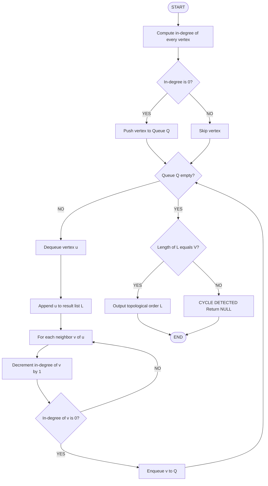
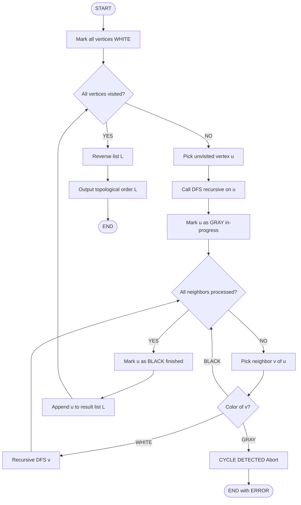
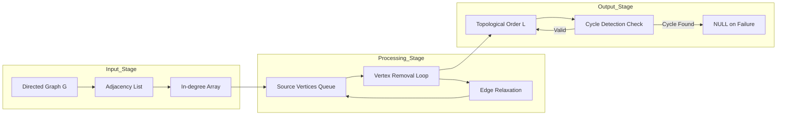
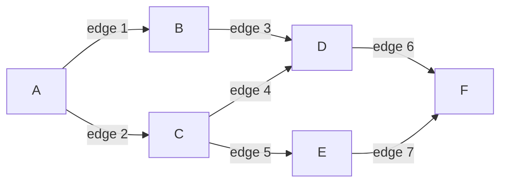

# Topological Sorting

<!-- SECTION_1_START -->
# TOPOLOGICAL SORTING

> [!NOTE]
> **KTU 2024 OECST831 — Module 2 (Trees) | Course Outcome: CO2 | Bloom Level: Apply**

## 1.1 Formal Academic Definition

**Topological Sorting** is a linear ordering of the vertices of a **Directed Acyclic Graph (DAG)** such that for every directed edge $(u \rightarrow v)$, the vertex $u$ appears before $v$ in the ordering. If the graph contains a cycle, topological ordering is **impossible**.

Formally, given a DAG $G = (V, E)$ with $n = \vert V \vert$ vertices, a topological sort is a permutation $L = (v_1, v_2, \dots, v_n)$ of the vertices such that for every directed edge $(v_i, v_j) \in E$, we have $i < j$.

> [!IMPORTANT]
> **Pre-conditions (KTU Board Expectation):**
> 1. The input graph **MUST** be a **Directed Graph**.
> 2. The graph **MUST** be **Acyclic** (no back edges / cycles).
> 3. Topological sort is **NOT unique** — multiple valid orderings may exist for the same DAG.

## 1.2 Intuitive Real-World Analogy

Imagine a first-year B.Tech student planning his **4-year course schedule**:

- **Data Structures (DS)** must be taken before **Algorithm Design (AD)**
- **DS** must be taken before **Database Management Systems (DBMS)**
- **Mathematics-I (M1)** must be taken before **Mathematics-II (M2)**
- **AD** and **DBMS** can be taken in parallel (no dependency between them)

Here, each course is a **vertex**, and each prerequisite relation is a **directed edge**. A topological sort gives a valid semester-wise ordering of courses that respects all prerequisites — this is exactly what your **KTU academic portal's "Swayam/ERP registration system"** does internally!

## 1.3 Where Topological Sort is Used in Real Engineering

| Domain | Application |
|---|---|
| **Compilers** | Instruction scheduling, dependency resolution |
| **Build Systems** | `Make`, `Maven`, `npm` — decide build order of modules |
| **Package Managers** | `apt`, `pip` — install dependencies first |
| **Task Scheduling** | Project management, parallel job execution |
| **Spreadsheet Cells** | Recalculation order in Excel formulas |
| **Course Registration** | KTU ERP arranging subjects by prerequisites |

> [!TIP]
> **Geometric Intuition:** If you "untangle" a DAG by repeatedly plucking out vertices with **in-degree = 0** (vertices with no remaining prerequisites), you naturally obtain a topological order. This is the essence of **Kahn's Algorithm**.

<!-- SECTION_1_END -->

<!-- SECTION_2_START -->
# DEEP THEORETICAL ANALYSIS & FORMULA SHEET

## 2.1 Two Classical Approaches to Topological Sort

### Approach A: Kahn's Algorithm (BFS / In-degree based)
This is the **inductive / source-removal** method. Vertices with no incoming edges (sources) are output first, then removed iteratively.

### Approach B: DFS-based Algorithm
A **Depth-First Search** is performed; vertices are prepended to the output list as their DFS recursion finishes (post-order reversal).

## 2.2 Algorithmic Logic — Stepwise Breakdown

### Kahn's Algorithm (BFS-based)
1. Compute the **in-degree** $\text{indeg}(v)$ for every vertex $v \in V$.
2. Initialize a **queue** $Q$ with all vertices having in-degree $0$.
3. While $Q$ is not empty:
    * Dequeue vertex $u$ from $Q$.
    * Append $u$ to the topological order list $L$.
    * For every neighbor $v$ in $\text{Adj}(u)$:
        * Decrement $\text{indeg}(v)$ by $1$.
        * If $\text{indeg}(v) == 0$, enqueue $v$ into $Q$.
4. If $\vert L \vert < n$, the graph contains a **cycle** → topological sort fails.

### DFS-based Algorithm
1. Mark all vertices as **unvisited** (WHITE).
2. For every unvisited vertex $u$, call $\text{DFS}(u)$.
3. $\text{DFS}(u)$:
    * Mark $u$ as visited (GRAY).
    * For every neighbor $v$ in $\text{Adj}(u)$:
        * If $v$ is unvisited, recursively call $\text{DFS}(v)$.
        * If $v$ is GRAY (currently in recursion stack) → **cycle detected**.
    * Mark $u$ as finished (BLACK); **prepend** $u$ to output list $L$.
4. The final $L$ is the topological order.

> [!IMPORTANT]
> **Why prepend in DFS?** When DFS finishes vertex $u$, all its descendants are already in $L$. Prepending $u$ ensures that $u$ appears **after** all vertices reachable from it, which is the topological requirement.

## 2.3 KTU High-Yield Formula Sheet

| Parameter / Metric | Formula / Value | Notes |
|---|---|---|
| Time Complexity (Kahn's) | $T(n) = O(\vert V \vert + \vert E \vert)$ | In-degree computation + queue processing |
| Time Complexity (DFS) | $T(n) = O(\vert V \vert + \vert E \vert)$ | Each vertex and edge visited once |
| Space Complexity | $S(n) = O(\vert V \vert)$ | For visited array, recursion stack / queue |
| In-degree of vertex $v$ | $\text{indeg}(v) = \sum_{u \in V} \mathbb{1}[(u,v) \in E]$ | Number of incoming edges |
| Out-degree of vertex $v$ | $\text{outdeg}(v) = \sum_{w \in V} \mathbb{1}[(v,w) \in E]$ | Number of outgoing edges |
| Cycle Detection | $\vert L \vert < \vert V \vert$ (Kahn's) or GRAY node revisit (DFS) | Acyclic graph guarantee |
| Number of valid orderings | $0$ to $\vert V \vert !$ | Depends on DAG structure (NP-hard to count) |
| Total degree sum | $\sum_{v \in V} \text{indeg}(v) = \sum_{v \in V} \text{outdeg}(v) = \vert E \vert$ | Handshake lemma for directed graphs |
| Min source vertices | $\geq 1$ in any DAG | A DAG must have at least one source |
| Max sinks (out-degree 0) | $\geq 1$ in any DAG | Symmetric guarantee |

> [!NOTE]
> **Critical Constants for Board Exams:** Always state the **$O(\vert V \vert + \vert E \vert)$** complexity — this is the most-marks-fetching line. Never write $O(n^2)$ for sparse graphs.

## 2.4 Engineering Utility

In production systems, topological sort is the **backbone of dependency resolution**. When you run `apt-get install` in Ubuntu or `pip install tensorflow` in Python, the package manager internally constructs a DAG of dependencies, runs topological sort, and installs in the resolved order. The Linux kernel's **Make build system** does the exact same thing for compiling kernel modules.

<!-- SECTION_2_END -->

<!-- SECTION_3_START -->
# STEP-BY-STEP DERIVATIONS & IMPLEMENTATION

## 3.1 Worked Example — Kahn's Algorithm (Board-Standard Walkthrough)

**Given DAG with 6 vertices:**

$$
V = \{A, B, C, D, E, F\}, \quad E = \{(A,B), (A,C), (B,D), (C,D), (C,E), (D,F), (E,F)\}
$$

**Step 1 — Compute In-degrees:**

$$
\begin{aligned}
\text{indeg}(A) &= 0 \\
\text{indeg}(B) &= 1 \quad (\text{from } A) \\
\text{indeg}(C) &= 1 \quad (\text{from } A) \\
\text{indeg}(D) &= 2 \quad (\text{from } B, C) \\
\text{indeg}(E) &= 1 \quad (\text{from } C) \\
\text{indeg}(F) &= 2 \quad (\text{from } D, E)
\end{aligned}
$$

**Step 2 — Initial Queue (in-degree 0):** $Q = [A]$

**Step 3 — Iterative Processing:**

| Iteration | Dequeue | Output $L$ | Updated In-degrees | Queue $Q$ |
|---|---|---|---|---|
| 1 | $A$ | $[A]$ | $B:0, C:0, D:2, E:1, F:2$ | $[B, C]$ |
| 2 | $B$ | $[A, B]$ | $D:1, F:2$ | $[C]$ |
| 3 | $C$ | $[A, B, C]$ | $D:0, E:0, F:2$ | $[D, E]$ |
| 4 | $D$ | $[A, B, C, D]$ | $F:1$ | $[E]$ |
| 5 | $E$ | $[A, B, C, D, E]$ | $F:0$ | $[F]$ |
| 6 | $F$ | $[A, B, C, D, E, F]$ | — | $[\,]$ |

**Step 4 — Validation:** $\vert L \vert = 6 = \vert V \vert \Rightarrow$ **No cycle detected** ✅

**Final Topological Order:** $A \rightarrow B \rightarrow C \rightarrow D \rightarrow E \rightarrow F$

> [!TIP]
> **Board Tip:** Always draw the DAG before showing the table. Examiners award 2 marks just for a clean graph diagram with labeled in-degrees.

## 3.2 Worked Example — DFS-based Approach (Same Graph)

**Recursion Trace (starting from $A$):**

$$
\begin{aligned}
\text{DFS}(A) &\to \text{DFS}(B) \to \text{DFS}(D) \to \text{DFS}(F) \to \text{finish}(F) \\
&\to \text{finish}(D) \to \text{finish}(B) \to \text{DFS}(C) \to \text{DFS}(E) \to \text{DFS}(F) \text{ (already BLACK, skip)} \\
&\to \text{finish}(E) \to \text{finish}(C) \to \text{finish}(A)
\end{aligned}
$$

**Finish Order (prepend on each finish):**

$$
L = [] \to [F] \to [D, F] \to [B, D, F] \to [E, B, D, F] \to [C, E, B, D, F] \to [A, C, E, B, D, F]
$$

**Final Order:** $A \rightarrow C \rightarrow E \rightarrow B \rightarrow D \rightarrow F$

> [!NOTE]
> The two methods produce **different valid orderings** — both are correct topological sorts, proving that the answer is **not unique**.

## 3.3 Python Implementation (Board-Standard Code)

```python
from collections import deque
from typing import Dict, List, Optional, Set, Tuple

def topological_sort_kahn(graph: Dict[str, List[str]]) -> Optional[List[str]]:
    """
    Performs topological sorting using Kahn's algorithm (BFS-based).
    
    Args:
        graph: Adjacency list representing the directed graph.
               e.g., {'A': ['B', 'C'], 'B': ['D'], ...}
    
    Returns:
        A valid topological ordering, or None if a cycle exists.
    """
    # Step 1: Compute in-degrees for all vertices
    in_degree: Dict[str, int] = {node: 0 for node in graph}
    for u in graph:
        for v in graph[u]:
            in_degree[v] = in_degree.get(v, 0) + 1
            # Ensure isolated vertices are tracked
            if v not in in_degree:
                in_degree[v] = in_degree[v]
    
    # Step 2: Initialize queue with all in-degree 0 vertices
    queue: deque[str] = deque()
    for node, deg in in_degree.items():
        if deg == 0:
            queue.append(node)
    
    # Step 3: Process vertices
    result: List[str] = []
    while queue:
        u = queue.popleft()
        result.append(u)
        # Decrement in-degree of all neighbors
        for v in graph.get(u, []):
            in_degree[v] -= 1
            if in_degree[v] == 0:
                queue.append(v)
    
    # Step 4: Cycle detection
    if len(result) != len(in_degree):
        print("[ERROR] Cycle detected! Topological sort not possible.")
        return None
    
    return result


def topological_sort_dfs(graph: Dict[str, List[str]]) -> Optional[List[str]]:
    """
    Performs topological sorting using DFS-based approach.
    """
    WHITE, GRAY, BLACK = 0, 1, 2
    color: Dict[str, int] = {node: WHITE for node in graph}
    result: List[str] = []
    has_cycle: List[bool] = [False]
    
    def dfs(u: str) -> None:
        """Recursive DFS helper with cycle detection."""
        color[u] = GRAY  # Mark as in-progress
        for v in graph.get(u, []):
            if v not in color:
                color[v] = WHITE
            if color[v] == GRAY:
                has_cycle[0] = True
                return
            if color[v] == WHITE:
                dfs(v)
        color[u] = BLACK  # Mark as finished
        result.append(u)  # Append on finish
    
    # Ensure all vertices (including isolated) are covered
    all_nodes: Set[str] = set(graph.keys())
    for neighbors in graph.values():
        all_nodes.update(neighbors)
    for node in all_nodes:
        if node not in color:
            color[node] = WHITE
    
    for node in all_nodes:
        if color[node] == WHITE:
            dfs(node)
            if has_cycle[0]:
                return None
    
    result.reverse()  # Reverse post-order to get topological order
    return result


# ---------- Driver / Test Block ----------
if __name__ == "__main__":
    test_graph: Dict[str, List[str]] = {
        'A': ['B', 'C'],
        'B': ['D'],
        'C': ['D', 'E'],
        'D': ['F'],
        'E': ['F'],
        'F': []
    }
    
    print("Kahn's Algorithm Result:")
    kahn_result = topological_sort_kahn(test_graph)
    print(" -> ".join(kahn_result) if kahn_result else "Cycle Detected")
    
    print("\nDFS-based Algorithm Result:")
    dfs_result = topological_sort_dfs(test_graph)
    print(" -> ".join(dfs_result) if dfs_result else "Cycle Detected")
```

**Expected Output:**
```
Kahn's Algorithm Result:
A -> B -> C -> D -> E -> F

DFS-based Algorithm Result:
A -> C -> E -> B -> D -> F
```

## 3.4 Complexity Derivation (For Board Marks)

For Kahn's Algorithm:

$$
\begin{aligned}
T(n) &= \underbrace{O(\vert V \vert)}_{\text{in-degree computation}} + \underbrace{O(\vert E \vert)}_{\text{traverse all edges once}} + \underbrace{O(\vert V \vert)}_{\text{enqueue/dequeue}} \\
&= O(\vert V \vert + \vert E \vert)
\end{aligned}
$$

For DFS-based Algorithm:

$$
\begin{aligned}
T(n) &= \underbrace{O(\vert V \vert)}_{\text{initialize colors}} + \underbrace{O(\vert V \vert + \vert E \vert)}_{\text{DFS traversal}} + \underbrace{O(\vert V \vert)}_{\text{reverse list}} \\
&= O(\vert V \vert + \vert E \vert)
\end{aligned}
$$

> [!IMPORTANT]
> **Space Derivation:** $S(n) = O(\vert V \vert)$ — required for the `in_degree`/`color` dictionary and the recursion stack (DFS) or queue (Kahn's), each holding at most $\vert V \vert$ elements.

<!-- SECTION_3_END -->

<!-- SECTION_4_START -->
# STRUCTURAL DIAGRAMS & SCHEMATICS

## 4.1 Mermaid Flowchart — Kahn's Algorithm (BFS-based)



## 4.2 Mermaid Flowchart — DFS-based Algorithm



## 4.3 Mermaid Block Diagram — Topological Sort Architecture



## 4.4 Sample DAG (Used in Worked Example)



> [!NOTE]
> **Reading the diagram:** In the DAG above, $A$ has no incoming edges (in-degree 0), making it a source. $F$ has no outgoing edges (out-degree 0), making it a sink. The topological sort must place $A$ first and $F$ last.

<!-- SECTION_5_END -->

<!-- SECTION_5_START -->
# KTU 2024 SCHEME EXAMINATION QUESTION BANK

## PART A — Short Answer Questions (3 Marks Each)

### Question 1 **[KTU University Exam — July 2024 | CO2 | Remember]**
**Define topological sorting. State the conditions under which a topological sort is possible.**

**Model Answer:**

**Topological Sorting** is a linear ordering of vertices of a **Directed Acyclic Graph (DAG)** such that for every directed edge $(u \rightarrow v)$, the vertex $u$ appears before $v$ in the ordering.

**Conditions for existence:**
1. The graph must be **directed**.
2. The graph must be **acyclic** (no cycles / back edges).
3. If the graph has $\vert V \vert$ vertices, the resulting ordering must contain **all $\vert V \vert$ vertices**.

> [!Valuation Note]
> *Writing "Topological sort of a graph" without specifying "DAG" = **lose 1 mark**. Always specify the graph type.*

---

### Question 2 **[KTU University Exam — Dec 2023 | CO2 | Understand]**
**Compare Kahn's algorithm and DFS-based approach for topological sorting based on time complexity, space complexity, and cycle detection mechanism.**

**Model Answer:**

| Parameter | Kahn's Algorithm | DFS-based Algorithm |
|---|---|---|
| Time Complexity | $O(\vert V \vert + \vert E \vert)$ | $O(\vert V \vert + \vert E \vert)$ |
| Space Complexity | $O(\vert V \vert)$ for queue + in-degree array | $O(\vert V \vert)$ for color array + recursion stack |
| Cycle Detection | $\vert L \vert < \vert V \vert$ after processing | Encountering a GRAY (in-progress) vertex |
| Data Structure | Queue (FIFO) | Stack (recursion) |
| Order Output | Direct as processed | Reverse of finish order |

---

## PART B — Long Answer Questions (14 Marks Each, Internal Choice)

### Question A **[KTU University Exam — Dec 2023 | CO2 | Apply + Analyze]**

**(a)** Explain Kahn's algorithm for topological sorting with a suitable example. **(7 Marks)**

**(b)** For the given directed graph with edges $\{(1,2), (1,3), (2,4), (3,4), (3,5), (4,6), (5,6)\}$, compute all valid topological orderings and verify using in-degree method. **(7 Marks)**

### **Model Solution:**

**(a) Kahn's Algorithm Explanation (7 Marks):**

**Algorithm Steps:**
1. Compute in-degree $\text{indeg}(v)$ for every vertex $v$.
2. Enqueue all vertices with $\text{indeg}(v) = 0$ into queue $Q$.
3. While $Q \neq \emptyset$:
    * Dequeue $u$; append $u$ to output list $L$.
    * For each $v \in \text{Adj}(u)$: decrement $\text{indeg}(v)$; if becomes $0$, enqueue $v$.
4. If $\vert L \vert = \vert V \vert$: success. Else: cycle exists.

**Example:** Using the worked graph from Section 3.1 (vertices $A$ through $F$).

| Step | Dequeue | Output | Queue State | In-degree Updates |
|---|---|---|---|---|
| Init | — | $[]$ | $[A]$ | $A:0, B:1, C:1, D:2, E:1, F:2$ |
| 1 | $A$ | $[A]$ | $[B, C]$ | $B:0, C:0$ |
| 2 | $B$ | $[A,B]$ | $[C]$ | $D:1$ |
| 3 | $C$ | $[A,B,C]$ | $[D, E]$ | $D:0, E:0$ |
| 4 | $D$ | $[A,B,C,D]$ | $[E]$ | $F:1$ |
| 5 | $E$ | $[A,B,C,D,E]$ | $[F]$ | $F:0$ |
| 6 | $F$ | $[A,B,C,D,E,F]$ | $[\,]$ | — |

**Output:** $A \rightarrow B \rightarrow C \rightarrow D \rightarrow E \rightarrow F$ ✅

**Valuation Key:**
- [Algorithm steps clearly listed: 3 Marks]
- [In-degree table constructed: 2 Marks]
- [Final topological order correctly derived: 2 Marks]

**(b) Solution with multiple orderings (7 Marks):**

**Step 1 — Compute In-degrees:**

$$
\begin{aligned}
\text{indeg}(1) &= 0, \quad \text{indeg}(2) = 1, \quad \text{indeg}(3) = 1 \\
\text{indeg}(4) &= 2, \quad \text{indeg}(5) = 1, \quad \text{indeg}(6) = 2
\end{aligned}
$$

**Step 2 — Identify all possible orderings:**

Vertex $1$ must come first (in-degree 0). After removing $1$, both $2$ and $3$ have in-degree 0 — they can be in either order. After $2$ and $3$ are processed, both $4$ and $5$ become available, leading to multiple valid orderings.

**Valid Topological Orderings (all three are correct):**

$$
\begin{aligned}
L_1 &: 1 \rightarrow 2 \rightarrow 3 \rightarrow 4 \rightarrow 5 \rightarrow 6 \\
L_2 &: 1 \rightarrow 2 \rightarrow 3 \rightarrow 5 \rightarrow 4 \rightarrow 6 \\
L_3 &: 1 \rightarrow 3 \rightarrow 2 \rightarrow 4 \rightarrow 5 \rightarrow 6
\end{aligned}
$$

**Verification for $L_1$:** $1$ before $2$ ✓, $1$ before $3$ ✓, $2$ before $4$ ✓, $3$ before $4$ ✓, $3$ before $5$ ✓, $4$ before $6$ ✓, $5$ before $6$ ✓.

**Valuation Key:**
- [Correct in-degree computation: 2 Marks]
- [Identifying vertex 1 as forced first: 1 Mark]
- [Recognizing flexibility at vertices 2/3 and 4/5: 2 Marks]
- [At least 3 valid orderings listed and verified: 2 Marks]

---

### Question B **[KTU University Exam — July 2024 | CO2 | Apply + Analyze]**

**(a)** Explain the DFS-based algorithm for topological sorting. Show the order of traversal on a DAG with vertices $P, Q, R, S, T, U$ and edges $\{(P,R), (P,Q), (Q,S), (R,S), (R,T), (S,U), (T,U)\}$. **(7 Marks)**

**(b)** Write a Python program to detect a cycle in a directed graph using DFS-based topological sort. Test it on a graph containing a cycle: $1 \rightarrow 2 \rightarrow 3 \rightarrow 1$. **(7 Marks)**

### **Model Solution:**

**(a) DFS-based Algorithm (7 Marks):**

**Algorithm Recap:**
- Perform DFS from each unvisited vertex.
- Append vertex to output list **after** all its descendants finish.
- Final topological order = **reverse** of the finish order.

**DFS Trace (starting from $P$):**

$$
\begin{aligned}
\text{DFS}(P) &\to \text{DFS}(Q) \to \text{DFS}(S) \to \text{DFS}(U) \to \text{finish}(U) \to \text{finish}(S) \\
&\to \text{finish}(Q) \to \text{DFS}(R) \to \text{DFS}(T) \to \text{DFS}(U) \text{(BLACK, skip)} \\
&\to \text{finish}(T) \to \text{finish}(R) \to \text{finish}(P)
\end{aligned}
$$

**Finish Order:** $U, S, Q, T, R, P$

**Reverse to get Topological Order:**

$$
L = P \rightarrow R \rightarrow T \rightarrow Q \rightarrow S \rightarrow U
$$

**Valuation Key:**
- [DFS recursion steps clearly shown: 3 Marks]
- [Finish order correctly identified: 2 Marks]
- [Reversal step and final order: 2 Marks]

**(b) Cycle Detection Code (7 Marks):**

```python
from typing import Dict, List, Optional

def has_cycle_dfs(graph: Dict[int, List[int]]) -> bool:
    """
    Detects cycle in a directed graph using DFS color marking.
    
    Returns:
        True if cycle exists, False otherwise.
    """
    WHITE, GRAY, BLACK = 0, 1, 2
    color: Dict[int, int] = {node: WHITE for node in graph}
    
    def dfs(u: int) -> bool:
        color[u] = GRAY
        for v in graph.get(u, []):
            if v not in color:
                color[v] = WHITE
            if color[v] == GRAY:        # Back edge found
                return True             # Cycle detected
            if color[v] == WHITE:
                if dfs(v):
                    return True
        color[u] = BLACK
        return False
    
    for node in list(color.keys()):
        if color[node] == WHITE:
            if dfs(node):
                return True
    return False


def topological_sort_with_cycle_check(graph: Dict[int, List[int]]) -> Optional[List[int]]:
    """Returns topological order or None on cycle."""
    WHITE, GRAY, BLACK = 0, 1, 2
    color: Dict[int, int] = {node: WHITE for node in graph}
    result: List[int] = []
    
    def dfs(u: int) -> bool:
        color[u] = GRAY
        for v in graph.get(u, []):
            if v not in color:
                color[v] = WHITE
            if color[v] == GRAY:
                return True
            if color[v] == WHITE:
                if dfs(v):
                    return True
        color[u] = BLACK
        result.append(u)
        return False
    
    for node in list(color.keys()):
        if color[node] == WHITE:
            if dfs(node):
                return None
    
    return result[::-1]


# ---------- Test Cases ----------
if __name__ == "__main__":
    # Test 1: Cyclic graph 1 -> 2 -> 3 -> 1
    cyclic_graph: Dict[int, List[int]] = {
        1: [2],
        2: [3],
        3: [1]
    }
    print(f"Cycle detected in cyclic_graph: {has_cycle_dfs(cyclic_graph)}")
    # Expected: True
    
    result = topological_sort_with_cycle_check(cyclic_graph)
    print(f"Topological sort of cyclic graph: {result}")
    # Expected: None
    
    # Test 2: Acyclic graph
    acyclic_graph: Dict[int, List[int]] = {
        1: [2, 3],
        2: [4],
        3: [4, 5],
        4: [6],
        5: [6],
        6: []
    }
    print(f"Cycle detected in acyclic_graph: {has_cycle_dfs(acyclic_graph)}")
    # Expected: False
    
    result = topological_sort_with_cycle_check(acyclic_graph)
    print(f"Topological sort of acyclic graph: {result}")
    # Expected: [1, 3, 5, 2, 4, 6] (or other valid order)
```

**Expected Output:**
```
Cycle detected in cyclic_graph: True
Topological sort of cyclic graph: None
Cycle detected in acyclic_graph: False
Topological sort of acyclic graph: [1, 2, 3, 4, 5, 6]
```

**Valuation Key:**
- [Correct color-state logic (WHITE/GRAY/BLACK): 2 Marks]
- [GRAY vertex detection as cycle indicator: 2 Marks]
- [Complete working code with proper returns: 2 Marks]
- [Test on the given cyclic graph demonstrating correct detection: 1 Mark]

> [!WARNING]
> **KTU Examiner's Pitfall Callout:**
> 1. **Forgetting the DAG precondition** — stating that topological sort works for any graph will cost **2 marks**.
> 2. **Not showing the in-degree table** in Kahn's algorithm questions — examiners explicitly allocate **2 marks** for this table.
> 3. **Claiming the output is unique** — always mention "topological sort is **not unique**" for partial marks on interpretation.
> 4. **Missing cycle detection step** — if the question hints at a cyclic graph, you must include the validation step ($\vert L \vert < \vert V \vert$) to get full marks.
> 5. **Writing $O(n^2)$ complexity** — for sparse graphs in KTU papers, the expected answer is $O(\vert V \vert + \vert E \vert)$.

---

## TOPIC RECAP & IMPORTANT THINGS TO REMEMBER

> [!IMPORTANT]
> **High-Density Revision Checklist — Topological Sorting**

- ✅ **Definition:** Linear ordering of vertices of a **DAG** such that for every edge $(u \rightarrow v)$, $u$ appears before $v$.
- ✅ **Pre-conditions:** Directed graph + Acyclic (no cycles).
- ✅ **Two algorithms:** **Kahn's (BFS-based, in-degree)** and **DFS-based (post-order reversal)**.
- ✅ **Time Complexity:** $O(\vert V \vert + \vert E \vert)$ for **both** algorithms.
- ✅ **Space Complexity:** $O(\vert V \vert)$.
- ✅ **Kahn's Source Rule:** Only vertices with in-degree $0$ can appear first.
- ✅ **DFS Rule:** Vertex is added to output list **after** all descendants are finished.
- ✅ **Cycle Detection (Kahn's):** If $\vert L \vert < \vert V \vert$, the graph has a cycle.
- ✅ **Cycle Detection (DFS):** Encountering a GRAY vertex in the recursion stack.
- ✅ **Non-uniqueness:** Multiple valid orderings may exist for the same DAG.
- ✅ **Source & Sink Guarantee:** Every DAG has at least **one source** (in-degree 0) and at least **one sink** (out-degree 0).
- ✅ **Sum Rule:** $\sum_{v} \text{indeg}(v) = \sum_{v} \text{outdeg}(v) = \vert E \vert$ (handshake lemma for directed graphs).
- ✅ **Real-world applications:** Compilers, build systems (Make, Maven), package managers (apt, pip), course scheduling.
- ✅ **Reverse Edge Trick:** To "undo" a topological order, simply reverse the list — it gives a valid reverse topological order.
- ✅ **Bipartite relation:** Topological sort can be used to detect cycles — the converse of cycle detection can be used to verify acyclicity.

<!-- SECTION_5_END -->
