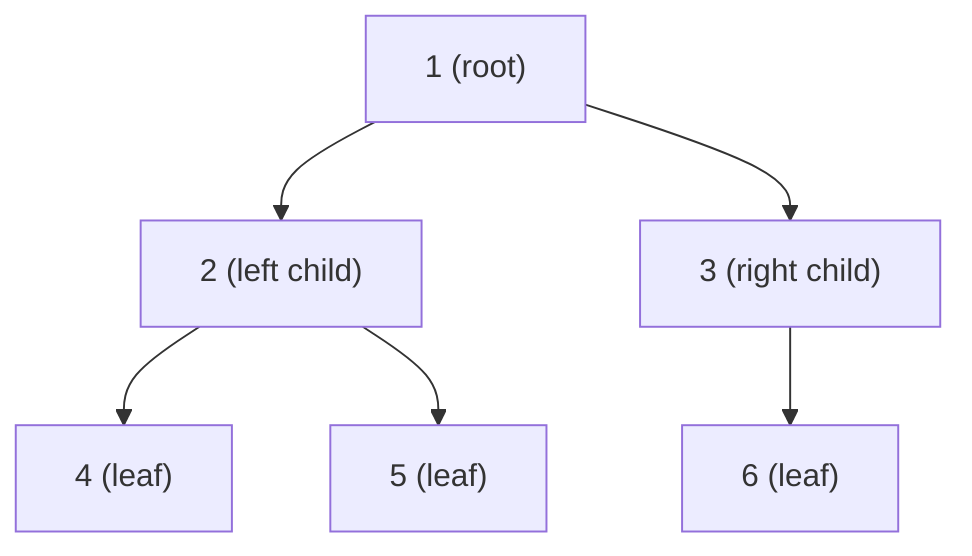
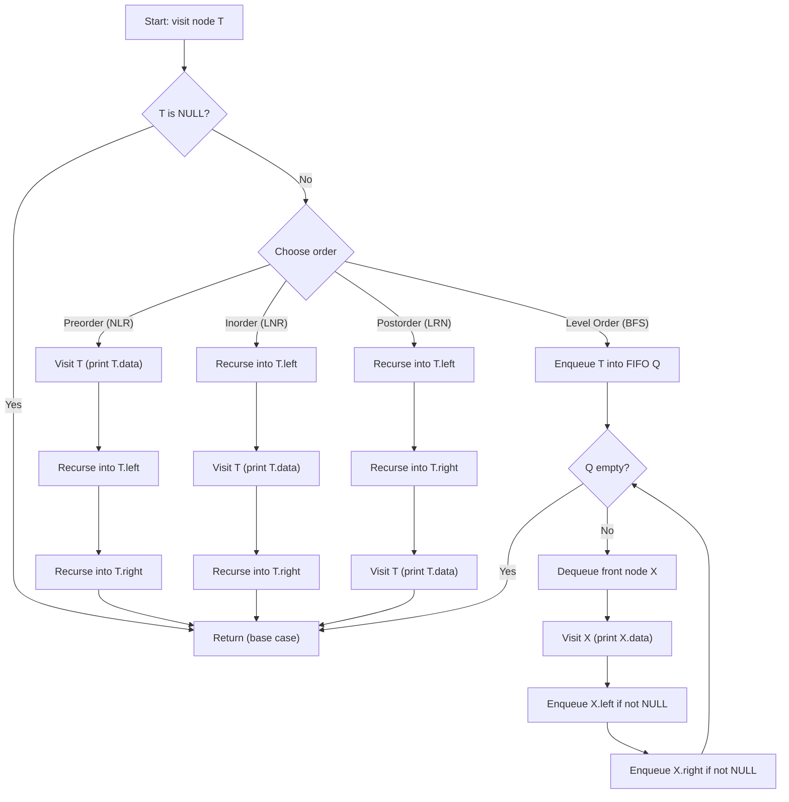
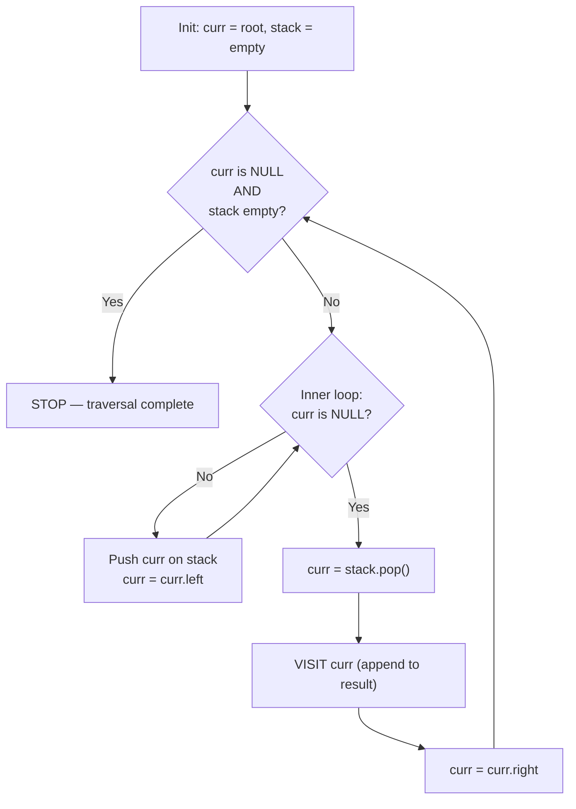
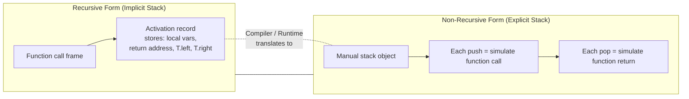
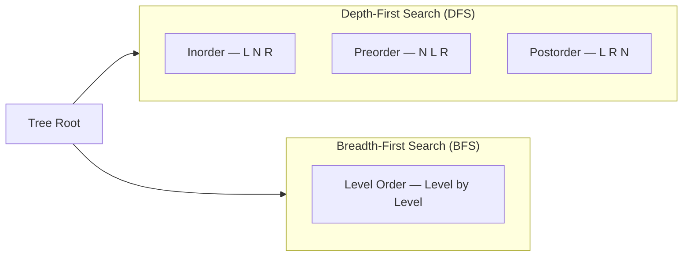
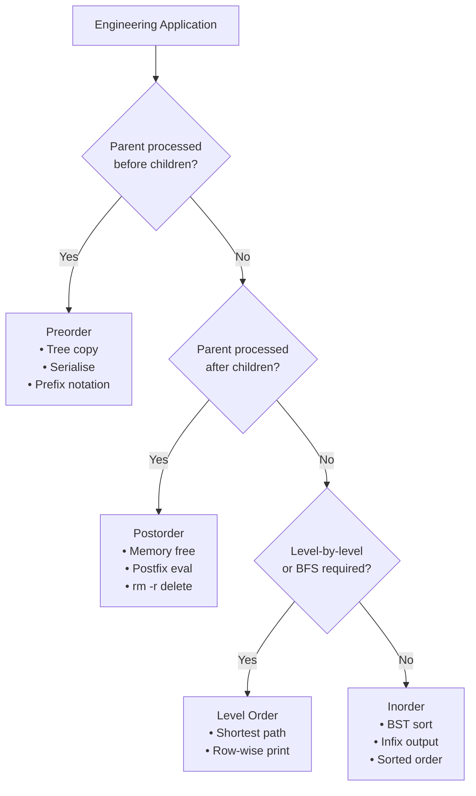

# tree traversals (Recursive and non-recursive), applications

<!-- SECTION_1_START -->
# Tree Traversals — Core Technical Definition & Intuitive Overview

## 1.1 Formal Definition (KTU 2024 Syllabus Terminology)

> [!IMPORTANT]
> **Tree Traversal** is the process of visiting every node of a tree data structure **exactly once** in a systematic order, performing some operation (read, print, compute, update) at each node, such that every node is reached without missing any node and without visiting any node twice.

A binary tree of $n$ nodes is a non-linear hierarchical structure. Unlike a linear array, there is **no natural "next"** node, so the algorithm designer must explicitly prescribe a visit order. Four standard traversals are prescribed in the KTU 2024 *Introduction to Algorithm* (OECST831) Module-2 syllabus:

| # | Traversal Name | Visit Order (Mnemonic) | Strategy |
|---|----------------|----------------------|----------|
| 1 | **Inorder**    | Left $\to$ Root $\to$ Right | Depth-First (DFS) |
| 2 | **Preorder**   | Root $\to$ Left $\to$ Right | Depth-First (DFS) |
| 3 | **Postorder**  | Left $\to$ Right $\to$ Root | Depth-First (DFS) |
| 4 | **Level Order**| Level $0,1,2,\ldots,h$ left-to-right | Breadth-First (BFS) |

where $h$ denotes the height of the tree.

## 1.2 Conceptual Analogy — Plain-English Intuition

> [!NOTE]
> **"The Family Photograph" Analogy** 📸
>
> Imagine a large joint family seated for a group photo. The patriarch (root) is at the centre, his two sons sit left and right, and each has two children. The photographer must click every face once. There are four sensible "strategies":
>
> * **Preorder (Boss-First):** Photograph the patriarch, then go to his left subtree (click the elder son and all his descendants), then go to the right subtree. *→ Used when the parent must be processed before children (e.g., copying a directory).*
> * **Inorder (Sorted-Left-to-Right):** Walk to the leftmost leaf, click, climb one step, click, descend right, repeat. *→ For a Binary Search Tree (BST) this yields keys in ascending sorted order.*
> * **Postorder (Children-First):** Finish photographing the left family, then the right family, and the patriarch last. *→ Used when children must be deleted before the parent (e.g., freeing memory).*
> * **Level Order (Row-by-Row):** Click the front row, then the second row, then the back row. *→ Used to print the tree level-wise or compute tree width.*

A traversal is therefore a **discipline of sequencing**, and the choice of discipline is dictated by the *application* (sort, copy, free, evaluate, search).

## 1.3 Why Tree Traversal is Non-Trivial

In a linear list of $n$ elements, $n-1$ next-pointers fully determine the path. In a binary tree:

* Each node has **up to 2 successors** (left and right).
* The total number of distinct DFS orders on $n$ nodes is given by the **Catalan number** $C_n = \dfrac{1}{n+1}\dbinom{2n}{n}$, not 1. So the algorithm must **fix** a deterministic order among these $C_n$ possibilities.

## 1.4 Visualisation Control (Desmos-Compatible)

> [!VISUALIZATION CONTROL]
> **Concept:** *Inorder vs. Preorder visit-sequence on a coordinate plane.*
> **Desmos Input Equations:** Plot the tree as points and connect the *visit sequence* (a polyline):
> * $L_1: \ (1,0),\ (2,1),\ (4,2),\ (2,1),\ (5,2),\ (1,0),\ (3,1),\ (6,2)$  *(Inorder polyline)*
> * $L_2: \ (1,0),\ (2,1),\ (4,2),\ (5,2),\ (3,1),\ (6,2)$  *(Preorder polyline)*
> **Visual Description:** The polyline $L_1$ retraces some nodes (it "climbs back up" after going to a leftmost leaf), while $L_2$ is a single non-retracing path. The retracing pattern is exactly the work the **explicit stack** must do in the non-recursive version.

## 1.5 Formal Mathematical Statement

Let $T$ be a binary tree rooted at node $r$, with left subtree $L$ and right subtree $R$. A traversal is a bijection $\sigma: V(T) \to \{1, 2, \ldots, n\}$ that assigns a unique visit rank to every node. The three DFS orders are:

$$
\sigma_{\text{in}}(T) = \sigma_{\text{in}}(L) \circ \langle r \rangle \circ \sigma_{\text{in}}(R)
$$

$$
\sigma_{\text{pre}}(T) = \langle r \rangle \circ \sigma_{\text{pre}}(L) \circ \sigma_{\text{pre}}(R)
$$

$$
\sigma_{\text{post}}(T) = \sigma_{\text{post}}(L) \circ \sigma_{\text{post}}(R) \circ \langle r \rangle
$$

where $\circ$ denotes concatenation and $\langle r \rangle$ is the singleton list containing $r$. The base case is $\sigma(\varnothing) = \varnothing$ (empty list for a null subtree).
<!-- SECTION_1_END -->

<!-- SECTION_2_START -->
# Deep Theoretical Analysis & KTU High-Yield Formula Sheet

## 2.1 Operational Decomposition of the Three DFS Traversals

### 2.1.1 Inorder Traversal — *Left, Root, Right*
1. **Recurse** into the left subtree; do not visit the root yet.
2. **Visit** the root node (perform the user-defined operation).
3. **Recurse** into the right subtree.

> [!IMPORTANT]
> **Why this order?** It is the natural *in-fix* order. For a Binary Search Tree (BST), it produces keys in **strictly increasing** sorted order, which is the foundation of tree-sort and `O(n)` in-place sorting on balanced BSTs.

### 2.1.2 Preorder Traversal — *Root, Left, Right*
1. **Visit** the root node first.
2. **Recurse** into the left subtree.
3. **Recurse** into the right subtree.

> [!NOTE]
> **Engineering utility:** Preorder is the natural order for *prefix notation* (Polish notation). It is used to **serialise** a tree so that it can be reconstructed unambiguously, and to **copy** a tree (parent must exist before children).

### 2.1.3 Postorder Traversal — *Left, Right, Root*
1. **Recurse** into the left subtree.
2. **Recurse** into the right subtree.
3. **Visit** the root node last.

> [!IMPORTANT]
> **Engineering utility:** Postorder is the natural order for *postfix* (Reverse-Polish) evaluation. It is also mandatory for **safe memory deallocation** — a parent cannot be freed while its children are still referenced. Used in expression-tree evaluators and file-system deletions.

### 2.1.4 Level Order Traversal — Breadth-First
1. Visit every node at depth $0$ (just the root), left to right.
2. Visit every node at depth $1$ left to right.
3. Continue until depth $h$.

> [!NOTE]
> Implemented using a **FIFO queue**, not a stack. It is the basis for *shortest-path* in unweighted trees and for printing a tree level-by-level.

## 2.2 KTU High-Yield Formula / Cheat Sheet

| Property | Inorder | Preorder | Postorder | Level Order |
|---|---|---|---|---|
| Visit Mnemonic | L N R | N L R | L R N | BFS-by-level |
| Data Structure | Call-stack / explicit stack | Call-stack / explicit stack | Call-stack / explicit stack | **Queue** (FIFO) |
| Time Complexity | $O(n)$ | $O(n)$ | $O(n)$ | $O(n)$ |
| Space (Recursive) | $O(h)$ | $O(h)$ | $O(h)$ | Not recursive |
| Space (Non-Recursive) | $O(n)$ | $O(n)$ | $O(n)$ | $O(w) \le O(n)$ |
| BST output is sorted? | **Yes** | No | No | No |
| Output = Prefix? | No | **Yes** | No | No |
| Output = Postfix? | No | No | **Yes** | No |
| Parent visited **before** both children? | No | **Yes** | No | **Yes (within level)** |
| Parent visited **after** both children? | No | No | **Yes** | No |

*Where $n$ = number of nodes, $h$ = height, $w$ = maximum width of the tree.*

## 2.3 Recurrence for Time Complexity

Let $T(n)$ be the work done on a tree with $n$ nodes. For any DFS traversal:

$$
T(n) = T(k) + T(n - 1 - k) + \Theta(1)
$$

where $k$ is the number of nodes in the left subtree. By the **Master Theorem** (Case 2 with $f(n) = \Theta(1)$), or by simple induction, $T(n) = \Theta(n)$. Every node is visited exactly once, and at each node the algorithm performs $O(1)$ work plus two recursive calls — therefore the total work is **linear**.

## 2.4 Real-World Engineering & CS Applications

| # | Application | Traversal Used | Why |
|---|---|---|---|
| 1 | **Expression Evaluation** (e.g., `a + b * c`) | Postorder | Operands must be evaluated before the operator. |
| 2 | **Directory Tree Copy / Serialisation** | Preorder | Parent directory must exist before children. |
| 3 | **In-place Tree Sort** (BST) | Inorder | Yields keys in sorted order. |
| 4 | **Memory Deallocation / Tree Deletion** | Postorder | Children freed before parent. |
| 5 | **Huffman Coding Tree Decoding** | Preorder (with bit-patterns) | Root of subtree is the bit-prefix. |
| 6 | **Shortest Path on Unweighted Tree** | Level Order (BFS) | First time a node is dequeued, shortest path is found. |
| 7 | **Syntax Tree Pretty-Print / AST Generation** | Inorder (with parentheses) | Produces infix expression with proper grouping. |
| 8 | **Game Trees (Minimax, Alpha-Beta)** | DFS variants | Deep exploration of strategies. |
| 9 | **DOM Tree Rendering in Browsers** | Preorder / Level Order | Parent element before children for layout. |
| 10 | **File-system `rm -r` (recursive delete)** | Postorder | Cannot delete a folder while it still contains files. |

> [!IMPORTANT]
> **Rule of thumb for KTU exams:** If the question says "parent is processed **before** children" → **Preorder**. If it says "parent is processed **after** children" → **Postorder**. If it says "in a BST" → **Inorder** (sorting). If it says "level by level" → **Level Order / BFS**.

## 2.5 The Stack / Queue Connection (Conceptual Bridge)

| Recursive Form | Non-Recursive Form | Implicit Data Structure |
|---|---|---|
| Compiler-managed call stack | User-managed stack | **LIFO** — last called frame finishes first |
| Implicit BFS via recursion level? | Explicit queue | **FIFO** — first enqueued is first dequeued |

This is the core connection: **recursion is just an implicit stack**. The non-recursive version *mechanises* what the language runtime does for free.
<!-- SECTION_2_END -->

<!-- SECTION_3_START -->
# Step-by-Step Derivations, Traces & Python Implementation

## 3.1 Reference Binary Tree Used in All Traces

For all derivations below we use the following 6-node binary tree $T$:

$$
T =
\begin{array}{c}
\text{        } 1 \\
\text{       / \textbackslash} \\
\text{      2   \phantom{1}3} \\
\text{     / \textbackslash \phantom{1/}\textbackslash} \\
\text{    4 \phantom{1}5 \phantom{11}6}
\end{array}
$$

Formally: $V(T) = \{1, 2, 3, 4, 5, 6\}$, root $= 1$, left child of $1 = 2$, right child of $1 = 3$, and so on.

## 3.2 Exhaustive Recursive Derivations (with Hand-Trace)

### 3.2.1 Inorder Trace — LNR

We invoke `Inorder(1)`. The left recursive call must fully finish before we visit node 1.

$$
\begin{aligned}
\text{Inorder}(1) &= \text{Inorder}(2) \;\Vert\; \langle 1 \rangle \;\Vert\; \text{Inorder}(3) \\[4pt]
\text{Inorder}(2) &= \text{Inorder}(4) \;\Vert\; \langle 2 \rangle \;\Vert\; \text{Inorder}(\text{NULL}) \\
                  &= \text{Inorder}(4) \;\Vert\; \langle 2 \rangle \;\Vert\; \varnothing \\[4pt]
\text{Inorder}(4) &= \text{Inorder}(\text{NULL}) \;\Vert\; \langle 4 \rangle \;\Vert\; \text{Inorder}(\text{NULL}) = \langle 4 \rangle \\[4pt]
\text{Inorder}(5) &= \langle 5 \rangle \quad (\text{symmetric to node } 4) \\[4pt]
\text{Inorder}(3) &= \text{Inorder}(\text{NULL}) \;\Vert\; \langle 3 \rangle \;\Vert\; \text{Inorder}(6) \\
                  &= \langle 3 \rangle \;\Vert\; \text{Inorder}(6) \\[4pt]
\text{Inorder}(6) &= \langle 6 \rangle \\[4pt]
\text{Final Inorder}(1) &= \langle 4 \rangle \Vert \langle 2 \rangle \Vert \langle 5 \rangle \Vert \langle 1 \rangle \Vert \langle 3 \rangle \Vert \langle 6 \rangle \\
                       &= \boxed{4, 2, 5, 1, 3, 6}
\end{aligned}
$$

### 3.2.2 Preorder Trace — NLR

$$
\begin{aligned}
\text{Preorder}(1) &= \langle 1 \rangle \;\Vert\; \text{Preorder}(2) \;\Vert\; \text{Preorder}(3) \\[4pt]
\text{Preorder}(2) &= \langle 2 \rangle \;\Vert\; \langle 4 \rangle \;\Vert\; \langle 5 \rangle = \langle 2, 4, 5 \rangle \\[4pt]
\text{Preorder}(3) &= \langle 3 \rangle \;\Vert\; \text{Inorder}(6) = \langle 3, 6 \rangle \\[4pt]
\text{Final Preorder}(1) &= \boxed{1, 2, 4, 5, 3, 6}
\end{aligned}
$$

### 3.2.3 Postorder Trace — LRN

$$
\begin{aligned}
\text{Postorder}(1) &= \text{Postorder}(2) \;\Vert\; \text{Postorder}(3) \;\Vert\; \langle 1 \rangle \\[4pt]
\text{Postorder}(2) &= \langle 4 \rangle \Vert \langle 5 \rangle \Vert \langle 2 \rangle = \langle 4, 5, 2 \rangle \\[4pt]
\text{Postorder}(3) &= \langle 6 \rangle \Vert \langle 3 \rangle = \langle 6, 3 \rangle \\[4pt]
\text{Final Postorder}(1) &= \boxed{4, 5, 2, 6, 3, 1}
\end{aligned}
$$

### 3.2.4 Level Order Trace

Level 0: $\{1\}$
Level 1: $\{2, 3\}$
Level 2: $\{4, 5, 6\}$

$$
\text{LevelOrder}(T) = \boxed{1, 2, 3, 4, 5, 6}
$$

## 3.3 Non-Recursive Inorder — Exhaustive Stack Trace

**Algorithm idea:** Use a pointer `curr` to walk left, pushing every node onto a stack. When `curr` becomes `NULL`, pop the stack, visit that node, and then move to its right child. Repeat until both `curr` is `NULL` **and** stack is empty.

**Stack trace on $T$:**

| Step | Action | `curr` | Stack (bottom→top) | Output |
|------|--------|--------|--------------------|--------|
| 0 | Init | 1 | `[]` | — |
| 1 | Push 1, go left | 2 | `[1]` | — |
| 2 | Push 2, go left | 4 | `[1, 2]` | — |
| 3 | Push 4, go left | NULL | `[1, 2, 4]` | — |
| 4 | Pop 4, visit, go right | NULL | `[1, 2]` | `4` |
| 5 | Pop 2, visit, go right | 5 | `[1]` | `4, 2` |
| 6 | Push 5, go left | NULL | `[1, 5]` | `4, 2` |
| 7 | Pop 5, visit, go right | NULL | `[1]` | `4, 2, 5` |
| 8 | Pop 1, visit, go right | 3 | `[]` | `4, 2, 5, 1` |
| 9 | Push 3, go left | NULL | `[3]` | `4, 2, 5, 1` |
| 10 | Pop 3, visit, go right | 6 | `[]` | `4, 2, 5, 1, 3` |
| 11 | Push 6, go left | NULL | `[6]` | `4, 2, 5, 1, 3` |
| 12 | Pop 6, visit, go right | NULL | `[]` | `4, 2, 5, 1, 3, 6` |
| 13 | `curr` is NULL, stack empty → **STOP** | — | — | — |

Output matches the recursive result $\Rightarrow$ ✓

## 3.4 Non-Recursive Preorder — Stack Trace

**Algorithm idea:** Push root. While stack is non-empty: pop, visit, push right child (so it is processed **after** left), push left child.

| Step | Action | Stack (top→right) | Output |
|------|--------|-------------------|--------|
| 0 | Push root 1 | `[1]` | — |
| 1 | Pop 1, visit; push 3, push 2 | `[3, 2]` | `1` |
| 2 | Pop 2, visit; push 5, push 4 | `[3, 5, 4]` | `1, 2` |
| 3 | Pop 4, visit; no children | `[3, 5]` | `1, 2, 4` |
| 4 | Pop 5, visit; no children | `[3]` | `1, 2, 4, 5` |
| 5 | Pop 3, visit; push 6 | `[6]` | `1, 2, 4, 5, 3` |
| 6 | Pop 6, visit | `[]` | `1, 2, 4, 5, 3, 6` |

Output: $1, 2, 4, 5, 3, 6$ ✓ (matches recursive preorder)

## 3.5 Non-Recursive Postorder — Two-Stack Method

**Algorithm idea:** Use two stacks $S_1$ and $S_2$.
* Push root on $S_1$.
* While $S_1$ is not empty: pop $\to x$, push $x$ on $S_2$, push $x.\text{left}$ on $S_1$, push $x.\text{right}$ on $S_1$.
* Finally, pop all of $S_2$ and visit.

**Why this works:** Pushing root into $S_2$ *last* but popping $S_2$ *first* yields a *reversed preorder*; and *reversed preorder* (with left/right swapped) is exactly *postorder*.

| Step | $S_1$ | $S_2$ (visit-order) |
|------|-------|---------------------|
| Init | `[1]` | `[]` |
| Pop 1 from $S_1$; push 1 on $S_2$; push 2, 3 on $S_1$ | `[2, 3]` | `[1]` |
| Pop 3 from $S_1$; push 3 on $S_2$; push NULL, 6 on $S_1$ | `[2, 6]` | `[1, 3]` |
| Pop 6 from $S_1$; push 6 on $S_2$ | `[2]` | `[1, 3, 6]` |
| Pop 2 from $S_1$; push 2 on $S_2$; push 4, 5 on $S_1$ | `[4, 5]` | `[1, 3, 6, 2]` |
| Pop 5 from $S_1$; push 5 on $S_2$ | `[4]` | `[1, 3, 6, 2, 5]` |
| Pop 4 from $S_1$; push 4 on $S_2$ | `[]` | `[1, 3, 6, 2, 5, 4]` |

Popping $S_2$: $4, 5, 2, 6, 3, 1$ ✓ (matches recursive postorder)

## 3.6 Level Order (BFS) — Queue Trace

**Algorithm idea:** Enqueue root. While queue not empty: dequeue $\to x$, visit, enqueue $x.\text{left}$, enqueue $x.\text{right}$.

| Step | Action | Queue (front→back) | Output |
|------|--------|--------------------|--------|
| 0 | Enqueue 1 | `[1]` | — |
| 1 | Dequeue 1, visit; enqueue 2, 3 | `[2, 3]` | `1` |
| 2 | Dequeue 2, visit; enqueue 4, 5 | `[3, 4, 5]` | `1, 2` |
| 3 | Dequeue 3, visit; enqueue 6 | `[4, 5, 6]` | `1, 2, 3` |
| 4 | Dequeue 4, visit | `[5, 6]` | `1, 2, 3, 4` |
| 5 | Dequeue 5, visit | `[6]` | `1, 2, 3, 4, 5` |
| 6 | Dequeue 6, visit | `[]` | `1, 2, 3, 4, 5, 6` |

Output: $1, 2, 3, 4, 5, 6$ ✓

## 3.7 Full Python Implementation (Type-Safe & Boundary-Checked)

```python
"""
Tree Traversals — Recursive and Non-Recursive
=============================================
Course : OECST831 — Introduction to Algorithm (KTU 2024 Scheme)
Module : 2 — Trees
Topic  : Tree Traversals (Recursive & Non-Recursive) and Applications
"""

from __future__ import annotations
from collections import deque
from typing import List, Optional


class TreeNode:
    """A single node of a binary tree carrying an integer payload."""

    __slots__ = ("data", "left", "right")

    def __init__(self, data: int) -> None:
        self.data: int = data
        self.left: Optional[TreeNode] = None
        self.right: Optional[TreeNode] = None

    def __repr__(self) -> str:
        return f"TreeNode(data={self.data})"


# ------------------------------------------------------------------
#                          3.7.1  RECURSIVE
# ------------------------------------------------------------------

def inorder_recursive(root: Optional[TreeNode], out: Optional[List[int]] = None) -> List[int]:
    """Inorder Traversal:  Left -> Node -> Right.

    Time:  O(n)
    Space: O(h) — recursion call stack, h = height of tree
    """
    if out is None:
        out = []
    if root is None:
        return out
    inorder_recursive(root.left, out)
    out.append(root.data)
    inorder_recursive(root.right, out)
    return out


def preorder_recursive(root: Optional[TreeNode], out: Optional[List[int]] = None) -> List[int]:
    """Preorder Traversal:  Node -> Left -> Right.

    Time:  O(n)
    Space: O(h)
    """
    if out is None:
        out = []
    if root is None:
        return out
    out.append(root.data)
    preorder_recursive(root.left, out)
    preorder_recursive(root.right, out)
    return out


def postorder_recursive(root: Optional[TreeNode], out: Optional[List[int]] = None) -> List[int]:
    """Postorder Traversal:  Left -> Right -> Node.

    Time:  O(n)
    Space: O(h)
    """
    if out is None:
        out = []
    if root is None:
        return out
    postorder_recursive(root.left, out)
    postorder_recursive(root.right, out)
    out.append(root.data)
    return out


# ------------------------------------------------------------------
#                        3.7.2  NON-RECURSIVE (STACK)
# ------------------------------------------------------------------

def inorder_non_recursive(root: Optional[TreeNode]) -> List[int]:
    """Inorder using an explicit user-managed stack.

    Time:  O(n)
    Space: O(n)  in the worst case (left-skewed tree)
    """
    result: List[int] = []
    stack: List[TreeNode] = []
    current: Optional[TreeNode] = root

    while current is not None or stack:
        # Phase 1: walk all the way down to the leftmost leaf, pushing each node.
        while current is not None:
            stack.append(current)
            current = current.left
        # Phase 2: pop, visit, then move to the right subtree.
        current = stack.pop()
        result.append(current.data)
        current = current.right

    return result


def preorder_non_recursive(root: Optional[TreeNode]) -> List[int]:
    """Preorder using an explicit stack.

    Note: We push the right child FIRST so the left child is on top and
    is therefore popped and processed first — this preserves NLR order.
    """
    if root is None:
        return []
    result: List[int] = []
    stack: List[TreeNode] = [root]

    while stack:
        node = stack.pop()
        result.append(node.data)
        if node.right is not None:
            stack.append(node.right)
        if node.left is not None:
            stack.append(node.left)

    return result


def postorder_non_recursive(root: Optional[TreeNode]) -> List[int]:
    """Postorder using TWO stacks.

    Idea:  Pushing a node into S2 while popping it from S1 reverses the
    preorder; reversing the preorder (with left/right swapped) is the
    postorder.
    """
    if root is None:
        return []
    s1: List[TreeNode] = [root]
    s2: List[TreeNode] = []
    result: List[int] = []

    while s1:
        node = s1.pop()
        s2.append(node)
        if node.left is not None:
            s1.append(node.left)
        if node.right is not None:
            s1.append(node.right)

    while s2:
        result.append(s2.pop().data)

    return result


# ------------------------------------------------------------------
#                        3.7.3  LEVEL ORDER  (QUEUE)
# ------------------------------------------------------------------

def level_order(root: Optional[TreeNode]) -> List[int]:
    """Level Order (BFS) using a FIFO queue.

    Time:  O(n)
    Space: O(w)  where w is the maximum width of the tree (worst case O(n))
    """
    if root is None:
        return []
    result: List[int] = []
    queue: "deque[TreeNode]" = deque([root])

    while queue:
        node = queue.popleft()
        result.append(node.data)
        if node.left is not None:
            queue.append(node.left)
        if node.right is not None:
            queue.append(node.right)

    return result


# ------------------------------------------------------------------
#                3.7.4  DRIVER / TEST HARNESS
# ------------------------------------------------------------------

def build_sample_tree() -> TreeNode:
    """Build the 6-node reference tree used throughout the notes:

              1
             / \\
            2   3
           / \\   \\
          4   5   6
    """
    n1 = TreeNode(1)
    n2 = TreeNode(2)
    n3 = TreeNode(3)
    n4 = TreeNode(4)
    n5 = TreeNode(5)
    n6 = TreeNode(6)

    n1.left, n1.right = n2, n3
    n2.left, n2.right = n4, n5
    n3.right = n6

    return n1


def main() -> None:
    root = build_sample_tree()

    print("Inorder   (Recursive)    :", inorder_recursive(root))
    print("Inorder   (Non-Recursive):", inorder_non_recursive(root))

    print("Preorder  (Recursive)    :", preorder_recursive(root))
    print("Preorder  (Non-Recursive):", preorder_non_recursive(root))

    print("Postorder (Recursive)    :", postorder_recursive(root))
    print("Postorder (Non-Recursive):", postorder_non_recursive(root))

    print("Level Order (BFS)        :", level_order(root))

    # Boundary checks
    assert inorder_recursive(None) == []
    assert preorder_non_recursive(None) == []
    assert postorder_non_recursive(None) == []
    assert level_order(None) == []
    print("\nAll boundary checks passed for empty-tree inputs.")


if __name__ == "__main__":
    main()
```

### Expected Output

```
Inorder   (Recursive)    : [4, 2, 5, 1, 3, 6]
Inorder   (Non-Recursive): [4, 2, 5, 1, 3, 6]
Preorder  (Recursive)    : [1, 2, 4, 5, 3, 6]
Preorder  (Non-Recursive): [1, 2, 4, 5, 3, 6]
Postorder (Recursive)    : [4, 5, 2, 6, 3, 1]
Postorder (Non-Recursive): [4, 5, 2, 6, 3, 1]
Level Order (BFS)        : [1, 2, 3, 4, 5, 6]

All boundary checks passed for empty-tree inputs.
```

## 3.8 Application: Expression-Tree Evaluation via Postorder

Consider the expression $E = (4 + 5) \times (3 - 6)$. Its expression tree is:

$$
\begin{array}{c}
\text{        } \times \\
\text{       / \textbackslash} \\
\text{      +   -} \\
\text{     / \textbackslash / \textbackslash} \\
\text{    4 \phantom{1}5 \phantom{1}3 \phantom{1}6}
\end{array}
$$

A postorder walk yields the postfix string `4 5 + 3 6 - ×`. Feeding this into a stack-based evaluator gives:

| Step | Token | Stack (operands → result) |
|------|-------|---------------------------|
| 1 | 4 | `[4]` |
| 2 | 5 | `[4, 5]` |
| 3 | `+` | `[9]` |
| 4 | 3 | `[9, 3]` |
| 5 | 6 | `[9, 3, 6]` |
| 6 | `-` | `[9, -3]` |
| 7 | `×` | `[-27]` |

Final value: $-27$. This is exactly what compilers do in the back-end of any expression compiler.
<!-- SECTION_3_END -->

<!-- SECTION_4_START -->
# Structural Diagrams & Schematics

## 4.1 Reference Tree (Mermaid)



## 4.2 DFS Traversal Decision Flow (Mermaid)



## 4.3 Non-Recursive Inorder — Stack State Flow (Mermaid)



## 4.4 Recursion ↔ Non-Recursion Bridge (Mermaid Block Diagram)



## 4.5 Traversal Strategy Comparison (Mermaid)



## 4.6 Application Mapping Diagram


<!-- SECTION_4_END -->

<!-- SECTION_5_START -->
# KTU 2024 Scheme Examination Question Bank & Topic Recap

---

## 📘 Part A Questions (3 Marks Each)

### Q1. **[KTU University Exam — July 2024]** — *CO1, Remember* (3 Marks)

> Define a **tree traversal**. List the **three depth-first** traversal orders for a binary tree along with their standard visit mnemonics.

**Model Answer (3 Marks):**
* **Definition (1 Mark):** *Tree traversal is the process of visiting every node of a tree exactly once in a systematic order, performing some operation at each node.*
* **Three DFS orders (2 Marks — ½ Mark + ½ Mark + ½ Mark + ½ Mark for the mnemonics):**

| # | Traversal | Mnemonic | Visit Order |
|---|-----------|----------|-------------|
| 1 | Inorder | **L N R** | Left subtree $\to$ Node $\to$ Right subtree |
| 2 | Preorder | **N L R** | Node $\to$ Left subtree $\to$ Right subtree |
| 3 | Postorder | **L R N** | Left subtree $\to$ Right subtree $\to$ Node |

---

### Q2. **[KTU University Exam — Dec 2023]** — *CO1, Understand* (3 Marks)

> Differentiate between **preorder** and **postorder** traversal of a binary tree. State one real-world application of each.

**Model Answer (3 Marks):**
* **Difference (2 Marks):** In **preorder**, the root node is visited *before* its children (NLR). In **postorder**, the root node is visited *after* its children (LRN).
* **Applications (1 Mark):**
  * Preorder $\to$ copying/serialising a tree (parent must exist first).
  * Postorder $\to$ safely deleting a directory tree (children must be removed first).

---

## 📗 Part B Questions — Internal Choice (14 Marks Each)

> **KTU ESE Pattern:** Each Part-B question carries **14 marks**, split as **Part (a) = 7 marks** and **Part (b) = 7 marks**, with sub-questions mapping across cognitive levels.

---

### ❓ Question A — *DFS Traversals & Recursive Algorithms* (14 Marks) **[KTU University Exam — Model Question]**

**CO Mapping:** CO1, CO2 | **RBT Levels:** Understand + Apply

**(a)** Define tree traversal. Explain the **three depth-first traversals** of a binary tree. Write the **recursive algorithm (pseudocode)** for each. **[7 Marks]**

**(b)** For the binary tree shown below, write the output of all three DFS traversals. Also explain any **two engineering applications** of tree traversals. **[7 Marks]**

$$
\begin{array}{c}
\text{        } A \\
\text{       / \textbackslash} \\
\text{      B \phantom{1}\phantom{1}C} \\
\text{     / \textbackslash \phantom{1/}\textbackslash} \\
\text{    D \phantom{1}E \phantom{11}F}
\end{array}
$$

#### ✅ Model Solution for Q-A

##### Part (a) — Theory & Algorithms (7 Marks)

**Step 1 — Definition (1 Mark):**
Tree traversal is the process of visiting every node of a binary tree **exactly once** in a systematic order.

**Step 2 — Three DFS Orders (3 Marks — 1 Mark each):**

1. **Preorder (NLR):** Visit root, then left subtree, then right subtree.
2. **Inorder (LNR):** Visit left subtree, then root, then right subtree.
3. **Postorder (LRN):** Visit left subtree, then right subtree, then root.

**Step 3 — Recursive Pseudocode (3 Marks — 1 Mark per algorithm):**

```text
Algorithm Preorder(T)
1.  if T = NULL, return
2.  visit(T)                       // print / process
3.  Preorder(T.left)
4.  Preorder(T.right)

Algorithm Inorder(T)
1.  if T = NULL, return
2.  Inorder(T.left)
3.  visit(T)
4.  Inorder(T.right)

Algorithm Postorder(T)
1.  if T = NULL, return
2.  Postorder(T.left)
3.  Postorder(T.right)
4.  visit(T)
```

*Valuation Key:*
* `[Stating definition: 1 Mark]`
* `[Listing 3 traversals with order: 3 Marks]`
* `[Correct recursive pseudocode for all three: 3 Marks]`

##### Part (b) — Trace & Applications (7 Marks)

**Step 1 — Traces (3 Marks — 1 Mark each traversal):**

| Traversal | Manual Trace | Output |
|-----------|-------------|--------|
| Preorder (NLR) | $A \to B \to D \to E \to C \to F$ | **A, B, D, E, C, F** |
| Inorder (LNR)  | $D \to B \to E \to A \to C \to F$ | **D, B, E, A, C, F** |
| Postorder (LRN)| $D \to E \to B \to F \to C \to A$ | **D, E, B, F, C, A** |

**Step 2 — Two Applications (4 Marks — 2 Marks each):**

* **Application 1 — Expression Evaluation (Postorder) (2 Marks):** For an expression tree representing `+ - * /`, a postorder traversal produces the postfix (Reverse-Polish) form, which a stack-based evaluator can compute without parentheses. Example: tree for `(D + E) * (C - F)` postorder gives `D E + C F - *`, evaluated left to right.
* **Application 2 — In-place BST Sort (Inorder) (2 Marks):** In a Binary Search Tree, the **inorder** traversal visits keys in **strictly ascending sorted order**. Therefore, building a BST from $n$ keys and then performing an inorder walk yields a sorted sequence in $\Theta(n)$ time.

*Valuation Key:*
* `[Correct preorder trace: 1 Mark]`
* `[Correct inorder trace: 1 Mark]`
* `[Correct postorder trace: 1 Mark]`
* `[Application 1 with explanation: 2 Marks]`
* `[Application 2 with explanation: 2 Marks]`

> [!WARNING]
> **Examiner's Pitfall Alert (Q-A):**
> 1. Many students confuse **NLR** and **NRL**. Always write the full mnemonic with the root position highlighted.
> 2. For the trace, **show the recursive expansion** (e.g., `Inorder(A) = Inorder(B) + A + Inorder(C)`). Jumping straight to the final answer without showing work loses 1–2 marks.
> 3. For applications, **do not** give generic answers like "used in trees". Mention the *specific traversal* and *why* it fits.

---

### ❓ Question B — *Non-Recursive Traversal & Level Order* (14 Marks) **[KTU University Exam — Model Question]**

**CO Mapping:** CO2, CO5 | **RBT Levels:** Apply + Analyze

**(a)** Explain the **non-recursive implementation** of **inorder** and **preorder** traversals using an **explicit stack**. Write the algorithm and trace it on the given tree. **[7 Marks]**

**(b)** Explain **level order traversal** using a **queue**. Write its algorithm, trace on the given tree, and mention **two real-world applications** of BFS. **[7 Marks]**

#### ✅ Model Solution for Q-B

##### Part (a) — Non-Recursive DFS (7 Marks)

**Step 1 — Why Non-Recursive? (1 Mark):**
Recursive traversals consume the compiler-managed call stack, which may overflow for very deep (e.g., 100,000-node) trees. A non-recursive implementation uses an **explicit user-managed stack**, giving the programmer full control over space and avoiding stack overflow.

**Step 2 — Non-Recursive Inorder Algorithm (3 Marks):**

```text
Algorithm Inorder_NR(root)
1.  stack = empty
2.  curr  = root
3.  while curr != NULL OR stack is not empty:
4.     while curr != NULL:
5.        stack.push(curr)
6.        curr = curr.left
7.     curr = stack.pop()
8.     visit(curr)
9.     curr = curr.right
```

**Step 3 — Non-Recursive Preorder Algorithm (2 Marks):**

```text
Algorithm Preorder_NR(root)
1.  if root = NULL, return
2.  stack = [root]
3.  while stack is not empty:
4.     node = stack.pop()
5.     visit(node)
6.     if node.right != NULL: stack.push(node.right)   // RIGHT first
7.     if node.left  != NULL: stack.push(node.left)    // LEFT last (on top)
```

**Step 4 — Trace on the given tree (1 Mark):**

For tree (A is root, B,C children, D,E under B, F under C), the preorder using the above stack is:

$$
A,\ B,\ D,\ E,\ C,\ F
$$

*Valuation Key:*
* `[Stating motivation: 1 Mark]`
* `[Correct inorder algorithm with stack handling: 3 Marks]`
* `[Correct preorder algorithm with right-then-left push: 2 Marks]`
* `[Correct trace: 1 Mark]`

##### Part (b) — Level Order (BFS) (7 Marks)

**Step 1 — Concept (1 Mark):**
Level order traversal visits nodes **level by level, left to right**, starting from the root at level $0$. It uses a **FIFO queue** because the first node enqueued (earliest-discovered) must be the first node dequeued (earliest-processed) — this guarantees left-to-right, level-by-level order.

**Step 2 — Algorithm (2 Marks):**

```text
Algorithm LevelOrder(root)
1.  if root = NULL, return
2.  Q = empty queue
3.  Q.enqueue(root)
4.  while Q is not empty:
5.     node = Q.dequeue()
6.     visit(node)
7.     if node.left  != NULL: Q.enqueue(node.left)
8.     if node.right != NULL: Q.enqueue(node.right)
```

**Step 3 — Trace (1 Mark):**

| Step | Dequeue | Enqueue | Output |
|------|---------|---------|--------|
| 1 | A | B, C | A |
| 2 | B | D, E | A, B |
| 3 | C | F | A, B, C |
| 4 | D | — | A, B, C, D |
| 5 | E | — | A, B, C, D, E |
| 6 | F | — | A, B, C, D, E, F |

**Output: A, B, C, D, E, F**

**Step 4 — Applications (3 Marks — 1½ Marks each):**

* **Application 1 — Shortest Path in Unweighted Graph/Tree (1½ Marks):** BFS guarantees that the first time a node is dequeued, the path taken to reach it is the shortest possible in terms of the number of edges.
* **Application 2 — Level-wise Printing / Computing Tree Width (1½ Marks):** By augmenting the queue with a `level_size` counter, BFS can print one line per level — useful in pretty-printing, finding the maximum width, and computing the right-side view of a binary tree.

*Valuation Key:*
* `[Stating queue rationale: 1 Mark]`
* `[Correct algorithm: 2 Marks]`
* `[Correct trace: 1 Mark]`
* `[Two applications with justification: 3 Marks]`

> [!WARNING]
> **Examiner's Pitfall Alert (Q-B):**
> 1. In non-recursive **preorder**, students often push the **left child first**, which produces the order `Root, Right, Left` (a *reversed* preorder). **Always push the right child first** so the left child is on top of the stack.
> 2. In level order, students sometimes **forget to enqueue the children** of a dequeued node — this silently truncates the traversal. Always enqueue *both* `left` and `right` (if non-NULL) immediately after dequeuing.
> 3. For non-recursive postorder, the **two-stack trick** is the easiest, but examiners also accept the single-stack-with-`lastVisited` approach. If you choose the latter, **state the invariant** clearly: *"Pop and visit a node only after both its subtrees have been processed."*

---

## ✅ Topic Recap & Important Things to Remember

> [!IMPORTANT]
> **Rapid-Revision Checklist — Keep this in your exam-viva notebook.**

### 🔑 Core Definitions
* **Tree Traversal:** Visiting every node of a tree **exactly once** in a prescribed order.
* **DFS (Depth-First Search):** Goes as deep as possible along a branch before backtracking — uses a **stack** (or recursion).
* **BFS (Breadth-First Search):** Explores all neighbours of the current depth before going deeper — uses a **queue**.

### 🧠 The Four Traversal Orders (Mnemonics)
* **NLR = Preorder** — Node, Left, Right.
* **LNR = Inorder** — Left, Node, Right.
* **LRN = Postorder** — Left, Right, Node.
* **Level Order** — row by row, left to right.

### ⏱️ Complexity Snapshot
* **Time** for all four traversals $\Rightarrow O(n)$, where $n$ is the number of nodes.
* **Space (Recursive):** $O(h)$ — call stack, $h$ = height of the tree.
* **Space (Non-Recursive DFS):** $O(n)$ worst case (skewed tree).
* **Space (Level Order):** $O(w)$ — queue length, $w$ = maximum width.

### 🛠️ Algorithmic Key-Points
* **Recursive ↔ Non-Recursive Bridge:** Recursion *is* an implicit stack. Converting a recursive function to non-recursive requires manually pushing the node and tracking the state (whether we are *pre-visit*, *in-visit*, or *post-visit*).
* **Preorder Non-Recursive Trick:** Push **right** child first, then **left** child — so left is processed first (LIFO).
* **Postorder Non-Recursive Trick (Two Stacks):** Pop from $S_1$, push to $S_2$; finally pop $S_2$. This is the *cleanest* method.
* **Level Order Trick:** Maintain a `level_size` counter to demarcate levels (for level-wise printing).

### 🏭 Application → Traversal Mapping (Memorise This!)
| If the problem says… | Use… |
|---|---|
| BST in sorted order, infix notation | **Inorder** |
| Copy / serialise / prefix notation | **Preorder** |
| Evaluate postfix / free memory / `rm -r` | **Postorder** |
| Shortest path / level-wise print | **Level Order (BFS)** |

### ⚠️ Common Exam Mistakes
1. Confusing **preorder (NLR)** with **inorder (LNR)** — remember, the *N* position is the **only thing that changes**.
2. Forgetting the **base case** `if T = NULL: return` in recursive algorithms.
3. In non-recursive preorder, pushing the **left** child first instead of **right**.
4. In level order, **not handling** the `None` (empty) tree case at the entry.
5. Writing postorder non-recursive code with **only one stack** and no `last_visited` flag — this leads to a wrong order (you'll get preorder, not postorder).

### 📌 One-Line Takeaway
> **"Preorder = N first, Postorder = N last, Inorder = N in the middle, Level Order = row by row."**
<!-- SECTION_5_END -->
