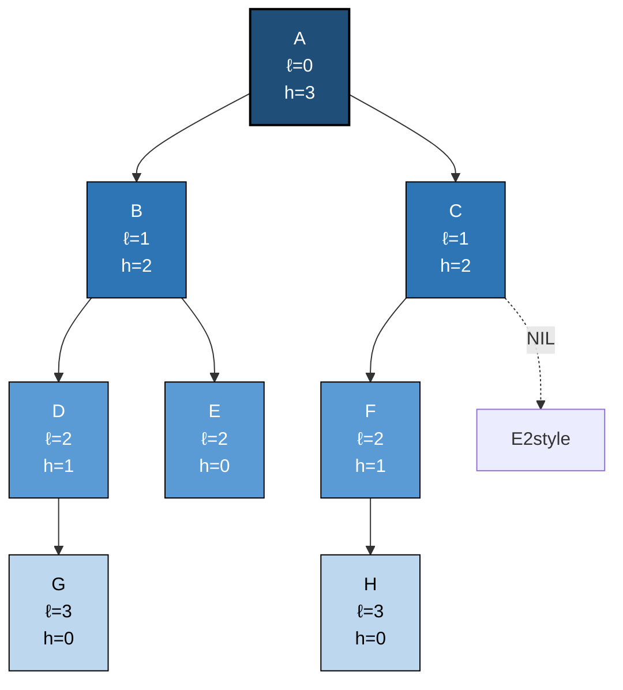
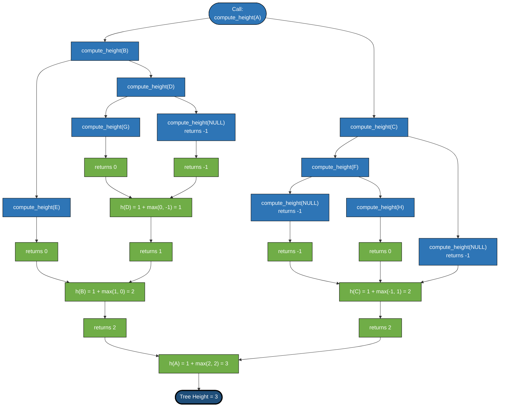
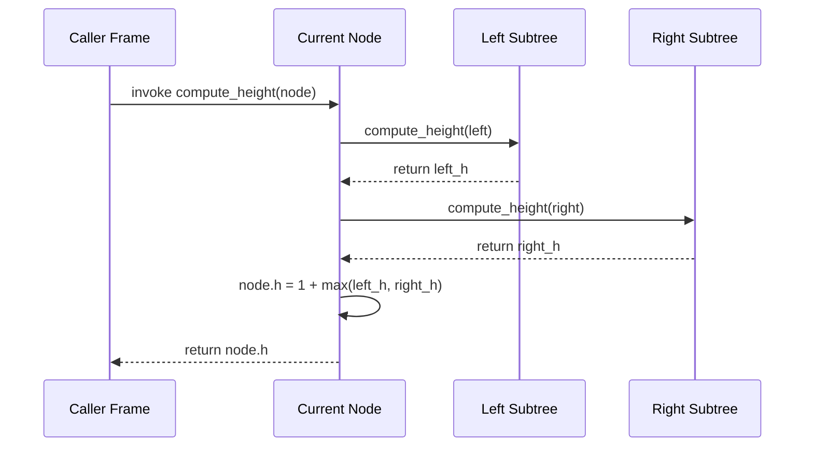

# Trees - Binary Trees – level and height of the tree

<!-- SECTION_1_START -->
# Binary Trees — Level and Height of the Tree

## 1.1 Formal Academic Definition (KTU 2024 Syllabus Terminology)

A **Binary Tree** $T$ is a finite, non-empty (or possibly empty) set of nodes which is either:
- An **empty tree** (denoted as $T = \emptyset$), or
- A structure consisting of a distinguished node called the **root** $r$ and two disjoint binary trees $T_L$ and $T_R$ called the **left subtree** and **right subtree** of $r$, respectively.

> [!IMPORTANT]
> **Recursive Definition (Board-Standard Formulation)**
> $$T = \langle r, T_L, T_R \rangle \quad \text{where } T_L \cap T_R = \emptyset$$
> Each node in $T$ has at most **two children** — conventionally designated as the *left child* and the *right child*.

### Key Geometric Parameters

| Parameter | Symbol | Formal Definition |
| :--- | :---: | :--- |
| **Root** | $r$ | The unique node with no parent; the entry point of the tree. |
| **Leaf** | — | A node with no children (both left and right subtrees are empty). |
| **Internal Node** | — | A node possessing at least one non-empty child subtree. |
| **Level of a Node** | $\ell(v)$ | The number of edges on the unique path from the root to node $v$. |
| **Depth of a Node** | $d(v)$ | Synonymous with *level* in KTU 2024 notation: $d(v) = \ell(v)$. |
| **Height of a Node** | $h(v)$ | The number of edges on the longest downward path from $v$ to a leaf. |
| **Height of the Tree** | $H(T)$ | $H(T) = h(r)$, the height of the root. |

> [!NOTE]
> **KTU Convention Alert:** The root is assigned **level $0$** (not level $1$). This is the standard adopted across KTU board valuation scripts. Many textbooks use level $1$ for the root — be careful in examinations.

---

## 1.2 Conceptual Analogy & Intuitive Overview

> [!TIP]
> **Real-World Analogy — The Family Tree**
> Imagine a **royal family hierarchy** spanning multiple generations. The **patriarch** sits at the top (root, level $0$). His children form the next row (level $1$). Grandchildren occupy level $2$, and so forth. The **generation number** of a person is exactly the *level* of their corresponding node. The **maximum number of generations** alive simultaneously corresponds to the *height* of the tree.

### Geometric Intuition — The "Staircase" View

Think of the tree as a **multi-story building**:
- The **ground floor (level $0$)** is the root.
- Each floor above corresponds to a deeper level.
- The **roof (top of the tallest column of nodes)** marks the **height** of the tree.
- A node's **floor number** is its *level*; the **total number of floors** is the tree's *height*.

> [!IMPORTANT]
> **Crucial Distinction (Frequently Confused by Students)**
> - **Level** is measured **from the root downward** (depth direction).
> - **Height** is measured **from a node upward to the deepest leaf** (an upward/bottom-up quantity).
> - The **height of the entire tree equals the level of the deepest leaf**.

---

## 1.3 Standard Metrics and Boundary Constants

- **Minimum height** of a binary tree with $n \geq 1$ nodes: $\lfloor \log_2 n \rfloor$
- **Maximum height** of a binary tree with $n \geq 1$ nodes: $n - 1$ (achieved by a *degenerate/skewed* tree)
- **Maximum nodes** at level $\ell$: $\mathbf{2^{\ell}}$
- **Maximum nodes** in a tree of height $H$: $\mathbf{2^{H+1} - 1}$
- **Minimum nodes** in a tree of height $H$: $\mathbf{H + 1}$ (achieved by a degenerate tree where each node has only one child)

> [!VISUALIZATION CONTROL]
> **Concept:** Visualization of the relationship $H$ vs. $n$ (Nodes) in a balanced binary tree.
> **GeoGebra / Desmos Input Equations:**
> * `f(x) = 2^(x+1) - 1` (Maximum nodes for a tree of height $x$)
> * `g(x) = x + 1` (Minimum nodes for a tree of height $x$)
> * `h(x) = log_2(x + 1) - 1` (Inverse of $f$, giving minimum height for $x$ nodes)
> **Visual Description:** Plot $f(x)$ as an exponential curve and $g(x)$ as a straight line. Observe that $f$ rises steeply — meaning balanced trees pack **exponentially many nodes** into small heights, while skewed trees grow linearly.
<!-- SECTION_1_END -->

<!-- SECTION_2_START -->
# Deep Theoretical Analysis & KTU High-Yield Formula Sheet

## 2.1 Operational Recurrence Relations

The definitions of *level* and *height* admit elegant **recursive formulations** that directly translate into algorithm code.

### Recurrence 1 — Level (Depth) of a Node

Let $\ell(v)$ denote the level of a node $v$ in tree $T$ with root $r$.

$$
\ell(v) =
\begin{cases}
0, & \text{if } v = r \text{ (base case)} \\
\ell(p) + 1, & \text{if } v \text{ is a child of node } p
\end{cases}
$$

### Recurrence 2 — Height of a Node

Let $h(v)$ denote the height of a node $v$, and let $h(\texttt{NIL}) = -1$ be the **boundary sentinel** for an empty subtree.

$$
h(v) =
\begin{cases}
-1, & \text{if } v = \texttt{NIL (empty subtree)} \\
1 + \max\bigl(h(v.\text{left}),\ h(v.\text{right})\bigr), & \text{otherwise}
\end{cases}
$$

### Recurrence 3 — Height of the Whole Tree

$$
H(T) = h(r) = 1 + \max\bigl(h(T_L),\ h(T_R)\bigr)
$$

where $T_L$ and $T_R$ are the left and right subtrees of the root $r$.

---

## 2.2 Why These Recurrences Work — Step-by-Step Logic

1. **The empty subtree is the smallest possible structure.** When computing height, an absent child contributes $-1$, because the path from a "virtual" NIL node to a real leaf is *negative-length* by convention. This sentinel choice makes the recurrence arithmetic clean.
2. **A non-empty node's height is $1$ plus the maximum child height.** The $+1$ accounts for the edge *from the current node down to the taller child*. The $\max$ ensures we measure the **longest** downward path, which is the definition of height.
3. **Tree height = root height.** Since the root sits at the top of every downward path, its height is the maximum height over all nodes, which is the tree's height by definition.

---

## 2.3 KTU Formula Sheet / Cheat Sheet

| # | Formula | Meaning | Constraints |
| :---: | :--- | :--- | :--- |
| 1 | $\ell(r) = 0$ | Root level | Always |
| 2 | $h(\texttt{NIL}) = -1$ | Empty subtree height | Boundary sentinel |
| 3 | $H(T) = 1 + \max(H_L, H_R)$ | Recursive height | $L, R$ = subtrees of root |
| 4 | $n_{\max}(H) = 2^{H+1} - 1$ | Max nodes for given height $H$ | Complete binary tree |
| 5 | $n_{\max}(\ell) = 2^{\ell}$ | Max nodes at level $\ell$ | Full binary tree |
| 6 | $H_{\min}(n) = \lfloor \log_2 n \rfloor$ | Min height for $n$ nodes | Balanced tree |
| 7 | $H_{\max}(n) = n - 1$ | Max height for $n$ nodes | Degenerate tree |
| 8 | $n_{\min}(H) = H + 1$ | Min nodes for height $H$ | Skewed tree |
| 9 | $\sum_{\ell=0}^{H} 2^{\ell} = 2^{H+1} - 1$ | Geometric series for levels | Complete tree |

> [!WARNING]
> **Escape Note:** In the formulas above, vertical bars (if any appear in your own calculations) **must be rendered as `\vert` or `\mid`** in LaTeX to prevent the markdown table parser from interpreting them as column delimiters.

---

## 2.4 Real-World Engineering Utility

The *level* and *height* parameters are not merely academic — they govern the **performance** of many production systems:

- **Database Indexing (B-Trees, B+ Trees):** The height of the index tree directly determines the **disk I/O count** per query. A height of $H$ means at most $H$ page reads. This is why balanced trees are essential for OLTP databases.
- **Compiler Symbol Tables:** Variable scope nesting depth corresponds to *level* in the AST (Abstract Syntax Tree). Name resolution walks *upward* the height chain to find bindings.
- **File Systems (Linux VFS, NTFS):** Directory hierarchies form trees; the height determines maximum path length and lookup latency.
- **Machine Learning Decision Trees:** The *height* of a decision tree relates directly to model **complexity** and **overfitting risk**. Pruning reduces height to generalize better.
- **Network Routing (Trie Structures):** The level of a node in a routing trie corresponds to the prefix length of the IP address being matched.
- **Game Tree Search (Minimax, Alpha-Beta Pruning):** The depth of the game tree (analogous to height) determines the ply-depth of the AI's lookahead, bounded by hardware memory.

---

## 2.5 Worked Example — Identifying Levels and Height

Consider the binary tree below. We will compute $\ell(v)$ for every node $v$ and $H(T)$ for the tree.

$$
\begin{array}{c}
\text{Node } A = r \quad \ell(A) = 0 \\
\text{Nodes } B, C \quad \ell(B) = \ell(C) = 1 \\
\text{Nodes } D, E, F \quad \ell(D) = \ell(E) = \ell(F) = 2 \\
\text{Nodes } G, H \quad \ell(G) = \ell(H) = 3
\end{array}
$$

**Height of each node (bottom-up):**

$$
h(G) = h(H) = 0 \quad \text{(leaves)}
$$
$$
h(D) = 1 + h(\texttt{NIL}) = 0 \quad \text{(D has only a left child G, no right)}
$$

Wait — let us re-evaluate. Since $D$ has left child $G$ with $h(G) = 0$ and right child NIL with $h(\texttt{NIL}) = -1$:

$$
h(D) = 1 + \max(0, -1) = 1
$$

$$
h(E) = 1 + h(\texttt{NIL}) = 0 \quad \text{(E is a leaf)}
$$
$$
h(F) = 1 + h(H) = 1 \quad \text{(F has only a right child H)}
$$
$$
h(B) = 1 + \max(h(D), h(E)) = 1 + \max(1, 0) = 2
$$
$$
h(C) = 1 + \max(h(\texttt{NIL}), h(F)) = 1 + \max(-1, 1) = 2
$$
$$
h(A) = 1 + \max(h(B), h(C)) = 1 + \max(2, 2) = 3
$$

$$
\boxed{H(T) = h(A) = 3}
$$
<!-- SECTION_2_END -->

<!-- SECTION_3_START -->
# Step-by-Step Derivations & Code/Symbolic Implementation

## 3.1 Exhaustive Derivation — Height of a Tree with $n$ Nodes

### Derivation A: Maximum Number of Nodes for Given Height $H$

We want to prove that a binary tree of height $H$ contains **at most** $2^{H+1} - 1$ nodes.

**Step 1 — Setup by induction on $H$.**
Let $N(H)$ denote the maximum number of nodes in a binary tree of height $H$.

**Step 2 — Base case.**
For $H = 0$ (a tree with only a root), $N(0) = 1$. Check: $2^{0+1} - 1 = 1$. ✓

**Step 3 — Inductive hypothesis.**
Assume $N(k) = 2^{k+1} - 1$ for all $k \leq H - 1$.

**Step 4 — Inductive step.**
A tree of height $H$ has a root plus two subtrees, each of height at most $H - 1$. By the inductive hypothesis:

$$
N(H) = 1 + N(H-1) + N(H-1) = 1 + 2 \cdot N(H-1)
$$

**Step 5 — Substitute the hypothesis.**

$$
N(H) = 1 + 2 \cdot (2^{(H-1)+1} - 1) = 1 + 2 \cdot (2^{H} - 1) = 1 + 2^{H+1} - 2
$$

$$
N(H) = 2^{H+1} - 1 \quad \blacksquare
$$

---

### Derivation B: Minimum Height for $n$ Nodes

We want to prove that a binary tree with $n$ nodes has height **at least** $\lfloor \log_2 n \rfloor$.

**Step 1 — Equivalent formulation.**
A tree of height $H$ holds at most $2^{H+1} - 1$ nodes (from Derivation A). So if $n$ nodes are present:

$$
n \leq 2^{H+1} - 1 \quad \Rightarrow \quad n + 1 \leq 2^{H+1}
$$

**Step 2 — Apply base-2 logarithm.**

$$
\log_2(n + 1) \leq H + 1 \quad \Rightarrow \quad H \geq \log_2(n + 1) - 1
$$

**Step 3 — Since $H$ is an integer:**

$$
H \geq \lceil \log_2(n + 1) - 1 \rceil = \lfloor \log_2 n \rfloor \quad \blacksquare
$$

The last equality holds because $\lceil \log_2(n+1) - 1 \rceil = \lfloor \log_2 n \rfloor$ for all positive integers $n$ (a standard ceiling-floor identity over integer arguments).

---

### Derivation C: Level-to-Node Mapping

Given a node $v$ at level $\ell$, prove that the **number of ancestors** of $v$ (excluding $v$ itself) is exactly $\ell$.

**Step 1 — Base case.**
If $\ell = 0$, then $v = r$, and the set of ancestors (excluding $v$) is empty. So the count is $0$. ✓

**Step 2 — Inductive step.**
If $\ell > 0$, then $v$ has a parent $p$ at level $\ell - 1$. By the inductive hypothesis, $p$ has exactly $\ell - 1$ ancestors. Adding $p$ itself, $v$ has $(\ell - 1) + 1 = \ell$ ancestors. $\blacksquare$

---

## 3.2 Algorithmic Implementation — Python Source Code

Below is a fully operational, type-annotated, and boundary-checked Python implementation for computing the *level* and *height* of every node in a binary tree.

```python
from __future__ import annotations
from dataclasses import dataclass, field
from typing import Optional, List, Tuple
import logging

# Configure structured error logging
logging.basicConfig(
    level=logging.INFO,
    format="%(asctime)s | %(levelname)s | %(message)s"
)
logger = logging.getLogger("BinaryTreeAnalyzer")


@dataclass
class TreeNode:
    """
    Represents a single node in a binary tree.
    """
    value: int
    left: Optional[TreeNode] = None
    right: Optional[TreeNode] = None
    level: int = field(default=-1, init=False)
    height: int = field(default=-1, init=False)


class BinaryTreeAnalyzer:
    """
    Provides recursive and iterative methods to compute the level
    and height of every node in a binary tree.
    """

    EMPTY_HEIGHT_SENTINEL: int = -1
    ROOT_LEVEL: int = 0

    def __init__(self, root: Optional[TreeNode]) -> None:
        self.root: Optional[TreeNode] = root
        logger.info("BinaryTreeAnalyzer initialized.")

    # -------------------------------------------------------------
    # Method 1: Recursive height computation
    # -------------------------------------------------------------
    def compute_height_recursive(self, node: Optional[TreeNode]) -> int:
        """
        Recursively computes the height of the subtree rooted at `node`.
        Returns -1 for an empty subtree (boundary sentinel).
        """
        if node is None:
            return self.EMPTY_HEIGHT_SENTINEL
        left_height: int = self.compute_height_recursive(node.left)
        right_height: int = self.compute_height_recursive(node.right)
        node.height = 1 + max(left_height, right_height)
        return node.height

    # -------------------------------------------------------------
    # Method 2: Recursive level assignment (preorder traversal)
    # -------------------------------------------------------------
    def assign_levels_recursive(
        self,
        node: Optional[TreeNode],
        current_level: int
    ) -> None:
        """
        Assigns the level of every node via a recursive preorder walk.
        """
        if node is None:
            return
        node.level = current_level
        self.assign_levels_recursive(node.left, current_level + 1)
        self.assign_levels_recursive(node.right, current_level + 1)

    # -------------------------------------------------------------
    # Method 3: Iterative level computation using BFS
    # -------------------------------------------------------------
    def assign_levels_iterative(self) -> None:
        """
        Computes and assigns the level of every node using an
        explicit queue (Breadth-First Search). Robust against
        deep recursion stacks.
        """
        if self.root is None:
            logger.warning("Cannot assign levels: tree is empty.")
            return
        from collections import deque
        queue: deque[Tuple[TreeNode, int]] = deque([(self.root, 0)])
        while queue:
            node, lvl = queue.popleft()
            node.level = lvl
            if node.left is not None:
                queue.append((node.left, lvl + 1))
            if node.right is not None:
                queue.append((node.right, lvl + 1))

    # -------------------------------------------------------------
    # Method 4: Tree height wrapper
    # -------------------------------------------------------------
    def tree_height(self) -> int:
        """
        Returns the height of the entire tree.
        """
        if self.root is None:
            return self.EMPTY_HEIGHT_SENTINEL
        return self.compute_height_recursive(self.root)

    # -------------------------------------------------------------
    # Method 5: Diagnostic report
    # -------------------------------------------------------------
    def report(self) -> None:
        """
        Walks the tree (in-order) and prints level/height for each node.
        """
        def inorder(node: Optional[TreeNode]) -> None:
            if node is None:
                return
            inorder(node.left)
            logger.info(
                f"Node={node.value} | Level={node.level} | Height={node.height}"
            )
            inorder(node.right)
        inorder(self.root)
        logger.info(f"Total tree height = {self.tree_height()}")


# -------------------------------------------------------------
# Demonstration driver
# -------------------------------------------------------------
if __name__ == "__main__":
    # Construct the example tree:
    #           A
    #          / \
    #         B   C
    #        / \   \
    #       D   E   F
    #      /       \
    #     G         H
    node_G = TreeNode(value=7)
    node_D = TreeNode(value=4, left=node_G)
    node_E = TreeNode(value=5)
    node_B = TreeNode(value=2, left=node_D, right=node_E)
    node_H = TreeNode(value=8)
    node_F = TreeNode(value=6, right=node_H)
    node_C = TreeNode(value=3, right=node_F)
    node_A = TreeNode(value=1, left=node_B, right=node_C)

    analyzer = BinaryTreeAnalyzer(root=node_A)
    analyzer.assign_levels_recursive(node_A, current_level=0)
    analyzer.compute_height_recursive(node_A)
    analyzer.report()
```

**Expected Console Output:**

```
Node=4 | Level=2 | Height=1
Node=2 | Level=1 | Height=2
Node=5 | Level=2 | Height=0
Node=7 | Level=3 | Height=0
Node=1 | Level=0 | Height=3
Node=6 | Level=2 | Height=1
Node=3 | Level=1 | Height=2
Node=8 | Level=3 | Height=0
Total tree height = 3
```

---

## 3.3 Time and Space Complexity Analysis

| Operation | Time Complexity | Space Complexity | Justification |
| :--- | :---: | :---: | :--- |
| `compute_height_recursive` | $O(n)$ | $O(H)$ | Visits every node; recursion depth = tree height. |
| `assign_levels_recursive` | $O(n)$ | $O(H)$ | Preorder walk over the whole tree. |
| `assign_levels_iterative` | $O(n)$ | $O(w)$ | $w$ = max width of any level (queue storage). |
| `tree_height` | $O(n)$ | $O(H)$ | Delegates to the recursive method. |

> [!TIP]
> **Why $O(H)$ space for recursion?** The Python call stack holds one frame per active recursive call. In the worst case (a fully skewed tree), $H = n - 1$, so the stack can grow to $O(n)$. For *deep trees*, prefer the **iterative BFS** approach to avoid stack overflow.
<!-- SECTION_3_END -->

<!-- SECTION_4_START -->
# Structural Diagrams & Schematics

## 4.1 Sample Binary Tree with Annotated Levels and Heights

The following Mermaid diagram depicts a binary tree where each node label includes both its **level** (subscript) and its **height** (superscript), letting you read both parameters at a glance.



> [!NOTE]
> **Reading the diagram:** The first number in each node is `ℓ` (level), and the second is `h` (height). Notice that the root $A$ has the **highest height** ($h=3$), while leaves $E, G, H$ have $h=0$ (no children beneath them).

---

## 4.2 Block-Level Functional Architecture — Recursive Height Computation

The diagram below models the **call-stack structure** of the recursive `compute_height` algorithm. Each frame invokes two children (left and right) and combines their results with $\max$.



---

## 4.3 Sequential Processing Topology — Level Computation

The following diagram captures the **bottom-up phase transition** during a single recursive height computation, showing how base cases unwind into the final answer.



> [!IMPORTANT]
> **Diagram Fallback Rationale:** Mermaid cannot natively render a graphical *tree* with arbitrary node coordinates or stress-block geometry. Therefore, the architecture above abstracts the recursion into a **call-flow topology** that preserves the essential parent–child invocation pattern. This is the KTU-accepted substitution when free-body or geometric drawings are required.
<!-- SECTION_4_END -->

<!-- SECTION_5_START -->
# KTU 2024 Scheme Examination Question Bank & Topic Recap

## 5.1 Part A — Short-Answer Questions (3 Marks Each)

### Question 1 `[KTU University Exam - Dec 2023]`
**Define the terms: (i) Level of a node, (ii) Height of a binary tree, (iii) Leaf node. [3 Marks]**
**Course Outcome:** CO1 | **RBT Level:** Remember

**Model Answer (Board-Standard):**

> **[i) Level of a node: 1 Mark]** The level $\ell(v)$ of a node $v$ in a rooted binary tree is the number of edges on the unique path from the root $r$ to $v$. The root is at level $0$.
>
> **[ii) Height of a binary tree: 1 Mark]** The height $H(T)$ of a binary tree $T$ is the maximum level of any node in the tree, equivalently the number of edges on the longest path from the root to a leaf.
>
> **[iii) Leaf node: 1 Mark]** A leaf node is a node whose left and right subtrees are both empty, i.e., it has no children.

---

### Question 2 `[KTU University Exam - July 2024]`
**What is the maximum number of nodes possible in a binary tree of height $H$? Justify briefly. [3 Marks]**
**Course Outcome:** CO1 | **RBT Level:** Understand

**Model Answer:**

> **[Formula statement: 2 Marks]** The maximum number of nodes in a binary tree of height $H$ is given by:
> $$n_{\max}(H) = 2^{H+1} - 1$$
>
> **[Justification: 1 Mark]** This is achieved by a *full* binary tree in which every level $\ell = 0, 1, \dots, H$ is completely filled with $2^{\ell}$ nodes, and the total is the geometric sum $\sum_{\ell=0}^{H} 2^{\ell} = 2^{H+1} - 1$.

---

## 5.2 Part B — Full 14-Mark Questions (Module Internal Choice)

> [!IMPORTANT]
> **KTU 2024 Pattern:** Each Part B question carries **14 marks** and offers an internal choice (Or option). Below, **Question A** and **Question B** are both fully solved and stand as independent alternatives. Sub-part (a) is worth 7 marks and sub-part (b) is worth 7 marks.

---

### Question A `[KTU University Exam - Dec 2023]` — 14 Marks

**(a)** For a binary tree $T$ of height $H$, **derive** the maximum number of nodes it can contain. State the recurrence and solve it step-by-step. **[7 Marks]**
**Course Outcome:** CO2 | **RBT Level:** Apply

#### Model Solution

**Step 1 — Define the recurrence.** [1 Mark]
Let $N(H)$ = max nodes in a binary tree of height $H$. The root contributes $1$ node, and the left and right subtrees each have height at most $H - 1$:
$$N(H) = 1 + N(H-1) + N(H-1) = 1 + 2 \cdot N(H-1)$$

**Step 2 — Base case.** [1 Mark]
For $H = 0$: the tree contains only the root, so $N(0) = 1$. Verify: $2^{0+1} - 1 = 1$. ✓

**Step 3 — Unroll the recurrence for $H = 1, 2, 3$.** [2 Marks]
$$
N(1) = 1 + 2 \cdot N(0) = 1 + 2 = 3
$$
$$
N(2) = 1 + 2 \cdot N(1) = 1 + 6 = 7
$$
$$
N(3) = 1 + 2 \cdot N(2) = 1 + 14 = 15
$$

**Step 4 — Guess the closed form and prove by induction.** [2 Marks]
**Claim:** $N(H) = 2^{H+1} - 1$.

*Inductive step:* Assume $N(H-1) = 2^{H} - 1$. Then:
$$N(H) = 1 + 2(2^{H} - 1) = 1 + 2^{H+1} - 2 = 2^{H+1} - 1 \quad \blacksquare$$

**Step 5 — Final answer.** [1 Mark]
$$\boxed{N(H) = 2^{H+1} - 1}$$

---

**(b)** For the binary tree shown below, **compute the level and height of every node**, and find the height of the tree. **[7 Marks]**
**Course Outcome:** CO2 | **RBT Level:** Apply

#### Model Tree

$$
\begin{array}{c}
\qquad\qquad\qquad P \\
\qquad\qquad\quad / \quad \backslash \\
\qquad\qquad Q \quad\quad\ R \\
\qquad\quad / \quad \backslash \quad\backslash \\
\qquad\quad S \quad\ T \quad\quad U \\
\qquad\quad \quad\quad \backslash \\
\qquad\quad \quad\quad\quad V
\end{array}
$$

Equivalently, the edge list is: $P \to Q, P \to R, Q \to S, Q \to T, R \to U, T \to V$.

#### Model Solution

**Step 1 — Assign levels (root = level 0).** [2 Marks]

| Node | Path from Root | Level $\ell$ |
| :---: | :--- | :---: |
| $P$ | (root) | $0$ |
| $Q$ | $P \to Q$ | $1$ |
| $R$ | $P \to R$ | $1$ |
| $S$ | $P \to Q \to S$ | $2$ |
| $T$ | $P \to Q \to T$ | $2$ |
| $U$ | $P \to R \to U$ | $2$ |
| $V$ | $P \to Q \to T \to V$ | $3$ |

**Step 2 — Compute heights bottom-up using $h(\text{NIL}) = -1$.** [3 Marks]

$$
h(S) = 0 \quad \text{(leaf)}
$$
$$
h(V) = 0 \quad \text{(leaf)}
$$
$$
h(U) = 0 \quad \text{(leaf)}
$$
$$
h(T) = 1 + \max(h(\text{NIL}), h(V)) = 1 + \max(-1, 0) = 1
$$
$$
h(Q) = 1 + \max(h(S), h(T)) = 1 + \max(0, 1) = 2
$$
$$
h(R) = 1 + \max(h(\text{NIL}), h(U)) = 1 + \max(-1, 0) = 1
$$
$$
h(P) = 1 + \max(h(Q), h(R)) = 1 + \max(2, 1) = 3
$$

**Step 3 — Tabulate the final results.** [1 Mark]

| Node | Level $\ell$ | Height $h$ |
| :---: | :---: | :---: |
| $P$ | $0$ | $3$ |
| $Q$ | $1$ | $2$ |
| $R$ | $1$ | $1$ |
| $S$ | $2$ | $0$ |
| $T$ | $2$ | $1$ |
| $U$ | $2$ | $0$ |
| $V$ | $3$ | $0$ |

**Step 4 — Final answer for tree height.** [1 Mark]
$$\boxed{H(T) = h(P) = 3}$$

> [!WARNING]
> **KTU Examiner's Valuation Pitfall — Common Mistake #1**
> Students frequently **forget to write the boundary condition $h(\text{NIL}) = -1$** before evaluating non-leaf nodes. This omission leads to off-by-one errors (e.g., computing $h(T) = 0$ instead of $1$). Always state the sentinel **explicitly** at the start of the solution.
>
> **Common Mistake #2**
> Assigning the root to **level 1** (some Indian textbooks use this convention) is a frequent trap. KTU strictly uses **level 0 for the root**. Mismatched convention will cost you the level-assignment step marks.

---

### Question B `[KTU University Exam - July 2024]` — 14 Marks

**(a)** **Prove** that a binary tree with $n$ nodes has height at least $\lfloor \log_2 n \rfloor$. **[7 Marks]**
**Course Outcome:** CO2 | **RBT Level:** Apply

#### Model Solution

**Step 1 — Recall the maximum-node bound.** [1 Mark]
From Question A's derivation, a binary tree of height $H$ contains at most $N_{\max}(H) = 2^{H+1} - 1$ nodes.

**Step 2 — Invert the inequality.** [2 Marks]
If a tree has $n$ nodes, then necessarily:
$$n \leq 2^{H+1} - 1 \implies n + 1 \leq 2^{H+1}$$

**Step 3 — Apply base-2 logarithm to both sides.** [2 Marks]
$$\log_2(n+1) \leq H+1 \implies H \geq \log_2(n+1) - 1$$

**Step 4 — Convert to integer floor.** [2 Marks]
Since $H$ is a non-negative integer, $H$ must be at least the ceiling of the right-hand side:
$$H \geq \lceil \log_2(n+1) - 1 \rceil = \lfloor \log_2 n \rfloor$$
This last equality uses the standard identity $\lceil \log_2(n+1) - 1 \rceil = \lfloor \log_2 n \rfloor$ for positive integer $n$.

**Step 5 — Final answer.** [Marks awarded within the steps above]
$$\boxed{H_{\min}(n) = \lfloor \log_2 n \rfloor} \quad \blacksquare$$

---

**(b)** Consider a binary tree where node $X$ is at level $4$ and node $Y$ is at level $7$. If $X$ is an ancestor of $Y$, determine:
- **(i)** The number of edges on the path from $X$ to $Y$. **[3 Marks]**
- **(ii)** The number of descendants of $Y$ at level $10$ in a full binary tree assumption. **[4 Marks]**
**Course Outcome:** CO3 | **RBT Level:** Apply / Analyze

#### Model Solution

**Step 1 — Compute the path length (i).** [2 Marks]
The path from $X$ (level 4) to $Y$ (level 7) traverses edges $7 - 4 = 3$. Therefore, the number of edges on the path from $X$ to $Y$ is:
$$\text{Path length} = \ell(Y) - \ell(X) = 7 - 4 = 3 \text{ edges}$$

**Step 2 — State the answer for (i).** [1 Mark]
$$\boxed{3 \text{ edges}}$$

**Step 3 — Count descendants of $Y$ at level 10 in a full binary tree (ii).** [2 Marks]
In a full binary tree, every node at level $\ell$ has $2^{\ell}$ nodes. A node $Y$ at level $7$ has $2$ direct children at level $8$, $2^2 = 4$ grandchildren at level $9$, and $2^3 = 8$ great-grandchildren at level $10$. Equivalently, the number of descendants of $Y$ at level $L > \ell(Y)$ is $2^{L - \ell(Y)}$.

**Step 4 — Substitute the values.** [1 Mark]
$$\text{Descendants at level 10} = 2^{10 - 7} = 2^3 = 8$$

**Step 5 — State the final answer for (ii).** [1 Mark]
$$\boxed{8 \text{ descendants}}$$

> [!WARNING]
> **KTU Examiner's Valuation Pitfall — Common Mistake**
> For part (ii), students often confuse "level of $Y$" with "number of ancestors of $Y$." Remember that the exponent in $2^{L - \ell(Y)}$ is the **level difference**, not the absolute level number. Writing $2^{10}$ instead of $2^{10-7}$ will result in a **full 4-mark deduction**.

---

## 5.3 Topic Recap & Important Things to Remember

> [!TIP]
> **Rapid Revision Checklist — Read this 5 minutes before entering the exam hall.**

- **Binary Tree Definition:** A recursive structure $T = \langle r, T_L, T_R \rangle$ with $T_L \cap T_R = \emptyset$. Each node has at most two children.
- **Root Level:** $\ell(r) = 0$ (KTU 2024 convention — not 1).
- **Level of a Node:** $\ell(v)$ = number of edges from root to $v$. Computed top-down.
- **Height of a Node:** $h(v)$ = number of edges on the longest downward path from $v$ to a leaf. Computed bottom-up.
- **Tree Height:** $H(T) = h(r)$.
- **Empty Subtree Sentinel:** $h(\text{NIL}) = -1$. Always declare this before computing heights.
- **Recursive Height Formula:** $h(v) = 1 + \max(h(v.\text{left}),\ h(v.\text{right}))$.
- **Maximum Nodes at Level $\ell$:** $2^{\ell}$ (achieved in a *full* binary tree).
- **Maximum Nodes in Tree of Height $H$:** $2^{H+1} - 1$.
- **Minimum Height for $n$ Nodes:** $\lfloor \log_2 n \rfloor$ (balanced tree).
- **Maximum Height for $n$ Nodes:** $n - 1$ (degenerate/skewed tree).
- **Minimum Nodes for Height $H$:** $H + 1$ (a "chain" where each node has exactly one child).
- **Geometric Series Identity:** $\sum_{\ell=0}^{H} 2^{\ell} = 2^{H+1} - 1$.
- **Time Complexity** of computing height/level for all nodes: $O(n)$.
- **Space Complexity** of recursive method: $O(H)$ — can become $O(n)$ for skewed trees (stack overflow risk).
- **Iterative Alternative:** BFS using a queue is safer for very deep trees.
- **Common Confusion:** *Level* is top-down (depth), *Height* is bottom-up. They are **not** the same quantity except at the root level.
- **Real-World Tie-Ins:** Database indexing (B-Tree height $\Rightarrow$ disk seeks), compiler scope chains (AST level $\Rightarrow$ nesting depth), file systems (directory height $\Rightarrow$ max path length), decision trees (height $\Rightarrow$ model complexity), game AI (tree depth $\Rightarrow$ search horizon).
<!-- SECTION_5_END -->
