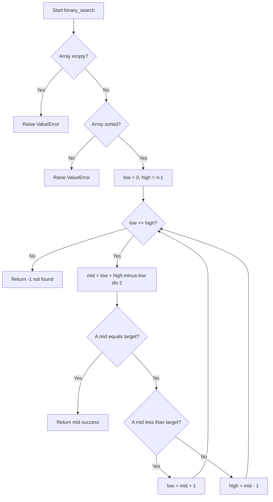
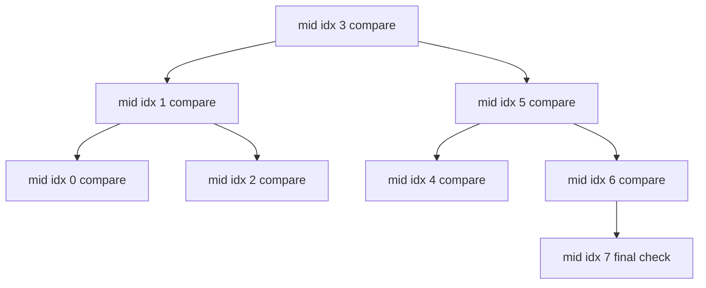
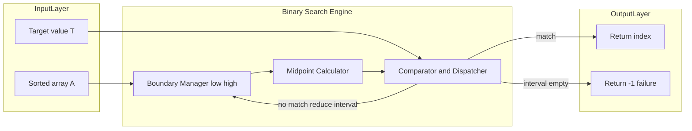

# Binary Search

<!-- SECTION_1_START -->
# Binary Search — Core Technical Definition & Intuitive Overview

## Formal Definition (KTU 2024 Syllabus Terminology)

> [!IMPORTANT]
> **Binary Search** is a *divide and conquer* algorithm that locates the position of a target value within a **sorted** array (ascending or descending order). It repeatedly divides the searchable interval in half: by comparing the target with the **middle element**, it discards half of the remaining candidates in each iteration until the target is found or the search space is exhausted.

The algorithm operates on a contiguous sub-array indexed by two boundary pointers, conventionally `low` and `high`. At every step, the **midpoint** is computed (typically as $\text{mid} = \lfloor \text{low} + \text{high} \over 2 \rfloor$) and exactly one of the two halves is eliminated.

**Required Pre-condition:** The input array $A[0 \dots n-1]$ must be sorted in **monotonic order** (either strictly non-decreasing or strictly non-increasing). Searching in an unsorted array makes the divide and conquer strategy logically invalid, because the half-discarding property relies on the ordering invariant.

## Conceptual Analogy / Intuition

> [!NOTE]
> **Real-World Analogy — The Dictionary Lookup**
> Imagine you are searching for the word *"Mitochondria"* in a 1,200-page English dictionary. You do **not** flip page by page (that would be *linear search*). Instead, you open roughly the middle, see that the words start with *"M"*, realise your target lies in the second half, and repeat. Each flip halves the remaining pages. After about $\log_2(1200) \approx 10$ flips, you have narrowed down to a single page. Binary search is the algorithmic embodiment of this exact strategy.

A second useful analogy: in a *number-guessing game* (1–100), if a friend says "higher" or "lower" after each guess, the optimal first guess is **50**, not 1. This is binary search on a number line.

## Critical Parameters and Standard Metrics

The following values are commonly used in KTU examination problems and must be **memorised**:

- **Search space size** after $k$ iterations: $n \over 2^k$
- **Maximum number of comparisons** in the worst case: $\lfloor \log_2 n \rfloor + 1$
- **Best-case number of comparisons**: **1** (target equals the very first midpoint)
- **Auxiliary space (iterative version)**: $\mathbf{O(1)}$
- **Auxiliary space (recursive version)**: $\mathbf{O(\log n)}$ due to call-stack depth

> [!VISUALIZATION CONTROL]
> **Concept:** Halving Search Interval on a Number Line
> **Desmos Input Equations:**
> * Points: $(1, 0), (16, 0)$
> * Highlight intervals: $[1, 8], [9, 12], [13, 14], [15, 16]$
> **Visual Description:** Plot the integers $1$ through $16$ on a horizontal axis. After each comparison, shade the *discarded* half in light grey and the *retained* half in blue. The student should observe that four well-chosen guesses are sufficient to pinpoint any value among 16 candidates, visually confirming the $\log_2 n$ depth.

## Position Variants Frequently Tested

KTU 2024 scheme questions often distinguish between:

| Variant Name | Returns | Failure Behaviour |
|---|---|---|
| **Classic Binary Search** | Index of target if present | $-1$ or sentinel |
| **Lower Bound** | First index $\ge$ target | $n$ if not found |
| **Upper Bound** | First index $>$ target | $n$ if not found |
| **First Occurrence** | Leftmost index of target | $-1$ if absent |
| **Last Occurrence** | Rightmost index of target | $-1$ if absent |

<!-- SECTION_1_END -->

<!-- SECTION_2_START -->
# Deep Theoretical Analysis & KTU High-Yield Formula Sheet

## Algorithm Operational Logic — Step by Step

1. **Initialise** the search interval with two boundary pointers, `low = 0` and `high = n - 1`. The invariant states: *if the target exists, its index is in the closed interval $[\text{low}, \text{high}]$*.
2. **Loop guard:** while $\text{low} \le \text{high}$, the search space is non-empty. Termination of this loop guarantees the target is absent.
3. **Midpoint computation:** calculate $\text{mid} = \lfloor \text{low} + \text{high} \over 2 \rfloor$. The use of integer floor division prevents index overflow and is preferred over the naive $(\text{low} + \text{high}) \over 2$ in strongly-typed languages.
4. **Three-way comparison:**
   * If $A[\text{mid}] = \text{target}$: the search terminates successfully.
   * If $A[\text{mid}] < \text{target}$: discard the left half by setting $\text{low} = \text{mid} + 1$.
   * If $A[\text{mid}] > \text{target}$: discard the right half by setting $\text{high} = \text{mid} - 1$.
5. **Return** the located index, or the sentinel value $-1$ if the loop ends.

### The 'Why' Behind the Halving

The monotonic ordering of the array guarantees that *all* elements to the left of `mid` are $\le A[\text{mid}]$, and *all* to the right are $\ge A[\text{mid}]$. If the target is strictly greater than $A[\text{mid}]$, it cannot possibly exist in the left half — that is why the entire half can be discarded in $O(1)$ time without re-inspection.

### The 'How' of Mid-Point Safety

A subtle bug occurs in low-level languages when $\text{low} + \text{high}$ overflows the integer range. The bit-shift equivalent $\text{mid} = (\text{low} + \text{high}) \gg 1$ is overflow-safe for unsigned integers. In KTU 2024 Python-based pseudocode, the standard form $\text{mid} = (\text{low} + \text{high}) \div 2$ is accepted.

## Recurrence Relation and Asymptotic Analysis

Binary search follows the recurrence:

$$
T(n) = T\!\left(\left\lceil n \over 2 \right\rceil\right) + \Theta(1)
$$

with the base case $T(1) = \Theta(1)$. The constant work $O(1)$ accounts for the comparison and pointer update. By the **Master Theorem** (Case 2), with $a = 1$, $b = 2$, and $f(n) = \Theta(n^{\log_b a}) = \Theta(n^0) = \Theta(1)$:

$$
T(n) = \Theta(\log n)
$$

## KTU Formula Sheet / Cheat Sheet

| Concept | Formula / Rule | Applicable When |
|---|---|---|
| Recurrence | $T(n) = T(n \div 2) + c$ | Standard binary search |
| Time complexity (worst) | $O(\log_2 n)$ | Target at extreme half repeatedly |
| Time complexity (best) | $O(1)$ | Target equals initial mid |
| Time complexity (average) | $O(\log_2 n)$ | Random distribution of target |
| Space (iterative) | $O(1)$ auxiliary | Tail-recursion free version |
| Space (recursive) | $O(\log_2 n)$ stack frames | Recursive implementation |
| Max comparisons | $\lfloor \log_2 n \rfloor + 1$ | Worst case bound |
| Search space after $k$ steps | $n \over 2^k$ | Halving invariant |
| Lower bound identity | $\text{low} = \text{low} + (\text{high} - \text{low}) \div 2$ | Overflow-safe form |
| Pre-condition | Array must be sorted | Always required |
| Post-condition (success) | $A[\text{idx}] = \text{target}$ | $0 \le \text{idx} < n$ |
| Post-condition (failure) | Return $-1$ or $n$ | Target not in array |

## Real-World Engineering Utility

Binary search is foundational in numerous production-grade systems:

- **Database indexing:** B-tree and B+ tree internal lookups perform a binary search on the sorted key array within each node to locate the next child pointer.
- **Git bisect:** Engineers use binary search across commit history to identify the exact commit that introduced a regression bug.
- **Numerical methods:** The bisection method for root-finding in calculus and engineering optimisation is a continuous-domain generalisation of binary search.
- **Network routing:** IP prefix matching in routers often uses binary search on prefix-length sorted tables.
- **Compiler symbol tables:** Sorted symbol tables are searched using binary search for O(log n) identifier lookup.

<!-- SECTION_2_END -->

<!-- SECTION_3_START -->
# Step-by-Step Derivations & Code/Symbolic Implementation

## A. Exhaustive Recurrence Derivation (Worst-Case Time Complexity)

We must solve the recurrence:

$$
T(n) = T\!\left(\left\lceil n \over 2 \right\rceil\right) + c, \quad T(1) = d
$$

**Step 1 — Unroll the recurrence** for $k$ levels:

$$
\begin{aligned}
T(n) &= T\!\left(\left\lceil n \over 2 \right\rceil\right) + c \\
&= T\!\left(\left\lceil n \over 4 \right\rceil\right) + 2c \\
&= T\!\left(\left\lceil n \over 8 \right\rceil\right) + 3c \\
&\;\;\vdots \\
&= T\!\left(\left\lceil n \over 2^k \right\rceil\right) + kc
\end{aligned}
$$

**Reasoning:** At each level the recursive sub-problem shrinks by a factor of **2**, and the per-level work is the constant $c$ (one comparison and one pointer update).

**Step 2 — Identify the termination condition.** Recursion halts when the sub-problem size becomes $1$:

$$
\left\lceil n \over 2^k \right\rceil = 1 \;\;\Longrightarrow\;\; 2^k \ge n \;\;\Longrightarrow\;\; k = \lceil \log_2 n \rceil
$$

**Step 3 — Substitute** $k = \lceil \log_2 n \rceil$ back into the unrolled sum:

$$
T(n) = T(1) + c \cdot \lceil \log_2 n \rceil = d + c \cdot \lceil \log_2 n \rceil
$$

**Step 4 — Asymptotic form** in Big-$O$ notation:

$$
T(n) = \Theta(\log_2 n) = O(\log n)
$$

> [!NOTE]
> **Master Theorem Verification:** With $a=1, b=2, f(n)=\Theta(1)$, we have $n^{\log_b a} = n^0 = 1$. Since $f(n) = \Theta(1) = \Theta(n^{\log_b a})$, this is **Case 2**, and $T(n) = \Theta(\log n)$. The derivation is consistent with the Master Theorem.

## B. Worked Numerical Example

Search for target **37** in sorted array $A = [2, 5, 8, 12, 16, 23, 37, 42, 56, 71, 89]$ (length $n = 11$).

| Iteration | low | high | mid | $A[\text{mid}]$ | Compare with 37 | Action |
|---|---|---|---|---|---|---|
| 1 | 0 | 10 | 5 | 23 | $23 < 37$ | Discard left half: $\text{low} = 6$ |
| 2 | 6 | 10 | 8 | 56 | $56 > 37$ | Discard right half: $\text{high} = 7$ |
| 3 | 6 | 7 | 6 | 37 | $37 = 37$ | **Found at index 6** |

Total comparisons: **3**. Note that $\lfloor \log_2 11 \rfloor + 1 = 3 + 1 = 4$, so 3 comparisons is well within the worst-case bound.

## C. Complete Python Implementations (with Strict Type Hints)

### C.1 — Classic Iterative Binary Search

```python
from typing import List, Optional
import logging

logging.basicConfig(level=logging.INFO, format="%(levelname)s :: %(message)s")


def binary_search(arr: List[int], target: int) -> int:
    """
    Iterative binary search on a strictly increasing sorted list.
    Returns the index of target if present, else -1.
    """
    # Defensive boundary checks
    if not arr:
        logging.error("Input array is empty; nothing to search.")
        raise ValueError("arr must be a non-empty list.")

    # Pre-condition verification
    if any(arr[i] > arr[i + 1] for i in range(len(arr) - 1)):
        logging.error("Input array is not sorted in ascending order.")
        raise ValueError("Binary search requires a sorted array.")

    low, high = 0, len(arr) - 1

    while low <= high:
        # Overflow-safe mid-point computation
        mid = low + (high - low) // 2

        if arr[mid] == target:
            logging.info(f"Target {target} found at index {mid}.")
            return mid
        elif arr[mid] < target:
            low = mid + 1
        else:
            high = mid - 1

    logging.warning(f"Target {target} not found in array of length {len(arr)}.")
    return -1


# --- Driver / Test Harness ---
if __name__ == "__main__":
    sample: List[int] = [2, 5, 8, 12, 16, 23, 37, 42, 56, 71, 89]
    tests: List[int] = [37, 1, 89, 42, 100]
    for t in tests:
        result: int = binary_search(sample, t)
        print(f"Search {t} -> index {result}")
```

### C.2 — Recursive Binary Search (Demonstrates $O(\log n)$ Stack Depth)

```python
from typing import List


def binary_search_recursive(
    arr: List[int], target: int, low: int, high: int
) -> int:
    """
    Recursive binary search helper.
    Returns index of target, or -1 if not found.
    """
    # Base case: search space exhausted
    if low > high:
        return -1

    mid: int = low + (high - low) // 2

    if arr[mid] == target:
        return mid
    elif arr[mid] < target:
        return binary_search_recursive(arr, target, mid + 1, high)
    else:
        return binary_search_recursive(arr, target, low, mid - 1)


def recursive_search(arr: List[int], target: int) -> int:
    if not arr:
        raise ValueError("Array must be non-empty.")
    return binary_search_recursive(arr, target, 0, len(arr) - 1)
```

### C.3 — Lower Bound and Upper Bound Variants

```python
from typing import List


def lower_bound(arr: List[int], target: int) -> int:
    """Return the leftmost index i such that arr[i] >= target."""
    low, high = 0, len(arr)
    while low < high:
        mid = low + (high - low) // 2
        if arr[mid] < target:
            low = mid + 1
        else:
            high = mid
    return low


def upper_bound(arr: List[int], target: int) -> int:
    """Return the leftmost index i such that arr[i] > target."""
    low, high = 0, len(arr)
    while low < high:
        mid = low + (high - low) // 2
        if arr[mid] <= target:
            low = mid + 1
        else:
            high = mid
    return low
```

## D. Algorithmic Trace — Worst Case on $n = 8$

Worst case for binary search on 8 elements occurs when the target sits in the *final* position examined.

$$
\begin{aligned}
\text{Iteration 1:} \quad &\text{low}=0, \text{high}=7, \text{mid}=3, A[3] \ne \text{target} \\
\text{Iteration 2:} \quad &\text{low}=4, \text{high}=7, \text{mid}=5, A[5] \ne \text{target} \\
\text{Iteration 3:} \quad &\text{low}=6, \text{high}=7, \text{mid}=6, A[6] \ne \text{target} \\
\text{Iteration 4:} \quad &\text{low}=7, \text{high}=7, \text{mid}=7, A[7] = \text{target} \;\; \text{FOUND}
\end{aligned}
$$

Total comparisons $= 4 = \lfloor \log_2 8 \rfloor + 1 = 3 + 1 = 4$. This empirically confirms the worst-case formula.

<!-- SECTION_3_END -->

<!-- SECTION_4_START -->
# Structural Diagrams & Schematics

## A. Mermaid Flowchart — Iterative Binary Search Control Flow



## B. Mermaid Decision Tree — Search Path for $n = 8$



> [!NOTE]
> **Reading the Tree:** Each internal node represents one comparison against the array element at the displayed index. Each leaf is a possible termination position. The depth of the tree is $\lfloor \log_2 8 \rfloor + 1 = 4$, which equals the worst-case number of comparisons.

## C. Mermaid Block Diagram — Functional Architecture



## D. Comparison Matrix — Binary Search vs. Linear Search

| Property | Binary Search | Linear Search |
|---|---|---|
| Pre-condition | Sorted array required | No ordering required |
| Time (worst) | $O(\log n)$ | $O(n)$ |
| Time (best) | $O(1)$ | $O(1)$ |
| Time (average) | $O(\log n)$ | $O(n)$ |
| Auxiliary space | $O(1)$ iterative, $O(\log n)$ recursive | $O(1)$ |
| Random access required | Yes (array or indexable structure) | No (works on linked lists) |
| Stability of duplicates | Needs variant (first/last) | Naturally first occurrence |
| Use case | Static sorted data | Streaming or unsorted data |

<!-- SECTION_4_END -->

<!-- SECTION_5_START -->
# KTU 2024 Scheme Examination Question Bank & Topic Recap

## Part A — Short Answer Questions (3 Marks Each)

### Q1. `[KTU University Exam - July 2024]`
**State the pre-condition required for binary search to function correctly. What is the worst-case time complexity and maximum number of comparisons for an array of size $n$? (CO1, Remember)**

**Model Answer:**

> [!IMPORTANT]
> * **Pre-condition:** The input array must be **sorted in monotonic order** (ascending or descending). Without this, the halving logic is invalid and the algorithm fails.
> * **Worst-case time complexity:** $O(\log_2 n)$
> * **Maximum comparisons:** $\lfloor \log_2 n \rfloor + 1$

**Valuation Key:**
* [Stating sorted-array pre-condition: 1 Mark]
* [Correct worst-case complexity: 1 Mark]
* [Correct maximum comparison formula: 1 Mark]

---

### Q2. `[KTU University Exam - Dec 2023]`
**Differentiate between binary search and linear search. In which scenario is binary search strictly preferred? (CO1, Understand)**

**Model Answer:**

Binary search operates on a **sorted array** and halves the search space at every step, yielding $O(\log n)$ worst-case time. Linear search scans sequentially from the first element, yielding $O(n)$ worst-case time, and imposes **no ordering requirement**. Binary search is strictly preferred when (i) the array is already sorted or can be sorted once and searched many times, and (ii) the dataset is sufficiently large that $O(\log n)$ offers meaningful gains over $O(n)$.

**Valuation Key:**
* [Definition and complexity of binary search: 1 Mark]
* [Definition and complexity of linear search: 1 Mark]
* [Correct preferred scenario with justification: 1 Mark]

---

## Part B — Long Answer Questions (14 Marks Each, Module Internal Choice)

### Question A (14 Marks) `[KTU University Exam - July 2024]`

**(a)** Explain the divide and conquer strategy of binary search with its recurrence relation. Derive the worst-case time complexity using the Master Theorem. **(7 Marks, CO2, Understand + Apply)**

**Step-by-step Model Solution:**

**Step 1 — Algorithm description (2 Marks):**
Binary search divides the sorted array $A[\text{low} \dots \text{high}]$ into two halves by computing $\text{mid} = \lfloor \text{low} + \text{high} \over 2 \rfloor$. It compares $A[\text{mid}]$ with the target and discards the half that cannot contain the target. The process repeats on the remaining half.

**Step 2 — Recurrence relation (2 Marks):**

$$
T(n) = T\!\left(\left\lceil n \over 2 \right\rceil\right) + \Theta(1), \quad T(1) = \Theta(1)
$$

**Step 3 — Master Theorem application (2 Marks):**
Identify $a = 1$, $b = 2$, $f(n) = \Theta(1)$. Compute $n^{\log_b a} = n^{\log_2 1} = n^0 = 1$. Since $f(n) = \Theta(1) = \Theta(n^{\log_b a})$, **Case 2** of the Master Theorem applies.

**Step 4 — Final complexity (1 Mark):**

$$
T(n) = \Theta(n^{\log_b a} \cdot \log n) = \Theta(1 \cdot \log n) = \Theta(\log n)
$$

**Valuation Key:**
* [Correct divide and conquer description: 2 Marks]
* [Correct recurrence: 2 Marks]
* [Correct Master Theorem identification of a, b, f(n): 1 Mark]
* [Correct case selection and justification: 1 Mark]
* [Final Theta-log n result: 1 Mark]

---

**(b)** Trace the binary search algorithm step-by-step to search for the value **48** in the sorted array $A = [5, 12, 18, 25, 33, 48, 55, 67, 72, 81]$. Show the values of `low`, `high`, and `mid` for every iteration and state the final result. **(7 Marks, CO3, Apply)**

**Step-by-step Model Solution:**

| Iteration | low | high | mid | $A[\text{mid}]$ | Comparison | New Boundary |
|---|---|---|---|---|---|---|
| 1 | 0 | 9 | 4 | 33 | $33 < 48$ | $\text{low} = 5$ |
| 2 | 5 | 9 | 7 | 67 | $67 > 48$ | $\text{high} = 6$ |
| 3 | 5 | 6 | 5 | 48 | $48 = 48$ | **FOUND at index 5** |

**Final Result:** Target value **48 is found at index 5** after **3 comparisons**.

**Valuation Key:**
* [Iteration 1 correct low/high/mid and decision: 2 Marks]
* [Iteration 2 correct low/high/mid and decision: 2 Marks]
* [Iteration 3 correct identification of match: 1 Mark]
* [Final answer and total comparison count: 2 Marks]

---

### Question B (14 Marks) `[KTU University Exam - Dec 2023]` *(Alternative Choice)*

**(a)** Write a complete iterative algorithm for binary search. Explain why the midpoint is computed as $\text{mid} = \text{low} + (\text{high} - \text{low}) \div 2$ instead of $\text{mid} = (\text{low} + \text{high}) \div 2$. **(7 Marks, CO2, Understand + Apply)**

**Step-by-step Model Solution:**

**Step 1 — Pseudocode (4 Marks):**

```
ALGORITHM IterativeBinarySearch(A[0..n-1], target)
1.  low ← 0
2.  high ← n − 1
3.  while low ≤ high do
4.      mid ← low + (high − low) ÷ 2
5.      if A[mid] = target then
6.          return mid
7.      else if A[mid] < target then
8.          low ← mid + 1
9.      else
10.         high ← mid − 1
11. end while
12. return −1
```

**Step 2 — Explanation of overflow-safe mid (3 Marks):**
In languages with fixed-width integers (C, C++, Java), if both `low` and `high` are close to the maximum representable value, the expression `low + high` can **overflow**, producing a negative or wrapped-around result and an invalid `mid`. The equivalent form $\text{low} + (\text{high} - \text{low}) \div 2$ first computes the *difference* (always non-negative) and then adds it to `low`, thereby avoiding overflow. In Python, integers are arbitrary-precision so overflow is impossible, but the overflow-safe form is the universally recommended idiom and is what KTU expects in the answer key.

**Valuation Key:**
* [Correct initialisation of low and high: 1 Mark]
* [Correct loop condition and mid computation: 1 Mark]
* [Correct three-way comparison logic: 1 Mark]
* [Correct return paths: 1 Mark]
* [Overflow explanation with example: 2 Marks]
* [Idiom recommendation: 1 Mark]

---

**(b)** Implement the **lower bound** and **upper bound** variants of binary search in pseudocode. For an array $A = [1, 3, 5, 5, 5, 7, 9]$ and target $T = 5$, show all intermediate values of `low`, `high`, and `mid` for both variants and state their return values. **(7 Marks, CO3, Apply)**

**Step-by-step Model Solution:**

**Step 1 — Lower Bound Pseudocode (1 Mark):**

```
ALGORITHM LowerBound(A, T)
1.  low ← 0, high ← n
2.  while low < high do
3.      mid ← low + (high − low) ÷ 2
4.      if A[mid] < T then
5.          low ← mid + 1
6.      else
7.          high ← mid
8.  return low
```

**Step 2 — Upper Bound Pseudocode (1 Mark):**

```
ALGORITHM UpperBound(A, T)
1.  low ← 0, high ← n
2.  while low < high do
3.      mid ← low + (high − low) ÷ 2
4.      if A[mid] ≤ T then
5.          low ← mid + 1
6.      else
7.          high ← mid
8.  return low
```

**Step 3 — Trace for Lower Bound, $T = 5$ (2 Marks):**

| Iteration | low | high | mid | $A[\text{mid}]$ | Condition | New boundary |
|---|---|---|---|---|---|---|
| 1 | 0 | 7 | 3 | 5 | $5 \not< 5$ | $\text{high} = 3$ |
| 2 | 0 | 3 | 1 | 3 | $3 < 5$ | $\text{low} = 2$ |
| 3 | 2 | 3 | 2 | 5 | $5 \not< 5$ | $\text{high} = 2$ |

Loop exits: $\text{low} = 2$. **Lower bound returns 2** (first index of value 5).

**Step 4 — Trace for Upper Bound, $T = 5$ (2 Marks):**

| Iteration | low | high | mid | $A[\text{mid}]$ | Condition | New boundary |
|---|---|---|---|---|---|---|
| 1 | 0 | 7 | 3 | 5 | $5 \le 5$ | $\text{low} = 4$ |
| 2 | 4 | 7 | 5 | 7 | $7 \not\le 5$ | $\text{high} = 5$ |
| 3 | 4 | 5 | 4 | 5 | $5 \le 5$ | $\text{low} = 5$ |

Loop exits: $\text{low} = 5$. **Upper bound returns 5** (first index strictly greater than 5).

**Final answer:** Number of occurrences of $5$ in the array $= \text{UpperBound} - \text{LowerBound} = 5 - 2 = 3$.

**Valuation Key:**
* [Correct lower bound pseudocode: 1 Mark]
* [Correct upper bound pseudocode: 1 Mark]
* [Lower bound trace with final return value: 2 Marks]
* [Upper bound trace with final return value: 2 Marks]
* [Bonus: derivation of occurrence count: 1 Mark]

---

> [!WARNING]
> **KTU Examiner's Valuation Pitfall Callout:**
> 1. **Never write** `mid = (low + high) / 2` as a raw formula and stop there. KTU expects the *overflow-safe form* `mid = low + (high - low) / 2` in the algorithm step. A 1-mark deduction is routine for the naive form in low-level language questions.
> 2. **Loop condition confusion:** Students often write `while (low < high)` for the classic binary search. The classic version uses `while (low <= high)`. The `<` form is reserved for the lower/upper bound variants. Mixing them up costs 1 to 2 marks.
> 3. **Forgetting the sorted pre-condition:** Any pseudocode that does not explicitly mention the sorted requirement loses a mark in CO1-based questions.
> 4. **Trace tables:** Examiners award marks for each iteration row. If a student skips an iteration in the trace, the corresponding marks are forfeited even if the final answer is correct. Always show **every** iteration explicitly.
> 5. **Master Theorem:** Forgetting to identify the Master Theorem case (Case 1, 2, or 3) results in a 1-mark penalty. Always state which case applies and *why*.

---

## Topic Recap & Important Things to Remember

- **Binary search** is a *divide and conquer* algorithm that requires a **sorted array** and runs in $O(\log n)$ worst-case time.
- The **recurrence relation** is $T(n) = T(\lceil n / 2 \rceil) + \Theta(1)$, which falls under **Case 2** of the Master Theorem, yielding $T(n) = \Theta(\log n)$.
- The **midpoint** must be computed as $\text{mid} = \text{low} + (\text{high} - \text{low}) \div 2$ to avoid integer overflow in fixed-width languages.
- The **loop invariant** is: if the target exists, its index is in the closed interval $[\text{low}, \text{high}]$. The loop terminates when this interval is empty ($\text{low} > \text{high}$).
- **Maximum comparisons** in the worst case: $\lfloor \log_2 n \rfloor + 1$.
- **Space complexity** is $O(1)$ for the iterative version and $O(\log n)$ for the recursive version due to the call stack.
- **Lower bound** returns the first index $\ge$ target; **upper bound** returns the first index $>$ target. The number of occurrences of a value equals $\text{upper} - \text{lower}$.
- Binary search is **strictly preferred** over linear search when the data is sorted, static, and large enough that $O(\log n) \ll O(n)$.
- Common real-world applications include **database indexing**, **Git bisect**, **bisection method for root-finding**, and **compiler symbol tables**.
- The **three-way comparison** is the heart of the algorithm: equal (success), less (search right), greater (search left). Miswriting this logic is the most common source of algorithmic errors.
- Variants to remember: **first occurrence**, **last occurrence**, **lower bound**, **upper bound**, **search in rotated sorted array**, and **search on answer (parametric search)**.

<!-- SECTION_5_END -->
