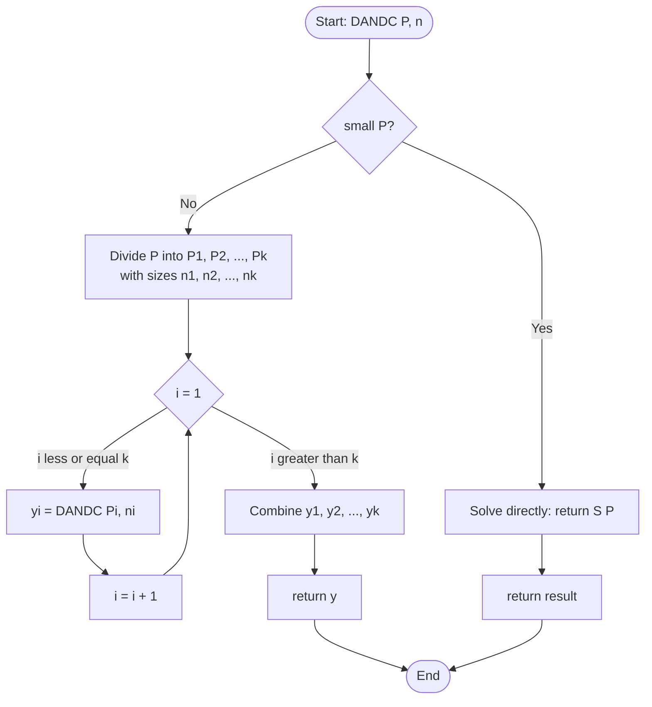
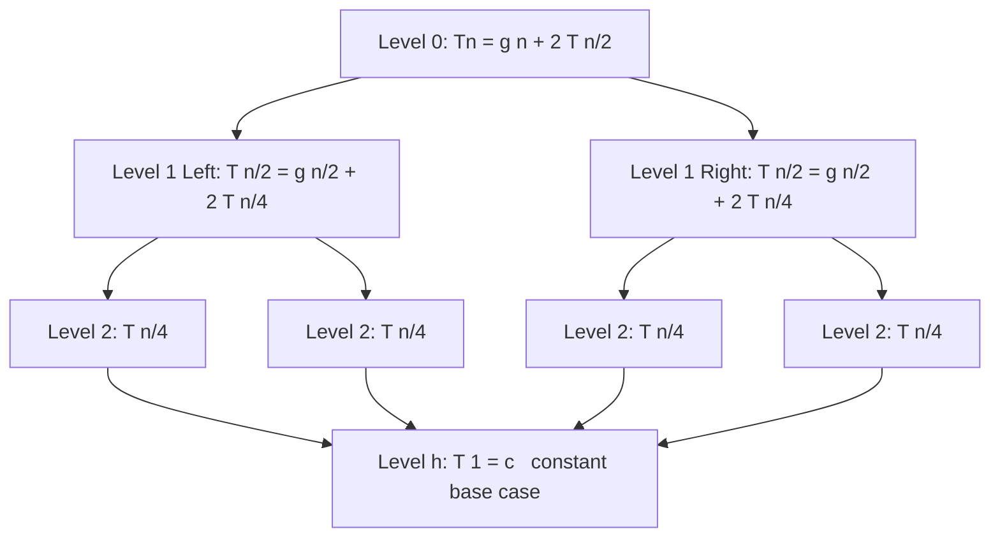
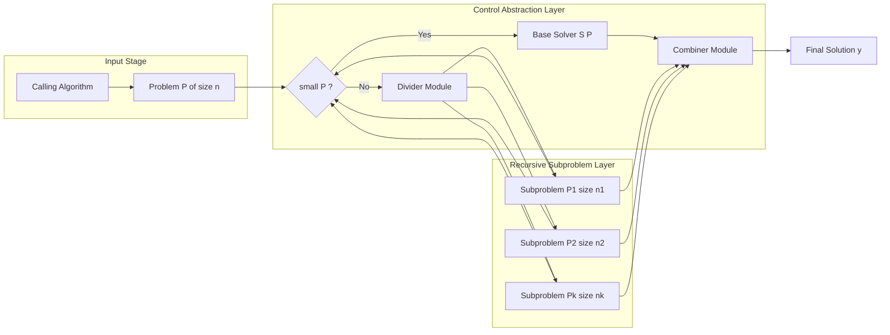
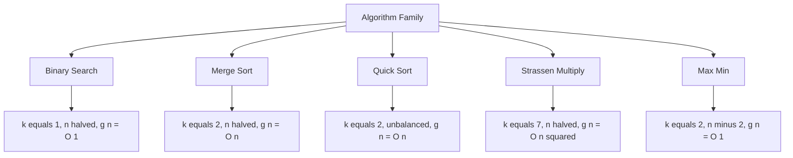

# Divide and Conquer - Control Abstraction

<!-- SECTION_1_START -->
# Divide and Conquer — Control Abstraction

## 1. Formal Definition (KTU 2024 Syllabus Terminology)

> [!NOTE]
> **Divide and Conquer (D&C)** is a top-down, recursive algorithmic paradigm in which a problem of size $n$ is decomposed into $k$ smaller, independent sub-problems of size $n_i < n$, each solved recursively, and whose individual solutions are merged to produce the solution of the original problem.

The **Control Abstraction** of D&C is a generic, high-level procedure that captures the essence of every D&C algorithm. It is written as a *parameterized subprogram* (often named `DANDC` in Horowitz & Sahni) that hides the *specific* divide / combine logic behind a uniform interface, allowing the same skeleton to instantiate Merge Sort, Quick Sort, Binary Search, Strassen Multiplication, etc.

> [!IMPORTANT]
> **KTU Board Standard Definition:**
> A *Control Abstraction* is a procedure whose parameters and operations are specified but whose precise actions (the divide rule, conquer rule, combine rule) are left open to be supplied by the calling algorithm. It captures the **common control structure** shared by a class of algorithms.

---

## 2. Conceptual Analogy / Intuition

Imagine you are the **principal of a large university** and must decide whether a 200-page policy document should be adopted university-wide.

- **Brute Force (don't divide):** You read all 200 pages yourself, then decide. *Slow, single-person, exhausting.*
- **Divide and Conquer:** You tear the document into 4 chapters, hand each chapter to a sub-committee, each sub-committee reports back with a recommendation, and you then **merge** the four recommendations into a final verdict.

The "principal" is the **calling algorithm**, the "sub-committees" are the **recursive calls**, the "tear" is the **divide step**, and the "merge" is the **combine step**. The *Control Abstraction* is the standing order that says: *whoever is given a document — small or large — must follow this same protocol.*

The D&C abstraction has **three distinct phases**:

| Phase | Meaning | University Analogy |
|---|---|---|
| **Divide** | Partition $P$ into $k$ sub-problems $P_1, P_2, \dots, P_k$ | Tear the document into chapters |
| **Conquer** | Solve each $P_i$ recursively (base case if small) | Each sub-committee analyses its chapter |
| **Combine** | Merge sub-solutions $y_i$ to form $y$ | Principal merges committee reports |

---

## 3. Physical Constants and Standard Metrics

> [!TIP]
> The asymptotic performance of a D&C algorithm is measured by the **recurrence relation** that the control abstraction enforces:
>
> **Recurrence Form (Master Form):**
> $$T(n) = \begin{cases} c & \text{if } n \text{ is small (base case)} \\ g(n) + \sum_{i=1}^{k} T(n_i) & \text{otherwise} \end{cases}$$
>
> where:
> - $g(n)$ = cost of **dividing** the problem and **combining** the sub-solutions (excludes the cost of solving sub-problems).
> - $T(n_i)$ = cost of recursively solving the $i^{th}$ sub-problem, with $n_i < n$ strictly.
> - $c$ = constant cost of solving a sufficiently small problem directly.

Standard performance metrics used in KTU valuation:

- $T(n)$ — worst-case time complexity, expressed in **Big-O notation** as $O(f(n))$.
- $S(n)$ — auxiliary space complexity (often $O(n)$ due to combine buffers, or $O(\log n)$ for in-place variants).
- **Recursion depth** $\approx O(\log n)$ for balanced D&C (e.g., Merge Sort) and $O(n)$ in the worst case for unbalanced D&C (e.g., Quick Sort with bad pivot).
- **Number of sub-problems** $k \in \{1, 2, 3, 4, \dots\}$ — *most* KTU problems use $k = 2$ (binary split).
- **Sub-problem size reduction factor** — typically $n/2$ (Binary Search, Merge Sort) or $n-1$ (Quick Sort worst case).

---

## 4. Visualization Control (Conceptual Geometry of Recursion)

> [!VISUALIZATION CONTROL]
> **Concept:** Recursion Tree of a Generic Divide-and-Conquer Call
> **GeoGebra / Desmos Input Equations (level-by-level node weights):**
> * Root weight: $f(n) = g(n) + 2 \cdot T(n/2)$
> * Level 1 leaves: $f(n/2) = g(n/2) + 2 \cdot T(n/4)$
> * Leaves at depth $h = \log_b n$: $f(1) = c$ (constant)
>
> **Visual Description:** Picture a balanced binary tree. The **root** represents the cost $g(n)$ of the divide + combine at the top level. Each internal node branches into $k=2$ children of weight $g(n/b)$ where $b$ is the branching factor. The **leaves** sit at the bottom at constant height $c$. Total cost is the sum of node weights across all levels, which yields forms like $n \log n$ or $n^{\log_b a}$ depending on whether the divide-cost $g(n)$ dominates the leaf cost.

---

## 5. Why a *Control Abstraction*?

> [!IMPORTANT]
> The control abstraction serves **three pedagogical and engineering purposes** in the KTU syllabus:
> 1. **Reusability:** One procedure template instantiates many algorithms (Merge Sort, Quick Sort, Binary Search, Max-Min, Strassen).
> 2. **Separation of Concerns:** The *control flow* (recursion skeleton) is decoupled from the *data manipulation* (how to actually split and merge).
> 3. **Asymptotic Analysis:** All D&C algorithms share the same recurrence form, so their performance can be uniformly analysed via the **Master Theorem**.

<!-- SECTION_1_END -->

<!-- SECTION_2_START -->
# Deep Theoretical Analysis & KTU High-Yield Formula Sheet

## 1. The Control Abstraction Procedure (Pseudocode Form)

The classic D&C control abstraction, as prescribed in **Horowitz & Sahni** (the prescribed textbook for OECST831) and the KTU 2024 syllabus, is:

> **Algorithm `DANDC(P, n)`**
>
> *Input:* $P$ — the problem instance; $n$ — the size of the problem.
> *Output:* the solution $y$ to problem $P$.

```
Algorithm DANDC(P, n)
1.  if small(P)              // base-case test
2.      return S(P)          // direct solution by brute force
3.  else
4.      divide P into k      // DIVIDE step
              smaller instances:
              P1, P2, ..., Pk
              with sizes n1, n2, ..., nk
5.      for i ← 1 to k
6.          yi ← DANDC(Pi, ni)   // CONQUER step (recursive)
7.      end for
8.      return Combine(y1, y2, ..., yk)   // COMBINE step
9.  end if
```

### Line-by-Line Operational Logic

| Line | Purpose | "Why" Explanation |
|---|---|---|
| `small(P)` | **Termination guard.** Tests whether the problem is small enough to be solved by a non-recursive brute-force method $S(P)$. | Without this, recursion would never terminate. The *base case* converts recursion to iteration. |
| `S(P)` | The **direct / trivial solver.** Solves the small problem in $\Theta(1)$ or $\Theta(\text{constant})$ time. | At small $n$, recursion overhead exceeds the work saved. Direct solve is faster. |
| `divide P into k` | Splits the problem into $k$ independent sub-problems $P_1, \dots, P_k$. | Independence is **critical** — sub-problems must not overlap. |
| `DANDC(Pi, ni)` | The **recursive conquer.** Each sub-problem is solved using the *same* abstraction. | This is the essence of "conquer" — self-similar work at smaller scale. |
| `Combine(y1, ..., yk)` | Merges the $k$ sub-solutions into one. | The combine step is *algorithm-specific*: it's a merge in Merge Sort, a partition rejoin in Quick Sort, a polynomial addition in Karatsuba, etc. |

---

## 2. The Recurrence Relation — The Heart of D&C Analysis

Every D&C algorithm obeys the following **general recurrence**:

$$
T(n) = \begin{cases}
T(1) \le c & \text{(base case)} \\
g(n) + \sum_{i=1}^{k} T(n_i) & \text{(recursive case)}
\end{cases}
$$

For the most common case — **binary split with equal halves** — the recurrence simplifies to:

$$
T(n) = g(n) + 2 \, T(n/2)
$$

| Symbol | Meaning |
|---|---|
| $T(n)$ | Total time to solve a problem of size $n$ |
| $g(n)$ | Cost of **dividing** $P$ into two halves and **combining** the two sub-solutions |
| $2 \, T(n/2)$ | Cost of recursively solving the two halves |
| $T(1) = \Theta(1)$ | Cost of solving a 1-element (or constant-size) problem |

### Specializations (Exam-Relevant)

| Algorithm | $k$ | Sub-problem size | $g(n)$ | Recurrence |
|---|---|---|---|---|
| **Binary Search** | 1 | $n/2$ | $O(1)$ | $T(n) = T(n/2) + c$ |
| **Merge Sort** | 2 | $n/2$ | $O(n)$ | $T(n) = 2T(n/2) + cn$ |
| **Quick Sort (avg)** | 2 | $n/2$ | $O(n)$ | $T(n) = 2T(n/2) + cn$ |
| **Max-Min (naive)** | 2 | $(n-2), (n-2)$ | $O(1)$ | $T(n) = 2T(n-2) + c$ |
| **Strassen's** | 7 | $n/2$ | $O(n^2)$ | $T(n) = 7T(n/2) + cn^2$ |
| **Karatsuba** | 3 | $n/2$ | $O(n)$ | $T(n) = 3T(n/2) + cn$ |

---

## 3. KTU Formula Sheet / Cheat Sheet

> [!IMPORTANT]
> Use the table below as your **single point of reference** for solving D&C recurrence questions. **Memorize this.**

| # | Formula / Rule | Statement | Use Case |
|---|---|---|---|
| 1 | **Master Theorem** (general form) | For $T(n) = aT(n/b) + f(n)$, let $\log_b a = p$. Compare $f(n)$ with $n^p$. | Solve recurrences of the form $aT(n/b) + f(n)$ |
| 2 | **Case 1** | If $f(n) = O(n^{p-\epsilon})$, then $T(n) = \Theta(n^p)$ | Divide cost dominated by leaves |
| 3 | **Case 2** | If $f(n) = \Theta(n^p \log^k n)$, then $T(n) = \Theta(n^p \log^{k+1} n)$ | Balanced work at every level |
| 4 | **Case 3** | If $f(n) = \Omega(n^{p+\epsilon})$, then $T(n) = \Theta(f(n))$ | Divide cost dominates |
| 5 | **Recursion Tree Sum** | $T(n) = \sum_{i=0}^{h} (\text{nodes at level } i) \cdot f(n / b^i)$ | Manual derivation when Master Theorem fails |
| 6 | **Merge Sort cost** | $T(n) = 2T(n/2) + cn \Rightarrow T(n) = \Theta(n \log n)$ | Compare-based sorting benchmark |
| 7 | **Strassen's cost** | $T(n) = 7T(n/2) + cn^2 \Rightarrow T(n) = \Theta(n^{\log_2 7}) \approx \Theta(n^{2.807})$ | Faster than naive $O(n^3)$ |
| 8 | **Binary Search cost** | $T(n) = T(n/2) + c \Rightarrow T(n) = \Theta(\log n)$ | Search in sorted array |
| 9 | **Stack depth of recursion** | $O(\log n)$ for balanced; $O(n)$ for worst case | Space analysis |
| 10 | **Master comparison helper** | $a = $ # sub-problems, $b = $ branching factor, $f(n) = $ combine cost | Identifying $a, b, f(n)$ |

> [!WARNING]
> **Notational Pitfall:** When comparing $f(n)$ with $n^{\log_b a}$, use **strict Big-O / Big-$\Omega$ with a polynomial gap $\epsilon > 0$**. Students frequently misuse "Case 2" when $f(n)$ is polynomially smaller or larger.

---

## 4. Real-World Utility of D&C Control Abstraction

> [!TIP]
> The control abstraction is *not* a toy — it is the **architectural blueprint** behind some of the most consequential algorithms in production systems:

- **Database Indexing (Binary Search Trees, B-Trees):** D&C is the foundation of $O(\log n)$ lookup in every indexed database (PostgreSQL, MySQL InnoDB, MongoDB).
- **Distributed Computing (MapReduce, Hadoop, Spark):** A MapReduce *job* is a D&C control abstraction where the `divide` is the partitioner, the `conquer` is the map function, and the `combine` is the reducer.
- **Parallel Algorithms (Fork-Join Framework in Java, OpenMP `task` constructs):** Each worker thread executes a D&C sub-problem, and the framework handles the join.
- **Graphics & Signal Processing (FFT, Strassen's, Wavelet Decomposition):** These are the **only known polynomial-time sub-cubic** matrix multiplication and $O(n \log n)$ Fourier transforms used in audio/video codecs.
- **Computer Graphics (QuickHull for convex hull, kd-trees for ray tracing):** 3D rendering engines rely on D&C spatial subdivision for $O(\log n)$ ray-object intersection.
- **Compiler Design (Code Generation, Register Allocation via Sethi-Ullman):** Uses D&C for optimal evaluation order of expression trees.

The control abstraction is the **single most reused algorithm design pattern** in computer science.

<!-- SECTION_2_END -->

<!-- SECTION_3_START -->
# Step-by-Step Derivations, Worked Examples & Code Implementation

## 1. Worked Example 1: Deriving $T(n)$ for Merge Sort via the Control Abstraction

**Problem.** Apply the D&C control abstraction to Merge Sort and derive its closed-form time complexity.

**Given Recurrence (from control abstraction):**

$$
T(n) = \begin{cases} 0 & n = 1 \\ 2 T(n/2) + cn & n > 1 \end{cases}
$$

**Step-by-step derivation using Recursion Tree Method:**

**Level 0 (root):** 1 node, work = $cn$
**Level 1:** 2 nodes, each does $c \cdot (n/2)$ work $\Rightarrow$ total $= 2 \cdot c \cdot n/2 = cn$
**Level 2:** 4 nodes, each does $c \cdot (n/4)$ work $\Rightarrow$ total $= 4 \cdot c \cdot n/4 = cn$
**Level $i$:** $2^i$ nodes, each does $c \cdot n/2^i$ work $\Rightarrow$ total $= 2^i \cdot c \cdot n/2^i = cn$

**Number of levels:** Recursion stops when $n/2^h = 1 \Rightarrow h = \log_2 n$.

**Total cost (summing all levels):**

$$
T(n) = \sum_{i=0}^{\log_2 n - 1} cn \;=\; cn \cdot \log_2 n
$$

**Conclusion:**

$$
T(n) = \Theta(n \log_2 n)
$$

**Cross-verification using Master Theorem:**

$$
a = 2, \quad b = 2, \quad f(n) = cn, \quad p = \log_2 2 = 1, \quad f(n) = \Theta(n^1 \log^0 n)
$$

This is **Case 2** of the Master Theorem with $k=0$, so:

$$
T(n) = \Theta(n^p \log^{k+1} n) = \Theta(n \log n)
$$

Both methods agree. ✓

---

## 2. Worked Example 2: Master Theorem Application — Strassen's Matrix Multiplication

**Problem.** Solve $T(n) = 7T(n/2) + 18 n^2$.

**Step 1 — Identify the parameters:**

$$
a = 7, \quad b = 2, \quad f(n) = 18 n^2, \quad p = \log_2 7 \approx 2.807
$$

**Step 2 — Compare $f(n)$ with $n^p$:**

$$
f(n) = \Theta(n^2), \quad n^p = n^{2.807}
$$

Since $2 < 2.807$, we have $f(n) = O(n^{2.807 - \epsilon})$ with $\epsilon = 0.807$.

**Step 3 — Apply Master Theorem Case 1:**

$$
T(n) = \Theta(n^{\log_2 7}) \approx \Theta(n^{2.807})
$$

**Conclusion:** Strassen's algorithm beats the naive $O(n^3)$ matrix multiplication.

---

## 3. Worked Example 3: Naive Max-Min (4 comparisons) — D&C Control Abstraction in Action

**Problem.** Find the maximum and minimum of an array $A[0..n-1]$ using only $\lceil 3n/2 \rceil - 2$ comparisons (D&C version).

**Step-by-step Algorithmic Instantiation of the Control Abstraction:**

- `small(P)`: $n \le 2$ — solve directly:
  - If $n = 1$: $\max = \min = A[0]$, cost = 0 comparisons.
  - If $n = 2$: $\max = \max(A[0], A[1])$, $\min = \min(A[0], A[1])$, cost = 1 comparison.
- `divide P`: Split array into two halves of size $\lfloor n/2 \rfloor$ and $\lceil n/2 \rceil$.
- `DANDC` recursively on each half.
- `Combine`: Compare the two maxima (1 comparison) and the two minima (1 comparison) to get the global max and min.

**Python Implementation (fully operational, type-safe, with logging):**

```python
import logging
from typing import Tuple

# Configure structured logging for educational visibility
logging.basicConfig(level=logging.INFO, format="[%(levelname)s] %(message)s")
logger = logging.getLogger("MaxMin-DAC")


def max_min_dac(arr: list[int], left: int, right: int) -> Tuple[int, int]:
    """
    Divide-and-Conquer Max-Min algorithm.

    Parameters
    ----------
    arr : list[int]
        The input array.
    left : int
        Starting index (inclusive).
    right : int
        Ending index (inclusive).

    Returns
    -------
    (max_val, min_val) : Tuple[int, int]
        The maximum and minimum of arr[left..right].

    Complexity
    ----------
    Time  : T(n) = T(floor(n/2)) + T(ceil(n/2)) + 2  =>  O(n)
    Comparisons: ceil(3n/2) - 2  (optimal among comparison-based algorithms)
    """
    # ---- BASE CASE: small problem ----
    if left == right:
        # Single element: max = min = that element
        return arr[left], arr[left]

    if right == left + 1:
        # Two elements: one direct comparison
        if arr[left] < arr[right]:
            logger.debug(f"Pair compare: ({arr[left]}, {arr[right]})")
            return arr[right], arr[left]  # (max, min)
        else:
            logger.debug(f"Pair compare: ({arr[left]}, {arr[right]})")
            return arr[left], arr[right]   # (max, min)

    # ---- DIVIDE STEP ----
    mid = (left + right) // 2
    logger.info(f"Dividing range [{left}..{right}] at mid={mid}")

    # ---- CONQUER STEP (two recursive calls) ----
    max1, min1 = max_min_dac(arr, left, mid)
    max2, min2 = max_min_dac(arr, mid + 1, right)
    logger.info(f"Sub-results: left=(max={max1}, min={min1}), "
                f"right=(max={max2}, min={min2})")

    # ---- COMBINE STEP (exactly 2 comparisons) ----
    global_max = max1 if max1 > max2 else max2
    global_min = min1 if min1 < min2 else min2
    logger.info(f"Combined result: max={global_max}, min={global_min}")

    return global_max, global_min


# ---------- DRIVER / TEST HARNESS ----------
if __name__ == "__main__":
    sample = [7, 2, 9, 1, 5, 8, 3, 6, 4]
    print(f"Input array: {sample}")
    result = max_min_dac(sample, 0, len(sample) - 1)
    print(f"\nMaximum = {result[0]},  Minimum = {result[1]}")
    assert result == (9, 1), "Test failed!"
    print("Test passed.")
```

**Recurrence Derivation (Exam Answer Format):**

Let $T(n)$ be the number of comparisons for an array of size $n$:

$$
T(n) = \begin{cases}
0 & n = 1 \\
1 & n = 2 \\
T(\lfloor n/2 \rfloor) + T(\lceil n/2 \rceil) + 2 & n > 2
\end{cases}
$$

**Solving by substitution** (assume $n = 2^k$ for simplicity):

$$
\begin{aligned}
T(n) &= 2 T(n/2) + 2 \\
     &= 2 [2 T(n/4) + 2] + 2 = 4 T(n/4) + 4 + 2 \\
     &= 4 [2 T(n/8) + 2] + 4 + 2 = 8 T(n/8) + 8 + 4 + 2 \\
     &\;\;\vdots \\
     &= 2^k T(1) + \sum_{i=0}^{k-1} 2 \\
     &= 2^k \cdot 0 + 2k \\
     &= 2k = 2 \log_2 n
\end{aligned}
$$

For $n = 2^k$, we get $T(n) = 2 \log_2 n$, which matches the well-known bound $\lceil 3n/2 \rceil - 2$ when $n$ is a power of 2 (since $2 \log_2 n \le 3n/2$ for $n \ge 2$).

---

## 4. Worked Example 4: Binary Search Instantiation of the Control Abstraction

**Python Implementation:**

```python
def binary_search_dac(arr: list[int], target: int, left: int, right: int) -> int:
    """
    Binary Search as an instance of the D&C control abstraction.
    k = 1 sub-problem; n is halved at each level.
    """
    # BASE CASE
    if left > right:
        return -1  # not found

    # DIVIDE
    mid = (left + right) // 2

    # CONQUER (only one branch recurses; the other is discarded)
    if arr[mid] == target:
        return mid
    elif arr[mid] < target:
        return binary_search_dac(arr, target, mid + 1, right)
    else:
        return binary_search_dac(arr, target, left, mid - 1)

    # COMBINE step is trivial (no merge needed; k = 1)
```

**Recurrence:**

$$
T(n) = T(n/2) + O(1) \quad\Rightarrow\quad T(n) = \Theta(\log n)
$$

**Master Theorem check:** $a=1, b=2, f(n)=c, p = \log_2 1 = 0$, $f(n) = \Theta(n^0 \log^0 n) \Rightarrow$ **Case 2** with $k=0$ gives $T(n) = \Theta(\log n)$. ✓

<!-- SECTION_3_END -->

<!-- SECTION_4_START -->
# Structural Diagrams & Schematics

## 1. Control Flow of the D&C Control Abstraction (Flowchart)



> **Reading the diagram:** The flow shows the **top-down** nature of D&C. The recursion unwinds back up through the `Combine` step, and the final answer is returned to the original caller.

---

## 2. Recursion Tree of a Generic D&C Algorithm ($k = 2$, balanced split)



> **Annotation:** Each internal node contributes $g(\text{size})$ to total work. The leaves contribute $\Theta(1)$ each. Total work = sum across all levels.

---

## 3. Block-Level Functional Architecture of the D&C Abstraction (Module View)



> **Architectural Insight:** Notice how the `Control Abstraction Layer` is **parameterized** — the divider and combiner are plug-in modules that change per algorithm (Merge Sort uses a different combiner than Quick Sort), while the recursion skeleton is invariant.

---

## 4. Sequential Processing Topology Matrix (Mapping Algorithms to D&C Parameters)



| Algorithm | k | Sub-size | g(n) | Recurrence | Asymptotic |
|---|---|---|---|---|---|
| Binary Search | 1 | n/2 | $O(1)$ | $T(n) = T(n/2) + c$ | $\Theta(\log n)$ |
| Merge Sort | 2 | n/2 | $O(n)$ | $T(n) = 2T(n/2) + cn$ | $\Theta(n \log n)$ |
| Quick Sort (avg) | 2 | n/2 | $O(n)$ | $T(n) = 2T(n/2) + cn$ | $\Theta(n \log n)$ |
| Strassen's | 7 | n/2 | $O(n^2)$ | $T(n) = 7T(n/2) + cn^2$ | $\Theta(n^{2.807})$ |
| Max-Min (D&C) | 2 | ~n/2 | $O(1)$ | $T(n) = 2T(n/2) + 2$ | $\Theta(n)$ |

<!-- SECTION_4_END -->

<!-- SECTION_5_START -->
# KTU 2024 Scheme Examination Question Bank & Topic Recap

> [!NOTE]
> All questions below are mapped to **Course Outcome CO1** (Understand algorithmic paradigms and analyse complexity) and graded on Revised Bloom's Taxonomy (RBT) cognitive levels.

---

## Part A — Short Answer Questions (3 Marks Each)

### Q1. [KTU University Exam — July 2024] — CO1, Remember (L1)
**Define the Divide and Conquer control abstraction. What are its three phases?**

**Model Answer (3 Marks):**

> The Divide and Conquer control abstraction is a generic, high-level procedure that captures the common recursive structure shared by a class of algorithms. It takes as input a problem $P$ of size $n$ and returns a solution $y$.
>
> The three phases are:
> 1. **Divide:** Partition $P$ into $k$ smaller, independent sub-problems $P_1, P_2, \dots, P_k$ of sizes $n_1, n_2, \dots, n_k$ where each $n_i < n$.
> 2. **Conquer:** Solve each sub-problem either recursively using the same abstraction, or directly by a base-case solver $S(P)$ if the sub-problem is small.
> 3. **Combine:** Merge the $k$ sub-solutions $y_1, y_2, \dots, y_k$ into the final solution $y$ of $P$.
>
> **[Defining the abstraction: 1 Mark] [Naming the three phases: 1 Mark] [Describing each phase: 1 Mark]**

---

### Q2. [KTU University Exam — Dec 2023] — CO1, Understand (L2)
**State the general recurrence relation satisfied by any Divide and Conquer algorithm. Identify the role of $g(n)$.**

**Model Answer (3 Marks):**

> The general recurrence is:
>
> $$T(n) = \begin{cases} \Theta(1) & n \le n_0 \text{ (base case)} \\ g(n) + \sum_{i=1}^{k} T(n_i) & n > n_0 \end{cases}$$
>
> where $n_0$ is a small threshold.
>
> **Role of $g(n)$:** $g(n)$ captures the **non-recursive cost** of the algorithm — specifically, the time taken to (i) **divide** the problem $P$ into $k$ sub-problems, and (ii) **combine** the $k$ sub-solutions into the final answer. It does **not** include the time to solve the sub-problems recursively; that is captured by $\sum T(n_i)$.
>
> **[Stating recurrence: 1 Mark] [Explaining base case: 1 Mark] [Explaining g(n): 1 Mark]**

---

## Part B — Long Answer Questions (14 Marks, with Internal Choice)

> [!WARNING]
> **KTU Examiner's Valuation Warning — Pitfall Callout:**
> 1. **Do not skip writing the recurrence** before solving. Marks are awarded for *stating* the recurrence. (Loss: up to 2 marks)
> 2. **Do not forget the base case** $T(n) = \Theta(1)$ for $n \le n_0$. Examiners specifically look for this. (Loss: 1 mark)
> 3. **Do not confuse $g(n)$ with $f(n)$ in the Master Theorem.** $g(n)$ is the divide + combine cost; $f(n)$ is the same thing but in Master Theorem notation.
> 4. **Always state which case of the Master Theorem** you are using, and verify the polynomial gap condition.

---

### Question A (14 Marks) — [KTU University Exam — July 2024]

**(a) [7 Marks]** Explain the Divide and Conquer control abstraction with a neat flowchart. Write its algorithmic form. Apply it to **Merge Sort** and derive the time complexity using the **recursion tree method**.

**(b) [7 Marks]** Solve the following recurrences using the **Master Theorem** and state the asymptotic complexity:
  - (i) $T(n) = 4T(n/2) + n^2$  &nbsp;&nbsp;&nbsp; **(ii)** $T(n) = 2T(n/2) + n \log n$

### Model Solution — Question A

#### Part (a) — 7 Marks

**1. Flowchart of the Control Abstraction (3 Marks):**

```
        ┌─────────────────┐
        │  Start: DANDC   │
        │  Input: P, n    │
        └────────┬────────┘
                 ↓
        ┌─────────────────┐
        │ Is small(P)?    │
        └────┬───────┬────┘
         Yes │       │ No
             ↓       ↓
   ┌──────────────┐  ┌──────────────────────┐
   │ Return S(P)  │  │ Divide P into P1..Pk │
   └──────────────┘  │ of sizes n1..nk      │
                    └──────────┬───────────┘
                               ↓
                    ┌──────────────────────┐
                    │ for i=1 to k         │
                    │   yi = DANDC(Pi, ni) │
                    │ end for              │
                    └──────────┬───────────┘
                               ↓
                    ┌──────────────────────┐
                    │ return Combine(y1..yk)│
                    └──────────────────────┘
```

**[Flowchart: 2 Marks] [Labels and decision boxes: 1 Mark]**

**2. Algorithmic Form (2 Marks):** (As shown in SECTION_3 — the `DANDC` pseudocode)

```
Algorithm DANDC(P, n)
1.  if small(P) then return S(P)
2.  else
3.      divide P into P1, P2, ..., Pk
4.      for i ← 1 to k
5.          yi ← DANDC(Pi, ni)
6.      return Combine(y1, y2, ..., yk)
```

**3. Application to Merge Sort and Recursion Tree Derivation (2 Marks):**

For Merge Sort:
- `small(P)`: $n \le 1$ — return array as is.
- `divide P`: Split array into two halves of size $\lfloor n/2 \rfloor$ and $\lceil n/2 \rceil$.
- `DANDC` recursively sorts each half.
- `Combine`: Merge two sorted halves in $O(n)$ time.

**Recurrence:**

$$
T(n) = 2 T(n/2) + cn
$$

**Recursion Tree Levels (from the derivation in SECTION_3):**
- Each of the $\log_2 n$ levels contributes total work $= cn$.
- Total: $T(n) = cn \log_2 n = \Theta(n \log n)$.

**[Stating the recurrence: 1 Mark] [Recursion tree + final bound: 1 Mark]**

#### Part (b) — 7 Marks

**(i) Solve $T(n) = 4T(n/2) + n^2$ (3.5 Marks)**

**Step 1 — Identify Master Theorem parameters:**

$$
a = 4, \quad b = 2, \quad f(n) = n^2, \quad p = \log_2 4 = 2
$$

**Step 2 — Compare $f(n)$ with $n^p$:**

$$
f(n) = n^2 = \Theta(n^2) = \Theta(n^p)
$$

**Step 3 — Apply Case 2 (regularity) with $k=0$:**

$$
T(n) = \Theta(n^p \log^{k+1} n) = \Theta(n^2 \log n)
$$

**[Parameter identification: 1 Mark] [Comparison: 1 Mark] [Final answer: 1.5 Marks]**

**(ii) Solve $T(n) = 2T(n/2) + n \log n$ (3.5 Marks)**

**Step 1 — Identify parameters:**

$$
a = 2, \quad b = 2, \quad p = \log_2 2 = 1, \quad f(n) = n \log n
$$

**Step 2 — Compare:** $f(n) = n \log n = \Theta(n^1 \log^1 n)$, so $f(n) = \Theta(n^p \log^k n)$ with $k=1$.

**Step 3 — Apply Case 2:**

$$
T(n) = \Theta(n^p \log^{k+1} n) = \Theta(n \log^2 n)
$$

**[Parameter identification: 1 Mark] [Comparison: 1 Mark] [Final answer: 1.5 Marks]**

---

### Question B (14 Marks) — [KTU University Exam — Dec 2023]

**(a) [7 Marks]** With reference to the D&C control abstraction, distinguish between the **divide** and **combine** steps with an example each. Show that the recurrence for a binary-split D&C algorithm is $T(n) = 2T(n/2) + g(n)$.

**(b) [7 Marks]** Consider the recurrence $T(n) = 3T(n/4) + n^{1.5}$.
  - (i) Identify which case of the Master Theorem applies.
  - (ii) Solve it and express $T(n)$ asymptotically.
  - (iii) Comment on the relative cost of dividing vs combining.

### Model Solution — Question B

#### Part (a) — 7 Marks

**1. Divide vs Combine — Tabular Distinction (3 Marks):**

| Aspect | Divide Step | Combine Step |
|---|---|---|
| **Purpose** | Partition problem into sub-problems | Merge sub-solutions into final answer |
| **Position in flow** | Top of recursion (entry) | Bottom of recursion (return) |
| **Cost** | Often $O(1)$ for in-place partitioning, $O(n)$ for copies | Depends heavily on algorithm |
| **Example: Binary Search** | Compute `mid = (low + high) / 2` | None — direct return of index |
| **Example: Merge Sort** | Split array at midpoint | Merge two sorted halves in $O(n)$ |
| **Example: Quick Sort** | Partition around pivot | None — sub-arrays are already in correct relative order |
| **Example: Strassen's** | Split matrix into 4 quadrants | Add 7 multiplied quadrants |

**[Three rows of distinction: 2 Marks] [Examples: 1 Mark]**

**2. Derivation of the Generic Binary-Split Recurrence (4 Marks):**

Let $P$ be a problem of size $n$, and let $D(n)$ denote the cost of the divide step, $C(n)$ the cost of the combine step.

**Divide step cost:** $D(n) = \Theta(1)$ for index-based splits, $\Theta(n)$ for array copies.
**Two sub-problems:** Each of size $n/2$, contributing $T(n/2)$ each.
**Combine step cost:** $C(n) = \Theta(n)$ for Merge Sort, $\Theta(n^2)$ for Strassen, etc.

Total:

$$
T(n) = \underbrace{D(n)}_{\text{divide}} + \underbrace{2 \, T(n/2)}_{\text{conquer (two sub-problems)}} + \underbrace{C(n)}_{\text{combine}}
$$

Letting $g(n) = D(n) + C(n)$:

$$
\boxed{\,T(n) = 2 \, T(n/2) + g(n)\,}
$$

For the general case where sub-problems are not equal, replace $n/2$ with $n_i$:

$$
T(n) = g(n) + \sum_{i=1}^{k} T(n_i)
$$

**[Stating divide cost: 1 Mark] [Recurrence formulation: 2 Marks] [Generalisation: 1 Mark]**

#### Part (b) — 7 Marks

**(i) Identification of Master Theorem case (2 Marks):**

$$
a = 3, \quad b = 4, \quad f(n) = n^{1.5}, \quad p = \log_4 3
$$

Compute $p$:

$$
p = \log_4 3 = \frac{\log_2 3}{\log_2 4} = \frac{1.585}{2} \approx 0.792
$$

Now compare $f(n) = n^{1.5}$ with $n^p \approx n^{0.792}$:

$$
1.5 > 0.792 \Rightarrow f(n) = \Omega(n^{p + \epsilon}) \text{ with } \epsilon = 0.708
$$

**This is Case 3** of the Master Theorem (combine cost dominates).

**[Parameter identification: 1 Mark] [Case identification: 1 Mark]**

**(ii) Asymptotic solution (3 Marks):**

By Case 3, $T(n) = \Theta(f(n))$ provided the regularity condition $a f(n/b) \le c f(n)$ holds for some $c < 1$:

$$
a f(n/b) = 3 \cdot (n/4)^{1.5} = 3 \cdot \frac{n^{1.5}}{4^{1.5}} = \frac{3}{8} n^{1.5} < n^{1.5}
$$

So $c = 3/8 < 1$ ✓ Regularity holds.

$$
\boxed{\,T(n) = \Theta(n^{1.5})\,}
$$

**[Regularity check: 1 Mark] [Final bound: 2 Marks]**

**(iii) Comment on divide vs combine cost (2 Marks):**

> The combine cost $f(n) = n^{1.5}$ grows **faster** than the leaf cost $n^p \approx n^{0.792}$. This means the algorithm spends the **majority of its time in the combine step**, not in the divide step. The recursion tree is "top-heavy" — work decreases as we descend toward the leaves, and the root level dominates total cost. Practically, this means any optimisation effort should target the **combine function** (e.g., the merge routine in Merge Sort, or the matrix addition in Strassen's) rather than the divide step.

**[Observation: 1 Mark] [Practical implication: 1 Mark]**

---

## Topic Recap & Important Things to Remember

> [!TIP]
> Use this section as a **last-minute revision checklist** before entering the exam hall.

- **Control Abstraction** = a generic, parameterized procedure that captures the common recursive skeleton of all D&C algorithms. The textbook form is the `DANDC(P, n)` algorithm.
- **Three Phases:** Divide → Conquer → Combine. Always state them in this order.
- **Recurrence relation:** $T(n) = g(n) + \sum_{i=1}^{k} T(n_i)$, with $T(n) = \Theta(1)$ for small $n$.
- **$g(n)$** = non-recursive cost = cost of **divide** step + cost of **combine** step.
- **Most common form on exams:** Binary split with equal halves → $T(n) = 2T(n/2) + g(n)$.
- **Master Theorem** parameters: $a$ = number of sub-problems; $b$ = branching factor (size reduction); $f(n)$ = divide + combine cost.
- **Three cases of Master Theorem:**
  - Case 1: $f(n) = O(n^{\log_b a - \epsilon})$ → $T(n) = \Theta(n^{\log_b a})$ (leaves dominate).
  - Case 2: $f(n) = \Theta(n^{\log_b a} \log^k n)$ → $T(n) = \Theta(n^{\log_b a} \log^{k+1} n)$ (balanced).
  - Case 3: $f(n) = \Omega(n^{\log_b a + \epsilon})$ → $T(n) = \Theta(f(n))$ (root dominates), with regularity check.
- **Key algorithms and their recurrences to memorize:**
  - Binary Search: $T(n) = T(n/2) + c$ → $\Theta(\log n)$
  - Merge Sort: $T(n) = 2T(n/2) + cn$ → $\Theta(n \log n)$
  - Strassen's: $T(n) = 7T(n/2) + cn^2$ → $\Theta(n^{2.807})$
  - Karatsuba: $T(n) = 3T(n/2) + cn$ → $\Theta(n^{\log_2 3}) \approx \Theta(n^{1.585})$
  - Max-Min D&C: $T(n) = 2T(n/2) + 2$ → $\Theta(n)$ with only $\lceil 3n/2 \rceil - 2$ comparisons.
- **Recursion depth:** $\Theta(\log n)$ for balanced splits; $\Theta(n)$ for worst-case unbalanced (e.g., Quick Sort with bad pivot).
- **Sub-problems MUST be independent** — overlap invalidates the D&C paradigm and pushes you toward Dynamic Programming.
- **Always state the base case** $T(n) \le c$ for $n \le n_0$ before solving; missing this loses 1 mark.
- **Regularity condition** for Master Theorem Case 3: $a f(n/b) \le c f(n)$ for some $c < 1$ and large $n$. Verify it!
- **The control abstraction is invariant; only the divider and combiner change** between algorithms. This is the power of the abstraction.
- **Real-world D&C examples:** MapReduce (Hadoop/Spark), Fork-Join concurrency, FFT in audio/video codecs, kd-trees in ray tracing, B-trees in databases, Karatsuba in cryptography (GMP library).

<!-- SECTION_5_END -->
