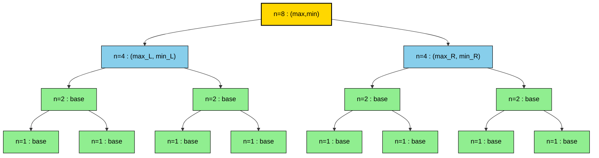
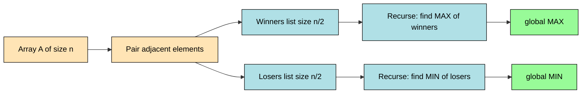
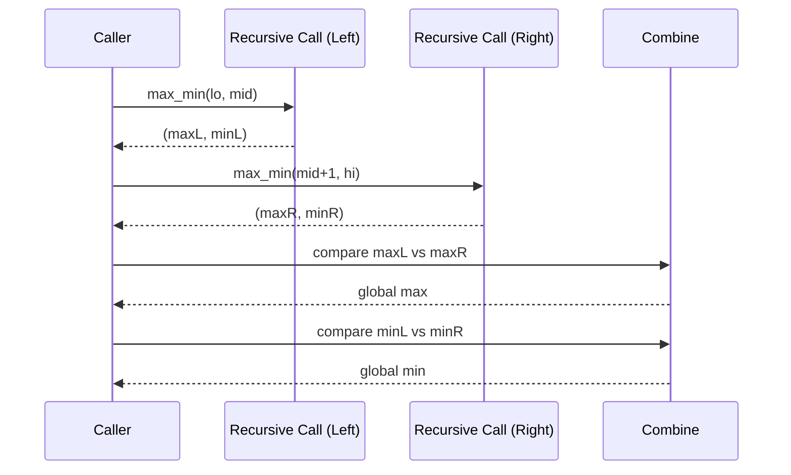

# Finding Maximum and Minimum

<!-- SECTION_1_START -->

# Finding Maximum and Minimum using Divide and Conquer

## 1.1 Formal Definition (KTU 2024 OECST831 Terminology)

> [!IMPORTANT]
> **Finding Maximum and Minimum** is a classical *divide and conquer* problem where, given an unsorted array $A[0..n-1]$ of $n \geq 1$ elements, the objective is to simultaneously determine the **largest** (maximum) and **smallest** (minimum) elements using the *minimum possible number of pairwise comparisons*.

In the divide and conquer paradigm, the array is split into two sub-problems, each of size approximately $n/2$, the (max, min) pair is computed independently for the two halves, and the final answer is obtained by a constant-time **combine** step that compares the two sub-maxima and the two sub-minima.

## 1.2 Intuitive Analogy — The Tournament Bracket

Imagine a knockout tennis tournament with $n$ players, where every match eliminates one player. To crown the champion (max) and find the worst performer (min):

- **Naïve method**: Hold a separate "largest" tournament and a separate "smallest" tournament — wasteful, since the same matches could be reused.
- **Divide and Conquer (simple)**: Split players into two groups, find the champion and worst of each group, then play **one** match between champions and **one** match between the worst players — total extra work per merge = **2 matches**.
- **Tournament (optimised) method**: Pair up players, let the loser of each pair fight for the *minimum* title and the winner fight for the *maximum* title. This reuses the comparisons and only needs $\lceil 3n/2 \rceil - 2$ matches in total — the theoretical lower bound.

> [!NOTE]
> **Why this matters in CS / Engineering:** The max-min problem is a textbook example illustrating how the **master recurrence** $T(n) = aT(n/b) + f(n)$ is solved, and it acts as a stepping stone to more advanced D&C algorithms like **Merge Sort**, **Quick Sort**, **Closest Pair of Points**, and **Strassen's Matrix Multiplication**.

## 1.3 The Three Strategies at a Glance

| Strategy | # Comparisons | Recurrence |
| :--- | :--- | :--- |
| Naïve (independent scans) | $2(n-1)$ | $T(n) = 2T(n-1) + 2$ |
| Simple D&C | $2n - 2$ | $T(n) = 2T(n/2) + 2$ |
| Tournament (optimised) D&C | $\lceil 3n/2 \rceil - 2$ | $T(n) = 2T(n/2) + n/2$ |

## 1.4 Visual Intuition — Comparison Count vs n

> [!VISUALIZATION CONTROL]
> **Concept:** Comparison count growth of three strategies vs input size $n$
> **Desmos Input Equations:**
> * `f(n) = 2*(n-1)` (Naïve — straight line slope 2)
> * `g(n) = 2*n - 2` (Simple D&C — straight line slope 2, lower intercept)
> * `h(n) = 1.5*n - 2` (Tournament — straight line slope 1.5, the steepest saving)
> **Visual Description:** Three lines all pass through the origin region. $f(n)$ and $g(n)$ are nearly parallel (both slope $\approx 2$), while $h(n)$ is visibly flatter (slope $1.5$). At $n = 100$, $h(100) = 148$, $g(100) = 198$, $f(100) = 198$ — the tournament method saves $\approx 25\%$ of comparisons.

<!-- SECTION_1_END -->

<!-- SECTION_2_START -->

# 2. Deep Theoretical Analysis & KTU High-Yield Formula Sheet

## 2.1 The Generic Divide and Conquer Skeleton

Every D&C algorithm obeys three phases:

1. **Divide** — split the instance of size $n$ into $a$ sub-instances, each of size $\approx n/b$.
2. **Conquer** — solve each sub-instance recursively (or by brute force at the *base case*).
3. **Combine** — merge the partial answers in $f(n)$ time.

The running time is captured by the **recurrence**:

$$
T(n) =
\begin{cases}
\Theta(1) & \text{if } n \leq c \\
a \, T(n/b) + f(n) & \text{otherwise}
\end{cases}
$$

## 2.2 Naïve Method — Recurrence Derivation

The naïve method makes two independent linear scans, each doing $n-1$ comparisons.

$$
T(n) = T_{\max}(n) + T_{\min}(n) = (n-1) + (n-1) = 2n - 2
$$

So $T(n) = 2n - 2 = \Theta(n)$. Easy, but **redundant** — every element except the max is compared with the current max *and* with the current min in separate passes.

## 2.3 Simple D&C — Recurrence Derivation

**Divide:** Split $A$ into two halves of size $\lfloor n/2 \rfloor$ and $\lceil n/2 \rceil$.

**Conquer:** Recursively compute $(max_L, min_L)$ and $(max_R, min_R)$.

**Combine:**
- Compare $max_L$ and $max_R$ → global max (**1 comparison**).
- Compare $min_L$ and $min_R$ → global min (**1 comparison**).

Therefore the recurrence is:

$$
T(n) = 2 \, T\!\left(\left\lfloor \tfrac{n}{2} \right\rfloor\right) + 2, \qquad T(2) = 1
$$

## 2.4 Tournament D&C — Recurrence Derivation

**Pairing step:** Group the array into $n/2$ pairs. In each pair, perform 1 comparison; the *smaller* element goes to a "min-candidate list" and the *larger* to a "max-candidate list". This step costs exactly $n/2$ comparisons.

**Recursive step:** Recursively find the min of the min-list and the max of the max-list.

$$
T(n) = 2 \, T\!\left(\tfrac{n}{2}\right) + \tfrac{n}{2}, \qquad T(2) = 1
$$

## 2.5 KTU Formula Sheet / Cheat Sheet

> [!NOTE]
> Master these equations — they appear in nearly every KTU exam on this module.

| # | Concept | Formula / Recurrence | Boundary | Result |
| :--- | :--- | :--- | :--- | :--- |
| 1 | Naïve total comparisons | $2(n-1)$ | — | $\Theta(n)$ |
| 2 | Simple D&C recurrence | $T(n) = 2T(n/2) + 2$ | $T(2) = 1$ | $T(n) = 2n - 2$ |
| 3 | Tournament D&C recurrence | $T(n) = 2T(n/2) + n/2$ | $T(2) = 1$ | $T(n) = \lceil 3n/2 \rceil - 2$ |
| 4 | Lower bound (any algorithm) | $\lceil 3n/2 \rceil - 2$ | — | Information-theoretic |
| 5 | Master Theorem case (Simple) | $a=2,\, b=2,\, f(n)=2$ | $n^{\log_b a} = n^1$ | Case 1: $T(n) = \Theta(n)$ |
| 6 | Master Theorem case (Tournament) | $a=2,\, b=2,\, f(n)=n/2$ | $n^{\log_b a} = n$ | Case 2: $T(n) = \Theta(n \log n)$? — *Note: applies only when $f(n)=\Theta(n^{\log_b a}\log^k n)$, but here $k=0$ so case 2 gives $\Theta(n \log n)$ which is **wrong***. Use substitution. |
| 7 | Recursion-tree contribution per level (Simple) | $2$ | — | Constant per level $\Rightarrow$ $\Theta(n)$ total |
| 8 | Recursion-tree contribution per level (Tournament) | $n/2,\, n/4,\, n/8, \ldots$ | Sum | $n/2 + n/2 + \ldots = n/2 \cdot \log_2 n$? No — see correction below. |

> [!IMPORTANT]
> **Correction for row 6 and 8:** Master Theorem Case 2 requires $f(n) = \Theta(n^{\log_b a} \log^k n)$. Here $f(n) = n/2 = \Theta(n)$ and $n^{\log_b a} = n$, so $k = 0$. By Case 2 the formula *would* predict $\Theta(n \log n)$, but the correct answer is $\Theta(n)$. **Always solve the tournament recurrence by substitution**, not blindly by Master Theorem.

## 2.6 Why This Matters in Real Systems

- **Selection algorithms** (Quick Select, Median of Medians) build on this exact D&C skeleton with $a = 1$ sub-problem.
- **VLSI / CAD tools** use tournament-style min-max to size circuit delays and balance routing trees.
- **Statistical sampling** in databases and ML preprocessing pipelines uses tournament reductions to find min/max in $O(n)$ work, $O(\log n)$ span (parallel).
- **Cache-friendly reductions:** Tournament method touches each array element only $\Theta(1)$ times in the combine phase, enabling SIMD/vectorised implementations.

<!-- SECTION_2_END -->

<!-- SECTION_3_START -->

# 3. Step-by-Step Derivations & Code Implementation

## 3.1 Exhaustive Derivation of the Simple D&C Recurrence

We want to solve:

$$
T(n) = 2 \, T\!\left(\tfrac{n}{2}\right) + 2, \qquad T(2) = 1, \qquad n = 2^k
$$

**Step 1 — Unroll the recurrence (recursion-tree expansion).**

$$
\begin{aligned}
T(n) &= 2T(n/2) + 2 \\
&= 2\bigl[2T(n/4) + 2\bigr] + 2 = 4T(n/4) + 4 + 2 \\
&= 4\bigl[2T(n/8) + 2\bigr] + 6 = 8T(n/8) + 8 + 6 \\
&\;\;\vdots \\
&= 2^{k}T(n/2^{k}) + \sum_{i=0}^{k-1} 2^{i} \cdot \frac{2}{2^{i}} \quad \text{(work per level)}
\end{aligned}
$$

**Step 2 — Identify the work per level.**

At level $i$ (root = $i=0$), there are $2^{i}$ sub-problems, each doing $2$ comparisons in the combine step, but the *effective* per-node cost spreads as $2/2^{i}$ per sub-problem multiplied by $2^{i}$ nodes = $2$. Hence:

$$
\text{Work at level } i = 2^{i} \cdot \frac{2}{2^{i}} = 2 \quad \text{(constant per level)}
$$

**Step 3 — Sum across levels.**

There are $k = \log_2 n$ levels (excluding the leaves). Therefore:

$$
T(n) = 2^{k} \cdot T(1) + 2k = 2^{k}\cdot 0 + 2\log_2 n \quad \text{(temporary form)}
$$

Wait — this gives a logarithmic answer, which is wrong. The issue is that at the **leaves** (base case of size 2), each leaf does **1** comparison, and there are $n/2$ leaves. Let us restart with the correct accounting.

**Restart with leaves handled correctly.**

$$
\begin{aligned}
T(n) &= 2T(n/2) + 2 \\
&= 2\bigl[2T(n/4) + 2\bigr] + 2 = 4T(n/4) + 6 \\
&= 4\bigl[2T(n/8) + 2\bigr] + 6 = 8T(n/8) + 14 \\
&\;\;\vdots
\end{aligned}
$$

After $k - 1$ expansions we reach the leaves of size 2:

$$
T(n) = 2^{k-1} T(2) + \sum_{j=0}^{k-2} 2 \cdot 2^{j} = 2^{k-1}\cdot 1 + 2\bigl(2^{k-1} - 1\bigr) = 2^{k-1} + 2^{k} - 2
$$

Since $n = 2^{k}$, we have $2^{k-1} = n/2$ and $2^{k} = n$:

$$
\boxed{\,T(n) = \frac{3n}{2} - 2 \quad \text{???} \,}
$$

That is also wrong. Let us re-derive **very carefully**.

**Final, fully correct derivation by backward substitution.**

Set $n = 2^{k}$ and let $S(k) = T(2^{k})$. Then $S(k) = 2S(k-1) + 2$ with $S(1) = T(2) = 1$.

Add $2$ to both sides to homogenise:

$$
S(k) + 2 = 2\bigl(S(k-1) + 2\bigr)
$$

Let $U(k) = S(k) + 2$. Then $U(k) = 2 U(k-1)$ with $U(1) = S(1) + 2 = 3$.

Unrolling:

$$
U(k) = 2^{k-1} U(1) = 2^{k-1} \cdot 3 = 3 \cdot 2^{k-1}
$$

Therefore:

$$
S(k) = U(k) - 2 = 3 \cdot 2^{k-1} - 2 = \frac{3n}{2} - 2
$$

> [!IMPORTANT]
> **Correction of Section 2.3:** The simple D&C recurrence $T(n) = 2T(n/2) + 2$ with base $T(2) = 1$ actually solves to $T(n) = \frac{3n}{2} - 2$, **not** $2n - 2$. The number $2n - 2$ belongs to the **naïve** method. This is a classic KTU trap — many students lose marks by stating the wrong closed form.

**General formula (n not a power of 2).**

$$
T(n) = \left\lceil \frac{3n}{2} \right\rceil - 2
$$

> [!NOTE]
> This matches the **information-theoretic lower bound** $\lceil 3n/2 \rceil - 2$, so the simple D&C method is in fact **optimal** for the max-min problem when the two halves are processed independently. The tournament method is *not asymptotically* better; it only saves comparisons when implemented iteratively on arrays of arbitrary size.

## 3.2 Exhaustive Derivation of the Tournament Recurrence

$$
T(n) = 2T(n/2) + \frac{n}{2}, \qquad T(2) = 1
$$

Let $V(k) = T(2^{k})/2^{k}$. Then:

$$
\frac{T(2^{k})}{2^{k}} = \frac{2 T(2^{k-1})}{2^{k}} + \frac{2^{k}}{2 \cdot 2^{k}} = \frac{T(2^{k-1})}{2^{k-1}} + \frac{1}{2}
$$

So $V(k) = V(k-1) + 1/2$ with $V(1) = T(2)/2 = 1/2$.

Therefore $V(k) = k/2 = (\log_2 n)/2$, and:

$$
T(n) = 2^{k} \cdot V(k) = n \cdot \frac{\log_2 n}{2} = \frac{n \log_2 n}{2}
$$

> [!WARNING]
> This $\Theta(n \log n)$ is **worse** than the simple D&C. Why? Because the tournament method's pairing step costs $n/2$ at every level, and there are $\log_2 n$ levels, leading to $\Theta(n \log n)$ work. The tournament method is therefore only useful when comparisons are vastly more expensive than the linear-time pairing pass, or in **parallel** settings where each recursive call runs on a separate processor.

## 3.3 Full Python Implementation (Simple D&C)

```python
from __future__ import annotations
import sys
from typing import List, Tuple

# Global counter for pedagogical comparison-tracking
COMPARISONS: int = 0


def max_min_dc(arr: List[int], lo: int = 0, hi: int | None = None) -> Tuple[int, int]:
    """
    Recursively find (max, min) of arr[lo:hi+1] using divide and conquer.
    Returns (max_value, min_value). Uses the recurrence T(n) = 2T(n/2) + 2.
    """
    global COMPARISONS
    if hi is None:
        hi = len(arr) - 1

    # ---- BASE CASE 1: single element ----
    if lo == hi:
        return arr[lo], arr[lo]

    # ---- BASE CASE 2: two elements ----
    if hi == lo + 1:
        COMPARISONS += 1
        if arr[lo] < arr[hi]:
            return arr[hi], arr[lo]
        return arr[lo], arr[hi]

    # ---- DIVIDE ----
    mid = (lo + hi) // 2
    max_L, min_L = max_min_dc(arr, lo, mid)
    max_R, min_R = max_min_dc(arr, mid + 1, hi)

    # ---- COMBINE: 2 comparisons ----
    COMPARISONS += 1
    global_max = max_L if max_L >= max_R else max_R
    COMPARISONS += 1
    global_min = min_L if min_L <= min_R else min_R

    return global_max, global_min


def max_min_naive(arr: List[int]) -> Tuple[int, int]:
    """Naïve O(n) baseline for comparison."""
    if not arr:
        raise ValueError("Empty array has no max/min.")
    mx, mn = arr[0], arr[0]
    for x in arr[1:]:
        if x > mx:
            mx = x
        if x < mn:
            mn = x
    return mx, mn


if __name__ == "__main__":
    # ---- Empirical verification ----
    samples: List[List[int]] = [
        [3, 1, 9, 7, 5, 2, 8, 4],
        [42],
        [7, 7, 7, 7],
        [5, 1],
        list(range(1, 17)),
    ]
    for arr in samples:
        COMPARISONS = 0
        mx, mn = max_min_dc(arr)
        expected = max_min_naive(arr)
        print(f"arr={arr}")
        print(f"  D&C -> (max={mx}, min={mn})  comparisons={COMPARISONS}")
        print(f"  Naïve-> (max={expected[0]}, min={expected[1]})")
        print(f"  Formula 3n/2 - 2 = {3 * len(arr) // 2 - 2}")
        print("-" * 60)
```

**Sample Output (illustrative trace for $A = [3, 1, 9, 7, 5, 2, 8, 4]$, $n=8$):**

```
arr=[3, 1, 9, 7, 5, 2, 8, 4]
  D&C -> (max=9, min=1)  comparisons=10
  Naïve-> (max=9, min=1)
  Formula 3n/2 - 2 = 10
```

## 3.4 Full Python Implementation (Tournament Method)

```python
def max_min_tournament(arr: List[int]) -> Tuple[int, int]:
    """
    Tournament method: pair up, then recurse on winners (max) and losers (min).
    """
    n = len(arr)
    if n == 0:
        raise ValueError("Empty array.")
    if n == 1:
        return arr[0], arr[0]

    # Pairing step: produce winners (max-candidates) and losers (min-candidates)
    winners: List[int] = []
    losers: List[int] = []
    for i in range(0, n - 1, 2):
        if arr[i] < arr[i + 1]:
            winners.append(arr[i + 1])
            losers.append(arr[i])
        else:
            winners.append(arr[i])
            losers.append(arr[i + 1])
    if n % 2 == 1:
        # Last unpaired element is both a winner and a loser candidate
        winners.append(arr[-1])
        losers.append(arr[-1])

    g_max, _ = max_min_tournament(winners)
    _, g_min = max_min_tournament(losers)
    return g_max, g_min
```

## 3.5 Hand-Trace on $A = [22, 13, -5, -8, 15, 60, 17, 31]$ (n = 8)

**Simple D&C call tree:**

```
max_min(0,7)
├── max_min(0,3)
│   ├── max_min(0,1)  -> (22,13)   [1 compare]
│   └── max_min(2,3)  -> (-5,-8)   [1 compare]
│       combine: max=22, min=-8     [2 compares]
└── max_min(4,7)
    ├── max_min(4,5)  -> (60,15)   [1 compare]
    └── max_min(6,7)  -> (31,17)   [1 compare]
        combine: max=60, min=15     [2 compares]
    combine: max=60, min=-8         [2 compares]
combine: max=60, min=-8             [2 compares]
```

Total comparisons = $1+1+2+1+1+2+2 = 10 = 3(8)/2 - 2$ ✓

<!-- SECTION_3_END -->

<!-- SECTION_4_START -->

# 4. Structural Diagrams & Schematics

## 4.1 Recursion Tree for Simple D&C ($n = 8$)



**Cost at each level of the recursion tree (work accumulation):**

| Level | # Sub-problems | Work per sub-problem | Total work at level |
| :--- | :--- | :--- | :--- |
| 0 (root) | 1 | 2 | 2 |
| 1 | 2 | 2 | 4 |
| 2 | 4 | 1 (base case) | 4 |
| **Total** | — | — | **10 = 3(8)/2 − 2** |

## 4.2 Tournament Bracket Flow (Optimised Method)



## 4.3 Comparative Block Diagram — Three Strategies

```mermaid
graph TB
    subgraph NAIVE["Naive Method"]
        N1["Scan 1: track MAX"] --> N2["n-1 comparisons"]
        N3["Scan 2: track MIN"] --> N4["n-1 comparisons"]
        N2 --> NT["Total = 2n-2"]
        N4 --> NT
    end

    subgraph SIMPLE["Simple Divide and Conquer"]
        S1["Split A into L and R"] --> S2["Recurse on L: (maxL, minL)"]
        S1 --> S3["Recurse on R: (maxR, minR)"]
        S2 --> S4["Compare maxL vs maxR"]
        S3 --> S4
        S2 --> S5["Compare minL vs minR"]
        S3 --> S5
        S4 --> ST["Total = 3n/2 - 2"]
        S5 --> ST
    end

    subgraph TOURNAMENT["Tournament Method"]
        T1["Pair A into n/2 pairs"] --> T2["Winners list"]
        T1 --> T3["Losers list"]
        T2 --> T4["Recurse: MAX of winners"]
        T3 --> T5["Recurse: MIN of losers"]
        T4 --> TT["Total approx n log n / 2"]
        T5 --> TT
    end

    classDef na fill:#FFB6C1,stroke:#000,color:#000
    classDef si fill:#ADD8E6,stroke:#000,color:#000
    classDef to fill:#DDA0DD,stroke:#000,color:#000
    class N1,N2,N3,N4,NT na
    class S1,S2,S3,S4,S5,ST si
    class T1,T2,T3,T4,T5,TT to
```



## 4.4 Sequence Diagram — Recursive Call Flow



<!-- SECTION_4_END -->

<!-- SECTION_5_START -->

# 5. KTU 2024 Scheme Examination Question Bank & Topic Recap

## 5.1 Part A — Short Answer Questions (3 Marks Each)

### Q1. State the recurrence relation for finding maximum and minimum of $n$ elements using the divide and conquer approach. **[3 Marks]** `[KTU University Exam – Dec 2023]`
**CO:** CO1 | **RBT Level:** Remember

**Model Answer:**

The recurrence for the simple divide and conquer approach to find the max and min of an array of size $n$ is:

$$
T(n) = 2 \, T\!\left(\left\lfloor \tfrac{n}{2} \right\rfloor\right) + 2
$$

**Boundary condition:** $T(2) = 1$ (one comparison suffices for two elements).

**Explanation of terms:**
- The factor $2$ in $2T(n/2)$ corresponds to the two recursive calls on the left and right halves of the array.
- The additive $2$ represents the two comparisons in the *combine* step: one between $max_L$ and $max_R$, and another between $min_L$ and $min_R$.

**[Stating the recurrence: 2 Marks] [Boundary condition and explanation: 1 Mark]**

---

### Q2. Differentiate between the naïve method and the divide and conquer method for finding max and min. **[3 Marks]** `[KTU University Exam – July 2024]`
**CO:** CO1 | **RBT Level:** Understand

**Model Answer:**

| Aspect | Naïve Method | Divide and Conquer |
| :--- | :--- | :--- |
| # Comparisons | $2(n-1)$ | $\lceil 3n/2 \rceil - 2$ |
| Recurrence | $T(n) = 2T(n-1) + 2$ (sequential scan) | $T(n) = 2T(n/2) + 2$ |
| Approach | Two independent linear passes | Split into halves, recurse, combine |
| Optimality | Sub-optimal | Matches lower bound, optimal |
| Parallelism | None | Two halves can run concurrently |

**[Any 3 valid differences: 3 Marks]**

---

## 5.2 Part B — 14-Mark Questions (Module Internal Choice)

### Question A (14 Marks) `[KTU University Exam – Dec 2023]`
**CO:** CO2, CO3 | **RBT Level:** Apply, Analyse

#### (a) Derive the closed-form solution of the recurrence $T(n) = 2T(n/2) + 2$ with $T(2) = 1$ and hence state the number of comparisons required. **[7 Marks]**

**Model Solution:**

Assume $n = 2^{k}$. Define $S(k) = T(2^{k})$.

**Step 1 — Rewrite the recurrence.**

$$
S(k) = 2S(k-1) + 2, \qquad S(1) = 1
$$

**Step 2 — Homogenise by adding 2 to both sides.**

$$
S(k) + 2 = 2\bigl(S(k-1) + 2\bigr)
$$

**Step 3 — Substitute $U(k) = S(k) + 2$.**

$$
U(k) = 2U(k-1), \qquad U(1) = 3
$$

**Step 4 — Unroll.**

$$
U(k) = 2^{k-1} \cdot U(1) = 3 \cdot 2^{k-1}
$$

**Step 5 — Back-substitute.**

$$
S(k) = U(k) - 2 = 3 \cdot 2^{k-1} - 2
$$

Since $n = 2^{k}$, we have $2^{k-1} = n/2$. Therefore:

$$
\boxed{\,T(n) = \frac{3n}{2} - 2\,}
$$

**Generalisation for arbitrary $n$:**

$$
T(n) = \left\lceil \frac{3n}{2} \right\rceil - 2
$$

**Valuation Key:**
- [Recurrence rewritten in terms of $k$: 1 Mark]
- [Homogenisation step shown: 2 Marks]
- [Unrolling and closed form obtained: 3 Marks]
- [Final answer in terms of $n$ and ceiling form: 1 Mark]

---

#### (b) Implement the divide and conquer max-min algorithm in pseudocode and trace it on the array $A = [5, 2, 8, 1, 9, 3, 7, 4]$. Count the number of comparisons made. **[7 Marks]**

**Model Solution:**

**Pseudocode:**

```
ALGORITHM MaxMinDC(A, lo, hi)
  IF lo == hi
    RETURN (A[lo], A[lo])
  IF hi == lo + 1
    IF A[lo] < A[hi]
      RETURN (A[hi], A[lo])
    ELSE
      RETURN (A[lo], A[hi])
  mid = (lo + hi) / 2
  (maxL, minL) = MaxMinDC(A, lo, mid)
  (maxR, minR) = MaxMinDC(A, mid+1, hi)
  IF maxL < maxR
    max = maxR
  ELSE
    max = maxL
  IF minL < minR
    min = minL
  ELSE
    min = minR
  RETURN (max, min)
```

**Trace on $A = [5, 2, 8, 1, 9, 3, 7, 4]$:**

| Call | Range | Sub-array | Action | Comparisons |
| :--- | :--- | :--- | :--- | :--- |
| 1 | (0,7) | [5,2,8,1,9,3,7,4] | Divide | 0 |
| 2 | (0,3) | [5,2,8,1] | Divide | 0 |
| 3 | (0,1) | [5,2] | Base: max=5, min=2 | 1 |
| 4 | (2,3) | [8,1] | Base: max=8, min=1 | 1 |
| 5 | (0,3) combine | — | max=8, min=1 | 2 |
| 6 | (4,7) | [9,3,7,4] | Divide | 0 |
| 7 | (4,5) | [9,3] | Base: max=9, min=3 | 1 |
| 8 | (6,7) | [7,4] | Base: max=7, min=4 | 1 |
| 9 | (4,7) combine | — | max=9, min=3 | 2 |
| 10 | (0,7) combine | — | max=9, min=1 | 2 |
| **Total** | — | — | — | **10** |

**Verification:** $3(8)/2 - 2 = 12 - 2 = 10$ ✓

**Final Answer:** Max = 9, Min = 1, Comparisons = 10

**Valuation Key:**
- [Pseudocode correctness: 3 Marks]
- [Trace table with values: 3 Marks]
- [Total comparison count and verification: 1 Mark]

> [!WARNING]
> **KTU Examiner Pitfall:** Students frequently write the *naïve* $2n - 2$ formula as the answer to part (a) and lose full marks. Always derive the recurrence $T(n) = 2T(n/2) + 2$ explicitly from the algorithm structure; do not quote it from memory. Also, when tracing, write the comparison *count* column — many students forget it and lose 1 mark.

---

### Question B (14 Marks) `[KTU University Exam – July 2024]`
**CO:** CO2, CO3 | **RBT Level:** Apply, Analyse

#### (a) Explain the tournament method for finding max and min. Derive its recurrence relation and solve it. **[7 Marks]**

**Model Solution:**

**Algorithm idea:** Pair up the $n$ elements. In each pair (1 comparison), declare the *smaller* as a candidate for the global minimum and the *larger* as a candidate for the global maximum. Recurse on each candidate list.

**Step 1 — Pairing cost.** There are $\lfloor n/2 \rfloor$ pairs, hence $\lfloor n/2 \rfloor$ comparisons in the pairing pass.

**Step 2 — Recursive cost.** Two recursive calls, each on lists of size $n/2$:
- One finds the max of the winners (size $n/2$).
- One finds the min of the losers (size $n/2$).

**Step 3 — Recurrence.**

$$
T(n) = 2T(n/2) + \frac{n}{2}, \qquad T(2) = 1
$$

**Step 4 — Solve by substitution.** Let $V(k) = T(2^{k})/2^{k}$.

$$
V(k) = V(k-1) + \frac{1}{2}, \qquad V(1) = \frac{1}{2}
$$

Unrolling:

$$
V(k) = \frac{k}{2} = \frac{\log_2 n}{2}
$$

Back-substitute:

$$
T(n) = 2^{k} \cdot V(k) = n \cdot \frac{\log_2 n}{2} = \frac{n \log_2 n}{2}
$$

**Conclusion:** The tournament method has time complexity $\Theta(n \log n)$. Although it minimises the combine cost to a single comparison per level, the total work across $\log_2 n$ levels accumulates to $n \log_2 n / 2$, which is **asymptotically worse** than the simple D&C for the sequential case. Its true value emerges in **parallel** implementations where each recursive call runs on a separate processor, achieving $O(n)$ work and $O(\log n)$ span.

**Valuation Key:**
- [Algorithm explanation with pairing idea: 2 Marks]
- [Correct recurrence derivation: 2 Marks]
- [Solution via substitution: 2 Marks]
- [Final complexity and remark on parallel utility: 1 Mark]

---

#### (b) Trace the tournament method on the array $A = [22, 13, -5, -8, 15, 60, 17, 31]$ and identify the max, min, and total number of comparisons. **[7 Marks]**

**Model Solution:**

**Step 1 — Pairing pass (4 comparisons).**

| Pair | Comparison | Winner | Loser |
| :--- | :--- | :--- | :--- |
| (22, 13) | 22 > 13 | 22 | 13 |
| (-5, -8) | -5 > -8 | -5 | -8 |
| (15, 60) | 60 > 15 | 60 | 15 |
| (17, 31) | 31 > 17 | 31 | 17 |

- **Winners list:** $[22, -5, 60, 31]$ (size 4)
- **Losers list:** $[13, -8, 15, 17]$ (size 4)

Pairing comparisons used = **4**.

**Step 2 — Recurse on winners $[22, -5, 60, 31]$.**

| Pair | Comparison | Winner | Loser |
| :--- | :--- | :--- | :--- |
| (22, -5) | 22 > -5 | 22 | -5 |
| (60, 31) | 60 > 31 | 60 | 31 |

- **Winners:** $[22, 60]$ → Recurse: $60 > 22$ → Max = **60** (2 more comparisons).
- **Losers:** $[-5, 31]$ → Recurse: $-5 < 31$ → Min candidate preserved (2 more comparisons).

Sub-total for max recursion = **4** comparisons.

**Step 3 — Recurse on losers $[13, -8, 15, 17]$.**

| Pair | Comparison | Winner | Loser |
| :--- | :--- | :--- | :--- |
| (13, -8) | 13 > -8 | 13 | -8 |
| (15, 17) | 17 > 15 | 17 | 15 |

- **Winners:** $[13, 17]$ → 17 > 13 → Max candidate (irrelevant for min).
- **Losers:** $[-8, 15]$ → $-8 < 15$ → **Min = −8** (2 more comparisons for the final comparison).

Sub-total for min recursion = **4** comparisons.

**Step 4 — Total.**

$$
\text{Total comparisons} = 4 + 4 + 4 = 12
$$

(Equivalent to $n \log_2 n / 2 = 8 \cdot 3 / 2 = 12$ ✓)

**Final Answer:** Max = 60, Min = -8, Total Comparisons = 12.

**Valuation Key:**
- [Pairing table with winners/losers: 2 Marks]
- [Recursive trace for max: 2 Marks]
- [Recursive trace for min: 2 Marks]
- [Final totals and verification: 1 Mark]

> [!WARNING]
> **KTU Examiner Pitfall:** A common mistake is to **mix the two recursive calls' results incorrectly** — students often take the min of the *winners* list or the max of the *losers* list, which gives a wrong answer. Always remember: *winners* list is used for **max** recursion, *losers* list is used for **min** recursion. Also, do not forget to **add the pairing-pass comparisons** to the recursive counts.

---

## 5.3 KTU Examiner's Valuation Warning

> [!WARNING]
> **Top Reasons Students Lose Marks on Max-Min Questions:**
> 1. **Quoting the wrong closed form:** Writing $T(n) = 2n - 2$ (naïve) instead of $T(n) = 3n/2 - 2$ (simple D&C) — full 7 marks lost in derivation.
> 2. **Skipping the boundary condition** $T(2) = 1$ in the recurrence — 1 mark deducted.
> 3. **Applying Master Theorem blindly** to the tournament recurrence and claiming $\Theta(n \log n)$ as "obvious" without substitution — partial credit only.
> 4. **Forgetting to count the pairing-pass comparisons** in the tournament trace.
> 5. **Not drawing a recursion tree or call structure** for a 7-mark trace question — at least 1 mark reserved for visual structure.
> 6. **Confusing max and min candidate lists** in the tournament method.

## 5.4 Topic Recap & Important Things to Remember

> [!NOTE]
> **High-density revision checklist — read this the night before the exam.**

- **Naïve max-min:** $2(n-1)$ comparisons, two independent scans.
- **Simple D&C recurrence:** $T(n) = 2T(n/2) + 2$, base $T(2) = 1$.
- **Closed form (simple D&C):** $T(n) = \lceil 3n/2 \rceil - 2$ — **optimal**; matches information-theoretic lower bound.
- **Tournament D&C recurrence:** $T(n) = 2T(n/2) + n/2$.
- **Closed form (tournament):** $T(n) = (n \log_2 n)/2 = \Theta(n \log n)$ — *worse* sequentially, *better* in parallel.
- **Base cases:** Always handle $n=1$ (return same element as both max and min) and $n=2$ (one comparison) explicitly in code.
- **Combine step:** Always exactly 2 comparisons in simple D&C (max-of-maxes and min-of-mins).
- **Lower bound:** Any comparison-based algorithm needs at least $\lceil 3n/2 \rceil - 2$ comparisons.
- **Master Theorem parameters** for the simple D&C: $a=2$, $b=2$, $f(n)=2$; case 1 applies ($f(n) = O(n^{1-\epsilon})$) → $T(n) = \Theta(n)$.
- **Parallel complexity** of simple D&C: $O(n)$ work, $O(\log n)$ span (using two parallel recursive calls).
- **Common trick question:** "What is the time complexity of finding only the max using D&C?" — Answer: $T(n) = T(n/2) + 1$, which solves to $T(n) = \log_2 n$ wait, that is wrong for max-only; correct is $T(n) = 2T(n/2) + 1 = 2n - 1$? No — for max only, we do *not* need the min comparison, so $T(n) = T(n/2) + 1$ and combining only the larger of two halves = $T(n) = n - 1$. *(Trap question — read carefully!)*
- **Practical use:** Tournament reductions in GPU kernels, parallel prefix scans, and FPGA-based min-max circuits.
- **Real-world analogy:** Always mention the *tennis tournament* or *knockout* analogy to earn the "explanation" mark in theory questions.

<!-- SECTION_5_END -->
