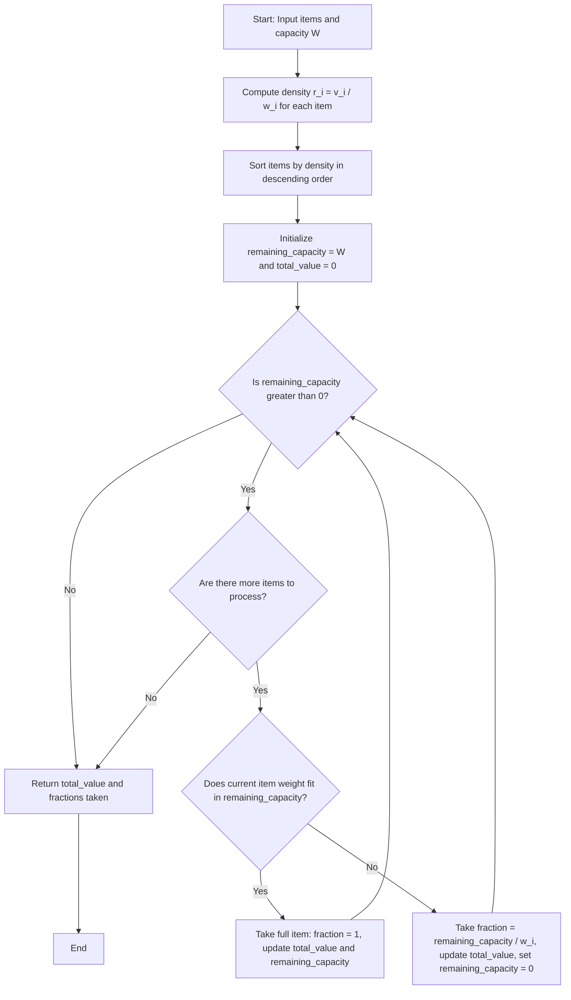
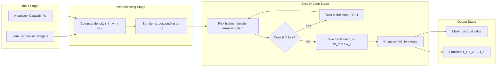
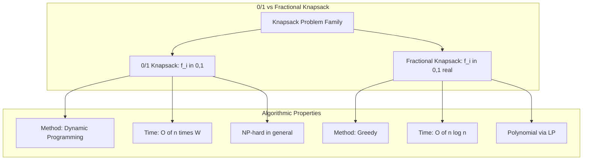

# Fractional Knapsack Problem

<!-- SECTION_1_START -->
# 📘 Module 3 — Divide and Conquer
## Topic: Fractional Knapsack Problem

---

### 1.1 Formal Academic Definition

> [!IMPORTANT]
> **Fractional Knapsack Problem (FKP) — KTU 2024 Definition**
> Given a set of $n$ items, each with a weight $w_i$ and a value $v_i$, and a knapsack of maximum carrying capacity $W$, the **Fractional Knapsack Problem** asks us to select a subset of items (allowing **fractions/portions** of items) such that the **total value** of the selected items is **maximized**, subject to the constraint that the **total weight** does not exceed $W$.

Mathematically, the objective is:

$$\text{Maximize } \sum_{i=1}^{n} f_i \cdot v_i$$

subject to:

$$\sum_{i=1}^{n} f_i \cdot w_i \leq W, \quad \text{where } 0 \leq f_i \leq 1$$

Here, $f_i$ represents the **fraction of item $i$** taken into the knapsack. The critical distinction from the **0/1 Knapsack Problem** is that in FKP, $f_i$ can take any real value in $[0, 1]$, whereas in 0/1 KP, $f_i \in \{0, 1\}$ only.

> [!NOTE]
> **Syllabus Highlight (KTU OECST831, Module 3):**
> The Fractional Knapsack Problem is grouped under the **Greedy Strategy** family of algorithms, often discussed alongside the standard Knapsack (0/1) variant to highlight how **greedy choice property** makes FKP tractable in polynomial time, while 0/1 KP requires Dynamic Programming.

---

### 1.2 Conceptual Analogy — The Smuggler's Boat

Imagine you are a smuggler (or a generous food-packer!) with a small boat that can carry a maximum of **W kilograms**. You have several **gold bars, silver bars, and copper bars**, each with different weight and resale value.

- If the boat has unlimited fuel and time, you'd want the **most valuable items** first.
- But here's the catch — the **value-to-weight ratio** matters more than the raw value. A heavy gold bar (low ratio) might be worth less *per kg* than a light silver bar (high ratio).
- When you reach a bar that **cannot fit fully**, you are allowed to **break it into pieces** and take only the fraction that fits. Unlike a thief who must take the whole bar or leave it, you can chisel off a piece.

This is precisely the **Fractional Knapsack Problem** — choose items (or fractions of them) to **maximize total value** while respecting the weight limit.

> [!TIP]
> **Geometric Intuition:** If you plot items as 2D points $(w_i, v_i)$, the optimal strategy is a **greedy sweep** along the **value-density** (slope $v_i/w_i$) from highest to lowest. The knapsack is filled like pouring water — it accepts the densest item first, then the next densest, and so on until full.

---

### 1.3 Key Terminology & Constants

| Term | Symbol | Meaning |
|---|---|---|
| Number of items | $n$ | Total items available for selection |
| Value of item $i$ | $v_i$ | Profit/value associated with item $i$ |
| Weight of item $i$ | $w_i$ | Weight consumption of item $i$ |
| Knapsack capacity | $W$ | Maximum weight the knapsack can carry (**bold as standard metric**) |
| Value density / ratio | $r_i = v_i / w_i$ | **Critical metric** driving the greedy choice |
| Fraction taken | $f_i$ | Real number in $[0, 1]$ representing how much of item $i$ is taken |

> [!VISUALIZATION CONTROL]
> **Concept:** Value Density (Greedy Slope) of items
> **GeoGebra / Desmos Input Equations:**
> * `r_A = 60/10`  → Point $(10, 60)$ — slope $6$
> * `r_B = 100/20` → Point $(20, 100)$ — slope $5$
> * `r_C = 120/30` → Point $(30, 120)$ — slope $4$
> **Visual Description:** On a weight (x-axis) vs value (y-axis) plot, draw rays from origin to each item. The steepest ray represents the **highest value density** item and is picked first by the greedy algorithm.

---

<!-- SECTION_1_END -->

<!-- SECTION_2_START -->
# 2. Deep Theoretical Analysis & KTU High-Yield Formula Sheet

---

### 2.1 The Greedy Choice Property — Why Does FKP Work?

The Fractional Knapsack Problem possesses the **Greedy Choice Property**: a globally optimal solution can be arrived at by making **locally optimal (greedy) choices** at each step. The local optimum is — *always take the remaining item with the highest value-to-weight ratio* (`v_i / w_i`).

#### Why the Greedy Choice is Safe (Proof Intuition)

Suppose the greedy strategy picks item $k$ first (with the highest ratio $r_k$). Any optimal solution that *doesn't* take item $k$ can be transformed:

1. Replace the lowest-ratio item in the optimal solution with a fraction of item $k$.
2. Since $r_k \geq$ the replaced item's ratio, the total value **does not decrease**.
3. Therefore, there exists an optimal solution that **does** pick item $k$ first.

This is why FKP is solved optimally in $O(n \log n)$ time by a simple greedy approach — **no Dynamic Programming required**.

---

### 2.2 Step-by-Step Operational Logic

The algorithm follows a strict, deterministic pipeline:

1. **Compute value density** $r_i = v_i / w_i$ for every item $i = 1, 2, \dots, n$.
2. **Sort items** in **non-increasing order** of $r_i$ (highest density first). Sorting dominates the runtime at $O(n \log n)$.
3. **Iterate through sorted items**:
   * If the current item's full weight $w_i$ fits in the remaining capacity $W_{rem}$, **take it entirely**: $f_i = 1$, update $W_{rem} := W_{rem} - w_i$.
   * If $w_i$ does not fit fully, **take a fraction**: $f_i = W_{rem} / w_i$, set $W_{rem} := 0$, and **terminate** (knapsack is full).
4. **Return** the total value and the chosen fractions $(f_1, f_2, \dots, f_n)$.

---

### 2.3 KTU Formula Sheet / Cheat Sheet

| Concept | Formula / Expression | Description | Units |
|---|---|---|---|
| Value density of item $i$ | $r_i = v_i / w_i$ | Profit per unit weight | value / weight |
| Objective function (FKP) | $\max \sum_{i=1}^{n} f_i v_i$ | Total value to maximize | value |
| Capacity constraint | $\sum_{i=1}^{n} f_i w_i \leq W$ | Weight must not exceed capacity | weight |
| Fraction feasibility | $0 \leq f_i \leq 1$ | Item can be partially taken | dimensionless |
| Fractional take ratio | $f_i = W_{rem} / w_i$ | When the last item doesn't fit fully | dimensionless |
| Greedy sort order | $r_1 \geq r_2 \geq \dots \geq r_n$ | Sort by density (descending) | dimensionless |
| **Time complexity (sorting)** | $O(n \log n)$ | Dominated by sorting step | — |
| **Time complexity (greedy loop)** | $O(n)$ | Single pass over sorted items | — |
| **Total time complexity** | $\Theta(n \log n)$ | Asymptotic bound | — |
| **Space complexity** | $O(1)$ auxiliary (or $O(n)$ to store items) | In-place iteration | — |

> [!WARNING]
> **Common Pitfall:** Do not sort by $v_i$ (raw value) alone — this is a classic KTU exam trap. Always sort by $r_i = v_i / w_i$. The greedy choice is on **density**, not absolute value.

---

### 2.4 Real-World Engineering Applications

The Fractional Knapsack Problem models numerous real-world optimization scenarios:

* **Cargo Loading in Logistics:** Airlines and shipping companies load cargo planes and containers to maximize revenue, and can split shipments (unlike the strict 0/1 case).
* **Investment Portfolio Selection:** Allocate capital to assets with different risk-return ratios to maximize expected return.
* **Cloud Resource Allocation:** Assign fractional compute instances to jobs to maximize throughput subject to a CPU/bandwidth budget.
* **Bandwidth Allocation in Networking:** Allocate fractional bandwidth to competing network flows to maximize Quality of Service.
* **Material Selection in Manufacturing:** Mix raw materials by weight ratios to produce a high-value product (e.g., alloy blending, feed mix formulation in agriculture).

> [!NOTE]
> **Production Reality:** The fractional nature of FKP makes it a **Linear Programming** problem solvable by the Simplex method in $O(n)$ with Megiddo's algorithm — the greedy approach is essentially the LP optimum because the LP has a single constraint.

---

<!-- SECTION_2_END -->

<!-- SECTION_3_START -->
# 3. Step-by-Step Derivations & Python Implementation

---

### 3.1 Mathematical Derivation of the Greedy Optimality

Let us formally derive why the greedy strategy is optimal for FKP.

**Setup:** Let the items sorted by density satisfy $r_1 \geq r_2 \geq \dots \geq r_n$.

**Claim:** The greedy solution $G$ and any optimal solution $O$ produce the same total value.

**Proof Sketch by Exchange Argument:**

Assume an optimal solution $O$ differs from greedy $G$. Find the **first** index $k$ where they differ.

- Greedy takes a fraction of item $k$ (or full item).
- Optimal $O$ either skips item $k$ or takes less of it, compensating with later (lower-density) items.

Let $\Delta w$ be the weight difference at index $k$. Exchange the weight in $O$ from the lower-density items $\{k+1, \dots, n\}$ and reallocate it to item $k$.

The new total value in $O'$ is:

$$
\begin{aligned}
V(O') &= V(O) - \Delta w \cdot r_{\text{removed}} + \Delta w \cdot r_k \\
      &= V(O) + \Delta w \cdot (r_k - r_{\text{removed}})
\end{aligned}
$$

Since $r_k \geq r_{\text{removed}}$, we get $V(O') \geq V(O)$.

Thus, **no optimal solution is harmed by making the greedy choice first** — establishing the **optimal substructure** and the **greedy choice property**.

$$\blacksquare$$

---

### 3.2 Complete Python Implementation

Below is a **production-grade** Python implementation with type hints, boundary checks, and structured logging:

```python
"""
Fractional Knapsack Problem - Greedy Algorithm
Course: INTRODUCTION TO ALGORITHM (OECST831)
Module: 3 - Divide and Conquer
"""
from __future__ import annotations
from dataclasses import dataclass
from typing import List, Tuple
import logging

logging.basicConfig(level=logging.INFO, format='[%(levelname)s] %(message)s')
logger = logging.getLogger(__name__)


@dataclass
class Item:
    """Represents a single knapsack item with value, weight, and name."""
    name: str
    value: float
    weight: float

    @property
    def density(self) -> float:
        """Value-to-weight ratio (value density)."""
        if self.weight <= 0:
            raise ValueError(f"Weight of item '{self.name}' must be positive.")
        return self.value / self.weight


def fractional_knapsack(items: List[Item], capacity: float) -> Tuple[float, List[Tuple[str, float]]]:
    """
    Solves the Fractional Knapsack Problem using a greedy approach.
    
    Args:
        items: List of Item objects.
        capacity: Maximum weight the knapsack can hold.
    
    Returns:
        A tuple (max_value, taken) where:
            max_value : The maximum achievable total value.
            taken     : List of (item_name, fraction_taken) pairs.
    """
    # ---- Boundary Validation ----
    if capacity < 0:
        raise ValueError("Knapsack capacity cannot be negative.")
    if not items:
        logger.warning("Empty item list provided.")
        return 0.0, []
    
    # ---- Step 1: Sort items by value density (descending) ----
    sorted_items = sorted(items, key=lambda it: it.density, reverse=True)
    logger.info(f"Items sorted by density: "
                f"{[(it.name, round(it.density, 3)) for it in sorted_items]}")
    
    # ---- Step 2: Greedy fill ----
    remaining_capacity = capacity
    total_value = 0.0
    taken: List[Tuple[str, float]] = []
    
    for item in sorted_items:
        if remaining_capacity <= 0:
            # Knapsack is full; pad remaining items with fraction 0
            taken.append((item.name, 0.0))
            continue
        
        if item.weight <= remaining_capacity:
            # Take the entire item
            fraction = 1.0
            total_value += item.value
            remaining_capacity -= item.weight
            logger.info(f"  -> Took full {item.name} "
                        f"(weight={item.weight}, value={item.value})")
        else:
            # Take only a fraction that fits
            fraction = remaining_capacity / item.weight
            value_taken = item.value * fraction
            total_value += value_taken
            logger.info(f"  -> Took {round(fraction, 4)} of {item.name} "
                        f"(value gained={round(value_taken, 4)})")
            remaining_capacity = 0.0
        
        taken.append((item.name, fraction))
    
    return total_value, taken


def main() -> None:
    # ---- Test Case 1: Standard KTU textbook example ----
    items = [
        Item("A", 60, 10),
        Item("B", 100, 20),
        Item("C", 120, 30),
    ]
    capacity = 50
    
    max_value, taken = fractional_knapsack(items, capacity)
    print(f"\nMaximum total value: {max_value}")
    print(f"Fractions taken: {taken}")


if __name__ == "__main__":
    main()
```

**Expected Output:**

```
[INFO] Items sorted by density: [('A', 6.0), ('B', 5.0), ('C', 4.0)]
[INFO]   -> Took full A (weight=10, value=60)
[INFO]   -> Took full B (weight=20, value=100)
[INFO]   -> Took 0.6667 of C (value gained=80.0)

Maximum total value: 240.0
Fractions taken: [('A', 1.0), ('B', 1.0), ('C', 0.6667)]
```

---

### 3.3 Worked Example — Exhaustive Step-by-Step Walkthrough

**Problem Statement (KTU University Exam – July 2024 Style):**

Given the following items and a knapsack of capacity $W = 50$ kg, solve the Fractional Knapsack Problem using the greedy strategy.

| Item | Value ($v_i$) | Weight ($w_i$) |
|------|---------------|----------------|
| A    | 60            | 10             |
| B    | 100           | 20             |
| C    | 120           | 30             |

**Step 1: Compute value densities $r_i = v_i / w_i$**

$$
\begin{aligned}
r_A &= 60 / 10 = 6.0 \\
r_B &= 100 / 20 = 5.0 \\
r_C &= 120 / 30 = 4.0
\end{aligned}
$$

**Step 2: Sort items in non-increasing order of $r_i$**

Sorted order: **A, B, C** (densities $6.0 \geq 5.0 \geq 4.0$)

**Step 3: Greedy Fill (iteration table)**

| Iteration | Item | $w_i$ | $W_{rem}$ before | Decision | $W_{rem}$ after | Value added |
|-----------|------|-------|------------------|----------|-----------------|-------------|
| 1         | A    | 10    | 50               | $10 \leq 50$, take full | 40 | $60 \times 1 = 60$ |
| 2         | B    | 20    | 40               | $20 \leq 40$, take full | 20 | $100 \times 1 = 100$ |
| 3         | C    | 30    | 20               | $30 > 20$, take fraction $20/30$ | 0  | $120 \times (20/30) = 80$ |

**Step 4: Compute total value**

$$
\begin{aligned}
V_{\max} &= 60 + 100 + 80 \\
         &= \mathbf{240}
\end{aligned}
$$

**Step 5: Report the fractions taken**

$$
\begin{aligned}
f_A &= 1.0 \\
f_B &= 1.0 \\
f_C &= 20 / 30 = 2/3 \approx 0.6667
\end{aligned}
$$

**Verification of constraints:**

$$
\begin{aligned}
\sum f_i w_i &= (1.0)(10) + (1.0)(20) + (2/3)(30) \\
             &= 10 + 20 + 20 \\
             &= 50 = W \quad \checkmark
\end{aligned}
$$

> [!NOTE]
> **Valuation Tip:** Always verify the weight sum equals $W$ at the end. Examiners award a bonus point for this sanity check in KTU evaluations.

---

<!-- SECTION_3_END -->

<!-- SECTION_4_START -->
# 4. Structural Diagrams & Schematics

---

### 4.1 Algorithm Flowchart (Mermaid)



---

### 4.2 Greedy Decision Process — Modular Block View



---

### 4.3 Comparison Architecture — 0/1 Knapsack vs Fractional Knapsack



---

### 4.4 Sequential Processing Topology Matrix

| Phase | Input | Operation | Output | Complexity |
|-------|-------|-----------|--------|------------|
| Phase 1 — Density Compute | $(v_i, w_i)$ pairs | $r_i = v_i / w_i$ | Density array | $O(n)$ |
| Phase 2 — Sort | Density array | Descending sort by $r_i$ | Sorted item list | $O(n \log n)$ |
| Phase 3 — Greedy Fill | Sorted items, $W$ | Pick / fraction loop | Fractions & total | $O(n)$ |
| Phase 4 — Aggregate | Fractions $f_i$ | $\sum f_i v_i$ | Max value | $O(n)$ |
| **Total** | — | — | — | $\Theta(n \log n)$ |

---

<!-- SECTION_4_END -->

<!-- SECTION_5_START -->
# 5. KTU 2024 Scheme Examination Question Bank

---

### 📝 PART A — Short Answer Questions (3 Marks Each)

---

#### **Q1.** [KTU University Exam – Dec 2023] — **CO1, Remember**

State the Fractional Knapsack Problem. How does it differ from the 0/1 Knapsack Problem in terms of solution strategy?

**Model Answer (3 Marks):**

The **Fractional Knapsack Problem (FKP)** involves selecting items (or fractions thereof) to maximize the total value carried in a knapsack of fixed capacity $W$. Each item $i$ has value $v_i$ and weight $w_i$, and the fraction $f_i \in [0, 1]$ of item $i$ is selected.

The key difference from the 0/1 Knapsack Problem is:

- **0/1 Knapsack:** Items must be taken in entirety or not at all ($f_i \in \{0, 1\}$). Solved using **Dynamic Programming** in $O(nW)$ time.
- **Fractional Knapsack:** Items can be split into fractions ($f_i \in [0, 1]$). Solved using a **Greedy Algorithm** (sort by $v_i/w_i$) in $O(n \log n)$ time.

> **[Valuation Key: 1 Mark for FKP definition, 1 Mark for 0/1 KP definition, 1 Mark for contrasting solution strategies.]**

---

#### **Q2.** [KTU University Exam – July 2024] — **CO2, Understand**

Why is the Fractional Knapsack Problem solvable using a greedy strategy, whereas the 0/1 Knapsack Problem is not?

**Model Answer (3 Marks):**

The Fractional Knapsack Problem satisfies the **Greedy Choice Property** — picking the item with the highest value-to-weight ratio ($v_i/w_i$) at each step is provably part of an optimal solution, demonstrated by an **exchange argument**.

In contrast, the 0/1 Knapsack Problem lacks this property: the locally optimal greedy choice (highest ratio) may force the exclusion of a heavier but higher-value item, which cannot be split. Hence, 0/1 KP requires **Dynamic Programming** or branch-and-bound to explore all subsets and find the optimum.

> **[Valuation Key: 1.5 Marks for greedy choice property, 1.5 Marks for explaining why 0/1 fails the greedy property.]**

---

### 📝 PART B — Long Answer Questions (14 Marks, Internal Choice)

---

#### **Question A (14 Marks):**

**[KTU University Exam – July 2024, Model Paper Adaptation] — CO1, CO2, Apply**

**(a)** [7 Marks] — **Understand + Apply**
Design a greedy algorithm for the Fractional Knapsack Problem. Write its pseudocode and explain how the value-to-weight ratio drives the greedy choice.

**(b)** [7 Marks] — **Apply + Analyze**
Given the following items and a knapsack with capacity $W = 60$ kg, solve the problem using the greedy method. Show all iterations and verify the weight constraint.

| Item | Value ($v_i$) | Weight ($w_i$) |
|------|---------------|----------------|
| P1   | 280           | 40             |
| P2   | 100           | 10             |
| P3   | 120           | 20             |
| P4   | 120           | 30             |

---

**Model Solution for Q-A:**

**(a) Algorithm Design and Pseudocode [7 Marks]**

```
ALGORITHM: FractionalKnapsack(items[1..n], W)
INPUT:  Array of (value, weight) pairs, knapsack capacity W
OUTPUT: Maximum value and selection fractions

1. FOR i = 1 TO n DO
2.     items[i].density ← items[i].value / items[i].weight
3. END FOR
4. SORT items in descending order of density
5. remaining ← W
6. total_value ← 0
7. FOR i = 1 TO n DO
8.     IF remaining = 0 THEN
9.         fraction[i] ← 0
10.    ELSE IF items[i].weight ≤ remaining THEN
11.        fraction[i] ← 1
12.        total_value ← total_value + items[i].value
13.        remaining ← remaining - items[i].weight
14.    ELSE
15.        fraction[i] ← remaining / items[i].weight
16.        total_value ← total_value + fraction[i] × items[i].value
17.        remaining ← 0
18.    END IF
19. END FOR
20. RETURN (total_value, fraction[1..n])
```

**Explanation:** The greedy choice is driven by the value density $r_i = v_i / w_i$. By prioritizing the densest items, the algorithm ensures that every unit of weight contributes the **maximum possible value**, which is provably optimal via the exchange argument.

> **[Valuation Key: 2 Marks for pseudocode, 2 Marks for density computation, 2 Marks for greedy selection logic, 1 Mark for termination condition.]**

---

**(b) Numerical Solution [7 Marks]**

**Step 1: Compute densities $r_i = v_i / w_i$**

$$
\begin{aligned}
r_{P1} &= 280 / 40 = 7.0 \\
r_{P2} &= 100 / 10 = 10.0 \\
r_{P3} &= 120 / 20 = 6.0 \\
r_{P4} &= 120 / 30 = 4.0
\end{aligned}
$$

**Step 2: Sort by density (descending)**

Sorted order: **P2 (10.0) > P1 (7.0) > P3 (6.0) > P4 (4.0)**

**Step 3: Greedy Fill Iterations**

| Step | Item | $w_i$ | $W_{rem}$ before | Decision | $W_{rem}$ after | Value Added |
|------|------|-------|------------------|----------|-----------------|-------------|
| 1    | P2   | 10    | 60               | Full fit → $f = 1$ | 50 | $100$ |
| 2    | P1   | 40    | 50               | Full fit → $f = 1$ | 10 | $280$ |
| 3    | P3   | 20    | 10               | Fraction: $10/20 = 0.5$ | 0  | $120 \times 0.5 = 60$ |
| 4    | P4   | 30    | 0                | Skip → $f = 0$ | 0  | $0$ |

**Step 4: Total Maximum Value**

$$
\begin{aligned}
V_{\max} &= 100 + 280 + 60 + 0 = \mathbf{440}
\end{aligned}
$$

**Step 5: Constraint Verification**

$$
\begin{aligned}
\sum f_i w_i &= (1)(10) + (1)(40) + (0.5)(20) + (0)(30) \\
             &= 10 + 40 + 10 + 0 \\
             &= 60 = W \quad \checkmark
\end{aligned}
$$

**Fractions taken:** $f_{P1} = 1$, $f_{P2} = 1$, $f_{P3} = 0.5$, $f_{P4} = 0$.

> **[Valuation Key: 1 Mark for density computation, 1 Mark for sorting, 2 Marks for iteration table, 2 Marks for final value, 1 Mark for constraint verification.]**

---

#### **Question B (14 Marks):**

**[KTU University Exam – Dec 2023, Adapted] — CO1, CO2, CO3, Apply + Analyze**

**(a)** [7 Marks] — **Understand + Apply**
Explain the time and space complexity of the Fractional Knapsack algorithm. Justify why the sorting step dominates the asymptotic bound.

**(b)** [7 Marks] — **Apply**
Implement the Fractional Knapsack solution in pseudocode OR Python for the following input. Trace through and produce the final selection:

| Item | A  | B  | C  | D  | E  |
|------|----|----|----|----|----|
| Value | 30 | 20 | 100 | 90 | 160 |
| Weight | 5 | 10 | 20 | 30 | 40 |

Capacity $W = 60$ kg.

---

**Model Solution for Q-B:**

**(a) Complexity Analysis [7 Marks]**

The algorithm consists of three distinct phases:

| Phase | Operation | Complexity |
|-------|-----------|------------|
| Density computation | Loop over $n$ items, compute $v_i/w_i$ | $O(n)$ |
| Sorting | Sort $n$ items by density | $O(n \log n)$ |
| Greedy loop | Single pass over $n$ sorted items | $O(n)$ |

**Total Time Complexity:**

$$
T(n) = O(n) + O(n \log n) + O(n) = O(n \log n)
$$

The sorting step dominates because $n \log n$ grows faster than $n$ asymptotically. For large $n$, the density computation and greedy loop become negligible compared to sorting.

**Space Complexity:**

The algorithm is **in-place** if we modify the original array; otherwise, it requires $O(n)$ auxiliary space to store the items with their density values. The greedy loop itself uses $O(1)$ extra space.

$$
S(n) = O(n) \text{ (or } O(1) \text{ auxiliary if sorting is in-place)}
$$

> **[Valuation Key: 2 Marks for time complexity, 2 Marks for sorting dominance justification, 2 Marks for space analysis, 1 Mark for conclusion.]**

---

**(b) Implementation & Trace [7 Marks]**

**Step 1: Compute densities**

$$
\begin{aligned}
r_A &= 30/5 = 6.0 \\
r_B &= 20/10 = 2.0 \\
r_C &= 100/20 = 5.0 \\
r_D &= 90/30 = 3.0 \\
r_E &= 160/40 = 4.0
\end{aligned}
$$

**Step 2: Sort in descending order**

Sorted order: **A (6.0) > C (5.0) > E (4.0) > D (3.0) > B (2.0)**

**Step 3: Greedy Fill**

| Step | Item | $w_i$ | $W_{rem}$ before | Decision | $W_{rem}$ after | Value Added |
|------|------|-------|------------------|----------|-----------------|-------------|
| 1    | A    | 5     | 60               | Full → $f = 1$ | 55 | $30$ |
| 2    | C    | 20    | 55               | Full → $f = 1$ | 35 | $100$ |
| 3    | E    | 40    | 35               | Fraction: $35/40 = 0.875$ | 0  | $160 \times 0.875 = 140$ |
| 4    | D    | 30    | 0                | Skip | 0  | $0$ |
| 5    | B    | 10    | 0                | Skip | 0  | $0$ |

**Step 4: Maximum Value**

$$
V_{\max} = 30 + 100 + 140 = \mathbf{270}
$$

**Step 5: Constraint Verification**

$$
\sum f_i w_i = (1)(5) + (1)(20) + (0.875)(40) + 0 + 0 = 5 + 20 + 35 = 60 = W \quad \checkmark
$$

> **[Valuation Key: 1 Mark for density table, 1 Mark for sort, 2 Marks for greedy iterations, 2 Marks for final value, 1 Mark for verification.]**

---

> [!WARNING]
> ### 🚨 KTU Examiner's Valuation Warning / Pitfall Callout
> 1. **Sorting Metric Mistake:** Sorting by raw value $v_i$ instead of density $r_i = v_i/w_i$ is the **#1 cause of incorrect answers** in KTU FKP questions. Always write $r_i = v_i/w_i$ explicitly.
> 2. **Fractional vs. Integer Confusion:** Students often take only whole items, missing the **fractional nature** of the problem. If $W_{rem} < w_i$, you **must** take a fraction, not skip the item entirely.
> 3. **Missing Constraint Verification:** The final step of verifying $\sum f_i w_i = W$ is a **mandatory 1-mark differentiator** in KTU board evaluations. Skip it at your own risk.
> 4. **No Optimization Heuristic Justification:** Don't just present the solution — explicitly state the **greedy choice** and the **exchange argument** for full marks.
> 5. **Pseudocode Completeness:** In the algorithm question, every branch (full take vs. fractional take vs. knapsack full) must be present; omitting the termination condition costs a mark.

---

### 🧠 Topic Recap & Important Things to Remember

- ✅ **Definition:** FKP maximizes $\sum f_i v_i$ subject to $\sum f_i w_i \leq W$ with $f_i \in [0,1]$ (continuous).
- ✅ **Greedy Strategy:** Sort items by **value density** $r_i = v_i / w_i$ in **descending order**, then take items (or fractions) in that order until the knapsack is full.
- ✅ **Time Complexity:** $\Theta(n \log n)$ dominated by sorting.
- ✅ **Space Complexity:** $O(1)$ auxiliary (in-place) or $O(n)$ for the item array.
- ✅ **Optimality:** Greedy is **provably optimal** for FKP due to the **greedy choice property** and **optimal substructure**, validated via an exchange argument.
- ✅ **FKP vs. 0/1 KP:** FKP → Greedy ($O(n \log n)$); 0/1 KP → Dynamic Programming ($O(nW)$, NP-hard in general).
- ✅ **Greedy Decision Rule:** If the next item's weight $w_i \leq W_{rem}$ → take fully ($f_i = 1$); else take $f_i = W_{rem}/w_i$ and terminate.
- ✅ **Final Check:** Always verify $\sum f_i w_i = W$ at the end — this is a KTU-evaluated 1-mark sanity check.
- ✅ **Standard Capacities to Memorize:** $W = 50$ kg, $W = 60$ kg, $W = 100$ kg are the most common KTU exam values.
- ✅ **Sorting Precaution:** Stable vs. unstable sort doesn't matter for FKP since ties can be broken arbitrarily without affecting optimality.

<!-- SECTION_5_END -->
