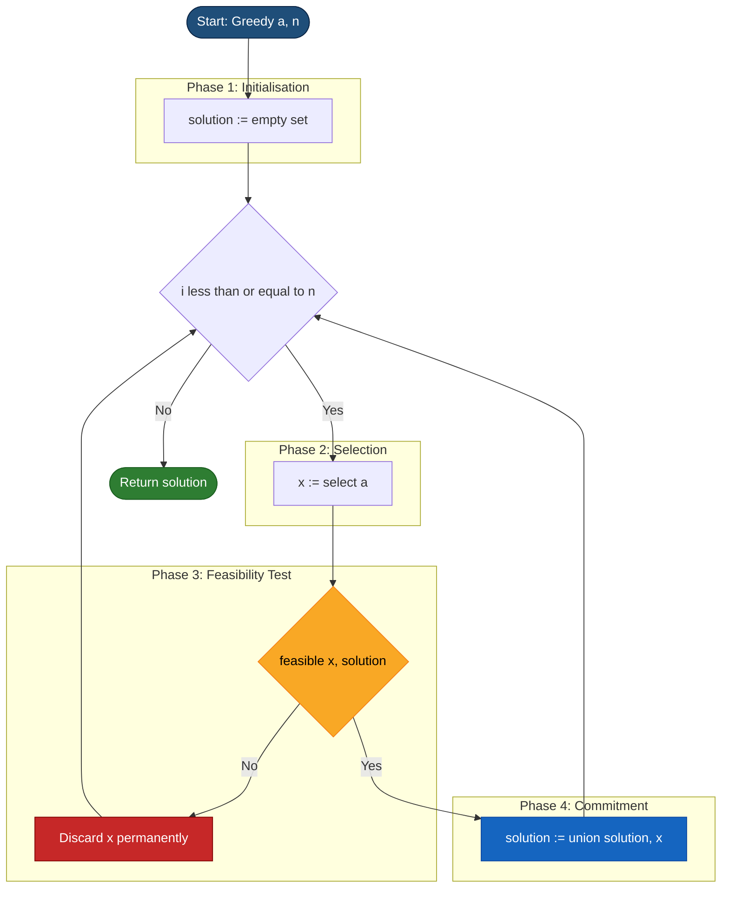
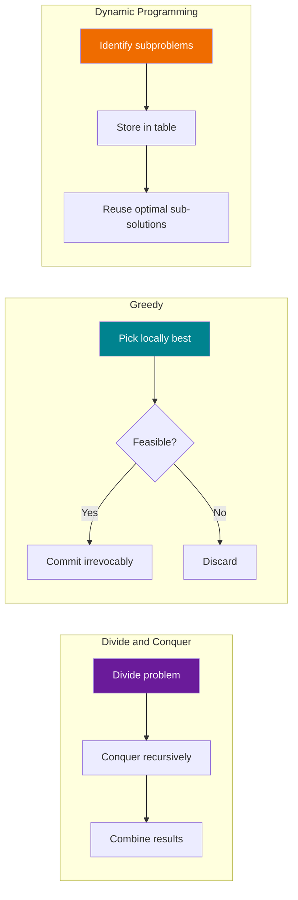
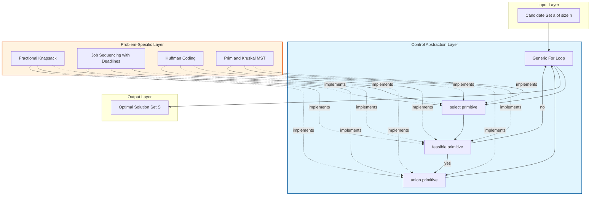

# Greedy Strategy - Control Abstraction

<!-- SECTION_1_START -->

# Greedy Strategy — Control Abstraction

> [!IMPORTANT]
> **KTU 2024 Scheme — Module Context**
> Module 3 is anchored on **Divide and Conquer**, but it also bridges into other foundational algorithmic paradigms. **Greedy Strategy** is introduced here as a contrasting design technique. The **Control Abstraction** is the formal, generalized template that unifies all greedy algorithms into a single procedural skeleton.

## 1.1 Formal Definition

A **Greedy Algorithm** is an algorithmic paradigm for solving optimization problems by building a solution **incrementally**, one piece at a time, always choosing the option that looks **best at the current moment** (the *locally optimal* choice) with the confident expectation that these local choices will lead to a **globally optimal** solution.

A **Control Abstraction** is a *parameterized, high-level procedure* that captures the *common skeleton* shared by every algorithm of a given family. For the greedy family, this abstraction hides the problem-specific details behind three well-defined primitives:

$$\text{select}(a),\quad \text{feasible}(x,\ \text{solution}),\quad \text{union}(\text{solution},\ x)$$

By *abstracting control* away from the specific data, the same procedural flow can solve dozens of seemingly unrelated problems — fractional knapsack, job sequencing, Huffman coding, Prim’s MST, Dijkstra’s shortest path, and Kruskal’s MST.

## 1.2 Intuitive Analogy

> **Real-World Analogy — The Change-Making Cashier**
>
> Imagine you owe a customer **₹ 67** in change, and your drawer has unlimited coins of **₹ 1, ₹ 5, ₹ 10, ₹ 20, ₹ 50**.
>
> A **greedy cashier** doesn’t plan ahead. At every step, she grabs the **largest coin that does not overshoot** the remaining amount:
> - ₹ 50 → remaining ₹ 17
> - ₹ 10 → remaining ₹ 7
> - ₹ 5 → remaining ₹ 2
> - ₹ 1 × 2 → remaining ₹ 0
>
> **Result:** 4 coins, optimal for the Indian system.
>
> She never revisits a decision. She never backtracks. She never computes all permutations. She makes a **myopic, irrevocable, locally best** choice. *This* is the heart of every greedy algorithm.

## 1.3 The Two Pillars of Correctness

A greedy algorithm is *guaranteed* to produce a globally optimal solution **only when** the problem satisfies both:

1. **Greedy-Choice Property** — A globally optimal solution can be reached by repeatedly making locally optimal (greedy) choices. *The past choices do not need to be reconsidered.*
2. **Optimal Substructure** — An optimal solution to the whole problem contains within it optimal solutions to its subproblems.

> [!NOTE]
> **Syllabus Highlight — KTU 2024 (OECST831)**
> The university frequently frames Part-A questions around the *definition* of the greedy control abstraction and the *difference* between the three primitive functions $\text{select}$, $\text{feasible}$, and $\text{union}$. Memorize the procedure line-by-line.

> [!VISUALIZATION CONTROL]
> **Concept:** Greedy choice trajectory on a 1-D cost axis
> **GeoGebra / Desmos Input Equations:**
> * `f(x) = -x + 10`  (representing the "remaining problem size" shrinking)
> * Point sequence: $(0, 10),\ (2, 8),\ (5, 5),\ (9, 1),\ (10, 0)$
> **Visual Description:** Plot a monotonically decreasing step function. Each plateau corresponds to a *greedy commitment*; the curve never rises — that monotonicity is the visual signature of the greedy control abstraction.

<!-- SECTION_1_END -->

<!-- SECTION_2_START -->

# Deep Theoretical Analysis & KTU High-Yield Formula Sheet

## 2.1 Anatomy of the Generic Greedy Procedure

The control abstraction is parameterised by the input array $a[1..n]$ and produces a *solution set* $S$. Its logic decomposes into four disciplined phases:

**Phase 1 — Initialization**
The solution set $S$ is initialised to the empty set $\emptyset$. The problem state carries full information but no commitments have been made.

**Phase 2 — Selection**
A candidate $x$ is extracted from the unprocessed input by invoking the problem-specific function $\text{select}(a)$. This is the **only place** where the algorithm exercises its “greed” — it picks whichever element looks most promising under the current heuristic.

**Phase 3 — Feasibility Test**
Before committing to $x$, the procedure calls $\text{feasible}(x,\ S)$. This boolean test ensures that adding $x$ will not violate any *constraint* of the problem (capacity, deadline, connectivity, budget, etc.). If infeasible, the candidate is **discarded permanently** — greedy algorithms never backtrack.

**Phase 4 — Commitment (Union)**
If feasible, $x$ is permanently merged into the solution set via $S \leftarrow S \cup \{x\}$.

**Termination**
The loop ends when no more candidates remain, and the accumulated $S$ is returned.

## 2.2 Canonical Pseudocode of the Control Abstraction

$$\begin{aligned}
&\texttt{Algorithm Greedy}(a,\ n) \\
&\texttt{// } a[1..n]\ \text{holds the }n\text{ candidate inputs} \\
&\texttt{// All three subroutines are problem-specific} \\
&1.\ \ solution \leftarrow \emptyset \\
&2.\ \ \texttt{for}\ i \leftarrow 1\ \texttt{to}\ n\ \texttt{do} \\
&3.\ \qquad x \leftarrow \text{select}(a) \\
&4.\ \qquad \texttt{if}\ \text{feasible}(x,\ solution)\ \texttt{then} \\
&5.\ \qquad\qquad solution \leftarrow \text{union}(solution,\ x) \\
&6.\ \ \texttt{return}\ solution
\end{aligned}$$

## 2.3 KTU Formula Sheet — Greedy Strategy

| **Concept** | **Formal Expression / Property** | **Engineering Significance** |
| :--- | :--- | :--- |
| Greedy-Choice Property | $\exists$ optimal $S^{*}\ :\ x_{\text{greedy}} \in S^{*}$ | Locally optimal $\Rightarrow$ globally usable in some optimal solution |
| Optimal Substructure | $\text{opt}(P) = x_{\text{greedy}} \cup \text{opt}(P \setminus \{x_{\text{greedy}}\})$ | Subproblems retain the same objective structure |
| Control Abstraction | $\text{Greedy}(a,n) \equiv \big\langle\ \text{init},\ \text{select},\ \text{feasible},\ \text{union}\ \big\rangle$ | Unified template across all greedy algorithms |
| Feasibility Test | $\text{feasible}(x, S) : \mathbb{X} \times 2^{\mathbb{X}} \rightarrow \{\text{true},\ \text{false}\}$ | Constraint enforcement; **no backtrack** |
| Complexity Class | Typically $O(n \log n)$ or $O(n^{2})$ | Faster than DP when greedy is provably correct |
| Failure Mode | Counter-example exists $\Rightarrow$ greedy returns sub-optimal $S$ | e.g. coin systems $\{1, 3, 4\}$ for amount 6 |

> [!IMPORTANT]
> **Why the Abstraction Matters in Engineering**
> In production systems, the greedy control abstraction is the conceptual backbone of:
> - **Network routing** (Dijkstra, Bellman-Ford variants)
> - **Data compression** (Huffman coding in JPEG, MP3, ZIP)
> - **Scheduling** in operating systems (SJF, EDF in real-time kernels)
> - **Load balancing** in cloud clusters (greedy bin-packing heuristics)
> - **Database query optimizers** (greedy join ordering)
>
> Once an engineer masters the abstraction, *porting* a greedy solution to a new problem reduces to writing only the three primitive functions.

<!-- SECTION_2_END -->

<!-- SECTION_3_START -->

# Step-by-Step Derivations & Code Implementation

## 3.1 Exhaustive Walkthrough — Generic Greedy Skeleton

The following Python implementation mirrors the textbook control abstraction **line-for-line**. Each primitive is a `staticmethod` so that students can subclass and inject problem-specific logic.

```python
from typing import List, TypeVar, Callable, Set, Generic
from abc import ABC, abstractmethod

T = TypeVar("T")          # generic candidate type
S = TypeVar("S")          # generic solution-set type


class GreedyFramework(ABC, Generic[T, S]):
    """
    Textbook control abstraction for the Greedy algorithmic paradigm.
    Subclasses MUST implement the three primitives: select, feasible, union.
    """

    def __init__(self, candidates: List[T]) -> None:
        if not isinstance(candidates, list):
            raise TypeError("candidates must be a list")
        if len(candidates) == 0:
            raise ValueError("candidate list cannot be empty")
        self._a: List[T] = list(candidates)          # defensive copy

    # --- the three PRIMITIVE functions of the abstraction -----------
    @abstractmethod
    def select(self, candidates: List[T]) -> T:
        """Pick the most promising remaining candidate."""
        ...

    @abstractmethod
    def feasible(self, x: T, solution: S) -> bool:
        """Return True iff adding x respects every problem constraint."""
        ...

    @abstractmethod
    def union(self, solution: S, x: T) -> S:
        """Return a new solution-set containing x."""
        ...

    # --- the GENERIC control loop (do not override) -----------------
    def solve(self) -> S:
        solution: S = self._empty_solution()        # Phase 1: init
        for _ in range(len(self._a)):               # Phase 2: iterate
            x = self.select(self._a)                # Phase 3: pick
            if self.feasible(x, solution):          # Phase 4: test
                solution = self.union(solution, x)  # Phase 5: commit
        return solution

    @abstractmethod
    def _empty_solution(self) -> S:
        ...
```

## 3.2 Worked Example — Fractional Knapsack via the Abstraction

To make the framework tangible, we **instantiate** it for the Fractional Knapsack Problem. We are given $n$ items, each with weight $w_i$ and value $v_i$, and a knapsack of capacity $W$. The objective is to maximise total value; items may be *partially* taken.

**Step 1 — Define the candidates.**
Each candidate is the tuple $(i,\ w_i,\ v_i)$ representing item $i$.

**Step 2 — Choose the greedy heuristic.**
Sort all candidates in **decreasing order of value-to-weight ratio** $\dfrac{v_i}{w_i}$. The function $\text{select}$ will then pop the head of this sorted list at every iteration.

**Step 3 — Define feasibility.**
A candidate $(i,\ w_i,\ v_i)$ is feasible if the *remaining* capacity $W_{\text{rem}} > 0$ and $w_i \le W_{\text{rem}}$; if $w_i > W_{\text{rem}}$, the candidate is taken *fractionally* up to $W_{\text{rem}}$.

**Step 4 — Define the union operation.**
Either append the full item to the solution, or append the fractional item $\{i,\ W_{\text{rem}},\ W_{\text{rem}} \cdot v_i / w_i\}$.

### Python Implementation

```python
from dataclasses import dataclass
from typing import List


@dataclass(frozen=True)
class Item:
    idx: int
    weight: float
    value: float

    @property
    def ratio(self) -> float:
        return self.value / self.weight


@dataclass(frozen=True)
class SolutionPiece:
    idx: int
    weight_taken: float
    value_gained: float


class FractionalKnapsack(GreedyFramework[Item, List[SolutionPiece]]):

    def __init__(self, items: List[Item], capacity: float) -> None:
        super().__init__(items)
        if capacity <= 0:
            raise ValueError("capacity must be strictly positive")
        # sort by ratio once, descending — this is where the greed lives
        self._a.sort(key=lambda it: it.ratio, reverse=True)
        self._W: float = float(capacity)

    # ---- primitives -----------------------------------------------
    def select(self, candidates: List[Item]) -> Item:
        return candidates[0]                              # head of sorted list

    def feasible(self, x: Item, solution: List[SolutionPiece]) -> bool:
        return self._W > 1e-9                             # any positive capacity

    def union(self, solution: List[SolutionPiece], x: Item) -> List[SolutionPiece]:
        if x.weight <= self._W + 1e-9:                    # take whole item
            self._W -= x.weight
            piece = SolutionPiece(x.idx, x.weight, x.value)
        else:                                             # take fraction
            frac = self._W / x.weight
            piece = SolutionPiece(x.idx, self._W, x.value * frac)
            self._W = 0.0
        return solution + [piece]

    def _empty_solution(self) -> List[SolutionPiece]:
        return []
```

### Numerical Trace

Let $n = 3$, $W = 50$, items $= \{(1,10,60),\ (2,20,100),\ (3,30,120)\}$.

Ratios: $\dfrac{60}{10} = 6.0$, $\dfrac{100}{20} = 5.0$, $\dfrac{120}{30} = 4.0$.

$$\begin{aligned}
&\text{Iteration 1:}\ x = (1, 10, 60),\ \text{feasible} \Rightarrow \text{union.}\\
&\qquad W_{\text{rem}} \leftarrow 50 - 10 = 40,\ S = [(1,10,60)] \\[4pt]
&\text{Iteration 2:}\ x = (2, 20, 100),\ \text{feasible} \Rightarrow \text{union.}\\
&\qquad W_{\text{rem}} \leftarrow 40 - 20 = 20,\ S = [(1,10,60), (2,20,100)] \\[4pt]
&\text{Iteration 3:}\ x = (3, 30, 120),\ \text{partially feasible}.\\
&\qquad \text{frac} = 20 / 30 = 2/3,\ \text{piece} = (3,\ 20,\ 120 \times 2/3) = (3,\ 20,\ 80).\\
&\qquad W_{\text{rem}} \leftarrow 0,\ S = [(1,10,60), (2,20,100), (3,20,80)] \\[4pt]
&\text{Termination:}\ S\ \text{returned.}\\
&\text{Total value} = 60 + 100 + 80 = \mathbf{240.}
\end{aligned}$$

## 3.3 Step-by-Step Reasoning Behind Each Iteration

The greedy choice is justified by the **Greedy-Choice Property**: if an optimal solution $S^{*}$ for knapsack $P$ exists that does *not* include the item with the maximum ratio $r_{i^{*}}$, then swapping the chosen item with $i^{*}$ strictly increases (or maintains) the value while decreasing the weight, contradicting the optimality of $S^{*}$. Hence some optimal solution *does* include the greedy pick — proving correctness by exchange argument.

<!-- SECTION_3_END -->

<!-- SECTION_4_START -->

# Structural Diagrams & Schematics

## 4.1 Mermaid Flowchart of the Greedy Control Abstraction



## 4.2 Topological Comparison of Algorithmic Paradigms



## 4.3 Functional Architecture of the Abstraction Layer



<!-- SECTION_4_END -->

<!-- SECTION_5_START -->

# KTU 2024 Scheme Examination Question Bank

## Part A — Short Answer (3 Marks Each)

### Q1. **[KTU University Exam — July 2024]** — *CO1, Remember*

Define a **greedy algorithm**. State the **two properties** that a problem must satisfy for a greedy solution to be correct.

**Model Answer (Valuation Key — 3 Marks):**
- *Definition (2 Marks):* A greedy algorithm is an algorithmic strategy that constructs a solution by iteratively selecting the **locally optimal** choice at each step, with no reconsideration of past decisions, hoping these local choices yield a **globally optimal** solution.
- *Properties (1 Mark):* **Greedy-Choice Property** and **Optimal Substructure**.

---

### Q2. **[KTU University Exam — Dec 2023]** — *CO1, Understand*

What is a **control abstraction**? List the **three primitive operations** of the greedy control abstraction and write one line on the role of each.

**Model Answer (Valuation Key — 3 Marks):**
- *Control Abstraction (1 Mark):* A parameterised, high-level procedure that captures the common skeleton of every algorithm belonging to a given family.
- *Primitives (2 Marks — ½ + ½ + 1):*
  1. $\text{select}(a)$ — chooses the most promising candidate from the input.
  2. $\text{feasible}(x, S)$ — boolean test; ensures the candidate does not violate constraints.
  3. $\text{union}(S, x)$ — permanently commits the candidate to the partial solution.

---

## Part B — Long Answer (14 Marks, Internal Choice)

### Question A — *CO2, Understand + Apply*

**(a)** [7 Marks] — **[KTU University Exam — July 2024]**
Explain the **general control abstraction** of the greedy strategy with a neat pseudocode. State clearly the role of each primitive function. **[Understand]**

**Model Solution:**

**Step 1 — Pseudocode (4 Marks):**

$$\begin{aligned}
&\texttt{Algorithm Greedy}(a,\ n) \\
&\quad solution \leftarrow \emptyset \\
&\quad \texttt{for}\ i \leftarrow 1\ \texttt{to}\ n \\
&\quad\quad x \leftarrow \text{select}(a) \\
&\quad\quad \texttt{if}\ \text{feasible}(x,\ solution) \\
&\quad\quad\quad solution \leftarrow \text{union}(solution,\ x) \\
&\quad \texttt{return}\ solution
\end{aligned}$$

*[Writing the complete pseudocode with proper indentation: 3 Marks. Stating the return statement: 1 Mark.]*

**Step 2 — Role of each primitive (3 Marks):**
- $\text{select}(a)$ [1 Mark] — performs the *greedy* decision; picks the candidate with the highest immediate merit.
- $\text{feasible}(x, S)$ [1 Mark] — enforces the *constraints*; if False, the candidate is **discarded permanently** (no backtracking).
- $\text{union}(S, x)$ [1 Mark] — appends $x$ to the partial solution, building the final solution incrementally.

---

**(b)** [7 Marks] — **[KTU University Exam — Dec 2023]**
For the **Fractional Knapsack** instance below, apply the greedy control abstraction step-by-step and compute the maximum value.

| Item | Weight $w_i$ | Value $v_i$ |
| :--- | :---: | :---: |
| 1 | 10 | 60 |
| 2 | 20 | 100 |
| 3 | 30 | 120 |
| 4 | 40 | 160 |

Knapsack capacity $W = 50$. **[Apply]**

**Model Solution:**

**Step 1 — Compute ratios (1 Mark):**

$$\tfrac{60}{10} = 6.0,\quad \tfrac{100}{20} = 5.0,\quad \tfrac{120}{30} = 4.0,\quad \tfrac{160}{40} = 4.0.$$

*[Ratio computation: 1 Mark.]*

**Step 2 — Sort candidates by ratio (descending) (1 Mark):**
Order: Item 1, Item 2, Item 3, Item 4.

**Step 3 — Greedy iterations (4 Marks — 1 per iteration):**

$$\begin{aligned}
&\text{Iter 1: } x = (1, 10, 60),\ \text{feasible (10} \le 50\text{). Union. } W \leftarrow 40,\ S=[(1,10,60)].\\
&\text{Iter 2: } x = (2, 20, 100),\ \text{feasible. Union. } W \leftarrow 20,\ S=[(1,10,60),(2,20,100)].\\
&\text{Iter 3: } x = (3, 30, 120),\ \text{not fully feasible. Take fraction } 20/30 = 2/3.\\
&\qquad \text{piece} = (3,\ 20,\ 80).\ W \leftarrow 0,\ S=[(1,10,60),(2,20,100),(3,20,80)].\\
&\text{Iter 4: } x = (4, 40, 160),\ \text{not feasible (W=0). Discard.}\\
\end{aligned}$$

**Step 4 — Final value (1 Mark):**

$$\text{Total Value} = 60 + 100 + 80 = \mathbf{240.}$$

---

### Question B — *CO2, Understand + Apply* (Alternative Choice)

**(a)** [7 Marks] — **[KTU University Exam — July 2023]**
Distinguish between **Divide-and-Conquer**, **Greedy**, and **Dynamic Programming** strategies. Mention at least **two points of difference** with respect to: (i) subproblem overlap, (ii) number of subproblems solved, (iii) optimality guarantee. **[Understand]**

**Model Solution:**

*[Tabulated comparison for 7 Marks — distribute as 2 + 2 + 2 + 1.]*

| Criterion | Divide and Conquer | Greedy | Dynamic Programming |
| :--- | :--- | :--- | :--- |
| **Subproblem overlap** | Disjoint subproblems | Not applicable — single pass | Overlapping subproblems reused |
| **Number of subproblems solved** | All subproblems solved recursively | Only one path of greedy picks | All subproblems solved exactly once |
| **Optimality guarantee** | Guaranteed if recursion is correct | Guaranteed **only if** greedy-choice property holds | Guaranteed when both properties hold |
| **Backtracking** | No — combines results after recursion | No — irrevocable local choice | No — but reuses memoised results |
| **Typical complexity** | $O(n \log n)$ | $O(n \log n)$ to $O(n^{2})$ | Often $O(n^{2})$ to $O(n^{3})$ |

---

**(b)** [7 Marks] — **[KTU University Exam — Dec 2022]**
Consider a **coin system** $\{1, 5, 10, 25\}$ and amount $A = 63$. Trace the greedy change-making control abstraction step-by-step and verify whether the result is optimal. **[Apply]**

**Model Solution:**

**Step 1 — Greedy ordering (1 Mark):** Descending — 25, 10, 5, 1.

**Step 2 — Iterations (5 Marks — distributed 1 + 1 + 1 + 1 + 1):**

$$\begin{aligned}
&\text{Iter 1: } x = 25,\ \text{feasible. } A \leftarrow 38,\ \text{count} = 1.\\
&\text{Iter 2: } x = 25,\ \text{feasible. } A \leftarrow 13,\ \text{count} = 2.\\
&\text{Iter 3: } x = 10,\ \text{feasible. } A \leftarrow 3,\ \text{count} = 3.\\
&\text{Iter 4: } x = 5,\ \text{not feasible (5 > 3). Discard.}\\
&\text{Iter 5: } x = 1,\ \text{feasible. } A \leftarrow 2,\ \text{count} = 4.\\
&\text{Iter 6: } x = 1,\ \text{feasible. } A \leftarrow 1,\ \text{count} = 5.\\
&\text{Iter 7: } x = 1,\ \text{feasible. } A \leftarrow 0,\ \text{count} = 6.\\
\end{aligned}$$

**Step 3 — Final answer (1 Mark):**
Greedy uses **6 coins** — $2 \times 25 + 1 \times 10 + 3 \times 1$. For the canonical US system, this is provably optimal (no better combination exists), so the greedy strategy is correct here.

---

> [!WARNING]
> **KTU Examiner's Valuation Warning — Pitfall Callout**
> 1. **Do not skip writing the loop bound** (`for i = 1 to n`); many students omit it and lose 1 mark.
> 2. **Distinguish carefully** between $\text{select}$, $\text{feasible}$, and $\text{union}$ — the examiner awards partial credit only when *all three* are explicitly named.
> 3. **Fractional vs 0/1 Knapsack:** writing greedy code for 0/1 knapsack will fetch **zero marks** for correctness — always clarify which variant is being solved.
> 4. **Sorting step must be shown** in knapsack/coin problems; simply writing the final answer is penalised.
> 5. **Currency counter-examples:** if the examiner picks a non-canonical system (e.g. $\{1, 3, 4\}$ for amount 6), the greedy fails — state this explicitly to earn full credit.

---

## Topic Recap & Important Things to Remember

- **Greedy Strategy** builds a solution piece-by-piece, choosing the **locally optimal** candidate at every step with no backtracking.
- **Control Abstraction** is the *generic* procedure $\text{Greedy}(a, n)$ parameterised by three primitives: $\text{select}$, $\text{feasible}$, $\text{union}$.
- A greedy algorithm is *correct* only when the problem exhibits the **Greedy-Choice Property** *and* **Optimal Substructure**.
- The **three primitives** of the abstraction:
  - $\text{select}(a)$ — chooses the most promising candidate.
  - $\text{feasible}(x, S)$ — boolean constraint check; failure means **permanent discard**.
  - $\text{union}(S, x)$ — irrevocable commitment to the partial solution.
- **Canonical applications:** Fractional Knapsack, Job Sequencing with Deadlines, Huffman Coding, Activity Selection, Prim’s MST, Kruskal’s MST, Dijkstra’s Shortest Path.
- **Difference from Divide-and-Conquer:** D&C solves all subproblems recursively and combines; greedy solves *only one* path of choices.
- **Difference from Dynamic Programming:** DP solves all overlapping subproblems and memoises; greedy never backtracks and never memoises.
- **Time complexity** of the abstraction is $O(n \cdot T)$ where $T$ is the cost of one $\text{select}$ + $\text{feasible}$ + $\text{union}$ cycle.
- **Failure cases** exist — e.g. coin system $\{1, 3, 4\}$ for amount 6 yields greedy $\{4, 1, 1\} = 3$ coins, but optimum is $\{3, 3\} = 2$ coins.
- For KTU answers, always present the **pseudocode skeleton**, the **three primitives with one-line roles**, and a **trace table** when applying to a specific instance.

<!-- SECTION_5_END -->
