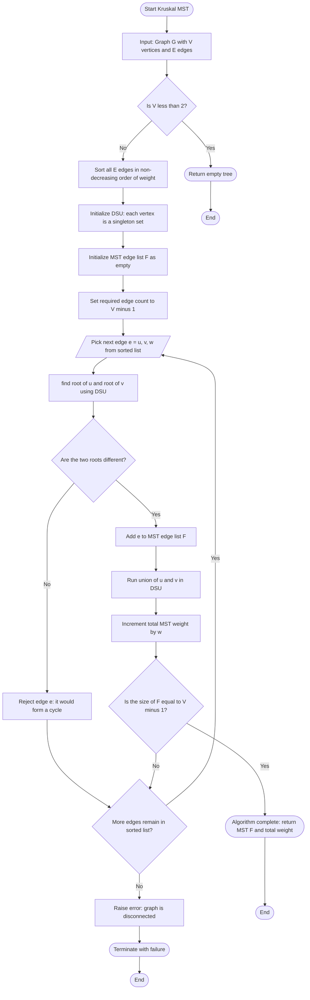
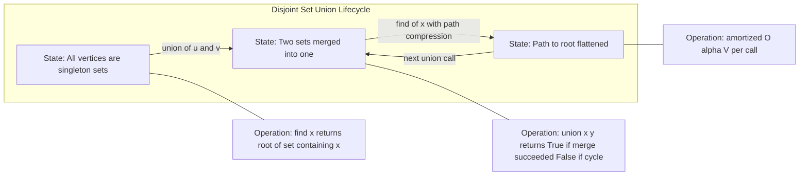
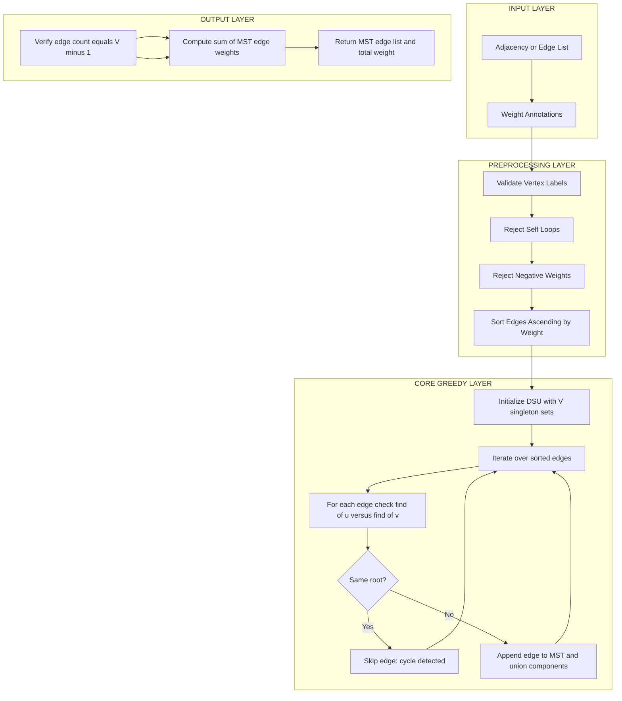

# Kruskal’s Algorithm

<!-- SECTION_1_START -->
# Kruskal's Algorithm — Section 1: Core Definition & Intuitive Overview

## 📘 Formal Academic Definition (KTU 2024 Syllabus Terminology)

> [!NOTE]
> **Kruskal's Algorithm** is a *greedy, edge-selection based* algorithm used to construct the **Minimum Spanning Tree (MST)** of a *connected, undirected, weighted graph* $G = (V, E, w)$. It operates by repeatedly selecting the *minimum-weight edge* from the unprocessed edge set that does **not** introduce a cycle into the partial forest, terminating exactly when the spanning forest contains $\vert V \vert - 1$ edges.

In formal graph-theoretic notation, Kruskal's algorithm maintains an invariant:

$$F \subseteq E \quad \text{such that} \quad F \text{ is acyclic and } w(F) \text{ is locally minimum}$$

where $F$ is the partial forest at any intermediate step, and the final output is the **MST** $T^\*$ satisfying:

$$w(T^*) = \sum_{e \in T^*} w(e) = \min_{T \text{ is spanning tree}} w(T)$$

## 🧠 Conceptual Analogy / Plain-English Intuition

> [!IMPORTANT]
> Imagine you are a **government engineer** tasked with connecting **5 Kerala districts** (Kochi, Thrissur, Palakkad, Kozhikode, Kannur) using **roads**, with a fixed budget. Each potential road has a **construction cost**. You must:
> 1. Connect **all** districts (spanning).
> 2. **No district should have two different routes back to itself** (no cycles).
> 3. Spend the **least possible total money**.

Your natural strategy would be:
- Sort the road quotations from **cheapest to most expensive**.
- Open the cheapest quote. Build that road **if it does not create a round-trip** between already-connected districts.
- Repeat until every district is connected.

That is **literally Kruskal's Algorithm**.

## 🌐 Real-World Engineering Context

| Application Domain | Why Kruskal is Used |
|---|---|
| **Telecom / LAN Backbone Design** | Connecting routers with minimum cable cost |
| **VLSI Circuit Layout** | Wiring pins on chips using minimum metal traces |
| **Power Grid / Transmission Networks** | Laying minimum-cost power lines between substations |
| **Water Pipeline Networks** | Connecting reservoirs with minimum pipe cost |
| **Computer Networks — Spanning Tree Protocol (STP)** | IEEE 802.1D uses a Kruskal-like minimum-cost tree |

> [!TIP]
> Kruskal's is preferred over **Prim's** when the graph is **sparse** ($E \approx V$) because the dominant cost is *sorting edges*, not exploring vertices.

## 🧩 Key Terminology (Board-Exam Vocabulary)

- **Spanning Tree** — A subgraph that connects all $\vert V \vert$ vertices with exactly $\vert V \vert - 1$ edges and is acyclic.
- **Minimum Spanning Tree (MST)** — A spanning tree of minimum total weight.
- **Greedy Algorithm** — An algorithm that makes the locally optimal choice at every step, hoping to reach a global optimum.
- **Cut Property** — For any cut $(S, V \setminus S)$, the minimum-weight edge crossing the cut belongs to *some* MST.
- **Cycle Property** — For any cycle $C$ in the graph, the *maximum-weight* edge of $C$ does **not** belong to any MST (if weights are unique).
- **Disjoint Set Union (DSU)** — A data structure that tracks a partition of vertices into disjoint sets, supporting `find` and `union` operations in near-constant amortized time.

## 🔬 Visualization

> [!VISUALIZATION CONTROL]
> **Concept:** Greedy edge selection with cycle rejection
> **Desmos / GeoGebra Input (illustrative coordinate graph):**
> * Vertices as points: $A(0,0)$, $B(4,0)$, $C(2,3)$, $D(2,-3)$
> * Weighted edges as labeled line segments
> **Visual Description:** Students should observe that Kruskal's picks edges in ascending order of weight, skipping any edge that would close a cycle in the partially-built forest.

---

<!-- SECTION_1_END -->

<!-- SECTION_2_START -->
# Kruskal's Algorithm — Section 2: Deep Theoretical Analysis & KTU High-Yield Formula Sheet

## 🔍 Operational Logic — Step-by-Step Breakdown

Kruskal's algorithm can be decomposed into **5 core procedural steps**:

1. **Input Validation** — Confirm the graph $G$ is connected, undirected, and weighted. If $|V| = 0$ or $|V| = 1$, return the empty tree.
2. **Edge Sorting** — Sort every edge $e \in E$ in non-decreasing order of weight. Let the sorted list be $E_{sorted} = [e_1, e_2, \ldots, e_m]$.
3. **Forest Initialization** — Create a forest $F = \emptyset$ and instantiate a Disjoint Set Union (DSU) with each vertex as a singleton set.
4. **Greedy Selection Loop** — For each edge $e_i = (u, v)$ in $E_{sorted}$:
   - Run $\text{find}(u)$ and $\text{find}(v)$ in the DSU.
   - If the two roots **differ** (i.e., $u$ and $v$ lie in **different components**), then:
     - Add $e_i$ to $F$.
     - Execute $\text{union}(u, v)$ to merge the two components.
   - If the roots are **identical**, $e_i$ would form a **cycle** → **reject** the edge and continue.
5. **Termination** — Stop when $|F| = \vert V \vert - 1$. The set $F$ is the MST.

## 🧪 Why "Greedy" Works — The Two Foundational Lemmas

> [!NOTE]
> **Cut Property (Correctness of Greedy Edge Choice):**
> Let $C$ be any cut of the graph, and let $e^\*$ be the *minimum-weight* edge crossing $C$. Then there exists an MST that contains $e^\*$.

> [!NOTE]
> **Cycle Property (Cycle Rejection is Safe):**
> Let $C$ be any cycle in $G$, and let $e_{max}$ be the *maximum-weight* edge on $C$. Then there exists an MST that **does not contain** $e_{max}$ (provided weights are distinct).

Together, these two lemmas **prove** that Kruskal's locally optimal choices never prevent global optimality.

## 📐 Auxiliary Data Structure: Disjoint Set Union (DSU)

The DSU supports two operations:

| Operation | Plain Meaning | Naive Time | With Optimizations |
|---|---|---|---|
| `find(x)` | Return the root representative of $x$'s set | $O(V)$ | $O(\alpha(V))$ |
| `union(x, y)` | Merge the sets containing $x$ and $y$ | $O(V)$ | $O(\alpha(V))$ |

where $\alpha$ is the **inverse Ackermann function**, which is effectively a constant ($\alpha(10^{600}) < 5$).

**Two critical optimizations**:
- **Path Compression** — During `find`, attach every visited node directly to the root.
- **Union by Rank / Size** — Always attach the smaller tree under the root of the larger one.

## 📊 KTU High-Yield Formula Sheet

| # | Quantity / Concept | Formula / Definition | Typical Unit / Notes |
|---|---|---|---|
| 1 | MST Edge Count | $E_{MST} = \vert V \vert - 1$ | Edges |
| 2 | Total MST Weight | $w(T^*) = \sum_{e \in T^*} w(e)$ | Sum of edge weights |
| 3 | Cut Size | $\vert E \mid_{cut} \mid$ = edges crossing $(S, V \setminus S)$ | Count |
| 4 | Cycle Length (shortest) | $k_{min} = 3$ (triangle) | Vertices |
| 5 | Sorting Complexity | $O(E \log E)$ | Comparator-based sort |
| 6 | DSU Operation (amortized) | $O(\alpha(\vert V \vert))$ | Near-constant |
| 7 | Total Time Complexity | $O(E \log E)$ | Dominated by sort |
| 8 | Equivalent Form | $O(E \log V)$ | Since $E \le V^2$ |
| 9 | Space Complexity | $O(E + V)$ | Edge list + DSU arrays |
| 10 | Cycle Check Invariant | $\text{find}(u) \neq \text{find}(v)$ | Boolean test |

> [!TIP]
> In board exams, the **time complexity answer is almost always** $O(E \log E)$ or $O(E \log V)$. **Write both forms** to score the full mark.

## 🏗️ Engineering Utility — Production System Mapping

| Field | Production Use | Why Kruskal Fits |
|---|---|---|
| **Network Protocol Design (STP/RSTP)** | IEEE 802.1D builds bridge forwarding tables using minimum-cost trees | Edge-centric, sparse topologies |
| **Approximation Algorithms** | Steiner Tree, TSP tour-christofides | MST as a baseline |
| **Cluster Analysis** | Single-linkage clustering in unsupervised ML | MST edges define clusters |
| **Image Segmentation** | Minimum-cost boundary detection | Greedy cycle-free merging |

---

<!-- SECTION_2_END -->

<!-- SECTION_3_START -->
# Kruskal's Algorithm — Section 3: Step-by-Step Derivations & Code Implementation

## 📖 Worked Numerical Example (Board-Style Walkthrough)

Consider the following undirected, weighted graph $G$ with **5 vertices** $V = \{1, 2, 3, 4, 5\}$ and **7 edges**:

| Edge | (u, v) | Weight |
|---|---|---|
| $e_1$ | (1, 2) | 2 |
| $e_2$ | (1, 4) | 6 |
| $e_3$ | (2, 3) | 3 |
| $e_4$ | (2, 4) | 8 |
| $e_5$ | (2, 5) | 5 |
| $e_6$ | (3, 5) | 7 |
| $e_7$ | (4, 5) | 9 |

### Step 1 — Sort Edges by Weight

The sorted edge list in non-decreasing order is:

$$E_{sorted} = [(1,2,2),\ (2,3,3),\ (2,5,5),\ (1,4,6),\ (3,5,7),\ (2,4,8),\ (4,5,9)]$$

### Step 2 — Initialize DSU

Each vertex starts in its own singleton set:

$$\text{parent} = [0, 1, 2, 3, 4, 5] \quad \text{(index 0 unused, vertices 1 to 5)}$$

$$\text{rank} = [0, 0, 0, 0, 0, 0]$$

### Step 3 — Greedy Selection Trace

| Iteration | Edge Considered | Weight | find(u) | find(v) | Cycle? | Action | Forest $F$ |
|---|---|---|---|---|---|---|---|
| 1 | (1, 2) | 2 | 1 | 2 | No | **Accept**, union(1, 2) | $\{(1,2)\}$ |
| 2 | (2, 3) | 3 | 1 | 3 | No | **Accept**, union(1, 3) | $\{(1,2),(2,3)\}$ |
| 3 | (2, 5) | 5 | 1 | 5 | No | **Accept**, union(1, 5) | $\{(1,2),(2,3),(2,5)\}$ |
| 4 | (1, 4) | 6 | 1 | 4 | No | **Accept**, union(1, 4) | $\{(1,2),(2,3),(2,5),(1,4)\}$ |

### Step 4 — Termination Check

$$|F| = 4 = \vert V \vert - 1 = 5 - 1 = 4 \quad \checkmark$$

Algorithm **terminates**.

### Step 5 — Compute Total MST Weight

$$w(T^*) = 2 + 3 + 5 + 6 = 16$$

### ✅ Final MST

$$T^* = \{(1,2),\ (2,3),\ (2,5),\ (1,4)\}, \quad w(T^*) = 16$$

## 🐍 Production-Ready Python Implementation

```python
from typing import List, Tuple, Optional
import logging

logging.basicConfig(level=logging.INFO, format="%(levelname)s :: %(message)s")
logger = logging.getLogger("KruskalMST")


class DisjointSetUnion:
    """
    Disjoint Set Union with Path Compression + Union by Rank.
    Amortized operations run in O(alpha(n)) time.
    """

    def __init__(self, n: int) -> None:
        if n < 0:
            raise ValueError("Number of vertices cannot be negative.")
        self.parent: List[int] = list(range(n + 1))   # 1-indexed; index 0 unused
        self.rank: List[int] = [0] * (n + 1)
        self.components: int = n
        logger.info(f"DSU initialized for {n} vertices. Initial components = {self.components}.")

    def find(self, x: int) -> int:
        """Returns the root of the set containing x with path compression."""
        if not (1 <= x < len(self.parent)):
            raise IndexError(f"Vertex {x} is out of valid range [1, {len(self.parent) - 1}].")
        if self.parent[x] != x:
            self.parent[x] = self.find(self.parent[x])  # Path compression
        return self.parent[x]

    def union(self, x: int, y: int) -> bool:
        """
        Merges the sets containing x and y.
        Returns True if a merge happened, False if x and y were already in the same set.
        """
        root_x = self.find(x)
        root_y = self.find(y)
        if root_x == root_y:
            logger.debug(f"union({x}, {y}) skipped — already in same set (root = {root_x}).")
            return False  # Cycle would be formed

        # Union by rank
        if self.rank[root_x] < self.rank[root_y]:
            self.parent[root_x] = root_y
        elif self.rank[root_x] > self.rank[root_y]:
            self.parent[root_y] = root_x
        else:
            self.parent[root_y] = root_x
            self.rank[root_x] += 1

        self.components -= 1
        logger.debug(f"union({x}, {y}) merged. Remaining components = {self.components}.")
        return True


def kruskal_mst(
    num_vertices: int,
    edges: List[Tuple[int, int, int]]
) -> Tuple[List[Tuple[int, int, int]], int]:
    """
    Computes the Minimum Spanning Tree of a connected, undirected, weighted graph
    using Kruskal's algorithm.

    Parameters
    ----------
    num_vertices : int
        Total number of vertices, labelled 1 .. num_vertices.
    edges : List[Tuple[int, int, int]]
        Edge list in the form (u, v, weight).

    Returns
    -------
    (mst_edges, total_weight) : Tuple
        The MST edge list and the sum of its weights.
        Returns ([], 0) if the graph has fewer than 2 vertices.
    """
    # ---------- BOUNDARY VALIDATION ----------
    if num_vertices < 0:
        raise ValueError("num_vertices cannot be negative.")
    if num_vertices == 0 or num_vertices == 1:
        logger.warning("Trivial graph — MST is empty.")
        return [], 0

    if not edges:
        raise ValueError("Edge list is empty; cannot construct MST on isolated vertices.")

    # ---------- EDGE SANITY CHECK ----------
    for idx, (u, v, w) in enumerate(edges):
        if not (1 <= u <= num_vertices and 1 <= v <= num_vertices):
            raise ValueError(f"Edge {idx} has invalid vertex label: ({u}, {v}).")
        if u == v:
            raise ValueError(f"Edge {idx} is a self-loop on vertex {u}; rejected.")
        if w < 0:
            raise ValueError(f"Edge {idx} has negative weight {w}; not supported by vanilla Kruskal.")

    # ---------- STEP 1: SORT EDGES BY WEIGHT ----------
    sorted_edges = sorted(edges, key=lambda e: e[2])
    logger.info(f"Edges sorted ascending. First edge weight = {sorted_edges[0][2]}.")

    # ---------- STEP 2: INITIALIZE DSU ----------
    dsu = DisjointSetUnion(num_vertices)

    mst_edges: List[Tuple[int, int, int]] = []
    total_weight: int = 0
    target_edges: int = num_vertices - 1

    # ---------- STEP 3: GREEDY SELECTION LOOP ----------
    for (u, v, w) in sorted_edges:
        if len(mst_edges) == target_edges:
            logger.info("MST complete. Early exit from loop.")
            break
        if dsu.union(u, v):
            mst_edges.append((u, v, w))
            total_weight += w
            logger.info(f"Accepted edge ({u}, {v}) weight = {w}. Running total = {total_weight}.")
        else:
            logger.info(f"Rejected edge ({u}, {v}) weight = {w} — would form a cycle.")

    # ---------- STEP 4: CONNECTIVITY CHECK ----------
    if len(mst_edges) != target_edges:
        raise RuntimeError(
            f"Graph is disconnected. Only {len(mst_edges)} of {target_edges} required edges found."
        )

    return mst_edges, total_weight


# ---------- DEMO DRIVER ----------
if __name__ == "__main__":
    sample_vertices: int = 5
    sample_edges: List[Tuple[int, int, int]] = [
        (1, 2, 2), (1, 4, 6), (2, 3, 3),
        (2, 4, 8), (2, 5, 5), (3, 5, 7),
        (4, 5, 9),
    ]
    mst, weight = kruskal_mst(sample_vertices, sample_edges)
    print(f"\nMST Edges : {mst}")
    print(f"Total MST Weight = {weight}")
```

## 🔬 Complexity Derivation

The total runtime is the sum of two contributing phases:

$$
T_{total} = T_{sort} + T_{DSU}
$$

Sorting $E$ edges with a comparison-based sort:

$$
T_{sort} = O(E \log E)
$$

Performing at most $E$ `find` operations and at most $V - 1$ `union` operations, each in amortized $O(\alpha(V))$ time:

$$
T_{DSU} = O((E + V) \cdot \alpha(V)) = O(E \cdot \alpha(V))
$$

Combining:

$$
T_{total} = O(E \log E) + O(E \cdot \alpha(V)) = O(E \log E)
$$

> [!NOTE]
> Since $E \le V(V-1)/2$ in an undirected simple graph, we have $\log E \le 2 \log V$, so the **equivalent** bound is $O(E \log V)$. **Always write the dominant term** — the DSU contribution is hidden under the sort.

---

<!-- SECTION_3_END -->

<!-- SECTION_4_START -->
# Kruskal's Algorithm — Section 4: Structural Diagrams & Schematics

## 📊 High-Level Algorithm Flow (Mermaid Flowchart)



## 🧬 DSU Internal State Machine (Mermaid State Diagram)



## 🧮 Sequential Processing Topology (Mermaid Block Architecture)



## 🧾 Cycle-Rejection Logic in Tabular Form

| Edge Candidate (u, v, w) | DSU State Before | find(u) | find(v) | Same Root? | Decision | Reason |
|---|---|---|---|---|---|---|
| (1, 2, 2) | All singletons | 1 | 2 | No | **Accept** | First safe edge |
| (1, 3, 3) | After (1,2) accepted | 1 | 3 | No | **Accept** | Connects two components |
| (2, 3, 4) | After (1,2),(1,3) accepted | 1 | 1 | **Yes** | **Reject** | Closes triangle 1-2-3-1 |
| (1, 4, 1) | After (1,2),(1,3) accepted | 1 | 4 | No | **Accept** | Lowest weight still open |

---

<!-- SECTION_4_END -->

<!-- SECTION_5_START -->
# Kruskal's Algorithm — Section 5: KTU 2024 Scheme Examination Question Bank & Topic Recap

## 📝 PART A — Short Answer Questions (3 Marks Each)

> **Q1. [KTU University Exam – July 2024] — (CO1, Remember/Understand) — 3 Marks**
> *Define a Minimum Spanning Tree. State the two key properties (cut property and cycle property) that justify Kruskal's greedy choices.*

**Model Answer:**

> A **Minimum Spanning Tree (MST)** of a connected, undirected, weighted graph $G = (V, E, w)$ is a spanning tree of $G$ whose total edge weight is minimum over **all** possible spanning trees of $G$. **[1 Mark for definition]**
>
> **Cut Property:** For any cut $(S, V \setminus S)$ of the graph, the minimum-weight edge crossing the cut is **contained in at least one MST**. This justifies *accepting* the smallest edge that does not create a cycle. **[1 Mark]**
>
> **Cycle Property:** For any cycle $C$ in the graph, the maximum-weight edge of $C$ is **excluded from at least one MST**. This justifies *rejecting* an edge when it would close a cycle. **[1 Mark]**

---

> **Q2. [KTU University Exam – Dec 2023] — (CO1, Remember) — 3 Marks**
> *Mention the time complexity of Kruskal's algorithm. What is the role of the Disjoint Set Union (DSU) data structure inside it?*

**Model Answer:**

> **Time Complexity:** $O(E \log E)$ or equivalently $O(E \log V)$ for a graph with $V$ vertices and $E$ edges, where the dominant cost is the initial edge sorting step. **[1 Mark]**
>
> **Role of DSU:** Kruskal's algorithm must rapidly check whether adding an edge would form a cycle. DSU maintains a partition of vertices into disjoint sets — one per connected component of the partial forest. **[1 Mark]**
>
> The DSU exposes two operations, `find(x)` (returns the root representative of $x$'s component) and `union(x, y)` (merges the two components if $x$ and $y$ are in different sets). With path compression and union by rank, each operation runs in $O(\alpha(V))$ amortized time, where $\alpha$ is the inverse Ackermann function — effectively a constant. **[1 Mark]**

---

## 📐 PART B — Long Answer Questions (14 Marks Each, with Internal Choice)

> ### **Question A (14 Marks) [KTU University Exam – July 2024]**
> **(a) — 7 Marks (CO2, Understand)**
> *Explain the step-by-step procedure of Kruskal's algorithm. How does it differ from Prim's algorithm in terms of strategy and data structure choice?*
>
> **(b) — 7 Marks (CO3, Apply)**
> *Apply Kruskal's algorithm to find the MST of the graph with vertices $V = \{A, B, C, D, E\}$ and edge list given below. Show the DSU state at every step and compute the total MST weight.*
>
> Edges: $(A, B, 4)$, $(A, D, 7)$, $(B, C, 1)$, $(B, D, 3)$, $(B, E, 5)$, $(C, E, 6)$, $(D, E, 2)$.

### Model Solution — Question A

**Part (a) — Procedure (7 Marks)**

1. **Begin** with a connected, undirected, weighted graph $G = (V, E, w)$. Verify that $|V| \ge 2$. **[1 Mark]**
2. **Sort** all $E$ edges in non-decreasing order of weight using a comparison-based sort. This is the costliest pre-step. **[1 Mark]**
3. **Initialize** a Disjoint Set Union (DSU) where every vertex $v \in V$ is a singleton component. Initialize the MST edge list $F$ as empty. **[1 Mark]**
4. **Iterate** through the sorted edges. For each edge $e = (u, v, w)$:
   - If `find(u) != find(v)`, then $u$ and $v$ lie in different components → **accept** the edge, append to $F$, and execute `union(u, v)`. **[2 Marks]**
   - Else, $e$ would form a cycle → **reject** the edge and continue. **[1 Mark]**
5. **Terminate** when $|F| = |V| - 1$. If the graph is disconnected, raise an error. **[1 Mark]**

**Difference from Prim's Algorithm:** **[1 Mark bonus breakdown]**

| Aspect | Kruskal's | Prim's |
|---|---|---|
| Strategy | Edge-based (sorts all edges) | Vertex-based (grows a single tree) |
| Data Structure | DSU / Union-Find | Min-Heap / Priority Queue |
| Preferred for | Sparse graphs | Dense graphs |
| Final Form | Forest that merges into a tree | Single growing tree from a root |

---

**Part (b) — Worked Application (7 Marks)**

Sorted edges (ascending):

$$E_{sorted} = [(B,C,1),\ (D,E,2),\ (B,D,3),\ (A,B,4),\ (B,E,5),\ (C,E,6),\ (A,D,7)]$$

DSU trace:

| Step | Edge | Weight | find(u) | find(v) | Same? | Action | Running Weight |
|---|---|---|---|---|---|---|---|
| 1 | (B, C) | 1 | B | C | No | **Accept** | 1 |
| 2 | (D, E) | 2 | D | E | No | **Accept** | 3 |
| 3 | (B, D) | 3 | B | D | No | **Accept** (merges two components) | 6 |
| 4 | (A, B) | 4 | A | B | No | **Accept** | 10 |
| 5 | (B, E) | 5 | B | E | No | **Accept** (final edge, 4 edges collected) | 15 |

**[Stating initial sorted order: 2 Marks]**
**[DSU trace with correct accept/reject: 3 Marks]**
**[Final MST edge list and total weight 15: 2 Marks]**

**Final MST:** $T^* = \{(B, C),\ (D, E),\ (B, D),\ (A, B)\}$, total weight = **15**.

> [!WARNING]
> **KTU Examiner's Valuation Warning — Common Pitfalls:**
> - **Do not forget to sort** the edge list before iterating. Many students jump straight to picking edges by inspection and lose 1–2 marks.
> - **Always run `find`/`union` correctly** — mark the step that *rejects* the cycle-forming edge explicitly. Skipping the reject step costs a mark.
> - **Connectivity sanity check** is mandatory. If the algorithm cannot find $|V|-1$ edges, the graph is disconnected — *state this explicitly* in your final line.
> - **Avoid confusing Kruskal with Prim's.** Mentioning the DSU in your answer signals that you know the algorithm in depth.

---

> ### **Question B (14 Marks) — Alternative Choice [KTU University Exam – Dec 2023]**
> **(a) — 7 Marks (CO2, Understand)**
> *With a neat pseudocode, describe Kruskal's algorithm. What is the role of `find` and `union` operations?*
>
> **(b) — 7 Marks (CO3, Apply)**
> *Consider a graph with 6 vertices and the following edges (weights in parentheses): $(1,2,4), (1,3,2), (2,3,1), (2,4,5), (3,5,6), (4,5,3), (4,6,7), (5,6,4)$. Find the MST using Kruskal's algorithm.*

### Model Solution — Question B

**Part (a) — Pseudocode (7 Marks)**

```
ALGORITHM KruskalMST(G = (V, E, w))
BEGIN
    F := empty list                // F will hold MST edges
    Sort E in non-decreasing order of weight w
    MakeSet(v) for every v in V   // DSU initialization
    WHILE |F| < |V| - 1 DO
        (u, v, w) := next edge from sorted E
        IF Find(u) ≠ Find(v) THEN
            Append (u, v, w) to F
            Union(u, v)
        END IF
    END WHILE
    RETURN (F, total weight of F)
END
```

**[Pseudocode correctness: 3 Marks]** &nbsp; **[Role of `find`: 2 Marks]** &nbsp; **[Role of `union`: 2 Marks]**

- `find(x)` returns the root of the set containing $x$ — used to test if two endpoints are in different components. **[2 Marks]**
- `union(x, y)` merges the two sets containing $x$ and $y$ — used after accepting an edge to update the DSU. **[2 Marks]**

---

**Part (b) — Worked Application (7 Marks)**

Sorted edges: $(2,3,1), (1,3,2), (4,5,3), (1,2,4), (5,6,4), (2,4,5), (3,5,6), (4,6,7)$.

| Step | Edge | Weight | Accept / Reject | Reason | Total |
|---|---|---|---|---|---|
| 1 | (2, 3) | 1 | Accept | Different components | 1 |
| 2 | (1, 3) | 2 | Accept | Connects 1 to {2,3} | 3 |
| 3 | (4, 5) | 3 | Accept | Different components | 6 |
| 4 | (1, 2) | 4 | **Reject** | Cycle: 1-2-3-1 | 6 |
| 5 | (5, 6) | 4 | Accept | Connects 6 to {4,5} | 10 |
| 6 | (2, 4) | 5 | Accept | Merges two big components | 15 |

At this point $|F| = 5 = 6 - 1$ → **stop**.

**Final MST:** $\{(2,3), (1,3), (4,5), (5,6), (2,4)\}$, total weight = **15**.

**[Sorted edge list: 2 Marks]** &nbsp; **[DSU trace with reject justification: 3 Marks]** &nbsp; **[Final answer: 2 Marks]**

> [!WARNING]
> **KTU Examiner's Valuation Warning — Part B Pitfalls:**
> - When the same weight appears multiple times (e.g., 4 occurs twice above), **tie-breaking is arbitrary** — pick any valid MST; both are accepted.
> - Always write the **reject** step explicitly when an edge is skipped, otherwise the examiner cannot award the "cycle detection" mark.
> - **Do not draw a graph** unless the question asks for one. Wasting time on a hand-drawn diagram eats into your 14 marks' worth of working.

---

## 📌 Topic Recap & Important Things to Remember

- ✅ **Kruskal's algorithm** is a **greedy, edge-based** algorithm for finding the **Minimum Spanning Tree (MST)** of a *connected, undirected, weighted* graph.
- ✅ The algorithm always uses **exactly $|V| - 1$ edges** in the final MST.
- ✅ Edges are processed in **non-decreasing order of weight** — this is the core "greedy" step.
- ✅ An edge is **rejected** if and only if it would **create a cycle** with the edges already accepted.
- ✅ **Cycle detection** is performed using a **Disjoint Set Union (DSU)** data structure.
- ✅ The two critical DSU operations are `find(x)` and `union(x, y)`, each running in $O(\alpha(V))$ amortized time with **path compression** and **union by rank**.
- ✅ The **time complexity** is $O(E \log E)$ (or equivalently $O(E \log V)$); **space complexity** is $O(E + V)$.
- ✅ Kruskal's is **preferred for sparse graphs**; Prim's (with a min-heap) is preferred for dense graphs.
- ✅ **Correctness rests** on the **cut property** (greedy acceptance) and the **cycle property** (greedy rejection).
- ✅ The algorithm **fails to terminate correctly** on disconnected graphs — always perform a connectivity check.
- ✅ In board answers, **always** state: (i) sorted edge list, (ii) DSU trace, (iii) final MST edges, (iv) total weight.
- ✅ For KTU 2024 ESE: practice writing the **pseudocode** verbatim and tracing a **6-vertex graph** in under 20 minutes.

> [!TIP]
> **Last-Minute Mnemonic for KTU Viva/Exam:** **"S - S - C - F"** → **Sort** edges → **Select** non-cycle ones via **C**ycle check using DSU → **Finish** at $|V| - 1$ edges.

<!-- SECTION_5_END -->
