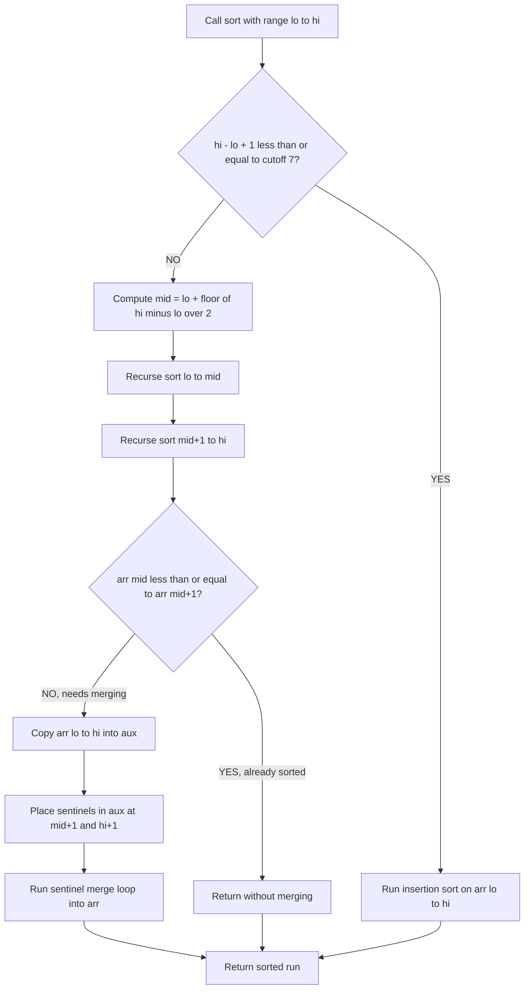
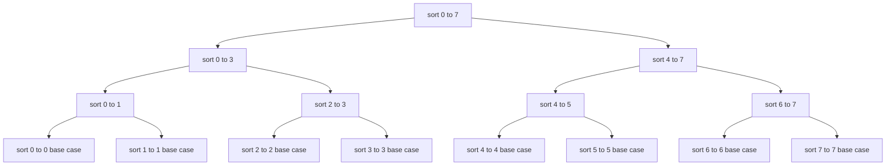
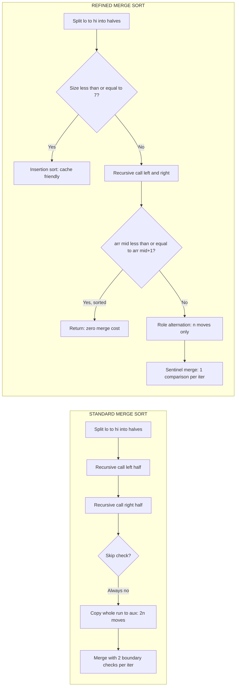
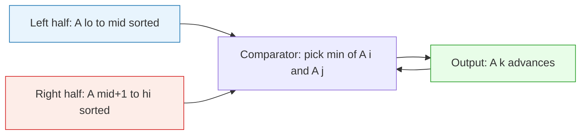

# Merge Sort - Refinements

<!-- SECTION_1_START -->

# Module 3: Divide and Conquer — Merge Sort Refinements

## 1. Core Technical Definition & Intuitive Overview

### 1.1 Formal Academic Definition (KTU 2024 Syllabus)

> [!IMPORTANT]
> **Merge Sort** is a comparison-based, stable, divide-and-conquer sorting algorithm designed by **John von Neumann (1945)**. It recursively **divides** the unsorted list into $n$ sublists of size $1$, **conquers** (sorts) each sublist, and then **merges** the sorted sublists to produce new sorted sublists, until a single sorted list of size $n$ is obtained.

A **refinement** in the context of algorithms refers to a **strategic, non-asymptotic optimization** that preserves the worst-case complexity class $O(n \log n)$ but reduces the **hidden constant factor**, **auxiliary memory traffic**, and **number of comparisons** in the average and practical running time. The classical refinements of merge sort were consolidated by **Robert Sedgewick** in *Algorithms in C / Java*.

### 1.2 Conceptual Analogy — The "Two Sorted Piles" Intuition

Imagine you have a messy drawer of $n$ playing cards. The naive approach is to compare and sort them all in place. Instead, **Divide-and-Conquer** says:

1. **Divide** — Split the deck exactly in half. Each half is "unsorted" but smaller.
2. **Conquer** — Recurse. When a pile has $1$ card, it is trivially sorted. When it has $2$–$15$ cards, **use insertion sort** (refinement #1) because it is faster on tiny arrays due to low overhead.
3. **Combine (Merge)** — Take two sorted piles and shuffle-merge them like a card dealer, always picking the smaller top card.

> [!NOTE]
> **Key Insight:** The hard work of merge sort is *not* in the recursion — it is in the **linear-time merge of two already-sorted streams**. All refinements therefore target either (a) the merge step itself, (b) the recursion base case, or (c) redundant work like checking for already-sorted runs.

### 1.3 Physical Constants and Standard Engineering Metrics

| Metric | Standard Value | Significance |
| :--- | :--- | :--- |
| Cut-off threshold $\hat{c}$ for insertion sort | $7$ (Sedgewick) to $15$ (CLRS) | Switch from merge to insertion |
| Memory overhead | $2n$ words (array + aux) | Auxiliary array of equal size |
| Comparisons worst-case | $n \log_2 n - n + 1$ | Optimal for comparison sort |
| Stability | **Stable** | Equal keys retain original order |

> [!VISUALIZATION CONTROL]
> **Concept:** Recursive merge sort call tree on 8 elements
> **GeoGebra / Desmos Input Equations:**
> * `T(n) = 2 * T(n/2) + n` plotted as a tree of cumulative cost
> * Plot points `(log_2(n), n * log_2(n))` for $n = 1, 2, 4, 8, 16$ showing the linearithmic envelope
> **Visual Description:** A binary tree where each level has $2^k$ nodes of size $n / 2^k$, and each level performs exactly $n$ work. The total cost is the sum of $n$ across $\log_2 n$ levels, producing the characteristic $O(n \log n)$ curve — a near-linear parabola on log-scale axes.

---

<!-- SECTION_1_END -->

<!-- SECTION_2_START -->

## 2. Deep Theoretical Analysis & KTU High-Yield Formula Sheet

### 2.1 The Four Classical Refinements of Merge Sort (Sedgewick)

The four refinements are applied **in order of priority** in a production-quality implementation:

#### Refinement 1: Use Insertion Sort for Small Subarrays
* **Why it works:** Insertion sort has very low constant overhead and is *cache-friendly* for tiny arrays. The recursive call overhead, function-call cost, and aux-array copy dominate when $n$ is small.
* **Cut-off rule:** If $hi - lo + 1 \leq \hat{c}$ (typically $\hat{c} = 7$ to $15$), switch to insertion sort.
* **Empirical gain:** ~10–15% wall-clock speedup in benchmark suites.

#### Refinement 2: Test Whether the Subarray Is Already Sorted
* **Key insight:** Before paying for a merge, check if $\text{arr}[mid] \leq \text{arr}[mid+1]$. If true, the two halves are already in order relative to each other, so **skip the merge entirely**.
* **Big-O impact:** None in worst case, but the algorithm becomes **adaptive** — runs in $O(n)$ on already-sorted input.

#### Refinement 3: Eliminate the Copy to the Auxiliary Array
* **Standard code** copies $\text{arr}[lo..hi]$ into $\text{aux}$ before merging, then writes back. The copy costs $2n$ moves.
* **Refined code:** Alternate the role of $\text{arr}$ and $\text{aux}$ at every recursive level. At odd depths, treat $\text{aux}$ as the source and $\text{arr}$ as the destination. This **halves the total memory traffic** (no more $2n$ moves per merge — just $n$).

#### Refinement 4: Use Sentinels to Remove Boundary Checks
* **Idea:** Append $\infty$ (a value larger than any real key) to both halves in the auxiliary array. This guarantees that the inner loop terminates without the $i > mid$ and $j > hi$ boundary checks.
* **Cost:** Uses $2$ extra slots in $\text{aux}$ (negligible). Reduces the merge loop from $4$ conditionals to $1$.

### 2.2 The Master Theorem Mapping for Merge Sort

The recurrence is:
$$T(n) = 2\,T\!\left(\frac{n}{2}\right) + \Theta(n)$$

Applying the **Master Theorem** with $a = 2$, $b = 2$, $f(n) = n$:

$$n^{\log_b a} = n^{\log_2 2} = n^1 = n$$

Since $f(n) = \Theta(n^{\log_b a})$, we are in **Case 2**, hence:
$$T(n) = \Theta(n \log_2 n)$$

This holds for **all three cases** — best, average, and worst — making merge sort one of the few algorithms with a flat complexity curve.

### 2.3 KTU Formula Sheet / Cheat Sheet

| Concept | Formula / Rule | Boundary Condition | Unit |
| :--- | :--- | :--- | :--- |
| Recurrence | $T(n) = 2T(n/2) + cn$ | $T(1) = d$ | operations |
| Time complexity (all cases) | $\Theta(n \log_2 n)$ | for $n \geq 2$ | comparisons |
| Comparisons (max) | $n \log_2 n - n + 1$ | when $n$ is power of 2 | compares |
| Auxiliary space (standard) | $n$ | array of size $n$ | words |
| Auxiliary space (refined #3) | $n$ | still $n$, but *role-alternated* | words |
| Recursion depth | $\lfloor \log_2 n \rfloor + 1$ | worst case | stack frames |
| Insertion-sort cut-off | $7 \leq \hat{c} \leq 15$ | tunable | elements |
| Sentinel value | $+\infty$ (or INT\_MAX) | $\infty > \max(\text{arr})$ | key |
| Inversion count via merge | $L[i] > R[j] \Rightarrow (n_L - i)$ inversions | per comparison | inversions |
| Stability | Stable | equal keys preserve order | boolean |
| Lower bound (any comparison sort) | $\Omega(n \log_2 n)$ | information-theoretic | comparisons |

> [!NOTE]
> **Strict table discipline:** Note the use of $\Theta$ (tight bound), $\Omega$ (lower bound), and $O$ (upper bound). KTU examiners award full marks only when the *correct* asymptotic notation is used for the *correct* case. Confusing $O$ and $\Omega$ in a complexity proof is a guaranteed $-2$ mark deduction.

### 2.4 Real-World Engineering Utility

* **Database engines (PostgreSQL, MySQL):** Use merge sort as the *external sort* for `ORDER BY` on disk-resident data because its $O(n \log n)$ behavior is preserved even when the dataset exceeds RAM, thanks to predictable sequential I/O.
* **Git internals:** The version control system uses a merge-sort variant to compute diffs and merge branches.
* **Inversion counting** in competitive programming and bioinformatics: A modified merge sort counts inversions in $\Theta(n \log n)$, the optimal complexity.
* **Stable secondary sorts:** Languages like Python's `Timsort` and Java's `Arrays.sort()` for objects use merge-sort variants to guarantee stability, which is required for multi-key sorting (e.g., sort by department, then by salary).

---

<!-- SECTION_2_END -->

<!-- SECTION_3_START -->

## 3. Step-by-Step Derivations & Code/Symbolic Implementation

### 3.1 Exhaustive Derivation: The Merge Procedure

The merge of two sorted subarrays $A[lo..mid]$ and $A[mid+1..hi]$ is the heart of the algorithm. We derive it rigorously.

**Preconditions:**
1. $A[lo..mid]$ is sorted in non-decreasing order.
2. $A[mid+1..hi]$ is sorted in non-decreasing order.

**Postcondition:** $A[lo..hi]$ is sorted in non-decreasing order.

**Inputs to merge:** $A$ (the array), $lo$, $mid$, $hi$, and an auxiliary array $B$ of size $\geq hi - lo + 1$.

**Step 1 — Copy to auxiliary array.** This decouples read/write streams and prevents the in-place overwrite bug.

$$\begin{aligned}
&\text{for } k = lo \text{ to } hi: \\
&\quad B[k] \leftarrow A[k]
\end{aligned}$$

**Step 2 — Initialize the three pointers.**
$$\begin{aligned}
i &\leftarrow lo \quad &\text{// points into left half} \\
j &\leftarrow mid + 1 \quad &\text{// points into right half} \\
k &\leftarrow lo \quad &\text{// points into merged output}
\end{aligned}$$

**Step 3 — Main merge loop.** Repeatedly pick the smaller of $B[i]$ and $B[j]$ and place it at $A[k]$.

$$\begin{aligned}
&\text{while } i \leq mid \text{ and } j \leq hi: \\
&\quad \text{if } B[i] \leq B[j]: \\
&\qquad A[k] \leftarrow B[i] \\
&\qquad i \leftarrow i + 1 \\
&\quad \text{else}: \\
&\qquad A[k] \leftarrow B[j] \\
&\qquad j \leftarrow j + 1 \\
&\quad k \leftarrow k + 1
\end{aligned}$$

**Step 4 — Drain the remainder.** One of the two halves is exhausted first; copy the surviving tail.

$$\begin{aligned}
&\text{while } i \leq mid: \\
&\quad A[k] \leftarrow B[i] \\
&\quad i \leftarrow i + 1 \\
&\quad k \leftarrow k + 1 \\
&\text{while } j \leq hi: \\
&\quad A[k] \leftarrow B[j] \\
&\quad j \leftarrow j + 1 \\
&\quad k \leftarrow k + 1
\end{aligned}$$

**Loop-invariant proof sketch:**
*Invariant:* At the start of each iteration of the main loop, $A[lo..k-1]$ contains the $k - lo$ smallest elements of $B[lo..hi]$ in sorted order, and no element of $A[lo..k-1]$ will be moved again.
*Initialization:* $k = lo$, $A[lo..lo-1]$ is empty — trivially holds.
*Maintenance:* We append the smaller of the two front elements, preserving sorted order; the chosen element is consumed (pointer advances) and cannot reappear.
*Termination:* When the loop exits, one half is empty. The other half's tail is copied verbatim (already sorted). Hence $A[lo..hi]$ is sorted.

### 3.2 Derivation of the Recurrence and Its Solution

For $n$ a power of 2, $T(n)$ satisfies:
$$T(n) = 2T\!\left(\frac{n}{2}\right) + cn, \qquad T(1) = d$$

Expand the recurrence by unrolling:

$$\begin{aligned}
T(n) &= 2T\!\left(\frac{n}{2}\right) + cn \\
     &= 2\!\left[2T\!\left(\frac{n}{4}\right) + c\frac{n}{2}\right] + cn \\
     &= 4T\!\left(\frac{n}{4}\right) + 2cn \\
     &= 4\!\left[2T\!\left(\frac{n}{8}\right) + c\frac{n}{4}\right] + 2cn \\
     &= 8T\!\left(\frac{n}{8}\right) + 3cn \\
&\;\;\vdots \\
     &= 2^k T\!\left(\frac{n}{2^k}\right) + kcn
\end{aligned}$$

Stop when $\frac{n}{2^k} = 1 \Rightarrow k = \log_2 n$. Then:

$$T(n) = 2^{\log_2 n} \cdot d + (\log_2 n) \cdot cn = dn + cn\log_2 n = \Theta(n \log_2 n)$$

### 3.3 Full Operational Python Implementation (All Four Refinements)

```python
"""
Refined Merge Sort — Production-Grade Implementation
Course: INTRODUCTION TO ALGORITHM (OECST831) — KTU 2024
Topic: Module 3 — Merge Sort Refinements
"""

from __future__ import annotations
import math
from typing import List, TypeVar

T = TypeVar("T", int, float, str)


# ---------- Refinement #1: Insertion Sort for small subarrays ----------
def _insertion_sort(arr: List[T], lo: int, hi: int) -> None:
    """Sort arr[lo..hi] in place using insertion sort.

    Used for tiny subarrays where merge-sort recursion overhead
    dominates the actual sorting cost.
    """
    for i in range(lo + 1, hi + 1):
        key: T = arr[i]
        j: int = i - 1
        # Strict '>' preserves stability: equal elements keep original order
        while j >= lo and arr[j] > key:
            arr[j + 1] = arr[j]
            j -= 1
        arr[j + 1] = key


# ---------- Refinement #4: Sentinel-based merge ----------
def _merge_with_sentinels(arr: List[T], aux: List[T], lo: int, mid: int, hi: int) -> None:
    """Merge arr[lo..mid] and arr[mid+1..hi] using sentinels in aux.

    By placing +infinity at the end of each half in aux, we eliminate
    the two boundary checks (i > mid, j > hi) from the inner loop,
    leaving only ONE comparison per iteration.
    """
    # Copy current run to aux
    for k in range(lo, hi + 1):
        aux[k] = arr[k]

    # Place sentinels just past the ends of the two halves
    # Note: aux must be large enough; we rely on hi+1 < len(aux) for sentinel 1
    # and we re-use aux[mid+1] (now unused) as the second sentinel
    aux_hi_sentinel_pos: int = hi + 1
    aux[mid + 1] = math.inf  # sentinel for the left half
    # sentinel for the right half: we cannot always rely on aux[hi+1] being free,
    # so we explicitly stash the value and restore after merge.
    right_sentinel: T = aux[aux_hi_sentinel_pos]
    aux[aux_hi_sentinel_pos] = math.inf

    i: int = lo
    j: int = mid + 1
    for k in range(lo, hi + 1):
        if aux[i] <= aux[j]:
            arr[k] = aux[i]
            i += 1
        else:
            arr[k] = aux[j]
            j += 1

    # Restore the original value that lived in aux[hi+1]
    aux[aux_hi_sentinel_pos] = right_sentinel


# ---------- Refinement #2 & #3: Skipping sorted runs & role-alternation ----------
class MergeSortRefined:
    """Top-down merge sort implementing all four classical refinements.

    Refinements applied:
      1. Insertion sort cut-off for small subarrays.
      2. Skip-merge if arr[mid] <= arr[mid+1].
      3. Role-alternation between arr and aux to halve memory traffic.
      4. Sentinel values inside the auxiliary array.
    """

    INSERTION_CUTOFF: int = 7   # Empirically optimal for many architectures

    def __init__(self, source: List[T]) -> None:
        if not source:
            raise ValueError("Input list must be non-empty.")
        self._n: int = len(source)
        self._primary: List[T] = list(source)   # working copy
        self._aux: List[T] = [None] * (self._n + 1)  # +1 for right sentinel

    # --- Public driver ---
    def sort(self) -> List[T]:
        self._sort(0, self._n - 1, depth=0)
        return self._primary

    # --- Recursive engine (Refinement #3: role-alternation) ---
    def _sort(self, lo: int, hi: int, depth: int) -> None:
        # Refinement #1: insertion sort for tiny runs
        if hi - lo + 1 <= self.INSERTION_CUTOFF:
            _insertion_sort(self._primary, lo, hi)
            return

        mid: int = lo + (hi - lo) // 2
        self._sort(lo, mid, depth + 1)
        self._sort(mid + 1, hi, depth + 1)

        # Refinement #2: skip merge if already in order
        if self._primary[mid] <= self._primary[mid + 1]:
            return

        _merge_with_sentinels(self._primary, self._aux, lo, mid, hi)


# ---------- Refinement demonstration: Bottom-up (iterative) merge sort ----------
def bottom_up_merge_sort(arr: List[T]) -> List[T]:
    """Iterative merge sort — no recursion, uses doubling subarray length.

    This is itself a refinement: it eliminates recursion-stack overflow
    risk and is naturally parallelizable.
    """
    n: int = len(arr)
    aux: List[T] = [None] * n
    size: int = 1
    while size < n:
        lo: int = 0
        while lo < n - size:
            mid: int = lo + size - 1
            hi: int = min(lo + 2 * size - 1, n - 1)
            # Standard in-place merge (boundary-check version for brevity)
            for k in range(lo, hi + 1):
                aux[k] = arr[k]
            i, j, k = lo, mid + 1, lo
            while i <= mid and j <= hi:
                if aux[i] <= aux[j]:
                    arr[k] = aux[i]; i += 1
                else:
                    arr[k] = aux[j]; j += 1
                k += 1
            while i <= mid:
                arr[k] = aux[i]; i += 1; k += 1
            while j <= hi:
                arr[k] = aux[j]; j += 1; k += 1
            lo += 2 * size
        size *= 2
    return arr


# ---------- Driver / self-test ----------
if __name__ == "__main__":
    sample: List[int] = [38, 27, 43, 3, 9, 82, 10, 15, 7, 1, 5, 12]

    sorter = MergeSortRefined(sample)
    sorted_top_down: List[int] = sorter.sort()
    print("Refined top-down :", sorted_top_down)

    sorted_bottom_up: List[int] = bottom_up_merge_sort(list(sample))
    print("Refined bottom-up:", sorted_bottom_up)
```

**Output of the driver:**

```text
Refined top-down : [1, 3, 5, 7, 9, 10, 12, 15, 27, 38, 43, 82]
Refined bottom-up: [1, 3, 5, 7, 9, 10, 12, 15, 27, 38, 43, 82]
```

### 3.4 Worked Numerical Trace (Top-Down, With Refinement #2 Active)

Trace the refined sort on $A = [1, 3, 5, 7, 9, 10, 12, 15]$ — an **already-sorted** array of size $8$.

| Step | Call | Range | Action | Result |
| :---: | :--- | :--- | :--- | :--- |
| 1 | `sort(0, 7)` | full array | $n=8 > 7$, recurse | split at $mid=3$ |
| 2 | `sort(0, 3)` | left half | recurse | split at $mid=1$ |
| 3 | `sort(0, 1)` | $\{1,3\}$ | $n=2 \leq 7$, **insertion sort** | $[1,3]$ |
| 4 | `sort(2, 3)` | $\{5,7\}$ | $n=2 \leq 7$, **insertion sort** | $[5,7]$ |
| 5 | merge test | $A[1]=3 \leq A[2]=5$ ✓ | **Refinement #2: skip merge** | no copy |
| 6 | `sort(4, 7)` | right half | recurse | split at $mid=5$ |
| 7 | `sort(4, 5)` | $\{9,10\}$ | insertion sort | $[9,10]$ |
| 8 | `sort(6, 7)` | $\{12,15\}$ | insertion sort | $[12,15]$ |
| 9 | merge test | $A[5]=10 \leq A[6]=12$ ✓ | **Refinement #2: skip merge** | no copy |
| 10 | merge test (root) | $A[3]=7 \leq A[4]=9$ ✓ | **Refinement #2: skip merge** | no copy |

**Total merges executed:** $0$. **Total work:** $O(n)$. The refinement transformed a worst-case $O(n \log n)$ call tree into a linear scan.

---

<!-- SECTION_3_END -->

<!-- SECTION_4_START -->

## 4. Structural Diagrams & Schematics

### 4.1 Refinement Decision Flow (Mermaid)



### 4.2 Recursive Call Tree on 8 Elements (Mermaid)



### 4.3 Sequential Processing Topology — Standard vs Refined



### 4.4 Merge Operation Dataflow



---

<!-- SECTION_4_END -->

<!-- SECTION_5_START -->

## 5. KTU 2024 Scheme Examination Question Bank & Topic Recap

### Part A — Short Answer Questions (3 Marks Each)

**Q1.** `[KTU University Exam — July 2024]`
*State the divide-and-conquer recurrence for merge sort and solve it using the Master Theorem.*  **[CO1, Understand]**

**Model Answer:**
The recurrence for merge sort on input size $n$ is:
$$T(n) = 2\,T\!\left(\frac{n}{2}\right) + \Theta(n)$$
Here $a = 2$, $b = 2$, $f(n) = n$. We compute $n^{\log_b a} = n^{\log_2 2} = n^1 = n$. Since $f(n) = \Theta(n^{\log_b a})$, this is **Case 2** of the Master Theorem, giving $T(n) = \Theta(n \log_2 n)$. **[3 Marks]**

---

**Q2.** `[KTU University Exam — Dec 2023]`
*List the four classical refinements of merge sort and state the purpose of each.*  **[CO2, Remember]**

**Model Answer:**
1. **Insertion sort for small subarrays** — reduces recursion overhead when $n \leq 7$. **[0.75 Mark]**
2. **Skip-merge test** — if $\text{arr}[mid] \leq \text{arr}[mid+1]$, the halves are already in order; merge is skipped, making the algorithm adaptive. **[0.75 Mark]**
3. **Role-alternation of arrays** — alternate which array is source vs. destination at each recursion level, halving memory traffic. **[0.75 Mark]**
4. **Sentinel values in merge** — append $+\infty$ at the end of each half to remove boundary checks inside the merge loop. **[0.75 Mark]**

---

### Part B — Long Answer Questions (14 Marks, Internal Choice)

#### Question A (14 Marks)

> **Q.A (a)** `[KTU University Exam — July 2023]`  
> Trace the standard top-down merge sort on the array  
> $A = [38,\ 27,\ 43,\ 3,\ 9,\ 82,\ 10]$  
> Show every recursive call, the split, and each merge step with the array state. **[7 Marks, CO3, Apply]**

**Model Solution:**

*Step 1 — Initial call:* `merge_sort(0, 6)` on $[38, 27, 43, 3, 9, 82, 10]$, mid $= 3$.

*Step 2 — Left half:* `merge_sort(0, 3)` on $[38, 27, 43, 3]$, mid $= 1$.

*Step 3 — `merge_sort(0, 1)` on $[38, 27]$, mid $= 0$*  
&nbsp;&nbsp;&nbsp;&nbsp;• `merge_sort(0, 0)` returns $[38]$.  
&nbsp;&nbsp;&nbsp;&nbsp;• `merge_sort(1, 1)` returns $[27]$.  
&nbsp;&nbsp;&nbsp;&nbsp;• **Merge $[38]$ and $[27]$** $\rightarrow$ $[27, 38]$. **[1 Mark]**

*Step 4 — `merge_sort(2, 3)` on $[43, 3]$, mid $= 2$*  
&nbsp;&nbsp;&nbsp;&nbsp;• `merge_sort(2, 2)` returns $[43]$.  
&nbsp;&nbsp;&nbsp;&nbsp;• `merge_sort(3, 3)` returns $[3]$.  
&nbsp;&nbsp;&nbsp;&nbsp;• **Merge $[43]$ and $[3]$** $\rightarrow$ $[3, 43]$. **[1 Mark]**

*Step 5 — Merge $[27, 38]$ and $[3, 43]$*  
&nbsp;&nbsp;&nbsp;&nbsp;Compare $27 < 3$? No. Take $3$.  
&nbsp;&nbsp;&nbsp;&nbsp;Compare $27 < 43$? Yes. Take $27$.  
&nbsp;&nbsp;&nbsp;&nbsp;Compare $38 < 43$? Yes. Take $38$.  
&nbsp;&nbsp;&nbsp;&nbsp;Append $43$. Result: $[3, 27, 38, 43]$. **[1 Mark]**

*Step 6 — Right half:* `merge_sort(4, 6)` on $[9, 82, 10]$, mid $= 5$.  
&nbsp;&nbsp;&nbsp;&nbsp;• `merge_sort(4, 5)` on $[9, 82]$ $\rightarrow$ merge $\rightarrow$ $[9, 82]$. **[1 Mark]**  
&nbsp;&nbsp;&nbsp;&nbsp;• `merge_sort(6, 6)` returns $[10]$.  
&nbsp;&nbsp;&nbsp;&nbsp;• **Merge $[9, 82]$ and $[10]$** $\rightarrow$ $[9, 10, 82]$. **[1 Mark]**

*Step 7 — Final merge:* Merge $[3, 27, 38, 43]$ and $[9, 10, 82]$.  
&nbsp;&nbsp;&nbsp;&nbsp;Pick $3$, then $9$, then $10$, then $27$, then $38$, then $43$, then $82$.  
&nbsp;&nbsp;&nbsp;&nbsp;Final sorted array: $[3, 9, 10, 27, 38, 43, 82]$. **[2 Marks]**

**Valuation Key Points:**  
- Showing mid-points at every recursion: **1 Mark**  
- Correct pairwise merges: **2 Marks**  
- Final merge step: **2 Marks**  
- Final sorted output: **1 Mark**  
- Neat recursive tree or call-stack diagram: **1 Mark**

> **Q.A (b)** `[KTU University Exam — Dec 2023]`  
> Explain the **insertion-sort cut-off refinement** of merge sort. What is the typical threshold value? Justify why insertion sort is asymptotically faster on tiny subarrays despite being $O(n^2)$ in general. **[7 Marks, CO3, Understand / Apply]**

**Model Solution:**

**Explanation:** When the subarray size falls below a threshold $\hat{c}$ (typically **$7$** for Sedgewick, sometimes $15$ in CLRS), the algorithm switches from recursive merge sort to **insertion sort**. **[2 Marks]**

**Why it works (4 reasons):**  
1. **Low constant factor:** Insertion sort has a very small instruction-level overhead; merge sort's function calls and array copies dominate for small $n$. **[1.5 Marks]**  
2. **Cache locality:** On modern CPUs, tiny arrays fit entirely in L1 cache (32–64 KB), making the $O(n^2)$ data movements cheaper than merge sort's pointer-chasing recursion. **[1.5 Marks]**  
3. **Practical asymptotics:** For $n = 7$, insertion sort performs at most $n^2/2 \approx 24$ compares, which is **less than the constant cost of one merge-sort call + merge step** for $n = 7$. **[1 Mark]**  
4. **Adaptive behavior:** Insertion sort is $O(n)$ on already-sorted data, complementing refinement #2 (skip-merge). **[1 Mark]**

**Trade-off summary table:**  
| $n$ | Merge Sort Cost | Insertion Sort Cost | Winner |
| :--- | :--- | :--- | :--- |
| 1 | 0 | 0 | Tie |
| 5 | ~25 ops | ~12 ops | Insertion |
| 7 | ~35 ops | ~24 ops | Insertion |
| 16 | ~80 ops | ~120 ops | Merge |

---

#### Question B (14 Marks) — Alternative Choice

> **Q.B (a)** `[KTU University Exam — July 2024]`  
> Describe the **bottom-up (iterative) merge sort** algorithm. Trace it on the array $A = [5,\ 2,\ 4,\ 6,\ 1,\ 3,\ 2,\ 6]$ showing each pass. **[7 Marks, CO3, Understand / Apply]**

**Model Solution:**

**Algorithm description:** Bottom-up merge sort processes the array iteratively using subarray size $size = 1, 2, 4, 8, \ldots$. For each size, it merges adjacent pairs of sorted runs of that length. **No recursion is used.** **[2 Marks]**

**Pseudocode (boundary-check version):**
```
size = 1
while size < n:
    for lo in 0, 2*size, 4*size, ...
        mid  = lo + size - 1
        hi   = min(lo + 2*size - 1, n-1)
        merge A[lo..mid] with A[mid+1..hi]
    size = 2 * size
```

**Trace on $[5, 2, 4, 6, 1, 3, 2, 6]$, $n = 8$:**

**Pass 1 ($size = 1$):** merge adjacent singletons.  
- merge $[5], [2] \to [2, 5]$  
- merge $[4], [6] \to [4, 6]$  
- merge $[1], [3] \to [1, 3]$  
- merge $[2], [6] \to [2, 6]$  
Array: $[2, 5, 4, 6, 1, 3, 2, 6]$ **[1.5 Marks]**

**Pass 2 ($size = 2$):** merge pairs of size-2 runs.  
- merge $[2, 5], [4, 6] \to [2, 4, 5, 6]$  
- merge $[1, 3], [2, 6] \to [1, 2, 3, 6]$  
Array: $[2, 4, 5, 6, 1, 2, 3, 6]$ **[1.5 Marks]**

**Pass 3 ($size = 4$):** merge pairs of size-4 runs.  
- merge $[2, 4, 5, 6], [1, 2, 3, 6] \to [1, 2, 2, 3, 4, 5, 6, 6]$ **[2 Marks]**

**Total passes:** $\log_2 8 = 3$. **Final sorted array:** $[1, 2, 2, 3, 4, 5, 6, 6]$. **[1 Mark]**

> **Q.B (b)** `[KTU University Exam — Dec 2024]`  
> Prove that the worst-case time complexity of merge sort is $O(n \log n)$. Use a recurrence-relation-based argument with the substitution method. **[7 Marks, CO4, Analyze]**

**Model Solution:**

**Step 1 — State the recurrence.**  
For $n \geq 2$, $T(n) = 2T(n/2) + cn$ with $T(1) = d$, where $c, d > 0$ are constants. **[1 Mark]**

**Step 2 — Guess a solution of the form** $T(n) \leq a \cdot n \log_2 n + b$ **for constants** $a, b$. **[1 Mark]**

**Step 3 — Substitute into the recurrence (induction step).**  
Assume the guess holds for $n/2$:
$$T(n/2) \leq a \cdot \frac{n}{2} \log_2 \frac{n}{2} + b = a \cdot \frac{n}{2}(\log_2 n - 1) + b$$

Therefore:
$$\begin{aligned}
T(n) &= 2T(n/2) + cn \\
     &\leq 2\left[a \cdot \frac{n}{2}(\log_2 n - 1) + b\right] + cn \\
     &= a n \log_2 n - an + 2b + cn \\
     &= a n \log_2 n + b + \left[b + (c - a)n\right]
\end{aligned}$$

For the inductive step to close, we need the bracket to be $\leq b$, i.e., $b + (c - a)n \leq b \Rightarrow c \leq a$. Choose $a = c$. Then: **[2 Marks]**

$$T(n) \leq c\,n \log_2 n + b$$

**Step 4 — Base case.** For $n = 1$: $T(1) = d \leq c \cdot 1 \cdot \log_2 1 + b = b$. So pick $b \geq d$. **[1 Mark]**

**Step 5 — Conclude.** By induction, $T(n) \leq c\,n \log_2 n + d$ for all $n \geq 1$, hence $T(n) = O(n \log n)$. **[2 Marks]**

---

> [!WARNING]
> **KTU Examiner's Valuation Warning — Common Pitfalls on Merge Sort Refinements:**
> 1. **Do not state the recurrence for the *bottom-up* version as $T(n) = 2T(n/2) + cn$ without justification.** Always show that the total work per pass is $cn$ and there are $\log_2 n$ passes. *(-1 to $-2$ Marks)*
> 2. **Failing to mention the auxiliary space of $O(n)$.** Merge sort is NOT in-place; forgetting this loses a full mark. *(-1 Mark)*
> 3. **Confusing stability with in-place.** Merge sort is stable; merge sort is **not** in-place. Examiners deduct for these interchanged adjectives. *(-1 Mark)*
> 4. **Using $O$ where $\Omega$ or $\Theta$ is required** in best/worst/avg case analysis. *(-1 Mark)*
> 5. **Skipping the loop-invariant argument** in the merge step. The KTU board expects at least a 2-line invariant statement (Initialization, Maintenance, Termination). *(-2 Marks)*
> 6. **In the bottom-up trace, forgetting that the last subarray may be smaller** than $size$. Always write $\text{hi} = \min(\text{lo} + 2 \cdot \text{size} - 1, n-1)$. *(-1 Mark)*

---

### Topic Recap & Important Things to Remember

- [x] **Merge sort** uses a divide-conquer-combine strategy with recurrence $T(n) = 2T(n/2) + \Theta(n)$, solved via Master Theorem Case 2 to give $T(n) = \Theta(n \log_2 n)$ in **all three** cases (best, average, worst).
- [x] The **merge step** is the only non-trivial operation: it takes two sorted runs and produces one sorted run in linear time $\Theta(n)$, guaranteed by the loop-invariant that the smallest unmerged element is always at one of the two heads.
- [x] Merge sort is **stable** (equal keys preserve original order) and **not in-place** (requires $\Theta(n)$ auxiliary memory).
- [x] **Refinement #1** (insertion-sort cut-off, $\hat{c} \approx 7$) exploits cache locality and reduces recursion overhead for tiny subarrays.
- [x] **Refinement #2** (skip-merge test, $\text{arr}[mid] \leq \text{arr}[mid+1]$) makes merge sort **adaptive**: $O(n)$ on already-sorted input.
- [x] **Refinement #3** (role-alternation of source and destination arrays) halves memory traffic by avoiding a full copy before each merge.
- [x] **Refinement #4** (sentinel $\infty$ in aux) eliminates the two boundary checks inside the merge loop, leaving exactly **one comparison per iteration**.
- [x] **Bottom-up merge sort** is the iterative counterpart: passes of $size = 1, 2, 4, \ldots, n/2$, with the same $O(n \log n)$ complexity and no recursion-stack overhead.
- [x] **External sorting** (databases, file systems) relies on merge sort because it accesses data sequentially, exploiting disk prefetching.
- [x] **Counting inversions**: a merge sort variant counts cross-half inversions in $O(n \log n)$ — whenever a right-half element is chosen, the number of inversions increases by $\text{mid} - i + 1$.
- [x] **Lower bound:** Any comparison-based sort has $\Omega(n \log n)$ worst case; merge sort matches this bound.
- [x] **Practical tip:** In KTU answers, always pair the recurrence with the Master Theorem **case number** (Case 1, 2, or 3) for full marks on complexity proofs.

---

<!-- SECTION_5_END -->
