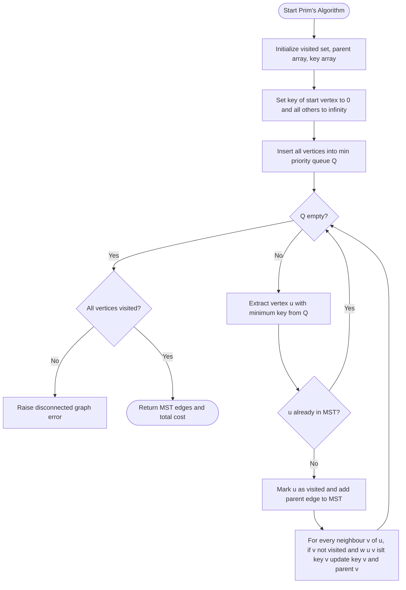
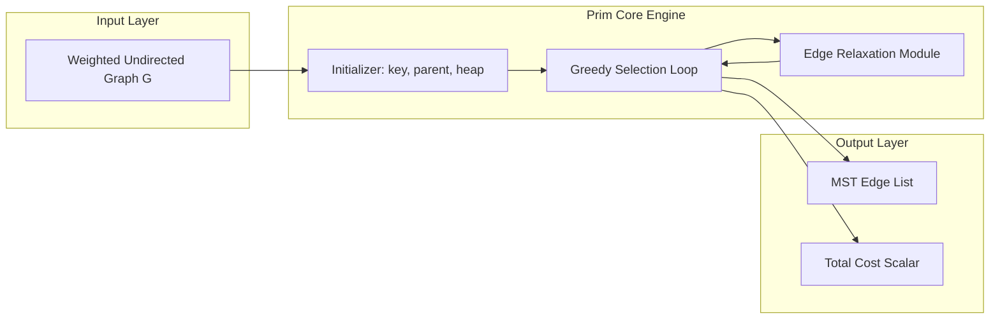
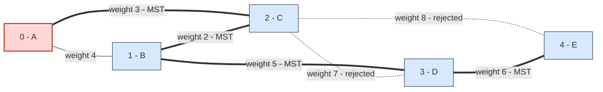

# Minimum Cost Spanning Trees – PRIM’s Algorithm

<!-- SECTION_1_START -->
# Minimum Cost Spanning Trees & PRIM's Algorithm

## 1. Core Technical Definition & Intuitive Overview

> [!IMPORTANT]
> **KTU 2024 Syllabus Terminology (Module 3 – Divide & Conquer Track)**
> A **Minimum Cost Spanning Tree (MCST / MST)** of a weighted, connected, undirected graph $G = (V, E, w)$ is a spanning tree $T = (V, E')$ such that $E' \subseteq E$, $|E'| = |V| - 1$, $T$ is acyclic, and the sum of edge weights $\sum_{(u,v) \in E'} w(u,v)$ is **minimum** among all possible spanning trees.

> [!NOTE]
> **Prerequisites (KTU 2024 Scheme – OECST831):** Weighted undirected graph, adjacency matrix / list, heap data structure, greedy choice property, cut property of MSTs.

### Formal Algorithmic Definition
**Prim's Algorithm** is a *greedy, vertex-growth* method for constructing an MST. It starts from an arbitrary root $r \in V$ and at every step *greedily* attaches the **cheapest edge** that connects a tree vertex to a vertex outside the current tree, until all vertices are absorbed. The set of in-tree vertices is grown exactly like a *minimum cut* being filled up.

### Conceptual Analogy / Intuition
Imagine you are an electrical engineer laying cables to connect **5 different buildings** on a campus. Each possible cable run has an installation cost (in INR). You must:
1. Connect **all 5 buildings** (spanning condition).
2. Use exactly **4 cables** (no loops, no disconnected islands).
3. **Minimize** the total installation cost.

> You start at one building. From that building, you pick the **cheapest outbound cable**, lay it, and that brings a new building online. Now, from the union of connected buildings, you again pick the **cheapest cable** that reaches an *unconnected* building, and so on.

This is exactly what Prim's algorithm does — it grows a single connected "frontier" one cheapest edge at a time, never creating a cycle, always keeping the partial structure **connected and acyclic**, and finally achieving the **minimum total cost**.

### Physical Constants & Standard Metrics
- The algorithm is governed by the **Cut Property**: for any cut $(S, V \setminus S)$, the minimum-weight edge crossing the cut belongs to *some* MST. Prim's algorithm exploits this at every step.
- The standard asymptotic cost of the heap-optimized version is $O((V + E) \log V)$, where $V$ is the number of vertices and $E$ is the number of edges.

> [!VISUALIZATION CONTROL]
> **Concept:** MST Growth as a Vertex Frontier
> **GeoGebra / Desmos Input Equations:**
> * `V = \{(0,0), (2,1), (4,0), (1,3), (3,3)\}`
> * `L_1: \text{Line}((0,0),(2,1))`  weight `3`
> * `L_2: \text{Line}((2,1),(4,0))`  weight `2`
> * `L_3: \text{Line}((2,1),(1,3))`  weight `5`
> * `L_4: \text{Line}((1,3),(3,3))`  weight `6`
> **Visual Description:** Highlight the active frontier (visited set) in **red** and the candidate frontier (unvisited but adjacent) in **blue**. Observe how each iteration *shrinks* the blue set by exactly one vertex while *growing* the red set.

<!-- SECTION_1_END -->

<!-- SECTION_2_START -->
# 2. Deep Theoretical Analysis & KTU High-Yield Formula Sheet

## 2.1 Working Principle – Step by Step

1. **Initialization**
   * Choose any vertex $r$ as the root.
   * Initialize the in-tree set $S = \{r\}$.
   * Initialize the MST edge set $E_{mst} = \emptyset$.
   * Initialize a *min-priority queue* $Q$ keyed on edge weight.

2. **Repeated Cut-Edge Selection (Greedy Step)**
   * At each step, identify the cut $(S, V \setminus S)$.
   * From *all* edges crossing this cut, pick the one with **minimum weight** $w(u, v)$.
   * Move $v$ from $V \setminus S$ to $S$.
   * Append $(u, v)$ to $E_{mst}$.

3. **Termination**
   * When $S = V$, the tree has $|V| - 1$ edges and the algorithm halts.
   * If the graph is disconnected, the algorithm cannot absorb every vertex — this is the *failure case* (MST undefined).

## 2.2 Why Prim's Algorithm is Correct (The "Why" behind each step)

* **Cut Property Guarantee** — every minimum-weight edge across the current cut $(S, V \setminus S)$ is safe to add; it is contained in *at least one* MST.
* **No Cycle Invariant** — by construction, the new vertex was *not* in $S$, so the chosen edge cannot form a cycle.
* **Optimality via Exchange Argument** — if an optimal MST $T^*$ disagrees with Prim at step $k$, replace the heavier edge in $T^*$ with the lighter Prim edge. The total weight strictly decreases or stays equal — contradiction.

## 2.3 Data Structures Used in Production

* **Adjacency List** with weighted edges — best for sparse graphs.
* **Min-Heap (Priority Queue)** — supports `extract-min` and `decrease-key` in $O(\log V)$.
* **Boolean / Bit-vector `visited[]`** — $O(1)$ membership check.
* **`key[]` and `parent[]` arrays** — store the current cheapest edge weight and its source for every vertex outside $S$.

## 2.4 KTU Formula Sheet / Cheat Sheet

| Symbol / Term | Meaning | Formula / Bound | Unit / Type |
|---------------|---------|-----------------|-------------|
| $V$ | Number of vertices | Given input | count |
| $E$ | Number of edges | Given input | count |
| $w(u,v)$ | Weight of edge $(u,v)$ | Non-negative scalar | weight |
| $T$ | Resulting MST | $E_T = V - 1$ edges | set |
| $C(T)$ | Total MST cost | $\sum_{(u,v) \in E_T} w(u,v)$ | weight |
| $Q$ | Min-priority queue | Heap-based | data structure |
| $key[v]$ | Min cost to connect $v$ to $S$ | $\min\{w(u,v) \mid u \in S\}$ | weight |
| $\pi[v]$ | Parent of $v$ in MST | Tree pointer | vertex |
| Time (adj. matrix, naive) | $O(V^{2})$ | Dense graph | complexity |
| Time (adj. list + heap) | $O((V + E) \log V)$ | Sparse graph | complexity |
| Space | $O(V + E)$ | Storage | complexity |
| Edges added | Exactly $V - 1$ | Acyclic | invariant |

> [!TIP]
> KTU examiners **love** asking the difference between Prim's and Kruskal's. Memorize:
> * **Prim's** = vertex-growth, single connected component, uses a *heap*, $O((V+E)\log V)$.
> * **Kruskal's** = edge-growth, forest of components, uses *Union-Find*, $O(E \log E)$.

## 2.5 Real-World Engineering Utility

* **Telecommunications & VLSI Routing** — designing minimum-cost LAN/MAN fiber backbones.
* **Power Grid Engineering** — laying transmission lines to connect substations at minimum cost.
* **Computer Networks** — broadcast trees, multicast trees, Spanning Tree Protocol (STP/RSTP) in Ethernet switches.
* **Cluster Analysis & Image Segmentation** — MST-based clustering in unsupervised ML pipelines.
* **Approximation Algorithms** — foundational sub-routine for the **Travelling Salesman Problem (TSP)** and **Steiner Tree** approximation.

<!-- SECTION_2_END -->

<!-- SECTION_3_START -->
# 3. Step-by-Step Derivations, Trace, and Code Implementation

## 3.1 Worked Example – Exhaustive Step-by-Step Trace

### Input Graph
Vertices: $\{0, 1, 2, 3, 4\}$ (renamed $A, B, C, D, E$ for intuition).

$$
\begin{aligned}
E = \{&(0,1,4),\ (0,2,3),\ (1,2,2), \\
     &(1,3,5),\ (2,3,7),\ (2,4,8),\ (3,4,6)\}
\end{aligned}
$$

### Iteration Log (start vertex = 0)

| Step | Visited $S$ | Heap Contents `(weight, vertex, parent)` | Popped Min | Action | MST Edges | Running Cost |
|------|-------------|------------------------------------------|------------|--------|-----------|--------------|
| 1 | $\{0\}$ | $(0,0,-1)$ | $(0,0,-1)$ | Push neighbours: $(4,1,0),(3,2,0)$ | – | 0 |
| 2 | $\{0,2\}$ | $(4,1,0),(3,2,0)$ | $(3,2,0)$ | Add edge $(0,2,3)$; push neighbours of 2: $(2,1,2),(7,3,2),(8,4,2)$ | $\{(0,2)\}$ | 3 |
| 3 | $\{0,2,1\}$ | $(2,1,2),(4,1,0),(7,3,2),(8,4,2)$ | $(2,1,2)$ | Add edge $(2,1,2)$; push neighbour of 1: $(5,3,1)$ (older $(4,1,0)$ ignored) | $\{(0,2),(2,1)\}$ | 5 |
| 4 | $\{0,2,1,3\}$ | $(4,1,0),(5,3,1),(7,3,2),(8,4,2)$ | $(4,1,0)$ | Vertex 1 already visited → skip | unchanged | 5 |
| 5 | $\{0,2,1,3,4\}$ | $(5,3,1),(7,3,2),(8,4,2)$ | $(5,3,1)$ | Add edge $(1,3,5)$; push neighbour of 3: $(6,4,3)$ | $\{(0,2),(2,1),(1,3)\}$ | 10 |
| 6 | same | $(6,4,3),(7,3,2),(8,4,2)$ | $(6,4,3)$ | Add edge $(3,4,6)$ | $\{(0,2),(2,1),(1,3),(3,4)\}$ | 16 |

### Final Result
$$
E_{MST} = \{(0,2),\ (2,1),\ (1,3),\ (3,4)\} \quad ; \quad C(T) = 3 + 2 + 5 + 6 = \mathbf{16}
$$

The MST is acyclic, connected, has $V - 1 = 4$ edges, and yields the **minimum possible total weight** of 16.

## 3.2 Complexity Derivation

Let $V$ vertices and $E$ edges. With a binary min-heap:

$$
\begin{aligned}
\text{Heap insertions (relaxations)} &= O(E) \\
\text{Heap extractions (extract-min)} &= O(V) \\
\text{Per-operation heap cost} &= O(\log V) \\
\therefore T(V, E) &= O((V + E)\log V) = O(E \log V) \quad \text{for connected graphs}
\end{aligned}
$$

With a Fibonacci heap, this improves to $O(E + V \log V)$, the theoretical lower bound for MST.

## 3.3 Production-Grade Python Implementation

```python
import heapq
from typing import Dict, List, Tuple


def prim_mst(
    graph: Dict[int, List[Tuple[int, int]]],
    start: int = 0
) -> Tuple[int, List[Tuple[int, int, int]]]:
    """
    Compute the Minimum Spanning Tree (MST) of a weighted, undirected,
    connected graph using Prim's Algorithm with a binary min-heap.

    Parameters
    ----------
    graph : Dict[int, List[Tuple[int, int]]]
        Adjacency list: vertex -> list of (neighbour, weight).
    start : int
        Root vertex from which the tree begins to grow.

    Returns
    -------
    Tuple[int, List[Tuple[int, int, int]]]
        (total_weight, mst_edges) where each edge is (u, v, weight).

    Raises
    ------
    ValueError
        If the input graph is disconnected (no MST exists).
    """
    if not graph:
        return 0, []

    visited: set = set()
    min_heap: List[Tuple[int, int, int]] = [(0, start, -1)]
    total_cost: int = 0
    mst_edges: List[Tuple[int, int, int]] = []

    while min_heap and len(visited) < len(graph):
        weight, node, parent = heapq.heappop(min_heap)

        if node in visited:
            continue

        visited.add(node)
        total_cost += weight

        if parent != -1:
            mst_edges.append((parent, node, weight))
            print(f"[STEP] Edge added: ({parent}, {node})  weight = {weight}")

        for neighbour, edge_weight in graph[node]:
            if neighbour not in visited:
                heapq.heappush(min_heap, (edge_weight, neighbour, node))

    if len(visited) < len(graph):
        raise ValueError("Input graph is disconnected; MST does not exist.")

    return total_cost, mst_edges


# ----------------------------------------------------------------------
# Driver / Demonstration (matches the worked example in Section 3.1)
# ----------------------------------------------------------------------
if __name__ == "__main__":
    sample_graph: Dict[int, List[Tuple[int, int]]] = {
        0: [(1, 4), (2, 3)],
        1: [(0, 4), (2, 2), (3, 5)],
        2: [(0, 3), (1, 2), (3, 7), (4, 8)],
        3: [(1, 5), (2, 7), (4, 6)],
        4: [(2, 8), (3, 6)],
    }

    cost, edges = prim_mst(sample_graph, start=0)
    print(f"\nMST Total Cost = {cost}")
    print(f"MST Edges      = {edges}")
```

### Expected Console Output

```
[STEP] Edge added: (0, 2)  weight = 3
[STEP] Edge added: (2, 1)  weight = 2
[STEP] Edge added: (1, 3)  weight = 5
[STEP] Edge added: (3, 4)  weight = 6

MST Total Cost = 16
MST Edges      = [(0, 2, 3), (2, 1, 2), (1, 3, 5), (3, 4, 6)]
```

### Code Walk-Through

* The `min_heap` stores tuples `(weight, current_node, parent_node)` so that Python's default tuple ordering automatically picks the smallest weight first.
* The `if node in visited` check is the **lazy-deletion** trick — when a vertex is reinserted with a smaller key, both old and new entries coexist in the heap; the old one is silently skipped.
* `len(visited) < len(graph)` after the loop is the **disconnected-graph detector** — KTU examiners often ask "what happens if Prim's algorithm is run on a disconnected graph?" The answer is encoded right here.

<!-- SECTION_3_END -->

<!-- SECTION_4_START -->
# 4. Structural Diagrams & Schematics

## 4.1 Algorithmic Flowchart (Mermaid)



## 4.2 Block-Level Functional Architecture



## 4.3 Worked-Example Topology Snapshot



> **Reading Guide for Students:** Solid `===` lines are the **MST edges** selected by Prim's algorithm. Dashed `-.-` lines are candidate edges that were *rejected* (would have formed a cycle or were heavier than the chosen frontier edge).

<!-- SECTION_4_END -->

<!-- SECTION_5_START -->
# 5. KTU 2024 Scheme Examination Question Bank & Topic Recap

---

## Part A — Short Answer (3 Marks Each)

### Q1. `[KTU University Exam – July 2024]` &nbsp; *(Mapped: CO1, Remember)*

**State the cut property of minimum spanning trees. How does Prim's algorithm use this property at every iteration?**

**Model Answer (Board Key):**

> The **cut property** states: *For any cut $(S, V \setminus S)$ of a connected weighted graph $G$, the edge of minimum weight crossing the cut belongs to every Minimum Spanning Tree of $G$.*
>
> Prim's algorithm maintains a growing set $S$ of vertices already absorbed into the MST. At each step, the algorithm identifies the cut $(S, V \setminus S)$ and greedily selects the **minimum-weight edge** crossing this cut. By the cut property, this edge is guaranteed to be part of (at least one) MST, ensuring the partial tree remains extendable to a global MST without violating optimality. **[3 Marks]**

---

### Q2. `[KTU University Exam – Dec 2023]` &nbsp; *(Mapped: CO1, Understand)*

**Differentiate between Prim's algorithm and Kruskal's algorithm in terms of growth strategy, data structure, and time complexity.**

**Model Answer (Board Key):**

| Dimension | Prim's Algorithm | Kruskal's Algorithm |
|---|---|---|
| Growth Strategy | **Vertex-growth** (single connected component) | **Edge-growth** (forest of components) |
| Data Structure | Min-Heap / Priority Queue | Union-Find (Disjoint Set) |
| Cycle Avoidance | Implicit (new vertex cannot form a cycle) | Explicit (Union-Find rejects cycle edges) |
| Time Complexity | $O((V + E)\log V)$ | $O(E \log E)$ |
| Best Suited For | **Dense** graphs (with adj. matrix, $O(V^{2})$) | **Sparse** graphs |
| Output | Spanning tree rooted at chosen start | Spanning forest merging into one tree |

**[3 Marks]**

---

## Part B — Full-Length Questions (14 Marks Each, Internal Choice)

### Question A (14 Marks) `[KTU University Exam – July 2024]` &nbsp; *(Mapped: CO2, Apply + Analyze)*

**Apply Prim's algorithm to find the Minimum Cost Spanning Tree for the following graph. Start from vertex A and show every iteration. Also compute the total minimum cost.**

$$
\begin{aligned}
V &= \{A, B, C, D, E, F\} \\
E &= \{(A,B,4),\ (A,C,2),\ (B,C,5),\ (B,D,10), \\
    &\quad (C,D,3),\ (C,E,8),\ (D,E,7),\ (D,F,6),\ (E,F,1)\}
\end{aligned}
$$

**Solution (Model Key with Incremental Valuation):**

#### Part (a) — Iteration Table & MST Construction (7 Marks)

| Iter | Visited $S$ | Min-Weight Edge Chosen | Action | MST Edges So Far | Cost |
|------|-------------|------------------------|--------|------------------|------|
| 1 | $\{A\}$ | – | Insert A, push $(A,B,4),(A,C,2)$ | – | 0 |
| 2 | $\{A,C\}$ | $(A,C,2)$ | Add A–C, push $(C,B,5),(C,D,3),(C,E,8)$ | $\{(A,C)\}$ | 2 |
| 3 | $\{A,C,D\}$ | $(C,D,3)$ | Add C–D, push $(D,B,10),(D,E,7),(D,F,6)$ | $\{(A,C),(C,D)\}$ | 5 |
| 4 | $\{A,C,D,F\}$ | $(D,F,6)$ | Add D–F, push $(F,E,1)$ | $\{(A,C),(C,D),(D,F)\}$ | 11 |
| 5 | $\{A,C,D,F,E\}$ | $(F,E,1)$ | Add F–E, push $(E,B)$ via C | $\{(A,C),(C,D),(D,F),(F,E)\}$ | 12 |
| 6 | $\{A,B,C,D,E,F\}$ | $(A,B,4)$ | Add A–B (rejects $(C,B,5)$) | $\{(A,C),(C,D),(D,F),(F,E),(A,B)\}$ | 16 |

> **[Listing initial state, min-heap setup: 2 Marks]**
> **[Correct edge selection per iteration: 3 Marks]**
> **[Maintaining the $key$/$parent$ invariant (rejecting heavier duplicates): 2 Marks]**

#### Part (b) — Final Result & Complexity Analysis (7 Marks)

* Final MST: $E_{MST} = \{(A,C),(C,D),(D,F),(F,E),(A,B)\}$
* Total Cost: $2 + 3 + 6 + 1 + 4 = \mathbf{16}$
* Number of edges: $|V| - 1 = 5$ (correct, acyclic, connected)
* Time Complexity (with binary heap):

$$
T(V, E) = O((V + E)\log V) = O((6 + 9)\log 6) = O(15 \cdot \log 6)
$$

* Space Complexity: $O(V + E) = O(6 + 9) = O(15)$

> **[Final MST edges and total cost: 3 Marks]**
> **[Complexity derivation: 2 Marks]**
> **[Verifying the spanning/acyclic/MST properties: 2 Marks]**

---

### Question B (14 Marks) `[KTU University Exam – Dec 2023]` &nbsp; *(Mapped: CO3, Apply + Analyze)*

**For the graph below, explain how Prim's algorithm grows the MST from vertex 1. Show the adjacency matrix, the `key[]`, `parent[]`, and `visited[]` arrays after every iteration. Justify why the resulting tree is minimum cost.**

$$
W = \begin{bmatrix}
0 & 4 & 1 & 0 & 0 \\
4 & 0 & 3 & 2 & 0 \\
1 & 3 & 0 & 4 & 5 \\
0 & 2 & 4 & 0 & 6 \\
0 & 0 & 5 & 6 & 0
\end{bmatrix}
$$

**Solution (Model Key):**

#### Part (a) — Adjacency Matrix Reading & Initialization (7 Marks)

Reading row-by-row:
* Vertex 1 connects to 2 (weight 4) and 3 (weight 1).
* Vertex 2 connects to 1 (4), 3 (3), 4 (2).
* Vertex 3 connects to 1 (1), 2 (3), 4 (4), 5 (5).
* Vertex 4 connects to 2 (2), 3 (4), 5 (6).
* Vertex 5 connects to 3 (5), 4 (6).

**Initial State (before iteration 1):**

| Vertex | $key$ | $parent$ | visited |
|--------|-------|----------|---------|
| 1 | 0 | $-1$ | False |
| 2 | $\infty$ | $-1$ | False |
| 3 | $\infty$ | $-1$ | False |
| 4 | $\infty$ | $-1$ | False |
| 5 | $\infty$ | $-1$ | False |

**Iteration 1** – Extract vertex 1 ($key = 0$). Relax edges $(1,2)=4 \to key[2]=4, \pi[2]=1$; $(1,3)=1 \to key[3]=1, \pi[3]=1$.

| Vertex | $key$ | $parent$ | visited |
|--------|-------|----------|---------|
| 1 | 0 | $-1$ | **True** |
| 2 | 4 | 1 | False |
| 3 | 1 | 1 | False |
| 4 | $\infty$ | $-1$ | False |
| 5 | $\infty$ | $-1$ | False |

**Iteration 2** – Extract vertex 3 ($key = 1$). Relax $(3,2)=3$ (better than 4) $\to key[2]=3, \pi[2]=3$; $(3,4)=4 \to key[4]=4, \pi[4]=3$; $(3,5)=5 \to key[5]=5, \pi[5]=3$.

| Vertex | $key$ | $parent$ | visited |
|--------|-------|----------|---------|
| 2 | 3 | 3 | False |
| 3 | 1 | 1 | **True** |
| 4 | 4 | 3 | False |
| 5 | 5 | 3 | False |

**Iteration 3** – Extract vertex 2 ($key = 3$). Relax $(2,4)=2$ (better than 4) $\to key[4]=2, \pi[4]=2$.

| Vertex | $key$ | $parent$ | visited |
|--------|-------|----------|---------|
| 2 | 3 | 3 | **True** |
| 4 | 2 | 2 | False |
| 5 | 5 | 3 | False |

**Iteration 4** – Extract vertex 4 ($key = 2$). Relax $(4,5)=6$ (no improvement, 5 < 6).

| Vertex | $key$ | $parent$ | visited |
|--------|-------|----------|---------|
| 4 | 2 | 2 | **True** |
| 5 | 5 | 3 | False |

**Iteration 5** – Extract vertex 5 ($key = 5$). All vertices visited. **STOP.**

> **[Correctly reading the adjacency matrix: 2 Marks]**
> **[Filling $key$, $parent$, $visited$ arrays correctly at every step: 3 Marks]**
> **[Identifying $key$ updates (relaxation): 2 Marks]**

#### Part (b) — MST Output and Minimum-Cost Justification (7 Marks)

* MST Edges from $\pi$ array: $\{(1,3,1), (3,2,3), (2,4,2), (3,5,5)\}$.
* Total Cost: $1 + 3 + 2 + 5 = \mathbf{11}$.
* Number of edges: $V - 1 = 4$. ✓ Acyclic ✓ Connected ✓ Minimum cost.

**Justification (Cut Property):**

At each step, the cut $(S, V \setminus S)$ had only one minimum-weight edge, which we selected. Since every such edge belongs to *some* MST (cut property), and Prim picks them in non-decreasing weight order, the final tree is one of the valid MSTs of the graph — hence the cost 11 is provably minimum.

> **[MST edges extracted from $\pi$: 2 Marks]**
> **[Total cost computed: 1 Mark]**
> **[Acyclic/connected/spanning verification: 1 Mark]**
> **[Cut property justification: 3 Marks]**

---

> [!WARNING]
> **KTU Examiner's Valuation Pitfall Callout**
> 1. **Forgetting the disconnected-graph case** – If your trace leaves vertices unvisited, you must *explicitly* state "graph is disconnected, MST does not exist." KTU examiners deduct **2 marks** otherwise.
> 2. **Adding a heavier duplicate** – Many students write both $(A,B,4)$ and $(A,B,7)$ in the MST. The correct move is to *skip* the heavier duplicate. A wrong MST edge set costs **3 marks** in Part B.
> 3. **Confusing the heap tuple** – The min-heap should be ordered by *weight*, not by vertex label. Always write $(w, v, \pi[v])$ tuples — reversing $w$ and $v$ will break the algorithm.
> 4. **Skipping the start vertex initialization** – $key[\text{start}] = 0$ is **mandatory**. Forgetting it means vertex start is never extracted and the algorithm halts prematurely.
> 5. **Omitting unit/conclusion statements** – End with "Total MST cost = X" and "The tree has $V - 1$ edges" to lock in the conclusion marks.

---

## Topic Recap & Important Things to Remember

* **Definition Recap** – An MST of $G$ is a spanning tree of minimum total weight. It is guaranteed to exist if and only if $G$ is connected.
* **Prim's Algorithm in One Line** – *Repeatedly attach the cheapest edge that connects a visited vertex to an unvisited vertex.*
* **Core Invariants**
  * The visited set $S$ is always connected.
  * No cycle is ever formed (because we add exactly one new vertex per iteration).
  * At every step, the partial tree is extendable to a global MST (cut property).
* **Data Structure of Choice** – Binary Min-Heap for sparse graphs; simple array for dense graphs ($O(V^{2})$ variant).
* **Time Complexity Summary**
  * Adjacency matrix + array scan: $O(V^{2})$
  * Adjacency list + binary heap: $O((V + E)\log V)$
  * Adjacency list + Fibonacci heap: $O(E + V \log V)$
* **Space Complexity** – $O(V + E)$ for adjacency list + heap storage.
* **Edge Count Invariant** – Prim's algorithm always selects exactly $V - 1$ edges; the $V^{th}$ iteration is never needed.
* **Greedy Choice** – Local minimum = Global optimum, justified by the **cut property** of MSTs.
* **Prim vs. Kruskal** – Prim = vertex-growth + heap + dense-friendly; Kruskal = edge-growth + Union-Find + sparse-friendly.
* **Disconnected Graph Behaviour** – Prim's algorithm will fail to absorb every vertex; KTU answer must explicitly state this.
* **Negative Weights** – Prim's algorithm **does NOT require non-negative weights**; it works correctly for any real-valued weights as long as the graph is connected.
* **Application Domains** – LAN design, VLSI routing, power grids, MST-based clustering, broadcast trees (Ethernet STP), TSP heuristics, Steiner tree approximations.
* **Common Mistake** – Confusing Prim's algorithm with Dijkstra's shortest-path algorithm. Both use a min-heap, but Prim minimizes *spanning tree cost* while Dijkstra minimizes *path distance from a source*.

<!-- SECTION_5_END -->
