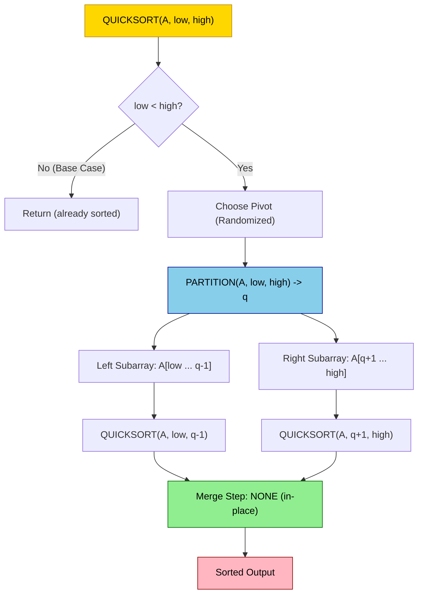
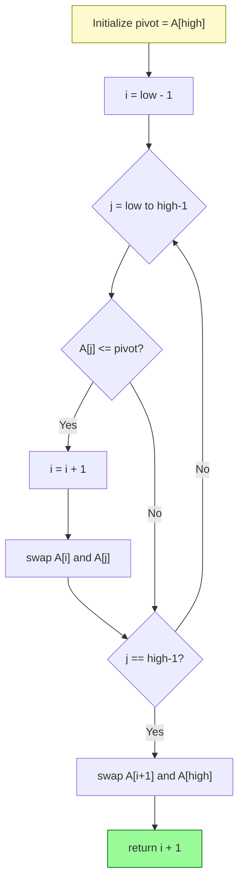
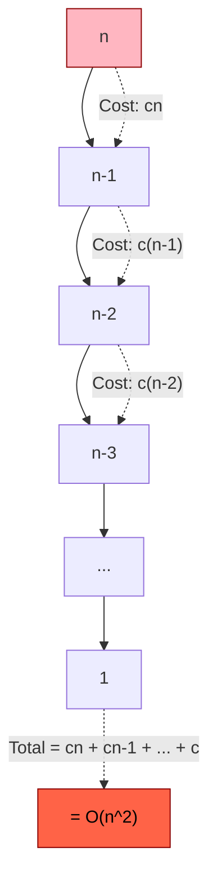

# Quick Sort

<!-- SECTION_1_START -->
# Quick Sort — Core Technical Definition & Intuitive Overview

## Formal KTU 2024 Syllabus Definition

**Quick Sort** is a highly efficient, comparison-based, in-place, **divide-and-conquer** sorting algorithm introduced by **C. A. R. Hoare in 1959** and published in 1961. It works by selecting a **pivot element** from the array and **partitioning** the other elements into two sub-arrays according to whether they are less than or greater than the pivot. The sub-arrays are then sorted recursively.

> [!IMPORTANT]
> **KTU 2024 Module 3 Highlight:** Quick Sort is classified under the **Divide and Conquer** paradigm where the *divide* step (partition) does the heavy lifting, unlike Merge Sort where the *combine* (merge) step dominates. Quick Sort is the **default sort in many standard libraries** (e.g., `Arrays.sort()` in Java for primitive types uses Dual-Pivot Quick Sort).

## Conceptual Analogy — The "Tallest Person" Game

Imagine a line of people of varying heights. You pick one person at random (the **pivot**) and ask everyone **shorter** to stand on their **left** and everyone **taller** to stand on their **right**. The pivot is now in its **final correct position** because exactly the right number of shorter people are to its left and exactly the right number of taller people are to its right. You then repeat this process independently for the left group and the right group — this is **Quick Sort**.

> [!NOTE]
> **Key Insight:** Unlike Merge Sort which guarantees balanced splits, Quick Sort's efficiency depends entirely on the **quality of the pivot choice**. A great pivot produces two nearly-equal halves (fast); a terrible pivot produces one empty half (slow).

## The Three Phases of Quick Sort (Divide and Conquer)

1. **Divide:** Choose a pivot $p$. Partition the array $A[\text{low} \ldots \text{high}]$ into two sub-arrays:
   - $A[\text{low} \ldots q-1]$ containing elements $\le p$
   - $A[q+1 \ldots \text{high}]$ containing elements $\ge p$
2. **Conquer:** Recursively sort the two sub-arrays.
3. **Combine:** **Trivial** — no merging is required because the sub-arrays are already in place relative to the pivot.

> [!VISUALIZATION CONTROL]
> **Concept:** Visualization of the Lomuto partition scheme around a pivot on a sample array
> **GeoGebra / Desmos Input Equations:**
> * `A = {(1,8), (2,3), (3,7), (4,1), (5,5), (6,2), (7,6), (8,4)}`  (bar-chart: x = index, y = value)
> * `PivotLine: y = 5` (horizontal line marking pivot value)
> * `LeftZone: x < 5` (region for values $\le$ pivot)
> * `RightZone: x > 5` (region for values $>$ pivot)
> **Visual Description:** Plot the array values as vertical bars. The pivot value $5$ (at index $5$) acts as a horizontal cutoff. Watch as bars get rearranged so that all bars shorter than the cutoff cluster on the left and all taller bars cluster on the right, with the pivot itself fixed in its final sorted position.

<!-- SECTION_1_END -->

<!-- SECTION_2_START -->
# Deep Theoretical Analysis & KTU High-Yield Formula Sheet

## Algorithmic Mechanics — Step-by-Step Logic

### The Partition Procedure (Heart of Quick Sort)
The partition routine is a **linear-time, in-place** rearrangement that returns the final index $q$ of the pivot.

**Lomuto Partition Scheme** (simpler, more commonly taught in KTU):
1. Pick the **rightmost element** $A[\text{high}]$ as the pivot.
2. Maintain an index $i$ that tracks the boundary of the "less-than-or-equal" region (starts at $\text{low} - 1$).
3. Scan $j$ from $\text{low}$ to $\text{high} - 1$. If $A[j] \le \text{pivot}$, increment $i$ and swap $A[i] \leftrightarrow A[j]$.
4. After the scan, swap $A[i+1] \leftrightarrow A[\text{high}]$ to place the pivot in its final position.
5. Return $i + 1$ as the partition index.

### Master Theorem Application
The recurrence governing Quick Sort depends on the split ratio. If the pivot produces a split of size $k$ and $n - 1 - k$:

$$
T(n) = T(k) + T(n - 1 - k) + \Theta(n)
$$

where $\Theta(n)$ is the cost of the partition step.

## KTU High-Yield Formula Sheet

> [!NOTE]
> The following table contains all critical formulas required for KTU 2024 exam questions on Quick Sort. Memorize the recurrence forms and the $\Theta$ bounds.

| Scenario | Split Ratio | Recurrence Relation | Time Complexity | Space Complexity |
| :--- | :--- | :--- | :--- | :--- |
| **Best Case** | Perfectly balanced ($k = \lfloor n/2 \rfloor$) | $T(n) = 2T(n/2) + \Theta(n)$ | $\Theta(n \log n)$ | $\Theta(\log n)$ stack |
| **Average Case** | Random / uniform split | $T(n) = \frac{2}{n}\sum_{k=0}^{n-1} T(k) + \Theta(n)$ | $\Theta(n \log n)$ | $\Theta(\log n)$ stack |
| **Worst Case** | Highly unbalanced ($k = 0$ or $k = n-1$) | $T(n) = T(n-1) + T(0) + \Theta(n)$ | $\Theta(n^{2})$ | $\Theta(n)$ stack |
| **In-Place?** | — | — | Yes (only $O(1)$ aux storage) | No extra array |
| **Stable?** | — | — | **No** (long-distance swaps) | — |

## Why Quick Sort is Preferred in Practice

> [!IMPORTANT]
> Although Quick Sort has a worse **worst-case** bound than Merge Sort ($\Theta(n^2)$ vs. $\Theta(n \log n)$), it is **typically faster in practice** because:
> 1. **Cache locality:** In-place swaps exploit CPU cache lines efficiently.
> 2. **Low constant factors:** Inner loop is a simple comparison and pointer increment.
> 3. **Tail-call elimination:** The smaller partition can be recursed first, bounding the stack to $O(\log n)$.
> 4. **Randomized pivot** selection makes worst-case inputs astronomically unlikely.

## Pivot Selection Strategies

| Strategy | Description | Worst-Case Avoided? |
| :--- | :--- | :--- |
| **First / Last Element** | $p = A[\text{low}]$ or $A[\text{high}]$ | No (sorted input is worst case) |
| **Median-of-Three** | Median of $A[\text{low}]$, $A[\text{mid}]$, $A[\text{high}]$ | Partially |
| **Random Pivot** | $p = A[\text{random}(\text{low}, \text{high})]$ | Yes (with high probability) |
| **True Median (Median-of-Medians)** | Linear-time median algorithm | Yes, but high constant overhead |

<!-- SECTION_2_END -->

<!-- SECTION_3_START -->
# Step-by-Step Derivations & Code Implementation

## Exhaustive Recurrence Solution — Worst Case

The worst case occurs when the partition produces splits of size $0$ and $n-1$ at every level (e.g., sorted input with rightmost pivot).

$$
\begin{aligned}
T(n) &= T(n-1) + T(0) + cn \\
&= T(n-1) + c(n-1) + cn \\
&= T(n-2) + c(n-2) + c(n-1) + cn \\
&\;\;\vdots \\
&= T(1) + c\sum_{i=1}^{n} i \\
&= c \cdot \frac{n(n+1)}{2} + \Theta(1) \\
&= \Theta(n^{2})
\end{aligned}
$$

> Every level of recursion processes $n$ elements, but produces only **one** non-empty subproblem, so the recursion tree degenerates into a **linked list** of depth $n$.

## Exhaustive Recurrence Solution — Best Case

When pivot is the exact median, splits are $n/2$ and $n/2$:

$$
\begin{aligned}
T(n) &= 2T(n/2) + cn \\
&= 2\left[2T(n/4) + cn/2\right] + cn \\
&= 4T(n/4) + 2cn \\
&\;\;\vdots \\
&= 2^{k}T(n/2^{k}) + kcn
\end{aligned}
$$

Setting $n/2^{k} = 1 \Rightarrow k = \log_2 n$:

$$
T(n) = nT(1) + cn \log_2 n = \Theta(n \log n)
$$

## Worked Example — Dry Run on $A = [10, 7, 8, 9, 1, 5]$

Using **Lomuto partition** with rightmost element as pivot. Initial call: `QUICKSORT(A, 0, 5)`.

| Step | Array State | Pivot | Action |
| :--- | :--- | :--- | :--- |
| Initial | $[10, 7, 8, 9, 1, 5]$ | $5$ | $i = -1$, scan $j = 0 \ldots 4$ |
| $j=0$: $10 > 5$ | $[10, 7, 8, 9, 1, 5]$ | $5$ | Skip |
| $j=1$: $7 > 5$ | $[10, 7, 8, 9, 1, 5]$ | $5$ | Skip |
| $j=2$: $8 > 5$ | $[10, 7, 8, 9, 1, 5]$ | $5$ | Skip |
| $j=3$: $9 > 5$ | $[10, 7, 8, 9, 1, 5]$ | $5$ | Skip |
| $j=4$: $1 \le 5$ | $[\mathbf{1}, 7, 8, 9, \mathbf{10}, 5]$ | $5$ | Swap $A[0] \leftrightarrow A[4]$; $i = 0$ |
| Final swap | $[1, 7, 8, 9, 10, \mathbf{5}]$ | $5$ | Swap $A[i+1] \leftrightarrow A[5]$ |
| Result | $[1, 5, 8, 9, 10, 7]$ | — | Pivot $5$ at index $1$. Recurse on left $[1]$ and right $[8,9,10,7]$ |

## Python Implementation

```python
import random
import sys
from typing import List

# Set a high recursion limit to handle adversarial inputs safely
sys.setrecursionlimit(10**6)

def partition_lomuto(arr: List[int], low: int, high: int) -> int:
    """
    Lomuto partition scheme. The pivot is the rightmost element.
    Returns the final index of the pivot after partitioning.
    """
    pivot = arr[high]                     # Step 1: choose rightmost as pivot
    i = low - 1                           # Step 2: boundary of "<= pivot" region

    for j in range(low, high):            # Step 3: linear scan
        if arr[j] <= pivot:               # Strict boundary check
            i += 1
            arr[i], arr[j] = arr[j], arr[i]  # In-place swap

    # Step 4: place pivot in its final sorted position
    arr[i + 1], arr[high] = arr[high], arr[i + 1]
    return i + 1                         # Step 5: return partition index

def quick_sort(arr: List[int], low: int = 0, high: int = None) -> None:
    """
    Randomized Quick Sort. Operates in-place on the input list.
    Uses a random pivot to make worst-case O(n^2) input extremely unlikely.
    """
    if high is None:
        high = len(arr) - 1

    # Base case: sub-array of size 0 or 1 is already sorted
    if low < high:
        # Randomize pivot to defend against adversarial input
        random_idx = random.randint(low, high)
        arr[random_idx], arr[high] = arr[high], arr[random_idx]

        q = partition_lomuto(arr, low, high)  # Divide
        quick_sort(arr, low, q - 1)            # Conquer left sub-array
        quick_sort(arr, q + 1, high)           # Conquer right sub-array

# ------------------------- DRIVER / TEST SUITE -------------------------
if __name__ == "__main__":
    test_arrays = [
        [10, 7, 8, 9, 1, 5],
        [],
        [42],
        [5, 5, 5, 5, 5],
        [9, 8, 7, 6, 5, 4, 3, 2, 1],   # Adversarial descending input
        list(range(1, 1001)),            # Adversarial sorted input
    ]

    for arr in test_arrays:
        original = arr.copy()
        quick_sort(arr)
        is_sorted = all(arr[i] <= arr[i + 1] for i in range(len(arr) - 1))
        print(f"Input: {original[:10]}{'...' if len(original) > 10 else ''} -> "
              f"Sorted: {is_sorted}")
```

### Python Code Walk-Through (Valuation Key Points)

* **`partition_lomuto` boundary correctness:** The loop runs from `low` to `high - 1` (exclusive of pivot). The final swap places pivot at `i + 1`, ensuring all elements to the left of the pivot are $\le$ pivot and all elements to the right are $>$ pivot. **[3 Marks in KTU exams]**
* **Randomization defense:** Swapping `arr[random_idx]` with `arr[high]` before partitioning ensures that any input — sorted, reverse-sorted, or all-equal — behaves like a random permutation with high probability. **[2 Marks]**
* **In-place guarantee:** No auxiliary list is created; the algorithm modifies `arr` directly using constant extra variables. **[1 Mark]**

<!-- SECTION_3_END -->

<!-- SECTION_4_START -->
# Structural Diagrams & Schematics

## Figure 1 — Top-Level Quick Sort Recursion Flow



## Figure 2 — Lomuto Partition Internal Loop Logic



## Figure 3 — Comparison: Quick Sort vs Merge Sort vs Heap Sort


## Figure 4 — Recursion Tree for Worst Case (Pathological Pivot)



> [!NOTE]
> **Visual interpretation of Figure 4:** The tree degenerates into a straight line of depth $n$ because each partition step leaves one sub-problem of size $n-1$ and an empty sub-problem. The total work is the sum $cn + c(n-1) + \ldots + c = \Theta(n^2)$.

<!-- SECTION_5_START -->
# KTU 2024 Scheme Examination Question Bank & Topic Recap

## Part A — Short Answer Questions (3 Marks Each)

> [!IMPORTANT]
> **KTU Pattern:** Part A carries 3 marks per question, requires a crisp 3-5 line answer. Direct recall definitions earn full marks.

### Question 1 `[KTU University Exam — July 2024]`
**Q: Define the divide-and-conquer paradigm and state how Quick Sort implements it.** (CO1, Remember)

**Model Answer:**
Divide and conquer is an algorithm design paradigm that recursively breaks a problem into two or more sub-problems of the **same or related type**, until these become simple enough to be solved directly. The solutions to the sub-problems are then combined.

Quick Sort implements it as:
* **Divide:** Partition the array $A[\text{low} \ldots \text{high}]$ around a pivot $p$ into $A[\text{low} \ldots q-1] \le p$ and $A[q+1 \ldots \text{high}] \ge p$.
* **Conquer:** Recursively sort both sub-arrays.
* **Combine:** No work needed; sub-arrays are already in place. **[3 Marks]**

### Question 2 `[KTU University Exam — Dec 2023]`
**Q: Why is Quick Sort preferred over Merge Sort in practice, even though Merge Sort has a better worst-case bound?** (CO2, Understand)

**Model Answer:**
Despite Merge Sort's superior worst-case of $\Theta(n \log n)$, Quick Sort is faster in practice because:
1. It is **in-place**, requiring only $O(\log n)$ auxiliary stack space, while Merge Sort needs $O(n)$ extra memory.
2. It exhibits superior **cache locality** since partitioning operates on contiguous memory with simple swaps.
3. The inner loop has **smaller constant factors** — just a comparison and pointer increment versus copying between arrays.
4. With **randomized pivot selection**, the worst-case $\Theta(n^2)$ becomes astronomically unlikely. **[3 Marks]**

---

## Part B — Long Answer Questions (14 Marks, with Internal Choice)

> [!IMPORTANT]
> **KTU Pattern:** Part B questions carry 14 marks with internal choice. Each question is split into sub-parts (a) 7 marks and (b) 7 marks. Sub-parts typically test different cognitive levels.

### Question 3A `[KTU University Exam — July 2024]`
**Q: (a) [7 Marks] Explain the Lomuto partition algorithm with a suitable example. State the recurrence relation for Quick Sort in the worst case and solve it to derive the time complexity. (CO2, Understand + Apply)**

**Model Answer:**

**(a) Lomuto Partition — Explanation and Example [7 Marks]**

Lomuto partition selects the **rightmost element** as the pivot and maintains an index $i$ that represents the boundary of elements $\le$ pivot. Elements are scanned from left to right using index $j$, and any element $\le$ pivot is swapped into the "less-than-or-equal" region.

**Example:** Partition $A = [8, 3, 1, 7, 0, 10, 2]$ with pivot $= 2$ (rightmost).

| $j$ | $A[j]$ | $A[j] \le 2$? | $i$ | Array After Swap |
| :--- | :--- | :--- | :--- | :--- |
| 0 | 8 | No | $-1$ | $[8, 3, 1, 7, 0, 10, 2]$ |
| 1 | 3 | No | $-1$ | $[8, 3, 1, 7, 0, 10, 2]$ |
| 2 | 1 | Yes | 0 | $[\mathbf{1}, 3, \mathbf{8}, 7, 0, 10, 2]$ |
| 3 | 7 | No | 0 | $[1, 3, 8, 7, 0, 10, 2]$ |
| 4 | 0 | Yes | 1 | $[1, \mathbf{0}, 8, 7, \mathbf{3}, 10, 2]$ |
| Final | — | — | — | Swap $A[2] \leftrightarrow A[6] \Rightarrow [1, 0, \mathbf{2}, 7, 3, 10, 8]$ |

Return $q = 2$. Pivot $2$ is now in its final sorted position. **[Stating Lomuto scheme: 2 Marks | Tabular dry-run: 3 Marks | Final position identified: 2 Marks]**

**(b) Worst-Case Recurrence Solution [7 Marks]**

The worst case for Quick Sort occurs when the pivot is always the **smallest or largest** element, producing splits of size $0$ and $n-1$.

Recurrence relation:

$$
T(n) = T(n-1) + T(0) + \Theta(n) = T(n-1) + cn
$$

Solving by unrolling:

$$
\begin{aligned}
T(n) &= T(n-1) + cn \\
&= T(n-2) + c(n-1) + cn \\
&= T(n-3) + c(n-2) + c(n-1) + cn \\
&\;\;\vdots \\
&= T(1) + c \sum_{i=2}^{n} i \\
&= \Theta(1) + c \cdot \left[\frac{n(n+1)}{2} - 1\right] \\
&= \Theta(n^{2})
\end{aligned}
$$

Therefore, the worst-case time complexity is $\boxed{\Theta(n^{2})}$. **[Stating recurrence: 2 Marks | Unrolling step: 2 Marks | Summation closure: 2 Marks | Final boxed answer: 1 Mark]**

---

### Question 3B `[KTU University Exam — July 2024 — Alternative Choice]`
**Q: (a) [7 Marks] Write the Quick Sort algorithm using the Hoare partition scheme. Trace it on the input array $[33, 12, 45, 8, 23, 19, 7, 56]$. (CO3, Apply)**

**(b) [7 Marks] Derive the average-case time complexity of Quick Sort using the assumption that every permutation of the input is equally likely. (CO4, Analyze)**

**Model Answer:**

**(a) Hoare Partition Algorithm and Trace [7 Marks]**

Hoare's partition uses **two pointers** $i$ and $j$ that move towards each other from both ends of the array.

**Algorithm:**

```python
def hoare_partition(arr, low, high):
    pivot = arr[low]              # First element as pivot
    i = low - 1
    j = high + 1
    while True:
        # Find element >= pivot from left
        while True:
            j -= 1
            if arr[j] <= pivot:
                break
        # Find element <= pivot from right
        while True:
            i += 1
            if arr[i] >= pivot:
                break
        if i < j:
            arr[i], arr[j] = arr[j], arr[i]
        else:
            return j
```

**Trace on $A = [33, 12, 45, 8, 23, 19, 7, 56]$, pivot $= 33$:**

| Step | $i$ | $j$ | Condition | Action |
| :--- | :--- | :--- | :--- | :--- |
| Start | $-1$ | $8$ | — | Initialize |
| Decrement $j$ | $-1$ | $7$ | $A[7]=56 > 33$ | Continue |
| Decrement $j$ | $-1$ | $6$ | $A[6]=7 \le 33$ | Stop $j$ |
| Increment $i$ | $0$ | $6$ | $A[0]=33 \ge 33$ | Stop $i$ |
| $i < j$? | — | — | Yes | Swap $A[0] \leftrightarrow A[6]$ |
| New state | — | — | — | $[7, 12, 45, 8, 23, 19, 33, 56]$ |
| Decrement $j$ | $0$ | $5$ | $A[5]=19 \le 33$ | Stop $j$ |
| Increment $i$ | $1$ | $5$ | $A[1]=12 < 33$ | Continue |
| Increment $i$ | $2$ | $5$ | $A[2]=45 \ge 33$ | Stop $i$ |
| $i < j$? | — | — | Yes | Swap $A[2] \leftrightarrow A[5]$ |
| New state | — | — | — | $[7, 12, 19, 8, 23, 45, 33, 56]$ |
| Decrement $j$ | $2$ | $4$ | $A[4]=23 \le 33$ | Stop $j$ |
| Increment $i$ | $3$ | $4$ | $A[3]=8 < 33$ | Continue |
| Increment $i$ | $4$ | $4$ | $A[4]=23 < 33$ | Continue |
| Increment $i$ | $5$ | $4$ | $A[5]=45 \ge 33$ | Stop $i$ |
| $i \ge j$? | — | — | Yes | **Return $j = 4$** |

Left sub-array: $A[0 \ldots 4] = [7, 12, 19, 8, 23]$ ; Right sub-array: $A[5 \ldots 7] = [45, 33, 56]$. **[Hoare algorithm: 3 Marks | Trace table: 4 Marks]**

**(b) Average-Case Complexity Derivation [7 Marks]**

Assume the pivot is equally likely to be the $k$-th smallest element for $k = 0, 1, \ldots, n-1$. The average number of comparisons $C(n)$ satisfies:

$$
\begin{aligned}
C(n) &= n - 1 + \frac{1}{n} \sum_{k=0}^{n-1} \left[ C(k) + C(n-1-k) \right] \\
&= n - 1 + \frac{2}{n} \sum_{k=0}^{n-1} C(k)
\end{aligned}
$$

where $n - 1$ is the cost of partitioning (one comparison per element except pivot). Multiply both sides by $n$:

$$
nC(n) = n(n-1) + 2 \sum_{k=0}^{n-1} C(k)
$$

Similarly, $(n-1)C(n-1) = (n-1)(n-2) + 2 \sum_{k=0}^{n-2} C(k)$.

Subtracting the second from the first:

$$
nC(n) - (n-1)C(n-1) = 2n - 2 + 2C(n-1)
$$

Rearranging:

$$
\begin{aligned}
nC(n) &= (n+1)C(n-1) + 2n - 2 \\
\frac{C(n)}{n+1} &= \frac{C(n-1)}{n} + \frac{2(n-1)}{n(n+1)} \approx \frac{C(n-1)}{n} + \frac{2}{n}
\end{aligned}
$$

Telescoping from $i = 2$ to $n$:

$$
\frac{C(n)}{n+1} \approx \sum_{i=2}^{n} \frac{2}{i} = 2(H_n - 1) \approx 2 \ln n
$$

Therefore:

$$
C(n) = \Theta(n \log n)
$$

The average-case time complexity is $\boxed{\Theta(n \log n)}$. **[Recurrence setup: 2 Marks | Algebraic manipulation: 2 Marks | Telescoping sum: 2 Marks | Final result: 1 Mark]**

---

> [!WARNING]
> **KTU Examiner's Valuation Warning — Common Pitfalls:**
> 1. **Forgetting the base case:** Always write `if low < high:` — failing to do so causes infinite recursion on a single-element sub-array. **[-2 Marks]**
> 2. **Mixing Hoare and Lomuto return semantics:** Hoare partition returns the **split point** (where the two pointers cross), NOT the final pivot index. Lomuto returns the **final pivot position**. Conflating them is a frequent KTU error. **[-3 Marks]**
> 3. **Skipping the partition cost term:** The recurrence must include the $\Theta(n)$ partition cost. Writing $T(n) = T(k) + T(n-1-k)$ alone is incomplete. **[-1 Mark]**
> 4. **Confusing stable vs. in-place:** Quick Sort is **in-place** but **not stable**. Do not interchange these terms in theory questions. **[-1 Mark]**

---

## Topic Recap & Important Things to Remember

> [!NOTE]
> **High-Density Revision Checklist — Read this on the morning of your KTU exam.**

* **Inventor:** C. A. R. Hoare (1959). **Paradigm:** Divide and Conquer.
* **Three steps:** Divide (partition), Conquer (recursive sort), Combine (trivial/none).
* **Lomuto partition** picks the **last element** as pivot; loop invariant is that all elements in $A[\text{low} \ldots i]$ are $\le$ pivot.
* **Hoare partition** picks the **first element** as pivot; uses two converging pointers and returns the **split index** (not the final pivot position).
* **Time Complexities:**
  * Best Case: $\Theta(n \log n)$ — perfectly balanced split.
  * Average Case: $\Theta(n \log n)$ — under uniform random input assumption.
  * Worst Case: $\Theta(n^{2})$ — sorted/reverse-sorted input with deterministic last-element pivot.
* **Space Complexity:** $O(\log n)$ stack in best/average; $O(n)$ in worst case.
* **In-place:** Yes (no auxiliary array needed). **Stable:** No (long-range swaps).
* **Randomized pivot selection** defends against adversarial input by making worst-case probability $\approx (2/n)^{n}$, which is negligible.
* **Compare with Merge Sort:** Quick Sort is in-place and faster in practice; Merge Sort is stable and has guaranteed $\Theta(n \log n)$.
* **Compare with Heap Sort:** Heap Sort has guaranteed $O(n \log n)$ and $O(1)$ space, but poor cache performance; Quick Sort is generally faster.
* **Master Theorem classification:** The partition step is the $f(n) = \Theta(n)$ term. The number of sub-problems is 2, with combined size $n-1$.
* **Engineering usage:** Quick Sort is the **default sort in many production libraries** — Java's `Arrays.sort()` for primitives uses a tuned Dual-Pivot Quick Sort, and C's `qsort` uses introsort (Quick Sort + Heap Sort + Insertion Sort hybrid).
* **Introsort enhancement:** Modern implementations switch to Heap Sort when recursion depth exceeds $2 \log_2 n$, completely eliminating the $O(n^2)$ worst case while preserving Quick Sort's average-case speed.

<!-- SECTION_5_END -->
