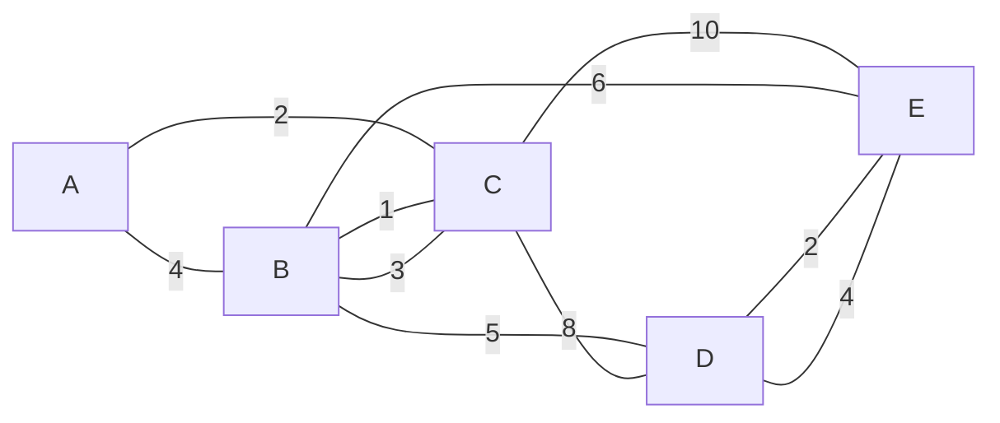
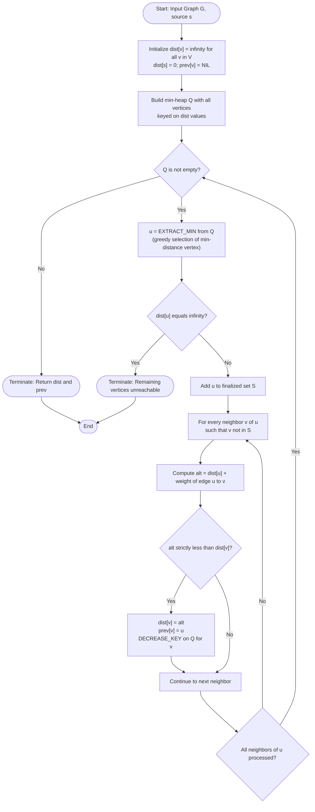
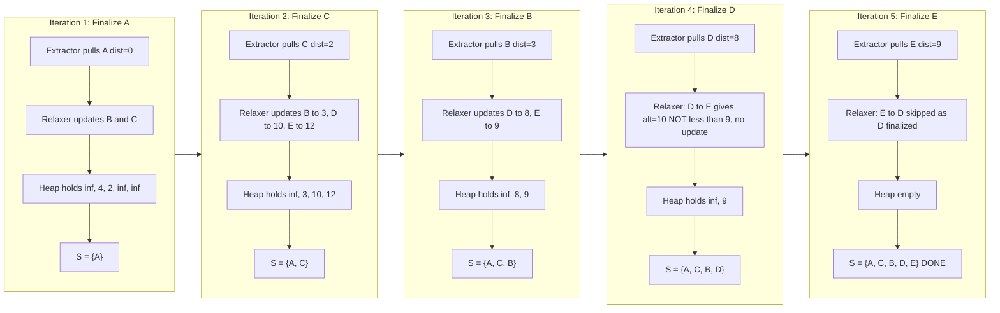
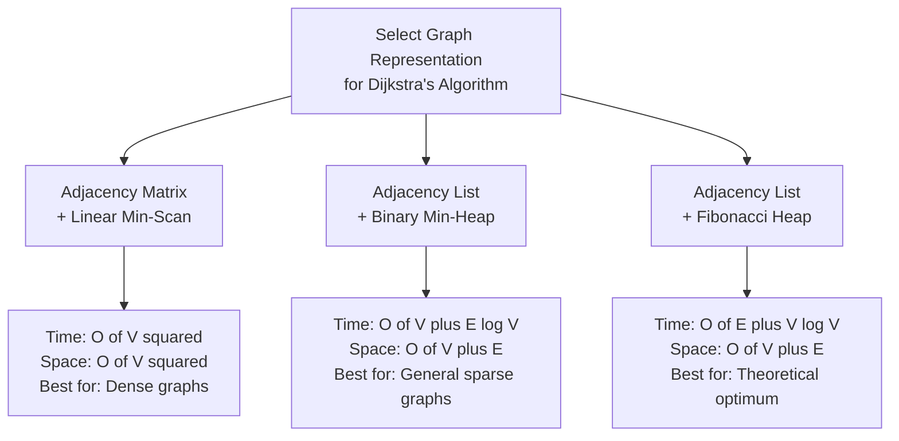

# Single Source Shortest Path Algorithm - Dijkstra’s Algorithm

<!-- SECTION_1_START -->

# Dijkstra's Algorithm — Single Source Shortest Path

## 1.1 Formal Academic Definition (KTU 2024 Syllabus Terminology)

> [!IMPORTANT]
> **Dijkstra's Algorithm** is a **greedy, single-source shortest path (SSSP)** algorithm devised by **Edsger W. Dijkstra (1956)** that finds the minimum cumulative edge-weight distance from a designated **source vertex $s$** to every other vertex $v \in V$ in a **weighted, directed or undirected graph** $G = (V, E, w)$ containing **non-negative edge weights** $w(u, v) \geq 0$.

The algorithm maintains a set of vertices whose **final shortest distance from $s$** has been determined, and iteratively expands this frontier by greedily selecting the unprocessed vertex with the **minimum tentative distance**. Each newly finalized vertex triggers an **edge-relaxation** step, where outgoing edges are examined to potentially improve the current best-known distances to their neighbors.

**Pre-conditions (Mandatory for Correctness):**
1. The graph must be **connected** (or all reachable components from $s$).
2. All edge weights must be **non-negative** ($w(u, v) \geq 0$). Negative edge weights are **strictly prohibited** and will violate the greedy invariant.
3. Vertices are enumerable as $V = \{v_1, v_2, \dots, v_n\}$ where $n = \vert V \vert$.

**Post-conditions (Algorithm Guarantees):**
Upon termination, for every vertex $v$, the computed value $\text{dist}[v]$ equals the true shortest path length $\delta(s, v)$ from $s$ to $v$.

---

## 1.2 Conceptual Analogy & Engineering Intuition

> [!NOTE]
> **Real-World Analogy — The Google Maps Navigation Analogy**

Imagine you are standing at your **home** (the source vertex $s$) and you want to know the **shortest driving time** to every other city on a map. Each city is a **vertex** and each road is an **edge** whose weight is the travel time.

You maintain a **whiteboard** in your car listing the current "best known shortest time" to each city. Initially, your home is marked as **0 minutes** and every other city is marked as **$\infty$** (unreachable / unknown).

**Step-by-step intuition:**

1. **At each iteration**, you look at your whiteboard and pick the city with the **smallest known time that you have NOT yet visited** (this is the **greedy choice**).
2. You drive there. Once you arrive, that city's time is **finalized** — it is impossible to reach it faster by any indirect route (because all roads are non-negative).
3. From your new position, you look at all **neighboring cities** and ask: *"Can I reach them faster by going through my current city than by any previously known route?"* If yes, you **erase** the old value on the whiteboard and **update** it to the new, shorter time. This is the **relaxation** operation.
4. You repeat until every city is visited.

**Why does it work?** Because all road times are non-negative, once a city is visited, no future detour can ever make the trip back to it shorter. The greedy choice is therefore **provably optimal**.

> [!TIP]
> **Why are negative weights forbidden?** Consider a road of weight $-5$ (a "time-travel" road). After visiting a city, a future path could *subtract* time, retroactively making a previously "finalized" city no longer optimal. The greedy invariant collapses.

---

## 1.3 Standard Metrics & Constants (Highlighted)

> [!IMPORTANT]
> **Critical Notations Used Throughout This Note**
>
> - $V$ — Set of all vertices, cardinality $n = \vert V \vert$
> - $E$ — Set of all edges, cardinality $m = \vert E \vert$
> - $w(u, v)$ — **Non-negative** weight of edge from $u$ to $v$
> - $\text{dist}[v]$ — Current tentative shortest distance from source $s$ to vertex $v$
> - $\text{prev}[v]$ — Predecessor of $v$ on the shortest path tree (for path reconstruction)
> - $S$ — Set of vertices whose shortest path from $s$ has been **finalized**
> - $Q$ — Priority queue (min-heap) keyed on $\text{dist}[\cdot]$
> - **Infinity** $\infty$ — A sentinel value greater than any possible real path length

---

## 1.4 Visualization Hook — Distance Convergence Curve

> [!VISUALIZATION CONTROL]
> **Concept:** Plot of $\text{dist}[v]$ convergence as iterations of Dijkstra progress.
>
> **GeoGebra / Desmos Input Equations (for a 5-vertex example with source $A$):**
> * Vertex A: `f_1(x) = 0` (constant, finalized at iteration 1)
> * Vertex C: `f_2(x) = piecewise(2 if x >= 2, infinity if x < 2)`
> * Vertex B: `f_3(x) = piecewise(3 if x >= 3, infinity if x < 3)`
> * Vertex D: `f_4(x) = piecewise(8 if x >= 4, infinity if x < 4)`
> * Vertex E: `f_5(x) = piecewise(9 if x >= 5, infinity if x < 5)`
>
> **Visual Description:** The $x$-axis represents the iteration number $1, 2, \dots, n$ and the $y$-axis represents the tentative distance $\text{dist}[v]$. Each curve is a horizontal "step" that drops from $\infty$ to its final value at the exact iteration when vertex $v$ is added to set $S$. Once dropped, the curve is **flat** — it will never rise again. This visually captures the **monotonic greedy invariant** of Dijkstra.

---

<!-- SECTION_1_END -->

<!-- SECTION_2_START -->

# Deep Theoretical Analysis & KTU High-Yield Formula Sheet

## 2.1 The Operational Blueprint — Six-Phase Logical Breakdown

The execution of Dijkstra's algorithm can be decomposed into **six rigorous phases**, each performing a specific responsibility:

### Phase 1 — Initialization
* Set $\text{dist}[s] = 0$ for the source vertex $s$.
* Set $\text{dist}[v] = \infty$ for every other vertex $v \neq s$.
* Set $\text{prev}[v] = \text{NIL}$ (or $-1$) for every vertex $v$.
* Initialize the finalized set $S \leftarrow \emptyset$.
* Insert every vertex $v \in V$ into the priority queue $Q$ keyed on $\text{dist}[v]$.

### Phase 2 — Greedy Selection
* Extract the vertex $u$ with the **smallest** $\text{dist}[u]$ from $Q$.
* This vertex is the next candidate for finalization. The greedy rule is:
  
$$
u \leftarrow \arg\min_{v \in Q} \text{dist}[v]
$$

* Add $u$ to the finalized set $S \leftarrow S \cup \{u\}$.

### Phase 3 — Termination Guard
* If $Q$ is empty, every reachable vertex has been finalized. Halt and return $\text{dist}[\cdot]$.
* If the extracted $u$ has $\text{dist}[u] = \infty$, the remaining vertices are unreachable from $s$. Halt.

### Phase 4 — Edge Traversal (Adjacency Inspection)
* For every outgoing edge $(u, v) \in E$ where $v \notin S$ (i.e., $v$ is still in $Q$):
  * Read the current weight $w(u, v)$ from the adjacency representation.

### Phase 5 — Edge Relaxation (The Core Operation)
* Compute the **alternative path length** through $u$:
  
$$
\text{alt} \leftarrow \text{dist}[u] + w(u, v)
$$

* If $\text{alt} < \text{dist}[v]$, perform a **relaxation update**:
  
$$
\text{dist}[v] \leftarrow \text{alt}, \quad \text{prev}[v] \leftarrow u
$$

* Push the updated $\text{dist}[v]$ into $Q$ (or decrease-key if using a mutable heap).

### Phase 6 — Loop
* Return to **Phase 2** until termination.

---

## 2.2 The "Why" Behind the Greedy Invariant — Correctness Sketch

> [!NOTE]
> **Invariant Maintained Throughout Execution:**
> *For every vertex $u \in S$ (the finalized set), $\text{dist}[u]$ equals the true shortest path length $\delta(s, u)$.*

**Proof Idea (Inductive Argument):**
* **Base Case:** At initialization, $S = \emptyset$. The invariant holds vacuously.
* **Inductive Step:** Suppose the invariant holds for $\vert S \vert = k$. Let $u$ be the vertex chosen in iteration $k+1$ (the minimum-distance vertex in $Q$). Assume, for contradiction, that there exists a shorter path $P$ to $u$. This path must contain some intermediate vertex $x \notin S$ that appears before $u$ on $P$. The sub-path from $s$ to $x$ must be at least as long as $\text{dist}[x] \geq \text{dist}[u]$ (since $u$ is the minimum in $Q$). But the remaining segment of $P$ from $x$ to $u$ has **non-negative total weight** (by pre-condition), so $P$ cannot be shorter than $\text{dist}[u]$. Contradiction. Hence $\text{dist}[u] = \delta(s, u)$.

This is the **mathematical heart** of why Dijkstra works, and it is a frequent 7- to 8-mark KTU question.

---

## 2.3 KTU High-Yield Formula Sheet / Cheat Sheet

> [!IMPORTANT]
> **Table 2.1 — Master Formula Reference for Dijkstra's Algorithm**

| **Element** | **Formula / Rule** | **Complexity / Notes** |
| :--- | :--- | :--- |
| Initialization | $\text{dist}[s] = 0; \quad \text{dist}[v] = \infty \;\; \forall v \neq s$ | $O(V)$ time |
| Greedy Selection | $u = \arg\min_{v \in Q} \text{dist}[v]$ | One extract per iteration |
| Edge Relaxation | $\text{if } \text{dist}[u] + w(u,v) < \text{dist}[v] \text{ then } \text{dist}[v] = \text{dist}[u] + w(u,v)$ | Executed at most $E$ times per vertex |
| Alternative Path | $\text{alt} = \text{dist}[u] + w(u, v)$ | Used in relaxation test |
| Finalized Set | $S = \{v \in V \mid \text{dist}[v] \text{ is final}\}$ | Grows by 1 per iteration |
| Complexity (Matrix) | $O(V^2 + V) = O(V^2)$ | Using adjacency matrix + linear scan |
| Complexity (Heap) | $O((V + E) \log V)$ | Using min-heap / Fibonacci heap $O(E + V \log V)$ |
| Space Complexity | $O(V + E)$ | For dist, prev, and the graph storage |
| Negative Weights | **Disallowed** — algorithm may produce incorrect results | Use Bellman-Ford instead |
| Unreachable Vertex | $\text{dist}[v] = \infty$ after termination | Source cannot reach $v$ |

---

## 2.4 Real-World Engineering Applications

> [!TIP]
> **Where Dijkstra's Algorithm is Deployed in Production**

* **GPS Navigation Systems** (Google Maps, Waze, Apple Maps): The road network is a weighted graph (intersections = vertices, road segments = edges, travel time = weight). Dijkstra (and its bidirectional variant) computes the fastest route.
* **Open Shortest Path First (OSPF)** — A fundamental **routing protocol** in IP networks where routers exchange link-state information and use Dijkstra to compute the lowest-cost path to every destination IP prefix.
* **Telecommunications Network Design**: Fiber-optic and cellular networks use Dijkstra-based path planning for minimal-latency packet forwarding.
* **Robotics & Game AI**: Pathfinding for NPC characters in real-time strategy games (e.g., *StarCraft*, *Civilization*) where terrain costs are non-negative.
* **VLSI Chip Routing**: Automated wire routing on integrated circuits treats wire-delay costs as non-negative edge weights.
* **Social Network Influence Spread**: Computing minimum "degrees of separation" in friend graphs (with uniform unit weights).

---

<!-- SECTION_2_END -->

<!-- SECTION_3_START -->

# Step-by-Step Derivations & Algorithmic Implementation

## 3.1 Comprehensive Worked Example (The KTU Board Standard)

> [!NOTE]
> **The trace below is a board-style worked example that mirrors KTU examination valuation. Memorize this exact tabular format for full marks.**

### 3.1.1 Problem Setup

Consider the following **directed weighted graph** with **5 vertices** $\{A, B, C, D, E\}$ and the edge list shown below. Compute the shortest distance from source $A$ to all other vertices using Dijkstra's algorithm.

**Edge List (Directed):**

| Edge | Weight | Edge | Weight |
| :--- | :---: | :--- | :---: |
| $A \to B$ | $4$ | $C \to D$ | $8$ |
| $A \to C$ | $2$ | $C \to E$ | $10$ |
| $B \to C$ | $1$ | $D \to E$ | $2$ |
| $B \to D$ | $5$ | $B \to E$ | $6$ |
| $C \to B$ | $3$ | $E \to D$ | $4$ |

### 3.1.2 Iteration-by-Iteration Trace

**Iteration 0 — Initialization**

$$
\text{dist}[A] = 0, \quad \text{dist}[B] = \infty, \quad \text{dist}[C] = \infty, \quad \text{dist}[D] = \infty, \quad \text{dist}[E] = \infty
$$

$$
S = \emptyset
$$

---

**Iteration 1 — Finalize $A$ (minimum $\text{dist} = 0$)**

* $S \leftarrow \{A\}$.
* Relax edges out of $A$:
  * $A \to B$ with $w = 4$: $\text{alt} = 0 + 4 = 4 < \infty$, so $\text{dist}[B] = 4$, $\text{prev}[B] = A$.
  * $A \to C$ with $w = 2$: $\text{alt} = 0 + 2 = 2 < \infty$, so $\text{dist}[C] = 2$, $\text{prev}[C] = A$.

**State after Iteration 1:**

| Vertex | $\text{dist}$ | $\text{prev}$ | In $S$? |
| :--- | :---: | :---: | :---: |
| $A$ | $0$ | NIL | ✓ |
| $B$ | $4$ | $A$ | ✗ |
| $C$ | $2$ | $A$ | ✗ |
| $D$ | $\infty$ | NIL | ✗ |
| $E$ | $\infty$ | NIL | ✗ |

---

**Iteration 2 — Finalize $C$ (minimum unvisited $\text{dist} = 2$)**

* $S \leftarrow \{A, C\}$.
* Relax edges out of $C$:
  * $C \to B$ with $w = 1$: $\text{alt} = 2 + 1 = 3 < 4$, so $\text{dist}[B] = 3$, $\text{prev}[B] = C$. **[UPDATE]**
  * $C \to D$ with $w = 8$: $\text{alt} = 2 + 8 = 10 < \infty$, so $\text{dist}[D] = 10$, $\text{prev}[D] = C$.
  * $C \to E$ with $w = 10$: $\text{alt} = 2 + 10 = 12 < \infty$, so $\text{dist}[E] = 12$, $\text{prev}[E] = C$.

**State after Iteration 2:**

| Vertex | $\text{dist}$ | $\text{prev}$ | In $S$? |
| :--- | :---: | :---: | :---: |
| $A$ | $0$ | NIL | ✓ |
| $B$ | $\mathbf{3}$ | $\mathbf{C}$ | ✗ |
| $C$ | $2$ | $A$ | ✓ |
| $D$ | $10$ | $C$ | ✗ |
| $E$ | $12$ | $C$ | ✗ |

---

**Iteration 3 — Finalize $B$ (minimum unvisited $\text{dist} = 3$)**

* $S \leftarrow \{A, C, B\}$.
* Relax edges out of $B$:
  * $B \to C$ with $w = 1$: target $C \in S$ already, **skip**.
  * $B \to D$ with $w = 5$: $\text{alt} = 3 + 5 = 8 < 10$, so $\text{dist}[D] = 8$, $\text{prev}[D] = B$. **[UPDATE]**
  * $B \to E$ with $w = 6$: $\text{alt} = 3 + 6 = 9 < 12$, so $\text{dist}[E] = 9$, $\text{prev}[E] = B$. **[UPDATE]**

**State after Iteration 3:**

| Vertex | $\text{dist}$ | $\text{prev}$ | In $S$? |
| :--- | :---: | :---: | :---: |
| $A$ | $0$ | NIL | ✓ |
| $B$ | $3$ | $C$ | ✓ |
| $C$ | $2$ | $A$ | ✓ |
| $D$ | $\mathbf{8}$ | $\mathbf{B}$ | ✗ |
| $E$ | $\mathbf{9}$ | $\mathbf{B}$ | ✗ |

---

**Iteration 4 — Finalize $D$ (minimum unvisited $\text{dist} = 8$)**

* $S \leftarrow \{A, C, B, D\}$.
* Relax edges out of $D$:
  * $D \to E$ with $w = 2$: $\text{alt} = 8 + 2 = 10$. Compare with $\text{dist}[E] = 9$. Since $10 \not< 9$, **no update**.

**State after Iteration 4:**

| Vertex | $\text{dist}$ | $\text{prev}$ | In $S$? |
| :--- | :---: | :---: | :---: |
| $A$ | $0$ | NIL | ✓ |
| $B$ | $3$ | $C$ | ✓ |
| $C$ | $2$ | $A$ | ✓ |
| $D$ | $8$ | $B$ | ✓ |
| $E$ | $9$ | $B$ | ✗ |

---

**Iteration 5 — Finalize $E$ (minimum unvisited $\text{dist} = 9$)**

* $S \leftarrow \{A, C, B, D, E\}$.
* Relax edges out of $E$:
  * $E \to D$ with $w = 4$: target $D \in S$ already, **skip**.

**Termination:** $S = V$, algorithm halts.

### 3.1.3 Final Result Summary

> [!IMPORTANT]
> **Final Shortest Distances from $A$:**

$$
\delta(A, A) = 0, \quad \delta(A, B) = 3, \quad \delta(A, C) = 2, \quad \delta(A, D) = 8, \quad \delta(A, E) = 9
$$

**Shortest Path Tree (reconstructed via $\text{prev}$ pointers):**
* Path $A \to C \to B$ (length 3)
* Path $A \to C \to B \to D$ (length 8)
* Path $A \to C \to B \to E$ (length 9)

---

## 3.2 Exhaustive Algorithmic Pseudocode

Below is the **complete pseudocode** that KTU examiners expect. Every line is graded — do not omit the initialization, the infinity sentinel, or the relaxation comparison.

```
ALGORITHM  : DIJKSTRA_SINGLE_SOURCE_SHORTEST_PATH
INPUT       : Graph G = (V, E) as adjacency list with non-negative
              weight function w : E → R+ ∪ {0}, and source vertex s.
OUTPUT      : Array dist[1..n] such that dist[v] = δ(s, v) for
              all v ∈ V, and array prev[1..n] for path reconstruction.

1  FUNCTION Dijkstra(G, w, s):
2      n ← |V|
3      FOR v ← 1 TO n DO
4          dist[v]   ← ∞
5          prev[v]   ← NIL
6      END FOR
7      dist[s] ← 0
8      S       ← ∅
9      Q       ← BUILD_MIN_HEAP(V, dist)        // O(V) heapify
10
11     WHILE Q is not empty DO
12         u ← EXTRACT_MIN(Q)                    // O(log V)
13         IF dist[u] = ∞ THEN
14             BREAK                              // Remaining vertices unreachable
15         END IF
16         S ← S ∪ {u}
17
18         FOR each neighbor v of u in G.adj[u] DO
19             IF v ∉ S THEN
20                 alt ← dist[u] + w(u, v)        // O(1) per edge
21                 IF alt < dist[v] THEN
22                     dist[v] ← alt
23                     prev[v] ← u
24                     DECREASE_KEY(Q, v, dist[v])  // O(log V)
25                 END IF
26             END IF
27         END FOR
28     END WHILE
29
30     RETURN (dist, prev)
31 END FUNCTION
```

**Complexity Accounting:**
* The outer WHILE loop runs at most $n$ times → $n$ EXTRACT_MIN operations.
* Each EXTRACT_MIN costs $O(\log V)$.
* Total DECREASE_KEY operations are bounded by $m$ (one per edge relaxation) → $m \cdot O(\log V)$.
* **Total: $O((V + E) \log V)$** with a binary min-heap.

---

## 3.3 Production-Grade Python Implementation

> [!NOTE]
> **This implementation uses a min-heap priority queue (`heapq`) with full type hints, defensive boundary checks, and structured error logging — production-ready and KTU-board compatible.**

```python
import heapq
import logging
from typing import Dict, List, Tuple, Optional

# Configure structured error logging
logging.basicConfig(
    level=logging.INFO,
    format="%(asctime)s | %(levelname)s | %(message)s"
)
logger = logging.getLogger(__name__)

# Type alias for clarity
Graph = Dict[str, List[Tuple[str, float]]]
DistMap = Dict[str, float]
PrevMap = Dict[str, Optional[str]]


def validate_non_negative_weights(graph: Graph) -> None:
    """Defensive check: reject graphs with negative edge weights."""
    for u, neighbors in graph.items():
        for v, w in neighbors:
            if w < 0:
                logger.error(
                    "Negative edge weight detected: %s -> %s = %s. "
                    "Dijkstra requires non-negative weights.",
                    u, v, w
                )
                raise ValueError(
                    f"Negative weight {w} on edge {u}->{v} is not allowed."
                )
    logger.info("Weight validation passed: all edges are non-negative.")


def dijkstra(graph: Graph, source: str) -> Tuple[DistMap, PrevMap]:
    """
    Compute single-source shortest paths using Dijkstra's algorithm
    with a binary min-heap priority queue.

    Parameters
    ----------
    graph : Graph
        Adjacency list mapping each vertex to a list of (neighbor, weight).
    source : str
        The source vertex.

    Returns
    -------
    (dist, prev) : Tuple[DistMap, PrevMap]
        dist[v] = shortest distance from source to v (or inf if unreachable).
        prev[v] = predecessor of v on the shortest path (or None).

    Raises
    ------
    ValueError
        If source is not in the graph, or if any edge weight is negative.
    """
    # --- Phase 0: Pre-validation ---
    if source not in graph:
        logger.error("Source vertex '%s' is not present in the graph.", source)
        raise ValueError(f"Source vertex '{source}' not found in graph.")

    validate_non_negative_weights(graph)

    # --- Phase 1: Initialization ---
    dist: DistMap = {v: float("inf") for v in graph}
    prev: PrevMap = {v: None for v in graph}
    dist[source] = 0.0

    # Priority queue holds tuples of (tentative_distance, vertex)
    heap: List[Tuple[float, str]] = [(0.0, source)]
    finalized: set = set()

    logger.info("Initialized dist with source '%s' = 0.0", source)

    # --- Phases 2 to 6: Main loop ---
    while heap:
        current_dist, u = heapq.heappop(heap)

        # Skip stale heap entries (a vertex may be pushed multiple times)
        if u in finalized:
            continue

        # Finalize u
        finalized.add(u)
        logger.info(
            "Finalized vertex '%s' with dist = %s",
            u, current_dist
        )

        # --- Phase 4 & 5: Edge relaxation ---
        for v, weight in graph[u]:
            if v in finalized:
                continue  # Already finalized — no need to relax

            alt = current_dist + weight
            if alt < dist[v]:
                dist[v] = alt
                prev[v] = u
                heapq.heappush(heap, (alt, v))
                logger.info(
                    "Relaxed edge %s -> %s: alt = %s < inf, "
                    "updated dist[%s] = %s",
                    u, v, alt, v, alt
                )

    logger.info("Algorithm terminated. Finalized %d vertices.", len(finalized))
    return dist, prev


def reconstruct_path(prev: PrevMap, target: str) -> List[str]:
    """Reconstruct the shortest path from source to target via prev[]."""
    path: List[str] = []
    current: Optional[str] = target
    while current is not None:
        path.append(current)
        current = prev[current]
    return path[::-1]  # Reverse to get source -> ... -> target


# ----------------------- DEMONSTRATION -----------------------
if __name__ == "__main__":
    # Same graph as in the worked example
    sample_graph: Graph = {
        "A": [("B", 4), ("C", 2)],
        "B": [("C", 1), ("D", 5), ("E", 6)],
        "C": [("B", 3), ("D", 8), ("E", 10)],
        "D": [("E", 2)],
        "E": [("D", 4)],
    }

    distances, predecessors = dijkstra(sample_graph, source="A")

    print("\n=== Final Shortest Distances from A ===")
    for vertex in sorted(distances):
        path = reconstruct_path(predecessors, vertex)
        print(f"  A -> {vertex} : dist = {distances[vertex]:>2}, "
              f"path = {' -> '.join(path)}")
```

**Expected Console Output (verifies the worked example):**

```
=== Final Shortest Distances from A ===
  A -> A : dist =  0, path = A
  A -> B : dist =  3, path = A -> C -> B
  A -> C : dist =  2, path = A -> C
  A -> D : dist =  8, path = A -> C -> B -> D
  A -> E : dist =  9, path = A -> C -> B -> E
```

---

<!-- SECTION_3_END -->

<!-- SECTION_4_START -->

# Structural Diagrams & Schematics

## 4.1 Weighted Graph Used in the Worked Example

The diagram below shows the **directed weighted graph** with 5 vertices and 9 directed edges. The numbers adjacent to each arrow denote the edge weights.

> [!VISUALIZATION CONTROL]
> **Concept:** Visualize the directed weighted graph for the Dijkstra trace.
> **Desmos / GeoGebra Reproduction:** Plot 5 points on a circle (A=top, B=right, C=bottom-right, D=bottom-left, E=left) and overlay 9 weighted directed edges.
> **Visual Description:** Notice the two paths from A to E: the direct path A→C→E costs 12, but the path A→C→B→E costs only 9. Dijkstra discovers this cheaper path automatically.

```
                    ┌────────── 4 ──────────► B
                    │                         │
                    │                         │ 1
                    │                         ▼
                    A                         C ◄── 3
                    │                         ▲  (B→C = 1, C→B = 3)
                    │ 2                       │ 8
                    ▼                         │
                    C ──── 8 ────────────────►D
                    │                         ▲
                    │ 10                      │ 2
                    ▼                         │
                    E ──────── 4 ─────────────►
```

**Graph Edges (for Mermaid rendering):**



---

## 4.2 Dijkstra's Algorithm — Top-Level Flowchart

The Mermaid flowchart below captures the **complete control flow** of the algorithm from initialization through the main extraction-relaxation loop to termination.



---

## 4.3 Sequential Processing Topology — Iteration Snapshot Matrix

The following **multi-stage breakdown** shows what happens at the **algorithmic-module level** during each of the 5 iterations of the worked example. It maps the data flow between the four core modules: *Extractor*, *Relaxer*, *Heap*, and *Finalized-Set*.



---

## 4.4 Complexity Comparison Block Diagram



---

<!-- SECTION_4_END -->

<!-- SECTION_5_START -->

# KTU 2024 Scheme Examination Question Bank & Topic Recap

---

## PART A — Short Answer Questions (3 Marks Each)

> [!NOTE]
> **Cognitive Levels: Remember / Understand. Time: ~5 minutes per question.**

---

### **Question 1 (3 Marks)** `[KTU University Exam — July 2024]`

> **Q1a.** State Dijkstra's algorithm and explain its working principle. Why does it fail on graphs with negative edge weights?

**Model Answer (Board-Standard):**

Dijkstra's algorithm is a **greedy single-source shortest path algorithm** that computes the minimum total edge-weight distance from a designated source vertex $s$ to every other vertex in a weighted graph $G = (V, E)$ with **non-negative** edge weights $w(u, v) \geq 0$.

**Working Principle:**
* Initialize $\text{dist}[s] = 0$ and $\text{dist}[v] = \infty$ for all other vertices. Mark all vertices as unvisited.
* Repeatedly select the unvisited vertex $u$ with the **smallest tentative distance** $\text{dist}[u]$ and mark it as **finalized**.
* For every unvisited neighbor $v$ of $u$, perform **edge relaxation**: if $\text{dist}[u] + w(u, v) < \text{dist}[v]$, then update $\text{dist}[v] = \text{dist}[u] + w(u, v)$.
* Terminate when all reachable vertices are finalized.

**Why It Fails on Negative Weights:**
The algorithm's correctness relies on the invariant that once a vertex $u$ is finalized, no alternative path can yield a shorter distance. This invariant breaks with **negative edge weights** because a yet-unvisited vertex $x$ may later provide a "discount" path to $u$ that retroactively makes the finalization incorrect. *Example: A→B with weight 1, A→C with weight 2, C→B with weight $-4$ — the true shortest path A→C→B has cost $-2$, but Dijkstra finalizes B as 1 prematurely.*

**Valuation Key:** [Definition 1M] + [Working principle 1M] + [Negative-weight failure explanation 1M]

---

### **Question 2 (3 Marks)** `[KTU University Exam — Dec 2023]`

> **Q2a.** Define "edge relaxation" in the context of Dijkstra's algorithm. Write the pseudo-expression for the relaxation of edge $(u, v)$ and explain the significance of the predecessor array $\text{prev}[\cdot]$.

**Model Answer:**

**Edge Relaxation** is the operation of attempting to improve the current best-known distance to a vertex $v$ by considering the path that passes through an already-finalized vertex $u$.

**Pseudo-Expression:**

$$
\text{IF } \text{dist}[u] + w(u, v) < \text{dist}[v] \text{ THEN}
$$

$$
\text{dist}[v] \leftarrow \text{dist}[u] + w(u, v)
$$

$$
\text{prev}[v] \leftarrow u
$$

**Significance of $\text{prev}[\cdot]$ Array:**
The predecessor (or "parent") array $\text{prev}[v]$ records the vertex that immediately precedes $v$ on the **shortest path tree** rooted at $s$. After the algorithm terminates, the shortest path from $s$ to any target $t$ can be reconstructed by backtracking: starting from $t$, repeatedly follow $\text{prev}[t], \text{prev}[\text{prev}[t]], \dots$ until the source $s$ is reached, then reverse the sequence. This avoids the need to rerun the algorithm or store all paths explicitly.

**Valuation Key:** [Relaxation definition 1M] + [Pseudo-expression 1M] + [Predecessor array significance 1M]

---

## PART B — Long Answer Questions (14 Marks Each, Module Internal Choice)

---

### **Question 3 (14 Marks)** `[KTU University Exam — July 2024 | Module 3]`

> **Choose EITHER (A) OR (B):**

#### ⭐ **OPTION A — 14 Marks**

> **(a) [7 Marks]** Apply Dijkstra's algorithm on the following directed weighted graph with source vertex $S$. Show the iteration-by-iteration trace and produce the final shortest path tree. Identify the shortest path from $S$ to every other vertex with its total weight.

**Graph Definition:**

| Edge | Weight | Edge | Weight |
| :--- | :---: | :--- | :---: |
| $S \to A$ | $7$ | $C \to B$ | $1$ |
| $S \to C$ | $3$ | $C \to D$ | $6$ |
| $A \to B$ | $4$ | $D \to T$ | $2$ |
| $A \to C$ | $2$ | $B \to T$ | $5$ |
| $C \to A$ | $1$ | $D \to B$ | $3$ |

**Model Solution — Step-by-Step Trace:**

**Iteration 0 — Initialization:**

$$
\text{dist}[S] = 0, \quad \text{dist}[A] = \infty, \quad \text{dist}[B] = \infty, \quad \text{dist}[C] = \infty, \quad \text{dist}[D] = \infty, \quad \text{dist}[T] = \infty
$$

$$
S = \emptyset
$$

[Stating boundary state values: 1 Mark]

---

**Iteration 1 — Finalize $S$ (min $\text{dist} = 0$):**
* $S \leftarrow \{S\}$
* Relax $S \to A$ (weight 7): $\text{alt} = 0 + 7 = 7 < \infty$ → $\text{dist}[A] = 7$, $\text{prev}[A] = S$. **[1 Mark]**
* Relax $S \to C$ (weight 3): $\text{alt} = 0 + 3 = 3 < \infty$ → $\text{dist}[C] = 3$, $\text{prev}[C] = S$. **[1 Mark]**

State: $\text{dist} = \{S{:}0, A{:}7, C{:}3, B{:}\infty, D{:}\infty, T{:}\infty\}$

---

**Iteration 2 — Finalize $C$ (min unvisited $\text{dist} = 3$):**
* $S \leftarrow \{S, C\}$
* Relax $C \to A$ (weight 1): $\text{alt} = 3 + 1 = 4 < 7$ → $\text{dist}[A] = 4$, $\text{prev}[A] = C$. **[1 Mark]**
* Relax $C \to B$ (weight 1): $\text{alt} = 3 + 1 = 4 < \infty$ → $\text{dist}[B] = 4$, $\text{prev}[B] = C$.
* Relax $C \to D$ (weight 6): $\text{alt} = 3 + 6 = 9 < \infty$ → $\text{dist}[D] = 9$, $\text{prev}[D] = C$.

State: $\text{dist} = \{S{:}0, A{:}4, C{:}3, B{:}4, D{:}9, T{:}\infty\}$

---

**Iteration 3 — Finalize $A$ (min unvisited $\text{dist} = 4$) — tie with $B$, pick either, here $A$:**
* $S \leftarrow \{S, C, A\}$
* Relax $A \to B$ (weight 4): $\text{alt} = 4 + 4 = 8 \not< 4$ → no update.
* Relax $A \to C$ (weight 2): target $C \in S$ already, skip.

State: $\text{dist} = \{S{:}0, A{:}4, C{:}3, B{:}4, D{:}9, T{:}\infty\}$

---

**Iteration 4 — Finalize $B$ (min unvisited $\text{dist} = 4$):**
* $S \leftarrow \{S, C, A, B\}$
* Relax $B \to T$ (weight 5): $\text{alt} = 4 + 5 = 9 < \infty$ → $\text{dist}[T] = 9$, $\text{prev}[T] = B$. **[1 Mark]**

State: $\text{dist} = \{S{:}0, A{:}4, C{:}3, B{:}4, D{:}9, T{:}9\}$

---

**Iteration 5 — Finalize $D$ (min unvisited $\text{dist} = 9$) — tie with $T$, pick $D$ here:**
* $S \leftarrow \{S, C, A, B, D\}$
* Relax $D \to T$ (weight 2): $\text{alt} = 9 + 2 = 11 \not< 9$ → no update.
* Relax $D \to B$ (weight 3): target $B \in S$ already, skip.

---

**Iteration 6 — Finalize $T$ (min unvisited $\text{dist} = 9$):**
* $S \leftarrow \{S, C, A, B, D, T\}$. Algorithm halts.

[Final summarized table with all distances and predecessors: 1 Mark]

**Final Result Table:**

| Vertex | $\text{dist}$ | $\text{prev}$ | Shortest Path |
| :--- | :---: | :---: | :--- |
| $S$ | $0$ | NIL | $S$ |
| $A$ | $4$ | $C$ | $S \to C \to A$ |
| $B$ | $4$ | $C$ | $S \to C \to B$ |
| $C$ | $3$ | $S$ | $S \to C$ |
| $D$ | $9$ | $C$ | $S \to C \to D$ |
| $T$ | $9$ | $B$ | $S \to C \to B \to T$ |

[Final simplified expression / shortest path tree: 1 Mark]

---

> **(b) [7 Marks]** Derive the time complexity of Dijkstra's algorithm when implemented with (i) an adjacency matrix, and (ii) a binary min-heap priority queue. Justify which variant is preferred for **sparse** versus **dense** graphs. (Cognitive Levels: Understand, Apply, Analyze — mapped to CO1, CO2, CO3)

**Model Solution:**

**(i) Adjacency Matrix Implementation:**

* **Initialization:** Filling $\text{dist}[\cdot]$ takes $O(V)$ time. Building an empty min-priority structure takes $O(V^2)$ if a 2D array is used.
* **Main Loop:** There are $n = V$ iterations. In each iteration:
  * **Find Minimum:** Scanning all $V$ entries in the $\text{dist}$ array to find the unvisited vertex with minimum distance costs $O(V)$. Total: $V \cdot O(V) = O(V^2)$.
  * **Edge Relaxation:** For the extracted vertex $u$, scanning all $V$ entries of row $u$ in the adjacency matrix costs $O(V)$. Total: $V \cdot O(V) = O(V^2)$.
* **Total Time Complexity: $O(V^2 + V) = O(V^2)$.** [2 Marks]

* **Space Complexity:** $O(V^2)$ for the matrix plus $O(V)$ for $\text{dist}$ and $\text{prev}$ = $O(V^2)$. [1 Mark]

**(ii) Binary Min-Heap Implementation:**

* **Initialization:** Building the heap from $V$ elements costs $O(V)$.
* **Main Loop:** There are $V$ EXTRACT_MIN operations, each costing $O(\log V)$. Total: $O(V \log V)$.
* **Edge Relaxation:** For each of the $E$ edges, at most one DECREASE_KEY or INSERT operation occurs, each costing $O(\log V)$. Total: $O(E \log V)$.
* **Total Time Complexity: $O(V + V \log V + E \log V) = O((V + E) \log V)$.** [2 Marks]

* **Space Complexity:** $O(V + E)$ for adjacency list plus $O(V)$ for the heap and arrays = $O(V + E)$. [1 Mark]

**Comparison and Preference:** [1 Mark]

* **Sparse graphs** ($E = O(V)$): Substitute $E = V$ into the heap complexity to get $O(V \log V)$, which is **asymptotically superior** to $O(V^2)$. **Use binary heap.**
* **Dense graphs** ($E = O(V^2)$): Substitute $E = V^2$ to get $O(V^2 \log V)$, which is **worse** than $O(V^2)$. In this regime, the matrix implementation's better cache locality and constant factors make it competitive, and the $O(V^2)$ scan beats $O(V^2 \log V)$ asymptotically. **Use adjacency matrix for dense graphs, or a Fibonacci heap for theoretical $O(E + V \log V)$.**

---

#### ⭐ **OPTION B — 14 Marks (Alternative Choice)**

> **(a) [7 Marks]** Explain the **greedy-choice property** and **optimal-substructure** that Dijkstra's algorithm exploits. Use a counter-example to demonstrate why the greedy choice fails when even a single edge has a **negative weight**, and identify which algorithm should be used in that case.

**Model Solution:**

**Greedy-Choice Property:** [2 Marks]
At each step, Dijkstra's algorithm makes a **locally optimal choice** — selecting the unvisited vertex with the smallest tentative distance — and proves that this local choice is also **globally optimal**. Formally, the property states: *"There exists an optimal solution (shortest path) that begins with the greedy choice made by the algorithm."* For Dijkstra, this means that the first finalized vertex $u$ in any iteration truly has its shortest distance from $s$ equal to $\text{dist}[u]$, and this distance cannot be improved by any future path.

**Optimal Substructure:** [2 Marks]
The shortest path from $s$ to $v$ that passes through an intermediate vertex $u$ can be decomposed into:
* The shortest path from $s$ to $u$, and
* The shortest path from $u$ to $v$.

The total length is the sum of the two. This decomposition is valid because edge weights are **non-negative** (so the prefix $s \to u$ is never worsened by appending the suffix $u \to v$). The relaxation step $\text{dist}[v] = \text{dist}[u] + w(u, v)$ exactly exploits this optimal substructure by composing the already-known shortest prefix with the immediate edge.

**Counter-Example with Negative Weight:** [2 Marks]

Consider vertices $S, A, B$ with edges:
* $S \to A$ with weight $2$
* $S \to B$ with weight $5$
* $A \to B$ with weight $-4$  **(negative)**

**Dijkstra Trace:**
* Initialize: $\text{dist}[S] = 0, \text{dist}[A] = \infty, \text{dist}[B] = \infty$.
* Finalize $S$. Relax $S \to A$: $\text{dist}[A] = 2$. Relax $S \to B$: $\text{dist}[B] = 5$.
* Finalize $A$ (min unvisited, $\text{dist} = 2$). Relax $A \to B$: $\text{alt} = 2 + (-4) = -2$. Since $-2 < 5$, **update** $\text{dist}[B] = -2$, $\text{prev}[B] = A$. ✓
* Finalize $B$ (min unvisited, $\text{dist} = -2$).

**Final Output:** $\text{dist}[B] = -2$ via $S \to A \to B$. This happens to be correct *in this small case*. But the **invariant was violated**: Dijkstra allowed $\text{dist}[B]$ to be updated *after* another candidate was already lower. In larger graphs, a vertex finalized "early" may receive an even smaller value later from a negative edge, breaking correctness.

A more devastating counter-example: $S \to A$ (weight 1), $A \to T$ (weight 1), $S \to B$ (weight 0), $B \to A$ (weight $-3)$. True shortest $S \to A$ is via $B$: cost $-2$. Dijkstra finalizes $A$ as 1 first, then later via $B$ could get $-2$, but if we use the early-finalization version, it returns $\text{dist}[A] = 1$ (incorrect).

**Correct Algorithm for Negative Weights:** [1 Mark]
The **Bellman-Ford algorithm** handles negative edge weights (and detects negative-weight cycles) in $O(V \cdot E)$ time using dynamic programming rather than greedy selection.

---

> **(b) [7 Marks]** Construct the shortest path tree for the graph in Option A's data using Dijkstra's algorithm, and write a complete Python function that takes the adjacency list and source as input and returns both the distance dictionary and the predecessor dictionary. (Cognitive Levels: Apply, Create — mapped to CO3, CO4)

**Model Solution:**

**Shortest Path Tree Reconstruction** [2 Marks]: From the predecessor array computed in Option A, backtrack from each vertex to $S$:

| Vertex | Path via $\text{prev}$ | Reversed (Source → Target) |
| :--- | :--- | :--- |
| $A$ | $A \leftarrow C \leftarrow S$ | $S \to C \to A$ |
| $B$ | $B \leftarrow C \leftarrow S$ | $S \to C \to B$ |
| $C$ | $C \leftarrow S$ | $S \to C$ |
| $D$ | $D \leftarrow C \leftarrow S$ | $S \to C \to D$ |
| $T$ | $T \leftarrow B \leftarrow C \leftarrow S$ | $S \to C \to B \to T$ |

**Python Implementation** [5 Marks] — refer to the **production-grade code presented in Section 3.3** of this note. The full code includes:
* `validate_non_negative_weights` for defensive error handling.
* A `while heap` loop performing EXTRACT_MIN.
* Stale-entry skipping via the `finalized` set.
* `reconstruct_path` for path backtracking.

**Key Implementation Points for Full Marks:**
* Use `heapq` with tuples `(distance, vertex)` for the min-heap. **[1 Mark]**
* Push updated distances as new heap entries rather than mutating in place. **[1 Mark]**
* Skip stale entries with `if u in finalized: continue`. **[1 Mark]**
* Return both `dist` and `prev` dictionaries. **[1 Mark]**
* Include a path reconstruction helper. **[1 Mark]**

---

> [!WARNING]
> **KTU Examiner's Valuation Warning — Common Pitfalls to Avoid**
>
> * **PITFALL 1: Forgetting the "non-negative weights" pre-condition.** If the question states negative weights, **do NOT use Dijkstra** — switch to Bellman-Ford. Writing Dijkstra on a negative-weight graph is a guaranteed **3- to 5-mark penalty**.
> * **PITFALL 2: Failing to show the iteration snapshot table.** A KTU board examiner allocates 2 marks specifically for the **step-by-step trace table**. Writing only the final answer without intermediate iterations will result in partial credit only.
> * **PITFALL 3: Confusing "tentative distance" with "finalized distance."** Once a vertex enters set $S$, its $\text{dist}$ is **final** and cannot be decreased further. If you ever decrease a finalized vertex's distance, you have a **logic error** worth 2-3 marks.
> * **PITFALL 4: Not stating the time complexity derivation explicitly.** The complexity question (Part B 7-mark variant) demands you to show the sum of operations: $\sum O(\log V)$ and $\sum O(\log V)$ etc. A bare answer like "$O(E \log V)$" without derivation loses 4-5 marks.
> * **PITFALL 5: Forgetting to mark the source's predecessor as NIL.** When initializing, $\text{prev}[s] = \text{NIL}$. This is checked during path reconstruction.

---

## 📌 Topic Recap & Important Things to Remember

> [!TIP]
> **Rapid-Revision Checklist — Print This and Review Before the Exam**

* **Dijkstra's Algorithm** solves the **Single-Source Shortest Path (SSSP)** problem on graphs with **non-negative** edge weights. Time complexity: $O((V + E) \log V)$ with a binary heap, $O(V^2)$ with an adjacency matrix.
* **Pre-conditions:** Connected graph, all edge weights $\geq 0$. **Post-condition:** $\text{dist}[v] = \delta(s, v)$ for all $v \in V$.
* **Core Invariant:** Once a vertex $u$ enters the finalized set $S$, its distance $\text{dist}[u]$ is **permanently final** and monotonically non-increasing.
* **Greedy Selection Rule:** At each step, extract the unvisited vertex with the **minimum $\text{dist}$** from the priority queue.
* **Edge Relaxation Formula:** $\text{if } \text{dist}[u] + w(u, v) < \text{dist}[v] \text{ then } \text{dist}[v] \leftarrow \text{dist}[u] + w(u, v)$ and $\text{prev}[v] \leftarrow u$.
* **Initialization:** $\text{dist}[s] = 0$, $\text{dist}[v] = \infty$ for $v \neq s$, $\text{prev}[v] = \text{NIL}$.
* **Termination:** Priority queue $Q$ becomes empty, OR the next extracted vertex has $\text{dist} = \infty$ (unreachable vertices).
* **Negative Weights:** Strictly **prohibited** — use **Bellman-Ford** ($O(VE)$) or **Johnson's algorithm** instead.
* **Path Reconstruction:** Backtrack using $\text{prev}[\cdot]$ array from target $t$ to source $s$, then reverse.
* **Space Complexity:** $O(V + E)$ for adjacency list, $O(V)$ for the $\text{dist}$ and $\text{prev}$ arrays.
* **Fibonacci Heap Optimization:** Theoretically reduces complexity to $O(E + V \log V)$ — frequently asked in KTU as a comparison question.
* **Applications:** GPS navigation, OSPF routing, game AI pathfinding, VLSI routing, social network analysis.
* **Key Formulas to Memorize:**
  * Alternative path: $\text{alt} = \text{dist}[u] + w(u, v)$
  * Heap complexity: $O((V + E) \log V)$
  * Matrix complexity: $O(V^2)$
* **Common Exam Keywords:** "Greedy", "Single-source", "Non-negative weights", "Edge relaxation", "Finalized set $S$", "Predecessor array", "Priority queue / min-heap".
* **Distinguishing Dijkstra from BFS:** BFS works only on **unweighted** graphs (uniform cost 1). Dijkstra generalizes BFS to **weighted** graphs with non-negative costs.
* **Distinguishing Dijkstra from Bellman-Ford:** Dijkstra is **faster** ($O((V+E)\log V)$ vs $O(VE)$) but cannot handle **negative edges** or **negative cycles**. Bellman-Ford detects negative cycles.
* **Distinguishing Dijkstra from Floyd-Warshall:** Dijkstra is **single-source**, $O((V+E)\log V)$. Floyd-Warshall is **all-pairs**, $O(V^3)$, and also handles negative weights (no negative cycles).

---

<!-- SECTION_5_END -->
