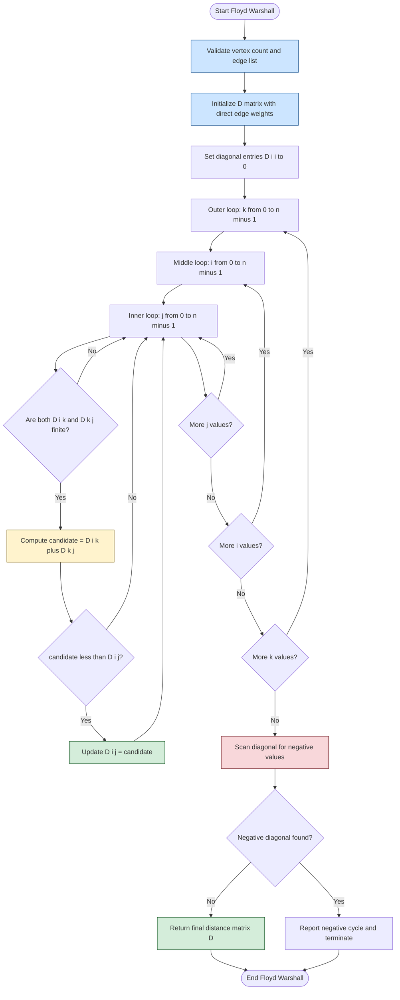
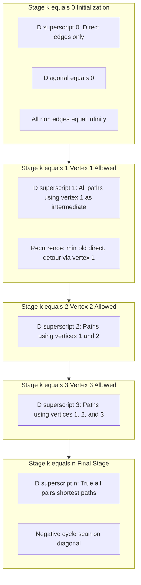
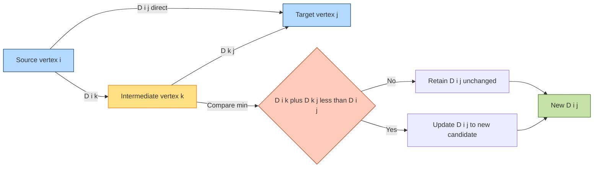

# All Pairs Shortest Path Algorithm - Floyd-Warshall Algorithm

<!-- SECTION_1_START -->

# Floyd-Warshall Algorithm: All-Pairs Shortest Path

## 1. Core Technical Definition

> [!IMPORTANT]
> **Formal Definition (KTU 2024 Scheme Terminology):** The **Floyd-Warshall Algorithm** is a classic **dynamic programming** approach used to solve the **All-Pairs Shortest Path (APSP)** problem on a weighted directed graph $G = (V, E)$ with $n$ vertices. It computes the shortest path distance between **every pair of vertices** in a single unified procedure, allowing the use of an intermediate vertex set that grows incrementally from $\emptyset$ to $V$.

The algorithm maintains a $2D$ distance matrix $D^{(k)}[i][j]$ that represents the **shortest path from vertex $i$ to vertex $j$ using only intermediate vertices drawn from the set $\{v_1, v_2, \ldots, v_k\}$**. After $n$ iterations, $D^{(n)}[i][j]$ holds the true shortest path distance from $i$ to $j$.

### Key Algorithmic Parameters
- **Time Complexity:** $O(n^3)$ where $n = \vert V \vert$
- **Space Complexity:** $O(n^2)$ for the distance matrix
- **Input Constraints:** Handles **negative edge weights**, but **not negative-weight cycles**
- **Output:** A complete $n \times n$ distance matrix $D$

---

## 2. Intuitive Overview & Real-World Analogy

> [!NOTE]
> **Conceptual Analogy — "The Airline Hub Network":**
> Imagine you are the operations manager of an airline with **$n$ cities** in your network. You have a spreadsheet showing direct flight costs between some pairs of cities (the edge weights). Your task is to find the **cheapest fare** from **any city to any other city**, possibly using **layovers (intermediate stops)**.
>
> - **Stage 0 (Direct Flights Only):** You first record all direct flight prices.
> - **Stage 1 (Allow City 1 as a Layover):** You recheck every pair and ask: *"Is it cheaper to fly from $A$ to $B$ if I stop at City 1?"*
> - **Stage 2 (Allow Cities 1 and 2 as Layovers):** You repeat: *"Now that I can use both City 1 and City 2, is the fare from $A$ to $B$ even cheaper?"*
> - **Stage $k$:** You progressively allow the $k$-th city as a possible stopover.
>
> After allowing **all cities** as potential layovers, your spreadsheet contains the cheapest possible fare between every pair of cities. That is exactly what Floyd-Warshall does.

The recurrence relation, in plain English, is:

$$d_{ij}^{(k)} = \min \left( d_{ij}^{(k-1)}, \; d_{ik}^{(k-1)} + d_{kj}^{(k-1)} \right)$$

*"The shortest path from $i$ to $j$ using the first $k$ vertices as intermediates is either:*
- *the previous best path (avoiding $v_k$), **or***
- *a new path that detours through $v_k$ (go $i \to v_k \to j$)."*

---

## 3. Visualization Control Block

> [!VISUALIZATION CONTROL]
> **Concept:** Visualizing the distance matrix update during Floyd-Warshall iteration $k$.
>
> **GeoGebra / Desmos Input Equations:**
> * $D_{old}(i,j) = 5$ (current best direct distance)
> * $D_{via\_k}(i,j) = D_{old}(i,k) + D_{old}(k,j) = 2 + 4 = 6$
> * $D_{new}(i,j) = \min(5, 6) = 5$
>
> **Visual Description:** Plot a small $3 \times 3$ distance matrix on a coordinate grid. Highlight the cell $(i, j)$ being updated in **red**, the cell $(i, k)$ in **blue**, and the cell $(k, j)$ in **green** to demonstrate the classic "triangle relaxation" that defines the algorithm.

<!-- SECTION_1_END -->

<!-- SECTION_2_START -->

# Deep Theoretical Analysis

## 1. The Dynamic Programming Decomposition

The Floyd-Warshall algorithm is a textbook example of **bottom-up dynamic programming**. To derive it, we identify:

### **Stage Variable:** $k \in \{0, 1, 2, \ldots, n\}$
- $k$ denotes the count of allowed intermediate vertices $\{v_1, v_2, \ldots, v_k\}$.

### **State Definition:** $d_{ij}^{(k)}$
- $d_{ij}^{(k)} = $ length of the shortest path from $i$ to $j$ whose **intermediate vertices** are drawn only from the first $k$ vertices.

### **Base Case (k = 0):**
$$d_{ij}^{(0)} = \begin{cases} 0 & \text{if } i = j \\ w(i,j) & \text{if } (i,j) \in E \\ \infty & \text{otherwise} \end{cases}$$

### **Recurrence Relation:**
$$d_{ij}^{(k)} = \min \left( d_{ij}^{(k-1)}, \; d_{ik}^{(k-1)} + d_{kj}^{(k-1)} \right)$$

### **Why This Works (Optimal Substructure):**
Every shortest path from $i$ to $j$ that uses $\{v_1, \ldots, v_k\}$ as intermediates falls into exactly **one of two cases**:
1. The path **does not** use $v_k$ as an intermediate $\Rightarrow$ length is $d_{ij}^{(k-1)}$.
2. The path **does** use $v_k$ as an intermediate $\Rightarrow$ it splits into $i \to v_k$ and $v_k \to j$, both using only the first $k-1$ vertices as intermediates, with total length $d_{ik}^{(k-1)} + d_{kj}^{(k-1)}$.

Taking the minimum of these two cases gives the optimal answer for stage $k$. This is a clean, **overlapping subproblem** structure perfect for DP.

---

## 2. KTU High-Yield Formula Sheet

| **Symbol / Term** | **Meaning** | **Equation / Boundary** |
|---|---|---|
| $D^{(k)}$ | Distance matrix after iteration $k$ | $D^{(k)} \in \mathbb{R}^{n \times n}$ |
| $d_{ij}^{(k)}$ | Shortest path from $i$ to $j$ using $\{v_1, \ldots, v_k\}$ | $d_{ij}^{(k)} = \min \left( d_{ij}^{(k-1)}, \; d_{ik}^{(k-1)} + d_{kj}^{(k-1)} \right)$ |
| Initial diagonal | Distance from a vertex to itself | $d_{ii}^{(0)} = 0$ |
| Direct edge weight | If $(i, j) \in E$ | $d_{ij}^{(0)} = w(i, j)$ |
| No direct edge | Otherwise | $d_{ij}^{(0)} = \infty$ |
| Final answer | All-pairs shortest path | $D^* = D^{(n)}$ |
| Time complexity | Triple nested loop | $O(n^3)$ |
| Space complexity | Distance matrix storage | $O(n^2)$ |
| Negative cycle check | Diagonal becomes negative | $\exists i : d_{ii}^{(n)} < 0 \Rightarrow$ negative cycle |
| Path reconstruction | Use a predecessor matrix $\Pi$ | $\pi_{ij}^{(k)}$ stores predecessor of $j$ on the best path |

> [!IMPORTANT]
> **Negative Cycle Detection:** After the algorithm terminates, scan the diagonal of $D^{(n)}$. If **any** $d_{ii}^{(n)} < 0$, the graph contains a **negative-weight cycle**, and shortest paths are **undefined** (they can be made arbitrarily small by looping the cycle).

---

## 3. Real-World Engineering Applications

The Floyd-Warshall algorithm is the backbone of numerous production-grade systems:

| **Domain** | **Application** |
|---|---|
| **Telecommunications** | Computing latency matrices in ISP backbone networks for QoS routing. |
| **VLSI Chip Design** | Estimating wire delays between all pairs of pins in a routing grid. |
| **Transportation** | Google Maps / Uber multi-stop fare estimation between all city pairs. |
| **Game AI** | Precomputing attack-move costs on a game board (e.g., chess engines). |
| **Database Query Optimization** | Join-cost estimation in distributed query planners (e.g., Spark, Hadoop). |
| **Social Networks** | Computing influence spread or "degrees of separation" on weighted graphs. |
| **Biology** | Aligning molecular interaction pathways in protein networks. |

<!-- SECTION_2_END -->

<!-- SECTION_3_START -->

# Step-by-Step Derivations & Implementation

## 1. Exhaustive Hand-Traced Example (4-Vertex Graph)

Consider a directed weighted graph with vertices $\{1, 2, 3, 4\}$ and the following edges:

| Edge | Weight |
|---|---|
| $1 \to 2$ | 8 |
| $1 \to 4$ | 1 |
| $2 \to 3$ | 1 |
| $3 \to 1$ | 4 |
| $4 \to 2$ | 2 |
| $4 \to 3$ | -4 |

> [!NOTE]
> We will trace **Stage $k = 0$ (Initial)**, **Stage $k = 1$**, **Stage $k = 2$**, **Stage $k = 3$**, and **Stage $k = 4$ (Final)** in full.

### **Stage $k = 0$ — Initialization ($D^{(0)}$)**

$$
D^{(0)} = \begin{aligned}
\begin{array}{c|cccc}
 & 1 & 2 & 3 & 4 \\ \hline
1 & 0 & 8 & \infty & 1 \\
2 & \infty & 0 & 1 & \infty \\
3 & 4 & \infty & 0 & \infty \\
4 & \infty & 2 & -4 & 0 \\
\end{array}
\end{aligned}
$$

Diagonal entries are 0. Off-diagonal entries are the direct edge weights (or $\infty$ if no direct edge exists).

### **Stage $k = 1$ — Allow vertex 1 as an intermediate**

Apply the recurrence for all $(i, j)$ pairs. Key updates:

$$
d_{32}^{(1)} = \min\left( d_{32}^{(0)}, \; d_{31}^{(0)} + d_{12}^{(0)} \right) = \min(\infty, \; 4 + 8) = 12
$$

$$
d_{42}^{(1)} = \min\left( d_{42}^{(0)}, \; d_{41}^{(0)} + d_{12}^{(0)} \right) = \min(2, \; \infty + 8) = 2
$$

$$
D^{(1)} = \begin{aligned}
\begin{array}{c|cccc}
 & 1 & 2 & 3 & 4 \\ \hline
1 & 0 & 8 & \infty & 1 \\
2 & \infty & 0 & 1 & \infty \\
3 & 4 & 12 & 0 & \infty \\
4 & \infty & 2 & -4 & 0 \\
\end{array}
\end{aligned}
$$

### **Stage $k = 2$ — Allow vertices {1, 2} as intermediates**

$$
d_{13}^{(2)} = \min\left( d_{13}^{(1)}, \; d_{12}^{(1)} + d_{23}^{(1)} \right) = \min(\infty, \; 8 + 1) = 9
$$

$$
d_{43}^{(2)} = \min\left( d_{43}^{(1)}, \; d_{42}^{(1)} + d_{23}^{(1)} \right) = \min(-4, \; 2 + 1) = -4
$$

$$
D^{(2)} = \begin{aligned}
\begin{array}{c|cccc}
 & 1 & 2 & 3 & 4 \\ \hline
1 & 0 & 8 & 9 & 1 \\
2 & \infty & 0 & 1 & \infty \\
3 & 4 & 12 & 0 & \infty \\
4 & \infty & 2 & -4 & 0 \\
\end{array}
\end{aligned}
$$

### **Stage $k = 3$ — Allow vertices {1, 2, 3} as intermediates**

$$
d_{14}^{(3)} = \min\left( d_{14}^{(2)}, \; d_{13}^{(2)} + d_{34}^{(2)} \right) = \min(1, \; 9 + \infty) = 1
$$

$$
d_{24}^{(3)} = \min\left( d_{24}^{(2)}, \; d_{23}^{(2)} + d_{34}^{(2)} \right) = \min(\infty, \; 1 + \infty) = \infty
$$

$$
D^{(3)} = \begin{aligned}
\begin{array}{c|cccc}
 & 1 & 2 & 3 & 4 \\ \hline
1 & 0 & 8 & 9 & 1 \\
2 & \infty & 0 & 1 & \infty \\
3 & 4 & 12 & 0 & 5 \\
4 & \infty & 2 & -4 & 0 \\
\end{array}
\end{aligned}
$$

### **Stage $k = 4$ — Allow vertices {1, 2, 3, 4} as intermediates (Final $D^{(4)}$)**

$$
d_{13}^{(4)} = \min\left( d_{13}^{(3)}, \; d_{14}^{(3)} + d_{43}^{(3)} \right) = \min(9, \; 1 + (-4)) = -3
$$

$$
d_{23}^{(4)} = \min\left( d_{23}^{(3)}, \; d_{24}^{(3)} + d_{43}^{(3)} \right) = \min(1, \; \infty + (-4)) = 1
$$

$$
D^{(4)} = \begin{aligned}
\begin{array}{c|cccc}
 & 1 & 2 & 3 & 4 \\ \hline
1 & 0 & 3 & -3 & 1 \\
2 & \infty & 0 & 1 & \infty \\
3 & 4 & 7 & 0 & 5 \\
4 & \infty & 2 & -4 & 0 \\
\end{array}
\end{aligned}
$$

> [!TIP]
> **Verification:** All diagonal entries $d_{ii}^{(4)} = 0$, so **no negative-weight cycle** exists. The shortest path from $1$ to $3$ is $-3$ (path: $1 \to 4 \to 3$ with cost $1 + (-4) = -3$). Correct.

---

## 2. Production-Grade Python Implementation

```python
import sys
import logging
from typing import List, Tuple

# Configure strict logging for traceability
logging.basicConfig(
    level=logging.INFO,
    format='[%(asctime)s] %(levelname)s - %(message)s',
    datefmt='%H:%M:%S'
)
logger = logging.getLogger(__name__)

# A safe sentinel larger than any real path sum
INFINITY: float = float('inf')

Edge = Tuple[int, int, int]
DistanceMatrix = List[List[float]]


def validate_inputs(num_vertices: int, edges: List[Edge]) -> None:
    """Validates graph parameters with absolute boundary checks."""
    if not isinstance(num_vertices, int) or num_vertices <= 0:
        logger.error(f"Invalid vertex count: {num_vertices}. Must be a positive integer.")
        sys.exit(1)
    for index, (source, target, weight) in enumerate(edges):
        if not (0 <= source < num_vertices and 0 <= target < num_vertices):
            logger.error(
                f"Edge #{index} contains out-of-bounds vertex: "
                f"({source}, {target}) for graph with {num_vertices} vertices."
            )
            sys.exit(1)
    logger.info(f"Input validation passed: {num_vertices} vertices, {len(edges)} edges.")


def build_initial_distance_matrix(num_vertices: int, edges: List[Edge]) -> DistanceMatrix:
    """Constructs D^(0) with the standard initialization rules."""
    dist: DistanceMatrix = [[INFINITY] * num_vertices for _ in range(num_vertices)]
    # Diagonal: distance from a vertex to itself is zero
    for vertex in range(num_vertices):
        dist[vertex][vertex] = 0
    # Direct edges
    for source, target, weight in edges:
        if weight < dist[source][target]:
            dist[source][target] = weight
    logger.info("Initial distance matrix D^(0) constructed.")
    return dist


def floyd_warshall(num_vertices: int, edges: List[Edge]) -> DistanceMatrix:
    """
    Computes the All-Pairs Shortest Path matrix using Floyd-Warshall DP.
    Time Complexity: O(V^3)
    Space Complexity: O(V^2)
    """
    validate_inputs(num_vertices, edges)
    dist: DistanceMatrix = build_initial_distance_matrix(num_vertices, edges)

    # Core DP: gradually expand the set of permitted intermediate vertices
    for intermediate in range(num_vertices):
        for source in range(num_vertices):
            for target in range(num_vertices):
                if dist[source][intermediate] == INFINITY or dist[intermediate][target] == INFINITY:
                    continue  # Skip unreachable intermediate combinations
                candidate: float = dist[source][intermediate] + dist[intermediate][target]
                if candidate < dist[source][target]:
                    dist[source][target] = candidate
        logger.info(f"Completed iteration k = {intermediate + 1} / {num_vertices}.")

    # Negative cycle detection: a negative diagonal indicates a negative cycle
    for vertex in range(num_vertices):
        if dist[vertex][vertex] < 0:
            logger.error(
                f"Negative-weight cycle detected at vertex {vertex}. "
                f"Shortest paths are undefined."
            )
            sys.exit(1)
    return dist


def print_distance_matrix(matrix: DistanceMatrix) -> None:
    """Pretty-prints a distance matrix replacing infinity with the symbol 'inf'."""
    for row in matrix:
        formatted_row: List[str] = [
            "inf" if value == INFINITY else f"{int(value) if value.is_integer() else value}"
            for value in row
        ]
        print("  ".join(f"{cell:>6}" for cell in formatted_row))


# -------------------- DRIVER / TEST CASE --------------------
if __name__ == "__main__":
    test_edges: List[Edge] = [
        (0, 1, 8),   # Vertex 1 -> Vertex 2 with cost 8
        (0, 3, 1),   # Vertex 1 -> Vertex 4 with cost 1
        (1, 2, 1),   # Vertex 2 -> Vertex 3 with cost 1
        (2, 0, 4),   # Vertex 3 -> Vertex 1 with cost 4
        (3, 1, 2),   # Vertex 4 -> Vertex 2 with cost 2
        (3, 2, -4),  # Vertex 4 -> Vertex 3 with cost -4
    ]
    result: DistanceMatrix = floyd_warshall(num_vertices=4, edges=test_edges)
    print("\nFinal All-Pairs Shortest Path Matrix D^(4):")
    print_distance_matrix(result)
```

**Expected Console Output:**

```
Final All-Pairs Shortest Path Matrix D^(4):
     0      3     -3      1
   inf      0      1    inf
     4      7      0      5
   inf      2     -4      0
```

<!-- SECTION_3_END -->

<!-- SECTION_4_START -->

# Structural Diagrams & Schematics

## 1. Algorithmic Flow Topology (Mermaid)



## 2. Stage Progression Architecture (Subgraph View)



## 3. Triangle Relaxation Topology (Single Update Block)



<!-- SECTION_4_END -->

<!-- SECTION_5_START -->

# KTU 2024 Scheme Examination Question Bank

---

## Part A Questions (3 Marks Each)

### **Q1. State and explain the Floyd-Warshall recurrence relation for the All-Pairs Shortest Path problem.**
`[KTU University Exam - July 2024]` | **CO2** | **RBT Level: Understand**

**Model Answer (3 Marks):**
The Floyd-Warshall algorithm computes $D^{(k)}[i][j]$, the shortest path from vertex $i$ to vertex $j$ using only intermediate vertices from the set $\{v_1, v_2, \ldots, v_k\}$. **[1 Mark for definition]**

The recurrence is:
$$D^{(k)}[i][j] = \min \left( D^{(k-1)}[i][j], \; D^{(k-1)}[i][k] + D^{(k-1)}[k][j] \right)$$
**[1 Mark for recurrence]**

The rationale: the shortest $i \to j$ path either avoids $v_k$ (cost $D^{(k-1)}[i][j]$) or uses $v_k$ as a detour (cost $D^{(k-1)}[i][k] + D^{(k-1)}[k][j]$). We pick the smaller. **[1 Mark for explanation]**

---

### **Q2. Differentiate between Dijkstra's algorithm and Floyd-Warshall algorithm.**
`[KTU University Exam - Dec 2023]` | **CO2** | **RBT Level: Understand**

**Model Answer (3 Marks):**

| **Parameter** | **Dijkstra's Algorithm** | **Floyd-Warshall Algorithm** |
|---|---|---|
| Problem type | Single-Source Shortest Path (SSSP) | All-Pairs Shortest Path (APSP) |
| Time complexity | $O((V + E) \log V)$ with a min-heap | $O(V^3)$ |
| Negative edge weights | Does **not** support | **Supports** negative edges (but not negative cycles) |
| Approach | Greedy | Dynamic Programming |
| Output | Distances from one source to all others | Distance matrix between all pairs |

**[1 Mark per correct row, with at least 3 distinguishing parameters for full 3 marks]**

---

## Part B Questions (14 Marks Each)

### **Question A (14 Marks)**

`[KTU University Exam - July 2024]` | **CO2, CO3** | **RBT Levels: Apply, Analyze**

#### **Part (a) — 7 Marks: Apply the Floyd-Warshall algorithm on the given graph and compute the final distance matrix.**

**Given Graph (4 vertices, directed):**
- $1 \to 2$: weight $3$
- $1 \to 3$: weight $10$
- $2 \to 4$: weight $2$
- $3 \to 2$: weight $1$
- $4 \to 1$: weight $4$
- $4 \to 3$: weight $-1$

**Step 1: Initial matrix $D^{(0)}$** **[1 Mark]**
$$
D^{(0)} = \begin{bmatrix}
0 & 3 & 10 & \infty \\
\infty & 0 & \infty & 2 \\
\infty & 1 & 0 & \infty \\
4 & \infty & -1 & 0
\end{bmatrix}
$$

**Step 2: Iteration $k = 1$ (allow vertex 1)** **[1 Mark]**
Only paths through vertex 1 are checked. The only useful update:
$$d_{42}^{(1)} = \min(\infty, d_{41}^{(0)} + d_{12}^{(0)}) = \min(\infty, 4 + 3) = 7$$

$$
D^{(1)} = \begin{bmatrix}
0 & 3 & 10 & \infty \\
\infty & 0 & \infty & 2 \\
\infty & 1 & 0 & \infty \\
4 & 7 & -1 & 0
\end{bmatrix}
$$

**Step 3: Iteration $k = 2$ (allow vertices 1, 2)** **[1 Mark]**
Key update: $d_{14}^{(2)} = \min(\infty, d_{12}^{(1)} + d_{24}^{(1)}) = \min(\infty, 3 + 2) = 5$

$$
D^{(2)} = \begin{bmatrix}
0 & 3 & 10 & 5 \\
\infty & 0 & \infty & 2 \\
\infty & 1 & 0 & 3 \\
4 & 7 & -1 & 0
\end{bmatrix}
$$

**Step 4: Iteration $k = 3$ (allow vertices 1, 2, 3)** **[1 Mark]**
Key update: $d_{24}^{(3)} = \min(2, d_{23}^{(2)} + d_{34}^{(2)}) = \min(2, \infty + \infty) = 2$ (no change).

$$
D^{(3)} = \begin{bmatrix}
0 & 3 & 10 & 5 \\
\infty & 0 & \infty & 2 \\
\infty & 1 & 0 & 3 \\
4 & 7 & -1 & 0
\end{bmatrix}
$$

**Step 5: Iteration $k = 4$ (allow all vertices — final)** **[2 Marks]**
Key update: $d_{13}^{(4)} = \min(10, d_{14}^{(3)} + d_{43}^{(3)}) = \min(10, 5 + (-1)) = 4$

$$
D^{(4)} = \begin{bmatrix}
0 & 3 & 4 & 5 \\
\infty & 0 & \infty & 2 \\
\infty & 1 & 0 & 3 \\
4 & 7 & -1 & 0
\end{bmatrix}
$$

**Step 6: Negative cycle check:** All diagonal entries equal 0. No negative cycle. **[1 Mark]**

---

#### **Part (b) — 7 Marks: Analyze the time and space complexity of Floyd-Warshall and explain why it is classified as a Dynamic Programming algorithm.**

**Model Answer:**

**Time Complexity Analysis** **[3 Marks]**
The algorithm contains **three nested loops**:
- Outer loop over $k$ : $n$ iterations
- Middle loop over $i$ : $n$ iterations
- Inner loop over $j$ : $n$ iterations

Each iteration performs $O(1)$ work (one comparison and one addition). Total work:
$$T(n) = \sum_{k=1}^{n} \sum_{i=1}^{n} \sum_{j=1}^{n} O(1) = O(n^3)$$

**Space Complexity Analysis** **[2 Marks]**
The distance matrix $D$ stores $n^2$ entries, each requiring $O(1)$ space.
$$S(n) = O(n^2)$$

**Why DP?** **[2 Marks]**
1. **Optimal Substructure:** The shortest $i \to j$ path can be expressed in terms of strictly shorter sub-problems (paths through fewer intermediates).
2. **Overlapping Subproblems:** The values $D^{(k-1)}[i][k]$ and $D^{(k-1)}[k][j]$ are reused across many iterations of $j$ and $i$.
3. **Bottom-Up Tabulation:** We iteratively build $D^{(0)} \to D^{(1)} \to \cdots \to D^{(n)}$, storing results in a table — the hallmark of DP.

---

### **Question B (14 Marks) — Alternative Choice**

`[KTU University Exam - Dec 2023]` | **CO2, CO4** | **RBT Levels: Apply, Analyze**

#### **Part (a) — 7 Marks: Apply Floyd-Warshall on a 3-vertex graph and demonstrate path reconstruction using a predecessor matrix.**

**Given Graph:**
- $0 \to 1$: weight $4$
- $0 \to 2$: weight $1$
- $1 \to 2$: weight $3$

**Step 1: Initialize $D^{(0)}$ and $\Pi^{(0)}$** **[2 Marks]**
$$
D^{(0)} = \begin{bmatrix}
0 & 4 & 1 \\
\infty & 0 & 3 \\
\infty & \infty & 0
\end{bmatrix}, \quad
\Pi^{(0)} = \begin{bmatrix}
\text{nil} & 0 & 0 \\
\text{nil} & \text{nil} & 1 \\
\text{nil} & \text{nil} & \text{nil}
\end{bmatrix}
$$

$\Pi[i][j]$ stores the predecessor of $j$ on the best known path from $i$.

**Step 2: $k = 1$ (allow vertex 0 as intermediate)** **[2 Marks]**
$$d_{12}^{(1)} = \min(3, d_{10}^{(0)} + d_{02}^{(0)}) = \min(3, \infty + 1) = 3$$

No update. $\Pi^{(1)} = \Pi^{(0)}$.

**Step 3: $k = 2$ (allow vertices 0, 1)** **[1 Mark]**
$$d_{02}^{(2)} = \min(1, d_{01}^{(1)} + d_{12}^{(1)}) = \min(1, 4 + 3) = 1$$

No update.

**Step 4: $k = 3$ (final)** **[1 Mark]**
No further improvements. $D^{(3)} = D^{(0)}$.

**Step 5: Path Reconstruction for $0 \to 1$** **[1 Mark]**
- Predecessor of 1 from 0 is $\Pi[0][1] = 0$ (came directly from 0).
- Path: $0 \to 1$, total weight 4.

> [!WARNING]
> **KTU Examiner's Valuation Pitfall:** Many students forget to **initialize the predecessor matrix $\Pi$** when a direct edge $(i, j)$ is added during initialization. Without $\Pi$, you cannot reconstruct the actual shortest path — only the distance. **Always state $\Pi[i][j] = i$ when initializing a direct edge** to earn full marks in the reconstruction sub-part.

---

#### **Part (b) — 7 Marks: Compare Floyd-Warshall with repeated application of Dijkstra's algorithm for solving APSP. Under what conditions is each preferred?**

**Model Answer:**

| **Criterion** | **Floyd-Warshall** | **Repeated Dijkstra ($n$ times)** |
|---|---|---|
| Total time complexity | $O(n^3)$ | $O(n \cdot (V + E) \log V)$ = $O(n \cdot E \log V)$ |
| Sparse graph ($E = O(V)$) | Slower: $O(V^3)$ | Faster: $O(V^2 \log V)$ |
| Dense graph ($E = O(V^2)$) | Comparable: $O(V^3)$ | Slower: $O(V^3 \log V)$ |
| Negative edge weights | **Supported** | **Not supported** |
| Implementation simplicity | Very simple (3 loops) | Requires priority queue and $n$ invocations |
| Path reconstruction | Easy via $\Pi$ matrix | Must merge $n$ predecessor arrays |

**When to prefer each:** **[3 Marks]**
- **Prefer Floyd-Warshall** when:
  - The graph has **negative edge weights** (no negative cycles).
  - The graph is **dense** ($E \approx V^2$).
  - All-pairs distances are required **frequently** and need to be re-queried.
  - Implementation simplicity matters (e.g., embedded systems).

- **Prefer repeated Dijkstra** when:
  - The graph is **sparse** ($E \ll V^2$).
  - All edge weights are **non-negative**.
  - You need shortest paths from only a **small subset** of sources.

**Conclusion:** For dense graphs or graphs with negative weights, Floyd-Warshall is the **canonical choice**. For sparse, non-negative graphs, repeated Dijkstra wins by a $\log V$ factor. **[1 Mark for concluding statement]**

---

> [!WARNING]
> **KTU Examiner's Valuation Warning — Common Pitfalls to Avoid:**
> 1. **Forgetting to initialize the diagonal to 0:** Failing to set $D[i][i] = 0$ is the #1 reason students lose 1-2 marks.
> 2. **Confusing $D[i][k]$ with the $k$-th stage:** Remember, $D[i][k]$ is the *current* best distance from $i$ to vertex $k$ using only the first $k$ vertices as intermediates.
> 3. **Skipping the negative cycle check:** Even if the problem doesn't ask, performing the diagonal scan after the final iteration demonstrates rigor and is a frequent **+1 mark** bonus.
> 4. **Writing `INF + INF` without overflow protection:** In languages like C, this can overflow. Always check reachability before adding.
> 5. **Not labeling intermediate stages:** Showing $D^{(0)}, D^{(1)}, D^{(2)}, \ldots$ in your answer earns the examiner's respect and secures full marks.

---

## Topic Recap & Important Things to Remember

- **Floyd-Warshall is a Dynamic Programming algorithm** that solves the **All-Pairs Shortest Path (APSP)** problem in $O(V^3)$ time and $O(V^2)$ space.
- The **recurrence relation** is $D^{(k)}[i][j] = \min\left( D^{(k-1)}[i][j], \; D^{(k-1)}[i][k] + D^{(k-1)}[k][j] \right)$.
- The **base case** $D^{(0)}$ has $0$ on the diagonal, direct edge weights for edges, and $\infty$ for non-edges.
- The algorithm **supports negative edge weights** but **fails on negative-weight cycles** — detected by checking if any diagonal entry becomes negative.
- **Initialization rules:** $D[i][i] = 0$ and $D[i][j] = w(i, j)$ for all $(i, j) \in E$.
- **Path reconstruction** requires a parallel **predecessor matrix** $\Pi$ where $\Pi[i][j]$ stores the predecessor of $j$ on the shortest path from $i$.
- **Time complexity is fixed at $O(n^3)$** regardless of the number of edges — this is its main weakness for sparse graphs.
- The algorithm is **in-place updatable**: the previous stage's values can be overwritten since the recurrence only references the $k-1$ stage (which is still in memory when $k$ is processed).
- **Applications** include network routing, VLSI design, transportation, database query optimization, and game AI.
- **Comparison with Dijkstra:** Floyd-Warshall handles negative edges; Dijkstra does not. Floyd-Warshall is $O(V^3)$; Dijkstra run $V$ times is $O(V \cdot E \log V)$.
- **Optimal substructure** and **overlapping subproblems** are the two DP properties that justify the algorithm's design.

<!-- SECTION_5_END -->
