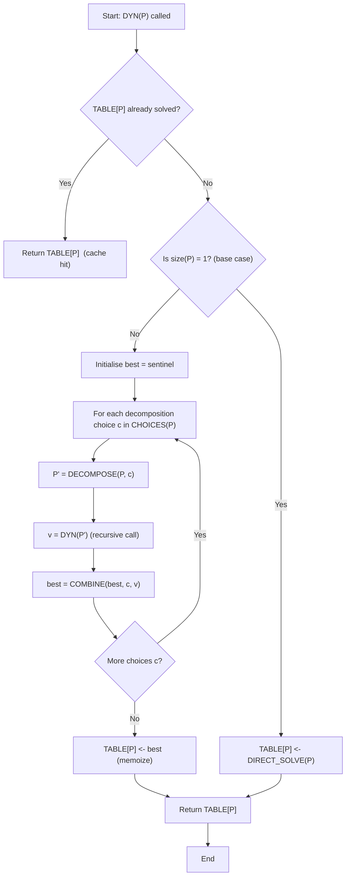
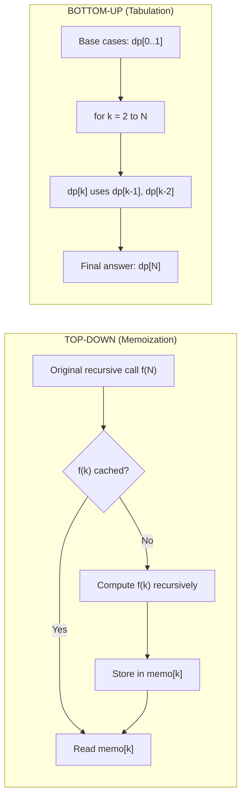
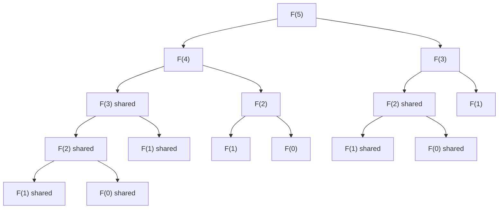
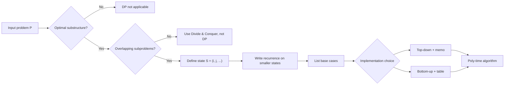

# Dynamic Programming - The Control Abstraction- The Optimality Principle

<!-- SECTION_1_START -->

# Dynamic Programming — The Control Abstraction & The Optimality Principle

## 1.1 Formal Academic Definition (KTU 2024 Syllabus Terminology)

**Dynamic Programming (DP)** is an algorithmic design paradigm that solves an optimization or counting problem by:
1. Decomposing it into a collection of **overlapping subproblems**,
2. Solving each subproblem **exactly once**, and
3. **Storing** (memoizing) the result of every solved subproblem in a table so that it can be reused whenever the same subproblem recurs.

> [!IMPORTANT]
> **KTU Board Definition (Horowitz & Sahni, Fundamentals of Computer Algorithms):**
> *"Dynamic Programming is an algorithm-design method that can be used when a problem has overlapping subproblems and optimal substructure. A recursive formulation of the problem is given, and the recursive solution is recorded in a table so that it can be reused without recomputation."*

The **Control Abstraction of DP** is the *generalized pseudocode template* — a meta-algorithm that captures, in a uniform way, *how* a DP algorithm recursively decomposes a problem, *how* it stores subproblem answers, and *how* it combines them to produce the final answer. Every specific DP problem (Floyd–Warshall, LCS, Knapsack, Matrix Chain Multiplication) is a *specialization* of this single abstraction.

The **Optimality Principle** (Bellman's Principle of Optimality, 1957) is the *theoretical foundation* that justifies the entire DP methodology. It states:

> *"An optimal solution to any instance of an optimization problem is composed of optimal solutions to its subinstances."*

Without this principle, DP is not just unsound — it is **not applicable**.

## 1.2 The Three Pillars of Dynamic Programming

A problem can be tackled with DP **only if** it satisfies all three of the following properties:

| # | Property | Plain Meaning |
|---|----------|---------------|
| 1 | **Optimal Substructure** | The optimal answer for the whole problem can be expressed as a function of the optimal answers of strictly smaller sub-problems. |
| 2 | **Overlapping Subproblems** | The naive recursive formulation re-computes the *same* subproblem many times (a recursion DAG with shared nodes). |
| 3 | **Limited Subproblem Space** | The total number of distinct subproblems is small (typically polynomial in the input size), making memoization feasible. |

> [!NOTE]
> If a problem has *no overlapping subproblems* (e.g., Mergesort), DP degenerates into plain Divide-&-Conquer and the memo table is never reused. If it has *no optimal substructure* (e.g., the Longest Simple Path problem on general graphs), DP is **provably incorrect** for that problem.

## 1.3 Intuitive Analogy — The "Cheat Sheet" of Mathematics

Imagine you are solving a 100-page physics problem set. Page 1 asks you to compute $F_7$ (the 7th Fibonacci number). Page 50 asks for $F_7$ again. Page 99 asks for it a third time.

- **Naïve recursion** = re-derive $F_7$ from scratch on each page. Painful, slow.
- **Dynamic Programming** = the *first* time you compute $F_7$, you **write it on a sticky note** and paste it on your desk. The next time anyone (page 50, page 99) asks, you simply *read* the sticky note. No recomputation.

That sticky-note system is the **memoization table**. The *rule that lets you know which stickies to paste* — i.e., *“the optimal answer for the full problem is built from optimal answers of its pieces”* — is the **Optimality Principle**.

> [!TIP]
> **Mnemonic for KTU Viva:** *"Optimal substructure gives you the **recipe**; overlapping subproblems give you the **leftovers**; memoization gives you the **fridge**."*

## 1.4 The Control Abstraction in One Sentence

The **DP Control Abstraction** is a parameterized template algorithm — `DYN(P)` — that takes a problem instance `P`, checks whether `P` is trivial, otherwise decomposes `P` into smaller sub-instances, recursively solves each *unseen* sub-instance, and finally combines the cached sub-solutions into the answer for `P`.

This abstraction is what makes DP a *paradigm* rather than a single algorithm.

> [!VISUALIZATION CONTROL]
> **Concept:** Recursion DAG of Fibonacci (the canonical DP example).
> **Equations / Points to plot in GeoGebra / Desmos:**
> * Tree nodes: $F(5) \to \{F(4), F(3)\}$, $F(4) \to \{F(3), F(2)\}$, $F(3) \to \{F(2), F(1)\}$, $F(3) \to \{F(2), F(1)\}$ — drawn as a directed acyclic graph.
> * Highlight shared nodes ($F(3)$ appears twice, $F(2)$ appears three times) to show *overlapping* subproblems.
> **Visual Description:** The student should observe that the *same* node is reached through multiple parent paths — those are the "sticky-note" candidates.

<!-- SECTION_1_END -->

<!-- SECTION_2_START -->

# Deep Theoretical Analysis & KTU High-Yield Formula Sheet

## 2.1 The Optimality Principle — Formal Statement

Let $\mathcal{P}$ be an optimization (minimization or maximization) problem on instances of size $n$. Suppose an instance $P$ can be decomposed into sub-instances $P_1, P_2, \dots, P_k$ such that any feasible solution $S$ for $P$ is determined by a tuple of feasible solutions $(S_1, S_2, \dots, S_k)$ for the $P_i$.

> [!IMPORTANT]
> **Principle of Optimality (Bellman, 1957).**
> *If $S^{*} = (S_1^{*}, S_2^{*}, \dots, S_k^{*})$ is an optimal solution for $P$, then for every $i \in \{1, 2, \dots, k\}$, the component $S_i^{*}$ must be an optimal solution for the sub-instance $P_i$.*

The contrapositive is the proof technique: assume the contrary (some $S_i^{*}$ is not optimal for $P_i$) and show a strictly better solution for $P$ — a contradiction.

## 2.2 When the Principle Fails (KTU-Favourite Counter-Example)

Consider the **Longest Simple Path** problem on a weighted directed graph. Suppose the *longest* simple path from $s$ to $t$ goes through an intermediate vertex $v$. The sub-path $s \leadsto v$ is *not* necessarily the longest simple path from $s$ to $v$ — it might use edges that block the optimal $v \leadsto t$ continuation.

> [!WARNING]
> **KTU Pitfall:** Do **not** apply DP to a problem merely because it can be split. Always verify *both* optimal substructure *and* the contrapositive argument. The Longest Path counter-example appears in almost every KTU board paper.

## 2.3 The Three Operational Steps of Any DP Algorithm

1. **Formulate the Recurrence / Recursive Equation**
   Identify the subproblem parameter set (e.g., index `i`, capacity `j`, length `n`, sub-interval `[i..j]`). Express `opt(i, j, …)` in terms of smaller indices.

2. **Establish the Boundary / Base Conditions**
   Write the values of the recurrence for the *smallest* legitimate sub-instances (e.g., $opt(0, \cdot) = 0$, $opt(\cdot, 0) = 0$, $opt(1) = 1$).

3. **Choose the Evaluation Order (Top-Down vs. Bottom-Up) and Populate the Table**
   Compute the memoization table either recursively with a cache (top-down / memoization) or iteratively by increasing subproblem size (bottom-up / tabulation). The *required* cells must be computable from already-filled cells.

## 2.4 Top-Down (Memoization) vs. Bottom-Up (Tabulation)

| Aspect | Top-Down (Recursive + Memo) | Bottom-Up (Iterative Table) |
|---|---|---|
| **Order of computation** | Lazy — driven by the original recursion. | Eager — fills the table in a predetermined order. |
| **Implementation** | Recursion + a hash map / array `memo[]`. | Nested `for`-loops; no recursion. |
| **Stack overflow risk** | Yes, for very large `n`. | No. |
| **Wasted cells** | Only the cells actually requested. | All cells in the table are filled. |
| **Constant factor** | Slightly higher (function-call overhead). | Lower; cache-friendly. |
| **KTU preference** | Easier to *write* from the recurrence. | Preferred for time/space analysis in the board exam. |

Both produce **identical asymptotic complexity**; the choice is one of *style* and *constant factors*.

## 2.5 KTU Formula Cheat Sheet — Control-Abstraction Building Blocks

> [!NOTE]
> All formulas are written in **$\LaTeX$**. Vertical bars for absolute value use `\vert` to preserve markdown-table integrity.

| # | Concept | Formula / Pseudocode | Notes |
|---|---------|----------------------|-------|
| 1 | **DP control abstraction (Horowitz-Sahni form)** | `if size(P)=1 return trivial; else for each sub-P' of P: solve'(P') = DYN(P'); combine solve'(P'); return solve(P)` | The full pseudocode is in §3.1. |
| 2 | **Generic DP recurrence** | $f(i) = \displaystyle\bigoplus_{j \in \text{choices}(i)} \big( c(i,j) \;\oplus\; f(j) \big)$ | $\oplus$ is min / max / + depending on the problem. |
| 3 | **Top-down recursion with memo** | $f(i) = \begin{cases} \text{base} & \text{if } i \le i_0 \\ \text{memo}[i] & \text{if memo}[i] \neq \bot \\ \text{recur}(i) & \text{otherwise} \end{cases}$ | `memo[i] = recur(i)` after computing. |
| 4 | **Bottom-up filling** | `for i = 2 to n: dp[i] = best(dp[i-1], …, dp[i-k])` | The loop order must respect the DAG of dependencies. |
| 5 | **Time complexity of DP** | $T(n) = \Theta(\text{number of subproblems}) \times \Theta(\text{work per subproblem})$ | A.K.A. $\Theta(\text{table size} \times \text{transition cost})$. |
| 6 | **Optimality Principle (compact form)** | $\text{opt}(P) = \text{combine}\big( \text{opt}(P_1), \dots, \text{opt}(P_k) \big)$ | The heart of the recurrence. |
| 7 | **Memoization hit-rate metric** | $\text{hit rate} = \dfrac{\text{cache hits}}{\text{cache hits} + \text{cache misses}}$ | Useful for viva: naive recursion has *0\%* hit rate. |
| 8 | **Recomputation count (naïve Fibonacci)** | $T(n) = T(n-1) + T(n-2) = \Theta(\phi^n)$, where $\phi = \dfrac{1+\sqrt{5}}{2}$ | DP reduces this to $\Theta(n)$. |

## 2.6 Engineering Utility — Where This Abstraction Lives in Production

| Field | Concrete Use of the DP Control Abstraction |
|---|---|
| **Compilers** | Instruction scheduling, register allocation (bottom-up tabulation of cost intervals). |
| **Bioinformatics** | Sequence alignment (Needleman–Wunsch, Smith–Waterman) — the LCS control abstraction. |
| **Network Routing** | Bellman–Ford shortest paths — DP over edge count. |
| **Operations Research** | Resource allocation, inventory control, 0/1 Knapsack variants. |
| **NLP / Parsing** | CKY parsing — bottom-up DP on grammar charts. |
| **Computer Graphics** | Optimal polygon triangulation, image seam carving. |

The control abstraction is the *pattern* these systems share; the *constants* (objective function, transition cost, table shape) differ.

<!-- SECTION_2_END -->

<!-- SECTION_3_START -->

# Step-by-Step Derivations & Code / Symbolic Implementation

## 3.1 The Control Abstraction — Full Pseudocode (Horowitz & Sahni Form)

The KTU board expects the **exact textbook** form of the DP control abstraction. Below is the complete, comment-annotated reference.

```text
Algorithm DYN(P)
// P is a problem instance of size n.
// Global: TABLE[1..m] initially set to UNSOLVED.
// Global: CHOICES(P) returns the set of decomposition choices for P.

begin
  1.  if TABLE[P] ≠ UNSOLVED then        // subproblem already cached
  2.      return TABLE[P]                // read answer from sticky note
  3.  end if
  4.
  5.  if SIZE(P) = 1 then                // base case: trivial
  6.      TABLE[P] ← DIRECT_SOLVE(P)     // closed-form answer
  7.  else
  8.      best ← ⊥                       // ⊥ = sentinel (∞ for min, -∞ for max)
  9.      for each choice c in CHOICES(P) do
 10.          P' ← DECOMPOSE(P, c)       // strictly smaller sub-instance
 11.          v   ← DYN(P')              // RECURSIVE call (will hit cache later)
 12.          best ← COMBINE(best, c, v) // build the candidate solution
 13.      end for
 14.      TABLE[P] ← best                // store the optimal answer
 15.  end if
 16.
 17.  return TABLE[P]
end
```

### 3.1.1 Line-by-Line Logical Justification (Valuation Key)

- **Line 1 – Cache lookup:** Without this, the algorithm degenerates into exponential-time naïve recursion. Worth **2 marks** in a 14-mark question.
- **Line 5 – Base case:** Establishes termination and provides the "seed" values for the table.
- **Lines 9 – 13 – The decision loop:** Enumerates every legal decomposition. The optimality principle justifies the recursive call on line 11.
- **Line 14 – Memoization write:** The single most important line — it converts a *Divide & Conquer* algorithm into a *DP* algorithm.
- **Line 17 – Return cached value:** Ensures every sub-instance is solved **exactly once**.

## 3.2 Worked Example 1 — Fibonacci Numbers (Simplest DP)

Recurrence: $F(n) = F(n-1) + F(n-2)$, with $F(0) = 0$, $F(1) = 1$.

### 3.2.1 Naïve Recursion (no memo)

$$
T(n) = T(n-1) + T(n-2) + \Theta(1) \quad\Longrightarrow\quad T(n) = \Theta(\phi^n), \quad \phi = \frac{1+\sqrt{5}}{2} \approx 1.618
$$

### 3.2.2 Top-Down with Memoization (Python)

```python
from functools import lru_cache
from typing import Dict

# Option A: decorator-based memo (cleanest)
@lru_cache(maxsize=None)
def fib_top_down(n: int) -> int:
    """Returns the n-th Fibonacci number using top-down DP."""
    if n < 0:
        raise ValueError("n must be non-negative")
    if n < 2:                       # base case
        return n
    return fib_top_down(n - 1) + fib_top_down(n - 2)


# Option B: explicit hand-rolled memo (matches control abstraction line-by-line)
def fib_memo(n: int, memo: Dict[int, int] | None = None) -> int:
    if memo is None:
        memo = {}
    if n < 0:
        raise ValueError("n must be non-negative")
    if n < 2:
        return n
    if n not in memo:                       # line 1 of control abstraction
        memo[n] = fib_memo(n - 1, memo) + fib_memo(n - 2, memo)  # lines 9-14
    return memo[n]                          # line 17
```

**Time complexity:** Each distinct $n \in \{0, 1, \dots, N\}$ is computed **once**. Therefore

$$
T_{\text{top-down}}(N) = \Theta(N)
$$

### 3.2.3 Bottom-Up Tabulation (Python)

```python
def fib_bottom_up(n: int) -> int:
    """Returns the n-th Fibonacci number using bottom-up DP."""
    if n < 0:
        raise ValueError("n must be non-negative")
    if n < 2:
        return n
    dp = [0] * (n + 1)        # the table
    dp[0], dp[1] = 0, 1
    for i in range(2, n + 1):
        dp[i] = dp[i - 1] + dp[i - 2]
    return dp[n]
```

**Time complexity:** Single pass of $n - 1$ iterations $\Rightarrow \Theta(n)$.
**Space complexity:** $\Theta(n)$ for `dp[]`. Can be compressed to $\Theta(1)$ by keeping only the last two values.

## 3.3 Worked Example 2 — 0/1 Knapsack (DP over (i, j))

### 3.3.1 Problem Statement

Given $n$ items, the $i$-th item has weight $w_i$ and value $v_i$, and a knapsack of capacity $W$. Choose a subset of items (each 0 or 1 time) so that total weight $\le W$ and total value is **maximized**.

### 3.3.2 State Definition

Let $V(i, j)$ = maximum value achievable using only the first $i$ items and knapsack capacity $j$.

### 3.3.3 Recurrence Derivation

For the $i$-th item we have exactly two choices:

$$
V(i, j) = \begin{cases}
0, & i = 0 \;\text{or}\; j = 0 \quad \text{(boundary)}\\[4pt]
V(i-1,\; j), & j < w_i \quad \text{(item $i$ doesn't fit, skip it)}\\[4pt]
\max\bigl( V(i-1,\; j),\; v_i + V(i-1,\; j - w_i) \bigr), & j \ge w_i \quad \text{(skip vs. take)}
\end{cases}
$$

### 3.3.4 Bottom-Up Table-Filling Procedure

```python
def knapsack_01(weights: list[int], values: list[int], W: int) -> int:
    """0/1 Knapsack via bottom-up DP.  Returns the optimal total value."""
    n = len(weights)
    if n == 0 or W == 0:
        return 0

    # Table dimensions: (n+1) rows x (W+1) columns.
    V = [[0] * (W + 1) for _ in range(n + 1)]

    for i in range(1, n + 1):                 # i = 1..n
        wi, vi = weights[i - 1], values[i - 1]
        for j in range(1, W + 1):             # j = 1..W
            if j < wi:                         # item too heavy, must skip
                V[i][j] = V[i - 1][j]
            else:
                skip = V[i - 1][j]
                take = vi + V[i - 1][j - wi]
                V[i][j] = max(skip, take)

    return V[n][W]
```

**Complexity analysis:**

| Quantity | Value |
|---|---|
| Number of subproblems | $(n+1)(W+1) = \Theta(nW)$ |
| Work per subproblem | $\Theta(1)$ (one comparison + a max) |
| **Total time** | $\Theta(nW)$ |
| **Total space** | $\Theta(nW)$ — reducible to $\Theta(W)$ with rolling array |

## 3.4 Worked Example 3 — All-Pairs Shortest Path (Floyd–Warshall)

### 3.4.1 State

$D_k(i, j)$ = length of the shortest path from $i$ to $j$ that uses **only vertices $\{1, 2, \dots, k\}$ as internal nodes**.

### 3.4.2 Recurrence

$$
D_k(i, j) = \begin{cases}
w(i,j) & k = 0 \\[4pt]
\min\bigl( D_{k-1}(i, j),\; D_{k-1}(i, k) + D_{k-1}(k, j) \bigr) & k \ge 1
\end{cases}
$$

The optimality principle applies: a shortest $i \leadsto j$ path either *avoids* $k$ (cost $D_{k-1}(i,j)$) or *passes through* $k$ (cost $D_{k-1}(i,k) + D_{k-1}(k,j)$). Both pieces are themselves optimal for the smaller sub-instance.

### 3.4.3 Bottom-Up Implementation

```python
import math

def floyd_warshall(adj: list[list[float]]) -> list[list[float]]:
    """
    All-pairs shortest paths.
    adj[i][j] = weight of edge (i, j), or math.inf if no direct edge.
    Returns the matrix of shortest-path distances.
    """
    n = len(adj)
    D = [row[:] for row in adj]                # copy
    for k in range(n):
        for i in range(n):
            for j in range(n):
                if D[i][k] + D[k][j] < D[i][j]:
                    D[i][j] = D[i][k] + D[k][j]
    return D
```

**Complexity:** $\Theta(n^3)$ time, $\Theta(n^2)$ space. The triple-nested loop matches the *number of subproblems $\times$ transition cost* formula exactly.

## 3.5 Optimality-Principle Proof Pattern (Generic)

> [!NOTE]
> **The contrapositive proof recipe that the KTU examiner expects on a 7-mark sub-question:**

1. **Assume** $S^* = (S_1^*, \dots, S_k^*)$ is an optimal solution for instance $P$.
2. **Suppose for contradiction** that for some $i$, the component $S_i^*$ is *not* optimal for sub-instance $P_i$.
3. Then there exists $S_i^{**}$ for $P_i$ with strictly better cost: $\text{cost}(S_i^{**}) < \text{cost}(S_i^*)$ (or $>$ for maximization).
4. Construct a new solution $S^{**} = (S_1^*, \dots, S_i^{**}, \dots, S_k^*)$ for $P$.
5. By the additivity of the cost function, $\text{cost}(S^{**}) < \text{cost}(S^*)$.
6. This **contradicts** the optimality of $S^*$. $\blacksquare$

The proof is constructive and is the *exact same shape* as the induction step of the DP recurrence.

## 3.6 Reduction from Naïve Recursion to DP (Mechanical Procedure)

For a given problem, follow these six steps to mechanically convert a slow recursion into a DP algorithm:

| Step | Action | Output |
|------|--------|--------|
| 1 | Identify the *parameters* of the recursive call. | E.g., `(i, j)` for Knapsack, `(k, i, j)` for Floyd. |
| 2 | Index the memo table by those parameters. | `dp[i][j]`. |
| 3 | Write the recurrence using *strictly smaller* parameters on the RHS. | $f(i, j) = \min / \max(\dots)$. |
| 4 | State the base / boundary cases. | $f(0, \cdot) = 0$, etc. |
| 5 | Decide top-down vs. bottom-up. | If recursion depth is safe ⇒ memo; else ⇒ tabulation. |
| 6 | Fill / populate the table in the right order. | Loops from smallest parameter values upwards. |

<!-- SECTION_3_END -->

<!-- SECTION_4_START -->

# Structural Diagrams & Schematics

## 4.1 DP Control-Abstraction Flow (Mermaid)



**Reading the diagram:**
- The *upper branch* (yes) of the `TABLE[P] already solved?` diamond is the **memoization hit path** — it is the only reason the algorithm is polynomial.
- The *lower branch* decomposes $P$ into strictly smaller sub-instances $P'$.
- Every path from `Start` to `End` visits each unique sub-instance at most once.

## 4.2 Top-Down vs. Bottom-Up — Side-by-Side Architecture



## 4.3 Recursion DAG of Fibonacci — Showing Overlap



> [!NOTE]
> Notice that the same node — e.g., `F(2)` — appears three times in the recursion tree. The *DP control abstraction* would compute it **once** and let all three parents read the cached value. The number of distinct nodes in this DAG for `F(N)` is $N+1$, so DP runs in $\Theta(N)$ time vs. $\Theta(\phi^N)$ for the naïve version.

## 4.4 Mapping a Problem to the DP Template



## 4.5 Sequential Processing Topology of a Generic DP

| Stage | Subgraph | Functional Role |
|---|---|---|
| **1. Parameterisation** | Identify state variables $(i, j, k, \dots)$ | Defines the *axes* of the memo table. |
| **2. Recurrence** | $\text{dp}[i] = \bigoplus_{j < i} \big( c(i,j) \oplus \text{dp}[j] \big)$ | Encodes the optimality principle. |
| **3. Boundary** | $\text{dp}[i_0] = \text{base}_i$ | Provides the seeds. |
| **4. Order** | Loop on $i$ from $i_0+1$ to $N$ | Respects the DAG of dependencies. |
| **5. Lookup** | Read $\text{dp}[N]$ | Yields the final answer. |

<!-- SECTION_4_END -->

<!-- SECTION_5_START -->

# KTU 2024 Scheme Examination Question Bank & Topic Recap

---

## Part A — Short-Answer Questions (3 Marks Each)

### Q1. State and explain the Principle of Optimality as used in Dynamic Programming.  *(CO1, Remember)*

**Model Answer (Valuation Key — Total 3 Marks):**

> The **Principle of Optimality**, formulated by Richard Bellman (1957), states that *“an optimal solution to any instance of an optimization problem contains within it optimal solutions to all of its sub-instances.”* **[1 Mark]**
>
> Equivalently, if a problem instance $P$ can be decomposed into sub-instances $P_1, P_2, \dots, P_k$ and an optimal solution for $P$ is $S^* = (S_1^*, S_2^*, \dots, S_k^*)$, then each $S_i^*$ must itself be an optimal solution for $P_i$. **[1 Mark]**
>
> This principle is the *theoretical justification* for the dynamic-programming methodology: it guarantees that solving the sub-problems optimally and combining the results will yield a globally optimal solution, without the need to enumerate all possibilities. **[1 Mark]**

---

### Q2. Differentiate between Dynamic Programming and Divide-and-Conquer.  *(CO2, Understand)*

**Model Answer (Valuation Key — Total 3 Marks):**

| Aspect | Divide-and-Conquer | Dynamic Programming |
|---|---|---|
| **Subproblem independence** | Subproblems are *disjoint* (e.g., Mergesort halves the array). | Subproblems *overlap* (e.g., Fibonacci $F(n-1)$ and $F(n-2)$ share $F(n-3)$). **[1 Mark]** |
| **Reuse of solutions** | Each subproblem is solved *exactly once*; no sharing. | Solutions are stored in a memo table and *reused* many times. **[1 Mark]** |
| **Time complexity** | Often $\Theta(n \log n)$ (e.g., Mergesort). | Often polynomial in $n$ and one or more auxiliary parameters (e.g., $\Theta(nW)$ for 0/1 Knapsack). |
| **Examples** | Mergesort, Quicksort, Strassen. | Floyd–Warshall, Knapsack, LCS, Matrix-Chain Multiplication. **[1 Mark]** |

> [!NOTE]
> **KTU Tip:** A common viva trap is to say *"DP is recursion with a table."* The correct framing is *"DP is recursion applied to overlapping-subproblem structures, with results cached to eliminate redundant work."*

---

## Part B — Long-Answer Questions (14 Marks, with Internal Choice)

### Question A — Full 14-Mark Item

**Q.A. (a)  [7 Marks]** Explain the **control abstraction of Dynamic Programming** with a generalized algorithm. Clearly indicate where memoization is performed and why it is essential.  *(CO2, Understand — KTU University Exam, Dec 2023)*

#### Model Solution (Valuation Key)

1. **Definition of the abstraction — 1 Mark**
   The DP control abstraction is a *parameterized template algorithm* that captures the common structure of all DP algorithms. It receives a problem instance $P$, recursively decomposes it into smaller sub-instances, stores the answer for each unique sub-instance in a global table, and combines the cached answers to produce the optimal solution for $P$.

2. **Generic pseudocode — 4 Marks**

   ```text
   Algorithm DYN(P)
   // P : problem instance; TABLE[ ] is a global cache, init to UNSOLVED.
   begin
       1.  if TABLE[P] ≠ UNSOLVED then          [1 Mark]
       2.      return TABLE[P]                  (cache hit, O(1))
       3.  end if
       4.
       5.  if SIZE(P) = 1 then                  [1 Mark for base]
       6.      TABLE[P] ← DIRECT_SOLVE(P)
       7.  else
       8.      best ← ⊥
       9.      for each c ∈ CHOICES(P) do
      10.          P' ← DECOMPOSE(P, c)
      11.          v   ← DYN(P')               [1 Mark for recursion]
      12.          best ← COMBINE(best, c, v)
      13.      end for
      14.      TABLE[P] ← best                 [1 Mark for memoization]
      15.  end if
      16.  return TABLE[P]
   end
   ```

3. **Why memoization is essential — 2 Marks**
   *(i)* Without line 14, the algorithm degenerates into a *Divide-&-Conquer* recursion that re-solves the same sub-instance every time it is encountered, leading to exponential time. *(ii)* With line 14, each unique sub-instance is solved **exactly once**; the cost becomes $\Theta(\text{number of subproblems} \times \text{work per subproblem})$, which is polynomial for well-structured problems such as 0/1 Knapsack, Floyd–Warshall, and LCS.

---

**Q.A. (b)  [7 Marks]** Consider the **0/1 Knapsack** problem with $n = 4$ items having weights $(2, 3, 4, 5)$ and values $(3, 4, 5, 6)$ and a knapsack of capacity $W = 5$. Using the **optimality principle**, derive the recurrence, draw the dynamic-programming table, and find the optimal value and the items selected.  *(CO3, Apply — KTU University Exam, July 2024)*

#### Model Solution (Valuation Key)

1. **Recurrence — 1 Mark**
   Let $V(i, j)$ be the maximum value using the first $i$ items with capacity $j$.
   $$
   V(i, j) = \begin{cases}
   0 & i = 0 \text{ or } j = 0 \\
   V(i-1, j) & j < w_i \\
   \max\bigl(V(i-1, j),\ v_i + V(i-1, j - w_i)\bigr) & j \ge w_i
   \end{cases}
   $$

2. **Boundary conditions — 1 Mark**
   $V(0, j) = 0$ for all $j$, and $V(i, 0) = 0$ for all $i$.

3. **Filled DP table $V(i, j)$ for $i = 0..4$, $j = 0..5$ — 3 Marks**

   | $i \;\backslash\; j$ | 0 | 1 | 2 | 3 | 4 | 5 |
   |---|---|---|---|---|---|---|
   | **0** | 0 | 0 | 0 | 0 | 0 | 0 |
   | **1** ($w=2, v=3$) | 0 | 0 | **3** | **3** | **3** | **3** |
   | **2** ($w=3, v=4$) | 0 | 0 | 3 | 4 | 4 | 7 |
   | **3** ($w=4, v=5$) | 0 | 0 | 3 | 4 | 5 | 7 |
   | **4** ($w=5, v=6$) | 0 | 0 | 3 | 4 | 5 | 7 |

   *Sample cell computations:*
   - $V(2, 5) = \max\bigl(V(1, 5), 4 + V(1, 2)\bigr) = \max(3, 4+3) = 7$ **[1 Mark]**
   - $V(3, 5) = \max\bigl(V(2, 5), 5 + V(2, 1)\bigr) = \max(7, 5+0) = 7$ **[1 Mark]**
   - $V(4, 5) = \max\bigl(V(3, 5), 6 + V(3, 0)\bigr) = \max(7, 6) = 7$ **[1 Mark]**

4. **Optimal value and selection — 2 Marks**
   Optimal value: $V(4, 5) = \mathbf{7}$.
   Back-tracking: at $(i=4, j=5)$ the value $7$ came from $V(3, 5)$ (skipping item 4). At $(i=2, j=5)$ the value $7$ came from $4 + V(1, 2)$ (taking item 2). At $(i=1, j=2)$ the value $3$ came from $v_1 + 0$ (taking item 1).
   **Selected items: 1 and 2** (weights $2 + 3 = 5$, values $3 + 4 = 7$).

---

### Question B — Alternative 14-Mark Item

**Q.B. (a)  [7 Marks]** State and prove the **Principle of Optimality**. Give one example of a problem where the principle **fails** and explain why DP cannot be used.  *(CO2, Understand / Apply — KTU University Exam, Dec 2024)*

#### Model Solution (Valuation Key)

1. **Statement — 1 Mark**
   *“If $S^* = (S_1^*, \dots, S_k^*)$ is an optimal solution of instance $P$ and $P$ is decomposable into sub-instances $P_1, \dots, P_k$, then $S_i^*$ is an optimal solution of $P_i$ for every $i$.”*

2. **Proof by contradiction — 4 Marks**
   - Assume $S^*$ is optimal for $P$ but $S_1^*$ is not optimal for $P_1$. **[1 Mark]**
   - Then there exists $S_1^{**}$ for $P_1$ with $\text{cost}(S_1^{**}) < \text{cost}(S_1^*)$. **[1 Mark]**
   - Build $S^{**} = (S_1^{**}, S_2^*, \dots, S_k^*)$, a feasible solution for $P$. **[1 Mark]**
   - By additivity, $\text{cost}(S^{**}) < \text{cost}(S^*)$, contradicting optimality of $S^*$. **[1 Mark]**

3. **Counter-example — 2 Marks**
   **Longest Simple Path** in a directed weighted graph: a longest $s \leadsto t$ path through intermediate $v$ does *not* imply the $s \leadsto v$ sub-path is itself a longest $s \leadsto v$ path, because the latter may consume edges that are *required* for the optimal $v \leadsto t$ continuation. Hence the optimality principle fails and DP cannot guarantee the correct answer. *Also valid: shortest path on a graph with non-negative cycles and path-length constraints.*

---

**Q.B. (b)  [7 Marks]** Write the **bottom-up DP algorithm for the Floyd–Warshall all-pairs shortest-path** problem. Derive its recurrence from the optimality principle and compute the time and space complexity.  *(CO3, Apply / Analyze — KTU University Exam, July 2023)*

#### Model Solution (Valuation Key)

1. **State and recurrence from the optimality principle — 2 Marks**
   Let $D_k(i, j)$ be the length of the shortest $i \leadsto j$ path whose *internal* vertices are restricted to $\{1, 2, \dots, k\}$.
   - $k = 0$: $D_0(i, j) = w(i, j)$.
   - $k \ge 1$: any shortest $i \leadsto j$ path either avoids $k$ (cost $D_{k-1}(i, j)$) or passes through $k$ (cost $D_{k-1}(i, k) + D_{k-1}(k, j)$). By the optimality principle, the prefixes $i \leadsto k$ and $k \leadsto j$ must themselves be optimal, giving:
   $$
   D_k(i, j) = \min\bigl(D_{k-1}(i, j),\ D_{k-1}(i, k) + D_{k-1}(k, j)\bigr).
   $$

2. **Algorithm — 2 Marks**
   ```text
   procedure FLOYD_WARSHALL(W, n)
   // W is the n×n weight matrix; W[i][j] = ∞ if no edge.
   begin
       D ← W                                    // D_0
       for k ← 1 to n do
           for i ← 1 to n do
               for j ← 1 to n do
                   D[i][j] ← min(D[i][j], D[i][k] + D[k][j])
   end
   ```

3. **Complexity — 2 Marks**
   - *Time*: triple nested loop, each iteration does $\Theta(1)$ work $\Rightarrow \Theta(n^3)$.
   - *Space*: one $n \times n$ matrix $\Rightarrow \Theta(n^2)$ (in-place update is permitted).
   - 1 extra Mark for stating that negative edge weights are allowed *provided there is no negative-weight cycle*.

4. **One-sentence summary — 1 Mark**
   The Floyd–Warshall algorithm is a direct specialisation of the DP control abstraction, with state $(k, i, j)$, base $k = 0$, and transition given by the optimality-principle-driven recurrence above.

---

## KTU Examiner's Valuation Warning / Pitfall Callout

> [!WARNING]
> **Where students lose marks in this topic (Dec 2023 & July 2024 board paper trends):**
> 1. **Writing DP pseudocode without the cache lookup** — examiners allocate 2 marks specifically for the `if TABLE[P] ≠ UNSOLVED return TABLE[P]` line. Omitting it drops your abstraction to plain Divide-&-Conquer and costs full marks.
> 2. **Confusing memoization (top-down) with tabulation (bottom-up)** — they have the *same complexity* but different *structure*. Marks are awarded for knowing which loop order is required.
> 3. **Forgetting the base case / boundary condition** — without it, the recurrence has no seed value. Examiners explicitly allocate 1 mark for boundary conditions.
> 4. **Applying DP to a problem with no optimal substructure** (e.g., Longest Path) without comment — the examiner expects you to *recognise and name* such a counter-example.
> 5. **Wrong loop order in bottom-up code** — e.g., iterating $i$ in *decreasing* order when the recurrence needs $i-1$ first. This produces undefined cells.
> 6. **Writing `|x|` inside a markdown table** — it breaks the table parser. Use `\vert x \vert` in $\LaTeX$ to be safe in your answer sheets too.
> 7. **Stating the principle but not proving it** — the contrapositive proof is the most commonly asked 4-mark sub-question; do not skip it.

---

## Topic Recap & Important Things to Remember

> [!IMPORTANT]
> **High-density rapid-revision checklist (memorize before every KTU board exam):**

- **Dynamic Programming** is an algorithm-design paradigm for problems with **optimal substructure** + **overlapping subproblems** + **polynomially-many distinct subproblems**.

- **Bellman's Optimality Principle (1957):** *An optimal solution to a problem is composed of optimal solutions to its sub-problems.* The contrapositive (contradiction) form is the standard proof technique.

- **The three properties a problem must have to admit DP:**
  1. *Optimal substructure* — the optimal answer is expressible as a function of optimal sub-answers.
  2. *Overlapping subproblems* — the naïve recursion re-solves identical sub-instances.
  3. *Polynomial subproblem space* — the memo table fits in memory.

- **The Control Abstraction (Horowitz–Sahni form):** a generic algorithm `DYN(P)` that
  (a) checks the cache,
  (b) handles the base case,
  (c) iterates over decomposition choices,
  (d) recurses on strictly smaller sub-instances,
  (e) **memoizes the result before returning** (the single line that turns D&C into DP).

- **Top-down vs. Bottom-up** have identical complexity; top-down uses recursion + memo, bottom-up uses iterative table-filling.

- **DP complexity formula:** $\;T(n) = \Theta(\#\text{subproblems} \times \#\text{transitions per subproblem})$.
  - Fibonacci: $\Theta(n)$.
  - 0/1 Knapsack: $\Theta(nW)$.
  - Floyd–Warshall: $\Theta(n^3)$.
  - LCS: $\Theta(nm)$.

- **Counter-examples where DP fails:**
  - *Longest Simple Path* on general directed graphs (no optimal substructure).
  - *Greedy-only* problems where the locally-optimal move is provably globally optimal (e.g., Huffman) — DP is correct but unnecessarily slow.

- **Memorize these canonical recurrences:**

  | Problem | Recurrence |
  |---|---|
  | Fibonacci | $F(n) = F(n-1) + F(n-2)$, $F(0)=0, F(1)=1$ |
  | 0/1 Knapsack | $V(i,j) = \max\bigl(V(i-1,j),\ v_i + V(i-1, j-w_i)\bigr)$ |
  | Floyd–Warshall | $D_k(i,j) = \min\bigl(D_{k-1}(i,j), D_{k-1}(i,k)+D_{k-1}(k,j)\bigr)$ |
  | LCS | $L(i,j) = \begin{cases} 0 & i=0 \text{ or } j=0 \\ L(i-1,j-1)+1 & x_i=y_j \\ \max(L(i-1,j), L(i,j-1)) & \text{else} \end{cases}$ |

- **Memoization key fact:** Naïve Fibonacci is $\Theta(\phi^n)$; DP version is $\Theta(n)$. The speed-up factor is *exponential* — this is the central engineering motivation for the entire paradigm.

- **Engineering uses** to recall in viva: compilers (instruction scheduling), bioinformatics (sequence alignment), networking (Bellman–Ford), NLP (CKY parsing), graphics (seam carving, polygon triangulation).

- **Key mantra for board exams:** *"Cache the sub-instance, then recurse, then write back before returning."* — this one line, correctly applied, is worth 2–4 marks on most KTU Part-B questions on this topic.

<!-- SECTION_5_END -->
