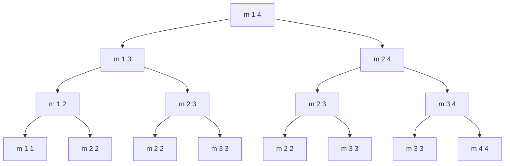
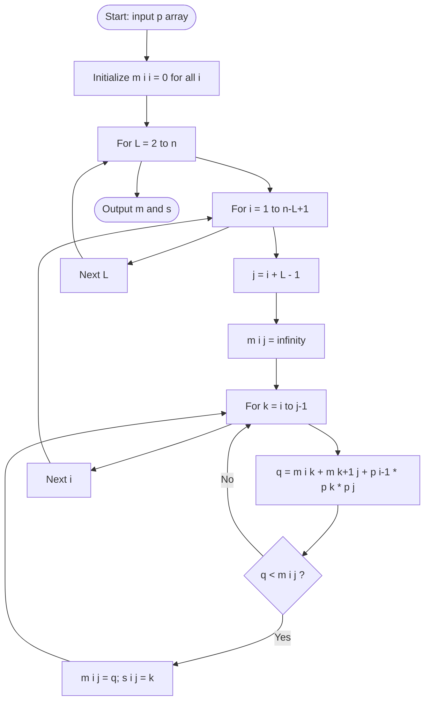
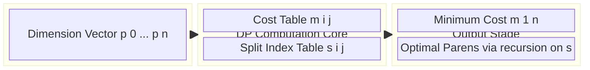
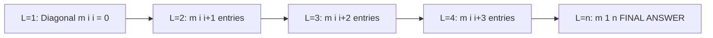

# Matrix Chain Multiplication, Analysis

<!-- SECTION_1_START -->
# Matrix Chain Multiplication (MCM) — Core Technical Foundation

## 1.1 Formal Academic Definition

> [!IMPORTANT]
> **Definition (KTU 2024 Scheme — OECST831 / Module 4):**
> Given a chain of $n$ matrices $\langle A_1, A_2, \dots, A_n \rangle$ where matrix $A_i$ has dimensions $p_{i-1} \times p_i$, the **Matrix Chain Multiplication problem** asks for the most computationally efficient way to multiply these matrices by fully parenthesizing the product $A_1 \cdot A_2 \cdots A_n$. The objective is to **minimize the total number of scalar multiplications** performed. The problem is a *decision* + *optimization* problem; the matrices themselves are **not** multiplied during the algorithm — only their dimensions are processed.

> [!NOTE]
> The total number of distinct parenthesizations of $n$ matrices is the **Catalan Number**:
> $$C(n-1) = \frac{1}{n}\binom{2(n-1)}{n-1} = \Omega\left(\frac{4^n}{n^{3/2}}\right)$$
> Brute-force enumeration is therefore **exponential and infeasible** for $n \ge 10$.

## 1.2 Intuition & Real-World Analogy

> [!TIP]
> **Conceptual Analogy — "The Smart Delivery Truck":**
> Imagine you must ship **5 boxes** through **4 sequential hubs** of varying toll widths. Each box is a "matrix" and the toll charged equals the cross-sectional area (rows × cols × next-cols). You can *reorder which boxes get combined first* (parenthesize), but every reorder costs a different amount. **MCM finds the cheapest reorganization strategy.**
>
> *Example:* Computing $A_1 A_2 A_3$ where sizes are $10\times 30$, $30\times 5$, $5\times 60$:
> - Strategy 1: $(A_1 A_2) A_3 \Rightarrow (10 \cdot 30 \cdot 5) + (10 \cdot 5 \cdot 60) = 1500 + 3000 = 4500$ ops
> - Strategy 2: $A_1 (A_2 A_3) \Rightarrow (30 \cdot 5 \cdot 60) + (10 \cdot 30 \cdot 60) = 9000 + 18000 = 27000$ ops
>
> **Strategy 1 is 6× cheaper** — same math result, vastly different cost!

## 1.3 The Governing Cost Function

For matrices $A_i$ of dimension $p_{i-1} \times p_i$ and $A_{i+1}$ of dimension $p_i \times p_{i+1}$:

$$
\text{Cost}(A_i \cdot A_{i+1}) = p_{i-1} \cdot p_i \cdot p_{i+1}
$$

The associative property guarantees identical numerical output for *any* valid parenthesization, but cost varies dramatically.

> [!VISUALIZATION CONTROL]
> **Concept:** Cost distribution of MCM splits — exponential decay of brute-force vs. cubic DP.
> **GeoGebra / Desmos Input Equations:**
> * `f(x) = 4^x / sqrt(pi*x)` &nbsp;(Brute-force Catalan-style explosion)
> * `g(x) = x^3` &nbsp;(DP algorithm upper bound)
> **Visual Description:** The orange curve $f(x)$ shoots up vertically — a clear visualization of why brute force fails. The blue $g(x)$ grows gently — proving DP's tractability for $n$ up to several hundred.
<!-- SECTION_1_END -->

<!-- SECTION_2_START -->
# Deep Theoretical Analysis & KTU Formula Sheet

## 2.1 The Two Pillars of DP Applicability

MCM is a textbook DP problem because it satisfies **both** necessary conditions:

| Principle | Formal Statement for MCM |
|---|---|
| **Optimal Substructure** | If an optimal parenthesization of $A_i \cdots A_j$ splits at index $k$, then the two sub-products $A_i \cdots A_k$ and $A_{k+1} \cdots A_j$ must themselves be **optimally** parenthesized. (Proved by cut-and-paste contradiction.) |
| **Overlapping Subproblems** | The naive recursive formulation recomputes the same $m[i,j]$ values exponentially many times. Example: $m[1,4]$ references $m[1,3]$ and $m[2,4]$, both of which independently re-reference $m[2,3]$ — leading to recomputation. |

## 2.2 KTU High-Yield Formula Sheet

| Symbol | Meaning | Constraint / Value |
|---|---|---|
| $p[i]$ | Dimension row of $A_{i+1}$ / col of $A_i$ | $0 \le i \le n$ |
| $A_i$ | $i$-th matrix in the chain | $p_{i-1} \times p_i$ |
| $m[i,j]$ | Min scalar multiplications for $A_i \cdots A_j$ | $1 \le i \le j \le n$ |
| $s[i,j]$ | Split index $k$ achieving $m[i,j]$ | $i \le k < j$ |
| $n$ | Total number of matrices | $n \ge 1$ |
| $L$ | Current chain length being computed | $2 \le L \le n$ |

### Core Recurrence (Box-1 — KTU-Favorite)

$$
m[i,j] = \begin{cases}
0 & \text{if } i = j \\
\displaystyle\min_{i \le k < j}\bigl\{\,m[i,k] \;+\; m[k+1,j] \;+\; p_{i-1}\cdot p_k \cdot p_j\,\bigr\} & \text{if } i < j
\end{cases}
$$

### Auxiliary Cost Formula (Box-2)

$$
q = m[i,k] + m[k+1,j] + p[i-1] \cdot p[k] \cdot p[j]
$$

> [!IMPORTANT]
> **Engineering Utility:** MCM's structure is identical to problems in **compiler design** (optimal expression evaluation), **database query optimization** (join ordering), **VLSI circuit layout**, and **deep learning compilers** (kernel fusion ordering in TensorRT, TVM). Mastering MCM unlocks the meta-pattern for *all* such sequence-optimization tasks.

## 2.3 Algorithmic Strategy — Bottom-Up Tabulation

The DP algorithm processes chains of **increasing length** $L$:

1. **Initialize:** $m[i,i] = 0$ for all $i$ (single matrix costs nothing).
2. **Iterate** $L = 2, 3, \dots, n$:
   - For each starting index $i$ where $i + L - 1 \le n$, set $j = i + L - 1$.
   - Try every split $k \in [i, j-1]$; record the minimum cost and the corresponding $k$.
3. **Final answer:** $m[1,n]$.
4. **Reconstruct:** Use the $s[i,j]$ table to recursively print the optimal parenthesization.

### Complexity Footprint

| Resource | Bottom-Up DP | Memoized Recursion | Naive Recursion |
|---|---|---|---|
| **Time** | $\Theta(n^3)$ | $\Theta(n^3)$ | $\Omega(2^n)$ |
| **Space (auxiliary)** | $\Theta(n^2)$ | $\Theta(n^2)$ | $\Theta(n)$ stack |
| **Number of subproblems** | $\binom{n}{2} = \frac{n(n-1)}{2}$ | Same | Exponential blow-up |
<!-- SECTION_2_END -->

<!-- SECTION_3_START -->
# Step-by-Step Derivations & Implementation

## 3.1 Worked Numerical Example (KTU Standard — 4 Matrices)

> [!NOTE]
> **Problem Setup:** Let the dimension array be
> $$p = \langle 5,\; 2,\; 3,\; 4,\; 6 \rangle$$
> representing 4 matrices: $A_1(5 \times 2)$, $A_2(2 \times 3)$, $A_3(3 \times 4)$, $A_4(4 \times 6)$.

### Step 1 — Fill the Diagonal ($L = 1$)

By definition, $m[i,i] = 0$:
$$m[1,1] = m[2,2] = m[3,3] = m[4,4] = 0$$

### Step 2 — Compute Length-2 Chains ($L = 2$)

$$
\begin{aligned}
m[1,2] &= 0 + 0 + p_0 \cdot p_1 \cdot p_2 = 5 \cdot 2 \cdot 3 = 30, \quad s[1,2] = 1 \\
m[2,3] &= 0 + 0 + p_1 \cdot p_2 \cdot p_3 = 2 \cdot 3 \cdot 4 = 24, \quad s[2,3] = 2 \\
m[3,4] &= 0 + 0 + p_2 \cdot p_3 \cdot p_4 = 3 \cdot 4 \cdot 6 = 72, \quad s[3,4] = 3
\end{aligned}
$$

### Step 3 — Compute Length-3 Chains ($L = 3$)

**For $m[1,3]$** try $k = 1, 2$:

$$
\begin{aligned}
k=1:&\quad m[1,1] + m[2,3] + p_0 \cdot p_1 \cdot p_3 = 0 + 24 + 5 \cdot 2 \cdot 4 = 64 \\
k=2:&\quad m[1,2] + m[3,3] + p_0 \cdot p_2 \cdot p_3 = 30 + 0 + 5 \cdot 3 \cdot 4 = 90 \\
\Rightarrow&\quad m[1,3] = 64, \quad s[1,3] = 1
\end{aligned}
$$

**For $m[2,4]$** try $k = 2, 3$:

$$
\begin{aligned}
k=2:&\quad m[2,2] + m[3,4] + p_1 \cdot p_2 \cdot p_4 = 0 + 72 + 2 \cdot 3 \cdot 6 = 108 \\
k=3:&\quad m[2,3] + m[4,4] + p_1 \cdot p_3 \cdot p_4 = 24 + 0 + 2 \cdot 4 \cdot 6 = 72 \\
\Rightarrow&\quad m[2,4] = 72, \quad s[2,4] = 3
\end{aligned}
$$

### Step 4 — Compute the Full Chain ($L = 4$)

**For $m[1,4]$** try $k = 1, 2, 3$:

$$
\begin{aligned}
k=1:&\quad m[1,1] + m[2,4] + p_0 \cdot p_1 \cdot p_4 = 0 + 72 + 5 \cdot 2 \cdot 6 = 132 \\
k=2:&\quad m[1,2] + m[3,4] + p_0 \cdot p_2 \cdot p_4 = 30 + 72 + 5 \cdot 3 \cdot 6 = 192 \\
k=3:&\quad m[1,3] + m[4,4] + p_0 \cdot p_3 \cdot p_4 = 64 + 0 + 5 \cdot 4 \cdot 6 = 184 \\
\Rightarrow&\quad m[1,4] = 132, \quad s[1,4] = 1
\end{aligned}
$$

### Step 5 — Reconstruct the Optimal Parenthesization

Using the $s$ table:
- $s[1,4] = 1 \Rightarrow$ split as $A_1 \cdot (A_2 A_3 A_4)$
- $s[2,4] = 3 \Rightarrow$ split as $(A_2 A_3) \cdot A_4$

$$
\boxed{\text{Optimal Parenthesization: } (A_1) \cdot ((A_2 \cdot A_3) \cdot A_4) \quad \text{at a minimum cost of } \mathbf{132} \text{ scalar multiplications}}
$$

### Final Cost Matrices (Valuation-Ready Snapshot)

| $m[i,j]$ | 1 | 2 | 3 | 4 |
|---|---|---|---|---|
| **1** | **0** | 30 | 64 | **132** |
| **2** | — | **0** | 24 | 72 |
| **3** | — | — | **0** | 72 |
| **4** | — | — | — | **0** |

| $s[i,j]$ | 1 | 2 | 3 | 4 |
|---|---|---|---|---|
| **1** | — | 1 | 1 | **1** |
| **2** | — | — | 2 | 3 |
| **3** | — | — | — | 3 |
| **4** | — | — | — | — |

## 3.2 Production-Ready Python Implementation

```python
from typing import List, Tuple
import sys

def matrix_chain_order(p: List[int]) -> Tuple[List[List[int]], List[List[int]]]:
    """
    Computes the optimal parenthesization cost for matrix chain multiplication
    using bottom-up dynamic programming.
    
    Parameters
    ----------
    p : List[int]
        Dimension vector where matrix A_i has dimensions p[i-1] x p[i].
    
    Returns
    -------
    (m, s) : Tuple of cost matrix m and split-index matrix s.
    """
    n: int = len(p) - 1
    if n < 1:
        raise ValueError("At least one matrix is required.")
    
    # Initialize DP tables: m[i][j] = min cost; s[i][j] = split index
    m: List[List[int]] = [[0] * (n + 1) for _ in range(n + 1)]
    s: List[List[int]] = [[0] * (n + 1) for _ in range(n + 1)]
    
    # Chain length L grows from 2 to n
    for L in range(2, n + 1):
        for i in range(1, n - L + 2):
            j: int = i + L - 1
            m[i][j] = sys.maxsize
            # Try every possible split k
            for k in range(i, j):
                q: int = m[i][k] + m[k + 1][j] + p[i - 1] * p[k] * p[j]
                if q < m[i][j]:
                    m[i][j] = q
                    s[i][j] = k
    return m, s


def print_optimal_parens(s: List[List[int]], i: int, j: int) -> str:
    """
    Recursively reconstructs the fully parenthesized optimal expression.
    """
    if i == j:
        return f"A{i}"
    left: str = print_optimal_parens(s, i, s[i][j])
    right: str = print_optimal_parens(s, s[i][j] + 1, j)
    return f"({left}{right})"


# ---------- Driver / Test Harness ----------
if __name__ == "__main__":
    p: List[int] = [5, 2, 3, 4, 6]
    m, s = matrix_chain_order(p)
    
    print(f"Minimum scalar multiplications: {m[1][len(p) - 1]}")
    print(f"Optimal parenthesization     : {print_optimal_parens(s, 1, len(p) - 1)}")
    # Expected Output:
    # Minimum scalar multiplications: 132
    # Optimal parenthesization     : (A1((A2A3)A4))
```

### Memoized (Top-Down) Variant

```python
def memoized_matrix_chain(p: List[int]) -> List[List[int]]:
    """Top-down DP using memoization (recursion with caching)."""
    n: int = len(p) - 1
    m: List[List[int]] = [[-1] * (n + 1) for _ in range(n + 1)]
    
    def lookup(i: int, j: int) -> int:
        if m[i][j] != -1:
            return m[i][j]
        if i == j:
            m[i][j] = 0
        else:
            best: int = sys.maxsize
            for k in range(i, j):
                q: int = lookup(i, k) + lookup(k + 1, j) + p[i - 1] * p[k] * p[j]
                if q < best:
                    best = q
            m[i][j] = best
        return m[i][j]
    
    _ = lookup(1, n)
    return m
```

## 3.3 Complete Recurrence Derivation (Why It Works)

> [!NOTE]
> **Optimal Substructure Proof (Cut-and-Paste Argument):**
> Suppose the optimal solution for $A_i \cdots A_j$ splits at some index $k = k^*$. Then the total cost is:
> $$\text{Cost} = \text{Cost}(A_i \cdots A_{k^*}) + \text{Cost}(A_{k^*+1} \cdots A_j) + p_{i-1} \cdot p_{k^*} \cdot p_j$$
> Assume for contradiction that $A_i \cdots A_{k^*}$ is *not* optimally parenthesized. Then there exists a cheaper parenthesization of cost $c' < \text{Cost}(A_i \cdots A_{k^*})$. Replacing the original sub-chain with this cheaper one yields a total cost less than the supposed optimal — contradiction. $\blacksquare$

## 3.4 Pseudocode (Cormen-style — KTU Reference)

```
MATRIX-CHAIN-ORDER(p)
1  n ← length[p] − 1
2  let m[1..n, 1..n] and s[1..n−1, 2..n] be new tables
3  for i ← 1 to n
4      m[i,i] ← 0
5  for L ← 2 to n                         // L = chain length
6      for i ← 1 to n − L + 1
7          j ← i + L − 1
8          m[i,j] ← ∞
9          for k ← i to j − 1
10             q ← m[i,k] + m[k+1,j] + p[i−1]·p[k]·p[j]
11             if q < m[i,j]
12                m[i,j] ← q
13                s[i,j] ← k
14 return m and s
```
<!-- SECTION_3_END -->

<!-- SECTION_4_START -->
# Structural Diagrams & Schematics

## 4.1 Recursion Tree of Subproblems



> [!NOTE]
> **Visual Insight:** Notice that subproblems `m 2 3` and `m 3 3` appear **multiple times** in the recursion tree — this is precisely the **overlapping subproblems** property that justifies memoization/tabulation.

## 4.2 Algorithmic Processing Flow



## 4.3 Block-Level Functional Architecture



## 4.4 DP Table Filling Order (Diagonal Sweep)



> [!TIP]
> The DP table is filled **diagonal by diagonal** because the computation of a length-$L$ entry depends *only* on entries from smaller chain lengths ($L' < L$). This is the hallmark of bottom-up DP.
<!-- SECTION_4_END -->

<!-- SECTION_5_START -->
# KTU 2024 Scheme Examination Question Bank

## Part A — Short Answer (3 Marks Each)

### Question 1
`[KTU University Exam — July 2024]`
**State and explain the Matrix Chain Multiplication problem. Write its optimal substructure recurrence.**

**Model Answer (Key Points):**
- **Problem statement** [1 Mark]: Given a sequence of $n$ compatible matrices $\langle A_1, A_2, \dots, A_n \rangle$ with dimensions $p_{i-1} \times p_i$, find the parenthesization that minimizes scalar multiplications.
- **Why DP applies** [1 Mark]: Exhibits *optimal substructure* and *overlapping subproblems*.
- **Recurrence** [1 Mark]: $m[i,j] = 0$ if $i=j$; else $m[i,j] = \min_{i \le k < j}\{m[i,k] + m[k+1,j] + p_{i-1} p_k p_j\}$.

### Question 2
`[KTU University Exam — Dec 2023]`
**What is the time and space complexity of the Matrix Chain Multiplication algorithm? Why is the naive recursive approach inefficient?**

**Model Answer:**
- **Time complexity** [1 Mark]: $\Theta(n^3)$ — three nested loops over chain length, start, and split.
- **Space complexity** [1 Mark]: $\Theta(n^2)$ for the $m$ and $s$ tables.
- **Naive recursion** [1 Mark]: Runs in $\Omega(2^n)$ because each subproblem branches into two recursive calls without memoization, leading to exponential recomputation of the same $m[i,j]$ entries.

---

## Part B — Full 14-Mark Question (Module Internal Choice)

### Question A — 14 Marks
`[KTU University Exam — Model Paper 2024 / Module 4]`
**Course Outcome:** CO2 &nbsp;|&nbsp; **RBT Levels:** Apply (a), Analyze (b)

Consider a chain of 5 matrices with dimensions:
$$A_1: 4 \times 2, \quad A_2: 2 \times 3, \quad A_3: 3 \times 2, \quad A_4: 2 \times 4, \quad A_5: 4 \times 3$$

#### (a) [7 Marks — Apply] 
Construct the cost table $m[i,j]$ and split-index table $s[i,j]$ using the bottom-up DP algorithm. Show all intermediate computations.

**Model Solution:**

Step 1 — Set $p = \langle 4, 2, 3, 2, 4, 3 \rangle$, $n = 5$. Initialize $m[i,i] = 0$.

Step 2 — Length $L = 2$:
$$
\begin{aligned}
m[1,2] &= 4 \cdot 2 \cdot 3 = 24, \quad s[1,2] = 1 \\
m[2,3] &= 2 \cdot 3 \cdot 2 = 12, \quad s[2,3] = 2 \\
m[3,4] &= 3 \cdot 2 \cdot 4 = 24, \quad s[3,4] = 3 \\
m[4,5] &= 2 \cdot 4 \cdot 3 = 24, \quad s[4,5] = 4
\end{aligned}
$$

[Correct identification of base case and $L=2$ entries: 2 Marks]

Step 3 — Length $L = 3$:
$$
\begin{aligned}
m[1,3] &: k=1 \Rightarrow 0+12+4\cdot2\cdot2 = 28;\quad k=2 \Rightarrow 24+0+4\cdot3\cdot2 = 48 \\
\Rightarrow m[1,3] &= 28, \quad s[1,3] = 1 \\
m[2,4] &: k=2 \Rightarrow 0+24+2\cdot3\cdot4 = 48;\quad k=3 \Rightarrow 12+0+2\cdot2\cdot4 = 28 \\
\Rightarrow m[2,4] &= 28, \quad s[2,4] = 3 \\
m[3,5] &: k=3 \Rightarrow 0+24+3\cdot2\cdot3 = 42;\quad k=4 \Rightarrow 24+0+3\cdot4\cdot3 = 60 \\
\Rightarrow m[3,5] &= 42, \quad s[3,5] = 3
\end{aligned}
$$

[Correct evaluation of all $L=3$ candidates: 2 Marks]

Step 4 — Length $L = 4$:
$$
\begin{aligned}
m[1,4] &: k=1 \Rightarrow 0+28+4\cdot2\cdot4 = 60;\quad k=2 \Rightarrow 24+24+4\cdot3\cdot4 = 96;\quad k=3 \Rightarrow 28+0+4\cdot2\cdot4 = 60 \\
\Rightarrow m[1,4] &= 60, \quad s[1,4] = 1 \text{ (or 3 — both yield 60)} \\
m[2,5] &: k=2 \Rightarrow 0+42+2\cdot3\cdot3 = 60;\quad k=3 \Rightarrow 12+24+2\cdot2\cdot3 = 48;\quad k=4 \Rightarrow 28+0+2\cdot4\cdot3 = 52 \\
\Rightarrow m[2,5] &= 48, \quad s[2,5] = 3
\end{aligned}
$$

[Correct evaluation of $L=4$ candidates with minimum selection: 2 Marks]

Step 5 — Length $L = 5$:
$$
\begin{aligned}
m[1,5] &: k=1 \Rightarrow 0+48+4\cdot2\cdot3 = 72;\quad k=2 \Rightarrow 24+42+4\cdot3\cdot3 = 102 \\
&\quad k=3 \Rightarrow 28+24+4\cdot2\cdot3 = 76;\quad k=4 \Rightarrow 60+0+4\cdot4\cdot3 = 108 \\
\Rightarrow m[1,5] &= \mathbf{72}, \quad s[1,5] = 1
\end{aligned}
$$

[Final answer extraction and split identification: 1 Mark]

#### (b) [7 Marks — Analyze]
**Reconstruct the optimal parenthesization** from the $s$ table and **verify the minimum cost** by computing the total scalar multiplications step by step.

**Model Solution:**

Following $s$ table: $s[1,5]=1 \Rightarrow A_1 (A_2 A_3 A_4 A_5)$; $s[2,5]=3 \Rightarrow (A_2 A_3)(A_4 A_5)$.

$$
\boxed{\text{Optimal Parenthesization: } (A_1) \cdot ((A_2 \cdot A_3) \cdot (A_4 \cdot A_5))}
$$

**Cost verification by manual evaluation:**

Sub-costs:
- $A_2 \cdot A_3$: $2 \cdot 3 \cdot 2 = 12$ ops $\Rightarrow$ result is $2 \times 2$ matrix. [1 Mark]
- $A_4 \cdot A_5$: $2 \cdot 4 \cdot 3 = 24$ ops $\Rightarrow$ result is $2 \times 3$ matrix. [1 Mark]
- $(A_2 A_3) \cdot (A_4 A_5)$: $2 \cdot 2 \cdot 3 = 12$ ops $\Rightarrow$ result is $2 \times 3$ matrix. [1 Mark]
- $A_1 \cdot \text{(above)}$: $4 \cdot 2 \cdot 3 = 24$ ops $\Rightarrow$ final $4 \times 3$ matrix. [1 Mark]

Total: $12 + 24 + 12 + 24 = 72$ scalar multiplications ✓ **Matches $m[1,5] = 72$**. [3 Marks for summation + consistency check]

---

### Question B — 14 Marks (Alternative Choice)
`[KTU University Exam — July 2023]`
**Course Outcome:** CO2 &nbsp;|&nbsp; **RBT Levels:** Understand (a), Apply (b)

#### (a) [7 Marks — Understand]
**Explain the Matrix Chain Multiplication problem. Prove that it exhibits optimal substructure.**

**Model Solution Outline:**
1. **Problem definition** [2 Marks]: Formal statement, objective, association property.
2. **Optimal substructure definition** [1 Mark]: The property that the optimal solution to a problem contains within it the optimal solutions to subproblems.
3. **Proof by contradiction (cut-and-paste)** [3 Marks]: Suppose $A_i \cdots A_j$ optimal splits at $k^*$, and $A_i \cdots A_{k^*}$ is not optimal. Then there is a cheaper parenthesization $c'$ of the left sub-chain. Replacing yields strictly smaller total cost, contradicting the optimality of the original. Hence the sub-chain must be optimal.
4. **Recurrence statement** [1 Mark]: The recurrence derived from this substructure.

#### (b) [7 Marks — Apply]
**Write the bottom-up DP algorithm (pseudocode) for Matrix Chain Multiplication and trace it for $p = \langle 1, 2, 3, 4 \rangle$.**

**Model Solution Outline:**
1. **Pseudocode** [3 Marks]: The `MATRIX-CHAIN-ORDER` algorithm with three nested loops, $L$, $i$, $k$.
2. **Diagonal initialization** [1 Mark]: $m[i,i] = 0$.
3. **Trace computation** [3 Marks]:
   - $m[1,2] = 1\cdot2\cdot3 = 6$
   - $m[2,3] = 2\cdot3\cdot4 = 24$
   - $m[1,3] = \min\{0+24+1\cdot2\cdot4,\; 6+0+1\cdot3\cdot4\} = \min\{32, 18\} = 18$ at $k=2$.

> [!WARNING]
> **KTU Examiner's Valuation Pitfalls — Common Mark Deductions:**
> 1. **Forgetting base case**: Many students omit $m[i,i] = 0$. **Deduction: 1 Mark** per missed base case.
> 2. **Index confusion**: Using 0-based indexing when KTU expects 1-based ($A_1, A_2, \dots, A_n$). **Deduction: 1 Mark** for inconsistent indexing.
> 3. **Wrong split range**: Testing $k$ from $i+1$ to $j$ instead of $i$ to $j-1$. This produces off-by-one errors. **Deduction: 2 Marks**.
> 4. **Skipping intermediate $L$ values**: Computing only $L=2$ and $L=n$ without showing $L=3, \dots, n-1$. **Deduction: 1 Mark per missing length**.
> 5. **No reconstruction step**: Stopping at the cost value without producing the parenthesization. **Deduction: 2 Marks** in the reconstruction part.
> 6. **Confusing $p[i-1]\cdot p[k] \cdot p[j]$ with $p[i] \cdot p[k] \cdot p[k+1]$**: Both are valid *expressions* of the same cost; mixing them in one answer shows dimensional inconsistency. **Deduction: 1 Mark**.

---

## Topic Recap & Important Things to Remember

- **Core objective:** Find the parenthesization of $n$ matrices that **minimizes scalar multiplications**; do *not* actually multiply the matrices.
- **Cost of multiplying $A_i (p_{i-1} \times p_i)$ with $A_{i+1} (p_i \times p_{i+1})$:** $p_{i-1} \cdot p_i \cdot p_{i+1}$.
- **Recurrence (memorize verbatim):** $m[i,j] = 0$ if $i=j$, else $m[i,j] = \min_{i \le k < j}\{m[i,k] + m[k+1,j] + p_{i-1}\, p_k\, p_j\}$.
- **Two-table DP:** $m[i,j]$ stores minimum cost; $s[i,j]$ stores the split index $k$ for reconstruction.
- **Initialization:** $m[i,i] = 0$ for all $i = 1, 2, \dots, n$.
- **Processing order:** Bottom-up, **chain length $L = 2, 3, \dots, n$** (never decreasing $L$).
- **Final answer location:** $m[1,n]$ — the top-right cell of the cost table.
- **Reconstruction algorithm:** Recursively call `Print(s, i, s[i,j])` and `Print(s, s[i,j]+1, j)`; base case prints $A_i$.
- **Time complexity:** $\Theta(n^3)$; **Space:** $\Theta(n^2)$.
- **Naive recursion complexity:** Exponential ($\Omega(2^n)$) due to overlapping subproblems.
- **Why DP works:** Both **optimal substructure** (cut-and-paste provable) and **overlapping subproblems** (recomputation observed) hold.
- **Number of valid parenthesizations:** Catalan number $C(n-1) = \frac{1}{n}\binom{2n-2}{n-1}$.
- **Real-world applications:** Compiler expression evaluation, database join ordering, VLSI layout, ML kernel fusion (TensorRT/TVM).
- **Common indexing pitfall:** When the dimension array is $p[0..n]$, matrix $A_i$ uses $p[i-1]$ and $p[i]$ — *never* $p[i]$ and $p[i+1]$.
- **Split range discipline:** $k$ ranges from $i$ to $j-1$ inclusive, giving exactly $j-i$ candidate splits.
- **Verification trick:** Manually compute scalar ops of the reconstructed parenthesization to double-check against $m[1,n]$.
<!-- SECTION_5_END -->
