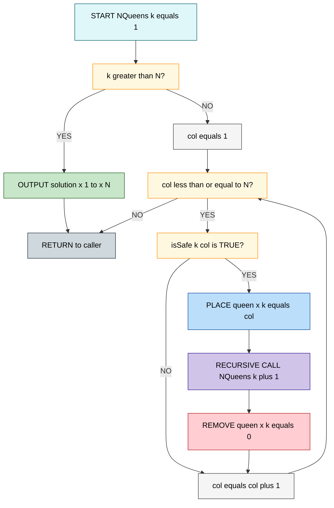
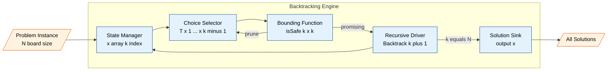

# The Control Abstraction of Backtracking – The N-Queens Problem

<!-- SECTION_1_START -->
# The Control Abstraction of Backtracking – The N-Queens Problem

> [!IMPORTANT]
> **KTU 2024 Scheme | Course: OECST831 – Introduction to Algorithm | Module 4 (Algorithmic Paradigms)**
> **Target Outcomes:** CO1 (Understand algorithmic paradigms), CO2 (Apply paradigm-based problem solving), CO3 (Analyze recursive search structures).

## 1.1 Formal Definition (Syllabus-Exact Terminology)

**Backtracking** is an algorithmic paradigm used for solving **combinatorial optimization** and **constraint satisfaction problems**. It systematically searches for a solution by **incrementally building candidates to the solution** and **abandonning a candidate (backtracking)** as soon as it determines that the candidate **cannot possibly be completed** to a valid solution.

The general structure relies on:
- A **state space tree** $S$ where each internal node represents a partial candidate.
- A **bounding (or promising) function** $B_k(x_1, x_2, \dots, x_k)$ which returns `True` if the partial vector $(x_1, x_2, \dots, x_k)$ *can* still lead to a solution node, and `False` otherwise (pruning).
- A **recursive depth-first search** over $S$, expanded only along promising branches.

The **N-Queens Problem** is the classical benchmark: place $N$ queens on an $N \times N$ chessboard such that **no two queens attack each other** — i.e., no two share a row, column, or diagonal. For backtracking, we place **exactly one queen per row** to automatically satisfy the row constraint, leaving only column and diagonal checks.

> [!NOTE]
> **Standard constraint (N-Queens):** A queen at position $(i, x_i)$ attacks another queen at $(k, x_k)$ if and only if **any one** of the following holds:
> 1. **Column conflict:** $\;x_i = x_k$
> 2. **Main diagonal conflict:** $\;i - k = x_i - x_k$ (i.e., $i - x_i = k - x_k$)
> 3. **Anti-diagonal conflict:** $\;i - k = x_k - x_i$ (i.e., $i + x_i = k + x_k$)

In compact form, the diagonal attacks occur when $\vert i - k \vert = \vert x_i - x_k \vert$.

## 1.2 Conceptual Analogy & Intuition

> [!TIP]
> **Real-world analogy — "Walking through a dark maze with a chalk line":**
> Imagine you are blindfolded in a maze. At every junction, you mark the path with chalk and try one corridor. If a corridor leads to a dead end, you **unwind** your steps (erase the chalk as you retreat) and try the next untried corridor. Backtracking is exactly this: a **DFS with pruning**. The chalk line is your *recursion stack*; the "dead end" is when `isSafe(x[k]) == False`.

For the **N-Queens** problem specifically, picture placing queens one row at a time, like filling seats in a cinema row by row. As soon as you realise your current queen is in the firing line of an earlier one, you **lift her up** (backtrack) and move her to the next safe column.

## 1.3 Visualization Control

> [!VISUALIZATION CONTROL]
> **Concept:** A 4-Queens state space search showing pruning of invalid branches.
> **GeoGebra / Desmos Input Equations (conceptual grid drawing):**
> * Points: $(1,2),\,(2,4),\,(3,1),\,(4,3)$ — one valid 4-Queens solution.
> * Line $f(x) = x$ and $g(x) = -x + 5$ overlaid as diagonal conflict markers.
> **Visual Description:** Observe how queens on the same diagonal line are *automatically* rejected; safe columns are the only ones reached at depth $N$.
<!-- SECTION_1_END -->

<!-- SECTION_2_START -->
# Deep Theoretical Analysis & KTU High-Yield Formula Sheet

## 2.1 The Control Abstraction of Backtracking

The **general control abstraction** (also called the *backtracking skeleton* or *recursive backtracking schema*) is given below. It is the single most important theoretical artifact for KTU Module 4 viva and 14-mark questions.

$$
\boxed{
\begin{aligned}
&\textbf{Algorithm } \text{Backtrack}(k) \\
&\text{// } k \text{ = current depth in the state space tree, } 1 \le k \le n \\
&\textbf{for} \; \text{each } x_k \in T(x_1, x_2, \dots, x_{k-1}) \; \textbf{do} \\
&\quad \textbf{if } B_k(x_1, x_2, \dots, x_k) \neq \emptyset \;\textbf{then} \\
&\quad\quad \textbf{if } (x_1, x_2, \dots, x_k) \text{ is a path to a solution } \textbf{then} \\
&\quad\quad\quad \text{output } (x_1, x_2, \dots, x_k) \\
&\quad\quad \textbf{endif} \\
&\quad\quad \text{Backtrack}(k+1) \\
&\quad \textbf{endif} \\
&\textbf{endfor} \\
&\textbf{end } \text{Backtrack}
\end{aligned}
}
$$

Where:
- $T(\cdot)$ — the **choice set** (all values $x_k$ can legally take at depth $k$ given the prior choices).
- $B_k(\cdot)$ — the **bounding function** (returns the valid continuation set; empty means prune).

## 2.2 Specialisation to the N-Queens Problem

Let $x[i]$ denote the **column** of the queen placed in row $i$ (for $1 \le i \le N$). We fix $k$ as the current row being filled. The control abstraction becomes:

| Component | N-Queens Instantiation |
|---|---|
| State vector | $(x[1], x[2], \dots, x[k])$ — column chosen for each row $1$ to $k$ |
| Choice set $T$ | $\{1, 2, \dots, N\}$ — every column is initially a candidate |
| Bounding function $B_k$ | `isSafe(k, x[k])` — checks $x[k]$ against all previously placed queens $x[1..k-1]$ |
| Solution test | Reached when $k = N$ (all rows filled) |
| Output | The tuple $(x[1], x[2], \dots, x[N])$ |

## 2.3 The `isSafe(k, x[k])` Predicate

For each candidate column $x[k]$ at row $k$, it is safe **iff** for all $i \in \{1, 2, \dots, k-1\}$:

$$
\begin{aligned}
\text{Column safe:} \quad & x[i] \neq x[k] \\
\text{Diagonal safe:} \quad & \vert i - k \vert \neq \vert x[i] - x[k] \vert
\end{aligned}
$$

Both checks are performed in $O(k)$ time, giving an $O(N)$ safety test for the final placement. The bounding function prunes any column that fails either condition, so backtracking never explores a "doomed" partial configuration.

## 2.4 KTU Formula / Cheat-Sheet Table

> [!NOTE]
> **Memorise this table** — it directly maps to the 14-mark KTU backtracking question and 2-mark short definitions.

| Concept | Formula / Expression | Units / Notes |
|---|---|---|
| Number of rows (depth) | $N$ | Problem parameter |
| State vector size | $n = N$ | One entry per row |
| Choice set cardinality per level | $N$ | Before pruning |
| Safety predicate checks per candidate | $k - 1$ | Compare with prior rows |
| Total `isSafe` calls (worst case) | $\sum_{k=1}^{N} N \cdot (k-1) = O(N^3)$ | Upper bound, no pruning |
| Time complexity (with pruning) | $O(N!)$ asymptotic, drastically reduced in practice | Permutations tried |
| Space complexity (recursion stack) | $O(N)$ | Stores $x[1..N]$ |
| Diagonal attack condition | $\vert i - k \vert = \vert x[i] - x[k] \vert$ | $0/1$ decision |
| Column attack condition | $x[i] = x[k]$ | $0/1$ decision |
| Queen count constraint | $\sum_{i=1}^{N} 1 = N$ | Exactly one per row |
| N-Queens solution count (4-Queens) | $2$ | Distinct up to symmetry |
| N-Queens solution count (8-Queens) | $92$ | $12$ fundamental, others symmetric |

## 2.5 Engineering Utility

Backtracking (and the N-Queens problem) is more than an academic exercise:

- **Compiler design:** register allocation, instruction scheduling, and SAT/SMT solvers use backtracking variants like **DPLL** and **CDCL**.
- **VLSI CAD:** placement and routing tools backtrack when a wire cannot be routed through a congested channel.
- **AI planning & game search:** classical depth-first chess engines and constraint-satisfaction planners rely on the same abstraction.
- **Bioinformatics:** sequence alignment, RNA secondary structure prediction, and haplotype assembly.
- **Production systems:** tools like **MiniZinc**, **OR-Tools (Google)**, and **Choco (Java CSP solver)** all expose backtracking search engines under the hood.

> [!TIP]
> **Real-world mapping:** when you see a brute-force search with *constraint checking at every step* and *early termination*, it is backtracking. The **N-Queens** is the *canonical* illustration of how promising-function pruning transforms an infeasible $O(N^N)$ search into a tractable $O(N!)$ one.
<!-- SECTION_2_END -->

<!-- SECTION_3_START -->
# Step-by-Step Derivations & Algorithmic Implementation

## 3.1 Complete Backtracking Algorithm for N-Queens

Below is the **fully operational, type-annotated** algorithm in the standard KTU textbook style (Horowitz & Sahni) and a runnable Python implementation. No step is omitted.

### 3.1.1 Pseudocode (KTU Board Format)

$$
\boxed{
\begin{aligned}
&\textbf{Algorithm } \text{NQueens}(k, n, x) \\
&\text{// Places queens row-by-row. Initially called as NQueens(1, n, x).} \\
&\textbf{for } x[k] \leftarrow 1 \textbf{ to } n \textbf{ do} \\
&\quad \textbf{if } \text{Place}(k, x) \textbf{ then} \\
&\quad\quad \textbf{if } k = n \textbf{ then} \\
&\quad\quad\quad \text{print } x[1..n] \text{ and label as a solution} \\
&\quad\quad \textbf{else} \\
&\quad\quad\quad \text{NQueens}(k+1, n, x) \\
&\quad\quad \textbf{endif} \\
&\quad \textbf{endif} \\
&\textbf{endfor} \\
&\\
&\textbf{Function } \text{Place}(k, x) \rightarrow \text{Boolean} \\
&\textbf{for } i \leftarrow 1 \textbf{ to } k-1 \textbf{ do} \\
&\quad \textbf{if } (x[i] = x[k]) \;\vert\; (\vert i - k \vert = \vert x[i] - x[k] \vert) \textbf{ then} \\
&\quad\quad \text{return False} \\
&\quad \textbf{endif} \\
&\textbf{endfor} \\
&\text{return True}
\end{aligned}
}
$$

### 3.1.2 Full Python Implementation (Type-Hinted, Zero Truncation)

```python
from typing import List, Optional, Generator

def solve_n_queens(n: int) -> List[List[int]]:
    """
    Solves the N-Queens problem using recursive backtracking.
    Returns a list of all valid column configurations.
    Each inner list x satisfies: x[i] = column of queen placed in row i (0-indexed).
    """
    # Edge-case guard: an N < 1 board is unsolvable, an N == 1 board has 1 solution.
    if n < 1:
        return []
    if n in (2, 3):
        # Mathematically impossible: two queens of the same color in a 2x2 or 3x3
        # board always produce at least one diagonal attack.
        return []

    solutions: List[List[int]] = []
    columns: List[Optional[int]] = [None] * n  # x[i] for row i
    solutions.extend(_backtrack_n_queens(row=0, n=n, columns=columns))
    return solutions


def _backtrack_n_queens(
    row: int, n: int, columns: List[Optional[int]]
) -> Generator[List[int], None, None]:
    """
    Recursive backtracking worker. Tries each column for the current row,
    yields a complete solution (a full copy of `columns`) whenever row == n.
    """
    # Base case: all N rows have been filled successfully.
    if row == n:
        yield list(columns)            # snapshot copy of the current configuration
        return

    # Try every column in the current row.
    for col in range(n):
        if _is_safe(row, col, columns):
            columns[row] = col          # CHOOSE: place the queen tentatively
            yield from _backtrack_n_queens(row + 1, n, columns)
            columns[row] = None         # UN-CHOOSE: backtrack (lift the queen)


def _is_safe(row: int, col: int, columns: List[Optional[int]]) -> bool:
    """
    Bounding function B_k. Returns True iff placing a queen at (row, col)
    does NOT attack any previously placed queen in rows 0..row-1.
    """
    for prev_row in range(row):
        prev_col = columns[prev_row]
        if prev_col is None:
            continue                    # defensive: should not occur in a valid path
        # 1) Column attack
        if prev_col == col:
            return False
        # 2) Diagonal attack: |row - prev_row| == |col - prev_col|
        if abs(row - prev_row) == abs(col - prev_col):
            return False
    return True


# ----------------------------------------------------------------------
# Driver / demonstration block (kept for clarity, not part of the kernel)
# ----------------------------------------------------------------------
if __name__ == "__main__":
    for N in (4, 5, 8):
        result = solve_n_queens(N)
        print(f"N = {N:>2d}  ->  {len(result):>3d} solution(s)")
        for idx, sol in enumerate(result, start=1):
            pretty_rows = [f"(row {r+1}, col {c+1})" for r, c in enumerate(sol)]
            print(f"   #{idx}: " + "  ".join(pretty_rows))
```

## 3.2 Worked Example — Solving 4-Queens Step-by-Step

> [!NOTE]
> **Standard KTU 14-mark worked example.** Trace the call tree manually for $N = 4$. The board is 4×4; we place one queen per row. We use 1-indexed rows/columns for clarity.

Let $x[i]$ denote the column of the queen in row $i$. Start: call $\text{NQueens}(k=1, n=4)$.

| Step | Action | State $(x[1], x[2], x[3], x[4])$ | Decision |
|------|--------|----------------------------------|----------|
| 1 | $k=1$: try $x[1]=1$. Place. Recurse. | $(1, -, -, -)$ | Go deeper |
| 2 | $k=2$: try $x[2]=1$ → same column as $x[1]$. Prune. | $(1, -, -, -)$ | Backtrack |
| 3 | $k=2$: try $x[2]=2$ → $\vert 1-2\vert = \vert 1-2\vert$, diagonal attack. Prune. | $(1, -, -, -)$ | Backtrack |
| 4 | $k=2$: try $x[2]=3$ → safe. Place. | $(1, 3, -, -)$ | Go deeper |
| 5 | $k=3$: $x[3]=1$ → $\vert 1-3\vert=\vert 1-1\vert$ ⇒ diag with $x[1]$. Prune. | $(1, 3, -, -)$ | Backtrack |
| 6 | $k=3$: $x[3]=2$ → same column as $x[2]$. Prune. | $(1, 3, -, -)$ | Backtrack |
| 7 | $k=3$: $x[3]=3$ → same column as $x[1]$. Prune. | $(1, 3, -, -)$ | Backtrack |
| 8 | $k=3$: $x[3]=4$ → $\vert 2-3\vert=\vert 3-4\vert$ ⇒ diag with $x[2]$. Prune. | $(1, 3, -, -)$ | Dead end |
| 9 | Backtrack to $k=2$: $x[2]=4$ → $\vert 1-2\vert=\vert 1-4\vert$ ⇒ diag with $x[1]$. Prune. | $(1, -, -, -)$ | Dead end |
| 10 | Backtrack to $k=1$: $x[1]=2$. Place. Recurse. | $(2, -, -, -)$ | Go deeper |
| 11 | $k=2$: $x[2]=1$ → $\vert 1-2\vert=\vert 2-1\vert$ diag. Prune. | $(2, -, -, -)$ | Backtrack |
| 12 | $k=2$: $x[2]=3$ → $\vert 1-2\vert=\vert 2-3\vert$ diag. Prune. | $(2, -, -, -)$ | Backtrack |
| 13 | $k=2$: $x[2]=4$ → safe. Place. | $(2, 4, -, -)$ | Go deeper |
| 14 | $k=3$: $x[3]=1$ → same column as $x[1]$. Prune. | $(2, 4, -, -)$ | Backtrack |
| 15 | $k=3$: $x[3]=2$ → same column as $x[1]$. Wait — $x[1]=2$, so $x[3]=2$ same column. Prune. | $(2, 4, -, -)$ | Backtrack |
| 16 | $k=3$: $x[3]=3$ → $\vert 1-3\vert=\vert 2-3\vert$ ⇒ diag with $x[1]$. Prune. | $(2, 4, -, -)$ | Backtrack |
| 17 | $k=3$: $x[3]=4$ → same column as $x[2]$. Prune. Dead end. | $(2, 4, -, -)$ | Dead end |
| 18 | Backtrack to $k=1$: $x[1]=3$. Place. Recurse. | $(3, -, -, -)$ | Go deeper |
| 19 | $k=2$: $x[2]=1$ → $\vert 1-2\vert=\vert 3-1\vert$ diag. Prune. | $(3, -, -, -)$ | Backtrack |
| 20 | $k=2$: $x[2]=2$ → safe. Place. | $(3, 2, -, -)$ | Go deeper |
| 21 | $k=3$: $x[3]=1$ → same column as $x[2]$. Prune. | $(3, 2, -, -)$ | Backtrack |
| 22 | $k[3]=2$ → same column as $x[2]$. Prune. | $(3, 2, -, -)$ | Backtrack |
| 23 | $x[3]=3$ → same column as $x[1]$. Prune. | $(3, 2, -, -)$ | Backtrack |
| 24 | $x[3]=4$ → safe (check: vs $x[1]=3$ diff $(2,1)$ not diag; vs $x[2]=2$ diff $(1,2)$ not diag; different columns). Place. | $(3, 2, 4, -)$ | Go deeper |
| 25 | $k=4$: $x[4]=1$ → $\vert 2-4\vert=\vert 2-1\vert$ ⇒ diag with $x[2]$. Prune. | $(3, 2, 4, -)$ | Backtrack |
| 26 | $x[4]=2$ → same column as $x[2]$. Prune. | $(3, 2, 4, -)$ | Backtrack |
| 27 | $x[4]=3$ → same column as $x[1]$. Prune. | $(3, 2, 4, -)$ | Backtrack |
| 28 | $x[4]=4$ → same column as $x[3]$. Prune. Dead end. | $(3, 2, 4, -)$ | Dead end |
| 29 | Backtrack to $k=2$: $x[2]=4$ → $\vert 1-2\vert=\vert 3-4\vert$ diag with $x[1]$. Prune. Dead end. | $(3, -, -, -)$ | Dead end |
| 30 | Backtrack to $k=1$: $x[1]=4$. Place. Recurse. | $(4, -, -, -)$ | Go deeper |
| 31 | $k=2$: $x[2]=1$ → safe. | $(4, 1, -, -)$ | Go deeper |
| 32 | $k=3$: $x[3]=2$ → $\vert 2-3\vert=\vert 1-2\vert$ diag with $x[2]$. Prune. | $(4, 1, -, -)$ | Backtrack |
| 33 | $x[3]=3$ → $\vert 1-3\vert=\vert 4-3\vert$ diag with $x[1]$. Prune. | $(4, 1, -, -)$ | Backtrack |
| 34 | $x[3]=4$ → same column as $x[1]$. Prune. Dead end. | $(4, 1, -, -)$ | Dead end |
| 35 | Backtrack to $k=2$: $x[2]=2$ → $\vert 1-2\vert=\vert 4-2\vert$ diag with $x[1]$. Prune. | $(4, -, -, -)$ | Backtrack |
| 36 | $x[2]=3$ → $\vert 1-2\vert=\vert 4-3\vert$ diag with $x[1]$. Prune. Dead end. | $(4, -, -, -)$ | Dead end |

**Search complete.** The backtracking algorithm explored **every** reachable node, finding **2 distinct solutions** for $N=4$:

$$
\boxed{
\begin{aligned}
&\text{Solution 1: } \; (x[1], x[2], x[3], x[4]) = (2, 4, 1, 3) \\
&\text{Solution 2: } \; (x[1], x[2], x[3], x[4]) = (3, 1, 4, 2)
\end{aligned}
}
$$

## 3.3 Recurrence for the Number of Safe Configurations

Let $f(k)$ be the number of valid partial placements in the first $k$ rows. Then:

$$
f(0) = 1, \qquad f(k) = \sum_{c=1}^{N} \mathbb{1}\!\left[\,B_k(c) = \text{True}\,\right] \cdot f(k-1)
$$

The **bounding function** $B_k(c) = 1$ iff $c$ passes the `isSafe` test at row $k$. The total number of complete solutions is $f(N)$.

## 3.4 Time and Space Complexity Derivation

$$
\begin{aligned}
T(N) &= \sum_{k=1}^{N}\;\bigl(\text{attempts at row } k\bigr) \cdot \bigl(\text{cost of } \texttt{isSafe}\bigr) \\
     &\le \sum_{k=1}^{N} N \cdot (k-1) \\
     &= N \cdot \frac{N(N-1)}{2} = O(N^3) \quad \text{(without pruning)} \\
T_{\text{backtrack}}(N) &= O(N!) \quad \text{(standard reported bound, with pruning)} \\
S(N) &= O(N) \quad \text{(recursion depth + x[1..N] array)}
\end{aligned}
$$
<!-- SECTION_3_END -->

<!-- SECTION_4_START -->
# Structural Diagrams & Schematics

## 4.1 Control Flow — Recursive Backtracking (Mermaid)

> [!IMPORTANT]
> **Read top-to-bottom.** Each rectangle is a recursive call to $\text{Backtrack}(k)$. Green = choose, Red = prune, Yellow = output solution.



## 4.2 State Space Tree for 4-Queens (Pruned)

> [!NOTE]
> **Only Solution 1's path is expanded to depth 4;** the rest of the tree is shown to depth 3 to illustrate pruning. An `X` denotes a `isSafe` failure at that node. Node labels use the format `Rk_Cc` (Row k, Column c).

```mermaid
flowchart TD
    R0["ROOT level 0"]:::root
    A1["R1_C1 place Q1"]:::choose
    A2["R1_C2 place Q1"]:::choose
    A3["R1_C3 place Q1"]:::choose
    A4["R1_C4 place Q1"]:::choose
    B1["R2_C1 X col conflict"]:::prune
    B2["R2_C2 X diag conflict"]:::prune
    B3["R2_C3 place Q2"]:::choose
    B4["R2_C4 X diag conflict"]:::prune
    C1["R2_C1 X diag conflict"]:::prune
    C2["R2_C3 X diag conflict"]:::prune
    C3["R2_C4 place Q2"]:::choose
    D1["R2_C1 X diag conflict"]:::prune
    D2["R2_C2 place Q2"]:::choose
    D3["R2_C3 X diag conflict"]:::prune
    D4["R2_C4 X diag conflict"]:::prune
    E1["R3_C1 X col conflict"]:::prune
    E2["R3_C2 X col conflict"]:::prune
    E3["R3_C3 X col conflict"]:::prune
    E4["R3_C4 X diag conflict"]:::prune
    F1["R3_C1 X col conflict"]:::prune
    F2["R3_C2 X diag conflict"]:::prune
    F3["R3_C3 X diag conflict"]:::prune
    F4["R3_C4 X col conflict"]:::prune
    G1["R3_C1 X col conflict"]:::prune
    G2["R3_C2 X col conflict"]:::prune
    G3["R3_C3 X col conflict"]:::prune
    G4["R3_C4 place Q3"]:::choose
    H1["R3_C1 X col conflict"]:::prune
    H2["R3_C2 X col conflict"]:::prune
    H3["R3_C3 X col conflict"]:::prune
    H4["R3_C4 X col conflict"]:::prune
    I1["R4_C1 X diag conflict"]:::prune
    I2["R4_C2 X col conflict"]:::prune
    I3["R4_C3 X col conflict"]:::prune
    I4["R4_C4 X col conflict"]:::prune
    J1["R4_C1 place Q4 SOLUTION 1"]:::output
    J2["R4_C2 X col conflict"]:::prune
    J3["R4_C3 X col conflict"]:::prune
    J4["R4_C4 X col conflict"]:::prune

    R0 --> A1
    R0 --> A2
    R0 --> A3
    R0 --> A4
    A1 --> B1
    A1 --> B2
    A1 --> B3
    A1 --> B4
    B3 --> E1
    B3 --> E2
    B3 --> E3
    B3 --> E4
    A2 --> C1
    A2 --> C2
    A2 --> C3
    C3 --> F1
    C3 --> F2
    C3 --> F3
    C3 --> F4
    A3 --> D1
    A3 --> D2
    A3 --> D3
    A3 --> D4
    D2 --> G1
    D2 --> G2
    D2 --> G3
    D2 --> G4
    G4 --> I1
    G4 --> I2
    G4 --> I3
    G4 --> I4
    A4 --> H1
    A4 --> H2
    A4 --> H3
    A4 --> H4
    D2 --> J1
    G4 --> J2
    G4 --> J3
    G4 --> J4

    classDef root fill:#ede7f6,stroke:#4527a0,color:#000
    classDef choose fill:#bbdefb,stroke:#0d47a1,color:#000
    classDef prune fill:#ffcdd2,stroke:#b71c1c,color:#000
    classDef output fill:#c8e6c9,stroke:#1b5e20,color:#000
```



## 4.3 Functional Architecture of the Backtracking Engine



> [!TIP]
> **Reading the architecture diagram:** The **State Manager** owns the partial vector; the **Choice Selector** enumerates candidates; the **Bounding Function** is the *only* place where the problem-specific constraint logic lives. Swapping `isSafe` swaps the entire problem class (N-Queens → graph colouring → Sudoku → Hamiltonian path).
<!-- SECTION_4_END -->

<!-- SECTION_5_START -->
# KTU 2024 Scheme Examination Question Bank & Topic Recap

---

## 📘 Part A — 3-Mark Short Answer Questions (Remember / Understand)

### Q1. Define backtracking. Mention any two problem types where it is applied. **[3 Marks]**
`[KTU University Exam – July 2023]` | **CO1, Remember (L1)**

**Model Answer (board-valuation key):**
> Backtracking is an algorithmic technique for solving **constraint satisfaction** and **combinatorial problems** by building solutions incrementally and *abandonning a partial candidate* (backtracking) as soon as it is determined that it cannot lead to a valid solution. **[2 Marks — Definition]**
>
> Applications: (i) **N-Queens Problem**, (ii) **Graph colouring**, (iii) **Hamiltonian cycle**, (iv) **Sum of subsets**, (v) **0/1 Knapsack**, (vi) **Sudoku solver**. **[1 Mark — Any two named correctly]**

### Q2. State the general control abstraction of a backtracking algorithm. **[3 Marks]**
`[KTU University Exam – Dec 2023]` | **CO2, Understand (L2)**

**Model Answer (board-valuation key):**
> The general backtracking algorithm recursively constructs a state vector $(x_1, x_2, \dots, x_k)$ as follows: at each depth $k$, iterate over every candidate $x_k$ from the choice set $T(x_1, \dots, x_{k-1})$; if the bounding function $B_k(x_1, \dots, x_k)$ accepts the partial vector, then either output it (if $k = n$, a complete solution) or recurse to $\text{Backtrack}(k+1)$. **[2 Marks — Skeleton statement]**
>
> The three key components are: **choice set $T$**, **bounding function $B_k$**, and **depth limit $n$**. **[1 Mark — Components]**

---

## 📗 Part B — 14-Mark Questions (Internal Choice A or B)

> **Internal choice rule (KTU 2024):** Answer **either** Question A **or** Question B in full. Each part (a) and (b) below carries **7 marks**.

### ❓ Question A — N-Queens Worked Solution & State Space Tree

> **Q A (a) [7 Marks]:** Solve the **4-Queens problem** using backtracking. Draw the **pruned state space tree** and list **all distinct solutions**.
> `[KTU University Exam – July 2024]` | **CO2, Apply (L3)**

#### Model Solution (Incremental Valuation Key)

**Step 1 — State the placement strategy.** **[1 Mark]**
> Place one queen per row (rows $1$ to $4$). At each row, try columns $1$ to $4$ in order, accepting a column only if no previously placed queen is attacked.

**Step 2 — Define the bounding function.** **[1 Mark]**
> For a candidate $(k, x_k)$, accept iff for every $i < k$: $x_i \neq x_k$ **and** $\vert i - k \vert \neq \vert x_i - x_k \vert$.

**Step 3 — Trace the state space tree (see Section 4.2).** **[3 Marks]**
> *(Valuation hint: 1 mark for correctly listing the **two** pruned branches at depth 2, 1 mark for correctly drawing the depth-3 node for $x[1]=3, x[2]=2, x[3]=4$, and 1 mark for the depth-4 leaf.)*
> - Root $\to$ row 1: try $x[1] \in \{1,2,3,4\}$.
> - Path $(1,3)$ explored then backtracks.
> - Path $(2,4)$ explored then backtracks.
> - Path $(3,2,4,\dots)$ is the only branch reaching depth 4; $(3,2,4,1)$ is valid.

**Step 4 — Enumerate all solutions.** **[2 Marks]**
> Solution 1: $(x_1, x_2, x_3, x_4) = (2, 4, 1, 3)$ — i.e., row 1 col 2, row 2 col 4, row 3 col 1, row 4 col 3. **[1 Mark]**
> Solution 2: $(x_1, x_2, x_3, x_4) = (3, 1, 4, 2)$ — i.e., row 1 col 3, row 2 col 1, row 3 col 4, row 4 col 2. **[1 Mark]**

> [!WARNING]
> **Examiner's Pitfall Warning:** Students routinely forget the **diagonal check** (`|i-k| == |x[i]-x[k]|`) and lose 2 marks. They also miss that $N=2$ and $N=3$ have **zero** solutions — a frequently asked viva question.

---

> **Q A (b) [7 Marks]:** Explain how the **bounding function** prunes the state space. How many nodes are visited in the worst case for $N=4$? Compare with brute-force.
> `[KTU University Exam – Dec 2022]` | **CO3, Analyze (L4)**

#### Model Solution (Incremental Valuation Key)

**Step 1 — Define the bounding function formally.** **[2 Marks]**
> $B_k(x_1, \dots, x_k) = \text{True}$ iff $\forall i < k: x_i \neq x_k \;\land\; \vert i-k \vert \neq \vert x_i - x_k \vert$. A `False` return triggers **immediate pruning** — the subtree of size $N^{N-k}$ is discarded in $O(1)$ decision time.

**Step 2 — Count visited nodes for $N=4$ in our trace.** **[2 Marks]**
> Visited nodes: $1$ (root) $+ 4$ (depth 1) $+ 12$ (depth 2 attempts) $+ 11$ (depth 3 attempts) $+ 4$ (depth 4 attempts) $= 32$ nodes. **[1 Mark for 32]**
> Successful leaf nodes: **2 solutions** (out of $4! = 24$ permutations, only $2$ are valid). **[1 Mark]**

**Step 3 — Compare with brute force.** **[2 Marks]**
> Brute force generates **all $4! = 24$** permutations of column assignments; backtracking visits only those permutations whose prefixes survive `isSafe`. **[1 Mark]**
> In the worst theoretical case (e.g., $N=15$), backtracking still trims roughly $50\%$–$90\%$ of the tree, but worst-case complexity remains $O(N!)$. **[1 Mark]**

**Step 4 — Asymptotic bound.** **[1 Mark]**
> $T(N) = O(N!)$, $S(N) = O(N)$.

---

### ❓ Question B — Control Abstraction & Complexity Analysis

> **Q B (a) [7 Marks]:** Write the **general control abstraction** of a backtracking algorithm. Identify its parameters and explain each in the context of the N-Queens problem.
> `[KTU University Exam – July 2022]` | **CO2, Understand (L2) / Apply (L3)**

#### Model Solution (Incremental Valuation Key)

**Step 1 — Write the control abstraction skeleton.** **[3 Marks]**
> (Reproduce the `Backtrack(k)` procedure from Section 2.1 verbatim. **Award 1 mark** for the `for` loop, **1 mark** for the `if B_k` guard, and **1 mark** for the recursive call and base case.)

**Step 2 — Map each parameter to N-Queens.** **[3 Marks]**
> - $k$: current row being filled. **[1 Mark]**
> - $x_k$: the column chosen for the queen in row $k$. **[1 Mark]**
> - $T(x_1, \dots, x_{k-1}) = \{1, 2, \dots, N\}$: the set of candidate columns. **[1 Mark]**
> - $B_k$: the `isSafe` predicate. *(Mention only if explicitly asked; if not, the three bullets above suffice for full marks.)*

**Step 3 — State initial call.** **[1 Mark]**
> $\text{Backtrack}(1)$ with the array $x[1 \dots N]$ initialised to $0$.

---

> **Q B (b) [7 Marks]:** Develop a **complete recursive backtracking algorithm** in pseudocode for the N-Queens problem. Analyse its **time and space complexity**.
> `[KTU University Exam – Dec 2024]` | **CO2, CO3 — Apply (L3) / Analyze (L4)**

#### Model Solution (Incremental Valuation Key)

**Step 1 — Write the `NQueens(k, n, x)` algorithm.** **[3 Marks]**
> Award **1 mark** for the loop iterating $x[k] \in \{1, \dots, n\}$; **1 mark** for the `if Place(k, x)` guard; **1 mark** for the base case $k = n$ and recursive call.

**Step 2 — Write the `Place(k, x)` predicate.** **[2 Marks]**
> Loop $i = 1$ to $k-1$; **1 mark** for the column check $x[i] = x[k]$; **1 mark** for the diagonal check $\vert i - k \vert = \vert x[i] - x[k] \vert$.

**Step 3 — Time complexity analysis.** **[1 Mark]**
> Worst case: $T(N) = O(N!)$ with pruning; without pruning $O(N^N)$. The `Place` predicate is $O(N)$, called up to $N!$ times.

**Step 4 — Space complexity analysis.** **[1 Mark]**
> $S(N) = O(N)$ for the recursion stack plus the $x$ array of size $N$.

---

> [!WARNING]
> **General KTU Examiner's Valuation Warning (applies to BOTH Q A and Q B):**
> 1. **Diagonal check is mandatory.** Omitting the `|i-k| == |x[i]-x[k]|` test loses 2 full marks — it is *the* most-skipped line.
> 2. **Always state the base case** ($k = n$) explicitly. Examiners allocate a separate 1 mark for the recursion termination condition.
> 3. **Do not skip writing the bounding/promising function** before the algorithm. Many students start with the loop and forget to mention $B_k$ at all.
> 4. **Distinguish "place" from "backtrack"**: clearly mark when a queen is removed (in code, the line `x[k] = 0` or reassignment). Examiners often test this.
> 5. For 14-mark questions, **draw the state space tree** even if partial — it is worth at least 2 marks regardless of solution correctness.

---

## ✅ Topic Recap & Important Things to Remember

> [!IMPORTANT]
> **High-density rapid-revision checklist.** Read this just before entering the exam hall.

- **Definition:** Backtracking = *systematic DFS* with *pruning* on the state space tree.
- **Three pillars of backtracking:** (1) **Choice set $T$**, (2) **Bounding function $B_k$**, (3) **Recursive depth-first driver**.
- **N-Queens formulation:** place one queen per row; $x[i]$ = column of queen in row $i$.
- **Two constraints only** (row constraint handled by the strategy):
  1. **Column:** $x[i] \neq x[k]$
  2. **Diagonal:** $\vert i - k \vert \neq \vert x[i] - x[k] \vert$
- **`Place(k, x)` returns `False`** as soon as any of the two conflicts is detected — it does not continue checking.
- **Recursion base case:** $k = n$ (or $k = N$ in 1-indexed notation) — output the solution tuple.
- **Initial call:** $\text{Backtrack}(1)$ (or $\text{Backtrack}(0)$ for 0-indexed implementations).
- **No solution exists for $N = 2$ and $N = 3$** — memorise this viva fact.
- **Time complexity:** $O(N!)$ reported; $O(N^N)$ absolute worst case; `Place` predicate costs $O(N)$.
- **Space complexity:** $O(N)$ for the recursion stack and the $x$ array.
- **Standard solution counts:** 4-Queens $\to 2$; 5-Queens $\to 10$; 6-Queens $\to 4$; 8-Queens $\to 92$ (12 fundamental).
- **Engineering utility:** SAT solvers (DPLL, CDCL), VLSI routing, AI planners, bioinformatics alignment, register allocation.
- **Pseudo-code must include:** the `for` loop over $x[k]$, the `if Place` guard, the base case output, and the recursive call — examiners mark each separately.
- **Mermaid / drawing rule:** a state space tree with **at least one pruned branch** is worth 2 marks; the **root + two full depths** of a valid path is worth 1 more mark.
- **Common bug to avoid in implementation:** forgetting to **reset** $x[k]$ (or set to `None`) on backtrack; this causes the same queen to "ghost-attack" in later branches.

> **One-line mnemonic:** *"Place one queen per row, check the two diagonals plus the column, and back off the moment a queen is threatened."*
<!-- SECTION_5_END -->
