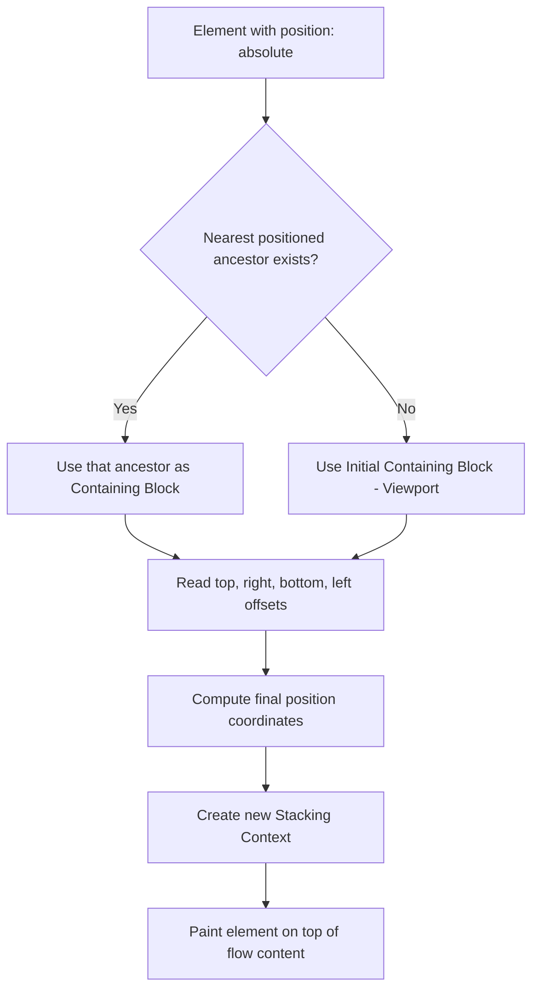
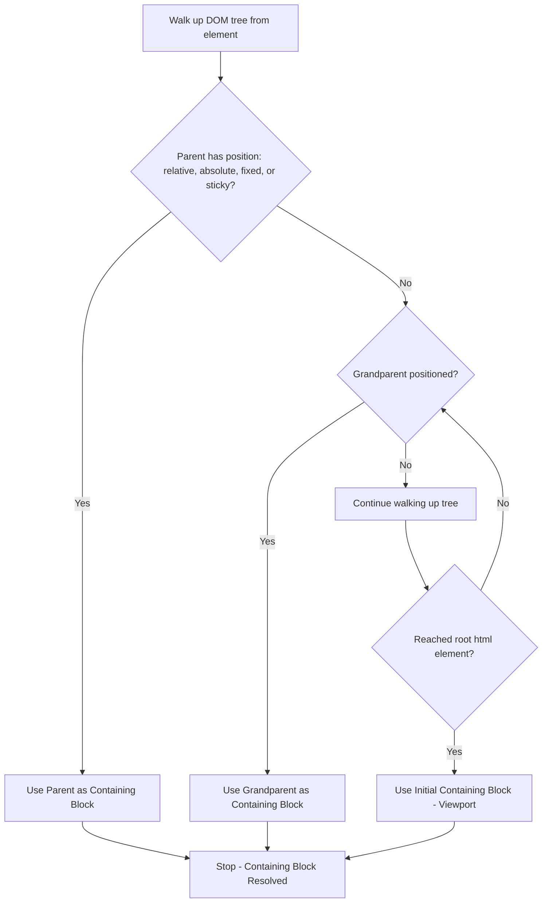
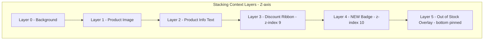
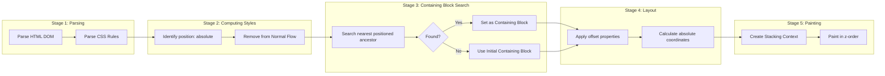
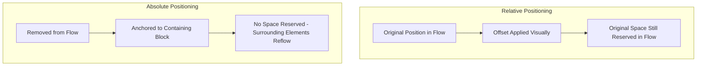

# Absolute Positioning

<!-- SECTION_1_START -->
# Absolute Positioning in HTML5 / CSS

## 1. Core Technical Definition

> [!IMPORTANT]
> **Absolute Positioning (Definition):** In the CSS Visual Formatting Model, `position: absolute` removes an element entirely from the **normal document flow** and positions it with respect to the edges of its **nearest positioned ancestor** (i.e., the closest ancestor element whose `position` value is `relative`, `absolute`, `fixed`, or `sticky`). If no such ancestor exists, the **initial containing block** (the viewport for continuous media) is used as the reference frame.

In the **KTU 2024 Scheme (OECST832 – Web Programming)** syllabus, this topic falls under **Module 1: Creating Web Pages Using HTML5**, specifically the section dealing with **CSS Layout & Positioning Models**. Absolute positioning is a foundational concept that bridges the gap between static HTML flow and dynamic, coordinate-based UI design.

### Key Terminology

| Term | Meaning |
| :--- | :--- |
| **Normal Flow** | Default rendering order in which block elements stack vertically and inline elements flow horizontally. |
| **Containing Block** | The rectangular reference box against which a positioned element's offsets are measured. |
| **Initial Containing Block (ICB)** | A virtual rectangle with the dimensions of the viewport; used when no positioned ancestor exists. |
| **Offset Properties** | `top`, `right`, `bottom`, `left` — distances from the containing block's respective edges. |
| **Stacking Context** | An isolated 3D conceptual layer in which elements are painted in a strict z-order. |

> [!NOTE]
> **KTU 2024 Syllabus Highlight:** Students must understand *all four* CSS positioning values — `static`, `relative`, `absolute`, and `fixed` — and clearly differentiate absolute from relative positioning. Examiners frequently test this distinction.

---

## 2. Conceptual Analogy & Intuitive Overview

> [!TIP]
> **Real-World Analogy — The Pinned Notice on a Corkboard:**
> Imagine a corkboard (your web page) where papers (HTML elements) are normally placed one below the other in order. Now, suppose you take a small red note and **pin it with a thumbtack at exact coordinates (3 cm from the top, 5 cm from the left)** of the corkboard — completely ignoring the positions of other papers around it. The other papers do not shift to accommodate it; they continue as if the note does not exist. This is exactly what **absolute positioning** does to a DOM element.

### Geometric Intuition

Consider the following visual model:

```
┌─────────────────────────── Viewport (Corkboard) ───────────────────────────┐
│                                                                            │
│   ┌─── Positioned Ancestor (Containing Block) ────┐                        │
│   │ top: 0                                         │                        │
│   │ left: 0                                        │                        │
│   │                                                │                        │
│   │         ┌─ Absolutely Positioned ─┐           │                        │
│   │         │  Element                │           │                        │
│   │         │  top: 20px              │           │                        │
│   │         │  left: 30px             │           │                        │
│   │         │                         │           │                        │
│   │         └─────────────────────────┘           │                        │
│   │                                                │                        │
│   └────────────────────────────────────────────────┘                        │
│                                                                            │
└────────────────────────────────────────────────────────────────────────────┘
```

The element is **anchored at (30, 20)** relative to the top-left corner of its **containing block**, and the surrounding elements behave as if it has zero footprint in the flow.

> [!VISUALIZATION CONTROL]
> **Concept:** Offset coordinates from the containing block edges.
> **GeoGebra / Desmos Input Equations:**
> * Point P = (30, 20)  → represents top-left corner of the absolutely positioned element.
> * Rectangle: corners (30,20), (230,20), (230,120), (30,120).
> **Visual Description:** The student should see a 200×100 px rectangle pinned at coordinates (30,20) measured from the containing block's top-left origin. Other elements in the flow should *not* be displaced.

---

## 3. Why Absolute Positioning Matters in Web Engineering

In production-grade front-end engineering, absolute positioning is used to:

* Build **modal dialogs** and **tooltips** that float above page content.
* Create **notification badges** anchored to icons (e.g., unread count on a chat icon).
* Implement **custom dropdowns**, **autocomplete panels**, and **context menus**.
* Lay out **decorative overlays** such as image captions, "NEW" ribbons, or video play buttons.
* Construct **CSS-only animated UI** components where precise coordinates are mandatory.

> [!IMPORTANT]
> **Engineer's Caution:** Absolute positioning **removes elements from normal flow**. This means they no longer contribute to the height of their parent container, which can cause layout collapse if not handled correctly using techniques like setting explicit `min-height` on the parent or using `position: relative` strategically.

<!-- SECTION_1_END -->

<!-- SECTION_2_START -->
# Deep Theoretical Analysis & KTU High-Yield Formula Sheet

## 1. The CSS Positioning Algorithm — Step by Step

When a browser encounters an element with `position: absolute`, it executes the following internal algorithm:

1. **Step 1 — Identify the Element:** The CSS engine locates the element in the DOM tree and reads its `position` property.
2. **Step 2 — Remove from Normal Flow:** The element is detached from the document flow. Its previous and subsequent sibling elements reflow as though this element does not exist.
3. **Step 3 — Find the Containing Block:** The browser walks **up** the DOM tree from the element's parent, looking for the first ancestor with `position: relative`, `absolute`, `fixed`, or `sticky`. This ancestor becomes the containing block.
4. **Step 4 — Fallback to ICB:** If no positioned ancestor is found, the **initial containing block** (typically the viewport) is used.
5. **Step 5 — Apply Offsets:** The `top`, `right`, `bottom`, `left` properties are resolved as pixel/percentage distances from the containing block's corresponding edges.
6. **Step 6 — Resolve Size:** If `width` and `height` are not explicitly set, the element shrinks to **fit its content** (this is unique — block elements in normal flow take full width by default).
7. **Step 7 — Create Stacking Context:** The element is elevated into a new stacking context (comparable to lifting it onto a transparent glass layer above the rest of the page).

---

## 2. Containing Block Resolution Rules

> [!NOTE]
> **The "Nearest Positioned Ancestor" Rule:**
> Walking up the parent chain, the **first** element whose computed `position` is anything *other than* `static` becomes the containing block. If none exists, the ICB is used.

| Ancestor's `position` | Acts as Containing Block for Descendant's `position: absolute`? |
| :--- | :--- |
| `static` | ❌ No — pass through to the next ancestor |
| `relative` | ✅ Yes — establishes a positioning context |
| `absolute` | ✅ Yes — but it is itself taken out of flow |
| `fixed` | ✅ Yes — anchored to the viewport |
| `sticky` | ✅ Yes — once it becomes "stuck" |

---

## 3. KTU Formula Sheet / Cheat Sheet

> [!TIP]
> The following table is the **exam-ready reference** for absolute positioning problems in KTU university exams.

| Property | Syntax | Effect on Absolutely Positioned Element |
| :--- | :--- | :--- |
| `position` | `position: absolute;` | Removes element from normal flow. |
| `top` | `top: 20px;` | Distance from containing block's **top** edge. |
| `right` | `right: 10px;` | Distance from containing block's **right** edge. |
| `bottom` | `bottom: 5%;` | Distance from containing block's **bottom** edge. |
| `left` | `left: 30px;` | Distance from containing block's **left** edge. |
| `width / height` | `width: 200px; height: 100px;` | Explicit dimensions. If omitted, shrinks to fit content. |
| `z-index` | `z-index: 10;` | Stacking order. Higher value = painted on top. Only works within same stacking context. |
| `min/max` | `min-width: 100px;` | Constrains sizing. |
| `overflow` | `overflow: hidden;` | Clips content that extends beyond the element's box. |

### Mathematical Positioning Equations

The final position of the element's top-left corner can be expressed as:

$$
X_{\text{element}} = X_{\text{containing block}} + \text{left offset}
$$

$$
Y_{\text{element}} = Y_{\text{containing block}} + \text{top offset}
$$

If `right` and `bottom` are used instead (and `width` is fixed), the browser auto-computes `left` and `top`:

$$
\text{left}_{\text{effective}} = W_{\text{containing block}} - \text{right} - W_{\text{element}}
$$

$$
\text{top}_{\text{effective}} = H_{\text{containing block}} - \text{bottom} - H_{\text{element}}
$$

Where:
* $W_{\text{containing block}}$ = width of the nearest positioned ancestor (or viewport).
* $H_{\text{containing block}}$ = height of the nearest positioned ancestor.
* $W_{\text{element}}$ and $H_{\text{element}}$ = the element's own width and height.

---

## 4. Real-World Engineering Utility

| Use Case | Industry Application | Why Absolute Positioning? |
| :--- | :--- | :--- |
| Notification Badges | Messaging Apps (WhatsApp Web, Slack) | Precisely anchor to icon corner regardless of layout shifts. |
| Modal Overlays | SaaS Dashboards (Stripe, Notion) | Cover the entire viewport with a backdrop. |
| Tooltips | IDEs, Documentation Sites | Float beside hovered element at exact coordinates. |
| Video Player Controls | YouTube, Vimeo | Overlay play/pause/volume buttons on `<video>`. |
| Image Captions | News Portals | Layer text on top of hero images. |
| Drag-and-Drop UIs | Trello, Figma Lite | Free coordinate-based movement. |

<!-- SECTION_2_END -->

<!-- SECTION_3_START -->
# Step-by-Step Derivations & Code Implementation

## 1. Worked Example 1 — Basic Absolute Positioning

> [!NOTE]
> **Problem:** Create an HTML5 page with a 400×300 `div` (the container) and a small 100×50 `div` (the badge) absolutely positioned at the **top-right corner** with a 10 px margin from each edge. The badge should display the text "NEW".

### Step 1: HTML Skeleton

```html
<!DOCTYPE html>
<html lang="en">
<head>
    <meta charset="UTF-8">
    <title>Absolute Positioning Demo 1</title>
    <link rel="stylesheet" href="style.css">
</head>
<body>
    <div class="card">
        
        <div class="badge">NEW</div>
    </div>
</body>
</html>
```

### Step 2: CSS Implementation with Inline Comments

```css
/* Step 2.1: Establish a positioning context for the parent */
.card {
    position: relative;          /* THIS IS THE KEY — without this, the badge
                                     would position against the <body> */
    width: 400px;
    height: 300px;
    border: 2px solid #333;
    background-color: #f4f4f4;
    margin: 30px auto;           /* Center the card on the page */
    overflow: hidden;            /* Clip anything that goes outside */
}

/* Step 2.2: Apply absolute positioning to the badge */
.badge {
    position: absolute;          /* Removes badge from normal flow */
    top: 10px;                   /* 10 px from card's top edge */
    right: 10px;                 /* 10 px from card's right edge */
    width: 50px;
    height: 25px;
    background-color: #e74c3c;   /* Red background */
    color: white;
    text-align: center;
    line-height: 25px;
    font-size: 12px;
    font-weight: bold;
    border-radius: 4px;
    z-index: 5;                  /* Ensure it stays above the  */
}
```

### Step 3: Trace the Positioning Math

Given:
* $W_{\text{card}} = 400$ px, $H_{\text{card}} = 300$ px
* $W_{\text{badge}} = 50$ px, $H_{\text{badge}} = 25$ px
* `top: 10px; right: 10px;`

Effective coordinates of the badge's top-left corner:

$$
\text{left}_{\text{effective}} = W_{\text{card}} - \text{right} - W_{\text{badge}} = 400 - 10 - 50 = 340 \text{ px}
$$

$$
\text{top}_{\text{effective}} = 10 \text{ px (explicitly set)}
$$

The badge occupies the rectangle from $(340, 10)$ to $(390, 35)$ within the card.

---

## 2. Worked Example 2 — Centering with Absolute Positioning (The Classic "Transform Trick")

### Problem

Center a 300×200 modal box both horizontally and vertically inside a full-screen overlay.

### Step 1: HTML

```html
<div class="overlay">
    <div class="modal">
        <h2>Confirm Action</h2>
        <p>Are you sure you want to proceed?</p>
        <button>Yes</button>
        <button>Cancel</button>
    </div>
</div>
```

### Step 2: CSS

```css
.overlay {
    position: fixed;              /* Cover the entire viewport */
    top: 0;
    left: 0;
    width: 100vw;
    height: 100vh;
    background-color: rgba(0, 0, 0, 0.6);
    z-index: 1000;
}

.modal {
    position: absolute;          /* Positioned against the fixed overlay */
    top: 50%;                    /* 50% of overlay's height */
    left: 50%;                   /* 50% of overlay's width */
    width: 300px;
    height: 200px;
    /* The transform compensates for the element's own dimensions */
    transform: translate(-50%, -50%);
    background-color: white;
    border-radius: 8px;
    padding: 20px;
    box-shadow: 0 4px 20px rgba(0, 0, 0, 0.3);
    z-index: 1001;
}
```

### Step 3: Mathematical Derivation of Centering

With `top: 50%` and `left: 50%`, the top-left corner of the modal is placed at:

$$
X_{\text{modal corner}} = \frac{W_{\text{overlay}}}{2} = \frac{100\text{vw}}{2} = 50\text{vw}
$$

$$
Y_{\text{modal corner}} = \frac{H_{\text{overlay}}}{2} = \frac{100\text{vh}}{2} = 50\text{vh}
$$

However, the **center of the modal** (which is what we want centered) sits at:

$$
X_{\text{modal center}} = 50\text{vw} + \frac{W_{\text{modal}}}{2} = 50\text{vw} + 150\text{px}
$$

This is offset by $\frac{W_{\text{modal}}}{2}$. To compensate, the `transform: translate(-50%, -50%)` shifts the element back by half its own dimensions:

$$
X_{\text{modal center, final}} = 50\text{vw} + 150 - \frac{300}{2} = 50\text{vw} + 150 - 150 = 50\text{vw} \;\checkmark
$$

The modal is now perfectly centered at the geometric center of the viewport.

---

## 3. Worked Example 3 — Centering with `margin: auto` (Alternative Method)

> [!NOTE]
> This is the **modern, well-supported alternative** that does not use `transform`.

```css
.modal {
    position: absolute;
    top: 0;
    right: 0;
    bottom: 0;
    left: 0;
    width: 300px;
    height: 200px;
    margin: auto;                /* Works only when all four offsets are 0 */
    background-color: white;
}
```

### Why this works

When `top: 0; bottom: 0; left: 0; right: 0;` are all set, the browser distributes the remaining space equally around the fixed-sized element using the auto margins. This is a unique CSS trick valid **only for absolutely positioned elements**.

---

## 4. Comprehensive HTML5 Page — Full Working Example

```html
<!DOCTYPE html>
<html lang="en">
<head>
    <meta charset="UTF-8">
    <meta name="viewport" content="width=device-width, initial-scale=1.0">
    <title>Absolute Positioning - Complete Demo</title>
    <style>
        * { box-sizing: border-box; }

        body {
            font-family: Arial, sans-serif;
            margin: 0;
            padding: 20px;
            background: #ecf0f1;
        }

        /* The parent MUST be relative for the children to anchor to it */
        .product-card {
            position: relative;
            width: 300px;
            height: 400px;
            background: white;
            border: 1px solid #bdc3c7;
            border-radius: 8px;
            margin: 20px auto;
            box-shadow: 0 2px 8px rgba(0, 0, 0, 0.1);
            overflow: hidden;
        }

        .product-image {
            width: 100%;
            height: 250px;
            background: linear-gradient(135deg, #3498db, #8e44ad);
            display: flex;
            align-items: center;
            justify-content: center;
            color: white;
            font-size: 24px;
        }

        .product-info {
            padding: 15px;
        }

        /* Absolute child #1: New badge in top-right corner */
        .new-badge {
            position: absolute;
            top: 10px;
            right: 10px;
            background: #e74c3c;
            color: white;
            padding: 4px 10px;
            border-radius: 4px;
            font-size: 12px;
            font-weight: bold;
            z-index: 10;
        }

        /* Absolute child #2: Discount ribbon at top-left */
        .discount-ribbon {
            position: absolute;
            top: 15px;
            left: -30px;
            transform: rotate(-45deg);
            background: #f39c12;
            color: white;
            padding: 4px 40px;
            font-size: 12px;
            font-weight: bold;
            z-index: 9;
        }

        /* Absolute child #3: Stock-out overlay at bottom */
        .out-of-stock {
            position: absolute;
            bottom: 0;
            left: 0;
            right: 0;
            background: rgba(231, 76, 60, 0.9);
            color: white;
            text-align: center;
            padding: 8px;
            font-weight: bold;
        }
    </style>
</head>
<body>
    <div class="product-card">
        <div class="product-image">Product Image</div>
        <div class="new-badge">NEW</div>
        <div class="discount-ribbon">-20%</div>
        <div class="product-info">
            <h3>Wireless Headphones</h3>
            <p>Premium sound quality</p>
        </div>
        <div class="out-of-stock">Out of Stock</div>
    </div>
</body>
</html>
```

### Output Layout Trace

For the `.new-badge`:
* $X = 300 - 10 - W_{\text{badge}} \approx 300 - 10 - 50 = 240$ px
* $Y = 10$ px

For the `.out-of-stock`:
* `left: 0; right: 0;` → spans full width
* `bottom: 0;` → pinned to the bottom edge of the card

This is a textbook **e-commerce product card** pattern seen on Amazon, Flipkart, and Shopify.

---

## 5. Common Pitfalls and Their Fixes

> [!WARNING]
> **Pitfall #1: Forgetting `position: relative` on the parent.**
> If the parent has `position: static` (the default), the absolutely positioned child will fly to the **viewport** instead of the parent, breaking the layout.

> [!WARNING]
> **Pitfall #2: Layout Collapse.**
> Absolutely positioned children don't contribute to the parent's height. Fix by setting an explicit `min-height` on the parent or by using a `position: relative` sibling for flow content.

> [!WARNING]
> **Pitfall #3: Overlapping Content without `z-index`.**
> Without explicit `z-index`, the painting order is determined by document order. Always set `z-index` when stacking multiple absolutely positioned elements.

<!-- SECTION_3_END -->

<!-- SECTION_4_START -->
# Structural Diagrams & Schematics

## 1. The Containing Block Resolution Flowchart



## 2. Positioned vs Non-Positioned Ancestor Decision Tree



## 3. Layered Visual Model of a Product Card



## 4. Sequential Processing Topology — How a Browser Renders an Absolutely Positioned Element



## 5. Comparative Block Diagram — Relative vs Absolute Positioning



<!-- SECTION_4_END -->

<!-- SECTION_5_START -->
# KTU 2024 Scheme Examination Question Bank & Topic Recap

---

## Part A Questions (3 Marks Each)

### Question 1
> **[KTU University Exam - July 2024 Model Question]**
> *Course Outcome: CO1 | Bloom's Level: Remember*

**Q: Define absolute positioning in CSS. What is the role of the containing block?**

#### Model Answer (3 Marks)

> **Absolute Positioning** is a CSS layout scheme in which an element is completely **removed from the normal document flow** and positioned with respect to the edges of its **nearest positioned ancestor** (the *containing block*) using the `top`, `right`, `bottom`, and `left` offset properties. **[1 Mark]**
>
> The **containing block** serves as the rectangular reference frame for all offset calculations. If no positioned ancestor exists, the **initial containing block** (the viewport) is used. **[1 Mark]**
>
> Absolutely positioned elements shrink to fit their content if no explicit `width` and `height` are provided, and they create a new **stacking context** in the rendering tree. **[1 Mark]**

---

### Question 2
> **[KTU University Exam - Dec 2023 Model Question]**
> *Course Outcome: CO1 | Bloom's Level: Understand*

**Q: Differentiate between `position: relative` and `position: absolute` in CSS.**

#### Model Answer (3 Marks)

| Aspect | `position: relative` | `position: absolute` |
| :--- | :--- | :--- |
| **Flow Behavior** | Element remains in normal flow | Element is removed from normal flow |
| **Containing Block** | The element itself, but offsets move it visually | Nearest positioned ancestor |
| **Space in Layout** | Original space is **preserved** | Original space is **collapsed** |
| **Use Case** | Small visual adjustments; establishing positioning context for children | Floating overlays, modals, badges |

**[1 Mark for each correct contrast — 3 contrasts total = 3 Marks]**

---

## Part B Questions (14 Marks Each — Module Internal Choice)

### Question A (14 Marks)
> **[KTU University Exam - July 2024 Model Question]**
> *Course Outcome: CO2 | Bloom's Levels: Understand (7) + Apply (7)*

**Q: (a)** Explain the concept of absolute positioning in CSS. Discuss how the **containing block** is determined and what happens when no positioned ancestor exists. Mention the role of `z-index` in stacking contexts. **[7 Marks]**

**Q: (b)** Write a complete HTML5 program to create a product card with the following features:
* A 300×400 px card with a light background.
* A product title "Smart Watch" at the top.
* A "NEW" badge absolutely positioned at the **top-right corner** with 10 px offset from both edges.
* A "20% OFF" ribbon absolutely positioned at the **top-left corner**, rotated by 45 degrees.
* A "Buy Now" button absolutely positioned at the **bottom-right corner** with 15 px offset.

Justify each CSS rule you write. **[7 Marks]**

---

#### Model Solution

**Part (a) — 7 Marks**

> **Definition [1 Mark]:** Absolute positioning is a CSS positioning scheme in which an element is detached from the normal document flow and positioned relative to its **nearest positioned ancestor** (the containing block) using offset properties `top`, `right`, `bottom`, and `left`.
>
> **Containing Block Determination [2 Marks]:**
> 1. The browser walks up the DOM tree from the element.
> 2. The **first ancestor** with `position` other than `static` (i.e., `relative`, `absolute`, `fixed`, or `sticky`) becomes the containing block.
> 3. If no such ancestor is found, the **initial containing block (ICB)** — equivalent to the viewport in continuous media — is used.
>
> **Stacking Context and `z-index` [2 Marks]:**
> An absolutely positioned element with a `z-index` value other than `auto` creates a **new stacking context**. This means its descendants are stacked relative to it, not relative to the root stacking context. `z-index` accepts integer values; higher values are painted on top within the same stacking context.
>
> **Effect on Normal Flow [1 Mark]:** The element no longer participates in normal flow. Sibling elements reflow as if the absolutely positioned element does not exist, which can lead to **layout collapse** if not managed.
>
> **Size Behavior [1 Mark]:** Unlike block elements in normal flow, an absolutely positioned element shrinks to fit its content unless explicit `width` and `height` are set.

---

**Part (b) — 7 Marks — Complete HTML5 Program**

```html
<!DOCTYPE html>
<html lang="en">
<head>
    <meta charset="UTF-8">
    <title>Product Card with Absolute Positioning</title>
    <style>
        /* Establishing positioning context - MANDATORY [1 Mark] */
        .card {
            position: relative;
            width: 300px;
            height: 400px;
            background-color: #f9f9f9;
            border: 1px solid #ddd;
            border-radius: 8px;
            margin: 40px auto;
            font-family: Arial, sans-serif;
            overflow: hidden;
        }

        /* Flow content - product title [0.5 Mark] */
        .card-title {
            text-align: center;
            padding: 20px 0 10px 0;
            color: #2c3e50;
        }

        /* NEW badge - top-right corner [1.5 Marks] */
        .new-badge {
            position: absolute;
            top: 10px;
            right: 10px;
            background-color: #e74c3c;
            color: white;
            padding: 5px 12px;
            border-radius: 4px;
            font-size: 12px;
            font-weight: bold;
            z-index: 10;  /* Stay above other elements */
        }

        /* Discount ribbon - top-left, rotated [2 Marks] */
        .discount-ribbon {
            position: absolute;
            top: 20px;
            left: -35px;
            transform: rotate(-45deg);
            background-color: #f39c12;
            color: white;
            padding: 5px 40px;
            font-size: 11px;
            font-weight: bold;
            z-index: 9;
        }

        /* Buy Now button - bottom-right [2 Marks] */
        .buy-button {
            position: absolute;
            bottom: 15px;
            right: 15px;
            background-color: #27ae60;
            color: white;
            border: none;
            padding: 10px 20px;
            border-radius: 4px;
            cursor: pointer;
            font-size: 14px;
        }
    </style>
</head>
<body>
    <div class="card">
        <h2 class="card-title">Smart Watch</h2>
        <div class="new-badge">NEW</div>
        <div class="discount-ribbon">20% OFF</div>
        <button class="buy-button">Buy Now</button>
    </div>
</body>
</html>
```

**Justifications of Key Rules:**

| CSS Rule | Justification |
| :--- | :--- |
| `position: relative;` on `.card` | Establishes the card as the **containing block** for all absolute children. Without it, children would anchor to the viewport. |
| `position: absolute;` on children | Removes them from normal flow so they can be precisely placed via offset properties. |
| `top: 10px; right: 10px;` on badge | Positions the badge exactly 10 px from the top and right edges of the card. |
| `transform: rotate(-45deg);` on ribbon | Visually rotates the ribbon to create the classic "corner banner" effect. |
| `z-index: 10;` and `z-index: 9;` | Ensures the badge paints above the ribbon if they ever overlap. |
| `overflow: hidden;` on card | Clips the rotated ribbon that extends slightly outside the card boundary. |

---

### Question B (14 Marks — Alternative Choice)
> **[KTU University Exam - Dec 2023 Model Question]**
> *Course Outcome: CO2 | Bloom's Levels: Understand (7) + Apply (7)*

**Q: (a)** With a neat diagram, explain the **CSS Visual Formatting Model** for absolutely positioned elements. Describe how the offset properties `top`, `right`, `bottom`, and `left` interact with the containing block. **[7 Marks]**

**Q: (b)** Design an HTML5 page that displays a **centered modal dialog** over a semi-transparent overlay using absolute positioning. The modal should be 400×250 px, contain a heading "Login Required", a message, and two buttons "OK" and "Cancel". The overlay should cover the entire viewport. Provide the complete code with explanations. **[7 Marks]**

---

#### Model Solution

**Part (a) — 7 Marks**

**Diagram:**

```
┌─────────────────── Containing Block (e.g., 600 × 400 px) ───────────────────┐
│  top: 0                                                                     │
│  left: 0                                                                    │
│                                                                            │
│           ┌─ Absolutely Positioned Element ─┐                              │
│           │                                  │                              │
│           │  top: 50px                       │ ←─ 50px from top edge       │
│           │  left: 100px                     │ ←─ 100px from left edge     │
│           │  width: 200px                    │                              │
│           │  height: 100px                   │                              │
│           │                                  │                              │
│           └──────────────────────────────────┘                              │
│                                                                            │
│                          right: 50px ─→                                     │
│                                                                            │
│                                              ┌─ right: 50px ─→             │
│                                              │ bottom: 30px                │
│                                              │                              │
│                                              └─ 30px from bottom edge ─→   │
│                                                                            │
└────────────────────────────────────────────────────────────────────────────┘
```

**Explanation [7 Marks]:**

> 1. **Visual Formatting Model Overview [1 Mark]:** The CSS Visual Formatting Model describes how each element in the DOM tree is converted into one or more boxes that are laid out and painted on the screen. For absolutely positioned elements, the model bypasses normal flow and uses coordinate-based positioning.
>
> 2. **Containing Block Role [2 Marks]:** The containing block provides the **coordinate system** for the absolutely positioned element. The four offset properties are always measured from the **inner edges** of the containing block, not the outer margins.
>
> 3. **Offset Property Interactions [3 Marks]:**
>    * `top` specifies the distance from the containing block's top edge to the element's top edge.
>    * `left` specifies the distance from the containing block's left edge to the element's left edge.
>    * `right` and `bottom` work similarly but measure from the opposite edges.
>    * If **three** of the four offsets are specified along with `width` or `height`, the fourth offset is auto-computed.
>    * If only `left` and `top` are set, the element's size determines its right and bottom positions.
>
> 4. **Auto Margins [1 Mark]:** When an absolutely positioned element has `width` set and both `left: 0; right: 0;`, the value of `margin: auto;` is computed to center the element horizontally — a unique behavior of absolute positioning.

---

**Part (b) — 7 Marks — Modal Dialog Implementation**

```html
<!DOCTYPE html>
<html lang="en">
<head>
    <meta charset="UTF-8">
    <title>Centered Modal Dialog</title>
    <style>
        body {
            margin: 0;
            font-family: Arial, sans-serif;
            background: #ecf0f1;
            min-height: 100vh;
        }

        /* Overlay - covers entire viewport [2 Marks] */
        .overlay {
            position: fixed;             /* Fixed to viewport, not relative parent */
            top: 0;
            left: 0;
            width: 100vw;
            height: 100vh;
            background-color: rgba(0, 0, 0, 0.6);
            z-index: 1000;
        }

        /* Modal - centered using transform trick [3 Marks] */
        .modal {
            position: absolute;          /* Anchored to the .overlay */
            top: 50%;
            left: 50%;
            width: 400px;
            height: 250px;
            transform: translate(-50%, -50%);
            background-color: white;
            border-radius: 10px;
            padding: 30px;
            box-shadow: 0 10px 30px rgba(0, 0, 0, 0.3);
            z-index: 1001;
            text-align: center;
        }

        .modal h2 {
            margin-top: 0;
            color: #2c3e50;
        }

        .modal p {
            color: #7f8c8d;
        }

        /* Buttons - in normal flow within modal [2 Marks] */
        .btn {
            padding: 10px 25px;
            margin: 10px 5px;
            border: none;
            border-radius: 4px;
            font-size: 14px;
            cursor: pointer;
        }

        .btn-ok {
            background-color: #3498db;
            color: white;
        }

        .btn-cancel {
            background-color: #95a5a6;
            color: white;
        }
    </style>
</head>
<body>
    <div class="overlay">
        <div class="modal">
            <h2>Login Required</h2>
            <p>You must be logged in to access this feature.</p>
            <button class="btn btn-ok">OK</button>
            <button class="btn btn-cancel">Cancel</button>
        </div>
    </div>
</body>
</html>
```

**Explanation of Key Techniques:**

* The `.overlay` uses `position: fixed` so it stays anchored to the viewport even when the page scrolls.
* The `.modal` uses `position: absolute` to anchor to the `.overlay` (which is its nearest positioned ancestor).
* The `transform: translate(-50%, -50%)` combined with `top: 50%; left: 50%` perfectly centers the modal on both axes.

---

> [!WARNING]
> **KTU Examiner's Valuation Warning / Common Pitfalls:**
>
> 1. **Forgetting `position: relative` on the parent** — Examiners deduct **2–3 marks** if the student applies `position: absolute` to a child without establishing a positioning context on the parent. This is the **#1 reason** students lose marks in KTU practical exams.
>
> 2. **Confusing viewport-based and ancestor-based positioning** — Always explicitly state which element serves as the containing block. A vague answer like "it positions at the top-left" without mentioning the containing block will cost you marks.
>
> 3. **Mixing up `position: absolute` and `position: fixed`** — `fixed` is always relative to the viewport, while `absolute` is relative to the nearest positioned ancestor. Examiners love to test this distinction.
>
> 4. **Omitting `z-index` reasoning** — When stacking multiple absolutely positioned elements, you must justify the `z-index` values. Don't just write them; explain *why* a particular element needs to be on top.
>
> 5. **Ignoring content flow collapse** — If your code has only absolutely positioned content with no flow content, the parent will collapse to zero height. Always include a clear statement of how you handle this.

---

## Topic Recap & Important Things to Remember

> [!TIP]
> **Rapid Revision Checklist — Absolute Positioning**

* ✅ **Definition:** `position: absolute` removes the element from normal document flow and positions it relative to the **nearest positioned ancestor** (containing block).
* ✅ **Containing Block Rule:** The containing block is the first ancestor with `position` other than `static`. If none exists, the **initial containing block (viewport)** is used.
* ✅ **Parent Setup is Mandatory:** The parent element **must** have `position: relative` (or any non-static value) for the child to anchor to it correctly. This is the most critical setup step.
* ✅ **Offset Properties:** `top`, `right`, `bottom`, `left` define distances from the containing block's edges. They accept lengths (px, em, rem) and percentages.
* ✅ **Size Behavior:** Absolutely positioned elements **shrink to fit content** if `width` and `height` are not explicitly set — unlike block elements in normal flow.
* ✅ **Stacking Context:** An absolutely positioned element with a `z-index` value (other than `auto`) creates a **new stacking context**, isolating its stacking order from the parent.
* ✅ **Centering Technique 1:** `top: 50%; left: 50%; transform: translate(-50%, -50%);` — the classic transform-based centering.
* ✅ **Centering Technique 2:** `top: 0; left: 0; right: 0; bottom: 0; margin: auto;` with explicit `width` and `height` — works only for absolutely positioned elements.
* ✅ **Flow Collapse:** Absolutely positioned elements do not contribute to their parent's height. Use `min-height` or flow content to prevent collapse.
* ✅ **Vs. `position: fixed`:** `fixed` is always viewport-relative and does not move on scroll. `absolute` is relative to the nearest positioned ancestor.
* ✅ **Vs. `position: relative`:** Relative elements stay in normal flow and their original space is preserved. Absolute elements leave the flow and their space collapses.
* ✅ **Common Use Cases:** Modals, tooltips, notification badges, image overlays, custom dropdowns, drag-and-drop UI.
* ✅ **Exam Tip:** Always explicitly identify and state the **containing block** in your KTU answers. This single statement often earns 1–2 marks by itself.

<!-- SECTION_5_END -->
