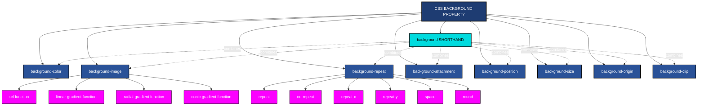
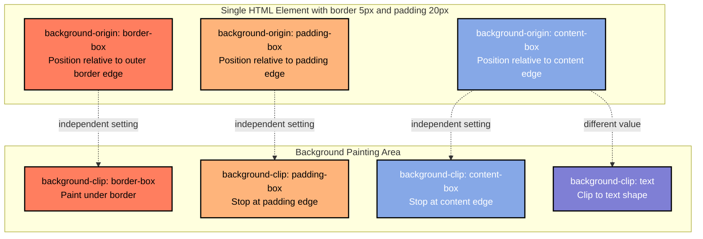
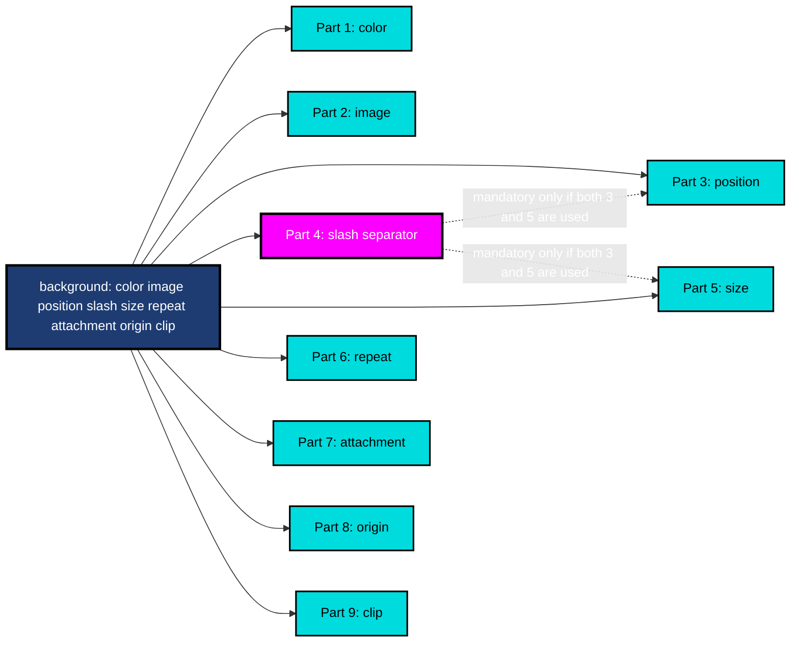

# Backgrounds

<!-- SECTION_1_START -->
# Backgrounds in HTML5 — Core Technical Definition & Intuitive Overview

> [!NOTE]
> **KTU 2024 Scheme — Module 1: Creating Web Pages Using HTML5**
> **Topic:** Backgrounds (Cascading Style Sheet integration for visual page design)
> **Course Code:** OECST832 (Web Programming — Open Elective / Science Track)

## Formal Academic Definition

In the **HTML5** ecosystem, the term *background* refers to the visual canvas that sits **behind the textual and structural content** of a webpage. Unlike the deprecated HTML 4 attribute `bgcolor` and `background` (now obsolete in HTML5), modern background rendering is achieved through the **Cascading Style Sheets (CSS) `background` shorthand property** and its longhand sub-properties, which control the **color, image, position, size, repetition, attachment, origin, and clip** of an element's backdrop layer.

According to the **World Wide Web Consortium (W3C) CSS Backgrounds and Borders Module Level 3** specification, the visual rendering of an element is layered as follows: the **background** is painted first, then the **border**, then the **content** (text and child elements). HTML5 explicitly mandates the separation of *structure* (HTML) from *presentation* (CSS), meaning all background styling **must be declared in CSS** — either inline, internally within a `<style>` block, or externally via a linked `.css` file.

## Conceptual Analogy / Intuition

> [!IMPORTANT]
> **Real-World Analogy — "The Wallpaper Behind the Notice Board"**
>
> Imagine a **classroom notice board**. The board itself is your HTML element (like a `<div>`, `<body>`, or `<section>`). The **text, charts, and pins** stuck on the board are your content. The **wall behind the board** is the background. You can paint the wall a solid color (background-color), hang a wallpaper pattern (background-image with repeat), stick a single big poster (background-image no-repeat), or even stretch a panoramic scene (background-size: cover). The CSS `background` properties are essentially your **interior decorator's toolkit** for that wall.

> [!TIP]
> **The "Layer Cake" Model**
>
> Think of an HTML element as a 3-layer cake:
> 1. **Bottom layer (Background)** — the sponge base
> 2. **Middle layer (Border)** — the icing ring around the edge
> 3. **Top layer (Content)** — the decorative topping
>
> The background is what guests see **first** when the cake is presented, even before tasting the content. It sets the mood.

## Key Properties Snapshot (HTML5 Standard)

The complete CSS background specification defines the following properties:

- **`background-color`** — solid color fill
- **`background-image`** — image or gradient fill
- **`background-repeat`** — tiling behavior (`repeat`, `no-repeat`, `repeat-x`, `repeat-y`, `space`, `round`)
- **`background-attachment`** — scroll behavior (`scroll`, `fixed`, `local`)
- **`background-position`** — origin coordinates (e.g., `top left`, `center`, `50% 50%`)
- **`background-size`** — scaling (`auto`, `cover`, `contain`, `<length>`, `<percentage>`)
- **`background-origin`** — positioning reference box (`border-box`, `padding-box`, `content-box`)
- **`background-clip`** — painting area for the background
- **`background`** — **shorthand** combining all of the above

> [!VISUALIZATION CONTROL]
> **Concept:** Visualizing the CSS Background Box Model on a coordinate plane
> **GeoGebra / Desmos Input Equations:**
> * `x_outer = 0` to `x_outer = 500` (border-box)
> * `x_inner = 20` to `x_inner = 480` (padding-box at 20px inset)
> * `x_core = 40` to `x_core = 460` (content-box at 40px inset)
> * Fill regions: `Region1` (Border) = light grey, `Region2` (Padding) = light blue, `Region3` (Content) = white
> **Visual Description:** Three concentric rectangles on a Cartesian plane, illustrating how `background-origin: border-box` paints the full outermost box, `padding-box` skips the border, and `content-box` skips both border and padding.

## Standard Color Metrics in HTML5

- **Color values** may be specified as **hexadecimal** (e.g., `#FF5733`), **RGB** (e.g., `rgb(255, 87, 51)`), **RGBA** (with alpha transparency), **HSL** (Hue, Saturation, Lightness), **HSLA**, or **named colors** (e.g., `tomato`, `cornflowerblue`).
- The standard color depth for web backgrounds is **24-bit true color** (16,777,216 colors) with an optional **8-bit alpha channel** for transparency.
- **Alpha transparency** ranges from `0` (fully transparent) to `1` (fully opaque).
<!-- SECTION_1_END -->

<!-- SECTION_2_START -->
# Deep Theoretical Analysis & KTU High-Yield Formula Sheet

## The CSS Background Layer Architecture

The CSS specification defines a **3-painting-model layer order** for every HTML element. When a browser renders an element, the painting process follows this strict sequence:

1. **Background layer** (color → image → position → size → repeat → attachment → origin → clip)
2. **Border layer** (drawn over the background, with its own width, style, and color)
3. **Content layer** (text, inline elements, replaced elements, child block elements)

> [!IMPORTANT]
> **KTU High-Yield Point**
> Question: *"Why is my background color not visible even though I set it?"*
> Answer: Either a child element is covering it, the `background-clip` is misconfigured, or the parent element has zero height. Always debug using browser DevTools' **Computed** tab.

## Breakdown of Each Background Property

### 1. `background-color`
- Accepts any valid CSS color value.
- Paints a uniform color across the **entire background painting area** (determined by `background-clip`).
- Default value is `transparent`.

### 2. `background-image`
- Accepts a comma-separated list of images, gradients, or `none`.
- Images are stacked **front-to-back**: the **first image listed is on top**.
- Supported image types: **JPG, PNG, GIF, SVG, WebP, AVIF**, and CSS **gradients** (`linear-gradient()`, `radial-gradient()`, `conic-gradient()`).

### 3. `background-repeat`
- Controls tiling of a background image that is smaller than its painting area.
- Values: `repeat` (default, tiles both axes), `repeat-x` (horizontal only), `repeat-y` (vertical only), `no-repeat` (single instance), `space` (tiles with whitespace gaps), `round` (tiles and scales to fit).

### 4. `background-attachment`
- Determines if the background scrolls with the viewport.
- Values: `scroll` (default, scrolls with content), `fixed` (stays put while content scrolls — creates parallax), `local` (scrolls with the element's own content).

### 5. `background-position`
- Defines the **starting position** of the background image within the painting area.
- Accepts keywords (`top`, `bottom`, `left`, `right`, `center`), lengths, or percentages.
- Two-value syntax: `horizontal vertical` (e.g., `50% 100%` = horizontally centered, vertically at bottom).

### 6. `background-size`
- Scales the background image.
- `cover` — image scales to **fully cover** the area (may crop).
- `contain` — image scales to be **fully visible** (may letterbox).
- Length or percentage values allow precise control.

### 7. `background-origin`
- Sets the reference box for `background-position` calculations.
- Values: `border-box` (default in many contexts), `padding-box`, `content-box`.

### 8. `background-clip`
- Defines how far the background extends.
- Values: `border-box` (default — extends under border), `padding-box` (stops at padding edge), `content-box` (stops at content edge), `text` (clips to text shape — useful for gradient text effects).

### 9. `background` (Shorthand)
- Combines all the above in a single declaration.
- **Recommended order:** `background-color | background-image | background-position / background-size | background-repeat | background-attachment | background-origin | background-clip`

## KTU Formula Sheet / Cheat Sheet

> [!TIP]
> **Save this table — these are the exact property values KTU examiners expect.**

| **Property** | **Default Value** | **Common Values** | **Unit / Format** |
| :--- | :--- | :--- | :--- |
| `background-color` | `transparent` | `#hex`, `rgb()`, `rgba()`, `hsl()`, named | Color tokens |
| `background-image` | `none` | `url()`, `linear-gradient()`, `radial-gradient()` | URI / Function |
| `background-repeat` | `repeat` | `repeat`, `repeat-x`, `repeat-y`, `no-repeat`, `space`, `round` | Keyword |
| `background-attachment` | `scroll` | `scroll`, `fixed`, `local` | Keyword |
| `background-position` | `0% 0%` | `top`, `center`, `bottom`, `left`, `right`, lengths, % | Keyword / Length |
| `background-size` | `auto auto` | `cover`, `contain`, lengths, % | Keyword / Length |
| `background-origin` | `padding-box` | `border-box`, `padding-box`, `content-box` | Keyword |
| `background-clip` | `border-box` | `border-box`, `padding-box`, `content-box`, `text` | Keyword |
| `background` (shorthand) | — | All of the above in one declaration | Mixed |

### Critical Shorthand Syntax Rule

```
background: <color> <image> <position> / <size> <repeat> <attachment> <origin> <clip>;
```

The **`/` separator** between `position` and `size` is **mandatory** when both are specified in the shorthand.

### Gradient Mathematical Form (Engineering Insight)

A **linear gradient** at angle $\theta$ interpolates between two color stops using:

$$
C(x, y) = C_1 + (C_2 - C_1) \cdot \frac{(x \cdot \cos\theta + y \cdot \sin\theta) - d_1}{d_2 - d_1}
$$

Where $C_1$ and $C_2$ are the start and end colors, $d_1$ and $d_2$ are the stop positions along the gradient line, and $\theta$ is measured from the positive X-axis.

## Real-World Engineering Utility

> [!IMPORTANT]
> **Where is this used in production?**
>
> - **Parallax scrolling effects** in marketing landing pages (`background-attachment: fixed`).
> - **Hero sections** in modern web apps (full-viewport `background-size: cover` images).
> - **Glassmorphism UI** (semi-transparent `background-color: rgba()` over blurred backdrops).
> - **Data dashboards** (themed `background` patterns for dark/light mode toggling).
> - **Responsive design** — `background-size: cover` ensures the backdrop adapts to all screen sizes from mobile to 4K.

<!-- SECTION_2_END -->

<!-- SECTION_3_START -->
# Step-by-Step Derivations & Code Implementation

## 3.1 — Setting a Solid Background Color

### Problem Statement
Create an HTML5 page that uses CSS to set a full-page background color of `cornflowerblue` and overrides it with a content section having a semi-transparent white background.

### Exhaustive Code (HTML5 + Internal CSS)

```html
<!DOCTYPE html>
<html lang="en">
<head>
    <meta charset="UTF-8">
    <meta name="viewport" content="width=device-width, initial-scale=1.0">
    <title>Background Color Demo - KTU Web Programming</title>

    <style>
        /* Step 1: Reset default browser margins for full-bleed color */
        * {
            margin: 0;
            padding: 0;
            box-sizing: border-box;
        }

        /* Step 2: Apply background color to the <body> element */
        body {
            background-color: cornflowerblue;          /* Named color */
            font-family: 'Segoe UI', Tahoma, sans-serif;
            min-height: 100vh;                         /* Full viewport height */
        }

        /* Step 3: Create a content card with semi-transparent overlay */
        .content-card {
            background-color: rgba(255, 255, 255, 0.85); /* White with 85% opacity */
            width: 60%;
            margin: 50px auto;
            padding: 30px;
            border-radius: 12px;
            box-shadow: 0 4px 20px rgba(0, 0, 0, 0.2);
        }
    </style>
</head>
<body>
    <div class="content-card">
        <h1>Background Color Demonstration</h1>
        <p>The page backdrop is <strong>cornflowerblue</strong>.</p>
        <p>This card overlays a <strong>semi-transparent white</strong> panel.</p>
    </div>
</body>
</html>
```

### Step-by-Step Logic Explanation

1. The CSS reset (`* { margin: 0; padding: 0; }`) removes the default 8px body margin, allowing the background to extend to the screen edges.
2. `background-color: cornflowerblue` is applied to `<body>`, painting the entire viewport.
3. `min-height: 100vh` ensures the body always fills the viewport height, even with minimal content.
4. `rgba(255, 255, 255, 0.85)` on `.content-card` uses the **4th channel `alpha`** to achieve 85% opacity, allowing the blue background to subtly bleed through.

---

## 3.2 — Setting a Background Image with Advanced Properties

### Problem Statement
Create a hero section with a centered, non-repeating, fully-covering background image that remains fixed during scrolling.

### Exhaustive Code

```html
<!DOCTYPE html>
<html lang="en">
<head>
    <meta charset="UTF-8">
    <title>Background Image Demo - KTU Module 1</title>

    <style>
        body {
            margin: 0;
            font-family: Arial, sans-serif;
        }

        /* The hero section occupies the full first viewport */
        .hero {
            height: 100vh;
            width: 100%;

            /* SHORTHAND: image, position, size, repeat, attachment */
            background:
                linear-gradient(rgba(0, 0, 0, 0.5), rgba(0, 0, 0, 0.5)),
                url('https://picsum.photos/1920/1080') center / cover no-repeat fixed;
        }

        .hero h1 {
            color: white;
            text-align: center;
            padding-top: 40vh;
            font-size: 3rem;
            margin: 0;
        }

        /* Content below the hero forces scroll */
        .scroll-content {
            height: 1500px;
            background-color: #f4f4f4;
            padding: 30px;
        }
    </style>
</head>
<body>
    <section class="hero">
        <h1>Parallax Hero Section</h1>
    </section>
    <section class="scroll-content">
        <h2>Scroll Down</h2>
        <p>The hero background stays fixed while this section scrolls.</p>
    </section>
</body>
</html>
```

### Step-by-Step Logic Explanation

1. The `background` shorthand stacks **two layers**: a dark semi-transparent gradient **on top** and the actual image **below**.
2. `center` positions the image at the geometric center.
3. `/ cover` scales the image to fully cover the element, cropping if necessary.
4. `no-repeat` ensures the image is shown exactly once.
5. `fixed` makes the background remain stationary while the page scrolls — creating the **parallax effect**.
6. The dark gradient overlay (`linear-gradient(rgba(0,0,0,0.5), ...)`) improves text readability over the image.

---

## 3.3 — Using CSS Gradients (No Image File Required)

### Problem Statement
Generate a vibrant gradient background using only CSS, with no external image file.

### Exhaustive Code

```html
<!DOCTYPE html>
<html lang="en">
<head>
    <meta charset="UTF-8">
    <title>CSS Gradients Demo - KTU</title>

    <style>
        body {
            margin: 0;
            min-height: 100vh;
            font-family: 'Verdana', sans-serif;
            color: white;
        }

        /* LINEAR GRADIENT — top to bottom */
        .linear-demo {
            background: linear-gradient(to bottom, #ff7e5f, #feb47b);
            padding: 30px;
        }

        /* RADIAL GRADIENT — circular from center */
        .radial-demo {
            background: radial-gradient(circle, #00c6ff, #0072ff);
            padding: 30px;
            margin-top: 20px;
        }

        /* CONIC GRADIENT — color wheel effect */
        .conic-demo {
            background: conic-gradient(from 45deg, red, yellow, lime, cyan, blue, magenta, red);
            padding: 30px;
            margin-top: 20px;
        }

        /* MULTIPLE GRADIENTS LAYERED */
        .multi-demo {
            background:
                linear-gradient(45deg, transparent 30%, rgba(255, 0, 0, 0.5) 50%, transparent 70%),
                linear-gradient(-45deg, transparent 30%, rgba(0, 0, 255, 0.5) 50%, transparent 70%),
                #1a1a2e;
            padding: 30px;
            margin-top: 20px;
        }
    </style>
</head>
<body>
    <div class="linear-demo"><h2>Linear Gradient</h2></div>
    <div class="radial-demo"><h2>Radial Gradient</h2></div>
    <div class="conic-demo"><h2>Conic Gradient</h2></div>
    <div class="multi-demo"><h2>Multi-Layered Gradient</h2></div>
</body>
</html>
```

### Step-by-Step Logic Explanation

1. **`linear-gradient(to bottom, color1, color2)`** — Transitions vertically from top to bottom.
2. **`radial-gradient(circle, color1, color2)`** — Emits color radially from the center outward in a circular shape.
3. **`conic-gradient(from 45deg, ...)`** — Sweeps colors around a center point, like a color wheel.
4. The **multi-layer demo** stacks two linear gradients on top of a solid dark base, creating a crossed lighting effect.

---

## 3.4 — Background Clip with Text (Trendy Gradient Text Effect)

### Problem Statement
Create a heading with a **gradient-filled text** effect using `background-clip: text`.

### Exhaustive Code

```html
<!DOCTYPE html>
<html lang="en">
<head>
    <meta charset="UTF-8">
    <title>Gradient Text - KTU Module 1</title>

    <style>
        body {
            background-color: #1a1a2e;
            min-height: 100vh;
            display: flex;
            justify-content: center;
            align-items: center;
            font-family: 'Arial Black', sans-serif;
        }

        .gradient-text {
            font-size: 5rem;
            font-weight: 900;

            /* Step 1: Set the gradient as the background */
            background: linear-gradient(90deg, #00dbde, #fc00ff);

            /* Step 2: Clip the background to the text shape */
            -webkit-background-clip: text;
            background-clip: text;

            /* Step 3: Make the text fill transparent so background shows through */
            -webkit-text-fill-color: transparent;
            color: transparent;
        }
    </style>
</head>
<body>
    <h1 class="gradient-text">KTU WEB PROGRAMMING</h1>
</body>
</html>
```

### Step-by-Step Logic Explanation

1. The `background` is set to a vibrant horizontal gradient.
2. `background-clip: text` (with `-webkit-` prefix for Safari/Chrome compatibility) clips the background to the **shape of the text glyphs**.
3. `-webkit-text-fill-color: transparent` makes the text itself transparent, allowing the clipped background to show through the letterforms.
4. This produces a **professional gradient text effect** widely used in modern landing pages.

---

## 3.5 — Multiple Background Images (Layered Composition)

### Problem Statement
Stack **three different background images** in a single element: a star pattern, a logo, and a base color, each with independent positioning.

### Exhaustive Code

```html
<!DOCTYPE html>
<html lang="en">
<head>
    <meta charset="UTF-8">
    <title>Multiple Backgrounds - KTU</title>

    <style>
        .layered-bg {
            width: 600px;
            height: 400px;
            margin: 50px auto;
            border: 2px solid #333;
            border-radius: 8px;

            /* Stacking order: FIRST image = TOPMOST layer */
            background:
                url('https://upload.wikimedia.org/wikipedia/commons/thumb/e/ec/Heckert_GNU_white.svg/64px-Heckert_GNU_white.svg.png') top right / 80px no-repeat,
                url('https://www.transparenttextures.com/patterns/stardust.png') repeat,
                linear-gradient(135deg, #1e3c72, #2a5298);
        }
    </style>
</head>
<body>
    <div class="layered-bg">
        <h2 style="color: white; padding: 20px;">Multiple Layered Backgrounds</h2>
    </div>
</body>
</html>
```

### Step-by-Step Logic Explanation

1. **Top layer:** A small logo positioned at `top right`, sized `80px`, with `no-repeat`.
2. **Middle layer:** A repeating star pattern for texture.
3. **Bottom layer:** A solid linear gradient as the base.
4. CSS stacks them **comma-separated**, with the **first listed appearing on top**.
<!-- SECTION_3_END -->

<!-- SECTION_4_START -->
# Structural Diagrams & Schematics

## 4.1 — CSS Background Property Hierarchy (Block Diagram)



---

## 4.2 — Background Painting Sequence Flowchart

```mermaid
flowchart LR
    Start([Browser Receives HTML and CSS]):::io
    Parse[Parse CSS Box Model]:::proc
    Layer1[Step 1: Paint background-color]:::paint
    Layer2[Step 2: Paint background-image gradient and url]:::paint
    Layer3[Step 3: Apply background-repeat tiling]:::paint
    Layer4[Step 4: Apply background-position offset]:::paint
    Layer5[Step 5: Apply background-size scaling]:::paint
    Layer6[Step 6: Clip to background-clip region]:::paint
    Border[Step 7: Paint border over background]:::border
    Content[Step 8: Render text and child elements]:::content
    Done([Final Painted Pixel on Screen]):::io

    Start --> Parse
    Parse --> Layer1
    Layer1 --> Layer2
    Layer2 --> Layer3
    Layer3 --> Layer4
    Layer4 --> Layer5
    Layer5 --> Layer6
    Layer6 --> Border
    Border --> Content
    Content --> Done

    classDef io fill:#ffd700,stroke:#000,stroke-width:2px,color:#000
    classDef proc fill:#87ceeb,stroke:#000,stroke-width:2px,color:#000
    classDef paint fill:#90ee90,stroke:#000,stroke-width:2px,color:#000
    classDef border fill:#ff6347,stroke:#000,stroke-width:2px,color:#fff
    classDef content fill:#dda0dd,stroke:#000,stroke-width:2px,color:#000
```



---

## 4.3 — Background-Origin vs Background-Clip Comparison (Block Diagram)



---

## 4.4 — Shorthand Syntax Decomposition Matrix


<!-- SECTION_4_END -->

<!-- SECTION_5_START -->
# KTU 2024 Scheme Examination Question Bank & Topic Recap

---

## **PART A — 3 Mark Questions (Short Answer)**

### **Question 1** `[KTU University Exam - July 2024]`
**CO1 | Remember**
*Explain the difference between the deprecated HTML 4 `bgcolor` attribute and the modern CSS `background-color` property. Why is the former not used in HTML5?*

**Model Answer (3 Marks):**
- The HTML 4 `bgcolor` attribute was an **element-level presentation attribute** set directly inside tags like `<body bgcolor="red">`. It was **deprecated in HTML 4.01** and **removed from HTML5** because it violated the principle of **separation of concerns** — mixing structure with presentation. **[1 Mark]**
- The CSS `background-color` property is set in a stylesheet (`<style>` block or external `.css` file) and applies to any element via selectors. It supports **16 million+ colors** via hex, RGB, RGBA, HSL, and named values. **[1 Mark]**
- HTML5 mandates that all styling — including backgrounds — be handled in CSS to enable **maintainability, reusability, responsive design, and accessibility compliance**. **[1 Mark]**

---

### **Question 2** `[KTU University Exam - Dec 2023]`
**CO1 | Understand**
*List any three values of the `background-repeat` property and explain the `space` and `round` values.*

**Model Answer (3 Marks):**
- `repeat` — Tiles the image both horizontally and vertically. `no-repeat` — Shows the image once with no tiling. `repeat-x` — Tiles only along the horizontal axis. **[1 Mark]**
- `space` — Tiles the image repeatedly but **distributes the leftover empty space evenly** between the tiles, without resizing the image itself. The image is never clipped. **[1 Mark]**
- `round` — Tiles the image and **resizes each tile** so that the image fits perfectly within the painting area with no leftover space and no clipping. The scaling is uniform. **[1 Mark]**

---

## **PART B — 14 Mark Questions (Module Internal Choice)**

> [!IMPORTANT]
> **KTU 2024 Pattern:** Each Part B question carries **14 marks** with sub-parts (a) **7 marks** and (b) **7 marks**. Students must answer **one full question** from the choice of two.

---

### **Question A** `[KTU University Exam - July 2024]`
**CO2 | Apply + Analyze**

**(a) Write the complete HTML5 code to create a webpage with a `linear-gradient` background transitioning from `#ff7e5f` to `#feb47b` at a 45-degree angle, with the text "KTU Web Programming" centered both horizontally and vertically on the page. Use an internal stylesheet. (7 Marks)**

**Model Solution (7 Marks):**

```html
<!DOCTYPE html>
<html lang="en">
<head>
    <meta charset="UTF-8">
    <title>KTU Web Programming - Linear Gradient</title>
    <style>
        * { margin: 0; padding: 0; }
        body {
            min-height: 100vh;
            background: linear-gradient(45deg, #ff7e5f, #feb47b);
            display: flex;
            justify-content: center;
            align-items: center;
            font-family: 'Arial', sans-serif;
        }
        h1 {
            color: white;
            font-size: 3rem;
            text-shadow: 2px 2px 4px rgba(0, 0, 0, 0.3);
        }
    </style>
</head>
<body>
    <h1>KTU Web Programming</h1>
</body>
</html>
```

**Valuation Key:**
- `[DOCTYPE and meta tags: 1 Mark]`
- `[body background gradient at 45deg with correct hex colors: 2 Marks]`
- `[Flexbox centering of text: 2 Marks]`
- `[Text styling with shadow: 1 Mark]`
- `[Valid closing tags and structure: 1 Mark]`

---

**(b) Explain the `background-attachment` property with all its values. Write a code snippet that demonstrates a fixed background image that creates a parallax effect. (7 Marks)**

**Model Solution (7 Marks):**

The `background-attachment` property specifies whether the background image scrolls with the viewport or remains fixed. It accepts three values:

- `scroll` (default) — The background scrolls along with the element's content and the viewport.
- `fixed` — The background is fixed relative to the **viewport**, meaning it does not move when the page is scrolled. This creates a **parallax effect**.
- `local` — The background scrolls with the **element's content** (useful for elements with their own scrollable content).

```html
<!DOCTYPE html>
<html lang="en">
<head>
    <meta charset="UTF-8">
    <title>Parallax Demo - KTU</title>
    <style>
        .parallax {
            height: 100vh;
            background: url('https://picsum.photos/1920/1080')
                        center / cover no-repeat fixed;
            display: flex;
            justify-content: center;
            align-items: center;
            color: white;
            font-size: 4rem;
        }
        .spacer { height: 1500px; background: #f0f0f0; }
    </style>
</head>
<body>
    <section class="parallax">Parallax Hero</section>
    <div class="spacer">Scroll me!</div>
</body>
</html>
```

**Valuation Key:**
- `[Stating the three values scroll, fixed, local: 3 Marks]`
- `[Explanation of fixed and parallax: 2 Marks]`
- `[Code with background shorthand and fixed keyword: 2 Marks]`

---

### **Question B** `[KTU University Exam - Dec 2023]`
**CO2 | Apply + Analyze**

**(a) Differentiate between `background-size: cover` and `background-size: contain` with diagrams. When would you choose one over the other in a real-world project? (7 Marks)**

**Model Solution (7 Marks):**

| **Aspect** | **cover** | **contain** |
| :--- | :--- | :--- |
| Behavior | Image **fully covers** the area; may be cropped | Image is **fully visible**; may have empty bands |
| Aspect Ratio | Preserved | Preserved |
| Scaling | Image is scaled to be at least as large as the container on both axes | Image is scaled to be as large as possible while fitting inside |
| Use Case | Hero banners, full-screen backgrounds | Thumbnails, logo walls, image galleries |

**ASCII Diagram:**

```
COVER (image cropped to fill):
+------------------+
|██████████████████|
|██████████████████|
|██████████████████|
+------------------+
(No empty space, edges clipped)

CONTAIN (image fully visible, bands may appear):
+------------------+
|██████████████████|
+------------------+
|                  |
|                  |
+------------------+
(Empty bands on top and bottom)
```

**Real-world project selection:**
- Use `cover` for **hero sections, parallax backgrounds, and full-viewport landing pages** where visual impact matters and cropping is acceptable.
- Use `contain` for **product image displays, logo showcases, and icon galleries** where the entire image must be visible and letterboxing is preferred.

**Valuation Key:**
- `[Correct definitions of cover and contain: 2 Marks]`
- `[Visual diagram representation: 2 Marks]`
- `[Real-world use case selection with justification: 2 Marks]`
- `[Comparison summary: 1 Mark]`

---

**(b) Write a complete HTML5 page that uses the `background-clip: text` property to create a heading with a rainbow gradient effect. The page should have a dark navy background and the text should display "RAINBOW TEXT". (7 Marks)**

**Model Solution (7 Marks):**

```html
<!DOCTYPE html>
<html lang="en">
<head>
    <meta charset="UTF-8">
    <title>Rainbow Text - KTU</title>
    <style>
        body {
            margin: 0;
            min-height: 100vh;
            background-color: #0a0a23;  /* Dark navy */
            display: flex;
            justify-content: center;
            align-items: center;
            font-family: 'Arial Black', sans-serif;
        }
        h1 {
            font-size: 6rem;
            background: linear-gradient(90deg,
                        red, orange, yellow, lime, cyan, blue, magenta);
            -webkit-background-clip: text;
            background-clip: text;
            -webkit-text-fill-color: transparent;
            color: transparent;
        }
    </style>
</head>
<body>
    <h1>RAINBOW TEXT</h1>
</body>
</html>
```

**Valuation Key:**
- `[DOCTYPE and head section with proper meta: 1 Mark]`
- `[Dark navy body background: 1 Mark]`
- `[Linear gradient with 7 rainbow colors: 2 Marks]`
- `[background-clip text with -webkit prefix: 2 Marks]`
- `[text-fill-color transparent for effect: 1 Mark]`

---

> [!WARNING]
> **KTU Examiner's Pitfall Callout — Common Mark Deductions**
>
> 1. **Forgetting `-webkit-background-clip: text`** — Safari and older Chrome versions require the vendor prefix. Lose 1 mark.
> 2. **Using `background-repeat: repeat`** with `cover` — `cover` already implies single-instance rendering; adding `repeat` is redundant but not wrong. However, students often confuse `cover` with `100% 100%`.
> 3. **Omitting the `/` separator** in shorthand `background-position / background-size` — this is a **very common KTU valuation trap**. Example: `background: url(img.jpg) center cover;` is **incorrect** — must be `background: url(img.jpg) center / cover;`.
> 4. **Using deprecated `bgcolor`** attribute in HTML5 code — examiner awards 0 marks for the entire styling section.
> 5. **Not setting `min-height: 100vh`** on body — background may not fill the viewport, leading to visible white bars at the bottom.

---

## 📋 Topic Recap & Important Things to Remember

> [!TIP]
> **Rapid Revision Checklist — Read this 5 minutes before the exam.**

- ✅ **HTML5 forbids** the use of `bgcolor`, `background` (HTML attribute), and other presentation attributes. All background styling **must be in CSS**.
- ✅ The CSS `background` property is a **shorthand** for 8 longhand properties: `background-color`, `background-image`, `background-repeat`, `background-attachment`, `background-position`, `background-size`, `background-origin`, `background-clip`.
- ✅ The **default values** are: `transparent` (color), `none` (image), `repeat` (repeat), `scroll` (attachment), `0% 0%` (position), `auto auto` (size), `padding-box` (origin), `border-box` (clip).
- ✅ The **slash `/` separator** in shorthand is **mandatory** between `position` and `size` when both are used.
- ✅ **`cover`** scales image to fully fill the area (may crop). **`contain`** scales to fit entirely (may letterbox).
- ✅ **`fixed`** attachment creates the **parallax scrolling** effect.
- ✅ **`background-clip: text`** combined with `text-fill-color: transparent` produces **gradient text**.
- ✅ Multiple backgrounds are **comma-separated**, with the **first listed painted on top**.
- ✅ Gradients (`linear`, `radial`, `conic`) are treated as `background-image` values — no external file needed.
- ✅ The 3-layer paint order is: **Background → Border → Content**.
- ✅ Use **`rgba()`** for transparency, **hex** for opaque colors, and **HSL** for intuitive color manipulation.
- ✅ For full-bleed backgrounds, always set `margin: 0` on body and use `min-height: 100vh` to avoid white space.
<!-- SECTION_5_END -->
