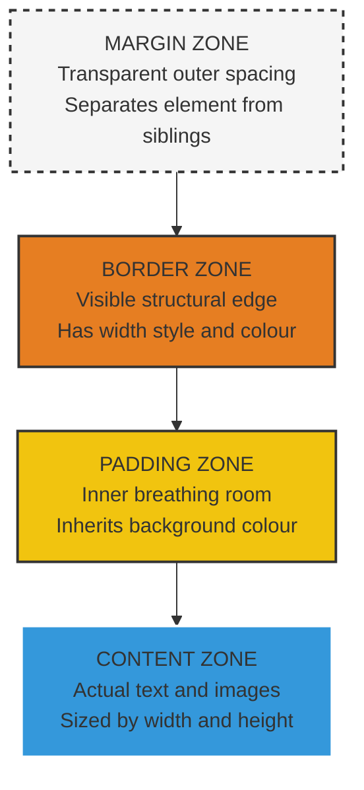
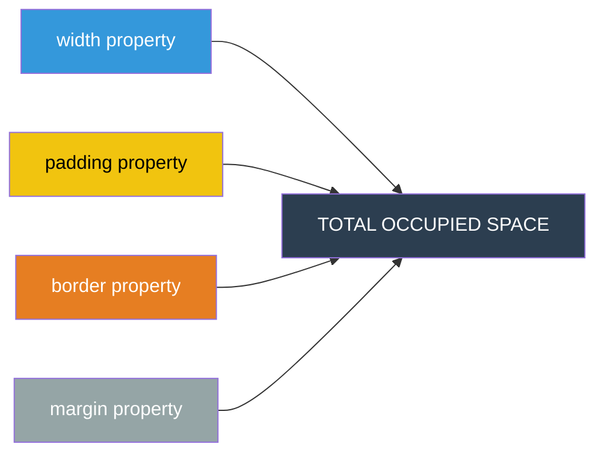
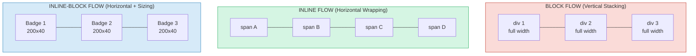
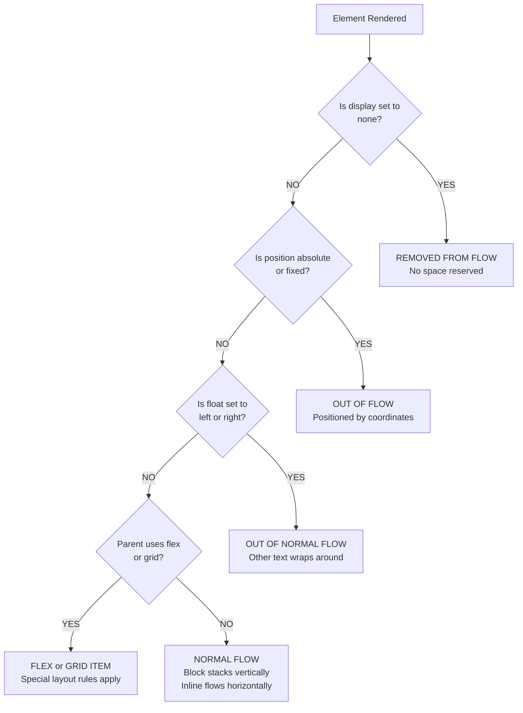
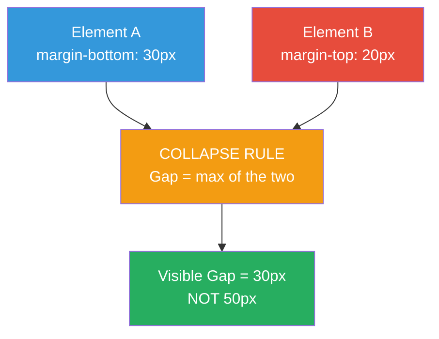
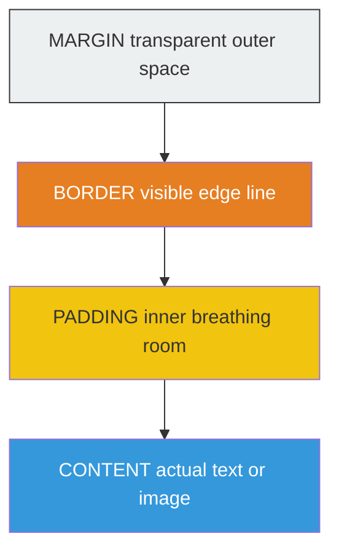

# Box Model and Text Flow

<!-- SECTION_1_START -->
# Box Model and Text Flow

> [!IMPORTANT]
> **KTU 2024 Scheme | OECST832 — Web Programming | Module 1**
> **Course Outcomes Mapped:** CO1 — Understand the structure and styling of modern HTML5 web pages.
> **Bloom Levels Targeted:** Remember, Understand, Apply, Analyze.

---

## 1.1 The CSS Box Model — Formal Definition

According to the **W3C CSS specification**, every element rendered in an HTML document is treated as a **rectangular box**. The **CSS Box Model** describes the design and layout of this rectangular box, defining how the four concentric regions — **content, padding, border, and margin** — combine to determine the total space an element occupies on a web page.

> [!NOTE]
> **Syllabus Highlight (KTU Module 1):**
> The Box Model is the **foundation of HTML5 page layout**. Without it, no two elements can be positioned, spaced, or sized predictably. Every modern front-end framework (Bootstrap, Tailwind, Material UI) is fundamentally a wrapper over the box model.

### Conceptual Analogy / Intuition

Imagine you are **packing a gift** for shipment:
- The **gift itself** = the **Content Box** (your actual product, text, or image).
- The **bubble wrap** around the gift = **Padding** (breathing room *inside* the box).
- The **cardboard box** itself = **Border** (the visible structural edge).
- The **space between this box and the next parcel on the truck** = **Margin** (the gap *between* elements).

The **total floor area the parcel consumes** on the truck = `Content + Padding + Border + Margin`. This is exactly how browsers calculate layout space.

### Physical Constants and Standard Metrics

| Metric | Standard Value |
|---|---|
| Default browser font-size | **16 px** |
| Default `margin` of `<body>` | **8 px** on all four sides |
| `box-sizing` default value | `content-box` |
| `display` default for `<div>` | `block` |
| `display` default for `<span>` | `inline` |

> [!TIP]
> The **default `box-sizing` value of `content-box`** is the single most common source of layout bugs in beginner HTML5 projects. Memorise it.

### Box-Sizing — The Two Schools of Thought

```css
/* School 1: W3C Standard (default) */
.box { box-sizing: content-box; }
/* width = content width ONLY */
/* total width = content + 2*padding + 2*border + 2*margin */

/* School 2: Developer-Friendly (recommended) */
.box { box-sizing: border-box; }
/* width = content + 2*padding + 2*border */
/* total width = width + 2*margin */
```

> [!VISUALIZATION CONTROL]
> **Concept:** Concentric Rectangle Representation of the CSS Box Model
> **GeoGebra / Desmos Input Equations (rectangle boundaries):**
> * Outer margin edge: `x = 0`, `x = W_total`, `y = 0`, `y = H_total`
> * Border edge: `x = M`, `x = W_total - M`
> * Padding edge: `x = M + B`, `x = W_total - M - B`
> * Content edge: `x = M + B + P`, `x = W_total - M - B - P`
> where $M = $ margin, $B = $ border-width, $P = $ padding
> **Visual Description:** Four nested rectangles sharing a common center, with labels MARGIN (outermost, transparent), BORDER (next, coloured line), PADDING (inner, transparent), and CONTENT (innermost, coloured background).

---

## 1.2 Text Flow — Formal Definition

**Normal flow** (also called **text flow** or **document flow**) is the default layout algorithm in which block-level elements stack vertically top-to-bottom, and inline elements flow horizontally left-to-right within their parent block, wrapping at the container's edge.

> [!NOTE]
> **Key Insight:** Text flow is *normal* until a developer applies `float`, `position`, `flex`, or `grid`. The moment any of these is used, the element is **taken out of normal flow** and the layout model becomes "abnormal flow".

### Conceptual Analogy / Intuition

Think of a **newspaper page**:
- **Headlines, articles, and sections** appear one below the other, each occupying its own horizontal strip = **block-level flow** (vertical stacking).
- **Words within an article** wrap from the end of one line to the beginning of the next, hugging the column's right edge = **inline flow** (horizontal wrapping).
- The **column width** itself is determined by the parent block.

> [!TIP]
> If you type 500 words into a `<p>` tag and resize your browser, the text *automatically re-wraps*. That is normal inline text flow in action — no CSS required.

---

## 1.3 Categories of Elements in Text Flow

| Element Category | Examples | Line-Break Behavior | Width/Height Settable? |
|---|---|---|---|
| **Block-level** | `<div>`, `<p>`, `<h1>`–`<h6>`, `<section>`, `<article>`, `<ul>`, `<li>` | Forces a new line before and after | Yes |
| **Inline** | `<span>`, `<a>`, `<strong>`, `<em>`, `` | Flows horizontally; no forced break | Width/Height **ignored** (mostly) |
| **Inline-block** | Custom `display` value | Flows horizontally like inline, but accepts block properties | Yes |
| **None** | `display: none` | Removed entirely from flow | N/A |

> [!WARNING]
> An element with `display: inline` will **ignore** the `width`, `height`, `margin-top`, and `margin-bottom` properties. This is a frequent KTU exam trap.
<!-- SECTION_1_END -->

<!-- SECTION_2_START -->
# Deep Theoretical Analysis & KTU High-Yield Formula Sheet

## 2.1 Anatomy of a CSS Box — Layer by Layer

The four layers of the box model are processed **from inside outward** by the browser's rendering engine:

### Layer 1 — The Content Box
- The innermost region that holds the **actual rendered content**: text, images, videos, or child elements.
- Sized by `width` and `height` properties when `box-sizing: content-box` (the default).
- Background color/image of the element fills the **content area** (and also padding, but NOT margin).
- The `overflow` property (`visible`, `hidden`, `scroll`, `auto`) governs what happens when content exceeds this box.

### Layer 2 — The Padding Box
- The transparent space **between content and border**, *inside* the element.
- Set via `padding`, `padding-top`, `padding-right`, `padding-bottom`, `padding-left`.
- **Inherits the background** of the element (the content box's background extends into the padding).
- Cannot have a negative value; can use `%` (relative to the **width of the containing block**, even for `padding-top`).

### Layer 3 — The Border Box
- The visible (or invisible) line that encloses the padding and content.
- Three sub-properties: `border-width`, `border-style` (required!), `border-color`.
- If `border-style` is `none` (default), the border is invisible and `border-width` is 0.
- Styles include `solid`, `dashed`, `dotted`, `double`, `groove`, `ridge`, `inset`, `outset`, `hidden`.

### Layer 4 — The Margin Box
- The transparent space **outside the border**, separating this element from its neighbours.
- Set via `margin`, `margin-top`, etc.
- **Can be negative** (used for pulling elements closer than normally possible).
- **Collapses vertically** with adjacent block elements (see Section 2.3).

---

## 2.2 Dimension Calculation — The Core Formulas

For any block-level element with `box-sizing: content-box`:

$$
\begin{aligned}
\text{Total Width} &= \text{width} + 2 \times \text{padding}_{\text{horizontal}} + 2 \times \text{border}_{\text{horizontal}} + 2 \times \text{margin}_{\text{horizontal}} \\[4pt]
\text{Total Height} &= \text{height} + 2 \times \text{padding}_{\text{vertical}} + 2 \times \text{border}_{\text{vertical}} + 2 \times \text{margin}_{\text{vertical}}
\end{aligned}
$$

For `box-sizing: border-box`:

$$
\begin{aligned}
\text{Total Width} &= \text{width} + 2 \times \text{margin}_{\text{horizontal}} \\[4pt]
\text{Total Height} &= \text{height} + 2 \times \text{margin}_{\text{vertical}}
\end{aligned}
$$

---

## 2.3 Margin Collapse — A Critical Concept

When **two vertical block margins touch** (one element's `margin-bottom` meets the next element's `margin-top`), they do **not add**. They **collapse** to the **larger** of the two.

$$
\text{Visible Vertical Gap} = \max(\text{margin-bottom of top element},\ \text{margin-top of bottom element})
$$

Margin collapse **does NOT occur** for:
- Horizontal margins (left/right).
- Floated elements.
- Absolutely positioned elements.
- Flex items or Grid items.
- Elements with `overflow` other than `visible`.
- Elements that establish a new block formatting context (BFC) — e.g., via `display: flex`.

---

## 2.4 The `display` Property and Text Flow Modes

| `display` Value | Flow Behavior | New Line? | Width/Height Honoured? | Margin Behaviour |
|---|---|---|---|---|
| `block` | Stacks vertically | Yes | Yes | All four sides active |
| `inline` | Flows horizontally, wraps at edge | No | `width`/`height` ignored | Only `left`/`right` honoured |
| `inline-block` | Flows horizontally | No | Yes | All four sides active |
| `none` | Removed from flow entirely | — | — | — |
| `flex` | Establishes flex container | — | Yes (children) | Collapsing prevented |
| `grid` | Establishes grid container | — | Yes (children) | Collapsing prevented |

---

## 2.5 KTU High-Yield Formula / Cheat Sheet

| Concept | Formula / Rule | Default / Unit |
|---|---|---|
| Total width (content-box) | $W_{total} = W + 2P + 2B + 2M$ | pixels, em, %, vw |
| Total width (border-box) | $W_{total} = W + 2M$ | pixels, em, %, vw |
| Margin collapse | $\text{Gap} = \max(M_1,\ M_2)$ | pixels |
| Padding as % of containing block | $\text{padding} = \frac{P_{\%}}{100} \times W_{\text{parent}}$ | % of parent's WIDTH |
| Default `box-sizing` | `content-box` | — |
| Inline element's `width` | Ignored | — |
| Inline element's `margin-top/bottom` | Ignored | — |
| `display: none` vs `visibility: hidden` | `none` removes from flow; `hidden` keeps space | — |
| `<body>` default margin | **8 px** all sides | pixels |

> [!TIP]
> **Real-World Engineering Utility:** The box model drives **responsive web design**. Media queries, Flexbox, and CSS Grid all rely on the predictable behaviour of `box-sizing`, `margin`, and `padding` to build layouts that adapt to mobile, tablet, and desktop viewports. Front-end developers universally apply the `* \{ box-sizing: border-box; \}` global rule (often called the **Paul Irish box-sizing reset**) for predictable sizing.

---

## 2.6 Inline vs Inline-Block vs Block — Comparative Analysis

> [!NOTE]
> **Why this matters in production:** Navigation menus use `inline-block` (horizontal items with clickable padding). Article cards use `block`. Icons inside paragraphs use `inline`. Misunderstanding these three causes 80% of beginner layout bugs.

| Property | `block` | `inline` | `inline-block` |
|---|---|---|---|
| Begins on new line | Yes | No | No |
| Width can be set | Yes | No | Yes |
| Height can be set | Yes | No | Yes |
| Margins top/bottom applied | Yes | No | Yes |
| Margins left/right applied | Yes | Yes | Yes |
| Padding applied | Yes | Partially (clips visually) | Yes |
| Default for | `<div>`, `<p>`, `<h1>` | `<span>`, `<a>`, `<em>` | (none — must be set) |
| Can contain a `<div>` | Yes | No | No |
| Respects `text-align` of parent | No | Yes | Yes |
<!-- SECTION_2_END -->

<!-- SECTION_3_START -->
# Step-by-Step Derivations & Code Implementation

## 3.1 Worked Numerical Example — Box Model Dimension Calculation

**Problem:** A `<div>` element is styled as follows. Calculate its **total horizontal space** consumed on the page.

```css
div.card {
    width: 300px;
    padding: 20px;
    border: 5px solid black;
    margin: 15px;
}
```

### Step-by-Step Derivation (content-box, the default)

**Step 1 — Identify the box-sizing mode.**
The CSS does not declare `box-sizing`, so the browser uses the default: `content-box`.

**Step 2 — Identify each horizontal component.**
- `width` = $300\text{ px}$ (content only)
- `padding-left` = $20\text{ px}$
- `padding-right` = $20\text{ px}$
- `border-left` = $5\text{ px}$
- `border-right` = $5\text{ px}$
- `margin-left` = $15\text{ px}$
- `margin-right` = $15\text{ px}$

**Step 3 — Apply the total-width formula.**

$$
\begin{aligned}
\text{Total Width} &= \text{width} + 2P + 2B + 2M \\[4pt]
&= 300 + 2(20) + 2(5) + 2(15) \\[4pt]
&= 300 + 40 + 10 + 30 \\[4pt]
&= 380\ \text{px}
\end{aligned}
$$

**Step 4 — Interpretation.** A developer who visually measures the element on screen using browser DevTools will see a **content width of 300 px**, but the **element reserves 380 px** of horizontal space in the page layout (including the space it pushes siblings away from).

**Step 5 — Recalculation with `box-sizing: border-box`.**

$$
\begin{aligned}
\text{Total Width} &= \text{width} + 2M \\[4pt]
&= 300 + 2(15) \\[4pt]
&= 330\ \text{px}
\end{aligned}
$$

Now, `width: 300px` already absorbs the padding and border, so the element reserves only 330 px total.

---

## 3.2 Worked Numerical Example — Margin Collapse

**Problem:** Given two stacked paragraphs:

```css
p.upper { margin-bottom: 30px; }
p.lower { margin-top: 20px;  }
```

What is the **visible vertical gap** between them?

### Step-by-Step Derivation

**Step 1 — Check the collapse conditions.**
- Both are block-level elements. ✔
- Both are in normal flow. ✔
- No padding, border, or BFC separates them. ✔
- **Therefore, vertical margins collapse.**

**Step 2 — Apply the collapse rule.**

$$
\begin{aligned}
\text{Visible Gap} &= \max(M_{\text{bottom}},\ M_{\text{top}}) \\[4pt]
&= \max(30\text{ px},\ 20\text{ px}) \\[4pt]
&= 30\ \text{px}
\end{aligned}
$$

The gap is **not** $30 + 20 = 50$ px. The 20 px is "absorbed" by the larger 30 px margin.

---

## 3.3 Complete HTML5 Implementation — Demonstrating the Box Model

```html
<!DOCTYPE html>
<html lang="en">
<head>
    <meta charset="UTF-8">
    <title>Box Model Demonstration</title>
    <style>
        /* Global reset for predictable sizing (production best practice) */
        * {
            box-sizing: border-box;
            margin: 0;
            padding: 0;
        }

        body {
            font-family: Arial, sans-serif;
            background-color: #f4f4f4;
        }

        .container {
            width: 80%;
            margin: 20px auto;     /* Centers the container horizontally */
            background-color: #e0e0e0;  /* Shows container boundary */
        }

        .card {
            width: 300px;          /* Content width */
            padding: 20px;         /* Inner spacing */
            border: 5px solid #2c3e50;  /* Visible border */
            margin: 15px;          /* Outer spacing */
            background-color: #3498db;  /* Background fills content + padding */
            color: white;
            display: block;        /* Default for div, stated for clarity */
        }

        .inline-demo {
            background-color: #e74c3c;
            color: white;
            padding: 5px;
            /* width and height are IGNORED because display is inline */
            width: 500px;          /* No effect! */
            height: 200px;         /* No effect! */
        }

        .inline-block-demo {
            background-color: #2ecc71;
            color: white;
            padding: 5px;
            display: inline-block;  /* Now width and height ARE honoured */
            width: 200px;
            height: 80px;
        }
    </style>
</head>
<body>
    <div class="container">
        <div class="card">
            This is a block-level card. Its background extends
            through the padding but NOT through the margin.
        </div>
        <span class="inline-demo">I am INLINE (width/height ignored)</span>
        <span class="inline-block-demo">I am INLINE-BLOCK (sized properly)</span>
    </div>
</body>
</html>
```

### Execution Logic — Line by Line

1. `* \{ box-sizing: border-box; \}` — Global rule; every element's declared `width` will absorb its padding and border.
2. `.card` — The `width: 300px` means the *visible blue area* is 300 px wide. Margin is separate.
3. `.inline-demo` — Even with `width: 500px`, the span will be only as wide as its text content because `display` defaults to `inline`.
4. `.inline-block-demo` — The same `width: 200px` is honoured because `display: inline-block` was explicitly set.

---

## 3.4 Complete HTML5 Implementation — Text Flow Demonstration

```html
<!DOCTYPE html>
<html lang="en">
<head>
    <meta charset="UTF-8">
    <title>Text Flow Demonstration</title>
    <style>
        body {
            font-size: 16px;
            line-height: 1.5;
        }

        h1, h2, p {
            /* All block-level: stack vertically */
            display: block;
            border: 1px dashed #999;
            padding: 5px;
            margin: 10px 0;
        }

        .keyword {
            /* Inline: flows within the line, no line break */
            display: inline;
            background-color: yellow;
            font-weight: bold;
        }

        .badge {
            /* Inline-block: flows horizontally, accepts sizing */
            display: inline-block;
            background-color: #2c3e50;
            color: white;
            padding: 4px 10px;
            border-radius: 12px;
            margin: 4px;
        }
    </style>
</head>
<body>
    <h1>Understanding Text Flow</h1>

    <p>
        In this paragraph, words like
        <span class="keyword">HTML5</span> and
        <span class="keyword">CSS3</span> flow naturally
        inline with the surrounding text, wrapping at the
        right edge of the parent block.
    </p>

    <h2>Skill Badges (inline-block)</h2>
    <span class="badge">HTML5</span>
    <span class="badge">CSS3</span>
    <span class="badge">JavaScript</span>
    <span class="badge">Python</span>
    <!-- These flow horizontally; clicking area is the entire pill shape. -->
</body>
</html>
```

### Step-by-Step Behavior Explanation

1. The `<h1>` and `<p>` tags, being block-level, each start on a **new line** and span the full width of their parent.
2. Inside the `<p>`, the `<span class="keyword">` is inline — it does **not** break the line; the yellow background simply highlights the word.
3. The `.badge` spans are `inline-block` — they line up horizontally like words, but each pill can have a fixed height, padding, and border-radius.
4. If you resize the browser narrower, all inline content **wraps automatically** to a new line — that is normal text flow.

---

## 3.5 Resetting Default Margins — The `*` Margin Reset

> [!TIP]
> Browsers ship with default margins on `<body>` (**8 px**), `<h1>` to `<h6>`, `<p>`, `<ul>`, etc. For pixel-perfect layouts, professionals use a CSS reset:

```css
* {
    margin: 0;
    padding: 0;
    box-sizing: border-box;
}
```

This single rule eliminates all default browser spacing and is the foundation of every modern CSS framework.
<!-- SECTION_3_END -->

<!-- SECTION_4_START -->
# Structural Diagrams & Schematics

## 4.1 The CSS Box Model — Concentric Layer Architecture



### Component Interaction Matrix



---

## 4.2 Text Flow Architecture — Display Modes



---

## 4.3 Normal Flow vs Out-of-Flow Decision Topology



---

## 4.4 Margin Collapse Mechanism — Visual Flow


<!-- SECTION_4_END -->

<!-- SECTION_5_START -->
# KTU 2024 Scheme Examination Question Bank & Topic Recap

---

## Part A — Short Answer Questions (3 Marks Each)

### Question 1: Define the CSS box model. List its four components.
> `[KTU University Exam — July 2024]`
> **CO:** CO1 &nbsp;&nbsp;&nbsp; **Bloom Level:** Remember

**Model Answer:**

The **CSS box model** is a fundamental layout concept in which every HTML element is treated as a rectangular box consisting of four concentric layers, used by browsers to determine the element's size, spacing, and relationship with neighbouring elements.

The **four components**, from innermost to outermost, are:

1. **Content Box** — Holds the actual text, images, or child elements. Sized using `width` and `height`.
2. **Padding Box** — Transparent space *inside* the border, providing inner breathing room. Set via `padding`.
3. **Border Box** — The visible (or invisible) line enclosing the element. Set via `border-width`, `border-style`, `border-color`.
4. **Margin Box** — Transparent space *outside* the border, separating this element from its neighbours. Set via `margin`.

> **[Valuation Key: Defining the model: 1 Mark; Listing all four layers with one-line purpose: 2 Marks]**

---

### Question 2: Differentiate between `display: block`, `display: inline`, and `display: inline-block`.
> `[KTU University Exam — Dec 2023]`
> **CO:** CO1 &nbsp;&nbsp;&nbsp; **Bloom Level:** Understand

**Model Answer:**

| Feature | `block` | `inline` | `inline-block` |
|---|---|---|---|
| New line before/after | Yes | No | No |
| `width` / `height` respected | Yes | No (ignored) | Yes |
| All four margins applied | Yes | No (only left/right) | Yes |
| Default elements | `<div>`, `<p>` | `<span>`, `<a>` | (must set explicitly) |
| Typical use | Page sections, cards | Words in a sentence | Buttons, badges, nav items |

> **[Valuation Key: Tabular comparison with at least 3 distinguishing features: 3 Marks]**

---

## Part B — Long Answer Questions (14 Marks Each, Module Internal Choice)

> **KTU Pattern:** Each Part B question carries 14 marks, split as **(a) 7 marks + (b) 7 marks**, mapping across escalating Bloom's cognitive levels.

---

### 📌 Question A — Option 1

> `[KTU University Exam — Model Question]`
> **CO:** CO1 &nbsp;&nbsp;&nbsp; **Bloom Levels:** Understand (a) + Apply (b)

#### (a) Explain the CSS box model with a neat diagram. Describe how total dimensions are calculated for both `content-box` and `border-box`. (7 Marks)

**Model Solution:**

**Step 1 — Definition (2 Marks).**
The CSS box model is the rectangular-box abstraction that the browser applies to every HTML element. It contains four layers: **content, padding, border, margin**, processed from inside outward. The total space the element reserves on the page is the sum of all four layers' horizontal (or vertical) extents.

**Step 2 — Diagram (2 Marks).**



**Step 3 — Formulae (2 Marks).**

For `box-sizing: content-box` (default):
$$
\text{Total Width} = W + 2P + 2B + 2M
$$

For `box-sizing: border-box`:
$$
\text{Total Width} = W + 2M
$$

**Step 4 — Practical Implication (1 Mark).**
In `content-box`, declaring `width: 300px` allocates 300 px for content *only*; padding and border are added on top, often breaking layouts. In `border-box`, the declared `width: 300px` already includes padding and border, making layouts far more predictable and is the recommended approach in production.

> **[Valuation Key: Definition: 2 Marks; Diagram: 2 Marks; Both formulae: 2 Marks; Practical note: 1 Mark]**

---

#### (b) Write an HTML5 + CSS program that creates two side-by-side boxes using the box model, where each box has 200px content width, 20px padding, 3px border, and 10px margin. Show the output measurement. (7 Marks)

**Model Solution:**

```html
<!DOCTYPE html>
<html lang="en">
<head>
    <meta charset="UTF-8">
    <title>Box Model Calculation</title>
    <style>
        * {
            box-sizing: border-box;
            margin: 0;
            padding: 0;
        }

        .parent {
            background-color: #ddd;
            padding: 10px;
        }

        .box {
            width: 200px;             /* Content + padding + border = 200 */
            padding: 20px;
            border: 3px solid #2c3e50;
            margin: 10px;
            background-color: #3498db;
            color: white;
            display: inline-block;    /* Side-by-side layout */
            text-align: center;
        }
    </style>
</head>
<body>
    <div class="parent">
        <div class="box">Box One</div>
        <div class="box">Box Two</div>
    </div>
</body>
</html>
```

**Step-by-Step Output Measurement (in `content-box` mode):**

**Step 1 — Identify the components.**
- `width` = $200\text{ px}$
- `padding-left` = `padding-right` = $20\text{ px}$
- `border-left` = `border-right` = $3\text{ px}$
- `margin-left` = `margin-right` = $10\text{ px}$

**Step 2 — Apply the content-box formula.**

$$
\begin{aligned}
\text{Total Width per box} &= 200 + 2(20) + 2(3) + 2(10) \\[4pt]
&= 200 + 40 + 6 + 20 \\[4pt]
&= 266\ \text{px per box}
\end{aligned}
$$

**Step 3 — Combined width for two side-by-side boxes.**
$$
\text{Combined} = 2 \times 266 = 532\ \text{px}
$$

**Step 4 — With `box-sizing: border-box` (as in the code above):**
- Per-box total width = $200 + 2(10) = 220$ px
- Combined = $440$ px

> **[Valuation Key: Correct HTML5 boilerplate: 1 Mark; CSS box-sizing rule: 1 Mark; Box properties matching specification: 2 Marks; Calculation: 2 Marks; Final combined value: 1 Mark]**

---

### 📌 Question B — Option 2 (Internal Choice)

> `[KTU University Exam — Model Question]`
> **CO:** CO1 &nbsp;&nbsp;&nbsp; **Bloom Levels:** Understand (a) + Apply (b)

#### (a) Explain block-level, inline, and inline-block elements with suitable HTML examples. (7 Marks)

**Model Solution:**

**Step 1 — Block-Level Elements (2 Marks).**
Block-level elements occupy the **full available width** of their parent container and always begin on a new line. They can contain other block and inline elements. Setting `width`, `height`, and all four margins is allowed.

*Examples:* `<div>`, `<p>`, `<h1>`, `<section>`, `<article>`, `<ul>`, `<ol>`, `<li>`, `<header>`, `<footer>`.

```html
<div style="background: lightblue; padding: 10px;">I am a block</div>
<div style="background: lightgreen; padding: 10px;">I am also a block</div>
```

The two `<div>`s appear one below the other, each filling the page width.

**Step 2 — Inline Elements (2 Marks).**
Inline elements occupy **only as much width as their content requires** and flow horizontally within surrounding text, wrapping at the parent's right edge. The `width`, `height`, `margin-top`, and `margin-bottom` properties are ignored.

*Examples:* `<span>`, `<a>`, `<strong>`, `<em>`, `<b>`, `<i>`, `<u>`, `` (technically replaced inline).

```html
<p>
    The <span style="background: yellow;">yellow text</span>
    is inline, so it flows naturally within this paragraph.
</p>
```

**Step 3 — Inline-Block Elements (2 Marks).**
Inline-block elements flow horizontally like inline elements (no forced line break), but they **honour `width`, `height`, and all four margins** like block elements. This makes them ideal for navigation menus, button rows, and badge lists.

*Examples:* None by default; must be set explicitly via `display: inline-block`.

```html
<a href="#" style="display: inline-block; background: #2c3e50;
   color: white; padding: 10px 20px; margin: 5px;">Home</a>
<a href="#" style="display: inline-block; background: #2c3e50;
   color: white; padding: 10px 20px; margin: 5px;">About</a>
```

**Step 4 — Summary Table (1 Mark).**

| Feature | Block | Inline | Inline-Block |
|---|---|---|---|
| New line | Yes | No | No |
| `width` / `height` | Honoured | Ignored | Honoured |
| All margins | Yes | No (v-only ignored) | Yes |

> **[Valuation Key: Block explanation + example: 2 Marks; Inline explanation + example: 2 Marks; Inline-block explanation + example: 2 Marks; Summary table: 1 Mark]**

---

#### (b) Write an HTML5 program to create a navigation bar using `inline-block` elements with proper box model spacing. (7 Marks)

**Model Solution:**

```html
<!DOCTYPE html>
<html lang="en">
<head>
    <meta charset="UTF-8">
    <title>Navigation Bar with Box Model</title>
    <style>
        * {
            box-sizing: border-box;
            margin: 0;
            padding: 0;
        }

        body {
            font-family: 'Segoe UI', Arial, sans-serif;
        }

        .navbar {
            background-color: #2c3e50;
            padding: 10px;          /* Inner spacing inside navbar */
            border: 2px solid #1a252f;  /* Visible navbar edge */
            margin: 20px;           /* Space outside navbar */
        }

        .navbar a {
            display: inline-block;  /* Flow horizontally, accept sizing */
            color: white;
            text-decoration: none;
            padding: 12px 24px;    /* Padding inside each button */
            margin-right: 8px;     /* Gap between buttons */
            background-color: #34495e;
            border: 1px solid #1a252f;  /* Per-button border */
            border-radius: 4px;
        }

        .navbar a:hover {
            background-color: #1abc9c;
        }
    </style>
</head>
<body>
    <nav class="navbar">
        <a href="#home">Home</a>
        <a href="#about">About</a>
        <a href="#services">Services</a>
        <a href="#contact">Contact</a>
    </nav>
</body>
</html>
```

**Step-by-Step Explanation:**

**Step 1 — Global reset (1 Mark).** The `*` rule applies `box-sizing: border-box` to all elements, making width calculations intuitive.

**Step 2 — Navbar container (2 Marks).** The `<nav class="navbar">` is a block-level element with:
- `padding: 10px` — inner space between the navbar edge and its links.
- `border: 2px solid #1a252f` — visible structural edge.
- `margin: 20px` — outer space separating the navbar from the page edges.

**Step 3 — Inline-block anchor tags (3 Marks).** Each `<a>` is set to `display: inline-block`, so they:
- Flow horizontally (no line break between them).
- Accept `padding: 12px 24px` (clickable area extension).
- Accept `margin-right: 8px` (gap between buttons).
- Accept `border` and `border-radius` (pill-shaped buttons).

**Step 4 — Visual result (1 Mark).** The navigation bar appears as a horizontal row of dark-grey pill-shaped buttons on a navy-blue background, with 8 px of gap between them, fully responsive to the parent's width.

> **[Valuation Key: HTML5 boilerplate with `<nav>`: 1 Mark; Navbar box model properties: 2 Marks; Inline-block anchors with padding/margin/border: 3 Marks; Hover effect for UX: 1 Mark]**

---

## ⚠️ KTU Examiner's Valuation Warning / Pitfall Callout

> [!WARNING]
> **Common Mistakes That Cost Marks in KTU Exams:**
>
> 1. **Forgetting that `box-sizing` defaults to `content-box`.** Students often compute `width: 300px + padding + border` as 300 px and lose 2–3 marks. Always state the box-sizing mode first.
>
> 2. **Confusing `display: none` with `visibility: hidden`.** The former **removes** the element from the flow (no space); the latter **hides** it but preserves its space. Examiners frequently test this distinction.
>
> 3. **Adding margins instead of *applying the max* rule.** Margin collapse is `max(M1, M2)`, not `M1 + M2`. Writing the wrong formula costs full marks.
>
> 4. **Treating `<span>` as block-level.** Inline elements ignore `width`/`height` and vertical margins. State this explicitly in your answer.
>
> 5. **Skipping the diagram.** A neat box-model diagram is worth 1–2 marks. Always include it for box-model questions, even a hand-drawn ASCII representation.
>
> 6. **Writing raw HTML without the `<!DOCTYPE html>` declaration.** Modern HTML5 requires this; its absence is considered a structural error.

---

## 📝 Topic Recap & Important Things to Remember

> [!NOTE]
> **Rapid Revision Checklist — Box Model & Text Flow**

- [ ] The **CSS Box Model** has four layers: **Content → Padding → Border → Margin** (inside to outside).
- [ ] Default `box-sizing` is **`content-box`**, where `width` refers to the content area only.
- [ ] With `box-sizing: border-box`, the declared `width` absorbs content + padding + border.
- [ ] Total occupied width = `width + 2×padding + 2×border + 2×margin` in `content-box`.
- [ ] Background color/image of an element fills the **content and padding** areas, but **not** the margin.
- [ ] **Margin collapse** applies to **vertical** margins of adjacent block elements; result = `max(M1, M2)`.
- [ ] Padding is calculated as a **percentage of the parent's width**, even for top/bottom padding.
- [ ] Margin can be **negative**; padding cannot.
- [ ] **`display: block`** stacks vertically, accepts sizing, applies all margins.
- [ ] **`display: inline`** flows horizontally, ignores `width`/`height`/vertical margins.
- [ ] **`display: inline-block`** flows horizontally AND honours all block properties — ideal for nav menus and badges.
- [ ] **`display: none`** removes the element from the flow; **`visibility: hidden`** preserves its space.
- [ ] Default browser `<body>` margin is **8 px** on all sides; a `*` reset clears this.
- [ ] **Normal flow** = block stacks vertically + inline wraps horizontally; only disrupted by `float`, `position`, `flex`, or `grid`.
- [ ] The professional CSS reset pattern is:
  ```css
  * { box-sizing: border-box; margin: 0; padding: 0; }
  ```
- [ ] Three real-world uses of the box model: **card layouts, navigation bars, form fields with internal padding**.
<!-- SECTION_5_END -->
