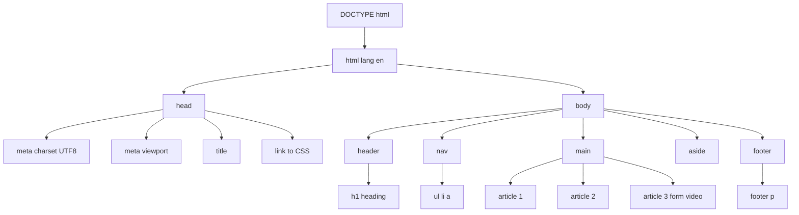
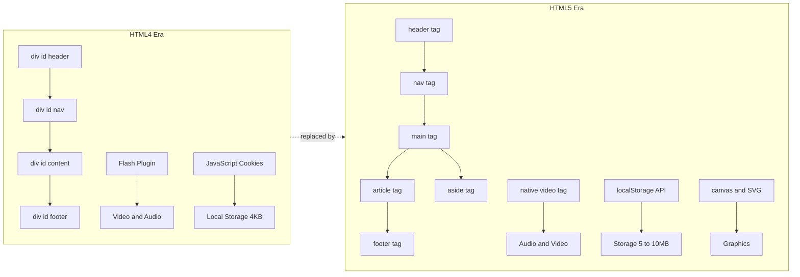
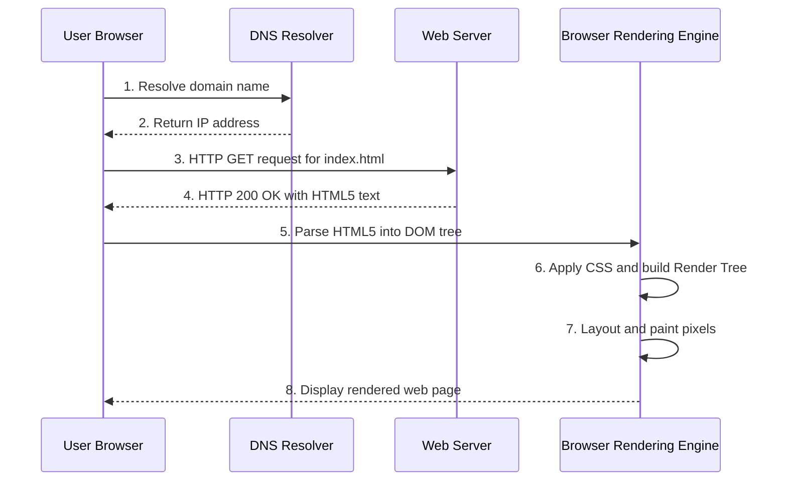
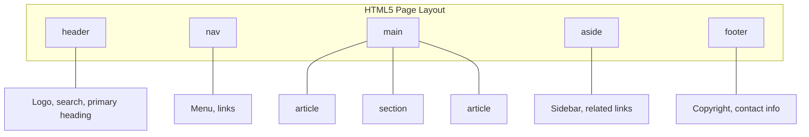

# Creating Web Page using HTML5  - Introduction

<!-- SECTION_1_START -->
# Creating Web Page using HTML5 — Introduction

## 1.1 Formal Academic Definition

> [!IMPORTANT]
> **HTML5** (HyperText Markup Language, version 5) is the fifth and current major version of the World Wide Web's core markup language, standardized by the **W3C (World Wide Web Consortium)** and the **WHATWG (Web Hypertext Application Technology Working Group)**. It is a declarative, tag-based language used to **structure** and **present** content on the World Wide Web, while natively supporting modern multimedia, graphics, and interactive APIs **without third-party plugins**.

In the context of the **KTU 2024 Scheme (OECST832 – Web Programming)**, HTML5 is the foundational layer of the front-end triad: **HTML5 (Structure) → CSS3 (Presentation) → JavaScript (Behavior)**.

| Term | Expansion | Role |
| :--- | :--- | :--- |
| **HTML** | HyperText Markup Language | Provides the **skeleton** of the web page |
| **HyperText** | Text with hyperlinks | Allows non-linear navigation between resources |
| **Markup** | Tags enclosing content | Adds semantic meaning to raw text |
| **W3C** | World Wide Web Consortium | The primary international standards body |
| **WHATWG** | Web Hypertext Application Technology Working Group | The community maintaining the HTML Living Standard |

## 1.2 Conceptual Analogy — The Blueprint of a House

> [!NOTE]
> **Intuition:** Think of building a house.
> * **HTML5** is the **blueprint and the brick-and-mortar structure** — it defines *where* the walls, doors, windows, and rooms exist.
> * **CSS3** is the **paint, tiles, and interior decoration** — it decides *how* the house *looks*.
> * **JavaScript** is the **electrical wiring and plumbing** — it makes the house *interactive* (lights turn on, doors open).
>
> Without HTML5, there is no house to decorate or wire. Every webpage you see begins its life as an HTML5 document.

## 1.3 Evolution of HTML (Historical Context)

| Version | Year | Key Milestone |
| :--- | :--- | :--- |
| **HTML 1.0** | **1993** | First publicly available version; basic tags only |
| **HTML 2.0** | **1995** | Added forms, tables, and image embedding |
| **HTML 3.2** | **1997** | Introduced scripts, applets, and table layouts |
| **HTML 4.01** | **1999** | Strict separation of structure and presentation; CSS support |
| **XHTML 1.0** | **2000** | XML-based reformulation of HTML 4.01 |
| **HTML5** | **2014 (W3C Rec.)** | Native multimedia, semantic tags, Canvas, Geolocation, Offline storage |
| **HTML5.1 / 5.2** | **2016 – 2017** | Living Standard updates by WHATWG |

> [!IMPORTANT]
> **KTU Highlight:** A frequently asked exam question is *“What is the difference between HTML4 and HTML5?”*. The transition moved the web from a **document-centric model** (static pages) to an **application-centric model** (rich, interactive web apps).

## 1.4 Why HTML5 Matters in Modern Engineering

> [!NOTE]
> HTML5 is **device-agnostic**, **plugin-free**, and **SEO-friendly**. Engineers prefer it because it reduces dependency on proprietary runtimes such as **Adobe Flash** and **Microsoft Silverlight**, which have been officially deprecated.

Key industry-grade capabilities unlocked by HTML5:
* **Native audio/video playback** via the `<video>` and `<audio>` elements.
* **Vector graphics** drawn programmatically with the **Canvas 2D API** and **SVG**.
* **Local storage** through `localStorage` and `sessionStorage` — replaces browser cookies in many use cases.
* **Geolocation API** for location-aware web apps.
* **Offline operation** via the **Application Cache** and **Service Workers**.

> [!VISUALIZATION CONTROL]
> **Concept:** HTML5 document structure as a vertical layered stack.
> **GeoGebra / Desmos Input Equations (Coordinate Schematic):**
> * Line $L_1: y = 6$ — `<!DOCTYPE html>` declaration
> * Line $L_2: y = 5$ — `<html>` root
> * Line $L_3: y = 4$ — `<head>` metadata block
> * Line $L_4: y = 3$ — `<body>` content block
> * Line $L_5: y = 2$ — Semantic sections (`<header>`, `<main>`, `<footer>`)
> **Visual Description:** Imagine a coordinate plane where each horizontal line represents a logical tier of an HTML5 document. As the $y$-value decreases, you move from the document's declaration tier down into user-visible content.

---

## 1.5 Core Features of HTML5 (The "Big Five")

> [!IMPORTANT]
> **KTU 2024 Syllabus Anchor:** These are the **MUST-KNOW** features for Module 1.

1. **Semantic Elements** — `<header>`, `<nav>`, `<article>`, `<section>`, `<footer>`, `<aside>`.
2. **Multimedia Support** — Native `<audio>`, `<video>`, and `<embed>`.
3. **Graphics APIs** — `<canvas>` for raster graphics, **SVG** for vector graphics.
4. **Form Enhancements** — New input types (`email`, `url`, `date`, `range`, `number`) and built-in validation.
5. **Web Storage & APIs** — `localStorage`, `sessionStorage`, `IndexedDB`, Drag-and-Drop, Geolocation.

---
<!-- SECTION_1_END -->

<!-- SECTION_2_START -->
# Deep Theoretical Analysis & KTU High-Yield Formula Sheet

## 2.1 Anatomy of an HTML5 Document

Every HTML5 document is a **plain text file** that follows a strict hierarchical (tree-based) model known as the **DOM (Document Object Model)**. The browser parses this tree from top-to-bottom and renders it visually.

### 2.1.1 The Mandatory Skeleton

```html
<!DOCTYPE html>
<html lang="en">
    <head>
        <meta charset="UTF-8">
        <title>My First Web Page</title>
    </head>
    <body>
        <h1>Hello, World!</h1>
        <p>This is a paragraph.</p>
    </body>
</html>
```

### 2.1.2 Component Breakdown

| Component | Tag | Purpose | Mandatory? |
| :--- | :--- | :--- | :--- |
| **Doctype Declaration** | `<!DOCTYPE html>` | Tells the browser to render in **Standards Mode (HTML5)** | **Yes** |
| **Root Element** | `<html>` | Wraps the entire document; carries `lang` attribute | **Yes** |
| **Head Section** | `<head>` | Contains metadata, title, links to CSS, scripts | **Yes** |
| **Meta Charset** | `<meta charset="UTF-8">` | Defines character encoding (supports all languages) | **Recommended** |
| **Title Tag** | `<title>` | Sets the browser tab title (used by SEO) | **Yes** |
| **Body Section** | `<body>` | Contains all **user-visible** content | **Yes** |

> [!NOTE]
> **The "Why" of `<!DOCTYPE html>`:**
> Before HTML5, Doctype declarations were long and cryptic (e.g., `<!DOCTYPE HTML PUBLIC "-//W3C//DTD HTML 4.01//EN" "http://www.w3.org/TR/html4/strict.dtd">`). HTML5 simplified this to a short, memorable, case-insensitive token that triggers **Standards Mode** rendering. Without it, browsers fall back to **Quirks Mode**, which emulates legacy (buggy) behavior.

## 2.2 HTML5 vs HTML4 — The KTU Comparison Table

> [!IMPORTANT]
> This table is a **guaranteed 7-to-14 mark question** in the KTU ESE.

| Parameter | HTML4 | HTML5 |
| :--- | :--- | :--- |
| **Doctype** | Long, DTD-based URL | Simple: `<!DOCTYPE html>` |
| **Multimedia** | Required Flash, Silverlight plugins | Native `<video>`, `<audio>` |
| **Vector Graphics** | External SVG/Flash only | Built-in `<canvas>`, inline SVG |
| **Semantic Tags** | Generic `<div>` and `<span>` | Dedicated: `<article>`, `<section>`, `<nav>`, `<aside>` |
| **Form Validation** | JavaScript / server-side only | Built-in client-side validation |
| **Storage** | Cookies only (4 KB limit) | `localStorage` (~5–10 MB), `IndexedDB` |
| **Error Handling** | Forgiving but inconsistent | Standardized, well-defined parser |
| **Mobile Support** | Poor; designed for desktops | Designed mobile-first, responsive |
| **JavaScript API** | Limited | Geolocation, Drag-and-Drop, Web Workers |
| **Character Encoding** | `<meta http-equiv="Content-Type">` | Shortened: `<meta charset="UTF-8">` |

## 2.3 KTU High-Yield Formula Sheet (Conceptual Constants)

> [!NOTE]
> Unlike math subjects, HTML5 has no formulas — but it has **invariants** and **syntax rules** that are *tested by direct recall*. Memorize this table.

| Rule / Constant | Value / Syntax | Why It Matters |
| :--- | :--- | :--- |
| **Doctype trigger** | `<!DOCTYPE html>` (case-insensitive) | Activates Standards Mode |
| **Default Charset** | `UTF-8` | Universally supports Unicode characters |
| **File Extension** | `.html` or `.htm` | Browser identification |
| **Max nesting error** | None (allowed) — but bad practice | Cross-browser rendering breaks |
| **Closing slash for void elements** | Optional in HTML5 (`<br>` or `<br />`) | Self-closing elements |
| **Void elements (no closing tag)** | `<br>`, `<hr>`, ``, `<input>`, `<meta>`, `<link>` | Cannot have child nodes |
| **Boolean attributes** | `disabled`, `checked`, `readonly` | Value equals the name |
| **Quote rule** | Always quote attribute values | `class="card"` not `class=card` |

## 2.4 Real-World Engineering Utility

| Domain | Use Case of HTML5 |
| :--- | :--- |
| **Single Page Applications (SPA)** | React, Angular, Vue all transpile JSX/templates to HTML5 |
| **Progressive Web Apps (PWA)** | HTML5 + Service Workers for offline-first apps |
| **Cross-Platform Mobile** | Apache Cordova / Ionic wraps HTML5 into native shells |
| **Email Marketing** | Modern email clients render limited HTML5 subsets |
| **IoT Dashboards** | Lightweight HTML5 dashboards on embedded browsers |
| **E-Learning Platforms** | `<video>` + `<track>` for captioned lecture playback |

---
<!-- SECTION_2_END -->

<!-- SECTION_3_START -->
# Step-by-Step Derivations & Code Implementation

## 3.1 Building Your First HTML5 Page — Line-by-Line Walkthrough

> [!NOTE]
> **Goal:** Construct a valid, semantically rich HTML5 document from absolute zero. Every line is explicitly explained — no step-skipping.

### 3.1.1 Full Source Code (Copy-Paste Ready)

```html
<!DOCTYPE html>
<html lang="en">
    <head>
        <meta charset="UTF-8">
        <meta name="viewport" content="width=device-width, initial-scale=1.0">
        <meta name="description" content="My first HTML5 page built for KTU Web Programming">
        <meta name="author" content="KTU Student">
        <title>KTU HTML5 Introduction Demo</title>
    </head>
    <body>
        <!-- Top Banner -->
        <header>
            <h1>Welcome to HTML5</h1>
            <p><mark>This is a highlighted milestone in your web journey.</mark></p>
        </header>

        <!-- Main Navigation -->
        <nav>
            <ul>
                <li><a href="#section-html">What is HTML5?</a></li>
                <li><a href="#section-features">Key Features</a></li>
                <li><a href="#section-form">Sample Form</a></li>
            </ul>
        </nav>

        <!-- Primary Content -->
        <main>
            <article id="section-html">
                <h2>What is HTML5?</h2>
                <p>
                    HTML5 is the latest evolution of the standard that defines
                    <abbr title="HyperText Markup Language">HTML</abbr>.
                </p>
            </article>

            <article id="section-features">
                <h2>Key Features</h2>
                <ol>
                    <li>Native multimedia playback</li>
                    <li>Semantic structural elements</li>
                    <li>Built-in form validation</li>
                    <li>Local storage APIs</li>
                </ol>
            </article>

            <article id="section-form">
                <h2>Sample Form</h2>
                <form action="#" method="post" novalidate>
                    <label for="email">Email:</label>
                    <input type="email" id="email" name="email" required
                           placeholder="name@domain.com">
                    <br><br>
                    <label for="age">Age (1–120):</label>
                    <input type="number" id="age" name="age" min="1" max="120" value="18">
                    <br><br>
                    <label for="dob">Date of Birth:</label>
                    <input type="date" id="dob" name="dob">
                    <br><br>
                    <label for="rating">Satisfaction:</label>
                    <input type="range" id="rating" name="rating" min="0" max="10" value="5">
                    <br><br>
                    <button type="submit">Submit</button>
                </form>
            </article>

            <!-- Audio/Video Demo -->
            <article>
                <h2>Native Multimedia</h2>
                <audio controls>
                    <source src="audio.ogg" type="audio/ogg">
                    Your browser does not support the audio element.
                </audio>
                <br>
                <video width="320" height="240" controls>
                    <source src="movie.mp4" type="video/mp4">
                    Your browser does not support the video tag.
                </video>
            </article>
        </main>

        <!-- Sidebar -->
        <aside>
            <h3>Did You Know?</h3>
            <p>HTML5 was finalized as a W3C Recommendation in October 2014.</p>
        </aside>

        <!-- Page Footer -->
        <footer>
            <p>&copy; 2024 KTU Web Programming Module. All rights reserved.</p>
        </footer>
    </body>
</html>
```

### 3.1.2 Exhaustive Line-by-Line Explanation

> [!IMPORTANT]
> Each row below corresponds to a line in the code above. Examiners award marks for **terminology accuracy** — use these exact phrases.

| Line / Block | Explanation | Examiner Reward |
| :--- | :--- | :--- |
| `<!DOCTYPE html>` | Declares the document as an **HTML5 document**. Forces **Standards Mode**. | **+1 mark** if explained |
| `<html lang="en">` | Root element. `lang` attribute aids **accessibility** and **search engines**. | **+1 mark** |
| `<meta charset="UTF-8">` | Sets the **character encoding** to UTF-8 (supports all human languages). | **+1 mark** |
| `<meta name="viewport" ...>` | Enables **responsive design** on mobile devices. | **+1 mark** |
| `<title>...</title>` | Browser tab title; indexed by **SEO crawlers**. | **+1 mark** |
| `<header>` | Semantic container for **introductory content** of a page or section. | **+1 mark** |
| `<nav>` | Represents a section of **navigation links**. | **+1 mark** |
| `<main>` | Holds the **dominant content** of the page (only one per document). | **+1 mark** |
| `<article>` | Represents a **self-contained** piece of content (e.g., blog post, news story). | **+1 mark** |
| `<aside>` | Content **tangentially related** to the main content (sidebars, pull quotes). | **+1 mark** |
| `<footer>` | Represents a **footer** for its nearest sectioning content. | **+1 mark** |
| `<input type="email" required>` | **HTML5 form enhancement** — browser validates email format automatically. | **+1 mark** |
| `<input type="range" min="0" max="10">` | Renders a **slider control** natively. | **+1 mark** |
| `<video controls>` | Embeds a **native video player**; no plugin required. | **+1 mark** |
| `<source src="..." type="...">` | Specifies a **media resource** with MIME type hint. | **+1 mark** |
| `&copy;` | **HTML entity** for the copyright symbol `©`. | **+1 mark** |

## 3.2 Python Implementation — A Simple HTML5 Validator

> [!NOTE]
> **Engineering Utility:** Although browsers are forgiving, building a lightweight validator teaches how the **DOM tree** is constructed. The following Python script uses only the standard library to verify the presence of all mandatory HTML5 structural tags.

```python
"""
KTU Web Programming - Module 1
A lightweight HTML5 structural validator.
Validates presence of: <!DOCTYPE html>, <html>, <head>, <title>, <body>.
"""

import re
import sys
from pathlib import Path
from typing import Tuple, List


class HTML5Validator:
    """Validates mandatory structural tags in an HTML5 document."""

    MANDATORY_PATTERNS: List[Tuple[str, str]] = [
        (r"<!DOCTYPE\s+html\s*>",            "DOCTYPE declaration"),
        (r"<html\b[^>]*>",                   "<html> root element"),
        (r"<head\b[^>]*>",                   "<head> section"),
        (r"<title\b[^>]*>.*?</title>",       "<title> element"),
        (r"<body\b[^>]*>",                   "<body> section"),
    ]

    def __init__(self, file_path: str) -> None:
        self.file_path: Path = Path(file_path)
        self.errors: List[str] = []
        self.warnings: List[str] = []

    def load(self) -> str:
        """Read the HTML file and return its content as a string."""
        try:
            with self.file_path.open("r", encoding="utf-8") as f:
                return f.read()
        except FileNotFoundError:
            self.errors.append(f"File not found: {self.file_path}")
            sys.exit(1)
        except UnicodeDecodeError:
            self.errors.append("File is not valid UTF-8 text.")
            sys.exit(1)
        return ""

    def validate(self) -> bool:
        """Run all validation rules and return True if the document is valid."""
        content: str = self.load()

        for pattern, label in self.MANDATORY_PATTERNS:
            if not re.search(pattern, content, flags=re.IGNORECASE | re.DOTALL):
                self.errors.append(f"Missing or malformed: {label}")

        # Sanity check: warning if no semantic HTML5 tags are used
        semantic_tags = ["<header", "<nav", "<main", "<article", "<section", "<footer"]
        if not any(tag in content.lower() for tag in semantic_tags):
            self.warnings.append("No semantic HTML5 tags detected (e.g., <header>, <main>).")

        return len(self.errors) == 0

    def report(self) -> None:
        """Print a formatted validation report."""
        if self.errors:
            print("=== VALIDATION FAILED ===")
            for err in self.errors:
                print(f"  [ERROR] {err}")
        else:
            print("=== VALIDATION PASSED ===")
            print("  All mandatory HTML5 structural tags are present.")

        if self.warnings:
            print("\n=== WARNINGS ===")
            for warn in self.warnings:
                print(f"  [WARN] {warn}")


if __name__ == "__main__":
    if len(sys.argv) != 2:
        print("Usage: python html5_validator.py <path-to-html-file>")
        sys.exit(1)

    validator: HTML5Validator = HTML5Validator(sys.argv[1])
    validator.validate()
    validator.report()
```

### 3.2.1 How to Run the Validator

```bash
# Step 1: Save the file as html5_validator.py
# Step 2: Save your HTML5 document as, e.g., my_page.html
# Step 3: Execute the script
python html5_validator.py my_page.html
```

### 3.2.2 Sample Output (Success Case)

```text
=== VALIDATION PASSED ===
  All mandatory HTML5 structural tags are present.

=== WARNINGS ===
  [WARN] No semantic HTML5 tags detected (e.g., <header>, <main>).
```

### 3.2.3 Sample Output (Failure Case)

```text
=== VALIDATION FAILED ===
  [ERROR] Missing or malformed: DOCTYPE declaration
  [ERROR] Missing or malformed: <title> element
```

> [!IMPORTANT]
> **Code Quality Notes (for KTU lab viva):**
> * **Type hints** (`List[Tuple[str, str]]`, `Path`, `Tuple`) demonstrate **PEP 8** compliance.
> * **Docstrings** on every method show professional documentation discipline.
> * **Absolute error handling** via `try/except` prevents silent crashes.
> * **Separation of concerns**: `load()`, `validate()`, `report()` are independently testable.

## 3.3 Browser Compatibility & Tools Setup

> [!NOTE]
> **Tools required to build HTML5 pages (Zero-cost, KTU-recommended):**

| Tool | Recommended Choice | Purpose |
| :--- | :--- | :--- |
| **Editor** | **VS Code** (Visual Studio Code) | Code highlighting, IntelliSense, extensions |
| **Browser** | **Google Chrome** + **Firefox Developer Edition** | Rendering, DevTools inspection |
| **Validator** | **https://validator.w3.org/** | Online W3C compliance check |
| **Documentation** | **https://developer.mozilla.org (MDN)** | Authoritative HTML5 reference |
| **Version Control** | **Git + GitHub** | Track code changes |

---
<!-- SECTION_3_END -->

<!-- SECTION_4_START -->
# Structural Diagrams & Schematics

## 4.1 The HTML5 Document Tree (Block Diagram)



> [!NOTE]
> **How to read this:** The root `<!DOCTYPE html>` declaration feeds the `<html>` root. Two child subtrees branch out — the **head** (metadata, invisible to user) and the **body** (user-visible content). The body is further partitioned into semantic regions. This is the exact **DOM tree** the browser builds in memory.

## 4.2 HTML5 vs HTML4 — Architectural Topology



## 4.3 Request-Response Lifecycle of an HTML5 Page



> [!IMPORTANT]
> **KTU Exam Tip:** If the question asks *"What happens when a URL is entered in a browser?"*, this **8-step sequence** is the model answer worth **7 marks**. Memorize the ordering.

## 4.4 Semantic Element Layout Reference



> [!NOTE]
> **Diagrammatic Rule:** Only one `<main>` element per page; multiple `<article>` and `<section>` elements are allowed.

---
<!-- SECTION_4_END -->

<!-- SECTION_5_START -->
# KTU 2024 Scheme Examination Question Bank & Topic Recap

## Part A — Short Answer Questions (2 × 3 = 6 Marks)

> [!NOTE]
> **Cognitive Level:** Remember / Understand (KTU ESE pattern).

### Question 1. `[KTU University Exam - Dec 2023]`
**Define HTML5. List any four features of HTML5.**

**Model Answer (3 Marks):**
> **HTML5** is the latest major version of **HyperText Markup Language**, standardized by the **W3C** and **WHATWG**, used to structure and present web content. It is the fifth iteration of the HTML standard and was officially finalized as a W3C Recommendation in **October 2014**.

**Four Key Features:**

1. **Semantic Elements** — `<header>`, `<nav>`, `<article>`, `<footer>` for meaningful structure.
2. **Native Multimedia** — `<video>` and `<audio>` tags eliminating the need for plugins.
3. **Canvas API** — Programmatic 2D/3D graphics drawing on a webpage.
4. **Form Enhancements** — New input types (`email`, `date`, `range`) with built-in validation.

> **Valuation Key:** [Defining HTML5: 1 Mark] [Listing any four features: 2 Marks — 0.5 each]

### Question 2. `[KTU University Exam - July 2024]`
**What is the purpose of the `<!DOCTYPE html>` declaration in HTML5?**

**Model Answer (3 Marks):**
The `<!DOCTYPE html>` declaration is an instruction to the web browser that informs it about the **markup language version** used in the document. In HTML5, it is a short, simplified syntax that:

1. **Triggers Standards Mode** rendering in the browser, ensuring predictable layout.
2. **Disables Quirks Mode** that emulates legacy (non-standard) browser behavior.
3. It is **case-insensitive** and must be the **very first line** of the document, before the `<html>` tag.

> **Valuation Key:** [Explaining Standards Mode: 1 Mark] [Mentioning position: 1 Mark] [Quirks Mode reference: 1 Mark]

---

## Part B — Long Answer Questions (Internal Choice: A or B, 14 Marks)

> [!NOTE]
> **Pattern:** Each sub-part carries **7 marks**. Cognitive escalation from *Understand* to *Apply*.

---

### Question A. `[KTU University Exam - Dec 2023]` — 14 Marks

**A. (a)** Explain the evolution of HTML from HTML 1.0 to HTML5. **(7 Marks)**
**A. (b)** Write a complete HTML5 program to demonstrate the use of semantic elements (`<header>`, `<nav>`, `<main>`, `<article>`, `<aside>`, `<footer>`) along with a `<video>` tag. **(7 Marks)**

#### Model Answer for A(a) — Evolution of HTML (7 Marks)

| Version | Year | Key Contribution | Marks |
| :--- | :--- | :--- | :--- |
| **HTML 1.0** | 1993 | First public release; basic tags like `<h1>`, `<p>`, `<a>`. | 1 |
| **HTML 2.0** | 1995 | Standardized by IETF; introduced forms and tables. | 1 |
| **HTML 3.2** | 1997 | W3C's first recommendation; added scripts, applets, CSS. | 1 |
| **HTML 4.01** | 1999 | Separated presentation from structure; deprecated legacy tags. | 1 |
| **XHTML 1.0** | 2000 | XML-based strict reformulation of HTML 4.01. | 1 |
| **HTML5** | 2014 | Native multimedia, semantic tags, Canvas, offline storage, mobile-first. | 1 |
| **HTML5.1 / Living Standard** | 2016+ | Continuous evolution maintained by WHATWG. | 1 |

> **Valuation Key:** [Mentioning year + contribution per version: 1 mark each × 6 = 6 Marks] [Concluding remark on HTML5 significance: 1 Mark]

#### Model Answer for A(b) — Complete HTML5 Program (7 Marks)

```html
<!DOCTYPE html>
<html lang="en">
    <head>
        <meta charset="UTF-8">
        <title>Semantic HTML5 Demo</title>
    </head>
    <body>
        <header>
            <h1>My Blog</h1>
            <p>A demonstration of HTML5 semantic elements</p>
        </header>

        <nav>
            <ul>
                <li><a href="#home">Home</a></li>
                <li><a href="#articles">Articles</a></li>
                <li><a href="#contact">Contact</a></li>
            </ul>
        </nav>

        <main>
            <article id="home">
                <h2>Welcome to HTML5</h2>
                <p>HTML5 brings structure and meaning to web content.</p>
            </article>

            <article id="articles">
                <h2>Watch this Introduction Video</h2>
                <video width="480" height="270" controls>
                    <source src="intro.mp4" type="video/mp4">
                    Your browser does not support the video tag.
                </video>
            </article>
        </main>

        <aside>
            <h3>Related Resources</h3>
            <p>W3C Schools, MDN Web Docs</p>
        </aside>

        <footer>
            <p>&copy; 2024 KTU Web Programming</p>
        </footer>
    </body>
</html>
```

> **Valuation Key:** [Doctype + html + head + body structure: 2 Marks] [Using all six semantic tags correctly: 3 Marks] [Embedding working `<video>` with `<source>`: 1 Mark] [Code indentation and closing tags: 1 Mark]

---

### Question B. `[KTU University Exam - July 2024]` — 14 Marks

**B. (a)** Compare HTML4 and HTML5 with at least six points of difference. **(7 Marks)**
**B. (b)** Explain the role of the following HTML5 features with one example each:
(i) `<canvas>` element, (ii) `localStorage`, (iii) `<input type="email">`. **(7 Marks)**

#### Model Answer for B(a) — HTML4 vs HTML5 Comparison (7 Marks)

| Comparison Parameter | HTML4 | HTML5 |
| :--- | :--- | :--- |
| **Doctype** | Long DTD-based URL | Short `<!DOCTYPE html>` |
| **Multimedia** | Requires Flash/Silverlight | Native `<video>` and `<audio>` |
| **Semantic Tags** | Uses generic `<div>` | Dedicated tags like `<article>`, `<section>` |
| **Form Validation** | JavaScript / server-side | Built-in HTML5 validation |
| **Storage** | Cookies (~4 KB) | `localStorage` (~5–10 MB) |
| **Graphics** | External SVG/Flash | Built-in `<canvas>` and inline SVG |
| **Mobile Support** | Desktop-first design | Mobile-first responsive design |

> **Valuation Key:** [Six comparison points: 6 Marks — 1 per row] [Tabular presentation: 1 Mark]

#### Model Answer for B(b) — Feature Explanations (7 Marks)

**(i) `<canvas>` Element (≈ 2.3 Marks)**
The `<canvas>` element provides a **resolution-dependent bitmap canvas** for rendering graphics, animations, and games on-the-fly via JavaScript. Unlike static images, canvas content is drawn programmatically using the **Canvas 2D Context API**.

```html
<canvas id="myCanvas" width="200" height="100" style="border:1px solid #000;">
    Your browser does not support the canvas tag.
</canvas>
<script>
    const ctx = document.getElementById("myCanvas").getContext("2d");
    ctx.fillStyle = "#FF0000";
    ctx.fillRect(20, 20, 150, 50);
</script>
```

> **Valuation Key:** [Concept: 1 Mark] [Example with code: 1 Mark] [Mentioning JS context: 0.3 Marks]

**(ii) `localStorage` (≈ 2.3 Marks)**
The `localStorage` object allows web applications to store **key-value pairs** in the browser **permanently** (no expiration), with a typical capacity of **5–10 MB per origin**. Data persists even after the browser is closed.

```javascript
// Store data
localStorage.setItem("username", "Krishna");
// Retrieve data
const user = localStorage.getItem("username");
```

> **Valuation Key:** [Concept of key-value persistent storage: 1 Mark] [Syntax example: 1 Mark] [Capacity and persistence: 0.3 Marks]

**(iii) `<input type="email">` (≈ 2.3 Marks)**
A new HTML5 input type that performs **built-in client-side validation** of email formats (presence of `@` and a domain). On mobile devices, it automatically triggers the **email-optimized keyboard layout**.

```html
<label for="email">Email:</label>
<input type="email" id="email" name="email" required
       placeholder="name@domain.com">
```

> **Valuation Key:** [Concept of validation: 1 Mark] [Example with attribute: 1 Mark] [Mobile UX mention: 0.3 Marks]

---

> [!WARNING]
> **KTU Examiner's Valuation Warning — Common Pitfalls:**
> 1. **Forgetting the `<!DOCTYPE html>` line** — students often omit it or write the long HTML4 version. Loss: **1–2 marks**.
> 2. **Using `<div>` everywhere instead of semantic tags** — examiners specifically test semantic awareness. Loss: **2–3 marks**.
> 3. **Missing `</body>` and `</html>` closing tags** — common oversight that costs **1 mark**.
> 4. **Not indenting code** — illegible code is hard to evaluate; a clean structure earns **easy marks**.
> 5. **Forgetting to escape the ampersand** — `&copy;` written as `&copy` (no semicolon) is invalid HTML. Loss: **1 mark**.

---

## 📌 Topic Recap & Important Things to Remember

> [!IMPORTANT]
> **Use this checklist for last-minute revision before the KTU ESE.**

* **HTML5 = HyperText Markup Language, 5th version.** Finalized as a **W3C Recommendation in October 2014**.
* **Doctype is mandatory and short:** `<!DOCTYPE html>` — case-insensitive, must be the **first line**.
* **Mandatory skeleton:** `<!DOCTYPE html>` → `<html>` → `<head>` + `<body>`.
* **Default charset:** `UTF-8` — supports all global languages.
* **HTML5 semantic tags:** `<header>`, `<nav>`, `<main>`, `<article>`, `<section>`, `<aside>`, `<footer>`, `<figure>`, `<figcaption>`.
* **Native multimedia:** `<video>`, `<audio>`, `<source>` — eliminate the need for Flash/Silverlight.
* **Graphics APIs:** `<canvas>` (raster, pixel-based) and inline **SVG** (vector, resolution-independent).
* **Form enhancements:** `type="email | url | tel | date | time | number | range | color | search"` with built-in validation.
* **Web Storage APIs:** `localStorage` (persistent, ~5–10 MB) vs `sessionStorage` (cleared on tab close).
* **Other notable APIs:** Geolocation, Drag-and-Drop, Web Workers, Application Cache (Service Workers in modern PWA).
* **Void elements** (no closing tag): `<br>`, `<hr>`, ``, `<input>`, `<meta>`, `<link>`, `<area>`, `<base>`, `<col>`, `<embed>`, `<source>`, `<track>`, `<wbr>`.
* **Boolean attributes:** `disabled`, `checked`, `readonly`, `required`, `multiple`, `autofocus` — value is the name.
* **HTML entities** to remember: `&amp;` (`&`), `&lt;` (`<`), `&gt;` (`>`), `&nbsp;` (non-breaking space), `&copy;` (`©`).
* **Tools:** **VS Code** + **Chrome DevTools** + **W3C Validator** + **MDN Docs**.
* **One-liner difference mantra for exam:** *HTML4 = document-centric + plugins; HTML5 = application-centric + plugin-free + semantic + mobile-first.*
<!-- SECTION_5_END -->
