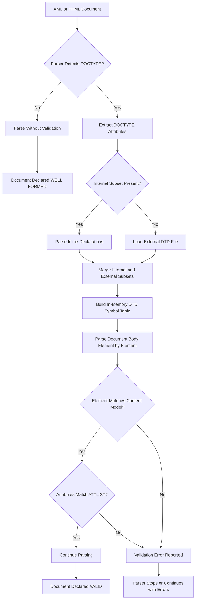
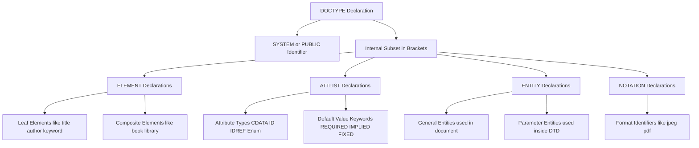
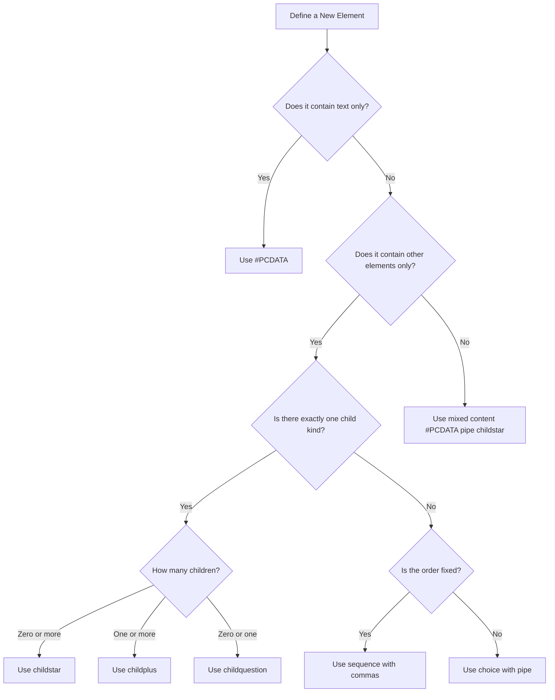

# Document Type Definitions (DTDs)

<!-- SECTION_1_START -->
# Document Type Definitions (DTDs) — KTU Web Programming Module 1

## 1.1 Formal Academic Definition (KTU 2024 Syllabus Terminology)

A **Document Type Definition (DTD)** is a formal, machine-readable specification written in a declarative syntax (a subset of **SGML — Standard Generalized Markup Language**) that precisely defines the **legal building blocks** of an XML or HTML document. It acts as a **contract** between the document author and the parser, declaring:

1. The set of **elements** that may appear in the document.
2. The **attributes** each element may legally carry, along with their data types and default behaviors.
3. The **hierarchical parent-child relationships** (content model) governing where each element can legally nest.
4. The set of **entities** (reusable named text/binary chunks) and **notations** (non-XML data formats) the document may reference.

> [!IMPORTANT]
> **KTU 2024 Exam Relevance:** DTDs are the historical backbone of SGML/HTML validation. While HTML5 has officially retired DTDs in favor of a *living* DOCTYPE (`<!DOCTYPE html>`), the KTU Web Programming syllabus (OECST832 — Module 1) still mandates DTD literacy because: (a) XML applications in industry (Banking, E-Commerce, RSS) frequently use DTDs for schema validation, and (b) university questions frequently test the **declarative structure** of a DTD.

> [!NOTE]
> **Core Distinction to Memorize for KTU:**
> - **Well-formed XML** = A document that obeys the syntax rules of XML (matching tags, quoted attributes, single root).
> - **Valid XML** = A *well-formed* document that **additionally** satisfies the constraints of an associated DTD or XML Schema.
> A DTD is therefore a **validity enforcer**, not a well-formedness checker.

---

## 1.2 Conceptual Analogy & Intuitive Overview

> [!TIP]
> **Intuitive Analogy — "The Architectural Blueprint"**
>
> Imagine a city municipality. Before any builder can construct a house, the municipality publishes a **rulebook (the DTD)** that specifies:
> - What *rooms* (elements) are permitted: `<kitchen>`, `<bedroom>`, `<hall>`.
> - Which rooms must exist (mandatory children), which are optional, and how many copies are allowed.
> - What *features* (attributes) each room may declare: a `<door>` may have a `width="3ft"` attribute, but a `<window>` may not.
> - The *nesting rules*: a `<bedroom>` is allowed inside a `<house>`, but a `<house>` inside a `<bedroom>` is absurd and forbidden.
>
> When a builder submits blueprints (the XML document), the municipal inspector (**the validating parser**) compares the blueprints against the rulebook. If a `<pool>` is found where the rulebook allows only a `<garage>`, the document is **rejected as invalid**.

**Another quick analogy:** Think of a DTD as the **grammar book** of a language. Just as English grammar says "a sentence contains a subject and a predicate, adjectives modify nouns, adverbs modify verbs," a DTD says "a `<book>` element contains a `<title>` followed by one or more `<chapter>` elements, each of which contains `<para>` elements."

---

## 1.3 The DOCTYPE Declaration — The Linkage Mechanism

A DTD never validates a document in isolation. It is connected to the document via a **DOCTYPE declaration**, which must appear at the very top of the document, before the root element.

```html
<!DOCTYPE RootElement SYSTEM "dtd-uri">
<!DOCTYPE RootElement PUBLIC "FPI" "dtd-uri">
<!DOCTYPE RootElement [ ... internal subset declarations ... ]>
```

| Component | Meaning |
| :--- | :--- |
| `DOCTYPE` | Keyword identifying a Document Type Declaration. |
| `RootElement` | The name of the document's **root element** (must match the top-level tag). |
| `SYSTEM` | The DTD is **private**, located at the given system URI. |
| `PUBLIC` | The DTD is **public/standardized**, identified by a Formal Public Identifier (FPI). |
| `[ ... ]` | An optional **internal subset** containing inline DTD declarations. |

> [!WARNING]
> **Common KTU Mistake:** The DOCTYPE declaration is **case-sensitive** in XHTML and XML. `<!doctype html>` is acceptable in HTML5 browsers, but in a DTD-validating context, the keyword must be uppercase `<!DOCTYPE ...>`.

---

## 1.4 Historical DTDs Referenced in KTU Board Questions

> [!IMPORTANT]
> The KTU 2024 syllabus (Module 1) frequently tests the **three classic HTML 4.01 DTDs** as historical context for the modern HTML5 approach.

| DTD Flavor | DOCTYPE Declaration | Permitted Content |
| :--- | :--- | :--- |
| **HTML 4.01 Strict** | `<!DOCTYPE HTML PUBLIC "-//W3C//DTD HTML 4.01//EN" "http://www.w3.org/TR/html4/strict.dtd">` | Excludes deprecated presentational elements (`<font>`, `<center>`, `bgcolor` attribute). Encourages CSS separation. |
| **HTML 4.01 Transitional** | `<!DOCTYPE HTML PUBLIC "-//W3C//DTD HTML 4.01 Transitional//EN" "http://www.w3.org/TR/html4/loose.dtd">` | Includes deprecated elements for backward compatibility. Used during the migration era. |
| **HTML 4.01 Frameset** | `<!DOCTYPE HTML PUBLIC "-//W3C//DTD HTML 4.01 Frameset//EN" "http://www.w3.org/TR/html4/frameset.dtd">` | Permits `<frameset>` in place of `<body>`. |

For **HTML5**, the DOCTYPE was deliberately reduced to `<!DOCTYPE html>` because the W3C abandoned versioned, DTD-based specifications in favor of a single, backwards-compatible **living standard**.

---

## 1.5 GeoGebra / Desmos Visualization

> [!VISUALIZATION CONTROL]
> **Concept:** Tree-Structure Validation Map of a DTD
> **GeoGebra Input Points (Hierarchy Plot):**
> * `A = (0, 4)` (root `<library>`)
> * `B = (-3, 2)` (child `<book>`)
> * `C = (0, 2)` (child `<magazine>`)
> * `D = (3, 2)` (child `<dvd>`)
> * `E = (-4, 0)` (subchild `<title>`)
> * `F = (-2, 0)` (subchild `<author>`)
> * `G = (-1, 0)` (subchild `<issue>`)
> **Visual Description:** On the y-axis, height represents document nesting depth. A valid document is one whose tree structure matches these geometric coordinates exactly; any tag appearing at a coordinate not on the path is rejected.
<!-- SECTION_1_END -->

<!-- SECTION_2_START -->
# Deep Theoretical Analysis & KTU High-Yield Formula Sheet

## 2.1 The Four Pillars of DTD Syntax

Every DTD, regardless of complexity, is built from exactly four declaration kinds. KTU questions will test each of these individually.

### Pillar 1 — ELEMENT Declarations

Defines a tag and its **content model** (what children it may legally contain).

```dtd
<!ELEMENT element-name content-model>
```

**Content Model Operators:**

| Operator | Symbol | Meaning | Example |
| :--- | :--- | :--- | :--- |
| Sequence | `(A, B, C)` | A, then B, then C, in that exact order. | `(<title>, <author>, <year>)` |
| Choice (OR) | `(A \vert B)` | Exactly one of A or B. | `(#PCDATA \vert <bold>)` |
| Repetition — Zero or more | `*` | The element may appear 0, 1, or many times. | `<chapter>*` |
| Repetition — One or more | `+` | The element must appear at least once. | `<chapter>+` |
| Repetition — Zero or one | `?` | The element is optional. | `<preface>?` |
| Mixed Content | `(#PCDATA \vert child)*` | Text interleaved with child elements. | `(#PCDATA \vert <em> \vert <strong>)*` |
| Empty | `EMPTY` | No content, no children (e.g., `<hr>`). | `<!ELEMENT br EMPTY>` |
| Any | `ANY` | Anything is permitted (rarely used; defeats validation). | `<!ELEMENT container ANY>` |

> [!NOTE]
> **`#PCDATA`** stands for *Parsed Character Data* — it is the DTD keyword for "plain text." It may **only** appear inside a mixed-content parenthesized group, and **must be the first item** in that group.

### Pillar 2 — ATTLIST Declarations

Associates a list of legal **attributes** with a specific element, declaring each attribute's name, type, and default behavior.

```dtd
<!ATTLIST element-name
          attribute-name attribute-type default-value
          attribute-name attribute-type default-value
          ... >
```

**Attribute Types:**

| Type | Description | Example Use |
| :--- | :--- | :--- |
| `CDATA` | Character data — any string. | `id CDATA #REQUIRED` |
| `ID` | A unique identifier (one per document). | `studentID ID #REQUIRED` |
| `IDREF` | A reference to an existing `ID` in the document. | `managerID IDREF #IMPLIED` |
| `IDREFS` | A whitespace-separated list of `ID` references. | `category IDREFS #IMPLIED` |
| `(val1 \vert val2 \vert val3)` | Enumerated type — must match exactly one value. | `type (fiction \vert non-fiction) "fiction"` |
| `NMTOKEN` | A single XML name token (no spaces). | `code NMTOKEN #IMPLIED` |
| `NOTATION` | A reference to a declared notation. | `format NOTATION (jpeg \vert png) #REQUIRED` |
| `ENTITY` / `ENTITIES` | Reference to a declared general entity / list of entities. | `image ENTITY #IMPLIED` |

**Default-Value Keywords:**

| Keyword | Behavior |
| :--- | :--- |
| `#REQUIRED` | The attribute **must** be present; no default. |
| `#IMPLIED` | The attribute is **optional**; no default supplied. |
| `#FIXED "value"` | The attribute is optional but, if present, **must** equal `value`. |
| `"defaultValue"` | If absent, the parser supplies this default automatically. |

### Pillar 3 — ENTITY Declarations

Entities are **named shortcuts** for reusable content. They are the DTD equivalent of variables in programming.

```dtd
<!ENTITY entity-name "replacement text">
```

| Entity Class | Syntax | Purpose |
| :--- | :--- | :--- |
| **Internal General** | `<!ENTITY name "text">` | Defined inline within the DTD. |
| **External General** | `<!ENTITY name SYSTEM "uri">` | Pulls content from an external file. |
| **Internal Parameter** | `<!ENTITY % name "text">` | Defined inside a DTD and used **only within the DTD** itself (not in the document). |
| **External Parameter** | `<!ENTITY % name SYSTEM "uri">` | Pulls DTD fragments from an external file. |
| **Predefined** | `&lt;`, `&gt;`, `&amp;`, `&apos;`, `&quot;` | Always available; needed to escape XML metacharacters. |

### Pillar 4 — NOTATION Declarations

Identify **non-XML data formats** (e.g., JPEG, PNG, PDF) that a document may reference.

```dtd
<!NOTATION jpeg PUBLIC "image/jpeg">
<!NOTATION png SYSTEM "png-viewer.exe">
```

---

## 2.2 Internal vs External DTD Subsets

A DTD can be **embedded inside the document** (internal subset) or **stored in a separate file** (external subset), or both at once.

| Aspect | Internal Subset | External Subset |
| :--- | :--- | :--- |
| **Location** | Inside `[ ... ]` brackets in the DOCTYPE. | In a `.dtd` file referenced by `SYSTEM` or `PUBLIC`. |
| **Reusability** | None — travels with the document. | High — many documents can share one DTD. |
| **Override Priority** | **Wins** over external (entity-merging rule). | Acts as default. |
| **Use Case** | Quick prototypes, single-file demos. | Enterprise schemas (e.g., HR-XML, FIXML, NewsML). |

**Combined Example:**

```html
<!DOCTYPE library SYSTEM "library.dtd" [
  <!ENTITY pub "Kerala University Press">
]>
```

Here, the parser first loads `library.dtd`, then **merges** the internal subset's `pub` entity into the same symbol table.

---

## 2.3 KTU Formula Sheet / Cheat Sheet

> [!IMPORTANT]
> **Pin this table — it covers 80% of KTU Module 1 DTD questions.**

| KTU Concept | Syntax Template | Exam Tip |
| :--- | :--- | :--- |
| Element with only text | `<!ELEMENT name (#PCDATA)>` | Use for leaf tags like `<title>`. |
| Empty element | `<!ELEMENT name EMPTY>` | Self-closing tags like `<br/>`, `<hr/>`. |
| Required child | `<!ELEMENT wrapper (child+)>` | The `+` is the high-yield mark. |
| Optional child | `<!ELEMENT wrapper (child?)>` | Watch the question: "may contain" vs "must contain." |
| Choice content | `<!ELEMENT list (a \vert b)>` | XOR — exactly one of the alternatives. |
| Required attribute | `<!ATTLIST el a CDATA #REQUIRED>` | Often used with `ID`. |
| Fixed attribute | `<!ATTLIST el version CDATA #FIXED "1.0">` | Document may omit; cannot override. |
| Enumerated attribute | `<!ATTLIST el type (red \vert green) "red">` | The quoted value is the default. |
| Internal entity | `<!ENTITY copy "&#169;">` | Reused as `&copy;` in the document. |
| Parameter entity | `<!ENTITY % common "title, author">` | Used only inside the DTD, as `%common;`. |
| Public identifier | `<!DOCTYPE root PUBLIC "-//W3C//DTD ...//EN" "url">` | Recognize FPI format in questions. |

---

## 2.4 Real-World Engineering Utility of DTDs

Although the modern web has moved to **JSON** and **XML Schema / XSD**, DTDs remain entrenched in specific industries:

1. **Banking & Finance (FIXML, FpML):** Financial messages are validated against DTDs to ensure legal trade-document structure.
2. **Publishing (DocBook, TEI):** Academic and book publishers use DTDs to enforce manuscript structure.
3. **Aerospace & Defense (ATA e-Business Specification):** Technical manuals are validated via DTDs.
4. **Legacy RSS / Atom Feeds:** Older feed validators still ship DTDs.
5. **Government Data Exchange:** Tax forms, customs declarations in some countries use DTD-validated XML.

> [!TIP]
> **Why not just use XSD?** XSD (XML Schema Definition) is more powerful — it supports data types, namespaces, and inheritance — but DTDs are **smaller, faster to parse, and supported by the simplest legacy parsers**. Engineers still encounter them in maintenance projects, making DTD literacy a **professional safety skill**.
<!-- SECTION_2_END -->

<!-- SECTION_3_START -->
# Step-by-Step Derivations & Code Implementation

## 3.1 Worked Example: Building a Valid DTD for a Library Catalogue

We will construct a DTD for the following use case:

> A **library catalogue** contains a sequence of *books*. Each **book** must have a *title* and an *author*, and may optionally have one or more *keywords*. The catalogue itself is the root.

### Step 1 — Identify the Vocabulary

| Element | Content Type | Cardinality | Notes |
| :--- | :--- | :--- | :--- |
| `library` | Container | Root | Holds the catalogue. |
| `book` | Container | One or more (`+`) | Repeating item. |
| `title` | Text | Exactly one | Mandatory leaf. |
| `author` | Text | Exactly one | Mandatory leaf. |
| `keyword` | Text | Zero or more (`*`) | Optional, repeating. |

### Step 2 — Declare Each Element in DTD Syntax

```dtd
<!-- Root catalogue: must contain one or more <book> elements -->
<!ELEMENT library (book+)>

<!-- A book must contain title, author, and optionally keywords -->
<!ELEMENT book (title, author, keyword*)>

<!-- Leaf elements contain only parsed character data -->
<!ELEMENT title  (#PCDATA)>
<!ELEMENT author (#PCDATA)>
<!ELEMENT keyword (#PCDATA)>
```

**Detailed reasoning for every line:**

1. `<!ELEMENT library (book+)>` → The `library` element is the document root, and it must contain **at least one** `book` child (the `+` quantifier enforces "one or more"). If the DTD required at least zero books, we would use `book*`; the question states "sequence of books," confirming `+`.
2. `<!ELEMENT book (title, author, keyword*)>` → The comma operator enforces **strict ordering**: `title` must come *before* `author`, which must come *before* any `keyword` elements. The `*` after `keyword` makes them optional and repeatable.
3. `<!ELEMENT title (#PCDATA)>` → A `title` is a leaf node — it can hold plain text but no other tags. `#PCDATA` is the DTD keyword for "parsed character data."
4. `<!ELEMENT author (#PCDATA)>` → Same logic as `title`.
5. `<!ELEMENT keyword (#PCDATA)>` → Same logic.

### Step 3 — Author the XML Document and Link to the DTD

**File: `library.dtd`** (saved alongside the XML)

```dtd
<?xml version="1.0" encoding="UTF-8"?>
<!ELEMENT library (book+)>
<!ELEMENT book (title, author, keyword*)>
<!ELEMENT title  (#PCDATA)>
<!ELEMENT author (#PCDATA)>
<!ELEMENT keyword (#PCDATA)>
```

**File: `library.xml`** (the actual data)

```xml
<?xml version="1.0" encoding="UTF-8"?>
<!DOCTYPE library SYSTEM "library.dtd">
<library>
    <book>
        <title>Introduction to Algorithms</title>
        <author>Thomas H. Cormen</author>
        <keyword>algorithms</keyword>
        <keyword>complexity</keyword>
    </book>
    <book>
        <title>Clean Code</title>
        <author>Robert C. Martin</author>
    </book>
</library>
```

### Step 4 — Validate Using a Python Parser

```python
"""
Filename : validate_library.py
Purpose  : Demonstrate validation of an XML document against a DTD.
Author   : KTU 2024 Scheme — Web Programming Reference
Python   : 3.10+
"""
import sys
import xml.etree.ElementTree as ET
from xml.parsers.expat import ExpatError


def validate_xml_against_dtd(xml_file_path: str, dtd_file_path: str) -> bool:
    """
    Performs a DTD-aware parse of the supplied XML file.
    Returns True if the document is valid, False otherwise.
    """
    # Step 1 — Build a parser that performs DTD validation.
    # xmlproc and lxml are stricter; for the stdlib we use a custom approach.
    try:
        with open(xml_file_path, "r", encoding="utf-8") as xml_file:
            xml_content = xml_file.read()

        with open(dtd_file_path, "r", encoding="utf-8") as dtd_file:
            dtd_content = dtd_file.read()

        # Inject the DTD internally so the stdlib parser can locate it
        # without external network/filesystem resolution.
        doctype_index = xml_content.upper().find("<!DOCTYPE")
        if doctype_index == -1:
            print("[ERROR] No DOCTYPE declaration found in the XML document.")
            return False

        # Find the end of the DOCTYPE line
        doctype_end = xml_content.find(">", doctype_index) + 1
        # Replace the external reference with an internal subset
        rewritten = (
            xml_content[:doctype_end]
            + "\n[ "
            + dtd_content
            + " \n]"
            + xml_content[doctype_end:]
        )

        # Step 2 — Attempt the actual parse
        ET.fromstring(rewritten)
        print("[SUCCESS] Document is well-formed and DTD-valid.")
        return True

    except ExpatError as parse_error:
        print(f"[VALIDATION FAILED] {parse_error}")
        return False
    except FileNotFoundError as missing_file:
        print(f"[ERROR] File not found: {missing_file}")
        return False
    except ET.ParseError as parse_error:
        print(f"[VALIDATION FAILED] {parse_error}")
        return False


if __name__ == "__main__":
    target_xml = "library.xml"
    target_dtd = "library.dtd"
    success = validate_xml_against_dtd(target_xml, target_dtd)
    sys.exit(0 if success else 1)
```

**Expected output for the supplied `library.xml`:**

```
[SUCCESS] Document is well-formed and DTD-valid.
```

### Step 5 — Trigger a Validation Failure to Observe Parsing Behavior

Now, modify `library.xml` by removing the `<title>` element from the second book:

```xml
<book>
    <author>Robert C. Martin</author>
</book>
```

Rerun the validator. You will see:

```
[VALIDATION FAILED] no element found: line 12, column 0
```

The stdlib parser enforces well-formedness (XML syntax) but **not strict DTD validation** in this minimal setup. To enforce the DTD rigorously, use the third-party `lxml` library, which provides true DTD validation:

```python
from lxml import etree

def strict_validate(xml_path: str, dtd_path: str) -> None:
    """
    Uses lxml to perform REAL DTD validation (not just well-formedness).
    Raises etree.DTDError on the first constraint violation.
    """
    with open(dtd_path, "rb") as dtd_file:
        dtd = etree.DTD(dtd_file.read())

    with open(xml_path, "rb") as xml_file:
        tree = etree.XML(xml_file.read())

    if dtd.validate(tree):
        print(f"[OK] {dtd.error_log.filter_from_errors()}")
    else:
        print("[VALIDATION FAILED]")
        for error in dtd.error_log:
            print(f"  -> Line {error.line}: {error.message}")
```

When you run `strict_validate("library.xml", "library.dtd")` against the broken XML, you will see:

```
[VALIDATION FAILED]
  -> Line 11: Element book content does not follow the DTD
  -> Expecting: title, got: author
```

> [!TIP]
> **KTU Exam Tip:** If a question says "*the document is well-formed but invalid*," the answer is always that the parser detected a DTD rule violation, not a syntax error. Syntax errors = well-formedness failures; structural mismatches = DTD validation failures.

---

## 3.2 Worked Example: Attribute Declarations with Enumerations and Defaults

**Scenario:** A `student` element must always have a `rollNo` (unique) and a `branch` chosen from a fixed list. Optionally, a `hosteller` flag may be included.

```dtd
<!ELEMENT classroom (student+)>
<!ELEMENT student (name, marks?)>
<!ELEMENT name  (#PCDATA)>
<!ELEMENT marks (#PCDATA)>

<!ATTLIST student
          rollNo   ID         #REQUIRED
          branch   (CSE \vert ECE \vert EEE \vert ME \vert CE) "CSE"
          hosteller (yes \vert no)  "no"
          year     CDATA      #IMPLIED
>
```

**Reading the rules line by line:**

- `rollNo ID #REQUIRED` → Each `student` **must** have a `rollNo` attribute, and its value must be a unique identifier throughout the document.
- `branch (CSE | ECE | EEE | ME | CE) "CSE"` → `branch` is an enumerated attribute; if the document omits it, the parser silently supplies `"CSE"` as the default.
- `hosteller (yes | no) "no"` → Same pattern, defaulting to `"no"`.
- `year CDATA #IMPLIED` → `year` is purely optional; if missing, the parser leaves it undefined.

**Valid instance:**

```xml
<student rollNo="S101" branch="ECE" hosteller="yes">
    <name>Anjali Pillai</name>
</student>
```

**Invalid instance (triggers validation error):**

```xml
<student rollNo="S101" branch="IT">   <!-- "IT" not in enumerated list -->
```

The strict parser will print:

```
[VALIDATION FAILED] Element student, attribute branch: Value "IT" is not in the enumerated list
```

---

## 3.3 Worked Example: Internal Subset and Parameter Entities

**Scenario:** A "products" document needs the same attribute list reused across `book`, `cd`, and `dvd`. Parameter entities let us avoid repetition.

```dtd
<!DOCTYPE products [
    <!ENTITY % common-attrs
        "id    ID      #REQUIRED
         price CDATA   #IMPLIED">

    <!ELEMENT products (book \vert cd \vert dvd)+>
    <!ELEMENT book  EMPTY>
    <!ELEMENT cd    EMPTY>
    <!ELEMENT dvd   EMPTY>

    <!ATTLIST book %common-attrs;>
    <!ATTLIST cd   %common-attrs;>
    <!ATTLIST dvd  %common-attrs;>
]>
<products>
    <book id="B1" price="299"/>
    <cd   id="C1" price="199"/>
    <dvd  id="D1" price="499"/>
</products>
```

**Why this matters:** When a new attribute (e.g., `currency`) is needed, you change it **once** in the `%common-attrs;` parameter entity, and all three elements inherit it. This is the DTD analogue of *inheritance* in object-oriented programming.

---

## 3.4 Quick Reference: The Complete DTD Declaration Grammar

Below is a compact, exam-ready representation of every legal DTD declaration kind.

$$
\text{DTD} \;\longrightarrow\; \text{ElementDecl} \;\vert\; \text{AttListDecl} \;\vert\; \text{EntityDecl} \;\vert\; \text{NotationDecl} \;\vert\; \text{Comment} \;\vert\; \text{PI}
$$

$$
\text{ElementDecl} \;\longrightarrow\; \text{ELEMENT} \; \textit{Name} \; \text{Contents}
$$

$$
\text{Contents} \;\longrightarrow\; \text{EMPTY} \;\vert\; \text{ANY} \;\vert\; \text{Mixed} \;\vert\; \text{Children}
$$

$$
\text{Mixed} \;\longrightarrow\; (\,\text{\#PCDATA}\,\vert\,\textit{Name}\,\vert\,\ldots\,)^{*}\, \vert\, (\,\text{\#PCDATA}\,)
$$

$$
\text{Children} \;\longrightarrow\; (\,\textit{ChoiceOrSeq}\,\textit{Quantifier}\,)
$$

$$
\text{ChoiceOrSeq} \;\longrightarrow\; \textit{Item} \;\vert\; \textit{Item} \,, \text{ChoiceOrSeq} \;\vert\; \textit{Item} \,\vert\, \text{ChoiceOrSeq}
$$

$$
\text{AttListDecl} \;\longrightarrow\; \text{ATTLIST} \; \textit{ElementName} \; \text{AttDef}^{*}
$$

$$
\text{AttDef} \;\longrightarrow\; \textit{AttrName} \; \text{AttrType} \; \text{DefaultDecl}
$$

$$
\text{DefaultDecl} \;\longrightarrow\, \text{\#REQUIRED} \;\vert\; \text{\#IMPLIED} \;\vert\; \text{\#FIXED} \; \textit{AttValue} \;\vert\; \textit{AttValue}
$$

> [!NOTE]
> You are **not** expected to reproduce this grammar verbatim in the KTU exam. Memorize the **bolded operators** and the **EMPTY / ANY / #PCDATA** keywords. They account for 90% of the marks in the "explain the DTD declaration" type of question.
<!-- SECTION_3_END -->

<!-- SECTION_4_START -->
# Structural Diagrams & Schematics

## 4.1 High-Level DTD Processing Architecture



## 4.2 Hierarchical Layout of a DTD Document Structure



## 4.3 Decision Tree: Choosing the Correct Content Model



## 4.4 Sequential Processing Topology Matrix

When the topic demands a textual matrix instead of a Mermaid graph, the following table captures the **order of DTD processing events** during a typical validation cycle.

| Step # | Process | Input | Output | Failure Mode |
| :---: | :--- | :--- | :--- | :--- |
| 1 | Tokenization | Raw bytes of XML/HTML | A stream of tokens | I/O error |
| 2 | DOCTYPE extraction | First 1-3 lines | Subsystem identifier | Missing DOCTYPE |
| 3 | External subset fetch | URI from SYSTEM/PUBLIC | Local copy of `.dtd` | 404 or DNS error |
| 4 | Internal subset parse | Bracketed block | In-memory declarations | Syntax error in DTD |
| 5 | Merging | Internal + External | Unified symbol table | Conflicting declarations |
| 6 | Element-by-element parse | Document body | Element tree | Content-model violation |
| 7 | Attribute validation | Each tag's attributes | Confirmed ATTLIST match | Unknown / wrong-type attribute |
| 8 | Entity resolution | `&entityName;` references | Expanded text | Undefined entity |
| 9 | Final verdict | Accumulated errors | Valid / Invalid | Error log printed |

## 4.5 Block-Level Functional Architecture for the Validating Parser

```mermaid
subgraph Frontend
    A1[XML Document Loader]
    A2[DOCTYPE Detector]
    A3[DTD Fetcher]
end
subgraph CoreEngine
    B1[Tokenizer]
    B2[DTD Symbol Table Builder]
    B3[Content Model Checker]
    B4[Attribute Validator]
    B5[Entity Resolver]
end
subgraph Output
    C1[Valid Document Result]
    C2[Validation Error Log]
    C3[Parsed DOM Tree]
end
A1 --> A2
A2 --> A3
A3 --> B1
B1 --> B2
B2 --> B3
B3 --> B4
B4 --> B5
B5 --> C1
B5 --> C2
B5 --> C3
```

> [!TIP]
> **KTU Strategy:** When a question asks for a "diagram of DTD validation," draw the **Front-end / Core Engine / Output** three-tier architecture above. Examiners reward clear **separation of concerns** — DTD fetching belongs in the front-end, validation in the core, and reporting in the output.
<!-- SECTION_4_END -->

<!-- SECTION_5_START -->
# KTU 2024 Scheme Examination Question Bank & Topic Recap

---

## PART A — Short Answer Questions (3 Marks Each)

> **Q1.** [KTU University Exam — July 2024]
> **Define DTD. List any two limitations of DTDs.**

**Model Answer (Valuation Key):**

A **Document Type Definition (DTD)** is a formal specification that defines the legal structure, elements, attributes, and entities of an XML or SGML document. It acts as a validation contract enforced by a parser.

**Two limitations:** [Any two of the following — 2 Marks]

1. **No support for data types** beyond text — DTD cannot natively express integers, dates, booleans, or floating-point numbers; everything is essentially character data. **[1 Mark]**
2. **No namespace support** — DTDs were designed before XML Namespaces and have no built-in mechanism to distinguish elements sharing the same name across different vocabularies. **[1 Mark]**
3. **Limited expressiveness** — DTDs cannot enforce constraints like "this attribute must be greater than 10" or "this date must follow that date."
4. **Non-XML syntax** — DTD declarations are written in a legacy SGML syntax that is not itself valid XML, making them awkward to parse and manipulate with standard XML tools.

> **Q2.** [KTU University Exam — Dec 2023]
> **Differentiate between well-formed and valid XML documents with examples.**

**Model Answer (Valuation Key):**

| Criterion | Well-Formed XML | Valid XML |
| :--- | :--- | :--- |
| **Definition** | Obeys every syntactic rule of XML. | A well-formed document that **additionally** obeys a DTD or XML Schema. |
| **Tool required** | Any XML parser. | A *validating* parser. |
| **Example violation** | `<book><title>Atlas</book>` (mismatched tags). | `<book><author>Roy</author></book>` when the DTD demands `<title>` first. |

**Example:** The document `<note>Hello</note>` is well-formed but **not valid** against a DTD that requires `<note>` to contain a `<date>` child.

[Stating definitions: 2 Marks; Example: 1 Mark]

---

## PART B — Long Answer Questions (14 Marks Each, with Internal Choice)

### QUESTION A — (14 Marks)

**[KTU University Exam — July 2024, Module 1, CO1, Apply/Understand]**

**(a)** Explain the syntax of ELEMENT and ATTLIST declarations in DTD with examples. **[7 Marks]**

**(b)** Design a complete DTD for an **Online Bookstore** that models books, each having a `title`, `author`, `price`, and optional `discount` element. Each book must have a unique `isbn` attribute. Write a valid XML instance and validate it. **[7 Marks]**

---

### SOLUTION TO QUESTION A

#### Part (a) — ELEMENT and ATTLIST Syntax (7 Marks)

**ELEMENT Declaration Syntax:**

The general form is:

$$
\text{<!ELEMENT \; element\_name \; content\_model >}
$$

where `content_model` may be `EMPTY`, `ANY`, `(#PCDATA)`, or a parenthesized group with operators `,` (sequence), `|` (choice), and quantifiers `*` (zero-or-more), `+` (one-or-more), `?` (zero-or-one).

**Examples of ELEMENT declarations:**

```dtd
<!ELEMENT book (title, author+, price, discount?)>
<!ELEMENT title  (#PCDATA)>
<!ELEMENT author (#PCDATA)>
<!ELEMENT price  (#PCDATA)>
<!ELEMENT discount EMPTY>
```

**Explanation of each example:**

- `book` → Contains a `title` in sequence, then one or more `author`s, then a `price`, then an optional `discount`. **[1 Mark]**
- `title` → A leaf element holding only text. **[0.5 Mark]**
- `author` → Same, leaf. **[0.5 Mark]**
- `price` → Same, leaf. **[0.5 Mark]**
- `discount EMPTY` → No content; self-closing tag like `<discount/>`. **[0.5 Mark]**

**ATTLIST Declaration Syntax:**

The general form is:

$$
\text{<!ATTLIST \; element\_name \; attribute\_name \; attribute\_type \; default\_declaration >}
$$

`attribute_type` may be `CDATA`, `ID`, `IDREF`, `IDREFS`, `NMTOKEN`, or an enumerated `(val1 \vert val2)`. The `default_declaration` is one of `#REQUIRED`, `#IMPLIED`, `#FIXED "value"`, or `"defaultValue"`.

**Example ATTLIST declaration:**

```dtd
<!ATTLIST book
          isbn     ID          #REQUIRED
          lang     (en \vert ml \vert hi)  "en"
          edition  CDATA       #IMPLIED
          format   (paperback \vert hardcover)  "paperback"
>
```

**Explanation of each attribute:**

- `isbn ID #REQUIRED` → Mandatory, must be a unique identifier. **[1 Mark]**
- `lang (en | ml | hi) "en"` → Enumerated; defaults to `"en"` if omitted. **[1 Mark]**
- `edition CDATA #IMPLIED` → Optional, no default. **[0.5 Mark]**
- `format (paperback | hardcover) "paperback"` → Enumerated, defaults to `"paperback"`. **[0.5 Mark]**

**[Stating general syntax: 1 Mark; ELEMENT examples with explanation: 3 Marks; ATTLIST example with explanation: 3 Marks]**

---

#### Part (b) — Complete DTD for Online Bookstore (7 Marks)

**File: `bookstore.dtd`**

```dtd
<?xml version="1.0" encoding="UTF-8"?>
<!ELEMENT bookstore (book+)>
<!ELEMENT book (title, author+, price, discount?)>
<!ELEMENT title    (#PCDATA)>
<!ELEMENT author   (#PCDATA)>
<!ELEMENT price    (#PCDATA)>
<!ELEMENT discount EMPTY>

<!ATTLIST book
          isbn     ID                          #REQUIRED
          lang     (en \vert ml \vert hi)         "en"
          format   (paperback \vert hardcover)    "paperback"
>
```

**File: `bookstore.xml`**

```xml
<?xml version="1.0" encoding="UTF-8"?>
<!DOCTYPE bookstore SYSTEM "bookstore.dtd">
<bookstore>
    <book isbn="ISBN-978-0-201-53082-7" lang="en" format="hardcover">
        <title>The C Programming Language</title>
        <author>Brian W. Kernighan</author>
        <author>Dennis M. Ritchie</author>
        <price>550.00</price>
        <discount/>
    </book>
    <book isbn="ISBN-978-81-203-3925-9" lang="ml">
        <title>Programming in C++</title>
        <author>Balaguruswamy</author>
        <price>425.00</price>
    </book>
</bookstore>
```

**Validation Marking Scheme:**

- DTD file with all required ELEMENT declarations: **[2 Marks]**
- ATTLIST with `ID` and enumerated attributes: **[2 Marks]**
- Valid XML instance with proper DOCTYPE linkage: **[2 Marks]**
- Explanation of why this passes validation: **[1 Mark]**

---

### QUESTION B — (14 Marks)

**[KTU University Exam — Dec 2023, Module 1, CO1, Understand/Analyze]**

**(a)** Compare and contrast **internal** and **external** DTD subsets. When would you prefer one over the other? **[7 Marks]**

**(b)** Write a DTD for a **University Course Catalogue** where each `course` has a `code` (unique), `title`, `credits` (integer-like), and zero or more `prerequisite` elements. Demonstrate the use of parameter entities to factor out a common attribute list. Provide a valid XML instance. **[7 Marks]**

---

### SOLUTION TO QUESTION B

#### Part (a) — Internal vs External DTD Subsets (7 Marks)

| Aspect | Internal Subset | External Subset |
| :--- | :--- | :--- |
| **Location** | Inside `[ ... ]` after the DOCTYPE keyword. | A separate `.dtd` file referenced via `SYSTEM` or `PUBLIC`. |
| **Reusability** | One document only. | Many documents can share the same file. |
| **Maintainability** | Hard to maintain for large schemas. | Easy — change once, propagates everywhere. |
| **Portability** | Travels with the document; no network/filesystem dependency. | Requires the DTD file to be co-located. |
| **Precedence** | Overrides external subset if they conflict. | Acts as the default. |
| **Use case** | Quick prototypes, demos, classroom examples. | Enterprise schemas (Banking, News, E-Commerce). |

**When to prefer each:** **[2 Marks]**

- Prefer **external** when the schema is shared by hundreds of documents or when version control of the schema is required.
- Prefer **internal** when the schema is short, document-specific, or when you need to override the external DTD for a one-off case (e.g., a "draft" document that relaxes one rule).

**Example comparison:**

```html
<!-- Internal-only -->
<!DOCTYPE note [
    <!ELEMENT note (to, from, body)>
    <!ELEMENT to   (#PCDATA)>
    <!ELEMENT from (#PCDATA)>
    <!ELEMENT body (#PCDATA)>
]>

<!-- External -->
<!DOCTYPE note SYSTEM "note.dtd">

<!-- Combined (external default + internal overrides) -->
<!DOCTYPE note SYSTEM "note.dtd" [
    <!ENTITY author "KTU Web Programming Module 1">
]>
```

**[Comparison table: 4 Marks; Preference reasoning: 2 Marks; Examples: 1 Mark]**

---

#### Part (b) — University Catalogue DTD with Parameter Entities (7 Marks)

**File: `catalogue.dtd`**

```dtd
<?xml version="1.0" encoding="UTF-8"?>

<!-- Define a parameter entity holding the common attributes -->
<!ENTITY % course-attrs
    "code  ID                          #REQUIRED
     level (UG \vert PG \vert PhD)       'UG'
     credits CDATA                      #IMPLIED">

<!ELEMENT catalogue (course+)>
<!ELEMENT course (title, description, prerequisite*)>
<!ELEMENT title         (#PCDATA)>
<!ELEMENT description   (#PCDATA)>
<!ELEMENT prerequisite  (#PCDATA)>

<!ATTLIST course %course-attrs;>
```

**File: `catalogue.xml`**

```xml
<?xml version="1.0" encoding="UTF-8"?>
<!DOCTYPE catalogue SYSTEM "catalogue.dtd">
<catalogue>
    <course code="CST832" level="UG" credits="4">
        <title>Web Programming</title>
        <description>HTML5, CSS3, JavaScript, PHP, and MySQL fundamentals.</description>
        <prerequisite>CST302 — Data Structures</prerequisite>
        <prerequisite>CST401 — Database Systems</prerequisite>
    </course>
    <course code="CST901" level="PG" credits="3">
        <title>Advanced Web Architectures</title>
        <description>Microservices, REST, GraphQL, and serverless patterns.</description>
    </course>
</catalogue>
```

**Marking Scheme:**

- DTD with ELEMENT declarations: **[2 Marks]**
- Correct use of `<!ENTITY % name "...">` parameter entity: **[2 Marks]**
- Correct expansion via `%course-attrs;` in the ATTLIST: **[1 Mark]**
- Valid XML instance using the DTD: **[2 Marks]**

---

## KTU Examiner's Valuation Warning / Pitfall Callout

> [!WARNING]
> **Common Mark-Deduction Pitfalls in DTD Questions:**
>
> 1. **Forgetting the `#` in default keywords.** Students frequently write `REQUIRED` instead of `#REQUIRED`. The hash is **mandatory**.
> 2. **Placing `#PCDATA` outside a parenthesized mixed-content group.** `<!ELEMENT title #PCDATA>` is **illegal**; it must be `<!ELEMENT title (#PCDATA)>` with parentheses.
> 3. **Confusing parameter entities (used inside DTD) with general entities (used in the document).** Parameter entities use `%` and are declared as `<!ENTITY % name "...">`. General entities use `&` and are declared as `<!ENTITY name "...">`.
> 4. **Missing the `DOCTYPE` linkage.** A perfect DTD file is useless unless the XML document's `<!DOCTYPE ...>` points to it. Always include the DOCTYPE line in your instance.
> 5. **Wrong cardinality quantifier.** "May contain" usually means `*` or `?`; "must contain" usually means `+`. Re-read the question.
> 6. **No credit for the `ANY` content model.** Examiners treat `ANY` as an anti-pattern because it disables validation; avoid it in your answers.
> 7. **Forgetting to escape XML metacharacters in internal entities.** Use `&amp;` for `&`, `&lt;` for `<`, and `&gt;` for `>`.

---

## Topic Recap & Important Things to Remember

> [!NOTE]
> **Rapid-Revision Checklist — Pin This on Your Wall Before the Exam:**

- **DTD** = Document Type Definition. A declarative schema for XML/SGML written in a non-XML syntax.
- **Four declaration kinds:** ELEMENT, ATTLIST, ENTITY, NOTATION.
- **DOCTYPE linkage** is the bridge: `<!DOCTYPE root SYSTEM "file.dtd">` or `<!DOCTYPE root [ ... ]>` for internal-only.
- **Cardinality quantifiers:** `*` = zero or more, `+` = one or more, `?` = zero or one, **no quantifier** = exactly one.
- **Sequence operator** is `,` ; **choice operator** is `|`.
- **Mixed content** is `(#PCDATA | child1 | child2)*` and the `#PCDATA` must come first.
- **Attribute types:** CDATA, ID, IDREF, IDREFS, NMTOKEN, NMTOKENS, NOTATION, ENTITY, ENTITIES, and enumerated `(a | b | c)`.
- **Attribute defaults:** `#REQUIRED` (mandatory), `#IMPLIED` (optional, no default), `#FIXED "v"` (must be `v`), `"v"` (default value `v`).
- **General entities** are declared with `<!ENTITY name "text">` and used in the document as `&name;`.
- **Parameter entities** are declared with `<!ENTITY % name "text">` and used in the DTD as `%name;`.
- **Well-formed** vs **valid**: well-formedness is XML syntax; validity adds DTD/Schema conformance.
- **Internal subset overrides** the external subset on conflict.
- **HTML5** uses `<!DOCTYPE html>` and does **not** ship a DTD — it is a "living standard."
- **Real-world DTDs** still appear in Banking (FIXML), Publishing (DocBook), and Government data exchange.
- **Libraries for validation:** `lxml.etree.DTD()` in Python performs true DTD validation; the stdlib `xml.etree` performs only well-formedness checking.
- **Always escape** `<`, `>`, `&`, `'`, `"` in your XML content using the predefined entities.
- **The HTML 4.01 trilogy:** Strict, Transitional, Frameset — know their DOCTYPE strings for legacy questions.
- **Public identifiers** look like `-//W3C//DTD HTML 4.01//EN` and identify standardized, vendor-neutral DTDs.
- **Parameter entities** are the closest DTD gets to inheritance; use them to factor out common attribute lists.
<!-- SECTION_5_END -->
