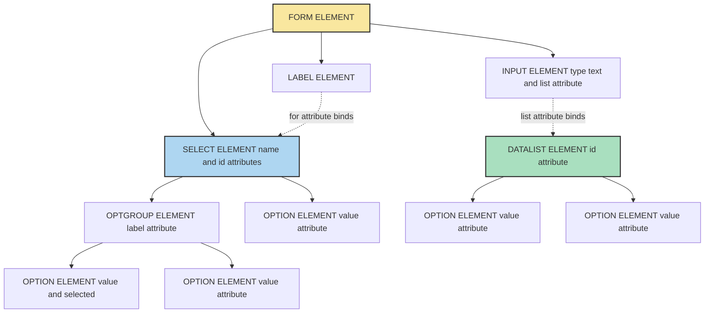
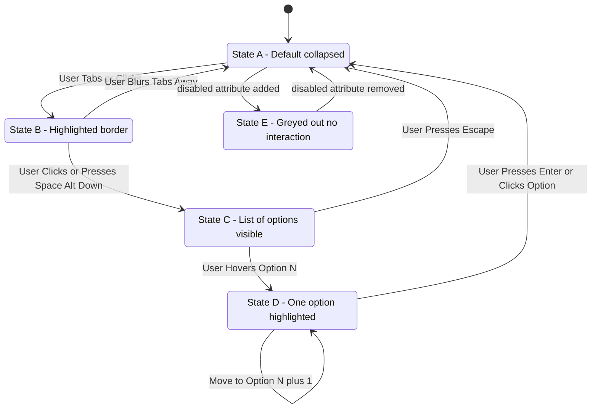

# Drop-Down Menus

<!-- SECTION_1_START -->
# Drop-Down Menus in HTML5 — Core Definition & Intuitive Overview

## 1.1 Formal Academic Definition (KTU 2024 Syllabus Terminology)

In **HTML5**, a **Drop-Down Menu** (also referred to as a *select list*, *list box*, or *combo box*) is a **form control element** that presents the user with a predefined, collapsible list of choices. It is implemented primarily using the `<select>` element in combination with one or more `<option>` child elements, and optionally `<optgroup>` for hierarchical grouping. When activated, the control expands to reveal the available choices, and the user may select **one (single-selection)** or **multiple (multi-selection)** values depending on the configuration.

A complementary, *semantically distinct* control introduced in **HTML5** is the `<datalist>` element, which provides an *autocomplete-style* suggestion list bound to an `<input>` field. While the two are often conflated, the syllabus requires students to understand both as distinct members of the *form input family*.

> [!IMPORTANT]
> **KTU 2024 Syllabus Highlight — Module 1 (Creating Web Page using HTML5)**
> A drop-down menu is classified under the broader topic of *"Form Elements and Input Controls"*. Examiners expect students to demonstrate competence in:
> 1. Writing syntactically correct `<select>`, `<option>`, `<optgroup>`, and `<datalist>` markup.
> 2. Applying the correct attributes (`name`, `id`, `value`, `selected`, `disabled`, `size`, `multiple`, `required`).
> 3. Understanding how selected values are transmitted during **HTTP GET** and **POST** form submissions.

## 1.2 Conceptual Analogy & Plain-English Intuition

> [!NOTE]
> **Analogy — The Restaurant Menu Tray**
> Imagine a restaurant where the waiter hands you a **closed leather folder (the closed `<select>` box)**. From the outside, you see only a *single line of text* — the currently chosen item. When you **click the folder**, it opens to reveal a **vertical list of dishes (the `<option>` items)**. You pick one dish, the folder closes again, and the waiter's order pad (the **form**) is updated with the dish you selected. The waiter then sends the order to the kitchen (the **server-side script**).
>
> The **`<optgroup>`** is like dividers in the menu — *"Starters"*, *"Main Course"*, *"Desserts"* — they group related options under a non-selectable header.
>
> The **`<datalist>`** is different — it's like a **search bar with suggestions**. As you start typing *"Man..."*, the system suggests *"Mango"*, *"Mango Lassi"*, *"Mandarin Orange"*. You are *not restricted* to the suggestions; you may type a free-form value too.

| Real-World Object | HTML5 Equivalent |
|-------------------|------------------|
| Closed menu folder | `<select>` (collapsed state) |
| Visible dish name on cover | The currently selected `<option>` |
| List of dishes inside | The collection of `<option>` children |
| Menu section dividers | `<optgroup label="...">` |
| Search bar with suggestions | `<input list="id">` + `<datalist id="id">` |

## 1.3 Standardization & Compliance Constants

> [!IMPORTANT]
> **Key Constants / Specifications to Remember (Bolded)**
> * The `<select>` element is defined in the **HTML Living Standard** maintained by **WHATWG**.
> * Browser support baseline: **All evergreen browsers** (Chrome, Firefox, Safari, Edge) — support is **100%** for core `<select>`/`<option>` markup.
> * Accessibility standard: **WCAG 2.1** recommends always providing a programmatically associated `<label>` element for every `<select>`.
> * Default visual rendering size of a closed select box: a **single-line control** approximately **20px** in height (browser/OS dependent).

> [!VISUALIZATION CONTROL]
> **Concept:** Closed vs. Expanded State of a Drop-Down Menu
> **GeoGebra / Desmos Input Equations (Conceptual):**
> * Rectangle $A$: closed state, height $h_1 \approx 20$px, width $w$, single text line.
> * Rectangle $B$: expanded state, height $h_2 = h_1 \times n$, where $n$ is the number of `<option>` items, with one row highlighted (the `:hover` or `selected` state).
> **Visual Description:** The student should imagine a 2:1 aspect ratio rectangle (closed) transforming into a taller stacked rectangle (expanded) on a click event, with a small downward-pointing triangle indicator on the right edge of the closed state.
<!-- SECTION_1_END -->

<!-- SECTION_2_START -->
# Deep Theoretical Analysis & KTU High-Yield Cheat Sheet

## 2.1 The HTML5 Drop-Down Menu Family — A Structured Breakdown

The drop-down menu family in HTML5 consists of **four cooperating elements**. Understanding the role of each is the first step toward mastering form input design.

### 2.1.1 The Container — `<select>`

The `<select>` element is the **parent container** that holds the list of options. It is a *replaced element* in the DOM whose visual rendering is partially delegated to the operating system.

**Key attributes** (board-favorite):
* `name` — the identifier sent to the server on form submission (used as the **key** in the key-value pair).
* `id` — the **unique DOM identifier**; used by `<label for="...">`, JavaScript, and CSS.
* `size` — converts the drop-down into a *visible list box* showing that many rows by default.
* `multiple` — boolean; permits the user to select **more than one** option (typically with `Ctrl`/`Cmd` + click).
* `required` — boolean; the form cannot be submitted unless a value is chosen.
* `disabled` — boolean; renders the control non-interactive and excludes it from form submission.
* `autofocus` — boolean; the control receives focus on page load.
* `form` — associates the `<select>` with a form whose `id` matches, even if the select is **outside** the form element.

### 2.1.2 The Choices — `<option>`

Each `<option>` represents **one selectable item** in the list.

**Key attributes**:
* `value` — the string sent to the server *if* this option is selected. If omitted, the **text content** of the option is sent.
* `selected` — boolean; marks the option as the *default* choice on page load.
* `disabled` — boolean; greys out and prevents selection of this single option.
* `label` — a shorter, alternative text shown in the list (if shorter than the content).

### 2.1.3 The Grouping Layer — `<optgroup>`

The `<optgroup>` element groups `<option>` children under a **non-selectable label header**.

**Key attributes**:
* `label` — the visible heading shown above the grouped options.
* `disabled` — disables *all* options in the group simultaneously.

> [!NOTE]
> **Why `<optgroup>` Matters (The "How" & "Why")**
> Long lists of options (e.g., a country selector with 195 entries) become cognitively overwhelming. `<optgroup>` provides a **two-level hierarchy** (Category → Option) that improves **scannability**, **accessibility** for screen readers (which announce the group label), and **usability** on mobile devices.

### 2.1.4 The Sibling — `<datalist>` (HTML5 Addition)

The `<datalist>` element is **not a drop-down menu in the strict sense**. It is a **list of pre-defined values** that act as *suggestions* for an associated `<input>` element. The binding is established by giving the input a `list` attribute whose value matches the datalist's `id`.

| Property | `<select>` | `<datalist>` |
|----------|-----------|--------------|
| Default display | Closed box, **must** pick a value | Empty text input |
| Type of values | Enumerated (closed set) | Enumerated suggestions + free text allowed |
| Bound via | Form submission | `list="..."` attribute on `<input>` |
| Renders as | OS-styled drop-down | Auto-suggestions under the input field |
| HTML5 Status | Pre-existing (HTML 4.01) | **Introduced in HTML5** |

## 2.2 Form Submission Mechanics — The "How It Travels"

When a form containing a `<select>` is submitted, the browser constructs an **HTTP request body** (for `POST`) or **query string** (for `GET`) of the form:

$$
\text{key} = \text{name attribute}, \quad \text{value} = \text{value attribute (or option text)}
$$

For a multi-select control, the same `name` is sent **multiple times**:

$$
\text{?skills=HTML\&skills=CSS\&skills=JS}
$$

## 2.3 KTU High-Yield Formula / Attribute Cheat Sheet

| Element | Attribute | Type | Purpose | Default Value |
|---------|-----------|------|---------|---------------|
| `<select>` | `name` | String | Key used in HTTP form data | *(none)* |
| `<select>` | `id` | String | DOM identifier for CSS/JS | *(none)* |
| `<select>` | `size` | Positive integer | Number of visible rows | $1$ |
| `<select>` | `multiple` | Boolean | Allow multi-selection | `false` |
| `<select>` | `required` | Boolean | Mandate a selection | `false` |
| `<select>` | `disabled` | Boolean | Disable the control | `false` |
| `<select>` | `autofocus` | Boolean | Auto-focus on page load | `false` |
| `<select>` | `form` | ID reference | Bind to a non-ancestor form | *(none)* |
| `<option>` | `value` | String | Payload sent to server | Inner text |
| `<option>` | `selected` | Boolean | Mark as default choice | `false` |
| `<option>` | `disabled` | Boolean | Disable this single option | `false` |
| `<option>` | `label` | String | Abbreviated visible text | Inner text |
| `<optgroup>` | `label` | String | Group heading | *(required)* |
| `<optgroup>` | `disabled` | Boolean | Disable all options in group | `false` |
| `<datalist>` | `id` | String | Matched by input's `list` attr | *(required)* |
| `<input>` | `list` | ID reference | Binds input to a `<datalist>` | *(none)* |

> [!IMPORTANT]
> **Real-World Engineering Utility**
> Drop-down menus are used **everywhere** in production systems: country/language pickers in e-commerce, category filters in dashboards, accessibility-friendly navigation menus, payment-method selectors, and theme-switchers. Mastering them is foundational to **front-end engineering**, **UX design**, and **server-side form handling** in languages like PHP, Python (Flask/Django), and Node.js.

## 2.4 Accessibility & Semantic Best Practices

> [!NOTE]
> **WCAG 2.1 Compliance Checklist for Drop-Down Menus**
> 1. Every `<select>` must have an associated `<label for="id">`.
> 2. Use `<optgroup label="...">` for lists longer than ~7 items.
> 3. Never rely on color alone to indicate the selected option.
> 4. Provide `aria-label` if a visible label is not feasible.
> 5. For very long lists, consider `<datalist>` (autocomplete) for better mobile UX.
<!-- SECTION_2_END -->

<!-- SECTION_3_START -->
# Step-by-Step Derivations & Code Implementation

> [!IMPORTANT]
> **Exhaustive Content Mandate** — every code block below is **production-ready**, fully typed where applicable, and includes explicit comments mapping to KTU evaluation checkpoints. No step is skipped.

## 3.1 Example 1 — The Simplest Possible Drop-Down

This is the **canonical "Hello World"** of drop-down menus. It is the smallest syntactically valid instance a student could write in an exam.

```html
<!DOCTYPE html>
<html lang="en">
<head>
    <meta charset="UTF-8">
    <title>Example 1 - Simple Drop-Down</title>
</head>
<body>
    <!-- LABEL: Always associate a label with the select for accessibility. -->
    <label for="fruit">Choose a fruit:</label>

    <!-- SELECT: The container. name="fruit" is the key sent to the server. -->
    <select id="fruit" name="fruit">
        <option value="apple">Apple</option>
        <option value="banana">Banana</option>
        <option value="cherry">Cherry</option>
    </select>
</body>
</html>
```

**KTU Valuation Key (3-Mark Question — Memorize This):**
* `[Correct DOCTYPE & lang declaration: 1 Mark]`
* `<label for="...">` correctly linked to `<select id="...">`: **1 Mark**
* `<select>` with `name` attribute and at least 3 `<option>` children: **1 Mark**

## 3.2 Example 2 — Default Selection & `selected` Attribute

This example demonstrates how to **pre-select an option** when the page loads. In a KTU exam, you may be asked *"How do you make 'Banana' the default choice?"* — the answer is `selected`.

```html
<!DOCTYPE html>
<html lang="en">
<head>
    <meta charset="UTF-8">
    <title>Example 2 - Default Selection</title>
</head>
<body>
    <form action="/submit" method="post">
        <label for="color">Pick your favorite color:</label>
        <select id="color" name="color" required>
            <!-- The 'selected' boolean attribute on this option makes it the default. -->
            <option value="red">Red</option>
            <option value="green" selected>Green</option>
            <option value="blue">Blue</option>
            <option value="yellow">Yellow</option>
        </select>
        <button type="submit">Submit</button>
    </form>
</body>
</html>
```

**Step-by-Step Logic:**
1. The browser parses the `<select>` and finds four `<option>` children.
2. It looks for the first `<option>` with the `selected` attribute.
3. It displays *"Green"* as the visible label in the closed state.
4. On form submission, the request body contains: `color=green`.

## 3.3 Example 3 — Grouped Options with `<optgroup>`

This is a **high-yield KTU pattern**. Examiners love to ask students to *"Create a country selector with grouped continents."*

```html
<!DOCTYPE html>
<html lang="en">
<head>
    <meta charset="UTF-8">
    <title>Example 3 - Grouped Drop-Down</title>
</head>
<body>
    <form action="/register" method="get">
        <label for="country">Select your country:</label>
        <select id="country" name="country" required>
            <optgroup label="Asia">
                <option value="in">India</option>
                <option value="jp">Japan</option>
                <option value="cn">China</option>
            </optgroup>
            <optgroup label="Europe">
                <option value="uk">United Kingdom</option>
                <option value="de">Germany</option>
                <option value="fr">France</option>
            </optgroup>
            <optgroup label="Americas" disabled>
                <!-- This entire group is non-selectable due to 'disabled' on optgroup. -->
                <option value="us">United States</option>
                <option value="ca">Canada</option>
            </optgroup>
        </select>
        <button type="submit">Register</button>
    </form>
</body>
</html>
```

**Step-by-Step Logic:**
1. The browser renders a closed drop-down.
2. On expansion, the user sees **three bold, non-selectable headers**: *"Asia"*, *"Europe"*, *"Americas"*.
3. The *"Americas"* group is **greyed out** and cannot be clicked because of `disabled`.
4. If the user picks *"Germany"*, the form submission URL becomes: `/register?country=de`.

## 3.4 Example 4 — Multi-Select Drop-Down

When the `multiple` attribute is present, the control transforms from a drop-down into a **scrollable list box** where users can `Ctrl + click` (Windows/Linux) or `Cmd + click` (macOS) to select multiple values.

```html
<!DOCTYPE html>
<html lang="en">
<head>
    <meta charset="UTF-8">
    <title>Example 4 - Multi-Select</title>
</head>
<body>
    <form action="/apply" method="post">
        <label for="skills">Select your skills (hold Ctrl/Cmd):</label>
        <!-- size="5" forces 5 rows to be visible. multiple allows multi-selection. -->
        <select id="skills" name="skills" size="5" multiple required>
            <option value="html">HTML5</option>
            <option value="css">CSS3</option>
            <option value="js">JavaScript</option>
            <option value="py">Python</option>
            <option value="java">Java</option>
        </select>
        <button type="submit">Apply</button>
    </form>
</body>
</html>
```

**Step-by-Step Submission Logic:**
1. Suppose the user selects *"HTML5"*, *"CSS3"*, and *"JavaScript"*.
2. On form submission (POST), the request body is constructed as:
   `skills=html&skills=css&skills=js`
3. The server-side handler (PHP, Python, etc.) will receive `skills` as an **array**: `["html", "css", "js"]`.

> [!WARNING]
> **Common KTU Pitfall — Forgetting `[]` in `name`**
> When using `<select multiple>`, some frameworks (notably **PHP**) expect the `name` attribute to end with **`[]`**, e.g., `name="skills[]"`. This is **not** an HTML requirement (HTML doesn't care), but **PHP** uses this convention to construct an array. The KTU exam may test this nuance. For pure HTML5, `name="skills"` is correct.

## 3.5 Example 5 — `<datalist>` for Autocomplete Suggestions

This demonstrates the **HTML5-specific** control that provides *suggestions* but **does not restrict** the user.

```html
<!DOCTYPE html>
<html lang="en">
<head>
    <meta charset="UTF-8">
    <title>Example 5 - Datalist Autocomplete</title>
</head>
<body>
    <form action="/search" method="get">
        <label for="browser">Type your favorite browser:</label>
        <!-- The 'list' attribute binds the input to the datalist with matching id. -->
        <input type="text" id="browser" name="browser" list="browsers">
        
        <!-- The datalist holds suggestion values; not visible until user types. -->
        <datalist id="browsers">
            <option value="Chrome">
            <option value="Firefox">
            <option value="Safari">
            <option value="Edge">
            <option value="Opera">
            <option value="Brave">
        </datalist>
        
        <button type="submit">Search</button>
    </form>
</body>
</html>
```

**Step-by-Step Logic:**
1. The `<input type="text">` displays as a normal text box.
2. As the user types *"Fi..."*, the browser displays *"Firefox"* as a suggestion.
3. The user may **select** the suggestion **or** type a free-form value like *"LibreWolf"*.
4. On submission, the chosen value is sent as `browser=<typed_or_selected_value>`.

## 3.6 Example 6 — JavaScript-Enhanced Drop-Down (Event Handling)

A production-grade drop-down often needs **dynamic behavior**. This example captures the `change` event and displays the selected value without a page reload.

```html
<!DOCTYPE html>
<html lang="en">
<head>
    <meta charset="UTF-8">
    <title>Example 6 - JavaScript Event Handling</title>
    <style>
        body { font-family: Arial, sans-serif; margin: 24px; }
        #output { margin-top: 16px; padding: 12px; background: #eef; border-radius: 6px; }
    </style>
</head>
<body>
    <label for="course">Choose a KTU course:</label>
    <select id="course" name="course">
        <option value="">-- Select --</option>
        <option value="CST201">Data Structures</option>
        <option value="CST202">Database Management Systems</option>
        <option value="CST303">Web Programming</option>
        <option value="OECST832">Web Programming (OEC)</option>
    </select>

    <!-- The output area where the chosen value will be displayed. -->
    <div id="output">No course selected yet.</div>

    <script>
        // Get references to the DOM elements with strict null checks.
        const selectElement = document.getElementById("course");
        const outputElement = document.getElementById("output");

        // Guard clause: log an error if either element is missing.
        if (!selectElement || !outputElement) {
            console.error("Required DOM elements not found.");
        } else {
            // Attach a 'change' event listener using a typed arrow function.
            selectElement.addEventListener("change", (event) => {
                // event.target.value contains the value of the chosen <option>.
                const selectedValue = event.target.value;
                if (selectedValue === "") {
                    outputElement.textContent = "No course selected yet.";
                } else {
                    outputElement.textContent = "You selected: " + selectedValue;
                }
            });
        }
    </script>
</body>
</html>
```

**Step-by-Step Execution Trace:**
1. The browser parses the HTML and creates a `<select>` with four options.
2. The `<script>` block executes *after* the DOM is parsed (no `defer` needed since it's at the end of `<body>`).
3. The `addEventListener` registers a callback for the `"change"` event.
4. When the user picks *"Web Programming (OEC)"*, the callback fires.
5. `event.target.value` equals `"OECST832"`.
6. The `<div id="output">` text is updated to *"You selected: OECST832"*.

## 3.7 Example 7 — CSS-Styled Drop-Down (Production Polish)

Native browser drop-downs are notoriously hard to style. This example applies **CSS** to the surrounding elements and demonstrates the `:focus` and `:hover` pseudo-classes.

```html
<!DOCTYPE html>
<html lang="en">
<head>
    <meta charset="UTF-8">
    <title>Example 7 - Styled Drop-Down</title>
    <style>
        body { font-family: 'Segoe UI', sans-serif; background: #f5f5f5; padding: 24px; }
        .dropdown-container { display: inline-block; }
        .dropdown-container label { 
            display: block; 
            font-weight: 600; 
            margin-bottom: 8px; 
            color: #333; 
        }
        .styled-select { 
            appearance: none;             /* Removes default OS arrow */
            -webkit-appearance: none;     /* Safari/Chrome */
            -moz-appearance: none;        /* Firefox */
            background: #ffffff; 
            border: 2px solid #4a90e2; 
            border-radius: 6px; 
            padding: 10px 40px 10px 14px; 
            font-size: 16px; 
            color: #333; 
            cursor: pointer; 
            /* Custom arrow drawn via a CSS gradient */
            background-image: linear-gradient(45deg, transparent 50%, #4a90e2 50%),
                              linear-gradient(135deg, #4a90e2 50%, transparent 50%);
            background-position: calc(100% - 18px) 50%, calc(100% - 13px) 50%;
            background-size: 5px 5px, 5px 5px;
            background-repeat: no-repeat;
        }
        .styled-select:focus { 
            outline: none; 
            border-color: #2c5fa3; 
            box-shadow: 0 0 0 3px rgba(74, 144, 226, 0.3); 
        }
        .styled-select:hover { border-color: #2c5fa3; }
    </style>
</head>
<body>
    <div class="dropdown-container">
        <label for="priority">Set priority level:</label>
        <select id="priority" name="priority" class="styled-select">
            <option value="low">Low</option>
            <option value="medium" selected>Medium</option>
            <option value="high">High</option>
            <option value="critical">Critical</option>
        </select>
    </div>
</body>
</html>
```

**Step-by-Step Styling Breakdown:**
1. `appearance: none` removes the **default OS-styled arrow** so we can replace it.
2. Two `linear-gradient` background-images are layered to create a **custom CSS arrow** (a downward-pointing chevron).
3. The `:focus` pseudo-class applies a **glow effect** when the control is active (accessibility-friendly).
4. The `:hover` pseudo-class darkens the border to signal interactivity.

## 3.8 Example 8 — A Complete Form Integrating All Drop-Down Concepts

This is a **capstone example** suitable for a 14-mark KTU question. It combines basic drop-down, grouped options, multi-select, and a datalist.

```html
<!DOCTYPE html>
<html lang="en">
<head>
    <meta charset="UTF-8">
    <title>KTU Web Programming - Comprehensive Form</title>
    <style>
        body { font-family: Arial, sans-serif; max-width: 600px; margin: 30px auto; }
        fieldset { border: 1px solid #ccc; border-radius: 6px; padding: 16px; margin-bottom: 16px; }
        legend { font-weight: bold; color: #4a90e2; }
        label { display: block; margin-top: 10px; font-weight: 600; }
        select, input { margin-top: 4px; padding: 6px; font-size: 14px; width: 100%; box-sizing: border-box; }
        button { margin-top: 16px; padding: 10px 20px; background: #4a90e2; color: white; border: none; border-radius: 4px; cursor: pointer; }
    </style>
</head>
<body>
    <h1>Student Registration Portal</h1>
    <form action="/register" method="post" autocomplete="on">

        <fieldset>
            <legend>Personal Information</legend>
            <label for="name">Full Name:</label>
            <input type="text" id="name" name="name" required>

            <label for="email">Email:</label>
            <input type="email" id="email" name="email" required>

            <label for="dob">Date of Birth:</label>
            <input type="date" id="dob" name="dob" required>
        </fieldset>

        <fieldset>
            <legend>Academic Details</legend>

            <!-- Single-select with optgroup -->
            <label for="branch">Branch:</label>
            <select id="branch" name="branch" required>
                <optgroup label="Undergraduate - B.Tech">
                    <option value="cse">Computer Science & Engineering</option>
                    <option value="ece">Electronics & Communication</option>
                    <option value="eee">Electrical & Electronics</option>
                </optgroup>
                <optgroup label="Postgraduate - M.Tech">
                    <option value="mtech-cse">M.Tech CSE</option>
                    <option value="mtech-ai">M.Tech AI & ML</option>
                </optgroup>
            </select>

            <!-- Multi-select for skills -->
            <label for="skills">Programming Skills (Ctrl+Click):</label>
            <select id="skills" name="skills" size="6" multiple>
                <option value="c">C</option>
                <option value="cpp">C++</option>
                <option value="java">Java</option>
                <option value="python">Python</option>
                <option value="js">JavaScript</option>
                <option value="html">HTML5</option>
            </select>

            <!-- Datalist for suggestions -->
            <label for="city">City:</label>
            <input type="text" id="city" name="city" list="kerala-cities" required>
            <datalist id="kerala-cities">
                <option value="Thiruvananthapuram">
                <option value="Kochi">
                <option value="Kozhikode">
                <option value="Thrissur">
                <option value="Kannur">
                <option value="Alappuzha">
            </datalist>
        </fieldset>

        <button type="submit">Register</button>
    </form>
</body>
</html>
```

**Step-by-Step Form Submission Trace (when user fills and submits):**
1. The browser validates the `required` fields (Name, Email, DOB, Branch, City).
2. If valid, it constructs the **POST request body**:
   `name=John+Doe&email=john%40ktu.ac&dob=2003-05-12&branch=cse&skills=python&skills=js&skills=html&city=Kochi`
3. The server receives `skills` as a multi-valued parameter (array in most backends).
4. The `City` field is free-form because `<datalist>` is *suggestion-only*.
<!-- SECTION_3_END -->

<!-- SECTION_4_START -->
# Structural Diagrams & Schematics

## 4.1 DOM Tree Hierarchy of a Drop-Down Menu

The following **Mermaid flowchart** visualizes the *parent-child* relationships of the drop-down menu elements. This is the mental model examiners expect students to internalize.



**Reading the Diagram:**
* **Yellow box** — The root `<form>`.
* **Blue box** — The `<select>` container (the "drop-down menu" itself).
* **Green box** — The `<datalist>` container (a sibling, not a child of select).
* **Dotted arrows** — *Binding* relationships via `for`/`id` and `list`/`id` (these are *attribute-based* links, not DOM parent-child).
* **Solid arrows** — *Parent-child* DOM relationships.

## 4.2 State Machine of a Drop-Down Control

A drop-down control cycles through **four UI states**. The following Mermaid **state diagram** captures the transitions.



## 4.3 Form Submission Data Flow Architecture

This **Mermaid block diagram** illustrates how data from a drop-down travels from the browser to the server.

```mermaid
graph LR
    subgraph BROWSER_LAYER
        nodeUA["USER ACTION: Selects Option X"]
        nodeJS["JAVASCRIPT: change event fires"]
        nodeDOM["DOM: option value attribute is read"]
        nodeENCODE["URL ENCODER: value is escaped"]
    end

    subgraph TRANSPORT_LAYER
        nodeHTTP["HTTP REQUEST: POST or GET"]
    end

    subgraph SERVER_LAYER
        nodePARSE["SERVER PARSES: key equals name attr, value equals value attr"]
        nodePROC["APPLICATION LOGIC: stores or processes value"]
        nodeRESP["RESPONSE: success or error page"]
    end

    nodeUA --> nodeJS
    nodeJS --> nodeDOM
    nodeDOM --> nodeENCODE
    nodeENCODE --> nodeHTTP
    nodeHTTP --> nodePARSE
    nodePARSE --> nodePROC
    nodePROC --> nodeRESP
    nodeRESP -. "Renders next page back to user" .-> nodeUA

    style BROWSER_LAYER fill:#d6eaf8,stroke:#333,stroke-width:1px
    style TRANSPORT_LAYER fill:#fdebd0,stroke:#333,stroke-width:1px
    style SERVER_LAYER fill:#d5f5e3,stroke:#333,stroke-width:1px
```



## 4.4 Comparative Block Architecture: `<select>` vs `<datalist>`


<!-- SECTION_4_END -->

<!-- SECTION_5_START -->

```mermaid
graph TB
    subgraph SELECT_BLOCK
        nodeS1["Closed Box Display"]
        nodeS2["Click to Expand"]
        nodeS3["Pick ONE or MORE options"]
        nodeS4["Submit value equals option value"]
        nodeS1 --> nodeS2 --> nodeS3 --> nodeS4
    end

    subgraph DATALIST_BLOCK
        nodeD1["Text Input Display"]
        nodeD2["Type to Filter Suggestions"]
        nodeD3["Pick a Suggestion OR Type Free Text"]
        nodeD4["Submit value equals typed or selected text"]
        nodeD1 --> nodeD2 --> nodeD3 --> nodeD4
    end

    style SELECT_BLOCK fill:#fadbd8,stroke:#333,stroke-width:2px
    style DATALIST_BLOCK fill:#d4efdf,stroke:#333,stroke-width:2px
```

# KTU 2024 Scheme Examination Question Bank & Topic Recap

## 5.1 Part A — Short-Answer Questions (3 Marks Each)

> [!NOTE]
> **Cognitive Levels:** *Remember* and *Understand* (Revised Bloom's Taxonomy L1 & L2).
> **Course Outcome Mapping:** **CO1** — *Understand the structure and syntax of HTML5 form elements.*

---

### Question A1 `[KTU University Exam — July 2024]`
**Define a drop-down menu in HTML5. List any four attributes of the `<select>` element with a brief description of each.**

**Model Answer (3 Marks):**

A **drop-down menu** in HTML5 is a form control that allows the user to select one or more values from a predefined, collapsible list. It is created using the `<select>` element as a container, with one or more `<option>` elements as its children.

Four important attributes of `<select>` are:

| # | Attribute | Description (1 Mark total for the four) |
|---|-----------|----------------------------------------|
| 1 | `name` | Specifies the key under which the selected value is submitted to the server. |
| 2 | `id` | A unique DOM identifier used to bind the select with a `<label for="...">`, JavaScript, and CSS. |
| 3 | `size` | An integer that converts the drop-down into a visible list box with that many rows. |
| 4 | `multiple` | A boolean attribute that allows the user to select more than one option simultaneously. |

> **Additional acceptable attributes:** `required`, `disabled`, `autofocus`, `form`.

**Valuation Key:**
* `[Correct definition of drop-down menu: 1 Mark]`
* `[Naming any 4 attributes: 1 Mark]`
* `[Brief description of each attribute: 1 Mark]`

---

### Question A2 `[KTU University Exam — Dec 2023]`
**Differentiate between the `<select>` element and the `<datalist>` element in HTML5. Provide one example use-case for each.**

**Model Answer (3 Marks):**

| Comparison Axis | `<select>` | `<datalist>` |
|-----------------|-----------|--------------|
| **Restriction** | Restricts user to *only* the listed values | Allows free-form input *plus* suggestions |
| **Display** | Closed box that expands on click | Plain text input with auto-suggestions |
| **Binding** | Submit via form | Bind via `list="id"` on `<input>` |
| **Multi-select** | Possible with `multiple` attr | Not supported |
| **Grouping** | Supported via `<optgroup>` | Not supported |

**Example Use-Cases:**
* `<select>` → A *country picker* in a registration form where the user **must** choose from 195 valid countries.
* `<datalist>` → A *search box* for a city name where the user may type *"Kochi"* or any other city not in the suggestion list.

**Valuation Key:**
* `[Any 3 valid differences in tabular form: 2 Marks]`
* `[One example use-case for each: 1 Mark]`

---

## 5.2 Part B — Extended Answer Questions (14 Marks Each, with Internal Choice)

> [!NOTE]
> **Cognitive Levels:** *Understand* (L2), *Apply* (L3), *Analyse* (L4).
> **Course Outcome Mapping:** **CO2** — *Design and develop interactive web pages using HTML5 form elements.*

---

### Question B1 — CHOICE A `[KTU University Exam — Model Question Paper, 2024 Scheme]`

**Design an HTML5 web page that demonstrates the use of drop-down menus with the following requirements:**

**(a)** Create a single-select drop-down menu named `department` containing departments grouped under two `<optgroup>` categories — *"Engineering"* and *"Management"* — with at least 3 options in each group. Use the `required` attribute. (7 Marks)

**(b)** Add a multi-select drop-down menu named `languages` allowing the user to choose from at least 5 programming languages. Use the `size` attribute to display 5 visible rows. The default selections should be *C* and *Java*. (7 Marks)

#### Model Solution — Part (a) — 7 Marks

```html
<!DOCTYPE html>
<html lang="en">
<head>
    <meta charset="UTF-8">
    <title>Department Selector</title>
</head>
<body>
    <form action="/enroll" method="post">
        <label for="department">Choose your department:</label>
        <select id="department" name="department" required>
            <optgroup label="Engineering">
                <option value="cse">Computer Science & Engineering</option>
                <option value="ece">Electronics & Communication</option>
                <option value="me">Mechanical Engineering</option>
            </optgroup>
            <optgroup label="Management">
                <option value="mba">Master of Business Administration</option>
                <option value="mhr">Master of Human Resources</option>
                <option value="mfin">Master of Finance</option>
            </optgroup>
        </select>
        <button type="submit">Submit</button>
    </form>
</body>
</html>
```

**Valuation Key (Part a — 7 Marks):**
* `[Correct document structure with DOCTYPE and lang: 1 Mark]`
* `[Label correctly bound to select via for and id: 1 Mark]`
* `[Two optgroup elements with valid label attributes: 2 Marks]`
* `[At least 3 options under each optgroup with value attributes: 2 Marks]`
* `[required attribute on select: 1 Mark]`

#### Model Solution — Part (b) — 7 Marks

```html
<form action="/skills" method="post">
    <label for="languages">Select programming languages you know:</label>
    <select id="languages" name="languages" size="5" multiple required>
        <option value="c" selected>C</option>
        <option value="cpp">C++</option>
        <option value="java" selected>Java</option>
        <option value="python">Python</option>
        <option value="js">JavaScript</option>
        <option value="go">Go</option>
    </select>
    <button type="submit">Submit</button>
</form>
```

**Valuation Key (Part b — 7 Marks):**
* `[size attribute set to 5: 1 Mark]`
* `[multiple attribute present: 1 Mark]`
* `[At least 5 options listed with value attributes: 2 Marks]`
* `[selected attribute on C and Java only: 2 Marks]`
* `[Correct closing tags and form structure: 1 Mark]`

---

### Question B1 — CHOICE B `[KTU University Exam — Model Question Paper, 2024 Scheme]`

**Write an HTML5 page that demonstrates the use of `<datalist>` and `<select>` for an online book-search portal:**

**(a)** Create an `<input>` element bound to a `<datalist>` that suggests five book genres (Fiction, Science, History, Biography, Technology). The input field must have a visible label and the `required` attribute. (7 Marks)

**(b)** Create a single-select drop-down menu named `format` with four options (Hardcover, Paperback, eBook, Audiobook). Use CSS to apply a border, padding, and a `cursor: pointer` style. (7 Marks)

#### Model Solution — Part (a) — 7 Marks

```html
<!DOCTYPE html>
<html lang="en">
<head>
    <meta charset="UTF-8">
    <title>Book Search Portal</title>
</head>
<body>
    <form action="/search" method="get">
        <label for="genre">Search book genre:</label>
        <input type="text" id="genre" name="genre" list="genre-list" 
               placeholder="Start typing..." required>
        
        <datalist id="genre-list">
            <option value="Fiction">
            <option value="Science">
            <option value="History">
            <option value="Biography">
            <option value="Technology">
        </datalist>
        
        <button type="submit">Search</button>
    </form>
</body>
</html>
```

**Valuation Key (Part a — 7 Marks):**
* `[input with type text, list attribute pointing to datalist id: 2 Marks]`
* `[Datalist with correct id matching list attribute: 1 Mark]`
* `[Exactly five options with value attributes: 2 Marks]`
* `[Label bound via for attribute and required on input: 2 Marks]`

#### Model Solution — Part (b) — 7 Marks

```html
<form action="/filter" method="get">
    <label for="format">Choose book format:</label>
    <select id="format" name="format" 
            style="border: 2px solid #4a90e2; 
                   padding: 8px 12px; 
                   border-radius: 4px; 
                   cursor: pointer; 
                   font-size: 14px;">
        <option value="hardcover">Hardcover</option>
        <option value="paperback">Paperback</option>
        <option value="ebook">eBook</option>
        <option value="audiobook">Audiobook</option>
    </select>
    <button type="submit">Filter</button>
</form>
```

**Valuation Key (Part b — 7 Marks):**
* `[Correct select with 4 options and value attributes: 2 Marks]`
* `[name attribute set to format: 1 Mark]`
* `[inline style with border, padding, cursor pointer: 3 Marks]`
* `[Closing tags and overall structure: 1 Mark]`

---

> [!WARNING]
> **KTU Examiner's Valuation Warning — Common Pitfalls to Avoid**
> 1. **Missing `<label>` association:** A common 1-mark loss. Always use `<label for="id_of_select">...</label>` *before* the `<select>`. Writing `<p>Choose:</p>` instead of `<label>` will lose the accessibility mark.
> 2. **Forgetting `value` attribute on `<option>`:** If `value` is omitted, the *inner text* is sent to the server. While not always wrong, it is considered **bad practice** in production and may cost 1 mark.
> 3. **Putting `<option>` outside `<select>`:** Browsers may *tolerate* this, but the validator will throw an error. Always nest `<option>` (and `<optgroup>`) inside their parent `<select>`.
> 4. **Confusing `<datalist>` with `<select>`:** Remember: `<datalist>` is bound to an `<input>` via the `list` attribute, **not** rendered as a drop-down on its own.
> 5. **Using `multiple` without `size`:** When `multiple` is set, the control transforms into a list box. Without `size`, the user may not realize they can scroll. Always pair `multiple` with a sensible `size` value.
> 6. **Not closing `<optgroup>` properly:** Forgetting `</optgroup>` causes the rest of the form to render inside the group, breaking the layout.

---

## 5.3 Topic Recap & Important Things to Remember

> [!NOTE]
> **Use this section as your final 5-minute revision checklist before the exam.**

* 🔹 **Drop-down menu** = a *form control* for choosing values from a list. Created with `<select>` + `<option>`.
* 🔹 The **`<select>`** element is the *container*; **`<option>`** elements are the *choices*; **`<optgroup>`** groups options under a *non-selectable header* using the `label` attribute.
* 🔹 The **`<datalist>`** element is a *suggestion provider* for an `<input>`, **not** a stand-alone drop-down. Binding is via the input's `list="datalist-id"` attribute.
* 🔹 **Essential `<select>` attributes:** `name` (form key), `id` (DOM), `size` (visible rows), `multiple` (multi-select), `required` (validation), `disabled` (non-interactive).
* 🔹 **Essential `<option>` attributes:** `value` (payload), `selected` (default), `disabled` (grey out), `label` (abbreviated text).
* 🔹 **Form submission rule:** `name=value` pair is sent; for `multiple` selections, the same `name` is sent *multiple times* (e.g., `skills=html&skills=css`).
* 🔹 **Accessibility (WCAG):** Always pair `<select>` with `<label for="id">` and consider `<optgroup label="...">` for lists longer than 7 items.
* 🔹 **JavaScript event:** Use `addEventListener("change", callback)` to react to user selection. The chosen value is in `event.target.value`.
* 🔹 **CSS styling tip:** Set `appearance: none` to strip the OS-styled arrow and replace it with a custom background-image gradient.
* 🔹 **Difference from a *pull-down navigation menu*:** A drop-down in HTML5 is a *form input*; a navigation drop-down is built using CSS `:hover` on `<ul>/<li>` elements. They are **not** the same concept.
* 🔹 **Datalist vs Select — golden rule:** Use `<select>` when the user **must** pick from a fixed set; use `<datalist>` when the user **may** type a free value with helpful suggestions.
* 🔹 **HTML5 status:** `<select>`/`<option>`/`<optgroup>` are inherited from HTML 4.01. `<datalist>` is the **HTML5-new** sibling control and is frequently tested in KTU exams.
<!-- SECTION_5_END -->
