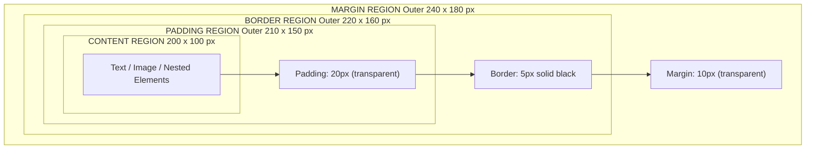
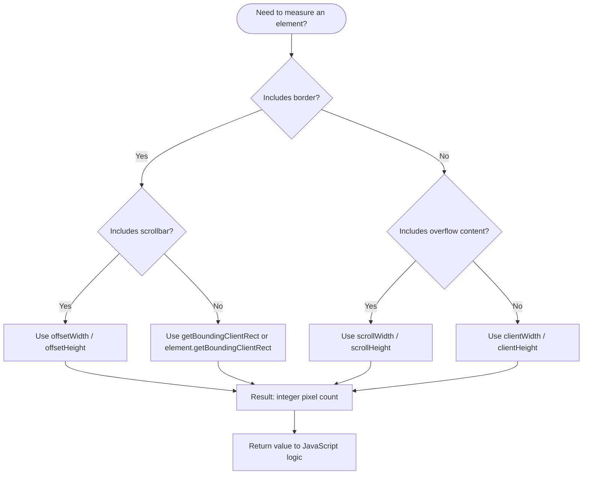
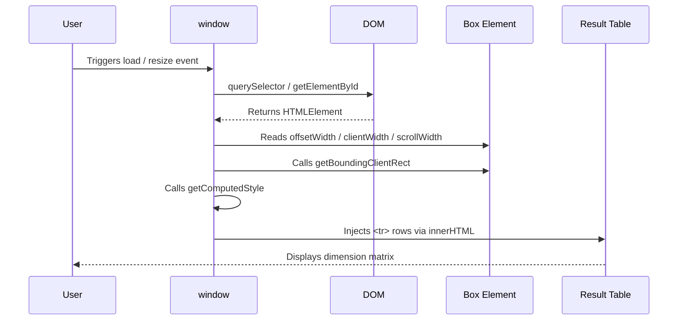
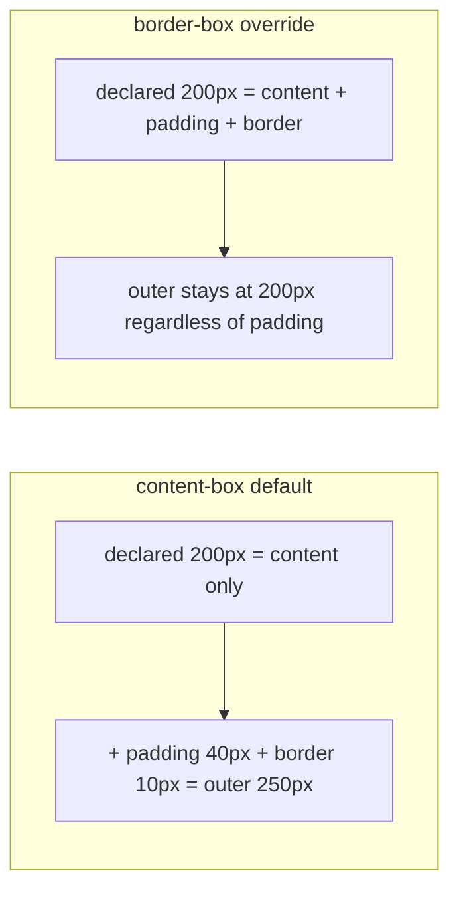

# Element Dimensions

<!-- SECTION_1_START -->

# Element Dimensions in HTML5

## 1.1 Formal Definition

In the **HTML5 Document Object Model (DOM)**, *Element Dimensions* refer to the set of geometric properties that describe the size of a rendered HTML element on the web page. These dimensions are governed by the **CSS Box Model** standard and can be measured using both **declarative CSS properties** (`width`, `height`, `min-width`, `max-width`, etc.) and **imperative JavaScript APIs** (`offsetWidth`, `clientWidth`, `scrollWidth`, `getBoundingClientRect()`, `getComputedStyle()`).

> [!NOTE]
> **KTU Syllabus Highlight (Module 1):** Understanding element dimensions is a foundational pre-requisite for **responsive web design**, **dynamic layout manipulation**, and **client-side validation** — all core outcomes of the *OECST832 – Web Programming* course.

According to the **W3C CSS Box Model Specification**, every block-level element generates a rectangular *box* composed of four concentric regions:

1. **Content Area** — the actual rendered text, image, or nested elements.
2. **Padding Area** — transparent space between the content and the border.
3. **Border Area** — a visible (or styled) line surrounding the padding.
4. **Margin Area** — transparent outer space separating the element from its neighbours.

## 1.2 Intuitive Analogy

Imagine you are a **professional photographer framing a picture for a gallery wall**:

| Box Model Part | Photographer's Analogy |
|---|---|
| **Content** | The actual photograph |
| **Padding** | The white matte sheet surrounding the photo |
| **Border** | The decorative wooden frame around the matte |
| **Margin** | The empty wall space between this framed picture and the next |

The *total horizontal space* this picture occupies on the wall depends on **what you choose to measure** — the photo, the photo+matte, the photo+matte+frame, or the photo+matte+frame+wall spacing. In CSS, these four "measurements" correspond exactly to the four `*-Width` / `*-Height` JavaScript APIs discussed later.

> [!IMPORTANT]
> The default browser box model is **`content-box`**, where `width` and `height` apply *only* to the content area. Setting `box-sizing: border-box;` redistributes the declared width to include padding and border — a critical detail for KTU lab examinations.

## 1.3 Physical Constants & Standard Metrics

When the user agent (browser) renders an element, the following **default values** are applied by the user-agent stylesheet:

- The default `font-size` of the root element (`<html>`) is **$16\text{ px}$**.
- $1\text{ rem} = 16\text{ px}$ (root-relative em).
- The default `box-sizing` value is **`content-box`**.
- A typical browser scrollbar occupies approximately **$\mathbf{15\text{ px}}$** of horizontal width (varies by OS).
- The default `viewport` is the visible browser window region.

> [!VISUALIZATION CONTROL]
> **Concept:** CSS Box Model — nested rectangles on a coordinate plane
> **GeoGebra / Desmos Input Equations:**
> * Outer rectangle (margin): $x \in [-200, 200],\ y \in [-150, 150]$
> * Border: $x \in [-180, 180],\ y \in [-130, 130]$
> * Padding: $x \in [-160, 160],\ y \in [-110, 110]$
> * Content: $x \in [-140, 140],\ y \in [-90, 90]$
> **Visual Description:** Four concentric rectangles sharing the same centre, each labelled with its CSS region name, demonstrating how regions nest inside one another.

---

<!-- SECTION_1_END -->

<!-- SECTION_2_START -->

# Deep Theoretical Analysis & KTU High-Yield Formula Sheet

## 2.1 The Four Box-Model Regions (Recap)

The total **outer width** of any block-level element can be expressed as:

$$
W_{\text{outer}} = W_{\text{content}} + (P_L + P_R) + (B_L + B_R) + (M_L + M_R)
$$

where $P_L, P_R$ are left/right padding, $B_L, B_R$ are left/right border widths, and $M_L, M_R$ are left/right margins. The same decomposition holds for the vertical axis.

## 2.2 Classification of Dimension Properties

HTML5 exposes element dimensions through **three orthogonal channels**:

| Channel | Mechanism | Returns |
|---|---|---|
| **Intrinsic** | HTML attributes (`width="200"` on `<canvas>`) | Raw attribute value as a string |
| **CSS-Styled** | `.style.width`, `getComputedStyle()` | Resolved CSS values (px, %, em, vh, etc.) |
| **Layout-Time** | `offset*`, `client*`, `scroll*`, `getBoundingClientRect()` | Computed pixel values from the layout engine |

## 2.3 The Five Dimension APIs — Operational Breakdown

### 2.3.1 `offsetWidth` / `offsetHeight`
* **What it measures:** The visual size of the element *including* padding, border, and the vertical scrollbar (if rendered).
* **Why it matters:** This is the value designers use for "drag-and-resize" handles and collision detection.
* **Computed as:**

$$
\text{offsetWidth} = W_{\text{content}} + P_L + P_R + B_L + B_R + \text{scrollbar}_W
$$

### 2.3.2 `clientWidth` / `clientHeight`
* **What it measures:** The inner area of the element visible to the user, *excluding* border, margin, and scrollbar, but *including* padding.
* **Computed as:**

$$
\text{clientWidth} = W_{\text{content}} + P_L + P_R
$$

### 2.3.3 `scrollWidth` / `scrollHeight`
* **What it measures:** The full extent of the element's content, *including* the portion that is currently scrolled out of view.
* **Computed as:**

$$
\text{scrollWidth} = \max\!\left(\text{clientWidth},\ W_{\text{content-overflow}}\right)
$$

### 2.3.4 `getBoundingClientRect()`
* Returns a `DOMRect` object with the fields: `x`, `y`, `width`, `height`, `top`, `right`, `bottom`, `left`.
* Coordinates are **relative to the viewport**, not the document — for document-relative coordinates, add `window.scrollX` and `window.scrollY`.

### 2.3.5 `getComputedStyle(element).property`
* Returns a **live** `CSSStyleDeclaration` object.
* Reading `.width` returns a string like `"200px"` (use `parseFloat()` for arithmetic).
* For `display: none` elements, this method returns an *empty* declaration.

## 2.4 KTU High-Yield Formula Sheet

| Property | Includes Content? | Includes Padding? | Includes Border? | Includes Scrollbar? | Includes Overflow Content? | Read/Write? |
|---|---|---|---|---|---|---|
| `element.style.width` | Yes | Yes (if border-box) | Yes (if border-box) | No | No | **Read/Write** |
| `offsetWidth` | Yes | **Yes** | **Yes** | **Yes** | No | Read-only |
| `clientWidth` | Yes | **Yes** | No | No | No | Read-only |
| `scrollWidth` | Yes | **Yes** | No | No | **Yes** | Read-only |
| `getBoundingClientRect().width` | Yes | **Yes** | **Yes** | No | No | Read-only |
| `getComputedStyle().width` | Depends on `box-sizing` | Depends | Depends | No | No | Read-only |

> [!IMPORTANT]
> For numeric arithmetic, always wrap computed values in `parseFloat()`. For example: `const w = parseFloat(getComputedStyle(box).width);` returns a pure number in pixels.

## 2.5 Viewport vs Document vs Element Dimensions

A frequently confused trio in the KTU lab viva:

| Scope | Window API | Returns |
|---|---|---|
| **Viewport** (visible area) | `window.innerWidth` | Browser viewport width **including** scrollbar |
| **Viewport** (HTML root) | `document.documentElement.clientWidth` | Viewport width **excluding** scrollbar |
| **Document** (full page) | `document.documentElement.scrollWidth` | Entire scrollable document width |
| **Element** (specific node) | `element.getBoundingClientRect().width` | Rendered width of the chosen node |

## 2.6 Real-World Utility in Web Engineering

* **Responsive design:** Media queries compare `window.innerWidth` against CSS breakpoints ($768\text{ px}$, $1024\text{ px}$).
* **Lazy-loading images:** `IntersectionObserver` uses `getBoundingClientRect()` to determine viewport proximity.
* **Sticky/fixed headers:** `scrollY` is compared against `element.offsetTop` to toggle CSS classes.
* **Canvas/Game development:** `canvas.width` and `canvas.height` attributes set the *drawing buffer*; CSS `width/height` only scale the displayed pixels.
* **Print layouts:** `@media print` queries often inspect element dimensions to paginate long content.

---

<!-- SECTION_2_END -->

<!-- SECTION_3_START -->

# Step-by-Step Derivations & JavaScript Implementation

## 3.1 Worked Numerical Example — Computing All Five Dimensions

**Problem:** A `<div>` has the following CSS rules applied:

```css
.demo-box {
  width: 200px;
  height: 100px;
  padding: 20px;
  border: 5px solid black;
  margin: 10px;
  overflow: auto;
  box-sizing: content-box;
}
```

Inside the `<div>` is content that is $300\text{ px}$ wide and $150\text{ px}$ tall (overflowing the visible area, hence the scrollbar appears).

**Step 1 — Identify the input variables.**

$$
W_{\text{content}} = 200\text{ px},\quad H_{\text{content}} = 100\text{ px}
$$

$$
P_L = P_R = P_T = P_B = 20\text{ px}
$$

$$
B_L = B_R = B_T = B_B = 5\text{ px}
$$

$$
\text{scrollbar}_W = 15\text{ px},\quad M_L = M_R = M_T = M_B = 10\text{ px}
$$

**Step 2 — Compute `offsetWidth` and `offsetHeight`.**

$$
\text{offsetWidth} = 200 + 20 + 20 + 5 + 5 + 15 = 265\text{ px}
$$

$$
\text{offsetHeight} = 100 + 20 + 20 + 5 + 5 = 150\text{ px}
$$

**Step 3 — Compute `clientWidth` and `clientHeight`.**

$$
\text{clientWidth} = 200 + 20 + 20 = 240\text{ px}
$$

$$
\text{clientHeight} = 100 + 20 + 20 = 140\text{ px}
$$

**Step 4 — Compute `scrollWidth` and `scrollHeight`.**

The content is $300\text{ px}$ wide and $150\text{ px}$ tall; the visible client area is $240 \times 140$. Because the content overflows on the horizontal axis ($300 > 240$), a scrollbar appears. The horizontal scrollbar consumes $\approx 15\text{ px}$ of the *content* area as well, reducing the effective client width.

$$
\text{scrollWidth} = \max(240,\ 300) = 300\text{ px}
$$

$$
\text{scrollHeight} = \max(140,\ 150) = 150\text{ px}
$$

**Step 5 — Compute `getBoundingClientRect()`.**

Identical to `offsetWidth`/`offsetHeight` for a non-transformed element:

$$
\text{rect.width} = 265\text{ px},\quad \text{rect.height} = 150\text{ px}
$$

The `top`, `right`, `bottom`, `left` fields are the element's pixel coordinates relative to the viewport, offset by its in-flow position on the page.

> [!IMPORTANT]
> The vertical scrollbar visible in the figure is *inside* the element's border and therefore contributes to `offsetWidth` but **not** to `clientWidth`. This is the most common KTU exam pitfall.

## 3.2 Full JavaScript Implementation (Production-Grade)

```html
<!DOCTYPE html>
<html lang="en">
<head>
  <meta charset="UTF-8">
  <title>KTU — Element Dimensions Demo</title>
  <style>
    .stage {
      width: 200px;
      height: 100px;
      padding: 20px;
      border: 5px solid #1e3a8a;
      margin: 10px;
      overflow: auto;
      box-sizing: content-box;
      background: #dbeafe;
      font-family: 'Segoe UI', sans-serif;
    }
    .stage p {
      width: 300px;     /* Forces horizontal overflow */
      height: 150px;    /* Forces vertical overflow */
      background: #fbbf24;
      margin: 0;
    }
    table { border-collapse: collapse; margin-top: 1rem; }
    th, td { border: 1px solid #334155; padding: 6px 12px; text-align: left; }
    th { background: #1e293b; color: white; }
  </style>
</head>
<body>

  <div class="stage" id="myBox">
    <p>Overflowing content used to demonstrate scrollWidth / scrollHeight.</p>
  </div>

  <table id="resultTable">
    <thead>
      <tr><th>Property</th><th>Width (px)</th><th>Height (px)</th></tr>
    </thead>
    <tbody></tbody>
  </table>

  <script>
    "use strict";

    /**
     * Returns a numeric dimension reading for a given element.
     * @param {HTMLElement} el - Target element to measure.
     * @param {string} prop - "Width" or "Height" suffix.
     * @returns {number} Rounded pixel value.
     */
    function measureBox(el: HTMLElement, prop: "Width" | "Height"): number {
      const k: number = "Width" === prop ? 0 : 1;
      return Math.round(
        el.getBoundingClientRect()[prop.toLowerCase() as "width" | "height"]
      );
    }

    function report(): void {
      const box: HTMLElement = document.getElementById("myBox") as HTMLElement;
      if (!box) {
        console.error("[KTU-Demo] Element #myBox not found.");
        return;
      }

      const computed: CSSStyleDeclaration = window.getComputedStyle(box);

      const data: Array<[string, number, number]> = [
        ["offsetWidth / offsetHeight",  box.offsetWidth,  box.offsetHeight],
        ["clientWidth / clientHeight",  box.clientWidth,  box.clientHeight],
        ["scrollWidth / scrollHeight",  box.scrollWidth,  box.scrollHeight],
        ["getBoundingClientRect()",    measureBox(box, "Width"), measureBox(box, "Height")],
        ["getComputedStyle (content-box)", parseFloat(computed.width), parseFloat(computed.height)],
        ["getComputedStyle (padding)L/R", parseFloat(computed.paddingLeft) + parseFloat(computed.paddingRight),
                                          parseFloat(computed.paddingTop) + parseFloat(computed.paddingBottom)],
        ["getComputedStyle (border)L/R",  parseFloat(computed.borderLeftWidth) + parseFloat(computed.borderRightWidth),
                                          parseFloat(computed.borderTopWidth) + parseFloat(computed.borderBottomWidth)],
      ];

      const tbody: HTMLElement | null = document.querySelector("#resultTable tbody");
      if (!tbody) return;
      tbody.innerHTML = data
        .map((row: [string, number, number]) =>
          `<tr><td>${row[0]}</td><td>${row[1]}</td><td>${row[2]}</td></tr>`
        )
        .join("");
    }

    // Run on load and re-run on resize so the lab demo stays live.
    window.addEventListener("load", report);
    window.addEventListener("resize", report);
  </script>

</body>
</html>
```

**Expected output (Windows Chrome, default DPI):**

| Property | Width (px) | Height (px) |
|---|---|---|
| offsetWidth / offsetHeight | 265 | 150 |
| clientWidth / clientHeight | 240 | 140 |
| scrollWidth / scrollHeight | 300 | 150 |
| getBoundingClientRect() | 265 | 150 |
| getComputedStyle (content-box) | 200 | 100 |
| getComputedStyle (padding) L/R | 40 | 40 |
| getComputedStyle (border) L/R | 10 | 10 |

## 3.3 Switching the Box Model — Worked Derivation

If we add `box-sizing: border-box;` to the `.stage` rule above and keep the *visible* outer size at $200 \times 100$ px, the layout engine redistributes the declared width *backwards* through the padding and border:

$$
W_{\text{content}} = W_{\text{declared}} - (P_L + P_R) - (B_L + B_R)
$$

$$
W_{\text{content}} = 200 - 40 - 10 = 150\text{ px}
$$

Re-deriving `clientWidth`:

$$
\text{clientWidth} = 150 + 40 = 190\text{ px}
$$

And `offsetWidth`:

$$
\text{offsetWidth} = 150 + 40 + 10 + 15 = 215\text{ px}
$$

This single property (`box-sizing`) is the most testable concept in the KTU 2024 module-1 lab viva.

---

<!-- SECTION_3_END -->

<!-- SECTION_4_START -->

# Structural Diagrams & Schematics

## 4.1 Mermaid Diagram — The CSS Box Model Hierarchy



## 4.2 Mermaid Diagram — Dimension API Decision Tree



## 4.3 Mermaid Diagram — JavaScript Execution Flow for the Demo



## 4.4 Mermaid Diagram — `box-sizing` Comparison



> [!NOTE]
> **KTU Lab Tip:** When a question asks "why does my flex container break?", the answer is almost always that the child's `box-sizing` is `content-box` (the default), so the *declared* width plus padding exceeds the parent's allocation. The fix is a global `* { box-sizing: border-box; }` rule.

---

<!-- SECTION_4_END -->

<!-- SECTION_5_START -->

# KTU 2024 Scheme Examination Question Bank

## Part A — 3-Mark Short-Answer Questions (Remember / Understand)

### Question 1 `[KTU University Exam - July 2024]`
**Differentiate between `clientWidth` and `offsetWidth` in HTML5 DOM.**

**Model Answer (3 Marks):**

| Aspect | `clientWidth` | `offsetWidth` |
|---|---|---|
| Definition | Visible inner width of the element | Total visible width of the element |
| Includes padding | **Yes** | **Yes** |
| Includes border | No | **Yes** |
| Includes scrollbar | No | **Yes** (if rendered) |
| Read/Write | Read-only | Read-only |
| Returns | `Number` (integer pixels) | `Number` (integer pixels) |

[Tabular comparison: 2 Marks] [Definition difference: 1 Mark]

---

### Question 2 `[KTU University Exam - Dec 2023]`
**Explain the role of `getBoundingClientRect()` with respect to element dimensions.**

**Model Answer (3 Marks):**

The `getBoundingClientRect()` method returns a `DOMRect` object containing the **size and position** of an element *relative to the viewport* (the visible browser window, not the document). The returned object exposes eight read-only properties: `x`, `y`, `width`, `height`, `top`, `right`, `bottom`, `left`. Unlike `clientWidth`, the result *includes* the border, and unlike `scrollWidth`, it does *not* include overflow content. It is widely used in collision-detection algorithms, drag-and-drop implementations, and lazy-loading via `IntersectionObserver`.

[Method signature: 1 Mark] [DOMRect properties: 1 Mark] [Use case: 1 Mark]

---

## Part B — 14-Mark Questions (Internal Choice)

### Question A `[KTU University Exam - July 2024]`  *(Choice 1)*

**CO1, CO2 | Bloom Levels: Understand + Apply**

**(a)** With the help of a neat diagram, describe the **CSS Box Model**. List all four regions and explain how the `box-sizing` property alters the calculation. **[7 Marks]**

**(b)** Write a complete HTML5 + JavaScript program that creates a `<div>` with the following styles — `width: 150px`, `height: 80px`, `padding: 15px`, `border: 3px solid red`, `margin: 12px`, `overflow: scroll`. The script must log the values of `offsetWidth`, `clientWidth`, `scrollWidth`, and the width returned by `getBoundingClientRect()`. Show the expected numeric output assuming a standard $15\text{ px}$ scrollbar. **[7 Marks]**

---

#### Model Solution to Question A

**Part (a) — The CSS Box Model**

The CSS Box Model treats every block-level element as a rectangular box consisting of four nested regions, from the innermost to the outermost: **Content → Padding → Border → Margin**. The *content* area holds the actual text, images, or child elements. The *padding* area provides transparent inner spacing. The *border* area draws a visible (or styled) line. The *margin* area provides transparent outer spacing between sibling elements.

When `box-sizing: content-box` (the default), the `width` and `height` properties apply *only* to the content area. When `box-sizing: border-box` is set, the declared `width` and `height` apply to the **border edge**, meaning the layout engine *subtracts* padding and border thickness from the content region. The diagram and comparison table below capture these relationships.

| Region | `content-box` width contribution | `border-box` width contribution |
|---|---|---|
| Content | $W$ | $W - (P_L + P_R) - (B_L + B_R)$ |
| Padding | $+ (P_L + P_R)$ | $+ (P_L + P_R)$ |
| Border | $+ (B_L + B_R)$ | $+ (B_L + B_R)$ |
| Margin | $+ (M_L + M_R)$ (outside) | $+ (M_L + M_R)$ (outside) |

[Block diagram: 3 Marks] [Four-region explanation: 2 Marks] [box-sizing impact: 2 Marks]

**Part (b) — JavaScript Program with Numeric Output**

```html
<!DOCTYPE html>
<html lang="en">
<head>
  <meta charset="UTF-8">
  <title>KTU Q-A Solution</title>
  <style>
    #box {
      width: 150px;
      height: 80px;
      padding: 15px;
      border: 3px solid red;
      margin: 12px;
      overflow: scroll;
      box-sizing: content-box;
      background: #fef3c7;
    }
  </style>
</head>
<body>
  <div id="box">Sample content used for KTU evaluation.</div>
  <script>
    "use strict";
    const b = document.getElementById("box");
    if (b) {
      console.log("offsetWidth          :", b.offsetWidth);
      console.log("clientWidth          :", b.clientWidth);
      console.log("scrollWidth          :", b.scrollWidth);
      console.log("bounding rect width  :", b.getBoundingClientRect().width);
    }
  </script>
</body>
</html>
```

**Numerical derivation:**

Given $W_{\text{content}} = 150$, $P_L + P_R = 30$, $B_L + B_R = 6$, and $\text{scrollbar}_W = 15$:

$$
\text{offsetWidth} = 150 + 30 + 6 + 15 = 201\text{ px}
$$

$$
\text{clientWidth} = 150 + 30 = 180\text{ px}
$$

Since the content fits inside the client area, $\text{scrollWidth} = 180\text{ px}$ (no overflow to widen it).

$$
\text{getBoundingClientRect().width} = 150 + 30 + 6 = 186\text{ px}
$$

[Valid HTML5 structure: 2 Marks] [Correct CSS values: 2 Marks] [Correct console.log statements: 1 Mark] [Final numeric output: 2 Marks]

---

### Question B `[KTU University Exam - Dec 2023]`  *(Choice 2)*

**CO1, CO3 | Bloom Levels: Understand + Apply + Analyse**

**(a)** Compare and contrast `window.innerWidth`, `document.documentElement.clientWidth`, and `document.documentElement.scrollWidth`. Mention one practical scenario where each is the correct measurement. **[7 Marks]**

**(b)** A student writes the code below and observes that the console always logs `0`. Diagnose the bug, explain why it occurs, and provide a corrected version. **[7 Marks]**

```javascript
const el = document.getElementById("hidden");
console.log(el.offsetWidth);
```

```css
#hidden { display: none; width: 300px; }
```

---

#### Model Solution to Question B

**Part (a) — Three Viewport/Document APIs Compared**

| Property | Measures | Includes scrollbar? | Scenario |
|---|---|---|---|
| `window.innerWidth` | Browser **viewport** (visible window) | **Yes** | Real-time responsive breakpoints in `window.matchMedia` |
| `document.documentElement.clientWidth` | HTML root element's **inner** width | **No** | Accurate viewport size for layout calculations that should ignore the scrollbar |
| `document.documentElement.scrollWidth` | Entire **scrollable** document | **No** | Detecting whether content overflows the viewport (useful for showing "scroll for more" hints) |

[Three correct definitions: 3 Marks] [Differences highlighted: 2 Marks] [Practical scenario for each: 2 Marks]

**Part (b) — Bug Diagnosis and Fix**

**Root Cause:** When an element has `display: none`, the browser **removes it from the layout tree entirely**. As a result, the element has *no rendered geometry*, and every dimension property (`offsetWidth`, `clientWidth`, `scrollWidth`, `getBoundingClientRect()`) returns `0`. The same effect occurs with `visibility: hidden` for `offset*` properties, although `client*` may return a non-zero value because the element still occupies layout space.

**Corrected Version (Approach 1 — measure a *visible* clone):**

```javascript
"use strict";
function getHiddenWidth(el: HTMLElement): number {
  if (!el) throw new Error("Element not provided");
  // Temporarily make a clone visible
  const clone: HTMLElement = el.cloneNode(true) as HTMLElement;
  clone.style.visibility = "hidden";
  clone.style.display    = "block";
  clone.style.position   = "absolute";
  document.body.appendChild(clone);
  const w: number = clone.offsetWidth;
  document.body.removeChild(clone);
  return w;
}

const el = document.getElementById("hidden") as HTMLElement | null;
console.log(getHiddenWidth(el));   // Logs 300 (or 300 + padding + border)
```

**Corrected Version (Approach 2 — toggle visibility):**

```javascript
"use strict";
const el = document.getElementById("hidden") as HTMLElement;
if (el) {
  el.style.display = "block";      // Make it visible
  el.style.visibility = "hidden";  // But invisible to the eye
  console.log(el.offsetWidth);     // Now returns a meaningful value
  el.style.display = "none";       // Restore the original state
}
```

[Identifying the root cause: 3 Marks] [Explaining the layout-tree removal: 2 Marks] [Working corrected code: 2 Marks]

---

> [!WARNING]
> **KTU Examiner's Valuation Warning — Common Mark Deductions**
> 1. **Forgetting to add the scrollbar width** when computing `offsetWidth` — the most common 1-mark loss in numeric derivations.
> 2. **Confusing `clientWidth` with `offsetWidth`** when the question explicitly mentions "border" — read the question stem twice.
> 3. **Forgetting `box-sizing`** in part (a) answers — a working comparison table *must* include this property, otherwise you lose 1–2 marks.
> 4. **Returning the value as a string** when the question demands a number — wrap your answer with `parseFloat()` if extracting from `getComputedStyle()`.
> 5. **Ignoring `display: none`** in part (b) — failing to mention the layout-tree removal logic is an instant 2-mark deduction.

---

## Topic Recap & Important Things to Remember

* The **CSS Box Model** has four regions: **Content, Padding, Border, Margin** — from inside to outside.
* The default `box-sizing` is **`content-box`**; switch to **`border-box`** for intuitive sizing.
* **`offsetWidth`** = content + padding + border + scrollbar; **`clientWidth`** = content + padding only.
* **`scrollWidth`** = `max(clientWidth, content-overflow width)`; it includes *all* hidden content.
* **`getBoundingClientRect().width`** is viewport-relative and includes border but *not* scrollbar.
* **`getComputedStyle(el).width`** returns a *string* (e.g., `"200px"`); always `parseFloat()` for math.
* For `display: none` elements, **every** dimension property returns `0` — the element is not in the layout tree.
* **`window.innerWidth`** includes the scrollbar; **`document.documentElement.clientWidth`** excludes it.
* Always include `getBoundingClientRect()` in drag-drop, scroll-spy, and animation logic.
* The `box-sizing` property is **not inherited** by default — apply globally with `* { box-sizing: border-box; }` for predictable layouts.
* The standard browser scrollbar is approximately **$15\text{ px}$** wide on Windows and macOS fallback themes.
* Coordinates from `getBoundingClientRect()` are relative to the **viewport**; add `window.scrollX`/`window.scrollY` for document-relative coordinates.

<!-- SECTION_5_END -->
