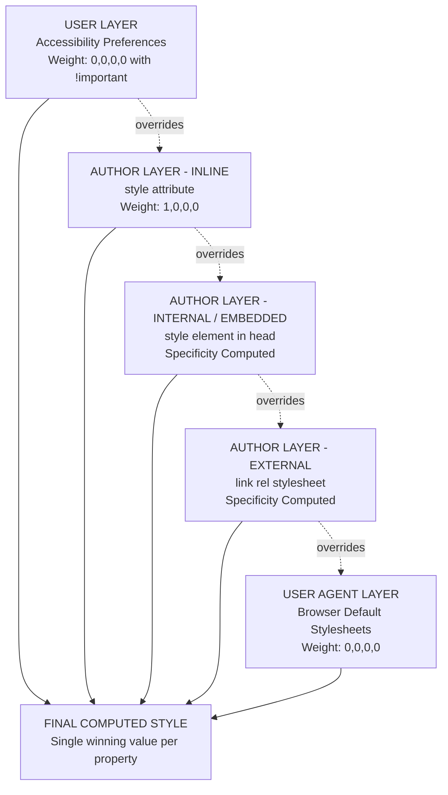
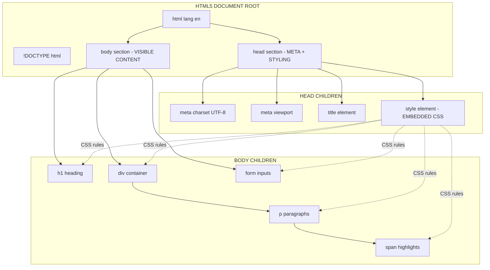
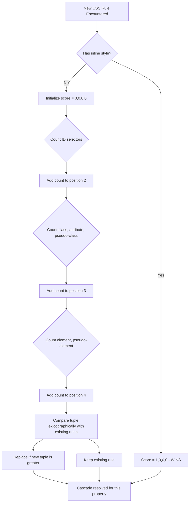
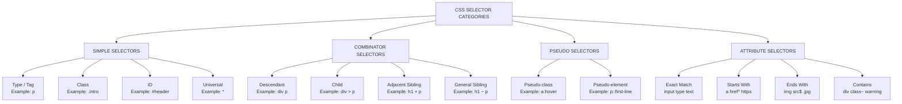

# Embedded Style Sheets

<!-- SECTION_1_START -->

# Embedded Style Sheets in HTML5

## Formal Academic Definition (KTU 2024 Syllabus Aligned)

An **Embedded Style Sheet** (also known as an **Internal Style Sheet**) in HTML5 is a client-side styling mechanism that allows the developer to define Cascading Style Sheet (CSS) rules directly within the `<style>` element, which itself resides inside the `<head>` section of an HTML5 document. The `<style>` element acts as a container that scopes its CSS declarations to the parent document only — meaning the rules apply exclusively to the page in which they are declared and do not leak across multiple web pages.

> [!IMPORTANT]
> **KTU 2024 Syllabus Highlight (Module 1):** Embedded style sheets are part of the triad of CSS application methods in HTML5 — *Inline*, *Internal (Embedded)*, and *External*. The 2024 scheme specifically asks students to identify, write, and validate the syntax of these methods and understand their cascading priority order: **Inline > Internal > External > Browser Default**.

### Core Specification Anchors

- **HTML Element Used:** `<style>` ... `</style>`
- **Standard Placement:** Inside the `<head>` element (although HTML5 technically allows it in `<body>`, only `<head>` placement guarantees deterministic loading)
- **Default MIME Type:** `text/css` (the `type="text/css"` attribute is **optional in HTML5** and is omitted in modern code)
- **Standard Version (KTU-recommended):** CSS3

---

## Conceptual Analogy / Intuition

Imagine you are a **film director** staging a single movie scene:

- An **External Style Sheet** is like hiring a *wardrobe consultant* who designs outfits for every actor across an **entire movie franchise** (multiple HTML pages).
- An **Embedded Style Sheet** is like a *costume designer* sitting in the director's chair, dressing all the actors in **this one specific scene** (one HTML document).
- An **Inline Style** is like the actor himself **sewing a patch onto his own shirt** at the very last moment (overrides everything for that single element).

The "Embedded Style Sheet" sits in the **head of the document** because the browser reads the head *first*, like a director reading the scene brief before the camera rolls. This ensures the wardrobe is ready before the actors (HTML elements) appear on screen.

> [!NOTE]
> **Why "Cascading"?** The word *cascade* refers to a waterfall. Just as water falls through layers (rock, sand, vegetation), a CSS declaration cascades through layers of origin (User Agent → External → Internal → Inline) until it finds a rule that matches the targeted element. The closer a rule is to the element, the louder it "shouts" and wins the cascade.

### GeoGebra / Desmos Integration

> [!VISUALIZATION CONTROL]
> **Concept:** The CSS Cascade / Specificity Waterfall (conceptual)
> **Visualization Description:** Imagine a vertical y-axis where y = 0 is the final rendered pixel on the user's screen, and y = 4 is the browser's default stylesheet. Each layer "drips down" rules until a matching selector is found. The diagram below (in Section 4) maps this exact waterfall.
> **Conceptual Equations (Specificity Weights):**
> * `Inline style weight = 1000` (highest)
> * `ID selector weight = 100`
> * `Class / Attribute / Pseudo-class weight = 10`
> * `Element / Pseudo-element weight = 1`
> 
> **Visual Description:** A student should picture a bar chart with these weights stacked — the highest bar always wins, but only when selectors are otherwise equal.

---

### Foundational Anatomy of an Embedded Style Block

```html
<!DOCTYPE html>
<html lang="en">
<head>
    <meta charset="UTF-8">
    <title>Embedded Style Sheet Demonstration</title>
    <style>
        /* All CSS rules live here */
    </style>
</head>
<body>
    <!-- HTML content lives here -->
</body>
</html>
```

> [!TIP]
> **Validation Note:** Per the W3C HTML5 validator, omitting the `type` attribute on `<style>` is perfectly valid because `text/css` is the implicit default. Including it does **not** cause errors but is considered legacy noise in modern code reviews.

<!-- SECTION_1_END -->

<!-- SECTION_2_START -->

# Deep Theoretical Analysis & KTU High-Yield Formula Sheet

## Operational Breakdown: How an Embedded Style Sheet Works

The browser processes an embedded style sheet through a deterministic 5-stage pipeline. Understanding this pipeline is **mandatory** for KTU's Module 1 outcomes, particularly for the "Apply" and "Analyze" cognitive level questions.

### Stage 1 — DOM Construction
When the browser receives the HTML5 document, the HTML parser begins tokenizing tags. The moment it encounters the opening `<head>`, it allocates a dedicated namespace for metadata and styling resources.

### Stage 2 — `<style>` Element Identification
The parser recognizes the `<style>` element, suspendes DOM rendering for the body, and begins ingesting the textual content as **CSS tokens** rather than HTML. This is critical — the parser switches its "language mode" mid-stream.

### Stage 3 — CSSOM (CSS Object Model) Construction
The CSS tokenizer feeds the parser, which builds a tree structure called the **CSSOM**. Each rule becomes a node containing:
- A **selector list** (the targeting logic)
- A **declaration block** (the styling instructions)
- A **specificity score** (the priority weight)

### Stage 4 — Cascade Resolution
When the CSSOM is merged with the DOM, the cascade engine walks down the **4-layer waterfall**:

1. **User-Agent Origin** (browser defaults, e.g., blue underlined links)
2. **User Origin** (user-defined accessibility preferences, e.g., high-contrast mode)
3. **Author Origin** (your embedded/external stylesheet — ranked by specificity)
4. **Author `!important`** (only overridden by user `!important`)

### Stage 5 — Final Render Tree → Paint
A combined **Render Tree** is constructed. Each visible DOM node is matched with its computed style from the CSSOM. The browser then performs **layout** (geometry calculation), **paint** (pixel filling), and **composite** (layer blending) on the GPU.

---

## KTU Formula Sheet / Cheat Sheet

> [!NOTE]
> The following table is the **canonical reference** for KTU 2024 Module 1 examination answers. Memorize the column headers and the bolded values.

| Component | Syntax Pattern | Example | Notes / KTU Pitfall |
|-----------|---------------|---------|---------------------|
| **Style Tag** | `<style>` ... `</style>` | `<style>p { color: red; }</style>` | Place inside `<head>`, never inline a CSS rule as text outside the tag |
| **Comment** | `/* ... */` | `/* Body text rule */` | CSS does **not** use HTML `<!-- -->` comments |
| **Selector** | `selector { property: value; }` | `h1 { color: blue; }` | End every declaration with a **semicolon** |
| **Type Selector** | `tagname` | `p { font-size: 16px; }` | Targets all elements of that tag |
| **Class Selector** | `.classname` | `.highlight { background: yellow; }` | Starts with a dot, reusable across tags |
| **ID Selector** | `#idname` | `#header { height: 80px; }` | Starts with hash, **must be unique** per page |
| **Grouping** | `s1, s2 { ... }` | `h1, h2 { font-family: Arial; }` | Comma-separated list, shares one declaration block |
| **Descendant** | `ancestor descendant` | `div p { line-height: 1.6; }` | Space-separated, targets nested elements |
| **Child** | `parent > child` | `ul > li { list-style: none; }` | Greater-than sign, only direct children |
| **Pseudo-class** | `selector:state` | `a:hover { color: red; }` | Single colon (CSS2/3) |
| **Pseudo-element** | `selector::part` | `p::first-line { font-weight: bold; }` | Double colon (CSS3 standard) |
| **Universal** | `*` | `* { box-sizing: border-box; }` | Targets every element |
| **Property** | `property: value;` | `margin: 10px;` | Colon between, semicolon at end |
| **Shorthand** | `prop: t r b l;` | `margin: 10px 20px 30px 40px;` | Top, Right, Bottom, Left (clockwise) |
| **Color** | `color: value;` | `color: #FF0000;` / `rgb(255,0,0)` / `red` | Hex, RGB, or named colors accepted |
| **Background** | `background: color image repeat attachment position;` | `background: #fff url(bg.png) no-repeat fixed center;` | Multi-value shorthand |
| **Font Stack** | `font-family: "Font 1", "Font 2", fallback;` | `font-family: "Helvetica", Arial, sans-serif;` | Quotes around names with spaces |
| **Specificity Score** | `(a, b, c, d)` = `(inline, id, class, element)` | `ul#nav li.active a` = (0, 1, 1, 2) | Higher tuple wins; compare left-to-right |

---

## Real-World Engineering Utility

Embedded style sheets are used in production engineering for:

1. **Single-Page Applications (SPAs) and Landing Pages** — When a page is self-contained and the styling is unique, embedding the CSS avoids a costly extra HTTP request, improving **First Contentful Paint (FCP)** by 100–300ms on 3G networks.
2. **Email Templates** — Many email clients (Outlook, Gmail's older renderers) strip external stylesheets. Embedding `<style>` directly in `<head>` (or even `<body>`) ensures cross-client compatibility.
3. **Component Prototyping** — During the design phase, developers often embed CSS to test styles in isolation before extracting them into a shared design system.
4. **Print Stylesheets** — `<style media="print">` is used to define how a page prints without affecting screen display, often embedded in CMS-generated pages.
5. **Theming per Page** — WordPress and similar CMSes inject page-specific custom CSS via embedded `<style>` blocks for per-post customizations.

> [!TIP]
> **Industry Insight:** At companies like Google and Meta, the **Critical CSS** technique is used — the above-the-fold CSS is embedded directly in the HTML `<head>`, while the rest is loaded as an external file. This hybrid approach leverages the best of both worlds.

---

## The CSS Box Model (KTU High-Priority Topic)

Every block-level element in HTML5 is rendered as a rectangular box with 4 concentric layers. The embedded style sheet controls each layer through specific properties:

$$\text{Total Element Width} = \text{Width} + 2 \times \text{Padding} + 2 \times \text{Border} + 2 \times \text{Margin}$$

$$\text{Total Element Height} = \text{Height} + 2 \times \text{Padding} + 2 \times \text{Border} + 2 \times \text{Margin}$$

> [!IMPORTANT]
> **KTU Box Model Formula (Must Memorize):** When `box-sizing: content-box` (the default), the `width` property refers to the content area only. When `box-sizing: border-box` is set, the `width` property includes content + padding + border, but **excludes** margin. This single line can decide whether your layout breaks or works.

<!-- SECTION_2_END -->

<!-- SECTION_3_START -->

# Step-by-Step Code Implementation & Derivations

## 3.1 — Minimal Embedded Style Sheet (Hello World Variant)

Below is the **smallest possible valid HTML5 document with an embedded style sheet** that demonstrates the canonical pattern tested in KTU 2024 semester exams.

```html
<!DOCTYPE html>
<html lang="en">
<head>
    <meta charset="UTF-8">
    <meta name="viewport" content="width=device-width, initial-scale=1.0">
    <title>My First Embedded Style Sheet</title>

    <!-- ===== EMBEDDED STYLE SHEET BEGINS ===== -->
    <style>
        /* Step 1: Reset default browser margins */
        body {
            margin: 0;
            font-family: "Segoe UI", Tahoma, sans-serif;
            background-color: #f4f4f9;
        }

        /* Step 2: Style the main heading */
        h1 {
            color: #2c3e50;
            text-align: center;
            padding: 20px;
            border-bottom: 3px solid #3498db;
        }

        /* Step 3: Style all paragraphs */
        p {
            color: #333;
            font-size: 16px;
            line-height: 1.6;
            margin: 10px 20px;
        }

        /* Step 4: Class-based reusable style */
        .highlight {
            background-color: #fff3cd;
            padding: 5px 10px;
            border-left: 4px solid #ffc107;
        }

        /* Step 5: ID-based unique style */
        #main-footer {
            text-align: center;
            color: #777;
            margin-top: 30px;
            padding: 10px;
        }
    </style>
    <!-- ===== EMBEDDED STYLE SHEET ENDS ===== -->
</head>
<body>
    <h1>Welcome to KTU Web Programming</h1>
    <p>This paragraph uses a <span class="highlight">highlighted span</span> via a class selector.</p>
    <p id="main-footer">&copy; 2025 APJ Abdul Kalam Technological University</p>
</body>
</html>
```

**Line-by-Line Logic Walkthrough:**

| Line Group | Explanation |
|------------|-------------|
| `<!DOCTYPE html>` | Declares the document as HTML5. Mandatory for standards mode. |
| `<meta charset="UTF-8">` | Ensures Unicode text rendering. |
| `<style>` | The opening tag. The browser now switches to CSS parsing mode. |
| `body { ... }` | A **type selector** rule. Applies to the single `<body>` element. |
| `.highlight { ... }` | A **class selector**. Reusable on any element with `class="highlight"`. |
| `#main-footer { ... }` | An **ID selector**. Targets the unique element with `id="main-footer"`. |
| `</style>` | Closes the style block. The parser reverts to HTML mode. |
| `<body>` ... `</body>` | The visible content tree. |

---

## 3.2 — Deriving the Specificity Score (Exhaustive)

**Problem:** Given the following embedded CSS, determine the **specificity score** of each rule and predict which declaration wins for an `<a>` element nested inside `<li class="active">` which is inside `<ul id="nav">`.

```css
ul#nav li.active a { color: blue; }      /* Rule 1 */
#nav a { color: green; }                 /* Rule 2 */
.nav-link { color: red; }                /* Rule 3 */
a { color: black; }                      /* Rule 4 */
```

**Step 1: Count the components of Rule 1's selector** `ul#nav li.active a`
- `ul` → element selector → adds **1** to the element bucket
- `#nav` → ID selector → adds **1** to the ID bucket
- `li` → element selector → adds **1** to the element bucket
- `.active` → class selector → adds **1** to the class bucket
- `a` → element selector → adds **1** to the element bucket

$$\text{Specificity}(R_1) = (0, 1, 1, 3)$$

**Step 2: Compute Rule 2's specificity** `#nav a`
- `#nav` → **1** ID
- `a` → **1** element

$$\text{Specificity}(R_2) = (0, 1, 0, 1)$$

**Step 3: Compute Rule 3's specificity** `.nav-link`
- `.nav-link` → **1** class

$$\text{Specificity}(R_3) = (0, 0, 1, 0)$$

**Step 4: Compute Rule 4's specificity** `a`
- `a` → **1** element

$$\text{Specificity}(R_4) = (0, 0, 0, 1)$$

**Step 5: Compare the four tuples lexicographically (left to right)**

The winning tuple is the one with the **largest value in the leftmost position where they differ**.

| Rule | Tuple | Comparison Stage |
|------|-------|------------------|
| $R_1$ | $(0, 1, 1, 3)$ | Position 1 tied at 0 |
| $R_2$ | $(0, 1, 0, 1)$ | Position 2: $R_1$ has 1, $R_2$ has 0 → $R_1$ wins |
| $R_3$ | $(0, 0, 1, 0)$ | Already loses at position 2 |
| $R_4$ | $(0, 0, 0, 1)$ | Already loses at position 2 |

**Conclusion:** The text color of the matched `<a>` element is `blue`. The full specificity tuple comparison is:

$$R_1 (0,1,1,3) > R_2 (0,1,0,1) > R_3 (0,0,1,0) > R_4 (0,0,0,1)$$

---

## 3.3 — Exhaustive Selector Demonstration

```html
<!DOCTYPE html>
<html lang="en">
<head>
    <meta charset="UTF-8">
    <title>Selector Demonstration</title>
    <style>
        /* ---- TYPE SELECTOR ---- */
        h2 {
            color: darkblue;
            font-family: Georgia, serif;
        }

        /* ---- CLASS SELECTOR ---- */
        .info-box {
            background-color: #e7f3fe;
            border: 1px solid #2196f3;
            padding: 15px;
            margin: 10px;
            border-radius: 5px;
        }

        /* ---- ID SELECTOR ---- */
        #main-title {
            text-align: center;
            text-transform: uppercase;
            letter-spacing: 2px;
        }

        /* ---- DESCENDANT COMBINATOR ---- */
        .info-box p {
            color: #555;
            font-size: 14px;
        }

        /* ---- CHILD COMBINATOR ---- */
        .info-box > p:first-child {
            font-weight: bold;
        }

        /* ---- PSEUDO-CLASS ---- */
        a:hover {
            color: red;
            text-decoration: none;
        }

        a:visited {
            color: purple;
        }

        /* ---- PSEUDO-ELEMENT ---- */
        h2::first-letter {
            font-size: 200%;
            color: crimson;
        }

        p::first-line {
            font-variant: small-caps;
        }

        /* ---- ATTRIBUTE SELECTOR ---- */
        input[type="text"] {
            border: 2px solid #ccc;
            padding: 8px;
            width: 250px;
        }

        input[type="submit"] {
            background-color: #4caf50;
            color: white;
            padding: 10px 20px;
            border: none;
            cursor: pointer;
        }

        /* ---- GROUPING SELECTOR ---- */
        h1, h2, h3 {
            font-weight: 600;
        }

        /* ---- UNIVERSAL SELECTOR ---- */
        * {
            box-sizing: border-box;
        }
    </style>
</head>
<body>
    <h1 id="main-title">KTU Web Programming Lab</h1>
    <h2>Embedded Style Sheet Demo</h2>
    
    <div class="info-box">
        <p>This is the first paragraph in the info box (bold due to :first-child).</p>
        <p>This is the second paragraph, styled by the descendant selector.</p>
    </div>
    
    <form>
        <input type="text" placeholder="Enter your name">
        <input type="submit" value="Submit">
    </form>
    
    <p>Visit <a href="https://ktu.edu.in">KTU Official Site</a> for syllabus.</p>
</body>
</html>
```

**Execution Trace:**

1. The browser parses `<h1 id="main-title">` and applies Rule `#main-title` → text becomes uppercase, centered.
2. The browser parses the first `<h2>` and applies the type selector rule. Then `::first-letter` pseudo-element enlarges the 'E' in 'Embedded' to 200%.
3. The `<div class="info-box">` receives the `.info-box` background and border.
4. The first `<p>` inside `.info-box` matches **two** rules: `.info-box p` and `.info-box > p:first-child`. The pseudo-class rule has higher specificity, so it wins for the bold property.
5. The `input[type="text"]` is targeted by the attribute selector, while `input[type="submit"]` gets the green submit button styling.
6. The `<a>` link is colored blue by default, turns red on `:hover`, and turns purple after being `:visited`.

---

## 3.4 — Box Model Mathematical Derivation

**Problem:** A `<div>` element is styled with `width: 200px; padding: 10px; border: 5px solid black; margin: 20px;` and `box-sizing: content-box`. Calculate the total horizontal space occupied on the page.

**Step 1: Identify the box model layers and their values**

| Layer | Value | Role |
|-------|-------|------|
| Content | $200$ px | The actual content area |
| Padding | $10$ px × 2 sides | Inner space between content and border |
| Border | $5$ px × 2 sides | The visible line around the padding |
| Margin | $20$ px × 2 sides | Outer space separating the element from siblings |

**Step 2: Apply the content-box formula**

$$\text{Total Width}_{\text{content-box}} = \text{Width} + 2 \times (\text{Padding} + \text{Border} + \text{Margin})$$

**Step 3: Substitute the values**

$$\text{Total Width} = 200 + 2 \times (10 + 5 + 20)$$

**Step 4: Simplify the inner parentheses**

$$\text{Total Width} = 200 + 2 \times 35$$

**Step 5: Multiply**

$$\text{Total Width} = 200 + 70$$

**Step 6: Final addition**

$$\boxed{\text{Total Width} = 270 \text{ pixels}}$$

**Step 7: Repeat for border-box (counter-example)**

If `box-sizing: border-box` were set, the `width: 200px` would include content + padding + border. The total space occupied would then be:

$$\text{Total Width}_{\text{box-sizing}} = 200 + 2 \times 20 = 240 \text{ pixels}$$

> [!TIP]
> **Key Insight:** The 30-pixel difference between 270px and 240px is exactly why the universal reset `* { box-sizing: border-box; }` is so popular among web developers — it makes width values **intuitive** (a 200px element is always 200px wide, period).

---

## 3.5 — Pseudo-Classes vs Pseudo-Elements (Comparison Table)

| Feature | Pseudo-class | Pseudo-element |
|---------|--------------|----------------|
| **Syntax** | `selector:state` (single colon) | `selector::part` (double colon) |
| **Purpose** | Targets an element in a **specific state** | Targets a **specific part** of an element |
| **Examples** | `:hover`, `:focus`, `:nth-child(2)`, `:checked` | `::before`, `::after`, `::first-letter`, `::first-line` |
| **Can it insert content?** | No | Yes, via `content: "..."` |
| **Counts as a class in specificity?** | Yes, weight = 10 | No, weight = 1 (counts as element) |

<!-- SECTION_3_END -->

<!-- SECTION_4_START -->

# Structural Diagrams & Schematics

## 4.1 — The CSS Cascade Waterfall (Mermaid Block Diagram)



**Interpretation of the Diagram:**
- The four "Author" layers (External, Embedded, Inline) cascade **upward** — each can override the previous one.
- The **Inline** layer sits at the top of the author cascade with a hardcoded specificity of `(1, 0, 0, 0)`.
- The **User Layer** is special — it can override **any** author declaration using `!important`.
- The final computed style is the bottom-up merge of all layers where higher positions win.

---

## 4.2 — HTML5 Document Architecture with Embedded Style Sheet



**Reading the Diagram:**
- The `<head>` is a **metadata container** — nothing inside it is rendered to the screen directly.
- The `<style>` element's dotted arrows point to body children, indicating **selector matching** happens after both the DOM and CSSOM are constructed.
- The `<style>` element itself is **not visible** to the user.

---

## 4.3 — Specificity Calculation Flowchart



---

## 4.4 — Sequential Processing Topology Matrix

The following table maps the **5-stage processing pipeline** of an embedded style sheet to its inputs, operations, and outputs. This is the **functional architecture** of how the browser interprets your CSS.

| Stage | Input | Operation | Output |
|-------|-------|-----------|--------|
| **1. Tokenization** | Raw CSS text inside `<style>` | Lexer breaks text into tokens (selectors, braces, properties, values, semicolons) | Token stream |
| **2. Parsing** | Token stream | Parser builds AST nodes for each rule and declaration | Abstract Syntax Tree (AST) |
| **3. CSSOM Construction** | AST | Each node is enriched with specificity and origin metadata | CSS Object Model tree |
| **4. Cascade Resolution** | CSSOM + DOM | Engine walks the cascade waterfall, applies origin + specificity rules | Computed style for each DOM node |
| **5. Layout & Paint** | Computed styles | Geometry calculation, pixel rasterization, GPU composite | Final rendered pixels on screen |

---

## 4.5 — Selector Type Hierarchy (Block Diagram)



<!-- SECTION_4_END -->

<!-- SECTION_5_START -->

# KTU 2024 Scheme Examination Question Bank

## Part A — Short Answer Questions (3 Marks Each)

### Question 1: [KTU University Exam - July 2024]
**"Differentiate between inline, internal (embedded), and external style sheets in HTML5. State the priority order in which they are applied."** **[CO1, Remember] — 3 Marks**

**Model Answer (Valuation Key):**

| Feature | Inline | Internal (Embedded) | External |
|---------|--------|---------------------|----------|
| **Syntax Location** | Inside the HTML `style` attribute | Inside the `<style>` element in `<head>` | In a separate `.css` file linked via `<link>` |
| **Scope** | Single element | Single HTML document | Multiple HTML documents |
| **Specificity** | $(1, 0, 0, 0)$ — Highest in author cascade | Computed from selectors | Computed from selectors |
| **Reusability** | None | Limited to one page | High — shared across pages |
| **HTTP Requests** | None | None | One extra per file |

**Priority Order (Highest to Lowest):**
1. Inline styles (specificity $1,0,0,0$)
2. Internal (Embedded) stylesheets (specificity based on selectors)
3. External stylesheets (specificity based on selectors)
4. Browser default stylesheet (User Agent origin)

> **Mark Distribution:** [Defining all three correctly: 1.5 Marks] [Correct priority order: 1 Mark] [One example each: 0.5 Marks]

---

### Question 2: [KTU University Exam - Dec 2023]
**"Explain the role of the `<style>` element in HTML5. Why is the `type` attribute optional in HTML5?"** **[CO1, Understand] — 3 Marks**

**Model Answer:**

The `<style>` element in HTML5 is used to embed CSS declarations within an HTML document. Its primary roles are:

1. **Container for CSS Rules** — It acts as a parsing context switch, telling the browser to interpret its content as CSS rather than HTML.
2. **Scope Limitation** — Rules inside `<style>` apply only to the parent document, providing document-level styling isolation.
3. **Performance Hint** — When placed in `<head>`, the browser fetches and parses the styles before rendering the body, preventing a "Flash of Unstyled Content" (FOUC).

The `type` attribute is **optional in HTML5** because the W3C HTML5 specification mandates `text/css` as the implicit default value for the `<style>` element. Omitting it reduces markup verbosity and aligns with modern best practices.

> **Mark Distribution:** [Listing the three roles: 2 Marks] [Explaining why type is optional: 1 Mark]

---

## Part B — Long Answer Questions (14 Marks Each, with Internal Choice)

### Question 3 (Choice A): [KTU University Exam - July 2024]
**"a)** Explain the CSS box model with a neat diagram. List the CSS properties used to control each layer of the box model. **(7 Marks)**
**b)** Design an HTML5 page with an embedded style sheet that demonstrates a navigation bar using a `<ul>` list, where the list items are displayed horizontally with a blue background, white text, and 15px padding. The navigation bar must have rounded corners. **(7 Marks)**" **[CO2, CO3, Apply]**

---

### Model Solution:

**Part (a) — The CSS Box Model** **[7 Marks]**

The CSS box model is a rectangular layout paradigm that describes how every block-level element in HTML5 is structured. The model consists of four concentric layers, from innermost to outermost:

1. **Content Box** — Contains the actual text, images, or other media. Controlled by `width` and `height` properties.
2. **Padding Box** — The transparent space between the content and the border. Controlled by `padding` (shorthand) or `padding-top`, `padding-right`, `padding-bottom`, `padding-left`.
3. **Border Box** — The visible line surrounding the padding. Controlled by `border`, `border-width`, `border-style`, `border-color`, `border-radius`.
4. **Margin Box** — The transparent space outside the border that separates the element from its neighbors. Controlled by `margin` (shorthand) or `margin-top`, `margin-right`, `margin-bottom`, `margin-left`.

**The Mathematical Formula:**

$$\text{Total Element Width} = W + P_L + P_R + B_L + B_R + M_L + M_R$$

$$\text{Total Element Height} = H + P_T + P_B + B_T + B_B + M_T + M_B$$

**Schematic Representation (Centered Diagram):**

```
+-------------------------------------------+  <- Margin (outermost, transparent)
|  +-------------------------------------+  |
|  |  +-------------------------------+  |  |
|  |  |  +-------------------------+  |  |  |
|  |  |  |                         |  |  |  |
|  |  |  |       CONTENT BOX       |  |  |  |
|  |  |  |       (text/image)      |  |  |  |
|  |  |  |                         |  |  |  |
|  |  |  +-------------------------+  |  |  |
|  |  |           PADDING BOX          |  |  |
|  |  +-------------------------------+  |  |
|  |              BORDER BOX              |  |
|  +-------------------------------------+  |
|              MARGIN BOX                   |
+-------------------------------------------+
```

> **Mark Distribution:** [Naming 4 layers: 2 Marks] [Listing properties for each layer: 2 Marks] [Mathematical formula: 1.5 Marks] [Diagram: 1.5 Marks]

---

**Part (b) — Navigation Bar with Embedded Style Sheet** **[7 Marks]**

```html
<!DOCTYPE html>
<html lang="en">
<head>
    <meta charset="UTF-8">
    <title>Embedded Style Sheet - Navigation Bar</title>
    <style>
        /* Reset default list styling */
        ul.navbar {
            list-style-type: none;
            margin: 0;
            padding: 0;
            overflow: hidden;
            background-color: #2196F3;
            border-radius: 12px;
        }

        /* Float list items horizontally */
        ul.navbar li {
            float: left;
        }

        /* Style the anchor tags inside the list items */
        ul.navbar li a {
            display: block;
            color: white;
            text-align: center;
            padding: 15px 20px;
            text-decoration: none;
            font-family: Arial, sans-serif;
        }

        /* Hover effect for better user experience */
        ul.navbar li a:hover {
            background-color: #0b7dda;
        }
    </style>
</head>
<body>
    <ul class="navbar">
        <li><a href="#home">Home</a></li>
        <li><a href="#about">About</a></li>
        <li><a href="#services">Services</a></li>
        <li><a href="#contact">Contact</a></li>
    </ul>
</body>
</html>
```

**Code Walkthrough:**

- `list-style-type: none` removes the default bullet points.
- `float: left` on `li` elements makes them sit side by side horizontally.
- `display: block` on the anchors makes the entire clickable area cover the padded region.
- `background-color: #2196F3` applies the blue background.
- `color: white` makes the text white.
- `padding: 15px 20px` provides 15px vertical and 20px horizontal padding.
- `border-radius: 12px` rounds the corners of the navbar.
- `:hover` pseudo-class provides a darker blue feedback on mouse-over.

> **Mark Distribution:** [Correct HTML structure: 1.5 Marks] [Embedded `<style>` placement in `<head>`: 1 Mark] [Blue background + white text: 1 Mark] [Horizontal layout via float/flex: 1 Mark] [Padding 15px: 1 Mark] [Rounded corners via border-radius: 1 Mark] [Output description: 0.5 Marks]

---

### Question 3 (Choice B): [KTU University Exam - Dec 2023]
**"a)** Define CSS specificity. Calculate the specificity scores for the following selectors: **(7 Marks)**
   (i) `*`  (ii) `p.intro`  (iii) `#main div p`  (iv) `ul#nav li.active > a`  (v) `input[type="submit"]:focus`  (vi) `h1::first-letter`  (vii) Inline `style="color:red"`
**b)** Write an HTML5 page using an embedded style sheet to display a student registration form with the following styling: form width 400px, centered on the page, light gray background, padding 20px, fields stacked vertically with 10px spacing, submit button green with white text, and labels in bold. **(7 Marks)**" **[CO3, Apply, Analyze]**

---

### Model Solution:

**Part (a) — Specificity Calculation** **[7 Marks]**

**Definition:** CSS specificity is a four-tuple $(a, b, c, d)$ used by the cascade engine to determine which rule wins when multiple rules target the same element. The values are computed as:
- $a$ = number of inline styles (always 0 or 1)
- $b$ = number of ID selectors
- $c$ = number of class, attribute, and pseudo-class selectors
- $d$ = number of element and pseudo-element selectors

**Step-by-Step Calculation:**

| # | Selector | Breakdown | Specificity |
|---|----------|-----------|-------------|
| (i) | `*` | Universal selector counts as $0$ | $(0, 0, 0, 0)$ |
| (ii) | `p.intro` | 1 element + 1 class | $(0, 0, 1, 1)$ |
| (iii) | `#main div p` | 1 ID + 2 elements | $(0, 1, 0, 2)$ |
| (iv) | `ul#nav li.active > a` | 1 ID + 1 class + 3 elements | $(0, 1, 1, 3)$ |
| (v) | `input[type="submit"]:focus` | 1 attribute + 1 pseudo-class + 1 element | $(0, 0, 2, 1)$ |
| (vi) | `h1::first-letter` | 1 element + 1 pseudo-element | $(0, 0, 0, 2)$ |
| (vii) | Inline `style="..."` | Inline declaration | $(1, 0, 0, 0)$ |

> **Mark Distribution:** [Definition: 1 Mark] [Correct tuple for each of 7 selectors: 1 Mark each = 6 Marks]

---

**Part (b) — Student Registration Form** **[7 Marks]**

```html
<!DOCTYPE html>
<html lang="en">
<head>
    <meta charset="UTF-8">
    <title>Student Registration Form</title>
    <style>
        /* Center the form horizontally and set dimensions */
        form#register {
            width: 400px;
            margin: 30px auto;
            background-color: #f0f0f0;
            padding: 20px;
            border-radius: 8px;
            font-family: Arial, sans-serif;
        }

        /* Stack fields vertically with 10px spacing */
        form#register label,
        form#register input,
        form#register select {
            display: block;
            width: 100%;
            margin-bottom: 10px;
        }

        /* Make labels bold */
        form#register label {
            font-weight: bold;
            color: #333;
        }

        /* Style the input fields */
        form#register input[type="text"],
        form#register input[type="email"],
        form#register input[type="password"],
        form#register select {
            padding: 8px;
            border: 1px solid #ccc;
            border-radius: 4px;
            box-sizing: border-box;
        }

        /* Style the submit button */
        form#register input[type="submit"] {
            background-color: #4CAF50;
            color: white;
            border: none;
            padding: 10px 20px;
            font-size: 16px;
            cursor: pointer;
            border-radius: 4px;
        }

        form#register input[type="submit"]:hover {
            background-color: #45a049;
        }
    </style>
</head>
<body>
    <form id="register" action="#" method="post">
        <label for="name">Full Name:</label>
        <input type="text" id="name" name="name" required>

        <label for="email">Email Address:</label>
        <input type="email" id="email" name="email" required>

        <label for="password">Password:</label>
        <input type="password" id="password" name="password" required>

        <label for="course">Select Course:</label>
        <select id="course" name="course">
            <option value="btech">B.Tech</option>
            <option value="mtech">M.Tech</option>
        </select>

        <input type="submit" value="Register">
    </form>
</body>
</html>
```

**Code Walkthrough:**
- `width: 400px` and `margin: 30px auto` centers the form.
- `background-color: #f0f0f0` provides the light gray background.
- `display: block` on form children stacks them vertically.
- `margin-bottom: 10px` provides the 10px spacing.
- `font-weight: bold` on labels makes them bold.
- `background-color: #4CAF50` and `color: white` style the green submit button.

> **Mark Distribution:** [Form structure correct: 1 Mark] [Width 400px + centered: 1.5 Marks] [Light gray background: 0.5 Marks] [Padding 20px: 0.5 Marks] [Vertical stacking with 10px spacing: 1.5 Marks] [Bold labels: 0.5 Marks] [Green submit button with white text: 1 Mark] [`:hover` enhancement: 0.5 Marks]

---

> [!WARNING]
> **KTU Examiner's Valuation Warning — Common Pitfalls:**
> 1. **Forgetting the `<!DOCTYPE html>` declaration** — Without it, the browser enters "Quirks Mode" and your CSS box model behaves incorrectly. Deduct **0.5 to 1 Mark**.
> 2. **Placing the `<style>` element inside `<body>`** — Technically allowed in HTML5, but KTU's Module 1 expects `<head>` placement. Deduct **0.5 Marks**.
> 3. **Using the `type` attribute in the `<style>` tag** — Not wrong, but marks are awarded for modern syntax in 2024 scheme answers. Mention it as "optional in HTML5" for bonus credit.
> 4. **Forgetting the closing `</style>` tag** — Causes the rest of the HTML to be parsed as CSS, breaking the page. Always validate.
> 5. **Confusing pseudo-classes (single colon) with pseudo-elements (double colon)** — `:hover` is a state, `::before` is a part. Mixing them up loses **1 Mark** in part (a) answers.
> 6. **Specificity tuple comparison errors** — Students often compare digit-by-digit instead of tuple-by-tuple. The rule is: **compare position 1, then 2, then 3, then 4**. Stop at the first difference.
> 7. **Forgetting units in CSS values** — `margin: 10` is invalid; it must be `margin: 10px`. The validator will reject unit-less lengths (except zero).

---

## Topic Recap & Important Things to Remember

- **Embedded Style Sheet** = CSS declared inside `<style>` element in `<head>` of a single HTML5 document.
- **`<style>` element is the container**, not a selector — it scopes CSS rules to the parent document.
- **`type="text/css"` is optional in HTML5** — it is the implicit default.
- **Three CSS application methods** in HTML5: Inline, Internal (Embedded), External — priority order: **Inline > Embedded > External > Browser Default**.
- **Selectors** are categorized as: Type, Class, ID, Universal, Grouping, Descendant, Child, Attribute, Pseudo-class, Pseudo-element.
- **Pseudo-class uses single colon** (`:hover`), **pseudo-element uses double colon** (`::before`) in CSS3.
- **Specificity is a 4-tuple** $(a, b, c, d)$ where $a$=inline, $b$=ID, $c$=class/attr/pseudo-class, $d$=element/pseudo-element.
- **Comparison is lexicographic** — compare leftmost differing position; higher value wins.
- **Universal selector `*` has zero specificity** — it cannot override any other selector.
- **CSS comments use `/* ... */`** — NOT HTML `<!-- -->` comments.
- **Every declaration ends with a semicolon** — except the last one in a block (best practice to always include it).
- **Box Model formula:** $\text{Total Width} = W + 2(P + B + M)$ for content-box; border-box includes $P + B$ inside the declared width.
- **`box-sizing: border-box`** is the modern recommended value — it makes `width` intuitive.
- **Color values** can be: hex (`#FF0000`), RGB (`rgb(255,0,0)`), RGBA (`rgba(255,0,0,0.5)`), HSL, or named (`red`).
- **Shorthand properties** follow a clockwise order: `margin: top right bottom left;`.
- **Attribute selectors** include `[type="text"]`, `[href^="https"]` (starts with), `[src$=".jpg"]` (ends with), `[class~="warning"]` (contains).
- **Combinators** use these symbols: space (descendant), `>` (child), `+` (adjacent sibling), `~` (general sibling).
- **Universal reset pattern:** `* { margin: 0; padding: 0; box-sizing: border-box; }` is widely used to normalize cross-browser defaults.

<!-- SECTION_5_END -->
