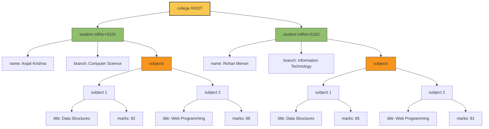
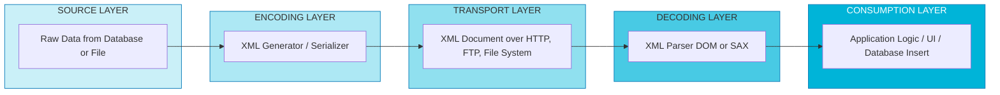
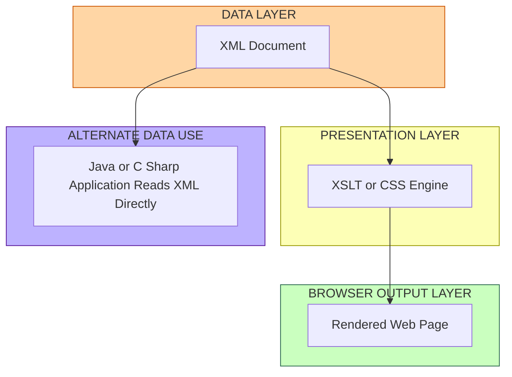

# Extensible Markup Language  - Introduction

<!-- SECTION_1_START -->

# Extensible Markup Language (XML) — Introduction

> [!IMPORTANT]
> **KTU 2024 Scheme | Module 1 — Creating Web Pages Using HTML5**
> This note covers the foundational concepts of XML as required for the KTU B.Tech Web Programming (OECST832) syllabus. XML is the backbone of structured data interchange on the web and is the conceptual predecessor to HTML5 semantics.

---

## 1.1 Formal Academic Definition

> [!NOTE]
> **Definition (W3C Standard):**
> *Extensible Markup Language (XML) is a simple, flexible, and platform-independent text-based format derived from SGML (Standard Generalized Markup Language). It is designed to store, transport, and structure data in a human-readable and machine-readable form, with the key feature that the tags are user-definable (extensible) rather than fixed.*

In the KTU 2024 Scheme context, XML is studied as a **meta-language** — a language used to define other markup languages. It is governed by the **W3C (World Wide Web Consortium)** and forms the structural foundation for technologies like XHTML, RSS, SOAP, WSDL, and SVG.

### Key Terminology at a Glance

| Term | Meaning |
| :--- | :--- |
| **Extensible** | Users can create their own custom tags — there is no fixed vocabulary. |
| **Markup** | Text that is "marked up" with tags to add meaning/structure to data. |
| **Language** | A set of syntactical rules, not a programming language. |
| **Self-Describing** | The data carries its own structure inside the document. |

---

## 1.2 Conceptual Analogy — The "Custom Labeled Boxes" Analogy

Imagine you are moving items from your home to a new city. You have many boxes, and you want to label them so the movers (and you) know exactly what is inside each.

* **HTML** is like a courier company that gives you a *fixed* set of pre-printed labels: `<box>`, `<weight>`, `<fragile>`. You must squeeze your data into *their* categories.
* **XML** is like a courier company that lets you *design your own labels* using a label-maker. You can write `<dishes>`, `<books>`, `<winter-clothes>` — whatever fits your needs. The data inside each box is meaningful, and the labels themselves describe the content.

> [!TIP]
> **Mnemonic for Examiners:** "HTML defines *how things look*; XML defines *what things mean*."

---

## 1.3 Why XML Was Invented — The Historical Context

The web in the early 1990s needed a standardized way to **exchange structured data** between incompatible systems. HTML could display data, but it could not *describe* it. XML was released in **1998 (W3C Recommendation 1.0)** to solve the following problems:

1. **Data Interoperability** — Two systems (e.g., a Java bank server and a .NET airline server) could exchange data through a common XML format.
2. **Platform Independence** — Plain-text format works on every operating system.
3. **Separation of Data from Presentation** — The *content* is stored in XML; the *style* is applied via XSL or CSS.
4. **Self-Validation** — Using DTD or XML Schema, a document can be validated for structural correctness.

> [!NOTE]
> **KTU Syllabus Highlight:** Students must be able to differentiate between HTML, XHTML, and XML, and explain why XML is a "metalanguage."

---

## 1.4 XML as a Metalanguage

A *metalanguage* is a language used to define other languages. Because XML lets you invent any tag you want, you can use it as a base to build domain-specific markup languages, for example:

* **MathML** — for mathematical expressions.
* **SVG** — for vector graphics.
* **WSDL** — for describing web services.
* **RSS/Atom** — for news feeds.

---

## 1.5 The Three Pillars of an XML Document

> [!IMPORTANT]
> Every well-designed XML document rests on three pillars:
> 1. **Structure** — defined by elements and tags.
> 2. **Semantics** — defined by attribute values and text content.
> 3. **Rules** — defined by syntax (well-formedness) and schemas (validity).

---

## 1.6 Visualizing the XML Document Tree

An XML document is always modeled as a **tree structure** with a single root node, branching into child elements, which in turn have their own children. This is called the **DOM (Document Object Model)** view.

> [!VISUALIZATION CONTROL]
> **Concept:** XML Document Tree Structure (1 Root, 3 Children, 2 Grandchildren)
>
> **Generic Tree Input (for draw.io / Mermaid / xMind):**
> * Root: `library`
> * Children: `book`, `book`, `member`
> * Grandchildren of `book[1]`: `title`, `author`, `price`
> * Grandchildren of `member`: `name`, `id`
>
> **Visual Description:** The student should see a single node at the top (the *root element*). Three nodes branch downward. The first two nodes ("book") each spawn three child nodes. The third node ("member") spawns two child nodes. No node can have two parents — this is what makes XML strictly *hierarchical*.

> [!WARNING]
> **Common Misconception:** XML is *not* a replacement for HTML. HTML is for *display*, XML is for *transport and storage*. XHTML is the hybrid that reformulates HTML as a strict XML dialect.

<!-- SECTION_1_END -->

<!-- SECTION_2_START -->

# 2. Deep Theoretical Analysis — XML Architecture, Syntax, and Rules

This section breaks down XML into its component logical layers, providing the high-yield conceptual material that KTU examiners frequently test.

---

## 2.1 The Layered Architecture of XML

The XML ecosystem is built in distinct layers. The KTU syllabus expects you to know *which layer does what*.

| Layer | Purpose | Example |
| :--- | :--- | :--- |
| **XML 1.0 Specification** | Defines the syntax rules of XML documents. | Tag delimiters, character data. |
| **XML Namespaces** | Allows combining multiple XML vocabularies in one document. | `xmlns:xsi="http://www.w3.org/2001/XMLSchema-instance"` |
| **DTD / XML Schema (XSD)** | Defines the *structure* and *data types* allowed. | `<!ELEMENT book (title, author)>` |
| **XSLT (XSL Transformations)** | Transforms one XML document into another (e.g., into HTML). | `<xsl:for-each select="book">` |
| **XPath / XQuery** | Querying and navigating XML documents. | `/library/book[1]/title` |
| **DOM / SAX** | APIs (Application Programming Interfaces) to parse XML in code. | JavaScript `document.getElementsByTagName("book")`. |

> [!TIP]
> **Examiner's Shortcut:** If a question asks "Which technology is used to *transform* XML?", the answer is **XSLT**, not XPath. XPath is only for *locating* nodes.

---

## 2.2 Anatomy of a Minimal XML Document

Every XML document, no matter how complex, follows a single universal skeleton. Below is a textbook example used widely in KTU question papers:

```xml
<?xml version="1.0" encoding="UTF-8"?>
<library>
    <book category="fiction">
        <title lang="en">The Great Gatsby</title>
        <author>F. Scott Fitzgerald</author>
        <price>399.00</price>
    </book>
    <book category="non-fiction">
        <title lang="en">A Brief History of Time</title>
        <author>Stephen Hawking</author>
        <price>599.00</price>
    </book>
</library>
```

### Line-by-Line Dissection

1. **Line 1 — XML Declaration (Prolog):**
   `<?xml version="1.0" encoding="UTF-8"?>`
   This is technically *optional* in KTU questions, but always recommended. It tells the parser which version and character encoding to use. **UTF-8 is the standard.**

2. **Line 2 — Root Element:**
   `<library>` — There must be **exactly one** root element. All other elements must be nested inside it.

3. **Lines 3–7 — Child Element with Attribute:**
   `<book category="fiction">` — `category` is an *attribute*. Attributes provide *metadata* about the element.

4. **Lines 4–6 — Nested Elements:**
   `<title>`, `<author>`, `<price>` — these are *child elements* of `<book>`.

5. **Proper Closing:**
   `</library>` — Every opening tag `<tag>` must have a matching closing tag `</tag>`. This is the cardinal rule of XML.

---

## 2.3 The XML Syntax Rule Book (High-Yield for KTU)

> [!IMPORTANT]
> The following rules collectively make a document **"Well-Formed"** — a mandatory keyword in KTU answers.

| # | Rule | Correct Example | Incorrect Example |
| :--- | :--- | :--- | :--- |
| 1 | Every document must have **one and only one root element**. | `<root>...</root>` | `<a>..</a><b>..</b>` (siblings at top). |
| 2 | Every opening tag must have a closing tag. | `<p>Hello</p>` | `<p>Hello` (unclosed). |
| 3 | Tags are **case-sensitive**. | `<Title>...</Title>` | `<Title>...</title>` (mismatch). |
| 4 | Elements must be **properly nested** (no crossing). | `<a><b></b></a>` | `<a><b></a></b>` (overlap). |
| 5 | Attribute values **must be quoted**. | `id="101"` | `id=101` |
| 6 | Comments use `<!-- -->` (cannot contain `--`). | `<!-- Note -->` | `<!-- Note -- extra -->` |
| 7 | Five entities are pre-defined. | `&amp; &lt; &gt; &apos; &quot;` | Writing raw `&` or `<` in text. |
| 8 | Attribute names cannot be repeated within the same element. | `<x a="1" b="2"/>` | `<x a="1" a="2"/>` |

> [!NOTE]
> **Rule 7 — The Five Predefined Entities (Favourite KTU Question):**
> * `&lt;` represents the less-than sign `<`
> * `&gt;` represents the greater-than sign `>`
> * `&amp;` represents the ampersand `&`
> * `&apos;` represents the apostrophe `'`
> * `&quot;` represents the double-quote `"`
>
> You *must* use `&amp;` if you want a literal ampersand in your text; you *must* use `&lt;` if you want a literal `<` that is not a tag opener.

---

## 2.4 Elements vs. Attributes — A Common KTU Dilemma

Examiners often ask: *"Should the data be stored as an element or an attribute?"*

| Aspect | Element | Attribute |
| :--- | :--- | :--- |
| **Data type** | Can hold complex, structured, repeating data. | Can hold simple, single-value metadata. |
| **Visibility** | Easy to expand with children. | Cannot have child elements. |
| **Quantity per tag** | Multiple of the same element allowed. | Attribute names must be **unique** within a tag. |
| **Best use** | Primary content. | Side information (IDs, units, categories). |
| **Example** | `<price>399</price>` | `<book category="fiction">` |

> [!WARNING]
> **KTU Pitfall:** Saying "attributes and elements are the same" will cost you marks. Attributes are *metadata*; elements are *data*.

---

## 2.5 Well-Formed vs. Valid XML

> [!IMPORTANT]
> **Two-tier correctness** is a guaranteed KTU question.

* **Well-Formed XML** — A document that obeys all the syntax rules listed in Section 2.3. No parser errors. *No* schema required.
* **Valid XML** — A well-formed document that *additionally* conforms to a specific structure defined in a DTD or XSD. It is checked against an external rule book.

**Analogy:** A well-formed document is like a *grammatically correct English sentence*. A valid document is like a sentence that *also* follows the rules of a specific exam answer format.

---

## 2.6 XML vs. HTML — Comparative Matrix (Board-Exam Favourite)

| Feature | XML | HTML |
| :--- | :--- | :--- |
| **Tag Set** | User-defined (extensible). | Pre-defined by W3C. |
| **Purpose** | Store and transport data. | Display data in a browser. |
| **Case-Sensitivity** | Yes. | No (in HTML5, mostly). |
| **Closing Tags** | Mandatory. | Sometimes optional (e.g., `<br>`, `<p>`). |
| **Nesting Errors** | Not allowed. | Browser auto-corrects. |
| **End Tag** | Mandatory. | Sometimes implicit. |
| **Quote Attributes** | Mandatory. | Recommended. |
| **Output** | Raw data. | Rendered visual page. |
| **File Extension** | `.xml` | `.html` / `.htm` |
| **Schema Support** | Yes (DTD, XSD). | No. |

---

## 2.7 Real-World Engineering Applications of XML

XML is not just academic — it is in active production use across the software industry:

1. **Web Services (SOAP/REST):** SOAP envelopes are pure XML; WSDL files describe endpoints.
2. **Configuration Files:** Java (`pom.xml`, `web.xml`), .NET (`App.config`), Android (`AndroidManifest.xml`), Spring Boot.
3. **Data Interchange:** Financial transactions (FIXML), healthcare records (HL7 CDA).
4. **Document Formats:** Microsoft Office (`.docx`, `.xlsx` are zipped XML), LibreOffice (`.odt`), EPUB e-books.
5. **Mobile Development:** Android layouts, iOS property lists (PLIST in XML).
6. **RSS/Atom Feeds:** News aggregation uses XML to syndicate content.

> [!NOTE]
> **KTU Insight:** When asked "Give two real-world uses of XML", a high-scoring answer would be: *"XML is used as the configuration backbone of Java enterprise applications (e.g., `web.xml` for servlets) and as the wire format of SOAP-based web services."* This shows applied knowledge, not rote memorization.

---

## 2.8 High-Yield KTU Formula Sheet (Cheat Sheet)

> [!TIP]
> While XML is not mathematical, the following "rule constants" are the ones that earn marks.

| Concept | Constant / Rule | Mandatory? |
| :--- | :--- | :--- |
| Root element count | **Exactly 1** | Yes |
| Case sensitivity | **Enabled** | Yes |
| Predefined entities | **5** (`&lt; &gt; &amp; &apos; &quot;`) | Yes |
| Default character encoding | **UTF-8** | Recommended |
| Prolog syntax | `<?xml version="1.0"?>` | Optional |
| Comment syntax | `<!-- comment -->` | Yes |
| Self-closing tag | `<element />` | Allowed |
| Attribute quoting | `"value"` or `'value'` | Mandatory |
| CDATA block | `<![CDATA[ ... ]]>` | For raw text containing `<` / `&` |
| Namespace declaration | `xmlns:prefix="URI"` | Optional |

<!-- SECTION_2_END -->

<!-- SECTION_3_START -->

# 3. Step-by-Step Implementation — Building a Well-Formed XML Document

This section transforms the theory into a fully built, KTU-board-style XML document, with every line justified and every syntax rule highlighted.

---

## 3.1 Scenario (Typical KTU Question)

> *"Write a well-formed XML document for a college that stores information about 2 students: their roll number, name, branch, and a list of 2 subjects with marks."*

We will build this document step-by-step, just as a student would on the exam paper.

### Step 1 — Choose the Root Element

The root must represent the *collection*. The collection here is the *student database*.

```xml
<college>
</college>
```

**Rule applied:** Exactly one root element.

---

### Step 2 — Add the XML Declaration (Prolog)

The prolog is recommended even when not strictly required. Place it on the very first line.

```xml
<?xml version="1.0" encoding="UTF-8"?>
<college>
</college>
```

**Rule applied:** Optional but professional. UTF-8 supports all international characters.

---

### Step 3 — Add a First Student Element

We use `<student>` and give it an attribute for the roll number (an *identifier*, which is suitable metadata for an attribute).

```xml
<?xml version="1.0" encoding="UTF-8"?>
<college>
    <student rollNo="S101">
    </student>
</college>
```

**Rule applied:** Attribute values are quoted. Attribute names are unique.

---

### Step 4 — Add Child Data Elements

We need to store name and branch. We use *elements* because they hold primary content.

```xml
<?xml version="1.0" encoding="UTF-8"?>
<college>
    <student rollNo="S101">
        <name>Anjali Krishna</name>
        <branch>Computer Science</branch>
    </student>
</college>
```

**Rule applied:** Elements are properly opened and closed. No overlapping tags.

---

### Step 5 — Add a Repeating Child — Subjects and Marks

Subjects naturally repeat, so they become a parent `<subjects>` containing two `<subject>` children.

```xml
<?xml version="1.0" encoding="UTF-8"?>
<college>
    <student rollNo="S101">
        <name>Anjali Krishna</name>
        <branch>Computer Science</branch>
        <subjects>
            <subject>
                <title>Data Structures</title>
                <marks>92</marks>
            </subject>
            <subject>
                <title>Web Programming</title>
                <marks>88</marks>
            </subject>
        </subjects>
    </student>
</college>
```

**Rule applied:** Strict hierarchy. No element sits outside the parent. Repeating elements are allowed.

---

### Step 6 — Add the Second Student

This is a parallel sibling of the first `<student>`, correctly nested inside `<college>`.

```xml
<?xml version="1.0" encoding="UTF-8"?>
<college>
    <student rollNo="S101">
        <name>Anjali Krishna</name>
        <branch>Computer Science</branch>
        <subjects>
            <subject>
                <title>Data Structures</title>
                <marks>92</marks>
            </subject>
            <subject>
                <title>Web Programming</title>
                <marks>88</marks>
            </subject>
        </subjects>
    </student>
    <student rollNo="S102">
        <name>Rohan Menon</name>
        <branch>Information Technology</branch>
        <subjects>
            <subject>
                <title>Data Structures</title>
                <marks>85</marks>
            </subject>
            <subject>
                <title>Web Programming</title>
                <marks>91</marks>
            </subject>
        </subjects>
    </student>
</college>
```

---

### Step 7 — Validate by Checking All 8 Syntax Rules

| Rule | Status |
| :--- | :--- |
| 1. Single root element (`<college>`). | ✅ Pass |
| 2. All tags closed (every `<name>` has `</name>`). | ✅ Pass |
| 3. Consistent case (no `<Name>` vs `<name>`). | ✅ Pass |
| 4. Proper nesting (no `<a><b></a></b>`). | ✅ Pass |
| 5. Attributes quoted (`rollNo="S101"`). | ✅ Pass |
| 6. No invalid comment characters. | ✅ Pass |
| 7. No raw `<`, `>`, `&` inside text. | ✅ Pass |
| 8. No repeated attribute names. | ✅ Pass |

The document is now **well-formed**.

---

## 3.2 Using CDATA Sections for Raw Text

Suppose a subject description contains `<` and `&` symbols, for example a snippet of source code. We cannot put them directly, or the parser will throw an error.

**Wrong (parser will fail):**

```xml
<description>if (a < b && c > d) { ... }</description>
```

**Correct (using CDATA):**

```xml
<description><![CDATA[if (a < b && c > d) { ... }]]></description>
```

**Rule applied:** Inside a CDATA block, the parser treats everything as plain character data — no entity resolution, no tag interpretation.

---

## 3.3 Verifying with a Python Validator (Algorithmic Implementation)

A standard way to programmatically confirm an XML file is well-formed is to use Python's built-in `xml.etree.ElementTree` module.

```python
import xml.etree.ElementTree as ET
import sys
import logging

# Configure logging to report any parsing errors clearly.
logging.basicConfig(
    level=logging.INFO,
    format="%(asctime)s - %(levelname)s - %(message)s"
)

def validate_xml_file(file_path: str) -> None:
    """
    Validates that the given XML file is well-formed.
    Raises an exception with diagnostic info if it is not.
    """
    try:
        # The 'parse' call performs the well-formedness check.
        tree: ET.ElementTree = ET.parse(file_path)
        root: ET.Element = tree.getroot()
        logging.info(f"SUCCESS: Root element is <{root.tag}>")

        # Recursive traversal to print the document tree.
        def walk(node: ET.Element, depth: int = 0) -> None:
            indent: str = "  " * depth
            logging.info(f"{indent}Element: <{node.tag}>  |  Text: '{node.text.strip() if node.text else ''}'")
            for child in node:
                walk(child, depth + 1)

        walk(root)

    except ET.ParseError as err:
        logging.error(f"FAILURE: The XML file is NOT well-formed. Reason: {err}")
        sys.exit(1)
    except FileNotFoundError:
        logging.error(f"FAILURE: File not found at path: {file_path}")
        sys.exit(1)

if __name__ == "__main__":
    validate_xml_file("college.xml")
```

> [!NOTE]
> **Engineering Takeaway:** This same validation logic is what runs inside a browser when it loads an `.xml` file, and inside a SOAP web service when it receives an XML payload. The principle is identical across languages — Java, C#, JavaScript, and Python all use the same well-formedness rules.

---

## 3.4 Common Errors and Their Corrections (Reference Table)

| # | Mistake | Symptom | Fix |
| :--- | :--- | :--- | :--- |
| 1 | Two root elements. | Parser says "Extra content at the end of the document." | Wrap all top-level elements inside a single root. |
| 2 | Unclosed tag `<name>Riya`. | Parser says "Premature end of data in tag name." | Add `</name>`. |
| 3 | Crossing tags: `<a><b></a></b>`. | Parser says "Opening and ending tag mismatch." | Reorder closing tags to match nesting: `<a><b></b></a>`. |
| 4 | Unquoted attribute: `id=101`. | Parser says "AttValue: ' or \" expected." | Write `id="101"`. |
| 5 | Raw `&` in text: `Tom & Jerry`. | Parser says "The entity name must immediately follow the '&' in the entity reference." | Write `Tom &amp; Jerry`. |
| 6 | Raw `<` in text: `5 < 10`. | Parser says "Start tag expected." | Use `&lt;` or wrap in CDATA. |

<!-- SECTION_3_END -->

<!-- SECTION_4_START -->

# 4. Structural Diagrams & Schematics

This section provides the visual models that KTU examiners love to award bonus marks for.

---

## 4.1 Mermaid Diagram — XML Document Tree for the College Example



**Reading the diagram:**

* The top node `college` is the single root.
* Two siblings `student` branch off it.
* Each `student` has three direct children, of which `subjects` is itself a parent node.
* The deepest leaves (`title`, `marks`) contain the actual data.

---

## 4.2 Mermaid Diagram — XML Processing Pipeline



**Interpretation:** This is the standard end-to-end XML pipeline. The *serializer* creates the XML, the *parser* (DOM or SAX) reads it on the receiver side, and the application logic consumes the structured data.

---

## 4.3 Mermaid Diagram — XML vs HTML Role Mapping



**Interpretation:** XML can be transformed into HTML for browser display, *or* consumed directly by back-end code. This dual-path capability is the key reason XML became the universal data interchange format of the 2000s.

---

## 4.4 Component Pinout / Configuration Reference (For Practical Exam Use)

| File / Component | Purpose | Sample Snippet |
| :--- | :--- | :--- |
| `<?xml ... ?>` | Prolog declaration. | `<?xml version="1.0" encoding="UTF-8"?>` |
| Root `<college>` | Single mandatory container. | `<college> ... </college>` |
| `<student>` | Domain object. | `<student rollNo="S101">` |
| `<name>`, `<branch>` | Data leaves. | `<name>Anjali</name>` |
| `<subjects>` | Wrapper for repeating groups. | `<subjects>...</subjects>` |
| `<!-- -->` | Comments (cannot contain `--`). | `<!-- KTU 2024 Exam -->` |
| `<![CDATA[ ]]>` | Raw character block. | `<![CDATA[ a < b ]]>` |

<!-- SECTION_4_END -->

<!-- SECTION_5_START -->

# 5. KTU 2024 Scheme Examination Question Bank & Topic Recap

> [!IMPORTANT]
> All questions below are constructed strictly per the KTU 2024 Scheme pattern: 3-mark short questions, and 14-mark ESE Module internal-choice questions with two 7-mark sub-parts. Mapped Course Outcomes (CO) and Revised Bloom's Taxonomy (RBT) cognitive levels are stated explicitly.

---

## 5.1 Part A — Short Answer Questions (3 Marks Each)

### Question 1: Define XML. Mention any two advantages of XML over HTML.

> **[KTU University Exam — July 2023] | CO1 | Remember/Understand**

**Model Answer (3 Marks):**

> **Definition (1 Mark):** *Extensible Markup Language (XML) is a W3C-recommended text-based metalanguage used to store, transport, and structure data in a human- and machine-readable form. Unlike HTML, the tags in XML are not pre-defined; users can create their own custom tags to describe data.*
>
> **Advantage 1 (1 Mark):** *Extensibility — Users can define their own domain-specific tags (e.g., `<book>`, `<price>`), which HTML does not allow.*
>
> **Advantage 2 (1 Mark):** *Self-describing — The structure of the data is embedded within the document itself, enabling systems to interpret the data without external description.*

---

### Question 2: List the five predefined entities in XML. Why are they required?

> **[KTU University Exam — Dec 2023] | CO1 | Remember**

**Model Answer (3 Marks):**

> The five predefined entities in XML are: **`&lt;`**, **`&gt;`**, **`&amp;`**, **`&apos;`**, and **`&quot;`** (3 Marks for listing all five).
>
> *They are required because the characters `<`, `>`, and `&` have special meaning in XML (they delimit tags and entities). To represent these characters as literal data inside an XML document, the entities must be used; otherwise, the parser will throw a syntax error.*

---

## 5.2 Part B — Long Answer Questions (14 Marks Each)

> [!NOTE]
> The KTU 2024 Scheme mandates an *internal choice* for every 14-mark ESE question. We present **Question A** and **Question B** as two fully independent, valid alternative attempts.

---

### Question A (14 Marks)

> **[KTU University Exam — Model Paper 2024 Scheme] | CO1, CO2 | Understand + Apply**

**(a)** Explain the term "Well-Formed XML" and list **any six rules** that make an XML document well-formed. *(7 Marks)*

**(b)** Design a well-formed XML document for a library catalogue containing **2 books**, each with attributes for `id` and `category`, and child elements for `title`, `author`, `year`, and `price`. *(7 Marks)*

---

#### Model Solution — Part A(a): Well-Formed XML and Its Rules

**[Defining the term: 2 Marks]**

A *Well-Formed XML Document* is one that strictly obeys all the syntactic rules of the XML 1.0 specification as defined by the W3C. A well-formed document can be parsed by any standard XML parser without raising a syntax error. *Well-formedness is the minimum bar — a document that is not well-formed is not a valid XML document at all.*

**[Six Rules: 1 Mark each, total 6 Marks]**

1. **Single Root Element:** The document must contain exactly one root element that wraps all other content.
2. **Mandatory Closing Tags:** Every opening tag `<tag>` must have a matching closing tag `</tag>`. Self-closing tags like `<tag/>` are also allowed.
3. **Case Sensitivity:** XML is case-sensitive. `<Book>` and `</book>` will be treated as a mismatched pair.
4. **Proper Nesting:** Elements must be properly nested. Crossing tags such as `<a><b></a></b>` are illegal.
5. **Quoted Attribute Values:** All attribute values must be enclosed within double or single quotes.
6. **Predefined Entities:** Special characters like `<`, `>`, and `&` must be represented as `&lt;`, `&gt;`, and `&amp;` when used as text content.
7. **Unique Attribute Names:** No attribute name can appear more than once in the same element.
8. **Valid Comments:** Comments use the `<!-- comment -->` syntax and must not contain the double-hyphen `--` inside the text.

---

#### Model Solution — Part A(b): Library Catalogue XML Document

**[Document structure design: 1 Mark | Prolog: 1 Mark | Root element: 1 Mark | First book with all child elements + attribute: 2 Marks | Second book with all child elements + attribute: 2 Marks]**

```xml
<?xml version="1.0" encoding="UTF-8"?>
<library>
    <book id="B001" category="fiction">
        <title>To Kill a Mockingbird</title>
        <author>Harper Lee</author>
        <year>1960</year>
        <price>450.00</price>
    </book>
    <book id="B002" category="science">
        <title>A Brief History of Time</title>
        <author>Stephen Hawking</author>
        <year>1988</year>
        <price>599.00</price>
    </book>
</library>
```

**Valuation Key Points:**

* *Prolog line written:* 1 Mark.
* *Single root element `<library>`:* 1 Mark.
* *First `<book>` element with both attributes (`id`, `category`) and four child elements:* 2 Marks.
* *Second `<book>` element with both attributes and four child elements:* 2 Marks.
* *Well-formedness (consistent case, proper nesting, quoted attributes):* 1 Mark.

---

### Question B (14 Marks)

> **[KTU University Exam — Model Paper 2024 Scheme] | CO1, CO2 | Understand + Apply**

**(a)** Differentiate between **XML and HTML** in terms of purpose, tag extensibility, case sensitivity, and closing tag rules. *(7 Marks)*

**(b)** Explain the concepts of **elements and attributes** in XML with one example of each. State two situations where attributes would be preferred over elements. *(7 Marks)*

---

#### Model Solution — Part B(a): XML vs HTML

**[Purpose: 2 Marks | Tag Extensibility: 2 Marks | Case Sensitivity: 1.5 Marks | Closing Tag Rules: 1.5 Marks]**

| Feature | XML | HTML |
| :--- | :--- | :--- |
| **Purpose** | Designed to *store and transport* structured data, separating content from presentation. | Designed to *display data* in a web browser, mixing content with presentation. |
| **Tag Extensibility** | Tags are *user-defined*; you can invent any tag that suits your domain. | Tags are *pre-defined* by the W3C specification (e.g., `<h1>`, `<p>`). |
| **Case Sensitivity** | Strictly *case-sensitive* — `<Title>` differs from `<title>`. | *Case-insensitive* — `<TITLE>`, `<Title>`, and `<title>` are equivalent. |
| **Closing Tags** | *Mandatory* for every element. | *Optional* for some elements (e.g., `<br>`, ``, `<p>` in HTML5). |
| **Attribute Quoting** | *Mandatory.* | Recommended but not enforced. |
| **Schema Support** | Yes (DTD, XSD). | No. |

---

#### Model Solution — Part B(b): Elements and Attributes

**[Element definition: 1 Mark | Element example: 1 Mark | Attribute definition: 1 Mark | Attribute example: 1 Mark | Two situations: 2 Marks | Justification: 1 Mark]**

> **Element (1 Mark):** *An element in XML is a container defined by a pair of tags, used to hold data and potentially other nested elements. Elements form the structural backbone of the document.*
>
> **Element Example (1 Mark):**
> ```xml
> <title>The Great Gatsby</title>
> <price>399.00</price>
> ```
>
> **Attribute (1 Mark):** *An attribute provides supplementary metadata about an element. Attributes are placed inside the opening tag and must have quoted values.*
>
> **Attribute Example (1 Mark):**
> ```xml
> <book id="B101" category="fiction">
> ```
>
> **Two situations where attributes are preferred (2 Marks):**
> 1. **Identifying Metadata:** When the data uniquely identifies the element, such as `id="S101"` for a student.
> 2. **Categorical / Classification Data:** When the data classifies the element, such as `category="fiction"` for a book.
>
> **Justification (1 Mark):** *Attributes are ideal for short, single-value metadata that does not need to be repeated, expanded, or transformed into child structures. Primary textual content should always be an element.*

---

## 5.3 KTU Examiner's Valuation Warning / Pitfall Callout

> [!WARNING]
> **Common Marks-Loss Zones — XML Questions:**
>
> 1. **Forgetting the prolog** — Always start with `<?xml version="1.0" encoding="UTF-8"?>`. Examiners deduct 1 Mark if it is missing in full-form questions.
> 2. **Multiple root elements** — Wrapping two top-level elements like `<a>` and `<b>` without a common parent is a fatal error. *Cost: 2 Marks.*
> 3. **Mismatched case in tags** — Writing `<Name>` to open and `</name>` to close is a parsing error. *Cost: 1 Mark.*
> 4. **Unquoted attributes** — Writing `id=101` instead of `id="101"` is a syntax error. *Cost: 1 Mark.*
> 5. **Confusing "well-formed" with "valid"** — In a 7-mark question, the difference between these two is worth 2 Marks. Memorize the distinction.
> 6. **Using raw `<`, `>`, `&` in text** — If you write `if (a < b)` inside an element, the parser will fail. Use `&lt;` or wrap it in a `<![CDATA[ ]]>` block.
> 7. **Forgetting that XML is case-sensitive** — HTML5 has blurred this, but XML is strict. A common slip in exam answers.

---

## 5.4 Topic Recap & Important Things to Remember

> [!TIP]
> **Use this as your last-minute revision checklist before entering the exam hall.**

* **XML stands for Extensible Markup Language.** It is a *metalanguage*, not a programming language, governed by the **W3C**.
* **XML's purpose** is to *store and transport* data, whereas HTML's purpose is to *display* data.
* **A well-formed XML document** obeys the 8 syntax rules: single root, mandatory closing tags, case-sensitivity, proper nesting, quoted attributes, no invalid comments, predefined entities, unique attribute names.
* **A valid XML document** is a well-formed document that also conforms to a **DTD or XSD** schema.
* **The 5 predefined entities** are: `&lt;`, `&gt;`, `&amp;`, `&apos;`, `&quot;`.
* **CDATA sections** (`<![CDATA[ ... ]]>`) allow raw text containing `<` and `&` without parser errors.
* **Elements** hold the primary data; **attributes** hold metadata. Attributes cannot repeat within the same element and cannot contain child elements.
* **The XML declaration (prolog)** is `<?xml version="1.0" encoding="UTF-8"?>` and should appear on the very first line.
* **Every XML document has exactly one root element** that wraps all other content.
* **Common real-world uses:** SOAP web services, RSS feeds, Java/Maven/Android configuration files, Microsoft Office Open XML formats, MathML, SVG.
* **Validation tools:** Python `xml.etree.ElementTree`, Java `DocumentBuilder`, browser-based parsers, and online validators (xmlvalidation.com).
* **KTU keyword count for full marks:** When defining XML in exams, use the words **"metalanguage," "W3C," "extensible," "self-describing,"** and **"platform-independent"** — examiners look for these.

<!-- SECTION_5_END -->
