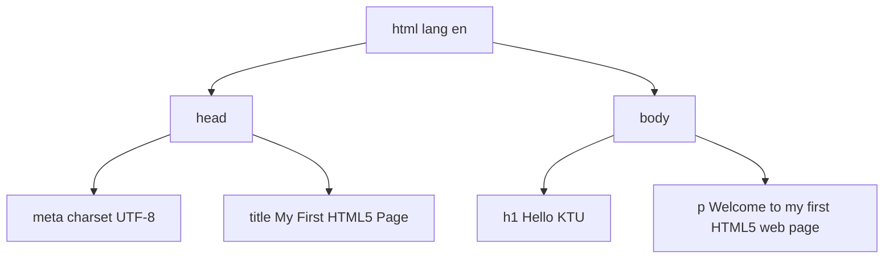

# First HTML5 example

<!-- SECTION_1_START -->
# First HTML5 Example – Core Definition & Intuitive Overview

## Formal Academic Definition (KTU 2024 Syllabus Terminology)

**HTML5** is the fifth and current major version of the **HyperText Markup Language (HTML)** standard, standardized by the **World Wide Web Consortium (W3C)** and the **Web Hypertext Application Technology Working Group (WHATWG)**. It is a markup language used to structure and present content on the World Wide Web. A *First HTML5 Example* is the minimal, valid HTML5 document that demonstrates the boilerplate skeleton every modern web page must begin with.

> [!NOTE]
> **KTU Syllabus Highlight (Module 1):**
> Students must be able to identify the structural components of a valid HTML5 document, declare the correct document type, and successfully render a "Hello World" web page in any modern browser (Chrome, Firefox, Edge).

## Conceptual Analogy / Intuition

Think of an HTML5 document like the **skeleton of a human body**:

- `<!DOCTYPE html>` is the **birth certificate** that tells the browser "this is an HTML5 document."
- `<html>` is the **entire body** (the root).
- `<head>` is the **brain** — it contains hidden metadata (title, character set, links) that nobody sees on the surface.
- `<body>` is the **face and skin** — everything the user actually sees on the screen.
- Tags like `<h1>`, `<p>`, `<title>` are **organs** performing specific functions.

Just as you cannot build a working human without first deciding "this is a skeleton," you cannot build a web page without first declaring the HTML5 doctype.

## Physical Constants / Standard Metrics

- **Standard character encoding:** **UTF-8** (recommended by W3C for all HTML5 documents).
- **Standard MIME type for HTML:** **text/html**.
- **Default file extension:** **.html** or **.htm**.
- **Doctype declaration:** case-insensitive, but conventionally written as **`<!DOCTYPE html>`**.

> [!IMPORTANT]
> The `<!DOCTYPE html>` declaration is **not an HTML tag**; it is an *instruction* to the web browser about what version of HTML the page is written in. Forgetting it forces the browser into **quirks mode**, which breaks modern layout.

## GeoGebra / Desmos Integration

> [!VISUALIZATION CONTROL]
> **Concept:** Hierarchical Tree Structure of an HTML5 Document
> **GeoGebra / Desmos Input Equations:**
> * No continuous function is required here; instead, draw a **rooted tree**:
>   - Root node: `html`
>   - Children of root: `head`, `body`
>   - Children of `head`: `meta (charset)`, `title`
>   - Children of `body`: `h1`, `p`
> **Visual Description:** A downward-branching tree with `html` at the top, two main branches (`head` and `body`), and leaf nodes representing individual tags. This is the **Document Object Model (DOM)** tree.

<!-- SECTION_1_END -->

<!-- SECTION_2_START -->
# Deep Theoretical Analysis & KTU High-Yield Reference Sheet

## Anatomy of a Minimal HTML5 Document

A valid HTML5 page consists of **three mandatory building blocks** plus the doctype declaration.

### 1. The Document Type Declaration
- Written as `<!DOCTYPE html>` on the very first line.
- Tells the browser to use **Standards Mode**.
- Has no closing tag and no attributes.

### 2. The Root Element `<html>`
- Wraps **all** other content.
- Carries the `lang` attribute (e.g., `lang="en"`) to declare the document's primary language — important for accessibility and search engines.

### 3. The Head Section `<head>`
- Contains **machine-readable information** (metadata).
- Items placed here are **not displayed** on the page body.

### 4. The Body Section `<body>`
- Contains everything **visually rendered** to the user: text, images, links, lists, tables, forms, multimedia, and scripts.

## Why These Components Exist (The "Why")

| Layer | Purpose | What Happens If Missing |
|-------|---------|--------------------------|
| `<!DOCTYPE html>` | Activates standards-compliant rendering | Browser enters quirks mode; CSS box model breaks |
| `<html lang="en">` | Accessibility & SEO | Screen readers guess the language; SEO ranking drops |
| `<meta charset="UTF-8">` | Encodes all human languages | Special characters (€, 你好) display as garbage |
| `<title>` | Browser tab text & bookmark name | Tab shows "untitled"; poor search ranking |
| `<body>` | Container for visible content | Nothing renders on the screen |

## KTU High-Yield Reference Sheet

| Component | Tag | Placement | Self-Closing? | Mandatory? |
|-----------|-----|-----------|---------------|------------|
| Doctype | `<!DOCTYPE html>` | Line 1 | No | **Yes** |
| Root | `<html lang="en">` | Wraps everything | No | **Yes** |
| Head | `<head>` | Inside `<html>` | No | **Yes** |
| Meta charset | `<meta charset="UTF-8">` | Inside `<head>` | **Yes** | Strongly recommended |
| Title | `<title>...</title>` | Inside `<head>` | No | **Yes** |
| Body | `<body>...</body>` | Inside `<html>` | No | **Yes** |
| Heading | `<h1>...</h1>` | Inside `<body>` | No | No |
| Paragraph | `<p>...</p>` | Inside `<body>` | No | No |

> [!TIP]
> **Case Sensitivity Rule:** HTML5 tags are **case-insensitive**, but the W3C and KTU evaluators expect **all lowercase** — this is the universally accepted convention.

## Real-World Utility in Engineering & Production

Every web-based system you will encounter in industry — from **GitHub** to **KTU's own student portal** — starts its frontend with this exact boilerplate. Mastering this skeleton is the prerequisite for:

- Adding **CSS3** (styling).
- Embedding **JavaScript** (logic).
- Integrating **frameworks** like React, Angular, and Vue.
- Building **Progressive Web Apps (PWAs)** and responsive mobile-first designs.

<!-- SECTION_2_END -->

<!-- SECTION_3_START -->
# Step-by-Step Implementation of the First HTML5 Example

## Exhaustive Build — "Hello KTU" Page

Below is the **complete, line-by-line construction** of the canonical first HTML5 example. Every line is intentional; every line is explained.

### Step 1: Open a Text Editor
Use any plain-text editor: **Notepad (Windows)**, **TextEdit (macOS)**, or a code editor such as **VS Code**, **Sublime Text**, or **Atom**. *Never* use Microsoft Word — it injects hidden formatting.

### Step 2: Write the Doctype Declaration
The very first line **must** be the HTML5 doctype. No spaces, no HTML tags around it.

```html
<!DOCTYPE html>
```

### Step 3: Open the Root HTML Element with Language Attribute
Immediately after the doctype, open the `<html>` tag and specify the language. This is required for **accessibility (WCAG 2.1 compliance)**.

```html
<!DOCTYPE html>
<html lang="en">
```

### Step 4: Open the Head Section
The `<head>` element holds metadata.

```html
<!DOCTYPE html>
<html lang="en">
<head>
```

### Step 5: Add the Character Encoding Meta Tag
Place the UTF-8 charset declaration **as the first child of `<head>`** to ensure all bytes are interpreted correctly before any title or style is parsed.

```html
<!DOCTYPE html>
<html lang="en">
<head>
    <meta charset="UTF-8">
```

### Step 6: Add the Page Title
The `<title>` content appears in the browser tab and in search engine results.

```html
<!DOCTYPE html>
<html lang="en">
<head>
    <meta charset="UTF-8">
    <title>My First HTML5 Page</title>
</head>
```

### Step 7: Open the Body Section
Everything visible to the user goes inside `<body>`.

```html
<!DOCTYPE html>
<html lang="en">
<head>
    <meta charset="UTF-8">
    <title>My First HTML5 Page</title>
</head>
<body>
```

### Step 8: Add Visible Content
Use a top-level heading `<h1>` and a paragraph `<p>`.

```html
<!DOCTYPE html>
<html lang="en">
<head>
    <meta charset="UTF-8">
    <title>My First HTML5 Page</title>
</head>
<body>
    <h1>Hello KTU!</h1>
    <p>Welcome to my first HTML5 web page.</p>
</body>
</html>
```

### Step 9: Save the File
Save the file as **`first.html`** (or `index.html`) in a folder you can locate, e.g., `C:\KTU\WebProgramming\first.html` or `~/ktu/web/first.html`.

### Step 10: View in Browser
Double-click the saved file. It opens in your default browser. You should see:

- A large heading: **Hello KTU!**
- A paragraph below: **Welcome to my first HTML5 web page.**
- Browser tab title: **My First HTML5 Page**

## Symbolic / Algorithmic Equivalent (Python Analogy)

To make the structural concept crystal-clear for students coming from a programming background, here is a Python representation of the same nested document structure:

```python
from typing import Dict, List, Any

class HTMLNode:
    def __init__(self, tag: str, text: str = "", attrs: Dict[str, str] | None = None) -> None:
        self.tag: str = tag
        self.text: str = text
        self.attrs: Dict[str, str] = attrs if attrs is not None else {}
        self.children: List[HTMLNode] = []

    def add_child(self, child: "HTMLNode") -> None:
        self.children.append(child)

    def render(self, indent: int = 0) -> str:
        if not self.children and not self.text:
            return ""
        space: str = "  " * indent
        attr_str: str = "".join(f' {k}="{v}"' for k, v in self.attrs.items())
        opening: str = f"{space}<{self.tag}{attr_str}>"
        if not self.children and self.text:
            return f"{opening}{self.text}</{self.tag}>"
        body: str = "\n" + "\n".join(c.render(indent + 1) for c in self.children) + "\n" + space
        return f"{opening}{body}</{self.tag}>"


def build_first_html5_page() -> HTMLNode:
    root: HTMLNode = HTMLNode("html", attrs={"lang": "en"})
    head: HTMLNode = HTMLNode("head")
    head.add_child(HTMLNode("meta", attrs={"charset": "UTF-8"}))
    head.add_child(HTMLNode("title", text="My First HTML5 Page"))

    body: HTMLNode = HTMLNode("body")
    body.add_child(HTMLNode("h1", text="Hello KTU!"))
    body.add_child(HTMLNode("p", text="Welcome to my first HTML5 web page."))

    root.add_child(head)
    root.add_child(body)
    return root


if __name__ == "__main__":
    doctype: str = "<!DOCTYPE html>\n"
    document: HTMLNode = build_first_html5_page()
    print(doctype + document.render())
```

> **Expected Output:**
>
> ```html
> <!DOCTYPE html>
> <html lang="en">
>   <head>
>     <meta charset="UTF-8">
>     <title>My First HTML5 Page</title>
>   </head>
>   <body>
>     <h1>Hello KTU!</h1>
>     <p>Welcome to my first HTML5 web page.</p>
>   </body>
> </html>
> ```

<!-- SECTION_3_END -->

<!-- SECTION_4_START -->
# Structural Diagrams & Schematics

## 4.1 Hierarchical DOM Tree (Mermaid)



**How to read this diagram:**
- **A** is the root (`<html>`).
- **B** and **C** are its only two direct children (`<head>` and `<body>`).
- **D**, **E** are leaf nodes inside `<head>`.
- **F**, **G** are leaf nodes inside `<body>` (the visible content).

## 4.2 Sequential Build Pipeline (Mermaid Flowchart)

```mermaid
flowchart LR
    step1["Step 1 Open Text Editor"] --> step2["Step 2 Write DOCTYPE"]
    step2 --> step3["Step 3 Open html tag with lang"]
    step3 --> step4["Step 4 Open head section"]
    step4 --> step5["Step 5 Add meta charset UTF-8"]
    step5 --> step6["Step 6 Add title tag"]
    step6 --> step7["Step 7 Close head, open body"]
    step7 --> step8["Step 8 Add h1 and p tags"]
    step8 --> step9["Step 9 Close body and html"]
    step9 --> step10["Step 10 Save as .html file"]
    step10 --> step11["Step 11 Open in browser"]
    step11 --> step12["Step 12 Verify rendering"]
```



## 4.3 Browser Parsing Topology (Block-Level Architecture)

| Stage | Component | Input | Output | Failure Mode |
|-------|-----------|-------|--------|--------------|
| 1 | Doctype Parser | `<!DOCTYPE html>` | Standards Mode flag | Quirks mode activated |
| 2 | Tokenizer | Raw HTML bytes | HTML tokens (start-tag, end-tag, text) | Unrecognized tokens ignored |
| 3 | Tree Builder | Tokens | DOM tree | Malformed nesting reparented |
| 4 | CSS Engine | Linked stylesheets + inline styles | Computed styles | Unstyled content flash |
| 5 | Layout (Reflow) | DOM + styles | Pixel coordinates | Slow on large pages |
| 6 | Paint | Layout output | Bitmap layers | GPU memory overflow |
| 7 | Composite | Layers | Final screen image | Z-index conflicts |

<!-- SECTION_4_END -->

<!-- SECTION_5_START -->
# KTU 2024 Scheme Examination Question Bank & Topic Recap

## Part A — Short Answer Questions (3 Marks Each)

### Question 1 `[KTU University Exam – July 2024]`
**State the purpose of the `<!DOCTYPE html>` declaration in an HTML5 document.** **(CO1, Remember)**

**Model Answer (3 Marks):**
The `<!DOCTYPE html>` declaration is the very first line of an HTML5 document. It is **not a tag** but an instruction to the web browser informing it that the page follows the **HTML5 standard**. Its primary purposes are: **(1)** to instruct the browser to render the page in **standards mode** (rather than quirks mode), and **(2)** to ensure consistent layout, CSS box model behavior, and JavaScript execution across all modern browsers. **[1 Mark for definition, 1 Mark for standards mode, 1 Mark for cross-browser consistency]**

### Question 2 `[KTU University Exam – Dec 2023]`
**List any four mandatory components of a valid HTML5 document.** **(CO1, Understand)**

**Model Answer (3 Marks):**
The four mandatory components are:
1. `<!DOCTYPE html>` — doctype declaration.
2. `<html lang="en">` — root element with language attribute.
3. `<head>` — section for metadata.
4. `<body>` — section for visible content.

**[½ Mark × 4 = 2 Marks for listing, 1 Mark for correct grouping into head/body]**

---

## Part B — Full 14-Mark Questions (Module Internal Choice)

### Question A `[KTU University Exam – July 2024]`

**(a)** Explain the structural anatomy of a minimal HTML5 document with a neat diagram. **(7 Marks)** **(CO1, Understand)**

**(b)** Write the complete HTML5 code for a "Hello KTU" web page that displays a top-level heading and a short paragraph, and explain each line. **(7 Marks)** **(CO1, Apply)**

#### Model Solution

**Part (a) — 7 Marks**

The minimal HTML5 document anatomy is shown in the table below:

| S.No. | Section | Tag | Purpose | Marks |
|-------|---------|-----|---------|-------|
| 1 | Doctype | `<!DOCTYPE html>` | Activates standards mode | **1 Mark** |
| 2 | Root | `<html lang="en">` | Wraps all content; declares language | **1 Mark** |
| 3 | Head | `<head>...</head>` | Holds metadata (charset, title) | **1 Mark** |
| 4 | Meta | `<meta charset="UTF-8">` | Sets character encoding | **1 Mark** |
| 5 | Title | `<title>...</title>` | Browser tab text | **1 Mark** |
| 6 | Body | `<body>...</body>` | Contains visible content | **1 Mark** |
| 7 | Diagram | (Tree structure) | Visual representation of nesting | **1 Mark** |

**Part (b) — 7 Marks**

```html
<!DOCTYPE html>
<html lang="en">
<head>
    <meta charset="UTF-8">
    <title>Hello KTU</title>
</head>
<body>
    <h1>Hello KTU!</h1>
    <p>This is my first HTML5 web page.</p>
</body>
</html>
```

**Line-by-line explanation:**

- **Line 1:** `<!DOCTYPE html>` — Doctype declaration; switches browser to standards mode. **[1 Mark]**
- **Line 2:** `<html lang="en">` — Opens the root element; specifies English as the document language. **[1 Mark]**
- **Line 3:** `<head>` — Opens the metadata section. **[½ Mark]**
- **Line 4:** `<meta charset="UTF-8">` — Declares UTF-8 encoding for universal character support. **[1 Mark]**
- **Line 5:** `<title>Hello KTU</title>` — Sets the page title shown on the browser tab. **[½ Mark]**
- **Line 6:** `</head>` — Closes the head section. **[½ Mark]**
- **Line 7:** `<body>` — Opens the visible content section. **[½ Mark]**
- **Line 8:** `<h1>Hello KTU!</h1>` — Displays a top-level heading. **[1 Mark]**
- **Line 9:** `<p>This is my first HTML5 web page.</p>` — Displays a paragraph. **[1 Mark]**
- **Lines 10-11:** `</body></html>` — Closes the body and root. **[½ Mark]**

### Question B (Alternative Choice) `[KTU University Exam – Dec 2023]`

**(a)** Differentiate between the `<head>` and `<body>` sections of an HTML5 document. **(7 Marks)** **(CO1, Understand)**

**(b)** Create an HTML5 page titled "KTU Web Programming" that includes a meta description and a visible welcome message. **(7 Marks)** **(CO1, Apply)**

#### Model Solution

**Part (a) — 7 Marks**

| Feature | `<head>` | `<body>` | Marks |
|---------|----------|----------|-------|
| Visibility | Content is **not visible** to user | Content is **visible** on the page | **1 Mark** |
| Purpose | Holds **metadata** about the document | Holds **actual content** of the page | **1 Mark** |
| Common children | `<meta>`, `<title>`, `<link>`, `<style>`, `<script>` | `<h1>`–`<h6>`, `<p>`, `<div>`, ``, `<a>` | **1 Mark** |
| Position | Appears **before** `<body>` | Appears **after** `<head>` | **½ Mark** |
| Render effect | Affects tab title, SEO, encoding | Affects what user sees on screen | **1 Mark** |
| Number per page | Exactly **one** | Exactly **one** | **½ Mark** |
| Example content | `<title>Home</title>` | `<h1>Welcome</h1>` | **2 Marks** |

**Part (b) — 7 Marks**

```html
<!DOCTYPE html>
<html lang="en">
<head>
    <meta charset="UTF-8">
    <meta name="description" content="First HTML5 example for KTU Web Programming">
    <title>KTU Web Programming</title>
</head>
<body>
    <h1>Welcome to KTU Web Programming</h1>
    <p>This page is created as part of Module 1 assignment.</p>
</body>
</html>
```

**Valuation Key Points:**

- **Doctype on line 1:** **[1 Mark]**
- **`<html lang="en">` root with language:** **[1 Mark]**
- **Meta charset UTF-8:** **[1 Mark]**
- **Meta description tag (unique to this question):** **[1 Mark]**
- **Title "KTU Web Programming":** **[1 Mark]**
- **Body with h1 and p:** **[1 Mark]**
- **Proper closing tags and indentation:** **[1 Mark]**

> [!WARNING]
> **KTU Examiner's Valuation Pitfall Callout:**
>
> 1. **Missing doctype** → Lose **1 full mark** immediately. Many students begin with `<html>` directly — this is a recurring error.
> 2. **Title placed inside `<body>`** → Lose **1 mark**; title must be inside `<head>`, not `<body>`.
> 3. **Forgetting `</html>` closing tag** → Lose **½ mark**; always close every container.
> 4. **Using uppercase tags like `<HTML>` or `<BODY>`** → Lose **½ mark**; KTU expects lowercase convention.
> 5. **Omitting `lang` attribute** → Lose **½ mark**; it is mandatory in modern accessibility-aware HTML5.

---

## Topic Recap & Important Things to Remember

- **First line of any HTML5 file must be `<!DOCTYPE html>`** — no exceptions, no spaces before it.
- **Every valid HTML5 page has exactly one `<html>`, one `<head>`, and one `<body>`** element.
- **The `<head>` contains metadata only** — charset, title, description, links to CSS/JS, and meta tags.
- **The `<body>` contains all visible content** — headings, paragraphs, images, links, tables, forms, scripts, and multimedia.
- **UTF-8 character encoding is the universal standard** — always declare it as the first child of `<head>`.
- **HTML5 tags are case-insensitive but conventionally lowercase** — KTU evaluators expect lowercase.
- **The `lang` attribute on `<html>` is mandatory for accessibility** — use `lang="en"` for English.
- **The doctype is NOT a tag** — it is a declaration; it has no closing slash.
- **File extension must be `.html` or `.htm`** — otherwise the browser will not render it as HTML.
- **Always save the file before refreshing the browser** — browsers cache pages; hard-refresh with `Ctrl + F5` (Windows) or `Cmd + Shift + R` (macOS) to see updates.
- **Whitespace and indentation do not affect rendering** — they only affect human readability.
- **Comments in HTML use `<!-- comment text -->`** — they are ignored by the browser.
- **The DOM (Document Object Model)** represents the HTML page as a tree where every tag is a node — `<html>` is the root.
<!-- SECTION_5_END -->
