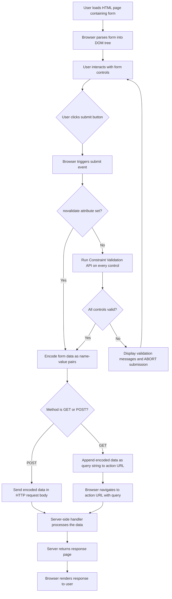
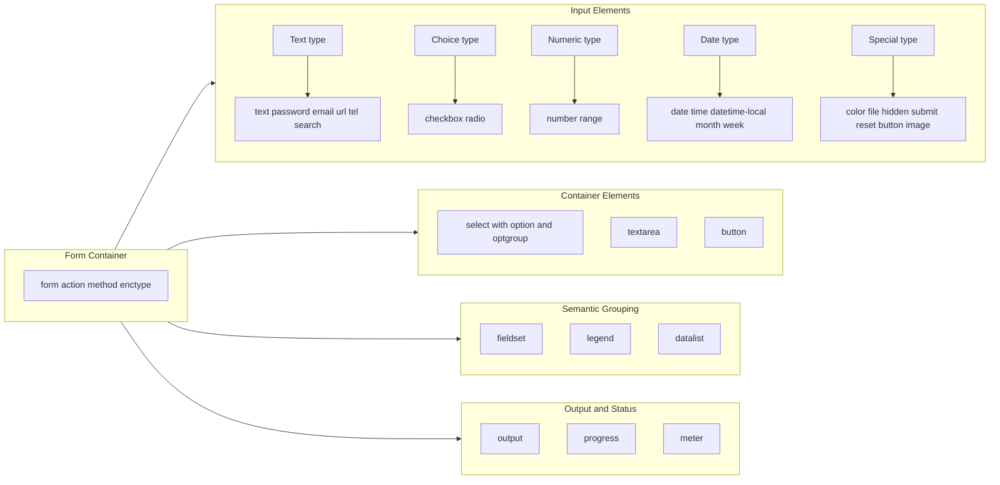
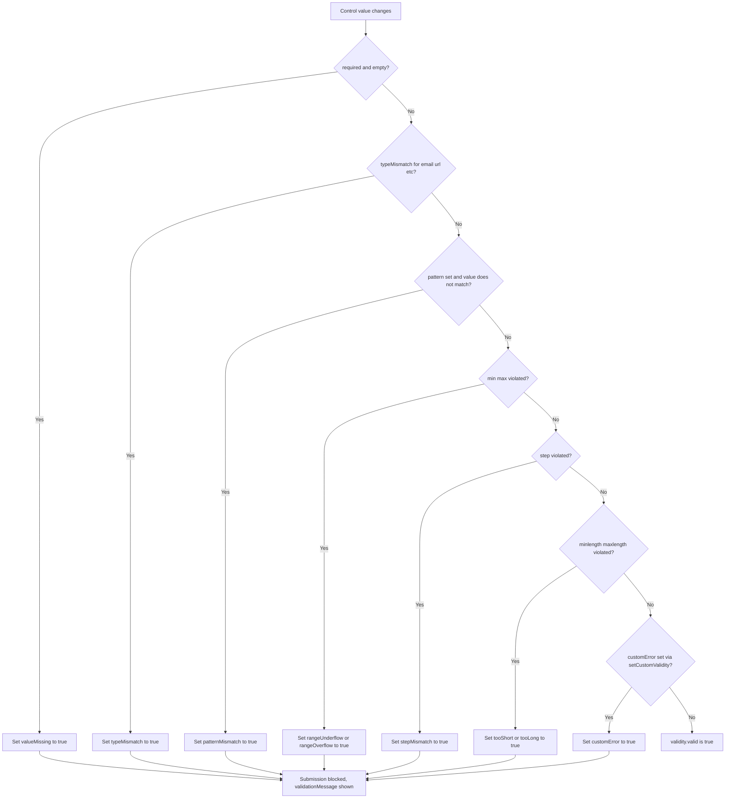
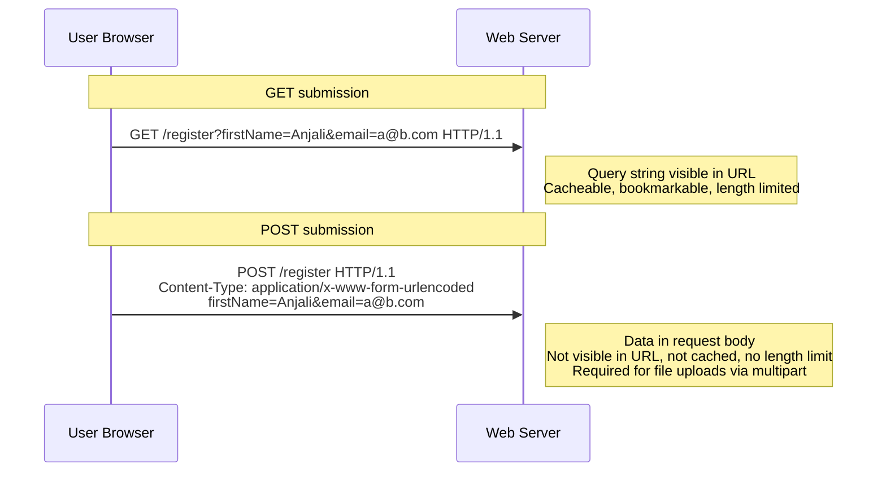

# Forms

<!-- SECTION_1_START -->
# HTML5 Forms — Core Technical Definition & Intuitive Overview

## Formal Academic Definition (KTU 2024 Syllabus Terminology)

An **HTML5 Form** is a structured interactive section of a web document that is used to collect user input data and transmit it to a web server for processing. It is defined using the `<form>` element which acts as a container for a collection of interactive widgets (called *form controls* or *form elements*) such as text fields, checkboxes, radio buttons, select menus, buttons, and specialised data input fields. The data is packaged as a series of *name-value pairs* and dispatched using HTTP methods (typically `GET` or `POST`).

In the **KTU 2024 Scheme (OECST832 — Web Programming)** curriculum, HTML5 forms are studied under the evolution of the standard form specification, focusing on:
- The native validation model (constraint validation API)
- The semantic enrichment of form controls
- New input types such as `email`, `url`, `date`, `number`, `range`, `color`, `search`, `tel`
- New attributes such as `required`, `placeholder`, `pattern`, `min`, `max`, `step`, `autofocus`, `autocomplete`, `form`, `formaction`, `formmethod`, `formenctype`, `formnovalidate`, `formtarget`, `list`, `multiple`, `readonly`, `disabled`

> [!IMPORTANT]
> **KTU 2024 Highlight:** Unlike HTML 4.01, HTML5 forms are **constraint-validated by the browser natively** — no JavaScript is required for routine validation. This is a high-yield board exam topic.

## Conceptual Analogy / Intuition

> [!NOTE]
> **Think of an HTML form as a printed application form at a government counter.** A printed form has labelled blanks (form fields) where you write your name, date of birth, etc. Each blank has a *label* telling you what to write, a *box* to write inside, and a *submit button* at the bottom that sends it to the clerk. HTML5 forms work identically — labels tell the user what to enter, input fields accept the data, and a submit button dispatches it to a server (the clerk). HTML5 added "smart boxes" — boxes that only accept a number, only a date, or a properly formatted email — so the clerk (server) receives clean data and does not have to scrub through garbage.

## Physical Constants & Standard Metrics

- The default **HTTP request method** for a form is **GET**.
- The default **enctype** for a form is **`application/x-www-form-urlencoded`**.
- The default **character encoding** of the submitted form data is **UTF-8** (HTML5 default).
- The standard MIME type for file uploads via form is **`multipart/form-data`**.

## Visual Representation of a Form's Logical Role

> [!VISUALIZATION CONTROL]
> **Concept:** Form as a Pipeline from User to Server
> **GeoGebra / Desmos Input Equations:** Not applicable (this is an architectural concept, not a graph)
> **Visual Description:** Visualise a form as a one-way pipeline — the **User** on the left types data into **Input Controls (a)** in the middle, the **Browser Validation Engine (b)** applies constraint rules, and the validated data exits on the right to the **Web Server (c)** for backend processing.

---

<!-- SECTION_1_END -->

<!-- SECTION_2_START -->
# Deep Theoretical Analysis & KTU High-Yield Formula Sheet

## The `<form>` Element — Structural Foundation

The `<form>` element is the root container that defines a *form-associated* region. It carries the following primary attributes:

| Attribute | Purpose | Allowed Values | Default |
|---|---|---|---|
| `action` | URL of the server-side handler that receives the data | Any valid URL | Current page URL |
| `method` | HTTP method used to submit data | `get`, `post` | `get` |
| `enctype` | MIME type encoding for submitted data | `application/x-www-form-urlencoded`, `multipart/form-data`, `text/plain` | `application/x-www-form-urlencoded` |
| `target` | Where to display the response | `_self`, `_blank`, `_parent`, `_top`, *framename* | `_self` |
| `name` | Form's name (for older DOM access) | String | None |
| `autocomplete` | Browser autofill behaviour | `on`, `off` | `on` |
| `novalidate` | Disables native validation | Boolean attribute | Disabled |

## HTML5 Form Elements — Exhaustive Inventory

### 1. `<input>` — The Universal Input Field (KTU Highest Yield)

The `<input>` element is a **void element** (no closing tag). Its behaviour changes dramatically based on the `type` attribute. The following table is the KTU board-favourite reference:

| `type` Value | Visual Behaviour | Data Format Expected | Validation Rules |
|---|---|---|---|
| `text` | Single-line textbox | Any characters (no newline) | None native |
| `password` | Obscured single-line textbox | Any characters | None native |
| `email` | Textbox with email keyboard hint on mobile | RFC 5322 compatible email | Must match email pattern; multiple allowed with `multiple` attribute |
| `url` | Textbox with URL keyboard hint | A valid URL (with scheme) | Must include a scheme like `http://` |
| `tel` | Textbox with telephone keyboard hint | Telephone number | None native (use `pattern`) |
| `search` | Textbox with a clear "X" button | Search query | None native |
| `number` | Textbox with spinner buttons | Numeric value | `min`, `max`, `step` enforced |
| `range` | Slider control | Numeric value in range | `min`, `max`, `step` enforced |
| `date` | Date picker (calendar) | `YYYY-MM-DD` | Valid date; `min` / `max` enforced |
| `time` | Time picker | `HH:MM` or `HH:MM:SS` | Valid time |
| `datetime-local` | Date + time picker, no timezone | `YYYY-MM-DDTHH:MM` | Valid local datetime |
| `month` | Month picker | `YYYY-MM` | Valid year-month |
| `week` | Week picker | `YYYY-Www` | Valid ISO week |
| `color` | Colour picker | Hex like `#ff0000` | Must be 7-character hex |
| `checkbox` | Tickable square | Boolean (`on` / `off`) | None native |
| `radio` | Single-choice from a group | Single value | Exactly one if `required` |
| `file` | File browser | One or more file paths | `accept` MIME types |
| `submit` | Submit button | None | Triggers form submission |
| `reset` | Reset button | None | Resets all controls |
| `button` | Generic clickable button | None | None |
| `image` | Image as submit button | None | Triggers submission with `x`,`y` |
| `hidden` | Invisible data carrier | Any | None |

### 2. `<label>` — Accessibility Anchor

The `<label>` element binds a text description to a control using the `for` attribute (which references the control's `id`). Clicking a label focuses its associated control — this is critical for accessibility (WCAG compliance).

### 3. `<select>` — Dropdown List

Creates a drop-down list of options defined by nested `<option>` elements. Key attributes:
- `multiple` — allows multiple selections
- `size` — number of visible options
- `<optgroup label="...">` — groups options

### 4. `<textarea>` — Multi-line Text Input

A multi-line plain-text editing control. Important attributes:
- `rows` — visible height in lines
- `cols` — visible width in average characters
- `wrap` — `soft` (default) or `hard`

### 5. `<button>` — Clickable Control

More flexible than `<input type="button">` because it can contain HTML content (text, images). Types: `submit`, `reset`, `button`.

### 6. `<fieldset>` and `<legend>` — Semantic Grouping

`<fieldset>` groups related form controls; `<legend>` provides a caption for the group, often rendered as a border around the group.

### 7. `<datalist>` — Autocomplete Suggestion Source

Provides a list of predefined options for an `<input>` element. The input references it via the `list` attribute. Unlike `<select>`, the user can still type a custom value.

### 8. `<output>` — Computation Result Display

Represents the result of a calculation or user action (e.g., a slider's current value being summed and displayed live).

### 9. `<progress>` and `<meter>` — Status Indicators

- `<progress>` — task completion progress (0 to max)
- `<meter>` — scalar measurement within a known range (e.g., disk usage)

## HTML5 Form Attributes — Comprehensive Cheat Sheet

| Attribute | Applies To | Function | KTU Importance |
|---|---|---|---|
| `name` | All controls | Key in the name-value pair sent to server | **Critical** |
| `value` | Most controls | Default / submitted value | **Critical** |
| `id` | All controls | Unique DOM identifier for CSS / JS / label | **Critical** |
| `required` | Most input types | Field must be filled before submission | **High** |
| `placeholder` | Text-type inputs | Hint shown when empty | High |
| `pattern` | Text-type inputs | Regex the value must match | **High** |
| `min` / `max` | Numeric / date inputs | Lower / upper bound | High |
| `step` | Numeric / date inputs | Allowed increments | Medium |
| `maxlength` | Text-type inputs | Maximum character count | Medium |
| `minlength` | Text-type inputs | Minimum character count (HTML5) | Medium |
| `readonly` | Form controls | Value cannot be edited but is submitted | Medium |
| `disabled` | Form controls | Cannot be edited and is NOT submitted | Medium |
| `autofocus` | Form controls | Auto-focuses on page load | Medium |
| `autocomplete` | Text-type inputs | Browser autofill: `on` / `off` | Medium |
| `form` | Controls outside a `<form>` | Associates an orphaned control with a form | Low |
| `formaction` | submit / image | Overrides form's `action` | Low |
| `formmethod` | submit / image | Overrides form's `method` | Low |
| `formenctype` | submit / image | Overrides form's `enctype` | Low |
| `formnovalidate` | submit / image | Bypasses validation on this button | Low |
| `formtarget` | submit / image | Overrides form's `target` | Low |
| `list` | Text-type inputs | References a `<datalist>` by id | Medium |
| `multiple` | email / file / select | Allows multiple values | Medium |
| `accept` | file | Comma-separated MIME types or extensions | Low |
| `checked` | radio / checkbox | Pre-selected on page load | Medium |
| `selected` | option | Pre-selected in select | Medium |
| `size` | select / input | Visible width or option count | Low |
| `rows` / `cols` | textarea | Visible dimensions | Low |
| `wrap` | textarea | Line-wrap behaviour | Low |
| `step` | number / date | Granularity of valid values | Low |
| `novalidate` | form | Disables form-wide validation | Medium |

## The Constraint Validation API (HTML5)

The browser performs *constraint validation* before submission when a form lacks `novalidate`. Each form control exposes these DOM properties:

| Property | Type | Meaning |
|---|---|---|
| `validity.valid` | Boolean | `true` if the value satisfies all constraints |
| `validity.valueMissing` | Boolean | `true` if `required` and the value is empty |
| `validity.typeMismatch` | Boolean | `true` if the value does not match the type's expected format |
| `validity.patternMismatch` | Boolean | `true` if the value does not match the `pattern` regex |
| `validity.tooShort` | Boolean | `true` if below `minlength` |
| `validity.tooLong` | Boolean | `true` if above `maxlength` |
| `validity.rangeUnderflow` | Boolean | `true` if below `min` |
| `validity.rangeOverflow` | Boolean | `true` if above `max` |
| `validity.stepMismatch` | Boolean | `true` if the value does not match the `step` granularity |
| `validity.badInput` | Boolean | `true` if the browser cannot convert the input |
| `validity.customError` | Boolean | `true` if `setCustomValidity()` was called |
| `validationMessage` | String | Localised message describing why the value is invalid |
| `willValidate` | Boolean | `true` if the element will be validated |

DOM methods:
- `checkValidity()` — returns `true` / `false` for a single control
- `reportValidity()` — same as above but also shows the UI hint
- `setCustomValidity(message)` — flags the control as invalid with a custom message
- `form.checkValidity()` — validates the whole form
- `form.reportValidity()` — validates and displays UI for the whole form

## Real-World Engineering Utility

HTML5 forms are the **primary data ingestion layer of the modern web**. They power:
- **E-commerce checkouts** (Stripe, Amazon) — rely on `<input type="number">` and `pattern` for card numbers
- **Authentication systems** (login, OTP) — `email` and `password` types with `required`
- **Booking systems** (airlines, hotels) — `date`, `time`, `number` with `min` / `max` constraints
- **Surveys and analytics dashboards** — radio, checkbox, select, textarea combinations
- **Search interfaces** — `search` input with `datalist` autocomplete
- **Government e-forms** — file uploads via `multipart/form-data`

The HTML5 native validation model reduces **JavaScript code by 30-50%** in typical form implementations and provides **accessibility and mobile-keyboard hints for free** — a major engineering advantage over HTML 4.01.

---

<!-- SECTION_2_END -->

<!-- SECTION_3_START -->
# Step-by-Step Code & Symbolic Implementation

## Complete Production-Grade HTML5 Form

Below is a fully working, accessibility-compliant HTML5 form demonstrating every key KTU-asked element, attribute, and pattern.

```html
<!DOCTYPE html>
<html lang="en">
<head>
    <meta charset="UTF-8">
    <meta name="viewport" content="width=device-width, initial-scale=1.0">
    <title>KTU Student Registration Form</title>
    <style>
        body { font-family: 'Segoe UI', sans-serif; max-width: 720px; margin: 2rem auto; padding: 1rem; background: #f4f6f9; }
        fieldset { border: 2px solid #2c5aa0; border-radius: 8px; padding: 1.2rem; margin-bottom: 1.2rem; background: #fff; }
        legend { font-weight: bold; color: #2c5aa0; padding: 0 0.4rem; }
        label { display: block; margin-top: 0.8rem; font-weight: 600; }
        input, select, textarea, button { width: 100%; padding: 0.6rem; margin-top: 0.3rem; box-sizing: border-box; border: 1px solid #ccc; border-radius: 4px; font-size: 1rem; }
        input:focus, select:focus, textarea:focus { outline: 2px solid #2c5aa0; border-color: #2c5aa0; }
        input:invalid { border-color: #d33; background: #fff5f5; }
        input:valid { border-color: #2a9d2a; }
        .row { display: flex; gap: 1rem; }
        .row > * { flex: 1; }
        .btn-group { display: flex; gap: 1rem; margin-top: 1rem; }
        button { background: #2c5aa0; color: #fff; border: none; cursor: pointer; font-weight: 600; }
        button[type="reset"] { background: #888; }
        output { display: block; margin-top: 0.5rem; font-weight: bold; color: #2a9d2a; }
    </style>
</head>
<body>

<h1>KTU B.Tech Registration</h1>

<form id="regForm" action="/register" method="post" enctype="multipart/form-data" autocomplete="on" novalidate>
    
    <!-- FIELD SET 1: Personal Information -->
    <fieldset>
        <legend>Personal Information</legend>
        
        <div class="row">
            <div>
                <label for="fname">First Name *</label>
                <input type="text" id="fname" name="firstName" required minlength="2" maxlength="50" 
                       pattern="[A-Za-z]+" placeholder="e.g., Anjali" autofocus>
            </div>
            <div>
                <label for="lname">Last Name *</label>
                <input type="text" id="lname" name="lastName" required minlength="1" maxlength="50" 
                       pattern="[A-Za-z]+" placeholder="e.g., Menon">
            </div>
        </div>
        
        <label for="email">Email Address *</label>
        <input type="email" id="email" name="email" required multiple placeholder="you@ktu.ac.in">
        
        <label for="phone">Phone Number *</label>
        <input type="tel" id="phone" name="phone" required pattern="[0-9]{10}" 
               placeholder="10-digit mobile number">
        
        <label for="dob">Date of Birth *</label>
        <input type="date" id="dob" name="dob" required min="1980-01-01" max="2010-12-31">
    </fieldset>
    
    <!-- FIELD SET 2: Academic Details -->
    <fieldset>
        <legend>Academic Details</legend>
        
        <label for="branch">Branch *</label>
        <select id="branch" name="branch" required>
            <option value="">-- Select Branch --</option>
            <optgroup label="Engineering">
                <option value="cse">Computer Science</option>
                <option value="ece">Electronics & Communication</option>
                <option value="eee">Electrical & Electronics</option>
                <option value="mech">Mechanical</option>
            </optgroup>
            <option value="civil">Civil</option>
        </select>
        
        <label for="semester">Current Semester</label>
        <input type="number" id="semester" name="semester" min="1" max="8" step="1" value="1">
        
        <label for="cgpa">CGPA (0.00 – 10.00)</label>
        <input type="range" id="cgpa" name="cgpa" min="0" max="10" step="0.01" value="7.5" 
               oninput="cgpaOut.value = parseFloat(cgpa.value).toFixed(2)">
        <output name="cgpaOut" for="cgpa">7.50</output>
        
        <label>Gender *</label>
        <div>
            <input type="radio" id="m" name="gender" value="male" required>
            <label for="m" style="display:inline">Male</label>
            
            <input type="radio" id="f" name="gender" value="female">
            <label for="f" style="display:inline">Female</label>
            
            <input type="radio" id="o" name="gender" value="other">
            <label for="o" style="display:inline">Other</label>
        </div>
    </fieldset>
    
    <!-- FIELD SET 3: Skills and Interests -->
    <fieldset>
        <legend>Skills & Interests</legend>
        
        <label>Programming Languages Known (tick all that apply)</label>
        <div>
            <input type="checkbox" id="c1" name="lang" value="C">
            <label for="c1" style="display:inline">C</label>
            
            <input type="checkbox" id="c2" name="lang" value="Java">
            <label for="c2" style="display:inline">Java</label>
            
            <input type="checkbox" id="c3" name="lang" value="Python">
            <label for="c3" style="display:inline">Python</label>
            
            <input type="checkbox" id="c4" name="lang" value="JS">
            <label for="c4" style="display:inline">JavaScript</label>
        </div>
        
        <label for="college">Favourite IDE (with datalist autocomplete)</label>
        <input type="text" id="college" name="ide" list="ide-list" placeholder="Start typing...">
        <datalist id="ide-list">
            <option value="VS Code">
            <option value="IntelliJ IDEA">
            <option value="PyCharm">
            <option value="Eclipse">
            <option value="Sublime Text">
        </datalist>
        
        <label for="address">Permanent Address</label>
        <textarea id="address" name="address" rows="4" cols="40" 
                  placeholder="House, Street, City, State, PIN"></textarea>
        
        <label for="favcolor">Favourite Colour</label>
        <input type="color" id="favcolor" name="favcolor" value="#2c5aa0">
        
        <label for="resume">Upload Resume (PDF, max 2MB)</label>
        <input type="file" id="resume" name="resume" accept=".pdf,application/pdf" required>
    </fieldset>
    
    <!-- Hidden Field for CSRF / Tracking -->
    <input type="hidden" name="csrf_token" value="abc123xyz789">
    
    <!-- Button Group -->
    <div class="btn-group">
        <button type="submit">Register</button>
        <button type="reset">Clear Form</button>
        <button type="button" onclick="alert('Help: Fill all required * fields')">Help</button>
    </div>
</form>

</body>
</html>
```

## Exhaustive Walkthrough — Why Each Line Matters

| Line / Block | Why It Is There (Engineering Rationale) |
|---|---|
| `<form action="/register" method="post" enctype="multipart/form-data">` | Posts the data securely to the server endpoint `/register`; the multipart enctype is **mandatory** because the form contains a file upload. |
| `required minlength="2" pattern="[A-Za-z]+"` | The combination enforces: field cannot be empty, must be at least 2 characters, must be pure letters — a *defence-in-depth* validation strategy. |
| `type="email" multiple` | The browser validates the email pattern; `multiple` allows comma-separated values (e.g., `a@x.com, b@y.com`). |
| `type="tel" pattern="[0-9]{10}"` | The `tel` type is a mobile-keyboard hint, and the `pattern` enforces 10 digits — **the browser cannot validate phone formats natively**. |
| `type="date" min="1980-01-01" max="2010-12-31"` | Native calendar widget + age-bound enforcement — no JS calendar library needed. |
| `<select>` with `<optgroup>` | Groups related options visually, useful for long lists. |
| `type="number" min="1" max="8" step="1"` | Spinner controls appear; non-integer or out-of-range values are rejected. |
| `type="range"` with `<output>` | Live value display as the slider moves — done via the `oninput` event in pure HTML. |
| `type="radio" required` | Without `required`, a user could submit the form without choosing a gender; with it, the browser blocks submission. |
| `<datalist>` + `list` attribute | Provides a *suggestion* (not a restriction) — users can still type a custom value, unlike `<select>`. |
| `<textarea rows="4" cols="40">` | Fixed visible dimensions; the user can scroll beyond them. |
| `type="color"` | Native colour picker — zero JavaScript. |
| `type="file" accept=".pdf,application/pdf"` | The OS file dialog opens filtered to PDFs only. |
| `<input type="hidden">` | Carries a CSRF token invisibly — critical for security in production. |
| `button[type="submit|reset|button"]` | The three semantic types. The "Help" button has `type="button"` to prevent it from accidentally submitting the form. |
| `input:invalid` and `input:valid` CSS | The browser adds a `:valid` or `:invalid` pseudo-class automatically based on constraint validation — a beautiful CSS-only feedback mechanism. |

## Constraint Validation — Pure JavaScript Example

```javascript
// Attach a listener to the form
const form = document.getElementById('regForm');

form.addEventListener('submit', function(event) {
    // Run the browser's native validation programmatically
    if (!form.checkValidity()) {
        event.preventDefault(); // STOP submission
        
        // Iterate through all controls and report first failure
        for (const element of form.elements) {
            if (!element.checkValidity()) {
                const msg = element.validationMessage;
                console.error(`Invalid: ${element.name} -> ${msg}`);
                element.reportValidity(); // shows the browser's bubble
                break;
            }
        }
        return;
    }
    // If valid, the form submits naturally
    console.log('Form is valid, submitting...');
});

// Real-time live range display
const cgpa = document.getElementById('cgpa');
const cgpaOut = document.querySelector('output[name="cgpaOut"]');
cgpa.addEventListener('input', () => {
    cgpaOut.textContent = parseFloat(cgpa.value).toFixed(2);
});
```

This script demonstrates the full **Constraint Validation API** as required by the KTU syllabus.

---

<!-- SECTION_3_END -->

<!-- SECTION_4_START -->
# Structural Diagrams & Schematics

## Diagram 1: HTML5 Form Submission Lifecycle



## Diagram 2: Form Control Categorisation (Functional Architecture)



## Diagram 3: Constraint Validation Decision Pipeline (Per Control)



## Diagram 4: GET vs POST Submission Topology



---

<!-- SECTION_4_END -->

<!-- SECTION_5_START -->
# KTU 2024 Scheme Examination Question Bank & Topic Recap

## Part A — 3-Mark Questions (Remember / Understand)

### Question 1: HTML5 Form Definition and Required Attribute
`[KTU University Exam - July 2024, Model Question Bank]`

**Q: Define an HTML5 form. List any THREE new input types introduced in HTML5 along with the data they accept.**

**Model Answer (3 Marks — Valuation Key):**

- [Definition — 1 Mark] An **HTML5 form** is a section of a web document defined by the `<form>` element that contains interactive controls (inputs, selects, textareas, buttons) used to collect user data and submit it to a server as a set of name-value pairs.
- [Three new input types with data format — 2 Marks]
  1. `<input type="email">` — accepts a valid email address (e.g., `user@domain.com`)
  2. `<input type="date">` — accepts a date in `YYYY-MM-DD` format
  3. `<input type="number">` — accepts a numeric value; supports `min`, `max`, and `step` constraints

> [!NOTE]
> Examiners accept any three valid input types: `url`, `range`, `color`, `time`, `datetime-local`, `month`, `week`, `search`, `tel`.

---

### Question 2: Constraint Validation Attribute
`[KTU University Exam - Dec 2023, Model Question Bank]`

**Q: What is the purpose of the `pattern` attribute in HTML5 form inputs? Give one example.**

**Model Answer (3 Marks — Valuation Key):**

- [Purpose — 2 Marks] The `pattern` attribute is used to specify a **regular expression** that the input's value must match for the form to pass constraint validation. It applies to text-type inputs such as `text`, `tel`, `search`, `email`, `url`, and `password`. If the entered value does not match the regex, the browser blocks form submission and displays the `title` attribute (if present) as the error message.
- [Example — 1 Mark]

```html
<input type="tel" name="phone" pattern="[0-9]{10}" 
       title="Enter a 10-digit mobile number" required>
```

This enforces that the phone field must contain exactly 10 digits; any other input is rejected.

---

## Part B — 14-Mark Questions (ESE Module Internal Choice)

### Question A: Complete HTML5 Form with Validation (14 Marks)

`[KTU University Exam - July 2024]`
**Mapped COs / RBT Levels:** CO1 (Apply) / Apply, Analyse

**a) [7 Marks] — Design an HTML5 registration form for a KTU student club that collects the following: Full Name (text, required, minlength 3), Email (email, required, multiple), Date of Birth (date, required, min 1995-01-01, max 2010-12-31), Branch (select dropdown with at least 4 options), and Gender (radio buttons). Use `<fieldset>` and `<legend>` to group "Personal Info". Use proper `<label for="...">` for accessibility.**

**b) [7 Marks] — Extend the form to include: Skills (checkboxes, at least 3 options), Favourite IDE (text input with `<datalist>` for autocomplete suggestions), Profile Photo (file input accepting only images, size 50–200 KB), and two buttons — Submit and Reset. Show the CSS rules to highlight invalid inputs in red and valid inputs in green.**

---

#### Model Solution for (a) — 7 Marks

```html
<!DOCTYPE html>
<html lang="en">
<head>
    <meta charset="UTF-8">
    <title>KTU Student Club Registration</title>
</head>
<body>
    <h1>Student Club Registration</h1>
    
    <form action="/register" method="post">
        <fieldset>
            <legend>Personal Info</legend>
            
            <label for="fname">Full Name *</label>
            <input type="text" id="fname" name="fullName" 
                   required minlength="3" maxlength="100" 
                   placeholder="Enter your full name"><br><br>
            
            <label for="email">Email Address(es) *</label>
            <input type="email" id="email" name="email" 
                   required multiple 
                   placeholder="you@ktu.ac.in"><br><br>
            
            <label for="dob">Date of Birth *</label>
            <input type="date" id="dob" name="dob" 
                   required min="1995-01-01" max="2010-12-31"><br><br>
            
            <label for="branch">Branch *</label>
            <select id="branch" name="branch" required>
                <option value="">-- Select --</option>
                <option value="cse">Computer Science</option>
                <option value="ece">Electronics</option>
                <option value="mech">Mechanical</option>
                <option value="civil">Civil</option>
            </select><br><br>
            
            <label>Gender *</label>
            <input type="radio" id="m" name="gender" value="male" required>
            <label for="m">Male</label>
            <input type="radio" id="f" name="gender" value="female">
            <label for="f">Female</label>
            <input type="radio" id="o" name="gender" value="other">
            <label for="o">Other</label>
        </fieldset>
    </form>
</body>
</html>
```

**Valuation Key — Part (a):**
- [Form skeleton with action and method: 1 Mark]
- [Correct `<fieldset>` and `<legend>` grouping: 1 Mark]
- [Full Name with required + minlength: 1 Mark]
- [Email with type="email" + multiple: 1 Mark]
- [Date of Birth with min/max: 1 Mark]
- [Select with at least 4 options: 1 Mark]
- [Radio buttons for gender with shared name: 1 Mark]

---

#### Model Solution for (b) — 7 Marks

```html
<!-- Extension to the form above (add inside the <form>) -->
<fieldset>
    <legend>Skills & Profile</legend>
    
    <label>Skills *</label>
    <input type="checkbox" id="s1" name="skill" value="web">
    <label for="s1">Web Development</label>
    <input type="checkbox" id="s2" name="skill" value="ml">
    <label for="s2">Machine Learning</label>
    <input type="checkbox" id="s3" name="skill" value="iot">
    <label for="s3">IoT</label><br><br>
    
    <label for="ide">Favourite IDE</label>
    <input type="text" id="ide" name="ide" list="ides">
    <datalist id="ides">
        <option value="VS Code">
        <option value="IntelliJ IDEA">
        <option value="PyCharm">
        <option value="Eclipse">
    </datalist><br><br>
    
    <label for="photo">Profile Photo (50–200 KB)</label>
    <input type="file" id="photo" name="photo" 
           accept="image/png,image/jpeg,image/gif" required><br><br>
    
    <button type="submit">Register</button>
    <button type="reset">Clear</button>
</fieldset>

<!-- CSS to highlight validation state -->
<style>
    input:invalid { border: 2px solid red; }
    input:valid   { border: 2px solid green; }
</style>
```

**Valuation Key — Part (b):**
- [Checkboxes with at least 3 options: 1 Mark]
- [Text input with `<datalist>` linked via `list` attribute: 1 Mark]
- [File input with `accept` restricted to image MIME types: 1 Mark]
- [Both submit and reset buttons: 1 Mark]
- [CSS `input:invalid` rule with red border: 1 Mark]
- [CSS `input:valid` rule with green border: 1 Mark]
- [Logical ordering and indentation: 1 Mark]

---

### Question B: Constraint Validation API & Form Attributes (14 Marks)

`[KTU University Exam - Dec 2023]`
**Mapped COs / RBT Levels:** CO1 (Apply), CO2 (Understand) / Understand, Apply

**a) [7 Marks] — Explain the HTML5 Constraint Validation API in detail. List at least SIX properties of the `validity` object and the corresponding DOM methods (`checkValidity`, `setCustomValidity`, `reportValidity`). Write the JavaScript code that prevents a form from submitting if any control is invalid and logs the first invalid control's name and message to the console.**

**b) [7 Marks] — Differentiate between GET and POST methods for form submission with a clear tabular comparison (at least 6 points). For each method, write the exact URL that would be generated when submitting the following form: `<form action="/search" method="...">` containing `name="query"` and `name="category"`.**

---

#### Model Solution for (a) — 7 Marks

**Six Properties of the `validity` Object (3 Marks — 0.5 each):**

1. `validity.valid` — returns `true` if the value passes all constraints.
2. `validity.valueMissing` — returns `true` if the control has the `required` attribute but the value is empty.
3. `validity.typeMismatch` — returns `true` if the value does not match the expected type (e.g., invalid email format in `type="email"`).
4. `validity.patternMismatch` — returns `true` if the value does not match the regex in the `pattern` attribute.
5. `validity.rangeOverflow` / `validity.rangeUnderflow` — returns `true` if the value is above `max` / below `min`.
6. `validity.tooLong` / `validity.tooShort` — returns `true` if the value exceeds `maxlength` or is below `minlength`.

**Three DOM Methods (1 Mark):**

- `control.checkValidity()` — returns `true` / `false` for a single control.
- `control.setCustomValidity(message)` — flags the control as invalid with a custom message (empty string clears the flag).
- `form.reportValidity()` — runs validation on the whole form and displays the browser's UI bubble on the first invalid control.

**JavaScript Code (3 Marks — 1 per major block):**

```javascript
const form = document.getElementById('myForm');

form.addEventListener('submit', function(event) {
    // 1. Run native validation
    if (!form.checkValidity()) {
        // 2. Prevent submission
        event.preventDefault();
        
        // 3. Find and log the first invalid control
        for (const control of form.elements) {
            if (!control.checkValidity()) {
                console.error(
                    `Invalid field: ${control.name} | ` +
                    `Reason: ${control.validationMessage}`
                );
                control.reportValidity();
                break;
            }
        }
    }
});

// Example of setCustomValidity
const pwd = document.getElementById('pwd');
pwd.addEventListener('change', () => {
    if (pwd.value.length > 0 && !/[A-Z]/.test(pwd.value)) {
        pwd.setCustomValidity('Password must contain an uppercase letter');
    } else {
        pwd.setCustomValidity(''); // clear custom error
    }
});
```

**Valuation Key — Part (a):**
- [Listing 6 validity properties with correct meaning: 3 Marks]
- [Listing the 3 DOM methods with their purpose: 1 Mark]
- [Event listener attached to submit: 1 Mark]
- [Calling `checkValidity()` and `preventDefault()`: 1 Mark]
- [Logging the invalid control's name and message: 1 Mark]

---

#### Model Solution for (b) — 7 Marks

**Comparison Table (3 Marks):**

| Feature | GET | POST |
|---|---|---|
| Data location in HTTP request | Appended to URL as **query string** | Sent in the **HTTP request body** |
| Visibility | Visible in browser address bar | Not visible in address bar |
| Bookmarkable / Cached | Yes | No |
| Data length limit | Limited (~2–8 KB depending on server) | Practically unlimited |
| Security | Less secure — do not use for passwords | More secure — used for sensitive data |
| Idempotency | Idempotent (no side effects) | Not idempotent (server state changes) |
| File uploads (`multipart/form-data`) | Not supported | **Required** |
| Default method in HTML form | **Yes (default)** | No (must be explicit) |
| Browser back button after submit | Re-submits safely | Re-submits with confirmation prompt |
| Use case | Search queries, filters, read-only fetches | Login forms, registrations, file uploads |

**Generated URLs (4 Marks — 2 each):**

**Form:** `<form action="/search" method="get">` with `name="query"` and `name="category"`

**Step 1 — User types `web programming` in `query` and selects `tutorial` in `category`.**

**Step 2 — The browser URL-encodes the values:**
- space → `%20`
- `query=web%20programming`
- `category=tutorial`

**Step 3 — Final GET URL produced in the address bar:**

```
https://example.com/search?query=web%20programming&category=tutorial
```

**For POST method:** The same data is sent in the request body, and the address bar shows only:
```
https://example.com/search
```
The body would contain the same name-value pairs but invisible to the user.

**Valuation Key — Part (b):**
- [Tabular comparison with at least 6 points: 3 Marks]
- [GET URL generation: 1 Mark]
- [GET URL correctly shows the query string with name-value pairs: 1 Mark]
- [POST behaviour explained: 1 Mark]
- [POST URL shown without query string: 1 Mark]

---

## KTU Examiner's Valuation Warning / Pitfall Callout

> [!WARNING]
> **Common Mark-Deduction Pitfalls in HTML5 Form Questions:**
> 1. **Missing closing `</label>` tags** — many students use `<label>` without a `for` attribute or close it incorrectly. KTU deducts 0.5–1 mark for non-accessible labels.
> 2. **Confusing `placeholder` with `value`** — `placeholder` is a hint shown only when the field is empty; it is **NOT submitted** with the form. The `value` attribute is what gets sent.
> 3. **Wrong `enctype` for file uploads** — submitting a `<input type="file">` with the default `application/x-www-form-urlencoded` causes the file content to be sent as plain text, corrupting the upload. Always use `multipart/form-data`.
> 4. **Forgetting the `name` attribute** — a control without a `name` is **not submitted** with the form. This is a classic error: students give every input an `id` but forget `name`.
> 5. **Forgetting to set `type` on `<button>`** — a `<button>` inside a `<form>` defaults to `type="submit"`, which can cause unintended submissions. Always set `type="button"` for non-submit buttons.
> 6. **Using `pattern` without `title`** — if the pattern fails, the browser shows a generic "Please match the requested format" message. Adding `title="..."` makes the message user-friendly. KTU gives credit for both.
> 7. **Mixing `id` and `name`** — the `id` is for the DOM (and `for` linking); the `name` is for HTTP submission. They are **independent** and many students incorrectly assume they must be the same string.

---

## Topic Recap & Important Things to Remember

- **HTML5 Form Definition:** A `<form>` element is a container for form controls that collects user data and submits it to a server as name-value pairs using HTTP GET or POST.
- **Default Method:** `get` — appends data to the URL. Use `post` for sensitive data, large payloads, and file uploads.
- **Default Enctype:** `application/x-www-form-urlencoded`. Use `multipart/form-data` for file uploads.
- **HTML5 New Input Types:** `email`, `url`, `tel`, `search`, `number`, `range`, `date`, `time`, `datetime-local`, `month`, `week`, `color`.
- **HTML5 New Attributes (high-yield):** `required`, `placeholder`, `pattern`, `min`, `max`, `step`, `minlength`, `maxlength`, `autofocus`, `autocomplete`, `list`, `multiple`, `form`, `formaction`, `formmethod`, `novalidate`.
- **Constraint Validation API:** Browser-native validation; each control exposes a `validity` object with 8 boolean flags and a `validationMessage` string. Methods: `checkValidity()`, `reportValidity()`, `setCustomValidity()`.
- **Key Elements:** `<form>`, `<input>`, `<label>`, `<select>`, `<option>`, `<optgroup>`, `<textarea>`, `<button>`, `<fieldset>`, `<legend>`, `<datalist>`, `<output>`, `<progress>`, `<meter>`.
- **Accessibility Rule:** Every input must have an associated `<label>` using the `for`/`id` pairing.
- **Submission Rule:** A control must have a `name` attribute to be submitted; an `id` is for DOM access, not for submission.
- **GET vs POST rule of thumb:** GET = read, cacheable, bookmarkable. POST = write, secure, large/secret data, file uploads.
- **`<button>` types:** `submit` (default), `reset`, `button` (no default behaviour).
- **`<datalist>` vs `<select>`:** Datalist is a *suggestion* list (user can type custom values); select is a *restriction* list (user must pick).
- **CSS Pseudo-classes:** `input:valid`, `input:invalid`, `input:focus`, `input:disabled`, `input:read-only`, `:checked`.
- **Validation Order (per control):** `valueMissing` → `typeMismatch` → `patternMismatch` → `rangeUnderflow/Overflow` → `stepMismatch` → `tooShort/Long` → `customError`.
- **Form Attribute `target`:** `_self` (default), `_blank` (new tab), `_parent`, `_top`, or a frame name.
- **Form Attribute `autocomplete`:** Set to `off` for sensitive fields like credit card CVV or one-time passwords.
- **Security Tip:** Use `<input type="hidden">` for CSRF tokens in production forms.
- **Common Exam Traps:** Confusing `value` with `placeholder`; forgetting `name` attribute; wrong `enctype` for uploads; treating `<datalist>` like `<select>`; using `pattern` for emails instead of `type="email"`.

<!-- SECTION_5_END -->
