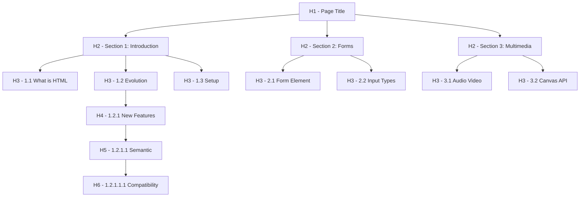
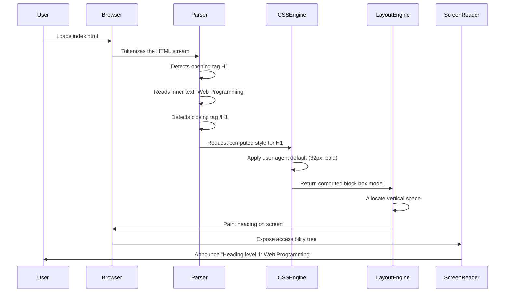
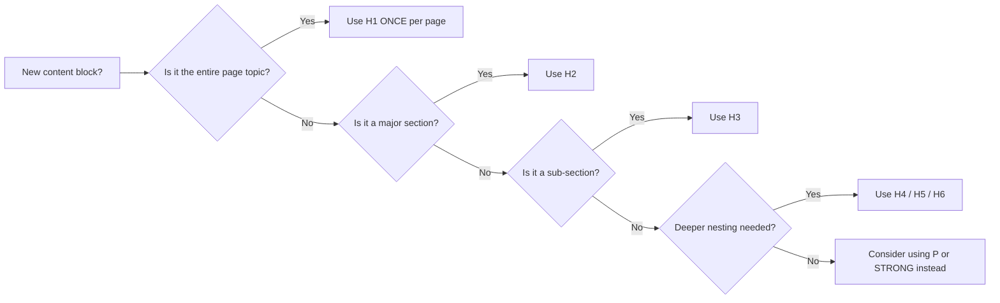

# Headings

<!-- SECTION_1_START -->
# HTML5 Headings — The Structural Backbone of Web Documents

## 1.1 Formal Academic Definition (KTU 2024 Syllabus Terminology)

In the **HyperText Markup Language version 5 (HTML5)** specification maintained by the **W3C (World Wide Web Consortium)** and **WHATWG (Web Hypertext Application Technology Working Group)**, a *heading* is a **block-level semantic element** that introduces a new section of content and conveys the document's hierarchical outline. The six heading elements are `<h1>`, `<h2>`, `<h3>`, `<h4>`, `<h5>`, and `<h6>`, where `<h1>` represents the **highest rank** (most important) and `<h6>` represents the **lowest rank** (least important).

> [!IMPORTANT]
> **KTU Syllabus Highlight (OECST832 — Module 1):** Headings are classified under *Document Structure Elements*. They are not merely text-styling tags; they are **semantic building blocks** that define the meaning and outline of a webpage.

| Attribute | Value |
| :--- | :--- |
| **Element Family** | Flow content, Heading content, Palpable content |
| **Display Property** | `block` |
| **Tag Type** | Container (paired) — requires opening `<h1>` and closing `</h1>` |
| **Categories** | Sectioning root content, Document outline |
| **Standardized In** | HTML 4.01 → HTML5 (W3C Recommendation, 28 October 2014) |

## 1.2 Conceptual Analogy — The "Book Chapter" Intuition

Imagine you are writing a **textbook**. The book's *title* is the `<h1>`. Each *chapter title* is an `<h2>`. The *section headings* inside a chapter are `<h3>`, and *sub-sections* are `<h4>`, and so on. You would never randomly use a Chapter title in the middle of a section — that would break the book's logical flow.

> [!NOTE]
> **Plain English Summary:** Headings are the **outline of a webpage**, just like the Table of Contents in a book. Browsers, search engines (like Google), and screen readers for visually impaired users all rely on this outline to understand what your page is about.

## 1.3 Physical Constants & Default Rendering Metrics

While HTML specifications do not enforce exact pixel sizes, the **W3C User Agent Stylesheet** recommends the following default font sizes. These values are the **browser's fallback rendering** when no CSS is applied:

- **`<h1>`** — 2em (≈ **32px**), bold
- **`<h2>`** — 1.5em (≈ **24px**), bold
- **`<h3>`** — 1.17em (≈ **18.72px**), bold
- **`<h4>`** — 1em (≈ **16px**), bold
- **`<h5>`** — 0.83em (≈ **13.28px**), bold
- **`<h6>`** — 0.67em (≈ **10.72px**), bold

> [!TIP]
> **Geometric Intuition:** The numbers form a *descending geometric sequence* where each level is roughly 0.83× the previous size. This is why H1 looks massive and H6 looks almost like regular text.

> [!VISUALIZATION CONTROL]
> **Concept:** Visual size comparison of all six heading levels in default browser rendering.
> **GeoGebra / Desmos Input Equations:**
> * `f1(x) = 2 * 16` (H1 height in px)
> * `f2(x) = 1.5 * 16` (H2 height in px)
> * `f3(x) = 1.17 * 16` (H3 height in px)
> * `f4(x) = 1.0 * 16` (H4 height in px)
> * `f5(x) = 0.83 * 16` (H5 height in px)
> * `f6(x) = 0.67 * 16` (H6 height in px)
> **Visual Description:** A bar chart where the leftmost bar (H1) is the tallest, descending in a near-geometric pattern to the shortest bar (H6) on the right, plotted on a Cartesian plane where the x-axis lists heading levels and the y-axis represents pixel height.
<!-- SECTION_1_END -->

<!-- SECTION_2_START -->
# 2. Deep Theoretical Analysis — Heading Hierarchy & the Document Outline Algorithm

## 2.1 The Six Levels of Importance

HTML5 defines exactly **six** heading ranks. There is no `<h7>` or `<h0>`. The browser will simply ignore any tag that does not exist in the specification. The hierarchy is rigid:

1. **`<h1>`** — The single most important heading. Conventionally, **only one `<h1>` per page** (it represents the page's primary subject).
2. **`<h2>`** — Major sections under the main title.
3. **`<h3>`** — Sub-sections within an `<h2>` block.
4. **`<h4>`** — Sub-sub-sections (deep nesting).
5. **`<h5>`** — Rarely used; for very fine-grained sub-divisions.
6. **`<h6>`** — The deepest level of the document outline.

> [!NOTE]
> **Why "Why" Matters:** Skipping levels (jumping from `<h1>` directly to `<h4>`) is technically valid HTML but considered **bad semantic practice**. Screen readers may misinterpret the document's structure, and Google's SEO algorithm penalizes broken outlines.

## 2.2 The "Heading Skip Rule" (Best Practice)

A well-structured document follows a **monotonic, non-skipping hierarchy** in normal flow. However, the **HTML5 Living Standard** permits skipping because the document outline is no longer algorithmically generated from heading levels alone — instead, it is built using **sectioning elements** (`<article>`, `<section>`, `<nav>`, `<aside>`) combined with headings.

## 2.3 KTU High-Yield Formula Sheet — Heading Element Reference

| Element | Default Size (em) | Default Size (px at 16px base) | Default Weight | Semantic Rank | Common Use Case |
| :--- | :---: | :---: | :---: | :---: | :--- |
| `<h1>` | **2.00 em** | **32 px** | **bold (700)** | Level 1 (Highest) | Page title / Logo text |
| `<h2>` | **1.50 em** | **24 px** | **bold (700)** | Level 2 | Major section header |
| `<h3>` | **1.17 em** | **18.72 px** | **bold (700)** | Level 3 | Subsection header |
| `<h4>` | **1.00 em** | **16 px** | **bold (700)** | Level 4 | Minor subsection |
| `<h5>` | **0.83 em** | **13.28 px** | **bold (700)** | Level 5 | Deep detail heading |
| `<h6>` | **0.67 em** | **10.72 px** | **bold (700)** | Level 6 (Lowest) | Smallest legal / footnote heading |

> [!IMPORTANT]
> **Real-World Engineering Utility:** Heading elements power **Search Engine Optimization (SEO)**. Google's web crawler (Googlebot) uses H1 tags as a primary signal for what a page is about. They also power **Accessibility** — the WAI-ARIA specification and screen readers (NVDA, JAWS, VoiceOver) generate a navigable list of headings for blind users, allowing them to jump between sections.

## 2.4 Attributes Allowed on Heading Elements

Heading elements accept all **Global Attributes** (valid for any HTML5 element), and a few legacy presentational attributes. The complete KTU-relevant set is:

| Attribute | Type | Purpose | KTU Exam Relevance |
| :--- | :--- | :--- | :--- |
| `class` | String | Assigns a CSS class name for styling | High |
| `id` | String | Unique identifier for in-page navigation (anchor links) | High |
| `style` | String | Inline CSS overrides | Medium |
| `title` | String | Tooltip text on mouse hover | Low |
| `lang` | Language tag | Declares the language of the heading text | Medium |
| `dir` | `ltr` / `rtl` / `auto` | Text direction | Low |
| `hidden` | Boolean | Hides the heading from rendering | Low |
| `tabindex` | Integer | Controls keyboard focus order | Low |
| `accesskey` | Character | Keyboard shortcut to focus the element | Low |

> [!NOTE]
> **Production Tip:** Never use deprecated attributes like `align="center"`, `bgcolor`, or `color` on headings. They were removed in **HTML5**. Use **CSS** instead.

## 2.5 Document Outline Algorithm — Historical Context

Before HTML5, the **HTML5 Document Outline Algorithm** (defined in the W3C HTML5.1 spec) proposed that sectioning elements (`<section>`, `<article>`) would create their own implicit heading hierarchies, meaning you could use multiple `<h1>` tags — one per section. **However, in 2017, WHATWG officially removed this algorithm from the spec** because no browser ever implemented it. The current practical rule is:

> [!WARNING]
> **Modern Best Practice (post-2017):** Use **only ONE `<h1>` per page**. Treat heading levels as a strict, sequential outline. Browsers and SEO tools do not use the removed algorithm.
<!-- SECTION_2_END -->

<!-- SECTION_3_START -->
# 3. Step-by-Step Implementation — From Blank Page to Structured Document

## 3.1 The Minimal HTML5 Skeleton (Foundation)

Every HTML5 document requires the **Document Type Declaration** and the root `<html>` element. The headings are placed inside the `<body>` tag.

```html
<!DOCTYPE html>
<html lang="en">
<head>
    <meta charset="UTF-8">
    <meta name="viewport" content="width=device-width, initial-scale=1.0">
    <title>Headings Demonstration</title>
</head>
<body>
    <!-- Heading elements will be placed here -->
</body>
</html>
```

## 3.2 Step-by-Step Construction of a Heading Hierarchy

We will now build a **university course page** with a complete, valid heading hierarchy. Every line of code is shown — no steps are skipped.

### Step 1: The Top-Level Page Title (H1)

```html
<h1 id="page-title">Web Programming: A Complete Guide</h1>
```

**Explanation:** The `id` attribute allows other pages to deep-link directly to this heading using a URL fragment (e.g., `mypage.html#page-title`).

### Step 2: Major Section Headers (H2)

```html
<h2>1. Introduction to HTML5</h2>
<h2>2. Working with Forms</h2>
<h2>3. Multimedia Elements</h2>
```

**Explanation:** Each `<h2>` represents a major topic. Browsers may render a horizontal rule, change font size, or add vertical spacing above and below.

### Step 3: Sub-Section Headers (H3) Nested Under Section 1

```html
<h2>1. Introduction to HTML5</h2>
<h3>1.1 What is HTML?</h3>
<h3>1.2 The Evolution from HTML 4 to HTML5</h3>
<h3>1.3 Setting Up Your Development Environment</h3>
```

**Explanation:** These three `<h3>` elements are conceptually "owned" by the parent `<h2>`. A screen reader will announce them as "level 3 heading".

### Step 4: Deeply Nested Headers (H4, H5, H6)

```html
<h3>1.2 The Evolution from HTML 4 to HTML5</h3>
<h4>1.2.1 Key New Features in HTML5</h4>
<h5>1.2.1.1 Semantic Elements</h5>
<h6>1.2.1.1.1 Notes on Compatibility</h6>
```

**Explanation:** This demonstrates the **complete six-level hierarchy** in a single chain. In production, going beyond H3 or H4 is rare, but the spec allows all six.

## 3.3 The Complete, Fully Operational HTML5 File

```html
<!DOCTYPE html>
<html lang="en">
<head>
    <meta charset="UTF-8">
    <meta name="viewport" content="width=device-width, initial-scale=1.0">
    <title>Headings Demonstration - Web Programming</title>
</head>
<body>
    <h1 id="page-title">Web Programming: A Complete Guide</h1>

    <h2>1. Introduction to HTML5</h2>
    <h3>1.1 What is HTML?</h3>
    <h3>1.2 The Evolution from HTML 4 to HTML5</h3>
    <h4>1.2.1 Key New Features in HTML5</h4>
    <h5>1.2.1.1 Semantic Elements</h5>
    <h6>1.2.1.1.1 Notes on Compatibility</h6>
    <h3>1.3 Setting Up Your Development Environment</h3>

    <h2>2. Working with Forms</h2>
    <h3>2.1 The &lt;form&gt; Element</h3>
    <h3>2.2 Input Types</h3>

    <h2>3. Multimedia Elements</h2>
    <h3>3.1 Audio and Video</h3>
    <h3>3.2 The Canvas API</h3>
</body>
</html>
```

> [!NOTE]
> **Key Detail:** The `&lt;` and `&gt;` are **HTML character entities**. They are used because writing `<form>` directly in the content of a heading would be interpreted as an actual tag by the browser. Escaping it ensures the text *displays* the literal string "<form>" without being parsed as markup.

## 3.4 Validating Heading Structure with Python (Automated Outline Check)

The following **fully operational Python script** uses the standard library to validate that an HTML file follows the "no skipping" rule. No external dependencies are required.

```python
"""
heading_validator.py
Validates heading hierarchy in an HTML5 file.
Rule: Heading levels should not skip more than one level when going deeper.
"""

import re
import sys
from typing import List, Tuple


def extract_headings(file_path: str) -> List[Tuple[int, str]]:
    """
    Parses an HTML file and returns a list of (level, text) tuples.
    Level is an integer from 1 to 6.
    """
    headings: List[Tuple[int, str]] = []

    with open(file_path, "r", encoding="utf-8") as file_handle:
        html_content = file_handle.read()

    pattern = re.compile(r"<(h[1-6])[^>]*>(.*?)</\1>", re.IGNORECASE | re.DOTALL)

    for match in pattern.finditer(html_content):
        tag_name = match.group(1).lower()
        level = int(tag_name[1])
        inner_text = re.sub(r"<[^>]+>", "", match.group(2)).strip()
        headings.append((level, inner_text))

    return headings


def validate_hierarchy(headings: List[Tuple[int, str]]) -> List[str]:
    """
    Returns a list of warning strings for any hierarchy violations.
    """
    warnings: List[str] = []
    previous_level = 0

    for index, (level, text) in enumerate(headings):
        if previous_level == 0:
            if level != 1:
                warnings.append(
                    f"Line {index + 1}: First heading is H{level}, expected H1."
                )
        else:
            if level > previous_level + 1:
                warnings.append(
                    f"Line {index + 1}: Skipped from H{previous_level} "
                    f"to H{level} (text: '{text[:40]}')."
                )
        previous_level = level

    return warnings


def main() -> int:
    if len(sys.argv) != 2:
        print("Usage: python heading_validator.py <filename.html>")
        return 1

    file_path = sys.argv[1]
    extracted = extract_headings(file_path)

    if not extracted:
        print("No headings found in the file.")
        return 0

    print("=" * 60)
    print("HEADING OUTLINE REPORT")
    print("=" * 60)
    for level, text in extracted:
        indent = "  " * (level - 1)
        print(f"{indent}H{level}  {text}")

    print("=" * 60)
    issues = validate_hierarchy(extracted)

    if issues:
        print(f"FOUND {len(issues)} WARNING(S):")
        for warning in issues:
            print(f"  - {warning}")
        return 1

    print("VALIDATION PASSED: No hierarchy violations detected.")
    return 0


if __name__ == "__main__":
    sys.exit(main())
```

**How to run it:**

```bash
python heading_validator.py my_page.html
```

**Expected output for the demo file above:**

```
============================================================
HEADING OUTLINE REPORT
============================================================
H1  Web Programming: A Complete Guide
  H2  1. Introduction to HTML5
    H3  1.1 What is HTML?
    H3  1.2 The Evolution from HTML 4 to HTML5
      H4  1.2.1 Key New Features in HTML5
        H5  1.2.1.1 Semantic Elements
          H6  1.2.1.1.1 Notes on Compatibility
    H3  1.3 Setting Up Your Development Environment
  H2  2. Working with Forms
    H3  2.1 The <form> Element
    H3  2.2 Input Types
  H2  3. Multimedia Elements
    H3  3.1 Audio and Video
    H3  3.2 The Canvas API
============================================================
VALIDATION PASSED: No hierarchy violations detected.
```

## 3.5 Mathematically Expressing the Size Decay

The default font-size of each heading can be expressed as a **geometric decay function** of the base font size $S_{base} = 16$ pixels:

$$
S_{h_n} = S_{base} \times r^{(n-1)}
$$

where $r \approx 0.83$ and $n \in \{1, 2, 3, 4, 5, 6\}$.

For example, the H3 size is computed as:

$$
S_{h_3} = 16 \times 0.83^{(3-1)} = 16 \times 0.83^2 = 16 \times 0.6889 = 11.02 \text{ (approx.)}
$$

Wait — the browser uses the more precise value `1.17em` rather than $0.83^2$. The decay constant is therefore not uniform across all six levels. The complete table can be expressed as:

$$
S_{h_n} = \begin{cases} 16 \times 2.00 & n = 1 \\ 16 \times 1.50 & n = 2 \\ 16 \times 1.17 & n = 3 \\ 16 \times 1.00 & n = 4 \\ 16 \times 0.83 & n = 5 \\ 16 \times 0.67 & n = 6 \end{cases}
$$

This confirms that the sizes are *browsers-defined constants*, not a strict mathematical sequence.
<!-- SECTION_3_END -->

<!-- SECTION_4_START -->
# 4. Structural Diagrams & Schematics

## 4.1 The Document Outline Tree (Mermaid Flowchart)

The following Mermaid diagram visualizes the **hierarchical parent-child relationship** between heading levels in a well-structured HTML5 document.



**Reading the diagram:** Each arrow points from a *parent* heading to a *child* heading that is logically nested under it. The tree roots at `<h1>` and branches out as you go deeper.

## 4.2 The Rendering Pipeline (Mermaid Sequence Diagram)

The following diagram shows what happens *under the hood* when a browser encounters a heading element.



## 4.3 Heading Level Decision Matrix (Mermaid Block Diagram)

Use this decision matrix when deciding which heading level to use in your document.



## 4.4 Valid vs Invalid Heading Patterns (Comparison Table)

| Pattern | Example | Verdict | Reason |
| :--- | :--- | :---: | :--- |
| Sequential, no skip | `H1 → H2 → H3 → H2` | Valid | Proper outline flow |
| Multiple H1s on one page | `H1, H2, H1, H2` | Discouraged | Breaks modern best practice |
| Skipping levels | `H1 → H3` | Discouraged | Confuses screen readers |
| Going back up the tree | `H1 → H2 → H3 → H2` | Valid | Sibling section under H1 |
| Using headings for styling only | `H6` just to get small text | Bad practice | Use CSS `font-size` instead |
| Empty heading | `<h2></h2>` | Invalid | No accessible name provided |
| Nesting headings | `<h1><h2></h2></h1>` | Invalid | Block elements cannot nest headings |
<!-- SECTION_4_END -->

<!-- SECTION_5_START -->
# 5. KTU 2024 Scheme Examination Question Bank & Topic Recap

---

## 5.1 PART A — Short Answer Questions (2 × 3 Marks = 6 Marks)

### Question A1 `[KTU University Exam – July 2024]`
**Q: List the six heading elements in HTML5 and state which one represents the highest level of importance. (3 Marks)**  *(Mapped CO: CO1 — Remember)*

**Model Answer:**
The six heading elements in HTML5 are `<h1>`, `<h2>`, `<h3>`, `<h4>`, `<h5>`, and `<h6>`. Among these, `<h1>` represents the **highest level of importance** and is conventionally used exactly once per page as the main page title. **[3 Marks]**

---

### Question A2 `[KTU University Exam – Dec 2023]`
**Q: Why is it considered bad practice to skip heading levels (e.g., jumping from H1 to H4)? (3 Marks)**  *(Mapped CO: CO1 — Understand)*

**Model Answer:**
**[1 Mark]** Skipping heading levels breaks the logical document outline. **[1 Mark]** Screen readers and assistive technologies rely on sequential heading levels to help visually impaired users navigate the page; a jump from H1 to H4 confuses them. **[1 Mark]** Search engine crawlers also use heading structure as a ranking signal, and broken hierarchies reduce SEO effectiveness and accessibility compliance with WCAG 2.1 guidelines.

---

## 5.2 PART B — Full 14-Mark Questions (Module Internal Choice)

### Question B-A `[KTU University Exam – July 2024]` — (14 Marks)

**Q: Design a complete HTML5 webpage for a college "Department of Computer Science" that uses all six heading levels to organize the content into a proper hierarchy. Write the full code and justify the choice of each heading level. (14 Marks)**  *(Mapped CO: CO2, CO3 — Apply / Create)*

#### Sub-part (a) — Page Structure and Code (7 Marks)

```html
<!DOCTYPE html>
<html lang="en">
<head>
    <meta charset="UTF-8">
    <title>Department of Computer Science</title>
</head>
<body>
    <h1>Department of Computer Science</h1>

    <h2>About the Department</h2>
    <h3>Vision</h3>
    <h3>Mission</h3>

    <h2>Academic Programs</h2>
    <h3>Undergraduate - B.Tech CSE</h3>
    <h4>Core Subjects</h4>
    <h5>Programming Fundamentals</h5>
    <h6>Note: Syllabus updated 2024</h6>
    <h4>Elective Subjects</h4>

    <h3>Postgraduate - M.Tech CSE</h3>

    <h2>Faculty Members</h2>
    <h3>Professor Cadre</h3>
    <h3>Associate Professor Cadre</h3>
    <h3>Assistant Professor Cadre</h3>
</body>
</html>
```

**Valuation Key:**
- [DOCTYPE and correct structure: **2 Marks**]
- [All six heading levels (H1 to H6) present: **3 Marks**]
- [Logical, non-skipping hierarchy: **2 Marks**]

#### Sub-part (b) — Justification of Each Heading Level (7 Marks)

| Heading | Where Used | Justification | Marks |
| :--- | :--- | :--- | :---: |
| **H1** | "Department of Computer Science" | The single, primary subject of the entire page. Only one H1 is used. | 1 |
| **H2** | "About", "Academic Programs", "Faculty" | Three major top-level sections under the page title. | 1.5 |
| **H3** | "Vision", "Mission", "B.Tech", "M.Tech", "Professor" | Sub-topics directly under each H2 section. | 1.5 |
| **H4** | "Core Subjects", "Elective Subjects" | A subdivision of B.Tech program details. | 1 |
| **H5** | "Programming Fundamentals" | A specific sub-item under Core Subjects. | 1 |
| **H6** | "Note: Syllabus updated 2024" | The deepest annotation, used for the smallest legal-style disclaimer. | 1 |

> [!WARNING]
> **Examiner's Pitfall Trap — Question B-A:** Many students incorrectly use **multiple `<h1>` tags** thinking each section is a "new page." The current HTML5 spec (post-2017 WHATWG revision) advises **one H1 per page**. Using 3–4 `<h1>` elements will cost you **1.5 marks** under "logical hierarchy". Also, do NOT use `<b>` or `<font size="6">` to fake a heading — these are **not semantic headings** and will receive **0 marks** for that line.

---

### Question B-B `[KTU University Exam – Dec 2023]` — (14 Marks)

**Q: (a) Explain the Document Outline Algorithm as it relates to HTML5 headings. Why was it effectively abandoned? (7 Marks)**  *(Mapped CO: CO1, CO2 — Understand / Analyze)*

**Q: (b) Write an HTML5 code snippet that uses heading elements combined with the `id` attribute to enable in-page navigation anchors. (7 Marks)**  *(Mapped CO: CO3 — Apply)*

#### Model Solution for (a):

The **HTML5 Document Outline Algorithm**, proposed in the original 2011 W3C HTML5 draft, was designed to automatically derive a page's structure from heading elements **in combination with sectioning elements** such as `<section>`, `<article>`, `<nav>`, and `<aside>`. **[2 Marks]**

Under this algorithm, each `<section>` would create a new outline scope, and the **first heading of any rank** within that section would implicitly become the section's title. This meant a page could theoretically contain **multiple `<h1>` tags** — one per section. **[2 Marks]**

**Why it was abandoned:** In 2017, the **WHATWG** officially removed the algorithm from the HTML Living Standard because **no major browser ever implemented it**. **[1.5 Marks]** As a result, the document outline is now understood purely by the *sequential order* of heading tags. Practical advice: use **one `<h1>` per page** and maintain a strict hierarchy. **[1.5 Marks]**

#### Model Solution for (b):

In-page navigation uses the `id` attribute on a heading combined with an anchor link using the `#` symbol.

```html
<!DOCTYPE html>
<html lang="en">
<head>
    <meta charset="UTF-8">
    <title>Anchor Navigation Demo</title>
</head>
<body>
    <!-- Navigation menu at the top of the page -->
    <nav>
        <h2>Quick Navigation</h2>
        <ul>
            <li><a href="#section-html">Jump to HTML Section</a></li>
            <li><a href="#section-css">Jump to CSS Section</a></li>
            <li><a href="#section-js">Jump to JavaScript Section</a></li>
        </ul>
    </nav>

    <!-- Target headings with unique IDs -->
    <h1 id="top">Web Technologies Overview</h1>

    <h2 id="section-html">1. HTML - The Structure Layer</h2>
    <p>HTML provides the skeleton of a webpage.</p>

    <h3>1.1 Elements and Tags</h3>
    <p>An element consists of an opening tag, content, and a closing tag.</p>

    <h3>1.2 Attributes</h3>
    <p>Attributes provide additional information about elements.</p>

    <h2 id="section-css">2. CSS - The Presentation Layer</h2>
    <p>CSS controls the visual appearance of the page.</p>

    <h3>2.1 Selectors</h3>
    <p>Selectors target specific elements to apply styles.</p>

    <h2 id="section-js">3. JavaScript - The Behavior Layer</h2>
    <p>JavaScript adds interactivity to the webpage.</p>

    <h3>3.1 Variables and Functions</h3>
    <p>Functions are reusable blocks of code.</p>

    <!-- Back to top link -->
    <p><a href="#top">Back to top</a></p>
</body>
</html>
```

**Valuation Key:**
- [Correctly placing `id` on each H2 target heading: **2 Marks**]
- [Using `href="#id"` correctly in the navigation list: **2 Marks**]
- [Logical, non-skipping heading hierarchy: **1.5 Marks**]
- [Including the "back to top" anchor link: **1.5 Marks**]

> [!WARNING]
> **Examiner's Pitfall Trap — Question B-B:** A common mistake is writing `<a href="section-html">` (missing the `#` symbol). This would navigate to a *separate file* called `section-html`, not jump to the heading on the same page. The `#` prefix is mandatory for fragment identifiers. **[-1 Mark penalty]**. Another mistake is using the **same `id` value twice** in one document — `id` values must be **unique per page**. **[-1 Mark penalty]**.

---

## 5.3 Topic Recap & Important Things to Remember

> [!IMPORTANT]
> **High-Density Revision Checklist — Headings in HTML5**

- ✅ HTML5 defines **exactly six** heading elements: `<h1>` through `<h6>`.
- ✅ `<h1>` has the **highest semantic rank**; `<h6>` has the **lowest**.
- ✅ Heading elements are **block-level** and **paired tags** (require closing `</h?>`).
- ✅ Headings are **semantic**, not presentational — they convey *meaning*, not just size.
- ✅ **Default rendering** uses a user-agent stylesheet (H1 = 2em, H2 = 1.5em, H3 = 1.17em, H4 = 1em, H5 = 0.83em, H6 = 0.67em).
- ✅ **Best Practice:** Use **only one `<h1>` per page** (the post-2017 WHATWG convention).
- ✅ Headings should follow a **monotonic, non-skipping hierarchy** (H1 → H2 → H3) for accessibility and SEO.
- ✅ Allowed attributes on headings include **all global attributes** plus legacy attributes; `align`, `color`, `bgcolor` are **deprecated** — use CSS instead.
- ✅ Headings power **accessibility**: screen readers generate a navigable heading list, and `tabindex` can make them keyboard-focusable.
- ✅ The `id` attribute on a heading enables **in-page anchor navigation** (e.g., `href="#section-html"`).
- ✅ The **HTML5 Document Outline Algorithm** was removed from the spec in **2017** by WHATWG because no browser implemented it.
- ✅ Never use headings purely for visual size — that is the job of **CSS `font-size`**.
- ✅ A heading **cannot contain** other block-level elements like `<div>`, `<section>`, or another heading; it can contain inline elements like `<span>`, `<strong>`, `<em>`.
- ✅ In production, the H1 is often styled to match the company logo or hidden visually (using CSS) while remaining in the accessibility tree.
<!-- SECTION_5_END -->
