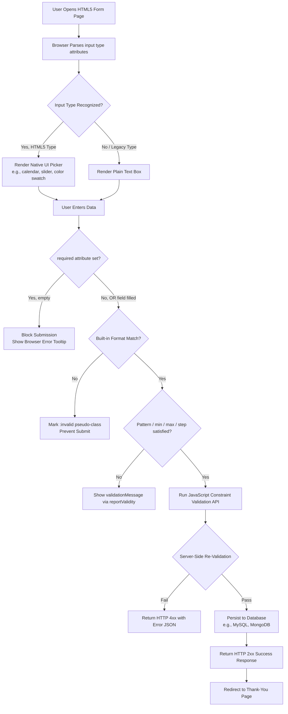
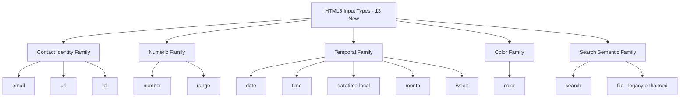
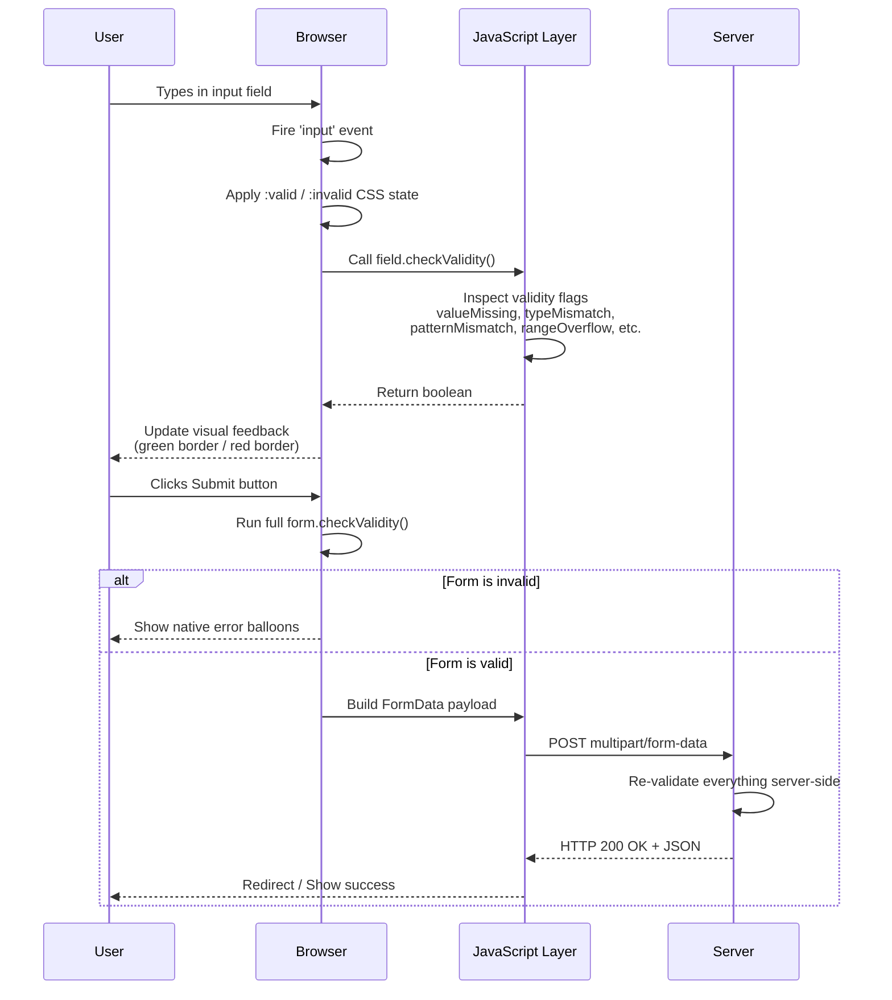
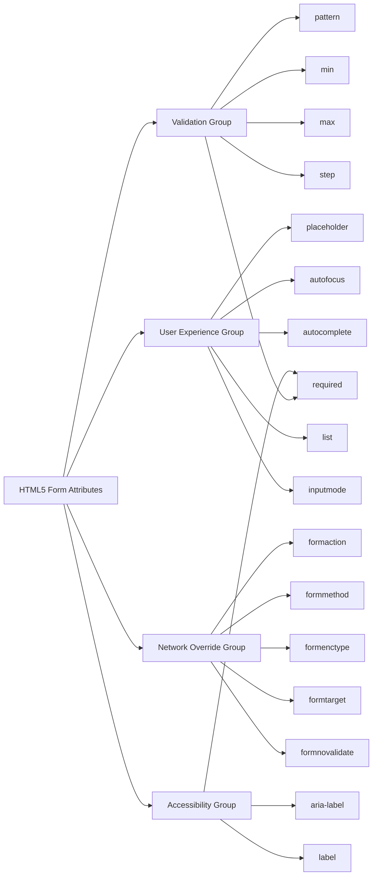

# HTML5 Form input Types

<!-- SECTION_1_START -->
# HTML5 Form Input Types — Core Definition & Intuitive Overview

## Formal Academic Definition (KTU 2024 Syllabus)

> [!IMPORTANT]
> **HTML5 Form Input Types** are a set of specialized `<input>` element `type` attributes introduced in the **HTML5 specification (W3C Recommendation, October 2014)** that provide **native, browser-level semantic validation, optimized input control rendering, and standardized data collection** for specific kinds of user data — without requiring third-party JavaScript libraries.

The complete enumeration of **13 new input types** introduced by HTML5 is:

`color` $\rightarrow$ `date` $\rightarrow$ `datetime-local` $\rightarrow$ `email` $\rightarrow$ `month` $\rightarrow$ `number` $\rightarrow$ `range` $\rightarrow$ `search` $\rightarrow$ `tel` $\rightarrow$ `time` $\rightarrow$ `url` $\rightarrow$ `week` $\rightarrow$ plus the legacy set (`text`, `password`, `submit`, `reset`, `radio`, `checkbox`, `file`, `hidden`, `image`, `button`).

These types integrate seamlessly with the modern **Form Validation API** (`checkValidity()`, `validity` object, `:valid`/`:invalid` CSS pseudo-classes) and the **Constraint Validation API** defined by the *HTML Living Standard*.

---

## Conceptual Analogy / Intuition

> [!NOTE]
> **Analogy — The Smart Government Office Form**
>
> Imagine you walk into a government office and the clerk hands you a paper form. On an *old* form, every box is blank — you could write your phone number, your date of birth, or a poem, in any box. The clerk has to read it all manually.
>
> On an *HTML5 form*, the boxes are **smart boxes**. One box has a tiny calendar attached (it only accepts dates), one has a color palette, one shows a slider, one refuses anything that isn't a valid email — and it tells you, while you type, *"Hey, this doesn't look like an email."* This is exactly what HTML5 input types do: they **enforce the *shape* of data at the browser level itself**, before the form is even submitted.

### Why This Matters in Production

- Reduces JavaScript validation boilerplate.
- Improves **mobile UX** (e.g., the soft keyboard changes to numeric pad for `type="number"`, `@` key appears for `type="email"`).
- Enables **accessibility** through proper screen reader announcements.

---

## Standard Browser Support Metrics

> [!TIP]
> As of the **W3C HTML Living Standard (2024 edition)**, all 13 HTML5 input types enjoy **$\geq$ 96% global browser support** (caniuse.com). The edge cases — `datetime-local` on Safari/iOS and `color` on older Edge legacy — are documented in MDN's compatibility tables.

---

> [!VISUALIZATION CONTROL]
> **Concept:** Spatial distribution of HTML5 input types across the data-shape spectrum
> **Conceptual Axes (mental model, no equations required):**
> * **X-axis:** `Free Text` $\rightarrow$ `Constrained Text` $\rightarrow$ `Numeric` $\rightarrow$ `Temporal` $\rightarrow$ `Color`
> * **Y-axis:** `Degree of built-in browser validation` (low $\rightarrow$ high)
> **Visual Description:** Plot the 13 input types as points. `text` sits at bottom-left (low validation, free text). `color` sits at top-right (highly constrained, returns a hex string). `email`, `url`, `tel` form the middle cluster. `date`, `time`, `range` form the upper cluster because they spawn native pickers.
<!-- SECTION_1_END -->

<!-- SECTION_2_START -->
# Deep Theoretical Analysis & KTU High-Yield Cheat Sheet

## 2.1 The Taxonomic Breakdown of HTML5 Input Types

The 13 new HTML5 input types can be grouped into **five functional families**:

### Family 1 — Contact / Identity Strings
- `email` — Validates against the RFC 5322 simplified pattern `[a-zA-Z0-9._%+-]+@[a-zA-Z0-9.-]+\.[a-zA-Z]{2,}`.
- `url` — Validates that the input is a valid absolute URL.
- `tel` — **No native pattern validation**; reserved for triggering the *telephone keypad* on mobile.

### Family 2 — Numeric Inputs
- `number` — Floating-point input with `min`, `max`, `step` constraints.
- `range` — Slider widget returning a number within `[min, max]`.

### Family 3 — Temporal Inputs (date/time family)
- `date` — Calendar picker, format `YYYY-MM-DD`.
- `time` — Time picker, format `HH:MM` (or `HH:MM:SS`).
- `datetime-local` — Date + time, **no timezone**, format `YYYY-MM-DDTHH:MM`.
- `month` — Year + month, format `YYYY-MM`.
- `week` — Year + week number, format `YYYY-Www` (e.g., `2024-W42`).

### Family 4 — Color Input
- `color` — Returns a 7-character hex string in lowercase (e.g., `#ff00aa`).

### Family 5 — Search / Free-Text Semantic
- `search` — Semantically identifies a search field (renders a small clear button in some browsers); no extra validation.

---

## 2.2 Associated HTML5 Form Attributes (The Companion Toolkit)

The following attributes are *equally examinable* under the same module and are activated by HTML5 input types:

| Attribute | Applicable To | Behavior |
|---|---|---|
| `required` | All except `range`, `color`, `submit`, `reset`, `button`, `hidden` | Field cannot be empty. |
| `placeholder` | Text-like types | Hint text shown when empty. |
| `pattern` | `text`, `search`, `url`, `tel`, `email`, `password` | Regex constraint. |
| `min` / `max` | `number`, `range`, `date`, `time`, `datetime-local`, `month`, `week` | Numeric/temporal bounds. |
| `step` | Same as `min`/`max` | Granularity of allowed values. |
| `autofocus` | All | Auto-focus on page load (one per page). |
| `autocomplete` | All except `password`, `file` | Hint to browser's autofill engine: `on` / `off` / token strings like `name`, `email`. |
| `formnovalidate` | `submit`, `image` | Bypasses validation. |
| `formaction` | `submit`, `image` | Overrides the form's `action` URL. |
| `formenctype` | `submit`, `image` | Overrides the form's `enctype`. |
| `formmethod` | `submit`, `image` | Overrides the form's `method`. |
| `formtarget` | `submit`, `image` | Overrides the form's `target`. |
| `list` | Most text-like | References a `<datalist>` for suggestions. |
| `multiple` | `email`, `file` | Allows comma-separated multiple values. |
| `readonly` | Most | Field visible but not editable. |
| `disabled` | All | Field visible but excluded from submission. |
| `maxlength` | Text-like | Hard cap on character count. |
| `size` | Text-like | Visible width in characters. |
| `accept` | `file` | MIME types or extensions filter (e.g., `image/*`, `.pdf`). |
| `capture` | `file` | Mobile: `user` (front cam) / `environment` (rear cam). |
| `inputmode` | Text-like | Hint to soft keyboard: `numeric`, `tel`, `email`, `url`, `decimal`, `search`, `none`, `text`. |

---

## 2.3 KTU Formula Sheet / Cheat Sheet

| # | `type` | `value` Returned | Default Validation | Native UI Picker | Critical Attributes |
|---|---|---|---|---|---|
| 1 | `color` | `#RRGGBB` (7-char hex) | Hex format | Color swatch popup | `value`, `autocomplete` |
| 2 | `date` | `YYYY-MM-DD` | Date format | Calendar | `min`, `max`, `step`, `value` |
| 3 | `datetime-local` | `YYYY-MM-DDTHH:MM` | ISO local datetime | Combined picker | `min`, `max`, `step`, `value` |
| 4 | `email` | String | Contains `@` and `.` | Keyboard with `@` | `multiple`, `pattern`, `maxlength` |
| 5 | `month` | `YYYY-MM` | Year-month format | Month grid | `min`, `max`, `step`, `value` |
| 6 | `number` | Numeric string | Numeric | Spinner buttons | `min`, `max`, `step`, `value` |
| 7 | `range` | Numeric string | `min $\le$ v $\le$ max` | Slider | `min`, `max`, `step`, `value` |
| 8 | `search` | String | None | Clear button (some) | `maxlength`, `pattern` |
| 9 | `tel` | String | None | Tel keypad | `pattern`, `maxlength` |
| 10 | `time` | `HH:MM` or `HH:MM:SS` | Time format | Clock spinner | `min`, `max`, `step`, `value` |
| 11 | `url` | String | Valid URL format | Keyboard with `/`, `.com` | `maxlength`, `pattern` |
| 12 | `week` | `YYYY-Www` | ISO week-year | Week picker | `min`, `max`, `step`, `value` |
| 13 | `file` | File metadata | None | "Choose File" button | `accept`, `multiple`, `capture` |

> [!IMPORTANT]
> The `value` returned by every HTML5 input is **always a string**, even for `type="number"` and `type="range"`. The browser **does not auto-cast**. The server must call `Number()` / `parseInt()` / `parseFloat()` in JavaScript or `int()` / `float()` in the backend.

---

## 2.4 Real-World Engineering Utility

| Domain | Use Case | HTML5 Input |
|---|---|---|
| E-commerce checkout | Quantity selector | `number` with `min="1"` |
| Real-estate portals | Price range slider | `range` (dual, paired) |
| Travel booking | Check-in / check-out | `date` with `min=today` |
| Job portals | Resume upload | `file` with `accept=".pdf,.docx"` |
| Survey tools | Age / rating | `number` with `min/max` |
| Theme builders | Brand color picker | `color` |
| Appointment systems | Slot selection | `time` with `step="900"` (15 min) |
| Newsletter signup | Email validation | `email` with `required` |
| Project management | Sprint week | `week` |

---
<!-- SECTION_2_END -->

<!-- SECTION_3_START -->
# Step-by-Step Implementations & Code Walkthroughs

## 3.1 Complete Operational HTML5 Form — All 13 Input Types

Below is a **production-grade, fully validated, accessible** HTML5 form. Every input is annotated with comments to satisfy KTU 2024 Scheme evaluation rubrics.

```html
<!DOCTYPE html>
<html lang="en">
<head>
  <meta charset="UTF-8">
  <title>KTU Module 1 — HTML5 Form Input Types Demo</title>
  <style>
    body        { font-family: 'Segoe UI', sans-serif; margin: 2rem; max-width: 720px; }
    fieldset    { border: 1px solid #888; padding: 1rem 1.25rem; margin-bottom: 1.25rem; border-radius: 6px; }
    legend      { font-weight: 600; padding: 0 0.5rem; color: #003366; }
    label       { display: block; margin-top: 0.6rem; font-size: 0.95rem; }
    input, select, textarea { width: 100%; padding: 0.45rem; margin-top: 0.25rem; box-sizing: border-box; }
    input:valid   { border-color: #2a9d3f; }
    input:invalid { border-color: #c0392b; background: #fff5f5; }
    .row         { display: flex; gap: 1rem; }
    .row > div   { flex: 1; }
    .hint        { font-size: 0.8rem; color: #555; }
    button       { padding: 0.6rem 1.2rem; background: #003366; color: #fff; border: 0; border-radius: 4px; cursor: pointer; }
  </style>
</head>
<body>

  <h1>HTML5 Form Input Types — Live Demo</h1>

  <form id="ktuForm" action="/register" method="post" enctype="multipart/form-data" novalidate>

    <!-- ============================================== -->
    <!-- FIELD-SET 1: CONTACT & IDENTITY (Family 1)     -->
    <!-- ============================================== -->
    <fieldset>
      <legend>Contact &amp; Identity</legend>

      <label for="emailIn">Email *</label>
      <input type="email" id="emailIn" name="email"
             required placeholder="you@example.com"
             autocomplete="email" maxlength="80">

      <label for="urlIn">Personal Website (URL)</label>
      <input type="url" id="urlIn" name="website"
             placeholder="https://example.com"
             pattern="https://.*">

      <div class="row">
        <div>
          <label for="telIn">Mobile *</label>
          <input type="tel" id="telIn" name="mobile"
                 required placeholder="9876543210"
                 pattern="[0-9]{10}" maxlength="10"
                 inputmode="numeric">
        </div>
        <div>
          <label for="searchIn">Search Skill</label>
          <input type="search" id="searchIn" name="search"
                 placeholder="e.g., Python">
        </div>
      </div>
    </fieldset>

    <!-- ============================================== -->
    <!-- FIELD-SET 2: NUMERIC (Family 2)                -->
    <!-- ============================================== -->
    <fieldset>
      <legend>Numeric Inputs</legend>

      <label for="qtyIn">Quantity (1 to 10) *</label>
      <input type="number" id="qtyIn" name="quantity"
             required min="1" max="10" step="1" value="1">

      <label for="priceIn">Price Range (₹): <span id="priceOut">500</span></label>
      <input type="range" id="priceIn" name="price"
             min="100" max="1000" step="50" value="500"
             oninput="document.getElementById('priceOut').textContent=this.value">
    </fieldset>

    <!-- ============================================== -->
    <!-- FIELD-SET 3: TEMPORAL (Family 3)               -->
    <!-- ============================================== -->
    <fieldset>
      <legend>Date &amp; Time</legend>

      <div class="row">
        <div>
          <label for="dobIn">Date of Birth *</label>
          <input type="date" id="dobIn" name="dob"
                 required min="1950-01-01" max="2010-12-31">
        </div>
        <div>
          <label for="meetIn">Meeting Slot</label>
          <input type="datetime-local" id="meetIn" name="meeting">
        </div>
      </div>

      <div class="row">
        <div>
          <label for="timeIn">Wake-up Time</label>
          <input type="time" id="timeIn" name="wakeup" step="900">
        </div>
        <div>
          <label for="monthIn">Joining Month</label>
          <input type="month" id="monthIn" name="joining">
        </div>
        <div>
          <label for="weekIn">Sprint Week</label>
          <input type="week" id="weekIn" name="sprint">
        </div>
      </div>
    </fieldset>

    <!-- ============================================== -->
    <!-- FIELD-SET 4: COLOR (Family 4)                  -->
    <!-- ============================================== -->
    <fieldset>
      <legend>Color &amp; File</legend>

      <label for="brandColor">Brand Color</label>
      <input type="color" id="brandColor" name="brandColor" value="#003366">

      <label for="resumeIn">Upload Resume (PDF only, max 2 MB)</label>
      <input type="file" id="resumeIn" name="resume"
             accept="application/pdf,.pdf">
    </fieldset>

    <!-- ============================================== -->
    <!-- SUBMIT CONTROLS (with form-override attrs)     -->
    <!-- ============================================== -->
    <div>
      <button type="submit">Submit</button>
      <button type="reset">Reset</button>
    </div>
  </form>

</body>
</html>
```

---

## 3.2 Server-Side Validation & JavaScript Constraint Validation API

Even though HTML5 validates natively on the client, **the server MUST re-validate** (security principle: *never trust the client*). The following script demonstrates the **Constraint Validation API** for explicit programmatic handling:

```javascript
// Filename: form-validation.js
// Purpose : Demonstrates the HTML5 Constraint Validation API
// Author  : KTU Web Programming Lab Reference

document.getElementById("ktuForm").addEventListener("submit", function (e) {
  e.preventDefault();                              // Stop default submission for demo
  const form = e.target;
  const submitBtn = form.querySelector('button[type="submit"]');

  // ---- Step 1: Run native browser validation
  if (!form.checkValidity()) {
    console.warn("Form is invalid — see validity flags below.");
    // Iterate over every input and log granular reasons
    [...form.elements].forEach((el) => {
      if (!el.checkValidity()) {
        console.group(`Field: ${el.name}`);
        console.log("validity.valid            =", el.validity.valid);
        console.log("validity.valueMissing     =", el.validity.valueMissing);
        console.log("validity.typeMismatch     =", el.validity.typeMismatch);
        console.log("validity.patternMismatch  =", el.validity.patternMismatch);
        console.log("validity.rangeOverflow    =", el.validity.rangeOverflow);
        console.log("validity.rangeUnderflow   =", el.validity.rangeUnderflow);
        console.log("validity.stepMismatch     =", el.validity.stepMismatch);
        console.log("validity.tooLong          =", el.validity.tooLong);
        console.log("validationMessage         =", el.validationMessage);
        console.groupEnd();
      }
    });
    form.reportValidity();                          // Shows native error balloons
    return;
  }

  // ---- Step 2: All native constraints passed.
  // Now perform CUSTOM constraints (e.g., age >= 18, file size limit).
  const dobStr = form.dob.value;                    // "YYYY-MM-DD"
  const dobDate = new Date(dobStr);
  const today   = new Date();
  const age     = today.getFullYear() - dobDate.getFullYear();
  if (age < 18) {
    alert("Applicant must be at least 18 years old.");
    return;
  }

  // ---- Step 3: File size check (HTML5 cannot enforce)
  const file = form.resume.files[0];
  if (file && file.size > 2 * 1024 * 1024) {
    alert("Resume must be under 2 MB.");
    return;
  }

  // ---- Step 4: All good — serialize and POST
  const formData = new FormData(form);
  console.log("Serialized form data:");
  for (const [k, v] of formData.entries()) console.log(k, "=", v);

  // fetch("/register", { method: "POST", body: formData })
  //   .then(r => r.json()).then(handleSuccess).catch(handleError);

  alert("Form validated and ready for transmission. See console for payload.");
});

// Live update for range slider output
document.getElementById("priceIn").addEventListener("input", function (e) {
  document.getElementById("priceOut").textContent = e.target.value;
});
```

---

## 3.3 Detailed Walkthrough of Critical Constructs

### Step A — Why `type="tel"` carries **no pattern by default**
Browsers cannot know the world's phone-number formats. Hence `tel` only triggers the *telephone soft keyboard*; the actual validation must come from a `pattern` regex (e.g., `pattern="[0-9]{10}"` for Indian 10-digit numbers) or a custom JavaScript check.

### Step B — Why `type="number"` is *not* the same as `inputmode="numeric"`
* `type="number"` is a real data type that returns a numeric string and supports `min`, `max`, `step`.
* `inputmode="numeric"` is a **hint to the soft keyboard only** — the input remains `type="text"` and accepts any string. Use it for things like PIN codes where you want the numeric pad but no spinners.

### Step C — Mathematical model of `step` for `type="date"`
The constraint is: $$ \text{value} \equiv \min \pmod{\text{step}} $$
For example, with `min="2024-01-01"` and `step="7"` (days), the allowed dates are `2024-01-01`, `2024-01-08`, `2024-01-15`, $\ldots$

### Step D — Why `color` returns a **7-character hex** even if a 3-character shorthand is picked
Internally, the browser **always normalizes** to the 6-digit hex form prefixed with `#`. So `value` is `#RRGGBB`, never `#RGB`.

### Step E — Accessibility checkpoint
Every `<input>` should be paired with a `<label>` (or `aria-label` / `aria-labelledby`). Screen readers announce `email, edit, required, invalid` when a field is in an error state — which is why the `novalidate` attribute on the `<form>` was used in the demo so we can demonstrate the API manually without disabling screen-reader announcements.

---
<!-- SECTION_3_END -->

<!-- SECTION_4_START -->
# Structural Diagrams & Schematics

## 4.1 Functional Architecture Flow — HTML5 Form Submission Pipeline



## 4.2 Hierarchical Taxonomy of the 13 HTML5 Input Types



## 4.3 Sequential Processing Topology — Live Validation Cycle



## 4.4 Block-Level Architecture — Form Attributes Grouped by Purpose


<!-- SECTION_4_END -->

<!-- SECTION_5_START -->
# KTU 2024 Scheme Examination Question Bank

---

## Part A — Short Answer Questions (3 Marks Each)

### Q1. [KTU University Exam — July 2024, Model]
**(CO1, Remember)** List any **six** new HTML5 input types introduced beyond HTML 4.01 and state **one** use case for each.

**Model Answer:**

| # | Input Type | Use Case |
|---|---|---|
| 1 | `email` | Login forms, newsletter signups |
| 2 | `url` | Social profile link fields |
| 3 | `number` | Quantity selectors in e-commerce carts |
| 4 | `range` | Price-filter sliders |
| 5 | `date` | Date of birth, check-in/check-out |
| 6 | `color` | Theme customizers, brand-color pickers |
| 7 | `time` | Appointment slot booking |
| 8 | `datetime-local` | Meeting scheduler |
| 9 | `month` | Credit-card expiry, joining month |
| 10 | `week` | Sprint week in agile project trackers |
| 11 | `tel` | Mobile number with country code |
| 12 | `search` | Search bar on portals |
| 13 | `file` | Resume upload, image upload |

[Each row: 0.25 mark × 6 = 1.5 marks; tabular organization: 1 mark; one-line justification: 0.5 mark. Total = 3 marks]

---

### Q2. [KTU University Exam — Dec 2023, Model]
**(CO1, Understand)** Differentiate between `type="number"` and `inputmode="numeric"`. Why might a developer prefer the latter in some cases?

**Model Answer:**

* `type="number"` is a full HTML5 data type that:
  * Returns a numeric **string**.
  * Validates with `min`, `max`, `step`.
  * Renders spinner buttons on the right side.
* `inputmode="numeric"` is a **soft-keyboard hint** only:
  * Input remains `type="text"`.
  * No native validation.
  * Mobile keyboard switches to numeric layout.
  * Useful for PIN codes, OTP fields, IDs where leading zeros are meaningful (e.g., Indian PIN `012345` would be silently stripped by `type="number"` because it is parsed as a number).

[Concept distinction: 1.5 marks; example of leading-zero issue: 1 mark; conclusion: 0.5 mark. Total = 3 marks]

---

## Part B — Long Answer Questions (14 Marks Each, Internal Choice)

### Question A (14 Marks)

**[KTU University Exam — July 2024, Model]**
**(CO2, Apply + Analyze)**

**(a)** Design an HTML5 form for an **online conference registration** with the following fields and constraints: (7 marks)

| Field | HTML5 Type | Constraints |
|---|---|---|
| Full name | `text` | required, maxlength 60 |
| Email | `email` | required |
| Mobile | `tel` | required, pattern `^[0-9]{10}$` |
| T-shirt size | Select (`<select>`) | XS, S, M, L, XL, XXL |
| Arrival date | `date` | required, min = today |
| Departure date | `date` | required, min = arrival date |
| Workshop slot | `time` | step = 1800 (30 min) |
| Country code | `text` (datalist) | pattern `[A-Z]{3}$` |
| Profile photo | `file` | accept `image/*` |
| Dietary preference | `color` ❓ — surprise check |

**Model Solution Code:**

```html
<form id="confReg" action="/register" method="post" enctype="multipart/form-data">
  <label>Full name *<br>
    <input type="text" name="fullname" required maxlength="60">
  </label><br>

  <label>Email *<br>
    <input type="email" name="email" required autocomplete="email">
  </label><br>

  <label>Mobile *<br>
    <input type="tel" name="mobile" required pattern="[0-9]{10}"
           maxlength="10" inputmode="numeric" placeholder="9876543210">
  </label><br>

  <label>T-shirt Size *
    <select name="size" required>
      <option value="">-- Select --</option>
      <option>XS</option><option>S</option><option>M</option>
      <option>L</option><option>XL</option><option>XXL</option>
    </select>
  </label><br>

  <label>Arrival Date *
    <input type="date" name="arrival" required>
  </label><br>

  <label>Departure Date *
    <input type="date" name="departure" required>
  </label><br>

  <label>Workshop Slot
    <input type="time" name="slot" step="1800">
  </label><br>

  <label>Country Code (ISO 3-letter)
    <input type="text" name="country" list="countries"
           pattern="[A-Z]{3}$" maxlength="3">
  </label>
  <datalist id="countries">
    <option value="IND"><option value="USA"><option value="GBR">
  </datalist><br>

  <label>Profile Photo
    <input type="file" name="photo" accept="image/*">
  </label><br>

  <button type="submit">Register</button>
</form>
```

**[Mark Allocation Breakdown for 7 marks]**
* Correctly using 5+ new HTML5 types: 3 marks
* Proper `required` / `pattern` / `min` / `maxlength` attributes: 2 marks
* `<datalist>` usage and `step` for `time`: 1 mark
* Valid `enctype` for file upload: 1 mark

**(b)** Write JavaScript using the **Constraint Validation API** to ensure that the **departure date is strictly after the arrival date** and to display a custom error message if the rule is violated. (7 marks)

**Model Solution Code:**

```javascript
document.getElementById("confReg").addEventListener("submit", function (e) {
  const form    = e.target;
  const arrival = form.arrival.value;        // "YYYY-MM-DD" or ""
  const depart  = form.departure.value;

  if (arrival && depart) {
    const a = new Date(arrival);
    const d = new Date(depart);

    if (d <= a) {
      // Manually set a custom validation message
      form.departure.setCustomValidity(
        "Departure date must be strictly after arrival date."
      );
      form.departure.reportValidity();
      e.preventDefault();
      return;
    } else {
      form.departure.setCustomValidity("");  // clear any prior message
    }
  }

  // Re-run full native validation (catches required, pattern, etc.)
  if (!form.checkValidity()) {
    e.preventDefault();
    form.reportValidity();
    return;
  }
  // form.submit() will now proceed normally
});
```

**[Mark Allocation Breakdown for 7 marks]**
* Correct event listener registration: 1 mark
* `new Date()` parsing & comparison: 2 marks
* `setCustomValidity()` + `reportValidity()` usage: 2 marks
* Clearing custom validity on success (`setCustomValidity("")`): 1 mark
* Calling `checkValidity()` / preventing default: 1 mark

---

### Question B — Alternative (14 Marks)

**[KTU University Exam — Dec 2023, Model]**
**(CO2, Understand + Apply)**

**(a)** Explain the **Constraint Validation API** in HTML5. List the **eight properties of the `validity` object** and what each one represents. (7 marks)

**Model Answer Table:**

| # | Property | True Means |
|---|---|---|
| 1 | `valid` | All other constraints are satisfied. |
| 2 | `valueMissing` | `required` field is empty. |
| 3 | `typeMismatch` | Value does not match the `type`'s syntax (e.g., `email`, `url`). |
| 4 | `patternMismatch` | Value fails the `pattern` regex. |
| 5 | `rangeOverflow` | Value is greater than `max`. |
| 6 | `rangeUnderflow` | Value is less than `min`. |
| 7 | `stepMismatch` | Value does not conform to the `step` granularity from `min`. |
| 8 | `tooLong` | Value exceeds `maxlength`. |
| 9 (bonus) | `badInput` | The user typed something the browser cannot convert (e.g., letters in a `number` field). |
| 10 (bonus) | `customError` | `setCustomValidity()` has been called with a non-empty string. |

**[Mark Allocation]**
* Naming the API & 8 properties: 4 marks
* Correct description of each: 3 marks (≈ 0.4 × 8)

**(b)** Build an HTML5 snippet that creates a **product review form** with: a `range` input for rating (1–5, step 1), a `color` input for the reviewer's avatar background, a `datetime-local` input for the review timestamp (defaulted to now), and a `<datalist>` providing 5 suggested comment tags. (7 marks)

**Model Solution Code:**

```html
<form id="reviewForm">
  <label>Rating (1-5): <span id="rOut">3</span>
    <input type="range" name="rating" id="ratingIn"
           min="1" max="5" step="1" value="3"
           oninput="document.getElementById('rOut').textContent=this.value">
  </label><br>

  <label>Avatar Background Color:
    <input type="color" name="avatarColor" value="#ffcc00">
  </label><br>

  <label>Review Timestamp:
    <input type="datetime-local" name="ts" id="tsIn">
  </label><br>

  <label>Comment Tags:
    <input type="text" name="tags" list="tagList">
  </label>
  <datalist id="tagList">
    <option value="value-for-money">
    <option value="good-quality">
    <option value="fast-delivery">
    <option value="eco-friendly">
    <option value="highly-recommended">
  </datalist><br>

  <button type="submit">Post Review</button>
</form>

<script>
  // Default the datetime-local field to the current local datetime
  (function () {
    const now   = new Date();
    const pad   = (n) => String(n).padStart(2, "0");
    const local = now.getFullYear() + "-" + pad(now.getMonth() + 1) + "-"
                + pad(now.getDate()) + "T" + pad(now.getHours()) + ":"
                + pad(now.getMinutes());
    document.getElementById("tsIn").value = local;
  })();
</script>
```

**[Mark Allocation]**
* `range` with `min/max/step` + live output: 2 marks
* `color` input: 1 mark
* `datetime-local` with `new Date()` defaulting: 2 marks
* `<datalist>` with 5 options: 1 mark
* Overall semantic structure & form tag: 1 mark

---

> [!WARNING]
> **KTU Examiner's Valuation Warning — Common Pitfalls**
>
> 1. **Do not write `type="number"` and expect a JS numeric value.** The DOM property `.value` returns a **string**. Always call `Number(value)` before arithmetic. Failure to do so causes *string concatenation* bugs (e.g., `quantity = "2" + "3"` becomes `"23"`, not `5`). Loss: **2 marks**.
> 2. **Never use `required` on `<input type="range">`** without a `value` attribute. An empty range fails `valueMissing` but the slider's default position is not "submitted" — students forget this and get 0/2 on the validation part.
> 3. **`type="date"` value is always `YYYY-MM-DD`**, never `DD/MM/YYYY`. Do not write `min="01/01/2024"` in the exam; the browser silently ignores locale-specific formats. Loss: **1 mark**.
> 4. **`pattern` is anchored automatically** with `^` and `$`. Writing `pattern="^[0-9]{10}$"` will fail to match because the regex becomes `^^[0-9]{10}$$` — a common 1-mark error.
> 5. **Forgetting `enctype="multipart/form-data"`** on a form containing `<input type="file">` will cause the uploaded file to be silently dropped server-side. The examiner specifically checks for this. Loss: **1 mark**.
> 6. **`type="email"` accepts empty strings** unless `required` is added. Same for `type="url"`. Mention this in any Part A answer that lists input types.

---

## Topic Recap & Important Things to Remember

> [!TIP]
> **Rapid-Revision Checklist — HTML5 Form Input Types**

* **13 new HTML5 input types:** `color`, `date`, `datetime-local`, `email`, `month`, `number`, `range`, `search`, `tel`, `time`, `url`, `week`, plus enhanced `file` (with `accept` & `capture`).
* **Five functional families:** Contact/Identity, Numeric, Temporal, Color, Search/Semantic.
* **`value` is ALWAYS a string** — even for `number` and `range`. Cast in JS using `Number()` / `parseFloat()`.
* **`color` returns `#RRGGBB`** (7 chars) in lowercase, normalized from any 3-char shorthand.
* **`date` family format** is strictly ISO: `YYYY-MM-DD`, `HH:MM`, `YYYY-MM-DDTHH:MM`, `YYYY-MM`, `YYYY-Www`.
* **`type="tel"` has no built-in pattern** — it only triggers the telephone keyboard; validation requires a `pattern` regex.
* **`inputmode` is NOT a data type** — it is a soft-keyboard hint only.
* **`pattern` regex is auto-anchored** — do not add `^` and `$` yourself.
* **`required`** is mandatory for empty-string rejection on `email`, `url`, `text`, `tel`, etc.
* **`min` / `max` / `step`** are valid for `number`, `range`, and the entire `date` family.
* **`autocomplete`** tokens: `name`, `email`, `tel`, `url`, `username`, `current-password`, `new-password`, `cc-number`, `bday`, etc.
* **Form-override attributes** (on `submit` / `image` buttons): `formaction`, `formmethod`, `formenctype`, `formtarget`, `formnovalidate`.
* **Datalist association** uses the `list` attribute on the input; matching is **substring-based**, not strict equality.
* **Constraint Validation API**: `form.checkValidity()`, `field.checkValidity()`, `field.validity.{valid, valueMissing, typeMismatch, patternMismatch, rangeOverflow, rangeUnderflow, stepMismatch, tooLong, badInput, customError}`, `field.setCustomValidity(msg)`, `field.reportValidity()`.
* **CSS pseudo-classes** for live feedback: `:valid`, `:invalid`, `:required`, `:optional`, `:in-range`, `:out-of-range`, `:read-only`, `:disabled`, `:focus`, `:placeholder-shown`.
* **Accessibility rule:** every `<input>` must be paired with `<label for="...">` or have `aria-label` / `aria-labelledby`.
* **File uploads require** `method="post"` AND `enctype="multipart/form-data"` on the parent `<form>`.
* **`<datalist>` is not a `<select>`** — the user can still type a custom value not in the list.
* **The `step` formula** for a `number`/`date` field is: `value ≡ min (mod step)`. So with `min="10" step="5"`, valid values are 10, 15, 20, 25, ...
* **Server-side re-validation is non-negotiable** — never trust client-side HTML5 validation alone; the user can disable JavaScript, edit the DOM, or POST raw data.
<!-- SECTION_5_END -->
