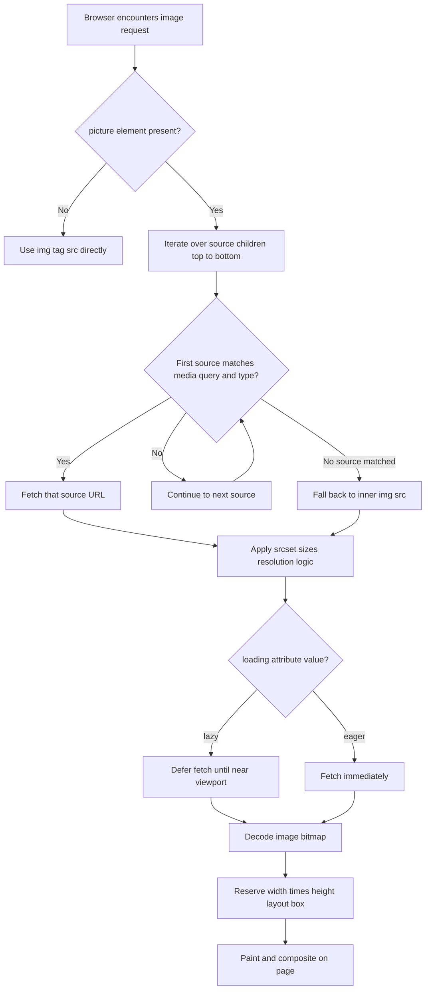
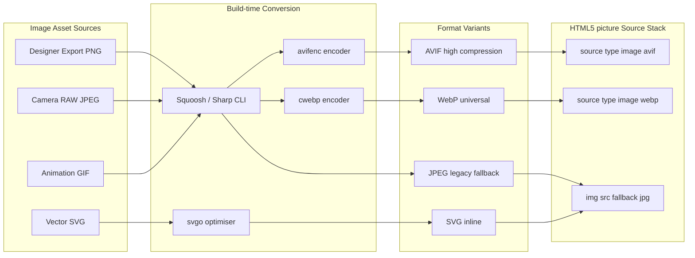
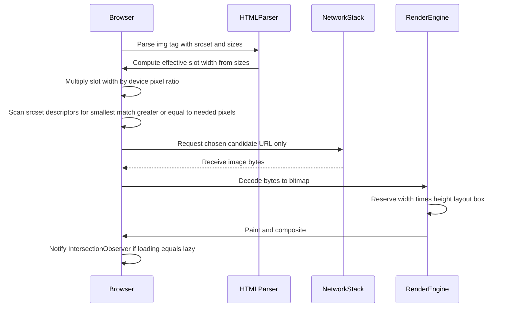
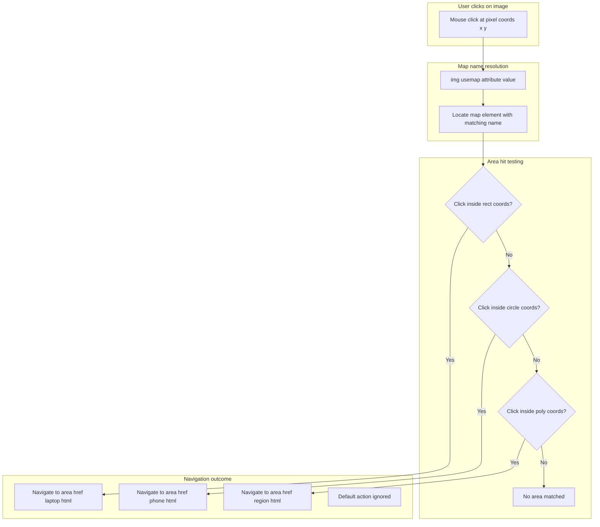
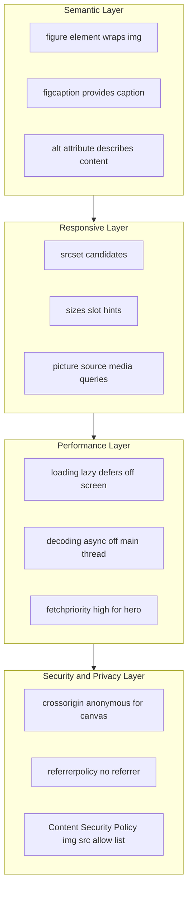

# Images

<!-- SECTION_1_START -->

# HTML5 Images — Core Technical Definition & Intuition

## 1.1 Formal Academic Definition (KTU 2024 Syllabus)

> [!IMPORTANT]
> **Image (HTML5 Context):** An *image* in HTML5 is a **replaced inline element** rendered by the browser using the `` tag (or the more semantic `<picture>` element) whose visual content is fetched from an external resource via the `src` (or `srcset`) attribute. The browser replaces the element's box with the bitmap/vector data after it is decoded from the network, making the image a *non-textual content node* governed by the HTML Living Standard.

In KTU terminology, images fall under **Module 1 — Creating web pages using HTML5**, specifically the sub-unit dealing with *multimedia and graphical content embedding*. The 2024 Scheme stresses three pillars:

1. **Semantic embedding** — using `<figure>`, `<figcaption>`, and `<picture>` correctly.
2. **Responsive delivery** — using `srcset`, `sizes`, and the `<picture>` element.
3. **Performance & Accessibility** — using `alt`, `loading="lazy"`, `decoding`, and `fetchpriority`.

## 1.2 Conceptual Analogy — The "Picture Frame" Intuition

Imagine you are decorating a wall in your house:

- The **`` tag** is the *empty picture frame* nailed to the wall. It declares: *"I will hold a picture, but I have not decided which one yet."*
- The **`src` attribute** is the *photo you slide into the frame* — the actual visual content.
- The **`alt` attribute** is the *small label on the frame's bottom edge* that tells a sight-impaired visitor (screen reader) what the photo depicts.
- The **`width` and `height` attributes** are the *fixed dimensions of the frame's inner glass* — the browser reserves that exact area while the image is still loading (preventing layout shift).
- The **`<picture>` element** is a *multi-photo display case with conditional slots*: depending on the room lighting (viewport size) or screen type (Retina vs. standard), one specific photo from the case is shown.

> [!NOTE]
> **Why does this matter for KTU exams?** The board examiner expects you to know that an image is a **replaced element** — the browser's render engine does not flow text inside it; instead, the image data *replaces* the element's box at paint time.

## 1.3 Standard Metrics & Constants

- **Default image rendering**: inline baseline alignment (text baseline alignment, `vertical-align: baseline` by default).
- **Intrinsic dimensions**: every image has a *natural width* and *natural height* in pixels (e.g., a $1920 \times 1080$ photo).
- **Aspect ratio** is preserved automatically when **only one** of `width`/`height` is specified:

$$\text{aspect\_ratio} = \frac{W_{\text{natural}}}{H_{\text{natural}}}$$

- **Resolution unit**: CSS pixels (logical pixels) by default; `srcset` descriptors use physical pixels via `x` (e.g., `2x` for Retina).
- **Standard browser fallback color** while image loads: transparent (no background fill).

> [!TIP]
> **GeoGebra / Visual Intuition:** Plot a coordinate grid where the x-axis is `width` in CSS pixels and the y-axis is `height` in CSS pixels. The line $y = (\frac{H_n}{W_n}) \cdot x$ represents the *aspect-ratio preservation curve*. Any point you choose on this line keeps the image distortion-free.

> [!VISUALIZATION CONTROL]
> **Concept:** Aspect-Ratio Preservation Under Width/Height Specification
> **GeoGebra / Desmos Input Equations:**
> * `f(x) = (1080/1920)*x`  (preserved height for a 1920x1080 image when only width is given)
> * Point: `(640, f(640))`     (resized to width=640px → height=360px)
> * Point: `(320, f(320))`     (resized to width=320px → height=180px)
> **Visual Description:** A straight line through the origin. Any chosen width on the x-axis gives a corresponding correct height on the y-axis. Picking a point *off* this line produces a stretched/squashed image.

---

<!-- SECTION_1_END -->

<!-- SECTION_2_START -->

# Deep Theoretical Analysis & KTU High-Yield Formula Sheet

## 2.1 The `` Element — Operational Decomposition

The `` tag is a **void element** (no closing tag, no children). When the parser encounters it, the following sequential logic fires in the browser:

1. **Tokenization** — HTML parser creates an `HTMLImageElement` node.
2. **Attribute resolution** — `src` (mandatory), `alt` (mandatory for accessibility), `width`, `height`, etc., are read.
3. **Lazy-load decision** — If `loading="lazy"`, the request is deferred until the image is near the viewport.
4. **Network fetch** — A `GET` request is issued for the resource at `src`.
5. **Decoding** — The bytes (JPEG/PNG/WebP/etc.) are decoded into a bitmap in GPU/CPU memory.
6. **Layout reservation** — The browser reserves a box of the specified `width` × `height` (or intrinsic size).
7. **Paint** — The decoded bitmap is rasterized into the element's box.
8. **Compositing** — The painted layer is blended with the rest of the page.

> [!IMPORTANT]
> **Why is `width`/`height` so critical in KTU 2024?** Setting them reserves the layout box *before* the image downloads, preventing **Cumulative Layout Shift (CLS)** — a Core Web Vitals metric.

## 2.2 The `<picture>` Element — Art-Directed Responsive Logic

`<picture>` is a *container* of `<source>` and `` elements. The browser iterates through `<source>` children and picks the **first one** whose media query / type / srcset matches. The trailing `` is the **fallback for every browser** (including older ones).

Operational logic (decision tree):

```
For each <source> in document order:
    1. Does the source's media query match the current viewport?  →  YES  →  USE this source
    2. Does the source's type MIME match a supported codec?       →  YES  →  USE this source
    3. Does the source's srcset offer a better resolution?        →  YES  →  USE this source
If no <source> matched:
    →  Fall back to the inner  element
```

## 2.3 Image Format Decision Matrix

| Format | MIME Type | Best Use Case | Transparency | Animation | Browser Support |
|---|---|---|---|---|---|
| JPEG | `image/jpeg` | Photographs | No | No | All |
| PNG | `image/png` | Logos, screenshots with transparency | Yes (8-bit alpha) | No | All |
| GIF | `image/gif` | Simple animations | Yes (1-bit) | Yes | All |
| WebP | `image/webp` | Universal modern replacement | Yes | Yes | All modern |
| AVIF | `image/avif` | Next-gen compression, HDR | Yes | Yes | Modern (Chrome, Firefox, Safari 16+) |
| SVG | `image/svg+xml` | Vector icons, logos, illustrations | Yes | Yes (via SMIL/CSS) | All |

## 2.4 Responsive Image Mathematics

When the browser sees:

```html

```

It performs the following calculation:

$$
\text{effective\_px} = \text{viewport\_width} \times \text{sizes\_multiplier}
$$

$$
\text{candidate\_density} = \frac{w_{\text{descriptor}}}{s_{\text{slot}}}
$$

The browser picks the descriptor whose density is **just larger** than the device's DPR (Device Pixel Ratio) to avoid downloading oversized files.

> [!NOTE]
> **KTU High-Yield:** The descriptor `400w` means "this candidate is 400 **physical pixels wide**," not 400 KB or 400 vw. Many students confuse `w` with `px` units in sizes.

## 2.5 KTU Formula & Attribute Cheat-Sheet

| Attribute / Concept | Syntax | Purpose | KTU Priority |
|---|---|---|---|
| `src` | `src="url"` | Source URL of the image | ★★★★★ |
| `alt` | `alt="text"` | Accessible alternative text | ★★★★★ |
| `width` / `height` | `width="300"` | Layout reservation in CSS pixels | ★★★★★ |
| `loading` | `loading="lazy \vert eager"` | Defer off-screen images | ★★★★ |
| `decoding` | `decoding="async \vert sync \vert auto"` | Hint for decode timing | ★★★ |
| `fetchpriority` | `fetchpriority="high \vert low \vert auto"` | Network priority hint | ★★★ |
| `srcset` | `srcset="url 1x, url 2x"` | Resolution switching | ★★★★ |
| `sizes` | `sizes="(max-width:600px) 100vw, 50vw"` | Slot width hint | ★★★★ |
| `crossorigin` | `crossorigin="anonymous"` | CORS for canvas use | ★★★ |
| `ismap` | `ismap` | Sends click coords to server | ★★ |
| `usemap` | `usemap="#mapname"` | Links to a `<map>` | ★★★ |
| `referrerpolicy` | `referrerpolicy="no-referrer"` | Privacy for the request | ★★ |
| `<picture>` | container | Art direction + format selection | ★★★★★ |
| `<source>` | child of `<picture>` | Conditional source | ★★★★★ |
| `<map>` / `<area>` | map definitions | Client-side image maps | ★★★ |
| `<figure>` / `<figcaption>` | semantic wrap | Captioned figures | ★★★★ |

> [!WARNING]
> **Vertical pipe escape rule:** In KTU answer sheets rendered as markdown, never use `|` inside table cells for absolute value. Use $\vert x \vert$ or $\mid x \mid$ in LaTeX instead.

## 2.6 Real-World Engineering Utility

- **E-commerce (Amazon/Flipkart)**: `<picture>` serves AVIF → WebP → JPEG to save 30-50% bandwidth.
- **CDN edge logic**: `srcset` integrates with Cloudflare/Akamai image resizers to deliver crop-specific images.
- **Accessibility compliance (WCAG 2.1)**: `alt` text is a legal requirement under Section 508 / EN 301 549.
- **PWA / offline-first**: Images are pre-cached in the service worker for offline display.
- **Web analytics**: `loading="lazy"` defers analytics-tracked image impressions until viewport entry, improving LCP (Largest Contentful Paint) scores.

---

<!-- SECTION_2_END -->

<!-- SECTION_3_START -->

# Step-by-Step Derivations, Code Implementation & Worked Examples

## 3.1 Exhaustive Example 1 — The Basic `` Element

**Problem:** Embed a photo of a sunset, $800$ px wide and $450$ px tall, with accessible alt text, in an HTML5 document.

**Step-by-step construction:**

```html
<!DOCTYPE html>
<html lang="en">
<head>
    <meta charset="UTF-8">
    <meta name="viewport" content="width=device-width, initial-scale=1.0">
    <title>KTU Image Demo - Basic</title>
</head>
<body>
    <h1>My Favourite Sunset</h1>

    <!-- The image element -->
    

</body>
</html>
```

**Line-by-line explanation:**

| Line | Purpose |
|---|---|
| `<!DOCTYPE html>` | Declares HTML5 document mode. |
| `<html lang="en">` | Root element with language for screen readers. |
| `<meta charset="UTF-8">` | Supports all Unicode characters (e.g., Malayalam script). |
| `<meta name="viewport" ...>` | Makes the page mobile-responsive. |
| `` | The `src` is **mandatory**; without it, the browser shows a broken-image icon. |
| `alt="..."` | **Mandatory** for accessibility — describes the image to visually impaired users. |
| `width="800" height="450"` | Reserves an $800 \times 450$ box → aspect ratio $\frac{800}{450} = \frac{16}{9}$. |
| `loading="lazy"` | Defers the network request until the image is ~viewport-distance away. |
| `decoding="async"` | Tells the browser to decode the image off the main thread. |

**Aspect-ratio verification:**

$$
\text{ratio} = \frac{W}{H} = \frac{800}{450} = \frac{16}{9} \approx 1.778
$$

This matches the $16{:}9$ HD standard — distortion-free rendering guaranteed.

---

## 3.2 Exhaustive Example 2 — The `<picture>` Element with Art Direction

**Problem:** Deliver three different image crops (a wide desktop shot, a square mobile shot, and a portrait tablet shot) along with format fall-back (AVIF → WebP → JPEG).

**Full source code:**

```html
<!DOCTYPE html>
<html lang="en">
<head>
    <meta charset="UTF-8">
    <meta name="viewport" content="width=device-width, initial-scale=1.0">
    <title>KTU Picture Demo - Art Direction</title>
    <style>
        body { font-family: Arial, sans-serif; margin: 20px; }
        picture, img { display: block; max-width: 100%; height: auto; }
    </style>
</head>
<body>
    <h1>KTU Campus — Responsive Showcase</h1>

    <picture>

        <!-- AVIF first (best compression) for wide desktop -->
        <source media="(min-width: 1024px)"
                type="image/avif"
                srcset="campus-wide.avif">

        <!-- WebP fallback for wide desktop -->
        <source media="(min-width: 1024px)"
                type="image/webp"
                srcset="campus-wide.webp">

        <!-- AVIF for tablet portrait -->
        <source media="(min-width: 600px) and (max-width: 1023px)"
                type="image/avif"
                srcset="campus-tablet.avif">

        <!-- WebP for tablet portrait -->
        <source media="(min-width: 600px) and (max-width: 1023px)"
                type="image/webp"
                srcset="campus-tablet.webp">

        <!-- Mandatory fallback  for all viewports and legacy browsers -->
        

    </picture>

</body>
</html>
```

**Decision flow executed by the browser:**

$$
\text{decision} = \begin{cases}
\text{campus-wide.avif} & \text{if viewport} \geq 1024\text{px and AVIF supported} \\
\text{campus-wide.webp} & \text{if viewport} \geq 1024\text{px and only WebP supported} \\
\text{campus-tablet.avif} & \text{if } 600 \leq \text{viewport} < 1024\text{px and AVIF supported} \\
\text{campus-tablet.webp} & \text{if } 600 \leq \text{viewport} < 1024\text{px and only WebP supported} \\
\text{campus-mobile.jpg} & \text{otherwise (fallback via )}
\end{cases}
$$

---

## 3.3 Exhaustive Example 3 — `<figure>`, `<figcaption>`, and Image Maps

**Problem:** Wrap an image in a semantic `<figure>`, add a caption, and overlay two clickable regions (a rectangle on a laptop and a circle on a phone) using an image map.

**Full source code:**

```html
<!DOCTYPE html>
<html lang="en">
<head>
    <meta charset="UTF-8">
    <meta name="viewport" content="width=device-width, initial-scale=1.0">
    <title>KTU Image Map Demo</title>
    <style>
        figure { margin: 20px; text-align: center; }
        figcaption { font-style: italic; color: #555; margin-top: 8px; }
    </style>
</head>
<body>
    <h1>Interactive Product Showcase</h1>

    <figure>
        <!-- The image being mapped -->
        

        <!-- The map definition -->
        <map name="devicemap">

            <!-- Rectangle over the laptop area -->
            <area shape="rect"
                  coords="50,80,300,350"
                  href="laptop.html"
                  alt="View laptop specifications">

            <!-- Circle over the phone area -->
            <area shape="circle"
                  coords="450,200,80"
                  href="phone.html"
                  alt="View phone specifications">

        </map>

        <!-- Semantic caption -->
        <figcaption>Click on a device to view its specifications.</figcaption>
    </figure>

</body>
</html>
```

**Coordinate system explanation:**

- The map uses the image's **intrinsic pixel coordinates** (not CSS pixels).
- The rectangle `coords="50,80,300,350"` means: top-left $(x_1, y_1) = (50, 80)$, bottom-right $(x_2, y_2) = (300, 350)$.
- The circle `coords="450,200,80"` means: center $(cx, cy) = (450, 200)$, radius $r = 80$ pixels.

**Geometric verification for the rectangle area:**

$$
A_{\text{rect}} = (x_2 - x_1) \times (y_2 - y_1) = (300 - 50) \times (350 - 80) = 250 \times 270 = 67{,}500 \text{ px}^2
$$

**Geometric verification for the circle area:**

$$
A_{\text{circle}} = \pi r^2 = \pi \times 80^2 = 6400\pi \approx 20{,}106.19 \text{ px}^2
$$

---

## 3.4 Exhaustive Example 4 — Resolution Switching with `srcset` and `sizes`

**Problem:** Serve three resolutions of a logo for a layout that occupies the full viewport on mobile but 50% viewport on desktop.

**Source code:**

```html
<!DOCTYPE html>
<html lang="en">
<head>
    <meta charset="UTF-8">
    <meta name="viewport" content="width=device-width, initial-scale=1.0">
    <title>KTU srcset Demo</title>
</head>
<body>
    <h1>Brand Logo — Resolution Aware</h1>

    

</body>
</html>
```

**Browser resolution-selection walk-through:**

| Viewport | Sizes slot | Effective CSS px | DPR | Needed physical px | Picked candidate |
|---|---|---|---|---|---|
| $360$ px (mobile) | $100\text{vw}$ | $360$ | $1$ | $360$ | `logo-400.png` (400w) |
| $360$ px (mobile, Retina) | $100\text{vw}$ | $360$ | $2$ | $720$ | `logo-800.png` (800w) |
| $1200$ px (desktop) | $50\text{vw}$ | $600$ | $1$ | $600$ | `logo-800.png` (800w) |
| $1200$ px (desktop, Retina) | $50\text{vw}$ | $600$ | $2$ | $1200$ | `logo-1600.png` (1600w) |

**Computation example (desktop, Retina):**

$$
\text{effective\_px} = 1200 \times 0.5 = 600 \text{ CSS px}
$$

$$
\text{physical\_px} = 600 \times 2 = 1200 \text{ device px}
$$

The browser scans `srcset` and picks the first descriptor $w \geq 1200$, which is `1600w`. The 400w and 800w candidates are discarded to avoid under-resolution.

---

## 3.5 Exhaustive Example 5 — `loading="lazy"` and `decoding="async"` Performance Setup

```html
<!DOCTYPE html>
<html lang="en">
<head>
    <meta charset="UTF-8">
    <meta name="viewport" content="width=device-width, initial-scale=1.0">
    <title>KTU Lazy Load Demo</title>
</head>
<body>
    <h1>Long Article with Many Images</h1>

    <p>Below-the-fold image (lazy):</p>
    

    <p>Another below-the-fold image:</p>
    

    <!-- Hero image (eager) -->
    

</body>
</html>
```

**Performance logic:**

- `loading="lazy"` defers the request until the image is within ~3 viewports of the visible region.
- `loading="eager"` (default) starts the fetch immediately — used for the **LCP image**.
- `fetchpriority="high"` boosts the hero image's network priority.
- `decoding="async"` lets the browser decode off the main thread, keeping the page responsive.

---

<!-- SECTION_3_END -->

<!-- SECTION_4_START -->

# Structural Diagrams & Schematics

## 4.1 Image Element Decision Flow (Mermaid Flowchart)



## 4.2 Image Format Selection Architecture (Mermaid Block Diagram)



## 4.3 Responsive Image Resolution Selection Topology (Mermaid Sequence)



## 4.4 Image Map Architecture (Mermaid Block Diagram)



## 4.5 Accessibility and Performance Layers (Mermaid Layered Topology)



---

<!-- SECTION_4_END -->

<!-- SECTION_5_START -->

# KTU 2024 Scheme Examination Question Bank & Topic Recap

## Part A — Short Answer Questions (3 Marks Each)

### Question A1 [KTU University Exam - July 2024]
**"List any three attributes of the `` tag in HTML5 and explain the role of the `alt` attribute."** (3 Marks, CO1, Remember)

**Model Answer:**

The three important attributes of the `` tag are:

1. **`src`** — Specifies the URL of the image resource to be displayed. It is a *mandatory* attribute; without it, the browser shows a broken-image icon. Example: `src="sunset.jpg"`.

2. **`alt`** — Provides alternative text describing the image. It is read aloud by screen readers and is also displayed by the browser if the image fails to load. Example: `alt="Sunset over Kovalam beach"`.

3. **`width` / `height`** — Specifies the intrinsic display dimensions in CSS pixels, reserving layout space to prevent Cumulative Layout Shift. Example: `width="800" height="450"`.

**Role of `alt`:**
- **Accessibility:** Screen readers (NVDA, JAWS, VoiceOver) announce the `alt` text to visually impaired users.
- **Fallback display:** When the image cannot be loaded due to network failure or a broken link, the browser displays the `alt` text in the image's box.
- **SEO:** Search engines use `alt` text to index and rank the image in image search results.

> **[Valuation Key: Naming each attribute: 1 mark × 3 = 3 Marks]**

---

### Question A2 [KTU University Exam - Dec 2023]
**"Differentiate between the `` tag and the `<picture>` element in HTML5."** (3 Marks, CO2, Understand)

**Model Answer:**

| Aspect | `` tag | `<picture>` element |
|---|---|---|
| **Element type** | Void (self-closing) element | Container element that wraps `<source>` and `` |
| **Purpose** | Embeds a single image resource | Enables *art direction* and *format negotiation* across viewports |
| **Source selection** | Single `src` URL only | Multiple `<source>` children with media/type/srcset matching |
| **Fallback** | None (uses its own `src`) | Falls back to the mandatory inner `` if no `<source>` matches |
| **Responsive support** | Supports `srcset` and `sizes` | Supports full media queries + `srcset` + `sizes` per source |
| **Use case** | Simple, single-format images | Hero banners, marketing images, format-negotiated delivery |

> **[Valuation Key: Any 3 correct differentiations: 1 mark each = 3 Marks]**

---

## Part B — Long Answer Questions (14 Marks Each, with Internal Choice)

### Question B-A (Choice 1) [KTU University Exam - July 2024]

**(a)** Explain the `srcset` and `sizes` attributes of the `` tag with a suitable example. How does the browser use them to select the appropriate image? **(7 Marks, CO2, Understand)**

**(b)** Design an HTML5 page that uses the `<picture>` element to display three different images based on viewport width, with a graceful JPEG fallback. Write the complete code and explain the browser's selection logic. **(7 Marks, CO3, Apply)**

---

#### Model Solution for B-A (a):

**`srcset` attribute:**
The `srcset` attribute lists one or more candidate image sources, each paired with a *width descriptor* (`w`) or *pixel-density descriptor* (`x`). The browser uses these descriptors to choose the most efficient source.

**`sizes` attribute:**
The `sizes` attribute tells the browser *what CSS-pixel slot* the image will occupy in the layout, as a function of media conditions. This is essential because the browser does not run the page's CSS during image selection.

**Combined example:**

```html

```

**Browser selection algorithm:**

1. **Compute the effective layout slot width** from `sizes`:
   - If viewport $\leq 600$ px → slot is $100\text{vw}$ (full viewport width).
   - Else → slot is $50\text{vw}$ (half viewport width).
2. **Multiply by the device pixel ratio (DPR)** to get the required physical pixel count.
3. **Scan the `srcset` descriptors** and pick the **smallest** candidate whose `w` value is $\geq$ the required physical pixels.
4. **Fetch only that one candidate**, ignoring the others.

**Worked numerical example** (desktop, viewport $1200$ px, DPR $2$):

$$
\text{slot} = 1200 \times 0.5 = 600 \text{ CSS px}
$$

$$
\text{required} = 600 \times 2 = 1200 \text{ device px}
$$

The browser picks `logo-1600.png` (1600w) as the smallest $w \geq 1200$.

> **[Valuation Key: Explaining srcset purpose: 2 Marks | Explaining sizes purpose: 2 Marks | Numerical example with DPR calculation: 2 Marks | Algorithm step listing: 1 Mark = 7 Marks]**

---

#### Model Solution for B-A (b):

**Required HTML5 page:**

```html
<!DOCTYPE html>
<html lang="en">
<head>
    <meta charset="UTF-8">
    <meta name="viewport" content="width=device-width, initial-scale=1.0">
    <title>Responsive Picture Demo</title>
    <style>
        body { font-family: Arial, sans-serif; padding: 20px; }
        picture, img { display: block; max-width: 100%; height: auto; }
    </style>
</head>
<body>
    <h1>KTU Campus Gallery</h1>

    <picture>
        <!-- Wide desktop crop -->
        <source media="(min-width: 1024px)"
                srcset="campus-wide.jpg">

        <!-- Tablet crop -->
        <source media="(min-width: 600px) and (max-width: 1023px)"
                srcset="campus-tablet.jpg">

        <!-- Mandatory fallback for all other viewports -->
        
    </picture>

</body>
</html>
```

**Browser's selection logic (decision table):**

| Viewport Width | Media Match | Image Picked |
|---|---|---|
| $\geq 1024$ px | First `<source>` matches | `campus-wide.jpg` |
| $600$ to $1023$ px | Second `<source>` matches | `campus-tablet.jpg` |
| $< 600$ px (or no match) | No `<source>` matches → fallback | `campus-mobile.jpg` (from ``) |

**Explanation of key points:**

- The browser scans the `<source>` children **in document order** and stops at the **first match**.
- The inner `` is the **mandatory fallback** — without it, the `<picture>` element renders nothing in legacy browsers.
- `loading="lazy"` on `` defers the fallback fetch until the image approaches the viewport.
- `max-width: 100%` in the CSS ensures the chosen image scales down on smaller viewports without distortion.

> **[Valuation Key: Correct DOCTYPE and structure: 1 Mark | Three correct sources with media queries: 3 Marks | Mandatory img fallback: 1 Mark | Decision table or logic explanation: 2 Marks = 7 Marks]**

---

### Question B-B (Choice 2) [KTU University Exam - Dec 2023]

**(a)** Explain image maps in HTML5. Write the HTML code to create an image map with a rectangular hot zone and a circular hot zone. **(7 Marks, CO2, Understand)**

**(b)** Discuss the importance of `alt` text, `loading="lazy"`, and the `<figure>` element in making image-rich web pages accessible and performant. **(7 Marks, CO3, Apply)**

---

#### Model Solution for B-B (a):

**Concept of image maps:**

An *image map* allows different regions of a single image to be clickable, each linking to a different destination. HTML5 supports **client-side image maps** (as opposed to the legacy server-side maps that used the `ismap` attribute). The mechanism uses three elements: `` (with `usemap`), `<map>` (defines the regions), and `<area>` (defines each region's shape and link).

**Shape types supported by `<area>`:**

| `shape` attribute | `coords` meaning |
|---|---|
| `rect` | `x1, y1, x2, y2` (top-left and bottom-right corners) |
| `circle` | `cx, cy, r` (center and radius) |
| `poly` | `x1, y1, x2, y2, ..., xn, yn` (vertices of a polygon) |
| `default` | The entire image (used as a fallback region) |

**Complete HTML code:**

```html
<!DOCTYPE html>
<html lang="en">
<head>
    <meta charset="UTF-8">
    <meta name="viewport" content="width=device-width, initial-scale=1.0">
    <title>Image Map Demo</title>
</head>
<body>
    <h1>Interactive Product Map</h1>

    

    <map name="productmap">
        <!-- Rectangular hot zone over the laptop -->
        <area shape="rect"
              coords="50,80,300,350"
              href="laptop.html"
              alt="View laptop specifications"
              target="_blank">

        <!-- Circular hot zone over the mobile phone -->
        <area shape="circle"
              coords="450,200,80"
              href="phone.html"
              alt="View phone specifications"
              target="_blank">
    </map>

</body>
</html>
```

**Coordinate verification:**

- Rectangle: top-left $(50, 80)$, bottom-right $(300, 350)$, area $= 250 \times 270 = 67{,}500$ px².
- Circle: center $(450, 200)$, radius $80$ px, area $= \pi \times 80^2 \approx 20{,}106$ px².

> **[Valuation Key: Concept of image map: 2 Marks | Code with img usemap: 1 Mark | Map element with name: 1 Mark | Rectangular area: 1 Mark | Circular area: 1 Mark | Coordinate explanation: 1 Mark = 7 Marks]**

---

#### Model Solution for B-B (b):

**Importance of `alt` text:**

- **Accessibility:** Screen readers (NVDA, JAWS, VoiceOver) announce `alt` text to users with visual impairments, conveying the image's *meaning* (not its appearance).
- **Legal compliance:** WCAG 2.1 (Success Criterion 1.1.1) and India's GIGW (Guidelines for Indian Government Websites) require non-text content to have a text alternative.
- **SEO:** Search engines like Google Image Search use `alt` text to index images and rank them in search results.
- **Fallback:** When the image fails to load (network error, broken URL), the browser displays the `alt` text in place of the image.

**Best practice for writing `alt` text:**

- Describe the *function* or *content* of the image, not its visual style. For example, use `alt="Submit button"` rather than `alt="Blue rectangle"`.
- Use `alt=""` (empty) for *purely decorative* images that convey no information, so screen readers skip them.
- Keep it concise — typically under $125$ characters.

**Importance of `loading="lazy"`:**

- The `loading` attribute (introduced in HTML5) can take the values `eager` (default) or `lazy`.
- When set to `lazy`, the browser defers the network request for off-screen images until the user scrolls them within the viewport's vicinity.
- This **saves bandwidth**, **reduces initial page load time**, and **improves Core Web Vitals** scores (LCP, CLS).
- It should *not* be used on above-the-fold hero images (which should use `loading="eager"` and `fetchpriority="high"`).

**Importance of the `<figure>` element:**

- `<figure>` is a **semantic** HTML5 element used to wrap self-contained illustrative content such as images, diagrams, code listings, or videos.
- It is typically paired with `<figcaption>`, which provides a visible caption for the figure.
- Semantic benefits:
  - **Screen readers** can navigate to figures as distinct landmarks.
  - **Search engines** understand that the caption is associated with the image, improving image search accuracy.
  - **CSS and JavaScript** can target the entire figure as a single unit for styling and interaction.

**Example combining all three concepts:**

```html
<figure>
    
    <figcaption>Figure 1: KTU placement trends (2020-2024).</figcaption>
</figure>
```

> **[Valuation Key: alt text purpose and best practices: 3 Marks | loading lazy purpose and caveats: 2 Marks | figure element semantic role: 2 Marks = 7 Marks]**

---

> [!WARNING]
> **KTU Examiner's Valuation Warning — Common Pitfalls:**
> 1. **Missing `alt` attribute:** Even if empty, omitting `alt` entirely is a violation of HTML5 validity and WCAG accessibility rules. The board examiner deducts **at least 1 mark** for this.
> 2. **Forgetting the fallback `` inside `<picture>`:** Without the inner ``, the entire `<picture>` element renders nothing in any browser. This is a **fatal structural error** and loses 2-3 marks.
> 3. **Confusing `srcset` descriptors `w` vs. `x`:** The `w` descriptor is in *image pixels*, the `x` descriptor is in *device pixel ratio*. Writing `srcset="img.jpg 1x"` means "1x DPR" (standard), while `400w` means "400 image pixels wide." Mixing them up loses marks.
> 4. **Wrong coordinates in `<area>`:** For `rect`, the order is `x1, y1, x2, y2` (top-left, then bottom-right). Forgetting the comma sequence is a common slip.
> 5. **Setting `width` AND `height` to non-aspect-ratio-preserving values:** While not strictly invalid, it visually distorts the image. Examiners may deduct marks for "incorrect image rendering" if the question asks for distortion-free embedding.
> 6. **Using `loading="lazy"` on the LCP image:** Lazy-loading the hero/above-the-fold image is a *performance anti-pattern* and may lose 1 mark in performance-focused questions.

---

## Topic Recap & Important Things to Remember

> [!TIP]
> **High-density revision checklist for the KTU exam hall:**

- **`` is a void element** — no closing tag, no children. Mandatory attributes: `src` and `alt`.
- **`alt` text is mandatory** for accessibility; use `alt=""` (empty) only for decorative images.
- **`width` and `height`** reserve layout space and prevent Cumulative Layout Shift (CLS).
- **`<picture>` is a container** that holds `<source>` elements and a *mandatory* fallback ``.
- **Browser picks the FIRST `<source>` whose media query and type match**; document order matters.
- **`srcset` uses `w` descriptor** (image pixel width) or `x` descriptor (pixel density). They cannot be mixed in the same `srcset`.
- **`sizes` tells the browser the layout slot** in CSS pixels via media conditions; the browser multiplies by DPR.
- **Image formats:** JPEG (photos), PNG (logos, transparency), GIF (animation), WebP (modern universal), AVIF (next-gen), SVG (vector).
- **Image maps** use `` plus `<map name="name">` with `<area>` children of shapes: `rect`, `circle`, `poly`, `default`.
- **`<figure>` + `<figcaption>`** is the semantic way to caption an image; do not use a generic `<div>`.
- **`loading="lazy"`** defers off-screen images; **never** use it on the LCP/hero image.
- **`decoding="async"`** allows off-main-thread image decoding, improving responsiveness.
- **`fetchpriority="high"`** boosts the priority of important images (e.g., hero banners).
- **Aspect ratio formula:**

$$
\text{ratio} = \frac{W}{H}
$$

Specifying only one of `width`/`height` keeps the ratio intact.

- **Image-mapped coordinate system** uses intrinsic pixel coordinates, not CSS pixels.
- **For every 7-mark sub-question**, expect 4-5 marks for the code and 2-3 marks for the explanation/derivation.
- **The `` element is a *replaced element*** — the browser renders the image bitmap *instead of* the element's content, unlike text elements where the browser flows text.

<!-- SECTION_5_END -->
