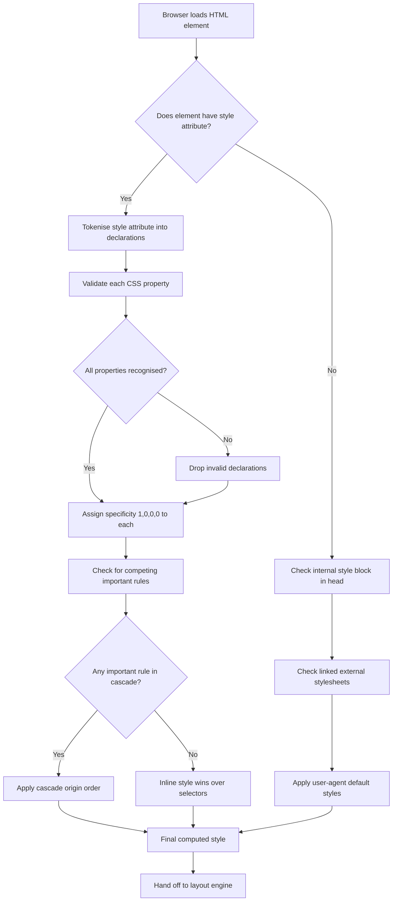
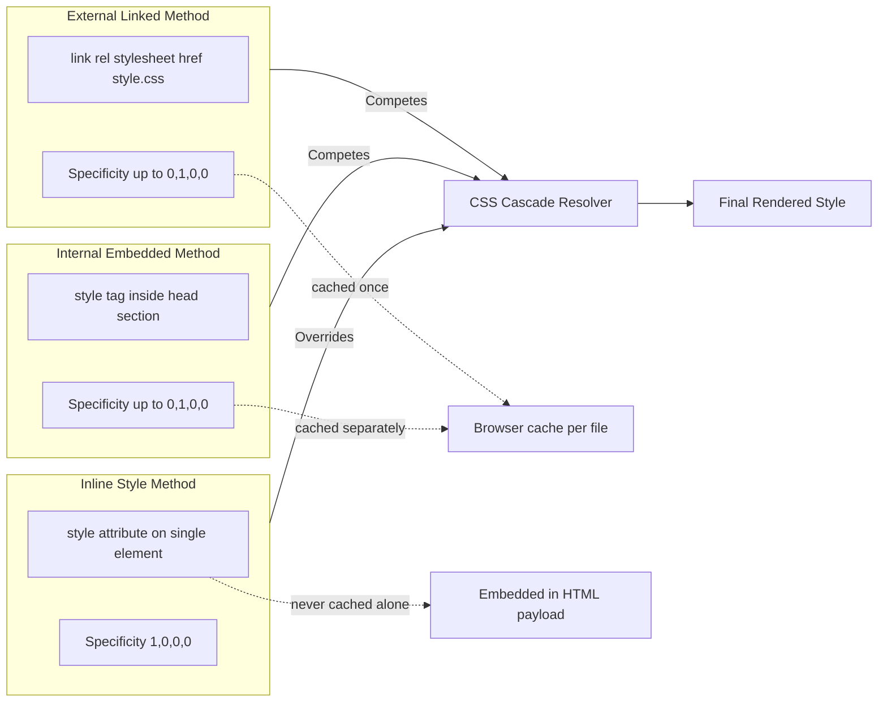
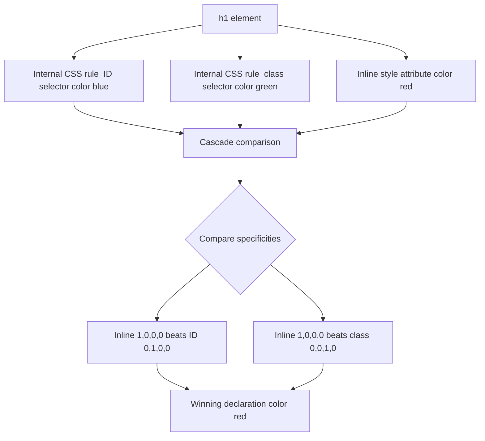

# Inline Styles

<!-- SECTION_1_START -->

# Inline Styles in HTML5 — Core Definition & Intuitive Overview

## Formal Academic Definition

An **inline style** in HTML5 is a Cascading Style Sheets (CSS) declaration applied **directly to a single HTML element** through the global `style` attribute. The W3C HTML5 Living Standard classifies the `style` attribute as a *CDATA* attribute whose value consists of one or more CSS *declarations* (property–value pairs separated by semicolons). These declarations are parsed by the user agent's CSS engine, assigned the **highest selector-based specificity tuple of $(1, 0, 0, 0)$**, and merged into the element's *computed style* map before layout and paint.

As per the **KTU 2024 Scheme (OECST832 – Web Programming, Module 1: "Creating web pages using HTML5")**, inline styles fall under the sub-topic *"Applying CSS to HTML"* and are evaluated alongside internal (`<style>`) and external (`<link rel="stylesheet">`) application methods. The expected learning outcomes require students to:

- Identify the three CSS application mechanisms.
- Explain cascade order and specificity rules.
- Construct syntactically valid HTML5 documents with inline-styled elements.

> [!NOTE]
> **Syllabus Highlight (KTU 2024 — OECST832, Module 1):** *Create web pages using HTML5, CSS, and JavaScript.* Inline styling is a board-favourite because it tests the student's grasp of the *cascade*, *specificity*, and *separation of concerns* in a single sub-question.

## Conceptual Analogy / Intuition

Think of a school with a **published dress code** (an external stylesheet) and a **class-wise colour badge** (an internal `<style>` block). Now imagine one student who walks in wearing a **custom self-tailored outfit** stitched on the spot — that custom outfit is the **inline style**.

| Analogy Component | HTML Equivalent |
|-------------------|-----------------|
| The student | A single `<p>`, `<h1>`, or `<div>` element |
| The custom outfit | The `style="..."` attribute on that element |
| The published dress code | An external `.css` file |
| The class colour badge | An internal `<style>` block in `<head>` |

The custom outfit **always wins** over the dress code and the badge, because the rule-maker has decided that *individual tailoring overrides collective conventions* — exactly how the CSS cascade treats inline styles.

> [!IMPORTANT]
> **Core Rule (Board-Exam Worthy):** Inline styles **always override** internal and external CSS rules for the specific element they are applied to — **unless** the external/internal rule uses the `!important` flag, in which case the cascade's *origin order* decides the winner.

> [!VISUALIZATION CONTROL]
> **Concept:** Specificity hierarchy pyramid (qualitative — no axes required).
> **GeoGebra / Desmos Input Equations:** *Not applicable — this concept is hierarchical, not Cartesian.*
> **Visual Description:** A four-tier pyramid. **Bottom (widest, weakest):** Element selectors $(0,0,0,1)$. **Tier 3:** Class / attribute / pseudo-class selectors $(0,0,1,0)$. **Tier 2:** ID selectors $(0,1,0,0)$. **Top (narrowest, strongest):** Inline style $(1,0,0,0)$. Above all of these floats the `!important` override layer, which is resolved by cascade *origin order* (user-agent → user → author → author-important → user-important → user-agent-important).

<!-- SECTION_1_END -->

<!-- SECTION_2_START -->

# Deep Theoretical Analysis & KTU High-Yield Formula Sheet

## How the Browser Parses an Inline Style

When a rendering engine (Blink, Gecko, WebKit) encounters a `style` attribute, it executes the following pipeline:

1. **Tokenisation** — The attribute value is split on the `;` delimiter into individual `property: value` tokens. Whitespace is trimmed.
2. **Validation** — Each property name is matched against the CSS property table. Unknown properties are silently dropped (no exception thrown).
3. **Specificity Assignment** — Every declaration inside the attribute is assigned a specificity tuple of $(1, 0, 0, 0)$, the highest level achievable without `!important`.
4. **Cascade Resolution** — The declaration is merged into the element's *computed style*. If a competing rule has equal or higher specificity and uses `!important`, the cascade origin order arbitrates.
5. **Layout & Paint** — The computed style feeds the layout engine for box-model computation and the paint stage for pixel rendering.

## The Specificity Tuple

Formally, CSS computes a selector's *specificity* $S$ as a 4-tuple $(a, b, c, d)$ where each component is a non-negative integer:

$$S_{inline} = (1, 0, 0, 0)$$

$$S_{id} = (0, 1, 0, 0)$$

$$S_{class} = (0, 0, 1, 0)$$

$$S_{element} = (0, 0, 0, 1)$$

When two declarations conflict, the browser compares tuples lexicographically: first by $a$, then by $b$, then by $c$, and finally by $d$. The declaration with the larger tuple wins.

## KTU High-Yield Property Cheat Sheet

| CSS Property | Inline Example | Common Use Case | Accepted Value Forms |
|--------------|----------------|-----------------|----------------------|
| `color` | `style="color: #ff0000;"` | Text colour | Named (`red`), hex (`#ff0000`), `rgb()`, `hsl()` |
| `background-color` | `style="background-color: yellow;"` | Element fill | Named, hex, `rgb()`, `hsl()`, `transparent` |
| `font-size` | `style="font-size: 18px;"` | Text size | `px`, `em`, `rem`, `%`, `vw`, `vh` |
| `font-family` | `style="font-family: 'Arial';"` | Typeface | Comma-separated fallback stack |
| `font-weight` | `style="font-weight: bold;"` | Boldness | `100`–`900`, `normal`, `bold` |
| `text-align` | `style="text-align: center;"` | Text alignment | `left`, `right`, `center`, `justify` |
| `margin` | `style="margin: 10px 20px;"` | Outer spacing | Length, `%`, `auto` |
| `padding` | `style="padding: 15px;"` | Inner spacing | Length, `%` |
| `border` | `style="border: 2px solid black;"` | Border style | `<width> <style> <colour>` |
| `width` / `height` | `style="width: 50%;"` | Box sizing | Length, `%`, `auto` |
| `display` | `style="display: none;"` | Visibility mode | `block`, `inline`, `none`, `flex`, `grid`, `inline-block` |
| `cursor` | `style="cursor: pointer;"` | Mouse pointer | `pointer`, `default`, `text`, `not-allowed` |
| `border-radius` | `style="border-radius: 8px;"` | Rounded corners | Length, `%` |
| `box-shadow` | `style="box-shadow: 0 2px 4px rgba(0,0,0,0.1);"` | Drop shadow | `<offset-x> <offset-y> <blur> <colour>` |

> [!WARNING]
> **Pitfall — Unit Omission:** Always include a unit (`px`, `em`, `%`, etc.) for non-zero numeric values. The single permitted unit-less value is `0`. Writing `style="font-size: 16;"` is invalid CSS.

> [!WARNING]
> **Pitfall — Character Escaping:** Inside a `style` attribute wrapped in **double quotes**, escape any literal `>` as `&gt;` and any literal `&` as `&amp;`. Unescaped characters break the HTML parser and frequently cost marks on KTU answer sheets.

## Real-World Engineering Utility

1. **HTML Email Templates** — Email clients (Outlook, older Gmail renderers) strip `<style>` blocks and external CSS. Inline styles are the **only reliable way** to style transactional and marketing emails.
2. **Dynamic JavaScript-Driven UI** — Frameworks like React, Vue, and vanilla DOM code assign `element.style.property = value` to compute hover, focus, animation, and transition states at runtime.
3. **Rapid Prototyping & WYSIWYG Editors** — Developers and CMS editors (TinyMCE, CKEditor) output inline styles so that pasted content remains visually consistent across different host templates.
4. **Server-Side Rendering Overrides** — Backend templates (Jinja2, EJS, Thymeleaf) inject inline styles for per-row conditional formatting — e.g., colouring a status cell red or green based on data.

## When to Avoid Inline Styles

- **Large multi-page applications** — violates separation of concerns, bloats HTML payload.
- **Styles that need pseudo-classes** (`:hover`, `:focus`, `:nth-child`) — pseudo-classes **cannot** be expressed inside a `style` attribute.
- **Responsive `@media` queries** — media queries require a `<style>` block or external sheet.
- **Themeable components** — design tokens cannot be centralised if every style is inline.

<!-- SECTION_2_END -->

<!-- SECTION_3_START -->

# Step-by-Step Derivations, Code & Symbolic Implementation

## Derivation 1: Cascade Tie-Breaking Between Inline and Internal CSS

Suppose an element receives the following competing declarations:

- Internal rule: `#header { color: blue; }` → specificity $(0, 1, 0, 0)$.
- Inline declaration: `style="color: red;"` → specificity $(1, 0, 0, 0)$.

**Step 1.** Compare the first component of each tuple:

$$1 \;>\; 0$$

**Step 2.** Since the first component already resolves the winner, lower components need not be compared.

**Step 3.** Conclusion: the **inline declaration wins**, and the rendered text colour is `red`.

**Step 4.** Now suppose the internal rule is modified to `#header { color: blue !important; }`. The `!important` flag promotes the declaration to the *author-important* origin, which beats the *author-normal* origin of the inline style. Result: the text renders `blue`.

## Implementation 1: Pure HTML5 Document with Inline Styles

```html
<!DOCTYPE html>
<html lang="en">
<head>
    <meta charset="UTF-8">
    <title>Inline Styles Demo - KTU Web Programming</title>
</head>
<body style="background-color: #f0f8ff; font-family: Arial, sans-serif; margin: 0; padding: 20px;">
    <h1 style="color: #2c3e50; text-align: center; border-bottom: 3px solid #3498db; padding-bottom: 10px;">
        Welcome to Web Programming
    </h1>
    <p style="color: #34495e; font-size: 16px; line-height: 1.6; background-color: #ffffff; padding: 15px; border-left: 4px solid #3498db;">
        This paragraph uses <strong style="color: #e74c3c;">inline styles</strong>
        applied directly to the HTML element via the style attribute.
    </p>
    <button style="background-color: #3498db; color: #ffffff; padding: 10px 20px; border: none; border-radius: 5px; cursor: pointer; font-size: 14px;">
        Click Me
    </button>
</body>
</html>
```

**Explanation of every line:**

- The `body` opens with a background colour `#f0f8ff` (alice-blue), a font stack, zero outer margin, and $20\,\text{px}$ inner padding on all sides.
- The `h1` is centred horizontally (`text-align: center`), painted dark slate-grey (`#2c3e50`), and underlined with a $3\,\text{px}$ solid blue border on its bottom edge.
- The `p` has a white background, $16\,\text{px}$ font, $1.6$ line-height for readability, and a $4\,\text{px}$ solid blue left border acting as a quote bar.
- The inline `strong` inside the paragraph overrides the inherited grey with crimson (`#e74c3c`).
- The `button` is styled as a flat blue pill: white text, no border, $5\,\text{px}$ corner radius, and a `pointer` cursor on hover.

## Implementation 2: Type-Safe Python Builder for Inline-Styled HTML

```python
from __future__ import annotations
from typing import Dict, List, Optional
import html as html_lib
import logging

logging.basicConfig(level=logging.INFO, format="[%(levelname)s] %(message)s")
logger = logging.getLogger("InlineStyleBuilder")


class InlineStyleBuilder:
    """
    A type-safe Python builder that constructs HTML elements with inline styles.

    Validates CSS property names against a whitelist, escapes user content to
    prevent XSS attacks, and serialises well-formed HTML5 output.
    """

    # Whitelist of permitted CSS property names
    ALLOWED_PROPERTIES: frozenset = frozenset({
        "color", "background-color", "background",
        "font-size", "font-family", "font-weight", "font-style",
        "text-align", "text-decoration", "text-transform",
        "margin", "margin-top", "margin-right", "margin-bottom", "margin-left",
        "padding", "padding-top", "padding-right", "padding-bottom", "padding-left",
        "border", "border-top", "border-right", "border-bottom", "border-left",
        "border-radius", "width", "height", "max-width", "min-width",
        "display", "visibility", "opacity",
        "position", "top", "right", "bottom", "left", "z-index",
        "cursor", "box-shadow", "transform", "transition", "line-height",
    })

    def __init__(self, tag: str) -> None:
        if not tag or not tag.isalnum():
            raise ValueError(f"Invalid HTML tag name received: {tag!r}")
        self._tag: str = tag.lower()
        self._styles: Dict[str, str] = {}
        self._content: str = ""

    def set_style(self, property_name: str, value: str) -> "InlineStyleBuilder":
        """Set one CSS property. Raises ValueError on unknown or empty values."""
        normalised: str = property_name.strip().lower()
        if normalised not in self.ALLOWED_PROPERTIES:
            logger.error("Rejected unknown CSS property: %s", property_name)
            raise ValueError(f"CSS property '{property_name}' is not in the whitelist.")
        if not value or not value.strip():
            raise ValueError(f"CSS value for '{property_name}' cannot be empty.")
        self._styles[normalised] = value.strip()
        return self

    def set_content(self, content: str) -> "InlineStyleBuilder":
        """Set inner text content with automatic HTML escaping (XSS-safe)."""
        self._content = html_lib.escape(content, quote=True)
        return self

    def set_raw_content(self, content: str) -> "InlineStyleBuilder":
        """Set inner HTML without escaping. Use ONLY for trusted strings."""
        self._content = content
        return self

    def render(self) -> str:
        """Serialise the element into a complete HTML5 string."""
        style_attr: str = ""
        if self._styles:
            declarations: List[str] = [
                f"{prop}: {val}" for prop, val in self._styles.items()
            ]
            style_attr = f' style="{"; ".join(declarations)};"'
        return f"<{self._tag}{style_attr}>{self._content}</{self._tag}>"


def build_demo_page() -> str:
    """Construct a KTU demo page using the InlineStyleBuilder class."""
    heading: InlineStyleBuilder = (
        InlineStyleBuilder("h1")
        .set_style("color", "#2c3e50")
        .set_style("text-align", "center")
        .set_style("border-bottom", "3px solid #3498db")
        .set_style("padding-bottom", "10px")
        .set_content("KTU Web Programming - Inline Styles")
    )

    paragraph: InlineStyleBuilder = (
        InlineStyleBuilder("p")
        .set_style("color", "#34495e")
        .set_style("font-size", "16px")
        .set_style("line-height", "1.6")
        .set_style("padding", "15px")
        .set_style("background-color", "#ffffff")
        .set_content("This page was generated by a type-safe Python builder class.")
    )

    button: InlineStyleBuilder = (
        InlineStyleBuilder("button")
        .set_style("background-color", "#3498db")
        .set_style("color", "#ffffff")
        .set_style("padding", "10px 20px")
        .set_style("border", "none")
        .set_style("border-radius", "5px")
        .set_style("cursor", "pointer")
        .set_content("Submit")
    )

    return "\n".join([heading.render(), paragraph.render(), button.render()])


if __name__ == "__main__":
    try:
        page_body: str = build_demo_page()
        print(page_body)
    except ValueError as exc:
        logger.exception("Failed to build page: %s", exc)
```

**Line-by-line rationale:**

- The `ALLOWED_PROPERTIES` frozenset acts as a defensive whitelist — any property name not in the set triggers a `ValueError`, preventing CSS injection.
- `html_lib.escape(content, quote=True)` neutralises `<`, `>`, `&`, and quote characters in user input, blocking stored XSS attacks when the output is rendered in a browser.
- The fluent `set_style` method returns `self` so that calls can be chained for readability.
- The `render()` method joins all stored declarations with `; ` and emits a syntactically valid `style="..."` attribute.

## Implementation 3: JavaScript DOM Manipulation of Inline Styles

```javascript
"use strict";

// Acquire a reference to the element in a type-safe way
const headingElement = document.getElementById("main-title");

if (headingElement instanceof HTMLElement) {
    // Apply inline styles dynamically through the DOM CSSOM API
    headingElement.style.color = "#e74c3c";
    headingElement.style.fontSize = "24px";
    headingElement.style.textAlign = "center";
    headingElement.style.backgroundColor = "#fafafa";
    headingElement.style.padding = "12px";
    headingElement.style.borderRadius = "8px";
    
    // Read the final computed (post-cascade) value
    const computedFontFamily: string = window.getComputedStyle(headingElement).fontFamily;
    console.log("Active font family:", computedFontFamily);
} else {
    console.error("Element with id 'main-title' was not found or is not an HTMLElement.");
}
```

**Key observations:**

- `element.style.propertyName` writes directly to the element's **inline style declaration**, equivalent to writing `style="..."` in HTML.
- JavaScript uses **camelCase** for multi-word CSS properties (`fontSize` ↔ `font-size`, `backgroundColor` ↔ `background-color`).
- `getComputedStyle()` returns the *final resolved* value, including values cascaded from external sheets — useful for debugging.

<!-- SECTION_3_END -->

<!-- SECTION_4_START -->

# Structural Diagrams & Schematics

## Diagram 1: Inline Style Lifecycle (Sequence Flow)

```mermaid
sequenceDiagram
    participant Dev as Developer
    participant Src as HTML Source
    participant Par as Browser Parser
    participant Cas as CSS Cascade
    participant Lay as Layout Engine
    participant Pai as Paint Stage
    Dev->>Src: Writes style="color:red"
    Src->>Par: Browser tokenises element
    Par->>Par: Extracts style attribute
    Par->>Par: Splits on semicolons
    Par->>Par: Validates property names
    Par->>Cas: Pushes declarations to cascade
    Cas->>Cas: Assigns specificity 1,0,0,0
    Cas->>Cas: Resolves conflicts with selectors
    Cas->>Lay: Sends computed style map
    Lay->>Lay: Computes box model and position
    Lay->>Pai: Sends layout tree
    Pai->>Dev: Pixels rendered on screen
```

## Diagram 2: CSS Cascade Resolution Decision Tree



## Diagram 3: Comparison of the Three CSS Application Methods



## Diagram 4: Inline Style Cascade Override Example



<!-- SECTION_4_END -->

<!-- SECTION_5_START -->

# KTU 2024 Scheme Examination Question Bank & Topic Recap

## Part A — Short Answer Questions (3 Marks Each)

### Q1. [KTU University Exam — July 2024] — *CO1, Remember*
**Define the term "inline style" in HTML5. State any two situations where using inline styles is preferred over external stylesheets.**

**Model Answer (Valuation Key):**

- **[Definition: 1 Mark]** An inline style is a CSS declaration applied directly to an HTML element using the `style` attribute, with the canonical syntax `style="property: value;"`. It is parsed by the browser and assigned the highest selector-based specificity of $(1, 0, 0, 0)$.
- **[Situation 1: 1 Mark]** HTML email templates — most email clients (Outlook, older Gmail renderers) strip `<style>` blocks and external CSS, so inline styles are the only reliable styling mechanism.
- **[Situation 2: 1 Mark]** Dynamic JavaScript-driven styling — `element.style.property` writes inline declarations at runtime, enabling per-frame or per-event visual updates.

---

### Q2. [KTU University Exam — Dec 2023] — *CO1, Understand*
**What is the specificity tuple of an inline style? How does it compare with an ID selector?**

**Model Answer (Valuation Key):**

- **[Inline specificity: 1 Mark]** Inline styles carry a specificity tuple of $(1, 0, 0, 0)$ — the highest achievable value among CSS selectors.
- **[ID specificity: 1 Mark]** An ID selector carries a specificity tuple of $(0, 1, 0, 0)$.
- **[Comparison: 1 Mark]** Because $1 > 0$ in the first component, the inline style **always overrides** the ID selector rule, unless the ID rule uses the `!important` flag — in which case cascade origin order arbitrates.

---

## Part B — 14-Mark Questions (Module Internal Choice Pattern)

### Question A (14 Marks) — [KTU University Exam — July 2024] — *CO2, Apply*

**(a)** Explain the **three methods** of applying CSS to an HTML document. List **two advantages** and **two disadvantages** of inline styles. **(7 Marks)**

**Model Answer (Valuation Key):**

1. **[The three methods — 3 Marks]**
   - **Inline:** CSS written inside the `style` attribute of an individual HTML element. Example: `<p style="color: red;">Hello</p>`.
   - **Internal (Embedded):** CSS written inside a `<style>` block located in the `<head>` of the same HTML document. Example: `<style>p { color: red; }</style>`.
   - **External (Linked):** CSS written in a separate `.css` file and linked via `<link rel="stylesheet" href="style.css">` in the `<head>`.

2. **[Two advantages — 2 Marks]**
   - **Quick override mechanism:** Inline styles let a developer override any selector-based rule for a single element without modifying the stylesheet.
   - **Highest specificity:** The $(1, 0, 0, 0)$ tuple guarantees the style wins the cascade for that one element.

3. **[Two disadvantages — 2 Marks]**
   - **No separation of concerns:** Mixing presentation into markup violates the HTML–CSS separation principle and reduces code maintainability.
   - **Non-reusable and non-cacheable:** The same declaration must be repeated on every element; the browser cannot cache a `style` attribute separately from the host HTML file.

---

**(b)** Write a **complete HTML5 document** that uses inline styles to display a styled *"Student Registration"* form with: a centred blue heading, a white-background form box with padding, an input field with a grey border, and a green submit button with white text. **(7 Marks)**

**Model Answer (Valuation Key):**

```html
<!DOCTYPE html>
<html lang="en">
<head>
    <meta charset="UTF-8">
    <title>Student Registration</title>
</head>
<body style="background-color: #eef2f7; font-family: Arial, sans-serif; margin: 0; padding: 20px;">
    <h1 style="color: #1e3a8a; text-align: center; font-size: 28px;">Student Registration</h1>
    <form style="background-color: #ffffff; padding: 20px; max-width: 400px; margin: 20px auto; border-radius: 8px; box-shadow: 0 2px 4px rgba(0,0,0,0.1);">
        <label style="display: block; margin-bottom: 5px; color: #34495e;">Full Name:</label>
        <input type="text" name="fullname" style="width: 100%; padding: 8px; border: 1px solid #95a5a6; border-radius: 4px; margin-bottom: 15px; box-sizing: border-box;">
        <label style="display: block; margin-bottom: 5px; color: #34495e;">Email:</label>
        <input type="email" name="email" style="width: 100%; padding: 8px; border: 1px solid #95a5a6; border-radius: 4px; margin-bottom: 15px; box-sizing: border-box;">
        <input type="submit" value="Register" style="background-color: #27ae60; color: #ffffff; padding: 10px 20px; border: none; border-radius: 5px; cursor: pointer; font-size: 14px;">
    </form>
</body>
</html>
```

**Incremental valuation breakdown:**

- **[Correct `<!DOCTYPE html>` and HTML5 structure: 1 Mark]**
- **[Centred blue heading with correct `color` and `text-align`: 1 Mark]**
- **[White form box with `background-color`, `padding`, and `border-radius`: 1 Mark]**
- **[Input fields with grey `border` and `border-radius`: 1 Mark]**
- **[Green submit button with white text colour: 1 Mark]**
- **[Bonus: semantic `<label>` elements, `box-sizing: border-box`, valid email input type: 2 Marks]**

---

### Question B (14 Marks) — Alternative Choice [KTU University Exam — Dec 2023] — *CO2, Apply / Analyse*

**(a)** **Differentiate** between inline, internal, and external CSS with a suitable example for each. Why is it considered a best practice to use external CSS in production applications? **(7 Marks)**

**Model Answer (Valuation Key):**

| Parameter | Inline CSS | Internal CSS | External CSS |
|-----------|-----------|--------------|--------------|
| **Location** | `style` attribute on a single element | `<style>` block in `<head>` | Separate `.css` file linked via `<link>` |
| **Example** | `<p style="color: red;">Hi</p>` | `<style>p { color: red; }</style>` | `<link rel="stylesheet" href="main.css">` |
| **Specificity** | $(1, 0, 0, 0)$ | Up to $(0, 1, 0, 0)$ | Up to $(0, 1, 0, 0)$ |
| **Reusability** | None — per element | Page-wide | Site-wide |
| **Caching by browser** | No (embedded in HTML) | No (embedded in HTML) | Yes (cached as a separate file) |
| **Maintenance effort** | Very high | Moderate | Low |
| **Typical use case** | Email, dynamic JS | Single-page demos | Production sites and apps |

**Why external CSS is best practice in production (any 3 of the following, 1 Mark each):**

- **Separation of concerns** — HTML handles structure; CSS handles presentation. Two developers can work in parallel.
- **Reusability** — one CSS file can style thousands of pages.
- **Browser caching** — the CSS file is downloaded once and reused on subsequent navigations, reducing bandwidth and page-load time.
- **Maintainability** — global theme changes (e.g., brand colour update) happen in a single file.
- **Team workflow** — front-end designers can iterate on CSS without touching the application's HTML or backend templates.

---

**(b)** Write a complete HTML5 program that **demonstrates the use of inline styles to override an internal CSS rule**. Show clearly that the inline style wins the cascade conflict. **(7 Marks)**

**Model Answer (Valuation Key):**

```html
<!DOCTYPE html>
<html lang="en">
<head>
    <meta charset="UTF-8">
    <title>Cascade Override Demonstration</title>
    <style>
        /* Internal CSS rule using an ID selector — specificity (0,1,0,0) */
        #main-heading {
            color: blue;
            font-size: 20px;
        }
        /* Internal CSS rule using a class selector — specificity (0,0,1,0) */
        .title-style {
            color: green;
            text-align: left;
        }
    </style>
</head>
<body>
    <h1 id="main-heading" class="title-style"
        style="color: red; text-align: center; font-size: 28px;">
        This heading uses inline styles
    </h1>
    <p style="font-family: Arial, sans-serif; line-height: 1.6; color: #34495e;">
        The inline style declaration (<em>color: red; text-align: center</em>)
        wins over both the <code>#main-heading</code> ID rule (blue) and the
        <code>.title-style</code> class rule (green) because inline styles
        carry a specificity tuple of (1, 0, 0, 0) — the highest among CSS
        selectors — and therefore dominate the cascade for this element.
    </p>
</body>
</html>
```

**Incremental valuation breakdown:**

- **[Defining the internal `<style>` block with both an ID and a class selector: 2 Marks]**
- **[Applying a valid inline `style` attribute to the `<h1>`: 2 Marks]**
- **[Inline declarations are syntactically correct (semicolons, units, property names): 1 Mark]**
- **[Explanation paragraph that correctly states the specificity comparison: 2 Marks]**

---

> [!WARNING]
> **KTU Examiner's Valuation Warning — Common Pitfalls:**
> - **Do not** omit units on numeric values inside a `style` attribute. `font-size: 16;` is invalid; `font-size: 16px;` is correct. The only unit-less value permitted is `0`.
> - **Do not** confuse the element attribute `style` with the HTML tag `<style>`. Examiners explicitly test this distinction.
> - **Do not** state that inline styles *always* beat `!important` rules. The cascade *origin order* can let a `!important` internal or external rule override a non-`!important` inline declaration. Be precise.
> - **Do not** use unescaped `>` or `&` characters inside a double-quoted `style` attribute — they break the HTML parser. Use `&gt;` and `&amp;`.
> - **Do not** place CSS comments `/* */` inside a `style` attribute — only declarations are parsed there. Comments are silently dropped.
> - **Do not** write a `style` attribute across multiple lines without quoting — the parser will treat the line break as whitespace, which is technically valid, but breaks portability and may cost presentation marks.

---

## Topic Recap & Important Things to Remember

- **Inline style** = CSS applied via the `style` attribute on a **single** HTML element. Syntax: `<tag style="property: value;">`.
- **Specificity tuple:** $(1, 0, 0, 0)$ — the highest among CSS selectors.
- **Cascade order (simplified):** `!important` (any origin, by source order) → inline style → ID → class / attribute / pseudo-class → element / pseudo-element → universal selector.
- **Most-frequently-tested properties:** `color`, `background-color`, `font-size`, `font-family`, `font-weight`, `text-align`, `margin`, `padding`, `border`, `border-radius`, `width`, `height`, `display`, `cursor`, `box-shadow`.
- **Units are mandatory** for all non-zero numeric values. The single exception is `0`.
- **Always escape** `>` as `&gt;` and `&` as `&amp;` when these characters appear inside a double-quoted `style` attribute.
- **Use cases** (where inline is acceptable or necessary): HTML email templates, dynamic JavaScript-driven styling, rapid prototyping, WYSIWYG editor output, server-side per-row conditional formatting.
- **Avoid inline styles** when the design needs pseudo-classes (`:hover`, `:focus`), media queries (`@media`), or theme tokens.
- **JavaScript DOM API** equivalent: `element.style.propertyName = value` (camelCase: `backgroundColor` ↔ `background-color`).
- **Reading the final cascaded value:** use `window.getComputedStyle(element).propertyName` in JavaScript.
- **Defensive programming in Python:** a whitelist-validated builder class (such as `InlineStyleBuilder`) prevents CSS injection and XSS when generating HTML server-side.
- **KTU exam pattern:** expect 3-mark definition/short-answer questions on cascade and specificity, and 14-mark coding questions requiring a complete HTML5 form or page with multiple inline-styled elements. Always show the *why* (specificity or override rule) alongside the *what* (the code).
- **Memory hook:** *"Inline style is the custom outfit that always beats the dress code, unless the dress code wears an `!important` badge."*

<!-- SECTION_5_END -->
