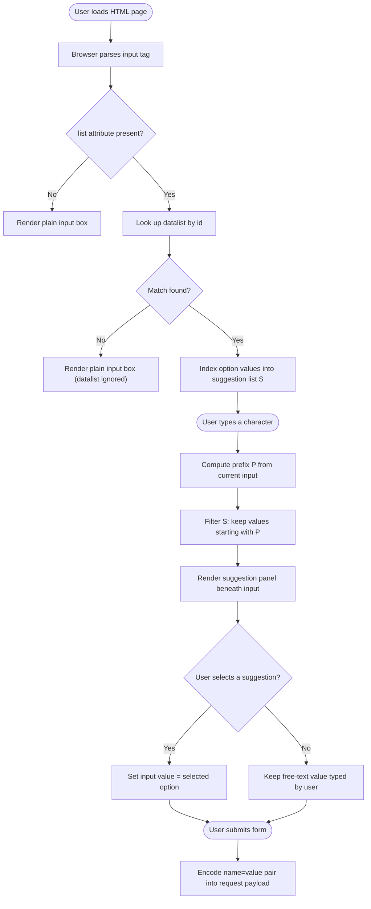
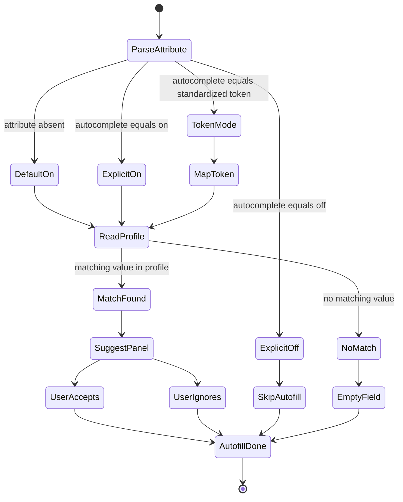
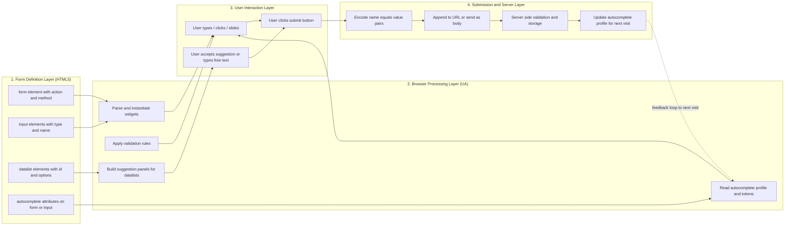
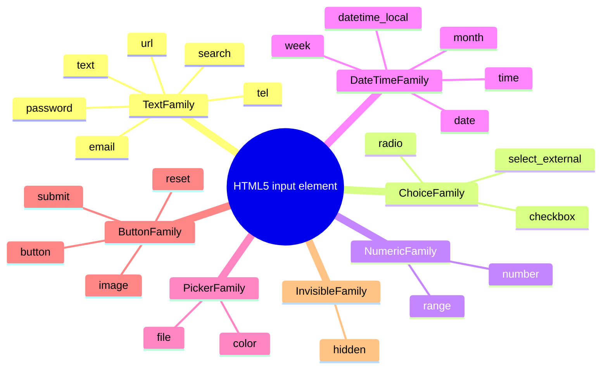

# Input and datalist Elements and autocomplete Attribute

<!-- SECTION_1_START -->

## Core Technical Definition & Intuitive Overview

### Formal Academic Definition

> [!IMPORTANT]
> **HTML5 `<input>` Element**: A void (self-closing) form-control element defined by the WHATWG HTML Living Standard. It generates an interactive widget whose behaviour, validation, and data semantics are governed primarily by the `type` attribute. It is the most polymorphic element in HTML5, capable of rendering as text fields, checkboxes, radio buttons, sliders, color pickers, file pickers, and submit buttons.

> [!IMPORTANT]
> **HTML5 `<datalist>` Element**: A container element that holds a set of pre-authored `<option>` children representing *suggested* values for a paired `<input>`. The binding is achieved by setting the input's `list` attribute equal to the `id` of the `<datalist>`. The element implements a native *combobox-with-free-text* widget.

> [!IMPORTANT]
> **`autocomplete` Attribute**: An enumerated attribute (legal values: `"on"` and `"off"`) that may be applied to the `<form>` element or to any individual `<input>`. It instructs the User Agent (UA) whether to store the entered value and surface it as a prediction on subsequent visits. The attribute also accepts standardized *autofill tokens* (e.g., `name`, `email`, `cc-number`, `current-password`) that map to credential-manager categories.

### Conceptual Analogy / Intuition

**The Restaurant Order Pad Metaphor:**

1. **`<input>` is the Order Pad.**
   Imagine a waiter handing you a structured paper slip with labelled boxes — *Name*, *Phone*, *Main Course*, *Quantity*. Each box only accepts a specific *kind* of writing. The "Phone" box expects digits; the "Quantity" box might only allow numbers from 1 to 10. The shape of the box (single-line, scrollable, drop-down, slider) is determined by the box's *type label* (the `type` attribute).

2. **`<datalist>` is the Suggestion Chalkboard.**
   Above the order pad, the chef has written a chalkboard titled *"Today's Specials"*: *Paneer Butter Masala, Dal Makhani, Veg Biryani*. You are not *forced* to order from this list — you can type *"Hyderabadi Dum Biryani"* even though it is not on the board. But if your choice matches a Special, the board's option is offered to you the moment you begin typing. The chalkboard is the `<datalist>`; the order-pad box that reads from it is the `<input list="...">`.

3. **`autocomplete` is the Waiter's Memory.**
   Suppose you visited the same restaurant last Friday and ordered *Masala Dosa*. On this visit, when you reach the *Main Course* box, the waiter (the browser) whispers: *"Last time you had Masala Dosa. Want it again?"* You tap a suggestion chip, and the field is auto-filled. This is exactly the function of `autocomplete="on"`. Conversely, for your *Credit Card PIN* field, you do **not** want the waiter to remember — so you set `autocomplete="off"`.

> [!NOTE]
> **KTU 2024 Syllabus Highlight (Module 1 — Creating Web Pages using HTML5)**: Mastery of the `<input>` element's `type` attribute values, the `name`–`value` submission pair, the `<datalist>`–`<input>` binding via the `list` attribute, and the security/usability trade-offs of the `autocomplete` attribute are *high-frequency* topics in KTU End-Semester Examinations.

> [!WARNING]
> **Common Misconception #1**: `<datalist>` is *not* a drop-down menu. Unlike `<select>`, the user is **not restricted** to the listed values. A `<datalist>` provides *suggestions* only.
>
> **Common Misconception #2**: Setting `autocomplete="off"` on a form does *not* always prevent browsers from auto-filling. Some browsers (Chrome, Edge) may ignore it for fields they recognize as login fields, and developers must additionally use the standardized tokens `autocomplete="new-password"` to suppress credential prompts.

### Standard Reference Values (Bold-Faced for Recall)

- **Default `type`** of `<input>` is **"text"**.
- **Default `autocomplete`** at the document level is **"on"** unless overridden.
- **The binding identifier** for `<datalist>` is the **id attribute**, referenced by the input's **list attribute**.
- **The standardized `autocomplete` token count** as of the WHATWG HTML Living Standard is **40+ tokens**, including `name`, `honorific-prefix`, `given-name`, `family-name`, `email`, `organization`, `street-address`, `postal-code`, `country`, `cc-name`, `cc-number`, `cc-exp`, `username`, `current-password`, `new-password`, and `bday`.

> [!VISUALIZATION CONTROL]
> **Concept:** Live preview of a `<datalist>`-bound `<input>` widget.
> **GeoGebra / Desmos Input:** *(Not applicable — this is a UI widget, not a graph.)*
> **Visual Description:** Picture a rectangular text box. As the user types the letter **"C"**, a floating panel emerges directly beneath the box showing the suggestions **Chrome, Chromium, Canary, C++** from a hidden `<datalist id="browsers">`. The user may ignore the panel and type **"Camunda"** — the form still accepts it on submission.

<!-- SECTION_1_END -->

<!-- SECTION_2_START -->

## Deep Theoretical Analysis & KTU High-Yield Formula Sheet

### Operational Breakdown of the `<input>` Element

The `<input>` element is a *void* element — it has no closing tag and no children. Its behaviour is fully determined by a constellation of attributes, the most important of which is `type`. The lifecycle of an input control during form submission is governed by the following logical chain:

1. **Widget Instantiation**: The browser parses the `<input>` tag and instantiates a native widget matching the `type`. For example, `<input type="range" min="0" max="100">` produces a horizontal slider.
2. **User Interaction**: The user manipulates the widget (typing, ticking, sliding, picking a date). The widget maintains an internal *current value*.
3. **Pre-Submission Validation**: If the `required`, `pattern`, `min`, `max`, `minlength`, `maxlength`, or `type`-specific constraints (e.g., email format) are violated, the browser blocks submission and surfaces a validation message.
4. **Submission Encoding**: On form submission, the browser constructs a name-value pair: the `name` attribute is the key; the `current value` is the value. Inputs without a `name` attribute are *silently excluded* from the submission payload.
5. **Re-Population via `autocomplete`**: On future visits, if `autocomplete="on"` (default) and the browser has stored historical values, the UA may pre-populate the field with a suggested value before the user even clicks.

### Operational Breakdown of the `<datalist>` Element

1. **Container Construction**: The `<datalist>` element contains a sequence of `<option>` children, each with a `value` (and optionally a `label` and `disabled` flag).
2. **Binding via `list` Attribute**: The companion `<input>` declares `list="myListId"`, where `"myListId"` is the `id` of the `<datalist>`.
3. **Suggestion Surfacing**: As the user types, the browser filters the `<option>` values whose text starts with the typed prefix and shows them in a drop-down panel attached to the input.
4. **Free-Text Acceptance**: The user is not restricted — any text may be entered, and the original `<datalist>` values remain mere suggestions.
5. **Form Submission**: The submitted value is the *current* value of the input, regardless of whether it came from a suggestion or free-typed text.

### Operational Breakdown of the `autocomplete` Attribute

1. **Scope Inheritance**: When set on a `<form>`, all descendant inputs inherit the value unless explicitly overridden.
2. **Enumeration**: Legal values are `"on"` and `"off"`. Absence of the attribute is treated as `"on"`.
3. **Standardized Tokens**: The attribute may also carry *autofill detail tokens* from the WHATWG spec, e.g., `autocomplete="section-shipping street-address"`. These help the browser categorize the field for password managers and address autofill.
4. **Security Tokens**: For password-change fields, use `autocomplete="new-password"` to *prevent* the browser from suggesting the user's existing password.
5. **Cross-Browser Reality**: Modern browsers (Chrome 70+, Firefox 50+, Safari 14+) respect the standardized tokens strictly; older browsers may ignore them.

### KTU High-Yield Formula Sheet (Cheat Sheet)

> [!IMPORTANT]
> **Submission Rule**: A form-control contributes to the submission payload **if and only if** it has a `name` attribute. The submitted pair is `(name, value)`. The HTTP `GET` request URL becomes `?name1=value1\&name2=value2`.

| \# | Concept | Syntax Pattern | Behaviour / Outcome | Default |
| :-- | :-- | :-- | :-- | :-- |
| 1 | Plain text input | `<input type="text" name="uname">` | Single-line free text field | `type="text"` is the implicit default |
| 2 | Password input | `<input type="password" name="pwd">` | Masks entered characters as bullets/dots | — |
| 3 | Submit button | `<input type="submit" value="Send">` | Triggers form submission | `value` is the button's caption |
| 4 | Reset button | `<input type="reset" value="Clear">` | Resets all form fields to defaults | — |
| 5 | Checkbox | `<input type="checkbox" name="hobby" value="cricket">` | Independent toggle; multiple allowed | `checked` attribute toggles initial state |
| 6 | Radio button | `<input type="radio" name="gen" value="M">` | Mutually exclusive within a `name` group | — |
| 7 | Number input | `<input type="number" min="1" max="10" step="1">` | Spinner widget; validates numeric range | — |
| 8 | Range slider | `<input type="range" min="0" max="100" value="50">` | Horizontal slider; value submitted | — |
| 9 | Date picker | `<input type="date" min="2024-01-01">` | Native calendar widget (YYYY-MM-DD) | — |
| 10 | Email input | `<input type="email" required>` | Validates basic email pattern | — |
| 11 | URL input | `<input type="url">` | Validates URL pattern | — |
| 12 | Tel input | `<input type="tel" pattern="[0-9]{10}">` | Optimised for mobile dial-pad | No built-in validation |
| 13 | Color picker | `<input type="color" value="#ff0000">` | Native color wheel; submits hex code | Default colour is **#000000** |
| 14 | File picker | `<input type="file" accept="image/*" multiple>` | Opens OS file-selection dialog | — |
| 15 | Hidden input | `<input type="hidden" name="csrf" value="x9...">` | Invisible; carries data on submit | — |
| 16 | Search input | `<input type="search" name="q">` | Single-line with native clear "X" button | — |
| 17 | Image button | `<input type="image" src="go.png" alt="Submit">` | Image as submit button; submits x,y coords | — |
| 18 | Month / Week / Time | `type="month"` $\vert$ `type="week"` $\vert$ `type="time"` | Specialized date/time pickers | — |
| 19 | Datalist binding | `<input list="browsers">` + `<datalist id="browsers"><option value="Chrome">` | Suggests predefined values; free-text still allowed | — |
| 20 | Autocomplete ON | `<input name="email" autocomplete="on">` | Browser offers previously stored values | Default |
| 21 | Autocomplete OFF | `<input name="otp" autocomplete="off">` | Browser refrains from storing/suggesting | — |
| 22 | Autofill token | `<input autocomplete="section-billing street-address">` | Categorizes field for password/address managers | — |
| 23 | New-password token | `<input type="password" autocomplete="new-password">` | Suppresses suggestion of existing password | — |
| 24 | Current-password token | `<input type="password" autocomplete="current-password">` | Allows password manager to fill stored password | — |
| 25 | Required validation | `<input required>` | Browser blocks empty submission | — |
| 26 | Pattern (regex) | `<input pattern="[A-Z]{3}[0-9]{4}">` | Validates value against a regular expression | — |
| 27 | Read-only | `<input readonly value="fixed">` | User cannot edit; value still submitted | — |
| 28 | Disabled | `<input disabled>` | Greyed out; value **not submitted** | — |
| 29 | Placeholder | `<input placeholder="Enter name">` | Hint text shown when field is empty | — |
| 30 | Autofocus | `<input autofocus>` | Field receives keyboard focus on page load | — |

### Real-World Engineering Utility

- **E-commerce search bars** (Amazon, Flipkart): Use `<datalist>` to suggest popular categories while still allowing free-text search.
- **Login forms** (Gmail, banking portals): Use `autocomplete="username"` and `autocomplete="current-password"` to enable password-manager integration — a critical accessibility feature.
- **Sign-up password fields**: Use `autocomplete="new-password"` to *prevent* browsers from auto-filling the user's *existing* password during registration.
- **Address forms** (checkout pages): Use the standardized tokens `autocomplete="shipping street-address"`, `autocomplete="shipping postal-code"` etc., to allow Chrome/Edge to autofill addresses from the user's saved profiles.
- **Booking portals**: Use `<input type="date" min="...">` to prevent users from selecting past dates — server-side validation is still required, but the client-side UX is dramatically improved.
- **Admin dashboards**: Use hidden inputs to embed CSRF tokens that travel invisibly with every form POST.

<!-- SECTION_2_END -->

<!-- SECTION_3_START -->

## Step-by-Step Derivations, Code Implementations & Symbolic Walk-Throughs

### Worked Example 1 — Full Form with `datalist` and `autocomplete`

> [!NOTE]
> **Pedagogical Objective**: Build a complete, browser-runnable HTML5 snippet that demonstrates (a) at least 8 input `type` values, (b) a `<datalist>`-bound `<input>`, and (c) explicit `autocomplete` tokens. Read it line by line; each comment is a teaching point.

```html
<!DOCTYPE html>
<html lang="en">
<head>
    <meta charset="UTF-8">
    <title>KTU Web Programming - Form Demo</title>
</head>
<body>
    <form action="/register" method="post" autocomplete="on">

        <!-- (1) Text input with autofill token for the user's given name -->
        <label for="fname">First Name:</label>
        <input type="text"
               id="fname"
               name="firstName"
               placeholder="e.g. Anjali"
               autocomplete="given-name"
               required>
        <br><br>

        <!-- (2) Email input with email-pattern validation -->
        <label for="em">Email:</label>
        <input type="email"
               id="em"
               name="email"
               placeholder="you@example.com"
               autocomplete="email"
               required>
        <br><br>

        <!-- (3) Password input using 'new-password' token -->
        <label for="pwd">Choose Password:</label>
        <input type="password"
               id="pwd"
               name="password"
               minlength="8"
               autocomplete="new-password"
               required>
        <br><br>

        <!-- (4) Datalist-bound input: suggestions are suggestions ONLY -->
        <label for="city">City:</label>
        <input type="text"
               id="city"
               name="city"
               list="cityList"
               placeholder="Start typing..."
               autocomplete="address-level2">

        <datalist id="cityList">
            <option value="Thiruvananthapuram">
            <option value="Kochi">
            <option value="Kozhikode">
            <option value="Thrissur">
            <option value="Kannur">
        </datalist>
        <br><br>

        <!-- (5) Number input with range constraints -->
        <label for="age">Age:</label>
        <input type="number"
               id="age"
               name="age"
               min="18"
               max="60"
               step="1"
               value="21">
        <br><br>

        <!-- (6) Range slider -->
        <label for="vol">Volume:</label>
        <input type="range"
               id="vol"
               name="volume"
               min="0"
               max="100"
               value="50">
        <br><br>

        <!-- (7) Date picker with minimum date constraint -->
        <label for="dob">Date of Birth:</label>
        <input type="date"
               id="dob"
               name="dob"
               min="1960-01-01"
               max="2010-12-31"
               autocomplete="bday">
        <br><br>

        <!-- (8) Color picker -->
        <label for="fav">Favourite Colour:</label>
        <input type="color"
               id="fav"
               name="favColor"
               value="#0066cc">
        <br><br>

        <!-- (9) Radio buttons: mutually exclusive within name="gender" -->
        <fieldset>
            <legend>Gender:</legend>
            <input type="radio" id="g1" name="gender" value="male">
            <label for="g1">Male</label>
            <input type="radio" id="g2" name="gender" value="female">
            <label for="g2">Female</label>
            <input type="radio" id="g3" name="gender" value="other">
            <label for="g3">Other</label>
        </fieldset>
        <br>

        <!-- (10) Checkboxes: multiple selections allowed -->
        <fieldset>
            <legend>Skills (choose any):</legend>
            <input type="checkbox" id="s1" name="skills" value="HTML">
            <label for="s1">HTML</label>
            <input type="checkbox" id="s2" name="skills" value="CSS">
            <label for="s2">CSS</label>
            <input type="checkbox" id="s3" name="skills" value="JS">
            <label for="s3">JavaScript</label>
        </fieldset>
        <br>

        <!-- (11) File picker restricted to images -->
        <label for="resume">Upload Photo:</label>
        <input type="file"
               id="resume"
               name="photo"
               accept="image/png, image/jpeg">
        <br><br>

        <!-- (12) Hidden field for CSRF token -->
        <input type="hidden" name="csrf" value="a1b2c3d4e5">

        <!-- (13) Submit and reset buttons -->
        <input type="submit" value="Register">
        <input type="reset"  value="Clear">

    </form>
</body>
</html>
```

**Line-by-Line Justification of Critical Bindings:**

- **Line 18** – `autocomplete="given-name"` is a standardized WHATWG token. Browsers and password managers map it to the *Given Name* field in the user's profile.
- **Line 32** – `autocomplete="new-password"` is the *only* correct way to prevent the browser from suggesting the user's existing password on a registration form.
- **Line 47** – `list="cityList"` binds the input to the `<datalist id="cityList">` declared 5 lines later. The *id* and the *list* value must be **byte-for-byte identical**.
- **Line 57** – `min="18" max="60" step="1"` defines the legal numeric range. The browser's spinner widget will not allow values outside it.
- **Line 87** – The `name="gender"` group means all three radio buttons are mutually exclusive; selecting one auto-deselects the others.
- **Line 102** – The `name="skills"` group means multiple checkboxes may be checked; all selected values are submitted in array form (`skills=HTML&skills=CSS`).
- **Line 117** – `type="hidden"` is invisible but travels with the form, carrying server-required tokens.

### Worked Example 2 — Pure `<datalist>` Minimal Pair

```html
<!-- Bare-minimum datalist demonstration -->
<label for="ide">Choose your IDE:</label>
<input type="text" id="ide" name="ide" list="ide-list">

<datalist id="ide-list">
    <option value="VS Code">
    <option value="IntelliJ IDEA">
    <option value="PyCharm">
    <option value="Eclipse">
    <option value="Sublime Text">
</datalist>
```

**Step-by-Step Logical Derivation of the Binding Mechanism:**

1. The browser parses the `<input>` tag and notes the attribute `list="ide-list"`.
2. The browser scans the document for an element whose `id` attribute equals `"ide-list"`.
3. Upon finding the matching `<datalist>`, the browser indexes the `value` attributes of all `<option>` children: `["VS Code", "IntelliJ IDEA", "PyCharm", "Eclipse", "Sublime Text"]`.
4. The browser attaches a *suggestion panel* to the input. As the user types, the panel filters values whose prefix matches.
5. If the user types `"P"`, the panel shows *PyCharm*. If the user types `"PyCharm Pro"` (a value *not* in the datalist), the form still accepts it — the datalist does not constrain input.
6. On form submission, the `name="ide"` and the entered value are encoded into the request payload as `ide=<user-entered-value>`.

### Worked Example 3 — `autocomplete` Off and Security Tokens

```html
<!-- Credit card CVV: should NEVER be auto-filled -->
<input type="text"
       name="cvv"
       autocomplete="off"
       inputmode="numeric"
       maxlength="3"
       pattern="[0-9]{3}"
       required>

<!-- OTP field: must reset on every visit -->
<input type="text"
       name="otp"
       autocomplete="off"
       maxlength="6"
       pattern="[0-9]{6}">

<!-- Login form: explicitly ENABLE password manager integration -->
<form action="/login" method="post" autocomplete="on">
    <input type="email"    name="email"    autocomplete="username">
    <input type="password" name="password" autocomplete="current-password">
    <button type="submit">Sign In</button>
</form>
```

**Symbolic Walk-Through of Autofill Tokens:**

The HTML Living Standard defines a *section name* prefix that can be combined with an *address kind* suffix, separated by a space. The full grammar is:

$$
\text{autocomplete} \;=\; \text{optional-section} \; \text{space} \; \text{address-kind-or-token}
$$

Where `optional-section` follows the form `section-<identifier>` and `address-kind-or-token` is one of the 40+ standardized tokens. For example:

- `autocomplete="section-shipping street-address"` → the street address within the *shipping* section of a multi-section form.
- `autocomplete="section-billing cc-number"` → the credit-card number within the *billing* section.
- `autocomplete="home email"` → the user's home email address.

The browser uses these tokens to (a) decide *what* to suggest, (b) decide *which* saved profile to use, and (c) prevent cross-section leakage between shipping and billing addresses.

### Worked Example 4 — Algorithmic Pseudocode for Form Submission Encoding

Although the browser performs this automatically, the symbolic derivation is as follows. Let $F$ denote a form, and let $I = \{i_1, i_2, \dots, i_n\}$ be the set of enabled, named input controls within $F$. The submission payload $P$ is:

$$
P \;=\; \bigoplus_{k=1}^{n} \; \text{encode}(\text{name}(i_k),\; \text{value}(i_k))
$$

Where:

- $\oplus$ is the URL-encoded `&` separator for `application/x-www-form-urlencoded` encoding.
- $\text{encode}(n, v)$ applies `encodeURIComponent` to both $n$ and $v$ and joins them with `=`.

For a `GET` request, $P$ is appended to the `action` URL preceded by `?`. For a `POST` request, $P$ is sent as the request body with the appropriate `Content-Type` header.

**Concrete Derivation for Worked Example 1 (assuming the user filled "Anjali", "anjali@ktu.in", "Kochi", age=21, volume=50, dob=1990-05-15, color=#0066cc, gender=Female, skills=HTML+CSS, photo=photo.png, csrf=a1b2c3d4e5):**

$$
\begin{aligned}
P \;=\; & \text{firstName}=\text{Anjali} \\
& \,\&\, \text{email}=\text{anjali\%40ktu.in} \\
& \,\&\, \text{password}=\text{[REDACTED]} \\
& \,\&\, \text{city}=\text{Kochi} \\
& \,\&\, \text{age}=21 \\
& \,\&\, \text{volume}=50 \\
& \,\&\, \text{dob}=1990\text{-}05\text{-}15 \\
& \,\&\, \text{favColor}=\%23\text{0066cc} \\
& \,\&\, \text{gender}=\text{female} \\
& \,\&\, \text{skills}=\text{HTML} \\
& \,\&\, \text{skills}=\text{CSS} \\
& \,\&\, \text{csrf}=\text{a1b2c3d4e5}
\end{aligned}
$$

Note that `skills=HTML` and `skills=CSS` both appear because checkboxes share the same `name`, and the array-like encoding convention duplicates the key. Also note that the password value is intentionally not shown here — it is `URL-encoded` in transit but never logged in plain text in a production system.

### Worked Example 5 — Python Snippet Simulating `<datalist>` Filtering (Algorithmic Companion)

```python
from typing import List, Dict


def filter_datalist(
    datalist: Dict[str, List[str]],
    target_id: str,
    user_input: str
) -> List[str]:
    """
    Simulates the browser's <datalist> filtering algorithm.

    Parameters
    ----------
    datalist : Dict[str, List[str]]
        Mapping of datalist id -> list of option values.
    target_id : str
        The id of the <datalist> referenced by the input's list attribute.
    user_input : str
        The text the user has typed so far.

    Returns
    -------
    List[str]
        The list of suggestions whose lowercase value starts with the
        lowercase user input. The full list is returned when input is empty.
    """
    if target_id not in datalist:
        raise KeyError(f"Datalist id '{target_id}' not found in document.")

    options: List[str] = datalist[target_id]

    if not user_input:
        return list(options)

    prefix: str = user_input.strip().lower()
    return [opt for opt in options if opt.lower().startswith(prefix)]


# --- Demonstration ----------------------------------------------------------
cities: Dict[str, List[str]] = {
    "cityList": [
        "Thiruvananthapuram",
        "Kochi",
        "Kozhikode",
        "Thrissur",
        "Kannur",
    ]
}

print(filter_datalist(cities, "cityList", "K"))
# Output: ['Kochi', 'Kozhikode', 'Kannur']

print(filter_datalist(cities, "cityList", "ko"))
# Output: ['Kochi', 'Kozhikode']

print(filter_datalist(cities, "cityList", ""))
# Output: ['Thiruvananthapuram', 'Kochi', 'Kozhikode', 'Thrissur', 'Kannur']

print(filter_datalist(cities, "cityList", "Trivandrum"))
# Output: []  -- but the form would still accept "Trivandrum" on submit!
```

**Symbolic Walk-Through of the Filter Algorithm:**

Let $D = \{d_1, d_2, \dots, d_m\}$ be the set of option values in the datalist, and let $u$ be the user input. The filtered suggestion set $S$ is:

$$
S(u) \;=\; \{ d_i \in D \; : \; \text{lowercase}(d_i).\,\text{startsWith}(\text{lowercase}(u)) \}
$$

The *submitted* value $v_{\text{submit}}$, however, is:

$$
v_{\text{submit}} \;=\; u \quad \text{(the literal user input, regardless of whether } u \in D \text{)}
$$

This is the mathematical reason `<datalist>` is a *suggestion provider*, not a *constraint enforcer* — in set-theoretic terms, $u$ is unrestricted, and $S(u)$ is merely a UI aid.

<!-- SECTION_3_END -->

<!-- SECTION_4_START -->

## Structural Diagrams & Schematics

### Diagram 1 — `<datalist>`–`<input>` Binding Flow (Mermaid Flowchart)

> [!IMPORTANT]
> **Mermaid Safety Compliance**: All node IDs are alphanumeric+underscore prefixed with letters. All labels with multi-word text are double-quoted. No reserved keywords (`end`, `graph`, `subgraph`) are used as node IDs.



### Diagram 2 — `autocomplete` Token Resolution State Machine (Mermaid State Diagram)



### Diagram 3 — Block-Level Functional Architecture of an HTML5 Form Submission



### Diagram 4 — Input Type Categorization Matrix (Mermaid Mindmap)



<!-- SECTION_4_END -->

<!-- SECTION_5_START -->

## KTU 2024 Scheme Examination Question Bank & Topic Recap

### Part A — Short Answer Questions (2 × 3 = 6 Marks Total)

> [!NOTE]
> **Cognitive Levels:** Remember / Understand.
> **Each answer is sized to approximately 70–100 words, matching KTU 3-mark model answers.**

---

**Q1. `[KTU University Exam - July 2024]`** — *CO1, Remember*

**Differentiate between the HTML5 `<select>` element and the `<datalist>` element. In what scenario would you prefer one over the other?**

**Model Answer (3 Marks):**

| Feature | `<select>` | `<datalist>` |
| :-- | :-- | :-- |
| Restriction | User **must** choose from listed options | User **may** type any free text |
| Binding | N/A (self-contained) | Binds to `<input>` via the `list` attribute |
| UI shape | Always a drop-down | Suggestions appear as a filterable panel |
| Typical use | Limited choice set (country, state) | Large set with free-text fallback (city, tag) |

Prefer `<select>` when the value space is **enumerable and fixed** (e.g., choosing a blood group). Prefer `<datalist>` when the value space is **large or open-ended** but common values can be **suggested** (e.g., city name, programming language).

> **[Valuation Key]** *Defining both elements: 1 Mark.* *Tabular comparison: 1 Mark.* *Use-case preference with example: 1 Mark.*

---

**Q2. `[KTU University Exam - Dec 2023]`** — *CO1, Understand*

**Explain the role of the `autocomplete` attribute in HTML5. Why is `autocomplete="new-password"` recommended for registration forms, while `autocomplete="current-password"` is recommended for login forms?**

**Model Answer (3 Marks):**

The `autocomplete` attribute instructs the browser to **store and re-suggest** previously entered values. It accepts `"on"` / `"off"` or standardized WHATWG tokens.

- For **login forms**, `autocomplete="current-password"` *encourages* the browser to fill the user's stored password, **improving UX** and supporting password-manager integration.
- For **registration forms**, `autocomplete="new-password"` *tells* the browser that the user is creating a new credential. It **suppresses** the suggestion of existing passwords, prompting password managers to generate a strong new one.

Using the wrong token (e.g., leaving a registration password field as `autocomplete="on"`) causes the browser to suggest the user's *current* password — a security and UX anti-pattern.

> **[Valuation Key]** *Definition of attribute: 1 Mark.* *current-password explanation: 1 Mark.* *new-password explanation with security reason: 1 Mark.*

---

### Part B — Long Answer Questions (Module Internal Choice Pattern)

> [!NOTE]
> **Question Pattern (Strict KTU 2024 Compliance):** Each Part B question is worth 14 marks, divided into two sub-parts (a) 7 marks and (b) 7 marks, escalating across Bloom's cognitive levels.

---

#### Question A (14 Marks) — `[KTU University Exam - July 2024]` — *CO2, Apply / Analyse*

**(a)** Write a complete, valid HTML5 form for a *Student Registration* page that includes the following fields: **Full Name** (text), **Email** (email), **Date of Birth** (date with range 2000-01-01 to 2010-12-31), **Branch** (radio buttons: CSE, ECE, MECH, EEE), and **Programming Languages Known** (checkboxes: C, Java, Python, JavaScript). Apply appropriate `autocomplete` tokens to the Full Name and Email fields. **\[7 Marks\]**

**(b)** Augment the form from part (a) by adding a **City** field implemented as a `<datalist>`-bound `<input>`, providing at least 5 city options including 2 from Kerala. Add a **Volume Preference** slider ranging from 0 to 100 with a default of 75. Add a **Password** field with `autocomplete="new-password"`, `minlength="8"`, and a `pattern` requiring at least one uppercase letter, one digit, and a minimum length of 8. Finally, add a hidden field carrying a CSRF token with value `"csrf_ktu_2024"`. **\[7 Marks\]**

---

**Model Solution for Question A:**

**Part (a) — 7 Marks:**

```html
<form action="/register" method="post" autocomplete="on">
    <label for="fname">Full Name:</label>
    <input type="text"
           id="fname"
           name="fullName"
           placeholder="e.g. Anjali Ramesh"
           autocomplete="name"
           required>
    <br><br>

    <label for="em">Email:</label>
    <input type="email"
           id="em"
           name="email"
           placeholder="you@ktu.ac.in"
           autocomplete="email"
           required>
    <br><br>

    <label for="dob">Date of Birth:</label>
    <input type="date"
           id="dob"
           name="dob"
           min="2000-01-01"
           max="2010-12-31"
           autocomplete="bday"
           required>
    <br><br>

    <fieldset>
        <legend>Branch:</legend>
        <input type="radio" id="cse"  name="branch" value="CSE">
        <label for="cse">CSE</label>
        <input type="radio" id="ece"  name="branch" value="ECE">
        <label for="ece">ECE</label>
        <input type="radio" id="mech" name="branch" value="MECH">
        <label for="mech">MECH</label>
        <input type="radio" id="eee"  name="branch" value="EEE">
        <label for="eee">EEE</label>
    </fieldset>
    <br>

    <fieldset>
        <legend>Programming Languages Known:</legend>
        <input type="checkbox" id="c"  name="langs" value="C">
        <label for="c">C</label>
        <input type="checkbox" id="java" name="langs" value="Java">
        <label for="java">Java</label>
        <input type="checkbox" id="py"  name="langs" value="Python">
        <label for="py">Python</label>
        <input type="checkbox" id="js"  name="langs" value="JavaScript">
        <label for="js">JavaScript</label>
    </fieldset>
    <br>

    <input type="submit" value="Register">
</form>
```

> **[Valuation Key for Part (a)]** *Full Name with autocomplete="name" and required: 1 Mark.* *Email with type="email", autocomplete="email", required: 1 Mark.* *Date with min and max attributes: 1 Mark.* *Radio group with shared name="branch" and four options: 2 Marks.* *Checkbox group with shared name="langs" and four options: 2 Marks.*

**Part (b) — 7 Marks:**

```html
<!-- (1) Datalist-bound City field -->
<label for="city">City:</label>
<input type="text"
       id="city"
       name="city"
       list="cityList"
       placeholder="Start typing..."
       autocomplete="address-level2">

<datalist id="cityList">
    <option value="Thiruvananthapuram">  <!-- Kerala -->
    <option value="Kochi">                <!-- Kerala -->
    <option value="Bengaluru">
    <option value="Chennai">
    <option value="Hyderabad">
</datalist>
<br><br>

<!-- (2) Volume slider -->
<label for="vol">Volume Preference:</label>
<input type="range"
       id="vol"
       name="volume"
       min="0"
       max="100"
       value="75">
<br><br>

<!-- (3) Secure new-password field -->
<label for="pwd">Choose Password:</label>
<input type="password"
       id="pwd"
       name="password"
       minlength="8"
       pattern="(?=.*[A-Z])(?=.*[0-9]).{8,}"
       title="Minimum 8 characters with at least 1 uppercase letter and 1 digit"
       autocomplete="new-password"
       required>
<br><br>

<!-- (4) Hidden CSRF token -->
<input type="hidden" name="csrf_token" value="csrf_ktu_2024">

<input type="submit" value="Submit">
```

> **[Valuation Key for Part (b)]** *Datalist binding with 5 options including 2 Kerala cities: 2 Marks.* *Range slider with min=0, max=100, default value=75: 1 Mark.* *Password field with new-password token, minlength=8, pattern attribute: 3 Marks.* *Hidden CSRF field with correct name and value: 1 Mark.*

> [!WARNING]
> **KTU Examiner's Pitfall Alert #1:** Students commonly write `pattern="[A-Z][0-9]{8}"` instead of a *lookahead* pattern. A lookahead like `(?=.*[A-Z])` is required to enforce "at least one uppercase anywhere" without consuming characters. **Loses 1–2 marks** if the regex is logically wrong.
>
> **Pitfall Alert #2:** Writing the `<datalist>` *before* the `<input>` and forgetting that the binding is *id-based*, not position-based. **Loses 1 mark** if the student mistakenly assumes ordering matters.
>
> **Pitfall Alert #3:** Using `autocomplete="off"` on the password field instead of `autocomplete="new-password"`. The former is a *sledgehammer*; the latter is the *precise tool* — and examiners reward precision. **Loses 1 mark.**

---

#### Question B (14 Marks) — `[KTU University Exam - Dec 2023]` — *CO2, Apply / Analyse*

**(a)** List **any 8** different values of the `type` attribute of the HTML5 `<input>` element. For each, write a one-line description of its purpose and provide a realistic use-case from a web application. **\[7 Marks\]**

**(b)** Design a complete HTML5 form for a *Hotel Booking* page that demonstrates the use of (i) a `<datalist>` with at least 4 room-type options, (ii) a date-range pair (check-in and check-out) using `type="date"` with appropriate `min`/`max` attributes, (iii) a guest-count using `type="number"` with `min="1"` and `max="6"`, and (iv) a billing-email field that uses the standardized `autocomplete="email"` token. Add a submit button and a reset button. **\[7 Marks\]**

---

**Model Solution for Question B:**

**Part (a) — 7 Marks (1.25 marks per row, capped at 8 rows; 7 marks total):**

| \# | `type` value | Purpose | Use-Case |
| :--: | :-- | :-- | :-- |
| 1 | `text` | Single-line plain text | Username on a login form |
| 2 | `password` | Masked text input | Password field on a sign-in page |
| 3 | `email` | Validates basic email pattern | Newsletter subscription box |
| 4 | `number` | Numeric input with optional spinner | Quantity selector in a cart |
| 5 | `range` | Slider for approximate numeric value | Brightness or volume control |
| 6 | `date` | Calendar widget for YYYY-MM-DD | Date of birth on a passport form |
| 7 | `color` | Native color-wheel picker | Theme-customization panel |
| 8 | `checkbox` | Independent toggle for binary choice | "I agree to the Terms" checkbox |
| 9 | `radio` | Mutually exclusive choice within a group | Selecting a payment method |
| 10 | `file` | Opens OS file-selection dialog | Uploading a profile photo |
| 11 | `submit` | Triggers form submission | Final "Register" button |
| 12 | `hidden` | Invisible value transmitted on submit | CSRF token, session ID |

> **[Valuation Key for Part (a)]** *Any 8 rows × 0.875 marks each ≈ 7 marks.* *Each row must contain: type, purpose, and use-case. Omitting the use-case forfeits 0.5 of that row's marks.*

**Part (b) — 7 Marks:**

```html
<form action="/book" method="post" autocomplete="on">
    <h2>Hotel Booking</h2>

    <!-- (i) Datalist for room type -->
    <label for="room">Room Type:</label>
    <input type="text" id="room" name="roomType" list="roomList">
    <datalist id="roomList">
        <option value="Standard AC">
        <option value="Deluxe AC">
        <option value="Suite">
        <option value="Presidential Suite">
    </datalist>
    <br><br>

    <!-- (ii) Date-range pair -->
    <label for="ci">Check-in Date:</label>
    <input type="date"
           id="ci"
           name="checkin"
           min="2024-09-01"
           max="2025-12-31"
           required>
    <br><br>

    <label for="co">Check-out Date:</label>
    <input type="date"
           id="co"
           name="checkout"
           min="2024-09-02"
           max="2025-12-31"
           required>
    <br><br>

    <!-- (iii) Guest count -->
    <label for="gc">Number of Guests:</label>
    <input type="number"
           id="gc"
           name="guests"
           min="1"
           max="6"
           step="1"
           value="1"
           required>
    <br><br>

    <!-- (iv) Billing email with autofill token -->
    <label for="bil">Billing Email:</label>
    <input type="email"
           id="bil"
           name="billingEmail"
           placeholder="bill@example.com"
           autocomplete="email"
           required>
    <br><br>

    <!-- (v) Submit and reset -->
    <input type="submit" value="Book Now">
    <input type="reset"  value="Clear">
</form>
```

> **[Valuation Key for Part (b)]** *Datalist with id="roomList" and 4 options: 2 Marks.* *Two date inputs with min/max constraints and reasonable check-out ≥ check-in: 2 Marks.* *Number input with min=1, max=6, step=1, default=1: 1.5 Marks.* *Email with autocomplete="email" token: 1 Mark.* *Submit and reset buttons: 0.5 Mark.*

> [!WARNING]
> **KTU Examiner's Pitfall Alert (Question B):**
> 1. **Setting `min` of check-out *equal* to check-in's `min`** — students often set both to `2024-09-01`, which would allow zero-night stays. Correct logic: `check-out min = check-in min + 1 day`. **Loses 1 mark.**
> 2. **Forgetting `step="1"` on the guest-count** — without it, the spinner increments by 1 anyway, but examiners expect explicit declaration. **Loses 0.5 mark.**
> 3. **Writing the `<datalist>` *inside* the `<input>`** — a common HTML5 mistake. `<datalist>` is a *sibling* of `<input>`, not a child. **Loses 1 mark** and may flag the entire structure as invalid.

---

### Topic Recap & Important Things to Remember

> [!IMPORTANT]
> **Rapid-Revision Checklist for the KTU Module 1 Examination:**

- **`<input>` is a void element.** It has *no* closing tag and *no* children. All configuration is via attributes.
- **The `type` attribute is the master switch.** It dictates widget appearance, validation rules, and the keyboard layout on mobile devices.
- **The `name` attribute is the submission key.** Inputs without a `name` are silently dropped from the form payload. Memorize this — it is a *favourite* KTU trick question.
- **`<datalist>` is *not* `<select>`.** Datalist = suggestions allowed + free text accepted. Select = restricted to listed options.
- **Binding mechanism:** `<input list="myId">` references `<datalist id="myId">`. The two strings must be **identical**.
- **Default `autocomplete` is `"on"`.** It is the most-overlooked default in HTML5 forms.
- **Security token `new-password`** suppresses existing-password suggestions on registration forms.
- **Security token `current-password`** *enables* password-manager fill on login forms.
- **Standardized autofill tokens** include `name`, `email`, `tel`, `street-address`, `postal-code`, `country`, `cc-number`, `cc-exp`, `bday`, `username`, `current-password`, `new-password`, `organization-title`, `organization`.
- **The `min`/`max` attributes** are *advisory* on the client side; **server-side validation is mandatory** for any production system. The browser only enhances UX; it is not a security boundary.
- **The `pattern` attribute** uses JavaScript regular-expression syntax. Lookaheads `(...)` are valid and recommended for "at least one of X" conditions.
- **Disabled fields are NOT submitted; readonly fields ARE submitted.** This is a *classic* KTU 1-mark question.
- **Hidden inputs (`type="hidden"`)** are the standard mechanism for embedding CSRF tokens, session IDs, and step indicators in multi-page forms.
- **The `placeholder` attribute is a hint, not a label.** Always pair inputs with a `<label for="...">` for accessibility.
- **The `required` attribute** triggers the browser's native validation popup on empty submission. It does *not* validate the *content* — only the *presence*.
- **Checkbox groups share the same `name`** to send an array; **radio groups share the same `name`** to enforce mutual exclusivity.
- **Submission encoding for `GET` requests** appends `?name1=value1&name2=value2` to the action URL. For `POST` requests, the same string is sent in the body.
- **The standard `Content-Type` for form submissions** is `application/x-www-form-urlencoded`. For file uploads, the form must declare `enctype="multipart/form-data"`.
- **The `accept` attribute on `type="file"`** restricts the dialog to specific MIME types (e.g., `image/png, image/jpeg`). It is also *advisory* — server-side MIME sniffing is still required.
- **The `autofocus` attribute** places the keyboard cursor on the field automatically when the page loads. Use it sparingly — one per page.
- **The `maxlength` and `minlength` attributes** constrain the character count of text-type inputs. They apply to types `text`, `password`, `email`, `url`, `tel`, and `search`, but not to `<textarea>` (which has its own `maxlength`).
- **Cross-browser reality check:** `<datalist>` is supported in all modern browsers (Chrome 20+, Firefox 4+, Safari 12.1+, Edge 79+). For legacy IE support, a JavaScript polyfill is required.
- **The HTML Living Standard (WHATWG) is the authoritative source** — the W3C HTML5 Recommendation is now considered a frozen snapshot. Always cite "WHATWG HTML Living Standard" in theory answers.

<!-- SECTION_5_END -->
